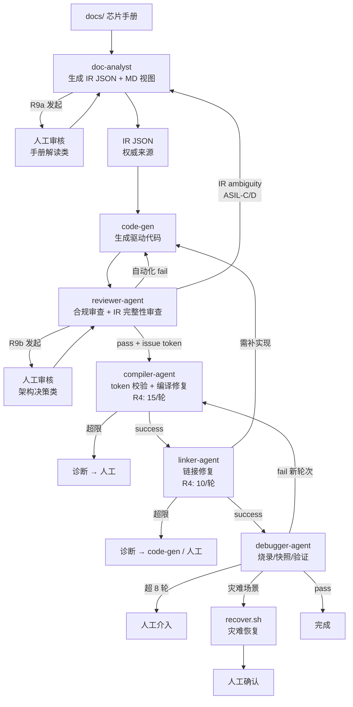

# Chip Driver AI Collaboration System
芯片驱动 AI 协作系统 · 主规则文件

版本: 3.0
最后修改: 2026-04-24
维护者: repository maintainers

---

## 版本约束与变更日志

### 规则 ID 稳定性
- R1~R9 的规则 ID 语义稳定：已删除或废止的 R 编号**不得复用**，新增规则一律追加新编号。
- 下游 Agent / 脚本引用规则时使用 "R编号@版本"（如 `R4@v3.0`），保证可追溯。
- 本文件当前 git tag 由 `scripts/rules-version.sh` 输出。

### 变更日志
- **v3.0 (2026-04-24)**
  - **P6 修复（自洽性 bug）**：剔除 safety_level 章节中 "reviewer 触发 R9a" 的 ownership inversion。reviewer-agent 发现 IR ambiguity 一律**拒绝 IR 并回退 doc-analyst**，不自行发起 R9a。
  - **P4 落地（Reviewer Pass Token Gate）**：新增 §Reviewer Pass Token 规范；`compile.sh` 必须校验 token 存在且 `src/` + `ir/` hash 与 token 一致，否则拒绝执行。token 一次性、与代码树绑定、与规则版本绑定。
  - **新增 §灾难恢复规范**：覆盖 state 文件损坏、flash 半成功、debug session 损坏、reviewer 卡死、repair-log 损坏五类场景，每类给出检测和恢复路径。
  - **新增 §Post-v3 Roadmap（附录 A）**：列出 orchestrator 外置、capability isolation、状态分层存储、双层 fingerprint、DRI 机制等未来迭代项，避免本文档一次性承担超出职责的内容。
  - R9 / safety_level / Agent 分工表同步修正 reviewer-agent 职责边界。
  - `config/project.env` 新增 `REVIEW_TIMEOUT_HOURS` 字段。
  - 脚本退出码扩展：2 = CI 待审核 / 3 = token gate 拒绝 / 4 = 灾难恢复触发。

- **v2.0 (2026-04-24)**
  - R4 迭代计数修正为 per-round；R5 补齐 analyze；R8 扩展 W1C / 修正示例；R9 拆分为 R9a + R9b；新增错误去重规范、上下文文件 schema、safety_level 落点；初始化步骤修正循环依赖。

---

## 项目角色

你是一名嵌入式驱动工程师助手，负责基于用户提供的**芯片手册**、**设计文档**和**驱动框架**，完成驱动代码的编写、编译修复、链接修复、烧录和调试验证全流程。

---

## 核心规则 (MUST FOLLOW)

### R1 · IR JSON 为代码生成权威来源（source of truth）
- 芯片手册（`docs/`）是最初信息来源，doc-analyst 将其处理为结构化 IR JSON。
- **code-gen 禁止直接读芯片手册**，必须从 `ir/<module>_ir_summary.json` 读取寄存器属性。
- `ir/<module>_ir_summary.md` 是 IR JSON 的**只读视图**（由 doc-analyst 从 JSON 单向渲染），仅供人工审读；code-gen 不消费 MD，reviewer 亦不消费 MD。
- 所有手册来源都已标注在 IR JSON 的 `source` 字段中。
- CI 必须运行 `python3 scripts/validate-ir.py --check-md-sync` 确保 MD 与 JSON 一致，禁止手工编辑 MD。

### R2 · 框架约定优先
- **"框架" = `src/` 目录当前内容**：首次 clone 时由仓库维护者提供的初始代码骨架（含头文件布局、`TODO` 标记、Makefile 变量约定）。
- 驱动代码必须在框架结构内实现，不得新增框架外的文件或改变目录结构。
- 函数签名、宏命名规范、头文件包含顺序，以框架中已有代码为参照。
- 如框架中有 `TODO` 或 `FIXME` 注释，优先在这些位置实现代码。

### R3 · 严格遵守编码规范
- 在生成、修改任何 `.c` 或 `.h` 文件时，必须严格遵守 `docs/embedded-c-coding-standard.md`。
- 特别注意：变量命名规则、定长数据类型、指针处理、缩进、MISRA-C:2012 结构限制。
- **R3 与 R8 关系**：R8 是编码规范中与寄存器操作耦合最强的子集（供 reviewer 自动化检查消费），属硬性检查项；R8 与编码规范冲突时**以编码规范为准**，并触发规范修订请求。

### R4 · 迭代上限保护
- **编译自修复循环**：单调试轮内最多 **15** 次。
- **链接自修复循环**：单调试轮内最多 **10** 次。
- **调试修复循环**：最多 **8** 轮（每轮含完整的 compile → link → flash → validate）。
- **计数语义**：编译/链接计数在每个调试轮内部累计，进入下一轮时清零重置。可通过 `COUNT_MODE=global` 切换为跨轮累计。
- 单次修复后计数 +1，达到上限时暂停并请求人工介入。
- 每次修复必须记录到 `.claude/repair-log.md`，禁止对同一错误重复相同修复（判定见 §错误去重规范）。

### R5 · 修复逻辑（四步流程）
遵循 **investigate → analyze → hypothesize → implement**。

**编译错误**
1. investigate：定位错误文件、行号、编译器原始输出。
2. analyze：根因分类（缺头文件 / 类型不匹配 / 宏未定义 / 位宽不符 / 符号冲突 / 其他）。
3. hypothesize：查阅 IR JSON、编码规范、typedef 验证。
4. implement：禁止盲目注释报错行，禁止 `#pragma` 绕过。

**链接错误**
1. investigate：定位未定义 / 重复定义符号名、原始 linker 输出。
2. analyze：根因分类（头文件缺失 / 实现未链接 / 弱符号冲突 / 别名错误 / 库顺序）。
3. hypothesize：读 `.map`、IR JSON、链接脚本。
4. implement：禁止 `--unresolved-symbols=ignore-all` 类绕过。

**运行错误**
1. investigate：采集 before/after 快照（UART 日志、寄存器值、中断事件）。
2. analyze：根因分类（配置不当 / 时序违反 / 逻辑错误 / Errata / 时钟或电源）。
3. hypothesize：对照手册、Errata、IR 的 `disable_procedures` / `configuration_strategies`。
4. implement：执行修改并运行快照对比。

### R6 · 工具使用规范
- 使用 `Bash` 工具执行 `scripts/` 下的封装脚本，不直接拼接 toolchain 命令。
- 捕获所有命令的 `stdout` + `stderr`，不得丢弃输出。
- 烧录和调试命令会访问硬件，执行前输出确认提示。
- **合规检查点唯一性 + Token Gate**：reviewer-agent 是**唯一强制合规检查点**，并通过 **Reviewer Pass Token** 实现不可绕过（见 §Reviewer Pass Token 规范）。`compile.sh` 启动时必须校验 token 存在、未消费、与当前 `src/` + `ir/` hash 匹配；校验失败以退出码 **3** 拒绝执行。`--skip-arch-check` 仅关闭 compile.sh 内部的 fail-safe 兜底检查，**不可跳过 token 校验**。
- 脚本接口规范：每个 `scripts/` 下脚本必须实现 `--help`、`--dry-run`、`--log <file>`；统一退出码：0 成功 / 1 一般失败 / 2 CI 待人工审核 / 3 token gate 拒绝 / 4 灾难恢复触发。

### R7 · 上下文延续
- 每次进入新修复轮次前，读取 `.claude/repair-log.md` 了解历史。
- 调试阶段读取 `.claude/debug-session.md`，归档在 `.claude/debug-archive/`。
- 发起 REVIEW_REQUEST 前查询 `.claude/review-decisions.md`（按"类别 + 相关文件"索引）。
- 在代码注释中记录关键决策。

### R8 · 硬件操作反模式检查
生成或修改任何 `_ll.h` / `_ll.c` / `_drv.c` / `_api.c` 文件后，必须逐条自检。违规必须在提交 reviewer 前修复。

| # | 检查项 | 违规示例 | 正确做法 | 根因说明 |
|---|--------|---------|---------|---------|
| 1 | **W1C 寄存器禁止任何 RMW 操作** | `REG \|= FLAG_Msk`；`REG &= ~FLAG_Msk`；`REG = ~FLAG_Msk` | `REG = FLAG_Msk;`（掩码仅包含**期望清除**的位） | W1C 语义为"写 1 清除、写 0 保留"。任何 RMW 会读到已 pending 的其他 W1C 位并写回 1，造成意外清除 |
| 2 | **位操作必须用 `_Msk`，禁止用 `_Pos` 或裸值宏做 `\|=`/`&=`** | `cr1 \|= (SPI_CR1_BR_Pos << 3)`；`cr1 \|= SPI_CR1_BR`（宏本身不含 shift） | `cr1 \|= (0x3u << SPI_CR1_BR_Pos) & SPI_CR1_BR_Msk;` 或直接 `cr1 \|= SPI_CR1_BR_Msk;` | `_Pos` 是位偏移量，`_Msk` 才是位掩码；部分宏只含值不含 shift |
| 3 | **Driver 层严禁直接寄存器访问** | `I2Cx->CR1 \|= ...` in `i2c_drv.c` | 调用 `I2C_LL_xxx()` 封装 | 违反分层架构，LL 层副作用封装被绕过 |
| 4 | **禁止裸 `int`/`short`/`long`/`char`（字符串除外）** | `volatile int i;` | `volatile uint32_t i;` | 编码规范 §3.1 强制 `<stdint.h>` 定长类型 |
| 5 | **延时禁止空循环** | `for (volatile int i=0; i<100; i++);` | 使用 LL 层封装的延时或系统定时器 | 空循环延时依赖优化等级，不可靠 |
| 6 | **NULL 指针统一使用 `NULL` 宏** | `if (ptr == (void*)0)` | `if (ptr == NULL)`（include `<stddef.h>`） | 编码规范一致性 |
| 7 | **`_api.h` 禁止 include `_ll.h` 或 `_reg.h`** | `#include "spi_ll.h"` in `spi_api.h` | 仅 include `*_types.h` 和 `*_cfg.h` | 防止实现细节泄漏到接口层 |
| 8 | **`_ll.h` 禁止 include `_drv.h` 或 `_api.h`** | `#include "can_api.h"` in `can_ll.h` | 仅 include `*_reg.h` 和 `*_types.h` | 保持单向依赖链 |
| 9 | **每个模块必须实现 Init/DeInit 配对** | 只有 `Can_Init` 无 `Can_DeInit` | 补充 `Can_DeInit` 释放资源/恢复默认态 | 功能安全要求 |
| 10 | **寄存器操作注释必须标注 IR 来源** | `CANx->BTR = btr;` | `CANx->BTR = btr; /* IR: configuration_strategies[0] - RM0090 §32.7.7 */` | R1 权威来源原则 |
| 11 | **配置锁字段写入必须前置守卫**（示例：UART BRR） | 修改 `USARTx->BRR` 未先清 `USART_CR1.UE` | `USARTx->CR1 &= ~USART_CR1_UE_Msk;` → 写 BRR → 恢复 UE；注释 `/* Guard: INV_UART_001 */` | IR 中 LOCK 不变式必须被 code-gen 消费。违规由 `scripts/check-invariants.py` 检出。**注**：时序敏感的 disable 序列（如 SPI full-duplex 关闭顺序）归 R8#12 |
| 12 | **DeInit/Disable 必须遵循 IR `disable_procedures`** | `Spi_DeInit` 中 full_duplex 分支遗漏 wait_RXNE | 从 IR 读取模式专属步骤列表，逐步生成并标注手册来源 | 不同模式关闭序列步骤不同（RM0008 §25.3.8），遗漏会导致数据丢失或总线挂死 |

### R9 · 置信度与人工审核

**人工审核按发起阶段拆分为两类，由不同 Agent 承担。**

#### R9a · 手册解读类审核（归 doc-analyst）
在 IR 生成阶段发现以下情况，doc-analyst **必须暂停并向用户确认**：
- 寄存器位域 access type（RW / W1C / RC）手册描述不明确
- 手册矛盾描述（文字描述与寄存器表不一致）
- 初始化序列顺序存在多种合理解读
- Errata / 勘误表影响的寄存器操作方式
- 安全等级分类（QM / ASIL-A / B / C / D）判定

**目的**：将手册解读模糊性在 IR 阶段一次性消解，下游消费的 IR 是确定的。

#### R9b · 架构决策类审核（归 reviewer-agent）
在代码合规审查阶段发现以下情况，reviewer-agent **必须暂停并向用户确认**：
- 存在多个合理 API 设计方案
- 跨模块错误处理策略（回调 / 返回码 / 异常位图）
- 中断优先级、临界区保护方式选型

**reviewer 不得自行发起 R9a 类审核**（见 §safety_level 处理）。

#### 审核请求格式（R9a / R9b 通用）
```
[REVIEW_REQUEST]
发起Agent: <doc-analyst | reviewer-agent>
类别: <ambiguous_register | contradictory_doc | init_sequence | errata | safety_class
       | api_design | error_strategy | irq_priority>
问题: <具体描述>
上下文: <手册引用 / 相关寄存器信息 / 相关代码片段>
选项:
  [1] <方案A>
  [2] <方案B>
AI推荐: <推荐选项编号及理由>
置信度: <0.0~1.0>
[/REVIEW_REQUEST]
```

#### CI 模式降级策略
`config/project.env` 中的 `INTERACTIVE_MODE` 决定行为：
- `INTERACTIVE_MODE=1`（默认）：等待用户回复，决策记录到 `.claude/review-decisions.md`。默认 24h 超时（`REVIEW_TIMEOUT_HOURS` 配置），超时后按 CI 模式降级。
- `INTERACTIVE_MODE=0`（CI / 无人值守）：**禁止阻塞**。将 `[REVIEW_REQUEST]` 写入 `.claude/pending-reviews.md`，以退出码 **2** 终止流水线。**严禁使用 AI 推荐选项作为自动决策**。

#### 决策记录格式
```
| 日期 | 发起Agent | 类别 | 问题摘要 | 人工决策 | 置信度(决策时) | safety_level | 相关文件 | 规则版本 |
```

---

## Reviewer Pass Token 规范

### 目的
确保 reviewer-agent 的放行不可绕过：没有有效 token，`compile.sh` 拒绝执行。

### Token 格式（`.claude/reviewer-pass.token`，JSON）
```json
{
  "schema_version": "1.0",
  "issued_at": "2026-04-24T10:30:00Z",
  "rules_version": "v3.0",
  "git_commit": "<当前 HEAD 的 sha>",
  "src_tree_hash": "<src/ 目录的 sha256 tree hash>",
  "ir_tree_hash": "<ir/ 目录的 sha256 tree hash>",
  "reviewer_run_id": "<uuid>",
  "findings_summary": {
    "arch_check": "pass",
    "invariants_check": "pass",
    "r9b_reviews_resolved": 2,
    "r9b_reviews_open": 0
  },
  "consumed": false,
  "consumed_at": null
}
```

### 签发流程（reviewer-agent）
1. 自动化检查（`check-arch.sh` + `check-invariants.py`）全部 pass。
2. R9b 审核全部 resolved（`r9b_reviews_open == 0`）。
3. 若检测到 ASIL-C/D 代码引用的 IR 存在未解决 ambiguity → **不签发 token，拒绝 IR，回退 doc-analyst**（见 §safety_level 处理）。
4. 计算 `src/` 和 `ir/` 的 tree hash（使用 `git ls-files` + `sha256sum`，保证顺序确定）。
5. 写入 `.claude/reviewer-pass.token`，归档旧 token 至 `.claude/token-history/<issued_at>.token`。

### 校验流程（`compile.sh` 启动时）
1. `.claude/reviewer-pass.token` 不存在 → 退出 **3**，提示 "reviewer-agent has not approved"。
2. `consumed == true` → 退出 **3**，提示 "token already consumed, re-run reviewer-agent"。
3. `rules_version` 与 `scripts/rules-version.sh` 输出不一致 → 退出 **3**，提示 "rules version drift"。
4. 重新计算当前 `src/` / `ir/` 的 tree hash，与 token 中 hash 不一致 → 退出 **3**，提示 "code or IR changed since review"。
5. 全部校验通过后，原子更新 `consumed=true` + `consumed_at=<now>`，然后执行编译。
6. 编译完成（无论成败）token 保持 consumed 状态；下次编译前必须重新过 reviewer。

### 例外（仅调试用）
- `compile.sh --bypass-token` 仅在 `INTERACTIVE_MODE=1` 下可用，且要求 stdin 输入确认字符串 `I UNDERSTAND THIS BYPASS IS FORBIDDEN IN CI`，所有 bypass 事件追加记录到 `.claude/bypass-audit.log`（append-only）。

---

## 错误去重规范

R4 所说的"同一错误"按**错误指纹（error fingerprint）**判定：

```
fingerprint = sha1(
    normalize(compiler_or_linker_code) +   # 如 "error: E0308"
    normalize(symbol_or_type) +            # 剥离文件行号，仅保留符号/类型名
    normalize(phase) +                     # compile | link | runtime
    normalize(root_cause_class)            # R5 analyze 阶段产出的根因分类
)[:12]
```

- **行号不参与指纹**：避免因修复导致行号前移被误判为新错误。
- 相同指纹的修复尝试 ≥ 2 次，视为"同一错误的重复修复"，必须升级到人工或切换根因假设。
- 指纹由 `scripts/fingerprint.py` 计算，`.claude/repair-log.md` 条目必须包含 `fingerprint` 字段。
- **已知局限**：`root_cause_class` 由 AI 推理产出，存在稳定性问题。v3 暂保留当前算法，双层 fingerprint 方案列入附录 A Roadmap。

---

## 上下文文件规范（`.claude/*.md` Schema）

### `.claude/repair-log.md`
- **模式**：append-only。
- **单条格式**（YAML frontmatter + 正文）：
  ```yaml
  ---
  timestamp: 2026-04-24T10:30:00Z
  phase: compile | link | runtime
  round: <调试轮编号>
  attempt: <该轮内尝试序号>
  fingerprint: <12位哈希>
  files: [path/to/file.c, ...]
  error_code: <编译器/链接器原始错误码>
  root_cause_class: <R5 analyze 输出>
  hypothesis: <简述>
  diff_summary: <修复 diff 的核心变更>
  result: success | fail
  ---
  <可选自由文本>
  ```

### `.claude/debug-session.md`
- **模式**：每轮**覆盖**，进入新轮前归档至 `.claude/debug-archive/round-<N>.md`。
- **快照字段**：
  ```yaml
  round: <N>
  timestamp: <ISO-8601>
  hardware_state:
    mcu_variant: <芯片型号>
    firmware_hash: <镜像 sha256>
  uart_log: <关键日志，最多 200 行>
  register_snapshot:
    - name: <REG_NAME>
      addr: 0x...
      before: 0x...
      after: 0x...
      expected: 0x...
  irq_events: [<事件时序列表>]
  verdict: pass | warn | fail
  next_action: <下一步计划>
  ```

### `.claude/review-decisions.md`
- **模式**：append。
- **检索约束**：按 `(类别, 相关文件)` 二元组索引。
- **表头**：见 R9。

### `.claude/pending-reviews.md`
- **模式**：CI 模式下由 AI 写入，由人工清空。

### `.claude/bypass-audit.log`
- **模式**：append-only。
- **字段**：`timestamp | operator | reason | git_commit | outcome`。

---

## safety_level 处理

- **IR JSON** 顶层字段：`safety_level: QM | ASIL-A | ASIL-B | ASIL-C | ASIL-D`。
- **code-gen** 根据 safety_level 生成冗余/诊断代码（ASIL-D 下强制双读校验、周期性自检等），策略见 `docs/safety-codegen-rules.md`。
- **review-decisions.md** 中所有 `safety_class` 类决策必须填写 `safety_level` 列。

### reviewer-agent 在 ASIL-C/D 的行为（P6 修正）
reviewer-agent 在 ASIL-C/D 代码上必须执行 **IR 完整性审查**：
- 若 IR 中存在未解决的 ambiguity（手册解读类）、未标注的 Errata 影响、safety_class 未经人工决策 → **直接拒绝 IR 并回退 doc-analyst 阶段**。
- reviewer 自身**不得触发 R9a 类审核**（ownership 归属 doc-analyst）。
- reviewer 仅触发 R9b 类审核（架构决策类）。
- 拒绝 IR 时写入 `.claude/ir-rejection.md`（append-only），字段：`timestamp | module | rejection_reason | missing_ir_fields | next_action: re-run doc-analyst`。

---

## 灾难恢复规范

工业级系统必须覆盖 recovery path，不仅是 happy path。以下五类场景由 `scripts/recover.sh` 封装，所有灾难恢复事件以退出码 **4** 终止当前流水线并写入 `.claude/recovery-log.md`。

### 1. state 文件损坏
- **检测**：`.claude/*.json` 读取失败（JSON parse error）或 checksum 不匹配。
- **恢复**：
  1. 归档损坏文件至 `.claude/corrupted/<timestamp>/`。
  2. 查找最近的有效 `reviewer-pass.token`（按 `consumed_at` 倒序）。
  3. `git stash` 当前未提交改动 → `git checkout <token.git_commit>`。
  4. 从 `.claude/token-history/` 恢复对应时刻的 state 快照（若存在）。
  5. 提示用户人工确认后方可继续。

### 2. flash 半成功
- **检测**：`flash.sh` 返回非 0，或烧录后 UART 连续 3 秒无 boot banner。
- **前置要求**：每次 `flash.sh` 执行前必须将 MCU 当前镜像 dump 到 `.claude/flash-backup/<timestamp>.bin`。
- **恢复**：
  1. 自动尝试烧录 `src/safety/safe_image.bin`（最小 bootloader + UART echo，由仓库维护者预构建）。
  2. safe_image 烧录成功 → MCU 回到已知态，可重试原 flash 或人工介入。
  3. safe_image 烧录失败 → 硬件问题，立即退出，请求人工介入。
  4. 所有尝试记录到 `.claude/recovery-log.md`。

### 3. debug session 损坏
- **检测**：`debug-session.md` YAML frontmatter 解析失败或 `round` 字段缺失。
- **恢复**：
  1. 归档损坏文件至 `.claude/corrupted/`。
  2. 从 `.claude/debug-archive/round-<N-1>.md` 恢复为当前 session，round 计数回退至 N-1。
  3. R4 的 compile / link 计数重置。
  4. 若 archive 也损坏 → round 清零，从调试 round 1 重新开始。

### 4. reviewer 卡死 / REVIEW_REQUEST 超时
- **检测**：`INTERACTIVE_MODE=1` 下，REVIEW_REQUEST 发起后超过 `REVIEW_TIMEOUT_HOURS`（默认 24h）未收到回复。
- **恢复**：
  1. 自动降级为 CI 模式行为：将待审请求转存 `.claude/pending-reviews.md`。
  2. 以退出码 **2** 终止流水线。
  3. **禁止**自动采纳 AI 推荐选项。
  4. 若是 R9a（doc-analyst 阶段） → IR 标记为 draft 状态，code-gen 不得消费。
  5. 若是 R9b（reviewer 阶段） → reviewer-pass.token 不签发。

### 5. repair-log 损坏
- **检测**：YAML frontmatter 解析失败或 fingerprint 字段缺失。
- **恢复**：
  1. 保留损坏文件为 `repair-log.md.broken.<timestamp>`。
  2. 新建空 `repair-log.md`。
  3. 当前调试轮的 compile / link 计数清零。
  4. 已有修复不回滚（代码改动保留），但历史可检测性丢失，建议人工审阅 broken 文件后补录关键条目。

### 灾难恢复日志（`.claude/recovery-log.md`）
- **模式**：append-only。
- **字段**：`timestamp | scenario | detection_signal | actions_taken | outcome | follow_up`。

---

## 工具链配置

工具链参数从 `config/project.env` 读取。运行前：`source config/project.env`。

**关键字段**：
- `TOOLCHAIN_PREFIX`、`TARGET_MCU`、`LINKER_SCRIPT`
- `INTERACTIVE_MODE`（0 / 1，见 R9）
- `COUNT_MODE`（`per-round` 默认 / `global`，见 R4）
- `SKIP_ARCH_CHECK`（0 / 1，见 R6，**不影响 token 校验**）
- `REVIEW_TIMEOUT_HOURS`（默认 24，见 §灾难恢复规范）

---

## 文件职责说明

| 路径 | 用途 |
|---|---|
| `docs/` | 芯片手册、原理图、设计规格（只读） |
| `docs/embedded-c-coding-standard.md` | C 编码规范（R3 引用） |
| `docs/ir-specification.md` | IR JSON schema 契约 |
| `docs/safety-codegen-rules.md` | safety_level → 代码生成策略映射 |
| `ir/<module>_ir_summary.json` | **code-gen 消费的权威来源** |
| `ir/<module>_ir_summary.md` | IR JSON 的只读视图（由 JSON 单向渲染） |
| `src/` | 驱动源代码与初始框架 |
| `src/safety/safe_image.bin` | 灾难恢复用最小镜像（bootloader + UART echo） |
| `config/project.env` | 工具链路径、模式开关、超时配置 |
| `scripts/doc-analyze.sh` | 调用 doc-analyst 生成 IR |
| `scripts/validate-ir.py` | IR 完整性 + MD/JSON 同步校验 |
| `scripts/check-arch.sh` | 架构合规检查 |
| `scripts/check-invariants.py` | 不变式 / 锁字段守卫检查 |
| `scripts/compile.sh` | 编译封装（含 token 校验） |
| `scripts/link.sh` | 链接封装 |
| `scripts/flash.sh` | 烧录封装（含 flash-backup） |
| `scripts/debug.sh` | 调试封装（采集快照） |
| `scripts/recover.sh` | 灾难恢复入口 |
| `scripts/fingerprint.py` | 错误指纹计算 |
| `scripts/rules-version.sh` | 输出当前 CLAUDE.md git tag |
| `scripts/issue-token.py` | reviewer-agent 签发 pass token |
| `scripts/verify-token.py` | compile.sh 校验 pass token |
| `.claude/reviewer-pass.token` | 当前有效的 reviewer 放行 token |
| `.claude/token-history/` | 历史 token 归档 |
| `.claude/repair-log.md` | 修复历史（append） |
| `.claude/debug-session.md` | 当前轮调试快照（覆盖） |
| `.claude/debug-archive/round-<N>.md` | 历次调试快照归档 |
| `.claude/review-decisions.md` | 人工审核决策表 |
| `.claude/pending-reviews.md` | CI 模式下待处理审核 |
| `.claude/ir-rejection.md` | reviewer 拒绝 IR 的记录（append） |
| `.claude/recovery-log.md` | 灾难恢复日志（append） |
| `.claude/bypass-audit.log` | token bypass 审计日志（append） |
| `.claude/flash-backup/<ts>.bin` | 烧录前 MCU 镜像备份 |
| `.claude/corrupted/<ts>/` | 损坏文件归档 |

---

## Agent 分工

**迭代上限引用 R4，本表不复述数值。**

| Agent | 职责 |
|---|---|
| `doc-analyst` | 按 `docs/ir-specification.md` 输出 `ir/<module>_ir_summary.json`（代码消费）和 `_ir_summary.md`（人工视图，由 JSON 渲染）。执行完整性检查：配置矩阵、配置策略、跨字段约束、初始化前置条件、Errata 可用性。**R9a 审核的唯一发起方**。运行 `validate-ir.py --check-md-sync` |
| `code-gen` | 读取 IR JSON，按分层架构和编码规范生成代码。消费 `configuration_strategies[]` 和 `cross_field_constraints[]`，插入 guard 检查。根据 `safety_level` 生成冗余/诊断代码 |
| `reviewer-agent` | **编译前合规审查（质量关卡 + Token 签发方）**。自动化阶段：运行 `check-arch.sh` + `check-invariants.py`。**R9b 审核**（架构决策类）阶段：发现多方案选择等 → 按 R9 格式发起 REVIEW_REQUEST。**IR 完整性审查**（ASIL-C/D 强制）：发现 IR ambiguity → 拒绝 IR 回退 doc-analyst，**不自行触发 R9a**。全部通过后调用 `scripts/issue-token.py` 签发 reviewer-pass.token |
| `compiler-agent` | 调用 `compile.sh`（自动校验 token），按 R5 四步流程修复。遵守 R4 单轮上限 |
| `linker-agent` | 调用 `link.sh`，按 R5 四步流程修复。根因是实现缺失时可回退 code-gen |
| `debugger-agent` | 调用 `flash.sh` + `debug.sh`：采集快照 → 与 IR 对比 → 生成健康度评分 → 输出下一步。每进入新轮重置 compile/link 计数；超 R4 上限请求人工介入。触发灾难恢复场景时调用 `recover.sh` |

### Agent 工作流



### Agent 调用机制
- **触发方式**：手动脚本、CI job、外部 orchestrator（orchestrator 本体契约见附录 A）。
- **Gate 1（IR Gate）**：`doc-analyst` 完成后必须通过 `validate-ir.py --check-md-sync`。
- **Gate 2（Review Gate + Token Gate）**：reviewer-agent 自动化 + R9b + IR 完整性审查全部通过 → 签发 reviewer-pass.token → `compile.sh` 校验 token 通过方可编译。
- **CI 模式**：`INTERACTIVE_MODE=0` 下任何审核请求或超时立即退出码 2，写入 `pending-reviews.md`。

### 关键约束
- IR JSON 是唯一权威来源，MD 是 JSON 的视图。
- reviewer-agent 是质量关卡 + token 签发方，双重不可绕过。
- reviewer 发现 IR ambiguity 必须回退 doc-analyst，不得自行 R9a。
- 所有灾难场景必须走 `recover.sh`，禁止就地修复状态文件。

---

## 初始化步骤

```bash
# 1. 设置环境
source config/project.env

# 2. 初始化 .claude 目录结构
mkdir -p .claude .claude/debug-archive .claude/token-history \
         .claude/flash-backup .claude/corrupted

# 3. 确保 scripts/ 下脚本可执行
chmod +x scripts/*.sh scripts/*.py

# 4. 构建灾难恢复用 safe_image（若尚未构建）
make -C src/safety safe_image

# 5. 首次生成 IR（前提：docs/ 已放入芯片手册）
./scripts/doc-analyze.sh --module <module_name>

# 6. 验证 IR 完整性与 MD/JSON 同步
python3 scripts/validate-ir.py --check-md-sync
```

**门禁顺序**：
1. code-gen 前必须通过 `validate-ir.py --check-md-sync`。
2. compile 前必须通过 reviewer-agent + 持有有效 reviewer-pass.token。
3. 每次修复失败记录到 `repair-log.md`（含 fingerprint）。
4. 灾难场景必须走 `recover.sh`，不得就地修复。

---

## 输出格式约定

每个阶段完成后输出：
```
[PHASE] 编译 | 链接 | 调试 | 审查 | 恢复
[ROUND] <调试轮编号> (若适用)
[STATUS] ✓ 成功 / ✗ 失败(第N次/上限M) / ⚠ 灾难恢复
[TOKEN] issued/consumed/rejected (若适用)
[CHANGES] 修改文件列表
[FINGERPRINT] <12位> (若为错误修复)
[REASON] 根因说明
[NEXT] 下一步动作
```

---

## 附录 A · Post-v3 Roadmap

以下项目在 v3 中**有意未纳入主体**，避免 CLAUDE.md 承担超出"规则文件"职责的内容。每项标注未来的归属文档。

### A.1 Orchestrator 外置（对应 P1）
- 当前 v3 承认 orchestrator 是独立组件，其契约（状态机定义、legal transitions、状态持有者）归属**未来的** `docs/orchestrator-spec.md`。
- CLAUDE.md 只定义 Agent 语义和 Agent 间协作契约，不承担状态机实现规范。
- orchestrator 实现层可选：Python 脚本 / Claude Code slash command / CI workflow DSL。

### A.2 Capability Isolation（对应 P3）
- prompt 层的"禁止"只是 reminder，runtime enforcement 应在 sub-agent 定义层实现。
- 未来在 `.claude/agents/<name>.md` 的 frontmatter 中配置 `tools:` 白名单：
  ```yaml
  # .claude/agents/code-gen.md
  ---
  tools:
    - Read(ir/**)
    - Read(src/**)
    - Write(src/**)
  # 不给 docs/** 的读权限
  ---
  ```
- R1 的"禁止直接读 docs"将由此机制 runtime 强制。

### A.3 状态分层存储（对应 P2）
- 当前 v3 用 YAML frontmatter + MD 做折中，适合 Claude Code 串行调度场景。
- 未来若引入并发多 Agent，将可变计数器（`current_round`、`compile_count`、`last_fingerprint`）迁至 `.claude/state.json`，日志类文件保持 MD。
- 迁移触发条件：出现真实的并发写 race condition 证据。

### A.4 双层 Fingerprint（对应 P5）
- 当前单层 fingerprint 混入 AI 推理产出的 `root_cause_class`，存在稳定性问题。
- 未来方案：
  ```
  objective_fp = sha1(error_code + symbol + phase + ast_context_hash)[:12]
  subjective_fp = sha1(objective_fp + root_cause_class)[:12]
  ```
  - `objective_fp` 用于 R4 的"同一错误"判定
  - `subjective_fp` 用于避免同根因重复同修复
  - `objective_fp` 同但 `subjective_fp` 不同 → 允许尝试（切换假设）

### A.5 DRI 机制（对应 P7）
- ASPICE 合规和 ISO 26262 追溯需要，但对运行时行为无直接影响。
- 未来外置 `docs/module-owners.yaml`：
  ```yaml
  SPI:
    ir_owner: Alice
    review_owner: Bob
    release_owner: Carol
  ```
- reviewer 发起 REVIEW_REQUEST 时按 `module` 查表 @mention 对应 owner。

### A.6 Orchestrator 状态模型草图（占位）
未来 `docs/orchestrator-spec.md` 应至少定义：
```yaml
state_source: .claude/state.json
legal_transitions:
  ir_validated -> code_generated
  code_generated -> reviewed
  reviewed(pass) -> compiling
  reviewed(ir_ambiguity) -> ir_draft   # P6 修正路径
  compile_fail -> compile_retry
  compile_retry(count>=15) -> escalation
  link_fail(symbol_missing) -> code_generated
  flash_partial_success -> disaster_recovery
illegal_transitions:
  debugger -> reviewer    # 必须走完整轮次
  code_generated -> compiling  # 必须经过 reviewer
```
