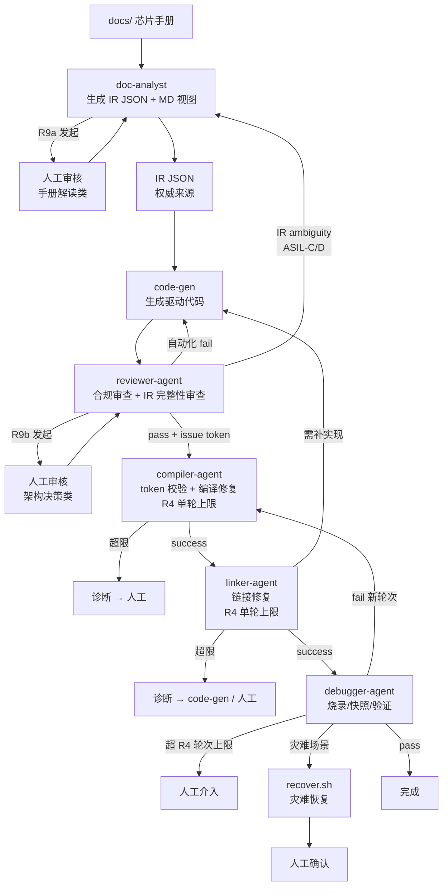

# Agent 工作流图

由 CLAUDE.md §Agent 分工 引用。Agent 职责、调用机制、关键约束见 CLAUDE.md 主体；本文件仅承载流程图。

```mermaid
flowchart TD
  docs[docs/ 芯片手册] --> docanalyst[doc-analyst<br/>生成 IR JSON + MD 视图]
  docanalyst -->|R9a 发起| review_a[人工审核<br/>手册解读类]
  review_a --> docanalyst
  docanalyst --> IRjson[IR JSON<br/>权威来源]
  IRjson --> codegen[code-gen<br/>生成驱动代码]
  codegen --> reviewer[reviewer-agent<br/>合规审查 + IR 完整性审查]
  reviewer -->|自动化 fail| codegen
  reviewer -->|R9b 发起| review_b[人工审核<br/>架构决策类]
  review_b --> reviewer
  reviewer -->|IR ambiguity<br/>ASIL-C/D| docanalyst
  reviewer -->|pass + issue token| compiler[compiler-agent<br/>token 校验 + 编译修复<br/>R4 单轮上限]
  compiler -->|超限| escalate_c[诊断 → 人工]
  compiler -->|success| linker[linker-agent<br/>链接修复<br/>R4 单轮上限]
  linker -->|超限| escalate_l[诊断 → code-gen / 人工]
  linker -->|需补实现| codegen
  linker -->|success| debugger[debugger-agent<br/>烧录/快照/验证]
  debugger -->|fail 新轮次| compiler
  debugger -->|超 R4 轮次上限| escalate_d[人工介入]
  debugger -->|灾难场景| recover[recover.sh<br/>灾难恢复]
  debugger -->|pass| done[完成]
  recover --> escalate_r[人工确认]
```
