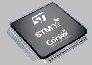
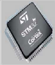
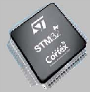

---\n<!-- page 1 -->\n

# RM0008 Reference manual

##### STM32F101xx, STM32F102xx, STM32F103xx, STM32F105xx and STM32F107xx advanced ARM-based 32-bit MCUs

###### Introduction

This reference manual targets application developers. It provides complete information on
how to use the STM32F101xx, STM32F102xx, STM32F103xx and
STM32F105xx/STM32F107xx microcontroller memory and peripherals. The STM32F101xx,
STM32F102xx, STM32F103xx and STM32F105xx/STM32F107xx will be referred to as
STM32F10xxx throughout the document, unless otherwise specified.

The STM32F10xxx is a family of microcontrollers with different memory sizes, packages and
peripherals.

For ordering information, mechanical and electrical device characteristics please refer to the
low-, medium-, high- and XL-density STM32F101xx and STM32F103xx datasheets, to the
low- and medium-density STM32F102xx datasheets and to the
STM32F105xx/STM32F107xx connectivity line datasheet.

For information on programming, erasing and protection of the internal Flash memory
please refer to:

- ● PM0075, the Flash programming manual for low-, medium- high-density and
connectivity line STM32F10xxx devices
- ● PM0068, the Flash programming manual for XL-density STM32F10xxx devices.

For information on the ARM Cortex™-M3 core, please refer to the STM32F10xxx Cortex™-
M3 programming manual (PM0056).

###### Related documents

Available from www.st.com:

- ■ STM32F101xx, STM32F102xx, STM32F103xx, STM32F105xx/STM32F107xx and
datasheets
- ■ STM32F10xxx Cortex™-M3 programming manual (PM0056)
- ■ STM32F10xxx Flash programming manual (PM0075)
- ■ STM32F10xxx XL-density Flash programming manual (PM0068)

October 2011 Doc ID 13902 Rev 14 1/1096

www.st.com

---\n<!-- page 2 -->\n

### Contents

- 1 Overview of the manual . . . . . . . . . . . . . . . . . . . . . . . . . . . . . . . . . . . . . 40
- 2 Documentation conventions . . . . . . . . . . . . . . . . . . . . . . . . . . . . . . . . . 46

- 2.1 List of abbreviations for registers . . . . . . . . . . . . . . . . . . . . . . . . . . . . . . . 46
- 2.2 Glossary . . . . . . . . . . . . . . . . . . . . . . . . . . . . . . . . . . . . . . . . . . . . . . . . . . 46
- 2.3 Peripheral availability . . . . . . . . . . . . . . . . . . . . . . . . . . . . . . . . . . . . . . . . 46

- 3 Memory and bus architecture . . . . . . . . . . . . . . . . . . . . . . . . . . . . . . . . 47

- 3.1 System architecture . . . . . . . . . . . . . . . . . . . . . . . . . . . . . . . . . . . . . . . . . 47
- 3.2 Memory organization . . . . . . . . . . . . . . . . . . . . . . . . . . . . . . . . . . . . . . . . 49
- 3.3 Memory map . . . . . . . . . . . . . . . . . . . . . . . . . . . . . . . . . . . . . . . . . . . . . . 50

- 3.3.1 Embedded SRAM . . . . . . . . . . . . . . . . . . . . . . . . . . . . . . . . . . . . . . . . . 53
- 3.3.2 Bit banding . . . . . . . . . . . . . . . . . . . . . . . . . . . . . . . . . . . . . . . . . . . . . . . 53
- 3.3.3 Embedded Flash memory . . . . . . . . . . . . . . . . . . . . . . . . . . . . . . . . . . . 54

- 3.4 Boot configuration . . . . . . . . . . . . . . . . . . . . . . . . . . . . . . . . . . . . . . . . . . 60

- 4 CRC calculation unit . . . . . . . . . . . . . . . . . . . . . . . . . . . . . . . . . . . . . . . . 62

- 4.1 CRC introduction . . . . . . . . . . . . . . . . . . . . . . . . . . . . . . . . . . . . . . . . . . . 62
- 4.2 CRC main features . . . . . . . . . . . . . . . . . . . . . . . . . . . . . . . . . . . . . . . . . . 62
- 4.3 CRC functional description . . . . . . . . . . . . . . . . . . . . . . . . . . . . . . . . . . . . 63
- 4.4 CRC registers . . . . . . . . . . . . . . . . . . . . . . . . . . . . . . . . . . . . . . . . . . . . . . 63

- 4.4.1 Data register (CRC_DR) . . . . . . . . . . . . . . . . . . . . . . . . . . . . . . . . . . . . 63
- 4.4.2 Independent data register (CRC_IDR) . . . . . . . . . . . . . . . . . . . . . . . . . 63
- 4.4.3 Control register (CRC_CR) . . . . . . . . . . . . . . . . . . . . . . . . . . . . . . . . . . 64
- 4.4.4 CRC register map . . . . . . . . . . . . . . . . . . . . . . . . . . . . . . . . . . . . . . . . . 64

- 5 Power control (PWR) . . . . . . . . . . . . . . . . . . . . . . . . . . . . . . . . . . . . . . . . 65

###### 5.1 Power supplies . . . . . . . . . . . . . . . . . . . . . . . . . . . . . . . . . . . . . . . . . . . . . 65

- 5.1.1 Independent A/D and D/A converter supply and reference voltage . . . . 66
- 5.1.2 Battery backup domain . . . . . . . . . . . . . . . . . . . . . . . . . . . . . . . . . . . . . 67
- 5.1.3 Voltage regulator . . . . . . . . . . . . . . . . . . . . . . . . . . . . . . . . . . . . . . . . . . 68

###### 5.2 Power supply supervisor . . . . . . . . . . . . . . . . . . . . . . . . . . . . . . . . . . . . . 68

- 5.2.1 Power on reset (POR)/power down reset (PDR) . . . . . . . . . . . . . . . . . . 68

---\n<!-- page 3 -->\n

- 5.2.2 Programmable voltage detector (PVD) . . . . . . . . . . . . . . . . . . . . . . . . . 68

- 5.3 Low-power modes . . . . . . . . . . . . . . . . . . . . . . . . . . . . . . . . . . . . . . . . . . 70

- 5.3.1 Slowing down system clocks . . . . . . . . . . . . . . . . . . . . . . . . . . . . . . . . . 70
- 5.3.2 Peripheral clock gating . . . . . . . . . . . . . . . . . . . . . . . . . . . . . . . . . . . . . . 71
- 5.3.3 Sleep mode . . . . . . . . . . . . . . . . . . . . . . . . . . . . . . . . . . . . . . . . . . . . . . 71
- 5.3.4 Stop mode . . . . . . . . . . . . . . . . . . . . . . . . . . . . . . . . . . . . . . . . . . . . . . . 72
- 5.3.5 Standby mode . . . . . . . . . . . . . . . . . . . . . . . . . . . . . . . . . . . . . . . . . . . . 73
- 5.3.6 Auto-wakeup (AWU) from low-power mode . . . . . . . . . . . . . . . . . . . . . . 75

- 5.4 Power control registers . . . . . . . . . . . . . . . . . . . . . . . . . . . . . . . . . . . . . . . 75

- 5.4.1 Power control register (PWR_CR) . . . . . . . . . . . . . . . . . . . . . . . . . . . . . 75
- 5.4.2 Power control/status register (PWR_CSR) . . . . . . . . . . . . . . . . . . . . . . 77
- 5.4.3 PWR register map . . . . . . . . . . . . . . . . . . . . . . . . . . . . . . . . . . . . . . . . . 78

###### 6 Backup registers (BKP) . . . . . . . . . . . . . . . . . . . . . . . . . . . . . . . . . . . . . 79

- 6.1 BKP introduction . . . . . . . . . . . . . . . . . . . . . . . . . . . . . . . . . . . . . . . . . . . . 79
- 6.2 BKP main features . . . . . . . . . . . . . . . . . . . . . . . . . . . . . . . . . . . . . . . . . . 79
- 6.3 BKP functional description . . . . . . . . . . . . . . . . . . . . . . . . . . . . . . . . . . . . 80

- 6.3.1 Tamper detection . . . . . . . . . . . . . . . . . . . . . . . . . . . . . . . . . . . . . . . . . . 80
- 6.3.2 RTC calibration . . . . . . . . . . . . . . . . . . . . . . . . . . . . . . . . . . . . . . . . . . . 80

- 6.4 BKP registers . . . . . . . . . . . . . . . . . . . . . . . . . . . . . . . . . . . . . . . . . . . . . . 81

- 6.4.1 Backup data register x (BKP_DRx) (x = 1 ..42) . . . . . . . . . . . . . . . . . . . 81
- 6.4.2 RTC clock calibration register (BKP_RTCCR) . . . . . . . . . . . . . . . . . . . . 81
- 6.4.3 Backup control register (BKP_CR) . . . . . . . . . . . . . . . . . . . . . . . . . . . . 82
- 6.4.4 Backup control/status register (BKP_CSR) . . . . . . . . . . . . . . . . . . . . . . 82
- 6.4.5 BKP register map . . . . . . . . . . . . . . . . . . . . . . . . . . . . . . . . . . . . . . . . . . 83

###### 7 Low-, medium-, high- and XL-density reset and clock control (RCC) . . . . . . . . . . . . . . . . . . . . . . . . . . . . . . . . . . . . . . . . . . . . . . 87

###### 7.1 Reset . . . . . . . . . . . . . . . . . . . . . . . . . . . . . . . . . . . . . . . . . . . . . . . . . . . . 87

- 7.1.1 System reset . . . . . . . . . . . . . . . . . . . . . . . . . . . . . . . . . . . . . . . . . . . . . 87
- 7.1.2 Power reset . . . . . . . . . . . . . . . . . . . . . . . . . . . . . . . . . . . . . . . . . . . . . . 88
- 7.1.3 Backup domain reset . . . . . . . . . . . . . . . . . . . . . . . . . . . . . . . . . . . . . . . 88

###### 7.2 Clocks . . . . . . . . . . . . . . . . . . . . . . . . . . . . . . . . . . . . . . . . . . . . . . . . . . . . 89

- 7.2.1 HSE clock . . . . . . . . . . . . . . . . . . . . . . . . . . . . . . . . . . . . . . . . . . . . . . . 91
- 7.2.2 HSI clock . . . . . . . . . . . . . . . . . . . . . . . . . . . . . . . . . . . . . . . . . . . . . . . . 92
- 7.2.3 PLL . . . . . . . . . . . . . . . . . . . . . . . . . . . . . . . . . . . . . . . . . . . . . . . . . . . . 93

---\n<!-- page 4 -->\n

- 7.2.4 LSE clock . . . . . . . . . . . . . . . . . . . . . . . . . . . . . . . . . . . . . . . . . . . . . . . . 93
- 7.2.5 LSI clock . . . . . . . . . . . . . . . . . . . . . . . . . . . . . . . . . . . . . . . . . . . . . . . . 93
- 7.2.6 System clock (SYSCLK) selection . . . . . . . . . . . . . . . . . . . . . . . . . . . . . 94
- 7.2.7 Clock security system (CSS) . . . . . . . . . . . . . . . . . . . . . . . . . . . . . . . . . 94
- 7.2.8 RTC clock . . . . . . . . . . . . . . . . . . . . . . . . . . . . . . . . . . . . . . . . . . . . . . . 95
- 7.2.9 Watchdog clock . . . . . . . . . . . . . . . . . . . . . . . . . . . . . . . . . . . . . . . . . . . 95
- 7.2.10 Clock-out capability . . . . . . . . . . . . . . . . . . . . . . . . . . . . . . . . . . . . . . . . 95

- 7.3 RCC registers . . . . . . . . . . . . . . . . . . . . . . . . . . . . . . . . . . . . . . . . . . . . . . 96

- 7.3.1 Clock control register (RCC_CR) . . . . . . . . . . . . . . . . . . . . . . . . . . . . . . 96
- 7.3.2 Clock configuration register (RCC_CFGR) . . . . . . . . . . . . . . . . . . . . . . 98
- 7.3.3 Clock interrupt register (RCC_CIR) . . . . . . . . . . . . . . . . . . . . . . . . . . . 101
- 7.3.4 APB2 peripheral reset register (RCC_APB2RSTR) . . . . . . . . . . . . . . 103
- 7.3.5 APB1 peripheral reset register (RCC_APB1RSTR) . . . . . . . . . . . . . . 106
- 7.3.6 AHB peripheral clock enable register (RCC_AHBENR) . . . . . . . . . . . 108
- 7.3.7 APB2 peripheral clock enable register (RCC_APB2ENR) . . . . . . . . . . 109
- 7.3.8 APB1 peripheral clock enable register (RCC_APB1ENR) . . . . . . . . . . 111
- 7.3.9 Backup domain control register (RCC_BDCR) . . . . . . . . . . . . . . . . . . 115
- 7.3.10 Control/status register (RCC_CSR) . . . . . . . . . . . . . . . . . . . . . . . . . . . 117
- 7.3.11 RCC register map . . . . . . . . . . . . . . . . . . . . . . . . . . . . . . . . . . . . . . . . 119

###### 8 Connectivity line devices: reset and clock control (RCC) . . . . . . . . . 120

- 8.1 Reset . . . . . . . . . . . . . . . . . . . . . . . . . . . . . . . . . . . . . . . . . . . . . . . . . . . 120

- 8.1.1 System reset . . . . . . . . . . . . . . . . . . . . . . . . . . . . . . . . . . . . . . . . . . . . 120
- 8.1.2 Power reset . . . . . . . . . . . . . . . . . . . . . . . . . . . . . . . . . . . . . . . . . . . . . 121
- 8.1.3 Backup domain reset . . . . . . . . . . . . . . . . . . . . . . . . . . . . . . . . . . . . . . 122

- 8.2 Clocks . . . . . . . . . . . . . . . . . . . . . . . . . . . . . . . . . . . . . . . . . . . . . . . . . . . 122

- 8.2.1 HSE clock . . . . . . . . . . . . . . . . . . . . . . . . . . . . . . . . . . . . . . . . . . . . . . 124
- 8.2.2 HSI clock . . . . . . . . . . . . . . . . . . . . . . . . . . . . . . . . . . . . . . . . . . . . . . . 125
- 8.2.3 PLLs . . . . . . . . . . . . . . . . . . . . . . . . . . . . . . . . . . . . . . . . . . . . . . . . . . . 126
- 8.2.4 LSE clock . . . . . . . . . . . . . . . . . . . . . . . . . . . . . . . . . . . . . . . . . . . . . . . 126
- 8.2.5 LSI clock . . . . . . . . . . . . . . . . . . . . . . . . . . . . . . . . . . . . . . . . . . . . . . . 127
- 8.2.6 System clock (SYSCLK) selection . . . . . . . . . . . . . . . . . . . . . . . . . . . . 127
- 8.2.7 Clock security system (CSS) . . . . . . . . . . . . . . . . . . . . . . . . . . . . . . . . 128
- 8.2.8 RTC clock . . . . . . . . . . . . . . . . . . . . . . . . . . . . . . . . . . . . . . . . . . . . . . 128
- 8.2.9 Watchdog clock . . . . . . . . . . . . . . . . . . . . . . . . . . . . . . . . . . . . . . . . . . 128
- 8.2.10 Clock-out capability . . . . . . . . . . . . . . . . . . . . . . . . . . . . . . . . . . . . . . . 129

- 8.3 RCC registers . . . . . . . . . . . . . . . . . . . . . . . . . . . . . . . . . . . . . . . . . . . . . 129

---\n<!-- page 5 -->\n

- 8.3.1 Clock control register (RCC_CR) . . . . . . . . . . . . . . . . . . . . . . . . . . . . . 129
- 8.3.2 Clock configuration register (RCC_CFGR) . . . . . . . . . . . . . . . . . . . . . 131
- 8.3.3 Clock interrupt register (RCC_CIR) . . . . . . . . . . . . . . . . . . . . . . . . . . . 134
- 8.3.4 APB2 peripheral reset register (RCC_APB2RSTR) . . . . . . . . . . . . . . 137
- 8.3.5 APB1 peripheral reset register (RCC_APB1RSTR) . . . . . . . . . . . . . . 138
- 8.3.6 AHB Peripheral Clock enable register (RCC_AHBENR) . . . . . . . . . . . 141
- 8.3.7 APB2 peripheral clock enable register (RCC_APB2ENR) . . . . . . . . . . 142
- 8.3.8 APB1 peripheral clock enable register (RCC_APB1ENR) . . . . . . . . . . 144
- 8.3.9 Backup domain control register (RCC_BDCR) . . . . . . . . . . . . . . . . . . 146
- 8.3.10 Control/status register (RCC_CSR) . . . . . . . . . . . . . . . . . . . . . . . . . . . 148
- 8.3.11 AHB peripheral clock reset register (RCC_AHBRSTR) . . . . . . . . . . . . 149
- 8.3.12 Clock configuration register2 (RCC_CFGR2) . . . . . . . . . . . . . . . . . . . 150
- 8.3.13 RCC register map . . . . . . . . . . . . . . . . . . . . . . . . . . . . . . . . . . . . . . . . 152

###### 9 General-purpose and alternate-function I/Os (GPIOs and AFIOs) . . 154

###### 9.1 GPIO functional description . . . . . . . . . . . . . . . . . . . . . . . . . . . . . . . . . . 154

- 9.1.1 General-purpose I/O (GPIO) . . . . . . . . . . . . . . . . . . . . . . . . . . . . . . . . 156
- 9.1.2 Atomic bit set or reset . . . . . . . . . . . . . . . . . . . . . . . . . . . . . . . . . . . . . 156
- 9.1.3 External interrupt/wakeup lines . . . . . . . . . . . . . . . . . . . . . . . . . . . . . . 157
- 9.1.4 Alternate functions (AF) . . . . . . . . . . . . . . . . . . . . . . . . . . . . . . . . . . . . 157
- 9.1.5 Software remapping of I/O alternate functions . . . . . . . . . . . . . . . . . . 157
- 9.1.6 GPIO locking mechanism . . . . . . . . . . . . . . . . . . . . . . . . . . . . . . . . . . 157
- 9.1.7 Input configuration . . . . . . . . . . . . . . . . . . . . . . . . . . . . . . . . . . . . . . . . 158
- 9.1.8 Output configuration . . . . . . . . . . . . . . . . . . . . . . . . . . . . . . . . . . . . . . 158
- 9.1.9 Alternate function configuration . . . . . . . . . . . . . . . . . . . . . . . . . . . . . . 159
- 9.1.10 Analog configuration . . . . . . . . . . . . . . . . . . . . . . . . . . . . . . . . . . . . . . 160
- 9.1.11 GPIO configurations for device peripherals . . . . . . . . . . . . . . . . . . . . . 161

###### 9.2 GPIO registers . . . . . . . . . . . . . . . . . . . . . . . . . . . . . . . . . . . . . . . . . . . . 166

- 9.2.1 Port configuration register low (GPIOx_CRL) (x=A..G) . . . . . . . . . . . . 166
- 9.2.2 Port configuration register high (GPIOx_CRH) (x=A..G) . . . . . . . . . . . 167
- 9.2.3 Port input data register (GPIOx_IDR) (x=A..G) . . . . . . . . . . . . . . . . . . 167
- 9.2.4 Port output data register (GPIOx_ODR) (x=A..G) . . . . . . . . . . . . . . . . 168
- 9.2.5 Port bit set/reset register (GPIOx_BSRR) (x=A..G) . . . . . . . . . . . . . . . 168
- 9.2.6 Port bit reset register (GPIOx_BRR) (x=A..G) . . . . . . . . . . . . . . . . . . . 169
- 9.2.7 Port configuration lock register (GPIOx_LCKR) (x=A..G) . . . . . . . . . . 169

###### 9.3 Alternate function I/O and debug configuration (AFIO) . . . . . . . . . . . . . 170

- 9.3.1 Using OSC32_IN/OSC32_OUT pins as GPIO ports PC14/PC15 . . . . 170

---\n<!-- page 6 -->\n

- 9.3.2 Using OSC_IN/OSC_OUT pins as GPIO ports PD0/PD1 . . . . . . . . . . 170
- 9.3.3 CAN1 alternate function remapping . . . . . . . . . . . . . . . . . . . . . . . . . . . 171
- 9.3.4 CAN2 alternate function remapping . . . . . . . . . . . . . . . . . . . . . . . . . . . 171
- 9.3.5 JTAG/SWD alternate function remapping . . . . . . . . . . . . . . . . . . . . . . 171
- 9.3.6 ADC alternate function remapping . . . . . . . . . . . . . . . . . . . . . . . . . . . . 172
- 9.3.7 Timer alternate function remapping . . . . . . . . . . . . . . . . . . . . . . . . . . . 173
- 9.3.8 USART alternate function remapping . . . . . . . . . . . . . . . . . . . . . . . . . 175
- 9.3.9 I2C1 alternate function remapping . . . . . . . . . . . . . . . . . . . . . . . . . . . . 176
- 9.3.10 SPI1 alternate function remapping . . . . . . . . . . . . . . . . . . . . . . . . . . . 176
- 9.3.11 SPI3/I2S3 alternate function remapping . . . . . . . . . . . . . . . . . . . . . . . 176
- 9.3.12 Ethernet alternate function remapping . . . . . . . . . . . . . . . . . . . . . . . . 176

- 9.4 AFIO registers . . . . . . . . . . . . . . . . . . . . . . . . . . . . . . . . . . . . . . . . . . . . 177

- 9.4.1 Event control register (AFIO_EVCR) . . . . . . . . . . . . . . . . . . . . . . . . . . 178
- 9.4.2 AF remap and debug I/O configuration register (AFIO_MAPR) . . . . . . 179
- 9.4.3 External interrupt configuration register 1 (AFIO_EXTICR1) . . . . . . . . 185
- 9.4.4 External interrupt configuration register 2 (AFIO_EXTICR2) . . . . . . . . 185
- 9.4.5 External interrupt configuration register 3 (AFIO_EXTICR3) . . . . . . . . 186
- 9.4.6 External interrupt configuration register 4 (AFIO_EXTICR4) . . . . . . . . 186
- 9.4.7 AF remap and debug I/O configuration register2 (AFIO_MAPR2) . . . . 187

- 9.5 GPIO and AFIO register maps . . . . . . . . . . . . . . . . . . . . . . . . . . . . . . . . 188

###### 10 Interrupts and events . . . . . . . . . . . . . . . . . . . . . . . . . . . . . . . . . . . . . . 190

###### 10.1 Nested vectored interrupt controller (NVIC) . . . . . . . . . . . . . . . . . . . . . . 190

- 10.1.1 SysTick calibration value register . . . . . . . . . . . . . . . . . . . . . . . . . . . . 190
- 10.1.2 Interrupt and exception vectors . . . . . . . . . . . . . . . . . . . . . . . . . . . . . . 190

###### 10.2 External interrupt/event controller (EXTI) . . . . . . . . . . . . . . . . . . . . . . . . 198

- 10.2.1 Main features . . . . . . . . . . . . . . . . . . . . . . . . . . . . . . . . . . . . . . . . . . . . 198
- 10.2.2 Block diagram . . . . . . . . . . . . . . . . . . . . . . . . . . . . . . . . . . . . . . . . . . . 198
- 10.2.3 Wakeup event management . . . . . . . . . . . . . . . . . . . . . . . . . . . . . . . . 199
- 10.2.4 Functional description . . . . . . . . . . . . . . . . . . . . . . . . . . . . . . . . . . . . . 199
- 10.2.5 External interrupt/event line mapping . . . . . . . . . . . . . . . . . . . . . . . . . 200

###### 10.3 EXTI registers . . . . . . . . . . . . . . . . . . . . . . . . . . . . . . . . . . . . . . . . . . . . . 202

- 10.3.1 Interrupt mask register (EXTI_IMR) . . . . . . . . . . . . . . . . . . . . . . . . . . . 202
- 10.3.2 Event mask register (EXTI_EMR) . . . . . . . . . . . . . . . . . . . . . . . . . . . . 202
- 10.3.3 Rising trigger selection register (EXTI_RTSR) . . . . . . . . . . . . . . . . . . 203
- 10.3.4 Falling trigger selection register (EXTI_FTSR) . . . . . . . . . . . . . . . . . . 203
- 10.3.5 Software interrupt event register (EXTI_SWIER) . . . . . . . . . . . . . . . . . 204

---\n<!-- page 7 -->\n

- 10.3.6 Pending register (EXTI_PR) . . . . . . . . . . . . . . . . . . . . . . . . . . . . . . . . 204
- 10.3.7 EXTI register map . . . . . . . . . . . . . . . . . . . . . . . . . . . . . . . . . . . . . . . . 205

###### 11 Analog-to-digital converter (ADC) . . . . . . . . . . . . . . . . . . . . . . . . . . . . 206

- 11.1 ADC introduction . . . . . . . . . . . . . . . . . . . . . . . . . . . . . . . . . . . . . . . . . . 206
- 11.2 ADC main features . . . . . . . . . . . . . . . . . . . . . . . . . . . . . . . . . . . . . . . . . 207
- 11.3 ADC functional description . . . . . . . . . . . . . . . . . . . . . . . . . . . . . . . . . . . 207

- 11.3.1 ADC on-off control . . . . . . . . . . . . . . . . . . . . . . . . . . . . . . . . . . . . . . . . 210
- 11.3.2 ADC clock . . . . . . . . . . . . . . . . . . . . . . . . . . . . . . . . . . . . . . . . . . . . . . 210
- 11.3.3 Channel selection . . . . . . . . . . . . . . . . . . . . . . . . . . . . . . . . . . . . . . . . 210
- 11.3.4 Single conversion mode . . . . . . . . . . . . . . . . . . . . . . . . . . . . . . . . . . . . 210
- 11.3.5 Continuous conversion mode . . . . . . . . . . . . . . . . . . . . . . . . . . . . . . . 211
- 11.3.6 Timing diagram . . . . . . . . . . . . . . . . . . . . . . . . . . . . . . . . . . . . . . . . . . 211
- 11.3.7 Analog watchdog . . . . . . . . . . . . . . . . . . . . . . . . . . . . . . . . . . . . . . . . . 212
- 11.3.8 Scan mode . . . . . . . . . . . . . . . . . . . . . . . . . . . . . . . . . . . . . . . . . . . . . . 212
- 11.3.9 Injected channel management . . . . . . . . . . . . . . . . . . . . . . . . . . . . . . . 213
- 11.3.10 Discontinuous mode . . . . . . . . . . . . . . . . . . . . . . . . . . . . . . . . . . . . . . 214

- 11.4 Calibration . . . . . . . . . . . . . . . . . . . . . . . . . . . . . . . . . . . . . . . . . . . . . . . 214
- 11.5 Data alignment . . . . . . . . . . . . . . . . . . . . . . . . . . . . . . . . . . . . . . . . . . . . 215
- 11.6 Channel-by-channel programmable sample time . . . . . . . . . . . . . . . . . . 216
- 11.7 Conversion on external trigger . . . . . . . . . . . . . . . . . . . . . . . . . . . . . . . . 216
- 11.8 DMA request . . . . . . . . . . . . . . . . . . . . . . . . . . . . . . . . . . . . . . . . . . . . . 218
- 11.9 Dual ADC mode . . . . . . . . . . . . . . . . . . . . . . . . . . . . . . . . . . . . . . . . . . . 219

- 11.9.1 Injected simultaneous mode . . . . . . . . . . . . . . . . . . . . . . . . . . . . . . . . 221
- 11.9.2 Regular simultaneous mode . . . . . . . . . . . . . . . . . . . . . . . . . . . . . . . . 221
- 11.9.3 Fast interleaved mode . . . . . . . . . . . . . . . . . . . . . . . . . . . . . . . . . . . . . 222
- 11.9.4 Slow interleaved mode . . . . . . . . . . . . . . . . . . . . . . . . . . . . . . . . . . . . . 222
- 11.9.5 Alternate trigger mode . . . . . . . . . . . . . . . . . . . . . . . . . . . . . . . . . . . . . 223
- 11.9.6 Independent mode . . . . . . . . . . . . . . . . . . . . . . . . . . . . . . . . . . . . . . . . 224
- 11.9.7 Combined regular/injected simultaneous mode . . . . . . . . . . . . . . . . . . 224
- 11.9.8 Combined regular simultaneous + alternate trigger mode . . . . . . . . . . 224
- 11.9.9 Combined injected simultaneous + interleaved . . . . . . . . . . . . . . . . . . 225

- 11.10 Temperature sensor . . . . . . . . . . . . . . . . . . . . . . . . . . . . . . . . . . . . . . . . 226
- 11.11 ADC interrupts . . . . . . . . . . . . . . . . . . . . . . . . . . . . . . . . . . . . . . . . . . . . 227
- 11.12 ADC registers . . . . . . . . . . . . . . . . . . . . . . . . . . . . . . . . . . . . . . . . . . . . . 228

- 11.12.1 ADC status register (ADC_SR) . . . . . . . . . . . . . . . . . . . . . . . . . . . . . . 228

---\n<!-- page 8 -->\n

- 11.12.2 ADC control register 1 (ADC_CR1) . . . . . . . . . . . . . . . . . . . . . . . . . . . 229
- 11.12.3 ADC control register 2 (ADC_CR2) . . . . . . . . . . . . . . . . . . . . . . . . . . . 231
- 11.12.4 ADC sample time register 1 (ADC_SMPR1) . . . . . . . . . . . . . . . . . . . . 235
- 11.12.5 ADC sample time register 2 (ADC_SMPR2) . . . . . . . . . . . . . . . . . . . . 236
- 11.12.6 ADC injected channel data offset register x (ADC_JOFRx)(x=1..4) . . 236
- 11.12.7 ADC watchdog high threshold register (ADC_HTR) . . . . . . . . . . . . . . 237
- 11.12.8 ADC watchdog low threshold register (ADC_LTR) . . . . . . . . . . . . . . . 237
- 11.12.9 ADC regular sequence register 1 (ADC_SQR1) . . . . . . . . . . . . . . . . . 238
- 11.12.10 ADC regular sequence register 2 (ADC_SQR2) . . . . . . . . . . . . . . . . . 239
- 11.12.11 ADC regular sequence register 3 (ADC_SQR3) . . . . . . . . . . . . . . . . . 240
- 11.12.12 ADC injected sequence register (ADC_JSQR) . . . . . . . . . . . . . . . . . . 241
- 11.12.13 ADC injected data register x (ADC_JDRx) (x= 1..4) . . . . . . . . . . . . . . 242
- 11.12.14 ADC regular data register (ADC_DR) . . . . . . . . . . . . . . . . . . . . . . . . . 242
- 11.12.15 ADC register map . . . . . . . . . . . . . . . . . . . . . . . . . . . . . . . . . . . . . . . . 243

###### 12 Digital-to-analog converter (DAC) . . . . . . . . . . . . . . . . . . . . . . . . . . . . 245

- 12.1 DAC introduction . . . . . . . . . . . . . . . . . . . . . . . . . . . . . . . . . . . . . . . . . . 245
- 12.2 DAC main features . . . . . . . . . . . . . . . . . . . . . . . . . . . . . . . . . . . . . . . . . 245
- 12.3 DAC functional description . . . . . . . . . . . . . . . . . . . . . . . . . . . . . . . . . . . 247

- 12.3.1 DAC channel enable . . . . . . . . . . . . . . . . . . . . . . . . . . . . . . . . . . . . . . 247
- 12.3.2 DAC output buffer enable . . . . . . . . . . . . . . . . . . . . . . . . . . . . . . . . . . . 247
- 12.3.3 DAC data format . . . . . . . . . . . . . . . . . . . . . . . . . . . . . . . . . . . . . . . . . 247
- 12.3.4 DAC conversion . . . . . . . . . . . . . . . . . . . . . . . . . . . . . . . . . . . . . . . . . . 248
- 12.3.5 DAC output voltage . . . . . . . . . . . . . . . . . . . . . . . . . . . . . . . . . . . . . . . 249
- 12.3.6 DAC trigger selection . . . . . . . . . . . . . . . . . . . . . . . . . . . . . . . . . . . . . . 249
- 12.3.7 DMA request . . . . . . . . . . . . . . . . . . . . . . . . . . . . . . . . . . . . . . . . . . . . 250
- 12.3.8 Noise generation . . . . . . . . . . . . . . . . . . . . . . . . . . . . . . . . . . . . . . . . . 250
- 12.3.9 Triangle-wave generation . . . . . . . . . . . . . . . . . . . . . . . . . . . . . . . . . . . 251

- 12.4 Dual DAC channel conversion . . . . . . . . . . . . . . . . . . . . . . . . . . . . . . . . 252

- 12.4.1 Independent trigger without wave generation . . . . . . . . . . . . . . . . . . . 252
- 12.4.2 Independent trigger with same LFSR generation . . . . . . . . . . . . . . . . 253
- 12.4.3 Independent trigger with different LFSR generation . . . . . . . . . . . . . . 253
- 12.4.4 Independent trigger with same triangle generation . . . . . . . . . . . . . . . 253
- 12.4.5 Independent trigger with different triangle generation . . . . . . . . . . . . . 254
- 12.4.6 Simultaneous software start . . . . . . . . . . . . . . . . . . . . . . . . . . . . . . . . 254
- 12.4.7 Simultaneous trigger without wave generation . . . . . . . . . . . . . . . . . . 254
- 12.4.8 Simultaneous trigger with same LFSR generation . . . . . . . . . . . . . . . 255

---\n<!-- page 9 -->\n

- 12.4.9 Simultaneous trigger with different LFSR generation . . . . . . . . . . . . . 255
- 12.4.10 Simultaneous trigger with same triangle generation . . . . . . . . . . . . . . 255
- 12.4.11 Simultaneous trigger with different triangle generation . . . . . . . . . . . . 256

- 12.5 DAC registers . . . . . . . . . . . . . . . . . . . . . . . . . . . . . . . . . . . . . . . . . . . . . 256

- 12.5.1 DAC control register (DAC_CR) . . . . . . . . . . . . . . . . . . . . . . . . . . . . . . 256
- 12.5.2 DAC software trigger register (DAC_SWTRIGR) . . . . . . . . . . . . . . . . . 259
- 12.5.3 DAC channel1 12-bit right-aligned data holding register
(DAC_DHR12R1) . . . . . . . . . . . . . . . . . . . . . . . . . . . . . . . . . . . . . . . . . 260
- 12.5.4 DAC channel1 12-bit left aligned data holding register
(DAC_DHR12L1) . . . . . . . . . . . . . . . . . . . . . . . . . . . . . . . . . . . . . . . . . 260
- 12.5.5 DAC channel1 8-bit right aligned data holding register
(DAC_DHR8R1) . . . . . . . . . . . . . . . . . . . . . . . . . . . . . . . . . . . . . . . . . . 260
- 12.5.6 DAC channel2 12-bit right aligned data holding register
(DAC_DHR12R2) . . . . . . . . . . . . . . . . . . . . . . . . . . . . . . . . . . . . . . . . . 261
- 12.5.7 DAC channel2 12-bit left aligned data holding register
(DAC_DHR12L2) . . . . . . . . . . . . . . . . . . . . . . . . . . . . . . . . . . . . . . . . . 261
- 12.5.8 DAC channel2 8-bit right-aligned data holding register
(DAC_DHR8R2) . . . . . . . . . . . . . . . . . . . . . . . . . . . . . . . . . . . . . . . . . . 261
- 12.5.9 Dual DAC 12-bit right-aligned data holding register
(DAC_DHR12RD) . . . . . . . . . . . . . . . . . . . . . . . . . . . . . . . . . . . . . . . . 262
- 12.5.10 DUAL DAC 12-bit left aligned data holding register
(DAC_DHR12LD) . . . . . . . . . . . . . . . . . . . . . . . . . . . . . . . . . . . . . . . . . 262
- 12.5.11 DUAL DAC 8-bit right aligned data holding register
(DAC_DHR8RD) . . . . . . . . . . . . . . . . . . . . . . . . . . . . . . . . . . . . . . . . . 263
- 12.5.12 DAC channel1 data output register (DAC_DOR1) . . . . . . . . . . . . . . . . 263
- 12.5.13 DAC channel2 data output register (DAC_DOR2) . . . . . . . . . . . . . . . . 263
- 12.5.14 DAC register map . . . . . . . . . . . . . . . . . . . . . . . . . . . . . . . . . . . . . . . . 264

###### 13 Direct memory access controller (DMA) . . . . . . . . . . . . . . . . . . . . . . . 265

- 13.1 DMA introduction . . . . . . . . . . . . . . . . . . . . . . . . . . . . . . . . . . . . . . . . . . 265
- 13.2 DMA main features . . . . . . . . . . . . . . . . . . . . . . . . . . . . . . . . . . . . . . . . . 265
- 13.3 DMA functional description . . . . . . . . . . . . . . . . . . . . . . . . . . . . . . . . . . 267

- 13.3.1 DMA transactions . . . . . . . . . . . . . . . . . . . . . . . . . . . . . . . . . . . . . . . . 267
- 13.3.2 Arbiter . . . . . . . . . . . . . . . . . . . . . . . . . . . . . . . . . . . . . . . . . . . . . . . . . 268
- 13.3.3 DMA channels . . . . . . . . . . . . . . . . . . . . . . . . . . . . . . . . . . . . . . . . . . . 268
- 13.3.4 Programmable data width, data alignment and endians . . . . . . . . . . . 270
- 13.3.5 Error management . . . . . . . . . . . . . . . . . . . . . . . . . . . . . . . . . . . . . . . . 271
- 13.3.6 Interrupts . . . . . . . . . . . . . . . . . . . . . . . . . . . . . . . . . . . . . . . . . . . . . . . 271
- 13.3.7 DMA request mapping . . . . . . . . . . . . . . . . . . . . . . . . . . . . . . . . . . . . . 272

---\n<!-- page 10 -->\n

- 13.4 DMA registers . . . . . . . . . . . . . . . . . . . . . . . . . . . . . . . . . . . . . . . . . . . . . 275

- 13.4.1 DMA interrupt status register (DMA_ISR) . . . . . . . . . . . . . . . . . . . . . . 275
- 13.4.2 DMA interrupt flag clear register (DMA_IFCR) . . . . . . . . . . . . . . . . . . 276
- 13.4.3 DMA channel x configuration register (DMA_CCRx) (x = 1..7,

- where x = channel number) . . . . . . . . . . . . . . . . . . . . . . . . . . . . . . . . . 277

13.4.4 DMA channel x number of data register (DMA_CNDTRx) (x = 1..7),

- where x = channel number) . . . . . . . . . . . . . . . . . . . . . . . . . . . . . . . . . 278

13.4.5 DMA channel x peripheral address register (DMA_CPARx) (x = 1..7),

- where x = channel number) . . . . . . . . . . . . . . . . . . . . . . . . . . . . . . . . . 279

- 13.4.6 DMA channel x memory address register (DMA_CMARx) (x = 1..7),
where x = channel number) . . . . . . . . . . . . . . . . . . . . . . . . . . . . . . . . . 279
- 13.4.7 DMA register map . . . . . . . . . . . . . . . . . . . . . . . . . . . . . . . . . . . . . . . . 280

###### 14 Advanced-control timers (TIM1&TIM8) . . . . . . . . . . . . . . . . . . . . . . . . 282

- 14.1 TIM1&TIM8 introduction . . . . . . . . . . . . . . . . . . . . . . . . . . . . . . . . . . . . . 282
- 14.2 TIM1&TIM8 main features . . . . . . . . . . . . . . . . . . . . . . . . . . . . . . . . . . . 283
- 14.3 TIM1&TIM8 functional description . . . . . . . . . . . . . . . . . . . . . . . . . . . . . 285

- 14.3.1 Time-base unit . . . . . . . . . . . . . . . . . . . . . . . . . . . . . . . . . . . . . . . . . . . 285
- 14.3.2 Counter modes . . . . . . . . . . . . . . . . . . . . . . . . . . . . . . . . . . . . . . . . . . 286
- 14.3.3 Repetition counter . . . . . . . . . . . . . . . . . . . . . . . . . . . . . . . . . . . . . . . . 294
- 14.3.4 Clock selection . . . . . . . . . . . . . . . . . . . . . . . . . . . . . . . . . . . . . . . . . . . 296
- 14.3.5 Capture/compare channels . . . . . . . . . . . . . . . . . . . . . . . . . . . . . . . . . 298
- 14.3.6 Input capture mode . . . . . . . . . . . . . . . . . . . . . . . . . . . . . . . . . . . . . . . 300
- 14.3.7 PWM input mode . . . . . . . . . . . . . . . . . . . . . . . . . . . . . . . . . . . . . . . . . 301
- 14.3.8 Forced output mode . . . . . . . . . . . . . . . . . . . . . . . . . . . . . . . . . . . . . . . 302
- 14.3.9 Output compare mode . . . . . . . . . . . . . . . . . . . . . . . . . . . . . . . . . . . . . 303
- 14.3.10 PWM mode . . . . . . . . . . . . . . . . . . . . . . . . . . . . . . . . . . . . . . . . . . . . . 304
- 14.3.11 Complementary outputs and dead-time insertion . . . . . . . . . . . . . . . . 307
- 14.3.12 Using the break function . . . . . . . . . . . . . . . . . . . . . . . . . . . . . . . . . . . 308
- 14.3.13 Clearing the OCxREF signal on an external event . . . . . . . . . . . . . . . 311
- 14.3.14 6-step PWM generation . . . . . . . . . . . . . . . . . . . . . . . . . . . . . . . . . . . . 312
- 14.3.15 One-pulse mode . . . . . . . . . . . . . . . . . . . . . . . . . . . . . . . . . . . . . . . . . 313
- 14.3.16 Encoder interface mode . . . . . . . . . . . . . . . . . . . . . . . . . . . . . . . . . . . . 314
- 14.3.17 Timer input XOR function . . . . . . . . . . . . . . . . . . . . . . . . . . . . . . . . . . 317
- 14.3.18 Interfacing with Hall sensors . . . . . . . . . . . . . . . . . . . . . . . . . . . . . . . . 317
- 14.3.19 TIMx and external trigger synchronization . . . . . . . . . . . . . . . . . . . . . . 319
- 14.3.20 Timer synchronization . . . . . . . . . . . . . . . . . . . . . . . . . . . . . . . . . . . . . 322
- 14.3.21 Debug mode . . . . . . . . . . . . . . . . . . . . . . . . . . . . . . . . . . . . . . . . . . . . 322

---\n<!-- page 11 -->\n

- 14.4 TIM1&TIM8 registers . . . . . . . . . . . . . . . . . . . . . . . . . . . . . . . . . . . . . . . 323

- 14.4.1 TIM1&TIM8 control register 1 (TIMx_CR1) . . . . . . . . . . . . . . . . . . . . . 323
- 14.4.2 TIM1&TIM8 control register 2 (TIMx_CR2) . . . . . . . . . . . . . . . . . . . . . 324
- 14.4.3 TIM1&TIM8 slave mode control register (TIMx_SMCR) . . . . . . . . . . . 327
- 14.4.4 TIM1&TIM8 DMA/interrupt enable register (TIMx_DIER) . . . . . . . . . . 329
- 14.4.5 TIM1&TIM8 status register (TIMx_SR) . . . . . . . . . . . . . . . . . . . . . . . . 331
- 14.4.6 TIM1&TIM8 event generation register (TIMx_EGR) . . . . . . . . . . . . . . 332
- 14.4.7 TIM1&TIM8 capture/compare mode register 1 (TIMx_CCMR1) . . . . . 334
- 14.4.8 TIM1&TIM8 capture/compare mode register 2 (TIMx_CCMR2) . . . . . 337
- 14.4.9 TIM1&TIM8 capture/compare enable register (TIMx_CCER) . . . . . . . 338
- 14.4.10 TIM1&TIM8 counter (TIMx_CNT) . . . . . . . . . . . . . . . . . . . . . . . . . . . . 341
- 14.4.11 TIM1&TIM8 prescaler (TIMx_PSC) . . . . . . . . . . . . . . . . . . . . . . . . . . . 341
- 14.4.12 TIM1&TIM8 auto-reload register (TIMx_ARR) . . . . . . . . . . . . . . . . . . . 341
- 14.4.13 TIM1&TIM8 repetition counter register (TIMx_RCR) . . . . . . . . . . . . . . 342
- 14.4.14 TIM1&TIM8 capture/compare register 1 (TIMx_CCR1) . . . . . . . . . . . . 342
- 14.4.15 TIM1&TIM8 capture/compare register 2 (TIMx_CCR2) . . . . . . . . . . . . 343
- 14.4.16 TIM1&TIM8 capture/compare register 3 (TIMx_CCR3) . . . . . . . . . . . . 343
- 14.4.17 TIM1&TIM8 capture/compare register 4 (TIMx_CCR4) . . . . . . . . . . . . 344
- 14.4.18 TIM1&TIM8 break and dead-time register (TIMx_BDTR) . . . . . . . . . . 344
- 14.4.19 TIM1&TIM8 DMA control register (TIMx_DCR) . . . . . . . . . . . . . . . . . . 346
- 14.4.20 TIM1&TIM8 DMA address for full transfer (TIMx_DMAR) . . . . . . . . . . 347
- 14.4.21 TIM1&TIM8 register map . . . . . . . . . . . . . . . . . . . . . . . . . . . . . . . . . . . 348

###### 15 General-purpose timers (TIM2 to TIM5) . . . . . . . . . . . . . . . . . . . . . . . . 350

- 15.1 TIM2 to TIM5 introduction . . . . . . . . . . . . . . . . . . . . . . . . . . . . . . . . . . . 350
- 15.2 TIMx main features . . . . . . . . . . . . . . . . . . . . . . . . . . . . . . . . . . . . . . . . . 351
- 15.3 TIMx functional description . . . . . . . . . . . . . . . . . . . . . . . . . . . . . . . . . . 352

- 15.3.1 Time-base unit . . . . . . . . . . . . . . . . . . . . . . . . . . . . . . . . . . . . . . . . . . . 352
- 15.3.2 Counter modes . . . . . . . . . . . . . . . . . . . . . . . . . . . . . . . . . . . . . . . . . . 354
- 15.3.3 Clock selection . . . . . . . . . . . . . . . . . . . . . . . . . . . . . . . . . . . . . . . . . . . 363
- 15.3.4 Capture/compare channels . . . . . . . . . . . . . . . . . . . . . . . . . . . . . . . . . 366
- 15.3.5 Input capture mode . . . . . . . . . . . . . . . . . . . . . . . . . . . . . . . . . . . . . . . 367
- 15.3.6 PWM input mode . . . . . . . . . . . . . . . . . . . . . . . . . . . . . . . . . . . . . . . . . 368
- 15.3.7 Forced output mode . . . . . . . . . . . . . . . . . . . . . . . . . . . . . . . . . . . . . . . 369
- 15.3.8 Output compare mode . . . . . . . . . . . . . . . . . . . . . . . . . . . . . . . . . . . . . 370
- 15.3.9 PWM mode . . . . . . . . . . . . . . . . . . . . . . . . . . . . . . . . . . . . . . . . . . . . . 371
- 15.3.10 One-pulse mode . . . . . . . . . . . . . . . . . . . . . . . . . . . . . . . . . . . . . . . . . 374

---\n<!-- page 12 -->\n

- 15.3.11 Clearing the OCxREF signal on an external event . . . . . . . . . . . . . . . 375
- 15.3.12 Encoder interface mode . . . . . . . . . . . . . . . . . . . . . . . . . . . . . . . . . . . . 376
- 15.3.13 Timer input XOR function . . . . . . . . . . . . . . . . . . . . . . . . . . . . . . . . . . 378
- 15.3.14 Timers and external trigger synchronization . . . . . . . . . . . . . . . . . . . . 378
- 15.3.15 Timer synchronization . . . . . . . . . . . . . . . . . . . . . . . . . . . . . . . . . . . . . 382
- 15.3.16 Debug mode . . . . . . . . . . . . . . . . . . . . . . . . . . . . . . . . . . . . . . . . . . . . 387

- 15.4 TIMx2 to TIM5 registers . . . . . . . . . . . . . . . . . . . . . . . . . . . . . . . . . . . . . 388

- 15.4.1 TIMx control register 1 (TIMx_CR1) . . . . . . . . . . . . . . . . . . . . . . . . . . 388
- 15.4.2 TIMx control register 2 (TIMx_CR2) . . . . . . . . . . . . . . . . . . . . . . . . . . 390
- 15.4.3 TIMx slave mode control register (TIMx_SMCR) . . . . . . . . . . . . . . . . . 391
- 15.4.4 TIMx DMA/Interrupt enable register (TIMx_DIER) . . . . . . . . . . . . . . . . 393
- 15.4.5 TIMx status register (TIMx_SR) . . . . . . . . . . . . . . . . . . . . . . . . . . . . . . 394
- 15.4.6 TIMx event generation register (TIMx_EGR) . . . . . . . . . . . . . . . . . . . . 396
- 15.4.7 TIMx capture/compare mode register 1 (TIMx_CCMR1) . . . . . . . . . . . 397
- 15.4.8 TIMx capture/compare mode register 2 (TIMx_CCMR2) . . . . . . . . . . . 400
- 15.4.9 TIMx capture/compare enable register (TIMx_CCER) . . . . . . . . . . . . . 401
- 15.4.10 TIMx counter (TIMx_CNT) . . . . . . . . . . . . . . . . . . . . . . . . . . . . . . . . . . 402
- 15.4.11 TIMx prescaler (TIMx_PSC) . . . . . . . . . . . . . . . . . . . . . . . . . . . . . . . . 402
- 15.4.12 TIMx auto-reload register (TIMx_ARR) . . . . . . . . . . . . . . . . . . . . . . . . 403
- 15.4.13 TIMx capture/compare register 1 (TIMx_CCR1) . . . . . . . . . . . . . . . . . 404
- 15.4.14 TIMx capture/compare register 2 (TIMx_CCR2) . . . . . . . . . . . . . . . . . 404
- 15.4.15 TIMx capture/compare register 3 (TIMx_CCR3) . . . . . . . . . . . . . . . . . 405
- 15.4.16 TIMx capture/compare register 4 (TIMx_CCR4) . . . . . . . . . . . . . . . . . 405
- 15.4.17 TIMx DMA control register (TIMx_DCR) . . . . . . . . . . . . . . . . . . . . . . . 406
- 15.4.18 TIMx DMA address for full transfer (TIMx_DMAR) . . . . . . . . . . . . . . . 406
- 15.4.19 TIMx register map . . . . . . . . . . . . . . . . . . . . . . . . . . . . . . . . . . . . . . . . 407

###### 16 General-purpose timers (TIM9 to TIM14) . . . . . . . . . . . . . . . . . . . . . . . 410

- 16.1 TIM9 to TIM14 introduction . . . . . . . . . . . . . . . . . . . . . . . . . . . . . . . . . . 410
- 16.2 TIM9 to TIM14 main features . . . . . . . . . . . . . . . . . . . . . . . . . . . . . . . . . 411
16.2.1 TIM9/TIM12 main features . . . . . . . . . . . . . . . . . . . . . . . . . . . . . . . . . . 411
- 16.3 TIM10/TIM11 and TIM13/TIM14 main features . . . . . . . . . . . . . . . . . . . 412
- 16.4 TIM9 to TIM14 functional description . . . . . . . . . . . . . . . . . . . . . . . . . . . 413

- 16.4.1 Time-base unit . . . . . . . . . . . . . . . . . . . . . . . . . . . . . . . . . . . . . . . . . . . 413
- 16.4.2 Counter modes . . . . . . . . . . . . . . . . . . . . . . . . . . . . . . . . . . . . . . . . . . 414
- 16.4.3 Clock selection . . . . . . . . . . . . . . . . . . . . . . . . . . . . . . . . . . . . . . . . . . . 417
- 16.4.4 Capture/compare channels . . . . . . . . . . . . . . . . . . . . . . . . . . . . . . . . . 419

---\n<!-- page 13 -->\n

- 16.4.5 Input capture mode . . . . . . . . . . . . . . . . . . . . . . . . . . . . . . . . . . . . . . . 420
- 16.4.6 PWM input mode (only for TIM9/12) . . . . . . . . . . . . . . . . . . . . . . . . . . 421
- 16.4.7 Forced output mode . . . . . . . . . . . . . . . . . . . . . . . . . . . . . . . . . . . . . . . 422
- 16.4.8 Output compare mode . . . . . . . . . . . . . . . . . . . . . . . . . . . . . . . . . . . . . 423
- 16.4.9 PWM mode . . . . . . . . . . . . . . . . . . . . . . . . . . . . . . . . . . . . . . . . . . . . . 424
- 16.4.10 One-pulse mode (only for TIM9/12) . . . . . . . . . . . . . . . . . . . . . . . . . . . 425
- 16.4.11 TIM9/12 external trigger synchronization . . . . . . . . . . . . . . . . . . . . . . . 426
- 16.4.12 Timer synchronization (TIM9/12) . . . . . . . . . . . . . . . . . . . . . . . . . . . . . 429
- 16.4.13 Debug mode . . . . . . . . . . . . . . . . . . . . . . . . . . . . . . . . . . . . . . . . . . . . 429

###### 16.5 TIM9 and TIM12 registers . . . . . . . . . . . . . . . . . . . . . . . . . . . . . . . . . . . 430

- 16.5.1 TIM9/12 control register 1 (TIMx_CR1) . . . . . . . . . . . . . . . . . . . . . . . . 430
- 16.5.2 TIM9/12 slave mode control register (TIMx_SMCR) . . . . . . . . . . . . . . 431
- 16.5.3 TIM9/12 Interrupt enable register (TIMx_DIER) . . . . . . . . . . . . . . . . . 432
- 16.5.4 TIM9/12 status register (TIMx_SR) . . . . . . . . . . . . . . . . . . . . . . . . . . . 433
- 16.5.5 TIM9/12 event generation register (TIMx_EGR) . . . . . . . . . . . . . . . . . 434
- 16.5.6 TIM9/12 capture/compare mode register 1 (TIMx_CCMR1) . . . . . . . . 435
- 16.5.7 TIM9/12 capture/compare enable register (TIMx_CCER) . . . . . . . . . . 438
- 16.5.8 TIM9/12 counter (TIMx_CNT) . . . . . . . . . . . . . . . . . . . . . . . . . . . . . . . 439
- 16.5.9 TIM9/12 prescaler (TIMx_PSC) . . . . . . . . . . . . . . . . . . . . . . . . . . . . . . 439
- 16.5.10 TIM9/12 auto-reload register (TIMx_ARR) . . . . . . . . . . . . . . . . . . . . . 439
- 16.5.11 TIM9/12 capture/compare register 1 (TIMx_CCR1) . . . . . . . . . . . . . . 440
- 16.5.12 TIM9/12 capture/compare register 2 (TIMx_CCR2) . . . . . . . . . . . . . . 440
- 16.5.13 TIM9/12 register map . . . . . . . . . . . . . . . . . . . . . . . . . . . . . . . . . . . . . . 440

###### 16.6 TIM10/11/13/14 registers . . . . . . . . . . . . . . . . . . . . . . . . . . . . . . . . . . . . 442

- 16.6.1 TIM10/11/13/14 control register 1 (TIMx_CR1) . . . . . . . . . . . . . . . . . . 442
- 16.6.2 TIM10/11/13/14 Interrupt enable register (TIMx_DIER) . . . . . . . . . . . 443
- 16.6.3 TIM10/11/13/14 status register (TIMx_SR) . . . . . . . . . . . . . . . . . . . . . 443
- 16.6.4 TIM10/11/13/14 event generation register (TIMx_EGR) . . . . . . . . . . . 444
- 16.6.5 TIM10/11/13/14 capture/compare mode register 1
(TIMx_CCMR1) . . . . . . . . . . . . . . . . . . . . . . . . . . . . . . . . . . . . . . . . . . 445
- 16.6.6 TIM10/11/13/14 capture/compare enable register
(TIMx_CCER) . . . . . . . . . . . . . . . . . . . . . . . . . . . . . . . . . . . . . . . . . . . 447
- 16.6.7 TIM10/11/13/14 counter (TIMx_CNT) . . . . . . . . . . . . . . . . . . . . . . . . . 448
- 16.6.8 TIM10/11/13/14 prescaler (TIMx_PSC) . . . . . . . . . . . . . . . . . . . . . . . . 448
- 16.6.9 TIM10/11/13/14 auto-reload register (TIMx_ARR) . . . . . . . . . . . . . . . 448
- 16.6.10 TIM10/11/13/14 capture/compare register 1 (TIMx_CCR1) . . . . . . . . 449
- 16.6.11 TIM10/11/13/14 register map . . . . . . . . . . . . . . . . . . . . . . . . . . . . . . . . 449

---\n<!-- page 14 -->\n

###### 17 Basic timers (TIM6&TIM7) . . . . . . . . . . . . . . . . . . . . . . . . . . . . . . . . . . . 451

- 17.1 TIM6&TIM7 introduction . . . . . . . . . . . . . . . . . . . . . . . . . . . . . . . . . . . . . 451
- 17.2 TIM6&TIM7 main features . . . . . . . . . . . . . . . . . . . . . . . . . . . . . . . . . . . 451
- 17.3 TIM6&TIM7 functional description . . . . . . . . . . . . . . . . . . . . . . . . . . . . . 452

- 17.3.1 Time-base unit . . . . . . . . . . . . . . . . . . . . . . . . . . . . . . . . . . . . . . . . . . . 452
- 17.3.2 Counting mode . . . . . . . . . . . . . . . . . . . . . . . . . . . . . . . . . . . . . . . . . . 454
- 17.3.3 Clock source . . . . . . . . . . . . . . . . . . . . . . . . . . . . . . . . . . . . . . . . . . . . 456
- 17.3.4 Debug mode . . . . . . . . . . . . . . . . . . . . . . . . . . . . . . . . . . . . . . . . . . . . 457

- 17.4 TIM6&TIM7 registers . . . . . . . . . . . . . . . . . . . . . . . . . . . . . . . . . . . . . . . 457

- 17.4.1 TIM6&TIM7 control register 1 (TIMx_CR1) . . . . . . . . . . . . . . . . . . . . . 457
- 17.4.2 TIM6&TIM7 control register 2 (TIMx_CR2) . . . . . . . . . . . . . . . . . . . . . 459
- 17.4.3 TIM6&TIM7 DMA/Interrupt enable register (TIMx_DIER) . . . . . . . . . . 459
- 17.4.4 TIM6&TIM7 status register (TIMx_SR) . . . . . . . . . . . . . . . . . . . . . . . . 460
- 17.4.5 TIM6&TIM7 event generation register (TIMx_EGR) . . . . . . . . . . . . . . 460
- 17.4.6 TIM6&TIM7 counter (TIMx_CNT) . . . . . . . . . . . . . . . . . . . . . . . . . . . . 460
- 17.4.7 TIM6&TIM7 prescaler (TIMx_PSC) . . . . . . . . . . . . . . . . . . . . . . . . . . . 461
- 17.4.8 TIM6&TIM7 auto-reload register (TIMx_ARR) . . . . . . . . . . . . . . . . . . . 461
- 17.4.9 TIM6&TIM7 register map . . . . . . . . . . . . . . . . . . . . . . . . . . . . . . . . . . . 462

###### 18 Real-time clock (RTC) . . . . . . . . . . . . . . . . . . . . . . . . . . . . . . . . . . . . . . 463

- 18.1 RTC introduction . . . . . . . . . . . . . . . . . . . . . . . . . . . . . . . . . . . . . . . . . . 463
- 18.2 RTC main features . . . . . . . . . . . . . . . . . . . . . . . . . . . . . . . . . . . . . . . . . 464
- 18.3 RTC functional description . . . . . . . . . . . . . . . . . . . . . . . . . . . . . . . . . . . 465

- 18.3.1 Overview . . . . . . . . . . . . . . . . . . . . . . . . . . . . . . . . . . . . . . . . . . . . . . . 465
- 18.3.2 Resetting RTC registers . . . . . . . . . . . . . . . . . . . . . . . . . . . . . . . . . . . . 466
- 18.3.3 Reading RTC registers . . . . . . . . . . . . . . . . . . . . . . . . . . . . . . . . . . . . 466
- 18.3.4 Configuring RTC registers . . . . . . . . . . . . . . . . . . . . . . . . . . . . . . . . . . 466
- 18.3.5 RTC flag assertion . . . . . . . . . . . . . . . . . . . . . . . . . . . . . . . . . . . . . . . . 467

- 18.4 RTC registers . . . . . . . . . . . . . . . . . . . . . . . . . . . . . . . . . . . . . . . . . . . . . 468

- 18.4.1 RTC control register high (RTC_CRH) . . . . . . . . . . . . . . . . . . . . . . . . 468
- 18.4.2 RTC control register low (RTC_CRL) . . . . . . . . . . . . . . . . . . . . . . . . . . 469
- 18.4.3 RTC prescaler load register (RTC_PRLH / RTC_PRLL) . . . . . . . . . . . 470
- 18.4.4 RTC prescaler divider register (RTC_DIVH / RTC_DIVL) . . . . . . . . . . 471
- 18.4.5 RTC counter register (RTC_CNTH / RTC_CNTL) . . . . . . . . . . . . . . . . 472
- 18.4.6 RTC alarm register high (RTC_ALRH / RTC_ALRL) . . . . . . . . . . . . . . 473
- 18.4.7 RTC register map . . . . . . . . . . . . . . . . . . . . . . . . . . . . . . . . . . . . . . . . . 474

---\n<!-- page 15 -->\n

###### 19 Independent watchdog (IWDG) . . . . . . . . . . . . . . . . . . . . . . . . . . . . . . 475

- 19.1 IWDG introduction . . . . . . . . . . . . . . . . . . . . . . . . . . . . . . . . . . . . . . . . . 475
- 19.2 IWDG main features . . . . . . . . . . . . . . . . . . . . . . . . . . . . . . . . . . . . . . . . 475
- 19.3 IWDG functional description . . . . . . . . . . . . . . . . . . . . . . . . . . . . . . . . . . 475
19.3.1 Hardware watchdog . . . . . . . . . . . . . . . . . . . . . . . . . . . . . . . . . . . . . . . 476
19.3.2 Register access protection . . . . . . . . . . . . . . . . . . . . . . . . . . . . . . . . . 476
19.3.3 Debug mode . . . . . . . . . . . . . . . . . . . . . . . . . . . . . . . . . . . . . . . . . . . . 476
- 19.4 IWDG registers . . . . . . . . . . . . . . . . . . . . . . . . . . . . . . . . . . . . . . . . . . . . 477

- 19.4.1 Key register (IWDG_KR) . . . . . . . . . . . . . . . . . . . . . . . . . . . . . . . . . . . 477
- 19.4.2 Prescaler register (IWDG_PR) . . . . . . . . . . . . . . . . . . . . . . . . . . . . . . 478
- 19.4.3 Reload register (IWDG_RLR) . . . . . . . . . . . . . . . . . . . . . . . . . . . . . . . 478
- 19.4.4 Status register (IWDG_SR) . . . . . . . . . . . . . . . . . . . . . . . . . . . . . . . . . 479
- 19.4.5 IWDG register map . . . . . . . . . . . . . . . . . . . . . . . . . . . . . . . . . . . . . . . 479

###### 20 Window watchdog (WWDG) . . . . . . . . . . . . . . . . . . . . . . . . . . . . . . . . . 480

- 20.1 WWDG introduction . . . . . . . . . . . . . . . . . . . . . . . . . . . . . . . . . . . . . . . . 480
- 20.2 WWDG main features . . . . . . . . . . . . . . . . . . . . . . . . . . . . . . . . . . . . . . 480
- 20.3 WWDG functional description . . . . . . . . . . . . . . . . . . . . . . . . . . . . . . . . 480
- 20.4 How to program the watchdog timeout . . . . . . . . . . . . . . . . . . . . . . . . . . 482
- 20.5 Debug mode . . . . . . . . . . . . . . . . . . . . . . . . . . . . . . . . . . . . . . . . . . . . . . 483
- 20.6 WWDG registers . . . . . . . . . . . . . . . . . . . . . . . . . . . . . . . . . . . . . . . . . . 484
20.6.1 Control register (WWDG_CR) . . . . . . . . . . . . . . . . . . . . . . . . . . . . . . . 484
20.6.2 Configuration register (WWDG_CFR) . . . . . . . . . . . . . . . . . . . . . . . . . 485
20.6.3 Status register (WWDG_SR) . . . . . . . . . . . . . . . . . . . . . . . . . . . . . . . . 485
20.6.4 WWDG register map . . . . . . . . . . . . . . . . . . . . . . . . . . . . . . . . . . . . . . 486

###### 21 Flexible static memory controller (FSMC) . . . . . . . . . . . . . . . . . . . . . 487

- 21.1 FSMC main features . . . . . . . . . . . . . . . . . . . . . . . . . . . . . . . . . . . . . . . 487
- 21.2 Block diagram . . . . . . . . . . . . . . . . . . . . . . . . . . . . . . . . . . . . . . . . . . . . . 488
- 21.3 AHB interface . . . . . . . . . . . . . . . . . . . . . . . . . . . . . . . . . . . . . . . . . . . . . 489

- 21.3.1 Supported memories and transactions . . . . . . . . . . . . . . . . . . . . . . . . 490

21.4 External device address mapping . . . . . . . . . . . . . . . . . . . . . . . . . . . . . 491

- 21.4.1 NOR/PSRAM address mapping . . . . . . . . . . . . . . . . . . . . . . . . . . . . . 491

- 21.5 NOR Flash/PSRAM controller . . . . . . . . . . . . . . . . . . . . . . . . . . . . . . . . 493

- 21.4.2 NAND/PC Card address mapping . . . . . . . . . . . . . . . . . . . . . . . . . . . . 492

---\n<!-- page 16 -->\n

- 21.5.1 External memory interface signals . . . . . . . . . . . . . . . . . . . . . . . . . . . . 494
- 21.5.2 Supported memories and transactions . . . . . . . . . . . . . . . . . . . . . . . . 496
- 21.5.3 General timing rules . . . . . . . . . . . . . . . . . . . . . . . . . . . . . . . . . . . . . . . 497
- 21.5.4 NOR Flash/PSRAM controller asynchronous transactions . . . . . . . . . 497
- 21.5.5 Synchronous burst transactions . . . . . . . . . . . . . . . . . . . . . . . . . . . . . . 513
- 21.5.6 NOR/PSRAM controller registers . . . . . . . . . . . . . . . . . . . . . . . . . . . . 519

- 21.6 NAND Flash/PC Card controller . . . . . . . . . . . . . . . . . . . . . . . . . . . . . . . 524

- 21.6.1 External memory interface signals . . . . . . . . . . . . . . . . . . . . . . . . . . . . 525
- 21.6.2 NAND Flash / PC Card supported memories and transactions . . . . . . 527
- 21.6.3 Timing diagrams for NAND and PC Card . . . . . . . . . . . . . . . . . . . . . . 527
- 21.6.4 NAND Flash operations . . . . . . . . . . . . . . . . . . . . . . . . . . . . . . . . . . . . 528
- 21.6.5 NAND Flash pre-wait functionality . . . . . . . . . . . . . . . . . . . . . . . . . . . . 529
- 21.6.6 Error correction code computation ECC (NAND Flash) . . . . . . . . . . . . 530
- 21.6.7 PC Card/CompactFlash operations . . . . . . . . . . . . . . . . . . . . . . . . . . . 530
- 21.6.8 NAND Flash/PC Card controller registers . . . . . . . . . . . . . . . . . . . . . . 533
- 21.6.9 FSMC register map . . . . . . . . . . . . . . . . . . . . . . . . . . . . . . . . . . . . . . . 539

###### 22 Secure digital input/output interface (SDIO) . . . . . . . . . . . . . . . . . . . . 541

- 22.1 SDIO main features . . . . . . . . . . . . . . . . . . . . . . . . . . . . . . . . . . . . . . . . 541
- 22.2 SDIO bus topology . . . . . . . . . . . . . . . . . . . . . . . . . . . . . . . . . . . . . . . . . 542
- 22.3 SDIO functional description . . . . . . . . . . . . . . . . . . . . . . . . . . . . . . . . . . 544

- 22.3.1 SDIO adapter . . . . . . . . . . . . . . . . . . . . . . . . . . . . . . . . . . . . . . . . . . . . 545
- 22.3.2 SDIO AHB interface . . . . . . . . . . . . . . . . . . . . . . . . . . . . . . . . . . . . . . . 555

- 22.4 Card functional description . . . . . . . . . . . . . . . . . . . . . . . . . . . . . . . . . . . 556

- 22.4.1 Card identification mode . . . . . . . . . . . . . . . . . . . . . . . . . . . . . . . . . . . 556
- 22.4.2 Card reset . . . . . . . . . . . . . . . . . . . . . . . . . . . . . . . . . . . . . . . . . . . . . . 556
- 22.4.3 Operating voltage range validation . . . . . . . . . . . . . . . . . . . . . . . . . . . 556
- 22.4.4 Card identification process . . . . . . . . . . . . . . . . . . . . . . . . . . . . . . . . . 557
- 22.4.5 Block write . . . . . . . . . . . . . . . . . . . . . . . . . . . . . . . . . . . . . . . . . . . . . . 558
- 22.4.6 Block read . . . . . . . . . . . . . . . . . . . . . . . . . . . . . . . . . . . . . . . . . . . . . . 558
- 22.4.7 Stream access, stream write and stream read (MultiMediaCard only) 559
- 22.4.8 Erase: group erase and sector erase . . . . . . . . . . . . . . . . . . . . . . . . . . 560
- 22.4.9 Wide bus selection or deselection . . . . . . . . . . . . . . . . . . . . . . . . . . . . 561
- 22.4.10 Protection management . . . . . . . . . . . . . . . . . . . . . . . . . . . . . . . . . . . . 561
- 22.4.11 Card status register . . . . . . . . . . . . . . . . . . . . . . . . . . . . . . . . . . . . . . . 564
- 22.4.12 SD status register . . . . . . . . . . . . . . . . . . . . . . . . . . . . . . . . . . . . . . . . 567
- 22.4.13 SD I/O mode . . . . . . . . . . . . . . . . . . . . . . . . . . . . . . . . . . . . . . . . . . . . 571

---\n<!-- page 17 -->\n

- 22.4.14 Commands and responses . . . . . . . . . . . . . . . . . . . . . . . . . . . . . . . . . 572

- 22.5 Response formats . . . . . . . . . . . . . . . . . . . . . . . . . . . . . . . . . . . . . . . . . 575

- 22.5.1 R1 (normal response command) . . . . . . . . . . . . . . . . . . . . . . . . . . . . . 576
- 22.5.2 R1b . . . . . . . . . . . . . . . . . . . . . . . . . . . . . . . . . . . . . . . . . . . . . . . . . . . 576
- 22.5.3 R2 (CID, CSD register) . . . . . . . . . . . . . . . . . . . . . . . . . . . . . . . . . . . . 576
- 22.5.4 R3 (OCR register) . . . . . . . . . . . . . . . . . . . . . . . . . . . . . . . . . . . . . . . . 576
- 22.5.5 R4 (Fast I/O) . . . . . . . . . . . . . . . . . . . . . . . . . . . . . . . . . . . . . . . . . . . . 577
- 22.5.6 R4b . . . . . . . . . . . . . . . . . . . . . . . . . . . . . . . . . . . . . . . . . . . . . . . . . . . 577
- 22.5.7 R5 (interrupt request) . . . . . . . . . . . . . . . . . . . . . . . . . . . . . . . . . . . . . . 578
- 22.5.8 R6 . . . . . . . . . . . . . . . . . . . . . . . . . . . . . . . . . . . . . . . . . . . . . . . . . . . . 578

- 22.6 SDIO I/O card-specific operations . . . . . . . . . . . . . . . . . . . . . . . . . . . . . 579

- 22.6.1 SDIO I/O read wait operation by SDIO_D2 signalling . . . . . . . . . . . . . 579
- 22.6.2 SDIO read wait operation by stopping SDIO_CK . . . . . . . . . . . . . . . . 579
- 22.6.3 SDIO suspend/resume operation . . . . . . . . . . . . . . . . . . . . . . . . . . . . 580
- 22.6.4 SDIO interrupts . . . . . . . . . . . . . . . . . . . . . . . . . . . . . . . . . . . . . . . . . . 580

- 22.7 CE-ATA specific operations . . . . . . . . . . . . . . . . . . . . . . . . . . . . . . . . . . 580
22.7.1 Command completion signal disable . . . . . . . . . . . . . . . . . . . . . . . . . . 580
22.7.2 Command completion signal enable . . . . . . . . . . . . . . . . . . . . . . . . . . 580
22.7.3 CE-ATA interrupt . . . . . . . . . . . . . . . . . . . . . . . . . . . . . . . . . . . . . . . . . 581
22.7.4 Aborting CMD61 . . . . . . . . . . . . . . . . . . . . . . . . . . . . . . . . . . . . . . . . . 581
- 22.8 HW flow control . . . . . . . . . . . . . . . . . . . . . . . . . . . . . . . . . . . . . . . . . . . 581
- 22.9 SDIO registers . . . . . . . . . . . . . . . . . . . . . . . . . . . . . . . . . . . . . . . . . . . . 581

- 22.9.1 SDIO power control register (SDIO_POWER) . . . . . . . . . . . . . . . . . . . 582
- 22.9.2 SDI clock control register (SDIO_CLKCR) . . . . . . . . . . . . . . . . . . . . . . 582
- 22.9.3 SDIO argument register (SDIO_ARG) . . . . . . . . . . . . . . . . . . . . . . . . . 583
- 22.9.4 SDIO command register (SDIO_CMD) . . . . . . . . . . . . . . . . . . . . . . . . 584
- 22.9.5 SDIO command response register (SDIO_RESPCMD) . . . . . . . . . . . 585
- 22.9.6 SDIO response 1..4 register (SDIO_RESPx) . . . . . . . . . . . . . . . . . . . 585
- 22.9.7 SDIO data timer register (SDIO_DTIMER) . . . . . . . . . . . . . . . . . . . . . 586
- 22.9.8 SDIO data length register (SDIO_DLEN) . . . . . . . . . . . . . . . . . . . . . . 586
- 22.9.9 SDIO data control register (SDIO_DCTRL) . . . . . . . . . . . . . . . . . . . . . 587
- 22.9.10 SDIO data counter register (SDIO_DCOUNT) . . . . . . . . . . . . . . . . . . 588
- 22.9.11 SDIO status register (SDIO_STA) . . . . . . . . . . . . . . . . . . . . . . . . . . . . 589
- 22.9.12 SDIO interrupt clear register (SDIO_ICR) . . . . . . . . . . . . . . . . . . . . . . 590
- 22.9.13 SDIO mask register (SDIO_MASK) . . . . . . . . . . . . . . . . . . . . . . . . . . . 592
- 22.9.14 SDIO FIFO counter register (SDIO_FIFOCNT) . . . . . . . . . . . . . . . . . . 594

---\n<!-- page 18 -->\n

- 22.9.15 SDIO data FIFO register (SDIO_FIFO) . . . . . . . . . . . . . . . . . . . . . . . . 595
- 22.9.16 SDIO register map . . . . . . . . . . . . . . . . . . . . . . . . . . . . . . . . . . . . . . . . 595

###### 23 Universal serial bus full-speed device interface (USB) . . . . . . . . . . . 597

- 23.1 USB introduction . . . . . . . . . . . . . . . . . . . . . . . . . . . . . . . . . . . . . . . . . . 597
- 23.2 USB main features . . . . . . . . . . . . . . . . . . . . . . . . . . . . . . . . . . . . . . . . . 597
- 23.3 USB functional description . . . . . . . . . . . . . . . . . . . . . . . . . . . . . . . . . . . 597

- 23.3.1 Description of USB blocks . . . . . . . . . . . . . . . . . . . . . . . . . . . . . . . . . . 599

23.4 Programming considerations . . . . . . . . . . . . . . . . . . . . . . . . . . . . . . . . . 600

- 23.4.1 Generic USB device programming . . . . . . . . . . . . . . . . . . . . . . . . . . . 600

- 23.5 USB registers . . . . . . . . . . . . . . . . . . . . . . . . . . . . . . . . . . . . . . . . . . . . . 612

- 23.4.2 System and power-on reset . . . . . . . . . . . . . . . . . . . . . . . . . . . . . . . . . 601
- 23.4.3 Double-buffered endpoints . . . . . . . . . . . . . . . . . . . . . . . . . . . . . . . . . . 605
- 23.4.4 Isochronous transfers . . . . . . . . . . . . . . . . . . . . . . . . . . . . . . . . . . . . . 609
- 23.4.5 Suspend/Resume events . . . . . . . . . . . . . . . . . . . . . . . . . . . . . . . . . . . 610

- 23.5.1 Common registers . . . . . . . . . . . . . . . . . . . . . . . . . . . . . . . . . . . . . . . . 612
- 23.5.2 Endpoint-specific registers . . . . . . . . . . . . . . . . . . . . . . . . . . . . . . . . . . 619
- 23.5.3 Buffer descriptor table . . . . . . . . . . . . . . . . . . . . . . . . . . . . . . . . . . . . . 623
- 23.5.4 USB register map . . . . . . . . . . . . . . . . . . . . . . . . . . . . . . . . . . . . . . . . 626

###### 24 Controller area network (bxCAN) . . . . . . . . . . . . . . . . . . . . . . . . . . . . . 628

- 24.1 bxCAN introduction . . . . . . . . . . . . . . . . . . . . . . . . . . . . . . . . . . . . . . . . 628
- 24.2 bxCAN main features . . . . . . . . . . . . . . . . . . . . . . . . . . . . . . . . . . . . . . . 628
- 24.3 bxCAN general description . . . . . . . . . . . . . . . . . . . . . . . . . . . . . . . . . . 629

- 24.3.1 CAN 2.0B active core . . . . . . . . . . . . . . . . . . . . . . . . . . . . . . . . . . . . . . 630
- 24.3.2 Control, status and configuration registers . . . . . . . . . . . . . . . . . . . . . 630
- 24.3.3 Tx mailboxes . . . . . . . . . . . . . . . . . . . . . . . . . . . . . . . . . . . . . . . . . . . . 630
- 24.3.4 Acceptance filters . . . . . . . . . . . . . . . . . . . . . . . . . . . . . . . . . . . . . . . . 630

- 24.4 bxCAN operating modes . . . . . . . . . . . . . . . . . . . . . . . . . . . . . . . . . . . . 631

- 24.4.1 Initialization mode . . . . . . . . . . . . . . . . . . . . . . . . . . . . . . . . . . . . . . . . 632
- 24.4.2 Normal mode . . . . . . . . . . . . . . . . . . . . . . . . . . . . . . . . . . . . . . . . . . . . 632
- 24.4.3 Sleep mode (low power) . . . . . . . . . . . . . . . . . . . . . . . . . . . . . . . . . . . 632

- 24.5 Test mode . . . . . . . . . . . . . . . . . . . . . . . . . . . . . . . . . . . . . . . . . . . . . . . . 633

- 24.5.1 Silent mode . . . . . . . . . . . . . . . . . . . . . . . . . . . . . . . . . . . . . . . . . . . . . 633
- 24.5.2 Loop back mode . . . . . . . . . . . . . . . . . . . . . . . . . . . . . . . . . . . . . . . . . 634
- 24.5.3 Loop back combined with silent mode . . . . . . . . . . . . . . . . . . . . . . . . . 634

---\n<!-- page 19 -->\n

- 24.6 STM32F10xxx in Debug mode . . . . . . . . . . . . . . . . . . . . . . . . . . . . . . . . 635
- 24.7 bxCAN functional description . . . . . . . . . . . . . . . . . . . . . . . . . . . . . . . . . 635

- 24.7.1 Transmission handling . . . . . . . . . . . . . . . . . . . . . . . . . . . . . . . . . . . . . 635
- 24.7.2 Time triggered communication mode . . . . . . . . . . . . . . . . . . . . . . . . . 637
- 24.7.3 Reception handling . . . . . . . . . . . . . . . . . . . . . . . . . . . . . . . . . . . . . . . 637
- 24.7.4 Identifier filtering . . . . . . . . . . . . . . . . . . . . . . . . . . . . . . . . . . . . . . . . . 638
- 24.7.5 Message storage . . . . . . . . . . . . . . . . . . . . . . . . . . . . . . . . . . . . . . . . . 642
- 24.7.6 Error management . . . . . . . . . . . . . . . . . . . . . . . . . . . . . . . . . . . . . . . . 644
- 24.7.7 Bit timing . . . . . . . . . . . . . . . . . . . . . . . . . . . . . . . . . . . . . . . . . . . . . . . 644

- 24.8 bxCAN interrupts . . . . . . . . . . . . . . . . . . . . . . . . . . . . . . . . . . . . . . . . . . 647
- 24.9 CAN registers . . . . . . . . . . . . . . . . . . . . . . . . . . . . . . . . . . . . . . . . . . . . . 648

- 24.9.1 Register access protection . . . . . . . . . . . . . . . . . . . . . . . . . . . . . . . . . 648
- 24.9.2 CAN control and status registers . . . . . . . . . . . . . . . . . . . . . . . . . . . . . 648
- 24.9.3 CAN mailbox registers . . . . . . . . . . . . . . . . . . . . . . . . . . . . . . . . . . . . . 658
- 24.9.4 CAN filter registers . . . . . . . . . . . . . . . . . . . . . . . . . . . . . . . . . . . . . . . . 665
- 24.9.5 bxCAN register map . . . . . . . . . . . . . . . . . . . . . . . . . . . . . . . . . . . . . . 669

###### 25 Serial peripheral interface (SPI) . . . . . . . . . . . . . . . . . . . . . . . . . . . . . . 672

- 25.1 SPI introduction . . . . . . . . . . . . . . . . . . . . . . . . . . . . . . . . . . . . . . . . . . . 672
- 25.2 SPI and I2S main features . . . . . . . . . . . . . . . . . . . . . . . . . . . . . . . . . . . 673

- 25.2.1 SPI features . . . . . . . . . . . . . . . . . . . . . . . . . . . . . . . . . . . . . . . . . . . . . 673
- 25.2.2 I2S features . . . . . . . . . . . . . . . . . . . . . . . . . . . . . . . . . . . . . . . . . . . . . 674

- 25.3 SPI functional description . . . . . . . . . . . . . . . . . . . . . . . . . . . . . . . . . . . . 675

- 25.3.1 General description . . . . . . . . . . . . . . . . . . . . . . . . . . . . . . . . . . . . . . . 675
- 25.3.2 Configuring the SPI in slave mode . . . . . . . . . . . . . . . . . . . . . . . . . . . . 678
- 25.3.3 Configuring the SPI in master mode . . . . . . . . . . . . . . . . . . . . . . . . . . 680
- 25.3.4 Configuring the SPI for simplex communication . . . . . . . . . . . . . . . . . 681
- 25.3.5 Data transmission and reception procedures . . . . . . . . . . . . . . . . . . . 681
- 25.3.6 CRC calculation . . . . . . . . . . . . . . . . . . . . . . . . . . . . . . . . . . . . . . . . . . 688
- 25.3.7 Status flags . . . . . . . . . . . . . . . . . . . . . . . . . . . . . . . . . . . . . . . . . . . . . 690
- 25.3.8 Disabling the SPI . . . . . . . . . . . . . . . . . . . . . . . . . . . . . . . . . . . . . . . . . 691
- 25.3.9 SPI communication using DMA (direct memory addressing) . . . . . . . 692
- 25.3.10 Error flags . . . . . . . . . . . . . . . . . . . . . . . . . . . . . . . . . . . . . . . . . . . . . . 693
- 25.3.11 SPI interrupts . . . . . . . . . . . . . . . . . . . . . . . . . . . . . . . . . . . . . . . . . . . . 694

- 25.4 I2S functional description . . . . . . . . . . . . . . . . . . . . . . . . . . . . . . . . . . . . 695

---\n<!-- page 20 -->\n

- 25.4.1 The I2S audio protocol is not available in low- and medium-density
devices. This section concerns only high-density, XL-density and
connectivity line devices. I2S general description 695
- 25.4.2 Supported audio protocols . . . . . . . . . . . . . . . . . . . . . . . . . . . . . . . . . . 696
- 25.4.3 Clock generator . . . . . . . . . . . . . . . . . . . . . . . . . . . . . . . . . . . . . . . . . . 703
- 25.4.4 I2S master mode . . . . . . . . . . . . . . . . . . . . . . . . . . . . . . . . . . . . . . . . . 708
- 25.4.5 I2S slave mode . . . . . . . . . . . . . . . . . . . . . . . . . . . . . . . . . . . . . . . . . . . 709
- 25.4.6 Status flags . . . . . . . . . . . . . . . . . . . . . . . . . . . . . . . . . . . . . . . . . . . . . 711
- 25.4.7 Error flags . . . . . . . . . . . . . . . . . . . . . . . . . . . . . . . . . . . . . . . . . . . . . . 712
- 25.4.8 I2S interrupts . . . . . . . . . . . . . . . . . . . . . . . . . . . . . . . . . . . . . . . . . . . . 712
- 25.4.9 DMA features . . . . . . . . . . . . . . . . . . . . . . . . . . . . . . . . . . . . . . . . . . . . 713

- 25.5 SPI and I2S registers . . . . . . . . . . . . . . . . . . . . . . . . . . . . . . . . . . . . . . . 714

- 25.5.1 SPI control register 1 (SPI_CR1) (not used in I2S mode) . . . . . . . . . . 714
- 25.5.2 SPI control register 2 (SPI_CR2) . . . . . . . . . . . . . . . . . . . . . . . . . . . . . 716
- 25.5.3 SPI status register (SPI_SR) . . . . . . . . . . . . . . . . . . . . . . . . . . . . . . . . 717
- 25.5.4 SPI data register (SPI_DR) . . . . . . . . . . . . . . . . . . . . . . . . . . . . . . . . . 718
- 25.5.5 SPI CRC polynomial register (SPI_CRCPR) (not used in I2S
mode) . . . . . . . . . . . . . . . . . . . . . . . . . . . . . . . . . . . . . . . . . . . . . . . . . . 718
- 25.5.6 SPI RX CRC register (SPI_RXCRCR) (not used in I2S mode) . . . . . . 719
- 25.5.7 SPI TX CRC register (SPI_TXCRCR) (not used in I2S mode) . . . . . . 719
- 25.5.8 SPI_I2S configuration register (SPI_I2SCFGR) . . . . . . . . . . . . . . . . . . 720
- 25.5.9 SPI_I2S prescaler register (SPI_I2SPR) . . . . . . . . . . . . . . . . . . . . . . . 721
- 25.5.10 SPI register map . . . . . . . . . . . . . . . . . . . . . . . . . . . . . . . . . . . . . . . . . 722

###### 26 Inter-integrated circuit (I2C) interface . . . . . . . . . . . . . . . . . . . . . . . . . 723

- 26.1 I2C introduction . . . . . . . . . . . . . . . . . . . . . . . . . . . . . . . . . . . . . . . . . . . . 723
- 26.2 I2C main features . . . . . . . . . . . . . . . . . . . . . . . . . . . . . . . . . . . . . . . . . . 723
- 26.3 I2C functional description . . . . . . . . . . . . . . . . . . . . . . . . . . . . . . . . . . . . 724

- 26.3.1 Mode selection . . . . . . . . . . . . . . . . . . . . . . . . . . . . . . . . . . . . . . . . . . . 724
- 26.3.2 I2C slave mode . . . . . . . . . . . . . . . . . . . . . . . . . . . . . . . . . . . . . . . . . . 726
- 26.3.3 I2C master mode . . . . . . . . . . . . . . . . . . . . . . . . . . . . . . . . . . . . . . . . . 728
- 26.3.4 Error conditions . . . . . . . . . . . . . . . . . . . . . . . . . . . . . . . . . . . . . . . . . . 736
- 26.3.5 SDA/SCL line control . . . . . . . . . . . . . . . . . . . . . . . . . . . . . . . . . . . . . . 737
- 26.3.6 SMBus . . . . . . . . . . . . . . . . . . . . . . . . . . . . . . . . . . . . . . . . . . . . . . . . . 738
- 26.3.7 DMA requests . . . . . . . . . . . . . . . . . . . . . . . . . . . . . . . . . . . . . . . . . . . 740
- 26.3.8 Packet error checking . . . . . . . . . . . . . . . . . . . . . . . . . . . . . . . . . . . . . 742

- 26.4 I2C interrupts . . . . . . . . . . . . . . . . . . . . . . . . . . . . . . . . . . . . . . . . . . . . . 742

---\n<!-- page 21 -->\n

- 26.5 I2C debug mode . . . . . . . . . . . . . . . . . . . . . . . . . . . . . . . . . . . . . . . . . . . 744
- 26.6 I2C registers . . . . . . . . . . . . . . . . . . . . . . . . . . . . . . . . . . . . . . . . . . . . . . 744

- 26.6.1 I2C Control register 1 (I2C_CR1) . . . . . . . . . . . . . . . . . . . . . . . . . . . . . 744
- 26.6.2 I2C Control register 2 (I2C_CR2) . . . . . . . . . . . . . . . . . . . . . . . . . . . . . 746
- 26.6.3 I2C Own address register 1 (I2C_OAR1) . . . . . . . . . . . . . . . . . . . . . . . 748
- 26.6.4 I2C Own address register 2 (I2C_OAR2) . . . . . . . . . . . . . . . . . . . . . . . 748
- 26.6.5 I2C Data register (I2C_DR) . . . . . . . . . . . . . . . . . . . . . . . . . . . . . . . . . 749
- 26.6.6 I2C Status register 1 (I2C_SR1) . . . . . . . . . . . . . . . . . . . . . . . . . . . . . 749
- 26.6.7 I2C Status register 2 (I2C_SR2) . . . . . . . . . . . . . . . . . . . . . . . . . . . . . 753
- 26.6.8 I2C Clock control register (I2C_CCR) . . . . . . . . . . . . . . . . . . . . . . . . . 754
- 26.6.9 I2C TRISE register (I2C_TRISE) . . . . . . . . . . . . . . . . . . . . . . . . . . . . . 755
- 26.6.10 I2C register map . . . . . . . . . . . . . . . . . . . . . . . . . . . . . . . . . . . . . . . . . 756

###### 27 Universal synchronous asynchronous receiver transmitter (USART) . . . . . . . . . . . . . . . . . . . . . . . . . . . . . . . . . . . . . . . 757

- 27.1 USART introduction . . . . . . . . . . . . . . . . . . . . . . . . . . . . . . . . . . . . . . . . 757
- 27.2 USART main features . . . . . . . . . . . . . . . . . . . . . . . . . . . . . . . . . . . . . . . 758
- 27.3 USART functional description . . . . . . . . . . . . . . . . . . . . . . . . . . . . . . . . 759

- 27.3.1 USART character description . . . . . . . . . . . . . . . . . . . . . . . . . . . . . . . 762
- 27.3.2 Transmitter . . . . . . . . . . . . . . . . . . . . . . . . . . . . . . . . . . . . . . . . . . . . . . 763
- 27.3.3 Receiver . . . . . . . . . . . . . . . . . . . . . . . . . . . . . . . . . . . . . . . . . . . . . . . . 766
- 27.3.4 Fractional baud rate generation . . . . . . . . . . . . . . . . . . . . . . . . . . . . . . 770
- 27.3.5 USART receiver’s tolerance to clock deviation . . . . . . . . . . . . . . . . . . 772
- 27.3.6 Multiprocessor communication . . . . . . . . . . . . . . . . . . . . . . . . . . . . . . 772
- 27.3.7 Parity control . . . . . . . . . . . . . . . . . . . . . . . . . . . . . . . . . . . . . . . . . . . . 774
- 27.3.8 LIN (local interconnection network) mode . . . . . . . . . . . . . . . . . . . . . . 775
- 27.3.9 USART synchronous mode . . . . . . . . . . . . . . . . . . . . . . . . . . . . . . . . . 777
- 27.3.10 Single-wire half-duplex communication . . . . . . . . . . . . . . . . . . . . . . . . 779
- 27.3.11 Smartcard . . . . . . . . . . . . . . . . . . . . . . . . . . . . . . . . . . . . . . . . . . . . . . 780
- 27.3.12 IrDA SIR ENDEC block . . . . . . . . . . . . . . . . . . . . . . . . . . . . . . . . . . . . 782
- 27.3.13 Continuous communication using DMA . . . . . . . . . . . . . . . . . . . . . . . . 784
- 27.3.14 Hardware flow control . . . . . . . . . . . . . . . . . . . . . . . . . . . . . . . . . . . . . 787

- 27.4 USART interrupts . . . . . . . . . . . . . . . . . . . . . . . . . . . . . . . . . . . . . . . . . . 788
- 27.5 USART mode configuration . . . . . . . . . . . . . . . . . . . . . . . . . . . . . . . . . . 789
- 27.6 USART registers . . . . . . . . . . . . . . . . . . . . . . . . . . . . . . . . . . . . . . . . . . 789

- 27.6.1 Status register (USART_SR) . . . . . . . . . . . . . . . . . . . . . . . . . . . . . . . . 790

---\n<!-- page 22 -->\n

- 27.6.2 Data register (USART_DR) . . . . . . . . . . . . . . . . . . . . . . . . . . . . . . . . . 792
- 27.6.3 Baud rate register (USART_BRR) . . . . . . . . . . . . . . . . . . . . . . . . . . . . 792
- 27.6.4 Control register 1 (USART_CR1) . . . . . . . . . . . . . . . . . . . . . . . . . . . . . 793
- 27.6.5 Control register 2 (USART_CR2) . . . . . . . . . . . . . . . . . . . . . . . . . . . . . 795
- 27.6.6 Control register 3 (USART_CR3) . . . . . . . . . . . . . . . . . . . . . . . . . . . . . 796
- 27.6.7 Guard time and prescaler register (USART_GTPR) . . . . . . . . . . . . . . 798
- 27.6.8 USART register map . . . . . . . . . . . . . . . . . . . . . . . . . . . . . . . . . . . . . . 799

###### 28 USB on-the-go full-speed (OTG_FS) . . . . . . . . . . . . . . . . . . . . . . . . . . 800

- 28.1 OTG_FS introduction . . . . . . . . . . . . . . . . . . . . . . . . . . . . . . . . . . . . . . . 800
- 28.2 OTG_FS main features . . . . . . . . . . . . . . . . . . . . . . . . . . . . . . . . . . . . . 801
28.2.1 General features . . . . . . . . . . . . . . . . . . . . . . . . . . . . . . . . . . . . . . . . . 801
28.2.2 Host-mode features . . . . . . . . . . . . . . . . . . . . . . . . . . . . . . . . . . . . . . . 802
28.2.3 Peripheral-mode features . . . . . . . . . . . . . . . . . . . . . . . . . . . . . . . . . . 802
- 28.3 OTG_FS functional description . . . . . . . . . . . . . . . . . . . . . . . . . . . . . . . 803

- 28.3.1 OTG full-speed core . . . . . . . . . . . . . . . . . . . . . . . . . . . . . . . . . . . . . . . 803
- 28.3.2 Full-speed OTG PHY . . . . . . . . . . . . . . . . . . . . . . . . . . . . . . . . . . . . . . 803

- 28.4 OTG dual role device (DRD) . . . . . . . . . . . . . . . . . . . . . . . . . . . . . . . . . 804

- 28.4.1 ID line detection . . . . . . . . . . . . . . . . . . . . . . . . . . . . . . . . . . . . . . . . . . 805
- 28.4.2 HNP dual role device . . . . . . . . . . . . . . . . . . . . . . . . . . . . . . . . . . . . . . 805
- 28.4.3 SRP dual role device . . . . . . . . . . . . . . . . . . . . . . . . . . . . . . . . . . . . . . 805

- 28.5 USB peripheral . . . . . . . . . . . . . . . . . . . . . . . . . . . . . . . . . . . . . . . . . . . . 806
28.5.1 SRP-capable peripheral . . . . . . . . . . . . . . . . . . . . . . . . . . . . . . . . . . . . 806
28.5.2 Peripheral states . . . . . . . . . . . . . . . . . . . . . . . . . . . . . . . . . . . . . . . . . 807
28.5.3 Peripheral endpoints . . . . . . . . . . . . . . . . . . . . . . . . . . . . . . . . . . . . . . 808
- 28.6 USB host . . . . . . . . . . . . . . . . . . . . . . . . . . . . . . . . . . . . . . . . . . . . . . . . 810

- 28.6.1 SRP-capable host . . . . . . . . . . . . . . . . . . . . . . . . . . . . . . . . . . . . . . . . 811
- 28.6.2 USB host states . . . . . . . . . . . . . . . . . . . . . . . . . . . . . . . . . . . . . . . . . . 811
- 28.6.3 Host channels . . . . . . . . . . . . . . . . . . . . . . . . . . . . . . . . . . . . . . . . . . . 812
- 28.6.4 Host scheduler . . . . . . . . . . . . . . . . . . . . . . . . . . . . . . . . . . . . . . . . . . . 814

- 28.7 SOF trigger . . . . . . . . . . . . . . . . . . . . . . . . . . . . . . . . . . . . . . . . . . . . . . . 815

- 28.7.1 Host SOFs . . . . . . . . . . . . . . . . . . . . . . . . . . . . . . . . . . . . . . . . . . . . . . 815
- 28.7.2 Peripheral SOFs . . . . . . . . . . . . . . . . . . . . . . . . . . . . . . . . . . . . . . . . . 815

- 28.8 Power options . . . . . . . . . . . . . . . . . . . . . . . . . . . . . . . . . . . . . . . . . . . . . 816
- 28.9 Dynamic update of the OTG_FS_HFIR register . . . . . . . . . . . . . . . . . . . 817
- 28.10 USB data FIFOs . . . . . . . . . . . . . . . . . . . . . . . . . . . . . . . . . . . . . . . . . . . 817

---\n<!-- page 23 -->\n

- 28.11 Peripheral FIFO architecture . . . . . . . . . . . . . . . . . . . . . . . . . . . . . . . . . 818

- 28.11.1 Peripheral Rx FIFO . . . . . . . . . . . . . . . . . . . . . . . . . . . . . . . . . . . . . . . 818
- 28.11.2 Peripheral Tx FIFOs . . . . . . . . . . . . . . . . . . . . . . . . . . . . . . . . . . . . . . . 819

- 28.12 Host FIFO architecture . . . . . . . . . . . . . . . . . . . . . . . . . . . . . . . . . . . . . . 819

- 28.12.1 Host Rx FIFO . . . . . . . . . . . . . . . . . . . . . . . . . . . . . . . . . . . . . . . . . . . . 819
- 28.12.2 Host Tx FIFOs . . . . . . . . . . . . . . . . . . . . . . . . . . . . . . . . . . . . . . . . . . . 820

- 28.13 FIFO RAM allocation . . . . . . . . . . . . . . . . . . . . . . . . . . . . . . . . . . . . . . . 820

- 28.13.1 Device mode . . . . . . . . . . . . . . . . . . . . . . . . . . . . . . . . . . . . . . . . . . . . 820
- 28.13.2 Host mode . . . . . . . . . . . . . . . . . . . . . . . . . . . . . . . . . . . . . . . . . . . . . . 821

- 28.14 USB system performance . . . . . . . . . . . . . . . . . . . . . . . . . . . . . . . . . . . 821
- 28.15 OTG_FS interrupts . . . . . . . . . . . . . . . . . . . . . . . . . . . . . . . . . . . . . . . . . 822
- 28.16 OTG_FS control and status registers . . . . . . . . . . . . . . . . . . . . . . . . . . . 824

- 28.16.1 CSR memory map . . . . . . . . . . . . . . . . . . . . . . . . . . . . . . . . . . . . . . . . 825
- 28.16.2 OTG_FS global registers . . . . . . . . . . . . . . . . . . . . . . . . . . . . . . . . . . . 829
- 28.16.3 Host-mode registers . . . . . . . . . . . . . . . . . . . . . . . . . . . . . . . . . . . . . . 850
- 28.16.4 Device-mode registers . . . . . . . . . . . . . . . . . . . . . . . . . . . . . . . . . . . . . 861
- 28.16.5 OTG_FS power and clock gating control register
(OTG_FS_PCGCCTL) . . . . . . . . . . . . . . . . . . . . . . . . . . . . . . . . . . . . . 883
- 28.16.6 OTG_FS register map . . . . . . . . . . . . . . . . . . . . . . . . . . . . . . . . . . . . . 884

- 28.17 OTG_FS programming model . . . . . . . . . . . . . . . . . . . . . . . . . . . . . . . . 890

- 28.17.1 Core initialization . . . . . . . . . . . . . . . . . . . . . . . . . . . . . . . . . . . . . . . . . 890
- 28.17.2 Host initialization . . . . . . . . . . . . . . . . . . . . . . . . . . . . . . . . . . . . . . . . . 892
- 28.17.3 Device initialization . . . . . . . . . . . . . . . . . . . . . . . . . . . . . . . . . . . . . . . 892
- 28.17.4 Host programming model . . . . . . . . . . . . . . . . . . . . . . . . . . . . . . . . . . . 893
- 28.17.5 Device programming model . . . . . . . . . . . . . . . . . . . . . . . . . . . . . . . . . 910
- 28.17.6 Operational model . . . . . . . . . . . . . . . . . . . . . . . . . . . . . . . . . . . . . . . . 912
- 28.17.7 Worst case response time . . . . . . . . . . . . . . . . . . . . . . . . . . . . . . . . . . 929
- 28.17.8 OTG programming model . . . . . . . . . . . . . . . . . . . . . . . . . . . . . . . . . . 930

###### 29 Ethernet (ETH): media access control (MAC) with DMA controller . . . . . . . . . . . . . . . . . . . . . . . . . . . . . . . . . . . . . . . . . . . . 937

- 29.1 Ethernet introduction . . . . . . . . . . . . . . . . . . . . . . . . . . . . . . . . . . . . . . . 937
- 29.2 Ethernet main features . . . . . . . . . . . . . . . . . . . . . . . . . . . . . . . . . . . . . . 937
29.2.1 MAC core features . . . . . . . . . . . . . . . . . . . . . . . . . . . . . . . . . . . . . . . . 938
29.2.2 DMA features . . . . . . . . . . . . . . . . . . . . . . . . . . . . . . . . . . . . . . . . . . . . 939
29.2.3 PTP features . . . . . . . . . . . . . . . . . . . . . . . . . . . . . . . . . . . . . . . . . . . . 939

---\n<!-- page 24 -->\n

- 29.3 Ethernet pins . . . . . . . . . . . . . . . . . . . . . . . . . . . . . . . . . . . . . . . . . . . . . 940
- 29.4 Ethernet functional description: SMI, MII and RMII . . . . . . . . . . . . . . . . 941

- 29.4.1 Station management interface: SMI . . . . . . . . . . . . . . . . . . . . . . . . . . . 941
- 29.4.2 Media-independent interface: MII . . . . . . . . . . . . . . . . . . . . . . . . . . . . 944
- 29.4.3 Reduced media-independent interface: RMII . . . . . . . . . . . . . . . . . . . 947
- 29.4.4 MII/RMII selection . . . . . . . . . . . . . . . . . . . . . . . . . . . . . . . . . . . . . . . . 948

- 29.5 Ethernet functional description: MAC 802.3 . . . . . . . . . . . . . . . . . . . . . . 949
29.5.1 MAC 802.3 frame format . . . . . . . . . . . . . . . . . . . . . . . . . . . . . . . . . . . 949
29.5.2 MAC frame transmission . . . . . . . . . . . . . . . . . . . . . . . . . . . . . . . . . . . 953
29.5.3 MAC frame reception . . . . . . . . . . . . . . . . . . . . . . . . . . . . . . . . . . . . . . 960
29.5.4 MAC interrupts . . . . . . . . . . . . . . . . . . . . . . . . . . . . . . . . . . . . . . . . . . . 965
29.5.5 MAC filtering . . . . . . . . . . . . . . . . . . . . . . . . . . . . . . . . . . . . . . . . . . . . 965
29.5.6 MAC loopback mode . . . . . . . . . . . . . . . . . . . . . . . . . . . . . . . . . . . . . . 968
29.5.7 MAC management counters: MMC . . . . . . . . . . . . . . . . . . . . . . . . . . . 968
29.5.8 Power management: PMT . . . . . . . . . . . . . . . . . . . . . . . . . . . . . . . . . . 969
29.5.9 Precision time protocol (IEEE1588 PTP) . . . . . . . . . . . . . . . . . . . . . . . 972
- 29.6 Ethernet functional description: DMA controller operation . . . . . . . . . . . 978

- 29.6.1 Initialization of a transfer using DMA . . . . . . . . . . . . . . . . . . . . . . . . . . 979
- 29.6.2 Host bus burst access . . . . . . . . . . . . . . . . . . . . . . . . . . . . . . . . . . . . . 979
- 29.6.3 Host data buffer alignment . . . . . . . . . . . . . . . . . . . . . . . . . . . . . . . . . . 980
- 29.6.4 Buffer size calculations . . . . . . . . . . . . . . . . . . . . . . . . . . . . . . . . . . . . 980
- 29.6.5 DMA arbiter . . . . . . . . . . . . . . . . . . . . . . . . . . . . . . . . . . . . . . . . . . . . . 981
- 29.6.6 Error response to DMA . . . . . . . . . . . . . . . . . . . . . . . . . . . . . . . . . . . 981
- 29.6.7 Tx DMA configuration . . . . . . . . . . . . . . . . . . . . . . . . . . . . . . . . . . . . . 981
- 29.6.8 Rx DMA configuration . . . . . . . . . . . . . . . . . . . . . . . . . . . . . . . . . . . . . 990
- 29.6.9 DMA interrupts . . . . . . . . . . . . . . . . . . . . . . . . . . . . . . . . . . . . . . . . . . . 999

- 29.7 Ethernet interrupts . . . . . . . . . . . . . . . . . . . . . . . . . . . . . . . . . . . . . . . . 1000
- 29.8 Ethernet register descriptions . . . . . . . . . . . . . . . . . . . . . . . . . . . . . . . 1001

- 29.8.1 MAC register description . . . . . . . . . . . . . . . . . . . . . . . . . . . . . . . . . . 1001
- 29.8.2 MMC register description . . . . . . . . . . . . . . . . . . . . . . . . . . . . . . . . . . 1018
- 29.8.3 IEEE 1588 time stamp registers . . . . . . . . . . . . . . . . . . . . . . . . . . . . 1022
- 29.8.4 DMA register description . . . . . . . . . . . . . . . . . . . . . . . . . . . . . . . . . . 1027
- 29.8.5 Ethernet register maps . . . . . . . . . . . . . . . . . . . . . . . . . . . . . . . . . . . 1040

###### 30 Device electronic signature . . . . . . . . . . . . . . . . . . . . . . . . . . . . . . . . 1044

- 30.1 Memory size registers . . . . . . . . . . . . . . . . . . . . . . . . . . . . . . . . . . . . . 1044

---\n<!-- page 25 -->\n

- 30.1.1 Flash size register . . . . . . . . . . . . . . . . . . . . . . . . . . . . . . . . . . . . . . . 1044
- 30.2 Unique device ID register (96 bits) . . . . . . . . . . . . . . . . . . . . . . . . . . . . 1045

###### 31 Debug support (DBG) . . . . . . . . . . . . . . . . . . . . . . . . . . . . . . . . . . . . . 1047

- 31.1 Overview . . . . . . . . . . . . . . . . . . . . . . . . . . . . . . . . . . . . . . . . . . . . . . . 1047
- 31.2 Reference ARM documentation . . . . . . . . . . . . . . . . . . . . . . . . . . . . . . 1049
- 31.3 SWJ debug port (serial wire and JTAG) . . . . . . . . . . . . . . . . . . . . . . . . 1049

- 31.3.1 Mechanism to select the JTAG-DP or the SW-DP . . . . . . . . . . . . . . . 1049

31.4 Pinout and debug port pins . . . . . . . . . . . . . . . . . . . . . . . . . . . . . . . . . 1050

- 31.4.1 SWJ debug port pins . . . . . . . . . . . . . . . . . . . . . . . . . . . . . . . . . . . . . 1051
31.4.2 Flexible SWJ-DP pin assignment . . . . . . . . . . . . . . . . . . . . . . . . . . . . 1051
31.4.3 Internal pull-up and pull-down on JTAG pins . . . . . . . . . . . . . . . . . . . 1052
31.4.4 Using serial wire and releasing the unused debug pins as GPIOs . . 1053

- 31.5 STM32F10xxx JTAG TAP connection . . . . . . . . . . . . . . . . . . . . . . . . . 1053
- 31.6 ID codes and locking mechanism . . . . . . . . . . . . . . . . . . . . . . . . . . . . . 1054

- 31.6.1 MCU device ID code . . . . . . . . . . . . . . . . . . . . . . . . . . . . . . . . . . . . . 1054
- 31.6.2 Boundary scan TAP . . . . . . . . . . . . . . . . . . . . . . . . . . . . . . . . . . . . . . 1055
- 31.6.3 Cortex™-M3 TAP . . . . . . . . . . . . . . . . . . . . . . . . . . . . . . . . . . . . . . . . 1056
- 31.6.4 Cortex™-M3 JEDEC-106 ID code . . . . . . . . . . . . . . . . . . . . . . . . . . . 1056

- 31.7 JTAG debug port . . . . . . . . . . . . . . . . . . . . . . . . . . . . . . . . . . . . . . . . . 1056
- 31.8 SW debug port . . . . . . . . . . . . . . . . . . . . . . . . . . . . . . . . . . . . . . . . . . . 1058

- 31.8.1 SW protocol introduction . . . . . . . . . . . . . . . . . . . . . . . . . . . . . . . . . . 1058
- 31.8.2 SW protocol sequence . . . . . . . . . . . . . . . . . . . . . . . . . . . . . . . . . . . . 1058
- 31.8.3 SW-DP state machine (reset, idle states, ID code) . . . . . . . . . . . . . . 1059
- 31.8.4 DP and AP read/write accesses . . . . . . . . . . . . . . . . . . . . . . . . . . . . 1059
- 31.8.5 SW-DP registers . . . . . . . . . . . . . . . . . . . . . . . . . . . . . . . . . . . . . . . . 1060
- 31.8.6 SW-AP registers . . . . . . . . . . . . . . . . . . . . . . . . . . . . . . . . . . . . . . . . 1060

- 31.9 AHB-AP (AHB access port) - valid for both JTAG-DP
and SW-DP . . . . . . . . . . . . . . . . . . . . . . . . . . . . . . . . . . . . . . . . . . . . . 1061
- 31.10 Core debug . . . . . . . . . . . . . . . . . . . . . . . . . . . . . . . . . . . . . . . . . . . . . . 1062
- 31.11 Capability of the debugger host to connect under system reset . . . . . 1062
- 31.12 FPB (Flash patch breakpoint) . . . . . . . . . . . . . . . . . . . . . . . . . . . . . . . . 1063
- 31.13 DWT (data watchpoint trigger) . . . . . . . . . . . . . . . . . . . . . . . . . . . . . . . 1064
- 31.14 ITM (instrumentation trace macrocell) . . . . . . . . . . . . . . . . . . . . . . . . . 1064

- 31.14.1 General description . . . . . . . . . . . . . . . . . . . . . . . . . . . . . . . . . . . . . . 1064
- 31.14.2 Time stamp packets, synchronization and overflow packets . . . . . . . 1064

---\n<!-- page 26 -->\n

- 31.15 ETM (Embedded trace macrocell) . . . . . . . . . . . . . . . . . . . . . . . . . . . . 1066

- 31.15.1 General description . . . . . . . . . . . . . . . . . . . . . . . . . . . . . . . . . . . . . . 1066
- 31.15.2 Signal protocol, packet types . . . . . . . . . . . . . . . . . . . . . . . . . . . . . . . 1066
- 31.15.3 Main ETM registers . . . . . . . . . . . . . . . . . . . . . . . . . . . . . . . . . . . . . . 1067
- 31.15.4 Configuration example . . . . . . . . . . . . . . . . . . . . . . . . . . . . . . . . . . . . 1067

- 31.16 MCU debug component (DBGMCU) . . . . . . . . . . . . . . . . . . . . . . . . . . 1067

- 31.16.1 Debug support for low-power modes . . . . . . . . . . . . . . . . . . . . . . . . . 1067
- 31.16.2 Debug support for timers, watchdog, bxCAN and I2C . . . . . . . . . . . . 1068
- 31.16.3 Debug MCU configuration register . . . . . . . . . . . . . . . . . . . . . . . . . . . 1068

- 31.17 TPIU (trace port interface unit) . . . . . . . . . . . . . . . . . . . . . . . . . . . . . . . 1070

- 31.17.1 Introduction . . . . . . . . . . . . . . . . . . . . . . . . . . . . . . . . . . . . . . . . . . . . 1070
- 31.17.2 TRACE pin assignment . . . . . . . . . . . . . . . . . . . . . . . . . . . . . . . . . . . 1071
- 31.17.3 TPUI formatter . . . . . . . . . . . . . . . . . . . . . . . . . . . . . . . . . . . . . . . . . . 1073
- 31.17.4 TPUI frame synchronization packets . . . . . . . . . . . . . . . . . . . . . . . . . 1073
- 31.17.5 Transmission of the synchronization frame packet . . . . . . . . . . . . . . 1073
- 31.17.6 Synchronous mode . . . . . . . . . . . . . . . . . . . . . . . . . . . . . . . . . . . . . . 1074
- 31.17.7 Asynchronous mode . . . . . . . . . . . . . . . . . . . . . . . . . . . . . . . . . . . . . 1074
- 31.17.8 TRACECLKIN connection inside the STM32F10xxx . . . . . . . . . . . . . 1074
- 31.17.9 TPIU registers . . . . . . . . . . . . . . . . . . . . . . . . . . . . . . . . . . . . . . . . . . 1075
- 31.17.10 Example of configuration . . . . . . . . . . . . . . . . . . . . . . . . . . . . . . . . . . 1076

- 31.18 DBG register map . . . . . . . . . . . . . . . . . . . . . . . . . . . . . . . . . . . . . . . . . 1076

###### 32 Revision history . . . . . . . . . . . . . . . . . . . . . . . . . . . . . . . . . . . . . . . . . 1077

---\n<!-- page 27 -->\n

### List of tables

- Table 1. Sections related to each STM32F10xxx product . . . . . . . . . . . . . . . . . . . . . . . . . . . . . . . . 40
- Table 2. Sections related to each peripheral . . . . . . . . . . . . . . . . . . . . . . . . . . . . . . . . . . . . . . . . . . 43
- Table 3. Register boundary addresses. . . . . . . . . . . . . . . . . . . . . . . . . . . . . . . . . . . . . . . . . . . . . . . 50
- Table 4. Flash module organization (low-density devices) . . . . . . . . . . . . . . . . . . . . . . . . . . . . . . . . 54
- Table 5. Flash module organization (medium-density devices) . . . . . . . . . . . . . . . . . . . . . . . . . . . . 55
- Table 6. Flash module organization (high-density devices) . . . . . . . . . . . . . . . . . . . . . . . . . . . . . . . 56
- Table 7. Flash module organization (connectivity line devices) . . . . . . . . . . . . . . . . . . . . . . . . . . . . 57
- Table 8. XL-density Flash module organization . . . . . . . . . . . . . . . . . . . . . . . . . . . . . . . . . . . . . . . . 57
- Table 9. Boot modes. . . . . . . . . . . . . . . . . . . . . . . . . . . . . . . . . . . . . . . . . . . . . . . . . . . . . . . . . . . . . 60
- Table 10. CRC calculation unit register map and reset values. . . . . . . . . . . . . . . . . . . . . . . . . . . . . . 64
- Table 11. Low-power mode summary . . . . . . . . . . . . . . . . . . . . . . . . . . . . . . . . . . . . . . . . . . . . . . . . 70
- Table 12. Sleep-now. . . . . . . . . . . . . . . . . . . . . . . . . . . . . . . . . . . . . . . . . . . . . . . . . . . . . . . . . . . . . . 72
- Table 13. Sleep-on-exit. . . . . . . . . . . . . . . . . . . . . . . . . . . . . . . . . . . . . . . . . . . . . . . . . . . . . . . . . . . . 72
- Table 14. Stop mode . . . . . . . . . . . . . . . . . . . . . . . . . . . . . . . . . . . . . . . . . . . . . . . . . . . . . . . . . . . . . 73
- Table 15. Standby mode. . . . . . . . . . . . . . . . . . . . . . . . . . . . . . . . . . . . . . . . . . . . . . . . . . . . . . . . . . . 74
- Table 16. PWR register map and reset values. . . . . . . . . . . . . . . . . . . . . . . . . . . . . . . . . . . . . . . . . . 78
- Table 17. BKP register map and reset values . . . . . . . . . . . . . . . . . . . . . . . . . . . . . . . . . . . . . . . . . . 83
- Table 18. RCC register map and reset values . . . . . . . . . . . . . . . . . . . . . . . . . . . . . . . . . . . . . . . . . 119
- Table 19. RCC register map and reset values . . . . . . . . . . . . . . . . . . . . . . . . . . . . . . . . . . . . . . . . . 152
- Table 20. Port bit configuration table . . . . . . . . . . . . . . . . . . . . . . . . . . . . . . . . . . . . . . . . . . . . . . . . 156
- Table 21. Output MODE bits. . . . . . . . . . . . . . . . . . . . . . . . . . . . . . . . . . . . . . . . . . . . . . . . . . . . . . . 156
- Table 22. Advanced timers TIM1/TIM8. . . . . . . . . . . . . . . . . . . . . . . . . . . . . . . . . . . . . . . . . . . . . . . 161
- Table 23. General-purpose timers TIM2/3/4/5 . . . . . . . . . . . . . . . . . . . . . . . . . . . . . . . . . . . . . . . . . 161
- Table 24. USARTs . . . . . . . . . . . . . . . . . . . . . . . . . . . . . . . . . . . . . . . . . . . . . . . . . . . . . . . . . . . . . . 161
- Table 25. SPI . . . . . . . . . . . . . . . . . . . . . . . . . . . . . . . . . . . . . . . . . . . . . . . . . . . . . . . . . . . . . . . . . . 162
- Table 26. I2S . . . . . . . . . . . . . . . . . . . . . . . . . . . . . . . . . . . . . . . . . . . . . . . . . . . . . . . . . . . . . . . . . . 162
- Table 27. I2C . . . . . . . . . . . . . . . . . . . . . . . . . . . . . . . . . . . . . . . . . . . . . . . . . . . . . . . . . . . . . . . . . . 163
- Table 28. BxCAN . . . . . . . . . . . . . . . . . . . . . . . . . . . . . . . . . . . . . . . . . . . . . . . . . . . . . . . . . . . . . . . 163
- Table 29. USB . . . . . . . . . . . . . . . . . . . . . . . . . . . . . . . . . . . . . . . . . . . . . . . . . . . . . . . . . . . . . . . . . 163
- Table 30. OTG_FS pin configuration . . . . . . . . . . . . . . . . . . . . . . . . . . . . . . . . . . . . . . . . . . . . . . . . 163
- Table 31. SDIO. . . . . . . . . . . . . . . . . . . . . . . . . . . . . . . . . . . . . . . . . . . . . . . . . . . . . . . . . . . . . . . . . 164
- Table 32. FSMC . . . . . . . . . . . . . . . . . . . . . . . . . . . . . . . . . . . . . . . . . . . . . . . . . . . . . . . . . . . . . . . . 164
- Table 33. Other IOs . . . . . . . . . . . . . . . . . . . . . . . . . . . . . . . . . . . . . . . . . . . . . . . . . . . . . . . . . . . . . 165
- Table 34. CAN1 alternate function remapping . . . . . . . . . . . . . . . . . . . . . . . . . . . . . . . . . . . . . . . . . 171
- Table 35. CAN2 alternate function remapping . . . . . . . . . . . . . . . . . . . . . . . . . . . . . . . . . . . . . . . . . 171
- Table 36. Debug interface signals . . . . . . . . . . . . . . . . . . . . . . . . . . . . . . . . . . . . . . . . . . . . . . . . . . 171
- Table 37. Debug port mapping . . . . . . . . . . . . . . . . . . . . . . . . . . . . . . . . . . . . . . . . . . . . . . . . . . . . . 172
- Table 38. ADC1 external trigger injected conversion alternate function remapping. . . . . . . . . . . . . 172
- Table 39. ADC1 external trigger regular conversion alternate function remapping . . . . . . . . . . . . . 172
- Table 40. ADC2 external trigger injected conversion alternate function remapping. . . . . . . . . . . . . 172
- Table 41. ADC2 external trigger regular conversion alternate function remapping . . . . . . . . . . . . . 173
- Table 42. TIM5 alternate function remapping. . . . . . . . . . . . . . . . . . . . . . . . . . . . . . . . . . . . . . . . . . 173
- Table 43. TIM4 alternate function remapping. . . . . . . . . . . . . . . . . . . . . . . . . . . . . . . . . . . . . . . . . . 173
- Table 44. TIM3 alternate function remapping. . . . . . . . . . . . . . . . . . . . . . . . . . . . . . . . . . . . . . . . . . 173
- Table 45. TIM2 alternate function remapping. . . . . . . . . . . . . . . . . . . . . . . . . . . . . . . . . . . . . . . . . . 174
- Table 46. TIM1 alternate function remapping. . . . . . . . . . . . . . . . . . . . . . . . . . . . . . . . . . . . . . . . . . 174
- Table 47. TIM9 remapping . . . . . . . . . . . . . . . . . . . . . . . . . . . . . . . . . . . . . . . . . . . . . . . . . . . . . . . . 174
- Table 48. TIM10 remapping . . . . . . . . . . . . . . . . . . . . . . . . . . . . . . . . . . . . . . . . . . . . . . . . . . . . . . . 174

---\n<!-- page 28 -->\n

- Table 49. TIM11 remapping . . . . . . . . . . . . . . . . . . . . . . . . . . . . . . . . . . . . . . . . . . . . . . . . . . . . . . . 175
- Table 50. TIM13 remapping . . . . . . . . . . . . . . . . . . . . . . . . . . . . . . . . . . . . . . . . . . . . . . . . . . . . . . . 175
- Table 51. TIM14 remapping . . . . . . . . . . . . . . . . . . . . . . . . . . . . . . . . . . . . . . . . . . . . . . . . . . . . . . . 175
- Table 52. USART3 remapping . . . . . . . . . . . . . . . . . . . . . . . . . . . . . . . . . . . . . . . . . . . . . . . . . . . . . 175
- Table 53. USART2 remapping . . . . . . . . . . . . . . . . . . . . . . . . . . . . . . . . . . . . . . . . . . . . . . . . . . . . . 175
- Table 54. USART1 remapping . . . . . . . . . . . . . . . . . . . . . . . . . . . . . . . . . . . . . . . . . . . . . . . . . . . . . 176
- Table 55. I2C1 remapping . . . . . . . . . . . . . . . . . . . . . . . . . . . . . . . . . . . . . . . . . . . . . . . . . . . . . . . . 176
- Table 56. SPI1 remapping . . . . . . . . . . . . . . . . . . . . . . . . . . . . . . . . . . . . . . . . . . . . . . . . . . . . . . . . 176
- Table 57. SPI3/I2S3 remapping . . . . . . . . . . . . . . . . . . . . . . . . . . . . . . . . . . . . . . . . . . . . . . . . . . . . 176
- Table 58. ETH remapping. . . . . . . . . . . . . . . . . . . . . . . . . . . . . . . . . . . . . . . . . . . . . . . . . . . . . . . . . 177
- Table 59. GPIO register map and reset values . . . . . . . . . . . . . . . . . . . . . . . . . . . . . . . . . . . . . . . . 188
- Table 60. AFIO register map and reset values. . . . . . . . . . . . . . . . . . . . . . . . . . . . . . . . . . . . . . . . . 188
- Table 61. Vector table for connectivity line devices . . . . . . . . . . . . . . . . . . . . . . . . . . . . . . . . . . . . . 190
- Table 62. Vector table for XL-density devices . . . . . . . . . . . . . . . . . . . . . . . . . . . . . . . . . . . . . . . . . 193
- Table 63. Vector table for other STM32F10xxx devices. . . . . . . . . . . . . . . . . . . . . . . . . . . . . . . . . . 196
- Table 64. External interrupt/event controller register map and reset values. . . . . . . . . . . . . . . . . . . 205
- Table 65. ADC pins. . . . . . . . . . . . . . . . . . . . . . . . . . . . . . . . . . . . . . . . . . . . . . . . . . . . . . . . . . . . . . 209
- Table 66. Analog watchdog channel selection . . . . . . . . . . . . . . . . . . . . . . . . . . . . . . . . . . . . . . . . . 212
- Table 67. External trigger for regular channels for ADC1 and ADC2 . . . . . . . . . . . . . . . . . . . . . . . . 216
- Table 68. External trigger for injected channels for ADC1 and ADC2 . . . . . . . . . . . . . . . . . . . . . . . 217
- Table 69. External trigger for regular channels for ADC3. . . . . . . . . . . . . . . . . . . . . . . . . . . . . . . . . 217
- Table 70. External trigger for injected channels for ADC3 . . . . . . . . . . . . . . . . . . . . . . . . . . . . . . . . 217
- Table 71. ADC interrupts . . . . . . . . . . . . . . . . . . . . . . . . . . . . . . . . . . . . . . . . . . . . . . . . . . . . . . . . . 227
- Table 72. ADC register map and reset values . . . . . . . . . . . . . . . . . . . . . . . . . . . . . . . . . . . . . . . . . 243
- Table 73. DAC pins. . . . . . . . . . . . . . . . . . . . . . . . . . . . . . . . . . . . . . . . . . . . . . . . . . . . . . . . . . . . . . 246
- Table 74. External triggers . . . . . . . . . . . . . . . . . . . . . . . . . . . . . . . . . . . . . . . . . . . . . . . . . . . . . . . . 249
- Table 75. DAC register map . . . . . . . . . . . . . . . . . . . . . . . . . . . . . . . . . . . . . . . . . . . . . . . . . . . . . . . 264
- Table 76. Programmable data width & endian behavior (when bits PINC = MINC = 1) . . . . . . . . . . 270
- Table 77. DMA interrupt requests. . . . . . . . . . . . . . . . . . . . . . . . . . . . . . . . . . . . . . . . . . . . . . . . . . . 271
- Table 78. Summary of DMA1 requests for each channel. . . . . . . . . . . . . . . . . . . . . . . . . . . . . . . . . 273
- Table 79. Summary of DMA2 requests for each channel. . . . . . . . . . . . . . . . . . . . . . . . . . . . . . . . . 274
- Table 80. DMA register map and reset values . . . . . . . . . . . . . . . . . . . . . . . . . . . . . . . . . . . . . . . . . 280
- Table 81. Counting direction versus encoder signals. . . . . . . . . . . . . . . . . . . . . . . . . . . . . . . . . . . . 315
- Table 82. TIMx Internal trigger connection . . . . . . . . . . . . . . . . . . . . . . . . . . . . . . . . . . . . . . . . . . . . 329
- Table 83. Output control bits for complementary OCx and OCxN channels with
break feature. . . . . . . . . . . . . . . . . . . . . . . . . . . . . . . . . . . . . . . . . . . . . . . . . . . . . . . . . . . 340
- Table 84. TIM1&TIM8 register map and reset values. . . . . . . . . . . . . . . . . . . . . . . . . . . . . . . . . . . . 348
- Table 85. Counting direction versus encoder signals. . . . . . . . . . . . . . . . . . . . . . . . . . . . . . . . . . . . 377
- Table 86. TIMx Internal trigger connection . . . . . . . . . . . . . . . . . . . . . . . . . . . . . . . . . . . . . . . . . . . . 392
- Table 87. Output control bit for standard OCx channels. . . . . . . . . . . . . . . . . . . . . . . . . . . . . . . . . . 402
- Table 88. TIMx register map and reset values . . . . . . . . . . . . . . . . . . . . . . . . . . . . . . . . . . . . . . . . . 407
- Table 89. TIMx internal trigger connection . . . . . . . . . . . . . . . . . . . . . . . . . . . . . . . . . . . . . . . . . . . . 432
- Table 90. Output control bit for standard OCx channels. . . . . . . . . . . . . . . . . . . . . . . . . . . . . . . . . . 439
- Table 91. TIM9/12 register map and reset values . . . . . . . . . . . . . . . . . . . . . . . . . . . . . . . . . . . . . . 440
- Table 92. Output control bit for standard OCx channels. . . . . . . . . . . . . . . . . . . . . . . . . . . . . . . . . . 447
- Table 93. TIM10/11/13/14 register map and reset values . . . . . . . . . . . . . . . . . . . . . . . . . . . . . . . . 449
- Table 94. TIM6&TIM7 register map and reset values. . . . . . . . . . . . . . . . . . . . . . . . . . . . . . . . . . . . 462
- Table 95. RTC register map and reset values . . . . . . . . . . . . . . . . . . . . . . . . . . . . . . . . . . . . . . . . . 474
- Table 96. Min/max IWDG timeout period at 40 kHz (LSI) . . . . . . . . . . . . . . . . . . . . . . . . . . . . . . . . 476
- Table 97. IWDG register map and reset values . . . . . . . . . . . . . . . . . . . . . . . . . . . . . . . . . . . . . . . . 479
- Table 98. Min-max timeout value @36 MHz (fPCLK1) . . . . . . . . . . . . . . . . . . . . . . . . . . . . . . . . . . . . 483
- Table 99. WWDG register map and reset values . . . . . . . . . . . . . . . . . . . . . . . . . . . . . . . . . . . . . . . 486

---\n<!-- page 29 -->\n

- Table 100. NOR/PSRAM bank selection . . . . . . . . . . . . . . . . . . . . . . . . . . . . . . . . . . . . . . . . . . . . . . 491
- Table 101. External memory address. . . . . . . . . . . . . . . . . . . . . . . . . . . . . . . . . . . . . . . . . . . . . . . . . 492
- Table 102. Memory mapping and timing registers . . . . . . . . . . . . . . . . . . . . . . . . . . . . . . . . . . . . . . . 492
- Table 103. NAND bank selections . . . . . . . . . . . . . . . . . . . . . . . . . . . . . . . . . . . . . . . . . . . . . . . . . . . 492
- Table 104. Programmable NOR/PSRAM access parameters . . . . . . . . . . . . . . . . . . . . . . . . . . . . . . 493
- Table 105. Nonmultipled I/O NOR Flash . . . . . . . . . . . . . . . . . . . . . . . . . . . . . . . . . . . . . . . . . . . . . . 494
- Table 106. Multiplexed I/O NOR Flash. . . . . . . . . . . . . . . . . . . . . . . . . . . . . . . . . . . . . . . . . . . . . . . . 494
- Table 107. Nonmultiplexed I/Os PSRAM/SRAM . . . . . . . . . . . . . . . . . . . . . . . . . . . . . . . . . . . . . . . . 495
- Table 108. NOR Flash/PSRAM supported memories and transactions . . . . . . . . . . . . . . . . . . . . . . . 496
- Table 109. FSMC_BCRx bit fields . . . . . . . . . . . . . . . . . . . . . . . . . . . . . . . . . . . . . . . . . . . . . . . . . . . 499
- Table 110. FSMC_BTRx bit fields . . . . . . . . . . . . . . . . . . . . . . . . . . . . . . . . . . . . . . . . . . . . . . . . . . . 499
- Table 111. FSMC_BCRx bit fields . . . . . . . . . . . . . . . . . . . . . . . . . . . . . . . . . . . . . . . . . . . . . . . . . . . 501
- Table 112. FSMC_BTRx bit fields . . . . . . . . . . . . . . . . . . . . . . . . . . . . . . . . . . . . . . . . . . . . . . . . . . . 501
- Table 113. FSMC_BWTRx bit fields. . . . . . . . . . . . . . . . . . . . . . . . . . . . . . . . . . . . . . . . . . . . . . . . . . 501
- Table 114. FSMC_BCRx bit fields . . . . . . . . . . . . . . . . . . . . . . . . . . . . . . . . . . . . . . . . . . . . . . . . . . . 504
- Table 115. FSMC_BTRx bit fields . . . . . . . . . . . . . . . . . . . . . . . . . . . . . . . . . . . . . . . . . . . . . . . . . . . 504
- Table 116. FSMC_BWTRx bit fields. . . . . . . . . . . . . . . . . . . . . . . . . . . . . . . . . . . . . . . . . . . . . . . . . . 504
- Table 117. FSMC_BCRx bit fields . . . . . . . . . . . . . . . . . . . . . . . . . . . . . . . . . . . . . . . . . . . . . . . . . . . 506
- Table 118. FSMC_BTRx bit fields . . . . . . . . . . . . . . . . . . . . . . . . . . . . . . . . . . . . . . . . . . . . . . . . . . . 506
- Table 119. FSMC_BWTRx bit fields. . . . . . . . . . . . . . . . . . . . . . . . . . . . . . . . . . . . . . . . . . . . . . . . . . 506
- Table 120. FSMC_BCRx bit fields . . . . . . . . . . . . . . . . . . . . . . . . . . . . . . . . . . . . . . . . . . . . . . . . . . . 508
- Table 121. FSMC_BTRx bit fields . . . . . . . . . . . . . . . . . . . . . . . . . . . . . . . . . . . . . . . . . . . . . . . . . . . 508
- Table 122. FSMC_BWTRx bit fields. . . . . . . . . . . . . . . . . . . . . . . . . . . . . . . . . . . . . . . . . . . . . . . . . . 508
- Table 123. FSMC_BCRx bit fields . . . . . . . . . . . . . . . . . . . . . . . . . . . . . . . . . . . . . . . . . . . . . . . . . . . 510
- Table 124. FSMC_BTRx bit fields . . . . . . . . . . . . . . . . . . . . . . . . . . . . . . . . . . . . . . . . . . . . . . . . . . . 510
- Table 125. FSMC_BCRx bit fields . . . . . . . . . . . . . . . . . . . . . . . . . . . . . . . . . . . . . . . . . . . . . . . . . . . 515
- Table 126. FSMC_BTRx bit fields . . . . . . . . . . . . . . . . . . . . . . . . . . . . . . . . . . . . . . . . . . . . . . . . . . . 516
- Table 127. FSMC_BCRx bit fields . . . . . . . . . . . . . . . . . . . . . . . . . . . . . . . . . . . . . . . . . . . . . . . . . . . 518
- Table 128. FSMC_BTRx bit fields . . . . . . . . . . . . . . . . . . . . . . . . . . . . . . . . . . . . . . . . . . . . . . . . . . . 518
- Table 129. Programmable NAND/PC Card access parameters. . . . . . . . . . . . . . . . . . . . . . . . . . . . . 525
- Table 130. 8-bit NAND Flash . . . . . . . . . . . . . . . . . . . . . . . . . . . . . . . . . . . . . . . . . . . . . . . . . . . . . . . 525
- Table 131. 16-bit NAND Flash . . . . . . . . . . . . . . . . . . . . . . . . . . . . . . . . . . . . . . . . . . . . . . . . . . . . . . 526
- Table 132. 16-bit PC Card . . . . . . . . . . . . . . . . . . . . . . . . . . . . . . . . . . . . . . . . . . . . . . . . . . . . . . . . . 526
- Table 133. Supported memories and transactions. . . . . . . . . . . . . . . . . . . . . . . . . . . . . . . . . . . . . . . 527
- Table 134. 16-bit PC-Card signals and access type. . . . . . . . . . . . . . . . . . . . . . . . . . . . . . . . . . . . . . 531
- Table 135. ECC result relevant bits . . . . . . . . . . . . . . . . . . . . . . . . . . . . . . . . . . . . . . . . . . . . . . . . . . 538
- Table 136. FSMC register map. . . . . . . . . . . . . . . . . . . . . . . . . . . . . . . . . . . . . . . . . . . . . . . . . . . . . . 539
- Table 137. SDIO I/O definitions . . . . . . . . . . . . . . . . . . . . . . . . . . . . . . . . . . . . . . . . . . . . . . . . . . . . . 545
- Table 138. Command format . . . . . . . . . . . . . . . . . . . . . . . . . . . . . . . . . . . . . . . . . . . . . . . . . . . . . . . 549
- Table 139. Short response format . . . . . . . . . . . . . . . . . . . . . . . . . . . . . . . . . . . . . . . . . . . . . . . . . . . 550
- Table 140. Long response format. . . . . . . . . . . . . . . . . . . . . . . . . . . . . . . . . . . . . . . . . . . . . . . . . . . . 550
- Table 141. Command path status flags . . . . . . . . . . . . . . . . . . . . . . . . . . . . . . . . . . . . . . . . . . . . . . . 550
- Table 142. Data token format . . . . . . . . . . . . . . . . . . . . . . . . . . . . . . . . . . . . . . . . . . . . . . . . . . . . . . . 553
- Table 143. Transmit FIFO status flags . . . . . . . . . . . . . . . . . . . . . . . . . . . . . . . . . . . . . . . . . . . . . . . . 554
- Table 144. Receive FIFO status flags . . . . . . . . . . . . . . . . . . . . . . . . . . . . . . . . . . . . . . . . . . . . . . . . 555
- Table 145. Card status . . . . . . . . . . . . . . . . . . . . . . . . . . . . . . . . . . . . . . . . . . . . . . . . . . . . . . . . . . . . 565
- Table 146. SD status . . . . . . . . . . . . . . . . . . . . . . . . . . . . . . . . . . . . . . . . . . . . . . . . . . . . . . . . . . . . . 567
- Table 147. Speed class code field . . . . . . . . . . . . . . . . . . . . . . . . . . . . . . . . . . . . . . . . . . . . . . . . . . . 569
- Table 148. Performance move field . . . . . . . . . . . . . . . . . . . . . . . . . . . . . . . . . . . . . . . . . . . . . . . . . . 569
- Table 149. AU_SIZE field . . . . . . . . . . . . . . . . . . . . . . . . . . . . . . . . . . . . . . . . . . . . . . . . . . . . . . . . . . 569
- Table 150. Maximum AU size. . . . . . . . . . . . . . . . . . . . . . . . . . . . . . . . . . . . . . . . . . . . . . . . . . . . . . . 570
- Table 151. Erase size field . . . . . . . . . . . . . . . . . . . . . . . . . . . . . . . . . . . . . . . . . . . . . . . . . . . . . . . . . 570

---\n<!-- page 30 -->\n

- Table 152. Erase timeout field . . . . . . . . . . . . . . . . . . . . . . . . . . . . . . . . . . . . . . . . . . . . . . . . . . . . . . 570
- Table 153. Erase offset field. . . . . . . . . . . . . . . . . . . . . . . . . . . . . . . . . . . . . . . . . . . . . . . . . . . . . . . . 571
- Table 154. Block-oriented write commands . . . . . . . . . . . . . . . . . . . . . . . . . . . . . . . . . . . . . . . . . . . . 573
- Table 155. Block-oriented write protection commands. . . . . . . . . . . . . . . . . . . . . . . . . . . . . . . . . . . . 574
- Table 156. Erase commands . . . . . . . . . . . . . . . . . . . . . . . . . . . . . . . . . . . . . . . . . . . . . . . . . . . . . . . 574
- Table 157. I/O mode commands . . . . . . . . . . . . . . . . . . . . . . . . . . . . . . . . . . . . . . . . . . . . . . . . . . . . 574
- Table 158. Lock card . . . . . . . . . . . . . . . . . . . . . . . . . . . . . . . . . . . . . . . . . . . . . . . . . . . . . . . . . . . . . 575
- Table 159. Application-specific commands . . . . . . . . . . . . . . . . . . . . . . . . . . . . . . . . . . . . . . . . . . . . 575
- Table 160. R1 response . . . . . . . . . . . . . . . . . . . . . . . . . . . . . . . . . . . . . . . . . . . . . . . . . . . . . . . . . . . 576
- Table 161. R2 response . . . . . . . . . . . . . . . . . . . . . . . . . . . . . . . . . . . . . . . . . . . . . . . . . . . . . . . . . . . 576
- Table 162. R3 response . . . . . . . . . . . . . . . . . . . . . . . . . . . . . . . . . . . . . . . . . . . . . . . . . . . . . . . . . . . 577
- Table 163. R4 response . . . . . . . . . . . . . . . . . . . . . . . . . . . . . . . . . . . . . . . . . . . . . . . . . . . . . . . . . . . 577
- Table 164. R4b response . . . . . . . . . . . . . . . . . . . . . . . . . . . . . . . . . . . . . . . . . . . . . . . . . . . . . . . . . . 577
- Table 165. R5 response . . . . . . . . . . . . . . . . . . . . . . . . . . . . . . . . . . . . . . . . . . . . . . . . . . . . . . . . . . . 578
- Table 166. R6 response . . . . . . . . . . . . . . . . . . . . . . . . . . . . . . . . . . . . . . . . . . . . . . . . . . . . . . . . . . . 578
- Table 167. Response type and SDIO_RESPx registers. . . . . . . . . . . . . . . . . . . . . . . . . . . . . . . . . . . 585
- Table 168. SDIO register map . . . . . . . . . . . . . . . . . . . . . . . . . . . . . . . . . . . . . . . . . . . . . . . . . . . . . . 595
- Table 169. Double-buffering buffer flag definition. . . . . . . . . . . . . . . . . . . . . . . . . . . . . . . . . . . . . . . . 607
- Table 170. Bulk double-buffering memory buffers usage. . . . . . . . . . . . . . . . . . . . . . . . . . . . . . . . . . 608
- Table 171. Isochronous memory buffers usage . . . . . . . . . . . . . . . . . . . . . . . . . . . . . . . . . . . . . . . . . 609
- Table 172. Resume event detection. . . . . . . . . . . . . . . . . . . . . . . . . . . . . . . . . . . . . . . . . . . . . . . . . . 611
- Table 173. Reception status encoding . . . . . . . . . . . . . . . . . . . . . . . . . . . . . . . . . . . . . . . . . . . . . . . . 622
- Table 174. Endpoint type encoding . . . . . . . . . . . . . . . . . . . . . . . . . . . . . . . . . . . . . . . . . . . . . . . . . . 622
- Table 175. Endpoint kind meaning . . . . . . . . . . . . . . . . . . . . . . . . . . . . . . . . . . . . . . . . . . . . . . . . . . . 622
- Table 176. Transmission status encoding . . . . . . . . . . . . . . . . . . . . . . . . . . . . . . . . . . . . . . . . . . . . . 622
- Table 177. Definition of allocated buffer memory . . . . . . . . . . . . . . . . . . . . . . . . . . . . . . . . . . . . . . . . 626
- Table 178. USB register map and reset values . . . . . . . . . . . . . . . . . . . . . . . . . . . . . . . . . . . . . . . . . 626
- Table 179. Transmit mailbox mapping . . . . . . . . . . . . . . . . . . . . . . . . . . . . . . . . . . . . . . . . . . . . . . . . 643
- Table 180. Receive mailbox mapping. . . . . . . . . . . . . . . . . . . . . . . . . . . . . . . . . . . . . . . . . . . . . . . . . 643
- Table 181. bxCAN register map and reset values . . . . . . . . . . . . . . . . . . . . . . . . . . . . . . . . . . . . . . . 669
- Table 182. SPI interrupt requests. . . . . . . . . . . . . . . . . . . . . . . . . . . . . . . . . . . . . . . . . . . . . . . . . . . . 694
- Table 183. Audio-frequency precision using standard 8 MHz HSE (high-density and XL-density
devices only) . . . . . . . . . . . . . . . . . . . . . . . . . . . . . . . . . . . . . . . . . . . . . . . . . . . . . . . . . . 705
- Table 184. Audio-frequency precision using standard 25 MHz and PLL3

- (connectivity line devices only) . . . . . . . . . . . . . . . . . . . . . . . . . . . . . . . . . . . . . . . . . . . . 706

Table 185. Audio-frequency precision using standard 14.7456 MHz and PLL3

- (connectivity line devices only) . . . . . . . . . . . . . . . . . . . . . . . . . . . . . . . . . . . . . . . . . . . . 707

- Table 186. I2S interrupt requests . . . . . . . . . . . . . . . . . . . . . . . . . . . . . . . . . . . . . . . . . . . . . . . . . . . . 713
- Table 187. SPI register map and reset values . . . . . . . . . . . . . . . . . . . . . . . . . . . . . . . . . . . . . . . . . . 722
- Table 188. SMBus vs. I2C . . . . . . . . . . . . . . . . . . . . . . . . . . . . . . . . . . . . . . . . . . . . . . . . . . . . . . . . . 738
- Table 189. I2C Interrupt requests. . . . . . . . . . . . . . . . . . . . . . . . . . . . . . . . . . . . . . . . . . . . . . . . . . . . 742
- Table 190. I2C register map and reset values . . . . . . . . . . . . . . . . . . . . . . . . . . . . . . . . . . . . . . . . . . 756
- Table 191. Noise detection from sampled data . . . . . . . . . . . . . . . . . . . . . . . . . . . . . . . . . . . . . . . . . 769
- Table 192. Error calculation for programmed baud rates . . . . . . . . . . . . . . . . . . . . . . . . . . . . . . . . . . 771
- Table 193. USART receiver’s tolerance when DIV_Fraction is 0 . . . . . . . . . . . . . . . . . . . . . . . . . . . . 772
- Table 194. USART receiver’s tolerance when DIV_Fraction is different from 0 . . . . . . . . . . . . . . . . . 772
- Table 195. Frame formats . . . . . . . . . . . . . . . . . . . . . . . . . . . . . . . . . . . . . . . . . . . . . . . . . . . . . . . . . 774
- Table 196. USART interrupt requests. . . . . . . . . . . . . . . . . . . . . . . . . . . . . . . . . . . . . . . . . . . . . . . . . 788
- Table 197. USART mode configuration . . . . . . . . . . . . . . . . . . . . . . . . . . . . . . . . . . . . . . . . . . . . . . . 789
- Table 198. USART register map and reset values . . . . . . . . . . . . . . . . . . . . . . . . . . . . . . . . . . . . . . . 799
- Table 199. Core global control and status registers (CSRs). . . . . . . . . . . . . . . . . . . . . . . . . . . . . . . . 825
- Table 200. Host-mode control and status registers (CSRs) . . . . . . . . . . . . . . . . . . . . . . . . . . . . . . . . 826

---\n<!-- page 31 -->\n

- Table 201. Device-mode control and status registers . . . . . . . . . . . . . . . . . . . . . . . . . . . . . . . . . . . . 827
- Table 202. Data FIFO (DFIFO) access register map . . . . . . . . . . . . . . . . . . . . . . . . . . . . . . . . . . . . . 829
- Table 203. Power and clock gating control and status registers . . . . . . . . . . . . . . . . . . . . . . . . . . . . 829
- Table 204. Minimum duration for soft disconnect. . . . . . . . . . . . . . . . . . . . . . . . . . . . . . . . . . . . . . . . 863
- Table 205. OTG_FS register map and reset values . . . . . . . . . . . . . . . . . . . . . . . . . . . . . . . . . . . . . . 884
- Table 206. Ethernet pin configuration. . . . . . . . . . . . . . . . . . . . . . . . . . . . . . . . . . . . . . . . . . . . . . . . . 940
- Table 207. Management frame format . . . . . . . . . . . . . . . . . . . . . . . . . . . . . . . . . . . . . . . . . . . . . . . . 942
- Table 208. Clock range. . . . . . . . . . . . . . . . . . . . . . . . . . . . . . . . . . . . . . . . . . . . . . . . . . . . . . . . . . . . 944
- Table 209. TX interface signal encoding . . . . . . . . . . . . . . . . . . . . . . . . . . . . . . . . . . . . . . . . . . . . . . 946
- Table 210. RX interface signal encoding . . . . . . . . . . . . . . . . . . . . . . . . . . . . . . . . . . . . . . . . . . . . . . 946
- Table 211. Frame statuses. . . . . . . . . . . . . . . . . . . . . . . . . . . . . . . . . . . . . . . . . . . . . . . . . . . . . . . . . 962
- Table 212. Destination address filtering table. . . . . . . . . . . . . . . . . . . . . . . . . . . . . . . . . . . . . . . . . . . 967
- Table 213. Source address filtering table . . . . . . . . . . . . . . . . . . . . . . . . . . . . . . . . . . . . . . . . . . . . . . 968
- Table 214. Receive descriptor 0. . . . . . . . . . . . . . . . . . . . . . . . . . . . . . . . . . . . . . . . . . . . . . . . . . . . . 996
- Table 215. Ethernet register map and reset values . . . . . . . . . . . . . . . . . . . . . . . . . . . . . . . . . . . . . 1040
- Table 216. SWJ debug port pins . . . . . . . . . . . . . . . . . . . . . . . . . . . . . . . . . . . . . . . . . . . . . . . . . . . 1051
- Table 217. Flexible SWJ-DP pin assignment . . . . . . . . . . . . . . . . . . . . . . . . . . . . . . . . . . . . . . . . . . 1052
- Table 218. JTAG debug port data registers . . . . . . . . . . . . . . . . . . . . . . . . . . . . . . . . . . . . . . . . . . . 1056
- Table 219. 32-bit debug port registers addressed through the shifted value A[3:2] . . . . . . . . . . . . . 1057
- Table 220. Packet request (8-bits) . . . . . . . . . . . . . . . . . . . . . . . . . . . . . . . . . . . . . . . . . . . . . . . . . . 1058
- Table 221. ACK response (3 bits). . . . . . . . . . . . . . . . . . . . . . . . . . . . . . . . . . . . . . . . . . . . . . . . . . . 1059
- Table 222. DATA transfer (33 bits). . . . . . . . . . . . . . . . . . . . . . . . . . . . . . . . . . . . . . . . . . . . . . . . . . 1059
- Table 223. SW-DP registers. . . . . . . . . . . . . . . . . . . . . . . . . . . . . . . . . . . . . . . . . . . . . . . . . . . . . . . 1060
- Table 224. Cortex™-M3 AHB-AP registers . . . . . . . . . . . . . . . . . . . . . . . . . . . . . . . . . . . . . . . . . . . 1061
- Table 225. Core debug registers . . . . . . . . . . . . . . . . . . . . . . . . . . . . . . . . . . . . . . . . . . . . . . . . . . . 1062
- Table 226. Main ITM registers . . . . . . . . . . . . . . . . . . . . . . . . . . . . . . . . . . . . . . . . . . . . . . . . . . . . . 1065
- Table 227. Main ETM registers. . . . . . . . . . . . . . . . . . . . . . . . . . . . . . . . . . . . . . . . . . . . . . . . . . . . . 1067
- Table 228. Asynchronous TRACE pin assignment. . . . . . . . . . . . . . . . . . . . . . . . . . . . . . . . . . . . . . 1071
- Table 229. Synchronous TRACE pin assignment . . . . . . . . . . . . . . . . . . . . . . . . . . . . . . . . . . . . . . 1071
- Table 230. Flexible TRACE pin assignment. . . . . . . . . . . . . . . . . . . . . . . . . . . . . . . . . . . . . . . . . . . 1072
- Table 231. Important TPIU registers. . . . . . . . . . . . . . . . . . . . . . . . . . . . . . . . . . . . . . . . . . . . . . . . . 1075
- Table 232. DBG register map and reset values . . . . . . . . . . . . . . . . . . . . . . . . . . . . . . . . . . . . . . . . 1076
- Table 233. Document revision history . . . . . . . . . . . . . . . . . . . . . . . . . . . . . . . . . . . . . . . . . . . . . . . 1077

---\n<!-- page 32 -->\n

### List of figures

- Figure 1. System architecture . . . . . . . . . . . . . . . . . . . . . . . . . . . . . . . . . . . . . . . . . . . . . . . . . . . . . . 47
- Figure 2. System architecture in connectivity line devices. . . . . . . . . . . . . . . . . . . . . . . . . . . . . . . . . 48
- Figure 3. CRC calculation unit block diagram . . . . . . . . . . . . . . . . . . . . . . . . . . . . . . . . . . . . . . . . . . 62
- Figure 4. Power supply overview. . . . . . . . . . . . . . . . . . . . . . . . . . . . . . . . . . . . . . . . . . . . . . . . . . . . 66
- Figure 5. Power on reset/power down reset waveform . . . . . . . . . . . . . . . . . . . . . . . . . . . . . . . . . . . 68
- Figure 6. PVD thresholds. . . . . . . . . . . . . . . . . . . . . . . . . . . . . . . . . . . . . . . . . . . . . . . . . . . . . . . . . . 69
- Figure 7. Simplified diagram of the reset circuit. . . . . . . . . . . . . . . . . . . . . . . . . . . . . . . . . . . . . . . . . 88
- Figure 8. Clock tree . . . . . . . . . . . . . . . . . . . . . . . . . . . . . . . . . . . . . . . . . . . . . . . . . . . . . . . . . . . . . 90
- Figure 9. HSE/ LSE clock sources. . . . . . . . . . . . . . . . . . . . . . . . . . . . . . . . . . . . . . . . . . . . . . . . . . . 91
- Figure 10. Simplified diagram of the reset circuit. . . . . . . . . . . . . . . . . . . . . . . . . . . . . . . . . . . . . . . . 121
- Figure 11. Clock tree . . . . . . . . . . . . . . . . . . . . . . . . . . . . . . . . . . . . . . . . . . . . . . . . . . . . . . . . . . . . . 123
- Figure 12. HSE/ LSE clock sources. . . . . . . . . . . . . . . . . . . . . . . . . . . . . . . . . . . . . . . . . . . . . . . . . . 125
- Figure 13. Basic structure of a standard I/O port bit . . . . . . . . . . . . . . . . . . . . . . . . . . . . . . . . . . . . . 155
- Figure 14. Basic structure of a five-volt tolerant I/O port bit. . . . . . . . . . . . . . . . . . . . . . . . . . . . . . . . 155
- Figure 15. Input floating/pull up/pull down configurations . . . . . . . . . . . . . . . . . . . . . . . . . . . . . . . . . 158
- Figure 16. Output configuration . . . . . . . . . . . . . . . . . . . . . . . . . . . . . . . . . . . . . . . . . . . . . . . . . . . . . 159
- Figure 17. Alternate function configuration . . . . . . . . . . . . . . . . . . . . . . . . . . . . . . . . . . . . . . . . . . . . 160
- Figure 18. High impedance-analog configuration . . . . . . . . . . . . . . . . . . . . . . . . . . . . . . . . . . . . . . . 161
- Figure 19. ADC / DAC . . . . . . . . . . . . . . . . . . . . . . . . . . . . . . . . . . . . . . . . . . . . . . . . . . . . . . . . . . . . 164
- Figure 20. External interrupt/event controller block diagram . . . . . . . . . . . . . . . . . . . . . . . . . . . . . 199
- Figure 21. External interrupt/event GPIO mapping . . . . . . . . . . . . . . . . . . . . . . . . . . . . . . . . . . . . . . 201
- Figure 22. Single ADC block diagram . . . . . . . . . . . . . . . . . . . . . . . . . . . . . . . . . . . . . . . . . . . . . . . 208
- Figure 23. Timing diagram . . . . . . . . . . . . . . . . . . . . . . . . . . . . . . . . . . . . . . . . . . . . . . . . . . . . . . . . 211
- Figure 24. Analog watchdog guarded area . . . . . . . . . . . . . . . . . . . . . . . . . . . . . . . . . . . . . . . . . . . . 212
- Figure 25. Injected conversion latency . . . . . . . . . . . . . . . . . . . . . . . . . . . . . . . . . . . . . . . . . . . . . . . 213
- Figure 26. Calibration timing diagram . . . . . . . . . . . . . . . . . . . . . . . . . . . . . . . . . . . . . . . . . . . . . . . . 215
- Figure 27. Right alignment of data . . . . . . . . . . . . . . . . . . . . . . . . . . . . . . . . . . . . . . . . . . . . . . . . . . 215
- Figure 28. Left alignment of data . . . . . . . . . . . . . . . . . . . . . . . . . . . . . . . . . . . . . . . . . . . . . . . . . . . . 215
- Figure 29. Dual ADC block diagram(1). . . . . . . . . . . . . . . . . . . . . . . . . . . . . . . . . . . . . . . . . . . . . . . . 220
- Figure 30. Injected simultaneous mode on 4 channels . . . . . . . . . . . . . . . . . . . . . . . . . . . . . . . . . . . 221
- Figure 31. Regular simultaneous mode on 16 channels . . . . . . . . . . . . . . . . . . . . . . . . . . . . . . . . . . 222
- Figure 32. Fast interleaved mode on 1 channel in continuous conversion mode . . . . . . . . . . . . . . . 222
- Figure 33. Slow interleaved mode on 1 channel . . . . . . . . . . . . . . . . . . . . . . . . . . . . . . . . . . . . . . . . 223
- Figure 34. Alternate trigger: injected channel group of each ADC. . . . . . . . . . . . . . . . . . . . . . . . . . . 223
- Figure 35. Alternate trigger: 4 injected channels (each ADC) in discontinuous model . . . . . . . . . . . 224
- Figure 36. Alternate + Regular simultaneous. . . . . . . . . . . . . . . . . . . . . . . . . . . . . . . . . . . . . . . . . . . 225
- Figure 37. Case of trigger occurring during injected conversion . . . . . . . . . . . . . . . . . . . . . . . . . . . . 225
- Figure 38. Interleaved single channel with injected sequence CH11, CH12 . . . . . . . . . . . . . . . . . . . 225
- Figure 39. Temperature sensor and VREFINT channel block diagram . . . . . . . . . . . . . . . . . . . . . . 226
- Figure 40. DAC channel block diagram . . . . . . . . . . . . . . . . . . . . . . . . . . . . . . . . . . . . . . . . . . . . . . 246
- Figure 41. Data registers in single DAC channel mode. . . . . . . . . . . . . . . . . . . . . . . . . . . . . . . . . . . 248
- Figure 42. Data registers in dual DAC channel mode . . . . . . . . . . . . . . . . . . . . . . . . . . . . . . . . . . . . 248
- Figure 43. Timing diagram for conversion with trigger disabled TEN = 0 . . . . . . . . . . . . . . . . . . . . . 249
- Figure 44. DAC LFSR register calculation algorithm . . . . . . . . . . . . . . . . . . . . . . . . . . . . . . . . . . . . . 250
- Figure 45. DAC conversion (SW trigger enabled) with LFSR wave generation. . . . . . . . . . . . . . . . . 251
- Figure 46. DAC triangle wave generation . . . . . . . . . . . . . . . . . . . . . . . . . . . . . . . . . . . . . . . . . . . . . 251
- Figure 47. DAC conversion (SW trigger enabled) with triangle wave generation . . . . . . . . . . . . . . . 252
- Figure 48. DMA block diagram in connectivity line devices . . . . . . . . . . . . . . . . . . . . . . . . . . . . . . . 266

---\n<!-- page 33 -->\n

- Figure 49. DMA block diagram in low-, medium- high- and XL-density devices . . . . . . . . . . . . . . . . 267
- Figure 50. DMA1 request mapping . . . . . . . . . . . . . . . . . . . . . . . . . . . . . . . . . . . . . . . . . . . . . . . . . . 272
- Figure 51. DMA2 request mapping . . . . . . . . . . . . . . . . . . . . . . . . . . . . . . . . . . . . . . . . . . . . . . . . . 274
- Figure 52. Advanced-control timer block diagram . . . . . . . . . . . . . . . . . . . . . . . . . . . . . . . . . . . . . . . 284
- Figure 53. Counter timing diagram with prescaler division change from 1 to 2 . . . . . . . . . . . . . . . . . 286
- Figure 54. Counter timing diagram with prescaler division change from 1 to 4 . . . . . . . . . . . . . . . . . 286
- Figure 55. Counter timing diagram, internal clock divided by 1 . . . . . . . . . . . . . . . . . . . . . . . . . . . . . 287
- Figure 56. Counter timing diagram, internal clock divided by 2 . . . . . . . . . . . . . . . . . . . . . . . . . . . . . 287
- Figure 57. Counter timing diagram, internal clock divided by 4 . . . . . . . . . . . . . . . . . . . . . . . . . . . . . 288
- Figure 58. Counter timing diagram, internal clock divided by N. . . . . . . . . . . . . . . . . . . . . . . . . . . . . 288
- Figure 59. Counter timing diagram, update event when ARPE=0 (TIMx_ARR not preloaded) . . . . . 288
- Figure 60. Counter timing diagram, update event when ARPE=1
(TIMx_ARR preloaded). . . . . . . . . . . . . . . . . . . . . . . . . . . . . . . . . . . . . . . . . . . . . . . . . . . 289
- Figure 61. Counter timing diagram, internal clock divided by 1 . . . . . . . . . . . . . . . . . . . . . . . . . . . . . 290
- Figure 62. Counter timing diagram, internal clock divided by 2 . . . . . . . . . . . . . . . . . . . . . . . . . . . . . 290
- Figure 63. Counter timing diagram, internal clock divided by 4 . . . . . . . . . . . . . . . . . . . . . . . . . . . . . 290
- Figure 64. Counter timing diagram, internal clock divided by N. . . . . . . . . . . . . . . . . . . . . . . . . . . . . 291
- Figure 65. Counter timing diagram, update event when repetition counter
is not used . . . . . . . . . . . . . . . . . . . . . . . . . . . . . . . . . . . . . . . . . . . . . . . . . . . . . . . . . . . . 291
- Figure 66. Counter timing diagram, internal clock divided by 1, TIMx_ARR = 0x6 . . . . . . . . . . . . . . 292
- Figure 67. Counter timing diagram, internal clock divided by 2 . . . . . . . . . . . . . . . . . . . . . . . . . . . . . 293
- Figure 68. Counter timing diagram, internal clock divided by 4, TIMx_ARR=0x36 . . . . . . . . . . . . . . 293
- Figure 69. Counter timing diagram, internal clock divided by N. . . . . . . . . . . . . . . . . . . . . . . . . . . . . 293
- Figure 70. Counter timing diagram, update event with ARPE=1 (counter underflow) . . . . . . . . . . . . 294
- Figure 71. Counter timing diagram, Update event with ARPE=1 (counter overflow). . . . . . . . . . . . . 294
- Figure 72. Update rate examples depending on mode and TIMx_RCR register settings . . . . . . . . . 295
- Figure 73. Control circuit in normal mode, internal clock divided by 1. . . . . . . . . . . . . . . . . . . . . . . . 296
- Figure 74. TI2 external clock connection example. . . . . . . . . . . . . . . . . . . . . . . . . . . . . . . . . . . . . . . 296
- Figure 75. Control circuit in external clock mode 1 . . . . . . . . . . . . . . . . . . . . . . . . . . . . . . . . . . . . . . 297
- Figure 76. External trigger input block . . . . . . . . . . . . . . . . . . . . . . . . . . . . . . . . . . . . . . . . . . . . . . . . 297
- Figure 77. Control circuit in external clock mode 2 . . . . . . . . . . . . . . . . . . . . . . . . . . . . . . . . . . . . . . 298
- Figure 78. Capture/compare channel (example: channel 1 input stage) . . . . . . . . . . . . . . . . . . . . . . 299
- Figure 79. Capture/compare channel 1 main circuit . . . . . . . . . . . . . . . . . . . . . . . . . . . . . . . . . . . . . 299
- Figure 80. Output stage of capture/compare channel (channel 1 to 3) . . . . . . . . . . . . . . . . . . . . . . . 300
- Figure 81. Output stage of capture/compare channel (channel 4). . . . . . . . . . . . . . . . . . . . . . . . . . . 300
- Figure 82. PWM input mode timing . . . . . . . . . . . . . . . . . . . . . . . . . . . . . . . . . . . . . . . . . . . . . . . . . . 302
- Figure 83. Output compare mode, toggle on OC1. . . . . . . . . . . . . . . . . . . . . . . . . . . . . . . . . . . . . . . 304
- Figure 84. Edge-aligned PWM waveforms (ARR=8) . . . . . . . . . . . . . . . . . . . . . . . . . . . . . . . . . . . . . 305
- Figure 85. Center-aligned PWM waveforms (ARR=8). . . . . . . . . . . . . . . . . . . . . . . . . . . . . . . . . . . . 306
- Figure 86. Complementary output with dead-time insertion. . . . . . . . . . . . . . . . . . . . . . . . . . . . . . . . 307
- Figure 87. Dead-time waveforms with delay greater than the negative pulse. . . . . . . . . . . . . . . . . . 307
- Figure 88. Dead-time waveforms with delay greater than the positive pulse. . . . . . . . . . . . . . . . . . . 308
- Figure 89. Output behavior in response to a break.. . . . . . . . . . . . . . . . . . . . . . . . . . . . . . . . . . . . . . 310
- Figure 90. Clearing TIMx OCxREF . . . . . . . . . . . . . . . . . . . . . . . . . . . . . . . . . . . . . . . . . . . . . . . . . . 311
- Figure 91. 6-step generation, COM example (OSSR=1) . . . . . . . . . . . . . . . . . . . . . . . . . . . . . . . . . . 312
- Figure 92. Example of one pulse mode. . . . . . . . . . . . . . . . . . . . . . . . . . . . . . . . . . . . . . . . . . . . . . . 313
- Figure 93. Example of counter operation in encoder interface mode. . . . . . . . . . . . . . . . . . . . . . . . . 316
- Figure 94. Example of encoder interface mode with TI1FP1 polarity inverted. . . . . . . . . . . . . . . . . . 316
- Figure 95. Example of hall sensor interface. . . . . . . . . . . . . . . . . . . . . . . . . . . . . . . . . . . . . . . . . . . . 318
- Figure 96. Control circuit in reset mode. . . . . . . . . . . . . . . . . . . . . . . . . . . . . . . . . . . . . . . . . . . . . . . 319
- Figure 97. Control circuit in gated mode . . . . . . . . . . . . . . . . . . . . . . . . . . . . . . . . . . . . . . . . . . . . . . 320
- Figure 98. Control circuit in trigger mode. . . . . . . . . . . . . . . . . . . . . . . . . . . . . . . . . . . . . . . . . . . . . . 321

---\n<!-- page 34 -->\n

- Figure 99. Control circuit in external clock mode 2 + trigger mode . . . . . . . . . . . . . . . . . . . . . . . . . . 322
- Figure 100. General-purpose timer block diagram . . . . . . . . . . . . . . . . . . . . . . . . . . . . . . . . . . . . . . . 352
- Figure 101. Counter timing diagram with prescaler division change from 1 to 2 . . . . . . . . . . . . . . . . . 353
- Figure 102. Counter timing diagram with prescaler division change from 1 to 4 . . . . . . . . . . . . . . . . . 354
- Figure 103. Counter timing diagram, internal clock divided by 1 . . . . . . . . . . . . . . . . . . . . . . . . . . . . . 355
- Figure 104. Counter timing diagram, internal clock divided by 2 . . . . . . . . . . . . . . . . . . . . . . . . . . . . . 355
- Figure 105. Counter timing diagram, internal clock divided by 4 . . . . . . . . . . . . . . . . . . . . . . . . . . . . . 355
- Figure 106. Counter timing diagram, internal clock divided by N. . . . . . . . . . . . . . . . . . . . . . . . . . . . . 356
- Figure 107. Counter timing diagram, Update event when ARPE=0 (TIMx_ARR not preloaded). . . . . 356
- Figure 108. Counter timing diagram, Update event when ARPE=1 (TIMx_ARR preloaded). . . . . . . . 357
- Figure 109. Counter timing diagram, internal clock divided by 1 . . . . . . . . . . . . . . . . . . . . . . . . . . . . . 358
- Figure 110. Counter timing diagram, internal clock divided by 2 . . . . . . . . . . . . . . . . . . . . . . . . . . . . . 358
- Figure 111. Counter timing diagram, internal clock divided by 4 . . . . . . . . . . . . . . . . . . . . . . . . . . . . . 358
- Figure 112. Counter timing diagram, internal clock divided by N. . . . . . . . . . . . . . . . . . . . . . . . . . . . . 359
- Figure 113. Counter timing diagram, Update event when repetition counter
is not used . . . . . . . . . . . . . . . . . . . . . . . . . . . . . . . . . . . . . . . . . . . . . . . . . . . . . . . . . . . . 359
- Figure 114. Counter timing diagram, internal clock divided by 1, TIMx_ARR=0x6 . . . . . . . . . . . . . . . 360
- Figure 115. Counter timing diagram, internal clock divided by 2 . . . . . . . . . . . . . . . . . . . . . . . . . . . . . 361
- Figure 116. Counter timing diagram, internal clock divided by 4, TIMx_ARR=0x36 . . . . . . . . . . . . . . 361
- Figure 117. Counter timing diagram, internal clock divided by N. . . . . . . . . . . . . . . . . . . . . . . . . . . . . 361
- Figure 118. Counter timing diagram, Update event with ARPE=1 (counter underflow). . . . . . . . . . . . 362
- Figure 119. Counter timing diagram, Update event with ARPE=1 (counter overflow). . . . . . . . . . . . . 362
- Figure 120. Control circuit in normal mode, internal clock divided by 1. . . . . . . . . . . . . . . . . . . . . . . . 363
- Figure 121. TI2 external clock connection example. . . . . . . . . . . . . . . . . . . . . . . . . . . . . . . . . . . . . . . 364
- Figure 122. Control circuit in external clock mode 1 . . . . . . . . . . . . . . . . . . . . . . . . . . . . . . . . . . . . . . 364
- Figure 123. External trigger input block . . . . . . . . . . . . . . . . . . . . . . . . . . . . . . . . . . . . . . . . . . . . . . . . 365
- Figure 124. Control circuit in external clock mode 2 . . . . . . . . . . . . . . . . . . . . . . . . . . . . . . . . . . . . . . 365
- Figure 125. Capture/compare channel (example: channel 1 input stage) . . . . . . . . . . . . . . . . . . . . . . 366
- Figure 126. Capture/compare channel 1 main circuit . . . . . . . . . . . . . . . . . . . . . . . . . . . . . . . . . . . . . 366
- Figure 127. Output stage of capture/compare channel (channel 1). . . . . . . . . . . . . . . . . . . . . . . . . . . 367
- Figure 128. PWM input mode timing . . . . . . . . . . . . . . . . . . . . . . . . . . . . . . . . . . . . . . . . . . . . . . . . . . 369
- Figure 129. Output compare mode, toggle on OC1. . . . . . . . . . . . . . . . . . . . . . . . . . . . . . . . . . . . . . . 371
- Figure 130. Edge-aligned PWM waveforms (ARR=8) . . . . . . . . . . . . . . . . . . . . . . . . . . . . . . . . . . . . . 372
- Figure 131. Center-aligned PWM waveforms (ARR=8). . . . . . . . . . . . . . . . . . . . . . . . . . . . . . . . . . . . 373
- Figure 132. Example of one-pulse mode. . . . . . . . . . . . . . . . . . . . . . . . . . . . . . . . . . . . . . . . . . . . . . . 374
- Figure 133. Clearing TIMx OCxREF . . . . . . . . . . . . . . . . . . . . . . . . . . . . . . . . . . . . . . . . . . . . . . . . . . 376
- Figure 134. Example of counter operation in encoder interface mode . . . . . . . . . . . . . . . . . . . . . . . . 377
- Figure 135. Example of encoder interface mode with TI1FP1 polarity inverted . . . . . . . . . . . . . . . . . 378
- Figure 136. Control circuit in reset mode. . . . . . . . . . . . . . . . . . . . . . . . . . . . . . . . . . . . . . . . . . . . . . . 379
- Figure 137. Control circuit in gated mode . . . . . . . . . . . . . . . . . . . . . . . . . . . . . . . . . . . . . . . . . . . . . . 380
- Figure 138. Control circuit in trigger mode. . . . . . . . . . . . . . . . . . . . . . . . . . . . . . . . . . . . . . . . . . . . . . 380
- Figure 139. Control circuit in external clock mode 2 + trigger mode . . . . . . . . . . . . . . . . . . . . . . . . . . 381
- Figure 140. Master/Slave timer example . . . . . . . . . . . . . . . . . . . . . . . . . . . . . . . . . . . . . . . . . . . . . . . 382
- Figure 141. Gating timer 2 with OC1REF of timer 1 . . . . . . . . . . . . . . . . . . . . . . . . . . . . . . . . . . . . . . 383
- Figure 142. Gating timer 2 with Enable of timer 1 . . . . . . . . . . . . . . . . . . . . . . . . . . . . . . . . . . . . . . . . 384
- Figure 143. Triggering timer 2 with update of timer 1 . . . . . . . . . . . . . . . . . . . . . . . . . . . . . . . . . . . . . 385
- Figure 144. Triggering timer 2 with Enable of timer 1 . . . . . . . . . . . . . . . . . . . . . . . . . . . . . . . . . . . . . 385
- Figure 145. Triggering timer 1 and 2 with timer 1 TI1 input . . . . . . . . . . . . . . . . . . . . . . . . . . . . . . . . . 387
- Figure 146. General-purpose timer block diagram (TIM9 and TIM12) . . . . . . . . . . . . . . . . . . . . . . . . 411
- Figure 147. General-purpose timer block diagram (TIM10/11/13/14) . . . . . . . . . . . . . . . . . . . . . . . . 412
- Figure 148. Counter timing diagram with prescaler division change from 1 to 2 . . . . . . . . . . . . . . . . . 414
- Figure 149. Counter timing diagram with prescaler division change from 1 to 4 . . . . . . . . . . . . . . . . . 414

---\n<!-- page 35 -->\n

- Figure 150. Counter timing diagram, internal clock divided by 1 . . . . . . . . . . . . . . . . . . . . . . . . . . . . . 415
- Figure 151. Counter timing diagram, internal clock divided by 2 . . . . . . . . . . . . . . . . . . . . . . . . . . . . . 415
- Figure 152. Counter timing diagram, internal clock divided by 4 . . . . . . . . . . . . . . . . . . . . . . . . . . . . . 416
- Figure 153. Counter timing diagram, internal clock divided by N. . . . . . . . . . . . . . . . . . . . . . . . . . . . . 416
- Figure 154. Counter timing diagram, update event when ARPE=0 (TIMx_ARR not

- preloaded). . . . . . . . . . . . . . . . . . . . . . . . . . . . . . . . . . . . . . . . . . . . . . . . . . . . . . . . . . . . . 416

Figure 155. Counter timing diagram, update event when ARPE=1 (TIMx_ARR

- preloaded). . . . . . . . . . . . . . . . . . . . . . . . . . . . . . . . . . . . . . . . . . . . . . . . . . . . . . . . . . . . . 417

- Figure 156. Control circuit in normal mode, internal clock divided by 1. . . . . . . . . . . . . . . . . . . . . . . . 418
- Figure 157. TI2 external clock connection example. . . . . . . . . . . . . . . . . . . . . . . . . . . . . . . . . . . . . . . 418
- Figure 158. Control circuit in external clock mode 1 . . . . . . . . . . . . . . . . . . . . . . . . . . . . . . . . . . . . . . 419
- Figure 159. Capture/compare channel (example: channel 1 input stage) . . . . . . . . . . . . . . . . . . . . . . 419
- Figure 160. Capture/compare channel 1 main circuit . . . . . . . . . . . . . . . . . . . . . . . . . . . . . . . . . . . . . 420
- Figure 161. Output stage of capture/compare channel (channel 1). . . . . . . . . . . . . . . . . . . . . . . . . . . 420
- Figure 162. PWM input mode timing . . . . . . . . . . . . . . . . . . . . . . . . . . . . . . . . . . . . . . . . . . . . . . . . . . 422
- Figure 163. Output compare mode, toggle on OC1. . . . . . . . . . . . . . . . . . . . . . . . . . . . . . . . . . . . . . . 424
- Figure 164. Edge-aligned PWM waveforms (ARR=8) . . . . . . . . . . . . . . . . . . . . . . . . . . . . . . . . . . . . . 425
- Figure 165. Example of one pulse mode. . . . . . . . . . . . . . . . . . . . . . . . . . . . . . . . . . . . . . . . . . . . . . . 425
- Figure 166. Control circuit in reset mode. . . . . . . . . . . . . . . . . . . . . . . . . . . . . . . . . . . . . . . . . . . . . . . 427
- Figure 167. Control circuit in gated mode . . . . . . . . . . . . . . . . . . . . . . . . . . . . . . . . . . . . . . . . . . . . . . 428
- Figure 168. Control circuit in trigger mode. . . . . . . . . . . . . . . . . . . . . . . . . . . . . . . . . . . . . . . . . . . . . . 428
- Figure 169. Basic timer block diagram. . . . . . . . . . . . . . . . . . . . . . . . . . . . . . . . . . . . . . . . . . . . . . . . . 452
- Figure 170. Counter timing diagram with prescaler division change from 1 to 2 . . . . . . . . . . . . . . . . . 453
- Figure 171. Counter timing diagram with prescaler division change from 1 to 4 . . . . . . . . . . . . . . . . . 453
- Figure 172. Counter timing diagram, internal clock divided by 1 . . . . . . . . . . . . . . . . . . . . . . . . . . . . . 454
- Figure 173. Counter timing diagram, internal clock divided by 2 . . . . . . . . . . . . . . . . . . . . . . . . . . . . . 455
- Figure 174. Counter timing diagram, internal clock divided by 4 . . . . . . . . . . . . . . . . . . . . . . . . . . . . . 455
- Figure 175. Counter timing diagram, internal clock divided by N. . . . . . . . . . . . . . . . . . . . . . . . . . . . . 455
- Figure 176. Counter timing diagram, update event when ARPE = 0 (TIMx_ARR not
preloaded). . . . . . . . . . . . . . . . . . . . . . . . . . . . . . . . . . . . . . . . . . . . . . . . . . . . . . . . . . . . . 456
- Figure 177. Counter timing diagram, update event when ARPE=1 (TIMx_ARR
preloaded). . . . . . . . . . . . . . . . . . . . . . . . . . . . . . . . . . . . . . . . . . . . . . . . . . . . . . . . . . . . . 456
- Figure 178. Control circuit in normal mode, internal clock divided by 1. . . . . . . . . . . . . . . . . . . . . . . . 457
- Figure 179. RTC simplified block diagram . . . . . . . . . . . . . . . . . . . . . . . . . . . . . . . . . . . . . . . . . . . . . . 465
- Figure 180. RTC second and alarm waveform example with PR=0003, ALARM=00004 . . . . . . . . . . 467
- Figure 181. RTC Overflow waveform example with PR=0003. . . . . . . . . . . . . . . . . . . . . . . . . . . . . . . 467
- Figure 182. Independent watchdog block diagram . . . . . . . . . . . . . . . . . . . . . . . . . . . . . . . . . . . . . . . 476
- Figure 183. Watchdog block diagram . . . . . . . . . . . . . . . . . . . . . . . . . . . . . . . . . . . . . . . . . . . . . . . . . 481
- Figure 184. Window watchdog timing diagram . . . . . . . . . . . . . . . . . . . . . . . . . . . . . . . . . . . . . . . . . . 482
- Figure 185. FSMC block diagram . . . . . . . . . . . . . . . . . . . . . . . . . . . . . . . . . . . . . . . . . . . . . . . . . . . . 489
- Figure 186. FSMC memory banks . . . . . . . . . . . . . . . . . . . . . . . . . . . . . . . . . . . . . . . . . . . . . . . . . . . 491
- Figure 187. Mode1 read accesses . . . . . . . . . . . . . . . . . . . . . . . . . . . . . . . . . . . . . . . . . . . . . . . . . . . 498
- Figure 188. Mode1 write accesses . . . . . . . . . . . . . . . . . . . . . . . . . . . . . . . . . . . . . . . . . . . . . . . . . . . 498
- Figure 189. ModeA read accesses . . . . . . . . . . . . . . . . . . . . . . . . . . . . . . . . . . . . . . . . . . . . . . . . . . . 500
- Figure 190. ModeA write accesses . . . . . . . . . . . . . . . . . . . . . . . . . . . . . . . . . . . . . . . . . . . . . . . . . . . 500
- Figure 191. Mode2/B read accesses . . . . . . . . . . . . . . . . . . . . . . . . . . . . . . . . . . . . . . . . . . . . . . . . . 502
- Figure 192. Mode2 write accesses . . . . . . . . . . . . . . . . . . . . . . . . . . . . . . . . . . . . . . . . . . . . . . . . . . . 503
- Figure 193. ModeB write accesses . . . . . . . . . . . . . . . . . . . . . . . . . . . . . . . . . . . . . . . . . . . . . . . . . . . 503
- Figure 194. ModeC read accesses . . . . . . . . . . . . . . . . . . . . . . . . . . . . . . . . . . . . . . . . . . . . . . . . . . . 505
- Figure 195. ModeC write accesses . . . . . . . . . . . . . . . . . . . . . . . . . . . . . . . . . . . . . . . . . . . . . . . . . . . 505
- Figure 196. ModeD read accesses . . . . . . . . . . . . . . . . . . . . . . . . . . . . . . . . . . . . . . . . . . . . . . . . . . . 507
- Figure 197. Multiplexed read accesses . . . . . . . . . . . . . . . . . . . . . . . . . . . . . . . . . . . . . . . . . . . . . . . 509

---\n<!-- page 36 -->\n

- Figure 198. Multiplexed write accesses . . . . . . . . . . . . . . . . . . . . . . . . . . . . . . . . . . . . . . . . . . . . . . . 509
- Figure 199. Asynchronous wait during a read access . . . . . . . . . . . . . . . . . . . . . . . . . . . . . . . . . . . . 511
- Figure 200. Asynchronous wait during a write access. . . . . . . . . . . . . . . . . . . . . . . . . . . . . . . . . . . . . 512
- Figure 201. Wait configurations . . . . . . . . . . . . . . . . . . . . . . . . . . . . . . . . . . . . . . . . . . . . . . . . . . . . . . 514
- Figure 202. Synchronous multiplexed read mode - NOR, PSRAM (CRAM) . . . . . . . . . . . . . . . . . . . . 515
- Figure 203. Synchronous multiplexed write mode - PSRAM (CRAM) . . . . . . . . . . . . . . . . . . . . . . . . . 517
- Figure 204. NAND/PC Card controller timing for common memory access . . . . . . . . . . . . . . . . . . . 528
- Figure 205. Access to non ‘CE don’t care’ NAND-Flash . . . . . . . . . . . . . . . . . . . . . . . . . . . . . . . . . . . 529
- Figure 206. SDIO “no response” and “no data” operations . . . . . . . . . . . . . . . . . . . . . . . . . . . . . . . . . 542
- Figure 207. SDIO (multiple) block read operation . . . . . . . . . . . . . . . . . . . . . . . . . . . . . . . . . . . . . . . . 542
- Figure 208. SDIO (multiple) block write operation . . . . . . . . . . . . . . . . . . . . . . . . . . . . . . . . . . . . . . . . 543
- Figure 209. SDIO sequential read operation . . . . . . . . . . . . . . . . . . . . . . . . . . . . . . . . . . . . . . . . . . . . 543
- Figure 210. SDIO sequential write operation. . . . . . . . . . . . . . . . . . . . . . . . . . . . . . . . . . . . . . . . . . . . 543
- Figure 211. SDIO block diagram . . . . . . . . . . . . . . . . . . . . . . . . . . . . . . . . . . . . . . . . . . . . . . . . . . . . . 544
- Figure 212. SDIO adapter . . . . . . . . . . . . . . . . . . . . . . . . . . . . . . . . . . . . . . . . . . . . . . . . . . . . . . . . . . 545
- Figure 213. Control unit . . . . . . . . . . . . . . . . . . . . . . . . . . . . . . . . . . . . . . . . . . . . . . . . . . . . . . . . . . . . 546
- Figure 214. SDIO adapter command path. . . . . . . . . . . . . . . . . . . . . . . . . . . . . . . . . . . . . . . . . . . . . . 547
- Figure 215. Command path state machine (CPSM) . . . . . . . . . . . . . . . . . . . . . . . . . . . . . . . . . . . . . . 548
- Figure 216. SDIO command transfer. . . . . . . . . . . . . . . . . . . . . . . . . . . . . . . . . . . . . . . . . . . . . . . . . . 549
- Figure 217. Data path . . . . . . . . . . . . . . . . . . . . . . . . . . . . . . . . . . . . . . . . . . . . . . . . . . . . . . . . . . . . . 551
- Figure 218. Data path state machine (DPSM) . . . . . . . . . . . . . . . . . . . . . . . . . . . . . . . . . . . . . . . . . . . 552
- Figure 219. USB peripheral block diagram . . . . . . . . . . . . . . . . . . . . . . . . . . . . . . . . . . . . . . . . . . . . . 598
- Figure 220. Packet buffer areas with examples of buffer description table locations . . . . . . . . . . . . . 602
- Figure 221. CAN network topology . . . . . . . . . . . . . . . . . . . . . . . . . . . . . . . . . . . . . . . . . . . . . . . . . . . 629
- Figure 222. Dual CAN block diagram (connectivity devices) . . . . . . . . . . . . . . . . . . . . . . . . . . . . . . . . 631
- Figure 223. bxCAN operating modes. . . . . . . . . . . . . . . . . . . . . . . . . . . . . . . . . . . . . . . . . . . . . . . . . . 633
- Figure 224. bxCAN in silent mode . . . . . . . . . . . . . . . . . . . . . . . . . . . . . . . . . . . . . . . . . . . . . . . . . . . . 634
- Figure 225. bxCAN in loop back mode . . . . . . . . . . . . . . . . . . . . . . . . . . . . . . . . . . . . . . . . . . . . . . . . 634
- Figure 226. bxCAN in combined mode . . . . . . . . . . . . . . . . . . . . . . . . . . . . . . . . . . . . . . . . . . . . . . . . 635
- Figure 227. Transmit mailbox states . . . . . . . . . . . . . . . . . . . . . . . . . . . . . . . . . . . . . . . . . . . . . . . . . . 636
- Figure 228. Receive FIFO states. . . . . . . . . . . . . . . . . . . . . . . . . . . . . . . . . . . . . . . . . . . . . . . . . . . . . 637
- Figure 229. Filter bank scale configuration - register organization . . . . . . . . . . . . . . . . . . . . . . . . . . . 640
- Figure 230. Example of filter numbering . . . . . . . . . . . . . . . . . . . . . . . . . . . . . . . . . . . . . . . . . . . . . . . 641
- Figure 231. Filtering mechanism - example. . . . . . . . . . . . . . . . . . . . . . . . . . . . . . . . . . . . . . . . . . . . . 642
- Figure 232. CAN error state diagram. . . . . . . . . . . . . . . . . . . . . . . . . . . . . . . . . . . . . . . . . . . . . . . . . . 643
- Figure 233. Bit timing. . . . . . . . . . . . . . . . . . . . . . . . . . . . . . . . . . . . . . . . . . . . . . . . . . . . . . . . . . . . . . 645
- Figure 234. CAN frames . . . . . . . . . . . . . . . . . . . . . . . . . . . . . . . . . . . . . . . . . . . . . . . . . . . . . . . . . . . 646
- Figure 235. Event flags and interrupt generation. . . . . . . . . . . . . . . . . . . . . . . . . . . . . . . . . . . . . . . . . 647
- Figure 236. SPI block diagram. . . . . . . . . . . . . . . . . . . . . . . . . . . . . . . . . . . . . . . . . . . . . . . . . . . . . . . 675
- Figure 237. Single master/ single slave application. . . . . . . . . . . . . . . . . . . . . . . . . . . . . . . . . . . . . . . 676
- Figure 238. Data clock timing diagram . . . . . . . . . . . . . . . . . . . . . . . . . . . . . . . . . . . . . . . . . . . . . . . . 678
- Figure 239. TXE/RXNE/BSY behavior in Master / full-duplex mode (BIDIMODE=0 and RXONLY=0)
in the case of continuous transfers. . . . . . . . . . . . . . . . . . . . . . . . . . . . . . . . . . . . . . . . . . 684
- Figure 240. TXE/RXNE/BSY behavior in Slave / full-duplex mode (BIDIMODE=0, RXONLY=0) in the

- case of continuous transfers. . . . . . . . . . . . . . . . . . . . . . . . . . . . . . . . . . . . . . . . . . . . . . . 684

Figure 241. TXE/BSY behavior in Master transmit-only mode (BIDIMODE=0 and RXONLY=0) in the

- case of continuous transfers. . . . . . . . . . . . . . . . . . . . . . . . . . . . . . . . . . . . . . . . . . . . . . . 685

- Figure 242. TXE/BSY in Slave transmit-only mode (BIDIMODE=0 and RXONLY=0) in the case of

- continuous transfers . . . . . . . . . . . . . . . . . . . . . . . . . . . . . . . . . . . . . . . . . . . . . . . . . . . . . 686

Figure 243. RXNE behavior in receive-only mode (BIDIRMODE=0 and RXONLY=1) in the case of

- continuous transfers . . . . . . . . . . . . . . . . . . . . . . . . . . . . . . . . . . . . . . . . . . . . . . . . . . . . . 687

- Figure 244. TXE/BSY behavior when transmitting (BIDIRMODE=0 and RXONLY=0) in the case of

---\n<!-- page 37 -->\n

- discontinuous transfers. . . . . . . . . . . . . . . . . . . . . . . . . . . . . . . . . . . . . . . . . . . . . . . . . . . 688
- Figure 245. Transmission using DMA . . . . . . . . . . . . . . . . . . . . . . . . . . . . . . . . . . . . . . . . . . . . . . . . . 692
- Figure 246. Reception using DMA . . . . . . . . . . . . . . . . . . . . . . . . . . . . . . . . . . . . . . . . . . . . . . . . . . . . 693
- Figure 247. I2S block diagram . . . . . . . . . . . . . . . . . . . . . . . . . . . . . . . . . . . . . . . . . . . . . . . . . . . . . . 695
- Figure 248. I2S Phillips protocol waveforms (16/32-bit full accuracy, CPOL = 0) . . . . . . . . . . . . . . . . 697
- Figure 249. I2S Phillips standard waveforms (24-bit frame with CPOL = 0) . . . . . . . . . . . . . . . . . . . . 697
- Figure 250. Transmitting 0x8EAA33 . . . . . . . . . . . . . . . . . . . . . . . . . . . . . . . . . . . . . . . . . . . . . . . . . . 698
- Figure 251. Receiving 0x8EAA33 . . . . . . . . . . . . . . . . . . . . . . . . . . . . . . . . . . . . . . . . . . . . . . . . . . . . 698
- Figure 252. I2S Phillips standard (16-bit extended to 32-bit packet frame with CPOL = 0) . . . . . . . . . 698
- Figure 253. Example . . . . . . . . . . . . . . . . . . . . . . . . . . . . . . . . . . . . . . . . . . . . . . . . . . . . . . . . . . . . . . 699
- Figure 254. MSB Justified 16-bit or 32-bit full-accuracy length with CPOL = 0 . . . . . . . . . . . . . . . . . . 699
- Figure 255. MSB Justified 24-bit frame length with CPOL = 0. . . . . . . . . . . . . . . . . . . . . . . . . . . . . . . 700
- Figure 256. MSB Justified 16-bit extended to 32-bit packet frame with CPOL = 0 . . . . . . . . . . . . . . . 700
- Figure 257. LSB justified 16-bit or 32-bit full-accuracy with CPOL = 0 . . . . . . . . . . . . . . . . . . . . . . . . 700
- Figure 258. LSB Justified 24-bit frame length with CPOL = 0 . . . . . . . . . . . . . . . . . . . . . . . . . . . . . . . 701
- Figure 259. Operations required to transmit 0x3478AE. . . . . . . . . . . . . . . . . . . . . . . . . . . . . . . . . . . . 701
- Figure 260. Operations required to receive 0x3478AE . . . . . . . . . . . . . . . . . . . . . . . . . . . . . . . . . . . . 701
- Figure 261. LSB Justified 16-bit extended to 32-bit packet frame with CPOL = 0. . . . . . . . . . . . . . . . 702
- Figure 262. Example of LSB justified 16-bit extended to 32-bit packet frame . . . . . . . . . . . . . . . . . . . 702
- Figure 263. PCM standard waveforms (16-bit) . . . . . . . . . . . . . . . . . . . . . . . . . . . . . . . . . . . . . . . . . . 703
- Figure 264. PCM standard waveforms (16-bit extended to 32-bit packet frame). . . . . . . . . . . . . . . . . 703
- Figure 265. Audio sampling frequency definition. . . . . . . . . . . . . . . . . . . . . . . . . . . . . . . . . . . . . . . . . 704
- Figure 266. I2S clock generator architecture . . . . . . . . . . . . . . . . . . . . . . . . . . . . . . . . . . . . . . . . . . . . 704
- Figure 267. I2C bus protocol . . . . . . . . . . . . . . . . . . . . . . . . . . . . . . . . . . . . . . . . . . . . . . . . . . . . . . . . 725
- Figure 268. I2C block diagram. . . . . . . . . . . . . . . . . . . . . . . . . . . . . . . . . . . . . . . . . . . . . . . . . . . . . . . 726
- Figure 269. Transfer sequence diagram for slave transmitter . . . . . . . . . . . . . . . . . . . . . . . . . . . . . . . 727
- Figure 270. Transfer sequence diagram for slave receiver . . . . . . . . . . . . . . . . . . . . . . . . . . . . . . . . . 728
- Figure 271. Transfer sequence diagram for master transmitter . . . . . . . . . . . . . . . . . . . . . . . . . . . . . 731
- Figure 272. Method 1: transfer sequence diagram for master receiver. . . . . . . . . . . . . . . . . . . . . . . . 733
- Figure 273. Method 2: transfer sequence diagram for master receiver when N>2 . . . . . . . . . . . . . . . 734
- Figure 274. Method 2: transfer sequence diagram for master receiver when N=2 . . . . . . . . . . . . . . . 735
- Figure 275. Method 2: transfer sequence diagram for master receiver when N=1 . . . . . . . . . . . . . . . 736
- Figure 276. I2C interrupt mapping diagram . . . . . . . . . . . . . . . . . . . . . . . . . . . . . . . . . . . . . . . . . . . . 743
- Figure 277. USART block diagram . . . . . . . . . . . . . . . . . . . . . . . . . . . . . . . . . . . . . . . . . . . . . . . . . 761
- Figure 278. Word length programming . . . . . . . . . . . . . . . . . . . . . . . . . . . . . . . . . . . . . . . . . . . . . . . . 762
- Figure 279. Configurable stop bits. . . . . . . . . . . . . . . . . . . . . . . . . . . . . . . . . . . . . . . . . . . . . . . . . . . . 764
- Figure 280. TC/TXE behavior when transmitting . . . . . . . . . . . . . . . . . . . . . . . . . . . . . . . . . . . . . . . . . 765
- Figure 281. Start bit detection . . . . . . . . . . . . . . . . . . . . . . . . . . . . . . . . . . . . . . . . . . . . . . . . . . . . . . . 766
- Figure 282. Data sampling for noise detection . . . . . . . . . . . . . . . . . . . . . . . . . . . . . . . . . . . . . . . . . . 768
- Figure 283. Mute mode using Idle line detection . . . . . . . . . . . . . . . . . . . . . . . . . . . . . . . . . . . . . . . . . 773
- Figure 284. Mute mode using address mark detection. . . . . . . . . . . . . . . . . . . . . . . . . . . . . . . . . . . . 774
- Figure 285. Break detection in LIN mode (11-bit break length - LBDL bit is set). . . . . . . . . . . . . . . . . 776
- Figure 286. Break detection in LIN mode vs. Framing error detection. . . . . . . . . . . . . . . . . . . . . . . . . 777
- Figure 287. USART example of synchronous transmission. . . . . . . . . . . . . . . . . . . . . . . . . . . . . . . . . 778
- Figure 288. USART data clock timing diagram (M=0) . . . . . . . . . . . . . . . . . . . . . . . . . . . . . . . . . . . . . 778
- Figure 289. USART data clock timing diagram (M=1) . . . . . . . . . . . . . . . . . . . . . . . . . . . . . . . . . . . . . 779
- Figure 290. RX data setup/hold time . . . . . . . . . . . . . . . . . . . . . . . . . . . . . . . . . . . . . . . . . . . . . . . . . . 779
- Figure 291. ISO 7816-3 asynchronous protocol . . . . . . . . . . . . . . . . . . . . . . . . . . . . . . . . . . . . . . . . . 780
- Figure 292. Parity error detection using the 1.5 stop bits . . . . . . . . . . . . . . . . . . . . . . . . . . . . . . . . . . 782
- Figure 293. IrDA SIR ENDEC- block diagram . . . . . . . . . . . . . . . . . . . . . . . . . . . . . . . . . . . . . . . . . . . 784
- Figure 294. IrDA data modulation (3/16) -normal mode . . . . . . . . . . . . . . . . . . . . . . . . . . . . . . . . . . . 784
- Figure 295. Transmission using DMA . . . . . . . . . . . . . . . . . . . . . . . . . . . . . . . . . . . . . . . . . . . . . . . . . 785

---\n<!-- page 38 -->\n

- Figure 296. Reception using DMA . . . . . . . . . . . . . . . . . . . . . . . . . . . . . . . . . . . . . . . . . . . . . . . . . . . . 786
- Figure 297. Hardware flow control between two USARTs. . . . . . . . . . . . . . . . . . . . . . . . . . . . . . . . . . 787
- Figure 298. RTS flow control . . . . . . . . . . . . . . . . . . . . . . . . . . . . . . . . . . . . . . . . . . . . . . . . . . . . . . . . 787
- Figure 299. CTS flow control . . . . . . . . . . . . . . . . . . . . . . . . . . . . . . . . . . . . . . . . . . . . . . . . . . . . . . . . 788
- Figure 300. USART interrupt mapping diagram . . . . . . . . . . . . . . . . . . . . . . . . . . . . . . . . . . . . . . . . . 789
- Figure 301. Block diagram . . . . . . . . . . . . . . . . . . . . . . . . . . . . . . . . . . . . . . . . . . . . . . . . . . . . . . . . . 803
- Figure 302. OTG A-B device connection . . . . . . . . . . . . . . . . . . . . . . . . . . . . . . . . . . . . . . . . . . . . . . 804
- Figure 303. USB peripheral-only connection . . . . . . . . . . . . . . . . . . . . . . . . . . . . . . . . . . . . . . . . . . . 806
- Figure 304. USB host-only connection . . . . . . . . . . . . . . . . . . . . . . . . . . . . . . . . . . . . . . . . . . . . . . . . 811
- Figure 305. SOF connectivity . . . . . . . . . . . . . . . . . . . . . . . . . . . . . . . . . . . . . . . . . . . . . . . . . . . . . . . 815
- Figure 306. Updating OTG_FS_HFIR dynamically . . . . . . . . . . . . . . . . . . . . . . . . . . . . . . . . . . . . . . . 817
- Figure 307. Device-mode FIFO address mapping and AHB FIFO access mapping . . . . . . . . . . . . . . 818
- Figure 308. Host-mode FIFO address mapping and AHB FIFO access mapping. . . . . . . . . . . . . . . . 819
- Figure 309. Interrupt hierarchy. . . . . . . . . . . . . . . . . . . . . . . . . . . . . . . . . . . . . . . . . . . . . . . . . . . . . . . 823
- Figure 310. CSR memory map . . . . . . . . . . . . . . . . . . . . . . . . . . . . . . . . . . . . . . . . . . . . . . . . . . . . . . 825
- Figure 311. Transmit FIFO write task . . . . . . . . . . . . . . . . . . . . . . . . . . . . . . . . . . . . . . . . . . . . . . . . . 894
- Figure 312. Receive FIFO read task . . . . . . . . . . . . . . . . . . . . . . . . . . . . . . . . . . . . . . . . . . . . . . . . . . 895
- Figure 313. Normal bulk/control OUT/SETUP and bulk/control IN transactions . . . . . . . . . . . . . . . . . 897
- Figure 314. Bulk/control IN transactions . . . . . . . . . . . . . . . . . . . . . . . . . . . . . . . . . . . . . . . . . . . . . . . 900
- Figure 315. Normal interrupt OUT/IN transactions . . . . . . . . . . . . . . . . . . . . . . . . . . . . . . . . . . . . . . . 902
- Figure 316. Normal isochronous OUT/IN transactions . . . . . . . . . . . . . . . . . . . . . . . . . . . . . . . . . . . . 907
- Figure 317. Receive FIFO packet read . . . . . . . . . . . . . . . . . . . . . . . . . . . . . . . . . . . . . . . . . . . . . . . . 913
- Figure 318. Processing a SETUP packet . . . . . . . . . . . . . . . . . . . . . . . . . . . . . . . . . . . . . . . . . . . . . . 915
- Figure 319. Bulk OUT transaction . . . . . . . . . . . . . . . . . . . . . . . . . . . . . . . . . . . . . . . . . . . . . . . . . . . . 921
- Figure 320. TRDT max timing case . . . . . . . . . . . . . . . . . . . . . . . . . . . . . . . . . . . . . . . . . . . . . . . . . . . 930
- Figure 321. A-device SRP . . . . . . . . . . . . . . . . . . . . . . . . . . . . . . . . . . . . . . . . . . . . . . . . . . . . . . . . . . 931
- Figure 322. B-device SRP . . . . . . . . . . . . . . . . . . . . . . . . . . . . . . . . . . . . . . . . . . . . . . . . . . . . . . . . . . 932
- Figure 323. A-device HNP . . . . . . . . . . . . . . . . . . . . . . . . . . . . . . . . . . . . . . . . . . . . . . . . . . . . . . . . . . 933
- Figure 324. B-device HNP . . . . . . . . . . . . . . . . . . . . . . . . . . . . . . . . . . . . . . . . . . . . . . . . . . . . . . . . . . 935
- Figure 325. ETH block diagram . . . . . . . . . . . . . . . . . . . . . . . . . . . . . . . . . . . . . . . . . . . . . . . . . . . . . . 941
- Figure 326. SMI interface signals . . . . . . . . . . . . . . . . . . . . . . . . . . . . . . . . . . . . . . . . . . . . . . . . . . . . 942
- Figure 327. MDIO timing and frame structure - Write cycle. . . . . . . . . . . . . . . . . . . . . . . . . . . . . . . . . 943
- Figure 328. MDIO timing and frame structure - Read cycle. . . . . . . . . . . . . . . . . . . . . . . . . . . . . . . . . 944
- Figure 329. Media independent interface signals . . . . . . . . . . . . . . . . . . . . . . . . . . . . . . . . . . . . . . . . 945
- Figure 330. MII clock sources . . . . . . . . . . . . . . . . . . . . . . . . . . . . . . . . . . . . . . . . . . . . . . . . . . . . . . . 947
- Figure 331. Reduced media-independent interface signals. . . . . . . . . . . . . . . . . . . . . . . . . . . . . . . . . 947
- Figure 332. RMII clock sources . . . . . . . . . . . . . . . . . . . . . . . . . . . . . . . . . . . . . . . . . . . . . . . . . . . . . 948
- Figure 333. Clock scheme . . . . . . . . . . . . . . . . . . . . . . . . . . . . . . . . . . . . . . . . . . . . . . . . . . . . . . . . . . 948
- Figure 334. Address field format . . . . . . . . . . . . . . . . . . . . . . . . . . . . . . . . . . . . . . . . . . . . . . . . . . . . . 950
- Figure 335. MAC frame format . . . . . . . . . . . . . . . . . . . . . . . . . . . . . . . . . . . . . . . . . . . . . . . . . . . . . . 952
- Figure 336. Tagged MAC frame format . . . . . . . . . . . . . . . . . . . . . . . . . . . . . . . . . . . . . . . . . . . . . . . . 952
- Figure 337. Transmission bit order . . . . . . . . . . . . . . . . . . . . . . . . . . . . . . . . . . . . . . . . . . . . . . . . . . . 958
- Figure 338. Transmission with no collision . . . . . . . . . . . . . . . . . . . . . . . . . . . . . . . . . . . . . . . . . . . . . 959
- Figure 339. Transmission with collision . . . . . . . . . . . . . . . . . . . . . . . . . . . . . . . . . . . . . . . . . . . . . . . . 959
- Figure 340. Frame transmission in MMI and RMII modes . . . . . . . . . . . . . . . . . . . . . . . . . . . . . . . . . . 960
- Figure 341. Receive bit order. . . . . . . . . . . . . . . . . . . . . . . . . . . . . . . . . . . . . . . . . . . . . . . . . . . . . . . . 964
- Figure 342. Reception with no error. . . . . . . . . . . . . . . . . . . . . . . . . . . . . . . . . . . . . . . . . . . . . . . . . . . 964
- Figure 343. Reception with errors . . . . . . . . . . . . . . . . . . . . . . . . . . . . . . . . . . . . . . . . . . . . . . . . . . . . 964
- Figure 344. Reception with false carrier indication . . . . . . . . . . . . . . . . . . . . . . . . . . . . . . . . . . . . . . . 965
- Figure 345. MAC core interrupt masking scheme . . . . . . . . . . . . . . . . . . . . . . . . . . . . . . . . . . . . . . . . 965
- Figure 346. Wakeup frame filter register . . . . . . . . . . . . . . . . . . . . . . . . . . . . . . . . . . . . . . . . . . . . . . . 970
- Figure 347. Networked time synchronization. . . . . . . . . . . . . . . . . . . . . . . . . . . . . . . . . . . . . . . . . . . . 973

---\n<!-- page 39 -->\n

- Figure 348. System time update using the Fine correction method. . . . . . . . . . . . . . . . . . . . . . . . . . . 975
- Figure 349. PTP trigger output to TIM2 ITR1 connection . . . . . . . . . . . . . . . . . . . . . . . . . . . . . . . . . . 977
- Figure 350. PPS output . . . . . . . . . . . . . . . . . . . . . . . . . . . . . . . . . . . . . . . . . . . . . . . . . . . . . . . . . . . . 978
- Figure 351. Descriptor ring and chain structure. . . . . . . . . . . . . . . . . . . . . . . . . . . . . . . . . . . . . . . . . . 979
- Figure 352. TxDMA operation in Default mode . . . . . . . . . . . . . . . . . . . . . . . . . . . . . . . . . . . . . . . . . . 983
- Figure 353. TxDMA operation in OSF mode . . . . . . . . . . . . . . . . . . . . . . . . . . . . . . . . . . . . . . . . . . . . 985
- Figure 354. ransmit descriptor . . . . . . . . . . . . . . . . . . . . . . . . . . . . . . . . . . . . . . . . . . . . . . . . . . . . . . . 986
- Figure 355. Receive DMA operation . . . . . . . . . . . . . . . . . . . . . . . . . . . . . . . . . . . . . . . . . . . . . . . . . . 992
- Figure 356. Rx DMA descriptor structure. . . . . . . . . . . . . . . . . . . . . . . . . . . . . . . . . . . . . . . . . . . . . . . 994
- Figure 357. Interrupt scheme. . . . . . . . . . . . . . . . . . . . . . . . . . . . . . . . . . . . . . . . . . . . . . . . . . . . . . . 1000
- Figure 358. Ethernet MAC remote wakeup frame filter register (ETH_MACRWUFFR). . . . . . . . . . . 1010
- Figure 359. Block diagram of STM32 MCU and Cortex™-M3-level debug support . . . . . . . . . . . . . 1048
- Figure 360. SWJ debug port . . . . . . . . . . . . . . . . . . . . . . . . . . . . . . . . . . . . . . . . . . . . . . . . . . . . . . . 1049
- Figure 361. JTAG TAP connections . . . . . . . . . . . . . . . . . . . . . . . . . . . . . . . . . . . . . . . . . . . . . . . . . 1054
- Figure 362. TPIU block diagram . . . . . . . . . . . . . . . . . . . . . . . . . . . . . . . . . . . . . . . . . . . . . . . . . . . . 1071

---\n<!-- page 40 -->\n

#### 1 Overview of the manual

Legend for Table 1:
The section in each row applies to products in columns marked with “•"

###### Table 1. Sections related to each STM32F10xxx product

| |Low-densitySTM32F101xx|Medium-densitySTM32F101xx|HighandXL-densitySTM32F101x|Low-densitySTM32F102xx|Medium-densitySTM32F102xx|Low-densitySTM32F103xx|Medium-densitySTM32F103xx|HighandXL-densitySTM32F103xx|STM32F105xx|STM32F107xx|
|---|---|---|---|---|---|---|---|---|---|---|
|Section 2: Documentation conventions|•|•|•|•|•|•|•|•|•|•|
|Section 3: Memory and bus architecture|•|•|•|•|•|•|•|•|•|•|
|Section 4: CRC calculation unit|•|•|•|•|•|•|•|•|•|•|
|Section 5: Power control (PWR)|•|•|•|•|•|•|•|•|•|•|
|Section 6: Backup registers (BKP)|•|•|•|•|•|•|•|•|•|•|
|Section 7: Low-, medium-, high- and XL- density reset and clock control (RCC)|•|•|•|•|•|•|•|•| | |
|Section 8: Connectivity line devices: reset and clock control (RCC)| | | | | | | | |•|•|
|Section 9: General- purpose and alternate- function I/Os (GPIOs and AFIOs)|•|•|•|•|•|•|•|•|•|•|
|Section 10: Interrupts and events|•|•|•|•|•|•|•|•|•|•|
|Section 13: Direct memory access controller (DMA)|•|•|•|•|•|•|•|•|•|•|

ndXL-densitySTM32F103xx

andXL-densitySTM32F101x

ium-densitySTM32F101xx

ium-densitySTM32F102xx

ium-densitySTM32F103xx

w-densitySTM32F101xx

w-densitySTM32F102xx

w-densitySTM32F103xx

STM32F105xx

STM32F107xx

---\n<!-- page 41 -->\n

| |Low-densitySTM32F101xx|Medium-densitySTM32F101xx|HighandXL-densitySTM32F101x|Low-densitySTM32F102xx|Medium-densitySTM32F102xx|Low-densitySTM32F103xx|Medium-densitySTM32F103xx|HighandXL-densitySTM32F103xx|STM32F105xx|STM32F107xx|
|---|---|---|---|---|---|---|---|---|---|---|
|Section 11: Analog-to- digital converter (ADC)|•|•|•|•|•|•|•|•|•|•|
|Section 12: Digital-to- analog converter (DAC)| | | |•| | | |•|•|•|
|Section 14: Advanced- control timers (TIM1&TIM8)| | |•| | |•|•|•|•|•|
|Section 15: General- purpose timers (TIM2 to TIM5)|•|•|•|•|•|•|•|•|•|•|
|Section 16: General- purpose timers (TIM9 to TIM14)| | |• (1)| | | | |• (1)| | |
|Section 17: Basic timers (TIM6&TIM7)| | |•| | | | |•|•|•|
|Section 18: Real-time clock (RTC)|•|•|•|•|•|•|•|•|•|•|
|Section 19: Independent watchdog (IWDG)|•|•|•|•|•|•|•|•|•|•|
|Section 20: Window watchdog (WWDG)|•|•|•|•|•|•|•|•|•|•|
|Section 21: Flexible static memory controller (FSMC)| | |•| | | | |•| | |
|Section 26: Secure digital input/output interface (SDIO)| | |•| | | | |•| | |
|Section 23: Universal serial bus full-speed device interface (USB)| | | |•|•|•|•|•| | |
|Section 24: Controller area network (bxCAN)| | | | | |•|•|•|•|•|

HighandXL-densitySTM32F103xx

HighandXL-densitySTM32F101x

Medium-densitySTM32F101xx

Medium-densitySTM32F102xx

Medium-densitySTM32F103xx

Low-densitySTM32F101xx

Low-densitySTM32F102xx

Low-densitySTM32F103xx

STM32F105xx

STM32F107xx

---\n<!-- page 42 -->\n

| |Low-densitySTM32F101xx|Medium-densitySTM32F101xx|HighandXL-densitySTM32F101x|Low-densitySTM32F102xx|Medium-densitySTM32F102xx|Low-densitySTM32F103xx|Medium-densitySTM32F103xx|HighandXL-densitySTM32F103xx|STM32F105xx|STM32F107xx|
|---|---|---|---|---|---|---|---|---|---|---|
|Section 25: Serial peripheral interface (SPI)|•|•|•|•|•|•|•|•|•|•|
|Section 26: Inter- integrated circuit (I2C) interface|•|•|•|•|•|•|•|•|•|•|
|Section 27: Universal synchronous asynchronous receiver transmitter (USART)|•|•|•|•|•|•|•|•|•|•|
|Section 28: USB on- the-go full-speed (OTG_FS)| | | | | | | | |•|•|
|Section 29: Ethernet (ETH): media access control (MAC) with DMA controller| | | | | | | | | |•|
|Section 30: Device electronic signature|•|•|•|•|•|•|•|•|•|•|
|Section 31: Debug support (DBG)|•|•|•|•|•|•|•|•|•|•|

HighandXL-densitySTM32F103xx

HighandXL-densitySTM32F101x

Medium-densitySTM32F101xx

Medium-densitySTM32F102xx

Medium-densitySTM32F103xx

Low-densitySTM32F101xx

Low-densitySTM32F102xx

Low-densitySTM32F103xx

STM32F105xx

STM32F107xx

Note: 1) Available only on XL-density devices

---\n<!-- page 43 -->\n

###### Legend for Table 2:

• Themarkedsectionwithin“ this row must be read when using the peripherals in columns

•"

◊ Thecolumnssectionmarkedin thiswithrow“ can optionally be read when using the peripherals in

◊"

- Table 2. Sections related to each peripheral

| |Backupregisters(BKP)|General-purposeI/Os(GPIOs)|Analog-to-digitalconverter(ADC)|Digital-to-analogconverter(DAC)|Advanced-controltimers(TIM1&TIM8)|General-purposetimers(TIM2toTIM5)|General-purposetimers(TIM9toTIM14)|Basictimers(TIM6&TIM7)|Real-timeclock(RTC)|Independentwatchdog(IWDG)|Windowwatchdog(WWDG)|Flexiblestaticmemorycontroller(FSMC)|Securedigitalinput/outputinterface(SDIO)|USBfull-speeddevice(USB)|Controllerareanetwork(bxCAN)|Serialperipheralinterface(SPI)|Inter-integratedcircuit(I2C)interface|USART|USBon-the-gofull-speed(OTG_FS)|Ethernet(ETH)|
|---|---|---|---|---|---|---|---|---|---|---|---|---|---|---|---|---|---|---|---|---|
|Section 2: Documentation conventions|•|•|•|•|•|•|•|•|•|•|•|•|•|•|•|•|•|•|•|•|
|Section 3: Memory and bus architecture|•|•|•|•|•|•|•|•|•|•|•|•|•|•|•|•|•|•|•|•|
|Section 4: CRC calculation unit| | | | | | | | | | | | | | | | | | | | |
|Section 5: Power control (PWR)|•|•|•|•|•|•|•|•|•|•|•|•|•|•|•|•|•|•|•|•|
|Section 6: Backup registers (BKP)|•| | | | | | | |◊| | | | | | | | | | | |
|Section 7: Low-, medium-, high- and XL- density reset and clock control (RCC)|•|•|•|•|•|•|•|•|•|•|•|•|•|•|•|•|•|•|•|•|
|Section 8: Connectivity line devices: reset and clock control (RCC)|•|•|•|•|•|•|•|•|•|•|•|•|•|•|•|•|•|•|•|•|
|Section 9: General- purpose and alternate- function I/Os (GPIOs and AFIOs)|◊|•|•|•|•|•|•| |◊|•|•|•|•|•|•|•|•|•|•|•|
|Section 10: Interrupts and events| |◊|◊|◊|◊|◊|◊|◊|◊| |◊|◊|◊|◊|◊|◊|◊|◊|◊|◊|

input/outputinterface(SDIO)

memorycontroller(FSMC)

osetimers(TIM9toTIM14)

ontroltimers(TIM1&TIM8)

atedcircuit(I2C)interface

-gofull-speed(OTG_FS)

setimers(TIM2toTIM5)

- -purposeI/Os(GPIOs)
- -digitalconverter(ADC)
- -analogconverter(DAC)

rareanetwork(bxCAN)

ripheralinterface(SPI)

dentwatchdog(IWDG)

ll-speeddevice(USB)

wwatchdog(WWDG)

timers(TIM6&TIM7)

upregisters(BKP)

l-timeclock(RTC)

Ethernet(ETH)

USART

---\n<!-- page 44 -->\n

| |Backupregisters(BKP)|General-purposeI/Os(GPIOs)|Analog-to-digitalconverter(ADC)|Digital-to-analogconverter(DAC)|Advanced-controltimers(TIM1&TIM8)|General-purposetimers(TIM2toTIM5)|General-purposetimers(TIM9toTIM14)|Basictimers(TIM6&TIM7)|Real-timeclock(RTC)|Independentwatchdog(IWDG)|Windowwatchdog(WWDG)|Flexiblestaticmemorycontroller(FSMC)|Securedigitalinput/outputinterface(SDIO)|USBfull-speeddevice(USB)|Controllerareanetwork(bxCAN)|Serialperipheralinterface(SPI)|Inter-integratedcircuit(I2C)interface|USART|USBon-the-gofull-speed(OTG_FS)|Ethernet(ETH)|
|---|---|---|---|---|---|---|---|---|---|---|---|---|---|---|---|---|---|---|---|---|
|Section 13: Direct memory access controller (DMA)| | |◊|◊|◊|◊|◊|◊| | | |◊|◊| | |◊|◊|◊| | |
|Section 11: Analog-to- digital converter (ADC)| | |•| | | | | | | | | | | | | | | | | |
|Section 12: Digital-to- analog converter (DAC)| | | |•| | | | | | | | | | | | | | | | |
|Section 14: Advanced- control timers (TIM1&TIM8)| | |◊|◊|•| | | | | | | | | | | | | | | |
|Section 15: General- purpose timers (TIM2 to TIM5)| | |◊|◊| |•| | | | | | | | | | | | | | |
|Section 16: General- purpose timers (TIM9 to TIM14)| | | | | | |•| | | | | | | | | | | | | |
|Section 17: Basic timers (TIM6&TIM7)| | | |◊| | | |•| | | | | | | | | | | | |
|Section 18: Real-time clock (RTC)|•| | | | | | | |•| | | | | | | | | | | |
|Section 19: Independent watchdog (IWDG)| | | | | | | | | |•| | | | | | | | | | |
|Section 20: Window watchdog (WWDG)| | | | | | | | | | |•| | | | | | | | | |
|Section 21: Flexible static memory controller (FSMC)| | | | | | | | | | | |•| | | | | | | | |
|Section 26: Secure digital input/output interface (SDIO)| | | | | | | | | | | | |•| | | | | | | |

Securedigitalinput/outputinterface(SDIO)

Flexiblestaticmemorycontroller(FSMC)

General-purposetimers(TIM9toTIM14)

Advanced-controltimers(TIM1&TIM8)

Inter-integratedcircuit(I2C)interface

USBon-the-gofull-speed(OTG_FS)

General-purposetimers(TIM2toTIM5)

Analog-to-digitalconverter(ADC)

Digital-to-analogconverter(DAC)

Controllerareanetwork(bxCAN)

Serialperipheralinterface(SPI)

Independentwatchdog(IWDG)

General-purposeI/Os(GPIOs)

USBfull-speeddevice(USB)

Windowwatchdog(WWDG)

Basictimers(TIM6&TIM7)

Backupregisters(BKP)

Real-timeclock(RTC)

Ethernet(ETH)

USART

---\n<!-- page 45 -->\n

| |Backupregisters(BKP)|General-purposeI/Os(GPIOs)|Analog-to-digitalconverter(ADC)|Digital-to-analogconverter(DAC)|Advanced-controltimers(TIM1&TIM8)|General-purposetimers(TIM2toTIM5)|General-purposetimers(TIM9toTIM14)|Basictimers(TIM6&TIM7)|Real-timeclock(RTC)|Independentwatchdog(IWDG)|Windowwatchdog(WWDG)|Flexiblestaticmemorycontroller(FSMC)|Securedigitalinput/outputinterface(SDIO)|USBfull-speeddevice(USB)|Controllerareanetwork(bxCAN)|Serialperipheralinterface(SPI)|Inter-integratedcircuit(I2C)interface|USART|USBon-the-gofull-speed(OTG_FS)|Ethernet(ETH)|
|---|---|---|---|---|---|---|---|---|---|---|---|---|---|---|---|---|---|---|---|---|
|Section 23: Universal serial bus full-speed device interface (USB)| | | | | | | | | | | | | |•| | | | | | |
|Section 24: Controller area network (bxCAN)| | | | | | | | | | | | | | |•| | | | | |
|Section 25: Serial peripheral interface (SPI)| | | | | | | | | | | | | | | |•| | | | |
|Section 26: Inter- integrated circuit (I2C) interface| | | | | | | | | | | | | | | | |•| | | |
|Section 27: Universal synchronous asynchronous receiver transmitter (USART)| | | | | | | | | | | | | | | | | |•| | |
|Section 28: USB on- the-go full-speed (OTG_FS)| | | | | | | | | | | | | | | | | | |•| |
|Section 29: Ethernet (ETH): media access control (MAC) with DMA controller| | | | | | | | | | | | | | | | | | | |•|
|Section 30: Device electronic signature| | | | | | | | | | | | | | | | | | | | |
|Section 31: Debug support (DBG)|◊|◊|◊|◊|◊|◊|◊|◊|◊|◊|◊|◊|◊|◊|◊|◊|◊|◊|◊|◊|

Securedigitalinput/outputinterface(SDIO)

Flexiblestaticmemorycontroller(FSMC)

General-purposetimers(TIM9toTIM14)

Advanced-controltimers(TIM1&TIM8)

Inter-integratedcircuit(I2C)interface

USBon-the-gofull-speed(OTG_FS)

General-purposetimers(TIM2toTIM5)

Analog-to-digitalconverter(ADC)

Digital-to-analogconverter(DAC)

Controllerareanetwork(bxCAN)

Serialperipheralinterface(SPI)

Independentwatchdog(IWDG)

General-purposeI/Os(GPIOs)

USBfull-speeddevice(USB)

Windowwatchdog(WWDG)

Basictimers(TIM6&TIM7)

Backupregisters(BKP)

Real-timeclock(RTC)

Ethernet(ETH)

USART

---\n<!-- page 46 -->\n

Documentation conventions RM0008

#### 2 Documentation conventions

###### 2.1 List of abbreviations for registers

The following abbreviations are used in register descriptions:

read/write (rw) Software can read and write to these bits.
read-only (r) Software can only read these bits.
write-only (w) Software can only write to this bit. Reading the bit returns the reset value.
read/clear (rc_w1) Software can read as well as clear this bit by writing 1. Writing ‘0’ has no effect on

the bit value.
read/clear (rc_w0) Software can read as well as clear this bit by writing 0. Writing ‘1’ has no effect on
the bit value.

read/clear by read
(rc_r)

Software can read this bit. Reading this bit automatically clears it to ‘0’. Writing ‘0’
has no effect on the bit value.

read/set (rs) Software can read as well as set this bit. Writing ‘0’ has no effect on the bit value.
read-only write
trigger (rt_w)

Software can read this bit. Writing ‘0’ or ‘1’ triggers an event but has no effect on
the bit value.

toggle (t) Software can only toggle this bit by writing ‘1’. Writing ‘0’ has no effect.
Reserved (Res.) Reserved bit, must be kept at reset value.

###### 2.2 Glossary

- ● Low-density devices are STM32F101xx, STM32F102xx and STM32F103xx
microcontrollers where the Flash memory density ranges between 16 and 32 Kbytes.
- ● Medium-density devices are STM32F101xx, STM32F102xx and STM32F103xx
microcontrollers where the Flash memory density ranges between 64 and 128 Kbytes.
- ● High-density devices are STM32F101xx and STM32F103xx microcontrollers where
the Flash memory density ranges between 256 and 512 Kbytes.
- ● XL-density devices are STM32F101xx and STM32F103xx microcontrollers where the
Flash memory density ranges between 768 Kbytes and 1 Mbyte.
- ● Connectivity line devices are STM32F105xx and STM32F107xx microcontrollers.
- ● Word: data of 32-bit length.
- ● Half-word: data of 16-bit length.
- ● Byte: data of 8-bit length.

###### 2.3 Peripheral availability

For peripheral availability and number across all STM32F10xxx sales types, please refer to
the low-, medium-, high- and XL-density STM32F101xx and STM32F103xx datasheets, to
the low- and medium-density STM32F102xx datasheets and to the connectivity line devices,
STM32F105xx/STM32F107xx.

---\n<!-- page 47 -->\n

#### 3 Memory and bus architecture

###### 3.1 System architecture

In low-, medium-, high- and XL-density devices, the main system consists of:

- ● Four masters:

- – Cortex™-M3 core DCode bus (D-bus) and System bus (S-bus)
- – GP-DMA1 & 2 (general-purpose DMA)

- ● Four slaves:

- – Internal SRAM
- – Internal Flash memory
- – FSMC
- – AHB to APBx (APB1 or APB2), which connect all the APB peripherals

- These are interconnected using a multilayer AHB bus architecture as shown in Figure 1:

###### Figure 1. System architecture

||FLITF|
|---|
  |Ch.1  Ch.2   Ch.7  DMA1|
|---|
  |Cortex-M3|
|---|
  ICode DCode  System  AHB system bus  DMA Request  APB1  |Flash|
|---|
  Bridge 2 Bridge 1  |Ch.1  Ch.2   Ch.5  DMA2|
|---|
  |SRAM|
|---|
  |FSMC|
|---|
  SDIO  APB2  DMA request  |ADC3  GPIOC  USART1  TIM8  SPI1 TIM1  ADC2  ADC1  GPIOG  GPIOF  GPIOE  GPIOD  GPIOB  GPIOA  EXTI AFIO|
|---|
  |DAC SPI3/I2S  TIM2  PWR BKP bxCAN USB I2C2 I2C1 UART5 UART4 USART3 USART2  SPI2/I2S  IWDG WWDG  RTC TIM7 TIM6 TIM5 TIM4 TIM3|
|---|
  ai14800c  Busmatrix  DMA  DMA  |Reset & clock control (RCC)|
|---|
|
|---|

---\n<!-- page 48 -->\n

In connectivity line devices the main system consists of:

- ● Five masters:

- – Cortex-M3 core DCode bus (D-bus) and System bus (S-bus)
- – GP-DMA1 & 2 (general-purpose DMA)
- – Ethernet DMA

- ● Three slaves:

- – Internal SRAM
- – Internal Flash memory
- – AHB to APB bridges (AHB to APBx), which connect all the APB peripherals

- These are interconnected using a multilayer AHB bus architecture as shown in Figure 2:

- Figure 2. System architecture in connectivity line devices

||FLITF|
|---|
  |Ch.1  Ch.2   Ch.7  DMA1|
|---|
  |Cortex-M3|
|---|
  ICode DCode  System  DMA request  APB1  |Flash|
|---|
  Bridge 2 Bridge 1  Ch.1  Ch.2   Ch.5  DMA2  |SRAM|
|---|
  APB2  GPIOC  USART1  SPI1 TIM1  ADC2  ADC1  GPIOE  GPIOD  GPIOB  GPIOA  EXTI AFIO  DAC SPI3/I2S  TIM2  PWR BKP  CAN1 CAN2
I2C2
I2C1
UART5
UART4
USART3
USART2   SPI2/I2S  IWDG WWDG  RTC TIM7 TIM6 TIM5 TIM4 TIM3  ai15810  Busmatrix  DMA  DMA  |Reset & clock control (RCC)|
|---|
  |USB OTG FS|
|---|
  AHB system bus  |Ethernet MAC|
|---|
  DMA  DMA request|
|---|

###### ICode bus

This bus connects the Instruction bus of the Cortex™-M3 core to the Flash memory
instruction interface. Prefetching is performed on this bus.

---\n<!-- page 49 -->\n

###### DCode bus

This bus connects the DCode bus (literal load and debug access) of the Cortex™-M3 core
to the Flash memory Data interface.

###### System bus

This bus connects the system bus of the Cortex™-M3 core (peripherals bus) to a BusMatrix
which manages the arbitration between the core and the DMA.

###### DMA bus

This bus connects the AHB master interface of the DMA to the BusMatrix which manages
the access of CPU DCode and DMA to SRAM, Flash memory and peripherals.

###### BusMatrix

The BusMatrix manages the access arbitration between the core system bus and the DMA
master bus. The arbitration uses a Round Robin algorithm. In connectivity line devices, the
BusMatrix is composed of five masters (CPU DCode, System bus, Ethernet DMA, DMA1
and DMA2 bus) and three slaves (FLITF, SRAM and AHB2APB bridges). In other devices,
the BusMatrix is composed of four masters (CPU DCode, System bus, DMA1 bus and
DMA2 bus) and four slaves (FLITF, SRAM, FSMC and AHB2APB bridges).

AHB peripherals are connected on system bus through a BusMatrix to allow DMA access.

###### AHB/APB bridges (APB)

The two AHB/APB bridges provide full synchronous connections between the AHB and the
2 APB buses. APB1 is limited to 36 MHz, APB2 operates at full speed (up to 72 MHz
depending on the device).

Refer to Table 3 on page 50 for the address mapping of the peripherals connected to each
bridge.

After each device reset, all peripheral clocks are disabled (except for the SRAM and FLITF).
Before using a peripheral you have to enable its clock in the RCC_AHBENR,
RCC_APB2ENR or RCC_APB1ENR register.

Note: When a 16- or 8-bit access is performed on an APB register, the access is transformed into
a 32-bit access: the bridge duplicates the 16- or 8-bit data to feed the 32-bit vector.

###### 3.2 Memory organization

Program memory, data memory, registers and I/O ports are organized within the same linear
4-Gbyte address space.

The bytes are coded in memory in Little Endian format. The lowest numbered byte in a word
is considered the word’s least significant byte and the highest numbered byte the most
significant.

For the detailed mapping of peripheral registers, please refer to the related chapters.
The addressable memory space is divided into 8 main blocks, each of 512 MB.
All the memory areas that are not allocated to on-chip memories and peripherals are
considered “Reserved”). Refer to the Memory map figure in the corresponding product
datasheet.

---\n<!-- page 50 -->\n

###### 3.3 Memory map

See the datasheet corresponding to your device for a comprehensive diagram of the
memory map. Table 3 gives the boundary addresses of the peripherals available in all
STM32F10xxx devices.

###### Table 3. Register boundary addresses

|Boundary address|Peripheral|Bus|Register map|
|---|---|---|---|
|0xA000 0000 - 0xA000 0FFF|FSMC|AHB|Section 21.6.9 on page 539|
|0x5000 0000 - 0x5003 FFFF|USB OTG FS| |Section 28.16.6 on page 884|
|0x4003 0000 - 0x4FFF FFFF|Reserved| | |
|0x4002 8000 - 0x4002 9FFF|Ethernet| |Section 29.8.5 on page 1040|
|0x4002 3400 - 0x4002 7FFF|Reserved| | |
|0x4002 3000 - 0x4002 33FF|CRC| |Section 4.4.4 on page 64|
|0x4002 2000 - 0x4002 23FF|Flash memory interface| | |
|0x4002 1400 - 0x4002 1FFF|Reserved| | |
|0x4002 1000 - 0x4002 13FF|Reset and clock control RCC| |Section 7.3.11 on page 119|
|0x4002 0800 - 0x4002 0FFF|Reserved| | |
|0x4002 0400 - 0x4002 07FF|DMA2| |Section 13.4.7 on page 280|
|0x4002 0000 - 0x4002 03FF|DMA1| |Section 13.4.7 on page 280|
|0x4001 8400 - 0x4001 7FFF|Reserved| | |
|0x4001 8000 - 0x4001 83FF|SDIO| |Section 26.9.16 on page 764|

---\n<!-- page 51 -->\n

|Boundary address|Peripheral|Bus|Register map|
|---|---|---|---|
|0x4001 5800 - 0x4001 7FFF|Reserved|APB2| |
|0x4001 5400 - 0x4001 57FF|TIM11 timer| |Section 16.6.11 on page 449|
|0x4001 5000 - 0x4001 53FF|TIM10 timer| |Section 16.6.11 on page 449|
|0x4001 4C00 - 0x4001 4FFF|TIM9 timer| |Section 16.5.13 on page 440|
|0x4001 4000 - 0x4001 4BFF|Reserved| | |
|0x4001 3C00 - 0x4001 3FFF|ADC3| |Section 11.12.15 on page 243|
|0x4001 3800 - 0x4001 3BFF|USART1| |Section 27.6.8 on page 799|
|0x4001 3400 - 0x4001 37FF|TIM8 timer| |Section 14.4.21 on page 348|
|0x4001 3000 - 0x4001 33FF|SPI1| |Section 25.5 on page 714|
|0x4001 2C00 - 0x4001 2FFF|TIM1 timer| |Section 14.4.21 on page 348|
|0x4001 2800 - 0x4001 2BFF|ADC2| |Section 11.12.15 on page 243|
|0x4001 2400 - 0x4001 27FF|ADC1| |Section 11.12.15 on page 243|
|0x4001 2000 - 0x4001 23FF|GPIO Port G| |Section 9.5 on page 188|
|0x4001 1C00 - 0x4001 1FFF|GPIO Port F| |Section 9.5 on page 188|
|0x4001 1800 - 0x4001 1BFF|GPIO Port E| |Section 9.5 on page 188|
|0x4001 1400 - 0x4001 17FF|GPIO Port D| |Section 9.5 on page 188|
|0x4001 1000 - 0x4001 13FF|GPIO Port C| |Section 9.5 on page 188|
|0x4001 0C00 - 0x4001 0FFF|GPIO Port B| |Section 9.5 on page 188|
|0x4001 0800 - 0x4001 0BFF|GPIO Port A| |Section 9.5 on page 188|
|0x4001 0400 - 0x4001 07FF|EXTI| |Section 10.3.7 on page 205|
|0x4001 0000 - 0x4001 03FF|AFIO| |Section 9.5 on page 188|

---\n<!-- page 52 -->\n

|Boundary address|Peripheral|Bus|Register map|
|---|---|---|---|
|0x4000 7800 - 0x4000 FFFF|Reserved|APB1| |
|0x4000 7400 - 0x4000 77FF|DAC| |Section 12.5.14 on page 264|
|0x4000 7000 - 0x4000 73FF|Power control PWR| |Section 5.4.3 on page 78|
|0x4000 6C00 - 0x4000 6FFF|Backup registers (BKP)| |Section 6.4.5 on page 83|
|0x4000 6800 - 0x4000 6BFF|Reserved| | |
|0x4000 6400 - 0x4000 67FF|bxCAN1| |Section 24.9.5 on page 669|
|0x4000 6800 - 0x4000 6BFF|bxCAN2| |Section 24.9.5 on page 669|
|0x4000 6000(1) - 0x4000 63FF|Shared USB/CAN SRAM 512 bytes| | |
|0x4000 5C00 - 0x4000 5FFF|USB device FS registers| |Section 23.5.4 on page 626|
|0x4000 5800 - 0x4000 5BFF|I2C2| |Section 26.6.10 on page 756|
|0x4000 5400 - 0x4000 57FF|I2C1| |Section 26.6.10 on page 756|
|0x4000 5000 - 0x4000 53FF|UART5| |Section 27.6.8 on page 799|
|0x4000 4C00 - 0x4000 4FFF|UART4| |Section 27.6.8 on page 799|
|0x4000 4800 - 0x4000 4BFF|USART3| |Section 27.6.8 on page 799|
|0x4000 4400 - 0x4000 47FF|USART2| |Section 27.6.8 on page 799|
|0x4000 4000 - 0x4000 43FF|Reserved| | |
|0x4000 3C00 - 0x4000 3FFF|SPI3/I2S| |Section 25.5 on page 714|
|0x4000 3800 - 0x4000 3BFF|SPI2/I2S| |Section 25.5 on page 714|
|0x4000 3400 - 0x4000 37FF|Reserved| | |
|0x4000 3000 - 0x4000 33FF|Independent watchdog (IWDG)| |Section 19.4.5 on page 479|
|0x4000 2C00 - 0x4000 2FFF|Window watchdog (WWDG)| |Section 20.6.4 on page 486|
|0x4000 2800 - 0x4000 2BFF|RTC| |Section 18.4.7 on page 474|
|0x4000 2400 - 0x4000 27FF|Reserved| | |
|0x4000 2000 - 0x4000 23FF|TIM14 timer| |Section 16.6.11 on page 449|
|0x4000 1C00 - 0x4000 1FFF|TIM13 timer| |Section 16.6.11 on page 449|
|0x4000 1800 - 0x4000 1BFF|TIM12 timer| |Section 16.5.13 on page 440|
|0x4000 1400 - 0x4000 17FF|TIM7 timer| |Section 17.4.9 on page 462|
|0x4000 1000 - 0x4000 13FF|TIM6 timer| |Section 17.4.9 on page 462|
|0x4000 0C00 - 0x4000 0FFF|TIM5 timer| |Section 15.4.19 on page 407|
|0x4000 0800 - 0x4000 0BFF|TIM4 timer| |Section 15.4.19 on page 407|
|0x4000 0400 - 0x4000 07FF|TIM3 timer| |Section 15.4.19 on page 407|
|0x4000 0000 - 0x4000 03FF|TIM2 timer| |Section 15.4.19 on page 407|

###### 1. This shared SRAM can be fully accessed only in low-, medium-, high- and XL-density devices, not in connectivity line devices.

---\n<!-- page 53 -->\n

###### 3.3.1 Embedded SRAM

The STM32F10xxx features up to 96 Kbytes of static SRAM. It can be accessed as bytes,
half-words (16 bits) or full words (32 bits). The SRAM start address is 0x2000 0000.

###### 3.3.2 Bit banding

The Cortex™-M3 memory map includes two bit-band regions. These regions map each
word in an alias region of memory to a bit in a bit-band region of memory. Writing to a word
in the alias region has the same effect as a read-modify-write operation on the targeted bit in
the bit-band region.

In the STM32F10xxx both peripheral registers and SRAM are mapped in a bit-band region.
This allows single bit-band write and read operations to be performed. The operations are
only available for Cortex-M3 accesses, not from other bus masters (e.g. DMA).

A mapping formula shows how to reference each word in the alias region to a corresponding
bit in the bit-band region. The mapping formula is:

bit_word_addr = bit_band_base + (byte_offset x 32) + (bit_number × 4)

where:
bit_word_addr is the address of the word in the alias memory region that maps to the
targeted bit.

bit_band_base is the starting address of the alias region
byte_offset is the number of the byte in the bit-band region that contains the targeted bit
bit_number is the bit position (0-7) of the targeted bit.

###### Example:

The following example shows how to map bit 2 of the byte located at SRAM address
0x20000300 in the alias region:

0x22006008 = 0x22000000 + (0x300*32) + (2*4).

Writing to address 0x22006008 has the same effect as a read-modify-write operation on bit
2 of the byte at SRAM address 0x20000300.

Reading address 0x22006008 returns the value (0x01 or 0x00) of bit 2 of the byte at SRAM
address 0x20000300 (0x01: bit set; 0x00: bit reset).

For more information on Bit-Banding, please refer to the Cortex™-M3 Technical Reference
Manual.

---\n<!-- page 54 -->\n

- 3.3.3 Embedded Flash memory
The high-performance Flash memory module has the following key features:

- ● For XL-density devices: density of up to 1 Mbyte with dual bank architecture for read-
while-write (RWW) capability:

- – bank 1: fixed size of 512 Kbytes
- – bank 2: up to 512 Kbytes

- ● For other devices: density of up to 512 Kbytes
- ● Memory organization: the Flash memory is organized as a main block and an
information block:

- – Main memory block of size:

up to 128 Kbytes × 64 bits divided into 512 pages of 2 Kbytes each (see Table 8)
for XL-density devices
up to 4 Kb × 64 bits divided into 32 pages of 1 Kbyte each for low-density devices
(see Table 4)
up to 16 Kb × 64 bits divided into 128 pages of 1 Kbyte each for medium-density
devices (see Table 5)
up to 64 Kb × 64 bits divided into 256 pages of 2 Kbytes each (see Table 6) for
high-density devices
up to 32 Kbit × 64 bits divided into 128 pages of 2 Kbytes each (see Table 7) for
connectivity line devices

- – Information block of size:
770 × 64 bits for XL-density devices (see Table 8)
2360 × 64 bits for connectivity line devices (see Table 7)
258 × 64 bits for other devices (see Table 4, Table 5 and Table 6)

The Flash memory interface (FLITF) features:

- ● Read interface with prefetch buffer (2x64-bit words)
- ● Option byte Loader
- ● Flash Program / Erase operation
- ● Read / Write protection

###### Table 4. Flash module organization (low-density devices)

|Block|Name|Base addresses|Size (bytes)|
|---|---|---|---|
|Main memory|Page 0|0x0800 0000 - 0x0800 03FF|1 Kbyte|
| |Page 1|0x0800 0400 - 0x0800 07FF|1 Kbyte|
| |Page 2|0x0800 0800 - 0x0800 0BFF|1 Kbyte|
| |Page 3|0x0800 0C00 - 0x0800 0FFF|1 Kbyte|
| |Page 4|0x0800 1000 - 0x0800 13FF|1 Kbyte|
| |. . .|. . .|. . .|
| |Page 31|0x0800 7C00 - 0x0800 7FFF|1 Kbyte|

---\n<!-- page 55 -->\n

Table 4. Flash module organization (low-density devices) (continued)

|Block|Name|Base addresses|Size (bytes)|
|---|---|---|---|
|Information block|System memory|0x1FFF F000 - 0x1FFF F7FF|2 Kbytes|
| |Option Bytes|0x1FFF F800 - 0x1FFF F80F|16|
|Flash memory interface registers|FLASH_ACR|0x4002 2000 - 0x4002 2003|4|
| |FLASH_KEYR|0x4002 2004 - 0x4002 2007|4|
| |FLASH_OPTKEYR|0x4002 2008 - 0x4002 200B|4|
| |FLASH_SR|0x4002 200C - 0x4002 200F|4|
| |FLASH_CR|0x4002 2010 - 0x4002 2013|4|
| |FLASH_AR|0x4002 2014 - 0x4002 2017|4|
| |Reserved|0x4002 2018 - 0x4002 201B|4|
| |FLASH_OBR|0x4002 201C - 0x4002 201F|4|
| |FLASH_WRPR|0x4002 2020 - 0x4002 2023|4|

- Table 5. Flash module organization (medium-density devices)

|Block|Name|Base addresses|Size (bytes)|
|---|---|---|---|
|Main memory|Page 0|0x0800 0000 - 0x0800 03FF|1 Kbyte|
| |Page 1|0x0800 0400 - 0x0800 07FF|1 Kbyte|
| |Page 2|0x0800 0800 - 0x0800 0BFF|1 Kbyte|
| |Page 3|0x0800 0C00 - 0x0800 0FFF|1 Kbyte|
| |Page 4|0x0800 1000 - 0x0800 13FF|1 Kbyte|
| |. . .|. . .|. . .|
| |Page 127|0x0801 FC00 - 0x0801 FFFF|1 Kbyte|
|Information block|System memory|0x1FFF F000 - 0x1FFF F7FF|2 Kbytes|
| |Option Bytes|0x1FFF F800 - 0x1FFF F80F|16|
|Flash memory interface registers|FLASH_ACR|0x4002 2000 - 0x4002 2003|4|
| |FLASH_KEYR|0x4002 2004 - 0x4002 2007|4|
| |FLASH_OPTKEYR|0x4002 2008 - 0x4002 200B|4|
| |FLASH_SR|0x4002 200C - 0x4002 200F|4|
| |FLASH_CR|0x4002 2010 - 0x4002 2013|4|
| |FLASH_AR|0x4002 2014 - 0x4002 2017|4|
| |Reserved|0x4002 2018 - 0x4002 201B|4|
| |FLASH_OBR|0x4002 201C - 0x4002 201F|4|
| |FLASH_WRPR|0x4002 2020 - 0x4002 2023|4|

---\n<!-- page 56 -->\n

###### Table 6. Flash module organization (high-density devices)

|Block|Name|Base addresses|Size (bytes)|
|---|---|---|---|
|Main memory|Page 0|0x0800 0000 - 0x0800 07FF|2 Kbytes|
| |Page 1|0x0800 0800 - 0x0800 0FFF|2 Kbytes|
| |Page 2|0x0800 1000 - 0x0800 17FF|2 Kbytes|
| |Page 3|0x0800 1800 - 0x0800 1FFF|2 Kbytes|
| |. . .|. . .|. . .|
| |Page 255|0x0807 F800 - 0x0807 FFFF|2 Kbytes|
|Information block|System memory|0x1FFF F000 - 0x1FFF F7FF|2 Kbytes|
| |Option Bytes|0x1FFF F800 - 0x1FFF F80F|16|
|Flash memory interface registers|FLASH_ACR|0x4002 2000 - 0x4002 2003|4|
| |FLASH_KEYR|0x4002 2004 - 0x4002 2007|4|
| |FLASH_OPTKEYR|0x4002 2008 - 0x4002 200B|4|
| |FLASH_SR|0x4002 200C - 0x4002 200F|4|
| |FLASH_CR|0x4002 2010 - 0x4002 2013|4|
| |FLASH_AR|0x4002 2014 - 0x4002 2017|4|
| |Reserved|0x4002 2018 - 0x4002 201B|4|
| |FLASH_OBR|0x4002 201C - 0x4002 201F|4|
| |FLASH_WRPR|0x4002 2020 - 0x4002 2023|4|

---\n<!-- page 57 -->\n

###### Table 7. Flash module organization (connectivity line devices)

|Block|Name|Base addresses|Size (bytes)|
|---|---|---|---|
|Main memory|Page 0|0x0800 0000 - 0x0800 07FF|2 Kbytes|
| |Page 1|0x0800 0800 - 0x0800 0FFF|2 Kbytes|
| |Page 2|0x0800 1000 - 0x0800 17FF|2 Kbytes|
| |Page 3|0x0800 1800 - 0x0800 1FFF|2 Kbytes|
| |. . .|. . .|. . .|
| |Page 127|0x0803 F800 - 0x0803 FFFF|2 Kbytes|
|Information block|System memory|0x1FFF B000 - 0x1FFF F7FF|18 Kbytes|
| |Option Bytes|0x1FFF F800 - 0x1FFF F80F|16|
|Flash memory interface registers|FLASH_ACR|0x4002 2000 - 0x4002 2003|4|
| |FLASH_KEYR|0x4002 2004 - 0x4002 2007|4|
| |FLASH_OPTKEYR|0x4002 2008 - 0x4002 200B|4|
| |FLASH_SR|0x4002 200C - 0x4002 200F|4|
| |FLASH_CR|0x4002 2010 - 0x4002 2013|4|
| |FLASH_AR|0x4002 2014 - 0x4002 2017|4|
| |Reserved|0x4002 2018 - 0x4002 201B|4|
| |FLASH_OBR|0x4002 201C - 0x4002 201F|4|
| |FLASH_WRPR|0x4002 2020 - 0x4002 2023|4|

###### Table 8. XL-density Flash module organization

|Block| |Name|Base addresses|Size (bytes)|
|---|---|---|---|---|
|Main memory|Bank 1|Page 0|0x0800 0000 - 0x0800 07FF|2 Kbytes|
| | |Page 1|0x0800 0800 - 0x0800 0FFF|2 Kbytes|
| | |...|...|...|
| | |Page 255|0x0807 F800 - 0x0807 FFFF|2 Kbytes|
| |Bank 2|Page 256|0x0808 0000 - 0x0808 07FF|2 Kbytes|
| | |Page 257|0x0808 0800 - 0x0808 0FFF|2 Kbytes|
| | |. . .|. . .|. . .|
| | |Page 511|0x080F F800 - 0x080F FFFF|2 Kbytes|
|Information block| |System memory|0x1FFF E000 - 0x1FFF F7FF|6 Kbytes|
| | |Option bytes|0x1FFF F800 - 0x1FFF F80F|16|

---\n<!-- page 58 -->\n

###### Table 8. XL-density Flash module organization (continued)

|Block|Name|Base addresses|Size (bytes)|
|---|---|---|---|
|Flash memory interface registers|FLASH_ACR|0x4002 2000 - 0x4002 2003|4|
| |FLASH_KEYR|0x4002 2004 - 0x4002 2007|4|
| |FLASH_OPTKEYR|0x4002 2008 - 0x4002 200B|4|
| |FLASH_SR|0x4002 200C - 0x4002 200F|4|
| |FLASH_CR|0x4002 2010 - 0x4002 2013|4|
| |FLASH_AR|0x4002 2014 - 0x4002 2017|4|
| |Reserved|0x4002 2018 - 0x4002 201B|4|
| |FLASH_OBR|0x4002 201C - 0x4002 201F|4|
| |FLASH_WRPR|0x4002 2020 - 0x4002 2023|4|
| |Reserved|0x4002 2024 - 0x4002 2043|32|
| |FLASH_KEYR2|0x4002 2044 - 0x4002 2047|4|
| |Reserved|0x4002 2048 - 0x4002 204B|4|
| |FLASH_SR2|0x4002 204C - 0x4002 204F|4|
| |FLASH_CR2|0x4002 2050 - 0x4002 2053|4|
| |FLASH_AR2|0x4002 2054 - 0x4002 2057|4|

Note: For further information on the Flash memory interface registers, please refer to the:

- ● “STM32F10xxx XL-density Flash programming manual” (PM0068) for XL-density
devices
- ● “STM32F10xxx Flash programming manual” (PM0075) for other devices
Reading the Flash memory

Flash memory instructions and data access are performed through the AHB bus. The
prefetch block is used for instruction fetches through the ICode bus. Arbitration is performed
in the Flash memory interface, and priority is given to data access on the DCode bus.

Read accesses can be performed with the following configuration options:

- ● Latency: number of wait states for a read operation programmed on-the-fly
- ● Prefetch buffer (2 x 64-bit blocks): it is enabled after reset; a whole block can be
replaced with a single read from the Flash memory as the size of the block matches the
bandwidth of the Flash memory. Thanks to the prefetch buffer, faster CPU execution is
possible as the CPU fetches one word at a time with the next word readily available in
the prefetch buffer
- ● Half cycle: for power optimization

---\n<!-- page 59 -->\n

Note: 1 These options should be used in accordance with the Flash memory access time. The wait
states represent the ratio of the SYSCLK (system clock) period to the Flash memory access
time:

zero wait state, if 0 < SYSCLK ≤ 24 MHz
one wait state, if 24 MHz < SYSCLK ≤ 48 MHz
two wait states, if 48 MHz < SYSCLK ≤ 72 MHz

- 2 Half cycle configuration is not available in combination with a prescaler on the AHB. The
system clock (SYSCLK) should be equal to the HCLK clock. This feature can therefore be
used only with a low-frequency clock of 8 MHz or less. It can be generated from the HSI or
the HSE but not from the PLL.
- 3 The prefetch buffer must be kept on when using a prescaler different from 1 on the AHB
clock.
- 4 The prefetch buffer must be switched on/off only when SYSCLK is lower than 24 MHz and
no prescaler is applied on the AHB clock (SYSCLK must be equal to HCLK). The prefetch
buffer is usually switched on/off during the initialization routine, while the microcontroller is
running on the internal 8 MHz RC (HSI) oscillator.
- 5 Using DMA: DMA accesses Flash memory on the DCode bus and has priority over ICode
instructions. The DMA provides one free cycle after each transfer. Some instructions can be
performed together with DMA transfer.
Programming and erasing the Flash memory
The Flash memory can be programmed 16 bits (half words) at a time.

For write and erase operations on the Flash memory (write/erase), the internal RC oscillator
(HSI) must be ON.

The Flash memory erase operation can be performed at page level or on the whole Flash
area (mass-erase). The mass-erase does not affect the information blocks.

To ensure that there is no over-programming, the Flash Programming and Erase Controller
blocks are clocked by a fixed clock.

The End of write operation (programming or erasing) can trigger an interrupt. This interrupt
can be used to exit from WFI mode, only if the FLITF clock is enabled. Otherwise, the
interrupt is served only after an exit from WFI.

The FLASH_ACR register is used to enable/disable prefetch and half cycle access, and to
control the Flash memory access time according to the CPU frequency. The tables below
provide the bit map and bit descriptions for this register.

For complete information on Flash memory operations and register configurations, please
refer to the STM32F10xxx Flash programming manual (PM0075) or to the XL
STM32F10xxx Flash programming manual (PM0068).

---\n<!-- page 60 -->\n

###### Flash access control register (FLASH_ACR)

Address offset: 0x00
Reset value: 0x0000 0030

31 30 29 28 27 26 25 24 23 22 21 20 19 18 17 16

|Reserved|
|---|

15 14 13 12 11 10 9 8 7 6 5 4 3 2 1 0

|Reserved|PRFTBS|PRFTBE|HLFCYA|LATENCY| | |
|---|---|---|---|---|---|---|
| |r|rw|rw|rw|rw|rw|

Bits 31:6 Reserved, must be kept at reset value.
Bit 5 PRFTBS: Prefetch buffer status
This bit provides the status of the prefetch buffer.

- 0: Prefetch buffer is disabled
- 1: Prefetch buffer is enabled

Bit 4 PRFTBE: Prefetch buffer enable
0: Prefetch is disabled
1: Prefetch is enabled

Bit 3 HLFCYA: Flash half cycle access enable

- 0: Half cycle is disabled
- 1: Half cycle is enabled

Bits 2:0 LATENCY: Latency
These bits represent the ratio of the SYSCLK (system clock) period to the Flash access
time.
000 Zero wait state, if 0 < SYSCLK≤ 24 MHz
001 One wait state, if 24 MHz < SYSCLK ≤ 48 MHz
010 Two wait states, if 48 MHz < SYSCLK ≤ 72 MHz

###### 3.4 Boot configuration

In the STM32F10xxx, 3 different boot modes can be selected through BOOT[1:0] pins as
shown in Table 9.

###### Table 9. Boot modes

|Boot mode selection pins| |Boot mode|Aliasing|
|---|---|---|---|
|BOOT1|BOOT0| | |
|x|0|Main Flash memory|Main Flash memory is selected as boot space|
|0|1|System memory|System memory is selected as boot space|
|1|1|Embedded SRAM|Embedded SRAM is selected as boot space|

The values on the BOOT pins are latched on the 4th rising edge of SYSCLK after a reset. It
is up to the user to set the BOOT1 and BOOT0 pins after Reset to select the required boot
mode.

The BOOT pins are also re-sampled when exiting from Standby mode. Consequently they
must be kept in the required Boot mode configuration in Standby mode. After this startup

---\n<!-- page 61 -->\n

delay has elapsed, the CPU fetches the top-of-stack value from address 0x0000 0000, then
starts code execution from the boot memory starting from 0x0000 0004.

Due to its fixed memory map, the code area starts from address 0x0000 0000 (accessed
through the ICode/DCode buses) while the data area (SRAM) starts from address
0x2000 0000 (accessed through the system bus). The Cortex-M3 CPU always fetches the
reset vector on the ICode bus, which implies to have the boot space available only in the
code area (typically, Flash memory). STM32F10xxx microcontrollers implement a special
mechanism to be able to boot also from SRAM and not only from main Flash memory and
System memory.

Depending on the selected boot mode, main Flash memory, system memory or SRAM is
accessible as follows:

- ● Boot from main Flash memory: the main Flash memory is aliased in the boot memory
space (0x0000 0000), but still accessible from its original memory space (0x800 0000).
In other words, the Flash memory contents can be accessed starting from address
0x0000 0000 or 0x800 0000.
- ● Boot from system memory: the system memory is aliased in the boot memory space
(0x0000 0000), but still accessible from its original memory space (0x1FFF B000 in
connectivity line devices, 0x1FFF F000 in other devices).
- ● Boot from the embedded SRAM: SRAM is accessible only at address 0x2000 0000.

Note: When booting from SRAM, in the application initialization code, you have to relocate the
vector table in SRAM using the NVIC exception table and offset register.

For XL-density devices, when booting from the main Flash memory, you have an option to
boot from any of two memory banks. By default, boot from Flash memory bank 1 is selected.
You can choose to boot from Flash memory bank 2 by clearing the BFB2 bit in the user
option bytes. When this bit is cleared and the boot pins are in the boot from main Flash
memory configuration, the device boots from system memory, and the boot loader jumps to
execute the user application programmed in Flash memory bank 2. For further details,
please refer to AN2606.

Note: When booting from Bank2, in the applications initialization code, you have to relocate the
vector table to the Bank2 base address. (0x0808 0000) using the NVIC exception table and
offset register.

###### Embedded boot loader

The embedded boot loader is located in the System memory, programmed by ST during
production. It is used to reprogram the Flash memory with one of the available serial
interfaces:

- ● In low-, medium- and high-density devices the bootoader is activated through the
USART1 interface.
- ● In XL-density devices the boot loader is activated through the following interfaces:
USART1 or USART2 (remapped).
- ● In connectivity line devices the boot loader can be activated through one of the
following interfaces: USART1, USART2 (remapped), CAN2 (remapped) or USB OTG
FS in Device mode (DFU: device firmware upgrade).
The USART peripheral operates with the internal 8 MHz oscillator (HSI). The CAN and
USB OTG FS, however, can only function if an external 8 MHz, 14.7456 MHz or
25 MHz clock (HSE) is present.

Note: For further details, please refer to AN2606.

---\n<!-- page 62 -->\n

#### 4 CRC calculation unit

Low-density devices are STM32F101xx, STM32F102xx and STM32F103xx
microcontrollers where the Flash memory density ranges between 16 and 32 Kbytes.

Medium-density devices are STM32F101xx, STM32F102xx and STM32F103xx
microcontrollers where the Flash memory density ranges between 64 and 128 Kbytes.

High-density devices are STM32F101xx and STM32F103xx microcontrollers where the
Flash memory density ranges between 256 and 512 Kbytes.

XL-density devices are STM32F101xx and STM32F103xx microcontrollers where the
Flash memory density ranges between 768 Kbytes and 1 Mbyte.

Connectivity line devices are STM32F105xx and STM32F107xx microcontrollers.

###### 4.1 CRC introduction

The CRC (cyclic redundancy check) calculation unit is used to get a CRC code from a 32-bit
data word and a fixed generator polynomial.

Among other applications, CRC-based techniques are used to verify data transmission or
storage integrity. In the scope of the EN/IEC 60335-1 standard, they offer a means of
verifying the Flash memory integrity. The CRC calculation unit helps compute a signature of
the software during runtime, to be compared with a reference signature generated at link-
time and stored at a given memory location.

###### 4.2 CRC main features

- ● Uses CRC-32 (Ethernet) polynomial: 0x4C11DB7

– X32 + X26 + X23 + X22 + X16 + X12 + X11 + X10 +X8 + X7 + X5 + X4 + X2+ X +1

- ● Single input/output 32-bit data register
- ● CRC computation done in 4 AHB clock cycles (HCLK)
- ● General-purpose 8-bit register (can be used for temporary storage)
The block diagram is shown in Figure 3.
Figure 3. CRC calculation unit block diagram

||AHB bus| |
|---|---|
| || |32-bit (read| |
|---|---|---|
| |Data register (output)| |
| | | |
|CRC com|putation (po|lynomial: 0x4C11DB7)|
|access)| | |
|Data register (input)| | |
  access)|
  )  | |32-bit (read| |
|---|---|---|
| |Data register (output)| |
| | | |
|CRC com|putation (po|lynomial: 0x4C11DB7)|
|access)| | |
|Data register (input)| | |
  32-bit (write  ai14968|
|---|

---\n<!-- page 63 -->\n

RM0008 CRC calculation unit

###### 4.3 CRC functional description

The CRC calculation unit mainly consists of a single 32-bit data register, which:

- ● is used as an input register to enter new data in the CRC calculator (when writing into
the register)
- ● holds the result of the previous CRC calculation (when reading the register)

Each write operation into the data register creates a combination of the previous CRC value
and the new one (CRC computation is done on the whole 32-bit data word, and not byte per
byte).

The write operation is stalled until the end of the CRC computation, thus allowing back-to-
back write accesses or consecutive write and read accesses.

The CRC calculator can be reset to 0xFFFF FFFF with the RESET control bit in the
CRC_CR register. This operation does not affect the contents of the CRC_IDR register.

###### 4.4 CRC registers

The CRC calculation unit contains two data registers and a control register.

- 4.4.1 Data register (CRC_DR)
Address offset: 0x00
Reset value: 0xFFFF FFFF
- 4.4.2 Independent data register (CRC_IDR)
Address offset: 0x04
Reset value: 0x0000 0000

31 30 29 28 27 26 25 24 23 22 21 20 19 18 17 16

|DR [31:16]| | | | | | | | | | | | | | | |
|---|---|---|---|---|---|---|---|---|---|---|---|---|---|---|---|
|rw|rw|rw|rw|rw|rw|rw|rw|rw|rw|rw|rw|rw|rw|rw|rw|

15 14 13 12 11 10 9 8 7 6 5 4 3 2 1 0

|DR [15:0]| | | | | | | | | | | | | | | |
|---|---|---|---|---|---|---|---|---|---|---|---|---|---|---|---|
|rw|rw|rw|rw|rw|rw|rw|rw|rw|rw|rw|rw|rw|rw|rw|rw|

###### Bits 31:0 Data register bits Used as an input register when writing new data into the CRC calculator. Holds the previous CRC calculation result when it is read.

31 30 29 28 27 26 25 24 23 22 21 20 19 18 17 16

|Reserved|
|---|

15 14 13 12 11 10 9 8 7 6 5 4 3 2 1 0

|Reserved|IDR[7:0]| | | | | | | |
|---|---|---|---|---|---|---|---|---|
| |rw|rw|rw|rw|rw|rw|rw|rw|

---\n<!-- page 64 -->\n

Bits 31:8 Reserved, must be kept at reset value.

Bits 7:0 General-purpose 8-bit data register bits
Can be used as a temporary storage location for one byte.
This register is not affected by CRC resets generated by the RESET bit in the CRC_CR
register.

- 4.4.3 Control register (CRC_CR)
Address offset: 0x08
Reset value: 0x0000 0000
- 4.4.4 CRC register map
The following table provides the CRC register map and reset values.

31 30 29 28 27 26 25 24 23 22 21 20 19 18 17 16

|Reserved|
|---|

15 14 13 12 11 10 9 8 7 6 5 4 3 2 1 0

|Reserved|RESET|
|---|---|
| |w|

Bits 31:1 Reserved, must be kept at reset value.

Bit 0 RESET bit
Resets the CRC calculation unit and sets the data register to 0xFFFF FFFF.
This bit can only be set, it is automatically cleared by hardware.

###### Table 10. CRC calculation unit register map and reset values

|Offset|Register|31-24|23-16|15-8|7|6|5|4|3|2|1|0|
|---|---|---|---|---|---|---|---|---|---|---|---|---|
|0x00|CRC_DR Reset value|Data register 0xFFFF FFFF| | | | | | | | | | |
|0x04|CRC_IDR Reset value|Reserved| | |Independent data register 0x00| | | | | | | |
|0x08|CRC_CR Reset value|Reserved| | | | | | | | | |RESET 0|

---\n<!-- page 65 -->\n

#### 5 Power control (PWR)

Low-density devices are STM32F101xx, STM32F102xx and STM32F103xx
microcontrollers where the Flash memory density ranges between 16 and 32 Kbytes.

Medium-density devices are STM32F101xx, STM32F102xx and STM32F103xx
microcontrollers where the Flash memory density ranges between 64 and 128 Kbytes.

High-density devices are STM32F101xx and STM32F103xx microcontrollers where the
Flash memory density ranges between 256 and 512 Kbytes.

XL-density devices are STM32F101xx and STM32F103xx microcontrollers where the
Flash memory density ranges between 768 Kbytes and 1 Mbyte.

Connectivity line devices are STM32F105xx and STM32F107xx microcontrollers.
This section applies to the whole STM32F101xx family, unless otherwise specified.

###### 5.1 Power supplies

The device requires a 2.0-to-3.6 V operating voltage supply (VDD). An embedded regulator
is used to supply the internal 1.8 V digital power.

The real-time clock (RTC) and backup registers can be powered from the VBAT voltage when
the main VDD supply is powered off.

---\n<!-- page 66 -->\n

###### Figure 4. Power supply overview

|| |A/D converter Temp. sensor Reset block PLL  D/A converter|
|---|---|
| | |
| | |
| | |
| | |
  VDDA  VDD  VSSA  VREF+  VBAT  VSS  I/O Ring  (VDD)  | |BKP registers RTC  LSE crystal 32K osc RCC BDCR register|
|---|---|
| | |
  (from 2.4 V up to VDDA)  Standby circuitry (Wakeup logic, IWDG)  Voltage Regulator  Core Memories digital peripherals  Low voltage detector  VREF-  VDDA domain  VDD domain 1.8 V domain  Backup domain  (VSSA)  (VSS)|
|---|

Note: 1 VDDA and VSSA must be connected to VDD and VSS, respectively.

###### 5.1.1 Independent A/D and D/A converter supply and reference voltage

To improve conversion accuracy, the ADC and the DAC have an independent power supply
which can be separately filtered and shielded from noise on the PCB.

- ● The ADC and DAC voltage supply input is available on a separate VDDA pin.
- ● An isolated supply ground connection is provided on pin VSSA.
When available (according to package), VREF- must be tied to VSSA.
On 100-pin and 144-pin packages

To ensure a better accuracy on low-voltage inputs and outputs, the user can connect a

separate external reference voltage on VREF+. VREF+ is the highest voltage, represented by
the full scale value, for an analog input (ADC) or output (DAC) signal. The voltage on VREF+
can range from 2.4 V to VDDA.

###### On 64-pin packages and packages with less pins

The VREF+ and VREF- pins are not available, they are internally connected to the ADC
voltage supply (VDDA) and ground (VSSA).

---\n<!-- page 67 -->\n

###### 5.1.2 Battery backup domain

To retain the content of the Backup registers and supply the RTC function when VDD is
turned off, VBAT pin can be connected to an optional standby voltage supplied by a battery or
by another source.

The VBAT pin powers the RTC unit, the LSE oscillator and the PC13 to PC15 IOs, allowing
the RTC to operate even when the main digital supply (VDD) is turned off. The switch to the
VBAT supply is controlled by the Power Down Reset embedded in the Reset block.

Warning: During tRSTTEMPO (temporization at VDD startup) or after a PDR
is detected, the power switch between VBAT and VDD remains
connected to VBAT.
During the startup phase, if VDD is established in less than
tRSTTEMPO (Refer to the datasheet for the value of tRSTTEMPO)
and VDD > VBAT + 0.6 V, a current may be injected into VBAT
through an internal diode connected between VDD and the
power switch (VBAT).
If the power supply/battery connected to the VBAT pin cannot
support this current injection, it is strongly recommended to
connect an external low-drop diode between this power
supply and the VBAT pin.

If no external battery is used in the application, it is recommended to connect VBAT
externally to VDD with a 100 nF external ceramic decoupling capacitor (for more details refer
to AN2586).

When the backup domain is supplied by VDD (analog switch connected to VDD), the
following functions are available:

- ● PC14 and PC15 can be used as either GPIO or LSE pins
- ● PC13 can be used as GPIO, TAMPER pin, RTC Calibration Clock, RTC Alarm or
second output (refer to Section 6: Backup registers (BKP) on page 79)

Note: Due to the fact that the switch only sinks a limited amount of current (3 mA), the use of

GPIOs PC13 to PC15 in output mode is restricted: the speed has to be limited to 2 MHz with
a maximum load of 30 pF and these IOs must not be used as a current source (e.g. to drive
an LED).

When the backup domain is supplied by VBAT (analog switch connected to VBAT because
VDD is not present), the following functions are available:

- ● PC14 and PC15 can be used as LSE pins only
- ● PC13 can be used as TAMPER pin, RTC Alarm or Second output (refer to section
Section 6.4.2: RTC clock calibration register (BKP_RTCCR) on page 81).

---\n<!-- page 68 -->\n

###### 5.1.3 Voltage regulator

The voltage regulator is always enabled after Reset. It works in three different modes
depending on the application modes.

- ● In Run mode, the regulator supplies full power to the 1.8 V domain (core, memories
and digital peripherals).
- ● In Stop mode the regulator supplies low-power to the 1.8 V domain, preserving
contents of registers and SRAM
- ● In Standby Mode, the regulator is powered off. The contents of the registers and SRAM
are lost except for the Standby circuitry and the Backup Domain.

###### 5.2 Power supply supervisor

###### 5.2.1 Power on reset (POR)/power down reset (PDR)

The device has an integrated POR/PDR circuitry that allows proper operation starting
from/down to 2 V.

The device remains in Reset mode when VDD/VDDA is below a specified threshold,
VPOR/PDR, without the need for an external reset circuit. For more details concerning the
power on/power down reset threshold, refer to the electrical characteristics of the datasheet.

- Figure 5. Power on reset/power down reset waveform

|VDD/VDDA  Reset  40 mV hysteresis  POR  PDR  Temporization tRSTTEMPO|
|---|

###### 5.2.2 Programmable voltage detector (PVD)

You can use the PVD to monitor the VDD/VDDA power supply by comparing it to a threshold
selected by the PLS[2:0] bits in the Power control register (PWR_CR).

The PVD is enabled by setting the PVDE bit.
A PVDO flag is available, in the Power control/status register (PWR_CSR), to indicate if
VDD/VDDA is higher or lower than the PVD threshold. This event is internally connected to
the EXTI line16 and can generate an interrupt if enabled through the EXTI registers. The

---\n<!-- page 69 -->\n

PVD output interrupt can be generated when VDD/VDDA drops below the PVD threshold
and/or when VDD/VDDA rises above the PVD threshold depending on EXTI line16
rising/falling edge configuration. As an example the service routine could perform
emergency shutdown tasks.

###### Figure 6. PVD thresholds

|VDD/VDDA  PVD output  100 mV  PVD threshold hysteresis  |
|---|

---\n<!-- page 70 -->\n

###### 5.3 Low-power modes

By default, the microcontroller is in Run mode after a system or a power Reset. Several low-
power modes are available to save power when the CPU does not need to be kept running,
for example when waiting for an external event. It is up to the user to select the mode that
gives the best compromise between low-power consumption, short startup time and
available wakeup sources.

The STM32F10xxx devices feature three low-power modes:

- ● Sleep mode (CPU clock off, all peripherals including Cortex-M3 core peripherals like
NVIC, SysTick, etc. are kept running)
- ● Stop mode (all clocks are stopped)
- ● Standby mode (1.8V domain powered-off)

In addition, the power consumption in Run mode can be reduce by one of the following
means:

- ● Slowing down the system clocks
- ● Gating the clocks to the APB and AHB peripherals when they are unused.

###### Table 11. Low-power mode summary

|Mode name|Entry|wakeup|Effect on 1.8V domain clocks|Effect on VDD domain clocks|Voltage regulator|
|---|---|---|---|---|---|
|Sleep (Sleep now or Sleep-on - exit)|WFI|Any interrupt|CPU clock OFF no effect on other clocks or analog clock sources|None|ON|
| |WFE|Wakeup event| | | |
|Stop|PDDS and LPDS bits + SLEEPDEEP bit  + WFI or WFE|Any EXTI line (configured in the EXTI registers)|All 1.8V domain clocks OFF|HSI and HSE oscillators OFF|ON or in low- power mode (depends on Power control register (PWR_CR))|
|Standby|PDDS bit + SLEEPDEEP bit  + WFI or WFE|WKUP pin rising edge, RTC alarm, external reset in NRST pin, IWDG reset| | |OFF|

###### 5.3.1 Slowing down system clocks

In Run mode the speed of the system clocks (SYSCLK, HCLK, PCLK1, PCLK2) can be
reduced by programming the prescaler registers. These prescalers can also be used to slow
down peripherals before entering Sleep mode.

For more details refer to Section 7.3.2: Clock configuration register (RCC_CFGR).

---\n<!-- page 71 -->\n

###### 5.3.2 Peripheral clock gating

In Run mode, the HCLK and PCLKx for individual peripherals and memories can be stopped
at any time to reduce power consumption.

To further reduce power consumption in Sleep mode the peripheral clocks can be disabled
prior to executing the WFI or WFE instructions.

Peripheral clock gating is controlled by the AHB peripheral clock enable register
(RCC_AHBENR), APB1 peripheral clock enable register (RCC_APB1ENR) and APB2
peripheral clock enable register (RCC_APB2ENR).

###### 5.3.3 Sleep mode

###### Entering Sleep mode

The Sleep mode is entered by executing the WFI (Wait For Interrupt) or WFE (Wait for
Event) instructions. Two options are available to select the Sleep mode entry mechanism,
depending on the SLEEPONEXIT bit in the Cortex-M3 System Control register:

- ● Sleep-now: if the SLEEPONEXIT bit is cleared, the MCU enters Sleep mode as soon
as WFI or WFE instruction is executed.
- ● Sleep-on-exit: if the SLEEPONEXIT bit is set, the MCU enters Sleep mode as soon as
it exits the lowest priority ISR.

In the Sleep mode, all I/O pins keep the same state as in the Run mode.
Refer to Table 12 and Table 13 for details on how to enter Sleep mode.

###### Exiting Sleep mode

If the WFI instruction is used to enter Sleep mode, any peripheral interrupt acknowledged by
the nested vectored interrupt controller (NVIC) can wake up the device from Sleep mode.

If the WFE instruction is used to enter Sleep mode, the MCU exits Sleep mode as soon as
an event occurs. The wakeup event can be generated either by:

- ● enabling an interrupt in the peripheral control register but not in the NVIC, and enabling
the SEVONPEND bit in the Cortex-M3 System Control register. When the MCU
resumes from WFE, the peripheral interrupt pending bit and the peripheral NVIC IRQ
channel pending bit (in the NVIC interrupt clear pending register) have to be cleared.
- ● or configuring an external or internal EXTI line in event mode. When the CPU resumes
from WFE, it is not necessary to clear the peripheral interrupt pending bit or the NVIC
IRQ channel pending bit as the pending bit corresponding to the event line is not set.

This mode offers the lowest wakeup time as no time is wasted in interrupt entry/exit.
Refer to Table 12 and Table 13 for more details on how to exit Sleep mode.

---\n<!-- page 72 -->\n

###### Table 12. Sleep-now

|Sleep-now mode|Description|
|---|---|
|Mode entry|WFI (Wait for Interrupt) or WFE (Wait for Event) while:  – SLEEPDEEP = 0 and – SLEEPONEXIT = 0
Refer to the Cortex™-M3 System Control register. |
|Mode exit|If WFI was used for entry: Interrupt: Refer to Section 10.1.2: Interrupt and exception vectors on page 190  If WFE was used for entry Wakeup event: Refer to Section 10.2.3: Wakeup event management|
|Wakeup latency|None|

###### Table 13. Sleep-on-exit

|Sleep-on-exit|Description|
|---|---|
|Mode entry|WFI (wait for interrupt) while:  – SLEEPDEEP = 0 and – SLEEPONEXIT = 1
Refer to the Cortex™-M3 System Control register. |
|Mode exit|Interrupt: refer to Section 10.1.2: Interrupt and exception vectors on page 190.|
|Wakeup latency|None|

###### 5.3.4 Stop mode

The Stop mode is based on the Cortex-M3 deepsleep mode combined with peripheral clock
gating. The voltage regulator can be configured either in normal or low-power mode. In Stop
mode, all clocks in the 1.8 V domain are stopped, the PLL, the HSI and the HSE RC
oscillators are disabled. SRAM and register contents are preserved.

In the Stop mode, all I/O pins keep the same state as in the Run mode.

###### Entering Stop mode

Refer to Table 14 for details on how to enter the Stop mode.
To further reduce power consumption in Stop mode, the internal voltage regulator can be
put in low-power mode. This is configured by the LPDS bit of the Power control register
(PWR_CR).

If Flash memory programming is ongoing, the Stop mode entry is delayed until the memory
access is finished.

If an access to the APB domain is ongoing, The Stop mode entry is delayed until the APB
access is finished.

In Stop mode, the following features can be selected by programming individual control bits:

● Independent watchdog (IWDG): the IWDG is started by writing to its Key register or by
hardware option. Once started it cannot be stopped except by a Reset. See

---\n<!-- page 73 -->\n

Section 19.3: IWDG functional description in Section 19: Independent watchdog
(IWDG).

- ● real-time clock (RTC): this is configured by the RTCEN bit in the Backup domain control
register (RCC_BDCR)
- ● Internal RC oscillator (LSI RC): this is configured by the LSION bit in the Control/status
register (RCC_CSR).
- ● External 32.768 kHz oscillator (LSE OSC): this is configured by the LSEON bit in the
Backup domain control register (RCC_BDCR).

The ADC or DAC can also consume power during the Stop mode, unless they are disabled
before entering it. To disable them, the ADON bit in the ADC_CR2 register and the ENx bit
in the DAC_CR register must both be written to 0.

###### Exiting Stop mode

Refer to Table 14 for more details on how to exit Stop mode.
When exiting Stop mode by issuing an interrupt or a wakeup event, the HSI RC oscillator is
selected as system clock.
When the voltage regulator operates in low-power mode, an additional startup delay is
incurred when waking up from Stop mode. By keeping the internal regulator ON during Stop
mode, the consumption is higher although the startup time is reduced.

###### Table 14. Stop mode

|Stop mode|Description|
|---|---|
|Mode entry|WFI (Wait for Interrupt) or WFE (Wait for Event) while:  – Set SLEEPDEEP bit in Cortex™-M3 System Control register – Clear PDDS bit in Power Control register (PWR_CR) – Select the voltage regulator mode by configuring LPDS bit in PWR_CR   Note: To enter Stop mode, all EXTI Line pending bits (in Pending register (EXTI_PR)) and RTC Alarm flag must be reset. Otherwise, the Stop mode entry procedure is ignored and program execution continues.|
|Mode exit|If WFI was used for entry: Any EXTI Line configured in Interrupt mode (the corresponding EXTI Interrupt vector must be enabled in the NVIC). Refer to Section 10.1.2: Interrupt and exception vectors on page 190.  If WFE was used for entry: Any EXTI Line configured in event mode. Refer to Section 10.2.3: Wakeup event management on page 199|
|Wakeup latency|HSI RC wakeup time + regulator wakeup time from Low-power mode|

###### 5.3.5 Standby mode

The Standby mode allows to achieve the lowest power consumption. It is based on the
Cortex-M3 deepsleep mode, with the voltage regulator disabled. The 1.8 V domain is
consequently powered off. The PLL, the HSI oscillator and the HSE oscillator are also
switched off. SRAM and register contents are lost except for registers in the Backup domain
and Standby circuitry (see Figure 4).

---\n<!-- page 74 -->\n

###### Entering Standby mode

Refer to Table 15 for more details on how to enter Standby mode.
In Standby mode, the following features can be selected by programming individual control
bits:

- ● Independent watchdog (IWDG): the IWDG is started by writing to its Key register or by
hardware option. Once started it cannot be stopped except by a reset. See
Section 19.3: IWDG functional description in Section 19: Independent watchdog
(IWDG).
- ● real-time clock (RTC): this is configured by the RTCEN bit in the Backup domain control
register (RCC_BDCR)
- ● Internal RC oscillator (LSI RC): this is configured by the LSION bit in the Control/status
register (RCC_CSR).
- ● External 32.768 kHz oscillator (LSE OSC): this is configured by the LSEON bit in the
Backup domain control register (RCC_BDCR)

###### Exiting Standby mode

The microcontroller exits the Standby mode when an external reset (NRST pin), an IWDG
reset, a rising edge on the WKUP pin or the rising edge of an RTC alarm occurs (see
Figure 179: RTC simplified block diagram). All registers are reset after wakeup from
Standby except for Power control/status register (PWR_CSR).
After waking up from Standby mode, program execution restarts in the same way as after a
Reset (boot pins sampling, vector reset is fetched, etc.). The SBF status flag in the Power
control/status register (PWR_CSR) indicates that the MCU was in Standby mode.
Refer to Table 15 for more details on how to exit Standby mode.

###### Table 15. Standby mode

|Standby mode|Description|
|---|---|
|Mode entry|WFI (Wait for Interrupt) or WFE (Wait for Event) while:  – Set SLEEPDEEP in Cortex™-M3 System Control register – Set PDDS bit in Power Control register (PWR_CR) – Clear WUF bit in Power Control/Status register (PWR_CSR) |
|Mode exit|WKUP pin rising edge, RTC alarm event’s rising edge, external Reset in NRST pin, IWDG Reset.|
|Wakeup latency|Reset phase|

###### I/O states in Standby mode

In Standby mode, all I/O pins are high impedance except:

- ● Reset pad (still available)
- ● TAMPER pin if configured for tamper or calibration out
- ● WKUP pin, if enabled

---\n<!-- page 75 -->\n

###### Debug mode

By default, the debug connection is lost if the application puts the MCU in Stop or Standby
mode while the debug features are used. This is due to the fact that the Cortex™-M3 core is
no longer clocked.

However, by setting some configuration bits in the DBGMCU_CR register, the software can
be debugged even when using the low-power modes extensively. For more details, refer to
Section 31.16.1: Debug support for low-power modes.

###### 5.3.6 Auto-wakeup (AWU) from low-power mode

The RTC can be used to wakeup the MCU from low-power mode without depending on an
external interrupt (Auto-wakeup mode). The RTC provides a programmable time base for
waking up from Stop or Standby mode at regular intervals. For this purpose, two of the three
alternative RTC clock sources can be selected by programming the RTCSEL[1:0] bits in the
Backup domain control register (RCC_BDCR):

- ● Low-power 32.768 kHz external crystal oscillator (LSE OSC).
This clock source provides a precise time base with very low-power consumption (less
than 1µA added consumption in typical conditions)
- ● Low-power internal RC Oscillator (LSI RC)
This clock source has the advantage of saving the cost of the 32.768 kHz crystal. This
internal RC Oscillator is designed to add minimum power consumption.

To wakeup from Stop mode with an RTC alarm event, it is necessary to:

- ● Configure the EXTI Line 17 to be sensitive to rising edge
- ● Configure the RTC to generate the RTC alarm
To wakeup from Standby mode, there is no need to configure the EXTI Line 17.

###### 5.4 Power control registers

The peripheral registers can be accessed by half-words (16-bit) or words (32-bit).

- 5.4.1 Power control register (PWR_CR)
Address offset: 0x00
Reset value: 0x0000 0000 (reset by wakeup from Standby mode)

31 30 29 28 27 26 25 24 23 22 21 20 19 18 17 16

|Reserved|
|---|

15 14 13 12 11 10 9 8 7 6 5 4 3 2 1 0

|Reserved|DBP|PLS[2:0]| | |PVDE|CSBF|CWUF|PDDS|LPDS|
|---|---|---|---|---|---|---|---|---|---|
| |rw|rw|rw|rw|rw|rc_w1|rc_w1|rw|rw|

###### Bits 31:9 Reserved, must be kept at reset value..

---\n<!-- page 76 -->\n

Bit 8 DBP: Disable backup domain write protection.
In reset state, the RTC and backup registers are protected against parasitic write access.
This bit must be set to enable write access to these registers.
0: Access to RTC and Backup registers disabled
1: Access to RTC and Backup registers enabled

Note: If the HSE divided by 128 is used as the RTC clock, this bit must remain set to 1.

Bits 7:5 PLS[2:0]: PVD level selection.
These bits are written by software to select the voltage threshold detected by the Power
Voltage Detector

- 000: 2.2V
- 001: 2.3V

- 010: 2.4V
- 011: 2.5V

- 100: 2.6V
- 101: 2.7V
110: 2.8V
111: 2.9V

Note: Refer to the electrical characteristics of the datasheet for more details.
Bit 4 PVDE: Power voltage detector enable.

This bit is set and cleared by software.

0: PVD disabled
1: PVD enabled

Bit 3 CSBF: Clear standby flag.
This bit is always read as 0.

- 0: No effect
- 1: Clear the SBF Standby Flag (write).

Bit 2 CWUF: Clear wakeup flag.
This bit is always read as 0.

- 0: No effect
- 1: Clear the WUF Wakeup Flag after 2 System clock cycles. (write)

Bit 1 PDDS: Power down deepsleep.
This bit is set and cleared by software. It works together with the LPDS bit.

- 0: Enter Stop mode when the CPU enters Deepsleep. The regulator status depends on the
LPDS bit.
- 1: Enter Standby mode when the CPU enters Deepsleep.

Bit 0 LPDS: Low-power deepsleep.
This bit is set and cleared by software. It works together with the PDDS bit.

- 0: Voltage regulator on during Stop mode
- 1: Voltage regulator in low-power mode during Stop mode

---\n<!-- page 77 -->\n

- 5.4.2 Power control/status register (PWR_CSR)
Address offset: 0x04
Reset value: 0x0000 0000 (not reset by wakeup from Standby mode)
Additional APB cycles are needed to read this register versus a standard APB read.

31 30 29 28 27 26 25 24 23 22 21 20 19 18 17 16

|Reserved|
|---|

15 14 13 12 11 10 9 8 7 6 5 4 3 2 1 0

|Reserved|EWUP|Reserved|PVDO|SBF|WUF|
|---|---|---|---|---|---|
| |rw| |r|r|r|

Bits 31:9 Reserved, must be kept at reset value.
Bit 8 EWUP: Enable WKUP pin
This bit is set and cleared by software.

- 0: WKUP pin is used for general purpose I/O. An event on the WKUP pin does not wakeup
the device from Standby mode.
- 1: WKUP pin is used for wakeup from Standby mode and forced in input pull down
configuration (rising edge on WKUP pin wakes-up the system from Standby mode).

Note: This bit is reset by a system Reset.
Bits 7:3 Reserved, must be kept at reset value.

Bit 2 PVDO: PVD output

This bit is set and cleared by hardware. It is valid only if PVD is enabled by the PVDE bit.
0: VDD/VDDA is higher than the PVD threshold selected with the PLS[2:0] bits.
1: VDD/VDDA is lower than the PVD threshold selected with the PLS[2:0] bits.

Note: The PVD is stopped by Standby mode. For this reason, this bit is equal to 0 after
Standby or reset until the PVDE bit is set.

Bit 1 SBF: Standby flag
This bit is set by hardware and cleared only by a POR/PDR (power on reset/power down reset)
or by setting the CSBF bit in the Power control register (PWR_CR)

- 0: Device has not been in Standby mode
- 1: Device has been in Standby mode

Bit 0 WUF: Wakeup flag
This bit is set by hardware and cleared only by a POR/PDR (power on reset/power down
reset) or by setting the CWUF bit in the Power control register (PWR_CR)

- 0: No wakeup event occurred
- 1: A wakeup event was received from the WKUP pin or from the RTC alarm

Note: An additional wakeup event is detected if the WKUP pin is enabled (by setting the
EWUP bit) when the WKUP pin level is already high.

---\n<!-- page 78 -->\n

- 5.4.3 PWR register map
The following table summarizes the PWR registers.

###### Table 16. PWR register map and reset values Offset Register

31

30

29

28

27

26

25

24

23

22

21

20

19

18

17

16

15

14

13

12

11

10

9

8

7

6

5

4

3

2

1

0

CWUF

PDDS

PVDE

CSBF

LPDS

DBP

###### PWR_CR

PLS[2:0]

0x000

Reserved

Reset value 0 0 0 0 0 0 0 0 0

EWUP

PVDO

WUF

SBF

###### PWR_CSR

Reserved

Reserved

0x004

Reset value 0 0 0 0

Refer to Table 3 on page 50 for the register boundary addresses.

---\n<!-- page 79 -->\n

#### 6 Backup registers (BKP)

Low-density devices are STM32F101xx, STM32F102xx and STM32F103xx
microcontrollers where the Flash memory density ranges between 16 and 32 Kbytes.

Medium-density devices are STM32F101xx, STM32F102xx and STM32F103xx
microcontrollers where the Flash memory density ranges between 64 and 128 Kbytes.

High-density devices are STM32F101xx and STM32F103xx microcontrollers where the
Flash memory density ranges between 256 and 512 Kbytes.

XL-density devices are STM32F101xx and STM32F103xx microcontrollers where the
Flash memory density ranges between 768 Kbytes and 1 Mbyte.

Connectivity line devices are STM32F105xx and STM32F107xx microcontrollers.
This section applies to the whole STM32F101xx family, unless otherwise specified.

###### 6.1 BKP introduction

The backup registers are forty two 16-bit registers for storing 84 bytes of user application
data.

They are implemented in the backup domain that remains powered on by VBAT when the
VDD power is switched off. They are not reset when the device wakes up from Standby
mode or by a system reset or power reset.

In addition, the BKP control registers are used to manage the Tamper detection feature and
RTC calibration.

After reset, access to the Backup registers and RTC is disabled and the Backup domain
(BKP) is protected against possible parasitic write access. To enable access to the Backup
registers and the RTC, proceed as follows:

- ● enable the power and backup interface clocks by setting the PWREN and BKPEN bits
in the RCC_APB1ENR register
- ● set the DBP bit the Power Control Register (PWR_CR) to enable access to the Backup
registers and RTC.

###### 6.2 BKP main features

- ● 20-byte data registers (in medium-density and low-density devices) or 84-byte data
registers (in high-density, XL-density and connectivity line devices)
- ● Status/control register for managing tamper detection with interrupt capability
- ● Calibration register for storing the RTC calibration value
- ● Possibility to output the RTC Calibration Clock, RTC Alarm pulse or Second pulse on
TAMPER pin PC13 (when this pin is not used for tamper detection)

---\n<!-- page 80 -->\n

###### 6.3 BKP functional description

###### 6.3.1 Tamper detection

The TAMPER pin generates a Tamper detection event when the pin changes from 0 to 1 or
from 1 to 0 depending on the TPAL bit in the Backup control register (BKP_CR). A tamper
detection event resets all data backup registers.

However to avoid losing Tamper events, the signal used for edge detection is logically
ANDed with the Tamper enable in order to detect a Tamper event in case it occurs before
the TAMPER pin is enabled.

- ● When TPAL=0: If the TAMPER pin is already high before it is enabled (by setting TPE
bit), an extra Tamper event is detected as soon as the TAMPER pin is enabled (while
there was no rising edge on the TAMPER pin after TPE was set)
- ● When TPAL=1: If the TAMPER pin is already low before it is enabled (by setting the
TPE bit), an extra Tamper event is detected as soon as the TAMPER pin is enabled
(while there was no falling edge on the TAMPER pin after TPE was set)

By setting the TPIE bit in the BKP_CSR register, an interrupt is generated when a Tamper
detection event occurs.

After a Tamper event has been detected and cleared, the TAMPER pin should be disabled
and then re-enabled with TPE before writing to the backup data registers (BKP_DRx) again.
This prevents software from writing to the backup data registers (BKP_DRx), while the
TAMPER pin value still indicates a Tamper detection. This is equivalent to a level detection
on the TAMPER pin.

Note: Tamper detection is still active when VDD power is switched off. To avoid unwanted resetting
of the data backup registers, the TAMPER pin should be externally tied to the correct level.

###### 6.3.2 RTC calibration

For measurement purposes, the RTC clock with a frequency divided by 64 can be output on
the TAMPER pin. This is enabled by setting the CCO bit in the RTC clock calibration register
(BKP_RTCCR).

The clock can be slowed down by up to 121 ppm by configuring CAL[6:0] bits.
For more details about RTC calibration and how to use it to improve timekeeping accuracy,
please refer to AN2604 "STM32F101xx and STM32F103xx RTC calibration”.

---\n<!-- page 81 -->\n

###### 6.4 BKP registers

Refer to Section 2.1 on page 46 for a list of abbreviations used in register descriptions.
The peripheral registers can be accessed by half-words (16-bit) or words (32-bit).

- 6.4.1 Backup data register x (BKP_DRx) (x = 1 ..42)
Address offset: 0x04 to 0x28, 0x40 to 0xBC
Reset value: 0x0000 0000
- 6.4.2 RTC clock calibration register (BKP_RTCCR)
Address offset: 0x2C
Reset value: 0x0000 0000

15 14 13 12 11 10 9 8 7 6 5 4 3 2 1 0

|D[15:0]| | | | | | | | | | | | | | | |
|---|---|---|---|---|---|---|---|---|---|---|---|---|---|---|---|
|rw|rw|rw|rw|rw|rw|rw|rw|rw|rw|rw|rw|rw|rw|rw|rw|

Bits 15:0 D[15:0] Backup data
These bits can be written with user data.

Note: The BKP_DRx registers are not reset by a System reset or Power reset or when the
device wakes up from Standby mode.
They are reset by a Backup Domain reset or by a TAMPER pin event (if the TAMPER
pin function is activated).

15 14 13 12 11 10 9 8 7 6 5 4 3 2 1 0

|Reserved|ASOS|ASOE|CCO|CAL[6:0]| | | | | | |
|---|---|---|---|---|---|---|---|---|---|---|
| |rw|rw|rw|rw|rw|rw|rw|rw|rw|rw|

Bits 15:10 Reserved, must be kept at reset value.

Bit 9 ASOS: Alarm or second output selection
When the ASOE bit is set, the ASOS bit can be used to select whether the signal output on
the TAMPER pin is the RTC Second pulse signal or the Alarm pulse signal:
0: RTC Alarm pulse output selected
1: RTC Second pulse output selected

Note: This bit is reset only by a Backup domain reset.

Bit 8 ASOE: Alarm or second output enable
Setting this bit outputs either the RTC Alarm pulse signal or the Second pulse signal on the
TAMPER pin depending on the ASOS bit.
The output pulse duration is one RTC clock period. The TAMPER pin must not be enabled
while the ASOE bit is set.

Note: This bit is reset only by a Backup domain reset.

Bit 7 CCO: Calibration clock output
0: No effect
1: Setting this bit outputs the RTC clock with a frequency divided by 64 on the TAMPER pin.
The TAMPER pin must not be enabled while the CCO bit is set in order to avoid unwanted
Tamper detection.

Note: This bit is reset when the VDD supply is powered off.

---\n<!-- page 82 -->\n

Bit 6:0 CAL[6:0]: Calibration value
This value indicates the number of clock pulses that will be ignored every 2^20 clock pulses.
This allows the calibration of the RTC, slowing down the clock by steps of 1000000/2^20
PPM.
The clock of the RTC can be slowed down from 0 to 121PPM.

- 6.4.3 Backup control register (BKP_CR)
Address offset: 0x30
Reset value: 0x0000 0000

Note: Setting the TPAL and TPE bits at the same time is always safe, however resetting both at
the same time can generate a spurious Tamper event. For this reason it is recommended to
change the TPAL bit only when the TPE bit is reset.

- 6.4.4 Backup control/status register (BKP_CSR)
Address offset: 0x34
Reset value: 0x0000 0000

15 14 13 12 11 10 9 8 7 6 5 4 3 2 1 0

|Reserved|TPAL|TPE|
|---|---|---|
| |rw|rw|

Bits 15:2 Reserved, must be kept at reset value.

Bit 1 TPAL: TAMPER pin active level
0: A high level on the TAMPER pin resets all data backup registers (if TPE bit is set).
1: A low level on the TAMPER pin resets all data backup registers (if TPE bit is set).

Bit 0 TPE: TAMPER pin enable

- 0: The TAMPER pin is free for general purpose I/O
- 1: Tamper alternate I/O function is activated.

15 14 13 12 11 10 9 8 7 6 5 4 3 2 1 0

|Reserved|TIF|TEF|Reserved|TPIE|CTI|CTE|
|---|---|---|---|---|---|---|
| |r|r| |rw|w|w|

Bits 15:10 Reserved, must be kept at reset value.

Bit 9 TIF: Tamper interrupt flag
This bit is set by hardware when a Tamper event is detected and the TPIE bit is set. It is
cleared by writing 1 to the CTI bit (also clears the interrupt). It is also cleared if the TPIE bit is
reset.
0: No Tamper interrupt
1: A Tamper interrupt occurred

Note: This bit is reset only by a system reset and wakeup from Standby mode.

---\n<!-- page 83 -->\n

Bit 8 TEF: Tamper event flag
This bit is set by hardware when a Tamper event is detected. It is cleared by writing 1 to the
CTE bit.
0: No Tamper event
1: A Tamper event occurred

Note: A Tamper event resets all the BKP_DRx registers. They are held in reset as long as the
TEF bit is set. If a write to the BKP_DRx registers is performed while this bit is set, the
value will not be stored.

Bits 7:3 Reserved, must be kept at reset value.

Bit 2 TPIE: TAMPER pin interrupt enable
0: Tamper interrupt disabled
1: Tamper interrupt enabled (the TPE bit must also be set in the BKP_CR register

Note: 1: A Tamper interrupt does not wake up the core from low-power modes.

2: This bit is reset only by a system reset and wakeup from Standby mode.
Bit 1 CTI: Clear tamper interrupt

This bit is write only, and is always read as 0.

- 0: No effect
- 1: Clear the Tamper interrupt and the TIF Tamper interrupt flag.

Bit 0 CTE: Clear tamper event
This bit is write only, and is always read as 0.
0: No effect
1: Reset the TEF Tamper event flag (and the Tamper detector)

- 6.4.5 BKP register map
BKP registers are mapped as 16-bit addressable registers as described in the table below:

###### Table 17. BKP register map and reset values

|Offset|Register|31|30|29|28|27|26|25|24|23|22|21|20|19|18|17|16|15|14|13|12|11|10|9|8|7|6|5|4|3|2|1|0|
|---|---|---|---|---|---|---|---|---|---|---|---|---|---|---|---|---|---|---|---|---|---|---|---|---|---|---|---|---|---|---|---|---|---|
|0x00|Reserved| | | | | | | | | | | | | | | | | | | | | | | | | | | | | | | | |
|0x04|BKP_DR1  Reset value|Reserved| | | | | | | | | | | | | | | |D[15:0]  0 0 0 0 0 0 0 0 0 0 0 0 0 0 0 0| | | | | | | | | | | | | | | |
| | | | | | | | | | | | | | | | | | | | | | | | | | | | | | | | | | |
|0x08|BKP_DR2  Reset value|Reserved| | | | | | | | | | | | | | | |D[15:0]  0 0 0 0 0 0 0 0 0 0 0 0 0 0 0 0| | | | | | | | | | | | | | | |
| | | | | | | | | | | | | | | | | | | | | | | | | | | | | | | | | | |
|0x0C|BKP_DR3|Reserved| | | | | | | | | | | | | | | |D[15:0]| | | | | | | | | | | | | | | |
| |Reset value| | | | | | | | | | | | | | | | |0|0|0|0|0|0|0|0|0|0|0|0|0|0|0|0|
|0x10|BKP_DR4|Reserved| | | | | | | | | | | | | | | |D[15:0]| | | | | | | | | | | | | | | |
| |Reset value| | | | | | | | | | | | | | | | |0|0|0|0|0|0|0|0|0|0|0|0|0|0|0|0|
|0x14|BKP_DR5|Reserved| | | | | | | | | | | | | | | |D[15:0]| | | | | | | | | | | | | | | |
| |Reset value| | | | | | | | | | | | | | | | |0|0|0|0|0|0|0|0|0|0|0|0|0|0|0|0|
|0x18|BKP_DR6  Reset value|Reserved| | | | | | | | | | | | | | | |D[15:0]  0 0 0 0 0 0 0 0 0 0 0 0 0 0 0 0| | | | | | | | | | | | | | | |
| | | | | | | | | | | | | | | | | | | | | | | | | | | | | | | | | | |

---\n<!-- page 84 -->\n

|Offset|Register|31|30|29|28|27|26|25|24|23|22|21|20|19|18|17|16|15|14|13|12|11|10|9|8|7|6|5|4|3|2|1|0|
|---|---|---|---|---|---|---|---|---|---|---|---|---|---|---|---|---|---|---|---|---|---|---|---|---|---|---|---|---|---|---|---|---|---|
|0x1C|BKP_DR7|Reserved| | | | | | | | | | | | | | | |D[15:0]| | | | | | | | | | | | | | | |
| |Reset value| | | | | | | | | | | | | | | | |0|0|0|0|0|0|0|0|0|0|0|0|0|0|0|0|
|0x20|BKP_DR8|Reserved| | | | | | | | | | | | | | | |D[15:0]| | | | | | | | | | | | | | | |
| |Reset value| | | | | | | | | | | | | | | | |0|0|0|0|0|0|0|0|0|0|0|0|0|0|0|0|
|0x24|BKP_DR9|Reserved| | | | | | | | | | | | | | | |D[15:0]| | | | | | | | | | | | | | | |
| |Reset value| | | | | | | | | | | | | | | | |0|0|0|0|0|0|0|0|0|0|0|0|0|0|0|0|
|0x28|BKP_DR10  Reset value|Reserved| | | | | | | | | | | | | | | |D[15:0]  0 0 0 0 0 0 0 0 0 0 0 0 0 0 0 0| | | | | | | | | | | | | | | |
| | | | | | | | | | | | | | | | | | | | | | | | | | | | | | | | | | |
|0x2|BKP_RTCCR|Reserved| | | | | | | | | | | | | | | | | | | | | |ASOS|ASOE|CCO|CAL[6:0]| | | | | | |
| |Reset value| | | | | | | | | | | | | | | | | | | | | | |0|0|0|0|0|0|0|0|0|0|
|0x30|BKP_CR Reset value|Reserved| | | | | | | | | | | | | | | | | | | | | | | | | | | | | |TPAL  0|TPE  0|
| | | | | | | | | | | | | | | | | | | | | | | | | | | | | | | | | | |
|0x34|BKP_CSR  Reset value|Reserved| | | | | | | | | | | | | | | | | | | | | |TIF  0|TEF  0|Reserved| | | | |TPIE 0|CTI  0|CTE  0|
| | | | | | | | | | | | | | | | | | | | | | | | | | | | | | | | | | |
|0x38|Reserved| | | | | | | | | | | | | | | | | | | | | | | | | | | | | | | | |
|0x3C|Reserved| | | | | | | | | | | | | | | | | | | | | | | | | | | | | | | | |
|0x40|BKP_DR11  Reset value|Reserved| | | | | | | | | | | | | | | |D[15:0]  0 0 0 0 0 0 0 0 0 0 0 0 0 0 0 0| | | | | | | | | | | | | | | |
| | | | | | | | | | | | | | | | | | | | | | | | | | | | | | | | | | |
|0x44|BKP_DR12  Reset value|Reserved| | | | | | | | | | | | | | | |D[15:0]  0 0 0 0 0 0 0 0 0 0 0 0 0 0 0 0| | | | | | | | | | | | | | | |
| | | | | | | | | | | | | | | | | | | | | | | | | | | | | | | | | | |
|0x48|BKP_DR13|Reserved| | | | | | | | | | | | | | | |D[15:0]| | | | | | | | | | | | | | | |
| |Reset value| | | | | | | | | | | | | | | | |0|0|0|0|0|0|0|0|0|0|0|0|0|0|0|0|
|0x4C|BKP_DR14|Reserved| | | | | | | | | | | | | | | |D[15:0]| | | | | | | | | | | | | | | |
| |Reset value| | | | | | | | | | | | | | | | |0|0|0|0|0|0|0|0|0|0|0|0|0|0|0|0|
|0x50|BKP_DR15|Reserved| | | | | | | | | | | | | | | |D[15:0]| | | | | | | | | | | | | | | |
| |Reset value| | | | | | | | | | | | | | | | |0|0|0|0|0|0|0|0|0|0|0|0|0|0|0|0|
|0x54|BKP_DR16  Reset value|Reserved| | | | | | | | | | | | | | | |D[15:0]  0 0 0 0 0 0 0 0 0 0 0 0 0 0 0 0| | | | | | | | | | | | | | | |
| | | | | | | | | | | | | | | | | | | | | | | | | | | | | | | | | | |
|0x58|BKP_DR17  Reset value|Reserved| | | | | | | | | | | | | | | |D[15:0]  0 0 0 0 0 0 0 0 0 0 0 0 0 0 0 0| | | | | | | | | | | | | | | |
| | | | | | | | | | | | | | | | | | | | | | | | | | | | | | | | | | |
|0x5C|BKP_DR18|Reserved| | | | | | | | | | | | | | | |D[15:0]| | | | | | | | | | | | | | | |
| |Reset value| | | | | | | | | | | | | | | | |0|0|0|0|0|0|0|0|0|0|0|0|0|0|0|0|
|0x60|BKP_DR19|Reserved| | | | | | | | | | | | | | | |D[15:0]| | | | | | | | | | | | | | | |
| |Reset value| | | | | | | | | | | | | | | | |0|0|0|0|0|0|0|0|0|0|0|0|0|0|0|0|

31

30

29

28

27

26

25

24

23

22

21

20

19

18

17

16

15

14

13

12

11

10

9

8

7

6

5

4

3

2

1

0

ASOS

ASOE

CCO

TPAL

TPE

---\n<!-- page 85 -->\n

|Offset|Register|31|30|29|28|27|26|25|24|23|22|21|20|19|18|17|16|15|14|13|12|11|10|9|8|7|6|5|4|3|2|1|0|
|---|---|---|---|---|---|---|---|---|---|---|---|---|---|---|---|---|---|---|---|---|---|---|---|---|---|---|---|---|---|---|---|---|---|
|0x64|BKP_DR20|Reserved| | | | | | | | | | | | | | | |D[15:0]| | | | | | | | | | | | | | | |
| |Reset value| | | | | | | | | | | | | | | | |0|0|0|0|0|0|0|0|0|0|0|0|0|0|0|0|
|0x68|BKP_DR21|Reserved| | | | | | | | | | | | | | | |D[15:0]| | | | | | | | | | | | | | | |
| |Reset value| | | | | | | | | | | | | | | | |0|0|0|0|0|0|0|0|0|0|0|0|0|0|0|0|
|0x6C|BKP_DR22|Reserved| | | | | | | | | | | | | | | |D[15:0]| | | | | | | | | | | | | | | |
| |Reset value| | | | | | | | | | | | | | | | |0|0|0|0|0|0|0|0|0|0|0|0|0|0|0|0|
|0x70|BKP_DR23  Reset value|Reserved| | | | | | | | | | | | | | | |D[15:0]  0 0 0 0 0 0 0 0 0 0 0 0 0 0 0 0| | | | | | | | | | | | | | | |
| | | | | | | | | | | | | | | | | | | | | | | | | | | | | | | | | | |
|0x74|BKP_DR24|Reserved| | | | | | | | | | | | | | | |D[15:0]| | | | | | | | | | | | | | | |
| |Reset value| | | | | | | | | | | | | | | | |0|0|0|0|0|0|0|0|0|0|0|0|0|0|0|0|
|0x78|BKP_DR25|Reserved| | | | | | | | | | | | | | | |D[15:0]| | | | | | | | | | | | | | | |
| |Reset value| | | | | | | | | | | | | | | | |0|0|0|0|0|0|0|0|0|0|0|0|0|0|0|0|
|0x7C|BKP_DR26|Reserved| | | | | | | | | | | | | | | |D[15:0]| | | | | | | | | | | | | | | |
| |Reset value| | | | | | | | | | | | | | | | |0|0|0|0|0|0|0|0|0|0|0|0|0|0|0|0|
|0x80|BKP_DR27  Reset value|Reserved| | | | | | | | | | | | | | | |D[15:0]  0 0 0 0 0 0 0 0 0 0 0 0 0 0 0 0| | | | | | | | | | | | | | | |
| | | | | | | | | | | | | | | | | | | | | | | | | | | | | | | | | | |
|0x84|BKP_DR28|Reserved| | | | | | | | | | | | | | | |D[15:0]| | | | | | | | | | | | | | | |
| |Reset value| | | | | | | | | | | | | | | | |0|0|0|0|0|0|0|0|0|0|0|0|0|0|0|0|
|0x88|BKP_DR29|Reserved| | | | | | | | | | | | | | | |D[15:0]| | | | | | | | | | | | | | | |
| |Reset value| | | | | | | | | | | | | | | | |0|0|0|0|0|0|0|0|0|0|0|0|0|0|0|0|
|0x8C|BKP_DR30|Reserved| | | | | | | | | | | | | | | |D[15:0]| | | | | | | | | | | | | | | |
| |Reset value| | | | | | | | | | | | | | | | |0|0|0|0|0|0|0|0|0|0|0|0|0|0|0|0|
|0x90|BKP_DR31  Reset value|Reserved| | | | | | | | | | | | | | | |D[15:0]  0 0 0 0 0 0 0 0 0 0 0 0 0 0 0 0| | | | | | | | | | | | | | | |
| | | | | | | | | | | | | | | | | | | | | | | | | | | | | | | | | | |
|0x94|BKP_DR32  Reset value|Reserved| | | | | | | | | | | | | | | |D[15:0]  0 0 0 0 0 0 0 0 0 0 0 0 0 0 0 0| | | | | | | | | | | | | | | |
| | | | | | | | | | | | | | | | | | | | | | | | | | | | | | | | | | |
|0x98|BKP_DR33|Reserved| | | | | | | | | | | | | | | |D[15:0]| | | | | | | | | | | | | | | |
| |Reset value| | | | | | | | | | | | | | | | |0|0|0|0|0|0|0|0|0|0|0|0|0|0|0|0|
|0x9C|BKP_DR34|Reserved| | | | | | | | | | | | | | | |D[15:0]| | | | | | | | | | | | | | | |
| |Reset value| | | | | | | | | | | | | | | | |0|0|0|0|0|0|0|0|0|0|0|0|0|0|0|0|
|0xA0|BKP_DR35|Reserved| | | | | | | | | | | | | | | |D[15:0]| | | | | | | | | | | | | | | |
| |Reset value| | | | | | | | | | | | | | | | |0|0|0|0|0|0|0|0|0|0|0|0|0|0|0|0|
|0xA4|BKP_DR36  Reset value|Reserved| | | | | | | | | | | | | | | |D[15:0]  0 0 0 0 0 0 0 0 0 0 0 0 0 0 0 0| | | | | | | | | | | | | | | |
| | | | | | | | | | | | | | | | | | | | | | | | | | | | | | | | | | |

31

30

29

28

27

26

25

24

23

22

21

20

19

18

17

16

15

14

13

12

11

10

9

8

7

6

5

4

3

2

1

0

---\n<!-- page 86 -->\n

|Offset|Register|31|30|29|28|27|26|25|24|23|22|21|20|19|18|17|16|15|14|13|12|11|10|9|8|7|6|5|4|3|2|1|0|
|---|---|---|---|---|---|---|---|---|---|---|---|---|---|---|---|---|---|---|---|---|---|---|---|---|---|---|---|---|---|---|---|---|---|
|0xA8|BKP_DR37|Reserved| | | | | | | | | | | | | | | |D[15:0]| | | | | | | | | | | | | | | |
| |Reset value| | | | | | | | | | | | | | | | |0|0|0|0|0|0|0|0|0|0|0|0|0|0|0|0|
|0xAC|BKP_DR38|Reserved| | | | | | | | | | | | | | | |D[15:0]| | | | | | | | | | | | | | | |
| |Reset value| | | | | | | | | | | | | | | | |0|0|0|0|0|0|0|0|0|0|0|0|0|0|0|0|
|0xB0|BKP_DR39|Reserved| | | | | | | | | | | | | | | |D[15:0]| | | | | | | | | | | | | | | |
| |Reset value| | | | | | | | | | | | | | | | |0|0|0|0|0|0|0|0|0|0|0|0|0|0|0|0|
|0xB4|BKP_DR40  Reset value|Reserved| | | | | | | | | | | | | | | |D[15:0]  0 0 0 0 0 0 0 0 0 0 0 0 0 0 0 0| | | | | | | | | | | | | | | |
| | | | | | | | | | | | | | | | | | | | | | | | | | | | | | | | | | |
|0xB8|BKP_DR41|Reserved| | | | | | | | | | | | | | | |D[15:0]| | | | | | | | | | | | | | | |
| |Reset value| | | | | | | | | | | | | | | | |0|0|0|0|0|0|0|0|0|0|0|0|0|0|0|0|
|0xBC|BKP_DR42|Reserved| | | | | | | | | | | | | | | |D[15:0]| | | | | | | | | | | | | | | |
| |Reset value| | | | | | | | | | | | | | | | |0|0|0|0|0|0|0|0|0|0|0|0|0|0|0|0|

31

30

29

28

27

26

25

24

23

22

21

20

19

18

17

16

15

14

13

12

11

10

9

8

7

6

5

4

3

2

1

0

Refer to Table 3 on page 50 for the register boundary addresses.

---\n<!-- page 87 -->\n

#### 7 Low-, medium-, high- and XL-density reset and clock control (RCC)

Low-density devices are STM32F101xx, STM32F102xx and STM32F103xx
microcontrollers where the Flash memory density ranges between 16 and 32 Kbytes.

Medium-density devices are STM32F101xx, STM32F102xx and STM32F103xx
microcontrollers where the Flash memory density ranges between 64 and 128 Kbytes.

High-density devices are STM32F101xx and STM32F103xx microcontrollers where the
Flash memory density ranges between 256 and 512 Kbytes.

XL-density devices are STM32F101xx and STM32F103xx microcontrollers where the
Flash memory density ranges between 768 Kbytes and 1 Mbyte.

Connectivity line devices are STM32F105xx and STM32F107xx microcontrollers.
This Section applies to low-, medium-, high- and XL-density STM32F10xxx devices.
Connectivity line devices are discussed in a separate section (refer to Connectivity line

devices: reset and clock control (RCC) on page 120).

###### 7.1 Reset

There are three types of reset, defined as system reset, power reset and backup domain
reset.

###### 7.1.1 System reset

A system reset sets all registers to their reset values except the reset flags in the clock
controller CSR register and the registers in the Backup domain (see Figure 4).

A system reset is generated when one of the following events occurs:

- 1. A low level on the NRST pin (external reset)
- 2. Window watchdog end of count condition (WWDG reset)
- 3. Independent watchdog end of count condition (IWDG reset)
- 4. A software reset (SW reset) (see Software reset)
- 5. Low-power management reset (see Low-power management reset)

The reset source can be identified by checking the reset flags in the Control/Status register,
RCC_CSR (see Section 7.3.10: Control/status register (RCC_CSR)).

###### Software reset

The SYSRESETREQ bit in Cortex™-M3 Application Interrupt and Reset Control Register
must be set to force a software reset on the device. Refer to the STM32F10xxx Cortex-M3
programming manual (see Related documents on page 1) for more details.

###### Low-power management reset

There are two ways to generate a low-power management reset:

---\n<!-- page 88 -->\n

- 1. Reset generated when entering Standby mode:

This type of reset is enabled by resetting nRST_STDBY bit in User Option Bytes. In this
case, whenever a Standby mode entry sequence is successfully executed, the device
is reset instead of entering Standby mode.

- 2. Reset when entering Stop mode:

This type of reset is enabled by resetting nRST_STOP bit in User Option Bytes. In this
case, whenever a Stop mode entry sequence is successfully executed, the device is
reset instead of entering Stop mode.

For further information on the User Option Bytes, refer to the STM32F10xxx Flash
programming manual.

- 7.1.2 Power reset
A power reset is generated when one of the following events occurs:

- 1. Power-on/power-down reset (POR/PDR reset)
- 2. When exiting Standby mode

A power reset sets all registers to their reset values except the Backup domain (see
Figure 4)

These sources act on the NRST pin and it is always kept low during the delay phase. The
RESET service routine vector is fixed at address 0x0000_0004 in the memory map.

The system reset signal provided to the device is output on the NRST pin. The pulse
generator guarantees a minimum reset pulse duration of 20 µs for each reset source
(external or internal reset). In case of an external reset, the reset pulse is generated while
the NRST pin is asserted low.

Figure 7. Simplified diagram of the reset circuit

- 7.1.3 Backup domain reset

|| | | |
|---|---|---|
| | | |
  |
|---|

The backup domain has two specific resets that affect only the backup domain (see
Figure 4).

A backup domain reset is generated when one of the following events occurs:

- 1. Software reset, triggered by setting the BDRST bit in the Backup domain control
register (RCC_BDCR).
- 2. VDD or VBAT power on, if both supplies have previously been powered off.

---\n<!-- page 89 -->\n

###### 7.2 Clocks

Three different clock sources can be used to drive the system clock (SYSCLK):

- ● HSI oscillator clock
- ● HSE oscillator clock
- ● PLL clock
The devices have the following two secondary clock sources:
- ● 40 kHz low speed internal RC (LSI RC) which drives the independent watchdog and
optionally the RTC used for Auto-wakeup from Stop/Standby mode.
- ● 32.768 kHz low speed external crystal (LSE crystal) which optionally drives the real-
time clock (RTCCLK)

Each clock source can be switched on or off independently when it is not used, to optimize
power consumption.

---\n<!-- page 90 -->\n

###### Figure 8. Clock tree

|| | | |
|---|---|---|
| | | |
  | | |
|---|---|
| | |
  |
|---|

- 1. When the HSI is used as a PLL clock input, the maximum system clock frequency that can be achieved is
64 MHz.
- 2. For full details about the internal and external clock source characteristics, please refer to the “Electrical
characteristics” section in your device datasheet.

Several prescalers allow the configuration of the AHB frequency, the high speed APB
(APB2) and the low speed APB (APB1) domains. The maximum frequency of the AHB and
the APB2 domains is 72 MHz. The maximum allowed frequency of the APB1 domain is
36 MHz. The SDIO AHB interface is clocked with a fixed frequency equal to HCLK/2

The RCC feeds the Cortex System Timer (SysTick) external clock with the AHB clock
(HCLK) divided by 8. The SysTick can work either with this clock or with the Cortex clock
(HCLK), configurable in the SysTick Control and Status Register. The ADCs are clocked by
the clock of the High Speed domain (APB2) divided by 2, 4, 6 or 8.

The Flash memory programming interface clock (FLITFCLK) is always the HSI clock.

---\n<!-- page 91 -->\n

The timer clock frequencies are automatically fixed by hardware. There are two cases:

- 1. if the APB prescaler is 1, the timer clock frequencies are set to the same frequency as
that of the APB domain to which the timers are connected.
- 2. otherwise, they are set to twice (×2) the frequency of the APB domain to which the
timers are connected.

FCLK acts as Cortex™-M3’s free-running clock. For more details refer to the ARM Cortex™-
M3 r1p1 Technical Reference Manual (TRM).

###### 7.2.1 HSE clock

The high speed external clock signal (HSE) can be generated from two possible clock
sources:

- ● HSE external crystal/ceramic resonator
- ● HSE user external clock

The resonator and the load capacitors have to be placed as close as possible to the
oscillator pins in order to minimize output distortion and startup stabilization time. The
loading capacitance values must be adjusted according to the selected oscillator.

###### Figure 9. HSE/ LSE clock sources

|Clock source|Hardware configuration|
|---|---|
|External clock|OSC_OUT  External source  (HiZ)  |
|Crystal/Ceramic resonators|OSC_IN OSC_OUT  Load capacitors  CL1 CL2|

---\n<!-- page 92 -->\n

###### External source (HSE bypass)

In this mode, an external clock source must be provided. It can have a frequency of up to
25 MHz. You select this mode by setting the HSEBYP and HSEON bits in the Clock control
register (RCC_CR). The external clock signal (square, sinus or triangle) with ~50% duty
cycle has to drive the OSC_IN pin while the OSC_OUT pin should be left hi-Z. See Figure 9.

###### External crystal/ceramic resonator (HSE crystal)

The 4 to 16 MHz external oscillator has the advantage of producing a very accurate rate on
the main clock.

The associated hardware configuration is shown in Figure 9. Refer to the electrical
characteristics section of the datasheet for more details.

The HSERDY flag in the Clock control register (RCC_CR) indicates if the high-speed
external oscillator is stable or not. At startup, the clock is not released until this bit is set by
hardware. An interrupt can be generated if enabled in the Clock interrupt register
(RCC_CIR).

The HSE Crystal can be switched on and off using the HSEON bit in the Clock control
register (RCC_CR).

###### 7.2.2 HSI clock

The HSI clock signal is generated from an internal 8 MHz RC Oscillator and can be used
directly as a system clock or divided by 2 to be used as PLL input.

The HSI RC oscillator has the advantage of providing a clock source at low cost (no external
components). It also has a faster startup time than the HSE crystal oscillator however, even
with calibration the frequency is less accurate than an external crystal oscillator or ceramic
resonator.

###### Calibration

RC oscillator frequencies can vary from one chip to another due to manufacturing process
variations, this is why each device is factory calibrated by ST for 1% accuracy at TA=25°C.
After reset, the factory calibration value is loaded in the HSICAL[7:0] bits in the Clock control

register (RCC_CR).

If the application is subject to voltage or temperature variations this may affect the RC
oscillator speed. You can trim the HSI frequency in the application using the HSITRIM[4:0]
bits in the Clock control register (RCC_CR).

The HSIRDY flag in the Clock control register (RCC_CR) indicates if the HSI RC is stable or
not. At startup, the HSI RC output clock is not released until this bit is set by hardware.

The HSI RC can be switched on and off using the HSION bit in the Clock control register
(RCC_CR).

The HSI signal can also be used as a backup source (Auxiliary clock) if the HSE crystal
oscillator fails. Refer to Section 7.2.7: Clock security system (CSS) on page 94.

---\n<!-- page 93 -->\n

###### 7.2.3 PLL

The internal PLL can be used to multiply the HSI RC output or HSE crystal output clock
frequency. Refer to Figure 8 and Clock control register (RCC_CR).

The PLL configuration (selection of HSI oscillator divided by 2 or HSE oscillator for PLL
input clock, and multiplication factor) must be done before enabling the PLL. Once the PLL
enabled, these parameters cannot be changed.

An interrupt can be generated when the PLL is ready if enabled in the Clock interrupt
register (RCC_CIR).

If the USB interface is used in the application, the PLL must be programmed to output 48 or
72 MHz. This is needed to provide a 48 MHz USBCLK.

###### 7.2.4 LSE clock

The LSE crystal is a 32.768 kHz Low Speed External crystal or ceramic resonator. It has the
advantage providing a low-power but highly accurate clock source to the real-time clock
peripheral (RTC) for clock/calendar or other timing functions.

The LSE crystal is switched on and off using the LSEON bit in Backup domain control
register (RCC_BDCR).

The LSERDY flag in the Backup domain control register (RCC_BDCR) indicates if the LSE
crystal is stable or not. At startup, the LSE crystal output clock signal is not released until
this bit is set by hardware. An interrupt can be generated if enabled in the Clock interrupt
register (RCC_CIR).

External source (LSE bypass)

In this mode, an external clock source must be provided. It can have a frequency of up to
1 MHz. You select this mode by setting the LSEBYP and LSEON bits in the Backup domain
control register (RCC_BDCR). The external clock signal (square, sinus or triangle) with
~50% duty cycle has to drive the OSC32_IN pin while the OSC32_OUT pin should be left
Hi-Z. See Figure 9.

###### 7.2.5 LSI clock

The LSI RC acts as an low-power clock source that can be kept running in Stop and
Standby mode for the independent watchdog (IWDG) and Auto-wakeup unit (AWU). The
clock frequency is around 40 kHz (between 30 kHz and 60 kHz). For more details, refer to
the electrical characteristics section of the datasheets.

The LSI RC can be switched on and off using the LSION bit in the Control/status register
(RCC_CSR).

The LSIRDY flag in the Control/status register (RCC_CSR) indicates if the low-speed
internal oscillator is stable or not. At startup, the clock is not released until this bit is set by
hardware. An interrupt can be generated if enabled in the Clock interrupt register
(RCC_CIR).

Note: LSI calibration is only available on high-density, XL-density and connectivity line devices.

---\n<!-- page 94 -->\n

###### LSI calibration

The frequency dispersion of the Low Speed Internal RC (LSI) oscillator can be calibrated to
have accurate RTC time base and/or IWDG timeout (when LSI is used as clock source for
these peripherals) with an acceptable accuracy.

This calibration is performed by measuring the LSI clock frequency with respect to TIM5
input clock (TIM5CLK). According to this measurement done at the precision of the HSE
oscillator, the software can adjust the programmable 20-bit prescaler of the RTC to get an
accurate time base or can compute accurate IWDG timeout.

Use the following procedure to calibrate the LSI:

- 1. Enable TIM5 timer and configure channel4 in input capture mode
- 2. Set the TIM5CH4_IREMAP bit in the AFIO_MAPR register to connect the LSI clock
internally to TIM5 channel4 input capture for calibration purpose.
- 3. Measure the frequency of LSI clock using the TIM5 Capture/compare 4 event or
interrupt.
- 4. Use the measured LSI frequency to update the 20-bit prescaler of the RTC depending
on the desired time base and/or to compute the IWDG timeout.

###### 7.2.6 System clock (SYSCLK) selection

After a system reset, the HSI oscillator is selected as system clock. When a clock source is
used directly or through the PLL as system clock, it is not possible to stop it.

A switch from one clock source to another occurs only if the target clock source is ready
(clock stable after startup delay or PLL locked). If a clock source which is not yet ready is
selected, the switch will occur when the clock source will be ready. Status bits in the Clock
control register (RCC_CR) indicate which clock(s) is (are) ready and which clock is currently
used as system clock.

###### 7.2.7 Clock security system (CSS)

Clock Security System can be activated by software. In this case, the clock detector is
enabled after the HSE oscillator startup delay, and disabled when this oscillator is stopped.
If a failure is detected on the HSE clock, the HSE oscillator is automatically disabled, a clock
failure event is sent to the break input of the advanced-control timers (TIM1 and TIM8) and
an interrupt is generated to inform the software about the failure (Clock Security System
Interrupt CSSI), allowing the MCU to perform rescue operations. The CSSI is linked to the
Cortex™-M3 NMI (Non-Maskable Interrupt) exception vector.

Note: Once the CSS is enabled and if the HSE clock fails, the CSS interrupt occurs and an NMI is
automatically generated. The NMI will be executed indefinitely unless the CSS interrupt
pending bit is cleared. As a consequence, in the NMI ISR user must clear the CSS interrupt
by setting the CSSC bit in the Clock interrupt register (RCC_CIR).

If the HSE oscillator is used directly or indirectly as the system clock (indirectly means: it is
used as PLL input clock, and the PLL clock is used as system clock), a detected failure
causes a switch of the system clock to the HSI oscillator and the disabling of the HSE
oscillator. If the HSE clock (divided or not) is the clock entry of the PLL used as system clock
when the failure occurs, the PLL is disabled too.

---\n<!-- page 95 -->\n

###### 7.2.8 RTC clock

The RTCCLK clock source can be either the HSE/128, LSE or LSI clocks. This is selected
by programming the RTCSEL[1:0] bits in the Backup domain control register (RCC_BDCR).
This selection cannot be modified without resetting the Backup domain.

The LSE clock is in the Backup domain, whereas the HSE and LSI clocks are not.
Consequently:

- ● If LSE is selected as RTC clock:

– The RTC continues to work even if the VDD supply is switched off, provided the
VBAT supply is maintained.

- ● If LSI is selected as Auto-Wakeup unit (AWU) clock:

– The AWU state is not guaranteed if the VDD supply is powered off. Refer to
Section 7.2.5: LSI clock on page 93 for more details on LSI calibration.

- ● If the HSE clock divided by 128 is used as the RTC clock:

- – The RTC state is not guaranteed if the VDD supply is powered off or if the internal
voltage regulator is powered off (removing power from the 1.8 V domain).
- – The DPB bit (disable backup domain write protection) in the Power controller
register must be set to 1 (refer to Section 5.4.1: Power control register
(PWR_CR)).

###### 7.2.9 Watchdog clock

If the Independent watchdog (IWDG) is started by either hardware option or software
access, the LSI oscillator is forced ON and cannot be disabled. After the LSI oscillator
temporization, the clock is provided to the IWDG.

###### 7.2.10 Clock-out capability

The microcontroller clock output (MCO) capability allows the clock to be output onto the
external MCO pin. The configuration registers of the corresponding GPIO port must be
programmed in alternate function mode. One of 4 clock signals can be selected as the MCO
clock.

- ● SYSCLK
- ● HSI
- ● HSE
- ● PLL clock divided by 2

The selection is controlled by the MCO[2:0] bits of the Clock configuration register
(RCC_CFGR).

---\n<!-- page 96 -->\n

###### 7.3 RCC registers

Refer to Section 2.1 on page 46 for a list of abbreviations used in register descriptions.

- 7.3.1 Clock control register (RCC_CR)
Address offset: 0x00
Reset value: 0x0000 XX83 where X is undefined.
Access: no wait state, word, half-word and byte access

31 30 29 28 27 26 25 24 23 22 21 20 19 18 17 16

|Reserved|PLL RDY|PLLON|Reserved|CSS ON|HSE BYP|HSE RDY|HSE ON|
|---|---|---|---|---|---|---|---|
| |r|rw| |rw|rw|r|rw|

15 14 13 12 11 10 9 8 7 6 5 4 3 2 1 0

|HSICAL[7:0]| | | | | | | |HSITRIM[4:0]| | | | |Res.|HSI RDY|HSION|
|---|---|---|---|---|---|---|---|---|---|---|---|---|---|---|---|
|r|r|r|r|r|r|r|r|rw|rw|rw|rw|rw| |r|rw|

Bits 31:26 Reserved, must be kept at reset value.

Bit 25 PLLRDY: PLL clock ready flag
Set by hardware to indicate that the PLL is locked.
0: PLL unlocked
1: PLL locked

Bit 24 PLLON: PLL enable
Set and cleared by software to enable PLL.
Cleared by hardware when entering Stop or Standby mode. This bit can not be reset if the
PLL clock is used as system clock or is selected to become the system clock.
0: PLL OFF
1: PLL ON

Bits 23:20 Reserved, must be kept at reset value.

Bit 19 CSSON: Clock security system enable
Set and cleared by software to enable the clock security system. When CSSON is set, the
clock detector is enabled by hardware when the HSE oscillator is ready, and disabled by
hardware if a HSE clock failure is detected.

- 0: Clock detector OFF
- 1: Clock detector ON (Clock detector ON if the HSE oscillator is ready , OFF if not).

Bit 18 HSEBYP: External high-speed clock bypass
Set and cleared by software to bypass the oscillator with an external clock. The external
clock must be enabled with the HSEON bit set, to be used by the device. The HSEBYP bit
can be written only if the HSE oscillator is disabled.

- 0: external 4-16 MHz oscillator not bypassed
- 1: external 4-16 MHz oscillator bypassed with external clock

---\n<!-- page 97 -->\n

Bit 17 HSERDY: External high-speed clock ready flag
Set by hardware to indicate that the HSE oscillator is stable. This bit needs 6 cycles of the
HSE oscillator clock to fall down after HSEON reset.

- 0: HSE oscillator not ready
- 1: HSE oscillator ready

Bit 16 HSEON: HSE clock enable
Set and cleared by software.
Cleared by hardware to stop the HSE oscillator when entering Stop or Standby mode. This
bit cannot be reset if the HSE oscillator is used directly or indirectly as the system clock.

- 0: HSE oscillator OFF
- 1: HSE oscillator ON

Bits 15:8 HSICAL[7:0]: Internal high-speed clock calibration
These bits are initialized automatically at startup.

Bits 7:3 HSITRIM[4:0]: Internal high-speed clock trimming
These bits provide an additional user-programmable trimming value that is added to the
HSICAL[7:0] bits. It can be programmed to adjust to variations in voltage and temperature
that influence the frequency of the internal HSI RC.
The default value is 16, which, when added to the HSICAL value, should trim the HSI to 8
MHz ± 1%. The trimming step (Fhsitrim) is around 40 kHz between two consecutive HSICAL
steps.

Bit 2 Reserved, must be kept at reset value.
Bit 1 HSIRDY: Internal high-speed clock ready flag

Set by hardware to indicate that internal 8 MHz RC oscillator is stable. After the HSION bit is
cleared, HSIRDY goes low after 6 internal 8 MHz RC oscillator clock cycles.

- 0: internal 8 MHz RC oscillator not ready
- 1: internal 8 MHz RC oscillator ready

Bit 0 HSION: Internal high-speed clock enable
Set and cleared by software.
Set by hardware to force the internal 8 MHz RC oscillator ON when leaving Stop or Standby
mode or in case of failure of the external 4-16 MHz oscillator used directly or indirectly as
system clock. This bit cannot be reset if the internal 8 MHz RC is used directly or indirectly
as system clock or is selected to become the system clock.
0: internal 8 MHz RC oscillator OFF
1: internal 8 MHz RC oscillator ON

---\n<!-- page 98 -->\n

- 7.3.2 Clock configuration register (RCC_CFGR)
Address offset: 0x04
Reset value: 0x0000 0000
Access: 0 ≤ wait state ≤ 2, word, half-word and byte access
1 or 2 wait states inserted only if the access occurs during clock source switch.

31 30 29 28 27 26 25 24 23 22 21 20 19 18 17 16

|Reserved|MCO[2:0]| | |Res.|USB PRE|PLLMUL[3:0]| | | |PLL XTPRE|PLL SRC|
|---|---|---|---|---|---|---|---|---|---|---|---|
| |rw|rw|rw| |rw|rw|rw|rw|rw|rw|rw|

15 14 13 12 11 10 9 8 7 6 5 4 3 2 1 0

|ADCPRE[1:0]| |PPRE2[2:0]| | |PPRE1[2:0]| | |HPRE[3:0]| | | |SWS[1:0]| |SW[1:0]| |
|---|---|---|---|---|---|---|---|---|---|---|---|---|---|---|---|
|rw|rw|rw|rw|rw|rw|rw|rw|rw|rw|rw|rw|r|r|rw|rw|

Bits 31:27 Reserved, must be kept at reset value.
Bits 26:24 MCO: Microcontroller clock output

Set and cleared by software.
0xx: No clock
100: System clock (SYSCLK) selected
101: HSI clock selected

- 110: HSE clock selected
- 111: PLL clock divided by 2 selected

Note: This clock output may have some truncated cycles at startup or during MCO clock
source switching.
When the System Clock is selected to output to the MCO pin, make sure that this clock
does not exceed 50 MHz (the maximum IO speed).

Bit 22 USBPRE: USB prescaler

Set and cleared by software to generate 48 MHz USB clock. This bit must be valid before
enabling the USB clock in the RCC_APB1ENR register. This bit can’t be reset if the USB
clock is enabled.

0: PLL clock is divided by 1.5
1: PLL clock is not divided

---\n<!-- page 99 -->\n

Bits 21:18 PLLMUL: PLL multiplication factor
These bits are written by software to define the PLL multiplication factor. These bits can be
written only when PLL is disabled.
Caution: The PLL output frequency must not exceed 72 MHz.
0000: PLL input clock x 2
0001: PLL input clock x 3
0010: PLL input clock x 4
0011: PLL input clock x 5

- 0100: PLL input clock x 6
- 0101: PLL input clock x 7
0110: PLL input clock x 8
0111: PLL input clock x 9
1000: PLL input clock x 10
1001: PLL input clock x 11
1010: PLL input clock x 12
1011: PLL input clock x 13
1100: PLL input clock x 14
1101: PLL input clock x 15
1110: PLL input clock x 16
1111: PLL input clock x 16

Bit 17 PLLXTPRE: HSE divider for PLL entry
Set and cleared by software to divide HSE before PLL entry. This bit can be written only
when PLL is disabled.
0: HSE clock not divided
1: HSE clock divided by 2

Bit 16 PLLSRC: PLL entry clock source
Set and cleared by software to select PLL clock source. This bit can be written only when
PLL is disabled.
0: HSI oscillator clock / 2 selected as PLL input clock
1: HSE oscillator clock selected as PLL input clock

Bits 15:14 ADCPRE: ADC prescaler
Set and cleared by software to select the frequency of the clock to the ADCs.
00: PCLK2 divided by 2
01: PCLK2 divided by 4
10: PCLK2 divided by 6
11: PCLK2 divided by 8

Bits 13:11 PPRE2: APB high-speed prescaler (APB2)
Set and cleared by software to control the division factor of the APB high-speed clock
(PCLK2).
0xx: HCLK not divided

- 100: HCLK divided by 2
- 101: HCLK divided by 4

- 110: HCLK divided by 8
- 111: HCLK divided by 16

---\n<!-- page 100 -->\n

Bits 10:8 PPRE1: APB low-speed prescaler (APB1)
Set and cleared by software to control the division factor of the APB low-speed clock
(PCLK1).
Warning: the software has to set correctly these bits to not exceed 36 MHz on this domain.
0xx: HCLK not divided
100: HCLK divided by 2
101: HCLK divided by 4
110: HCLK divided by 8
111: HCLK divided by 16

Bits 7:4 HPRE: AHB prescaler
Set and cleared by software to control the division factor of the AHB clock.
0xxx: SYSCLK not divided
1000: SYSCLK divided by 2
1001: SYSCLK divided by 4
1010: SYSCLK divided by 8
1011: SYSCLK divided by 16
1100: SYSCLK divided by 64
1101: SYSCLK divided by 128
1110: SYSCLK divided by 256
1111: SYSCLK divided by 512

Note: The prefetch buffer must be kept on when using a prescaler different from 1 on the
AHB clock. Refer to Reading the Flash memory on page 58 section for more details.

Bits 3:2 SWS: System clock switch status
Set and cleared by hardware to indicate which clock source is used as system clock.
00: HSI oscillator used as system clock
01: HSE oscillator used as system clock
10: PLL used as system clock
11: not applicable

Bits 1:0 SW: System clock switch
Set and cleared by software to select SYSCLK source.
Set by hardware to force HSI selection when leaving Stop and Standby mode or in case of
failure of the HSE oscillator used directly or indirectly as system clock (if the Clock Security
System is enabled).
00: HSI selected as system clock
01: HSE selected as system clock

- 10: PLL selected as system clock
- 11: not allowed

---\n<!-- page 101 -->\n

- 7.3.3 Clock interrupt register (RCC_CIR)
Address offset: 0x08
Reset value: 0x0000 0000
Access: no wait state, word, half-word and byte access

31 30 29 28 27 26 25 24 23 22 21 20 19 18 17 16

|Reserved|CSSC|Reserved|PLL RDYC|HSE RDYC|HSI RDYC|LSE RDYC|LSI RDYC|
|---|---|---|---|---|---|---|---|
| |w| |w|w|w|w|w|

15 14 13 12 11 10 9 8 7 6 5 4 3 2 1 0

|Reserved|PLL RDYIE|HSE RDYIE|HSI RDYIE|LSE RDYIE|LSI RDYIE|CSSF|Reserved|PLL RDYF|HSE RDYF|HSI RDYF|LSE RDYF|LSI RDYF|
|---|---|---|---|---|---|---|---|---|---|---|---|---|
| |rw|rw|rw|rw|rw|r| |r|r|r|r|r|

Bits 31:24 Reserved, must be kept at reset value.

Bit 23 CSSC: Clock security system interrupt clear
This bit is set by software to clear the CSSF flag.
0: No effect
1: Clear CSSF flag

Bits 22:21 Reserved, must be kept at reset value.

Bit 20 PLLRDYC: PLL ready interrupt clear
This bit is set by software to clear the PLLRDYF flag.
0: No effect
1: PLLRDYF cleared

Bit 19 HSERDYC: HSE ready interrupt clear
This bit is set by software to clear the HSERDYF flag.
0: No effect
1: HSERDYF cleared

Bit 18 HSIRDYC: HSI ready interrupt clear
This bit is set software to clear the HSIRDYF flag.
0: No effect
1: HSIRDYF cleared

Bit 17 LSERDYC: LSE ready interrupt clear
This bit is set by software to clear the LSERDYF flag.
0: No effect
1: LSERDYF cleared

Bit 16 LSIRDYC: LSI ready interrupt clear
This bit is set by software to clear the LSIRDYF flag.
0: No effect
1: LSIRDYF cleared

Bits 15:13 Reserved, must be kept at reset value.

---\n<!-- page 102 -->\n

Bit 12 PLLRDYIE: PLL ready interrupt enable
Set and cleared by software to enable/disable interrupt caused by PLL lock.
0: PLL lock interrupt disabled
1: PLL lock interrupt enabled

Bit 11 HSERDYIE: HSE ready interrupt enable
Set and cleared by software to enable/disable interrupt caused by the external 4-16 MHz
oscillator stabilization.

0: HSE ready interrupt disabled
1: HSE ready interrupt enabled

Bit 10 HSIRDYIE: HSI ready interrupt enable
Set and cleared by software to enable/disable interrupt caused by the internal 8 MHz RC
oscillator stabilization.

0: HSI ready interrupt disabled
1: HSI ready interrupt enabled

Bit 9 LSERDYIE: LSE ready interrupt enable
Set and cleared by software to enable/disable interrupt caused by the external 32 kHz
oscillator stabilization.

0: LSE ready interrupt disabled
1: LSE ready interrupt enabled

Bit 8 LSIRDYIE: LSI ready interrupt enable
Set and cleared by software to enable/disable interrupt caused by internal RC 40 kHz
oscillator stabilization.

0: LSI ready interrupt disabled
1: LSI ready interrupt enabled

Bit 7 CSSF: Clock security system interrupt flag
Set by hardware when a failure is detected in the external 4-16 MHz oscillator.
Cleared by software setting the CSSC bit.
0: No clock security interrupt caused by HSE clock failure
1: Clock security interrupt caused by HSE clock failure

Bits 6:5 Reserved, must be kept at reset value.

Bit 4 PLLRDYF: PLL ready interrupt flag
Set by hardware when the PLL locks and PLLRDYDIE is set.
Cleared by software setting the PLLRDYC bit.
0: No clock ready interrupt caused by PLL lock
1: Clock ready interrupt caused by PLL lock

Bit3 HSERDYF: HSE ready interrupt flag
Set by hardware when External High Speed clock becomes stable and HSERDYDIE is set.
Cleared by software setting the HSERDYC bit.

- 0: No clock ready interrupt caused by the external 4-16 MHz oscillator
- 1: Clock ready interrupt caused by the external 4-16 MHz oscillator

Bit 2 HSIRDYF: HSI ready interrupt flag
Set by hardware when the Internal High Speed clock becomes stable and HSIRDYDIE is
set.
Cleared by software setting the HSIRDYC bit.

- 0: No clock ready interrupt caused by the internal 8 MHz RC oscillator
- 1: Clock ready interrupt caused by the internal 8 MHz RC oscillator

---\n<!-- page 103 -->\n

Bit 1 LSERDYF: LSE ready interrupt flag
Set by hardware when the External Low Speed clock becomes stable and LSERDYDIE is
set.
Cleared by software setting the LSERDYC bit.
0: No clock ready interrupt caused by the external 32 kHz oscillator
1: Clock ready interrupt caused by the external 32 kHz oscillator

Bit 0 LSIRDYF: LSI ready interrupt flag
Set by hardware when the internal low speed clock becomes stable and LSIRDYDIE is set.
Cleared by software setting the LSIRDYC bit.
0: No clock ready interrupt caused by the internal RC 40 kHz oscillator
1: Clock ready interrupt caused by the internal RC 40 kHz oscillator

- 7.3.4 APB2 peripheral reset register (RCC_APB2RSTR)
Address offset: 0x0C
Reset value: 0x00000 0000
Access: no wait state, word, half-word and byte access

31 30 29 28 27 26 25 24 23 22 21 20 19 18 17 16

|Reserved|TIM11 RST|TIM10 RST|TIM9 RST|Reserved|
|---|---|---|---|---|
| |rw|rw|rw| |

15 14 13 12 11 10 9 8 7 6 5 4 3 2 1 0

|ADC3 RST|USART1 RST|TIM8 RST|SPI1 RST|TIM1 RST|ADC2 RST|ADC1 RST|IOPG RST|IOPF RST|IOPE RST|IOPD RST|IOPC RST|IOPB RST|IOPA RST|Res.|AFIO RST|
|---|---|---|---|---|---|---|---|---|---|---|---|---|---|---|---|
|rw|rw|rw|rw|rw|rw|rw|rw|rw|rw|rw|rw|rw|rw|Res.|rw|

Bits 31:22 Reserved, must be kept at reset value.

Bit 21 TIM11RST: TIM11 timer reset
Set and cleared by software.
0: No effect
1: Reset TIM11 timer

Bit 20 TIM10RST: TIM10 timer reset
Set and cleared by software.
0: No effect
1: Reset TIM10 timer

Bit 19 TIM9RST: TIM9 timer reset
Set and cleared by software.
0: No effect
1: Reset TIM9 timer

Bits 18:16 Reserved, always read as 0.

Bit 15 ADC3RST: ADC3 interface reset
Set and cleared by software.
0: No effect
1: Reset ADC3 interface

---\n<!-- page 104 -->\n

Bit 14 USART1RST: USART1 reset
Set and cleared by software.
0: No effect
1: Reset USART1

Bit 13 TIM8RST: TIM8 timer reset
Set and cleared by software.
0: No effect
1: Reset TIM8 timer

Bit 12 SPI1RST: SPI1 reset
Set and cleared by software.

- 0: No effect
- 1: Reset SPI1

Bit 11 TIM1RST: TIM1 timer reset
Set and cleared by software.
0: No effect
1: Reset TIM1 timer

Bit 10 ADC2RST: ADC 2 interface reset
Set and cleared by software.
0: No effect
1: Reset ADC 2 interface

Bit 9 ADC1RST: ADC 1 interface reset
Set and cleared by software.
0: No effect
1: Reset ADC 1 interface

Bit 8 IOPGRST: IO port G reset
Set and cleared by software.
0: No effect
1: Reset IO port G

Bit 7 IOPFRST: IO port F reset
Set and cleared by software.
0: No effect
1: Reset IO port F

Bit 6 IOPERST: IO port E reset
Set and cleared by software.
0: No effect
1: Reset IO port E

Bit 5 IOPDRST: IO port D reset
Set and cleared by software.
0: No effect
1: Reset IO port D

Bit 4 IOPCRST: IO port C reset
Set and cleared by software.

- 0: No effect
- 1: Reset IO port C

---\n<!-- page 105 -->\n

Bit 3 IOPBRST: IO port B reset
Set and cleared by software.

- 0: No effect
- 1: Reset IO port B

Bit 2 IOPARST: IO port A reset
Set and cleared by software.
0: No effect
1: Reset IO port A

Bit 1 Reserved, must be kept at reset value.
Bit 0 AFIORST: Alternate function IO reset

Set and cleared by software.
0: No effect
1: Reset Alternate Function

---\n<!-- page 106 -->\n

- 7.3.5 APB1 peripheral reset register (RCC_APB1RSTR)
Address offset: 0x10
Reset value: 0x0000 0000
Access: no wait state, word, half-word and byte access

31 30 29 28 27 26 25 24 23 22 21 20 19 18 17 16

|Reserved|DAC RST|PWR RST|BKP RST|Res.|CAN RST|Res.|USB RST|I2C2 RST|I2C1 RST|UART 5 RST|UART 4 RST|USART 3 RST|USART 2 RST|Res.|
|---|---|---|---|---|---|---|---|---|---|---|---|---|---|---|
| |rw|rw|rw| |rw| |rw|rw|rw|rw|rw|rw|rw| |

15 14 13 12 11 10 9 8 7 6 5 4 3 2 1 0

|SPI3 RST|SPI2 RST|Reserved|WWD GRST|Reserved|TIM14 RST|TIM13 RST|TIM12 RST|TIM7 RST|TIM6 RST|TIM5 RST|TIM4 RST|TIM3 RST|TIM2 RST|
|---|---|---|---|---|---|---|---|---|---|---|---|---|---|
|rw|rw| |rw| |rw|rw|rw|rw|rw|rw|rw|rw|rw|

Bits 31:30 Reserved, must be kept at reset value.

Bit 29 DACRST: DAC interface reset
Set and cleared by software.
0: No effect
1: Reset DAC interface

Bit 28 PWRRST: Power interface reset
Set and cleared by software.
0: No effect
1: Reset power interface

Bit 27 BKPRST: Backup interface reset
Set and cleared by software.
0: No effect
1: Reset backup interface

Bit 26 Reserved, must be kept at reset value.
Bit 25 CANRST: CAN reset

Set and cleared by software.
0: No effect
1: Reset CAN

Bit 24 Reserved, always read as 0.
Bit 23 USBRST: USB reset

Set and cleared by software.
0: No effect
1: Reset USB

Bit 22 I2C2RST: I2C2 reset
Set and cleared by software.
0: No effect
1: Reset I2C2

---\n<!-- page 107 -->\n

Bit 21 I2C1RST: I2C1 reset
Set and cleared by software.
0: No effect
1: Reset I2C1

Bit 20 UART5RST: USART5 reset
Set and cleared by software.
0: No effect
1: Reset USART5

Bit 19 UART4RST: USART4 reset
Set and cleared by software.
0: No effect
1: Reset USART4

Bit 18 USART3RST: USART3 reset
Set and cleared by software.
0: No effect
1: Reset USART3

Bit 17 USART2RST: USART2 reset
Set and cleared by software.
0: No effect
1: Reset USART2

Bit 16 Reserved, must be kept at reset value.
Bit 15 SPI3RST: SPI3 reset

Set and cleared by software.
0: No effect
1: Reset SPI3

Bit 14 SPI2RST: SPI2 reset
Set and cleared by software.
0: No effect
1: Reset SPI2

Bits 13:12 Reserved, must be kept at reset value.

Bit 11 WWDGRST: Window watchdog reset
Set and cleared by software.
0: No effect
1: Reset window watchdog

Bits 10:9 Reserved, must be kept at reset value.
Bit 8 TIM14RST: TIM14 timer reset
Set and cleared by software.

- 0: No effect
- 1: Reset TIM14

Bit 7 TIM13RST: TIM13 timer reset
Set and cleared by software.

- 0: No effect
- 1: Reset TIM13

---\n<!-- page 108 -->\n

Bit 6 TIM12RST: TIM12 timer reset
Set and cleared by software.
0: No effect
1: Reset TIM12

Bit 5 TIM7RST: TIM7 timer reset
Set and cleared by software.
0: No effect
1: Reset TIM7

Bit 4 TIM6RST: TIM6 timer reset
Set and cleared by software.
0: No effect
1: Reset TIM6

Bit 3 TIM5RST: TIM5 timer reset
Set and cleared by software.
0: No effect
1: Reset TIM5

Bit 2 TIM4RST: TIM4 timer reset
Set and cleared by software.
0: No effect
1: Reset TIM4

Bit 1 TIM3RST: TIM3 timer reset
Set and cleared by software.
0: No effect
1: Reset TIM3

Bit 0 TIM2RST: TIM2 timer reset
Set and cleared by software.
0: No effect
1: Reset TIM2

- 7.3.6 AHB peripheral clock enable register (RCC_AHBENR)
Address offset: 0x14
Reset value: 0x0000 0014
Access: no wait state, word, half-word and byte access

Note: When the peripheral clock is not active, the peripheral register values may not be readable
by software and the returned value is always 0x0.

31 30 29 28 27 26 25 24 23 22 21 20 19 18 17 16

|Reserved|
|---|

15 14 13 12 11 10 9 8 7 6 5 4 3 2 1 0

|Reserved|SDIO EN|Res.|FSMC EN|Res.|CRCE N|Res.|FLITF EN|Res.|SRAM EN|DMA2 EN|DMA1 EN|
|---|---|---|---|---|---|---|---|---|---|---|---|
| |rw| |rw| |rw| |rw| |rw|rw|rw|

###### Bits 31:11 Reserved, must be kept at reset value.

---\n<!-- page 109 -->\n

Bit 10 SDIOEN: SDIO clock enable
Set and cleared by software.
0: SDIO clock disabled
1: SDIO clock enabled

Bits 9 Reserved, always read as 0.

Bit 8 FSMCEN: FSMC clock enable
Set and cleared by software.
0: FSMC clock disabled
1: FSMC clock enabled

Bit 7 Reserved, always read as 0.
Bit 6 CRCEN: CRC clock enable

Set and cleared by software.

0: CRC clock disabled
1: CRC clock enabled

Bit 5 Reserved, must be kept at reset value.
Bit 4 FLITFEN: FLITF clock enable

Set and cleared by software to disable/enable FLITF clock during Sleep mode.

0: FLITF clock disabled during Sleep mode
1: FLITF clock enabled during Sleep mode

Bit 3 Reserved, must be kept at reset value.
Bit 2 SRAMEN: SRAM interface clock enable

Set and cleared by software to disable/enable SRAM interface clock during Sleep mode.
0: SRAM interface clock disabled during Sleep mode.
1: SRAM interface clock enabled during Sleep mode

Bit 1 DMA2EN: DMA2 clock enable
Set and cleared by software.
0: DMA2 clock disabled
1: DMA2 clock enabled

Bit 0 DMA1EN: DMA1 clock enable
Set and cleared by software.
0: DMA1 clock disabled
1: DMA1 clock enabled

- 7.3.7 APB2 peripheral clock enable register (RCC_APB2ENR)
Address: 0x18
Reset value: 0x0000 0000
Access: word, half-word and byte access

No wait states, except if the access occurs while an access to a peripheral in the APB2
domain is on going. In this case, wait states are inserted until the access to APB2 peripheral
is finished.

Note: When the peripheral clock is not active, the peripheral register values may not be readable
by software and the returned value is always 0x0.

---\n<!-- page 110 -->\n

31 30 29 28 27 26 25 24 23 22 21 20 19 18 17 16

|Reserved|TIM11 EN|TIM10 EN|TIM9 EN|Reserved|
|---|---|---|---|---|
| |rw|rw|rw| |

15 14 13 12 11 10 9 8 7 6 5 4 3 2 1 0

|ADC3 EN|USAR T1EN|TIM8 EN|SPI1 EN|TIM1 EN|ADC2 EN|ADC1 EN|IOPG EN|IOPF EN|IOPE EN|IOPD EN|IOPC EN|IOPB EN|IOPA EN|Res.|AFIO EN|
|---|---|---|---|---|---|---|---|---|---|---|---|---|---|---|---|
|rw|rw|rw|rw|rw|rw|rw|rw|rw|rw|rw|rw|rw|rw| |rw|

Bits 31:22 Reserved, must be kept at reset value.
Bit 21 TIM11EN: TIM11 timer clock enable
Set and cleared by software.

0: TIM11 timer clock disabled
1: TIM11 timer clock enabled

Bit 20 TIM10EN: TIM10 timer clock enable
Set and cleared by software.

0: TIM10 timer clock disabled
1: TIM10 timer clock enabled

Bit 19 TIM9EN: TIM9 timer clock enable
Set and cleared by software.

0: TIM9 timer clock disabled
1: TIM9 timer clock enabled

Bits 18:16 Reserved, always read as 0.

Bit 15 ADC3EN: ADC3 interface clock enable
Set and cleared by software.
0: ADC3 interface clock disabled
1: ADC3 interface clock enabled

Bit 14 USART1EN: USART1 clock enable
Set and cleared by software.
0: USART1 clock disabled
1: USART1 clock enabled

Bit 13 TIM8EN: TIM8 Timer clock enable
Set and cleared by software.

- 0: TIM8 timer clock disabled
- 1: TIM8 timer clock enabled

Bit 12 SPI1EN: SPI1 clock enable
Set and cleared by software.
0: SPI1 clock disabled
1: SPI1 clock enabled

Bit 11 TIM1EN: TIM1 timer clock enable
Set and cleared by software.
0: TIM1 timer clock disabled
1: TIM1 timer clock enabled

---\n<!-- page 111 -->\n

Bit 10 ADC2EN: ADC 2 interface clock enable
Set and cleared by software.
0: ADC 2 interface clock disabled
1: ADC 2 interface clock enabled

Bit 9 ADC1EN: ADC 1 interface clock enable
Set and cleared by software.
0: ADC 1 interface disabled
1: ADC 1 interface clock enabled

Bit 8 IOPGEN: IO port G clock enable
Set and cleared by software.
0: IO port G clock disabled
1: IO port G clock enabled

Bit 7 IOPFEN: IO port F clock enable
Set and cleared by software.
0: IO port F clock disabled
1: IO port F clock enabled

Bit 6 IOPEEN: IO port E clock enable
Set and cleared by software.
0: IO port E clock disabled
1: IO port E clock enabled

Bit 5 IOPDEN: IO port D clock enable
Set and cleared by software.
0: IO port D clock disabled
1: IO port D clock enabled

Bit 4 IOPCEN: IO port C clock enable
Set and cleared by software.
0: IO port C clock disabled
1: IO port C clock enabled

Bit 3 IOPBEN: IO port B clock enable
Set and cleared by software.
0: IO port B clock disabled
1: IO port B clock enabled

Bit 2 IOPAEN: IO port A clock enable
Set and cleared by software.
0: IO port A clock disabled
1: IO port A clock enabled

Bit 1 Reserved, must be kept at reset value.
Bit 0 AFIOEN: Alternate function IO clock enable

Set and cleared by software.
0: Alternate Function IO clock disabled
1: Alternate Function IO clock enabled

- 7.3.8 APB1 peripheral clock enable register (RCC_APB1ENR)
Address: 0x1C
Reset value: 0x0000 0000

---\n<!-- page 112 -->\n

Access: word, half-word and byte access
No wait state, except if the access occurs while an access to a peripheral on APB1 domain
is on going. In this case, wait states are inserted until this access to APB1 peripheral is
finished.

Note: When the peripheral clock is not active, the peripheral register values may not be readable
by software and the returned value is always 0x0.

31 30 29 28 27 26 25 24 23 22 21 20 19 18 17 16

|Reserved|DAC EN|PWR EN|BKP EN|Res.|CAN EN|Res.|USB EN|I2C2 EN|I2C1 EN|UART5E N|UART4 EN|USART 3EN|USART 2EN|Res.|
|---|---|---|---|---|---|---|---|---|---|---|---|---|---|---|
| |rw|rw|rw| |rw| |rw|rw|rw|rw|rw|rw|rw| |

15 14 13 12 11 10 9 8 7 6 5 4 3 2 1 0

|SPI3 EN|SPI2 EN|Reserved|WWD GEN|Reserved|TIM14 EN|TIM13 EN|TIM12 EN|TIM7 EN|TIM6 EN|TIM5 EN|TIM4 EN|TIM3 EN|TIM2 EN|
|---|---|---|---|---|---|---|---|---|---|---|---|---|---|
|rw|rw| |rw| |rw|rw|rw|rw|rw|rw|rw|rw|rw|

Bits 31:30 Reserved, must be kept at reset value.

Bit 29 DACEN: DAC interface clock enable
Set and cleared by software.
0: DAC interface clock disabled
1: DAC interface clock enable

Bit 28 PWREN: Power interface clock enable
Set and cleared by software.
0: Power interface clock disabled
1: Power interface clock enable

Bit 27 BKPEN: Backup interface clock enable
Set and cleared by software.
0: Backup interface clock disabled
1: Backup interface clock enabled

Bit 26 Reserved, must be kept at reset value.
Bit 25 CANEN: CAN clock enable

Set and cleared by software.
0: CAN clock disabled
1: CAN clock enabled

Bit 24 Reserved, always read as 0.
Bit 23 USBEN: USB clock enable

Set and cleared by software.
0: USB clock disabled
1: USB clock enabled

Bit 22 I2C2EN: I2C2 clock enable
Set and cleared by software.
0: I2C2 clock disabled
1: I2C2 clock enabled

---\n<!-- page 113 -->\n

Bit 21 I2C1EN: I2C1 clock enable
Set and cleared by software.
0: I2C1 clock disabled
1: I2C1 clock enabled

Bit 20 UART5EN: USART5 clock enable
Set and cleared by software.
0: USART5 clock disabled
1: USART5 clock enabled

Bit 19 UART4EN: USART4 clock enable
Set and cleared by software.
0: USART4 clock disabled
1: USART4 clock enabled

Bit 18 USART3EN: USART3 clock enable
Set and cleared by software.
0: USART3 clock disabled
1: USART3 clock enabled

Bit 17 USART2EN: USART2 clock enable
Set and cleared by software.
0: USART2 clock disabled
1: USART2 clock enabled

Bits 16 Reserved, always read as 0.

Bit 15 SPI3EN: SPI 3 clock enable
Set and cleared by software.
0: SPI 3 clock disabled
1: SPI 3 clock enabled

Bit 14 SPI2EN: SPI2 clock enable
Set and cleared by software.
0: SPI2 clock disabled
1: SPI2 clock enabled

Bits 13:12 Reserved, must be kept at reset value.

Bit 11 WWDGEN: Window watchdog clock enable
Set and cleared by software.
0: Window watchdog clock disabled
1: Window watchdog clock enabled

Bits 10:9 Reserved, must be kept at reset value.
Bit 8 TIM14EN: TIM14 timer clock enable
Set and cleared by software.

0: TIM14 clock disabled
1: TIM14 clock enabled

Bit 7 TIM13EN: TIM13 timer clock enable
Set and cleared by software.

0: TIM13 clock disabled
1: TIM13 clock enabled

---\n<!-- page 114 -->\n

Bit 6 TIM12EN: TIM12 timer clock enable
Set and cleared by software.

0: TIM12 clock disabled
1: TIM12 clock enabled

Bit 5 TIM7EN: TIM7 timer clock enable
Set and cleared by software.

0: TIM7 clock disabled
1: TIM7 clock enabled

Bit 4 TIM6EN: TIM6 timer clock enable
Set and cleared by software.

0: TIM6 clock disabled
1: TIM6 clock enabled

Bit 3 TIM5EN: TIM5 timer clock enable
Set and cleared by software.

0: TIM5 clock disabled
1: TIM5 clock enabled

Bit 2 TIM4EN: TIM4 timer clock enable
Set and cleared by software.

0: TIM4 clock disabled
1: TIM4 clock enabled

Bit 1 TIM3EN: TIM3 timer clock enable
Set and cleared by software.

0: TIM3 clock disabled
1: TIM3 clock enabled

Bit 0 TIM2EN: TIM2 timer clock enable
Set and cleared by software.

0: TIM2 clock disabled
1: TIM2 clock enabled

---\n<!-- page 115 -->\n

###### 7.3.9 Backup domain control register (RCC_BDCR)

Address offset: 0x20
Reset value: 0x0000 0000, reset by Backup domain Reset.
Access: 0 ≤ wait state ≤ 3, word, half-word and byte access
Wait states are inserted in case of successive accesses to this register.

Note: The LSEON, LSEBYP, RTCSEL and RTCEN bits of the Backup domain control register
(RCC_BDCR) are in the Backup domain. As a result, after Reset, these bits are write-
protected and the DBP bit in the Power control register (PWR_CR) has to be set before
these can be modified. Refer to Section 5 on page 44 for further information. These bits are
only reset after a Backup domain Reset (see Section 7.1.3: Backup domain reset). Any
internal or external Reset will not have any effect on these bits.

31 30 29 28 27 26 25 24 23 22 21 20 19 18 17 16

|Reserved|BDRST|
|---|---|
| |rw|

15 14 13 12 11 10 9 8 7 6 5 4 3 2 1 0

|RTC EN|Reserved|RTCSEL[1:0]| |Reserved|LSE BYP|LSE RDY|LSEON|
|---|---|---|---|---|---|---|---|
|rw| |rw|rw| |rw|r|rw|

Bits 31:17 Reserved, must be kept at reset value.

Bit 16 BDRST: Backup domain software reset
Set and cleared by software.
0: Reset not activated
1: Resets the entire Backup domain

Bit 15 RTCEN: RTC clock enable
Set and cleared by software.
0: RTC clock disabled
1: RTC clock enabled

Bits 14:10 Reserved, must be kept at reset value.
Bits 9:8 RTCSEL[1:0]: RTC clock source selection

Set by software to select the clock source for the RTC. Once the RTC clock source has been
selected, it cannot be changed anymore unless the Backup domain is reset. The BDRST bit
can be used to reset them.

00: No clock
01: LSE oscillator clock used as RTC clock10: LSI oscillator clock used as RTC clock
11: HSE oscillator clock divided by 128 used as RTC clock

Bits 7:3 Reserved, must be kept at reset value.

Bit 2 LSEBYP: External low-speed oscillator bypass
Set and cleared by software to bypass oscillator in debug mode. This bit can be written only
when the external 32 kHz oscillator is disabled.
0: LSE oscillator not bypassed
1: LSE oscillator bypassed

---\n<!-- page 116 -->\n

Bit 1 LSERDY: External low-speed oscillator ready
Set and cleared by hardware to indicate when the external 32 kHz oscillator is stable. After
the LSEON bit is cleared, LSERDY goes low after 6 external low-speed oscillator clock
cycles.
0: External 32 kHz oscillator not ready
1: External 32 kHz oscillator ready

Bit 0 LSEON: External low-speed oscillator enable
Set and cleared by software.
0: External 32 kHz oscillator OFF
1: External 32 kHz oscillator ON

---\n<!-- page 117 -->\n

- 7.3.10 Control/status register (RCC_CSR)
Address: 0x24
Reset value: 0x0C00 0000, reset by system Reset, except reset flags by power Reset only.
Access: 0 ≤ wait state ≤ 3, word, half-word and byte access
Wait states are inserted in case of successive accesses to this register.

31 30 29 28 27 26 25 24 23 22 21 20 19 18 17 16

|LPWR RSTF|WWDG RSTF|IWDG RSTF|SFT RSTF|POR RSTF|PIN RSTF|Res.|RMVF|Reserved|
|---|---|---|---|---|---|---|---|---|
|rw|rw|rw|rw|rw|rw| |rw| |

15 14 13 12 11 10 9 8 7 6 5 4 3 2 1 0

|Reserved|LSI RDY|LSION|
|---|---|---|
| |r|rw|

Bit 31 LPWRRSTF: Low-power reset flag
Set by hardware when a Low-power management reset occurs.
Cleared by writing to the RMVF bit.
0: No Low-power management reset occurred
1: Low-power management reset occurred
For further information on Low-power management reset, refer to Low-power management
reset.

Bit 30 WWDGRSTF: Window watchdog reset flag
Set by hardware when a window watchdog reset occurs.
Cleared by writing to the RMVF bit.
0: No window watchdog reset occurred
1: Window watchdog reset occurred

Bit 29 IWDGRSTF: Independent watchdog reset flag

Set by hardware when an independent watchdog reset from VDD domain occurs.
Cleared by writing to the RMVF bit.

0: No watchdog reset occurred
1: Watchdog reset occurred

Bit 28 SFTRSTF: Software reset flag
Set by hardware when a software reset occurs.
Cleared by writing to the RMVF bit.
0: No software reset occurred
1: Software reset occurred

Bit 27 PORRSTF: POR/PDR reset flag
Set by hardware when a POR/PDR reset occurs.
Cleared by writing to the RMVF bit.
0: No POR/PDR reset occurred
1: POR/PDR reset occurred

---\n<!-- page 118 -->\n

Bit 26 PINRSTF: PIN reset flag
Set by hardware when a reset from the NRST pin occurs.
Cleared by writing to the RMVF bit.
0: No reset from NRST pin occurred
1: Reset from NRST pin occurred

Bit 25 Reserved, must be kept at reset value.
Bit 24 RMVF: Remove reset flag

Set by software to clear the reset flags.
0: No effect
1: Clear the reset flags

Bits 23:2 Reserved, must be kept at reset value.

Bit 1 LSIRDY: Internal low-speed oscillator ready
Set and cleared by hardware to indicate when the internal RC 40 kHz oscillator is stable.
After the LSION bit is cleared, LSIRDY goes low after 3 internal RC 40 kHz oscillator clock
cycles.
0: Internal RC 40 kHz oscillator not ready
1: Internal RC 40 kHz oscillator ready

Bit 0 LSION: Internal low-speed oscillator enable
Set and cleared by software.
0: Internal RC 40 kHz oscillator OFF
1: Internal RC 40 kHz oscillator ON

---\n<!-- page 119 -->\n

- 7.3.11 RCC register map
The following table gives the RCC register map and the reset values.

###### Table 18. RCC register map and reset values

|Offset|Register|31|30|29|28|27|26|25|24|23|22|21|20|19|18|17|16|15|14|13|12|11|10|9|8|7|6|5|4|3|2|1|0|
|---|---|---|---|---|---|---|---|---|---|---|---|---|---|---|---|---|---|---|---|---|---|---|---|---|---|---|---|---|---|---|---|---|---|
|0x00|RCC_CR  Reset value|Reserved| | | | | |PLLRDY  0|PLLON  0|Reserved| | | |CSSON  0|HSEBYP  0|HSERDY  0|HSEON  0|HSICAL[7:0]  0 0 0 0 0 0 0 0| | | | | | | |HSITRIM[4:0]  1 0 0 0 0| | | | |Reserved|HSIRDY  1|HSION  1|
| | | | | | | | | | | | | | | | | | | | | | | | | | | | | | | | | | |
|0x04|RCC_CFGR|Reserved| | | | |MCO [2:0]| | |Reserved|USBPRE|PLLMUL[3:0]| | | |PLLXTPRE|PLLSRC|ADC PRE [1:0]| |PPRE2 [2:0]| | |PPRE1 [2:0]| | |HPRE[3:0]| | | |SWS [1:0]| |SW [1:0]| |
| |Reset value| | | | | |0|0|0| |0|0|0|0|0|0|0|0|0|0|0|0|0|0|0|0|0|0|0|0|0|0|0|
|0x08|RCC_CIR|Reserved| | | | | | | |CSSC|Reserved| |PLLRDYC|HSERDYC|HSIRDYC|LSERDYC|LSIRDYC|Reserved| | |PLLRDYIE|HSERDYIE|HSIRDYIE|LSERDYIE|LSIRDYIE|CSSF|Reserved| |PLLRDYF|HSERDYF|HSIRDYF|LSERDYF|LSIRDYF|
| |Reset value| | | | | | | | |0| | |0|0|0|0|0| | | |0|0|0|0|0|0| | |0|0|0|0|0|
|0x0C|RCC_APB2RSTR  Reset value|Reserved| | | | | | | | | |TIM11RST  0|TIM10RST  0|TIM9RST  0|Reserved| | |ADC3RST  0|USART1RST  0|TIM8RST  0|SPI1RST  0|TIM1RST  0|ADC2RST  0|ADC1RST  0|IOPGRST  0|IOPFRST  0|IOPERST  0|IOPDRST  0|IOPCRST  0|IOPBRST  0|IOPARST 0|Reserved|AFIORST  0|
| | | | | | | | | | | | | | | | | | | | | | | | | | | | | | | | | | |
|0x010|RCC_APB1RSTR|Reserved| |DACRST|PWRRST|BKPRST|Reserved|CANRST|Reserved|USBRST|I2C2RST|I2C1RST|UART5RST|UART4RST|USART3RST|USART2RST|Reserved|SPI3RST|SPI2RST|Reserved| |WWDGRST|Reser ved| |TIM14RST|TIM13RST|TIM12RST|TM7RST|TM6RST|TM5RST|TIM4RST|TIM3RST|TIM2RST|
| |Reset value| | |0|0|0| |0| |0|0|0|0|0|0|0| |0|0| | |0| | |0|0|0|0|0|0|0|0|0|
|0x14|RCC_AHBENR  Reset value|Reserved| | | | | | | | | | | | | | | | | | | | |SDIOEN 0|Reserved|FSMCEN  0|Reserved|CRCEN  0|Reserved|FLITFEN  1|Reserved|SRAMEN  1|DM2AEN  0|DM1AEN  0|
| | | | | | | | | | | | | | | | | | | | | | | | | | | | | | | | | | |
|0x18|RCC_APB2ENR|Reserved| | | | | | | | | |TIM11EN|TIM10EN|TIM9EN|Reserved| | |ADC3EN|USART1EN|TIM8EN|SPI1EN|TIM1EN|ADC2EN|ADC1EN|IOPGEN|IOPFEN|IOPEEN|IOPDEN|IOPCEN|IOPBEN|IOPAEN|Reserved|AFIOEN|
| |Reset value| | | | | | | | | | |0|0|0| | | |0|0|0|0|0|0|0|0|0|0|0|0|0|0| |0|
|0x1C|RCC_APB1ENR  Reset value|Reserved| |DACEN  0|PWREN  0|BKPEN  0|Reserved|CANEN  0|Reserved|USBEN  0|I2C2EN  0|I2C1EN  0|UART5EN  0|UART4EN  0|USART3EN 0|USART2EN  0|Reserved|SPI3EN  0|SPI2EN  0|Reserved| |WWDGEN  0|Reserved| |TIM14EN  0|TIM13EN  0|TIM12EN  0|TIM7EN  0|TIM6EN  0|TIM5EN  0|TIM4EN  0|TIM3EN  0|TIM2EN  0|
| | | | | | | | | | | | | | | | | | | | | | | | | | | | | | | | | | |
|0x20|RCC_BDCR  Reset value|Reserved| | | | | | | | | | | | | | |BDRST  0|RTCEN  0|Reserved| | | | |RTC SEL [1:0]  0 0| |Reserved| | | | |LSEBYP  0|LSERDY  0|LSEON  0|
| | | | | | | | | | | | | | | | | | | | | | | | | | | | | | | | | | |
|0x24|RCC_CSR|LPWRSTF|WWDGRSTF|IWDGRSTF|SFTRSTF|PORRSTF|PINRSTF|Reserved|RMVF|Reserved| | | | | | | | | | | | | | | | | | | | | |LSIRDY|LSION|
| |Reset value|0|0|0|0|1|1| |0| | | | | | | | | | | | | | | | | | | | | | |0|0|

31

30

29

28

27

26

25

24

23

22

21

20

19

18

17

16

15

14

13

12

11

10

9

8

7

6

5

4

3

2

1

0

HSERDY

PLLRDY

HSEBYP

HSIRDY

PLLON

CSSON

HSEON

HSION

Reserved

PLLXTPRE

USBPRE

PLLSRC

Reserved

HSERDYIE

LSERDYIE

HSERDYC

PLLRDYIE

HSERDYF

LSERDYC

HSIRDYIE

LSERDYF

PLLRDYC

LSIRDYIE

PLLRDYF

HSIRDYC

HSIRDYF

LSIRDYC

LSIRDYF

Reserved

Reserved

Reserved

CSSC

CSSF

ST

ST

ST

ST

ST

ST

T

T

T

T

T

T

T

T

T

T

T

T

Refer to Table 1 on page 24 for the register boundary addresses.

---\n<!-- page 120 -->\n

#### 8 Connectivity line devices: reset and clock control (RCC)

Low-density devices are STM32F101xx, STM32F102xx and STM32F103xx
microcontrollers where the Flash memory density ranges between 16 and 32 Kbytes.

Medium-density devices are STM32F101xx, STM32F102xx and STM32F103xx
microcontrollers where the Flash memory density ranges between 64 and 128 Kbytes.

High-density devices are STM32F101xx and STM32F103xx microcontrollers where the
Flash memory density ranges between 256 and 512 Kbytes.

XL-density devices are STM32F101xx and STM32F103xx microcontrollers where the
Flash memory density ranges between 768 Kbytes and 1 Mbyte.

Connectivity line devices are STM32F105xx and STM32F107xx microcontrollers.
This Section applies to all connectivity line devices, unless otherwise specified.

###### 8.1 Reset

There are three types of reset, defined as system reset, power reset and backup domain
reset.

###### 8.1.1 System reset

A system reset sets all registers to their reset values except the reset flags in the clock
controller CSR register and the registers in the Backup domain (see Figure 4).

A system reset is generated when one of the following events occurs:

- 1. A low level on the NRST pin (external reset)
- 2. Window watchdog end of count condition (WWDG reset)
- 3. Independent watchdog end of count condition (IWDG reset)
- 4. A software reset (SW reset) (see Software reset)
- 5. Low-power management reset (see Low-power management reset)

The reset source can be identified by checking the reset flags in the Control/Status register,
RCC_CSR (see Section 8.3.10: Control/status register (RCC_CSR)).

###### Software reset

The SYSRESETREQ bit in Cortex™-M3 Application Interrupt and Reset Control Register
must be set to force a software reset on the device. Refer to the STM32F10xxx Cortex-M3
programming manual (see Related documents on page 1) for more details.

---\n<!-- page 121 -->\n

###### Low-power management reset

There are two ways to generate a low-power management reset:

- 1. Reset generated when entering Standby mode:
This type of reset is enabled by resetting nRST_STDBY bit in User Option Bytes. In this
case, whenever a Standby mode entry sequence is successfully executed, the device
is reset instead of entering Standby mode.
- 2. Reset when entering Stop mode:
This type of reset is enabled by resetting nRST_STOP bit in User Option Bytes. In this
case, whenever a Stop mode entry sequence is successfully executed, the device is
reset instead of entering Stop mode.

For further information on the User Option Bytes, refer to the STM32F10xxx Flash
programming manual.

###### 8.1.2 Power reset

A power reset is generated when one of the following events occurs:

- 1. Power-on/power-down reset (POR/PDR reset)
- 2. When exiting Standby mode
A power reset sets all registers to their reset values except the Backup domain (see
Figure 4)

These sources act on the NRST pin and it is always kept low during the delay phase. The
RESET service routine vector is fixed at address 0x0000_0004 in the memory map. For more
details, refer to Table 63: Vector table for other STM32F10xxx devices on page 196.

The system reset signal provided to the device is output on the NRST pin. The pulse
generator guarantees a minimum reset pulse duration of 20 µs for each reset source
(external or internal reset). In case of an external reset, the reset pulse is generated while
the NRST pin is asserted low.

###### Figure 10. Simplified diagram of the reset circuit

|| | | |
|---|---|---|
| | | |
  |
|---|

---\n<!-- page 122 -->\n

###### 8.1.3 Backup domain reset

The backup domain has two specific resets that affect only the backup domain (see
Figure 4).

A backup domain reset is generated when one of the following events occurs:

- 1. Software reset, triggered by setting the BDRST bit in the Backup domain control
register (RCC_BDCR).
- 2. VDD or VBAT power on, if both supplies have previously been powered off.

###### 8.2 Clocks

Three different clock sources can be used to drive the system clock (SYSCLK):

- ● HSI oscillator clock
- ● HSE oscillator clock
- ● PLL clock
The devices have the following two secondary clock sources:
- ● 40 kHz low speed internal RC (LSI RC) which drives the independent watchdog and
optionally the RTC used for Auto-wakeup from Stop/Standby mode.
- ● 32.768 kHz low speed external crystal (LSE crystal) which optionally drives the real-
time clock (RTCCLK)

Each clock source can be switched on or off independently when it is not used, to optimize
power consumption.

---\n<!-- page 123 -->\n

###### Figure 11. Clock tree

|PLLMUL  PLL2MUL  PLL3MUL   PLLCLK  PLL2CLK  PLL3CLK to MCO  PREDIV1SCR  PREDIV2  x4, x5,... x9, x6.5  x8, x9,... x14, x16, x20  x8, x9,... x14, x16, x20  /1,2,3....  ..../15, /16  /1,2,3....  ..../15, /16  HSE OSC  8 MHz HSI RC  /2  HSI  HSE  SW  SYSCLK  /128  PREDIV1  PLLSCR  |CSS| |
|---|---|
| | |
  LSE OSC  |LSI RC  40 kHz|to|
|---|---|
| | |
  /2,3  USB prescaler  RTCSEL[1:0]  LSE  LSI  IWDGCLK  independent watchdog  to RTC RTCCLK  OTGFSCLK 48 MHz to USB OTG FS  3-25 MHz  32.768 kHz  to I2S3 interface  to I2S2 interface  to MCO  OSC32_IN OSC32_OUT  OSC_IN OSC_OUT  XT1 to MCO  AHB prescaler /1,/2 ../512  APB1 prescaler
/1, 2, 4, 8, 16 APB2 prescaler
/1, 2, 4, 8, 16   TIM2,3,4,5,6,7  If(APB1 prescaler =1) x1
else x2  TIM1  If(APB2 prescaler =1) x1
else x2   ADC prescaler /2, 4, 6, 8  TIMxCLK  to TIM2,3,4,5, 6 & 7  Peripheral clock enable  36 MHz max  PCLK1 to APB1 peripherals  Peripheral clock enable  72 MHz max  PCLK2 to APB2 peripherals  TIMxCLK  to TIM1  Peripheral clock enable  Peripheral clock enable  HCLK to AHB bus, core memory and DMA  | |/8| |
|---|---|---|
| | | |
  to Cortex System timer  FCLK Cortex free running clock  ADCCLK to ADC1,2  SYSCLK 72 MHz max.  HSE HSI  PLLCLK/2 PLL2CLK PLL3CLK/2 PLL3CLK XT1  MCO[3:0]  MCO  Ethernet PHY  ETH_MII_TX_CLK  ETH_MII_RX_CLK  /2, /20  to Ethernet MAC  MACTXCLK  MACRXCLK  MACRMIICLK  (see note1)  system clock  to Flash prog. IF FLITFCLK  PLLVCO (2 × PLLCLK)  MII_RMII_SEL  in AFIO_MAPR  ai15699d  14 MHz max  PLL3VCO (2 × PLL3CLK)  |
|---|

- 1. When the HSI is used as a PLL clock input, the maximum system clock frequency that can be achieved is
36 MHz.
- 2. For full details about the internal and external clock source characteristics, please refer to the “Electrical
characteristics” section in your device datasheet.

The advanced clock controller features 3 PLLs to provide a high degree of flexibility to the
application in the choice of the external crystal or oscillator to run the core and peripherals
at the highest frequency and guarantee the appropriate frequency for the Ethernet and USB
OTG FS.

A single 25 MHz crystal can clock the entire system and all peripherals including the
Ethernet and USB OTG FS peripherals. In order to achieve high-quality audio performance,
an audio crystal can be used. In this case, the I2S master clock can generate all standard
sampling frequencies from 8 kHz to 96 kHz with less than 0.5% accuracy.
For more details about clock configuration for applications requiring Ethernet, USB OTG FS
and/or I2S (audio), please refer to "Appendix A Applicative block diagrams" in your
connectivity line device datasheet.

---\n<!-- page 124 -->\n

Several prescalers allow the configuration of the AHB frequency, the high speed APB
(APB2) and the low speed APB (APB1) domains. The maximum frequency of the AHB and
the APB2 domains is 72 MHz. The maximum allowed frequency of the APB1 domain is
36 MHz.

All peripheral clocks are derived from the system clock (SYSCLK) except:

- ● The Flash memory programming interface clock (FLITFCLK) is always the HSI clock
- ● The USB OTG FS 48 MHz clock which is derived from the PLL VCO clock (2 ×
PLLCLK), followed by a programmable prescaler (divide by 3 or 2). This selection is
made through the OTGFSPRE bit in the RCC_CFGR register. For proper USB OTG FS
operation, the PLL should be configured to output 72 MHz or 48 MHz.
- ● The I2S2 and I2S3 clocks which can be derived from the system clock (SYSCLK) or the
PLL3 VCO clock (2 × PLL3CLK). This selection is made through the I2SxSRC bit in the
RCC_CFGR2 register. For more information on PLL3 and how to configure the I2S
clock to achieve high-quality audio performance, please refer to Section 25.4.3: Clock
generator.
- ● The Ethernet MAC clocks (TX, RX and RMII) which are provided from the external
PHY. For further information on the Ethernet configuration, please refer to
Section 29.4.4: MII/RMII selection.
When the Ethernet is used, the AHB clock frequency must be at least 25 MHz.

The RCC feeds the Cortex System Timer (SysTick) external clock with the AHB clock
(HCLK) divided by 8. The SysTick can work either with this clock or with the Cortex clock
(HCLK), configurable in the SysTick Control and Status Register. The ADCs are clocked by
the clock of the High Speed domain (APB2) divided by 2, 4, 6 or 8.

The timer clock frequencies are automatically fixed by hardware. There are two cases:

- 1. if the APB prescaler is 1, the timer clock frequencies are set to the same frequency as
that of the APB domain to which the timers are connected.
- 2. otherwise, they are set to twice (×2) the frequency of the APB domain to which the
timers are connected.

FCLK acts as Cortex™-M3’s free-running clock. For more details refer to the ARM Cortex™-
M3 r1p1 Technical Reference Manual (TRM).

###### 8.2.1 HSE clock

The high speed external clock signal (HSE) can be generated from two possible clock
sources:

- ● HSE external crystal/ceramic resonator
- ● HSE user external clock

The resonator and the load capacitors have to be placed as close as possible to the
oscillator pins in order to minimize output distortion and startup stabilization time. The
loading capacitance values must be adjusted according to the selected oscillator.

---\n<!-- page 125 -->\n

###### Figure 12. HSE/ LSE clock sources

|Clock source|Hardware configuration|
|---|---|
|External clock|OSC_OUT  External source  (HiZ)  |
|Crystal/ceramic resonators|OSC_IN OSC_OUT  Load capacitors  CL1 CL2  |

###### External source (HSE bypass)

In this mode, an external clock source must be provided. It can have a frequency of up to
50 MHz. You select this mode by setting the HSEBYP and HSEON bits in the Clock control
register (RCC_CR). The external clock signal (square, sinus or triangle) with ~50% duty
cycle has to drive the OSC_IN pin while the OSC_OUT pin should be left hi-Z. See
Figure 12.

###### External crystal/ceramic resonator (HSE crystal)

The 3 to 25 MHz external oscillator has the advantage of producing a very accurate rate on
the main clock.

The associated hardware configuration is shown in Figure 12. Refer to the electrical
characteristics section of the datasheet for more details.

The HSERDY flag in the Clock control register (RCC_CR) indicates if the high-speed
external oscillator is stable or not. At startup, the clock is not released until this bit is set by
hardware. An interrupt can be generated if enabled in the Clock interrupt register
(RCC_CIR).

The HSE crystal can be switched on and off using the HSEON bit in the Clock control
register (RCC_CR).

###### 8.2.2 HSI clock

The HSI clock signal is generated from an internal 8 MHz RC Oscillator and can be used
directly as a system clock or divided by 2 to be used as PLL input.

The HSI RC oscillator has the advantage of providing a clock source at low cost (no external
components). It also has a faster startup time than the HSE crystal oscillator however, even
with calibration the frequency is less accurate than an external crystal oscillator or ceramic
resonator.

---\n<!-- page 126 -->\n

###### Calibration

RC oscillator frequencies can vary from one chip to another due to manufacturing process
variations, this is why each device is factory calibrated by ST for 1% accuracy at TA= 25 °C.
After reset, the factory calibration value is loaded in the HSICAL[7:0] bits in the Clock control
register (RCC_CR).

If the application is subject to voltage or temperature variations this may affect the RC
oscillator speed. You can trim the HSI frequency in the application using the HSITRIM[4:0]
bits in the Clock control register (RCC_CR).

The HSIRDY flag in the Clock control register (RCC_CR) indicates if the HSI RC is stable or
not. At startup, the HSI RC output clock is not released until this bit is set by hardware.

The HSI RC can be switched on and off using the HSION bit in the Clock control register
(RCC_CR).

The HSI signal can also be used as a backup source (Auxiliary clock) if the HSE crystal
oscillator fails. Refer to Section 8.2.7: Clock security system (CSS) on page 128.

###### 8.2.3 PLLs

The main PLL provides a frequency multiplier starting from one of the following clock
sources:

- ● HSI clock divided by 2
- ● HSE or PLL2 clock through a configurable divider
Refer to Figure 11 and Clock control register (RCC_CR).
PLL2 and PLL3 are clocked by HSE through a specific configurable divider. Refer to
Figure 11 and Clock configuration register2 (RCC_CFGR2)

The configuration of each PLL (selection of clock source, predivision factor and
multiplication factor) must be done before enabling the PLL. Each PLL should be enabled
after its input clock becomes stable (ready flag). Once the PLL is enabled, these parameters
can not be changed.

When changing the entry clock source of the main PLL, the original clock source must be
switched off only after the selection of the new clock source (done through bit PLLSRC in
the Clock configuration register (RCC_CFGR)).

An interrupt can be generated when the PLL is ready if enabled in the Clock interrupt
register (RCC_CIR).

###### 8.2.4 LSE clock

The LSE crystal is a 32.768 kHz Low Speed External crystal or ceramic resonator. It has the
advantage providing a low-power but highly accurate clock source to the real-time clock
peripheral (RTC) for clock/calendar or other timing functions.

The LSE crystal is switched on and off using the LSEON bit in Backup domain control
register (RCC_BDCR).

The LSERDY flag in the Backup domain control register (RCC_BDCR) indicates if the LSE
crystal is stable or not. At startup, the LSE crystal output clock signal is not released until
this bit is set by hardware. An interrupt can be generated if enabled in the Clock interrupt
register (RCC_CIR).

---\n<!-- page 127 -->\n

###### External source (LSE bypass)

In this mode, an external clock source must be provided. It can have a frequency of up to
1 MHz. You select this mode by setting the LSEBYP and LSEON bits in the Backup domain
control register (RCC_BDCR). The external clock signal (square, sinus or triangle) with
~50% duty cycle has to drive the OSC32_IN pin while the OSC32_OUT pin should be left
Hi-Z. See Figure 12.

###### 8.2.5 LSI clock

The LSI RC acts as an low-power clock source that can be kept running in Stop and
Standby mode for the independent watchdog (IWDG) and Auto-wakeup unit (AWU). The
clock frequency is around 40 kHz (between 30 kHz and 60 kHz). For more details, refer to
the electrical characteristics section of the datasheets.

The LSI RC can be switched on and off using the LSION bit in the Control/status register
(RCC_CSR).

The LSIRDY flag in the Control/status register (RCC_CSR) indicates if the low-speed
internal oscillator is stable or not. At startup, the clock is not released until this bit is set by
hardware. An interrupt can be generated if enabled in the Clock interrupt register
(RCC_CIR).

LSI calibration

The frequency dispersion of the Low Speed Internal RC (LSI) oscillator can be calibrated to
have accurate RTC time base and/or IWDG timeout (when LSI is used as clock source for
these peripherals) with an acceptable accuracy.

This calibration is performed by measuring the LSI clock frequency with respect to TIM5
input clock (TIM5CLK). According to this measurement done at the precision of the HSE
oscillator, the software can adjust the programmable 20-bit prescaler of the RTC to get an
accurate time base or can compute accurate IWDG timeout.

Use the following procedure to calibrate the LSI:

- 1. Enable TIM5 timer and configure channel4 in input capture mode
- 2. Set the TIM5CH4_IREMAP bit in the AFIO_MAPR register to connect the LSI clock
internally to TIM5 channel4 input capture for calibration purpose.
- 3. Measure the frequency of LSI clock using the TIM5 Capture/compare 4 event or
interrupt.
- 4. Use the measured LSI frequency to update the 20-bit prescaler of the RTC depending
on the desired time base and/or to compute the IWDG timeout.

###### 8.2.6 System clock (SYSCLK) selection

After a system reset, the HSI oscillator is selected as system clock. When a clock source is
used directly or through the PLL as the system clock, it is not possible to stop it.

A switch from one clock source to another occurs only if the target clock source is ready
(clock stable after startup delay or PLL locked). If a clock source which is not yet ready is
selected, the switch will occur when the clock source will be ready. Status bits in the Clock
control register (RCC_CR) indicate which clock(s) is (are) ready and which clock is currently
used as system clock.

---\n<!-- page 128 -->\n

###### 8.2.7 Clock security system (CSS)

Clock Security System can be activated by software. In this case, the clock detector is
enabled after the HSE oscillator startup delay, and disabled when this oscillator is stopped.
a failure is detected on the HSE clock, the HSE Oscillator is automatically disabled, a clock
failure event is sent to the break input of the TIM1 Advanced control timer and an interrupt is
generated to inform the software about the failure (Clock Security System Interrupt CSSI),
allowing the MCU to perform rescue operations. The CSSI is linked to the Cortex™-M3 NMI
(Non-Maskable Interrupt) exception vector.

Note: Once the CSS is enabled and if the HSE clock fails, the CSS interrupt occurs and an NMI is
automatically generated. The NMI will be executed indefinitely unless the CSS interrupt
pending bit is cleared. As a consequence, in the NMI ISR user must clear the CSS interrupt
by setting the CSSC bit in the Clock interrupt register (RCC_CIR).

If the HSE oscillator is used directly or indirectly as the system clock (indirectly means: it is
used as PLL input clock directly or through PLL2, and the PLL clock is used as system
clock), a detected failure causes a switch of the system clock to the HSI oscillator and the
disabling of the external HSE oscillator. If the HSE oscillator clock (divided or not) is the
clock entry of the PLL (directly or through PLL2) used as system clock when the failure
occurs, the PLL is disabled too.

###### 8.2.8 RTC clock

The RTCCLK clock source can be either the HSE/128, LSE or LSI clocks. This is selected
by programming the RTCSEL[1:0] bits in the Backup domain control register (RCC_BDCR).
This selection cannot be modified without resetting the Backup domain.

The LSE clock is in the Backup domain, whereas the HSE and LSI clocks are not.
Consequently:

- ● If LSE is selected as RTC clock:

– The RTC continues to work even if the VDD supply is switched off, provided the
VBAT supply is maintained.

- ● If LSI is selected as Auto-Wakeup unit (AWU) clock:

– The AWU state is not guaranteed if the VDD supply is powered off. Refer to
Section 8.2.5: LSI clock on page 127 for more details on LSI calibration.

- ● If the HSE clock divided by 128 is used as RTC clock:

- – The RTC state is not guaranteed if the VDD supply is powered off or if the internal
voltage regulator is powered off (removing power from the 1.8 V domain).
- – The DPB bit (Disable backup domain write protection) in the Power controller
register must be set to 1 (refer to Section 5.4.1: Power control register
(PWR_CR)).

###### 8.2.9 Watchdog clock

If the Independent watchdog (IWDG) is started by either hardware option or software
access, the LSI oscillator is forced ON and cannot be disabled. After the LSI oscillator
temporization, the clock is provided to the IWDG.

---\n<!-- page 129 -->\n

###### 8.2.10 Clock-out capability

The microcontroller clock output (MCO) capability allows the clock to be output onto the
external MCO pin. The configuration registers of the corresponding GPIO port must be
programmed in alternate function mode. One of 8 clock signals can be selected as the MCO
clock.

- ● SYSCLK
- ● HSI
- ● HSE
- ● PLL clock divided by 2 selected
- ● PLL2 clock selected
- ● PLL3 clock divided by 2 selected
- ● XT1 external 3-25 MHz oscillator clock selected (for Ethernet)
- ● PLL3 clock selected (for Ethernet)
The selected clock to output onto MCO must not exceed 50 MHz (the maximum I/O speed).

The selection is controlled by the MCO[3:0] bits of the Clock configuration register
(RCC_CFGR).

###### 8.3 RCC registers

Refer to Section 2.1 on page 46 for a list of abbreviations used in register descriptions.

- 8.3.1 Clock control register (RCC_CR)
Address offset: 0x00
Reset value: 0x0000 XX83 where X is undefined.
Access: no wait state, word, half-word and byte access

31 30 29 28 27 26 25 24 23 22 21 20 19 18 17 16

|Reserved|PLL3 RDY|PLL3 ON|PLL2 RDY|PLL2 ON|PLLRDY|PLLON|Reserved|CSSON|HSEBYP|HSERDY|HSEON|
|---|---|---|---|---|---|---|---|---|---|---|---|
| |r|rw|r|rw|r|rw| |rw|rw|r|rw|

15 14 13 12 11 10 9 8 7 6 5 4 3 2 1 0

|HSICAL[7:0]| | | | | | | |HSITRIM[4:0]| | | | |Res.|HSIRDY|HSION|
|---|---|---|---|---|---|---|---|---|---|---|---|---|---|---|---|
|r|r|r|r|r|r|r|r|rw|rw|rw|rw|rw| |r|rw|

Bits 31:30 Reserved, must be kept at reset value.

Bit 29 PLL3RDY: PLL3 clock ready flag
Set by hardware to indicate that the PLL3 is locked.
0: PLL3 unlocked
1: PLL3 locked

Bit 28 PLL3ON: PLL3 enable
Set and cleared by software to enable PLL3.
Cleared by hardware when entering Stop or Standby mode.
0: PLL3 OFF
1: PLL3 ON

---\n<!-- page 130 -->\n

Bit 27 PLL2RDY: PLL2 clock ready flag
Set by hardware to indicate that the PLL2 is locked.
0: PLL2 unlocked
1: PLL2 locked

Bit 26 PLL2ON: PLL2 enable
Set and cleared by software to enable PLL2.

Cleared by hardware when entering Stop or Standby mode. This bit can not be cleared if
the PLL2 clock is used indirectly as system clock (i.e. it is used as PLL clock entry that is
used as system clock).

0: PLL2 OFF
1: PLL2 ON

Bit 25 PLLRDY: PLL clock ready flag
Set by hardware to indicate that the PLL is locked.
0: PLL unlocked
1: PLL locked

Bit 24 PLLON: PLL enable
Set and cleared by software to enable PLL.
Cleared by hardware when entering Stop or Standby mode. This bit can not be reset if the
PLL clock is used as system clock or is selected to become the system clock. Software
must disable the USB OTG FS clock before clearing this bit.
0: PLL OFF
1: PLL ON

Bits 23:20 Reserved, must be kept at reset value.

Bit 19 CSSON: Clock security system enable
Set and cleared by software to enable the clock security system. When CSSON is set, the
clock detector is enabled by hardware when the HSE oscillator is ready, and disabled by
hardware if a HSE clock failure is detected.
0: Clock detector OFF
1: Clock detector ON (Clock detector ON if the HSE oscillator is ready, OFF if not)

Bit 18 HSEBYP: External high-speed clock bypass
Set and cleared by software to bypass the oscillator with an external clock. The external
clock must be enabled with the HSEON bit set, to be used by the device. The HSEBYP bit
can be written only if the HSE oscillator is disabled.
0: external 3-25 MHz oscillator not bypassed
1: external 3-25 MHz oscillator bypassed with external clock

Bit 17 HSERDY: External high-speed clock ready flag
Set by hardware to indicate that the HSE oscillator is stable. This bit needs 6 cycles of the
HSE oscillator clock to fall down after HSEON reset.
0: HSE oscillator not ready
1: HSE oscillator ready

Bit 16 HSEON: HSE clock enable
Set and cleared by software.
Cleared by hardware to stop the HSE oscillator when entering Stop or Standby mode. This
bit cannot be reset if the HSE oscillator is used directly or indirectly as the system clock.
0: HSE oscillator OFF
1: HSE oscillator ON

Bits 15:8 HSICAL[7:0]: Internal high-speed clock calibration
These bits are initialized automatically at startup.

---\n<!-- page 131 -->\n

Bits 7:3 HSITRIM[4:0]: Internal high-speed clock trimming
These bits provide an additional user-programmable trimming value that is added to the
HSICAL[7:0] bits. It can be programmed to adjust to variations in voltage and temperature
that influence the frequency of the internal HSI RC.
The default value is 16, which, when added to the HSICAL value, should trim the HSI to 8
MHz ± 1%. The trimming step (Fhsitrim) is around 40 kHz between two consecutive HSICAL
steps.

Bit 2 Reserved, must be kept at reset value.
Bit 1 HSIRDY: Internal high-speed clock ready flag

Set by hardware to indicate that internal 8 MHz RC oscillator is stable. After the HSION bit is
cleared, HSIRDY goes low after 6 internal 8 MHz RC oscillator clock cycles.
0: Internal 8 MHz RC oscillator not ready
1: Internal 8 MHz RC oscillator ready

Bit 0 HSION: Internal high-speed clock enable
Set and cleared by software.
Set by hardware to force the internal 8 MHz RC oscillator ON when leaving Stop or Standby
mode or in case of failure of the external 3-25 MHz oscillator used directly or indirectly as
system clock. This bit can not be cleared if the internal 8 MHz RC is used directly or
indirectly as system clock or is selected to become the system clock.
0: Internal 8 MHz RC oscillator OFF
1: Internal 8 MHz RC oscillator ON

- 8.3.2 Clock configuration register (RCC_CFGR)
Address offset: 0x04
Reset value: 0x0000 0000
Access: 0 ≤ wait state ≤ 2, word, half-word and byte access
1 or 2 wait states inserted only if the access occurs during a clock source switch.

31 30 29 28 27 26 25 24 23 22 21 20 19 18 17 16

|Reserved|MCO[3:0]| | | |Res.|OTGFS PRE|PLLMUL[3:0]| | | |PLL XTPRE|PLL SRC|
|---|---|---|---|---|---|---|---|---|---|---|---|---|
| |rw|rw|rw|rw| |rw|rw|rw|rw|rw|rw|rw|

15 14 13 12 11 10 9 8 7 6 5 4 3 2 1 0

|ADC PRE[1:0]| |PPRE2[2:0]| | |PPRE1[2:0]| | |HPRE[3:0]| | | |SWS[1:0]| |SW[1:0]| |
|---|---|---|---|---|---|---|---|---|---|---|---|---|---|---|---|
|rw|rw|rw|rw|rw|rw|rw|rw|rw|rw|rw|rw|r|r|rw|rw|

###### Bits 31:27 Reserved, must be kept at reset value.

---\n<!-- page 132 -->\n

Bits 26:24 MCO[3:0]: Microcontroller clock output
Set and cleared by software.
00xx: No clock
0100: System clock (SYSCLK) selected
0101: HSI clock selected
0110: HSE clock selected
0111: PLL clock divided by 2 selected
1000: PLL2 clock selected
1001: PLL3 clock divided by 2 selected
1010: XT1 external 3-25 MHz oscillator clock selected (for Ethernet)
1011: PLL3 clock selected (for Ethernet)

Note: This clock output may have some truncated cycles at startup or during MCO clock source
switching.
The selected clock to output onto the MCO pin must not exceed 50 MHz (the maximum I/O
speed).

Bit 22 OTGFSPRE: USB OTG FS prescaler
Set and cleared by software to generate the 48 MHz USB OTG FS clock. This bit must be valid
before enabling the OTG FS clock in the RCC_APB1ENR register. This bit can not be cleared if the
OTG FS clock is enabled.

0: PLL VCO (2 × PLLCLK) clock is divided by 3 (PLL must be configured to output 72 MHz)
1: PLL VCO (2 × PLLCLK) clock is divided by 2 (PLL must be configured to output 48 MHz)

Bits 21:18 PLLMUL[3:0]: PLL multiplication factor
These bits are written by software to define the PLL multiplication factor. They can be written only
when PLL is disabled.
000x: Reserved
0010: PLL input clock x 4
0011: PLL input clock x 5
0100: PLL input clock x 6
0101: PLL input clock x 7
0110: PLL input clock x 8
0111: PLL input clock x 9
10xx: Reserved
1100: Reserved
1101: PLL input clock x 6.5
111x: Reserved

Caution: The PLL output frequency must not exceed 72 MHz.

Bit 17 PLLXTPRE: LSB of division factor PREDIV1
Set and cleared by software to select the least significant bit of the PREDIV1 division factor. It is the
same bit as bit(0) in the RCC_CFGR2 register, so modifying bit(0) in the RCC_CFGR2 register
changes this bit accordingly.
If bits[3:1] in register RCC_CFGR2 are not set, this bit controls if PREDIV1 divides its input clock by
2 (PLLXTPRE=1) or not (PLLXTPRE=0).
This bit can be written only when PLL is disabled.

Bit 16 PLLSRC: PLL entry clock source
Set and cleared by software to select PLL clock source. This bit can be written only when PLL is
disabled.

- 0: HSI oscillator clock / 2 selected as PLL input clock
- 1: Clock from PREDIV1 selected as PLL input clock

Note: When changing the main PLL’s entry clock source, the original clock source must be switched
off only after the selection of the new clock source.

---\n<!-- page 133 -->\n

Bits 14:14 ADCPRE[1:0]: ADC prescaler
Set and cleared by software to select the frequency of the clock to the ADCs.
00: PCLK2 divided by 2
01: PCLK2 divided by 4
10: PCLK2 divided by 6
11: PCLK2 divided by 8

Bits 13:11 PPRE2[2:0]: APB high-speed prescaler (APB2)
Set and cleared by software to control the division factor of the APB High speed clock (PCLK2).
0xx: HCLK not divided
100: HCLK divided by 2
101: HCLK divided by 4
110: HCLK divided by 8
111: HCLK divided by 16

Bits 10:8 PPRE1[2:0]: APB Low-speed prescaler (APB1)
Set and cleared by software to control the division factor of the APB Low speed clock (PCLK1).
0xx: HCLK not divided
100: HCLK divided by 2
101: HCLK divided by 4
110: HCLK divided by 8
111: HCLK divided by 16

Caution: Software must configure these bits ensure that the frequency in this domain does not

exceed 36 MHz.

Bits 7:4 HPRE[3:0]: AHB prescaler
Set and cleared by software to control AHB clock division factor.
0xxx: SYSCLK not divided
1000: SYSCLK divided by 2
1001: SYSCLK divided by 4
1010: SYSCLK divided by 8
1011: SYSCLK divided by 16
1100: SYSCLK divided by 64
1101: SYSCLK divided by 128
1110: SYSCLK divided by 256
1111: SYSCLK divided by 512

Note: The prefetch buffer must be kept on when using a prescaler different from 1 on the AHB clock.
Refer to the section Reading the Flash memory on page 58 for more details.

Caution: The AHB clock frequency must be at least 25 MHz when the Ethernet is used.

Bits 3:2 SWS[1:0]: System clock switch status
Set and cleared by hardware to indicate which clock source is used as system clock.
00: HSI oscillator used as system clock
01: HSE oscillator used as system clock
10: PLL used as system clock
11: Not applicable

---\n<!-- page 134 -->\n

Bits 1:0 SW[1:0]: System clock Switch
Set and cleared by software to select SYSCLK source.
Set by hardware to force HSI selection when leaving Stop and Standby mode or in case of failure of
the HSE oscillator used directly or indirectly as system clock (if the Clock Security System is
enabled).
00: HSI selected as system clock
01: HSE selected as system clock
10: PLL selected as system clock
11: Not allowed

- 8.3.3 Clock interrupt register (RCC_CIR)
Address offset: 0x08
Reset value: 0x0000 0000
Access: no wait state, word, half-word and byte access

31 30 29 28 27 26 25 24 23 22 21 20 19 18 17 16

|Reserved|CSSC|PLL3 RDYC|PLL2 RDYC|PLL RDYC|HSE RDYC|HSI RDYC|LSE RDYC|LSI RDYC|
|---|---|---|---|---|---|---|---|---|
| |w|w|w|w|w|w|w|w|

15 14 13 12 11 10 9 8 7 6 5 4 3 2 1 0

|Res.|PLL3 RDYIE|PLL2 RDYIE|PLL RDYIE|HSE RDYIE|HSI RDYIE|LSE RDYIE|LSI RDYIE|CSSF|PLL3 RDYF|PLL2 RDYF|PLL RDYF|HSE RDYF|HSI RDYF|LSE RDYF|LSI RDYF|
|---|---|---|---|---|---|---|---|---|---|---|---|---|---|---|---|
| |rw|rw|rw|rw|rw|rw|rw|r|r|r|r|r|r|r|r|

Bits 31:24 Reserved, must be kept at reset value.

Bit 23 CSSC: Clock security system interrupt clear
This bit is set by software to clear the CSSF flag.
0: No effect
1: Clear CSSF flag

Bit 22 PLL3RDYC: PLL3 Ready Interrupt Clear
This bit is set by software to clear the PLL3RDYF flag.
0: No effect
1: Clear PLL3RDYF flag

Bit 21 PLL2RDYC: PLL2 Ready Interrupt Clear
This bit is set by software to clear the PLL2RDYF flag.
0: No effect
1: Clear PLL2RDYF flag

Bit 20 PLLRDYC: PLL ready interrupt clear
This bit is set by software to clear the PLLRDYF flag.
0: No effect
1: Clear PLLRDYF flag

Bit 19 HSERDYC: HSE ready interrupt clear
This bit is set by software to clear the HSERDYF flag.
0: No effect
1: Clear HSERDYF flag

---\n<!-- page 135 -->\n

Bit 18 HSIRDYC: HSI ready interrupt clear
This bit is set by software to clear the HSIRDYF flag.
0: No effect
1: Clear HSIRDYF flag

Bit 17 LSERDYC: LSE ready interrupt clear
This bit is set by software to clear the LSERDYF flag.
0: No effect
1: Clear LSERDYF flag

Bit 16 LSIRDYC: LSI ready interrupt clear
This bit is set by software to clear the LSIRDYF flag.
0: No effect
1: Clear LSIRDYF flag

Bit 15 Reserved, must be kept at reset value.
Bit 14 PLL3RDYIE: PLL3 Ready Interrupt Enable

Set and cleared by software to enable/disable interrupt caused by PLL3 lock.
0: PLL3 lock interrupt disabled
1: PLL3 lock interrupt enabled

Bit 13 PLL2RDYIE: PLL2 Ready Interrupt Enable
Set and cleared by software to enable/disable interrupt caused by PLL2 lock.
0: PLL2 lock interrupt disabled
1: PLL2 lock interrupt enabled

Bit 12 PLLRDYIE: PLL ready interrupt enable
Set and cleared by software to enable/disable interrupt caused by PLL lock.
0: PLL lock interrupt disabled
1: PLL lock interrupt enabled

Bit 11 HSERDYIE: HSE ready interrupt enable
Set and cleared by software to enable/disable interrupt caused by the external 3-25 MHz
oscillator stabilization.

0: HSE ready interrupt disabled
1: HSE ready interrupt enabled

Bit 10 HSIRDYIE: HSI ready interrupt enable
Set and cleared by software to enable/disable interrupt caused by the internal 8 MHz RC
oscillator stabilization.

0: HSI ready interrupt disabled
1: HSI ready interrupt enabled

Bit 9 LSERDYIE: LSE ready interrupt enable
Set and cleared by software to enable/disable interrupt caused by the external 32 kHz
oscillator stabilization.

0: LSE ready interrupt disabled
1: LSE ready interrupt enabled

Bit 8 LSIRDYIE: LSI ready interrupt enable
Set and cleared by software to enable/disable interrupt caused by internal RC 40 kHz
oscillator stabilization.

0: LSI ready interrupt disabled
1: LSI ready interrupt enabled

---\n<!-- page 136 -->\n

Bit 7 CSSF: Clock security system interrupt flag
Set by hardware when a failure is detected in the external 3-25 MHz oscillator. It is cleared
by software setting the CSSC bit.
0: No clock security interrupt caused by HSE clock failure
1: Clock security interrupt caused by HSE clock failure

Bit 6 PLL3RDYF: PLL3 Ready Interrupt flag
Set by hardware when the PLL3 locks and PLL3RDYIE is set. It is cleared by software
setting the PLL3RDYC bit.
0: No clock ready interrupt caused by PLL3 lock
1: Clock ready interrupt caused by PLL3 lock

Bit 5 PLL2RDYF: PLL2 Ready Interrupt flag
Set by hardware when the PLL2 locks and PLL2RDYDIE is set. It is cleared by software
setting the PLL2RDYC bit.
0: No clock ready interrupt caused by PLL2 lock
1: Clock ready interrupt caused by PLL2 lock

Bit 4 PLLRDYF: PLL ready interrupt flag
Set by hardware when the PLL locks and PLLRDYDIE is set. It is cleared by software setting
the PLLRDYC bit.
0: No clock ready interrupt caused by PLL lock
1: Clock ready interrupt caused by PLL lock

Bit3 HSERDYF: HSE ready interrupt flag
Set by hardware when External High Speed clock becomes stable and HSERDYIE is set. It
is cleared by software setting the HSERDYC bit.
0: No clock ready interrupt caused by the external 3-25 MHz oscillator
1: Clock ready interrupt caused by the external 3-25 MHz oscillator

Bit 2 HSIRDYF: HSI ready interrupt flag
Set by hardware when the Internal High Speed clock becomes stable and HSIRDYIE is set.
It is cleared by software setting the HSIRDYC bit.
0: No clock ready interrupt caused by the internal 8 MHz RC oscillator
1: Clock ready interrupt caused by the internal 8 MHz RC oscillator

Bit 1 LSERDYF: LSE ready interrupt flag
Set by hardware when the External Low Speed clock becomes stable and LSERDYIE is set.
It is cleared by software setting the LSERDYC bit.
0: No clock ready interrupt caused by the external 32 kHz oscillator
1: Clock ready interrupt caused by the external 32 kHz oscillator

Bit 0 LSIRDYF: LSI ready interrupt flag
Set by hardware when Internal Low Speed clock becomes stable and LSIRDYIE is set. It is
cleared by software setting the LSIRDYC bit.
0: No clock ready interrupt caused by the internal RC 40 kHz oscillator
1: Clock ready interrupt caused by the internal RC 40 kHz oscillator

---\n<!-- page 137 -->\n

- 8.3.4 APB2 peripheral reset register (RCC_APB2RSTR)
Address offset: 0x0C
Reset value: 0x00000 0000
Access: no wait state, word, half-word and byte access

31 30 29 28 27 26 25 24 23 22 21 20 19 18 17 16

|Reserved|
|---|

15 14 13 12 11 10 9 8 7 6 5 4 3 2 1 0

|Res.|USART1 RST|Res.|SPI1 RST|TIM1 RST|ADC2 RST|ADC1 RST|Reserved|IOPE RST|IOPD RST|IOPC RST|IOPB RST|IOPA RST|Res.|AFIO RST|
|---|---|---|---|---|---|---|---|---|---|---|---|---|---|---|
| |rw| |rw|rw|rw|rw| |rw|rw|rw|rw|rw| |rw|

Bits 31:15 Reserved, must be kept at reset value.

Bit 14 USART1RST: USART1 reset
Set and cleared by software.
0: No effect
1: Reset USART1

Bit 13 Reserved, must be kept at reset value.
Bit 12 SPI1RST: SPI 1 reset

Set and cleared by software.
0: No effect
1: Reset SPI 1

Bit 11 TIM1RST: TIM1 timer reset
Set and cleared by software.
0: No effect
1: Reset TIM1 timer

Bit 10 ADC2RST: ADC 2 interface reset
Set and cleared by software.
0: No effect
1: Reset ADC 2 interface

Bit 9 ADC1RST: ADC 1 interface reset
Set and cleared by software.
0: No effect
1: Reset ADC 1 interface

Bits 8:7 Reserved, must be kept at reset value.

Bit 6 IOPERST: I/O port E reset
Set and cleared by software.
0: No effect
1: Reset I:O port E

Bit 5 IOPDRST: I/O port D reset
Set and cleared by software.
0: No effect
1: Reset I/O port D

---\n<!-- page 138 -->\n

Bit 4 IOPCRST: IO port C reset
Set and cleared by software.
0: No effect
1: Reset I/O port C

Bit 3 IOPBRST: IO port B reset
Set and cleared by software.
0: No effect
1: Reset I/O port B

Bit 2 IOPARST: I/O port A reset
Set and cleared by software.
0: No effect
1: Reset I/O port A

Bit 1 Reserved, must be kept at reset value.
Bit 0 AFIORST: Alternate function I/O reset

Set and cleared by software.
0: No effect
1: Reset Alternate Function

- 8.3.5 APB1 peripheral reset register (RCC_APB1RSTR)
Address offset: 0x10
Reset value: 0x0000 0000
Access: no wait state, word, half-word and byte access

31 30 29 28 27 26 25 24 23 22 21 20 19 18 17 16

|Reserved|DAC RST|PWR RST|BKP RST|CAN2 RST|CAN1 RST|Reserved|I2C2 RST|I2C1 RST|UART 5 RST|UART 4 RST|USART 3 RST|USART 2 RST|Res.|
|---|---|---|---|---|---|---|---|---|---|---|---|---|---|
| |rw|rw|rw|rw|rw| |rw|rw|rw|rw|rw|rw| |

15 14 13 12 11 10 9 8 7 6 5 4 3 2 1 0

|SPI3 RST|SPI2 RST|Reserved|WWD GRST|Reserved|TIM7 RST|TIM6 RST|TIM5 RST|TIM4 RST|TIM3 RST|TIM2 RST|
|---|---|---|---|---|---|---|---|---|---|---|
|rw|rw| |rw| |rw|rw|rw|rw|rw|rw|

Bits 31:30 Reserved, must be kept at reset value.

Bit 29 DACRST: DAC interface reset
Set and cleared by software.
0: No effect
1: Reset DAC interface

Bit 28 PWRRST: Power interface reset
Set and cleared by software.
0: No effect
1: Reset power interface

---\n<!-- page 139 -->\n

Bit 27 BKPRST: Backup interface reset
Set and cleared by software.
0: No effect
1: Reset backup interface

Bit 26 CAN2RST: CAN2 reset
Set and cleared by software.
0: No effect
1: Reset CAN2

Bit 25 CAN1RST: CAN1 reset
Set and cleared by software.
0: No effect
1: Reset CAN1

Bits 24:23 Reserved, must be kept at reset value.

Bit 22 I2C2RST: I2C 2 reset
Set and cleared by software.
0: No effect
1: Reset I2C 2

Bit 21 I2C1RST: I2C1 reset
Set and cleared by software.
0: No effect
1: Reset I2C 1

Bit 20 UART5RST: USART 5 reset
Set and cleared by software.
0: No effect
1: Reset USART 5

Bit 19 UART4RST: USART 4 reset
Set and cleared by software.
0: No effect
1: Reset USART 4

Bit 18 USART3RST: USART 3 reset
Set and cleared by software.
0: No effect
1: Reset USART 3

Bit 17 USART2RST: USART 2 reset
Set and cleared by software.
0: No effect
1: Reset USART 2

Bits 16 Reserved, must be kept at reset value.

Bit 15 SPI3RST: SPI3 reset
Set and cleared by software.
0: No effect
1: Reset SPI 3

Bit 14 SPI2RST: SPI2 reset
Set and cleared by software.

- 0: No effect
- 1: Reset SPI2

---\n<!-- page 140 -->\n

Bits 13:12 Reserved, must be kept at reset value.

Bit 11 WWDGRST: Window watchdog reset
Set and cleared by software.
0: No effect
1: Reset window watchdog

Bits 10:6 Reserved, must be kept at reset value.

Bit 5 TIM7RST: Timer 7 reset
Set and cleared by software.
0: No effect
1: Reset timer 7

Bit 4 TIM6RST: Timer 6 reset
Set and cleared by software.
0: No effect
1: Reset timer 6

Bit 3 TIM5RST: Timer 5 reset
Set and cleared by software.
0: No effect
1: Reset timer 5

Bit 2 TIM4RST: Timer 4 reset
Set and cleared by software.
0: No effect
1: Reset timer 4

Bit 1 TIM3RST: Timer 3 reset
Set and cleared by software.
0: No effect
1: Reset timer 3

Bit 0 TIM2RST: Timer 2 reset
Set and cleared by software.
0: No effect
1: Reset timer 2

---\n<!-- page 141 -->\n

- 8.3.6 AHB Peripheral Clock enable register (RCC_AHBENR)
Address offset: 0x14
Reset value: 0x0000 0014
Access: no wait state, word, half-word and byte access

31 30 29 28 27 26 25 24 23 22 21 20 19 18 17 16

|Reserved|ETH MACR XEN|
|---|---|
| |rw|

15 14 13 12 11 10 9 8 7 6 5 4 3 2 1 0

|ETHM ACTX EN|ETHM ACEN|Res.|OTGF SEN|Reserved|CRCEN|Res.|FLITFE N|Res.|SRAM EN|DMA2 EN|DMA1 EN|
|---|---|---|---|---|---|---|---|---|---|---|---|
|rw|rw| |rw| |rw| |rw| |rw|rw|rw|

Bits 31:17 Reserved, must be kept at reset value.

Bit 16 ETHMACRXEN: Ethernet MAC RX clock enable
Set and cleared by software.
0: Ethernet MAC RX clock disabled
1: Ethernet MAC RX clock enabled

Note: In the RMII mode, if this clock is enabled, the RMII clock of the MAC is also enabled.

Bit 15 ETHMACTXEN: Ethernet MAC TX clock enable
Set and cleared by software.
0: Ethernet MAC TX clock disabled
1: Ethernet MAC TX clock enabled

Note: In the RMII mode, if this clock is enabled, the RMII clock of the MAC is also enabled.

Bit 14 ETHMACEN: Ethernet MAC clock enable
Set and cleared by software. Selection of PHY interface (MII/RMII) must be done before
enabling the MAC clock.

0: Ethernet MAC clock disabled
1: Ethernet MAC clock enabled

Bit 13 Reserved, must be kept at reset value.
Bit 12 OTGFSEN: USB OTG FS clock enable

Set and cleared by software.
0: USB OTG FS clock disabled
1: USB OTG FS clock enabled

Bits 11:7 Reserved, must be kept at reset value.

Bit 6 CRCEN: CRC clock enable
Set and cleared by software.
0: CRC clock disabled
1: CRC clock enabled

Bit 5 Reserved, must be kept at reset value.

---\n<!-- page 142 -->\n

Bit 4 FLITFEN: FLITF clock enable
Set and cleared by software to disable/enable FLITF clock during sleep mode.
0: FLITF clock disabled during Sleep mode
1: FLITF clock enabled during Sleep mode

Bit 3 Reserved, must be kept at reset value.
Bit 2 SRAMEN: SRAM interface clock enable

Set and cleared by software to disable/enable SRAM interface clock during Sleep mode.
0: SRAM interface clock disabled during Sleep mode
1: SRAM interface clock enabled during Sleep mode

Bit 1 DMA2EN: DMA2 clock enable
Set and cleared by software.
0: DMA2 clock disabled
1: DMA2 clock enabled

Bit 0 DMA1EN: DMA1 clock enable
Set and cleared by software.
0: DMA1 clock disabled
1: DMA1 clock enabled

- 8.3.7 APB2 peripheral clock enable register (RCC_APB2ENR)
Address: 0x18
Reset value: 0x0000 0000
Access: word, half-word and byte access

No wait states, except if the access occurs while an access to a peripheral in the APB2
domain is on going. In this case, wait states are inserted until the access to APB2 peripheral
is finished.

31 30 29 28 27 26 25 24 23 22 21 20 19 18 17 16

|Reserved|
|---|

15 14 13 12 11 10 9 8 7 6 5 4 3 2 1 0

|Res.|USAR T1EN|Res.|SPI1 EN|TIM1 EN|ADC2 EN|ADC1 EN|Reserved|IOPE EN|IOPD EN|IOPC EN|IOPB EN|IOPA EN|Res.|AFIO EN|
|---|---|---|---|---|---|---|---|---|---|---|---|---|---|---|
| |rw| |rw|rw|rw|rw| |rw|rw|rw|rw|rw| |rw|

Bits 31:15 Reserved, must be kept at reset value.

Bit 14 USART1EN: USART1 clock enable
Set and cleared by software.
0: USART1 clock disabled
1: USART1 clock enabled

Bit 13 Reserved, must be kept at reset value.
Bit 12 SPI1EN: SPI 1 clock enable

Set and cleared by software.
0: SPI 1 clock disabled
1: SPI 1 clock enabled

---\n<!-- page 143 -->\n

Bit 11 TIM1EN: TIM1 Timer clock enable
Set and cleared by software.
0: TIM1 timer clock disabled
1: TIM1 timer clock enabled

Bit 10 ADC2EN: ADC 2 interface clock enable
Set and cleared by software.
0: ADC 2 interface clock disabled
1: ADC 2 interface clock enabled

Bit 9 ADC1EN: ADC 1 interface clock enable
Set and cleared by software.
0: ADC 1 interface disabled
1: ADC 1 interface clock enabled

Bits 8:7 Reserved, must be kept at reset value.

Bit 6 IOPEEN: I/O port E clock enable
Set and cleared by software.
0: I/O port E clock disabled
1: I/O port E clock enabled

Bit 5 IOPDEN: I/O port D clock enable
Set and cleared by software.
0: I/O port D clock disabled
1: I/O port D clock enabled

Bit 4 IOPCEN: I/O port C clock enable
Set and cleared by software.
0: I/O port C clock disabled
1:I/O port C clock enabled

Bit 3 IOPBEN: I/O port B clock enable
Set and cleared by software.
0: I/O port B clock disabled
1:I/O port B clock enabled

Bit 2 IOPAEN: I/O port A clock enable
Set and cleared by software.
0: I/O port A clock disabled
1:I/O port A clock enabled

Bit 1 Reserved, must be kept at reset value.
Bit 0 AFIOEN: Alternate function I/O clock enable

Set and cleared by software.
0: Alternate Function I/O clock disabled
1:Alternate Function I/O clock enabled

---\n<!-- page 144 -->\n

- 8.3.8 APB1 peripheral clock enable register (RCC_APB1ENR)
Address: 0x1C
Reset value: 0x0000 0000
Access: word, half-word and byte access

No wait state, except if the access occurs while an access to a peripheral on APB1 domain
is on going. In this case, wait states are inserted until this access to APB1 peripheral is
finished.

31 30 29 28 27 26 25 24 23 22 21 20 19 18 17 16

|Reserved|DAC EN|PWR EN|BKP EN|CAN2 EN|CAN1 EN|Reserved|I2C2 EN|I2C1 EN|UART5E N|UART4 EN|USART 3EN|USART 2EN|Res.|
|---|---|---|---|---|---|---|---|---|---|---|---|---|---|
| |rw|rw|rw|rw|rw| |rw|rw|rw|rw|rw|rw| |

15 14 13 12 11 10 9 8 7 6 5 4 3 2 1 0

|SPI3 EN|SPI2 EN|Reserved|WWD GEN|Reserved|TIM7 EN|TIM6 EN|TIM5 EN|TIM4 EN|TIM3 EN|TIM2 EN|
|---|---|---|---|---|---|---|---|---|---|---|
|rw|rw| |rw| |rw|rw|rw|rw|rw|rw|

Bits 31:30 Reserved, must be kept at reset value.

Bit 29 DACEN: DAC interface clock enable
Set and cleared by software.
0: DAC interface clock disabled
1: DAC interface clock enable

Bit 28 PWREN: Power interface clock enable
Set and cleared by software.
0: Power interface clock disabled
1: Power interface clock enable

Bit 27 BKPEN: Backup interface clock enable
Set and cleared by software.
0: Backup interface clock disabled
1: Backup interface clock enabled

Bit 26 CAN2EN: CAN2 clock enable
Set and cleared by software.
0: CAN2 clock disabled
1: CAN2 clock enabled

Bit 25 CAN1EN: CAN1 clock enable
Set and cleared by software.
0: CAN1 clock disabled
1: CAN1 clock enabled

Bits 24:23 Reserved, must be kept at reset value.

Bit 22 I2C2EN: I2C 2 clock enable
Set and cleared by software.
0: I2C 2 clock disabled
1: I2C 2 clock enabled

---\n<!-- page 145 -->\n

Bit 21 I2C1EN: I2C 1 clock enable
Set and cleared by software.
0: I2C 1 clock disabled
1: I2C 1 clock enabled

Bit 20 UART5EN: USART 5 clock enable
Set and cleared by software.
0: USART 5 clock disabled
1: USART 5 clock enabled

Bit 19 UART4EN: USART 4 clock enable
Set and cleared by software.
0: USART 4 clock disabled
1: USART 4 clock enabled

Bit 18 USART3EN: USART 3 clock enable
Set and cleared by software.
0: USART 3 clock disabled
1: USART 3 clock enabled

Bit 17 USART2EN: USART 2 clock enable
Set and cleared by software.
0: USART 2 clock disabled
1: USART 2 clock enabled

Bits 16 Reserved, must be kept at reset value.

Bit 15 SPI3EN: SPI 3 clock enable
Set and cleared by software.
0: SPI 3 clock disabled
1: SPI 3 clock enabled

Bit 14 SPI2EN: SPI 2 clock enable
Set and cleared by software.
0: SPI 2 clock disabled
1: SPI 2 clock enabled

Bits 13:12 Reserved, must be kept at reset value.

Bit 11 WWDGEN: Window watchdog clock enable
Set and cleared by software.
0: Window watchdog clock disabled
1: Window watchdog clock enabled

Bits 10:6 Reserved, must be kept at reset value.

Bit 5 TIM7EN: Timer 7 clock enable
Set and cleared by software.
0: Timer 7 clock disabled
1: Timer 7 clock enabled

Bit 4 TIM6EN: Timer 6 clock enable
Set and cleared by software.
0: Timer 6 clock disabled
1: Timer 6 clock enabled

---\n<!-- page 146 -->\n

Bit 3 TIM5EN: Timer 5 clock enable
Set and cleared by software.
0: Timer 5 clock disabled
1: Timer 5 clock enabled

Bit 2 TIM4EN: Timer 4 clock enable
Set and cleared by software.
0: Timer 4 clock disabled
1: Timer 4 clock enabled

Bit 1 TIM3EN: Timer 3 clock enable
Set and cleared by software.
0: Timer 3 clock disabled
1: Timer 3 clock enabled

Bit 0 TIM2EN: Timer 2 clock enable
Set and cleared by software.
0: Timer 2 clock disabled
1: Timer 2 clock enabled

- 8.3.9 Backup domain control register (RCC_BDCR)
Address: 0x20
Reset value: 0x0000 0000, reset by Backup domain Reset.
Access: 0 ≤ wait state ≤ 3, word, half-word and byte access
Wait states are inserted in the case of successive accesses to this register.

Note: LSEON, LSEBYP, RTCSEL and RTCEN bits of the Backup domain control register
(RCC_BDCR) are in the Backup domain. As a result, after Reset, these bits are write-
protected and the DBP bit in the Power control register (PWR_CR) has to be set before
these can be modified. Refer to Section 6 on page 79 for further information. These bits are
only reset after a Backup domain Reset (see Section 8.1.3: Backup domain reset). Any
internal or external Reset will not have any effect on these bits.

31 30 29 28 27 26 25 24 23 22 21 20 19 18 17 16

|Reserved|BDRST|
|---|---|
| |rw|

15 14 13 12 11 10 9 8 7 6 5 4 3 2 1 0

|RTC EN|Reserved|RTCSEL[1:0]| |Reserved|LSE BYP|LSE RDY|LSEON|
|---|---|---|---|---|---|---|---|
|rw| |rw|rw| |rw|r|rw|

Bits 31:17 Reserved, must be kept at reset value.

Bit 16 BDRST: Backup domain software reset
Set and cleared by software.
0: Reset not activated
1: Resets the entire Backup domain

---\n<!-- page 147 -->\n

Bit 15 RTCEN: RTC clock enable
Set and cleared by software.
0: RTC clock disabled
1: RTC clock enabled

Bits 14:10 Reserved, must be kept at reset value.
Bits 9:8 RTCSEL[1:0]: RTC clock source selection

Set by software to select the clock source for the RTC. Once the RTC clock source has been
selected, it cannot be changed anymore unless the Backup domain is reset. The BDRST bit
can be used to reset the RTCSEL[1:0] bits.

00: No clock
01: LSE oscillator clock used as RTC clock
10: LSI oscillator clock used as RTC clock
11: HSE oscillator clock divided by 128 used as RTC clock

Bits 7:3 Reserved, must be kept at reset value.

Bit 2 LSEBYP: External Low Speed oscillator bypass
Set and cleared by software to bypass oscillator in debug mode. This bit can be written only
when the external 32 kHz oscillator is disabled.
0: LSE oscillator not bypassed
1: LSE oscillator bypassed

Bit 1 LSERDY: External Low Speed oscillator ready
Set and cleared by hardware to indicate when the external 32 kHz oscillator is stable. After
the LSEON bit is cleared, LSERDY goes low after 6 external low speed oscillator clock
cycles
0: External 32 kHz oscillator not ready
1: External 32 kHz oscillator ready

Bit 0 LSEON: External Low Speed oscillator enable
Set and cleared by software.
0: External 32 kHz oscillator OFF
1: External 32 kHz oscillator ON

---\n<!-- page 148 -->\n

- 8.3.10 Control/status register (RCC_CSR)
Address: 0x24
Reset value: 0x0C00 0000, reset by system Reset, except reset flags by power Reset only.
Access: 0 ≤ wait state ≤ 3, word, half-word and byte access
Wait states are inserted in the case of successive accesses to this register.

31 30 29 28 27 26 25 24 23 22 21 20 19 18 17 16

|LPWR RSTF|WWDG RSTF|IWDG RSTF|SFT RSTF|POR RSTF|PIN RSTF|Res.|RMVF|Reserved|
|---|---|---|---|---|---|---|---|---|
|rw|rw|rw|rw|rw|rw| |rw| |

15 14 13 12 11 10 9 8 7 6 5 4 3 2 1 0

|Reserved|LSI RDY|LSION|
|---|---|---|
| |r|rw|

Bit 31 LPWRRSTF: Low-power reset flag
Set by hardware when a Low-power management reset occurs. It is cleared by writing to the
RMVF bit.
0: No Low-power management reset occurred
1: Low-power management reset occurred
For further information on Low-power management reset, refer to Section : Low-power
management reset.

Bit 30 WWDGRSTF: Window watchdog reset flag
Set by hardware when a window watchdog reset occurs. It is cleared by writing to the RMVF
bit.
0: No window watchdog reset occurred
1: Window watchdog reset occurred

Bit 29 IWDGRSTF: Independent watchdog reset flag

Set by hardware when an independent watchdog reset from VDD domain occurs. It is cleared
by writing to the RMVF bit.
0: No watchdog reset occurred
1: Watchdog reset occurred

Bit 28 SFTRSTF: Software reset flag
Set by hardware when a software reset occurs. It is cleared by writing to the RMVF bit.
0: No software reset occurred
1: Software reset occurred

Bit 27 PORRSTF: POR/PDR reset flag
Set by hardware when a POR/PDR reset occurs. It is cleared by writing to the RMVF bit.
0: No POR/PDR reset occurred
1: POR/PDR reset occurred

Bit 26 PINRSTF: PIN reset flag
Set by hardware when a reset from the NRST pin occurs. It is cleared by writing to the
RMVF bit.
0: No reset from NRST pin occurred
1: Reset from NRST pin occurred

Bit 25 Reserved, must be kept at reset value.

---\n<!-- page 149 -->\n

Bit 24 RMVF: Remove reset flag
Set by software to clear the reset flags.
0: No effect
1: Clear the reset flags

Bits 23:2 Reserved, must be kept at reset value.

Bit 1 LSIRDY: Internal low speed oscillator ready
Set and cleared by hardware to indicate when the internal RC 40 kHz oscillator is stable.
After the LSION bit is cleared, LSIRDY goes low after 3 internal 40 kHz RC oscillator clock
cycles.
0: Internal RC 40 kHz oscillator not ready
1: Internal RC 40 kHz oscillator ready

Bit 0 LSION: Internal low speed oscillator enable
Set and cleared by software.
0: Internal RC 40 kHz oscillator OFF
1: Internal RC 40 kHz oscillator ON

- 8.3.11 AHB peripheral clock reset register (RCC_AHBRSTR)
Address offset: 0x28
Reset value: 0x0000 0000
Access: no wait state, word, half-word and byte access

31 30 29 28 27 26 25 24 23 22 21 20 19 18 17 16

|Reserved|
|---|

15 14 13 12 11 10 9 8 7 6 5 4 3 2 1 0

|Res.|ETHMAC RST|Res.|OTGFS RST|Reserved|
|---|---|---|---|---|
| |rw| |rw| |

Bits 31:15 Reserved, must be kept at reset value.

Bit 14 ETHMACRST Ethernet MAC reset
Set and cleared by software.
0: No effect
1: Reset ETHERNET MAC

Bit 13 Reserved, must be kept at reset value.
Bit 12 OTGFSRST USB OTG FS reset

Set and cleared by software.
0: No effect
1: Reset USB OTG FS

Bits 11:0 Reserved, must be kept at reset value.

---\n<!-- page 150 -->\n

###### 8.3.12 Clock configuration register2 (RCC_CFGR2) Address offset: 0x2C Reset value: 0x0000 0000 Access: no wait state, word, half-word and byte access

31 30 29 28 27 26 25 24 23 22 21 20 19 18 17 16

|Reserved|I2S3S RC|I2S2S RC|PREDI V1SRC|
|---|---|---|---|
| |rw|rw|rw|

15 14 13 12 11 10 9 8 7 6 5 4 3 2 1 0

|PLL3MUL[3:0]| | | |PLL2MUL[3:0]| | | |PREDIV2[3:0]| | | |PREDIV1[3:0]| | | |
|---|---|---|---|---|---|---|---|---|---|---|---|---|---|---|---|
|rw|rw|rw|rw|rw|rw|rw|rw|rw|rw|rw|rw|rw|rw|rw|rw|

7

Bits 31:19 Reserved, must be kept at reset value.

Bit 18 I2S3SRC: I2S3 clock source
Set and cleared by software to select I2S3 clock source. This bit must be valid before
enabling I2S3 clock.
0: System clock (SYSCLK) selected as I2S3 clock entry
1: PLL3 VCO clock selected as I2S3 clock entry

Bit 17 I2S2SRC: I2S2 clock source
Set and cleared by software to select I2S2 clock source. This bit must be valid before
enabling I2S2 clock.
0: System clock (SYSCLK) selected as I2S2 clock entry
1: PLL3 VCO clock selected as I2S2 clock entry

Bit 16 PREDIV1SRC: PREDIV1 entry clock source
Set and cleared by software to select PREDIV1 clock source. This bit can be written only
when PLL is disabled.
0: HSE oscillator clock selected as PREDIV1 clock entry
1: PLL2 selected as PREDIV1 clock entry

Bits 15:12 PLL3MUL[3:0]: PLL3 Multiplication Factor
Set and cleared by software to control PLL3 multiplication factor. These bits can be written
only when PLL3 is disabled.

00xx: Reserved
010x: Reserved
0110: PLL3 clock entry x 8
0111: PLL3 clock entry x 9
1000: PLL3 clock entry x 10
1001: PLL3 clock entry x 11
1010: PLL3 clock entry x 12
1011: PLL3 clock entry x 13
1100: PLL3 clock entry x 14
1101: Reserved
1110: PLL3 clock entry x 16
1111: PLL3 clock entry x 20

---\n<!-- page 151 -->\n

Bits 11:8 PLL2MUL[3:0]: PLL2 Multiplication Factor
Set and cleared by software to control PLL2 multiplication factor. These bits can be written
only when PLL2 is disabled.

00xx: Reserved
010x: Reserved
0110: PLL2 clock entry x 8
0111: PLL2 clock entry x 9
1000: PLL2 clock entry x 10
1001: PLL2 clock entry x 11
1010: PLL2 clock entry x 12
1011: PLL2 clock entry x 13
1100: PLL2 clock entry x 14
1101: Reserved
1110: PLL2 clock entry x 16
1111: PLL2 clock entry x 20

Bits 7:4 PREDIV2[3:0]: PREDIV2 division factor
Set and cleared by software to select PREDIV2 division factor. These bits can be written only
when both PLL2 and PLL3 are disabled.
0000: PREDIV2 input clock not divided
0001: PREDIV2 input clock divided by 2
0010: PREDIV2 input clock divided by 3
0011: PREDIV2 input clock divided by 4
0100: PREDIV2 input clock divided by 5
0101: PREDIV2 input clock divided by 6
0110: PREDIV2 input clock divided by 7
0111: PREDIV2 input clock divided by 8
1000: PREDIV2 input clock divided by 9
1001: PREDIV2 input clock divided by 10
1010: PREDIV2 input clock divided by 11
1011: PREDIV2 input clock divided by 12
1100: PREDIV2 input clock divided by 13
1101: PREDIV2 input clock divided by 14
1110: PREDIV2 input clock divided by 15
1111: PREDIV2 input clock divided by 16

---\n<!-- page 152 -->\n

Bits 3:0 PREDIV1[3:0]: PREDIV1 division factor
Set and cleared by software to select PREDIV1 division factor. These bits can be written only
when PLL is disabled.

Note: Bit(0) is the same as bit(17) in the RCC_CFGR register, so modifying bit(17) in the

RCC_CFGR register changes Bit(0) accordingly.
0000: PREDIV1 input clock not divided
0001: PREDIV1 input clock divided by 2
0010: PREDIV1 input clock divided by 3
0011: PREDIV1 input clock divided by 4
0100: PREDIV1 input clock divided by 5
0101: PREDIV1 input clock divided by 6
0110: PREDIV1 input clock divided by 7
0111: PREDIV1 input clock divided by 8
1000: PREDIV1 input clock divided by 9
1001: PREDIV1 input clock divided by 10
1010: PREDIV1 input clock divided by 11
1011: PREDIV1 input clock divided by 12
1100: PREDIV1 input clock divided by 13
1101: PREDIV1 input clock divided by 14
1110: PREDIV1 input clock divided by 15
1111: PREDIV1 input clock divided by 16

- 8.3.13 RCC register map
The following table gives the RCC register map and the reset values.

###### Table 19. RCC register map and reset values

Offset Register

31

30

29

28

27

26

25

24

23

22

21

20

19

18

17

16

15

14

13

12

11

10

9

8

7

6

5

4

3

2

1

0

PLL3RDY

PLL2RDY

PLL3ON

PLL2ON

PLLRDY

HSERDY

HSEBYP

HSIRDY

CSSON

HSEON

PLLON

HSION

Reserved

###### RCC_CR Reser

HSICAL[7:0] HSITRIM[4:0]

0x000

Reserved

ved

Reset value 0 0 0 0 0 0 0 0 0 0 x x x x x x x x 1 0 0 0 0 1 1

OTGFSPRE

PLLXTPRE

PLLSRC

ADC
PRE
[1:0]

Reserved

SWS
[1:0]

SW
[1:0]

PPRE2
[2:0]

PPRE1
[2:0]

###### RCC_CFGR

MCO [3:0]

PLLMUL [3:0]

HPRE[3:0]

0x004

Reserved

Reset value 0 0 0 0 0 0 0 0 0 0 0 0 0 0 0 0 0 0 0 0 0 0 0 0 0 0 0

PLL3RDYIE

PLL2RDYIE

PLL3RDYC

PLL2RDYC

HSERDYIE

PLL3RDYF

PLL2RDYF

LSERDYIE

HSERDYC

PLLRDYIE

HSERDYF

LSERDYC

HSIRDYIE

LSERDYF

PLLRDYC

LSIRDYIE

PLLRDYF

HSIRDYC

HSIRDYF

Reserved

LSIRDYC

LSIRDYF

CSSC

CSSF

###### RCC_CIR

0x008

Reserved

Reset value 0 0 0 0 0 0 0 0 0 0 0 0 0 0 0 0 0 0 0 0 0 0 0

USART1RST

ADC2RST

ADC1RST

IOPDRST

IOPCRST

IOPERST

IOPBRST

AFIORST

Reserved

Reserved

Reserved

TIM1RST

IOPARST

SPI1RST

Reserved

###### RCC_APB2RSTR

- 0x00C

Reserved

Reset value 0 0 0 0 0 0 0 0 0 0 0

USART3RST

USART2RST

WWDGRST

UART5RST

UART4RST

CAN2RST

CAN1RST

PWRRST

TIM4RST

TIM3RST

TIM2RST

SPI3RST

SPI2RST

I2C2RST

I2C1RST

DACRST

TM7RST

TM6RST

TM5RST

BKPRST

Reserved

Reserved

Reserved

###### RCC_APB1RSTR Reser

Reserved

0x010

ved

Reset value 0 0 0 0 0 0 0 0 0 0 0 0 0 0 0 0 0 0 0 0

---\n<!-- page 153 -->\n

###### Table 19. RCC register map and reset values (continued)

Offset Register

31

30

29

28

27

26

25

24

23

22

21

20

19

18

17

16

15

14

13

12

11

10

9

8

7

6

5

4

3

2

1

0

ETHMACRXEN

ETHMACTXEN

ETHMACEN

OTGFSEN

Reserved

Reserved

Reserved

SRAMEN

DM2AEN

DM1AEN

FLITFEN

CRCEN

###### RCC_AHBENR

0x014

Reserved

Reserved

Reset value 0 0 0 0 0 1 1 0 0

USART1EN

Reserved

Reserved

ADC2EN

ADC1EN

IOPDEN

IOPCEN

IOPEEN

IOPBEN

AFIOEN

IOPAEN

TIM1EN

SPI1EN

Reserved

Reserved

###### 0x018 RCC_APB2ENR

Reserved

Reset value 0 0 0 0 0 0 0 0 0 0 0

- 0x01C

RCC_APB1ENR Reser

ved

DACEN

PWREN

BKPEN

CAN2EN

CAN1EN

Reserved

I2C2EN

I2C1EN

UART5EN

UART4EN

USART3EN

USART2EN

Reserved

SPI3EN

SPI2EN

Reserved

WWDGEN

Reserved

TIM7EN

TIM6EN

TIM5EN

TIM4EN

TIM3EN

TIM2EN

Reset value 0 0 0 0 0 0 0 0 0 0 0 0 0 0 0 0 0 0 0 0

0x020

RCC_BDCR

Reserved

BDRST

RTCEN

Reserved

RTC
SEL
[1:0]

Reserved

LSEBYP

LSERDY

LSEON

- Reset value 0 0 0 0 0 0 0

0x024

RCC_CSR

LPWRSTF

WWDGRSTF

IWDGRSTF

SFTRSTF

PORRSTF

PINRSTF

Reserved

RMVF

Reserved

LSIRDY

LSION

- Reset value 0 0 0 0 1 1 0 0 0

0x028

RCC_AHBSTR

Reserved

ETHMACRST

Reserved

OTGFSRST

Reserved

Reset value 0 0

- 0x02C

PREDIV1SRC

I2S3SRC

I2S2SRC

PLL3MUL
[3:0]

PLL2MUL
[3:0]

###### RCC_CFGR2

PREDIV2[3:0] PREDIV1[3:0]

Reserved

Reset value 0 0 0 0 0 0 0 0 0 0 0 0 0 0 0 0 0 0 0

Refer to Table 3 on page 50 for the register boundary addresses.

---\n<!-- page 154 -->\n

#### 9 General-purpose and alternate-function I/Os (GPIOs and AFIOs)

Low-density devices are STM32F101xx, STM32F102xx and STM32F103xx
microcontrollers where the Flash memory density ranges between 16 and 32 Kbytes.

Medium-density devices are STM32F101xx, STM32F102xx and STM32F103xx
microcontrollers where the Flash memory density ranges between 64 and 128 Kbytes.

High-density devices are STM32F101xx and STM32F103xx microcontrollers where the
Flash memory density ranges between 256 and 512 Kbytes.

XL-density devices are STM32F101xx and STM32F103xx microcontrollers where the
Flash memory density ranges between 768 Kbytes and 1 Mbyte.

Connectivity line devices are STM32F105xx and STM32F107xx microcontrollers.
This section applies to the whole STM32F10xxx family, unless otherwise specified.

###### 9.1 GPIO functional description

Each of the general-purpose I/O ports has two 32-bit configuration registers (GPIOx_CRL,
GPIOx_CRH), two 32-bit data registers (GPIOx_IDR, GPIOx_ODR), a 32-bit set/reset
register (GPIOx_BSRR), a 16-bit reset register (GPIOx_BRR) and a 32-bit locking register
(GPIOx_LCKR).

Subject to the specific hardware characteristics of each I/O port listed in the datasheet, each
port bit of the General Purpose IO (GPIO) Ports, can be individually configured by software
in several modes:

- ● Input floating
- ● Input pull-up
- ● Input-pull-down
- ● Analog
- ● Output open-drain
- ● Output push-pull
- ● Alternate function push-pull
- ● Alternate function open-drain

Each I/O port bit is freely programmable, however the I/O port registers have to be accessed
as 32-bit words (half-word or byte accesses are not allowed). The purpose of the
GPIOx_BSRR and GPIOx_BRR registers is to allow atomic read/modify accesses to any of
the GPIO registers. This way, there is no risk that an IRQ occurs between the read and the
modify access.

Figure 13 shows the basic structure of an I/O Port bit.

---\n<!-- page 155 -->\n

- Figure 13. Basic structure of a standard I/O port bit
- Figure 14. Basic structure of a five-volt tolerant I/O port bit

||Alternate Function Output| | |
|---|---|---|
| | | |
  A  Alternate Function Input  Push-pull, open-drain or disabled  Inputdataregister  Outputdataregister  Read/write  From on-chip peripheral  To on-chip peripheral  Output control  Analog Input  on/off  on/off  I/O pin  VDD  VDD  VSS  VSS  TTL Schmitt trigger  VSS  VDD  Protection diode  Protection diode  on/off  Input driver Output driver  P-MOS  N-MOS  Read  Bitset/resetregisters  Write  ai14781|
|---|

Inputdataregister

Bitset/resetregisters

Outputdataregister

||Alternate Function Output| | |
|---|---|---|
| | | |
  A  Alternate Function Input  Push-pull, open-drain or disabled  Inputdataregister  Outputdataregister  Read/write  From on-chip peripheral  To on-chip peripheral  Output control  Analog Input  on/off  on/off  I/O pin  VDD  VDD  VSS  VSS  TTL Schmitt trigger  VSS  VDD_FT(1)  Protection diode  on/off  Input driver Output driver  P-MOS  N-MOS  Read  Bitset/resetregisters  Write  ai14782|
|---|

1. VDD_FT is a potential specific to five-volt tolerant I/Os and different from VDD.

Doc ID 13902 Rev 14 155/1096

---\n<!-- page 156 -->\n

###### Table 20. Port bit configuration table

|Configuration mode| |CNF1|CNF0|MODE1|MODE0|PxODR register|
|---|---|---|---|---|---|---|
|General purpose output|Push-pull|0|0|01  10 11   see Table 21| |0 or 1|
| |Open-drain| |1| | |0 or 1|
|Alternate Function output|Push-pull|1|0| | |don’t care|
| |Open-drain| |1| | |don’t care|
|Input|Analog|0|0|00| |don’t care|
| |Input floating| |1| | |don’t care|
| |Input pull-down|1|0| | |0|
| |Input pull-up| | | | |1|

###### Table 21. Output MODE bits

|MODE[1:0]|Meaning|
|---|---|
|00|Reserved|
|01|Max. output speed 10 MHz|
|10|Max. output speed 2 MHz|
|11|Max. output speed 50 MHz|

###### 9.1.1 General-purpose I/O (GPIO)

During and just after reset, the alternate functions are not active and the I/O ports are
configured in Input Floating mode (CNFx[1:0]=01b, MODEx[1:0]=00b).

The JTAG pins are in input PU/PD after reset:
PA15: JTDI in PU
PA14: JTCK in PD
PA13: JTMS in PU
PB4: NJTRST in PU

When configured as output, the value written to the Output Data register (GPIOx_ODR) is
output on the I/O pin. It is possible to use the output driver in Push-Pull mode or Open-Drain
mode (only the N-MOS is activated when outputting 0).

The Input Data register (GPIOx_IDR) captures the data present on the I/O pin at every
APB2 clock cycle.

All GPIO pins have an internal weak pull-up and weak pull-down which can be activated or
not when configured as input.

###### 9.1.2 Atomic bit set or reset

There is no need for the software to disable interrupts when programming the GPIOx_ODR
at bit level: it is possible to modify only one or several bits in a single atomic APB2 write
access. This is achieved by programming to ‘1’ the Bit Set/Reset Register (GPIOx_BSRR,

---\n<!-- page 157 -->\n

or for reset only GPIOx_BRR) to select the bits you want to modify. The unselected bits will
not be modified.

###### 9.1.3 External interrupt/wakeup lines

All ports have external interrupt capability. To use external interrupt lines, the port must be
configured in input mode. For more information on external interrupts, refer to:

- ● Section 10.2: External interrupt/event controller (EXTI) on page 198 and
- ● Section 10.2.3: Wakeup event management on page 199

###### 9.1.4 Alternate functions (AF)

It is necessary to program the Port Bit Configuration Register before using a default
alternate function.

● For alternate function inputs, the port must be configured in Input mode (floating, pull-
up or pull-down) and the input pin must be driven externally.

Note: It is also possible to emulate the AFI input pin by software by programming the GPIO
controller. In this case, the port should be configured in Alternate Function Output mode.
And obviously, the corresponding port should not be driven externally as it will be driven by
the software using the GPIO controller.

- ● For alternate function outputs, the port must be configured in Alternate Function Output
mode (Push-Pull or Open-Drain).
- ● For bidirectional Alternate Functions, the port bit must be configured in Alternate
Function Output mode (Push-Pull or Open-Drain). In this case the input driver is
configured in input floating mode

If you configure a port bit as Alternate Function Output, this disconnects the output register
and connects the pin to the output signal of an on-chip peripheral.

If software configures a GPIO pin as Alternate Function Output, but peripheral is not
activated, its output is not specified.

###### 9.1.5 Software remapping of I/O alternate functions

To optimize the number of peripheral I/O functions for different device packages, it is
possible to remap some alternate functions to some other pins. This is achieved by
software, by programming the corresponding registers (refer to AFIO registers on page 177.
In that case, the alternate functions are no longer mapped to their original assignations.

###### 9.1.6 GPIO locking mechanism

The locking mechanism allows the IO configuration to be frozen. When the LOCK sequence
has been applied on a port bit, it is no longer possible to modify the value of the port bit until
the next reset.

Doc ID 13902 Rev 14 157/1096

---\n<!-- page 158 -->\n

- 9.1.7 Input configuration
When the I/O Port is programmed as Input:

- ● The Output Buffer is disabled
- ● The Schmitt Trigger Input is activated
- ● The weak pull-up and pull-down resistors are activated or not depending on input
configuration (pull-up, pull-down or floating):
- ● The data present on the I/O pin is sampled into the Input Data Register every APB2
clock cycle
- ● A read access to the Input Data Register obtains the I/O State.
The Figure 15 on page 158 shows the Input Configuration of the I/O Port bit.

- Figure 15. Input floating/pull up/pull down configurations

1. VDD_FT is a potential specific to five-volt tolerant I/Os and different from VDD.

- 9.1.8 Output configuration
When the I/O Port is programmed as Output:

|I/O pin  TTL Schmitt trigger  VSS  VDD or VDD_FT(1)  protection diode  protection diode  on  input driver output driver  Inputdataregister  Outputdataregister  Read/write  Read  Bitset/resetregisters  Write  on/off  on/off  VDD  VSS  ai14783|
|---|

- ● The Output Buffer is enabled:

- – Open Drain Mode: A “0” in the Output register activates the N-MOS while a “1” in
the Output register leaves the port in Hi-Z. (the P-MOS is never activated)
- – Push-Pull Mode: A “0” in the Output register activates the N-MOS while a “1” in the
Output register activates the P-MOS.

- ● The Schmitt Trigger Input is activated.
- ● The weak pull-up and pull-down resistors are disabled.
- ● The data present on the I/O pin is sampled into the Input Data Register every APB2
clock cycle
- ● A read access to the Input Data Register gets the I/O state in open drain mode
- ● A read access to the Output Data register gets the last written value in Push-Pull mode

158/1096 Doc ID 13902 Rev 14

---\n<!-- page 159 -->\n

The Figure 16 on page 159 shows the Output configuration of the I/O Port bit.

###### Figure 16. Output configuration

|Push-pull or Open-drain  Output control  I/O pin  VDD  VSS  TTL Schmitt trigger  VSS  VDD or VDD_FT(1)  Protection diode  Protection diode  on  |Read|Inputdataregister| |
|---|---|---|
|registers  | | |
| | |Input|
  driver  Output driver  P-MOS  N-MOS  Inputdataregister  Outputdataregister  Read/write  Bitset/resetregisters  Write  ai14784|
|---|

Inputdataregister

Bitset/resetregisters

Outputdataregister

1. VDD_FT is a potential specific to five-volt tolerant I/Os and different from VDD.

- 9.1.9 Alternate function configuration
When the I/O Port is programmed as Alternate Function:

- ● The Output Buffer is turned on in Open Drain or Push-Pull configuration
- ● The Output Buffer is driven by the signal coming from the peripheral (alternate function
out)
- ● The Schmitt Trigger Input is activated
- ● The weak pull-up and pull-down resistors are disabled.
- ● The data present on the I/O pin is sampled into the Input Data Register every APB2
clock cycle
- ● A read access to the Input Data Register gets the I/O state in open drain mode
- ● A read access to the Output Data register gets the last written value in Push-Pull mode

The Figure 17 on page 160 shows the Alternate Function Configuration of the I/O Port bit.
Also, refer to Section 9.4: AFIO registers on page 177 for further information.

A set of Alternate Function I/O registers allow you to remap some alternate functions to
different pins. Refer to Section 9.3: Alternate function I/O and debug configuration (AFIO).

Doc ID 13902 Rev 14 159/1096

---\n<!-- page 160 -->\n

###### Figure 17. Alternate function configuration

|Alternate Function Output  Alternate Function Input  push-pull or open-drain  From on-chip peripheral  To on-chip peripheral  Output control  I/O pin  VDD  VSS  TTL Schmitt trigger  VSS  VDD or VDD_FT(1)  Protection diode  Protection diode  on  Input driver  Output driver  P-MOS  N-MOS  |Read|Inputdataregister|
|---|---|
|registers  | |
  Inputdataregister  Outputdataregister  Read/write  Bitset/resetregisters  Write  ai14785|
|---|

Inputdataregister

Bitset/resetregisters

Outputdataregister

1. VDD_FT is a potential specific to five-volt tolerant I/Os and different from VDD.

- 9.1.10 Analog configuration
When the I/O Port is programmed as Analog configuration:

- ● The Output Buffer is disabled.
- ● The Schmitt Trigger Input is de-activated providing zero consumption for every analog
value of the I/O pin. The output of the Schmitt Trigger is forced to a constant value (0).
- ● The weak pull-up and pull-down resistors are disabled.
- ● Read access to the Input Data Register gets the value “0”.

The Figure 18 on page 161 shows the high impedance-analog configuration of the I/O Port
bit.

160/1096 Doc ID 13902 Rev 14

---\n<!-- page 161 -->\n

###### Figure 18. High impedance-analog configuration

|From on-chip peripheral  To on-chip peripheral  Analog Input  I/O pin  TTL Schmitt trigger  VSS  VDD or VDD_FT(1)  Protection diode  Protection diode  off  Input driver  0  |Read|Inputdataregister|
|---|---|
|registers  | |
  Inputdataregister  Outputdataregister  Read/write  Bitset/resetregisters  Write  ai14786|
|---|

Inputdataregister

Bitset/resetregisters

Outputdataregister

- 9.1.11 GPIO configurations for device peripherals
Table 22 to Table 33 give the GPIO configurations of the device peripherals.

###### Table 22. Advanced timers TIM1/TIM8

|TIM1/8 pinout|Configuration|GPIO configuration|
|---|---|---|
|TIM1/8_CHx|Input capture channel x|Input floating|
| |Output compare channel x|Alternate function push-pull|
|TIM1/8_CHxN|Complementary output channel x|Alternate function push-pull|
|TIM1/8_BKIN|Break input|Input floating|
|TIM1/8_ETR|External trigger timer input|Input floating|

###### Table 23. General-purpose timers TIM2/3/4/5

|TIM2/3/4/5 pinout|Configuration|GPIO configuration|
|---|---|---|
|TIM2/3/4/5_CHx|Input capture channel x|Input floating|
| |Output compare channel x|Alternate function push-pull|
|TIM2/3/4/5_ETR|External trigger timer input|Input floating|

###### Table 24. USARTs

|USART pinout|Configuration|GPIO configuration|
|---|---|---|
|USARTx_TX(1)|Full duplex|Alternate function push-pull|
| |Half duplex synchronous mode|Alternate function push-pull|

Doc ID 13902 Rev 14 161/1096

---\n<!-- page 162 -->\n

Table 24. USARTs (continued)

|USART pinout|Configuration|GPIO configuration|
|---|---|---|
|USARTx_RX|Full duplex|Input floating / Input pull-up|
| |Half duplex synchronous mode|Not used. Can be used as a general IO|
|USARTx_CK|Synchronous mode|Alternate function push-pull|
|USARTx_RTS|Hardware flow control|Alternate function push-pull|
|USARTx_CTS|Hardware flow control|Input floating/ Input pull-up|

1. The USART_TX pin can also be configured as alternate function open drain.

- Table 25. SPI

|SPI pinout|Configuration|GPIO configuration|
|---|---|---|
|SPIx_SCK|Master|Alternate function push-pull|
| |Slave|Input floating|
|SPIx_MOSI|Full duplex / master|Alternate function push-pull|
| |Full duplex / slave|Input floating / Input pull-up|
| |Simplex bidirectional data wire / master|Alternate function push-pull|
| |Simplex bidirectional data wire/ slave|Not used. Can be used as a GPIO|
|SPIx_MISO|Full duplex / master|Input floating / Input pull-up|
| |Full duplex / slave (point to point)|Alternate function push-pull|
| |Full duplex / slave (multi-slave)|Alternate function open drain|
| |Simplex bidirectional data wire / master|Not used. Can be used as a GPIO|
| |Simplex bidirectional data wire/ slave (point to point)|Alternate function push-pull|
| |Simplex bidirectional data wire/ slave (multi-slave)|Alternate function open drain|
|SPIx_NSS|Hardware master /slave|Input floating/ Input pull-up / Input pull-down|
| |Hardware master/ NSS output enabled|Alternate function push-pull|
| |Software|Not used. Can be used as a GPIO|

- Table 26. I2S

|I2S pinout|Configuration|GPIO configuration|
|---|---|---|
|I2Sx_ WS|Master|Alternate function push-pull|
| |Slave|Input floating|
|I2Sx_CK|Master|Alternate function push-pull|
| |Slave|Input floating|
|I2Sx_SD|Transmitter|Alternate function push-pull|
| |Receiver|Input floating/ Input pull-up/ Input pull-down|

---\n<!-- page 163 -->\n

Table 26. I2S

|I2S pinout|Configuration|GPIO configuration|
|---|---|---|
|I2Sx_MCK|Master|Alternate function push-pull|
| |Slave|Not used. Can be used as a GPIO|

- Table 27. I2C

|I2C pinout|Configuration|GPIO configuration|
|---|---|---|
|I2Cx_SCL|I2C clock|Alternate function open drain|
|I2Cx_SDA|I2C Data I/O|Alternate function open drain|

- Table 28. BxCAN

|BxCAN pinout|GPIO configuration|
|---|---|
|CAN_TX (Transmit data line)|Alternate function push-pull|
|CAN_RX (Receive data line)|Input floating / Input pull-up|

- Table 29. USB(1)

1. This table applies to low-, medium-, high and XL-density devices only.

|USB pinout|GPIO configuration|
|---|---|
|USB_DM / USB_DP|As soon as the USB is enabled, these pins are connected to the USB internal transceiver automatically.|

- Table 30. OTG_FS pin configuration(1)

|OTG_FS pinout|Configuration|GPIO configuration|
|---|---|---|
|OTG_FS_SOF|Host|AF push-pull, if used|
| |Device|AF push-pull, if used|
| |OTG|AF push-pull, if used|
|OTG_FS_VBUS  (2)|Host|Input floating|
| |Device|Input floating|
| |OTG|Input floating|
|OTG_FS_ID|Host|No need if the Force host mode is selected by software (FHMOD set in the OTG_FS_GUSBCFG register)|
| |Device|No need if the Force device mode is selected by software (FDMOD set in the OTG_FS_GUSBCFG register)|
| |OTG|Input pull-up|
|OTG_FS_DM|Host|Controlled automatically by the USB power-down|
| |Device|Controlled automatically by the USB power-down|
| |OTG|Controlled automatically by the USB power-down|

---\n<!-- page 164 -->\n

Table 30. OTG_FS pin configuration(1)

|OTG_FS pinout|Configuration|GPIO configuration|
|---|---|---|
|OTG_FS_DP|Host|Controlled automatically by the USB power-down|
| |Device|Controlled automatically by the USB power-down|
| |OTG|Controlled automatically by the USB power-down|

- 1. This table applies to connectivity line devices only.
- 2. For the OTG_FS_VBUS pin (PA9) to be used by another shared peripheral or as a general-purpose IO,
the PHY Power-down mode has to be active (clear bit 16 in the OTG_FS_GCCFG register).

- Table 31. SDIO

|SDIO pinout|GPIO configuration|
|---|---|
|SDIO_CK|Alternate function push-pull|
|SDIO_CMD|Alternate function push-pull|
|SDIO[D7:D0]|Alternate function push-pull|

Figure 19. ADC / DAC

|ADC/DAC pin|GPIO configuration|
|---|---|
|ADC/DAC|Analog|

- Table 32. FSMC

The GPIO configuration of the ADC inputs should be analog.

|FSMC pinout|GPIO configuration|
|---|---|
|FSMC_A[25:0] FSMC_D[15:0]|Alternate function push-pull|
|FSMC_CK|Alternate function push-pull|
|FSMC_NOE FSMC_NWE|Alternate function push-pull|
|FSMC_NE[4:1] FSMC_NCE[3:2]  FSMC_NCE4_1 FSMC_NCE4_2 |Alternate function push-pull|
|FSMC_NWAIT FSMC_CD|Input floating/ Input pull-up|
|FSMC_NIOS16, FSMC_INTR FSMC_INT[3:2]|Input floating|
|FSMC_NL FSMC_NBL[1:0]|Alternate function push-pull|
|FSMC_NIORD, FSMC_NIOWR FSMC_NREG|Alternate function push-pull|

---\n<!-- page 165 -->\n

###### Table 33. Other IOs

|Pins|Alternate function|GPIO configuration|
|---|---|---|
|TAMPER-RTC pin|RTC output|Forced by hardware when configuring the BKP_CR and BKP_RTCCR registers|
| |Tamper event input| |
|MCO|Clock output|Alternate function push-pull|
|EXTI input lines|External input interrupts|Input floating / input pull-up / input pull-down|

---\n<!-- page 166 -->\n

###### 9.2 GPIO registers

Refer to Section 2.1 on page 46 for a list of abbreviations used in register descriptions.
The peripheral registers have to be accessed by words (32-bit).

###### 9.2.1 Port configuration register low (GPIOx_CRL) (x=A..G) Address offset: 0x00 Reset value: 0x4444 4444

31 30 29 28 27 26 25 24 23 22 21 20 19 18 17 16

|CNF7[1:0]| |MODE7[1:0]| |CNF6[1:0]| |MODE6[1:0]| |CNF5[1:0]| |MODE5[1:0]| |CNF4[1:0]| |MODE4[1:0]| |
|---|---|---|---|---|---|---|---|---|---|---|---|---|---|---|---|
|rw|rw|rw|rw|rw|rw|rw|rw|rw|rw|rw|rw|rw|rw|rw|rw|

15 14 13 12 11 10 9 8 7 6 5 4 3 2 1 0

|CNF3[1:0]| |MODE3[1:0]| |CNF2[1:0]| |MODE2[1:0]| |CNF1[1:0]| |MODE1[1:0]| |CNF0[1:0]| |MODE0[1:0]| |
|---|---|---|---|---|---|---|---|---|---|---|---|---|---|---|---|
|rw|rw|rw|rw|rw|rw|rw|rw|rw|rw|rw|rw|rw|rw|rw|rw|

Bits 31:30, 27:26,
23:22, 19:18, 15:14,
11:10, 7:6, 3:2

CNFy[1:0]: Port x configuration bits (y= 0 .. 7)
These bits are written by software to configure the corresponding I/O port.
Refer to Table 20: Port bit configuration table on page 156.
In input mode (MODE[1:0]=00):
00: Analog mode
01: Floating input (reset state)
10: Input with pull-up / pull-down
11: Reserved
In output mode (MODE[1:0] > 00):
00: General purpose output push-pull
01: General purpose output Open-drain
10: Alternate function output Push-pull
11: Alternate function output Open-drain

Bits 29:28, 25:24,
21:20, 17:16, 13:12,
9:8, 5:4, 1:0

MODEy[1:0]: Port x mode bits (y= 0 .. 7)
These bits are written by software to configure the corresponding I/O port.
Refer to Table 20: Port bit configuration table on page 156.
00: Input mode (reset state)
01: Output mode, max speed 10 MHz.
10: Output mode, max speed 2 MHz.
11: Output mode, max speed 50 MHz.

---\n<!-- page 167 -->\n

- 9.2.2 Port configuration register high (GPIOx_CRH) (x=A..G)
Address offset: 0x04
Reset value: 0x4444 4444
- 9.2.3 Port input data register (GPIOx_IDR) (x=A..G)
Address offset: 0x08h
Reset value: 0x0000 XXXX

31 30 29 28 27 26 25 24 23 22 21 20 19 18 17 16

|CNF15[1:0]| |MODE15[1:0]| |CNF14[1:0]| |MODE14[1:0]| |CNF13[1:0]| |MODE13[1:0]| |CNF12[1:0]| |MODE12[1:0]| |
|---|---|---|---|---|---|---|---|---|---|---|---|---|---|---|---|
|rw|rw|rw|rw|rw|rw|rw|rw|rw|rw|rw|rw|rw|rw|rw|rw|

15 14 13 12 11 10 9 8 7 6 5 4 3 2 1 0

|CNF11[1:0]| |MODE11[1:0]| |CNF10[1:0]| |MODE10[1:0]| |CNF9[1:0]| |MODE9[1:0]| |CNF8[1:0]| |MODE8[1:0]| |
|---|---|---|---|---|---|---|---|---|---|---|---|---|---|---|---|
|rw|rw|rw|rw|rw|rw|rw|rw|rw|rw|rw|rw|rw|rw|rw|rw|

CNFy[1:0]: Port x configuration bits (y= 8 .. 15)
These bits are written by software to configure the corresponding I/O port.
Refer to Table 20: Port bit configuration table on page 156.
In input mode (MODE[1:0]=00):
00: Analog mode
01: Floating input (reset state)
10: Input with pull-up / pull-down
11: Reserved
In output mode (MODE[1:0] > 00):
00: General purpose output push-pull
01: General purpose output Open-drain
10: Alternate function output Push-pull
11: Alternate function output Open-drain

Bits 31:30, 27:26,
23:22, 19:18, 15:14,
11:10, 7:6, 3:2

MODEy[1:0]: Port x mode bits (y= 8 .. 15)
These bits are written by software to configure the corresponding I/O port.
Refer to Table 20: Port bit configuration table on page 156.
00: Input mode (reset state)
01: Output mode, max speed 10 MHz.
10: Output mode, max speed 2 MHz.
11: Output mode, max speed 50 MHz.

Bits 29:28, 25:24,
21:20, 17:16, 13:12,
9:8, 5:4, 1:0

31 30 29 28 27 26 25 24 23 22 21 20 19 18 17 16

|Reserved|
|---|

15 14 13 12 11 10 9 8 7 6 5 4 3 2 1 0

|IDR15|IDR14|IDR13|IDR12|IDR11|IDR10|IDR9|IDR8|IDR7|IDR6|IDR5|IDR4|IDR3|IDR2|IDR1|IDR0|
|---|---|---|---|---|---|---|---|---|---|---|---|---|---|---|---|
|r|r|r|r|r|r|r|r|r|r|r|r|r|r|r|r|

Bits 31:16 Reserved, must be kept at reset value.

Bits 15:0 IDRy[15:0]: Port input data (y= 0 .. 15)
These bits are read only and can be accessed in Word mode only. They contain the input
value of the corresponding I/O port.

---\n<!-- page 168 -->\n

- 9.2.4 Port output data register (GPIOx_ODR) (x=A..G)
Address offset: 0x0C
Reset value: 0x0000 0000
- 9.2.5 Port bit set/reset register (GPIOx_BSRR) (x=A..G)
Address offset: 0x10
Reset value: 0x0000 0000

31 30 29 28 27 26 25 24 23 22 21 20 19 18 17 16

|Reserved|
|---|

15 14 13 12 11 10 9 8 7 6 5 4 3 2 1 0

|ODR15|ODR14|ODR13|ODR12|ODR11|ODR10|ODR9|ODR8|ODR7|ODR6|ODR5|ODR4|ODR3|ODR2|ODR1|ODR0|
|---|---|---|---|---|---|---|---|---|---|---|---|---|---|---|---|
|rw|rw|rw|rw|rw|rw|rw|rw|rw|rw|rw|rw|rw|rw|rw|rw|

Bits 31:16 Reserved, must be kept at reset value.
Bits 15:0 ODRy[15:0]: Port output data (y= 0 .. 15)

These bits can be read and written by software and can be accessed in Word mode only.
Note: For atomic bit set/reset, the ODR bits can be individually set and cleared by writing to

the GPIOx_BSRR register (x = A .. G).

31 30 29 28 27 26 25 24 23 22 21 20 19 18 17 16

|BR15|BR14|BR13|BR12|BR11|BR10|BR9|BR8|BR7|BR6|BR5|BR4|BR3|BR2|BR1|BR0|
|---|---|---|---|---|---|---|---|---|---|---|---|---|---|---|---|
|w|w|w|w|w|w|w|w|w|w|w|w|w|w|w|w|

15 14 13 12 11 10 9 8 7 6 5 4 3 2 1 0

|BS15|BS14|BS13|BS12|BS11|BS10|BS9|BS8|BS7|BS6|BS5|BS4|BS3|BS2|BS1|BS0|
|---|---|---|---|---|---|---|---|---|---|---|---|---|---|---|---|
|w|w|w|w|w|w|w|w|w|w|w|w|w|w|w|w|

Bits 31:16 BRy: Port x Reset bit y (y= 0 .. 15)
These bits are write-only and can be accessed in Word mode only.
0: No action on the corresponding ODRx bit
1: Reset the corresponding ODRx bit

Note: If both BSx and BRx are set, BSx has priority.

Bits 15:0 BSy: Port x Set bit y (y= 0 .. 15)
These bits are write-only and can be accessed in Word mode only.
0: No action on the corresponding ODRx bit
1: Set the corresponding ODRx bit

---\n<!-- page 169 -->\n

- 9.2.6 Port bit reset register (GPIOx_BRR) (x=A..G)
Address offset: 0x14
Reset value: 0x0000 0000
- 9.2.7 Port configuration lock register (GPIOx_LCKR) (x=A..G)

31 30 29 28 27 26 25 24 23 22 21 20 19 18 17 16

|Reserved|
|---|

15 14 13 12 11 10 9 8 7 6 5 4 3 2 1 0

|BR15|BR14|BR13|BR12|BR11|BR10|BR9|BR8|BR7|BR6|BR5|BR4|BR3|BR2|BR1|BR0|
|---|---|---|---|---|---|---|---|---|---|---|---|---|---|---|---|
|w|w|w|w|w|w|w|w|w|w|w|w|w|w|w|w|

Bits 31:16 Reserved

Bits 15:0 BRy: Port x Reset bit y (y= 0 .. 15)
These bits are write-only and can be accessed in Word mode only.
0: No action on the corresponding ODRx bit
1: Reset the corresponding ODRx bit

This register is used to lock the configuration of the port bits when a correct write sequence
is applied to bit 16 (LCKK). The value of bits [15:0] is used to lock the configuration of the
GPIO. During the write sequence, the value of LCKR[15:0] must not change. When the
LOCK sequence has been applied on a port bit it is no longer possible to modify the value of
the port bit until the next reset.

Each lock bit freezes the corresponding 4 bits of the control register (CRL, CRH).
Address offset: 0x18
Reset value: 0x0000 0000

31 30 29 28 27 26 25 24 23 22 21 20 19 18 17 16

|Reserved|LCKK|
|---|---|
| |rw|

15 14 13 12 11 10 9 8 7 6 5 4 3 2 1 0

|LCK15|LCK14|LCK13|LCK12|LCK11|LCK10|LCK9|LCK8|LCK7|LCK6|LCK5|LCK4|LCK3|LCK2|LCK1|LCK0|
|---|---|---|---|---|---|---|---|---|---|---|---|---|---|---|---|
|rw|rw|rw|rw|rw|rw|rw|rw|rw|rw|rw|rw|rw|rw|rw|rw|

###### Bits 31:17 Reserved

---\n<!-- page 170 -->\n

Bit 16 LCKK[16]: Lock key
This bit can be read anytime. It can only be modified using the Lock Key Writing Sequence.
0: Port configuration lock key not active
1: Port configuration lock key active. GPIOx_LCKR register is locked until an MCU reset
occurs.

###### LOCK key writing sequence:

Write 1
Write 0
Write 1
Read 0
Read 1 (this read is optional but confirms that the lock is active)

Note: During the LOCK Key Writing sequence, the value of LCK[15:0] must not change.
Any error in the lock sequence will abort the lock.

Bits 15:0 LCKy: Port x Lock bit y (y= 0 .. 15)
These bits are read write but can only be written when the LCKK bit is 0.
0: Port configuration not locked
1: Port configuration locked.

###### 9.3 Alternate function I/O and debug configuration (AFIO)

To optimize the number of peripherals available for the 64-pin or the 100-pin or the 144-pin
package, it is possible to remap some alternate functions to some other pins. This is
achieved by software, by programming the AF remap and debug I/O configuration register
(AFIO_MAPR) on page 179. In this case, the alternate functions are no longer mapped to
their original assignations.

###### 9.3.1 Using OSC32_IN/OSC32_OUT pins as GPIO ports PC14/PC15

The LSE oscillator pins OSC32_IN and OSC32_OUT can be used as general-purpose I/O
PC14 and PC15, respectively, when the LSE oscillator is off. The LSE has priority over the
GP IOs function.

Note: 1 The PC14/PC15 GPIO functionality is lost when the 1.8 V domain is powered off (by

entering standby mode) or when the backup domain is supplied by VBAT (VDD no more
supplied). In this case the IOs are set in analog mode.

2 Refer to the note on IO usage restrictions in Section 5.1.2 on page 67.

###### 9.3.2 Using OSC_IN/OSC_OUT pins as GPIO ports PD0/PD1

The HSE oscillator pins OSC_IN/OSC_OUT can be used as general-purpose I/O PD0/PD1
by programming the PD01_REMAP bit in the AF remap and debug I/O configuration register
(AFIO_MAPR).

This remap is available only on 36-, 48- and 64-pin packages (PD0 and PD1 are available
on 100-pin and 144-pin packages, no need for remapping).

Note: The external interrupt/event function is not remapped. PD0 and PD1 cannot be used for
external interrupt/event generation on 36-, 48- and 64-pin packages.

---\n<!-- page 171 -->\n

###### 9.3.3 CAN1 alternate function remapping

The CAN signals can be mapped on Port A, Port B or Port D as shown in Table 34. For port
D, remapping is not possible in devices delivered in 36-, 48- and 64-pin packages.

- Table 34. CAN1 alternate function remapping

|Alternate function(1)|CAN_REMAP[1:0] = “00”|CAN_REMAP[1:0] = “10” (2)|CAN_REMAP[1:0] = “11”(3)|
|---|---|---|---|
|CAN1_RX or CAN_RX|PA11|PB8|PD0|
|CAN1_TX or CAN_RX|PA12|PB9|PD1|

- 1. CAN1_RX and CAN1_TX in connectivity line devices; CAN_RX and CAN_TX in other devices with a single
CAN interface.
- 2. Remap not available on 36-pin package
- 3. This remapping is available only on 100-pin and 144-pin packages, when PD0 and PD1 are not remapped
on OSC-IN and OSC-OUT.

- Table 35. CAN2 alternate function remapping

|Alternate function|CAN2_REMAP = “0”|CAN2_REMAP = “1”|
|---|---|---|
|CAN2_RX|PB12|PB5|
|CAN2_TX|PB13|PB6|

- Table 36. Debug interface signals

###### 9.3.4 CAN2 alternate function remapping

CAN2 is available in connectivity line devices. The external signal can be remapped as
shown in Chapter Table 35.

###### 9.3.5 JTAG/SWD alternate function remapping The debug interface signals are mapped on the GPIO ports as shown in Table 36.

|Alternate function|GPIO port|
|---|---|
|JTMS / SWDIO|PA13|
|JTCK / SWCLK|PA14|
|JTDI|PA15|
|JTDO / TRACESWO|PB3|
|NJTRST|PB4|
|TRACECK|PE2|
|TRACED0|PE3|
|TRACED1|PE4|
|TRACED2|PE5|
|TRACED3|PE6|

---\n<!-- page 172 -->\n

To optimize the number of free GPIOs during debugging, this mapping can be configured in
different ways by programming the SWJ_CFG[1:0] bits in the AF remap and debug I/O
configuration register (AFIO_MAPR). Refer to Table 37

###### Table 37. Debug port mapping

|SWJ _CFG [2:0]|Available debug ports|SWJ I/O pin assigned| | | | |
|---|---|---|---|---|---|---|
| | |PA13 / JTMS/ SWDIO|PA14 / JTCK/S WCLK|PA15 / JTDI|PB3 / JTDO/ TRACE SWO|PB4/ NJTRST|
|000|Full SWJ (JTAG-DP + SW-DP) (Reset state)|X|X|X|X|X|
|001|Full SWJ (JTAG-DP + SW-DP) but without NJTRST|X|X|X|x|free|
|010|JTAG-DP Disabled and SW-DP Enabled|X|X|free|free(1)|free|
|100|JTAG-DP Disabled and SW-DP Disabled|free|free|free|free|free|
|Other|Forbidden| | | | | |

1. Released only if not using asynchronous trace.

- 9.3.6 ADC alternate function remapping
Refer to AF remap and debug I/O configuration register (AFIO_MAPR).

###### Table 38. ADC1 external trigger injected conversion alternate function remapping(1)

|Alternate function|ADC1_ETRGINJ_REMAP = 0|ADC1_ETRGINJ_REMAP = 1|
|---|---|---|
|ADC1 external trigger injected conversion|ADC1 external trigger injected conversion is connected to EXTI15|ADC1 external trigger injected conversion is connected to TIM8_CH4|

1. Remap available only for high-density and XL-density devices.

###### Table 39. ADC1 external trigger regular conversion alternate function remapping(1)

|Alternate function|ADC1_ETRGREG_REMAP = 0|ADC1_ETRGREG_REMAP = 1|
|---|---|---|
|ADC1 external trigger regular conversion|ADC1 external trigger regular conversion is connected to EXTI11|ADC1 external trigger regular conversion is connected to TIM8_TRGO|

1. Remap available only for high-density and XL-density devices.

###### Table 40. ADC2 external trigger injected conversion alternate function remapping(1)

|Alternate function|ADC2_ETRGINJ_REMAP = 0|ADC2_ETRGINJ_REMAP = 1|
|---|---|---|
|ADC2 external trigger injected conversion|ADC2 external trigger injected conversion is connected to EXTI 15|ADC2 external trigger injected conversion is connected to TIM8_CH4|

1. Remap available only for high-density and XL-density devices.

---\n<!-- page 173 -->\n

###### Table 41. ADC2 external trigger regular conversion alternate function remapping(1)

|Alternate function|ADC2_ETRGREG_REG = 0|ADC2_ETRGREG_REG = 1|
|---|---|---|
|ADC2 external trigger regular conversion|ADC2 external trigger regular conversion is connected to EXTI11|ADC2 external trigger regular conversion is connected to TIM8_TRGO|

1. Remap available only for high-density and XL-density devices.

###### 9.3.7 Timer alternate function remapping

Timer 4 channels 1 to 4 can be remapped from Port B to Port D. Other timer remapping
possibilities are listed in Table 44 to Table 46. Refer to AF remap and debug I/O
configuration register (AFIO_MAPR).

###### Table 42. TIM5 alternate function remapping(1)

|Alternate function|TIM5CH4_IREMAP = 0|TIM5CH4_IREMAP = 1|
|---|---|---|
|TIM5_CH4|TIM5 Channel4 is connected to PA3|LSI internal clock is connected to TIM5_CH4 input for calibration purpose.|

1. Remap available only for high-density, XL-density and connectivity line devices.

###### Table 43. TIM4 alternate function remapping

|Alternate function|TIM4_REMAP = 0|TIM4_REMAP = 1(1)|
|---|---|---|
|TIM4_CH1|PB6|PD12|
|TIM4_CH2|PB7|PD13|
|TIM4_CH3|PB8|PD14|
|TIM4_CH4|PB9|PD15|

1. Remap available only for 100-pin and for 144-pin package.

###### Table 44. TIM3 alternate function remapping

|Alternate function|TIM3_REMAP[1:0] = “00” (no remap)|TIM3_REMAP[1:0] = “10” (partial remap)|TIM3_REMAP[1:0] = “11” (full remap) (1)|
|---|---|---|---|
|TIM3_CH1|PA6|PB4|PC6|
|TIM3_CH2|PA7|PB5|PC7|
|TIM3_CH3|PB0| |PC8|
|TIM3_CH4|PB1| |PC9|

1. Remap available only for 64-pin, 100-pin and 144-pin packages.

---\n<!-- page 174 -->\n

###### Table 45. TIM2 alternate function remapping

|Alternate function|TIM2_REMAP[1: 0] = “00” (no remap)|TIM2_REMAP[1: 0] = “01” (partial remap)|TIM2_REMAP[1: 0] = “10” (partial remap) (1)|TIM2_REMAP[1: 0] = “11” (full remap) (1)|
|---|---|---|---|---|
|TIM2_CH1_ETR(2)|PA0|PA15|PA0|PA15|
|TIM2_CH2|PA1|PB3|PA1|PB3|
|TIM2_CH3|PA2| |PB10| |
|TIM2_CH4|PA3| |PB11| |

- 1. Remap not available on 36-pin package.
- 2. TIM_CH1 and TIM_ETR share the same pin but cannot be used at the same time (which is why we have
this notation: TIM2_CH1_ETR).

###### Table 46. TIM1 alternate function remapping

|Alternate functions mapping|TIM1_REMAP[1:0] = “00” (no remap)|TIM1_REMAP[1:0] = “01” (partial remap)|TIM1_REMAP[1:0] = “11” (full remap) (1)|
|---|---|---|---|
|TIM1_ETR|PA12| |PE7|
|TIM1_CH1|PA8| |PE9|
|TIM1_CH2|PA9| |PE11|
|TIM1_CH3|PA10| |PE13|
|TIM1_CH4|PA11| |PE14|
|TIM1_BKIN|PB12 (2)|PA6|PE15|
|TIM1_CH1N|PB13|PA7|PE8|
|TIM1_CH2N|PB14 (2)|PB0|PE10|
|TIM1_CH3N|PB15 (2)|PB1|PE12|

- 1. Remap available only for 100-pin and 144-pin packages.
- 2. Remap not available on 36-pin package.

###### Table 47. TIM9 remapping(1)

|Alternate function|TIM9_REMAP = 0|TIM9_REMAP = 1|
|---|---|---|
|TIM9_CH1|PA2|PE5|
|TIM9_CH2|PA3|PE6|

1. Refer to the AF remap and debug I/O configuration register Section 9.4.7: AF remap and debug I/O
configuration register2 (AFIO_MAPR2).

###### Table 48. TIM10 remapping(1)

|Alternate function|TIM10_REMAP = 0|TIM10_REMAP = 1|
|---|---|---|
|TIM10_CH1|PB8|PF6|

1. Refer to the AF remap and debug I/O configuration register Section 9.4.7: AF remap and debug I/O
configuration register2 (AFIO_MAPR2).

---\n<!-- page 175 -->\n

###### Table 49. TIM11 remapping(1)

|Alternate function|TIM11_REMAP = 0|TIM11_REMAP = 1|
|---|---|---|
|TIM11_CH1|PB9|PF7|

1. Refer to the AF remap and debug I/O configuration register Section 9.4.7: AF remap and debug I/O
configuration register2 (AFIO_MAPR2).

###### Table 50. TIM13 remapping(1)

|Alternate function|TIM13_REMAP = 0|TIM13_REMAP = 1|
|---|---|---|
|TIM13_CH1|PA6|PF8|

1. Refer to the AF remap and debug I/O configuration registerSection 9.4.7: AF remap and debug I/O
configuration register2 (AFIO_MAPR2).

###### Table 51. TIM14 remapping(1)

|Alternate function|TIM14_REMAP = 0|TIM14_REMAP = 1|
|---|---|---|
|TIM14_CH1|PA7|PF9|

1. Refer to the AF remap and debug I/O configuration register Section 9.4.7: AF remap and debug I/O
configuration register2 (AFIO_MAPR2).

- 9.3.8 USART alternate function remapping
Refer to AF remap and debug I/O configuration register (AFIO_MAPR).

###### Table 52. USART3 remapping

|Alternate function|USART3_REMAP[1:0] = “00” (no remap)|USART3_REMAP[1:0] = “01” (partial remap) (1)|USART3_REMAP[1:0] = “11” (full remap) (2)|
|---|---|---|---|
|USART3_TX|PB10|PC10|PD8|
|USART3_RX|PB11|PC11|PD9|
|USART3_CK|PB12|PC12|PD10|
|USART3_CTS|PB13| |PD11|
|USART3_RTS|PB14| |PD12|

- 1. Remap available only for 64-pin, 100-pin and 144-pin packages
- 2. Remap available only for 100-pin and 144-pin packages.

###### Table 53. USART2 remapping

|Alternate functions|USART2_REMAP = 0|USART2_REMAP = 1(1)|
|---|---|---|
|USART2_CTS|PA0|PD3|
|USART2_RTS|PA1|PD4|
|USART2_TX|PA2|PD5|
|USART2_RX|PA3|PD6|
|USART2_CK|PA4|PD7|

1. Remap available only for 100-pin and 144-pin packages.

---\n<!-- page 176 -->\n

###### Table 54. USART1 remapping

|Alternate function|USART1_REMAP = 0|USART1_REMAP = 1|
|---|---|---|
|USART1_TX|PA9|PB6|
|USART1_RX|PA10|PB7|

- 9.3.9 I2C1 alternate function remapping
Refer to AF remap and debug I/O configuration register (AFIO_MAPR)
- 9.3.10 SPI1 alternate function remapping
Refer to AF remap and debug I/O configuration register (AFIO_MAPR)
- 9.3.11 SPI3/I2S3 alternate function remapping

Refer to AF remap and debug I/O configuration register (AFIO_MAPR). This remap is
available only in connectivity line devices.

- 9.3.12 Ethernet alternate function remapping

###### Table 55. I2C1 remapping

|Alternate function|I2C1_REMAP = 0|I2C1_REMAP = 1(1)|
|---|---|---|
|I2C1_SCL|PB6|PB8|
|I2C1_SDA|PB7|PB9|

1. Remap not available on 36-pin package.

###### Table 56. SPI1 remapping

|Alternate function|SPI1_REMAP = 0|SPI1_REMAP = 1|
|---|---|---|
|SPI1_NSS|PA4|PA15|
|SPI1_SCK|PA5|PB3|
|SPI1_MISO|PA6|PB4|
|SPI1_MOSI|PA7|PB5|

###### Table 57. SPI3/I2S3 remapping

|Alternate function|SPI3_REMAP = 0|SPI3_REMAP = 1|
|---|---|---|
|SPI3_NSS / I2S3_WS|PA15|PA4|
|SPI3_SCK / I2S3_CK|PB3|PC10|
|SPI3_MISO|PB4|PC11|
|SPI3_MOSI / I2S3_SD|PB5|PC12|

Refer to AF remap and debug I/O configuration register (AFIO_MAPR). Ethernet is available
only in connectivity line devices.

---\n<!-- page 177 -->\n

###### Table 58. ETH remapping

|Alternate function|ETH_REMAP = 0|ETH_REMAP = 1|
|---|---|---|
|RX_DV-CRS_DV|PA7|PD8|
|RXD0|PC4|PD9|
|RXD1|PC5|PD10|
|RXD2|PB0|PD11|
|RXD3|PB1|PD12|

###### 9.4 AFIO registers

Refer to Section 2.1 on page 46for a list of abbreviations used in register descriptions.

Note: To read/write the AFIO_EVCR, AFIO_MAPR and AFIO_EXTICRX registers, the AFIO clock
should first be enabled. Refer to Section 7.3.7: APB2 peripheral clock enable register
(RCC_APB2ENR).

The peripheral registers have to be accessed by words (32-bit).

---\n<!-- page 178 -->\n

###### 9.4.1 Event control register (AFIO_EVCR) Address offset: 0x00

Reset value: 0x0000 0000

31 30 29 28 27 26 25 24 23 22 21 20 19 18 17 16

|Reserved|
|---|

15 14 13 12 11 10 9 8 7 6 5 4 3 2 1 0

|Reserved|EVOE|PORT[2:0]| | |PIN[3:0]| | | |
|---|---|---|---|---|---|---|---|---|
| |rw|rw|rw|rw|rw|rw|rw|rw|

Bits 31:8 Reserved

Bit 7 EVOE: Event output enable
Set and cleared by software. When set the EVENTOUT Cortex output is connected to the
I/O selected by the PORT[2:0] and PIN[3:0] bits.

Bits 6:4 PORT[2:0]: Port selection

Set and cleared by software. Select the port used to output the Cortex EVENTOUT signal.
Note: The EVENTOUT signal output capability is not extended to ports PF and PG.

000: PA selected
001: PB selected
010: PC selected
011: PD selected
100: PE selected

Bits 3:0 PIN[3:0]: Pin selection (x = A .. E)
Set and cleared by software. Select the pin used to output the Cortex EVENTOUT signal.
0000: Px0 selected
0001: Px1 selected
0010: Px2 selected
0011: Px3 selected
...
1111: Px15 selected

---\n<!-- page 179 -->\n

###### 9.4.2 AF remap and debug I/O configuration register (AFIO_MAPR) Address offset: 0x04 Reset value: 0x0000 0000

###### Memory map and bit definitions for low-, medium- high- and XL-density devices:

31 30 29 28 27 26 25 24 23 22 21 20 19 18 17 16

|Reserved|SWJ_ CFG[2:0]| | |Reserved|ADC2_ ETRGR EG_RE MAP|ADC2_ET RGINJ_R EMAP|ADC1_ET RGREG_ REMAP|ADC1_ ETRGIN J_REM AP|TIM5CH 4_IREM AP|
|---|---|---|---|---|---|---|---|---|---|
| |w|w|w| |rw|rw|rw|rw|rw|
|Reserved|SWJ_CFG[2:0]| | |Reserved| | | | |TIM5CH 4_IREM AP|
| |w|w|w| | | | | |rw|

15 14 13 12 11 10 9 8 7 6 5 4 3 2 1 0

|PD01_ REMAP|CAN_REMAP [1:0]| |TIM4_ REMAP|TIM3_REMAP [1:0]| |TIM2_REMAP [1:0]| |TIM1_REMAP [1:0]| |USART3_ REMAP[1:0]| |USART2_ REMAP|USART1_ REMAP|I2C1_ REMAP|SPI1_ REMAP|
|---|---|---|---|---|---|---|---|---|---|---|---|---|---|---|---|
|rw|rw|rw|rw|rw|rw|rw|rw|rw|rw|rw|rw|rw|rw|rw|rw|

Bits 31:27 Reserved
Bits 26:24 SWJ_CFG[2:0]: Serial wire JTAG configuration

These bits are write-only (when read, the value is undefined). They are used to configure the
SWJ and trace alternate function I/Os. The SWJ (Serial Wire JTAG) supports JTAG or SWD
access to the Cortex debug port. The default state after reset is SWJ ON without trace. This
allows JTAG or SW mode to be enabled by sending a specific sequence on the JTMS /
JTCK pin.
000: Full SWJ (JTAG-DP + SW-DP): Reset State
001: Full SWJ (JTAG-DP + SW-DP) but without NJTRST
010: JTAG-DP Disabled and SW-DP Enabled
100: JTAG-DP Disabled and SW-DP Disabled
Other combinations: no effect

Bits 23:21 Reserved.

Bits 20 ADC2_ETRGREG_REMAP: ADC 2 external trigger regular conversion remapping
Set and cleared by software. This bit controls the trigger input connected to ADC2 external
trigger regular conversion. When this bit is reset, the ADC2 external trigger regular
conversion is connected to EXTI11. When this bit is set, the ADC2 external event regular
conversion is connected to TIM8_TRGO.

Bits 19 ADC2_ETRGINJ_REMAP: ADC 2 external trigger injected conversion remapping
Set and cleared by software. This bit controls the trigger input connected to ADC2 external
trigger injected conversion. When this bit is reset, the ADC2 external trigger injected
conversion is connected to EXTI15. When this bit is set, the ADC2 external event injected
conversion is connected to TIM8_Channel4.

Bits 18 ADC1_ETRGREG_REMAP: ADC 1 external trigger regular conversion remapping
Set and cleared by software. This bit controls the trigger input connected to ADC1
External trigger regular conversion. When reset the ADC1 External trigger regular
conversion is connected to EXTI11. When set the ADC1 External Event regular conversion
is connected to TIM8 TRGO.

---\n<!-- page 180 -->\n

Bits 17 ADC1_ETRGINJ_REMAP: ADC 1 External trigger injected conversion remapping
Set and cleared by software. This bit controls the trigger input connected to ADC1
External trigger injected conversion. When reset the ADC1 External trigger injected
conversion is connected to EXTI15. When set the ADC1 External Event injected conversion
is connected to TIM8 Channel4.

Bits 16 TIM5CH4_IREMAP: TIM5 channel4 internal remap
Set and cleared by software. This bit controls the TIM5_CH4 internal mapping. When reset
the timer TIM5_CH4 is connected to PA3. When set the LSI internal clock is connected to
TIM5_CH4 input for calibration purpose.

Note: This bit is available only in high density value line devices.

Bit 15 PD01_REMAP: Port D0/Port D1 mapping on OSC_IN/OSC_OUT
This bit is set and cleared by software. It controls the mapping of PD0 and PD1 GPIO
functionality. When the HSE oscillator is not used (application running on internal 8 MHz RC)
PD0 and PD1 can be mapped on OSC_IN and OSC_OUT. This is available only on 36-, 48-
and 64-pin packages (PD0 and PD1 are available on 100-pin and 144-pin packages, no
need for remapping).
0: No remapping of PD0 and PD1
1: PD0 remapped on OSC_IN, PD1 remapped on OSC_OUT,

Bits 14:13 CAN_REMAP[1:0]: CAN alternate function remapping
These bits are set and cleared by software. They control the mapping of alternate functions
CAN_RX and CAN_TX in devices with a single CAN interface.
00: CAN_RX mapped to PA11, CAN_TX mapped to PA12
01: Not used
10: CAN_RX mapped to PB8, CAN_TX mapped to PB9 (not available on 36-pin package)
11: CAN_RX mapped to PD0, CAN_TX mapped to PD1

Bit 12 TIM4_REMAP: TIM4 remapping
This bit is set and cleared by software. It controls the mapping of TIM4 channels 1 to 4 onto
the GPIO ports.
0: No remap (TIM4_CH1/PB6, TIM4_CH2/PB7, TIM4_CH3/PB8, TIM4_CH4/PB9)
1: Full remap (TIM4_CH1/PD12, TIM4_CH2/PD13, TIM4_CH3/PD14, TIM4_CH4/PD15)

Note: TIM4_ETR on PE0 is not re-mapped.

Bits 11:10 TIM3_REMAP[1:0]: TIM3 remapping
These bits are set and cleared by software. They control the mapping of TIM3 channels 1 to
4 on the GPIO ports.
00: No remap (CH1/PA6, CH2/PA7, CH3/PB0, CH4/PB1)
01: Not used
10: Partial remap (CH1/PB4, CH2/PB5, CH3/PB0, CH4/PB1)
11: Full remap (CH1/PC6, CH2/PC7, CH3/PC8, CH4/PC9)

Note: TIM3_ETR on PE0 is not re-mapped.

Bits 9:8 TIM2_REMAP[1:0]: TIM2 remapping
These bits are set and cleared by software. They control the mapping of TIM2 channels 1 to
4 and external trigger (ETR) on the GPIO ports.
00: No remap (CH1/ETR/PA0, CH2/PA1, CH3/PA2, CH4/PA3)
01: Partial remap (CH1/ETR/PA15, CH2/PB3, CH3/PA2, CH4/PA3)
10: Partial remap (CH1/ETR/PA0, CH2/PA1, CH3/PB10, CH4/PB11)
11: Full remap (CH1/ETR/PA15, CH2/PB3, CH3/PB10, CH4/PB11)

---\n<!-- page 181 -->\n

Bits 7:6 TIM1_REMAP[1:0]: TIM1 remapping
These bits are set and cleared by software. They control the mapping of TIM1 channels 1 to
4, 1N to 3N, external trigger (ETR) and Break input (BKIN) on the GPIO ports.

- 00: No remap (ETR/PA12, CH1/PA8, CH2/PA9, CH3/PA10, CH4/PA11, BKIN/PB12,
CH1N/PB13, CH2N/PB14, CH3N/PB15)
- 01: Partial remap (ETR/PA12, CH1/PA8, CH2/PA9, CH3/PA10, CH4/PA11, BKIN/PA6,
CH1N/PA7, CH2N/PB0, CH3N/PB1)
10: not used
11: Full remap (ETR/PE7, CH1/PE9, CH2/PE11, CH3/PE13, CH4/PE14, BKIN/PE15,
CH1N/PE8, CH2N/PE10, CH3N/PE12)

Bits 5:4 USART3_REMAP[1:0]: USART3 remapping
These bits are set and cleared by software. They control the mapping of USART3 CTS,
RTS,CK,TX and RX alternate functions on the GPIO ports.
00: No remap (TX/PB10, RX/PB11, CK/PB12, CTS/PB13, RTS/PB14)
01: Partial remap (TX/PC10, RX/PC11, CK/PC12, CTS/PB13, RTS/PB14)
10: not used
11: Full remap (TX/PD8, RX/PD9, CK/PD10, CTS/PD11, RTS/PD12)

Bit 3 USART2_REMAP: USART2 remapping
This bit is set and cleared by software. It controls the mapping of USART2 CTS, RTS,CK,TX
and RX alternate functions on the GPIO ports.
0: No remap (CTS/PA0, RTS/PA1, TX/PA2, RX/PA3, CK/PA4)
1: Remap (CTS/PD3, RTS/PD4, TX/PD5, RX/PD6, CK/PD7)

Bit 2 USART1_REMAP: USART1 remapping
This bit is set and cleared by software. It controls the mapping of USART1 TX and RX
alternate functions on the GPIO ports.
0: No remap (TX/PA9, RX/PA10)
1: Remap (TX/PB6, RX/PB7)

Bit 1 I2C1_REMAP: I2C1 remapping
This bit is set and cleared by software. It controls the mapping of I2C1 SCL and SDA
alternate functions on the GPIO ports.
0: No remap (SCL/PB6, SDA/PB7)
1: Remap (SCL/PB8, SDA/PB9)

Bit 0 SPI1_REMAP: SPI1 remapping
This bit is set and cleared by software. It controls the mapping of SPI1 NSS, SCK, MISO,
MOSI alternate functions on the GPIO ports.
0: No remap (NSS/PA4, SCK/PA5, MISO/PA6, MOSI/PA7)
1: Remap (NSS/PA15, SCK/PB3, MISO/PB4, MOSI/PB5)

---\n<!-- page 182 -->\n

###### Memory map and bit definitions for connectivity line devices:

31 30 29 28 27 26 25 24 23 22 21 20 19 18 17 16

|Res.|PTP_P PS_RE MAP|TIM2ITR 1_ IREMAP|SPI3_ REMAP|Res.|SWJ_ CFG[2:0]| | |MII_RMI I_SEL|CAN2_ REMAP|ETH_R EMAP|Reserved|TIM5CH 4_IREM AP|
|---|---|---|---|---|---|---|---|---|---|---|---|---|
| |rw|rw|rw| |w|w|w|rw|rw|rw| |rw|

15 14 13 12 11 10 9 8 7 6 5 4 3 2 1 0

|PD01_ REMAP|CAN1_REMAP [1:0]| |TIM4_ REMAP|TIM3_REMAP [1:0]| |TIM2_REMAP [1:0]| |TIM1_REMAP [1:0]| |USART3_ REMAP[1:0]| |USART2_ REMAP|USART1_ REMAP|I2C1_ REMAP|SPI1_ REMAP|
|---|---|---|---|---|---|---|---|---|---|---|---|---|---|---|---|
|rw|rw|rw|rw|rw|rw|rw|rw|rw|rw|rw|rw|rw|rw|rw|rw|

Bit 31 Reserved, must be kept at reset value.
Bit 30 PTP_PPS_REMAP: Ethernet PTP PPS remapping

This bit is set and cleared by software. It enables the Ethernet MAC PPS_PTS to be output
on the PB5 pin.
0: PTP_PPS not output on PB5 pin.
1: PTP_PPS is output on PB5 pin.

Note: This bit is available only in connectivity line devices and is reserved otherwise.

Bit 29 TIM2ITR1_IREMAP: TIM2 internal trigger 1 remapping
This bit is set and cleared by software. It controls the TIM2_ITR1 internal mapping.
0: Connect TIM2_ITR1 internally to the Ethernet PTP output for calibration purposes.
1: Connect USB OTG SOF (Start of Frame) output to TIM2_ITR1 for calibration purposes.

Note: This bit is available only in connectivity line devices and is reserved otherwise.

Bit 28 SPI3_REMAP: SPI3/I2S3 remapping
This bit is set and cleared by software. It controls the mapping of SPI3_NSS/I2S3_WS,
SPI3_SCK/I2S3_CK, SPI3_MISO, SPI3_MOSI/I2S3_SD alternate functions on the GPIO
ports.

- 0: No remap (SPI_NSS-I2S3_WS/PA15, SPI3_SCK-I2S3_CK/PB3, SPI3_MISO/PB4,
SPI3_MOSI-I2S3_SD/PB5)
- 1: Remap (SPI3_NSS-I2S3_WS/PA4, SPI3_SCK-I2S3_CK/PC10, SPI3_MISO/PC11,
SPI3_MOSI-I2S3_SD/PC12)

Note: This bit is available only in connectivity line devices and is reserved otherwise.
Bit 27 Reserved

Bits 26:24 SWJ_CFG[2:0]: Serial wire JTAG configuration
These bits are write-only (when read, the value is undefined). They are used to configure the
SWJ and trace alternate function I/Os. The SWJ (Serial Wire JTAG) supports JTAG or SWD
access to the Cortex debug port. The default state after reset is SWJ ON without trace. This
allows JTAG or SW mode to be enabled by sending a specific sequence on the JTMS /
JTCK pin.
000: Full SWJ (JTAG-DP + SW-DP): Reset State
001: Full SWJ (JTAG-DP + SW-DP) but without NJTRST
010: JTAG-DP Disabled and SW-DP Enabled
100: JTAG-DP Disabled and SW-DP Disabled
Other combinations: no effect

Bit 23 MII_RMII_SEL: MII or RMII selection
This bit is set and cleared by software. It configures the Ethernet MAC internally for use with
an external MII or RMII PHY.
0: Configure Ethernet MAC for connection with an MII PHY
1: Configure Ethernet MAC for connection with an RMII PHY

Note: This bit is available only in connectivity line devices and is reserved otherwise.

---\n<!-- page 183 -->\n

Bit 22 CAN2_REMAP: CAN2 I/O remapping
This bit is set and cleared by software. It controls the CAN2_TX and CAN2_RX pins.
0: No remap (CAN2_RX/PB12, CAN2_TX/PB13)
1: Remap (CAN2_RX/PB5, CAN2_TX/PB6)

Note: This bit is available only in connectivity line devices and is reserved otherwise.

Bit 21 ETH_REMAP: Ethernet MAC I/O remapping
This bit is set and cleared by software. It controls the Ethernet MAC connections with the
PHY.
0: No remap (RX_DV-CRS_DV/PA7, RXD0/PC4, RXD1/PC5, RXD2/PB0, RXD3/PB1)
1: Remap (RX_DV-CRS_DV/PD8, RXD0/PD9, RXD1/PD10, RXD2/PD11, RXD3/PD12)

Note: This bit is available only in connectivity line devices and is reserved otherwise.
Bits 20:17 Reserved

Bits 16 TIM5CH4_IREMAP: TIM5 channel4 internal remap
Set and cleared by software. This bit controls the TIM5_CH4 internal mapping. When reset
the timer TIM5_CH4 is connected to PA3. When set the LSI internal clock is connected to
TIM5_CH4 input for calibration purpose.

Bit 15 PD01_REMAP: Port D0/Port D1 mapping on OSC_IN/OSC_OUT
This bit is set and cleared by software. It controls the mapping of PD0 and PD1 GPIO
functionality. When the HSE oscillator is not used (application running on internal 8 MHz RC)
PD0 and PD1 can be mapped on OSC_IN and OSC_OUT. This is available only on 36-, 48-
and 64-pin packages (PD0 and PD1 are available on 100-pin and 144-pin packages, no
need for remapping).
0: No remapping of PD0 and PD1
1: PD0 remapped on OSC_IN, PD1 remapped on OSC_OUT,

Bits 14:13 CAN1_REMAP[1:0]: CAN1 alternate function remapping
These bits are set and cleared by software. They control the mapping of alternate functions
CAN1_RX and CAN1_TX.
00: CAN1_RX mapped to PA11, CAN1_TX mapped to PA12
01: Not used
10: CAN1_RX mapped to PB8, CAN1_TX mapped to PB9 (not available on 36-pin package)
11: CAN1_RX mapped to PD0, CAN1_TX mapped to PD1

Bit 12 TIM4_REMAP: TIM4 remapping
This bit is set and cleared by software. It controls the mapping of TIM4 channels 1 to 4 onto
the GPIO ports.
0: No remap (TIM4_CH1/PB6, TIM4_CH2/PB7, TIM4_CH3/PB8, TIM4_CH4/PB9)
1: Full remap (TIM4_CH1/PD12, TIM4_CH2/PD13, TIM4_CH3/PD14, TIM4_CH4/PD15)

Note: TIM4_ETR on PE0 is not re-mapped.

Bits 11:10 TIM3_REMAP[1:0]: TIM3 remapping
These bits are set and cleared by software. They control the mapping of TIM3 channels 1 to
4 on the GPIO ports.
00: No remap (CH1/PA6, CH2/PA7, CH3/PB0, CH4/PB1)
01: Not used
10: Partial remap (CH1/PB4, CH2/PB5, CH3/PB0, CH4/PB1)
11: Full remap (CH1/PC6, CH2/PC7, CH3/PC8, CH4/PC9)

Note: TIM3_ETR on PE0 is not re-mapped.

---\n<!-- page 184 -->\n

Bits 9:8 TIM2_REMAP[1:0]: TIM2 remapping
These bits are set and cleared by software. They control the mapping of TIM2 channels 1 to
4 and external trigger (ETR) on the GPIO ports.
00: No remap (CH1/ETR/PA0, CH2/PA1, CH3/PA2, CH4/PA3)
01: Partial remap (CH1/ETR/PA15, CH2/PB3, CH3/PA2, CH4/PA3)
10: Partial remap (CH1/ETR/PA0, CH2/PA1, CH3/PB10, CH4/PB11)
11: Full remap (CH1/ETR/PA15, CH2/PB3, CH3/PB10, CH4/PB11)

Bits 7:6 TIM1_REMAP[1:0]: TIM1 remapping
These bits are set and cleared by software. They control the mapping of TIM1 channels 1 to
4, 1N to 3N, external trigger (ETR) and Break input (BKIN) on the GPIO ports.

- 00: No remap (ETR/PA12, CH1/PA8, CH2/PA9, CH3/PA10, CH4/PA11, BKIN/PB12,
CH1N/PB13, CH2N/PB14, CH3N/PB15)
- 01: Partial remap (ETR/PA12, CH1/PA8, CH2/PA9, CH3/PA10, CH4/PA11, BKIN/PA6,
CH1N/PA7, CH2N/PB0, CH3N/PB1)
10: not used
11: Full remap (ETR/PE7, CH1/PE9, CH2/PE11, CH3/PE13, CH4/PE14, BKIN/PE15,
CH1N/PE8, CH2N/PE10, CH3N/PE12)

Bits 5:4 USART3_REMAP[1:0]: USART3 remapping
These bits are set and cleared by software. They control the mapping of USART3 CTS,
RTS,CK,TX and RX alternate functions on the GPIO ports.
00: No remap (TX/PB10, RX/PB11, CK/PB12, CTS/PB13, RTS/PB14)
01: Partial remap (TX/PC10, RX/PC11, CK/PC12, CTS/PB13, RTS/PB14)
10: not used
11: Full remap (TX/PD8, RX/PD9, CK/PD10, CTS/PD11, RTS/PD12)

Bit 3 USART2_REMAP: USART2 remapping
This bit is set and cleared by software. It controls the mapping of USART2 CTS, RTS,CK,TX
and RX alternate functions on the GPIO ports.
0: No remap (CTS/PA0, RTS/PA1, TX/PA2, RX/PA3, CK/PA4)
1: Remap (CTS/PD3, RTS/PD4, TX/PD5, RX/PD6, CK/PD7)

Bit 2 USART1_REMAP: USART1 remapping
This bit is set and cleared by software. It controls the mapping of USART1 TX and RX
alternate functions on the GPIO ports.
0: No remap (TX/PA9, RX/PA10)
1: Remap (TX/PB6, RX/PB7)

Bit 1 I2C1_REMAP: I2C1 remapping
This bit is set and cleared by software. It controls the mapping of I2C1 SCL and SDA
alternate functions on the GPIO ports.
0: No remap (SCL/PB6, SDA/PB7)
1: Remap (SCL/PB8, SDA/PB9)

Bit 0 SPI1_REMAP: SPI1 remapping
This bit is set and cleared by software. It controls the mapping of SPI1 NSS, SCK, MISO,
MOSI alternate functions on the GPIO ports.
0: No remap (NSS/PA4, SCK/PA5, MISO/PA6, MOSI/PA7)
1: Remap (NSS/PA15, SCK/PB3, MISO/PB4, MOSI/PB5)

---\n<!-- page 185 -->\n

- 9.4.3 External interrupt configuration register 1 (AFIO_EXTICR1)
Address offset: 0x08
Reset value: 0x0000
- 9.4.4 External interrupt configuration register 2 (AFIO_EXTICR2)
Address offset: 0x0C
Reset value: 0x0000

31 30 29 28 27 26 25 24 23 22 21 20 19 18 17 16

|Reserved|
|---|

15 14 13 12 11 10 9 8 7 6 5 4 3 2 1 0

|EXTI3[3:0]| | | |EXTI2[3:0]| | | |EXTI1[3:0]| | | |EXTI0[3:0]| | | |
|---|---|---|---|---|---|---|---|---|---|---|---|---|---|---|---|
|rw|rw|rw|rw|rw|rw|rw|rw|rw|rw|rw|rw|rw|rw|rw|rw|

Bits 31:16 Reserved

Bits 15:0 EXTIx[3:0]: EXTI x configuration (x= 0 to 3)
These bits are written by software to select the source input for EXTIx external interrupt.
Refer to Section 10.2.5: External interrupt/event line mapping on page 200
0000: PA[x] pin
0001: PB[x] pin
0010: PC[x] pin
0011: PD[x] pin
0100: PE[x] pin
0101: PF[x] pin
0110: PG[x] pin

31 30 29 28 27 26 25 24 23 22 21 20 19 18 17 16

|Reserved|
|---|

15 14 13 12 11 10 9 8 7 6 5 4 3 2 1 0

|EXTI7[3:0]| | | |EXTI6[3:0]| | | |EXTI5[3:0]| | | |EXTI4[3:0]| | | |
|---|---|---|---|---|---|---|---|---|---|---|---|---|---|---|---|
|rw|rw|rw|rw|rw|rw|rw|rw|rw|rw|rw|rw|rw|rw|rw|rw|

Bits 31:16 Reserved

Bits 15:0 EXTIx[3:0]: EXTI x configuration (x= 4 to 7)
These bits are written by software to select the source input for EXTIx external interrupt.
0000: PA[x] pin
0001: PB[x] pin
0010: PC[x] pin
0011: PD[x] pin
0100: PE[x] pin
0101: PF[x] pin
0110: PG[x] pin

---\n<!-- page 186 -->\n

- 9.4.5 External interrupt configuration register 3 (AFIO_EXTICR3)
Address offset: 0x10
Reset value: 0x0000
- 9.4.6 External interrupt configuration register 4 (AFIO_EXTICR4)
Address offset: 0x14
Reset value: 0x0000

31 30 29 28 27 26 25 24 23 22 21 20 19 18 17 16

|Reserved|
|---|

15 14 13 12 11 10 9 8 7 6 5 4 3 2 1 0

|EXTI11[3:0]| | | |EXTI10[3:0]| | | |EXTI9[3:0]| | | |EXTI8[3:0]| | | |
|---|---|---|---|---|---|---|---|---|---|---|---|---|---|---|---|
|rw|rw|rw|rw|rw|rw|rw|rw|rw|rw|rw|rw|rw|rw|rw|rw|

Bits 31:16 Reserved
Bits 15:0 EXTIx[3:0]: EXTI x configuration (x= 8 to 11)
These bits are written by software to select the source input for EXTIx external interrupt.

0000: PA[x] pin
0001: PB[x] pin
0010: PC[x] pin
0011: PD[x] pin
0100: PE[x] pin
0101: PF[x] pin
0110: PG[x] pin

31 30 29 28 27 26 25 24 23 22 21 20 19 18 17 16

|Reserved|
|---|

15 14 13 12 11 10 9 8 7 6 5 4 3 2 1 0

|EXTI15[3:0]| | | |EXTI14[3:0]| | | |EXTI13[3:0]| | | |EXTI12[3:0]| | | |
|---|---|---|---|---|---|---|---|---|---|---|---|---|---|---|---|
|rw|rw|rw|rw|rw|rw|rw|rw|rw|rw|rw|rw|rw|rw|rw|rw|

Bits 31:16 Reserved

Bits 15:0 EXTIx[3:0]: EXTI x configuration (x= 12 to 15)
These bits are written by software to select the source input for EXTIx external interrupt.
0000: PA[x] pin
0001: PB[x] pin
0010: PC[x] pin
0011: PD[x] pin
0100: PE[x] pin
0101: PF[x] pin
0110: PG[x] pin

---\n<!-- page 187 -->\n

###### 9.4.7 AF remap and debug I/O configuration register2 (AFIO_MAPR2) Address offset: 0x1C

Reset value: 0x0000 0000

31 30 29 28 27 26 25 24 23 22 21 20 19 18 17 16

|Reserved|
|---|

15 14 13 12 11 10 9 8 7 6 5 4 3 2 1 0

|Reserved|FSMC_ NADV|TIM14_ REMAP|TIM13_ REMAP|TIM11_ REMAP|TIM10_ REMAP|TIM9_R EMAP|Reserved|
|---|---|---|---|---|---|---|---|
| |rw|rw|rw|rw|rw|rw| |

Bits 31:11 Reserved.

Bit 10 FSMC_NADV: NADV connect/disconnect
This bit is set and cleared by software. It controls the use of the optional FSMC_NADV
signal.
0: The NADV signal is connected to the output (default)
1: The NADV signal is not connected. The I/O pin can be used by another peripheral.

Bit 9 TIM14_REMAP: TIM14 remapping
This bit is set and cleared by software. It controls the mapping of the TIM14_CH1 alternate
function onto the GPIO ports.
0: No remap (PA7)
1: Remap (PF9)

Bit 8 TIM13_REMAP: TIM13 remapping
This bit is set and cleared by software. It controls the mapping of the TIM13_CH1 alternate
function onto the GPIO ports.
0: No remap (PA6)
1: Remap (PF8)

Bit 7 TIM11_REMAP: TIM11 remapping
This bit is set and cleared by software. It controls the mapping of the TIM11_CH1 alternate
function onto the GPIO ports.
0: No remap (PB9)
1: Remap (PF7)

Bit 6 TIM10_REMAP: TIM10 remapping
This bit is set and cleared by software. It controls the mapping of the TIM10_CH1 alternate
function onto the GPIO ports.
0: No remap (PB8)
1: Remap (PF6)

Bit 5 TIM9_REMAP: TIM9 remapping
This bit is set and cleared by software. It controls the mapping of the TIM9_CH1 and
TIM9_CH2 alternate functions onto the GPIO ports.
0: No remap (TIM9_CH1 on PA2 and TIM9_CH2 on PA3)
1: Remap (TIM9_CH1 on PE5 and TIM9_CH2 on PE6)

Bits 4:0 Reserved.

---\n<!-- page 188 -->\n

###### 9.5 GPIO and AFIO register maps

Refer to Table 3 on page 50 for the register boundary addresses. The following tables give
the GPIO and AFIO register map and the reset values.

###### Table 59. GPIO register map and reset values

|Offset|Register|31|30|29|28|27|26|25|24|23|22|21|20|19|18|17|16|15|14|13|12|11|10|9|8|7|6|5|4|3|2|1|0|
|---|---|---|---|---|---|---|---|---|---|---|---|---|---|---|---|---|---|---|---|---|---|---|---|---|---|---|---|---|---|---|---|---|---|
|0x00|GPIOx_CRL  Reset value|CNF7 [1:0] 0 1| |MODE7 [1:0]  0 0| |CNF6 [1:0] 0 1| |MODE6 [1:0]  0 0| |CNF5 [1:0] 0 1| |MODE5 [1:0]  0 0| |CNF4 [1:0] 0 1| |MODE4 [1:0]  0 0| |CNF3 [1:0] 0 1| |MODE3 [1:0]  0 0| |CNF2 [1:0] 0 1| |MODE2 [1:0]  0 0| |CNF1 [1:0] 0 1| |MODE1 [1:0]  0 0| |CNF0 [1:0] 0 1| |MODE0 [1:0]  0 0| |
| | | | | | | | | | | | | | | | | | | | | | | | | | | | | | | | | | |
|0x04|GPIOx_CRH  Reset value|CNF 15 [1:0] 0 1| |MODE1 5 [1:0] 0 0| |CNF 14 [1:0] 0 1| |MODE1 4 [1:0] 0 0| |CNF 13 [1:0] 0 1| |MODE1 3 [1:0] 0 0| |CNF 12 [1:0] 0 1| |MODE1 2 [1:0] 0 0| |CNF 11 [1:0] 0 1| |MODE1 1 [1:0] 0 0| |CNF 10 [1:0] 0 1| |MODE1 0 [1:0] 0 0| |CNF 9 [1:0] 0 1| |MODE9 [1:0]  0 0| |CNF 8 [1:0] 0 1| |MODE8 [1:0]  0 0| |
| | | | | | | | | | | | | | | | | | | | | | | | | | | | | | | | | | |
|0x08|GPIOx_IDR Reset value|Reserved| | | | | | | | | | | | | | | |IDR[15:0]l 0 0 0 0 0 0 0 0 0 0 0 0 0 0 0 0| | | | | | | | | | | | | | | |
| | | | | | | | | | | | | | | | | | | | | | | | | | | | | | | | | | |
|0x0C|GPIOx_ODR Reset value|Reserved| | | | | | | | | | | | | | | |ODR[15:0] 0 0 0 0 0 0 0 0 0 0 0 0 0 0 0 0| | | | | | | | | | | | | | | |
| | | | | | | | | | | | | | | | | | | | | | | | | | | | | | | | | | |
|0x10|GPIOx_BSRR Reset value|BR[15:0] 0 0 0 0 0 0 0 0 0 0 0 0 0 0 0 0| | | | | | | | | | | | | | | |BSR[15:0] 0 0 0 0 0 0 0 0 0 0 0 0 0 0 0 0| | | | | | | | | | | | | | | |
| | | | | | | | | | | | | | | | | | | | | | | | | | | | | | | | | | |
|0x14|GPIOx_BRR Reset value|Reserved| | | | | | | | | | | | | | | |BR[15:0] 0 0 0 0 0 0 0 0 0 0 0 0 0 0 0 0| | | | | | | | | | | | | | | |
| | | | | | | | | | | | | | | | | | | | | | | | | | | | | | | | | | |
|0x18|GPIOx_LCKR Reset value|Reserved| | | | | | | | | | | | | | |LCKK  0|LCK[15:0] 0 0 0 0 0 0 0 0 0 0 0 0 0 0 0 0| | | | | | | | | | | | | | | |
| | | | | | | | | | | | | | | | | | | | | | | | | | | | | | | | | | |

31

30

29

28

27

26

25

24

23

22

21

20

19

18

17

16

15

14

13

12

11

10

9

8

7

6

5

4

3

2

1

0

###### Table 60. AFIO register map and reset values

|Offset|Register|31|30|29|28|27|26|25|24|23|22|21|20|19|18|17|16|15|14|13|12|11|10|9|8|7|6|5|4|3|2|1|0|
|---|---|---|---|---|---|---|---|---|---|---|---|---|---|---|---|---|---|---|---|---|---|---|---|---|---|---|---|---|---|---|---|---|---|
|0x00|AFIO_EVCR Reset value|Reserved| | | | | | | | | | | | | | | | | | | | | | | | |EVOE  0|PORT[2:0] 0 0 0| | |PIN[3:0] 0 0 0| | |
| | | | | | | | | | | | | | | | | | | | | | | | | | | | | | | | | | |
|0x04|AFIO_MAPR low-, medium-, high- and XL- density devices  Reset value|Reserved| | | | |SWJ_CFG[2]  0|SWJ_CFG[1]  0|SWJ_CFG[0]  0|Reserved| | |ADC2_ETRGREG_REMAP 0|ADC2_ETRGINJ_REMAP  0|ADC1_ETRGREG_REMAP  0|ADC1_ETRGINJ_REMAP  0|TIM5CH4_IREMAP  0|PD01_REMAP  0|CAN1_REMAP[1]  0|CAN1_REMAP[0]  0|TIM4_REMPAP  0|TIM3_REMPAP[1]  0|TIM3_REMPAP[0]  0|TIM2_REMPAP[1]  0|TIM2_REMPAP[0]  0|TIM1_REMPAP[1]  0|TIM1_REMPAP[0]  0|USART3_REMAP[1]  0|USART3_REMAP[0]  0|USART2_REMAP  0|USART1_REMAP  0|I2C1_REMAP  0|SPI1_REMAP  0|
| | | | | | | | | | | | | | | | | | | | | | | | | | | | | | | | | | |
|0x04|AFIO_MAPR connectivity line devices  Reset value|Reserved|PTP_PPS_REMAP  0|TIM2ITR1_IREMAP  0|SPI3_REMAP  0|Reserved|SWJ_CFG[2]  0|SWJ_CFG[1]  0|SWJ_CFG[0]  0|MII_RMII_SEL  0|CAN2_REMAP  0|ETH_REMAP  0|Reserved| | | |TIM5CH4_IREMAP  0|PD01_REMAP  0|CAN1_REMAP[1]  0|CAN1_REMAP[0]  0|TIM4_REMPAP  0|TIM3_REMPAP[1]  0|TIM3_REMPAP[0]  0|TIM2_REMPAP[1]  0|TIM2_REMPAP[0]  0|TIM1_REMPAP[1]  0|TIM1_REMPAP[0]  0|USART3_REMAP[1]  0|USART3_REMAP[0]  0|USART2_REMAP  0|USART1_REMAP  0|I2C1_REMAP  0|SPI1_REMAP  0|
| | | | | | | | | | | | | | | | | | | | | | | | | | | | | | | | | | |

---\n<!-- page 189 -->\n

###### Table 60. AFIO register map and reset values (continued)

|Offset|Register|31|30|29|28|27|26|25|24|23|22|21|20|19|18|17|16|15|14|13|12|11|10|9|8|7|6|5|4|3|2|1|0|
|---|---|---|---|---|---|---|---|---|---|---|---|---|---|---|---|---|---|---|---|---|---|---|---|---|---|---|---|---|---|---|---|---|---|
|0x04|AFIO_MAPR  Reset value|Reserved| | | | |SWJ_ CFG[2:0]  0 0 0| | |Reserved| | | | | | |TIM5CH4_IREMAP  0|PD01_REMAP  0|Reserved| |TIM4_REMAP  0|TIM3_REMAP[1:0]  0 0| |TIM2_REMAP[1:0]  0 0| |TIM1_REMAP[1:0]  0 0| |USART3_REMAP[1:0]  0 0| |USART2_REMAP  0|USART1_REMAP  0|I2C1_REMAP  0|SPI1_REMAP  0|
| | | | | | | | | | | | | | | | | | | | | | | | | | | | | | | | | | |
|0x08|AFIO_EXTICR1 Reset value|Reserved| | | | | | | | | | | | | | | |EXTI3[3:0] 0 0 0 0| | | |EXTI2[3:0] 0 0 0 0| | | |EXTI1[3:0] 0 0 0 0| | | |EXTI0[3:0] 0 0 0 0| | | |
| | | | | | | | | | | | | | | | | | | | | | | | | | | | | | | | | | |
|0x0C|AFIO_EXTICR2 Reset value|Reserved| | | | | | | | | | | | | | | |EXTI7[3:0] 0 0 0 0| | | |EXTI6[3:0] 0 0 0 0| | | |EXTI5[3:0] 0 0 0 0| | | |EXTI4[3:0] 0 0 0 0| | | |
| | | | | | | | | | | | | | | | | | | | | | | | | | | | | | | | | | |
|0x10|AFIO_EXTICR3 Reset value|Reserved| | | | | | | | | | | | | | | |EXTI11[3:0] 0 0 0 0| | | |EXTI10[3:0] 0 0 0 0| | | |EXTI9[3:0] 0 0 0 0| | | |EXTI8[3:0] 0 0 0 0| | | |
| | | | | | | | | | | | | | | | | | | | | | | | | | | | | | | | | | |
|0x14|AFIO_EXTICR4 Reset value|Reserved| | | | | | | | | | | | | | | |EXTI15[3:0] 0 0 0 0| | | |EXTI14[3:0] 0 0 0 0| | | |EXTI13[3:0] 0 0 0 0| | | |EXTI12[3:0] 0 0 0 0| | | |
| | | | | | | | | | | | | | | | | | | | | | | | | | | | | | | | | | |
|0x1C|AFIO_MAPR2  Reset value|Reserved| | | | | | | | | | | | | | | | | | | | |FSMC_NADV  0|TIM14_REMAP  0|TIM13_REMAP  0|TIM11_REMAP  0|TIM10_REMAP  0|TIM9_REMAP  0|Reserved| | | | |
| | | | | | | | | | | | | | | | | | | | | | | | | | | | | | | | | | |
|0x1C|AFIO_MAPR2  Reset value|Reserved| | | | | | | | | | | | | | | | | |MISC_REMAP 0|TIM12_REMAP 0|TIM67_DAC_DMA_REMAP  0|FSMC_NADV  0|TIM14_REMAP  0|TIM13_REMAP  0|Reserved| | |TIM1_DMA_REMAP  0|CEC_REMAP  0|TIM17_REMAP  0|TIM16_REMAP  0|TIM15_REMAP  0|
| | | | | | | | | | | | | | | | | | | | | | | | | | | | | | | | | | |

31

30

29

28

27

26

25

24

23

22

21

20

19

18

17

16

15

14

13

12

11

10

9

8

7

6

5

4

3

2

1

0

USART3_REMAP[1:0]

TIM5CH4_IREMAP

TIM3_REMAP[1:0]

TIM2_REMAP[1:0]

TIM1_REMAP[1:0]

USART2_REMAP

USART1_REMAP

PD01_REMAP

TIM4_REMAP

SPI1_REMAP

I2C1_REMAP

Reserved

Refer to Table 3 on page 50 for the register boundary addresses.

---\n<!-- page 190 -->\n

#### 10 Interrupts and events

Low-density devices are STM32F101xx, STM32F102xx and STM32F103xx
microcontrollers where the Flash memory density ranges between 16 and 32 Kbytes.

Medium-density devices are STM32F101xx, STM32F102xx and STM32F103xx
microcontrollers where the Flash memory density ranges between 64 and 128 Kbytes.

High-density devices are STM32F101xx and STM32F103xx microcontrollers where the
Flash memory density ranges between 256 and 512 Kbytes.

XL-density devices are STM32F101xx and STM32F103xx microcontrollers where the
Flash memory density ranges between 768 Kbytes and 1 Mbyte.

Connectivity line devices are STM32F105xx and STM32F107xx microcontrollers.
This Section applies to the whole STM32F10xxx family, unless otherwise specified.

###### 10.1 Nested vectored interrupt controller (NVIC) Features

- ● 68 (not including the sixteen Cortex™-M3 interrupt lines)
- ● 16 programmable priority levels (4 bits of interrupt priority are used)
- ● Low-latency exception and interrupt handling
- ● Power management control
- ● Implementation of System Control Registers

The NVIC and the processor core interface are closely coupled, which enables low latency
interrupt processing and efficient processing of late arriving interrupts.

All interrupts including the core exceptions are managed by the NVIC. For more information
on exceptions and NVIC programming, refer to STM32F10xxx Cortex-M3 programming
manual (see Related documents on page 1).

###### 10.1.1 SysTick calibration value register

The SysTick calibration value is set to 9000, which gives a reference time base of 1 ms with
the SysTick clock set to 9 MHz (max HCLK/8).

###### 10.1.2 Interrupt and exception vectors

Table 61 and Table 63 are the vector tables for connectivity line and other STM32F10xxx
devices, respectively.

###### Table 61. Vector table for connectivity line devices

|Position|Priority|Type of priority|Acronym|Description|Address|
|---|---|---|---|---|---|
| |-|-|-|Reserved|0x0000_0000|
| |-3|fixed|Reset|Reset|0x0000_0004|

---\n<!-- page 191 -->\n

|Position|Priority|Type of priority|Acronym|Description|Address|
|---|---|---|---|---|---|
| |-2|fixed|NMI|Non maskable interrupt. The RCC Clock Security System (CSS) is linked to the NMI vector.|0x0000_0008|
| |-1|fixed|HardFault|All class of fault|0x0000_000C|
| |0|settable|MemManage|Memory management|0x0000_0010|
| |1|settable|BusFault|Pre-fetch fault, memory access fault|0x0000_0014|
| |2|settable|UsageFault|Undefined instruction or illegal state|0x0000_0018|
| |-|-|-|Reserved|0x0000_001C - 0x0000_002B|
| |3|settable|SVCall|System service call via SWI instruction|0x0000_002C|
| |4|settable|Debug Monitor|Debug Monitor|0x0000_0030|
| |-|-|-|Reserved|0x0000_0034|
| |5|settable|PendSV|Pendable request for system service|0x0000_0038|
| |6|settable|SysTick|System tick timer|0x0000_003C|
|0|7|settable|WWDG|Window Watchdog interrupt|0x0000_0040|
|1|8|settable|PVD|PVD through EXTI Line detection interrupt|0x0000_0044|
|2|9|settable|TAMPER|Tamper interrupt|0x0000_0048|
|3|10|settable|RTC|RTC global interrupt|0x0000_004C|
|4|11|settable|FLASH|Flash global interrupt|0x0000_0050|
|5|12|settable|RCC|RCC global interrupt|0x0000_0054|
|6|13|settable|EXTI0|EXTI Line0 interrupt|0x0000_0058|
|7|14|settable|EXTI1|EXTI Line1 interrupt|0x0000_005C|
|8|15|settable|EXTI2|EXTI Line2 interrupt|0x0000_0060|
|9|16|settable|EXTI3|EXTI Line3 interrupt|0x0000_0064|
|10|17|settable|EXTI4|EXTI Line4 interrupt|0x0000_0068|
|11|18|settable|DMA1_Channel1|DMA1 Channel1 global interrupt|0x0000_006C|
|12|19|settable|DMA1_Channel2|DMA1 Channel2 global interrupt|0x0000_0070|
|13|20|settable|DMA1_Channel3|DMA1 Channel3 global interrupt|0x0000_0074|
|14|21|settable|DMA1_Channel4|DMA1 Channel4 global interrupt|0x0000_0078|
|15|22|settable|DMA1_Channel5|DMA1 Channel5 global interrupt|0x0000_007C|
|16|23|settable|DMA1_Channel6|DMA1 Channel6 global interrupt|0x0000_0080|
|17|24|settable|DMA1_Channel7|DMA1 Channel7 global interrupt|0x0000_0084|
|18|25|settable|ADC1_2|ADC1 and ADC2 global interrupt|0x0000_0088|

Position

Priority

---\n<!-- page 192 -->\n

|Position|Priority|Type of priority|Acronym|Description|Address|
|---|---|---|---|---|---|
|19|26|settable|CAN1_TX|CAN1 TX interrupts|0x0000_008C|
|20|27|settable|CAN1_RX0|CAN1 RX0 interrupts|0x0000_0090|
|21|28|settable|CAN1_RX1|CAN1 RX1 interrupt|0x0000_0094|
|22|29|settable|CAN1_SCE|CAN1 SCE interrupt|0x0000_0098|
|23|30|settable|EXTI9_5|EXTI Line[9:5] interrupts|0x0000_009C|
|24|31|settable|TIM1_BRK|TIM1 Break interrupt|0x0000_00A0|
|25|32|settable|TIM1_UP|TIM1 Update interrupt|0x0000_00A4|
|26|33|settable|TIM1_TRG_COM|TIM1 Trigger and Commutation interrupts|0x0000_00A8|
|27|34|settable|TIM1_CC|TIM1 Capture Compare interrupt|0x0000_00AC|
|28|35|settable|TIM2|TIM2 global interrupt|0x0000_00B0|
|29|36|settable|TIM3|TIM3 global interrupt|0x0000_00B4|
|30|37|settable|TIM4|TIM4 global interrupt|0x0000_00B8|
|31|38|settable|I2C1_EV|I2C1 event interrupt|0x0000_00BC|
|32|39|settable|I2C1_ER|I2C1 error interrupt|0x0000_00C0|
|33|40|settable|I2C2_EV|I2C2 event interrupt|0x0000_00C4|
|34|41|settable|I2C2_ER|I2C2 error interrupt|0x0000_00C8|
|35|42|settable|SPI1|SPI1 global interrupt|0x0000_00CC|
|36|43|settable|SPI2|SPI2 global interrupt|0x0000_00D0|
|37|44|settable|USART1|USART1 global interrupt|0x0000_00D4|
|38|45|settable|USART2|USART2 global interrupt|0x0000_00D8|
|39|46|settable|USART3|USART3 global interrupt|0x0000_00DC|
|40|47|settable|EXTI15_10|EXTI Line[15:10] interrupts|0x0000_00E0|
|41|48|settable|RTCAlarm|RTC alarm through EXTI line interrupt|0x0000_00E4|
|42|49|settable|OTG_FS_WKUP|USB On-The-Go FS Wakeup through EXTI line interrupt|0x0000_00E8|
|-|-|-|-|Reserved|0x0000_00EC - 0x0000_0104|
|50|57|settable|TIM5|TIM5 global interrupt|0x0000_0108|
|51|58|settable|SPI3|SPI3 global interrupt|0x0000_010C|
|52|59|settable|UART4|UART4 global interrupt|0x0000_0110|
|53|60|settable|UART5|UART5 global interrupt|0x0000_0114|
|54|61|settable|TIM6|TIM6 global interrupt|0x0000_0118|
|55|62|settable|TIM7|TIM7 global interrupt|0x0000_011C|

Position

Priority

---\n<!-- page 193 -->\n

|Position|Priority|Type of priority|Acronym|Description|Address|
|---|---|---|---|---|---|
|56|63|settable|DMA2_Channel1|DMA2 Channel1 global interrupt|0x0000_0120|
|57|64|settable|DMA2_Channel2|DMA2 Channel2 global interrupt|0x0000_0124|
|58|65|settable|DMA2_Channel3|DMA2 Channel3 global interrupt|0x0000_0128|
|59|66|settable|DMA2_Channel4|DMA2 Channel4 global interrupt|0x0000_012C|
|60|67|settable|DMA2_Channel5|DMA2 Channel5 global interrupt|0x0000_0130|
|61|68|settable|ETH|Ethernet global interrupt|0x0000_0134|
|62|69|settable|ETH_WKUP|Ethernet Wakeup through EXTI line interrupt|0x0000_0138|
|63|70|settable|CAN2_TX|CAN2 TX interrupts|0x0000_013C|
|64|71|settable|CAN2_RX0|CAN2 RX0 interrupts|0x0000_0140|
|65|72|settable|CAN2_RX1|CAN2 RX1 interrupt|0x0000_0144|
|66|73|settable|CAN2_SCE|CAN2 SCE interrupt|0x0000_0148|
|67|74|settable|OTG_FS|USB On The Go FS global interrupt|0x0000_014C|

Position

Priority

- Table 62. Vector table for XL-density devices

|Position|Priority|Type of priority|Acronym|Description|Address|
|---|---|---|---|---|---|
| |-|-|-|Reserved|0x0000_0000|
| |-3|fixed|Reset|Reset|0x0000_0004|
| |-2|fixed|NMI|Nonmaskable interrupt. The RCC Clock Security System (CSS) is linked to the NMI vector.|0x0000_0008|
| |-1|fixed|HardFault|All class of fault|0x0000_000C|
| |0|settable|MemManage|Memory management|0x0000_0010|
| |1|settable|BusFault|Prefetch fault, memory access fault|0x0000_0014|
| |2|settable|UsageFault|Undefined instruction or illegal state|0x0000_0018|
| |-|-|-|Reserved|0x0000_001C - 0x0000_002B|
| |3|settable|SVCall|System service call via SWI instruction|0x0000_002C|
| |4|settable|Debug Monitor|Debug monitor|0x0000_0030|
| |-|-|-|Reserved|0x0000_0034|
| |5|settable|PendSV|Pendable request for system service|0x0000_0038|
| |6|settable|SysTick|Systick timer|0x0000_003C|
|0|7|settable|WWDG|Window watchdog interrupt|0x0000_0040|

---\n<!-- page 194 -->\n

|Position|Priority|Type of priority|Acronym|Description|Address|
|---|---|---|---|---|---|
|1|8|settable|PVD|PVD through EXTI Line detection interrupt|0x0000_0044|
|2|9|settable|TAMPER|Tamper interrupt|0x0000_0048|
|3|10|settable|RTC|RTC global interrupt|0x0000_004C|
|4|11|settable|FLASH|Flash global interrupt|0x0000_0050|
|5|12|settable|RCC|RCC global interrupt|0x0000_0054|
|6|13|settable|EXTI0|EXTI Line0 interrupt|0x0000_0058|
|7|14|settable|EXTI1|EXTI Line1 interrupt|0x0000_005C|
|8|15|settable|EXTI2|EXTI Line2 interrupt|0x0000_0060|
|9|16|settable|EXTI3|EXTI Line3 interrupt|0x0000_0064|
|10|17|settable|EXTI4|EXTI Line4 interrupt|0x0000_0068|
|11|18|settable|DMA1_Channel1|DMA1 Channel1 global interrupt|0x0000_006C|
|12|19|settable|DMA1_Channel2|DMA1 Channel2 global interrupt|0x0000_0070|
|13|20|settable|DMA1_Channel3|DMA1 Channel3 global interrupt|0x0000_0074|
|14|21|settable|DMA1_Channel4|DMA1 Channel4 global interrupt|0x0000_0078|
|15|22|settable|DMA1_Channel5|DMA1 Channel5 global interrupt|0x0000_007C|
|16|23|settable|DMA1_Channel6|DMA1 Channel6 global interrupt|0x0000_0080|
|17|24|settable|DMA1_Channel7|DMA1 Channel7 global interrupt|0x0000_0084|
|18|25|settable|ADC1_2|ADC1 and ADC2 global interrupt|0x0000_0088|
|19|26|settable|USB_HP_CAN_TX|USB high priority or CAN TX interrupts|0x0000_008C|
|20|27|settable|USB_LP_CAN_RX0|USB low priority or CAN RX0 interrupts|0x0000_0090|
|21|28|settable|CAN_RX1|CAN RX1 interrupt|0x0000_0094|
|22|29|settable|CAN_SCE|CAN SCE interrupt|0x0000_0098|
|23|30|settable|EXTI9_5|EXTI Line[9:5] interrupts|0x0000_009C|
|24|31|settable|TIM1_BRK_TIM9|TIM1 Break interrupt and TIM9 global interrupt|0x0000_00A0|
|25|32|settable|TIM1_UP_TIM10|TIM1 Update interrupt and TIM10 global interrupt|0x0000_00A4|
|26|33|settable|TIM1_TRG_COM_TIM11|TIM1 Trigger and Commutation interrupts and TIM11 global interrupt|0x0000_00A8|
|27|34|settable|TIM1_CC|TIM1 Capture Compare interrupt|0x0000_00AC|
|28|35|settable|TIM2|TIM2 global interrupt|0x0000_00B0|
|29|36|settable|TIM3|TIM3 global interrupt|0x0000_00B4|
|30|37|settable|TIM4|TIM4 global interrupt|0x0000_00B8|

Position

Priority

---\n<!-- page 195 -->\n

|Position|Priority|Type of priority|Acronym|Description|Address|
|---|---|---|---|---|---|
|31|38|settable|I2C1_EV|I2C1 event interrupt|0x0000_00BC|
|32|39|settable|I2C1_ER|I2C1 error interrupt|0x0000_00C0|
|33|40|settable|I2C2_EV|I2C2 event interrupt|0x0000_00C4|
|34|41|settable|I2C2_ER|I2C2 error interrupt|0x0000_00C8|
|35|42|settable|SPI1|SPI1 global interrupt|0x0000_00CC|
|36|43|settable|SPI2|SPI2 global interrupt|0x0000_00D0|
|37|44|settable|USART1|USART1 global interrupt|0x0000_00D4|
|38|45|settable|USART2|USART2 global interrupt|0x0000_00D8|
|39|46|settable|USART3|USART3 global interrupt|0x0000_00DC|
|40|47|settable|EXTI15_10|EXTI Line[15:10] interrupts|0x0000_00E0|
|41|48|settable|RTCAlarm|RTC alarm through EXTI line interrupt|0x0000_00E4|
|42|49|settable|USBWakeUp|USB wakeup from suspend through EXTI line interrupt|0x0000_00E8|
|43|50|settable|TIM8_BRK_TIM12|TIM8 Break interrupt and TIM12 global interrupt|0x0000_00EC|
|44|51|settable|TIM8_UP_TIM13|TIM8 Update interrupt and TIM13 global interrupt|0x0000_00F0|
|45|52|settable|TIM8_TRG_COM_TIM14|TIM8 Trigger and Commutation interrupts and TIM14 global interrupt|0x0000_00F4|
|46|53|settable|TIM8_CC|TIM8 Capture Compare interrupt|0x0000_00F8|
|47|54|settable|ADC3|ADC3 global interrupt|0x0000_00FC|
|48|55|settable|FSMC|FSMC global interrupt|0x0000_0100|
|49|56|settable|SDIO|SDIO global interrupt|0x0000_0104|
|50|57|settable|TIM5|TIM5 global interrupt|0x0000_0108|
|51|58|settable|SPI3|SPI3 global interrupt|0x0000_010C|
|52|59|settable|UART4|UART4 global interrupt|0x0000_0110|
|53|60|settable|UART5|UART5 global interrupt|0x0000_0114|
|54|61|settable|TIM6|TIM6 global interrupt|0x0000_0118|
|55|62|settable|TIM7|TIM7 global interrupt|0x0000_011C|
|56|63|settable|DMA2_Channel1|DMA2 Channel1 global interrupt|0x0000_0120|
|57|64|settable|DMA2_Channel2|DMA2 Channel2 global interrupt|0x0000_0124|
|58|65|settable|DMA2_Channel3|DMA2 Channel3 global interrupt|0x0000_0128|
|59|66|settable|DMA2_Channel4_5|DMA2 Channel4 and DMA2 Channel5 global interrupts|0x0000_012C|

Position

Priority

---\n<!-- page 196 -->\n

###### Table 63. Vector table for other STM32F10xxx devices

|Position|Priority|Type of priority|Acronym|Description|Address|
|---|---|---|---|---|---|
| |-|-|-|Reserved|0x0000_0000|
| |-3|fixed|Reset|Reset|0x0000_0004|
| |-2|fixed|NMI|Non maskable interrupt. The RCC Clock Security System (CSS) is linked to the NMI vector.|0x0000_0008|
| |-1|fixed|HardFault|All class of fault|0x0000_000C|
| |0|settable|MemManage|Memory management|0x0000_0010|
| |1|settable|BusFault|Prefetch fault, memory access fault|0x0000_0014|
| |2|settable|UsageFault|Undefined instruction or illegal state|0x0000_0018|
| |-|-|-|Reserved|0x0000_001C - 0x0000_002B|
| |3|settable|SVCall|System service call via SWI instruction|0x0000_002C|
| |4|settable|Debug Monitor|Debug Monitor|0x0000_0030|
| |-|-|-|Reserved|0x0000_0034|
| |5|settable|PendSV|Pendable request for system service|0x0000_0038|
| |6|settable|SysTick|System tick timer|0x0000_003C|
|0|7|settable|WWDG|Window watchdog interrupt|0x0000_0040|
|1|8|settable|PVD|PVD through EXTI Line detection interrupt|0x0000_0044|
|2|9|settable|TAMPER|Tamper interrupt|0x0000_0048|
|3|10|settable|RTC|RTC global interrupt|0x0000_004C|
|4|11|settable|FLASH|Flash global interrupt|0x0000_0050|
|5|12|settable|RCC|RCC global interrupt|0x0000_0054|
|6|13|settable|EXTI0|EXTI Line0 interrupt|0x0000_0058|
|7|14|settable|EXTI1|EXTI Line1 interrupt|0x0000_005C|
|8|15|settable|EXTI2|EXTI Line2 interrupt|0x0000_0060|
|9|16|settable|EXTI3|EXTI Line3 interrupt|0x0000_0064|
|10|17|settable|EXTI4|EXTI Line4 interrupt|0x0000_0068|
|11|18|settable|DMA1_Channel1|DMA1 Channel1 global interrupt|0x0000_006C|
|12|19|settable|DMA1_Channel2|DMA1 Channel2 global interrupt|0x0000_0070|
|13|20|settable|DMA1_Channel3|DMA1 Channel3 global interrupt|0x0000_0074|
|14|21|settable|DMA1_Channel4|DMA1 Channel4 global interrupt|0x0000_0078|
|15|22|settable|DMA1_Channel5|DMA1 Channel5 global interrupt|0x0000_007C|
|16|23|settable|DMA1_Channel6|DMA1 Channel6 global interrupt|0x0000_0080|

Position

Priority

---\n<!-- page 197 -->\n

|Position|Priority|Type of priority|Acronym|Description|Address|
|---|---|---|---|---|---|
|17|24|settable|DMA1_Channel7|DMA1 Channel7 global interrupt|0x0000_0084|
|18|25|settable|ADC1_2|ADC1 and ADC2 global interrupt|0x0000_0088|
|19|26|settable|USB_HP_CAN_ TX|USB High Priority or CAN TX interrupts|0x0000_008C|
|20|27|settable|USB_LP_CAN_ RX0|USB Low Priority or CAN RX0 interrupts|0x0000_0090|
|21|28|settable|CAN_RX1|CAN RX1 interrupt|0x0000_0094|
|22|29|settable|CAN_SCE|CAN SCE interrupt|0x0000_0098|
|23|30|settable|EXTI9_5|EXTI Line[9:5] interrupts|0x0000_009C|
|24|31|settable|TIM1_BRK|TIM1 Break interrupt|0x0000_00A0|
|25|32|settable|TIM1_UP|TIM1 Update interrupt|0x0000_00A4|
|26|33|settable|TIM1_TRG_COM|TIM1 Trigger and Commutation interrupts|0x0000_00A8|
|27|34|settable|TIM1_CC|TIM1 Capture Compare interrupt|0x0000_00AC|
|28|35|settable|TIM2|TIM2 global interrupt|0x0000_00B0|
|29|36|settable|TIM3|TIM3 global interrupt|0x0000_00B4|
|30|37|settable|TIM4|TIM4 global interrupt|0x0000_00B8|
|31|38|settable|I2C1_EV|I2C1 event interrupt|0x0000_00BC|
|32|39|settable|I2C1_ER|I2C1 error interrupt|0x0000_00C0|
|33|40|settable|I2C2_EV|I2C2 event interrupt|0x0000_00C4|
|34|41|settable|I2C2_ER|I2C2 error interrupt|0x0000_00C8|
|35|42|settable|SPI1|SPI1 global interrupt|0x0000_00CC|
|36|43|settable|SPI2|SPI2 global interrupt|0x0000_00D0|
|37|44|settable|USART1|USART1 global interrupt|0x0000_00D4|
|38|45|settable|USART2|USART2 global interrupt|0x0000_00D8|
|39|46|settable|USART3|USART3 global interrupt|0x0000_00DC|
|40|47|settable|EXTI15_10|EXTI Line[15:10] interrupts|0x0000_00E0|
|41|48|settable|RTCAlarm|RTC alarm through EXTI line interrupt|0x0000_00E4|
|42|49|settable|USBWakeup|USB wakeup from suspend through EXTI line interrupt|0x0000_00E8|
|43|50|settable|TIM8_BRK|TIM8 Break interrupt|0x0000_00EC|
|44|51|settable|TIM8_UP|TIM8 Update interrupt|0x0000_00F0|
|45|52|settable|TIM8_TRG_COM|TIM8 Trigger and Commutation interrupts|0x0000_00F4|
|46|53|settable|TIM8_CC|TIM8 Capture Compare interrupt|0x0000_00F8|

Position

Priority

---\n<!-- page 198 -->\n

|Position|Priority|Type of priority|Acronym|Description|Address|
|---|---|---|---|---|---|
|47|54|settable|ADC3|ADC3 global interrupt|0x0000_00FC|
|48|55|settable|FSMC|FSMC global interrupt|0x0000_0100|
|49|56|settable|SDIO|SDIO global interrupt|0x0000_0104|
|50|57|settable|TIM5|TIM5 global interrupt|0x0000_0108|
|51|58|settable|SPI3|SPI3 global interrupt|0x0000_010C|
|52|59|settable|UART4|UART4 global interrupt|0x0000_0110|
|53|60|settable|UART5|UART5 global interrupt|0x0000_0114|
|54|61|settable|TIM6|TIM6 global interrupt|0x0000_0118|
|55|62|settable|TIM7|TIM7 global interrupt|0x0000_011C|
|56|63|settable|DMA2_Channel1|DMA2 Channel1 global interrupt|0x0000_0120|
|57|64|settable|DMA2_Channel2|DMA2 Channel2 global interrupt|0x0000_0124|
|58|65|settable|DMA2_Channel3|DMA2 Channel3 global interrupt|0x0000_0128|
|59|66|settable|DMA2_Channel4_5|DMA2 Channel4 and DMA2 Channel5 global interrupts|0x0000_012C|

Position

Priority

###### 10.2 External interrupt/event controller (EXTI)

The external interrupt/event controller consists of up to 20 edge detectors in connectivity line
devices, or 19 edge detectors in other devices for generating event/interrupt requests. Each
input line can be independently configured to select the type (pulse or pending) and the
corresponding trigger event (rising or falling or both). Each line can also masked
independently. A pending register maintains the status line of the interrupt requests

- 10.2.1 Main features
The EXTI controller main features are the following:

- ● Independent trigger and mask on each interrupt/event line
- ● Dedicated status bit for each interrupt line
- ● Generation of up to 20 software event/interrupt requests
- ● Detection of external signal with pulse width lower than APB2 clock period. Refer to the
electrical characteristics section of the datasheet for details on this parameter.

- 10.2.2 Block diagram
The block diagram is shown in Figure 20.

---\n<!-- page 199 -->\n

Figure 20. External interrupt/event controller block diagram

|| |
|---|
  | |
|---|
  | |
|---|
  | |
|---|
  Event mask register  | | | |
|---|---|---|
| | | |
  |
|---|

###### 10.2.3 Wakeup event management

The STM32F10xxx is able to handle external or internal events in order to wake up the core
(WFE). The wakeup event can be generated either by:

- ● enabling an interrupt in the peripheral control register but not in the NVIC, and enabling
the SEVONPEND bit in the Cortex-M3 System Control register. When the MCU
resumes from WFE, the peripheral interrupt pending bit and the peripheral NVIC IRQ
channel pending bit (in the NVIC interrupt clear pending register) have to be cleared.
- ● or configuring an external or internal EXTI line in event mode. When the CPU resumes
from WFE, it is not necessary to clear the peripheral interrupt pending bit or the NVIC
IRQ channel pending bit as the pending bit corresponding to the event line is not set.

In connectivity line devices, Ethernet wakeup events also have the WFE wakeup capability.
To use an external line as a wakeup event, refer to Section 10.2.4: Functional description.

###### 10.2.4 Functional description

To generate the interrupt, the interrupt line should be configured and enabled. This is done
by programming the two trigger registers with the desired edge detection and by enabling
the interrupt request by writing a ‘1’ to the corresponding bit in the interrupt mask register.
When the selected edge occurs on the external interrupt line, an interrupt request is

---\n<!-- page 200 -->\n

generated. The pending bit corresponding to the interrupt line is also set. This request is
reset by writing a ‘1’ in the pending register.

To generate the event, the event line should be configured and enabled. This is done by
programming the two trigger registers with the desired edge detection and by enabling the
event request by writing a ‘1’ to the corresponding bit in the event mask register. When the
selected edge occurs on the event line, an event pulse is generated. The pending bit
corresponding to the event line is not set

An interrupt/event request can also be generated by software by writing a ‘1’ in the software
interrupt/event register.

###### Hardware interrupt selection

To configure the 20 lines as interrupt sources, use the following procedure:

- ● Configure the mask bits of the 20 Interrupt lines (EXTI_IMR)
- ● Configure the Trigger Selection bits of the Interrupt lines (EXTI_RTSR and
EXTI_FTSR)
- ● Configure the enable and mask bits that control the NVIC IRQ channel mapped to the
External Interrupt Controller (EXTI) so that an interrupt coming from one of the 20 lines
can be correctly acknowledged.

###### Hardware event selection

To configure the 20 lines as event sources, use the following procedure:

- ● Configure the mask bits of the 20 Event lines (EXTI_EMR)
- ● Configure the Trigger Selection bits of the Event lines (EXTI_RTSR and EXTI_FTSR)
Software interrupt/event selection

The 20 lines can be configured as software interrupt/event lines. The following is the
procedure to generate a software interrupt.

- ● Configure the mask bits of the 20 Interrupt/Event lines (EXTI_IMR, EXTI_EMR)
- ● Set the required bit of the software interrupt register (EXTI_SWIER)

###### 10.2.5 External interrupt/event line mapping

The 112 GPIOs are connected to the 16 external interrupt/event lines in the following
manner:

---\n<!-- page 201 -->\n

###### Figure 21. External interrupt/event GPIO mapping

|EXTI0  PA0 PB0 PC0 PD0 PE0  EXTI0[3:0] bits in AFIO_EXTICR1 register  PF0  PG0   EXTI1   PA1 PB1 PC1 PD1 PE1  EXTI1[3:0] bits in AFIO_EXTICR1 register  PF1  PG1   EXTI15  PA15 PB15 PC15 PD15 PE15  EXTI15[3:0] bits in AFIO_EXTICR4 register  PF15  PG15 |
|---|

1. To configure the AFIO_EXTICRx for the mapping of external interrupt/event lines onto GPIOs, the AFIO
clock should first be enabled. Refer to Section 7.3.7: APB2 peripheral clock enable register
(RCC_APB2ENR) for low-, medium-, high- and XL-density devices and, to Section 8.3.7: APB2 peripheral
clock enable register (RCC_APB2ENR) for connectivity line devices.

The four other EXTI lines are connected as follows:

- ● EXTI line 16 is connected to the PVD output
- ● EXTI line 17 is connected to the RTC Alarm event
- ● EXTI line 18 is connected to the USB Wakeup event
- ● EXTI line 19 is connected to the Ethernet Wakeup event (available only in connectivity
line devices)

---\n<!-- page 202 -->\n

###### 10.3 EXTI registers

Refer to Section 2.1 on page 46 for a list of abbreviations used in register descriptions.
The peripheral registers have to be accessed by words (32-bit).

###### 10.3.1 Interrupt mask register (EXTI_IMR)

Address offset: 0x00
Reset value: 0x0000 0000

31 30 29 28 27 26 25 24 23 22 21 20 19 18 17 16

|Reserved|MR19|MR18|MR17|MR16|
|---|---|---|---|---|
| |rw|rw|rw|rw|

15 14 13 12 11 10 9 8 7 6 5 4 3 2 1 0

|MR15|MR14|MR13|MR12|MR11|MR10|MR9|MR8|MR7|MR6|MR5|MR4|MR3|MR2|MR1|MR0|
|---|---|---|---|---|---|---|---|---|---|---|---|---|---|---|---|
|rw|rw|rw|rw|rw|rw|rw|rw|rw|rw|rw|rw|rw|rw|rw|rw|

Bits 31:20 Reserved, must be kept at reset value (0).

Bits 19:0 MRx: Interrupt Mask on line x
0: Interrupt request from Line x is masked
1: Interrupt request from Line x is not masked

Note: Bit 19 is used in connectivity line devices only and is reserved otherwise.

###### 10.3.2 Event mask register (EXTI_EMR)

Address offset: 0x04
Reset value: 0x0000 0000

31 30 29 28 27 26 25 24 23 22 21 20 19 18 17 16

|Reserved|MR19|MR18|MR17|MR16|
|---|---|---|---|---|
| |rw|rw|rw|rw|

15 14 13 12 11 10 9 8 7 6 5 4 3 2 1 0

|MR15|MR14|MR13|MR12|MR11|MR10|MR9|MR8|MR7|MR6|MR5|MR4|MR3|MR2|MR1|MR0|
|---|---|---|---|---|---|---|---|---|---|---|---|---|---|---|---|
|rw|rw|rw|rw|rw|rw|rw|rw|rw|rw|rw|rw|rw|rw|rw|rw|

Bits 31:20 Reserved, must be kept at reset value (0).

Bits 19:0 MRx: Event mask on line x
0: Event request from Line x is masked
1: Event request from Line x is not masked

Note: Bit 19 is used in connectivity line devices only and is reserved otherwise.

---\n<!-- page 203 -->\n

###### 10.3.3 Rising trigger selection register (EXTI_RTSR)

Address offset: 0x08
Reset value: 0x0000 0000

31 30 29 28 27 26 25 24 23 22 21 20 19 18 17 16

|Reserved|TR19|TR18|TR17|TR16|
|---|---|---|---|---|
| |rw|rw|rw|rw|

15 14 13 12 11 10 9 8 7 6 5 4 3 2 1 0

|TR15 TR14 TR13 TR12 TR11 TR10 TR9 TR8 TR7 TR6 TR5 TR4 TR3 TR2 TR1 TR0| | | | | | | | | | | | | | | |
|---|---|---|---|---|---|---|---|---|---|---|---|---|---|---|---|
|rw|rw|rw|rw|rw|rw|rw|rw|rw|rw|rw|rw|rw|rw|rw|rw|

Bits 31:20 Reserved, must be kept at reset value (0).
Bits 19:0 TRx: Rising trigger event configuration bit of line x

0: Rising trigger disabled (for Event and Interrupt) for input line
1: Rising trigger enabled (for Event and Interrupt) for input line.

Note: Bit 19 is used in connectivity line devices only and is reserved otherwise.

Note: The external wakeup lines are edge triggered, no glitches must be generated on these lines.
If a rising edge on external interrupt line occurs during writing of EXTI_RTSR register, the
pending bit will not be set.

Rising and Falling edge triggers can be set for the same interrupt line. In this configuration,
both generate a trigger condition.

###### 10.3.4 Falling trigger selection register (EXTI_FTSR)

Address offset: 0x0C
Reset value: 0x0000 0000

31 30 29 28 27 26 25 24 23 22 21 20 19 18 17 16

|Reserved|TR19|TR18|TR17|TR16|
|---|---|---|---|---|
| |rw|rw|rw|rw|

15 14 13 12 11 10 9 8 7 6 5 4 3 2 1 0

|TR15 TR14 TR13 TR12 TR11 TR10 TR9 TR8 TR7 TR6 TR5 TR4 TR3 TR2 TR1 TR0| | | | | | | | | | | | | | | |
|---|---|---|---|---|---|---|---|---|---|---|---|---|---|---|---|
|rw|rw|rw|rw|rw|rw|rw|rw|rw|rw|rw|rw|rw|rw|rw|rw|

Bits 31:20 Reserved, must be kept at reset value (0).
Bits 19:0 TRx: Falling trigger event configuration bit of line x

0: Falling trigger disabled (for Event and Interrupt) for input line
1: Falling trigger enabled (for Event and Interrupt) for input line.

Note: Bit 19 used in connectivity line devices and is reserved otherwise.

Note: The external wakeup lines are edge triggered, no glitches must be generated on these lines.
If a falling edge on external interrupt line occurs during writing of EXTI_FTSR register, the
pending bit will not be set.

Rising and Falling edge triggers can be set for the same interrupt line. In this configuration,
both generate a trigger condition.

---\n<!-- page 204 -->\n

###### 10.3.5 Software interrupt event register (EXTI_SWIER)

Address offset: 0x10
Reset value: 0x0000 0000

31 30 29 28 27 26 25 24 23 22 21 20 19 18 17 16

|Reserved|SWIER 19|SWIER 18|SWIER 17|SWIER 16|
|---|---|---|---|---|
| |rw|rw|rw|rw|

15 14 13 12 11 10 9 8 7 6 5 4 3 2 1 0

|SWIER 15  SWIER 14  SWIER 13  SWIER 12  SWIER 11  SWIER 10  SWIER 9  SWIER 8  SWIER 7  SWIER 6  SWIER 5  SWIER 4  SWIER 3  SWIER 2  SWIER 1  SWIER 0| | | | | | | | | | | | | | | |
|---|---|---|---|---|---|---|---|---|---|---|---|---|---|---|---|
|rw|rw|rw|rw|rw|rw|rw|rw|rw|rw|rw|rw|rw|rw|rw|rw|

Bits 31:20 Reserved, must be kept at reset value (0).

Bits 19:0 SWIERx: Software interrupt on line x
Writing a 1 to this bit when it is at 0 sets the corresponding pending bit in EXTI_PR. If the
interrupt is enabled on this line on the EXTI_IMR and EXTI_EMR, an interrupt request is
generated.
This bit is cleared by clearing the corresponding bit of EXTI_PR (by writing a 1 into the bit).

Note: Bit 19 used in connectivity line devices and is reserved otherwise.

###### 10.3.6 Pending register (EXTI_PR)

Address offset: 0x14
Reset value: undefined

31 30 29 28 27 26 25 24 23 22 21 20 19 18 17 16

|Reserved|PR19|PR18|PR17|PR16|
|---|---|---|---|---|
| |rc_w1|rc_w1|rc_w1|rc_w1|

15 14 13 12 11 10 9 8 7 6 5 4 3 2 1 0

|PR15 PR14 PR13 PR12 PR11 PR10 PR9 PR8 PR7 PR6 PR5 PR4 PR3 PR2 PR1 PR0| | | | | | | | | | | | | | | |
|---|---|---|---|---|---|---|---|---|---|---|---|---|---|---|---|
|rc_w1|rc_w1|rc_w1|rc_w1|rc_w1|rc_w1|rc_w1|rc_w1|rc_w1|rc_w1|rc_w1|rc_w1|rc_w1|rc_w1|rc_w1|rc_w1|

Bits 31:20 Reserved, must be kept at reset value (0).

Bits 19:0 PRx: Pending bit
0: No trigger request occurred
1: selected trigger request occurred
This bit is set when the selected edge event arrives on the external interrupt line. This bit is
cleared by writing a 1 into the bit or by changing the sensitivity of the edge detector.

Note: Bit 19 is used in connectivity line devices only and is reserved otherwise.

---\n<!-- page 205 -->\n

###### 10.3.7 EXTI register map

The following table gives the EXTI register map and the reset values. Bits 19 in all registers,
are used in connectivity line devices and is reserved otherwise.

###### Table 64. External interrupt/event controller register map and reset values

Offset Register

31

30

29

28

27

26

25

24

23

22

21

20

19

18

17

16

15

14

13

12

11

10

9

8

7

6

5

4

3

2

1

0

###### EXTI_IMR

MR[19:0]

0x00

Reserved

Reset value 0 0 0 0 0 0 0 0 0 0 0 0 0 0 0 0 0 0 0 0

###### EXTI_EMR

MR[19:0]

0x04

Reserved

Reset value 0 0 0 0 0 0 0 0 0 0 0 0 0 0 0 0 0 0 0 0

###### EXTI_RTSR

TR[19:0]

0x08

Reserved

Reset value 0 0 0 0 0 0 0 0 0 0 0 0 0 0 0 0 0 0 0 0

###### EXTI_FTSR

TR[19:0]

0x0C

Reserved

Reset value 0 0 0 0 0 0 0 0 0 0 0 0 0 0 0 0 0 0 0 0

###### EXTI_SWIER

SWIER[19:0]

0x10

Reserved

Reset value 0 0 0 0 0 0 0 0 0 0 0 0 0 0 0 0 0 0 0 0

###### EXTI_PR

PR[19:0]

0x14

Reserved

Reset value 0 0 0 0 0 0 0 0 0 0 0 0 0 0 0 0 0 0 0 0

Refer to Table 3 on page 50 for the register boundary addresses.

---\n<!-- page 206 -->\n

#### 11 Analog-to-digital converter (ADC)

Low-density devices are STM32F101xx, STM32F102xx and STM32F103xx
microcontrollers where the Flash memory density ranges between 16 and 32 Kbytes.

Medium-density devices are STM32F101xx, STM32F102xx and STM32F103xx
microcontrollers where the Flash memory density ranges between 64 and 128 Kbytes.

High-density devices are STM32F101xx and STM32F103xx microcontrollers where the
Flash memory density ranges between 256 and 512 Kbytes.

XL-density devices are STM32F101xx and STM32F103xx microcontrollers where the
Flash memory density ranges between 768 Kbytes and 1 Mbyte.

Connectivity line devices are STM32F105xx and STM32F107xx microcontrollers.
This Section applies to the whole STM32F10xxx family, unless otherwise specified.

###### 11.1 ADC introduction

The 12-bit ADC is a successive approximation analog-to-digital converter. It has up to 18
multiplexed channels allowing it measure signals from 16 external and two internal sources.
A/D conversion of the various channels can be performed in single, continuous, scan or
discontinuous mode. The result of the ADC is stored in a left-aligned or right-aligned 16-bit
data register.

The analog watchdog feature allows the application to detect if the input voltage goes
outside the user-defined high or low thresholds.

The ADC input clock is generated from the PCLK2 clock divided by a prescaler and it must
not exceed 14 MHz, refer to Figure 8: Clock tree for low-, medium-, high- and XL-density
devices, and to Figure 11: Clock tree for connectivity line devices.

---\n<!-- page 207 -->\n

###### 11.2 ADC main features

- ● 12-bit resolution
- ● Interrupt generation at End of Conversion, End of Injected conversion and Analog
watchdog event
- ● Single and continuous conversion modes
- ● Scan mode for automatic conversion of channel 0 to channel ‘n’
- ● Self-calibration
- ● Data alignment with in-built data coherency
- ● Channel by channel programmable sampling time
- ● External trigger option for both regular and injected conversion
- ● Discontinuous mode
- ● Dual mode (on devices with 2 ADCs or more)
- ● ADC conversion time:

- – STM32F103xx performance line devices: 1 µs at 56 MHz (1.17 µs at 72 MHz)
- – STM32F101xx access line devices: 1 µs at 28 MHz (1.55 µs at 36 MHz)
- – STM32F102xx USB access line devices: 1.2 µs at 48 MHz
- – STM32F105xx and STM32F107xx devices: 1 µs at 56 MHz (1.17 µs at 72 MHz)

- ● ADC supply requirement: 2.4 V to 3.6 V
- ● ADC input range: VREF- ≤ VIN ≤ VREF+
- ● DMA request generation during regular channel conversion
The block diagram of the ADC is shown in Figure 22.

Note: VREF-,if available (depending on package), must be tied to VSSA.

###### 11.3 ADC functional description

Figure 22 shows a single ADC block diagramand Table 65 gives the ADC pin description.

---\n<!-- page 208 -->\n

###### Figure 22. Single ADC block diagram

|ADCx_IN0  ADCx_IN1   Analog to digital converter  ADCx_IN15  Analog  MUX  ADCCLK  ADC Interrupt to NVIC  GPIO Ports  Analog watchdog  |Address/databus|
|---|
  Address/databus  |Low Threshold (12 bits)|
|---|
  Compare Result  |High Threshold (12 bits)|
|---|
  Flags enable bits EOC  AWD  Analog watchdog event  VDDA VSSA  VREF+ VREF-  Interrupt  TIM1_CH2  TIM1_CH3
TIM2_CH2   TIM3_CH4  From ADC prescaler  (16 bits)  End of conversion  |channels  Injected|
|---|
  channels  End of injected conversion  JEOC  EOCIE  AWDIE  JEOCIE  up to 4  up to 16  Regular data register  (4 x 16 bits)  Injected data registers  Regular  Start trigger (regular group)  EXTSEL[2:0] bits  EXTRIG  TIM1_CH1  TIM4_TRGO  EXTI_15  TIM1_CH4 TIM2_TRGO TIM2_CH1  TIM3_TRGO  Start trigger (injected group)  JEXTSEL[2:0] bits TIM1_TRGO  TIM4_CH4  JEXTRIG  bit  bit  DMA request  Temp. sensor VREFINT  TIM2_CH3  TIM1_CH3  TIM8_CH1  TIM8_CH4  TIM3_CH1  TIM5_TRGO  TIM1_CH4 TIM4_CH3  TIM8_CH2   TIM5_CH1   TIM8_TRGO  JEXTSEL[2:0] bits TIM1_TRGO  Triggers for ADC3(1)  Start trigger (injected group)  JEXTRIG bit  Start trigger (regular group)  EXTRIG bit  EXTSEL[2:0] bits  TIM5_CH4  TIM5_CH3  EXTI_11  TIM8_TRGO(2)  ADCx_ETRGREG_REMAP bit  TIM8_CH4(2)  ADCx-ETRGINJ_REMAP bit  ai14802d|
|---|

Address/databus

- 1. ADC3 has regular and injected conversion triggers different from those of ADC1 and ADC2.
- 2. TIM8_CH4 and TIM8_TRGO with their corresponding remap bits exist only in High-density and XL-density
products.

208/1096 Doc ID 13902 Rev 14

---\n<!-- page 209 -->\n

###### Table 65. ADC pins

|Name|Signal type|Remarks|
|---|---|---|
|VREF+|Input, analog reference positive|The higher/positive reference voltage for the ADC, 2.4 V ≤ VREF+ ≤ VDDA|
|VDDA(1)|Input, analog supply|Analog power supply equal to VDD and 2.4 V ≤ VDDA ≤ 3.6 V|
|VREF-|Input, analog reference negative|The lower/negative reference voltage for the ADC, VREF- = VSSA|
|VSSA(1)|Input, analog supply ground|Ground for analog power supply equal to VSS|
|ADCx_IN[15:0]|Analog signals|Up to 21 analog channels(2)|

- 1. VDDA and VSSA have to be connected to VDD and VSS, respectively.
- 2. For full details about the ADC I/O pins, please refer to the “Pinouts and pin descriptions” section of the
corresponding device datasheet.

---\n<!-- page 210 -->\n

###### 11.3.1 ADC on-off control

The ADC can be powered-on by setting the ADON bit in the ADC_CR2 register. When the
ADON bit is set for the first time, it wakes up the ADC from Power Down mode.

Conversion starts when ADON bit is set for a second time by software after ADC power-up
time (tSTAB).
You can stop conversion and put the ADC in power down mode by resetting the ADON bit. In
this mode the ADC consumes almost no power (only a few µA).

###### 11.3.2 ADC clock

The ADCCLK clock provided by the Clock Controller is synchronous with the PCLK2 (APB2
clock). The RCC controller has a dedicated programmable prescaler for the ADC clock (refer
to Low-, medium-, high- and XL-density reset and clock control (RCC) on page 87for more
details.

###### 11.3.3 Channel selection

There are 16 multiplexed channels. It is possible to organize the conversions in two groups:
regular and injected. A group consists of a sequence of conversions which can be done on
any channel and in any order. For instance, it is possible to do the conversion in the
following order: Ch3, Ch8, Ch2, Ch2, Ch0, Ch2, Ch2, Ch15.

- ● The regular group is composed of up to 16 conversions. The regular channels and
their order in the conversion sequence must be selected in the ADC_SQRx registers.
The total number of conversions in the regular group must be written in the L[3:0] bits in
the ADC_SQR1 register.
- ● The injected group is composed of up to 4 conversions. The injected channels and
their order in the conversion sequence must be selected in the ADC_JSQR register.
The total number of conversions in the injected group must be written in the L[1:0] bits
in the ADC_JSQR register.

If the ADC_SQRx or ADC_JSQR registers are modified during a conversion, the current
conversion is reset and a new start pulse is sent to the ADC to convert the new chosen
group.

Temperature sensor/VREFINT internal channels

The Temperature sensor is connected to channel ADCx_IN16 and the internal reference
voltage VREFINT is connected to ADCx_IN17. These two internal channels can be selected
and converted as injected or regular channels.

Note: The sensor and VREFINT are only available on the master ADC1 peripheral.

###### 11.3.4 Single conversion mode

In Single conversion mode the ADC does one conversion. This mode is started either by
setting the ADON bit in the ADC_CR2 register (for a regular channel only) or by external
trigger (for a regular or injected channel), while the CONT bit is 0.

---\n<!-- page 211 -->\n

Once the conversion of the selected channel is complete:

- ● If a regular channel was converted:

- – The converted data is stored in the 16-bit ADC_DR register
- – The EOC (End Of Conversion) flag is set
- – and an interrupt is generated if the EOCIE is set.

- ● If an injected channel was converted:

- – The converted data is stored in the 16-bit ADC_DRJ1 register
- – The JEOC (End Of Conversion Injected) flag is set
- – and an interrupt is generated if the JEOCIE bit is set.

The ADC is then stopped.

###### 11.3.5 Continuous conversion mode

In continuous conversion mode ADC starts another conversion as soon as it finishes one.
This mode is started either by external trigger or by setting the ADON bit in the ADC_CR2
register, while the CONT bit is 1.

After each conversion:

- ● If a regular channel was converted:

- – The converted data is stored in the 16-bit ADC_DR register
- – The EOC (End Of Conversion) flag is set
- – An interrupt is generated if the EOCIE is set.

- ● If an injected channel was converted:

- – The converted data is stored in the 16-bit ADC_DRJ1 register
- – The JEOC (End Of Conversion Injected) flag is set
- – An interrupt is generated if the JEOCIE bit is set.

###### 11.3.6 Timing diagram

As shown in Figure 23, the ADC needs a stabilization time of tSTAB before it starts
converting accurately. After the start of ADC conversion and after 14 clock cycles, the EOC
flag is set and the 16-bit ADC Data register contains the result of the conversion.

###### Figure 23. Timing diagram

|ADC_CLK  EOC  | |ADC Conversion| |Next ADC Conversion|
|---|---|---|---|
| | | | |
  Conversion Time  tSTAB  ADC  Software resets EOC bit  SET ADON  ADC power on  (total  |conv time)| |
|---|---|
| | |
  Start 1st conversion Start next conversion|
|---|

---\n<!-- page 212 -->\n

###### 11.3.7 Analog watchdog

The AWD analog watchdog status bit is set if the analog voltage converted by the ADC is
below a low threshold or above a high threshold. These thresholds are programmed in the
12 least significant bits of the ADC_HTR and ADC_LTR 16-bit registers. An interrupt can be
enabled by using the AWDIE bit in the ADC_CR1 register.

The threshold value is independent of the alignment selected by the ALIGN bit in the
ADC_CR2 register. The comparison is done before the alignment (see Section 11.5).

The analog watchdog can be enabled on one or more channels by configuring the
ADC_CR1 register as shown in Table 66.

- Figure 24. Analog watchdog guarded area

|Analog voltage  High threshold  Low threshold  | | |
|---|---|
| |Guarded area|
| | |
  HTR  LTR|
|---|

###### Table 66. Analog watchdog channel selection

|Channels to be guarded by analog watchdog|ADC_CR1 register control bits (x = don’t care)| | |
|---|---|---|---|
| |AWDSGL bit|AWDEN bit|JAWDEN bit|
|None|x|0|0|
|All injected channels|0|0|1|
|All regular channels|0|1|0|
|All regular and injected channels|0|1|1|
|Single(1) injected channel|1|0|1|
|Single(1) regular channel|1|1|0|
|Single(1) regular or injected channel|1|1|1|

1. Selected by AWDCH[4:0] bits

###### 11.3.8 Scan mode This mode is used to scan a group of analog channels.

Scan mode can be selected by setting the SCAN bit in the ADC_CR1 register. Once this bit
is set, ADC scans all the channels selected in the ADC_SQRx registers (for regular
channels) or in the ADC_JSQR (for injected channels). A single conversion is performed for
each channel of the group. After each end of conversion the next channel of the group is
converted automatically. If the CONT bit is set, conversion does not stop at the last selected
group channel but continues again from the first selected group channel.

When using scan mode, DMA bit must be set and the direct memory access controller is
used to transfer the converted data of regular group channels to SRAM after each update of
the ADC_DR register.

The injected channel converted data is always stored in the ADC_JDRx registers.

---\n<!-- page 213 -->\n

###### 11.3.9 Injected channel management

###### Triggered injection

To use triggered injection, the JAUTO bit must be cleared and SCAN bit must be set in the
ADC_CR1 register.

- 1. Start conversion of a group of regular channels either by external trigger or by setting
the ADON bit in the ADC_CR2 register.
- 2. If an external injected trigger occurs during the regular group channel conversion, the
current conversion is reset and the injected channel sequence is converted in Scan
once mode.
- 3. Then, the regular group channel conversion is resumed from the last interrupted
regular conversion. If a regular event occurs during an injected conversion, it doesn’t
interrupt it but the regular sequence is executed at the end of the injected sequence.
Figure 25 shows the timing diagram.

Note: When using triggered injection, one must ensure that the interval between trigger events is
longer than the injection sequence. For instance, if the sequence length is 28 ADC clock
cycles (that is two conversions with a 1.5 clock-period sampling time), the minimum interval
between triggers must be 29 ADC clock cycles.

###### Auto-injection

If the JAUTO bit is set, then the injected group channels are automatically converted after
the regular group channels. This can be used to convert a sequence of up to 20 conversions
programmed in the ADC_SQRx and ADC_JSQR registers.

In this mode, external trigger on injected channels must be disabled.
If the CONT bit is also set in addition to the JAUTO bit, regular channels followed by injected
channels are continuously converted.

For ADC clock prescalers ranging from 4 to 8, a delay of 1 ADC clock period is automatically
inserted when switching from regular to injected sequence (respectively injected to regular).
When the ADC clock prescaler is set to 2, the delay is 2 ADC clock periods.

Note: It is not possible to use both auto-injected and discontinuous modes simultaneously.

###### Figure 25. Injected conversion latency

|ADC clock  Inj. event  Reset ADC SOC  max latency(1)|
|---|

1. The maximum latency value can be found in the electrical characteristics of the STM32F101xx and
STM32F103xx datasheets.

---\n<!-- page 214 -->\n

###### 11.3.10 Discontinuous mode

###### Regular group

This mode is enabled by setting the DISCEN bit in the ADC_CR1 register. It can be used to
convert a short sequence of n conversions (n <=8) which is a part of the sequence of
conversions selected in the ADC_SQRx registers. The value of n is specified by writing to
the DISCNUM[2:0] bits in the ADC_CR1 register.

When an external trigger occurs, it starts the next n conversions selected in the ADC_SQRx
registers until all the conversions in the sequence are done. The total sequence length is
defined by the L[3:0] bits in the ADC_SQR1 register.

Example:
n = 3, channels to be converted = 0, 1, 2, 3, 6, 7, 9, 10
1st trigger: sequence converted 0, 1, 2
2nd trigger: sequence converted 3, 6, 7
3rd trigger: sequence converted 9, 10 and an EOC event generated
4th trigger: sequence converted 0, 1, 2

Note: When a regular group is converted in discontinuous mode, no rollover will occur. When all
sub groups are converted, the next trigger starts conversion of the first sub-group.
In the example above, the 4th trigger reconverts the 1st sub-group channels 0, 1 and 2.

###### Injected group

This mode is enabled by setting the JDISCEN bit in the ADC_CR1 register. It can be used to
convert the sequence selected in the ADC_JSQR register, channel by channel, after an
external trigger event.

When an external trigger occurs, it starts the next channel conversions selected in the
ADC_JSQR registers until all the conversions in the sequence are done. The total sequence
length is defined by the JL[1:0] bits in the ADC_JSQR register.

Example:
n = 1, channels to be converted = 1, 2, 3
1st trigger: channel 1 converted
2nd trigger: channel 2 converted
3rd trigger: channel 3 converted and EOC and JEOC events generated
4th trigger: channel 1

Note: 1 When all injected channels are converted, the next trigger starts the conversion of the first
injected channel. In the example above, the 4th trigger reconverts the 1st injected channel
1.

2 It is not possible to use both auto-injected and discontinuous modes simultaneously.
3 The user must avoid setting discontinuous mode for both regular and injected groups

together. Discontinuous mode must be enabled only for one group conversion.

###### 11.4 Calibration

The ADC has an built-in self calibration mode. Calibration significantly reduces accuracy
errors due to internal capacitor bank variations. During calibration, an error-correction code
(digital word) is calculated for each capacitor, and during all subsequent conversions, the
error contribution of each capacitor is removed using this code.

---\n<!-- page 215 -->\n

Calibration is started by setting the CAL bit in the ADC_CR2 register. Once calibration is
over, the CAL bit is reset by hardware and normal conversion can be performed. It is
recommended to calibrate the ADC once at power-on. The calibration codes are stored in
the ADC_DR as soon as the calibration phase ends.

Note: 1 It is recommended to perform a calibration after each power-up.
2 Before starting a calibration the ADC must have been in power-off state (ADON bit = ‘0’) for
at least two ADC clock cycles.

- Figure 26. Calibration timing diagram

11.5 Data alignment

ALIGN bit in the ADC_CR2 register selects the alignment of data stored after conversion.
Data can be left or right aligned as shown in Figure 27. and Figure 28.

The injected group channels converted data value is decreased by the user-defined offset
written in the ADC_JOFRx registers so the result can be a negative value. The SEXT bit is
the extended sign value.

For regular group channels no offset is subtracted so only twelve bits are significant.

- Figure 27. Right alignment of data
- Figure 28. Left alignment of data

|CLK  tCAL  Calibration ongoing CAL  ADC Conversion  Normal ADC Conversion  Calibration Reset by Hardware|
|---|

||SEXT|SEXT|SEXT|SEXT|D11|D10|D9 D8|D7|D6|D5|D4|D3|D2|D1|D0|
|---|---|---|---|---|---|---|---|---|---|---|---|---|---|---|
  |0|0|0|0|D11|D10|D9 D8|D7|D6|D5|D4|D3|D2|D1|D0|
|---|---|---|---|---|---|---|---|---|---|---|---|---|---|---|
  Injected group  Regular group|
|---|

||SEXT|D11|D10|D9|D8|D7|D6 D5|D4|D3|D2|D1|D0|0|0|0|
|---|---|---|---|---|---|---|---|---|---|---|---|---|---|---|
  |D11|D10|D9|D8|D7|D6|D5 D4|D3|D2|D1|D0|0|0|0|0|
|---|---|---|---|---|---|---|---|---|---|---|---|---|---|---|
  Injected group  Regular group|
|---|

---\n<!-- page 216 -->\n

###### 11.6 Channel-by-channel programmable sample time

ADC samples the input voltage for a number of ADC_CLK cycles which can be modified us-
ing the SMP[2:0] bits in the ADC_SMPR1 and ADC_SMPR2 registers. Each channel can be
sampled with a different sample time.
The total conversion time is calculated as follows:

Tconv = Sampling time + 12.5 cycles

Example:
With an ADCCLK = 14 MHz and a sampling time of 1.5 cycles:
Tconv = 1.5 + 12.5 = 14 cycles = 1 µs

###### 11.7 Conversion on external trigger

Conversion can be triggered by an external event (e.g. timer capture, EXTI line). If the EXT-
TRIG control bit is set then external events are able to trigger a conversion. The EXT-
SEL[2:0] and JEXTSEL[2:0] control bits allow the application to select decide which out of 8
possible events can trigger conversion for the regular and injected groups.

Note: When an external trigger is selected for ADC regular or injected conversion, only the rising
edge of the signal can start the conversion.

###### Table 67. External trigger for regular channels for ADC1 and ADC2

|Source|Type|EXTSEL[2:0]|
|---|---|---|
|TIM1_CC1 event|Internal signal from on-chip timers|000|
|TIM1_CC2 event| |001|
|TIM1_CC3 event| |010|
|TIM2_CC2 event| |011|
|TIM3_TRGO event| |100|
|TIM4_CC4 event| |101|
|EXTI line 11/TIM8_TRGO event(1)(2)|External pin/Internal signal from on-chip timers|110|
|SWSTART|Software control bit|111|

- 1. The TIM8_TRGO event exists only in high-density and XL-density devices.
- 2. The selection of the external trigger EXTI line11 or TIM8_TRGO event for regular channels is done through
configuration bits ADC1_ETRGREG_REMAP and ADC2_ETRGREG_REMAP for ADC1 and ADC2,
respectively.

---\n<!-- page 217 -->\n

###### Table 68. External trigger for injected channels for ADC1 and ADC2

|Source|Connection type|JEXTSEL[2:0]|
|---|---|---|
|TIM1_TRGO event|Internal signal from on-chip timers|000|
|TIM1_CC4 event| |001|
|TIM2_TRGO event| |010|
|TIM2_CC1 event| |011|
|TIM3_CC4 event| |100|
|TIM4_TRGO event| |101|
|EXTI line 15/TIM8_CC4 event(1)(2)|External pin/Internal signal from on-chip timers|110|
|JSWSTART|Software control bit|111|

- 1. The TIM8_CC4 event exists only in high-density and XL-density devices.
- 2. The selection of the external trigger EXTI line15 or TIM8_CC4 event for injected channels is done through
configuration bits ADC1_ETRGINJ_REMAP and ADC2_ETRGINJ_REMAP for ADC1 and ADC2,
respectively.

###### Table 69. External trigger for regular channels for ADC3

|Source|Connection type|EXTSEL[2:0]|
|---|---|---|
|TIM3_CC1 event|Internal signal from on-chip timers|000|
|TIM2_CC3 event| |001|
|TIM1_CC3 event| |010|
|TIM8_CC1 event| |011|
|TIM8_TRGO event| |100|
|TIM5_CC1 event| |101|
|TIM5_CC3 event| |110|
|SWSTART|Software control bit|111|

###### Table 70. External trigger for injected channels for ADC3

|Source|Connection type|JEXTSEL[2:0]|
|---|---|---|
|TIM1_TRGO event|Internal signal from on-chip timers|000|
|TIM1_CC4 event| |001|
|TIM4_CC3 event| |010|
|TIM8_CC2 event| |011|
|TIM8_CC4 event| |100|
|TIM5_TRGO event| |101|
|TIM5_CC4 event| |110|
|JSWSTART|Software control bit|111|

---\n<!-- page 218 -->\n

The software source trigger events can be generated by setting a bit in a register
(SWSTART and JSWSTART in ADC_CR2).
A regular group conversion can be interrupted by an injected trigger.

###### 11.8 DMA request

Since converted regular channels value are stored in a unique data register, it is necessary
to use DMA for conversion of more than one regular channel. This avoids the loss of data
already stored in the ADC_DR register.

Only the end of conversion of a regular channel generates a DMA request, which allows the
transfer of its converted data from the ADC_DR register to the destination location selected
by the user.

Note: Only ADC1 and ADC3 have this DMA capability. ADC2-converted data can be transferred in
dual ADC mode using DMA thanks to master ADC1.

---\n<!-- page 219 -->\n

###### 11.9 Dual ADC mode

In devices with two ADCs or more, dual ADC mode can be used (see Figure 29).

In dual ADC mode the start of conversion is triggered alternately or simultaneously by the
ADC1 master to the ADC2 slave, depending on the mode selected by the DUALMOD[2:0]
bits in the ADC1_CR1 register.

Note: In dual mode, when configuring conversion to be triggered by an external event, the user
must set the trigger for the master only and set a software trigger for the slave to prevent
spurious triggers to start unwanted slave conversion. However, external triggers must be
enabled on both master and slave ADCs.

The following six possible modes are implemented:

- – Injected simultaneous mode
- – Regular simultaneous mode
- – Fast interleaved mode
- – Slow interleaved mode
- – Alternate trigger mode
- – Independent mode

It is also possible to use the previous modes combined in the following ways:

- – Injected simultaneous mode + Regular simultaneous mode
- – Regular simultaneous mode + Alternate trigger mode
- – Injected simultaneous mode + Interleaved mode

Note: In dual ADC mode, to read the slave converted data on the master data register, the DMA
bit must be enabled even if it is not used to transfer converted regular channel data.

---\n<!-- page 220 -->\n

###### Figure 29. Dual ADC block diagram(1)

|ADCx_IN0  ADCx_IN1   ADCx_IN15  GPIO Ports  |Address/databus|
|---|
  Adss/databus  EXTI_11  EXTI_15  Injected data registers (4 x 16 bits)  | | |
|---|---|
|Regular channels| |
  Injected channels  ADC2 (Slave)  (12 bits)  Injected data registers (4 x 16 bits)  | | |
|---|---|
|Regular channels| |
  injected channels  ADC1 (Master)  Dual mode  internal triggers  Start trigger mux (regular group)  (injected group)  Start trigger mux  control  Temp. sensor VREFINT  Regular data register (16 bits)  Regular data register (16 bits)(2)|
|---|

databus

- 1. External triggers are present on ADC2 but are not shown for the purposes of this diagram.
- 2. In some dual ADC modes, the ADC1 data register (ADC1_DR) contains both ADC1 and ADC2 regular converted data over
the entire 32 bits.

220/1096 Doc ID 13902 Rev 14

---\n<!-- page 221 -->\n

###### 11.9.1 Injected simultaneous mode

This mode converts an injected channel group. The source of external trigger comes from
the injected group mux of ADC1 (selected by the JEXTSEL[2:0] bits in the ADC1_CR2
register). A simultaneous trigger is provided to ADC2.

Note: Do not convert the same channel on the two ADCs (no overlapping sampling times for the
two ADCs when converting the same channel).
At the end of conversion event on ADC1 or ADC2:

- ● The converted data is stored in the ADC_JDRx registers of each ADC interface.
- ● An JEOC interrupt is generated (if enabled on one of the two ADC interfaces) when the
ADC1/ADC2 injected channels are all converted.

Note: In simultaneous mode, one must convert sequences with the same length or ensure that the
interval between triggers is longer than the longest of the 2 sequences. Otherwise, the ADC
with the shortest sequence may restart while the ADC with the longest sequence is
completing the previous conversions.

Figure 30. Injected simultaneous mode on 4 channels

|| |CH0| |CH1| |CH2| |CH3|
|---|---|---|---|---|---|---|---|
  | |CH3| |CH2| |CH1| |CH0|
|---|---|---|---|---|---|---|---|
  ADC2 ADC1  Trigger End of injected conversion on ADC1 and ADC2  Conversion  Sampling|
|---|

###### 11.9.2 Regular simultaneous mode

This mode is performed on a regular channel group. The source of the external trigger
comes from the regular group mux of ADC1 (selected by the EXTSEL[2:0] bits in the
ADC1_CR2 register). A simultaneous trigger is provided to the ADC2.

Note: Do not convert the same channel on the two ADCs (no overlapping sampling times for the
two ADCs when converting the same channel).
At the end of conversion event on ADC1 or ADC2:

- ● A 32-bit DMA transfer request is generated (if DMA bit is set) which transfers to SRAM
the ADC1_DR 32-bit register containing the ADC2 converted data in the upper
halfword and the ADC1 converted data in the lower halfword.
- ● An EOC interrupt is generated (if enabled on one of the two ADC interfaces) when
ADC1/ADC2 regular channels are all converted.

Note: In regular simultaneous mode, one must convert sequences with the same length or ensure
that the interval between triggers is longer than the longest of the 2 sequences. Otherwise,
the ADC with the shortest sequence may restart while the ADC with the longest sequence is
completing the previous conversions.

---\n<!-- page 222 -->\n

Figure 31. Regular simultaneous mode on 16 channels

|| |CH0| |CH1| |CH2| |CH3|
|---|---|---|---|---|---|---|---|
  | |CH15| |CH14| |CH13| |CH12|
|---|---|---|---|---|---|---|---|
  ADC1 ADC2  Trigger End of conversion on ADC1 and ADC2  Conversion  Sampling  | |CH15|
|---|---|
  | |CH0|
|---|---|
  ... ...|
|---|

###### 11.9.3 Fast interleaved mode

This mode can be started only on a regular channel group (usually one channel). The
source of external trigger comes from the regular channel mux of ADC1. After an external
trigger occurs:

- ● ADC2 starts immediately and
- ● ADC1 starts after a delay of 7 ADC clock cycles.

If CONT bit is set on both ADC1 and ADC2 the selected regular channels of both ADCs are
continuously converted.

After an EOC interrupt is generated by ADC1 (if enabled through the EOCIE bit) a 32-bit
DMA transfer request is generated (if the DMA bit is set) which transfers to SRAM the
ADC1_DR 32-bit register containing the ADC2 converted data in the upper halfword and the
ADC1 converted data in the lower halfword.

Note: The maximum sampling time allowed is <7 ADCCLK cycles to avoid the overlap between
ADC1 and ADC2 sampling phases in the event that they convert the same channel.
Figure 32. Fast interleaved mode on 1 channel in continuous conversion mode

|| |CH0|
|---|---|
  | |CH0|
|---|---|
| | |
  ADC2 ADC1  Trigger  End of conversion on ADC1  Conversion  Sampling  | |CH0|
|---|---|
  | |CH0|
|---|---|
  ...  ...  7 ADCCLK cycles  End of conversion on ADC2|
|---|

###### 11.9.4 Slow interleaved mode

This mode can be started only on a regular channel group (only one channel). The source of
external trigger comes from regular channel mux of ADC1. After external trigger occurs:

- ● ADC2 starts immediately and
- ● ADC1 starts after a delay of 14 ADC clock cycles.
- ● ADC2 starts after a second delay of 14 ADC cycles, and so on.
Note: The maximum sampling time allowed is <14 ADCCLK cycles to avoid an overlap with the
next conversion.

---\n<!-- page 223 -->\n

After an EOC interrupt is generated by ADC1 (if enabled through the EOCIE bit) a 32-bit
DMA transfer request is generated (if the DMA bit is set) which transfers to SRAM the
ADC1_DR 32-bit register containing the ADC2 converted data in the upper halfword and the
ADC1 converted data in the lower halfword.

A new ADC2 start is automatically generated after 28 ADC clock cycles
CONT bit can not be set in the mode since it continuously converts the selected regular
channel.

Note: The application must ensure that no external trigger for injected channel occurs when
interleaved mode is enabled.

###### Figure 33. Slow interleaved mode on 1 channel

|CH0  ADC2 ADC1  Trigger End of conversion on ADC1  Conversion  Sampling  14 ADCCLK cycles  28 ADCCLK cycles  | |CH0|
|---|---|
  | |CH0|
|---|---|
  | |CH0|
|---|---|
  End of conversion on ADC2|
|---|

11.9.5 Alternate trigger mode

This mode can be started only on an injected channel group. The source of external trigger
comes from the injected group mux of ADC1.

- ● When the 1st trigger occurs, all injected group channels in ADC1 are converted.
- ● When the 2nd trigger arrives, all injected group channels in ADC2 are converted
- ● and so on.

- A JEOC interrupt, if enabled, is generated after all injected group channels of ADC1 are
converted.
- A JEOC interrupt, if enabled, is generated after all injected group channels of ADC2 are
converted.

If another external trigger occurs after all injected group channels have been converted then
the alternate trigger process restarts by converting ADC1 injected group channels.

###### Figure 34. Alternate trigger: injected channel group of each ADC

|ADC1 ADC2  1st trigger  Conversion  Sampling  2nd trigger  3rd trigger  4th trigger  (n)th trigger  (n+1)th trigger  EOC, JEOC on ADC1  EOC, JEOC on ADC1  . . .  EOC, JEOC on ADC2  EOC, JEOC on ADC2|
|---|

---\n<!-- page 224 -->\n

If the injected discontinuous mode is enabled for both ADC1 and ADC2:

- ● When the 1st trigger occurs, the first injected channel in ADC1 is converted.
- ● When the 2nd trigger arrives, the first injected channel in ADC2 are converted
- ● and so on....

- A JEOC interrupt, if enabled, is generated after all injected group channels of ADC1 are
converted.
- A JEOC interrupt, if enabled, is generated after all injected group channels of ADC2 are
converted.

If another external trigger occurs after all injected group channels have been converted then
the alternate trigger process restarts.

- Figure 35. Alternate trigger: 4 injected channels (each ADC) in discontinuous model

|ADC1 ADC2  1st trigger  Conversion  Sampling  2nd trigger  3rd trigger  4th trigger  5th trigger  6th trigger  7th trigger  8th trigger  JEOC on ADC2  JEOC on ADC1|
|---|

###### 11.9.6 Independent mode

In this mode the dual ADC synchronization is bypassed and each ADC interfaces works
independently.

###### 11.9.7 Combined regular/injected simultaneous mode

It is possible to interrupt simultaneous conversion of a regular group to start simultaneous
conversion of an injected group.

Note: In combined regular/injected simultaneous mode, one must convert sequences with the
same length or ensure that the interval between triggers is longer than the longest of the 2
sequences. Otherwise, the ADC with the shortest sequence may restart while the ADC with
the longest sequence is completing the previous conversions.

###### 11.9.8 Combined regular simultaneous + alternate trigger mode

It is possible to interrupt regular group simultaneous conversion to start alternate trigger
conversion of an injected group. Figure 36 shows the behavior of an alternate trigger
interrupting a regular simultaneous conversion.

The injected alternate conversion is immediately started after the injected event arrives. If
regular conversion is already running, in order to ensure synchronization after the injected
conversion, the regular conversion of both (master/slave) ADCs is stopped and resumed
synchronously at the end of the injected conversion.

Note: In combined regular simultaneous + alternate trigger mode, one must convert sequences
with the same length or ensure that the interval between triggers is longer than the longest
of the 2 sequences. Otherwise, the ADC with the shortest sequence may restart while the
ADC with the longest sequence is completing the previous conversions.

---\n<!-- page 225 -->\n

- Figure 36. Alternate + Regular simultaneous

If a trigger occurs during an injected conversion that has interrupted a regular conversion, it
will be ignored. Figure 37 shows the behavior in this case (2nd trig is ignored).

- Figure 37. Case of trigger occurring during injected conversion

|ADC1 reg ADC1 inj ADC2 reg ADC2 inj  | | | | | | |
|---|---|---|---|---|---|
| |CH0| |CH1| |CH2|
  | |CH0|
|---|---|
  | |CH2| |CH3|
|---|---|---|---|
  | |CH0|
|---|---|
  1st trig  2nd trig  synchro not lost  | |CH3| |CH5| |CH6|
|---|---|---|---|---|---|
  | | | | |
|---|---|---|---|
| |CH6| |CH7|
  | |CH3| |CH4|
|---|---|---|---|
  | |CH7| |CH8|
|---|---|---|---|
|
|---|

|ADC1 reg ADC1 inj ADC2 reg ADC2 inj  | |CH0| |CH1| |CH2|
|---|---|---|---|---|---|
  | |CH0|
|---|---|
  | |CH2| |CH3|
|---|---|---|---|
  | |CH0|
|---|---|
  1st trig  4th trig  | |CH3| |CH5| |CH6|
|---|---|---|---|---|---|
  | |CH6| |CH7|
|---|---|---|---|
  | |CH3| |CH4|
|---|---|---|---|
  | |CH7| |CH8|
|---|---|---|---|
  2nd trig  3rd trig  | |CH0|
|---|---|
|
|---|

###### 11.9.9 Combined injected simultaneous + interleaved

It is possible to interrupt an interleaved conversion with an injected event. In this case the
interleaved conversion is interrupted and the injected conversion starts, at the end of the
injected sequence the interleaved conversion is resumed. Figure 38 shows the behavior
using an example.

Note: When the ADC clock prescaler is set to 4, the interleaved mode does not recover with
evenly spaced sampling periods: the sampling interval is 8 ADC clock periods followed by 6
ADC clock periods, instead of 7 clock periods followed by 7 clock periods.

###### Figure 38. Interleaved single channel with injected sequence CH11, CH12

|| |CH0| |CH0| |CH0|
|---|---|---|---|---|---|
  ADC2  ADC1  Trigger  Conversion  Sampling  | |CH0| |CH0| |CH0|
|---|---|---|---|---|---|
  | |CH11| |CH12|
|---|---|---|---|
  | |CH12| |CH11|
|---|---|---|---|
  | |CH0| |CH0|
|---|---|---|---|
  | |CH0| |CH0|
|---|---|---|---|
|
|---|

---\n<!-- page 226 -->\n

###### 11.10 Temperature sensor

The temperature sensor can be used to measure the ambient temperature (TA) of the
device.

The temperature sensor is internally connected to the ADCx_IN16 input channel which is
used to convert the sensor output voltage into a digital value. The recommended sampling
time for the temperature sensor is 17.1 µs.

The block diagram of the temperature sensor is shown in Figure 39.
When not in use, this sensor can be put in power down mode.

Note: The TSVREFE bit must be set to enable both internal channels: ADCx_IN16 (temperature
sensor) and ADCx_IN17 (VREFINT) conversion.

The temperature sensor output voltage changes linearly with temperature. The offset of this
line varies from chip to chip due to process variation (up to 45 °C from one chip to another).

The internal temperature sensor is more suited to applications that detect temperature
variations instead of absolute temperatures. If accurate temperature readings are needed,
an external temperature sensor part should be used.

###### Figure 39. Temperature sensor and VREFINT channel block diagram

|SENSOR  TEMPERATURE VSENSE  TSVREFE control bit  |ADC1  ADCx_IN16 ADCx_IN17 |converted data|
|---|---|
| | |
| | |
  |Address/databus|
|---|
  Address/databus  a  VREFINT  POWER BLOCK  INTERNAL|
|---|

---\n<!-- page 227 -->\n

###### Reading the temperature

To use the sensor:

- 1. Select the ADCx_IN16 input channel.
- 2. Select a sample time of 17.1 µs
- 3. Set the TSVREFE bit in the ADC control register 2 (ADC_CR2) to wake up the
temperature sensor from power down mode.
- 4. Start the ADC conversion by setting the ADON bit (or by external trigger).
- 5. Read the resulting VSENSE data in the ADC data register
- 6. Obtain the temperature using the following formula:

Temperature (in °C) = {(V25 - VSENSE) / Avg_Slope} + 25.
Where,

V25 = VSENSE value for 25° C and
Avg_Slope = Average Slope for curve between Temperature vs. VSENSE (given in
mV/° C or µV/ °C).
Refer to the Electrical characteristics section for the actual values of V25 and
Avg_Slope.

Note: The sensor has a startup time after waking from power down mode before it can output

VSENSE at the correct level. The ADC also has a startup time after power-on, so to minimize
the delay, the ADON and TSVREFE bits should be set at the same time.

###### 11.11 ADC interrupts

An interrupt can be produced on end of conversion for regular and injected groups and
when the analog watchdog status bit is set. Separate interrupt enable bits are available for
flexibility.

Note: ADC1 and ADC2 interrupts are mapped onto the same interrupt vector. ADC3 interrupts are
mapped onto a separate interrupt vector.

Two other flags are present in the ADC_SR register, but there is no interrupt associated with
them:

- ● JSTRT (Start of conversion for injected group channels)
- ● STRT (Start of conversion for regular group channels)
Table 71. ADC interrupts

|Interrupt event|Event flag|Enable Control bit|
|---|---|---|
|End of conversion regular group|EOC|EOCIE|
|End of conversion injected group|JEOC|JEOCIE|
|Analog watchdog status bit is set|AWD|AWDIE|

---\n<!-- page 228 -->\n

###### 11.12 ADC registers

Refer to Section 2.1 on page 46 for a list of abbreviations used in register descriptions.
The peripheral registers have to be accessed by words (32-bit).

###### 11.12.1 ADC status register (ADC_SR) Address offset: 0x00 Reset value: 0x0000 0000

31 30 29 28 27 26 25 24 23 22 21 20 19 18 17 16

|Reserved|
|---|

15 14 13 12 11 10 9 8 7 6 5 4 3 2 1 0

|Reserved|STRT|JSTRT|JEOC|EOC|AWD|
|---|---|---|---|---|---|
| |rc_w0|rc_w0|rc_w0|rc_w0|rc_w0|

Bits 31:5 Reserved, must be kept at reset value.

Bit 4 STRT: Regular channel Start flag
This bit is set by hardware when regular channel conversion starts. It is cleared by software.
0: No regular channel conversion started
1: Regular channel conversion has started

Bit 3 JSTRT: Injected channel Start flag
This bit is set by hardware when injected channel group conversion starts. It is cleared by
software.
0: No injected group conversion started
1: Injected group conversion has started

Bit 2 JEOC: Injected channel end of conversion
This bit is set by hardware at the end of all injected group channel conversion. It is cleared by
software.
0: Conversion is not complete
1: Conversion complete

Bit 1 EOC: End of conversion
This bit is set by hardware at the end of a group channel conversion (regular or injected). It is
cleared by software or by reading the ADC_DR.
0: Conversion is not complete
1: Conversion complete

Bit 0 AWD: Analog watchdog flag
This bit is set by hardware when the converted voltage crosses the values programmed in
the ADC_LTR and ADC_HTR registers. It is cleared by software.
0: No Analog watchdog event occurred
1: Analog watchdog event occurred

---\n<!-- page 229 -->\n

###### 11.12.2 ADC control register 1 (ADC_CR1) Address offset: 0x04 Reset value: 0x0000 0000

31 30 29 28 27 26 25 24 23 22 21 20 19 18 17 16

|Reserved|AWDEN|JAWDEN|Reserved|DUALMOD[3:0]| | | |
|---|---|---|---|---|---|---|---|
| |rw|rw| |rw|rw|rw|rw|

15 14 13 12 11 10 9 8 7 6 5 4 3 2 1 0

|DISCNUM[2:0]| | |JDISCE N|DISC EN|JAUTO|AWD SGL|SCAN|JEOC IE|AWDIE|EOCIE|AWDCH[4:0]| | | | |
|---|---|---|---|---|---|---|---|---|---|---|---|---|---|---|---|
|rw|rw|rw|rw|rw|rw|rw|rw|rw|rw|rw|rw|rw|rw|rw|rw|

Bits 31:24 Reserved, must be kept at reset value.

Bit 23 AWDEN: Analog watchdog enable on regular channels
This bit is set/reset by software.
0: Analog watchdog disabled on regular channels
1: Analog watchdog enabled on regular channels

Bit 22 JAWDEN: Analog watchdog enable on injected channels
This bit is set/reset by software.
0: Analog watchdog disabled on injected channels
1: Analog watchdog enabled on injected channels

Bits 21:20 Reserved, must be kept at reset value.
Bits 19:16 DUALMOD[3:0]: Dual mode selection

These bits are written by software to select the operating mode.
0000: Independent mode.
0001: Combined regular simultaneous + injected simultaneous mode
0010: Combined regular simultaneous + alternate trigger mode
0011: Combined injected simultaneous + fast interleaved mode
0100: Combined injected simultaneous + slow Interleaved mode
0101: Injected simultaneous mode only
0110: Regular simultaneous mode only
0111: Fast interleaved mode only
1000: Slow interleaved mode only
1001: Alternate trigger mode only

Note: These bits are reserved in ADC2 and ADC3.
In dual mode, a change of channel configuration generates a restart that can produce a
loss of synchronization. It is recommended to disable dual mode before any
configuration change.

Bits 15:13 DISCNUM[2:0]: Discontinuous mode channel count
These bits are written by software to define the number of regular channels to be converted
in discontinuous mode, after receiving an external trigger.
000: 1 channel
001: 2 channels

.......
111: 8 channels

---\n<!-- page 230 -->\n

Bit 12 JDISCEN: Discontinuous mode on injected channels
This bit set and cleared by software to enable/disable discontinuous mode on injected group
channels

0: Discontinuous mode on injected channels disabled
1: Discontinuous mode on injected channels enabled

Bit 11 DISCEN: Discontinuous mode on regular channels
This bit set and cleared by software to enable/disable Discontinuous mode on regular
channels.

0: Discontinuous mode on regular channels disabled
1: Discontinuous mode on regular channels enabled

Bit 10 JAUTO: Automatic Injected Group conversion
This bit set and cleared by software to enable/disable automatic injected group conversion
after regular group conversion.

0: Automatic injected group conversion disabled
1: Automatic injected group conversion enabled

Bit 9 AWDSGL: Enable the watchdog on a single channel in scan mode
This bit set and cleared by software to enable/disable the analog watchdog on the channel
identified by the AWDCH[4:0] bits.
0: Analog watchdog enabled on all channels
1: Analog watchdog enabled on a single channel

Bit 8 SCAN: Scan mode
This bit is set and cleared by software to enable/disable Scan mode. In Scan mode, the
inputs selected through the ADC_SQRx or ADC_JSQRx registers are converted.

0: Scan mode disabled
1: Scan mode enabled

Note: An EOC or JEOC interrupt is generated only on the end of conversion of the last
channel if the corresponding EOCIE or JEOCIE bit is set

Bit 7 JEOCIE: Interrupt enable for injected channels
This bit is set and cleared by software to enable/disable the end of conversion interrupt for
injected channels.
0: JEOC interrupt disabled
1: JEOC interrupt enabled. An interrupt is generated when the JEOC bit is set.

Bit 6 AWDIE: Analog watchdog interrupt enable
This bit is set and cleared by software to enable/disable the analog watchdog interrupt.
0: Analog watchdog interrupt disabled
1: Analog watchdog interrupt enabled

Bit 5 EOCIE: Interrupt enable for EOC
This bit is set and cleared by software to enable/disable the End of Conversion interrupt.
0: EOC interrupt disabled
1: EOC interrupt enabled. An interrupt is generated when the EOC bit is set.

---\n<!-- page 231 -->\n

Bits 4:0 AWDCH[4:0]: Analog watchdog channel select bits
These bits are set and cleared by software. They select the input channel to be guarded by
the Analog watchdog.

00000: ADC analog Channel0
00001: ADC analog Channel1
....
01111: ADC analog Channel15
10000: ADC analog Channel16
10001: ADC analog Channel17
Other values reserved.

Note: ADC1 analog Channel16 and Channel17 are internally connected to the temperature
sensor and to VREFINT, respectively.
ADC2 analog inputs Channel16 and Channel17 are internally connected to VSS.
ADC3 analog inputs Channel9, Channel14, Channel15, Channel16 and Channel17 are
connected to VSS.

- 11.12.3 ADC control register 2 (ADC_CR2)
Address offset: 0x08
Reset value: 0x0000 0000

31 30 29 28 27 26 25 24 23 22 21 20 19 18 17 16

|Reserved|TSVRE FE|SWSTA RT|JSWST ART|EXTTR IG|EXTSEL[2:0]| | |Res.|
|---|---|---|---|---|---|---|---|---|
| |rw|rw|rw|rw|rw|rw|rw| |

15 14 13 12 11 10 9 8 7 6 5 4 3 2 1 0

|JEXTT RIG|JEXTSEL[2:0]| | |ALIGN|Reserved|DMA|Reserved|RST CAL|CAL|CONT|ADON|
|---|---|---|---|---|---|---|---|---|---|---|---|
|rw|rw|rw|rw|rw|Res.|rw| |rw|rw|rw|rw|

Bits 31:24 Reserved, must be kept at reset value.
Bit 23 TSVREFE: Temperature sensor and VREFINT enable

This bit is set and cleared by software to enable/disable the temperature sensor and VREFINT
channel. In devices with dual ADCs this bit is present only in ADC1.

0: Temperature sensor and VREFINT channel disabled
1: Temperature sensor and VREFINT channel enabled

Bit 22 SWSTART: Start conversion of regular channels

This bit is set by software to start conversion and cleared by hardware as soon as conversion
starts. It starts a conversion of a group of regular channels if SWSTART is selected as trigger
event by the EXTSEL[2:0] bits.

0: Reset state
1: Starts conversion of regular channels

Bit 21 JSWSTART: Start conversion of injected channels
This bit is set by software and cleared by software or by hardware as soon as the conversion
starts. It starts a conversion of a group of injected channels (if JSWSTART is selected as
trigger event by the JEXTSEL[2:0] bits.
0: Reset state
1: Starts conversion of injected channels

---\n<!-- page 232 -->\n

Bit 20 EXTTRIG: External trigger conversion mode for regular channels
This bit is set and cleared by software to enable/disable the external trigger used to start
conversion of a regular channel group.

0: Conversion on external event disabled
1: Conversion on external event enabled

Bits 19:17 EXTSEL[2:0]: External event select for regular group
These bits select the external event used to trigger the start of conversion of a regular group:
For ADC1 and ADC2, the assigned triggers are:
000: Timer 1 CC1 event
001: Timer 1 CC2 event
010: Timer 1 CC3 event
011: Timer 2 CC2 event
100: Timer 3 TRGO event
101: Timer 4 CC4 event

- 110: EXTI line 11/TIM8_TRGO event (TIM8_TRGO is available only in high-density and XL-
density devices)
- 111: SWSTART

For ADC3, the assigned triggers are:
000: Timer 3 CC1 event
001: Timer 2 CC3 event
010: Timer 1 CC3 event
011: Timer 8 CC1 event
100: Timer 8 TRGO event
101: Timer 5 CC1 event
110: Timer 5 CC3 event
111: SWSTART

Bit 16 Reserved, must be kept at reset value.
Bit 15 JEXTTRIG: External trigger conversion mode for injected channels

This bit is set and cleared by software to enable/disable the external trigger used to start
conversion of an injected channel group.
0: Conversion on external event disabled
1: Conversion on external event enabled

---\n<!-- page 233 -->\n

Bits 14:12 JEXTSEL[2:0]: External event select for injected group
These bits select the external event used to trigger the start of conversion of an injected
group:
For ADC1 and ADC2 the assigned triggers are:
000: Timer 1 TRGO event
001: Timer 1 CC4 event
010: Timer 2 TRGO event
011: Timer 2 CC1 event
100: Timer 3 CC4 event
101: Timer 4 TRGO event

- 110: EXTI line15/TIM8_CC4 event (TIM8_CC4 is available only in high-density and XL-
density devices)
- 111: JSWSTART

For ADC3 the assigned triggers are:
000: Timer 1 TRGO event
001: Timer 1 CC4 event
010: Timer 4 CC3 event
011: Timer 8 CC2 event
100: Timer 8 CC4 event
101: Timer 5 TRGO event
110: Timer 5 CC4 event
111: JSWSTART

Bit 11 ALIGN: Data alignment
This bit is set and cleared by software. Refer to Figure 27.and Figure 28.
0: Right Alignment
1: Left Alignment

Bits 10:9 Reserved, must be kept at reset value.

Bit 8 DMA: Direct memory access mode
This bit is set and cleared by software. Refer to the DMA controller chapter for more details.
0: DMA mode disabled
1: DMA mode enabled
Only ADC1 and ADC3 can generate a DMA request.

Bits 7:4 Reserved, must be kept at reset value.

Bit 3 RSTCAL: Reset calibration
This bit is set by software and cleared by hardware. It is cleared after the calibration registers
are initialized.
0: Calibration register initialized.
1: Initialize calibration register.

Note: If RSTCAL is set when conversion is ongoing, additional cycles are required to clear the
calibration registers.

Bit 2 CAL: A/D Calibration
This bit is set by software to start the calibration. It is reset by hardware after calibration is
complete.
0: Calibration completed
1: Enable calibration

---\n<!-- page 234 -->\n

Bit 1 CONT: Continuous conversion
This bit is set and cleared by software. If set conversion takes place continuously till this bit is
reset.
0: Single conversion mode
1: Continuous conversion mode

Bit 0 ADON: A/D converter ON / OFF
This bit is set and cleared by software. If this bit holds a value of zero and a 1 is written to it
then it wakes up the ADC from Power Down state.
Conversion starts when this bit holds a value of 1 and a 1 is written to it. The application
should allow a delay of tSTAB between power up and start of conversion. Refer to Figure 23.
0: Disable ADC conversion/calibration and go to power down mode.
1: Enable ADC and to start conversion

Note: If any other bit in this register apart from ADON is changed at the same time, then
conversion is not triggered. This is to prevent triggering an erroneous conversion.

---\n<!-- page 235 -->\n

###### 11.12.4 ADC sample time register 1 (ADC_SMPR1) Address offset: 0x0C

Reset value: 0x0000 0000

31 30 29 28 27 26 25 24 23 22 21 20 19 18 17 16

|Reserved|SMP17[2:0]| | |SMP16[2:0]| | |SMP15[2:1]| |
|---|---|---|---|---|---|---|---|---|
| |rw|rw|rw|rw|rw|rw|rw|rw|

15 14 13 12 11 10 9 8 7 6 5 4 3 2 1 0

|SMP 15_0|SMP14[2:0]| | |SMP13[2:0]| | |SMP12[2:0]| | |SMP11[2:0]| | |SMP10[2:0]| | |
|---|---|---|---|---|---|---|---|---|---|---|---|---|---|---|---|
|rw|rw|rw|rw|rw|rw|rw|rw|rw|rw|rw|rw|rw|rw|rw|rw|

Bits 31:24 Reserved, must be kept at reset value.

Bits 23:0 SMPx[2:0]: Channel x Sample time selection
These bits are written by software to select the sample time individually for each channel.
During sample cycles channel selection bits must remain unchanged.

000: 1.5 cycles
001: 7.5 cycles
010: 13.5 cycles
011: 28.5 cycles
100: 41.5 cycles
101: 55.5 cycles
110: 71.5 cycles
111: 239.5 cycles

Note: ADC1 analog Channel16 and Channel 17 are internally connected to the temperature
sensor and to VREFINT, respectively.
ADC2 analog input Channel16 and Channel17 are internally connected to VSS.
ADC3 analog inputs Channel14, Channel15, Channel16 and Channel17 are connected
to VSS.

---\n<!-- page 236 -->\n

- 11.12.5 ADC sample time register 2 (ADC_SMPR2)
Address offset: 0x10
Reset value: 0x0000 0000
- 11.12.6 ADC injected channel data offset register x (ADC_JOFRx)(x=1..4)
Address offset: 0x14-0x20
Reset value: 0x0000 0000

31 30 29 28 27 26 25 24 23 22 21 20 19 18 17 16

|Reserved|SMP9[2:0]| | |SMP8[2:0]| | |SMP7[2:0]| | |SMP6[2:0]| | |SMP5[2:1]| |
|---|---|---|---|---|---|---|---|---|---|---|---|---|---|---|
|Res.|rw|rw|rw|rw|rw|rw|rw|rw|rw|rw|rw|rw|rw|rw|

15 14 13 12 11 10 9 8 7 6 5 4 3 2 1 0

|SMP 5_0|SMP4[2:0]| | |SMP3[2:0]| | |SMP2[2:0]| | |SMP1[2:0]| | |SMP0[2:0]| | |
|---|---|---|---|---|---|---|---|---|---|---|---|---|---|---|---|
|rw|rw|rw|rw|rw|rw|rw|rw|rw|rw|rw|rw|rw|rw|rw|rw|

Bits 31:30 Reserved, must be kept at reset value.

Bits 29:0 SMPx[2:0]: Channel x Sample time selection
These bits are written by software to select the sample time individually for each channel.
During sample cycles channel selection bits must remain unchanged.

000: 1.5 cycles
001: 7.5 cycles
010: 13.5 cycles
011: 28.5 cycles
100: 41.5 cycles
101: 55.5 cycles
110: 71.5 cycles
111: 239.5 cycles

Note: ADC3 analog input Channel9 is connected to VSS.

31 30 29 28 27 26 25 24 23 22 21 20 19 18 17 16

|Reserved|
|---|

15 14 13 12 11 10 9 8 7 6 5 4 3 2 1 0

|Reserved|JOFFSETx[11:0]| | | | | | | | | | | |
|---|---|---|---|---|---|---|---|---|---|---|---|---|
| |rw|rw|rw|rw|rw|rw|rw|rw|rw|rw|rw|rw|

Bits 31:12 Reserved, must be kept at reset value.

Bits 11:0 JOFFSETx[11:0]: Data offset for injected channel x
These bits are written by software to define the offset to be subtracted from the raw
converted data when converting injected channels. The conversion result can be read from
in the ADC_JDRx registers.

---\n<!-- page 237 -->\n

- 11.12.7 ADC watchdog high threshold register (ADC_HTR)
Address offset: 0x24
Reset value: 0x0000 0FFF
- 11.12.8 ADC watchdog low threshold register (ADC_LTR)
Address offset: 0x28
Reset value: 0x0000 0000

31 30 29 28 27 26 25 24 23 22 21 20 19 18 17 16

|Reserved|
|---|

15 14 13 12 11 10 9 8 7 6 5 4 3 2 1 0

|Reserved|HT[11:0]| | | | | | | | | | | |
|---|---|---|---|---|---|---|---|---|---|---|---|---|
| |rw|rw|rw|rw|rw|rw|rw|rw|rw|rw|rw|rw|

###### Bits 31:12 Reserved, must be kept at reset value. Bits 11:0 HT[11:0]: Analog watchdog high threshold These bits are written by software to define the high threshold for the analog watchdog.

31 30 29 28 27 26 25 24 23 22 21 20 19 18 17 16

|Reserved|
|---|

15 14 13 12 11 10 9 8 7 6 5 4 3 2 1 0

|Reserved|LT[11:0]| | | | | | | | | | | |
|---|---|---|---|---|---|---|---|---|---|---|---|---|
| |rw|rw|rw|rw|rw|rw|rw|rw|rw|rw|rw|rw|

###### Bits 31:12 Reserved, must be kept at reset value. Bits 11:0 LT[11:0]: Analog watchdog low threshold These bits are written by software to define the low threshold for the analog watchdog.

---\n<!-- page 238 -->\n

###### 11.12.9 ADC regular sequence register 1 (ADC_SQR1) Address offset: 0x2C Reset value: 0x0000 0000

31 30 29 28 27 26 25 24 23 22 21 20 19 18 17 16

|Reserved|L[3:0]| | | |SQ16[4:1]| | | |
|---|---|---|---|---|---|---|---|---|
| |rw|rw|rw|rw|rw|rw|rw|rw|

15 14 13 12 11 10 9 8 7 6 5 4 3 2 1 0

|SQ16_0|SQ15[4:0]| | | | |SQ14[4:0]| | | | |SQ13[4:0]| | | | |
|---|---|---|---|---|---|---|---|---|---|---|---|---|---|---|---|
|rw|rw|rw|rw|rw|rw|rw|rw|rw|rw|rw|rw|rw|rw|rw|rw|

Bits 31:24 Reserved, must be kept at reset value.
Bits 23:20 L[3:0]: Regular channel sequence length

These bits are written by software to define the total number of conversions in the regular
channel conversion sequence.
0000: 1 conversion
0001: 2 conversions

.....
1111: 16 conversions

Bits 19:15 SQ16[4:0]: 16th conversion in regular sequence
These bits are written by software with the channel number (0..17) assigned as the 16th in
the conversion sequence.

Bits 14:10 SQ15[4:0]: 15th conversion in regular sequence
Bits 9:5 SQ14[4:0]: 14th conversion in regular sequence
Bits 4:0 SQ13[4:0]: 13th conversion in regular sequence

---\n<!-- page 239 -->\n

###### 11.12.10 ADC regular sequence register 2 (ADC_SQR2) Address offset: 0x30 Reset value: 0x0000 0000

31 30 29 28 27 26 25 24 23 22 21 20 19 18 17 16

|Reserved|SQ12[4:0]| | | | |SQ11[4:0]| | | | |SQ10[4:1]| | | |
|---|---|---|---|---|---|---|---|---|---|---|---|---|---|---|
| |rw|rw|rw|rw|rw|rw|rw|rw|rw|rw|rw|rw|rw|rw|

15 14 13 12 11 10 9 8 7 6 5 4 3 2 1 0

|SQ10_ 0|SQ9[4:0]| | | | |SQ8[4:0]| | | | |SQ7[4:0]| | | | |
|---|---|---|---|---|---|---|---|---|---|---|---|---|---|---|---|
|rw|rw|rw|rw|rw|rw|rw|rw|rw|rw|rw|rw|rw|rw|rw|rw|

Bits 31:30 Reserved, must be kept at reset value.
Bits 29:26 SQ12[4:0]: 12th conversion in regular sequence

These bits are written by software with the channel number (0..17) assigned as the 12th in the
sequence to be converted.

Bits 24:20 SQ11[4:0]: 11th conversion in regular sequence
Bits 19:15 SQ10[4:0]: 10th conversion in regular sequence
Bits 14:10 SQ9[4:0]: 9th conversion in regular sequence

Bits 9:5 SQ8[4:0]: 8th conversion in regular sequence
Bits 4:0 SQ7[4:0]: 7th conversion in regular sequence

---\n<!-- page 240 -->\n

###### 11.12.11 ADC regular sequence register 3 (ADC_SQR3) Address offset: 0x34 Reset value: 0x0000 0000

31 30 29 28 27 26 25 24 23 22 21 20 19 18 17 16

|Reserved|SQ6[4:0]| | | | |SQ5[4:0]| | | | |SQ4[4:1]| | | |
|---|---|---|---|---|---|---|---|---|---|---|---|---|---|---|
| |rw|rw|rw|rw|rw|rw|rw|rw|rw|rw|rw|rw|rw|rw|

15 14 13 12 11 10 9 8 7 6 5 4 3 2 1 0

|SQ4_0|SQ3[4:0]| | | | |SQ2[4:0]| | | | |SQ1[4:0]| | | | |
|---|---|---|---|---|---|---|---|---|---|---|---|---|---|---|---|
|rw|rw|rw|rw|rw|rw|rw|rw|rw|rw|rw|rw|rw|rw|rw|rw|

Bits 31:30 Reserved, must be kept at reset value.
Bits 29:25 SQ6[4:0]: 6th conversion in regular sequence

These bits are written by software with the channel number (0..17) assigned as the 6th in the
sequence to be converted.

Bits 24:20 SQ5[4:0]: 5th conversion in regular sequence
Bits 19:15 SQ4[4:0]: 4th conversion in regular sequence
Bits 14:10 SQ3[4:0]: 3rd conversion in regular sequence

Bits 9:5 SQ2[4:0]: 2nd conversion in regular sequence
Bits 4:0 SQ1[4:0]: 1st conversion in regular sequence

---\n<!-- page 241 -->\n

###### 11.12.12 ADC injected sequence register (ADC_JSQR) Address offset: 0x38 Reset value: 0x0000 0000

31 30 29 28 27 26 25 24 23 22 21 20 19 18 17 16

|Reserved|JL[1:0]| |JSQ4[4:1]| | | |
|---|---|---|---|---|---|---|
| |rw|rw|rw|rw|rw|rw|

15 14 13 12 11 10 9 8 7 6 5 4 3 2 1 0

|JSQ4_0|JSQ3[4:0]| | | | |JSQ2[4:0]| | | | |JSQ1[4:0]| | | | |
|---|---|---|---|---|---|---|---|---|---|---|---|---|---|---|---|
|rw|rw|rw|rw|rw|rw|rw|rw|rw|rw|rw|rw|rw|rw|rw|rw|

Bits 31:22 Reserved, must be kept at reset value.
Bits 21:20 JL[1:0]: Injected sequence length

These bits are written by software to define the total number of conversions in the injected
channel conversion sequence.
00: 1 conversion
01: 2 conversions
10: 3 conversions
11: 4 conversions

Bits 19:15 JSQ4[4:0]: 4th conversion in injected sequence (when JL[1:0] = 3)(1)
These bits are written by software with the channel number (0..17) assigned as the 4th in
the sequence to be converted.

Note: Unlike a regular conversion sequence, if JL[1:0] length is less than four, the channels

are converted in a sequence starting from (4-JL). Example: ADC_JSQR[21:0] = 10
00011 00011 00111 00010 means that a scan conversion will convert the following
channel sequence: 7, 3, 3. (not 2, 7, 3)

Bits 14:10 JSQ3[4:0]: 3rd conversion in injected sequence (when JL[1:0] = 3)
Bits 9:5 JSQ2[4:0]: 2nd conversion in injected sequence (when JL[1:0] = 3)
Bits 4:0 JSQ1[4:0]: 1st conversion in injected sequence (when JL[1:0] = 3)

1. When JL=3 ( 4 injected conversions in the sequencer), the ADC converts the channels in this order:

- JSQ1[4:0] >> JSQ2[4:0] >> JSQ3[4:0] >> JSQ4[4:0]
When JL=2 ( 3 injected conversions in the sequencer), the ADC converts the channels in this order:
- JSQ2[4:0] >> JSQ3[4:0] >> JSQ4[4:0]
When JL=1 ( 2 injected conversions in the sequencer), the ADC converts the channels in this order:
- JSQ3[4:0] >> JSQ4[4:0]
When JL=0 (1 injected conversion in the sequencer), the ADC converts only JSQ4[4:0] channel

---\n<!-- page 242 -->\n

- 11.12.13 ADC injected data register x (ADC_JDRx) (x= 1..4)
Address offset: 0x3C - 0x48
Reset value: 0x0000 0000
- 11.12.14 ADC regular data register (ADC_DR)
Address offset: 0x4C
Reset value: 0x0000 0000

31 30 29 28 27 26 25 24 23 22 21 20 19 18 17 16

|Reserved|
|---|

15 14 13 12 11 10 9 8 7 6 5 4 3 2 1 0

|JDATA[15:0]| | | | | | | | | | | | | | | |
|---|---|---|---|---|---|---|---|---|---|---|---|---|---|---|---|
|r|r|r|r|r|r|r|r|r|r|r|r|r|r|r|r|

Bits 31:16 Reserved, must be kept at reset value.

Bits 15:0 JDATA[15:0]: Injected data
These bits are read only. They contain the conversion result from injected channel x. The
data is left or right-aligned as shown in Figure 27 and Figure 28.

31 30 29 28 27 26 25 24 23 22 21 20 19 18 17 16

|ADC2DATA[15:0]| | | | | | | | | | | | | | | |
|---|---|---|---|---|---|---|---|---|---|---|---|---|---|---|---|
|r|r|r|r|r|r|r|r|r|r|r|r|r|r|r|r|

15 14 13 12 11 10 9 8 7 6 5 4 3 2 1 0

|DATA[15:0]| | | | | | | | | | | | | | | |
|---|---|---|---|---|---|---|---|---|---|---|---|---|---|---|---|
|r|r|r|r|r|r|r|r|r|r|r|r|r|r|r|r|

Bits 31:16 ADC2DATA[15:0]: ADC2 data
In ADC1: In dual mode, these bits contain the regular data of ADC2. Refer to Section 11.9:
Dual ADC mode.
In ADC2 and ADC3: these bits are not used.

Bits 15:0 DATA[15:0]: Regular data
These bits are read only. They contain the conversion result from the regular channels. The
data is left or right-aligned as shown in Figure 27 and Figure 28.

---\n<!-- page 243 -->\n

- 11.12.15 ADC register map
The following table summarizes the ADC registers.

###### Table 72. ADC register map and reset values

|Offset|Register|31|30|29|28|27|26|25|24|23|22|21|20|19|18|17|16|15|14|13|12|11|10|9|8|7|6|5|4|3|2|1|0|
|---|---|---|---|---|---|---|---|---|---|---|---|---|---|---|---|---|---|---|---|---|---|---|---|---|---|---|---|---|---|---|---|---|---|
|0x00|ADC_SR|Reserved| | | | | | | | | | | | | | | | | | | | | | | | | | |STRT|JSTRT|JEOC|EOC|AWD|
| |Reset value| | | | | | | | | | | | | | | | | | | | | | | | | | | |0|0|0|0|0|
|0x04|ADC_CR1  Reset value|Reserved| | | | | | | |AWDEN  0|JAWDEN  0|Reserved| |DUALMOD [3:0]  0 0 0 0| | | |DISC NUM [2:0]  0 0 0| | |JDISCEN  0|DISCEN  0|JAUTO  0|AWDSGL  0|SCAN  0|JEOCIE  0|AWDIE  0|EOCIE  0|AWDCH[4:0]  0 0 0 0 0| | | | |
| | | | | | | | | | | | | | | | | | | | | | | | | | | | | | | | | | |
|0x08|ADC_CR2  Reset value|Reserved| | | | | | | |TSVREFE  0|SWSTART  0|JSWSTART  0|EXTTRIG  0|EXTSEL [2:0]  0 0 0| | |Reserved|JEXTTRIG  0|JEXTSEL [2:0]  0 0 0| | |ALIGN  0|Reserved| |DMA  0|Reserved| | | |RSTCAL  0|CAL  0|CONT  0|ADON  0|
| | | | | | | | | | | | | | | | | | | | | | | | | | | | | | | | | | |
|0x0C|ADC_SMPR1  Reset value|Sample time bits SMPx_x  0 0 0 0 0 0 0 0 0 0 0 0 0 0 0 0 0 0 0 0 0 0 0 0 0 0 0 0 0 0 0 0| | | | | | | | | | | | | | | | | | | | | | | | | | | | | | | |
| | | | | | | | | | | | | | | | | | | | | | | | | | | | | | | | | | |
|0x10|ADC_SMPR2|Sample time bits SMPx_x| | | | | | | | | | | | | | | | | | | | | | | | | | | | | | | |
| |Reset value|0|0|0|0|0|0|0|0|0|0|0|0|0|0|0|0|0|0|0|0|0|0|0|0|0|0|0|0|0|0|0|0|
|0x14|ADC_JOFR1|Reserved| | | | | | | | | | | | | | | | | | | |JOFFSET1[11:0]| | | | | | | | | | | |
| |Reset value| | | | | | | | | | | | | | | | | | | | |0|0|0|0|0|0|0|0|0|0|0|0|
|0x18|ADC_JOFR2  Reset value|Reserved| | | | | | | | | | | | | | | | | | | |JOFFSET2[11:0]  0 0 0 0 0 0 0 0 0 0 0 0| | | | | | | | | | | |
| | | | | | | | | | | | | | | | | | | | | | | | | | | | | | | | | | |
|0x1C|ADC_JOFR3  Reset value|Reserved| | | | | | | | | | | | | | | | | | | |JOFFSET3[11:0]  0 0 0 0 0 0 0 0 0 0 0 0| | | | | | | | | | | |
| | | | | | | | | | | | | | | | | | | | | | | | | | | | | | | | | | |
|0x20|ADC_JOFR4|Reserved| | | | | | | | | | | | | | | | | | | |JOFFSET4[11:0]| | | | | | | | | | | |
| |Reset value| | | | | | | | | | | | | | | | | | | | |0|0|0|0|0|0|0|0|0|0|0|0|
|0x24|ADC_HTR|Reserved| | | | | | | | | | | | | | | | | | | |HT[11:0]| | | | | | | | | | | |
| |Reset value| | | | | | | | | | | | | | | | | | | | |0|0|0|0|0|0|0|0|0|0|0|0|
|0x28|ADC_LTR|Reserved| | | | | | | | | | | | | | | | | | | |LT[11:0]| | | | | | | | | | | |
| |Reset value| | | | | | | | | | | | | | | | | | | | |0|0|0|0|0|0|0|0|0|0|0|0|
|0x2C|ADC_SQR1|Reserved| | | | | | | |L[3:0]| | | |SQ16[4:0] 16th conversion in regular sequence bits| | | | |SQ15[4:0] 15th conversion in regular sequence bits| | | | |SQ14[4:0] 14th conversion in regular sequence bits| | | | |SQ13[4:0] 13th conversion in regular sequence bits| | | | |
| |Reset value| | | | | | | | |0|0|0|0|0|0|0|0|0|0|0|0|0|0|0|0|0|0|0|0|0|0|0|0|
|0x30|ADC_SQR2|Reserved| |SQ12[4:0] 12th conversion in regular sequence bits| | | | |SQ11[4:0] 11th conversion in regular sequence bits| | | | |SQ10[4:0] 10th conversion in regular sequence bits| | | | |SQ9[4:0] 9th conversion in regular sequence bits| | | | |SQ8[4:0] 8th conversion in regular sequence bits| | | | |SQ7[4:0] 7th conversion in regular sequence bits| | | | |
| |Reset value| | |0|0|0|0|0|0|0|0|0|0|0|0|0|0|0|0|0|0|0|0|0|0|0|0|0|0|0|0|0|0|
|0x34|ADC_SQR3|Reserved| |SQ6[4:0] 6th conversion in regular sequence bits| | | | |SQ5[4:0] 5th conversion in regular sequence bits| | | | |SQ4[4:0] 4th conversion in regular sequence bits| | | | |SQ3[4:0] 3rd conversion in regular sequence bits| | | | |SQ2[4:0] 2nd conversion in regular sequence bits| | | | |SQ1[4:0] 1st conversion in regular sequence bits| | | | |
| |Reset value| | |0|0|0|0|0|0|0|0|0|0|0|0|0|0|0|0|0|0|0|0|0|0|0|0|0|0|0|0|0|0|

31

30

29

28

27

26

25

24

23

22

21

20

19

18

17

16

15

14

13

12

11

10

9

8

7

6

5

4

3

2

1

0

JSTRT

JEOC

STRT

AWD

EOC

AWDSGL

JDISCEN

JAWDEN

JEOCIE

DISCEN

AWDEN

AWDIE

JAUTO

EOCIE

Reserved

SCAN

JSWSTART

JEXTTRIG

SWSTART

TSVREFE

EXTTRIG

RSTCAL

ALIGN

Reserved

Reserved

ADON

CONT

DMA

CAL

---\n<!-- page 244 -->\n

###### Table 72. ADC register map and reset values (continued)

|Offset|Register|31|30|29|28|27|26|25|24|23|22|21|20|19|18|17|16|15|14|13|12|11|10|9|8|7|6|5|4|3|2|1|0|
|---|---|---|---|---|---|---|---|---|---|---|---|---|---|---|---|---|---|---|---|---|---|---|---|---|---|---|---|---|---|---|---|---|---|
|0x38|ADC_JSQR|Reserved| | | | | | | | | |JL[1:0]| |JSQ4[4:0] 4th conversion in injected sequence bits| | | | |JSQ3[4:0] 3rd conversion in injected sequence bits| | | | |JSQ2[4:0] 2nd conversion in injected sequence bits| | | | |JSQ1[4:0] 1st conversion in injected sequence bits| | | | |
| |Reset value| | | | | | | | | | |0|0|0|0|0|0|0|0|0|0|0|0|0|0|0|0|0|0|0|0|0|0|
|0x3C|ADC_JDR1|Reserved| | | | | | | | | | | | | | | |JDATA[15:0]| | | | | | | | | | | | | | | |
| |Reset value| | | | | | | | | | | | | | | | |0|0|0|0|0|0|0|0|0|0|0|0|0|0|0|0|
|0x40|ADC_JDR2|Reserved| | | | | | | | | | | | | | | |JDATA[15:0]| | | | | | | | | | | | | | | |
| |Reset value| | | | | | | | | | | | | | | | |0|0|0|0|0|0|0|0|0|0|0|0|0|0|0|0|
|0x44|ADC_JDR3  Reset value|Reserved| | | | | | | | | | | | | | | |JDATA[15:0]  0 0 0 0 0 0 0 0 0 0 0 0 0 0 0 0| | | | | | | | | | | | | | | |
| | | | | | | | | | | | | | | | | | | | | | | | | | | | | | | | | | |
|0x48|ADC_JDR4  Reset value|Reserved| | | | | | | | | | | | | | | |JDATA[15:0]  0 0 0 0 0 0 0 0 0 0 0 0 0 0 0 0| | | | | | | | | | | | | | | |
| | | | | | | | | | | | | | | | | | | | | | | | | | | | | | | | | | |
|0x4C|ADC_DR|ADC2DATA[15:0]| | | | | | | | | | | | | | | |Regular DATA[15:0]| | | | | | | | | | | | | | | |
| |Reset value|0|0|0|0|0|0|0|0|0|0|0|0|0|0|0|0|0|0|0|0|0|0|0|0|0|0|0|0|0|0|0|0|

31

30

29

28

27

26

25

24

23

22

21

20

19

18

17

16

15

14

13

12

11

10

9

8

7

6

5

4

3

2

1

0

Refer to Table 1 on page 24 for the register boundary addresses.

---\n<!-- page 245 -->\n

#### 12 Digital-to-analog converter (DAC)

Low-density devices are STM32F101xx, STM32F102xx and STM32F103xx
microcontrollers where the Flash memory density ranges between 16 and 32 Kbytes.

Medium-density devices are STM32F101xx, STM32F102xx and STM32F103xx
microcontrollers where the Flash memory density ranges between 64 and 128 Kbytes.

High-density devices are STM32F101xx and STM32F103xx microcontrollers where the
Flash memory density ranges between 256 and 512 Kbytes.

XL-density devices are STM32F101xx and STM32F103xx microcontrollers where the
Flash memory density ranges between 768 Kbytes and 1 Mbyte.

Connectivity line devices are STM32F105xx and STM32F107xx microcontrollers.

This section applies to connectivity line, high-density and XL-density STM32F101xx and
STM32F103xx devices only.

###### 12.1 DAC introduction

The DAC module is a 12-bit, voltage output digital-to-analog converter. The DAC can be
configured in 8- or 12-bit mode and may be used in conjunction with the DMA controller. In
12-bit mode, the data could be left- or right-aligned. The DAC has two output channels, each
with its own converter. In dual DAC channel mode, conversions could be done
independently or simultaneously when both channels are grouped together for synchronous
update operation. An input reference pin VREF+ (shared with ADC) is available for better
resolution.

###### 12.2 DAC main features

- ● Two DAC converters: one output channel each
- ● Left or right data alignment in 12-bit mode
- ● Synchronized update capability
- ● Noise-wave generation
- ● Triangular-wave generation
- ● Dual DAC channel independent or simultaneous conversions
- ● DMA capability for each channel
- ● External triggers for conversion
- ● Input voltage reference VREF+

The block diagram of a DAC channel is shown in Figure 40 and the pin description is given
in Table 73.

---\n<!-- page 246 -->\n

###### Figure 40. DAC channel block diagram

|VDDA VSSA  VREF+  DAC_OUTx  Control logicx  |DHRx|12-bit|
|---|---|
| | |
  12-bit  |LFSRx|
|---|
  |trianglex|
|---|
  DMA requestx  TSELx[2:0] bits  TIM4_TRGO TIM5_TRGO TIM6_TRGO TIM7_TRGO  TIM2_TRGO  TIM8_TRGO(1) EXTI_9  DMAENx  TENx MAMPx[3:0] bits WAVENx[1:0] bits  SWTRIGx  DORx  Digital-to-analog converterx  12-bit  DAC control register  ai14708c  Triggerselectorx|
|---|

Triggerselectorx

1. In connectivity line devices, the TIM8_TRGO trigger is replaced by TIM3_TRGO .

Table 73. DAC pins

|Name|Signal type|Remarks|
|---|---|---|
|VREF+|Input, analog reference positive|The higher/positive reference voltage for the DAC, 2.4 V ≤ VREF+ ≤ VDDA (3.3 V)|
|VDDA|Input, analog supply|Analog power supply|
|VSSA|Input, analog supply ground|Ground for analog power supply|
|DAC_OUTx|Analog output signal|DAC channelx analog output|

Note: Once the DAC channelx is enabled, the corresponding GPIO pin (PA4 or PA5) is
automatically connected to the analog converter output (DAC_OUTx). In order to avoid
parasitic consumption, the PA4 or PA5 pin should first be configured to analog (AIN).

---\n<!-- page 247 -->\n

###### 12.3 DAC functional description

###### 12.3.1 DAC channel enable

Each DAC channel can be powered on by setting its corresponding ENx bit in the DAC_CR
register. The DAC channel is then enabled after a startup time tWAKEUP.

Note: The ENx bit enables the analog DAC Channelx macrocell only. The DAC Channelx digital
interface is enabled even if the ENx bit is reset.

###### 12.3.2 DAC output buffer enable

The DAC integrates two output buffers that can be used to reduce the output impedance,
and to drive external loads directly without having to add an external operational amplifier.
Each DAC channel output buffer can be enabled and disabled using the corresponding
BOFFx bit in the DAC_CR register.

###### 12.3.3 DAC data format

Depending on the selected configuration mode, the data has to be written in the specified
register as described below:

● Single DAC channelx, there are three possibilities:

- – 8-bit right alignment: user has to load data into DAC_DHR8Rx [7:0] bits (stored
into DHRx[11:4] bits)
- – 12-bit left alignment: user has to load data into DAC_DHR12Lx [15:4] bits (stored
into DHRx[11:0] bits)
- – 12-bit right alignment: user has to load data into DAC_DHR12Rx [11:0] bits
(stored into DHRx[11:0] bits)

Depending on the loaded DAC_DHRyyyx register, the data written by the user will be shifted
and stored into the DHRx (Data Holding Registerx, that are internal non-memory-mapped
registers). The DHRx register will then be loaded into the DORx register either
automatically, by software trigger or by an external event trigger.

---\n<!-- page 248 -->\n

- Figure 41. Data registers in single DAC channel mode

● Dual DAC channels, there are three possibilities:

- – 8-bit right alignment: data for DAC channel1 to be loaded into DAC_DHR8RD [7:0]
bits (stored into DHR1[11:4] bits) and data for DAC channel2 to be loaded into
DAC_DHR8RD [15:8] bits (stored into DHR2[11:4] bits)
- – 12-bit left alignment: data for DAC channel1 to be loaded into DAC_DHR12LD
[15:4] bits (stored into DHR1[11:0] bits) and data for DAC channel2 to be loaded
into DAC_DHR12LD [31:20] bits (stored into DHR2[11:0] bits)
- – 12-bit right alignment: data for DAC channel1 to be loaded into DAC_DHR12RD
[11:0] bits (stored into DHR1[11:0] bits) and data for DAC channel2 to be loaded
into DAC_DHR12LD [27:16] bits (stored into DHR2[11:0] bits)

Depending on the loaded DAC_DHRyyyD register, the data written by the user will be
shifted and stored into the DHR1 and DHR2 (Data Holding Registers, that are internal non-
memory-mapped registers). The DHR1 and DHR2 registers will then be loaded into the
DOR1 and DOR2 registers, respectively, either automatically, by software trigger or by an
external event trigger.

- Figure 42. Data registers in dual DAC channel mode

|31 24 15 7 0  | | | |
|---|---|---|
| | | |
| | | |
  8-bit right aligned 12-bit left aligned 12-bit right aligned  ai14710|
|---|

|31 24 15 7 0  8-bit right aligned 12-bit left aligned 12-bit right aligned  ai14709|
|---|

###### 12.3.4 DAC conversion

The DAC_DORx cannot be written directly and any data transfer to the DAC channelx must
be performed by loading the DAC_DHRx register (write on DAC_DHR8Rx, DAC_DHR12Lx,
DAC_DHR12Rx, DAC_DHR8RD, DAC_DHR12LD or DAC_DHR12LD).

Data stored into the DAC_DHRx register are automatically transferred to the DAC_DORx
register after one APB1 clock cycle, if no hardware trigger is selected (TENx bit in DAC_CR
register is reset). However, when a hardware trigger is selected (TENx bit in DAC_CR
register is set) and a trigger occurs, the transfer is performed three APB1 clock cycles later.

When DAC_DORx is loaded with the DAC_DHRx contents, the analog output voltage
becomes available after a time of tSETTLING that depends on the power supply voltage and
the analog output load.

---\n<!-- page 249 -->\n

- Figure 43. Timing diagram for conversion with trigger disabled TEN = 0

|APB1_CLK  0x1AC  0x1AC  tSETTLING  DHR  DOR  Output voltage available on DAC_OUT pin  ai14711b|
|---|

###### 12.3.5 DAC output voltage

Digital inputs are converted to output voltages on a linear conversion between 0 and VREF+.
The analog output voltages on each DAC channel pin are determined by the following
equation:

DOR
4095

= × --------------

DACoutput VREF

###### 12.3.6 DAC trigger selection

If the TENx control bit is set, conversion can then be triggered by an external event (timer
counter, external interrupt line). The TSELx[2:0] control bits determine which out of 8 possi-
ble events will trigger conversion as shown in Table 74.

###### Table 74. External triggers

|Source|Type|TSEL[2:0]|
|---|---|---|
|Timer 6 TRGO event|Internal signal from on-chip timers|000|
|Timer 3 TRGO event in connectivity line devices or Timer 8 TRGO in high-density and XL-density devices| |001|
|Timer 7 TRGO event| |010|
|Timer 5 TRGO event| |011|
|Timer 2 TRGO event| |100|
|Timer 4 TRGO event| |101|
|EXTI line9|External pin|110|
|SWTRIG|Software control bit|111|

Each time a DAC interface detects a rising edge on the selected timer TRGO output, or on
the selected external interrupt line 9, the last data stored into the DAC_DHRx register is
transferred into the DAC_DORx register. The DAC_DORx register is updated three APB1
cycles after the trigger occurs.

If the software trigger is selected, the conversion starts once the SWTRIG bit is set.
SWTRIG is reset by hardware once the DAC_DORx register has been loaded with the
DAC_DHRx register contents.

---\n<!-- page 250 -->\n

Note: 1 TSELx[2:0] bit cannot be changed when the ENx bit is set.
2 When software trigger is selected, it takes only one APB1 clock cycle for DAC_DHRx-to-
DAC_DORx register transfer.

###### 12.3.7 DMA request

Each DAC channel has a DMA capability. Two DMA channels are used to service DAC
channel DMA requests.

A DAC DMA request is generated when an external trigger (but not a software trigger)
occurs while the DMAENx bit is set. The value of the DAC_DHRx register is then transferred
to the DAC_DORx register.
In dual mode, if both DMAENx bits are set, two DMA requests are generated. If only one
DMA request is needed, you should set only the corresponding DMAENx bit. In this way, the
application can manage both DAC channels in dual mode by using one DMA request and a
unique DMA channel.

The DAC DMA request is not queued so that if a second external trigger arrives before the
acknowledgement of the last request, then the new request will not be serviced and no error
is reported

###### 12.3.8 Noise generation

In order to generate a variable-amplitude pseudonoise, a Linear Feedback Shift Register is
available. The DAC noise generation is selected by setting WAVEx[1:0] to “01”. The
preloaded value in the LFSR is 0xAAA. This register is updated, three APB1 clock cycles
after each trigger event, following a specific calculation algorithm.

###### Figure 44. DAC LFSR register calculation algorithm

|11 10 9 8 7 6 5 4 3 2 1 0  | | | | | | | | | | | | |
|---|---|---|---|---|---|---|---|---|---|---|---|
|12| | | | | | | | | | | |
  NOR  X12  X6 X4 X X0  XOR  ai14713b|
|---|

The LFSR value, that may be masked partially or totally by means of the MAMPx[3:0] bits in
the DAC_CR register, is added up to the DAC_DHRx contents without overflow and this
value is then stored into the DAC_DORx register.

If LFSR is 0x0000, a ‘1’ is injected into it (antilock-up mechanism).
It is possible to reset LFSR wave generation by resetting the WAVEx[1:0] bits.

---\n<!-- page 251 -->\n

###### Figure 45. DAC conversion (SW trigger enabled) with LFSR wave generation

|APB1_CLK  0x00  0xAAA  DHR  DOR  ai14714  0xD55  SWTRIG|
|---|

Note: DAC trigger must be enabled for noise generation, by setting the TENx bit in the DAC_CR
register.

###### 12.3.9 Triangle-wave generation

It is possible to add a small-amplitude triangular waveform on a DC or slowly varying signal.
DAC triangle-wave generation is selected by setting WAVEx[1:0] to “10”. The amplitude is
configured through the MAMPx[3:0] bits in the DAC_CR register. An internal triangle counter
is incremented three APB1 clock cycles after each trigger event. The value of this counter is
then added to the DAC_DHRx register without overflow and the sum is stored into the
DAC_DORx register. The triangle counter is incremented while it is less than the maximum
amplitude defined by the MAMPx[3:0] bits. Once the configured amplitude is reached, the
counter is decremented down to 0, then incremented again and so on.

It is possible to reset triangle wave generation by resetting WAVEx[1:0] bits.

###### Figure 46. DAC triangle wave generation

| |
|---|

---\n<!-- page 252 -->\n

###### Figure 47. DAC conversion (SW trigger enabled) with triangle wave generation

|APB1_CLK  0xABE  0xABE  DHR  DOR  ai14714  0xABF  SWTRIG  0xAC0|
|---|

Note: 1 DAC trigger must be enabled for noise generation, by setting the TENx bit in the DAC_CR
register.

2 MAMPx[3:0] bits must be configured before enabling the DAC, otherwise they cannot be
changed.

###### 12.4 Dual DAC channel conversion

To efficiently use the bus bandwidth in applications that require the two DAC channels at the
same time, three dual registers are implemented: DHR8RD, DHR12RD and DHR12LD. A
unique register access is then required to drive both DAC channels at the same time.

Eleven possible conversion modes are possible using the two DAC channels and these dual
registers. All the conversion modes can nevertheless be obtained using separate DHRx
registers if needed.

All modes are described in the paragraphs below.

- 12.4.1 Independent trigger without wave generation
To configure the DAC in this conversion mode, the following sequence is required:

- ● Set the two DAC channel trigger enable bits TEN1 and TEN2
- ● Configure different trigger sources by setting different values in the TSEL1[2:0] and
TSEL2[2:0] bits
- ● Load the dual DAC channel data into the desired DHR register (DAC_DHR12RD,
DAC_DHR12LD or DAC_DHR8RD)

- When a DAC channel1 trigger arrives, the DHR1 register is transferred into DAC_DOR1
(three APB1 clock cycles later).
- When a DAC channel2 trigger arrives, the DHR2 register is transferred into DAC_DOR2
(three APB1 clock cycles later).

---\n<!-- page 253 -->\n

- 12.4.2 Independent trigger with same LFSR generation
To configure the DAC in this conversion mode, the following sequence is required:

- ● Set the two DAC channel trigger enable bits TEN1 and TEN2
- ● Configure different trigger sources by setting different values in the TSEL1[2:0] and
TSEL2[2:0] bits
- ● Configure the two DAC channel WAVEx[1:0] bits as “01” and the same LFSR mask
value in the MAMPx[3:0] bits
- ● Load the dual DAC channel data into the desired DHR register (DHR12RD, DHR12LD
or DHR8RD)

When a DAC channel1 trigger arrives, the LFSR1 counter, with the same mask, is added to

- the DHR1 register and the sum is transferred into DAC_DOR1 (three APB1 clock cycles

- later). Then the LFSR1 counter is updated.

When a DAC channel2 trigger arrives, the LFSR2 counter, with the same mask, is added to
the DHR2 register and the sum is transferred into DAC_DOR2 (three APB1 clock cycles

- later). Then the LFSR2 counter is updated.

- 12.4.3 Independent trigger with different LFSR generation
To configure the DAC in this conversion mode, the following sequence is required:

- ● Set the two DAC channel trigger enable bits TEN1 and TEN2
- ● Configure different trigger sources by setting different values in the TSEL1[2:0] and
TSEL2[2:0] bits
- ● Configure the two DAC channel WAVEx[1:0] bits as “01” and set different LFSR masks
values in the MAMP1[3:0] and MAMP2[3:0] bits
- ● Load the dual DAC channel data into the desired DHR register (DAC_DHR12RD,
DAC_DHR12LD or DAC_DHR8RD)

When a DAC channel1 trigger arrives, the LFSR1 counter, with the mask configured by

- MAMP1[3:0], is added to the DHR1 register and the sum is transferred into DAC_DOR1

- (three APB1 clock cycles later). Then the LFSR1 counter is updated.

When a DAC channel2 trigger arrives, the LFSR2 counter, with the mask configured by
MAMP2[3:0], is added to the DHR2 register and the sum is transferred into DAC_DOR2

- (three APB1 clock cycles later). Then the LFSR2 counter is updated.

- 12.4.4 Independent trigger with same triangle generation
To configure the DAC in this conversion mode, the following sequence is required:

- ● Set the two DAC channel trigger enable bits TEN1 and TEN2
- ● Configure different trigger sources by setting different values in the TSEL1[2:0] and
TSEL2[2:0] bits
- ● Configure the two DAC channel WAVEx[1:0] bits as “1x” and the same maximum
amplitude value in the MAMPx[3:0] bits
- ● Load the dual DAC channel data into the desired DHR register (DAC_DHR12RD,
DAC_DHR12LD or DAC_DHR8RD)

When a DAC channel1 trigger arrives, the DAC channel1 triangle counter, with the same

- triangle amplitude, is added to the DHR1 register and the sum is transferred into

---\n<!-- page 254 -->\n

DAC_DOR1 (three APB1 clock cycles later). The DAC channel1 triangle counter is then
updated.

When a DAC channel2 trigger arrives, the DAC channel2 triangle counter, with the same

- triangle amplitude, is added to the DHR2 register and the sum is transferred into
DAC_DOR2 (three APB1 clock cycles later). The DAC channel2 triangle counter is then
updated.

- 12.4.5 Independent trigger with different triangle generation
To configure the DAC in this conversion mode, the following sequence is required:

- ● Set the two DAC channel trigger enable bits TEN1 and TEN2
- ● Configure different trigger sources by setting different values in the TSEL1[2:0] and
TSEL2[2:0] bits
- ● Configure the two DAC channel WAVEx[1:0] bits as “1x” and set different maximum
amplitude values in the MAMP1[3:0] and MAMP2[3:0] bits
- ● Load the dual DAC channel data into the desired DHR register (DAC_DHR12RD,
DAC_DHR12LD or DAC_DHR8RD)

When a DAC channel1 trigger arrives, the DAC channel1 triangle counter, with a triangle

- amplitude configured by MAMP1[3:0], is added to the DHR1 register and the sum is
transferred into DAC_DOR1 (three APB1 clock cycles later). The DAC channel1 triangle
counter is then updated.
When a DAC channel2 trigger arrives, the DAC channel2 triangle counter, with a triangle
- amplitude configured by MAMP2[3:0], is added to the DHR2 register part and the sum is
transferred into DAC_DOR2 (three APB1 clock cycles later). The DAC channel2 triangle
counter is then updated.

- 12.4.6 Simultaneous software start

To configure the DAC in this conversion mode, the following sequence is required:

● Load the dual DAC channel data to the desired DHR register (DAC_DHR12RD,
DAC_DHR12LD or DAC_DHR8RD)

In this configuration, one APB1 clock cycle later, the DHR1 and DHR2 registers are
transferred into DAC_DOR1 and DAC_DOR2, respectively.

- 12.4.7 Simultaneous trigger without wave generation
To configure the DAC in this conversion mode, the following sequence is required:

- ● Set the two DAC channel trigger enable bits TEN1 and TEN2
- ● Configure the same trigger source for both DAC channels by setting the same value in
the TSEL1[2:0] and TSEL2[2:0] bits
- ● Load the dual DAC channel data to the desired DHR register (DAC_DHR12RD,
DAC_DHR12LD or DAC_DHR8RD)

When a trigger arrives, the DHR1 and DHR2 registers are transferred into DAC_DOR1 and
DAC_DOR2, respectively (after three APB1 clock cycles).

---\n<!-- page 255 -->\n

###### 12.4.8 Simultaneous trigger with same LFSR generation

To configure the DAC in this conversion mode, the following sequence is required:

- ● Set the two DAC channel trigger enable bits TEN1 and TEN2
- ● Configure the same trigger source for both DAC channels by setting the same value in
the TSEL1[2:0] and TSEL2[2:0] bits
- ● Configure the two DAC channel WAVEx[1:0] bits as “01” and the same LFSR mask
value in the MAMPx[3:0] bits
- ● Load the dual DAC channel data to the desired DHR register (DHR12RD, DHR12LD or
DHR8RD)

When a trigger arrives, the LFSR1 counter, with the same mask, is added to the DHR1
register and the sum is transferred into DAC_DOR1 (three APB1 clock cycles later). The
LFSR1 counter is then updated. At the same time, the LFSR2 counter, with the same mask,
is added to the DHR2 register and the sum is transferred into DAC_DOR2 (three APB1 clock
cycles later). The LFSR2 counter is then updated.

###### 12.4.9 Simultaneous trigger with different LFSR generation To configure the DAC in this conversion mode, the following sequence is required:

- ● Set the two DAC channel trigger enable bits TEN1 and TEN2
- ● Configure the same trigger source for both DAC channels by setting the same value in
the TSEL1[2:0] and TSEL2[2:0] bits
- ● Configure the two DAC channel WAVEx[1:0] bits as “01” and set different LFSR masks
values using the MAMP1[3:0] and MAMP2[3:0] bits
- ● Load the dual DAC channel data into the desired DHR register (DAC_DHR12RD,
DAC_DHR12LD or DAC_DHR8RD)

When a trigger arrives, the LFSR1 counter, with the mask configured by MAMP1[3:0], is
added to the DHR1 register and the sum is transferred into DAC_DOR1 (three APB1 clock
cycles later). The LFSR1 counter is then updated.
At the same time, the LFSR2 counter, with the mask configured by MAMP2[3:0], is added to
the DHR2 register and the sum is transferred into DAC_DOR2 (three APB1 clock cycles
later). The LFSR2 counter is then updated.

###### 12.4.10 Simultaneous trigger with same triangle generation To configure the DAC in this conversion mode, the following sequence is required:

- ● Set the two DAC channel trigger enable bits TEN1 and TEN2
- ● Configure the same trigger source for both DAC channels by setting the same value in
the TSEL1[2:0] and TSEL2[2:0] bits
- ● Configure the two DAC channel WAVEx[1:0] bits as “1x” and the same maximum
amplitude value using the MAMPx[3:0] bits
- ● Load the dual DAC channel data into the desired DHR register (DAC_DHR12RD,
DAC_DHR12LD or DAC_DHR8RD)

When a trigger arrives, the DAC channel1 triangle counter, with the same triangle amplitude,
is added to the DHR1 register and the sum is transferred into DAC_DOR1 (three APB1 clock
cycles later). The DAC channel1 triangle counter is then updated.
At the same time, the DAC channel2 triangle counter, with the same triangle amplitude, is

---\n<!-- page 256 -->\n

added to the DHR2 register and the sum is transferred into DAC_DOR2 (three APB1 clock
cycles later). The DAC channel2 triangle counter is then updated.

###### 12.4.11 Simultaneous trigger with different triangle generation To configure the DAC in this conversion mode, the following sequence is required:

- ● Set the two DAC channel trigger enable bits TEN1 and TEN2
- ● Configure the same trigger source for both DAC channels by setting the same value in
the TSEL1[2:0] and TSEL2[2:0] bits
- ● Configure the two DAC channel WAVEx[1:0] bits as “1x” and set different maximum
amplitude values in the MAMP1[3:0] and MAMP2[3:0] bits
- ● Load the dual DAC channel data into the desired DHR register (DAC_DHR12RD,
DAC_DHR12LD or DAC_DHR8RD)

When a trigger arrives, the DAC channel1 triangle counter, with a triangle amplitude
configured by MAMP1[3:0], is added to the DHR1 register and the sum is transferred into
DAC_DOR1 (three APB1 clock cycles later). Then the DAC channel1 triangle counter is
updated.
At the same time, the DAC channel2 triangle counter, with a triangle amplitude configured
by MAMP2[3:0], is added to the DHR2 register and the sum is transferred into DAC_DOR2
(three APB1 clock cycles later). Then the DAC channel2 triangle counter is updated.

###### 12.5 DAC registers

The peripheral registers have to be accessed by words (32-bit).

###### 12.5.1 DAC control register (DAC_CR) Address offset: 0x00

Reset value: 0x0000 0000

31 30 29 28 27 26 25 24 23 22 21 20 19 18 17 16

|Reserved|DMA EN2|MAMP2[3:0]| | | |WAVE2[1:0]| |TSEL2[2:0]| | |TEN2|BOFF2|EN2|
|---|---|---|---|---|---|---|---|---|---|---|---|---|---|
| |rw|rw|rw|rw|rw|rw|rw|rw|rw|rw|rw|rw|rw|

15 14 13 12 11 10 9 8 7 6 5 4 3 2 1 0

|Reserved|DMA EN1|MAMP1[3:0]| | | |WAVE1[1:0]| |TSEL1[2:0]| | |TEN1|BOFF1|EN1|
|---|---|---|---|---|---|---|---|---|---|---|---|---|---|
| |rw|rw|rw|rw|rw|rw|rw|rw|rw|rw|rw|rw|rw|

Bits 31:29 Reserved.
Bit 28 DMAEN2: DAC channel2 DMA enable

This bit is set and cleared by software.
0: DAC channel2 DMA mode disabled
1: DAC channel2 DMA mode enabled

---\n<!-- page 257 -->\n

Bit 27:24 MAMP2[3:0]: DAC channel2 mask/amplitude selector
These bits are written by software to select mask in wave generation mode or amplitude in
triangle generation mode.
0000: Unmask bit0 of LFSR/ Triangle Amplitude equal to 1
0001: Unmask bits[1:0] of LFSR/ Triangle Amplitude equal to 3
0010: Unmask bits[2:0] of LFSR/ Triangle Amplitude equal to 7
0011: Unmask bits[3:0] of LFSR/ Triangle Amplitude equal to 15
0100: Unmask bits[4:0] of LFSR/ Triangle Amplitude equal to 31
0101: Unmask bits[5:0] of LFSR/ Triangle Amplitude equal to 63
0110: Unmask bits[6:0] of LFSR/ Triangle Amplitude equal to 127
0111: Unmask bits[7:0] of LFSR/ Triangle Amplitude equal to 255
1000: Unmask bits[8:0] of LFSR/ Triangle Amplitude equal to 511
1001: Unmask bits[9:0] of LFSR/ Triangle Amplitude equal to 1023
1010: Unmask bits[10:0] of LFSR/ Triangle Amplitude equal to 2047
≥ 1011: Unmask bits[11:0] of LFSR/ Triangle Amplitude equal to 4095

Bit 23:22 WAVE2[1:0]: DAC channel2 noise/triangle wave generation enable
These bits are set/reset by software.
00: wave generation disabled
01: Noise wave generation enabled
1x: Triangle wave generation enabled

Note: only used if bit TEN2 = 1 (DAC channel2 trigger enabled)

Bits 21:19 TSEL2[2:0]: DAC channel2 trigger selection
These bits select the external event used to trigger DAC channel2
000: Timer 6 TRGO event
001: Timer 3 TRGO event in connectivity line devices, Timer 8 TRGO in high-density and
XL-density devices
010: Timer 7 TRGO event
011: Timer 5 TRGO event
100: Timer 2 TRGO event
101: Timer 4 TRGO event
110: External line9
111: Software trigger

Note: only used if bit TEN2 = 1 (DAC channel2 trigger enabled)

Bit 18 TEN2: DAC channel2 trigger enable
This bit set and cleared by software to enable/disable DAC channel2 trigger
0: DAC channel2 trigger disabled and data written into DAC_DHRx register is transferred
one APB1 clock cycle later to the DAC_DOR2 register.
1: DAC channel2 trigger enabled and data transfer from DAC_DHRx register is transferred
three APB1 clock cycles later to the DAC_DOR2 register.

Note: When software trigger is selected, it takes only one APB1 clock cycle for DAC_DHRx to
DAC_DOR2 register transfer.

Bit 17 BOFF2: DAC channel2 output buffer disable
This bit set and cleared by software to enable/disable DAC channel2 output buffer.
0: DAC channel2 output buffer enabled
1: DAC channel2 output buffer disabled

Bit 16 EN2: DAC channel2 enable
This bit set and cleared by software to enable/disable DAC channel2.
0: DAC channel2 disabled
1: DAC channel2 enabled

---\n<!-- page 258 -->\n

Bits 15:13 Reserved.
Bit 12 DMAEN1: DAC channel1 DMA enable

This bit is set and cleared by software.
0: DAC channel1 DMA mode disabled
1: DAC channel1 DMA mode enabled

Bits 11:8 MAMP1[3:0]: DAC channel1 mask/amplitude selector
These bits are written by software to select mask in wave generation mode or amplitude in
triangle generation mode.
0000: Unmask bit0 of LFSR/ Triangle Amplitude equal to 1
0001: Unmask bits[1:0] of LFSR/ Triangle Amplitude equal to 3
0010: Unmask bits[2:0] of LFSR/ Triangle Amplitude equal to 7
0011: Unmask bits[3:0] of LFSR/ Triangle Amplitude equal to 15
0100: Unmask bits[4:0] of LFSR/ Triangle Amplitude equal to 31
0101: Unmask bits[5:0] of LFSR/ Triangle Amplitude equal to 63
0110: Unmask bits[6:0] of LFSR/ Triangle Amplitude equal to 127
0111: Unmask bits[7:0] of LFSR/ Triangle Amplitude equal to 255
1000: Unmask bits[8:0] of LFSR/ Triangle Amplitude equal to 511
1001: Unmask bits[9:0] of LFSR/ Triangle Amplitude equal to 1023
1010: Unmask bits[10:0] of LFSR/ Triangle Amplitude equal to 2047
≥ 1011: Unmask bits[11:0] of LFSR/ Triangle Amplitude equal to 4095

Bits 7:6 WAVE1[1:0]: DAC channel1 noise/triangle wave generation enable
These bits are set/reset by software.
00: wave generation disabled
01: Noise wave generation enabled
1x: Triangle wave generation enabled
Note: only used if bit TEN1 = 1 (DAC channel1 trigger enabled)

Bits 5:3 TSEL1[2:0]: DAC channel1 trigger selection
These bits select the external event used to trigger DAC channel1
000: Timer 6 TRGO event
001: Timer 3 TRGO event in connectivity line devices, Timer 8 TRGO in high-density and
XL-density devices
010: Timer 7 TRGO event
011: Timer 5 TRGO event
100: Timer 2 TRGO event
101: Timer 4 TRGO event
110: External line9
111: Software trigger

Note: only used if bit TEN1 = 1 (DAC channel1 trigger enabled)
Bit 2 TEN1: DAC channel1 trigger enable

This bit set and cleared by software to enable/disable DAC channel1 trigger

- 0: DAC channel1 trigger disabled and data written into DAC_DHRx register is transferred
one APB1 clock cycle later to the DAC_DOR1 register.
- 1: DAC channel1 trigger enabled and data transfer from DAC_DHRx register is transferred
three APB1 clock cycles later to the DAC_DOR1 register.

Note: When software trigger is selected, it takes only one APB1 clock cycle for DAC_DHRx to
DAC_DOR1 register transfer.

---\n<!-- page 259 -->\n

Bit 1 BOFF1: DAC channel1 output buffer disable
This bit set and cleared by software to enable/disable DAC channel1 output buffer.
0: DAC channel1 output buffer enabled
1: DAC channel1 output buffer disabled

Bit 0 EN1: DAC channel1 enable
This bit set and cleared by software to enable/disable DAC channel1.
0: DAC channel1 disabled
1: DAC channel1 enabled

- 12.5.2 DAC software trigger register (DAC_SWTRIGR)
Address offset: 0x04
Reset value: 0x0000 0000

31 30 29 28 27 26 25 24 23 22 21 20 19 18 17 16

|Reserved|
|---|

15 14 13 12 11 10 9 8 7 6 5 4 3 2 1 0

|Reserved|SWTRI G2|SWTRI G1|
|---|---|---|
| |w|w|

Bits 31:2 Reserved.

Bit 1 SWTRIG2: DAC channel2 software trigger
This bit is set and cleared by software to enable/disable the software trigger.
0: Software trigger disabled
1: Software trigger enabled

Note: This bit is reset by hardware (one APB1 clock cycle later) once the DAC_DHR2 register
value is loaded to the DAC_DOR2 register.

Bit 0 SWTRIG1: DAC channel1 software trigger
This bit is set and cleared by software to enable/disable the software trigger.
0: Software trigger disabled
1: Software trigger enabled

Note: This bit is reset by hardware (one APB1 clock cycle later) once the DAC_DHR1 register
value is loaded to the DAC_DOR1 register.

---\n<!-- page 260 -->\n

- 12.5.3 DAC channel1 12-bit right-aligned data holding register
(DAC_DHR12R1)
Address offset: 0x08
Reset value: 0x0000 0000
- 12.5.4 DAC channel1 12-bit left aligned data holding register
(DAC_DHR12L1)
Address offset: 0x0C
Reset value: 0x0000 0000
- 12.5.5 DAC channel1 8-bit right aligned data holding register
(DAC_DHR8R1)
Address offset: 0x10
Reset value: 0x0000 0000

31 30 29 28 27 26 25 24 23 22 21 20 19 18 17 16

|Reserved|
|---|

15 14 13 12 11 10 9 8 7 6 5 4 3 2 1 0

|Reserved|DACC1DHR[11:0]| | | | | | | | | | | |
|---|---|---|---|---|---|---|---|---|---|---|---|---|
| |rw|rw|rw|rw|rw|rw|rw|rw|rw|rw|rw|rw|

###### Bits 31:12 Reserved. Bit 11:0 DACC1DHR[11:0]: DAC channel1 12-bit right-aligned data These bits are written by software which specify 12-bit data for DAC channel1.

31 30 29 28 27 26 25 24 23 22 21 20 19 18 17 16

|Reserved|
|---|

15 14 13 12 11 10 9 8 7 6 5 4 3 2 1 0

|DACC1DHR[11:0]| | | | | | | | | | | |Reserved|
|---|---|---|---|---|---|---|---|---|---|---|---|---|
|rw|rw|rw|rw|rw|rw|rw|rw|rw|rw|rw|rw| |

Bits 31:16 Reserved.
Bit 15:4 DACC1DHR[11:0]: DAC channel1 12-bit left-aligned data

These bits are written by software which specify 12-bit data for DAC channel1.
Bits 3:0 Reserved.

31 30 29 28 27 26 25 24 23 22 21 20 19 18 17 16

|Reserved|
|---|

15 14 13 12 11 10 9 8 7 6 5 4 3 2 1 0

|Reserved|DACC1DHR[7:0]| | | | | | | |
|---|---|---|---|---|---|---|---|---|
| |rw|rw|rw|rw|rw|rw|rw|rw|

###### Bits 31:8 Reserved. Bits 7:0 DACC1DHR[7:0]: DAC channel1 8-bit right-aligned data These bits are written by software which specify 8-bit data for DAC channel1.

---\n<!-- page 261 -->\n

- 12.5.6 DAC channel2 12-bit right aligned data holding register
(DAC_DHR12R2)
Address offset: 0x14
Reset value: 0x0000 0000
- 12.5.7 DAC channel2 12-bit left aligned data holding register
(DAC_DHR12L2)
Address offset: 0x18
Reset value: 0x0000 0000
- 12.5.8 DAC channel2 8-bit right-aligned data holding register
(DAC_DHR8R2)
Address offset: 0x1C
Reset value: 0x0000 0000

31 30 29 28 27 26 25 24 23 22 21 20 19 18 17 16

|Reserved|
|---|

15 14 13 12 11 10 9 8 7 6 5 4 3 2 1 0

|Reserved|DACC2DHR[11:0]| | | | | | | | | | | |
|---|---|---|---|---|---|---|---|---|---|---|---|---|
| |rw|rw|rw|rw|rw|rw|rw|rw|rw|rw|rw|rw|

###### Bits 31:12 Reserved. Bits 11:0 DACC2DHR[11:0]: DAC channel2 12-bit right-aligned data These bits are written by software which specify 12-bit data for DAC channel2.

31 30 29 28 27 26 25 24 23 22 21 20 19 18 17 16

|Reserved|
|---|

15 14 13 12 11 10 9 8 7 6 5 4 3 2 1 0

|DACC2DHR[11:0]| | | | | | | | | | | |Reserved|
|---|---|---|---|---|---|---|---|---|---|---|---|---|
|rw|rw|rw|rw|rw|rw|rw|rw|rw|rw|rw|rw| |

Bits 31:16 Reserved.
Bits 15:4 DACC2DHR[11:0]: DAC channel2 12-bit left-aligned data

These bits are written by software which specify 12-bit data for DAC channel2.
Bits 3:0 Reserved.

31 30 29 28 27 26 25 24 23 22 21 20 19 18 17 16

|Reserved|
|---|

15 14 13 12 11 10 9 8 7 6 5 4 3 2 1 0

|Reserved|DACC2DHR[7:0]| | | | | | | |
|---|---|---|---|---|---|---|---|---|
| |rw|rw|rw|rw|rw|rw|rw|rw|

###### Bits 31:8 Reserved. Bits 7:0 DACC2DHR[7:0]: DAC channel2 8-bit right-aligned data These bits are written by software which specify 8-bit data for DAC channel2.

---\n<!-- page 262 -->\n

- 12.5.9 Dual DAC 12-bit right-aligned data holding register
(DAC_DHR12RD)
Address offset: 0x20
Reset value: 0x0000 0000
- 12.5.10 DUAL DAC 12-bit left aligned data holding register
(DAC_DHR12LD)
Address offset: 0x24
Reset value: 0x0000 0000

31 30 29 28 27 26 25 24 23 22 21 20 19 18 17 16

|Reserved|DACC2DHR[11:0]| | | | | | | | | | | |
|---|---|---|---|---|---|---|---|---|---|---|---|---|
| |rw|rw|rw|rw|rw|rw|rw|rw|rw|rw|rw|rw|

15 14 13 12 11 10 9 8 7 6 5 4 3 2 1 0

|Reserved|DACC1DHR[11:0]| | | | | | | | | | | |
|---|---|---|---|---|---|---|---|---|---|---|---|---|
| |rw|rw|rw|rw|rw|rw|rw|rw|rw|rw|rw|rw|

Bits 31:28 Reserved.
Bits 27:16 DACC2DHR[11:0]: DAC channel2 12-bit right-aligned data

These bits are written by software which specify 12-bit data for DAC channel2.
Bits 15:12 Reserved.

Bits 11:0 DACC1DHR[11:0]: DAC channel1 12-bit right-aligned data
These bits are written by software which specify 12-bit data for DAC channel1.

31 30 29 28 27 26 25 24 23 22 21 20 19 18 17 16

|DACC2DHR[11:0]| | | | | | | | | | | |Reserved|
|---|---|---|---|---|---|---|---|---|---|---|---|---|
|rw|rw|rw|rw|rw|rw|rw|rw|rw|rw|rw|rw| |

15 14 13 12 11 10 9 8 7 6 5 4 3 2 1 0

|DACC1DHR[11:0]| | | | | | | | | | | |Reserved|
|---|---|---|---|---|---|---|---|---|---|---|---|---|
|rw|rw|rw|rw|rw|rw|rw|rw|rw|rw|rw|rw| |

Bits 31:20 DACC2DHR[11:0]: DAC channel2 12-bit left-aligned data

These bits are written by software which specify 12-bit data for DAC channel2.
Bits 19:16 Reserved.

Bits 15:4 DACC1DHR[11:0]: DAC channel1 12-bit left-aligned data

These bits are written by software which specify 12-bit data for DAC channel1.
Bits 3:0 Reserved.

---\n<!-- page 263 -->\n

- 12.5.11 DUAL DAC 8-bit right aligned data holding register
(DAC_DHR8RD)
Address offset: 0x28
Reset value: 0x0000 0000
- 12.5.12 DAC channel1 data output register (DAC_DOR1)
Address offset: 0x2C
Reset value: 0x0000 0000
- 12.5.13 DAC channel2 data output register (DAC_DOR2)
Address offset: 0x30
Reset value: 0x0000 0000

31 30 29 28 27 26 25 24 23 22 21 20 19 18 17 16

|Reserved|
|---|

15 14 13 12 11 10 9 8 7 6 5 4 3 2 1 0

|DACC2DHR[7:0]| | | | | | | |DACC1DHR[7:0]| | | | | | | |
|---|---|---|---|---|---|---|---|---|---|---|---|---|---|---|---|
|rw|rw|rw|rw|rw|rw|rw|rw|rw|rw|rw|rw|rw|rw|rw|rw|

Bits 31:16 Reserved.
Bits 15:8 DACC2DHR[7:0]: DAC channel2 8-bit right-aligned data

These bits are written by software which specify 8-bit data for DAC channel2.
Bits 7:0 DACC1DHR[7:0]: DAC channel1 8-bit right-aligned data

These bits are written by software which specify 8-bit data for DAC channel1.

31 30 29 28 27 26 25 24 23 22 21 20 19 18 17 16

|Reserved|
|---|

15 14 13 12 11 10 9 8 7 6 5 4 3 2 1 0

|Reserved|DACC1DOR[11:0]| | | | | | | | | | | |
|---|---|---|---|---|---|---|---|---|---|---|---|---|
| |r|r|r|r|r|r|r|r|r|r|r|r|

###### Bits 31:12 Reserved. Bit 11:0 DACC1DOR[11:0]: DAC channel1 data output These bits are read only, they contain data output for DAC channel1.

31 30 29 28 27 26 25 24 23 22 21 20 19 18 17 16

|Reserved|
|---|

15 14 13 12 11 10 9 8 7 6 5 4 3 2 1 0

|Reserved|DACC2DOR[11:0]| | | | | | | | | | | |
|---|---|---|---|---|---|---|---|---|---|---|---|---|
| |r|r|r|r|r|r|r|r|r|r|r|r|

###### Bits 31:12 Reserved. Bit 11:0 DACC2DOR[11:0]: DAC channel2 data output These bits are read only, they contain data output for DAC channel2.

---\n<!-- page 264 -->\n

- 12.5.14 DAC register map
The following table summarizes the DAC registers.

###### Table 75. DAC register map

|Offset|Register|31|30|29|28|27|26|25|24|23|22|21|20|19|18|17|16|15|14|13|12|11|10|9|8|7|6|5|4|3|2|1|0|
|---|---|---|---|---|---|---|---|---|---|---|---|---|---|---|---|---|---|---|---|---|---|---|---|---|---|---|---|---|---|---|---|---|---|
|0x00|DAC_CR|Reserved| | |DMAEN2|MAMP2[3:0]| | | |WAVE 2[2:0]| |TSEL2[2:0]| | |TEN2|BOFF2|EN2|Reserved| | |DMAEN1|MAMP1[3:0]| | | |WAVE 1[2:0]| |TSEL1 [2:0]| | |TEN1|BOFF1|EN1|
| |Reset value| | | |0|0|0|0|0|0|0|0|0|0|0|0|0| | | |0|0|0|0|0|0|0|0|0|0|0|0|0|
|0x04|DAC_SWTRIG R|Reserved| | | | | | | | | | | | | | | | | | | | | | | | | | | | | |SWTRIG2|SWTRIG1|
| |Reset value| | | | | | | | | | | | | | | | | | | | | | | | | | | | | | |0|0|
|0x08|DAC_DHR12R 1|Reserved| | | | | | | | | | | | | | | | | | | |DACC1DHR[11:0]| | | | | | | | | | | |
| |Reset value| | | | | | | | | | | | | | | | | | | | |0|0|0|0|0|0|0|0|0|0|0|0|
|0x0C|DAC_DHR12L 1|Reserved| | | | | | | | | | | | | | | |DACC1DHR[11:0]| | | | | | | | | | | |Reserved| | | |
| |Reset value| | | | | | | | | | | | | | | | |0|0|0|0|0|0|0|0|0|0|0|0| | | | |
|0x10|DAC_DHR8R1|Reserved| | | | | | | | | | | | | | | | | | | | | | | |DACC1DHR[7:0]| | | | | | | |
| |Reset value| | | | | | | | | | | | | | | | | | | | | | | | |0|0|0|0|0|0|0|0|
|0x14|DAC_DHR12R 2|Reserved| | | | | | | | | | | | | | | | | | | |DACC2DHR[11:0]| | | | | | | | | | | |
| |Reset value| | | | | | | | | | | | | | | | | | | | |0|0|0|0|0|0|0|0|0|0|0|0|
|0x18|DAC_DHR12L 2|Reserved| | | | | | | | | | | | | | | |DACC2DHR[11:0]| | | | | | | | | | | |Reserved| | | |
| |Reset value| | | | | | | | | | | | | | | | |0|0|0|0|0|0|0|0|0|0|0|0| | | | |
|0x1C|DAC_DHR8R2|Reserved| | | | | | | | | | | | | | | | | | | | | | | |DACC2DHR[7:0]| | | | | | | |
| | | | | | | | | | | | | | | | | | | | | | | | | | | | | | | | | | |
|0x20|DAC_DHR12R D|Reserved| | | |DACC2DHR[11:0]| | | | | | | | | | | |Reserved| | | |DACC1DHR[11:0]| | | | | | | | | | | |
| |Reset value| | | | |0|0|0|0|0|0|0|0|0|0|0|0| | | | |0|0|0|0|0|0|0|0|0|0|0|0|
|0x24|DAC_DHR12L D|DACC2DHR[11:0]| | | | | | | | | | | |Reserved| | | |DACC1DHR[11:0]| | | | | | | | | | | |Reserved| | | |
| |Reset value|0|0|0|0|0|0|0|0|0|0|0|0| | | | |0|0|0|0|0|0|0|0|0|0|0|0| | | | |
|0x28|DAC_DHR8RD|Reserved| | | | | | | | | | | | | | | |DACC2DHR[7:0]| | | | | | | |DACC1DHR[7:0]| | | | | | | |
| |Reset value| | | | | | | | | | | | | | | | |0|0|0|0|0|0|0|0|0|0|0|0|0|0|0|0|
|0x2C|DAC_DOR1|Reserved| | | | | | | | | | | | | | | | | | | |DACC1DOR[11:0]| | | | | | | | | | | |
| |Reset value| | | | | | | | | | | | | | | | | | | | |0|0|0|0|0|0|0|0|0|0|0|0|
|0x30|DAC_DOR2|Reserved| | | | | | | | | | | | | | | | | | | |DACC2DOR[11:0]| | | | | | | | | | | |
| |Reset value| | | | | | | | | | | | | | | | | | | | |0|0|0|0|0|0|0|0|0|0|0|0|

31

30

29

28

27

26

25

24

23

22

21

20

19

18

17

16

15

14

13

12

11

10

9

8

7

6

5

4

3

2

1

0

DMAEN2

DMAEN1

BOFF2

BOFF1

TEN2

TEN1

EN2

EN1
SWTRIG2

SWTRIG1

Note: Refer to Table 3 on page 50 for the register boundary addresses.

---\n<!-- page 265 -->\n

#### 13 Direct memory access controller (DMA)

Low-density devices are STM32F101xx, STM32F102xx and STM32F103xx
microcontrollers where the Flash memory density ranges between 16 and 32 Kbytes.

Medium-density devices are STM32F101xx, STM32F102xx and STM32F103xx
microcontrollers where the Flash memory density ranges between 64 and 128 Kbytes.

High-density devices are STM32F101xx and STM32F103xx microcontrollers where the
Flash memory density ranges between 256 and 512 Kbytes.

XL-density devices are STM32F101xx and STM32F103xx microcontrollers where the
Flash memory density ranges between 768 Kbytes and 1 Mbyte.

Connectivity line devices are STM32F105xx and STM32F107xx microcontrollers.
This section applies to the whole STM32F10xxx family, unless otherwise specified.

###### 13.1 DMA introduction

Direct memory access (DMA) is used in order to provide high-speed data transfer between
peripherals and memory as well as memory to memory. Data can be quickly moved by DMA
without any CPU actions. This keeps CPU resources free for other operations.

The two DMA controllers have 12 channels in total (7 for DMA1 and 5 for DMA2), each
dedicated to managing memory access requests from one or more peripherals. It has an
arbiter for handling the priority between DMA requests.

###### 13.2 DMA main features

- ● 12 independently configurable channels (requests): 7 for DMA1 and 5 for DMA2
- ● Each of the 12 channels is connected to dedicated hardware DMA requests, software
trigger is also supported on each channel. This configuration is done by software.
- ● Priorities between requests from channels of one DMA are software programmable (4
levels consisting of very high, high, medium, low) or hardware in case of equality
(request 1 has priority over request 2, etc.)
- ● Independent source and destination transfer size (byte, half word, word), emulating
packing and unpacking. Source/destination addresses must be aligned on the data
size.
- ● Support for circular buffer management
- ● 3 event flags (DMA Half Transfer, DMA Transfer complete and DMA Transfer Error)
logically ORed together in a single interrupt request for each channel
- ● Memory-to-memory transfer
- ● Peripheral-to-memory and memory-to-peripheral, and peripheral-to-peripheral
transfers
- ● Access to Flash, SRAM, APB1, APB2 and AHB peripherals as source and destination
- ● Programmable number of data to be transferred: up to 65536

---\n<!-- page 266 -->\n

The block diagram is shown in Figure 48.

###### Figure 48. DMA block diagram in connectivity line devices

|| |
|---|
  | |
|---|
  | |
|---|
  | |
|---|
  | |
|---|
  | |
|---|
  | |
|---|
  |
|---|

---\n<!-- page 267 -->\n

###### Figure 49. DMA block diagram in low-, medium- high- and XL-density devices

||FLITF|
|---|
  Ch.1  Ch.2   Ch.7  Arbiter  |Cortex-M3|
|---|
  |SRAM|
|---|
  AHB Slave  DMA1  ICode DCode  System  DMA request  APB2  |Flash|
|---|
  Bridge 2 Bridge 1  USART1  SPI1  ADC1  ADC3  USART2 USART3
UART4   I2C2  I2C1  TIM2 TIM3 TIM4   Ch.1  Ch.2   Ch.5  Arbiter  AHB Slave  DMA2   |FSMC|
|---|
  SDIO  APB1  DMA request  SPI/I2S3 TIM1  SPI/I2S2  TIM8  TIM5 TIM6 TIM7   ai14801b  DMA request  Busmatrix  DMA  DMA  |Reset & clock control (RCC)|
|---|
  AHB System|
|---|

Busmatrix

DMA

1. The DMA2 controller is available only in high-density and XL-density devices.

1. ADC3, SPI/I2S3, UART4, SDIO, TIM5, TIM6, DAC, TIM7, TIM8 DMA requests are available only in high-
density devices

###### 13.3 DMA functional description

The DMA controller performs direct memory transfer by sharing the system bus with the
Cortex™-M3 core. The DMA request may stop the CPU access to the system bus for some
bus cycles, when the CPU and DMA are targeting the same destination (memory or
peripheral). The bus matrix implements round-robin scheduling, thus ensuring at least half
of the system bus bandwidth (both to memory and peripheral) for the CPU.

###### 13.3.1 DMA transactions

After an event, the peripheral sends a request signal to the DMA Controller. The DMA
controller serves the request depending on the channel priorities. As soon as the DMA
Controller accesses the peripheral, an Acknowledge is sent to the peripheral by the DMA
Controller. The peripheral releases its request as soon as it gets the Acknowledge from the
DMA Controller. Once the request is deasserted by the peripheral, the DMA Controller
release the Acknowledge. If there are more requests, the peripheral can initiate the next
transaction.

---\n<!-- page 268 -->\n

In summary, each DMA transfer consists of three operations:

- ● The loading of data from the peripheral data register or a location in memory
addressed through an internal current peripheral/memory address register. The start
address used for the first transfer is the base peripheral/memory address programmed
in the DMA_CPARx or DMA_CMARx register
- ● The storage of the data loaded to the peripheral data register or a location in memory
addressed through an internal current peripheral/memory address register. The start
address used for the first transfer is the base peripheral/memory address programmed
in the DMA_CPARx or DMA_CMARx register
- ● The post-decrementing of the DMA_CNDTRx register, which contains the number of
transactions that have still to be performed.

###### 13.3.2 Arbiter

The arbiter manages the channel requests based on their priority and launches the
peripheral/memory access sequences.

The priorities are managed in two stages:

- ● Software: each channel priority can be configured in the DMA_CCRx register. There
are four levels:

- – Very high priority
- – High priority
- – Medium priority
- – Low priority

- ● Hardware: if 2 requests have the same software priority level, the channel with the
lowest number will get priority versus the channel with the highest number. For
example, channel 2 gets priority over channel 4.

Note: In high-density, XL-density and connectivity line devices, the DMA1 controller has priority
over the DMA2 controller.

###### 13.3.3 DMA channels

Each channel can handle DMA transfer between a peripheral register located at a fixed
address and a memory address. The amount of data to be transferred (up to 65535) is
programmable. The register which contains the amount of data items to be transferred is
decremented after each transaction.

###### Programmable data sizes

Transfer data sizes of the peripheral and memory are fully programmable through the PSIZE
and MSIZE bits in the DMA_CCRx register.

###### Pointer incrementation

Peripheral and memory pointers can optionally be automatically post-incremented after
each transaction depending on the PINC and MINC bits in the DMA_CCRx register. If
incremented mode is enabled, the address of the next transfer will be the address of the
previous one incremented by 1, 2 or 4 depending on the chosen data size. The first transfer
address is the one programmed in the DMA_CPARx/DMA_CMARx registers. During
transfer operations, these registers keep the initially programmed value. The current transfer

---\n<!-- page 269 -->\n

addresses (in the current internal peripheral/memory address register) are not accessible by
software.

If the channel is configured in noncircular mode, no DMA request is served after the last
transfer (that is once the number of data items to be transferred has reached zero). In order
to reload a new number of data items to be transferred into the DMA_CNDTRx register, the
DMA channel must be disabled.

Note: If a DMA channel is disabled, the DMA registers are not reset. The DMA channel registers
(DMA_CCRx, DMA_CPARx and DMA_CMARx) retain the initial values programmed during
the channel configuration phase.

In circular mode, after the last transfer, the DMA_CNDTRx register is automatically reloaded
with the initially programmed value. The current internal address registers are reloaded with
the base address values from the DMA_CPARx/DMA_CMARx registers.

###### Channel configuration procedure

The following sequence should be followed to configure a DMA channelx (where x is the
channel number).

- 1. Set the peripheral register address in the DMA_CPARx register. The data will be
moved from/ to this address to/ from the memory after the peripheral event.
- 2. Set the memory address in the DMA_CMARx register. The data will be written to or
read from this memory after the peripheral event.
- 3. Configure the total number of data to be transferred in the DMA_CNDTRx register.
After each peripheral event, this value will be decremented.
- 4. Configure the channel priority using the PL[1:0] bits in the DMA_CCRx register
- 5. Configure data transfer direction, circular mode, peripheral & memory incremented
mode, peripheral & memory data size, and interrupt after half and/or full transfer in the
DMA_CCRx register
- 6. Activate the channel by setting the ENABLE bit in the DMA_CCRx register.

As soon as the channel is enabled, it can serve any DMA request from the peripheral
connected on the channel.

Once half of the bytes are transferred, the half-transfer flag (HTIF) is set and an interrupt is
generated if the Half-Transfer Interrupt Enable bit (HTIE) is set. At the end of the transfer,
the Transfer Complete Flag (TCIF) is set and an interrupt is generated if the Transfer
Complete Interrupt Enable bit (TCIE) is set.

###### Circular mode

Circular mode is available to handle circular buffers and continuous data flows (e.g. ADC
scan mode). This feature can be enabled using the CIRC bit in the DMA_CCRx register.
When circular mode is activated, the number of data to be transferred is automatically
reloaded with the initial value programmed during the channel configuration phase, and the
DMA requests continue to be served.

###### Memory-to-memory mode

The DMA channels can also work without being triggered by a request from a peripheral.
This mode is called Memory to Memory mode.

If the MEM2MEM bit in the DMA_CCRx register is set, then the channel initiates transfers as
soon as it is enabled by software by setting the Enable bit (EN) in the DMA_CCRx register.

---\n<!-- page 270 -->\n

The transfer stops once the DMA_CNDTRx register reaches zero. Memory to Memory
mode may not be used at the same time as Circular mode.

###### 13.3.4 Programmable data width, data alignment and endians

When PSIZE and MSIZE are not equal, the DMA performs some data alignments as
described in Table 76: Programmable data width & endian behavior (when bits PINC =
MINC = 1).

###### Table 76. Programmable data width & endian behavior (when bits PINC = MINC = 1)

|Source port width|Destination port width|Number of data items to transfer (NDT)|Source content: address / data|Transfer operations|Destination content: address / data|
|---|---|---|---|---|---|
|8|8|4|@0x0 / B0 @0x1 / B1 @0x2 / B2 @0x3 / B3|1: READ B0[7:0] @0x0 then WRITE B0[7:0] @0x0 2: READ B1[7:0] @0x1 then WRITE B1[7:0] @0x1 3: READ B2[7:0] @0x2 then WRITE B2[7:0] @0x2 4: READ B3[7:0] @0x3 then WRITE B3[7:0] @0x3 |@0x0 / B0 @0x1 / B1 @0x2 / B2 @0x3 / B3|
|8|16|4|@0x0 / B0 @0x1 / B1 @0x2 / B2 @0x3 / B3|1: READ B0[7:0] @0x0 then WRITE 00B0[15:0] @0x0 2: READ B1[7:0] @0x1 then WRITE 00B1[15:0] @0x2 3: READ B3[7:0] @0x2 then WRITE 00B2[15:0] @0x4 4: READ B4[7:0] @0x3 then WRITE 00B3[15:0] @0x6 |@0x0 / 00B0 @0x2 / 00B1 @0x4 / 00B2 @0x6 / 00B3|
|8|32|4|@0x0 / B0 @0x1 / B1 @0x2 / B2 @0x3 / B3|1: READ B0[7:0] @0x0 then WRITE 000000B0[31:0] @0x0 2: READ B1[7:0] @0x1 then WRITE 000000B1[31:0] @0x4 3: READ B3[7:0] @0x2 then WRITE 000000B2[31:0] @0x8 4: READ B4[7:0] @0x3 then WRITE 000000B3[31:0] @0xC |@0x0 / 000000B0 @0x4 / 000000B1 @0x8 / 000000B2 @0xC / 000000B3|
|16|8|4|@0x0 / B1B0 @0x2 / B3B2 @0x4 / B5B4 @0x6 / B7B6|1: READ B1B0[15:0] @0x0 then WRITE B0[7:0] @0x0 2: READ B3B2[15:0] @0x2 then WRITE B2[7:0] @0x1 3: READ B5B4[15:0] @0x4 then WRITE B4[7:0] @0x2 4: READ B7B6[15:0] @0x6 then WRITE B6[7:0] @0x3 |@0x0 / B0 @0x1 / B2 @0x2 / B4 @0x3 / B6|
|16|16|4|@0x0 / B1B0 @0x2 / B3B2 @0x4 / B5B4 @0x6 / B7B6|1: READ B1B0[15:0] @0x0 then WRITE B1B0[15:0] @0x0 2: READ B3B2[15:0] @0x2 then WRITE B3B2[15:0] @0x2 3: READ B5B4[15:0] @0x4 then WRITE B5B4[15:0] @0x4 4: READ B7B6[15:0] @0x6 then WRITE B7B6[15:0] @0x6 |@0x0 / B1B0 @0x2 / B3B2 @0x4 / B5B4 @0x6 / B7B6|
|16|32|4|@0x0 / B1B0 @0x2 / B3B2 @0x4 / B5B4 @0x6 / B7B6|1: READ B1B0[15:0] @0x0 then WRITE 0000B1B0[31:0] @0x0 2: READ B3B2[15:0] @0x2 then WRITE 0000B3B2[31:0] @0x4 3: READ B5B4[15:0] @0x4 then WRITE 0000B5B4[31:0] @0x8 4: READ B7B6[15:0] @0x6 then WRITE 0000B7B6[31:0] @0xC |@0x0 / 0000B1B0 @0x4 / 0000B3B2 @0x8 / 0000B5B4 @0xC / 0000B7B6|
|32|8|4|@0x0 / B3B2B1B0 @0x4 / B7B6B5B4 @0x8 / BBBAB9B8 @0xC / BFBEBDBC|1: READ B3B2B1B0[31:0] @0x0 then WRITE B0[7:0] @0x0 2: READ B7B6B5B4[31:0] @0x4 then WRITE B4[7:0] @0x1 3: READ BBBAB9B8[31:0] @0x8 then WRITE B8[7:0] @0x2 4: READ BFBEBDBC[31:0] @0xC then WRITE BC[7:0] @0x3 |@0x0 / B0 @0x1 / B4 @0x2 / B8 @0x3 / BC|
|32|16|4|@0x0 / B3B2B1B0 @0x4 / B7B6B5B4 @0x8 / BBBAB9B8 @0xC / BFBEBDBC|1: READ B3B2B1B0[31:0] @0x0 then WRITE B1B0[7:0] @0x0 2: READ B7B6B5B4[31:0] @0x4 then WRITE B5B4[7:0] @0x1 3: READ BBBAB9B8[31:0] @0x8 then WRITE B9B8[7:0] @0x2 4: READ BFBEBDBC[31:0] @0xC then WRITE BDBC[7:0] @0x3 |@0x0 / B1B0 @0x2 / B5B4 @0x4 / B9B8 @0x6 / BDBC|
|32|32|4|@0x0 / B3B2B1B0 @0x4 / B7B6B5B4 @0x8 / BBBAB9B8 @0xC / BFBEBDBC|1: READ B3B2B1B0[31:0] @0x0 then WRITE B3B2B1B0[31:0] @0x0 2: READ B7B6B5B4[31:0] @0x4 then WRITE B7B6B5B4[31:0] @0x4 3: READ BBBAB9B8[31:0] @0x8 then WRITE BBBAB9B8[31:0] @0x8 4: READ BFBEBDBC[31:0] @0xC then WRITE BFBEBDBC[31:0] @0xC |@0x0 / B3B2B1B0 @0x4 / B7B6B5B4 @0x8 / BBBAB9B8 @0xC / BFBEBDBC|

###### Addressing an AHB peripheral that does not support byte or halfword write operations

When the DMA initiates an AHB byte or halfword write operation, the data are duplicated on
the unused lanes of the HWDATA[31:0] bus. So when the used AHB slave peripheral does
not support byte or halfword write operations (when HSIZE is not used by the peripheral)

---\n<!-- page 271 -->\n

and does not generate any error, the DMA writes the 32 HWDATA bits as shown in the two
examples below:

- ● To write the halfword “0xABCD”, the DMA sets the HWDATA bus to “0xABCDABCD”
with HSIZE = HalfWord
- ● To write the byte “0xAB”, the DMA sets the HWDATA bus to “0xABABABAB” with
HSIZE = Byte

Assuming that the AHB/APB bridge is an AHB 32-bit slave peripheral that does not take the
HSIZE data into account, it will transform any AHB byte or halfword operation into a 32-bit
APB operation in the following manner:

- ● an AHB byte write operation of the data “0xB0” to 0x0 (or to 0x1, 0x2 or 0x3) will be
converted to an APB word write operation of the data “0xB0B0B0B0” to 0x0
- ● an AHB halfword write operation of the data “0xB1B0” to 0x0 (or to 0x2) will be
converted to an APB word write operation of the data “0xB1B0B1B0” to 0x0

For instance, if you want to write the APB backup registers (16-bit registers aligned to a 32-
bit address boundary), you must configure the memory source size (MSIZE) to “16-bit” and
the peripheral destination size (PSIZE) to “32-bit”.

###### 13.3.5 Error management

A DMA transfer error can be generated by reading from or writing to a reserved address
space. When a DMA transfer error occurs during a DMA read or a write access, the faulty
channel is automatically disabled through a hardware clear of its EN bit in the corresponding
Channel configuration register (DMA_CCRx). The channel's transfer error interrupt flag
(TEIF) in the DMA_IFR register is set and an interrupt is generated if the transfer error
interrupt enable bit (TEIE) in the DMA_CCRx register is set.

###### 13.3.6 Interrupts

An interrupt can be produced on a Half-transfer, Transfer complete or Transfer error for each
DMA channel. Separate interrupt enable bits are available for flexibility.

###### Table 77. DMA interrupt requests

|Interrupt event|Event flag|Enable Control bit|
|---|---|---|
|Half-transfer|HTIF|HTIE|
|Transfer complete|TCIF|TCIE|
|Transfer error|TEIF|TEIE|

Note: In high-density and XL-density devices, DMA2 Channel4 and DMA2 Channel5 interrupts are
mapped onto the same interrupt vector. In connectivity line devices, DMA2 Channel4 and
DMA2 Channel5 interrupts have separate interrupt vectors. All other DMA1 and DMA2
Channel interrupts have their own interrupt vector.

---\n<!-- page 272 -->\n

###### 13.3.7 DMA request mapping

###### DMA1 controller

The 7 requests from the peripherals (TIMx[1,2,3,4], ADC1, SPI1, SPI/I2S2, I2Cx[1,2] and
USARTx[1,2,3]) are simply logically ORed before entering the DMA1, this means that only
one request must be enabled at a time. Refer to Figure 50: DMA1 request mapping.

The peripheral DMA requests can be independently activated/de-activated by programming
the DMA control bit in the registers of the corresponding peripheral.

###### Figure 50. DMA1 request mapping

|Fixed hardware priority  Channel 3  |High priority  Low priority  |internal|
|---|---|
| |DMA1 request|
  l  HW request 3  Peripheral  Channel 2  HW request 2  Channel 1  SW trigger (MEM2MEM bit)  Channel 1 EN bit  HW request 1  Channel 4  HW request 4  Channel 5  HW request 5   Channel 6  HW REQUEST 6  Channel 7   HW request 7  st  ADC1  USART1_TX
TIM1_CH4  SPI1_TX  USART3_TX  USART1_RX
TIM1_UP  I2C1_TX  TIM3_CH1  I2C1_RX  TIM2_CH2  SPI1_RX  TIM1_CH2  TIM4_CH3  TIM2_CH1  SPI/I2S2_TX  I2C2_RX  USART2_RX   TIM3_TRIG  TIM1_CH3  USART2_TX  TIM2_CH4 TIM4_UP  SPI/I2S2_RX I2C2_TX  TIM1_TRIG  TIM4_CH2  TIM3_CH4 TIM3_UP  USART3_RX   TIM3_CH3  TIM1_CH1
TIM2_UP TIM2_CH3
TIM4_CH1   Channel 2 EN bit Channel 3 EN bit Channel 4 EN bit Channel 5 EN bit Channel 6 EN bit Channel 7 EN bit   SW trigger (MEM2MEM bit)  SW trigger (MEM2MEM bit)  SW trigger (MEM2MEM bit)  SW trigger (MEM2MEM bit)  SW TRIGGER (MEM2MEM bit)  SW trigger (MEM2MEM bit)  request signals  TIM1_COM|
|---|

---\n<!-- page 273 -->\n

Table 78 lists the DMA requests for each channel.

###### Table 78. Summary of DMA1 requests for each channel

|Peripherals|Channel 1|Channel 2|Channel 3|Channel 4|Channel 5|Channel 6|Channel 7|
|---|---|---|---|---|---|---|---|
|ADC1|ADC1| | | | | | |
|SPI/I2S| |SPI1_RX|SPI1_TX|SPI2/I2S2_R X|SPI2/I2S2_T X| | |
|USART| |USART3_TX|USART3_RX|USART1_TX|USART1_RX|USART2_RX|USART2_TX|
|I2C| | | |I2C2_TX|I2C2_RX|I2C1_TX|I2C1_RX|
|TIM1| |TIM1_CH1|TIM1_CH2|TIM1_CH4 TIM1_TRIG TIM1_COM|TIM1_UP|TIM1_CH3| |
|TIM2|TIM2_CH3|TIM2_UP| | |TIM2_CH1| |TIM2_CH2 TIM2_CH4|
|TIM3| |TIM3_CH3|TIM3_CH4 TIM3_UP| | |TIM3_CH1 TIM3_TRIG| |
|TIM4|TIM4_CH1| | |TIM4_CH2|TIM4_CH3| |TIM4_UP|

###### DMA2 controller

The 5 requests from the peripherals (TIMx[5,6,7,8], ADC3, SPI/I2S3, UART4,
DAC_Channel[1,2] and SDIO) are simply logically ORed before entering the DMA2, this
means that only one request must be enabled at a time. Refer to Figure 51: DMA2 request
mapping.

The peripheral DMA requests can be independently activated/de-activated by programming
the DMA control bit in the registers of the corresponding peripheral.

Note: The DMA2 controller and its relative requests are available only in high-density, XL-density
and connectivity line devices.

---\n<!-- page 274 -->\n

Figure 51. DMA2 request mapping

|Fixed hardware priority  Channel 3  |HIGH PRIORITY  LOW PRIORITY  |internal|
|---|---|
| |DMA2 request|
  l  HW request 3  Peripheral request signals  Channel 2  HW request 2  Channel 1  SW trigger (MEM2MEM bit)  Channel 1 EN bit  HW request 1  Channel 4  HW request 4  Channel 5  HW request 5     TIM5_CH2 st SDIO  TIM5_CH4  TIM8_UP  TIM7_UP/DAC_Channel2  TIM8_CH3  TIM5_TRIG  Channel 2 EN bit Channel 3 EN bit Channel 4 EN bit Channel 5 EN bit   SW trigger (MEM2MEM bit)  SW trigger (MEM2MEM bit)  SW trigger (MEM2MEM bit)  SW trigger (MEM2MEM bit)  SPI/I2S3_RX  TIM8_CH4  TIM5_UP  TIM5_CH3  TIM8_TRIG TIM8_COM  SPI/I2S3_TX  TIM8_CH1  UART4_RX TIM6_UP/DAC_Channel1  ADC3  UART4_TX  TIM8_CH2 TIM5_CH1|
|---|

Table 79 lists the DMA2 requests for each channel.
Table 79. Summary of DMA2 requests for each channel

|Peripherals|Channel 1|Channel 2|Channel 3|Channel 4|Channel 5|
|---|---|---|---|---|---|
|ADC3(1)| | | | |ADC3|
|SPI/I2S3|SPI/I2S3_RX|SPI/I2S3_TX| | | |
|UART4| | |UART4_RX| |UART4_TX|
|SDIO(1)| | | |SDIO| |
|TIM5|TIM5_CH4 TIM5_TRIG|TIM5_CH3 TIM5_UP| |TIM5_CH2|TIM5_CH1|
|TIM6/ DAC_Channel1| | |TIM6_UP/ DAC_Channel1| | |
|TIM7| | | |TIM7_UP/ DAC_Channel2| |
|TIM8|TIM8_CH3 TIM8_UP|TIM8_CH4 TIM8_TRIG TIM8_COM|TIM8_CH1| |TIM8_CH2|

1. ADC3, SDIO and TIM8 DMA requests are available only in high-density and XL-density devices.

---\n<!-- page 275 -->\n

###### 13.4 DMA registers

Refer to Section 2.1 on page 46 for a list of abbreviations used in register descriptions.
Note: In the following registers, all bits related to channel6 and channel7 are not relevant for DMA2
since it has only 5 channels.

The peripheral registers can be accessed by bytes (8-bit), half-words (16-bit) or words (32-
bit).

###### 13.4.1 DMA interrupt status register (DMA_ISR) Address offset: 0x00 Reset value: 0x0000 0000

31 30 29 28 27 26 25 24 23 22 21 20 19 18 17 16

|Reserved|TEIF7|HTIF7|TCIF7|GIF7|TEIF6|HTIF6|TCIF6|GIF6|TEIF5|HTIF5|TCIF5|GIF5|
|---|---|---|---|---|---|---|---|---|---|---|---|---|
| |r|r|r|r|r|r|r|r|r|r|r|r|

15 14 13 12 11 10 9 8 7 6 5 4 3 2 1 0

|TEIF4|HTIF4|TCIF4|GIF4|TEIF3|HTIF3|TCIF3|GIF3|TEIF2|HTIF2|TCIF2|GIF2|TEIF1|HTIF1|TCIF1|GIF1|
|---|---|---|---|---|---|---|---|---|---|---|---|---|---|---|---|
|r|r|r|r|r|r|r|r|r|r|r|r|r|r|r|r|

Bits 31:28 Reserved, must be kept at reset value.
Bits 27, 23, 19, 15,

TEIFx: Channel x transfer error flag (x = 1 ..7)
This bit is set by hardware. It is cleared by software writing 1 to the corresponding bit in the
DMA_IFCR register.
0: No transfer error (TE) on channel x
1: A transfer error (TE) occurred on channel x

11, 7, 3

HTIFx: Channel x half transfer flag (x = 1 ..7)
This bit is set by hardware. It is cleared by software writing 1 to the corresponding bit in the
DMA_IFCR register.
0: No half transfer (HT) event on channel x
1: A half transfer (HT) event occurred on channel x

Bits 26, 22, 18, 14,
10, 6, 2

TCIFx: Channel x transfer complete flag (x = 1 ..7)
This bit is set by hardware. It is cleared by software writing 1 to the corresponding bit in the
DMA_IFCR register.
0: No transfer complete (TC) event on channel x
1: A transfer complete (TC) event occurred on channel x

Bits 25, 21, 17, 13,
9, 5, 1

GIFx: Channel x global interrupt flag (x = 1 ..7)
This bit is set by hardware. It is cleared by software writing 1 to the corresponding bit in the
DMA_IFCR register.
0: No TE, HT or TC event on channel x
1: A TE, HT or TC event occurred on channel x

Bits 24, 20, 16, 12,
8, 4, 0

---\n<!-- page 276 -->\n

###### 13.4.2 DMA interrupt flag clear register (DMA_IFCR) Address offset: 0x04 Reset value: 0x0000 0000

31 30 29 28 27 26 25 24 23 22 21 20 19 18 17 16

|Reserved|CTEIF7|CHTIF7|CTCIF7|CGIF7|CTEIF6|CHTIF6|CTCIF6|CGIF6|CTEIF5|CHTIF5|CTCIF5|CGIF5|
|---|---|---|---|---|---|---|---|---|---|---|---|---|
| |w|w|w|w|w|w|w|w|w|w|w|w|

15 14 13 12 11 10 9 8 7 6 5 4 3 2 1 0

|CTEIF4|CHTIF4|CTCIF4|CGIF4|CTEIF3|CHTIF3|CTCIF3|CGIF3|CTEIF2|CHTIF2|CTCIF2|CGIF2|CTEIF1|CHTIF1|CTCIF1|CGIF1|
|---|---|---|---|---|---|---|---|---|---|---|---|---|---|---|---|
|w|w|w|w|w|w|w|w|w|w|w|w|w|w|w|w|

Bits 31:28 Reserved, must be kept at reset value.
Bits 27, 23, 19, 15,

CTEIFx: Channel x transfer error clear (x = 1 ..7)
This bit is set and cleared by software.
0: No effect
1: Clears the corresponding TEIF flag in the DMA_ISR register

11, 7, 3

Bits 26, 22, 18, 14,
10, 6, 2

CHTIFx: Channel x half transfer clear (x = 1 ..7)
This bit is set and cleared by software.
0: No effect
1: Clears the corresponding HTIF flag in the DMA_ISR register

Bits 25, 21, 17, 13,
9, 5, 1

CTCIFx: Channel x transfer complete clear (x = 1 ..7)
This bit is set and cleared by software.
0: No effect
1: Clears the corresponding TCIF flag in the DMA_ISR register

Bits 24, 20, 16, 12,
8, 4, 0

CGIFx: Channel x global interrupt clear (x = 1 ..7)
This bit is set and cleared by software.
0: No effect
1: Clears the GIF, TEIF, HTIF and TCIF flags in the DMA_ISR register

---\n<!-- page 277 -->\n

###### 13.4.3 DMA channel x configuration register (DMA_CCRx) (x = 1..7, where x = channel number) Address offset: 0x08 + 0d20 × (channel number – 1) Reset value: 0x0000 0000

31 30 29 28 27 26 25 24 23 22 21 20 19 18 17 16

|Reserved|
|---|

15 14 13 12 11 10 9 8 7 6 5 4 3 2 1 0

|Res.|MEM2 MEM|PL[1:0]| |MSIZE[1:0]| |PSIZE[1:0]| |MINC|PINC|CIRC|DIR|TEIE|HTIE|TCIE|EN|
|---|---|---|---|---|---|---|---|---|---|---|---|---|---|---|---|
| |rw|rw|rw|rw|rw|rw|rw|rw|rw|rw|rw|rw|rw|rw|rw|

Bits 31:15 Reserved, must be kept at reset value.
Bit 14 MEM2MEM: Memory to memory mode
This bit is set and cleared by software.

0: Memory to memory mode disabled
1: Memory to memory mode enabled

Bits 13:12 PL[1:0]: Channel priority level
These bits are set and cleared by software.
00: Low
01: Medium
10: High
11: Very high

Bits 11:10 MSIZE[1:0]: Memory size
These bits are set and cleared by software.
00: 8-bits
01: 16-bits
10: 32-bits
11: Reserved

Bits 9:8 PSIZE[1:0]: Peripheral size
These bits are set and cleared by software.
00: 8-bits
01: 16-bits
10: 32-bits
11: Reserved

Bit 7 MINC: Memory increment mode
This bit is set and cleared by software.

0: Memory increment mode disabled
1: Memory increment mode enabled

Bit 6 PINC: Peripheral increment mode

This bit is set and cleared by software.
0: Peripheral increment mode disabled
1: Peripheral increment mode enabled

Bit 5 CIRC: Circular mode
This bit is set and cleared by software.

0: Circular mode disabled
1: Circular mode enabled

---\n<!-- page 278 -->\n

Bit 4 DIR: Data transfer direction
This bit is set and cleared by software.
0: Read from peripheral
1: Read from memory

Bit 3 TEIE: Transfer error interrupt enable
This bit is set and cleared by software.

0: TE interrupt disabled
1: TE interrupt enabled

Bit 2 HTIE: Half transfer interrupt enable
This bit is set and cleared by software.

0: HT interrupt disabled
1: HT interrupt enabled

Bit 1 TCIE: Transfer complete interrupt enable
This bit is set and cleared by software.

0: TC interrupt disabled
1: TC interrupt enabled

Bit 0 EN: Channel enable
This bit is set and cleared by software.

0: Channel disabled
1: Channel enabled

- 13.4.4 DMA channel x number of data register (DMA_CNDTRx) (x = 1..7),
where x = channel number)
Address offset: 0x0C + 0d20 × (channel number – 1)
Reset value: 0x0000 0000

31 30 29 28 27 26 25 24 23 22 21 20 19 18 17 16

|Reserved|
|---|

15 14 13 12 11 10 9 8 7 6 5 4 3 2 1 0

|NDT| | | | | | | | | | | | | | | |
|---|---|---|---|---|---|---|---|---|---|---|---|---|---|---|---|
|rw|rw|rw|rw|rw|rw|rw|rw|rw|rw|rw|rw|rw|rw|rw|rw|

Bits 31:16 Reserved, must be kept at reset value.

Bits 15:0 NDT[15:0]: Number of data to transfer
Number of data to be transferred (0 up to 65535). This register can only be written when the
channel is disabled. Once the channel is enabled, this register is read-only, indicating the
remaining bytes to be transmitted. This register decrements after each DMA transfer.
Once the transfer is completed, this register can either stay at zero or be reloaded
automatically by the value previously programmed if the channel is configured in auto-reload
mode.
If this register is zero, no transaction can be served whether the channel is enabled or not.

---\n<!-- page 279 -->\n

- 13.4.5 DMA channel x peripheral address register (DMA_CPARx) (x = 1..7),
where x = channel number)
Address offset: 0x10 + 0d20 × (channel number – 1)
Reset value: 0x0000 0000
This register must not be written when the channel is enabled.
- 13.4.6 DMA channel x memory address register (DMA_CMARx) (x = 1..7),
where x = channel number)
Address offset: 0x14 + 0d20 × (channel number – 1)
Reset value: 0x0000 0000
This register must not be written when the channel is enabled.

31 30 29 28 27 26 25 24 23 22 21 20 19 18 17 16 15 14 13 12 11 10 9 8 7 6 5 4 3 2 1 0

|PA| | | | | | | | | | | | | | | | | | | | | | | | | | | | | | | |
|---|---|---|---|---|---|---|---|---|---|---|---|---|---|---|---|---|---|---|---|---|---|---|---|---|---|---|---|---|---|---|---|
|rw|rw|rw|rw|rw|rw|rw|rw|rw|rw|rw|rw|rw|rw|rw|rw|rw|rw|rw|rw|rw|rw|rw|rw|rw|rw|rw|rw|rw|rw|rw|rw|

Bits 31:0 PA[31:0]: Peripheral address
Base address of the peripheral data register from/to which the data will be read/written.
When PSIZE is 01 (16-bit), the PA[0] bit is ignored. Access is automatically aligned to a half-
word address.
When PSIZE is 10 (32-bit), PA[1:0] are ignored. Access is automatically aligned to a word
address.

31 30 29 28 27 26 25 24 23 22 21 20 19 18 17 16 15 14 13 12 11 10 9 8 7 6 5 4 3 2 1 0

|MA| | | | | | | | | | | | | | | | | | | | | | | | | | | | | | | |
|---|---|---|---|---|---|---|---|---|---|---|---|---|---|---|---|---|---|---|---|---|---|---|---|---|---|---|---|---|---|---|---|
|rw|rw|rw|rw|rw|rw|rw|rw|rw|rw|rw|rw|rw|rw|rw|rw|rw|rw|rw|rw|rw|rw|rw|rw|rw|rw|rw|rw|rw|rw|rw|rw|

Bits 31:0 MA[31:0]: Memory address
Base address of the memory area from/to which the data will be read/written.
When MSIZE is 01 (16-bit), the MA[0] bit is ignored. Access is automatically aligned to a
half-word address.
When MSIZE is 10 (32-bit), MA[1:0] are ignored. Access is automatically aligned to a word
address.

---\n<!-- page 280 -->\n

- 13.4.7 DMA register map
The following table gives the DMA register map and the reset values.

###### Table 80. DMA register map and reset values

|Offset|Register|31|30|29|28|27|26|25|24|23|22|21|20|19|18|17|16|15|14|13|12|11|10|9|8|7|6|5|4|3|2|1|0|
|---|---|---|---|---|---|---|---|---|---|---|---|---|---|---|---|---|---|---|---|---|---|---|---|---|---|---|---|---|---|---|---|---|---|
|0x000|DMA_ISR|Reserved| | | |TEIF7|HTIF7|TCIF7|GIF7|TEIF6|HTIF6|TCIF6|GIF6|TEIF5|HTIF5|TCIF5|GIF5|TEIF4|HTIF4|TCIF4|GIF4|TEIF3|HTIF3|TCIF3|GIF3|TEIF2|HTIF2|TCIF2|GIF2|TEIF1|HTIF1|TCIF1|GIF1|
| |Reset value| | | | |0|0|0|0|0|0|0|0|0|0|0|0|0|0|0|0|0|0|0|0|0|0|0|0|0|0|0|0|
|0x004|DMA_IFCR|Reserved| | | |CTEIF7|CHTIF7|CTCIF7|CGIF7|CTEIF6|CHTIF6|CTCIF6|CGIF6|CTEIF5|CHTIF5|CTCIF5|CGIF5|CTEIF4|CHTIF4|CTCIF4|CGIF4|CTEIF3|CHTIF3|CTCIF3|CGIF3|CTEIF2|CHTIF2|CTCIF2|CGIF2|CTEIF1|CHTIF1|CTCIF1|CGIF1|
| |Reset value| | | | |0|0|0|0|0|0|0|0|0|0|0|0|0|0|0|0|0|0|0|0|0|0|0|0|0|0|0|0|
|0x008|DMA_CCR1|Reserved| | | | | | | | | | | | | | | | |MEM2MEM|PL [1:0]| |MSIZE[1:0]| |PSIZE[1:0]| |MINC|PINC|CIRC|DIR|TEIE|HTIE|TCIE|EN|
| |Reset value| | | | | | | | | | | | | | | | | |0|0|0|0|0|0|0|0|0|0|0|0|0|0|0|
|0x00C|DMA_CNDTR1|Reserved| | | | | | | | | | | | | | | |NDT[15:0]| | | | | | | | | | | | | | | |
| |Reset value| | | | | | | | | | | | | | | | |0|0|0|0|0|0|0|0|0|0|0|0|0|0|0|0|
|0x010|DMA_CPAR1|PA[31:0]| | | | | | | | | | | | | | | | | | | | | | | | | | | | | | | |
| |Reset value|0|0|0|0|0|0|0|0|0|0|0|0|0|0|0|0|0|0|0|0|0|0|0|0|0|0|0|0|0|0|0|0|
|0x014|DMA_CMAR1|MA[31:0]| | | | | | | | | | | | | | | | | | | | | | | | | | | | | | | |
| |Reset value|0|0|0|0|0|0|0|0|0|0|0|0|0|0|0|0|0|0|0|0|0|0|0|0|0|0|0|0|0|0|0|0|
|0x018|Reserved| | | | | | | | | | | | | | | | | | | | | | | | | | | | | | | | |
|0x01C|DMA_CCR2|Reserved| | | | | | | | | | | | | | | | |MEM2MEM|PL [1:0]| |MSIZE[1:0]| |PSIZE[1:0]| |MINC|PINC|CIRC|DIR|TEIE|HTIE|TCIE|EN|
| |Reset value| | | | | | | | | | | | | | | | | |0|0|0|0|0|0|0|0|0|0|0|0|0|0|0|
|0x020|DMA_CNDTR2|Reserved| | | | | | | | | | | | | | | |NDT[15:0]| | | | | | | | | | | | | | | |
| |Reset value| | | | | | | | | | | | | | | | |0|0|0|0|0|0|0|0|0|0|0|0|0|0|0|0|
|0x024|DMA_CPAR2|PA[31:0]| | | | | | | | | | | | | | | | | | | | | | | | | | | | | | | |
| |Reset value|0|0|0|0|0|0|0|0|0|0|0|0|0|0|0|0|0|0|0|0|0|0|0|0|0|0|0|0|0|0|0|0|
|0x028|DMA_CMAR2|MA[31:0]| | | | | | | | | | | | | | | | | | | | | | | | | | | | | | | |
| |Reset value|0|0|0|0|0|0|0|0|0|0|0|0|0|0|0|0|0|0|0|0|0|0|0|0|0|0|0|0|0|0|0|0|
|0x02C|Reserved| | | | | | | | | | | | | | | | | | | | | | | | | | | | | | | | |
|0x030|DMA_CCR3|Reserved| | | | | | | | | | | | | | | | |MEM2MEM|PL [1:0]| |MSIZE[1:0]| |PSIZE[1:0]| |MINC|PINC|CIRC|DIR|TEIE|HTIE|TCIE|EN|
| |Reset value| | | | | | | | | | | | | | | | | |0|0|0|0|0|0|0|0|0|0|0|0|0|0|0|
|0x034|DMA_CNDTR3|Reserved| | | | | | | | | | | | | | | |NDT[15:0]| | | | | | | | | | | | | | | |
| |Reset value| | | | | | | | | | | | | | | | |0|0|0|0|0|0|0|0|0|0|0|0|0|0|0|0|
|0x038|DMA_CPAR3|PA[31:0]| | | | | | | | | | | | | | | | | | | | | | | | | | | | | | | |
| |Reset value|0|0|0|0|0|0|0|0|0|0|0|0|0|0|0|0|0|0|0|0|0|0|0|0|0|0|0|0|0|0|0|0|
|0x03C|DMA_CMAR3|MA[31:0]| | | | | | | | | | | | | | | | | | | | | | | | | | | | | | | |
| |Reset value|0|0|0|0|0|0|0|0|0|0|0|0|0|0|0|0|0|0|0|0|0|0|0|0|0|0|0|0|0|0|0|0|
|0x040|Reserved| | | | | | | | | | | | | | | | | | | | | | | | | | | | | | | | |
|0x044|DMA_CCR4|Reserved| | | | | | | | | | | | | | | | |MEM2MEM|PL [1:0]| |MSIZE[1:0]| |PSIZE[1:0]| |MINC|PINC|CIRC|DIR|TEIE|HTIE|TCIE|EN|
| |Reset value| | | | | | | | | | | | | | | | | |0|0|0|0|0|0|0|0|0|0|0|0|0|0|0|
|0x048|DMA_CNDTR4|Reserved| | | | | | | | | | | | | | | |NDT[15:0]| | | | | | | | | | | | | | | |
| |Reset value| | | | | | | | | | | | | | | | |0|0|0|0|0|0|0|0|0|0|0|0|0|0|0|0|

31

30

29

28

27

26

25

24

23

22

21

20

19

18

17

16

15

14

13

12

11

10

9

8

7

6

5

4

3

2

1

0

HTIF7

HTIF6

HTIF5

HTIF4

HTIF3

HTIF2

HTIF1

TCIF7

TCIF6

TCIF5

TCIF4

TCIF3

TCIF2

TCIF1

TEIF7

TEIF6

TEIF5

TEIF4

TEIF3

TEIF2

TEIF1

GIF7

GIF6

GIF5

GIF4

GIF3

GIF2

GIF1

CTCIF7

CTCIF6

CTCIF5

CTCIF4

CTCIF3

CTCIF2

CTCIF1

CHTIF7

CHTIF6

CHTIF5

CHTIF4

CHTIF3

CHTIF2

CHTIF1

CTEIF7

CTEIF6

CTEIF5

CTEIF4

CTEIF3

CTEIF2

CTEIF1

CGIF7

CGIF6

CGIF5

CGIF4

CGIF3

CGIF2

CGIF1

MSIZE[1:0]

MEM2MEM

PSIZE[1:0]

MINC

CIRC

PINC

HTIE

TCIE

TEIE

DIR

EN

---\n<!-- page 281 -->\n

###### Table 80. DMA register map and reset values (continued)

|Offset|Register|31|30|29|28|27|26|25|24|23|22|21|20|19|18|17|16|15|14|13|12|11|10|9|8|7|6|5|4|3|2|1|0|
|---|---|---|---|---|---|---|---|---|---|---|---|---|---|---|---|---|---|---|---|---|---|---|---|---|---|---|---|---|---|---|---|---|---|
|0x04C|DMA_CPAR4|PA[31:0]| | | | | | | | | | | | | | | | | | | | | | | | | | | | | | | |
| |Reset value|0|0|0|0|0|0|0|0|0|0|0|0|0|0|0|0|0|0|0|0|0|0|0|0|0|0|0|0|0|0|0|0|
|0x050|DMA_CMAR4|MA[31:0]| | | | | | | | | | | | | | | | | | | | | | | | | | | | | | | |
| |Reset value|0|0|0|0|0|0|0|0|0|0|0|0|0|0|0|0|0|0|0|0|0|0|0|0|0|0|0|0|0|0|0|0|
|0x054|Reserved| | | | | | | | | | | | | | | | | | | | | | | | | | | | | | | | |
|0x058|DMA_CCR5|Reserved| | | | | | | | | | | | | | | | |MEM2MEM|PL [1:0]| |MSIZE[1:0]| |PSIZE[1:0]| |MINC|PINC|CIRC|DIR|TEIE|HTIE|TCIE|EN|
| |Reset value| | | | | | | | | | | | | | | | | |0|0|0|0|0|0|0|0|0|0|0|0|0|0|0|
|0x05C|DMA_CNDTR5|Reserved| | | | | | | | | | | | | | | |NDT[15:0]| | | | | | | | | | | | | | | |
| |Reset value| | | | | | | | | | | | | | | | |0|0|0|0|0|0|0|0|0|0|0|0|0|0|0|0|
|0x060|DMA_CPAR5|PA[31:0]| | | | | | | | | | | | | | | | | | | | | | | | | | | | | | | |
| |Reset value|0|0|0|0|0|0|0|0|0|0|0|0|0|0|0|0|0|0|0|0|0|0|0|0|0|0|0|0|0|0|0|0|
|0x064|DMA_CMAR5|MA[31:0]| | | | | | | | | | | | | | | | | | | | | | | | | | | | | | | |
| |Reset value|0|0|0|0|0|0|0|0|0|0|0|0|0|0|0|0|0|0|0|0|0|0|0|0|0|0|0|0|0|0|0|0|
|0x068|Reserved| | | | | | | | | | | | | | | | | | | | | | | | | | | | | | | | |
|0x06C|DMA_CCR6|Reserved| | | | | | | | | | | | | | | | |MEM2MEM|PL [1:0]| |MSIZE[1:0]| |PSIZE[1:0]| |MINC|PINC|CIRC|DIR|TEIE|HTIE|TCIE|EN|
| |Reset value| | | | | | | | | | | | | | | | | |0|0|0|0|0|0|0|0|0|0|0|0|0|0|0|
|0x070|DMA_CNDTR6|Reserved| | | | | | | | | | | | | | | |NDT[15:0]| | | | | | | | | | | | | | | |
| |Reset value| | | | | | | | | | | | | | | | |0|0|0|0|0|0|0|0|0|0|0|0|0|0|0|0|
|0x074|DMA_CPAR6|PA[31:0]| | | | | | | | | | | | | | | | | | | | | | | | | | | | | | | |
| |Reset value|0|0|0|0|0|0|0|0|0|0|0|0|0|0|0|0|0|0|0|0|0|0|0|0|0|0|0|0|0|0|0|0|
|0x078|DMA_CMAR6|MA[31:0]| | | | | | | | | | | | | | | | | | | | | | | | | | | | | | | |
| |Reset value|0|0|0|0|0|0|0|0|0|0|0|0|0|0|0|0|0|0|0|0|0|0|0|0|0|0|0|0|0|0|0|0|
|0x07C|Reserved| | | | | | | | | | | | | | | | | | | | | | | | | | | | | | | | |
|0x080|DMA_CCR7|Reserved| | | | | | | | | | | | | | | | |MEM2MEM|PL [1:0]| |MSIZE[1:0]| |PSIZE[1:0]| |MINC|PINC|CIRC|DIR|TEIE|HTIE|TCIE|EN|
| |Reset value| | | | | | | | | | | | | | | | | |0|0|0|0|0|0|0|0|0|0|0|0|0|0|0|
|0x084|DMA_CNDTR7|Reserved| | | | | | | | | | | | | | | |NDT[15:0]| | | | | | | | | | | | | | | |
| |Reset value| | | | | | | | | | | | | | | | |0|0|0|0|0|0|0|0|0|0|0|0|0|0|0|0|
|0x088|DMA_CPAR7|PA[31:0]| | | | | | | | | | | | | | | | | | | | | | | | | | | | | | | |
| |Reset value|0|0|0|0|0|0|0|0|0|0|0|0|0|0|0|0|0|0|0|0|0|0|0|0|0|0|0|0|0|0|0|0|
|0x08C|DMA_CMAR7|MA[31:0]| | | | | | | | | | | | | | | | | | | | | | | | | | | | | | | |
| |Reset value|0|0|0|0|0|0|0|0|0|0|0|0|0|0|0|0|0|0|0|0|0|0|0|0|0|0|0|0|0|0|0|0|
|0x090|Reserved| | | | | | | | | | | | | | | | | | | | | | | | | | | | | | | | |

31

30

29

28

27

26

25

24

23

22

21

20

19

18

17

16

15

14

13

12

11

10

9

8

7

6

5

4

3

2

1

0

MSIZE[1:0]

MEM2MEM

PSIZE[1:0]

MINC

CIRC

PINC

HTIE

TCIE

TEIE

DIR

EN

]

]

Refer to for the register boundary addresses.

---\n<!-- page 282 -->\n

#### 14 Advanced-control timers (TIM1&TIM8)

Low-density devices are STM32F101xx, STM32F102xx and STM32F103xx
microcontrollers where the Flash memory density ranges between 16 and 32 Kbytes.

Medium-density devices are STM32F101xx, STM32F102xx and STM32F103xx
microcontrollers where the Flash memory density ranges between 64 and 128 Kbytes.

High-density devices are STM32F101xx and STM32F103xx microcontrollers where the
Flash memory density ranges between 256 and 512 Kbytes.

XL-density devices are STM32F101xx and STM32F103xx microcontrollers where the
Flash memory density ranges between 768 Kbytes and 1 Mbyte.

Connectivity line devices are STM32F105xx and STM32F107xx microcontrollers.

Low- and medium-density STM32F103xx devices, and the STM32F105xx/STM32F107xx
connectivity line devices, contain one advanced-control timer (TIM1) whereas high-density
and XL-density STM32F103xx devices feature two advance-control timers (TIM1 and TIM8).

###### 14.1 TIM1&TIM8 introduction

The advanced-control timers (TIM1&TIM8) consist of a 16-bit auto-reload counter driven by
a programmable prescaler.

It may be used for a variety of purposes, including measuring the pulse lengths of input
signals (input capture) or generating output waveforms (output compare, PWM,
complementary PWM with dead-time insertion).

Pulse lengths and waveform periods can be modulated from a few microseconds to several
milliseconds using the timer prescaler and the RCC clock controller prescalers.

The advanced-control (TIM1&TIM8) and general-purpose (TIMx) timers are completely
independent, and do not share any resources. They can be synchronized together as
described in Section 14.3.20.

---\n<!-- page 283 -->\n

###### 14.2 TIM1&TIM8 main features

TIM1&TIM8 timer features include:

- ● 16-bit up, down, up/down auto-reload counter.
- ● 16-bit programmable prescaler allowing dividing (also “on the fly”) the counter clock
frequency either by any factor between 1 and 65535.
- ● Up to 4 independent channels for:

- – Input Capture
- – Output Compare
- – PWM generation (Edge and Center-aligned Mode)
- – One-pulse mode output

- ● Complementary outputs with programmable dead-time
- ● Synchronization circuit to control the timer with external signals and to interconnect
several timers together.
- ● Repetition counter to update the timer registers only after a given number of cycles of
the counter.
- ● Break input to put the timer’s output signals in reset state or in a known state.
- ● Interrupt/DMA generation on the following events:

- – Update: counter overflow/underflow, counter initialization (by software or
internal/external trigger)
- – Trigger event (counter start, stop, initialization or count by internal/external trigger)
- – Input capture
- – Output compare
- – Break input

- ● Supports incremental (quadrature) encoder and hall-sensor circuitry for positioning
purposes
- ● Trigger input for external clock or cycle-by-cycle current management

---\n<!-- page 284 -->\n

###### Figure 52. Advanced-control timer block diagram

||Prescaler  PSC|CK_CNT|
|---|---|
| | |
  | | | | |
|---|---|---|---|
|AutoReload Register| | | |
| | | | |
|Clear or Up/Down| | | |
| | | | |
  COUNTER  Capture/Compare 1 Register  Capture/Compare 2 Register   U  U  U  CC1I  CC2I   ETR  |Trigger Controller|
|---|
  +/-  Stop,  TI1FP1 TI2FP2  ITR0 ITR1 ITR2 TRGI   |Controller  Mode  Slave|
|---|
  |Encoder Interface|
|---|
  Capture/Compare 3 Register  U  CC3I  output  control  |DTG| |
|---|---|
| | |
| | |
  |DTG registers|
|---|
  TRGO  OC1REF  OC2REF OC3REF   |REP Register|
|---|
  U  |Repetition counter| |
|---|---|
| | |
  UI  Reset, Enable, Up/Down, Count  | |OC4REF|
|---|---|
|Capture/Compare 4 Register| |
| | |
  U  CC4I  CK_PSC  TI4  |Prescaler| |
|---|---|
| | |
  |Prescaler|IC3PS|
|---|---|
| | |
  IC4PS  IC1 IC2   |Prescaler| |
|---|---|
| | |
  |Prescaler|IC1PS|
|---|---|
| | |
  Input Filter & Edge detector  IC2PS  TI1FP1  output  control  |DTG| |
|---|---|
| | |
| | |
  output  control  |DTG| |
|---|---|
| | |
| | |
  |output  control| |
|---|---|
| |OC4|
  |Notes:|
|---|
|Reg  event  Preload registers transferred to active registers on U event according to control bit  interrupt & DMA output|
  | | |
|---|---|
|Input Filter| |
  |Polarity Selection & Edge Detector & Prescaler| |
|---|---|
| | |
  ETRP  TGI  TRC  TRC  IC3 IC4   ITR  ETRF  TRC  TI1F_ED  Input Filter & Edge detector  Input Filter & Edge detector  Input Filter & Edge detector  CC1I  CC2I  CC3I  CC4I   TI1FP2  TI2FP1 TI2FP2  TI3FP3  TRC  TRC  TI3FP4   TI4FP3 TI4FP4   BI  TI3  TI1  TI2  XOR  TIMx_CH1 TIMx_CH2 TIMx_CH3  TIMx_CH4   BRK  TIMx_BKIN  OC1 OC2 OC3   TIMx_CH1 TIMx_CH2 TIMx_CH3   TIMx_CH3N  OC3N  TIMx_CH2N  OC2N  TIMx_CH1N  OC1N  TIMx_CH4  TIMx_ETR  to other timers  CNT  Internal Clock (CK_INT)  ETRF  Clock failure event from clock controller  Polarity Selection  CSS (Clock Security system  CK_TIM18 from RCC  to DAC/ADC  ITR3|
|---|

---\n<!-- page 285 -->\n

###### 14.3 TIM1&TIM8 functional description

###### 14.3.1 Time-base unit

The main block of the programmable advanced-control timer is a 16-bit counter with its
related auto-reload register. The counter can count up, down or both up and down. The
counter clock can be divided by a prescaler.

The counter, the auto-reload register and the prescaler register can be written or read by
software. This is true even when the counter is running.

The time-base unit includes:

- ● Counter register (TIMx_CNT)
- ● Prescaler register (TIMx_PSC)
- ● Auto-reload register (TIMx_ARR)
- ● Repetition counter register (TIMx_RCR)

The auto-reload register is preloaded. Writing to or reading from the auto-reload register
accesses the preload register. The content of the preload register are transferred into the
shadow register permanently or at each update event (UEV), depending on the auto-reload
preload enable bit (ARPE) in TIMx_CR1 register. The update event is sent when the counter
reaches the overflow (or underflow when downcounting) and if the UDIS bit equals 0 in the
TIMx_CR1 register. It can also be generated by software. The generation of the update
event is described in detailed for each configuration.

The counter is clocked by the prescaler output CK_CNT, which is enabled only when the
counter enable bit (CEN) in TIMx_CR1 register is set (refer also to the slave mode controller
description to get more details on counter enabling).

Note that the counter starts counting 1 clock cycle after setting the CEN bit in the TIMx_CR1
register.

###### Prescaler description

The prescaler can divide the counter clock frequency by any factor between 1 and 65536. It
is based on a 16-bit counter controlled through a 16-bit register (in the TIMx_PSC register).
It can be changed on the fly as this control register is buffered. The new prescaler ratio is
taken into account at the next update event.

Figure 54 and Figure 55 give some examples of the counter behavior when the prescaler
ratio is changed on the fly:

---\n<!-- page 286 -->\n

- Figure 53. Counter timing diagram with prescaler division change from 1 to 2
- Figure 54. Counter timing diagram with prescaler division change from 1 to 4

|CK_PSC  00  CEN  Timer clock = CK_CNT  Counter register  Update event (UEV)  0  F7 F9 FA FB FC  Prescaler control register 0 1  Write a new value in TIMx_PSC  01 02 03  Prescaler buffer 0 1  Prescaler counter 0 1 0 1 0 1 0 1  F8|
|---|

|CK_PSC  00  CEN  Timer clock = CK_CNT  Counter register  Update event (UEV)  0  F7 F9 FA FB FC  Prescaler control register 0 3  Write a new value in TIMx_PSC  Prescaler buffer 0 3  Prescaler counter 0 1 2 3 0 1 2 3  F8 01|
|---|

###### 14.3.2 Counter modes

###### Upcounting mode

In upcounting mode, the counter counts from 0 to the auto-reload value (content of the
TIMx_ARR register), then restarts from 0 and generates a counter overflow event.

If the repetition counter is used, the update event (UEV) is generated after upcounting is
repeated for the number of times programmed in the repetition counter register
(TIMx_RCR). Else the update event is generated at each counter overflow.

Setting the UG bit in the TIMx_EGR register (by software or by using the slave mode
controller) also generates an update event.

The UEV event can be disabled by software by setting the UDIS bit in the TIMx_CR1
register. This is to avoid updating the shadow registers while writing new values in the

---\n<!-- page 287 -->\n

preload registers. Then no update event occurs until the UDIS bit has been written to 0.
However, the counter restarts from 0, as well as the counter of the prescaler (but the
prescale rate does not change). In addition, if the URS bit (update request selection) in
TIMx_CR1 register is set, setting the UG bit generates an update event UEV but without
setting the UIF flag (thus no interrupt or DMA request is sent). This is to avoid generating
both update and capture interrupts when clearing the counter on the capture event.

When an update event occurs, all the registers are updated and the update flag (UIF bit in
TIMx_SR register) is set (depending on the URS bit):

- ● The repetition counter is reloaded with the content of TIMx_RCR register,
- ● The auto-reload shadow register is updated with the preload value (TIMx_ARR),
- ● The buffer of the prescaler is reloaded with the preload value (content of the TIMx_PSC
register).

The following figures show some examples of the counter behavior for different clock
frequencies when TIMx_ARR=0x36.

- Figure 55. Counter timing diagram, internal clock divided by 1
- Figure 56. Counter timing diagram, internal clock divided by 2

|CK_PSC  00  CNT_EN  Timer clock = CK_CNT  Counter register  Update interrupt flag (UIF)  Counter overflow  Update event (UEV)  31 32 33 34 35 36 01 02 03 04 05 06 07|
|---|

|CK_PSC  0035 0000 0001 0002 0003  CNT_EN  Timer clock = CK_CNT  Counter register  Update interrupt flag (UIF)  0034 0036  Counter overflow  Update event (UEV)|
|---|

---\n<!-- page 288 -->\n

- Figure 57. Counter timing diagram, internal clock divided by 4
- Figure 58. Counter timing diagram, internal clock divided by N
- Figure 59. Counter timing diagram, update event when ARPE=0 (TIMx_ARR not
preloaded)

|CK_PSC  0000 0001  CNT_EN  Timer clock = CK_CNT  Counter register  Update interrupt flag (UIF)  0035 0036  Counter overflow  Update event (UEV)|
|---|

|Timer clock = CK_CNT  Counter register 1F 20 00  Update interrupt flag (UIF)  Counter overflow  Update event (UEV)  CK_PSC|
|---|

|CK_PSC  00  CEN  Timer clock = CK_CNT  Counter register  Update interrupt flag (UIF)  Counter overflow  Update event (UEV)  31 32 33 34 35 36 01 02 03 04 05 06 07  Auto-reload register FF 36  Write a new value in TIMx_ARR|
|---|

---\n<!-- page 289 -->\n

- Figure 60. Counter timing diagram, update event when ARPE=1
(TIMx_ARR preloaded)

|CK_PSC  00  CEN  Timer clock = CK_CNT  Counter register  Update interrupt flag (UIF)  Counter overflow  Update event (UEV)  F0 F1 F2 F3 F4 F5 01 02 03 04 05 06 07  Auto-reload preload register F5 36  Auto-reload shadow register F5 36  Write a new value in TIMx_ARR|
|---|

###### Downcounting mode

In downcounting mode, the counter counts from the auto-reload value (content of the
TIMx_ARR register) down to 0, then restarts from the auto-reload value and generates a
counter underflow event.

If the repetition counter is used, the update event (UEV) is generated after downcounting is
repeated for the number of times programmed in the repetition counter register
(TIMx_RCR). Else the update event is generated at each counter underflow.

Setting the UG bit in the TIMx_EGR register (by software or by using the slave mode
controller) also generates an update event.

The UEV update event can be disabled by software by setting the UDIS bit in TIMx_CR1
register. This is to avoid updating the shadow registers while writing new values in the
preload registers. Then no update event occurs until UDIS bit has been written to 0.
However, the counter restarts from the current auto-reload value, whereas the counter of the
prescaler restarts from 0 (but the prescale rate doesn’t change).

In addition, if the URS bit (update request selection) in TIMx_CR1 register is set, setting the
UG bit generates an update event UEV but without setting the UIF flag (thus no interrupt or
DMA request is sent). This is to avoid generating both update and capture interrupts when
clearing the counter on the capture event.

When an update event occurs, all the registers are updated and the update flag (UIF bit in
TIMx_SR register) is set (depending on the URS bit):

- ● The repetition counter is reloaded with the content of TIMx_RCR register
- ● The buffer of the prescaler is reloaded with the preload value (content of the TIMx_PSC
register)
- ● The auto-reload active register is updated with the preload value (content of the
TIMx_ARR register). Note that the auto-reload is updated before the counter is
reloaded, so that the next period is the expected one

---\n<!-- page 290 -->\n

The following figures show some examples of the counter behavior for different clock
frequencies when TIMx_ARR=0x36.

- Figure 61. Counter timing diagram, internal clock divided by 1
- Figure 62. Counter timing diagram, internal clock divided by 2
- Figure 63. Counter timing diagram, internal clock divided by 4

|CK_PSC  36  CNT_EN  Timer clock = CK_CNT  Counter register  Update interrupt flag (UIF)  Counter underflow (cnt_udf)  Update event (UEV)  05 04 03 02 01 00 35 34 33 32 31 30 2F|
|---|

|CK_PSC  0001 0036 0035 0034 0033  CNT_EN  Timer clock = CK_CNT  Counter register  Update interrupt flag (UIF)  0002 0000  Counter underflow  Update event (UEV)|
|---|

|CK_PSC  0036 0035  CNT_EN  Timer clock = CK_CNT  Counter register  Update interrupt flag (UIF)  0001 0000  Counter underflow  Update event (UEV)|
|---|

---\n<!-- page 291 -->\n

- Figure 64. Counter timing diagram, internal clock divided by N
- Figure 65. Counter timing diagram, update event when repetition counter
is not used

|Timer clock = CK_CNT  Counter register 20 1F 36  Update interrupt flag (UIF)  Counter underflow  Update event (UEV)  CK_PSC  00|
|---|

|CK_PSC  36  CEN  Timer clock = CK_CNT  Counter register  Update interrupt flag (UIF)  Counter underflow  Update event (UEV)  05 04 03 02 01 00 35 34 33 32 31 30 2F  Auto-reload register FF 36  Write a new value in TIMx_ARR|
|---|

###### Center-aligned mode (up/down counting)

In center-aligned mode, the counter counts from 0 to the auto-reload value (content of the
TIMx_ARR register) – 1, generates a counter overflow event, then counts from the auto-
reload value down to 1 and generates a counter underflow event. Then it restarts counting
from 0.

Center-aligned mode is active when the CMS bits in TIMx_CR1 register are not equal to
'00'. The Output compare interrupt flag of channels configured in output is set when: the
counter counts down (Center aligned mode 1, CMS = "01"), the counter counts up (Center
aligned mode 2, CMS = "10") the counter counts up and down (Center aligned mode 3,
CMS = "11").

In this mode, the DIR direction bit in the TIMx_CR1 register cannot be written. It is updated
by hardware and gives the current direction of the counter.

The update event can be generated at each counter overflow and at each counter underflow
or by setting the UG bit in the TIMx_EGR register (by software or by using the slave mode
controller) also generates an update event. In this case, the counter restarts counting from
0, as well as the counter of the prescaler.

---\n<!-- page 292 -->\n

The UEV update event can be disabled by software by setting the UDIS bit in the TIMx_CR1
register. This is to avoid updating the shadow registers while writing new values in the
preload registers. Then no update event occurs until UDIS bit has been written to 0.
However, the counter continues counting up and down, based on the current auto-reload
value.

In addition, if the URS bit (update request selection) in TIMx_CR1 register is set, setting the
UG bit generates an UEV update event but without setting the UIF flag (thus no interrupt or
DMA request is sent). This is to avoid generating both update and capture interrupts when
clearing the counter on the capture event.

When an update event occurs, all the registers are updated and the update flag (UIF bit in
TIMx_SR register) is set (depending on the URS bit):

- ● The repetition counter is reloaded with the content of TIMx_RCR register
- ● The buffer of the prescaler is reloaded with the preload value (content of the TIMx_PSC
register)
- ● The auto-reload active register is updated with the preload value (content of the
TIMx_ARR register). Note that if the update source is a counter overflow, the auto-
reload is updated before the counter is reloaded, so that the next period is the expected
one (the counter is loaded with the new value).

The following figures show some examples of the counter behavior for different clock
frequencies.

###### Figure 66. Counter timing diagram, internal clock divided by 1, TIMx_ARR = 0x6

|CK_PSC  02  CNT_EN  Timer clock = CK_CNT  Counter register  Update interrupt flag (UIF)  Counter underflow  Update event (UEV)  04 03 02 01 00 01 03 04 05 06 05 04 03  Counter overflow  |
|---|

1. Here, center-aligned mode 1 is used (for more details refer to Section 14.4: TIM1&TIM8 registers on page 323).

---\n<!-- page 293 -->\n

- Figure 67. Counter timing diagram, internal clock divided by 2
- Figure 68. Counter timing diagram, internal clock divided by 4, TIMx_ARR=0x36

1. Center-aligned mode 2 or 3 is used with an UIF on overflow.

- Figure 69. Counter timing diagram, internal clock divided by N

|CK_PSC  0002 0000 0001 0002 0003  CNT_EN  Timer clock = CK_CNT  Counter register  Update interrupt flag (UIF)  0003 0001  Counter underflow  Update event (UEV)|
|---|

|CK_PSC  0036 0035  CNT_EN  Timer clock = CK_CNT  Counter register  Update interrupt flag (UIF)  0034 0035  Counter overflow  Update event (UEV)|
|---|

|Timer clock = CK_CNT  Counter register 20 1F 00  Update interrupt flag (UIF)  Counter underflow  Update event (UEV)  CK_PSC  01|
|---|

---\n<!-- page 294 -->\n

- Figure 70. Counter timing diagram, update event with ARPE=1 (counter underflow)
- Figure 71. Counter timing diagram, Update event with ARPE=1 (counter overflow)

|CK_PSC  00  CEN  Timer clock = CK_CNT  Counter register  Update interrupt flag (UIF)  Counter underflow  Update event (UEV)  06 05 04 03 02 01 01 02 03 04 05 06 07  Auto-reload preload register FD 36  Write a new value in TIMx_ARR Auto-reload active register FD 36  |
|---|

|CK_PSC  36  CEN  Timer clock = CK_CNT  Counter register  Update interrupt flag (UIF)  Counter overflow  Update event (UEV)  F7 F8 F9 FA FB FC 35 34 33 32 31 30 2F  Auto-reload preload register FD 36  Write a new value in TIMx_ARR  Auto-reload active register FD 36  |
|---|

###### 14.3.3 Repetition counter

Section 14.3.1: Time-base unit describes how the update event (UEV) is generated with
respect to the counter overflows/underflows. It is actually generated only when the repetition
counter has reached zero. This can be useful when generating PWM signals.

This means that data are transferred from the preload registers to the shadow registers
(TIMx_ARR auto-reload register, TIMx_PSC prescaler register, but also TIMx_CCRx
capture/compare registers in compare mode) every N counter overflows or underflows,
where N is the value in the TIMx_RCR repetition counter register.

---\n<!-- page 295 -->\n

The repetition counter is decremented:

- ● At each counter overflow in upcounting mode,
- ● At each counter underflow in downcounting mode,
- ● At each counter overflow and at each counter underflow in center-aligned mode.
Although this limits the maximum number of repetition to 128 PWM cycles, it makes it
possible to update the duty cycle twice per PWM period. When refreshing compare
registers only once per PWM period in center-aligned mode, maximum resolution is
2xTck, due to the symmetry of the pattern.

The repetition counter is an auto-reload type; the repetition rate is maintained as defined by
the TIMx_RCR register value (refer to Figure 72). When the update event is generated by
software (by setting the UG bit in TIMx_EGR register) or by hardware through the slave
mode controller, it occurs immediately whatever the value of the repetition counter is and the
repetition counter is reloaded with the content of the TIMx_RCR register.

In center-aligned mode, for odd values of RCR, the update event occurs either on the
overflow or on the underflow depending on when the RCR register was written and when the
counter was started. If the RCR was written before starting the counter, the UEV occurs on
the overflow. If the RCR was written after starting the counter, the UEV occurs on the
underflow. For example for RCR = 3, the UEV is generated on each 4th overflow or
underflow event depending on when RCR was written.

###### Figure 72. Update rate examples depending on mode and TIMx_RCR register settings

|Center-aligned mode Edge-aligned mode  |UEV Update Event: Preload registers transferred to active registers and update interrupt generated|
|---|
  Counter  TIMx_RCR = 0 TIMx_RCR = 1 TIMx_RCR = 2 TIMx_RCR = 3   UEV  TIMx_RCR = 3 and re-synchronization  (by SW) (by SW)  TIMx_CNT  (by SW)  Upcounting Downcounting  UEV  UEV  UEV  UEV|
|---|

---\n<!-- page 296 -->\n

###### 14.3.4 Clock selection

The counter clock can be provided by the following clock sources:

- ● Internal clock (CK_INT)
- ● External clock mode1: external input pin
- ● External clock mode2: external trigger input ETR
- ● Internal trigger inputs (ITRx): using one timer as prescaler for another timer, for
example, you can configure Timer 1 to act as a prescaler for Timer 2. Refer to Using
one timer as prescaler for another for more details.

###### Internal clock source (CK_INT)

If the slave mode controller is disabled (SMS=000), then the CEN, DIR (in the TIMx_CR1
register) and UG bits (in the TIMx_EGR register) are actual control bits and can be changed
only by software (except UG which remains cleared automatically). As soon as the CEN bit
is written to 1, the prescaler is clocked by the internal clock CK_INT.

Figure 73 shows the behavior of the control circuit and the upcounter in normal mode,
without prescaler.

###### Figure 73. Control circuit in normal mode, internal clock divided by 1

|Internal clock  00  Counter clock = CK_CNT = CK_PSC  Counter register 31 32 33 34 35 36 01 02 03 04 05 06 07  CEN=CNT_EN  UG  CNT_INIT|
|---|

External clock source mode 1

This mode is selected when SMS=111 in the TIMx_SMCR register. The counter can count
at each rising or falling edge on a selected input.

###### Figure 74. TI2 external clock connection example

|CK_INT  encoder mode  external clock  mode 1
external clock mode 2   internal clock mode  ETRF  TRGI  TI1F  TI2F or
or   or  (internal clock)  CK_PSC  |ECE|
|---|
  TIMx_SMCR  | | |
|---|---|
|SMS[2:0]| |
  ITRx TI1_ED TI1FP1 TI2FP2 ETRF  TIMx_SMCR  |TS[2:0]| |
|---|---|
| | |
  TI2  0 1   TIMx_CCER  | | |
|---|---|
|CC2P| |
  Filter  |ICF[3:0]|
|---|
  TIMx_CCMR1  Edge Detector  TI2F_Rising TI2F_Falling 110  0xx  100 101   111|
|---|

---\n<!-- page 297 -->\n

For example, to configure the upcounter to count in response to a rising edge on the TI2
input, use the following procedure:

- 1. Configure channel 2 to detect rising edges on the TI2 input by writing CC2S = ‘01’ in
the TIMx_CCMR1 register.
- 2. Configure the input filter duration by writing the IC2F[3:0] bits in the TIMx_CCMR1
register (if no filter is needed, keep IC2F=0000).
- 3. Select rising edge polarity by writing CC2P=0 in the TIMx_CCER register.
- 4. Configure the timer in external clock mode 1 by writing SMS=111 in the TIMx_SMCR
register.
- 5. Select TI2 as the trigger input source by writing TS=110 in the TIMx_SMCR register.
- 6. Enable the counter by writing CEN=1 in the TIMx_CR1 register.

Note: The capture prescaler is not used for triggering, so you don’t need to configure it.
When a rising edge occurs on TI2, the counter counts once and the TIF flag is set.
The delay between the rising edge on TI2 and the actual clock of the counter is due to the
resynchronization circuit on TI2 input.

Figure 75. Control circuit in external clock mode 1

|Counter clock = CK_CNT = CK_PSC  Counter register 34 35 36  TI2  CNT_EN  TIF  Write TIF=0|
|---|

###### External clock source mode 2

This mode is selected by writing ECE=1 in the TIMx_SMCR register.
The counter can count at each rising or falling edge on the external trigger input ETR.
Figure 76 gives an overview of the external trigger input block.

###### Figure 76. External trigger input block

|ETR  | |
|---|
  0 1   TIMx_SMCR  |ETP|
|---|
  divider /1, /2, /4, /8  |ETPS[1:0]|
|---|
  ETRP  filter fDTS downcounter  |ETF[3:0]|
|---|
  TIMx_SMCR TIMx_SMCR  ETR pin  CK_INT  encoder mode  external clock  mode 1
external clock mode 2   internal clock mode  ETRF  TRGI  TI1F  TI2F or
or   or  (internal clock)  CK_PSC  |ECE|
|---|
  TIMx_SMCR  | | |
|---|---|
|SMS[2:0]| |
|
|---|

Doc ID 13902 Rev 14 297/1096

---\n<!-- page 298 -->\n

For example, to configure the upcounter to count each 2 rising edges on ETR, use the
following procedure:

- 1. As no filter is needed in this example, write ETF[3:0]=0000 in the TIMx_SMCR register.
- 2. Set the prescaler by writing ETPS[1:0]=01 in the TIMx_SMCR register
- 3. Select rising edge detection on the ETR pin by writing ETP=0 in the TIMx_SMCR
register
- 4. Enable external clock mode 2 by writing ECE=1 in the TIMx_SMCR register.
- 5. Enable the counter by writing CEN=1 in the TIMx_CR1 register.
The counter counts once each 2 ETR rising edges.

The delay between the rising edge on ETR and the actual clock of the counter is due to the
resynchronization circuit on the ETRP signal.

###### Figure 77. Control circuit in external clock mode 2

|Counter clock = CK_CNT = CK_PSC  Counter register 34 35 36  ETR  CNT_EN  fCK_INT  ETRP ETRF|
|---|

14.3.5 Capture/compare channels

Each Capture/Compare channel is built around a capture/compare register (including a
shadow register), a input stage for capture (with digital filter, multiplexing and prescaler) and
an output stage (with comparator and output control).

###### Figure 78 to Figure 81 give an overview of one Capture/Compare channel.

The input stage samples the corresponding TIx input to generate a filtered signal TIxF.
Then, an edge detector with polarity selection generates a signal (TIxFPx) which can be
used as trigger input by the slave mode controller or as the capture command. It is
prescaled before the capture register (ICxPS).

---\n<!-- page 299 -->\n

###### Figure 78. Capture/compare channel (example: channel 1 input stage)

|TI1 0  1  TIMx_CCER  |CC1P/CC1NP|
|---|
  divider /1, /2, /4, /8  ICPS[1:0]  TI1F_ED  filter downcounter  |ICF[3:0]|
|---|
  TIMx_CCMR1  Edge Detector  TI1F_Rising  TI1F_Falling  to the slave mode controller  TI1FP1  11  01  TIMx_CCMR1  CC1S[1:0]  TI2FP1 IC1  TRC  (from channel 2)  (from slave mode controller)  10  fDTS  TIMx_CCER  CC1E  IC1PS  TI1F  0 1   TI2F_rising  TI2F_falling  (from channel 2)|
|---|

The output stage generates an intermediate waveform which is then used for reference:
OCxRef (active high). The polarity acts at the end of the chain.

###### Figure 79. Capture/compare channel 1 main circuit

|CC1E  Capture/compare shadow register  comparator  |Capture/compare preload register| | |
|---|---|---|
|capture_transfer| |compare_transfer|
  Counter  IC1PS  CC1S[0]  CC1S[1]   capture  input mode  S  R  read CCR1H  read CCR1L  read_in_progress  capture  CC1S[0]  CC1S[1]   |S  R|write|
|---|---|
| |write CCR1L|
| | |
  CCR1H  L  write_in_progress  output mode  UEV (from time  |OC1PE|OC1PE|
|---|---|
| | |
  nsfer  |APB Bus|
|---|
  8 8  high  low  (if16-bit)  |MCU-peripheral interface|
|---|
  TIM1_CCMR1 base unit)  CNT>CCR1 CNT=CCR1  TIM1_EGR  |CC1G|
|---|
|
|---|

Doc ID 13902 Rev 14 299/1096

---\n<!-- page 300 -->\n

- Figure 80. Output stage of capture/compare channel (channel 1 to 3)
- Figure 81. Output stage of capture/compare channel (channel 4)

|Output mode  CNT>CCR1 CNT=CCR1 controller  TIM1_CCMR1  OC1M[2:0]  OC1REF  OC1CE  Dead-time generator  OC1_DT  OC1N_DT  DTG[7:0] TIM1_BDTR  ‘0’  ‘0’  | | |
|---|---|
|CC1NE|CC1E|
  TIM1_CCER  0 1   |CC1P|
|---|
  TIM1_CCER  0 1   | | |
|---|---|
|CC1NP| |
  TIM1_CCER  Output enable circuit  OC1  Output enable circuit  OC1N  | | |
|---|---|
|CC1NE|CC1E|
  TIM1_CCER TIM1_BDTR  |MOE|OSSI|OSSR|
|---|---|---|
  0x  10 11   11  10  x0  ETR|
|---|

|Output mode  CNT > CCR4 CNT = CCR4 controller  TIM1_CCMR2  |OC2M[2:0]|
|---|
  OC4 REF  0 1   |CC4P|
|---|
  TIM1_CCER  Output enable circuit  OC4  | | |
|---|---|
|CC4E| |
  TIM1_CCER TIM1_BDTR  |MOE|OSSI|
|---|---|
  To the master mode controller  TIM1_CR2  |OIS4|
|---|
  ETR|
|---|

The capture/compare block is made of one preload register and one shadow register. Write
and read always access the preload register.

In capture mode, captures are actually done in the shadow register, which is copied into the
preload register.

In compare mode, the content of the preload register is copied into the shadow register
which is compared to the counter.

###### 14.3.6 Input capture mode

In Input capture mode, the Capture/Compare Registers (TIMx_CCRx) are used to latch the
value of the counter after a transition detected by the corresponding ICx signal. When a
capture occurs, the corresponding CCXIF flag (TIMx_SR register) is set and an interrupt or
a DMA request can be sent if they are enabled. If a capture occurs while the CCxIF flag was
already high, then the over-capture flag CCxOF (TIMx_SR register) is set. CCxIF can be
cleared by software by writing it to ‘0’ or by reading the captured data stored in the
TIMx_CCRx register. CCxOF is cleared when you write it to ‘0’.

300/1096 Doc ID 13902 Rev 14

---\n<!-- page 301 -->\n

The following example shows how to capture the counter value in TIMx_CCR1 when TI1
input rises. To do this, use the following procedure:

- ● Select the active input: TIMx_CCR1 must be linked to the TI1 input, so write the CC1S
bits to 01 in the TIMx_CCMR1 register. As soon as CC1S becomes different from 00,
the channel is configured in input and the TIMx_CCR1 register becomes read-only.
- ● Program the input filter duration you need with respect to the signal you connect to the
timer (when the input is one of the TIx (ICxF bits in the TIMx_CCMRx register). Let’s
imagine that, when toggling, the input signal is not stable during at must 5 internal clock
cycles. We must program a filter duration longer than these 5 clock cycles. We can
validate a transition on TI1 when 8 consecutive samples with the new level have been

detected (sampled at fDTS frequency). Then write IC1F bits to 0011 in the
TIMx_CCMR1 register.

- ● Select the edge of the active transition on the TI1 channel by writing CC1P bit to 0 in
the TIMx_CCER register (rising edge in this case).
- ● Program the input prescaler. In our example, we wish the capture to be performed at
each valid transition, so the prescaler is disabled (write IC1PS bits to ‘00’ in the
TIMx_CCMR1 register).
- ● Enable capture from the counter into the capture register by setting the CC1E bit in the
TIMx_CCER register.
- ● If needed, enable the related interrupt request by setting the CC1IE bit in the
TIMx_DIER register, and/or the DMA request by setting the CC1DE bit in the
TIMx_DIER register.

When an input capture occurs:

- ● The TIMx_CCR1 register gets the value of the counter on the active transition.
- ● CC1IF flag is set (interrupt flag). CC1OF is also set if at least two consecutive captures
occurred whereas the flag was not cleared.
- ● An interrupt is generated depending on the CC1IE bit.
- ● A DMA request is generated depending on the CC1DE bit.

In order to handle the overcapture, it is recommended to read the data before the
overcapture flag. This is to avoid missing an overcapture which could happen after reading
the flag and before reading the data.

Note: IC interrupt and/or DMA requests can be generated by software by setting the
corresponding CCxG bit in the TIMx_EGR register.

- 14.3.7 PWM input mode
This mode is a particular case of input capture mode. The procedure is the same except:

- ● Two ICx signals are mapped on the same TIx input.
- ● These 2 ICx signals are active on edges with opposite polarity.
- ● One of the two TIxFP signals is selected as trigger input and the slave mode controller
is configured in reset mode.

---\n<!-- page 302 -->\n

For example, you can measure the period (in TIMx_CCR1 register) and the duty cycle (in
TIMx_CCR2 register) of the PWM applied on TI1 using the following procedure (depending
on CK_INT frequency and prescaler value):

- ● Select the active input for TIMx_CCR1: write the CC1S bits to 01 in the TIMx_CCMR1
register (TI1 selected).
- ● Select the active polarity for TI1FP1 (used both for capture in TIMx_CCR1 and counter
clear): write the CC1P bit to ‘0’ (active on rising edge).
- ● Select the active input for TIMx_CCR2: write the CC2S bits to 10 in the TIMx_CCMR1
register (TI1 selected).
- ● Select the active polarity for TI1FP2 (used for capture in TIMx_CCR2): write the CC2P
bit to ‘1’ (active on falling edge).
- ● Select the valid trigger input: write the TS bits to 101 in the TIMx_SMCR register
(TI1FP1 selected).
- ● Configure the slave mode controller in reset mode: write the SMS bits to 100 in the
TIMx_SMCR register.
- ● Enable the captures: write the CC1E and CC2E bits to ‘1’ in the TIMx_CCER register.
Figure 82. PWM input mode timing

|TI1  TIMx_CNT 0004 0000 0001 0002 0003 0004 0000  TIMx_CCR1 TIMx_CCR2   0004  0002  IC1 capture IC2 capture reset counter  IC2 capture pulse width  IC1 capture period  measurement measurement  ai15413|
|---|

1. The PWM input mode can be used only with the TIMx_CH1/TIMx_CH2 signals due to the fact that only
TI1FP1 and TI2FP2 are connected to the slave mode controller.

###### 14.3.8 Forced output mode

In output mode (CCxS bits = 00 in the TIMx_CCMRx register), each output compare signal
(OCxREF and then OCx/OCxN) can be forced to active or inactive level directly by software,
independently of any comparison between the output compare register and the counter.

To force an output compare signal (OCXREF/OCx) to its active level, you just need to write
101 in the OCxM bits in the corresponding TIMx_CCMRx register. Thus OCXREF is forced
high (OCxREF is always active high) and OCx get opposite value to CCxP polarity bit.

For example: CCxP=0 (OCx active high) => OCx is forced to high level.
The OCxREF signal can be forced low by writing the OCxM bits to 100 in the TIMx_CCMRx
register.

---\n<!-- page 303 -->\n

Anyway, the comparison between the TIMx_CCRx shadow register and the counter is still
performed and allows the flag to be set. Interrupt and DMA requests can be sent
accordingly. This is described in the output compare mode section below.

###### 14.3.9 Output compare mode

This function is used to control an output waveform or indicating when a period of time has
elapsed.

When a match is found between the capture/compare register and the counter, the output
compare function:

- ● Assigns the corresponding output pin to a programmable value defined by the output
compare mode (OCxM bits in the TIMx_CCMRx register) and the output polarity (CCxP
bit in the TIMx_CCER register). The output pin can keep its level (OCXM=000), be set
active (OCxM=001), be set inactive (OCxM=010) or can toggle (OCxM=011) on match.
- ● Sets a flag in the interrupt status register (CCxIF bit in the TIMx_SR register).
- ● Generates an interrupt if the corresponding interrupt mask is set (CCXIE bit in the
TIMx_DIER register).
- ● Sends a DMA request if the corresponding enable bit is set (CCxDE bit in the
TIMx_DIER register, CCDS bit in the TIMx_CR2 register for the DMA request
selection).

The TIMx_CCRx registers can be programmed with or without preload registers using the
OCxPE bit in the TIMx_CCMRx register.

In output compare mode, the update event UEV has no effect on OCxREF and OCx output.
The timing resolution is one count of the counter. Output compare mode can also be used to
output a single pulse (in One Pulse mode).

Procedure:

- 1. Select the counter clock (internal, external, prescaler).
- 2. Write the desired data in the TIMx_ARR and TIMx_CCRx registers.
- 3. Set the CCxIE bit if an interrupt request is to be generated.
- 4. Select the output mode. For example:

- – Write OCxM = 011 to toggle OCx output pin when CNT matches CCRx
- – Write OCxPE = 0 to disable preload register
- – Write CCxP = 0 to select active high polarity
- – Write CCxE = 1 to enable the output

- 5. Enable the counter by setting the CEN bit in the TIMx_CR1 register.

The TIMx_CCRx register can be updated at any time by software to control the output
waveform, provided that the preload register is not enabled (OCxPE=’0’, else TIMx_CCRx
shadow register is updated only at the next update event UEV). An example is given in
Figure 83.

---\n<!-- page 304 -->\n

- Figure 83. Output compare mode, toggle on OC1.

|oc1ref=OC1  TIM1_CNT 0039 B200 B201  TIM1_CCR1 003A  Write B201h in the CC1R register  Match detected on CCR1 Interrupt generated if enabled  003B  B201  003A|
|---|

###### 14.3.10 PWM mode

Pulse Width Modulation mode allows you to generate a signal with a frequency determined
by the value of the TIMx_ARR register and a duty cycle determined by the value of the
TIMx_CCRx register.

The PWM mode can be selected independently on each channel (one PWM per OCx
output) by writing ‘110’ (PWM mode 1) or ‘111’ (PWM mode 2) in the OCxM bits in the
TIMx_CCMRx register. You must enable the corresponding preload register by setting the
OCxPE bit in the TIMx_CCMRx register, and eventually the auto-reload preload register (in
upcounting or center-aligned modes) by setting the ARPE bit in the TIMx_CR1 register.

As the preload registers are transferred to the shadow registers only when an update event
occurs, before starting the counter, you have to initialize all the registers by setting the UG
bit in the TIMx_EGR register.

OCx polarity is software programmable using the CCxP bit in the TIMx_CCER register. It
can be programmed as active high or active low. OCx output is enabled by a combination of
the CCxE, CCxNE, MOE, OSSI and OSSR bits (TIMx_CCER and TIMx_BDTR registers).
Refer to the TIMx_CCER register description for more details.

In PWM mode (1 or 2), TIMx_CNT and TIMx_CCRx are always compared to determine
whether TIMx_CCRx ≤ TIMx_CNT or TIMx_CNT ≤ TIMx_CCRx (depending on the direction
of the counter).

The timer is able to generate PWM in edge-aligned mode or center-aligned mode
depending on the CMS bits in the TIMx_CR1 register.

---\n<!-- page 305 -->\n

###### PWM edge-aligned mode

● Upcounting configuration
Upcounting is active when the DIR bit in the TIMx_CR1 register is low. Refer to
Section : Upcounting mode on page 286.

In the following example, we consider PWM mode 1. The reference PWM signal
OCxREF is high as long as TIMx_CNT < TIMx_CCRx else it becomes low. If the
compare value in TIMx_CCRx is greater than the auto-reload value (in TIMx_ARR)
then OCxREF is held at ‘1’. If the compare value is 0 then OCxRef is held at ‘0’.
Figure 84 shows some edge-aligned PWM waveforms in an example where
TIMx_ARR=8.

###### Figure 84. Edge-aligned PWM waveforms (ARR=8)

|Counter register  ‘1’  0 1 2 3 4 5 6 7 8 0 1  ‘0’  OCXREF CCxIF  OCXREF CCxIF  OCXREF CCxIF  OCXREF CCxIF  CCRx=4  CCRx=8  CCRx>8  CCRx=0|
|---|

● Downcounting configuration
Downcounting is active when DIR bit in TIMx_CR1 register is high. Refer to Section :
Downcounting mode on page 289

In PWM mode 1, the reference signal OCxRef is low as long as
TIMx_CNT > TIMx_CCRx else it becomes high. If the compare value in TIMx_CCRx is
greater than the auto-reload value in TIMx_ARR, then OCxREF is held at ‘1’. 0% PWM
is not possible in this mode.

PWM center-aligned mode

Center-aligned mode is active when the CMS bits in TIMx_CR1 register are different from
‘00’ (all the remaining configurations having the same effect on the OCxRef/OCx signals).
The compare flag is set when the counter counts up, when it counts down or both when it
counts up and down depending on the CMS bits configuration. The direction bit (DIR) in the
TIMx_CR1 register is updated by hardware and must not be changed by software. Refer to
Section : Center-aligned mode (up/down counting) on page 291.

###### Figure 85 shows some center-aligned PWM waveforms in an example where:

- ● TIMx_ARR=8,
- ● PWM mode is the PWM mode 1,
- ● The flag is set when the counter counts down corresponding to the center-aligned
mode 1 selected for CMS=01 in TIMx_CR1 register.

---\n<!-- page 306 -->\n

Figure 85. Center-aligned PWM waveforms (ARR=8)

Hints on using center-aligned mode:

- ● When starting in center-aligned mode, the current up-down configuration is used. It
means that the counter counts up or down depending on the value written in the DIR bit
in the TIMx_CR1 register. Moreover, the DIR and CMS bits must not be changed at the
same time by the software.
- ● Writing to the counter while running in center-aligned mode is not recommended as it
can lead to unexpected results. In particular:

- – The direction is not updated if you write a value in the counter that is greater than
the auto-reload value (TIMx_CNT>TIMx_ARR). For example, if the counter was
counting up, it continues to count up.
- – The direction is updated if you write 0 or write the TIMx_ARR value in the counter
but no Update Event UEV is generated.

- ● The safest way to use center-aligned mode is to generate an update by software
(setting the UG bit in the TIMx_EGR register) just before starting the counter and not to
write the counter while it is running.

---\n<!-- page 307 -->\n

###### 14.3.11 Complementary outputs and dead-time insertion

The advanced-control timers (TIM1&TIM8) can output two complementary signals and
manage the switching-off and the switching-on instants of the outputs.

This time is generally known as dead-time and you have to adjust it depending on the
devices you have connected to the outputs and their characteristics (intrinsic delays of level-
shifters, delays due to power switches...)

You can select the polarity of the outputs (main output OCx or complementary OCxN)
independently for each output. This is done by writing to the CCxP and CCxNP bits in the
TIMx_CCER register.

The complementary signals OCx and OCxN are activated by a combination of several
control bits: the CCxE and CCxNE bits in the TIMx_CCER register and the MOE, OISx,
OISxN, OSSI and OSSR bits in the TIMx_BDTR and TIMx_CR2 registers. Refer to Table 83:
Output control bits for complementary OCx and OCxN channels with break feature on
page 340 for more details. In particular, the dead-time is activated when switching to the
IDLE state (MOE falling down to 0).
Dead-time insertion is enabled by setting both CCxE and CCxNE bits, and the MOE bit if the
break circuit is present. There is one 10-bit dead-time generator for each channel. From a
reference waveform OCxREF, it generates 2 outputs OCx and OCxN. If OCx and OCxN are
active high:

- ● The OCx output signal is the same as the reference signal except for the rising edge,
which is delayed relative to the reference rising edge.
- ● The OCxN output signal is the opposite of the reference signal except for the rising
edge, which is delayed relative to the reference falling edge.

If the delay is greater than the width of the active output (OCx or OCxN) then the
corresponding pulse is not generated.

The following figures show the relationships between the output signals of the dead-time
generator and the reference signal OCxREF. (we suppose CCxP=0, CCxNP=0, MOE=1,
CCxE=1 and CCxNE=1 in these examples)

- Figure 86. Complementary output with dead-time insertion.
- Figure 87. Dead-time waveforms with delay greater than the negative pulse.

|| | | | | |
|---|---|---|---|---|
| | | | | |
| | | | | |
| | | | |delay|
| | | | | |
| | |delay| | |
| | | | | |
  OCxREF  OCx  OCxN|
|---|

|| | | | |
|---|---|---|---|
| | | | |
| | | | |
| | | |delay|
| | | | |
| | | | |
  OCxREF  OCx  OCxN|
|---|

---\n<!-- page 308 -->\n

###### Figure 88. Dead-time waveforms with delay greater than the positive pulse.

|| | | | |
|---|---|---|---|
| | | | |
| | | | |
| | | | |
| | | |delay|
| | | | |
  OCxREF  OCx  OCxN|
|---|

The dead-time delay is the same for each of the channels and is programmable with the
DTG bits in the TIMx_BDTR register. Refer to Section 14.4.18: TIM1&TIM8 break and dead-
time register (TIMx_BDTR) on page 344 for delay calculation.

###### Re-directing OCxREF to OCx or OCxN

In output mode (forced, output compare or PWM), OCxREF can be re-directed to the OCx
output or to OCxN output by configuring the CCxE and CCxNE bits in the TIMx_CCER
register.

This allows you to send a specific waveform (such as PWM or static active level) on one
output while the complementary remains at its inactive level. Other alternative possibilities
are to have both outputs at inactive level or both outputs active and complementary with
dead-time.

Note: When only OCxN is enabled (CCxE=0, CCxNE=1), it is not complemented and becomes
active as soon as OCxREF is high. For example, if CCxNP=0 then OCxN=OCxRef. On the
other hand, when both OCx and OCxN are enabled (CCxE=CCxNE=1) OCx becomes
active when OCxREF is high whereas OCxN is complemented and becomes active when
OCxREF is low.

###### 14.3.12 Using the break function

When using the break function, the output enable signals and inactive levels are modified
according to additional control bits (MOE, OSSI and OSSR bits in the TIMx_BDTR register,
OISx and OISxN bits in the TIMx_CR2 register). In any case, the OCx and OCxN outputs
cannot be set both to active level at a given time. Refer to Table 83: Output control bits for
complementary OCx and OCxN channels with break feature on page 340 for more details.
The break source can be either the break input pin or a clock failure event, generated by the
Clock Security System (CSS), from the Reset Clock Controller. For further information on
the Clock Security System, refer to Section 7.2.7: Clock security system (CSS) on page 94.
When exiting from reset, the break circuit is disabled and the MOE bit is low. You can enable
the break function by setting the BKE bit in the TIMx_BDTR register. The break input
polarity can be selected by configuring the BKP bit in the same register. BKE and BKP can
be modified at the same time. When the BKE and BKP bits are written, a delay of 1 APB
clock cycle is applied before the writing is effective. Consequently, it is necessary to wait 1
APB clock period to correctly read back the bit after the write operation.
Because MOE falling edge can be asynchronous, a resynchronization circuit has been
inserted between the actual signal (acting on the outputs) and the synchronous control bit
(accessed in the TIMx_BDTR register). It results in some delays between the asynchronous
and the synchronous signals. In particular, if you write MOE to 1 whereas it was low, you

---\n<!-- page 309 -->\n

must insert a delay (dummy instruction) before reading it correctly. This is because you write
the asynchronous signal and read the synchronous signal.

When a break occurs (selected level on the break input):

- ● The MOE bit is cleared asynchronously, putting the outputs in inactive state, idle state
or in reset state (selected by the OSSI bit). This feature functions even if the MCU
oscillator is off.
- ● Each output channel is driven with the level programmed in the OISx bit in the
TIMx_CR2 register as soon as MOE=0. If OSSI=0 then the timer releases the enable
output else the enable output remains high.
- ● When complementary outputs are used:

- – The outputs are first put in reset state inactive state (depending on the polarity).
This is done asynchronously so that it works even if no clock is provided to the
timer.
- – If the timer clock is still present, then the dead-time generator is reactivated in
order to drive the outputs with the level programmed in the OISx and OISxN bits
after a dead-time. Even in this case, OCx and OCxN cannot be driven to their
active level together. Note that because of the resynchronization on MOE, the
dead-time duration is a bit longer than usual (around 2 ck_tim clock cycles).
- – If OSSI=0 then the timer releases the enable outputs else the enable outputs
remain or become high as soon as one of the CCxE or CCxNE bits is high.

- ● The break status flag (BIF bit in the TIMx_SR register) is set. An interrupt can be
generated if the BIE bit in the TIMx_DIER register is set. A DMA request can be sent if
the BDE bit in the TIMx_DIER register is set.
- ● If the AOE bit in the TIMx_BDTR register is set, the MOE bit is automatically set again
at the next update event UEV. This can be used to perform a regulation, for instance.
Else, MOE remains low until you write it to ‘1’ again. In this case, it can be used for
security and you can connect the break input to an alarm from power drivers, thermal
sensors or any security components.

Note: The break inputs is acting on level. Thus, the MOE cannot be set while the break input is
active (neither automatically nor by software). In the meantime, the status flag BIF cannot be
cleared.

The break can be generated by the BRK input which has a programmable polarity and an
enable bit BKE in the TIMx_BDTR Register.

In addition to the break input and the output management, a write protection has been
implemented inside the break circuit to safeguard the application. It allows you to freeze the
configuration of several parameters (dead-time duration, OCx/OCxN polarities and state
when disabled, OCxM configurations, break enable and polarity). You can choose from 3
levels of protection selected by the LOCK bits in the TIMx_BDTR register. Refer to
Section 14.4.18: TIM1&TIM8 break and dead-time register (TIMx_BDTR) on page 344. The
LOCK bits can be written only once after an MCU reset.

Figure 89 shows an example of behavior of the outputs in response to a break.

---\n<!-- page 310 -->\n

###### Figure 89. Output behavior in response to a break.

|delay  OCxREF  BREAK (MOE  OCx  (OCxN not implemented, CCxP=0, OISx=1)  OCx  (OCxN not implemented, CCxP=0, OISx=0)  OCx  (OCxN not implemented, CCxP=1, OISx=1)   OCx  (OCxN not implemented, CCxP=1, OISx=0)   OCx OCxN  (CCxE=1, CCxP=0, OISx=0, CCxNE=1, CCxNP=0, OISxN=1)  delay delay  delay  OCx OCxN  (CCxE=1, CCxP=0, OISx=1, CCxNE=1, CCxNP=1, OISxN=1)   delay delay  delay  OCx OCxN  (CCxE=1, CCxP=0, OISx=0, CCxNE=0, CCxNP=0, OISxN=1)  )  delay  OCx OCxN  (CCxE=1, CCxP=0, OISx=1, CCxNE=0, CCxNP=0, OISxN=0)   OCx OCxN (CCxE=1, CCxP=0, CCxNE=0, CCxNP=0, OISx=OISxN=0 or OISx=OISxN=1)  |
|---|

---\n<!-- page 311 -->\n

###### 14.3.13 Clearing the OCxREF signal on an external event

The OCxREF signal for a given channel can be driven Low by applying a High level to the
ETRF input (OCxCE enable bit of the corresponding TIMx_CCMRx register set to ‘1’). The
OCxREF signal remains Low until the next update event, UEV, occurs.

This function can only be used in output compare and PWM modes, and does not work in
forced mode.

For example, the OCxREF signal) can be connected to the output of a comparator to be
used for current handling. In this case, the ETR must be configured as follow:

- 1. The External Trigger Prescaler should be kept off: bits ETPS[1:0] of the TIMx_SMCR
register set to ‘00’.
- 2. The external clock mode 2 must be disabled: bit ECE of the TIMx_SMCR register set to
‘0’.
- 3. The External Trigger Polarity (ETP) and the External Trigger Filter (ETF) can be
configured according to the user needs.

- Figure 90 shows the behavior of the OCxREF signal when the ETRF Input becomes High,
for both values of the enable bit OCxCE. In this example, the timer TIMx is programmed in
PWM mode.

###### Figure 90. Clearing TIMx OCxREF

|OCxREF  counter (CNT)  OCxREF  ETRF  (OCxCE=’0’)  (OCxCE=’1’)   OCREF_CLR becomes high  OCREF_CLR still high  (CCRx)|
|---|

---\n<!-- page 312 -->\n

###### 14.3.14 6-step PWM generation

When complementary outputs are used on a channel, preload bits are available on the
OCxM, CCxE and CCxNE bits. The preload bits are transferred to the shadow bits at the
COM commutation event. Thus you can program in advance the configuration for the next
step and change the configuration of all the channels at the same time. COM can be
generated by software by setting the COM bit in the TIMx_EGR register or by hardware (on
TRGI rising edge).

A flag is set when the COM event occurs (COMIF bit in the TIMx_SR register), which can
generate an interrupt (if the COMIE bit is set in the TIMx_DIER register) or a DMA request
(if the COMDE bit is set in the TIMx_DIER register).

- Figure 91 describes the behavior of the OCx and OCxN outputs when a COM event occurs,
in 3 different examples of programmed configurations.

###### Figure 91. 6-step generation, COM example (OSSR=1)

|(CCRx)  OCx OCxN  Write COM to 1  counter (CNT)  OCxREF  COM event  CCxE=1 CCxNE=0 OCxM=100  OCx OCxN  CCxE=0 CCxNE=1 OCxM=101  OCx OCxN  CCxE=1 CCxNE=0 OCxM=100  Example 1 Example 2 Example 3   CCxE=1 write OCxM to 100 CCxNE=0 OCxM=100 (forced inactive)  CCxE=1 CCxNE=0 OCxM=100 (forced inactive)  Write CCxNE to 1 and OCxM to 101  write CCxNE to 0 and OCxM to 100  CCxE=1 CCxNE=0 OCxM=100 (forced inactive)  ai14910|
|---|

---\n<!-- page 313 -->\n

###### 14.3.15 One-pulse mode

One-pulse mode (OPM) is a particular case of the previous modes. It allows the counter to
be started in response to a stimulus and to generate a pulse with a programmable length
after a programmable delay.

Starting the counter can be controlled through the slave mode controller. Generating the
waveform can be done in output compare mode or PWM mode. You select One-pulse mode
by setting the OPM bit in the TIMx_CR1 register. This makes the counter stop automatically
at the next update event UEV.

A pulse can be correctly generated only if the compare value is different from the counter
initial value. Before starting (when the timer is waiting for the trigger), the configuration must
be:

- ● In upcounting: CNT < CCRx ≤ ARR (in particular, 0 < CCRx)
- ● In downcounting: CNT > CCRx

###### Figure 92. Example of one pulse mode.

|TI2  OC1REF  Counter  t  0  TIM1_ARR TIM1_CCR1  OC1  tDELAY  tPULSE|
|---|

For example you may want to generate a positive pulse on OC1 with a length of tPULSE and
after a delay of tDELAY as soon as a positive edge is detected on the TI2 input pin.
Let’s use TI2FP2 as trigger 1:

- ● Map TI2FP2 to TI2 by writing CC2S=’01’ in the TIMx_CCMR1 register.
- ● TI2FP2 must detect a rising edge, write CC2P=’0’ in the TIMx_CCER register.
- ● Configure TI2FP2 as trigger for the slave mode controller (TRGI) by writing TS=’110’ in
the TIMx_SMCR register.
- ● TI2FP2 is used to start the counter by writing SMS to ‘110’ in the TIMx_SMCR register
(trigger mode).

---\n<!-- page 314 -->\n

The OPM waveform is defined by writing the compare registers (taking into account the
clock frequency and the counter prescaler).

- ● The tDELAY is defined by the value written in the TIMx_CCR1 register.
- ● The tPULSE is defined by the difference between the auto-reload value and the compare
value (TIMx_ARR - TIMx_CCR1).
- ● Let’s say you want to build a waveform with a transition from ‘0’ to ‘1’ when a compare
match occurs and a transition from ‘1’ to ‘0’ when the counter reaches the auto-reload
value. To do this you enable PWM mode 2 by writing OC1M=111 in the TIMx_CCMR1
register. You can optionally enable the preload registers by writing OC1PE=’1’ in the
TIMx_CCMR1 register and ARPE in the TIMx_CR1 register. In this case you have to
write the compare value in the TIMx_CCR1 register, the auto-reload value in the
TIMx_ARR register, generate an update by setting the UG bit and wait for external
trigger event on TI2. CC1P is written to ‘0’ in this example.

In our example, the DIR and CMS bits in the TIMx_CR1 register should be low.
You only want 1 pulse (Single mode), so you write '1 in the OPM bit in the TIMx_CR1
register to stop the counter at the next update event (when the counter rolls over from the
auto-reload value back to 0). When OPM bit in the TIMx_CR1 register is set to '0', so the
Repetitive Mode is selected.
Particular case: OCx fast enable:

In One-pulse mode, the edge detection on TIx input set the CEN bit which enables the
counter. Then the comparison between the counter and the compare value makes the
output toggle. But several clock cycles are needed for these operations and it limits the

minimum delay tDELAY min we can get.
If you want to output a waveform with the minimum delay, you can set the OCxFE bit in the
TIMx_CCMRx register. Then OCxRef (and OCx) are forced in response to the stimulus,
without taking in account the comparison. Its new level is the same as if a compare match
had occurred. OCxFE acts only if the channel is configured in PWM1 or PWM2 mode.

###### 14.3.16 Encoder interface mode

To select Encoder Interface mode write SMS=‘001’ in the TIMx_SMCR register if the
counter is counting on TI2 edges only, SMS=’010’ if it is counting on TI1 edges only and
SMS=’011’ if it is counting on both TI1 and TI2 edges.

Select the TI1 and TI2 polarity by programming the CC1P and CC2P bits in the TIMx_CCER
register. When needed, you can program the input filter as well.

The two inputs TI1 and TI2 are used to interface to an incremental encoder. Refer to
Table 81. The counter is clocked by each valid transition on TI1FP1 or TI2FP2 (TI1 and TI2
after input filter and polarity selection, TI1FP1=TI1 if not filtered and not inverted,
TI2FP2=TI2 if not filtered and not inverted) assuming that it is enabled (CEN bit in
TIMx_CR1 register written to ‘1’). The sequence of transitions of the two inputs is evaluated
and generates count pulses as well as the direction signal. Depending on the sequence the
counter counts up or down, the DIR bit in the TIMx_CR1 register is modified by hardware
accordingly. The DIR bit is calculated at each transition on any input (TI1 or TI2), whatever
the counter is counting on TI1 only, TI2 only or both TI1 and TI2.

Encoder interface mode acts simply as an external clock with direction selection. This
means that the counter just counts continuously between 0 and the auto-reload value in the
TIMx_ARR register (0 to ARR or ARR down to 0 depending on the direction). So you must
configure TIMx_ARR before starting. in the same way, the capture, compare, prescaler,

---\n<!-- page 315 -->\n

repetition counter, trigger output features continue to work as normal. Encoder mode and
External clock mode 2 are not compatible and must not be selected together.

In this mode, the counter is modified automatically following the speed and the direction of
the incremental encoder and its content, therefore, always represents the encoder’s
position. The count direction correspond to the rotation direction of the connected sensor.
The table summarizes the possible combinations, assuming TI1 and TI2 don’t switch at the
same time.

###### Table 81. Counting direction versus encoder signals

|Active edge|Level on opposite signal (TI1FP1 for TI2, TI2FP2 for TI1)|TI1FP1 signal| |TI2FP2 signal| |
|---|---|---|---|---|---|
| | |Rising|Falling|Rising|Falling|
|Counting on TI1 only|High|Down|Up|No Count|No Count|
| |Low|Up|Down|No Count|No Count|
|Counting on TI2 only|High|No Count|No Count|Up|Down|
| |Low|No Count|No Count|Down|Up|
|Counting on TI1 and TI2|High|Down|Up|Up|Down|
| |Low|Up|Down|Down|Up|

An external incremental encoder can be connected directly to the MCU without external
interface logic. However, comparators are normally be used to convert the encoder’s
differential outputs to digital signals. This greatly increases noise immunity. The third
encoder output which indicate the mechanical zero position, may be connected to an
external interrupt input and trigger a counter reset.

- Figure 93 gives an example of counter operation, showing count signal generation and
direction control. It also shows how input jitter is compensated where both edges are
selected. This might occur if the sensor is positioned near to one of the switching points. For
this example we assume that the configuration is the following:

- ● CC1S=’01’ (TIMx_CCMR1 register, TI1FP1 mapped on TI1).
- ● CC2S=’01’ (TIMx_CCMR2 register, TI1FP2 mapped on TI2).
- ● CC1P=’0’ (TIMx_CCER register, TI1FP1 non-inverted, TI1FP1=TI1).
- ● CC2P=’0’ (TIMx_CCER register, TI1FP2 non-inverted, TI1FP2= TI2).
- ● SMS=’011’ (TIMx_SMCR register, both inputs are active on both rising and falling
edges).
- ● CEN=’1’ (TIMx_CR1 register, Counter enabled).

---\n<!-- page 316 -->\n

- Figure 93. Example of counter operation in encoder interface mode.
- Figure 94 gives an example of counter behavior when TI1FP1 polarity is inverted (same
configuration as above except CC1P=’1’).

|TI1  forward jitter backward jitter forward  up down up  TI2  Counter|
|---|

- Figure 94. Example of encoder interface mode with TI1FP1 polarity inverted.

|TI1  forward jitter backward jitter forward  down up  TI2  Counter  down|
|---|

The timer, when configured in Encoder Interface mode provides information on the sensor’s
current position. You can obtain dynamic information (speed, acceleration, deceleration) by
measuring the period between two encoder events using a second timer configured in
capture mode. The output of the encoder which indicates the mechanical zero can be used
for this purpose. Depending on the time between two events, the counter can also be read
at regular times. You can do this by latching the counter value into a third input capture
register if available (then the capture signal must be periodic and can be generated by
another timer). when available, it is also possible to read its value through a DMA request
generated by a real-time clock.

---\n<!-- page 317 -->\n

###### 14.3.17 Timer input XOR function

The TI1S bit in the TIMx_CR2 register, allows the input filter of channel 1 to be connected to
the output of a XOR gate, combining the three input pins TIMx_CH1, TIMx_CH2 and
TIMx_CH3.

The XOR output can be used with all the timer input functions such as trigger or input
capture. An example of this feature used to interface Hall sensors is given in Section 14.3.18
below.

###### 14.3.18 Interfacing with Hall sensors

This is done using the advanced-control timers (TIM1 or TIM8) to generate PWM signals to
drive the motor and another timer TIMx (TIM2, TIM3, TIM4 or TIM5) referred to as
“interfacing timer” in Figure 95. The “interfacing timer” captures the 3 timer input pins (CC1,
CC2, CC3) connected through a XOR to the TI1 input channel (selected by setting the TI1S
bit in the TIMx_CR2 register).

The slave mode controller is configured in reset mode; the slave input is TI1F_ED. Thus,
each time one of the 3 inputs toggles, the counter restarts counting from 0. This creates a
time base triggered by any change on the Hall inputs.

On the “interfacing timer”, capture/compare channel 1 is configured in capture mode,
capture signal is TRC (see Figure 78: Capture/compare channel (example: channel 1 input
stage) on page 299). The captured value, which corresponds to the time elapsed between 2
changes on the inputs, gives information about motor speed.

The “interfacing timer” can be used in output mode to generate a pulse which changes the
configuration of the channels of the advanced-control timer (TIM1 or TIM8) (by triggering a
COM event). The TIM1 timer is used to generate PWM signals to drive the motor. To do this,
the interfacing timer channel must be programmed so that a positive pulse is generated after
a programmed delay (in output compare or PWM mode). This pulse is sent to the advanced-
control timer (TIM1 or TIM8) through the TRGO output.

Example: you want to change the PWM configuration of your advanced-control timer TIM1
after a programmed delay each time a change occurs on the Hall inputs connected to one of
the TIMx timers.

- ● Configure 3 timer inputs ORed to the TI1 input channel by writing the TI1S bit in the
TIMx_CR2 register to ‘1’,
- ● Program the time base: write the TIMx_ARR to the max value (the counter must be
cleared by the TI1 change. Set the prescaler to get a maximum counter period longer
than the time between 2 changes on the sensors,
- ● Program the channel 1 in capture mode (TRC selected): write the CC1S bits in the
TIMx_CCMR1 register to ‘01’. You can also program the digital filter if needed,
- ● Program the channel 2 in PWM 2 mode with the desired delay: write the OC2M bits to
‘111’ and the CC2S bits to ‘00’ in the TIMx_CCMR1 register,
- ● Select OC2REF as trigger output on TRGO: write the MMS bits in the TIMx_CR2
register to ‘101’,

In the advanced-control timer TIM1, the right ITR input must be selected as trigger input, the
timer is programmed to generate PWM signals, the capture/compare control signals are
preloaded (CCPC=1 in the TIMx_CR2 register) and the COM event is controlled by the
trigger input (CCUS=1 in the TIMx_CR2 register). The PWM control bits (CCxE, OCxM) are

---\n<!-- page 318 -->\n

written after a COM event for the next step (this can be done in an interrupt subroutine
generated by the rising edge of OC2REF).

Figure 95 describes this example.
Figure 95. Example of hall sensor interface

|counter (CNT)  TRGO=OC2REF  (CCR2)  OC1  OC1N  COM  Write CCxE, CCxNE  TIH1 TIH2 TIH3   CCR1  OC2  OC2N  OC3  OC3N  C7A3 C7A8 C794 C7A5 C7AB C796  and OCxM for next step  Interfacingtimeradvanced-controltimers(TIM1&TIM8)  ai17335|
|---|

Interfacingtimer

---\n<!-- page 319 -->\n

###### 14.3.19 TIMx and external trigger synchronization

The TIMx timer can be synchronized with an external trigger in several modes: Reset mode,
Gated mode and Trigger mode.

###### Slave mode: Reset mode

The counter and its prescaler can be reinitialized in response to an event on a trigger input.
Moreover, if the URS bit from the TIMx_CR1 register is low, an update event UEV is
generated. Then all the preloaded registers (TIMx_ARR, TIMx_CCRx) are updated.

In the following example, the upcounter is cleared in response to a rising edge on TI1 input:

- ● Configure the channel 1 to detect rising edges on TI1. Configure the input filter duration
(in this example, we don’t need any filter, so we keep IC1F=0000). The capture
prescaler is not used for triggering, so you don’t need to configure it. The CC1S bits
select the input capture source only, CC1S = 01 in the TIMx_CCMR1 register. Write
CC1P=0 in TIMx_CCER register to validate the polarity (and detect rising edges only).
- ● Configure the timer in reset mode by writing SMS=100 in TIMx_SMCR register. Select
TI1 as the input source by writing TS=101 in TIMx_SMCR register.
- ● Start the counter by writing CEN=1 in the TIMx_CR1 register.

The counter starts counting on the internal clock, then behaves normally until TI1 rising
edge. When TI1 rises, the counter is cleared and restarts from 0. In the meantime, the
trigger flag is set (TIF bit in the TIMx_SR register) and an interrupt request, or a DMA
request can be sent if enabled (depending on the TIE and TDE bits in TIMx_DIER register).

The following figure shows this behavior when the auto-reload register TIMx_ARR=0x36.
The delay between the rising edge on TI1 and the actual reset of the counter is due to the
resynchronization circuit on TI1 input.

###### Figure 96. Control circuit in reset mode

|00  Counter clock = ck_cnt = ck_psc  Counter register 32 33 34 35 36 01 02 03 00 01 02 03  UG  TI1  30 31  TIF|
|---|

---\n<!-- page 320 -->\n

###### Slave mode: Gated mode

The counter can be enabled depending on the level of a selected input.
In the following example, the upcounter counts only when TI1 input is low:

- ● Configure the channel 1 to detect low levels on TI1. Configure the input filter duration
(in this example, we don’t need any filter, so we keep IC1F=0000). The capture
prescaler is not used for triggering, so you don’t need to configure it. The CC1S bits
select the input capture source only, CC1S=01 in TIMx_CCMR1 register. Write
CC1P=1 in TIMx_CCER register to validate the polarity (and detect low level only).
- ● Configure the timer in gated mode by writing SMS=101 in TIMx_SMCR register. Select
TI1 as the input source by writing TS=101 in TIMx_SMCR register.
- ● Enable the counter by writing CEN=1 in the TIMx_CR1 register (in gated mode, the
counter doesn’t start if CEN=0, whatever is the trigger input level).

The counter starts counting on the internal clock as long as TI1 is low and stops as soon as
TI1 becomes high. The TIF flag in the TIMx_SR register is set both when the counter starts
or stops.

The delay between the rising edge on TI1 and the actual stop of the counter is due to the
resynchronization circuit on TI1 input.

###### Figure 97. Control circuit in gated mode

|Counter clock = ck_cnt = ck_psc  Counter register 32 33 34 35 36 37 38  TI1  30 31  cnt_en  TIF  Write TIF=0|
|---|

---\n<!-- page 321 -->\n

###### Slave mode: Trigger mode

The counter can start in response to an event on a selected input.
In the following example, the upcounter starts in response to a rising edge on TI2 input:

- ● Configure the channel 2 to detect rising edges on TI2. Configure the input filter duration
(in this example, we don’t need any filter, so we keep IC2F=0000). The capture
prescaler is not used for triggering, so you don’t need to configure it. The CC2S bits are
configured to select the input capture source only, CC2S=01 in TIMx_CCMR1 register.
Write CC2P=1 in TIMx_CCER register to validate the polarity (and detect low level
only).
- ● Configure the timer in trigger mode by writing SMS=110 in TIMx_SMCR register. Select
TI2 as the input source by writing TS=110 in TIMx_SMCR register.

When a rising edge occurs on TI2, the counter starts counting on the internal clock and the
TIF flag is set.

The delay between the rising edge on TI2 and the actual start of the counter is due to the
resynchronization circuit on TI2 input.

- Figure 98. Control circuit in trigger mode

|Counter clock = ck_cnt = ck_psc  Counter register 34 35 36 37 38  TI2  cnt_en  TIF|
|---|

###### Slave mode: external clock mode 2 + trigger mode

The external clock mode 2 can be used in addition to another slave mode (except external
clock mode 1 and encoder mode). In this case, the ETR signal is used as external clock
input, and another input can be selected as trigger input (in reset mode, gated mode or
trigger mode). It is recommended not to select ETR as TRGI through the TS bits of
TIMx_SMCR register.

In the following example, the upcounter is incremented at each rising edge of the ETR signal
as soon as a rising edge of TI1 occurs:

- 1. Configure the external trigger input circuit by programming the TIMx_SMCR register as
follows:

- – ETF = 0000: no filter
- – ETPS=00: prescaler disabled
- – ETP=0: detection of rising edges on ETR and ECE=1 to enable the external clock
mode 2.

---\n<!-- page 322 -->\n

- 2. Configure the channel 1 as follows, to detect rising edges on TI:

- – IC1F=0000: no filter.
- – The capture prescaler is not used for triggering and does not need to be
configured.
- – CC1S=01in TIMx_CCMR1 register to select only the input capture source
- – CC1P=0 in TIMx_CCER register to validate the polarity (and detect rising edge
only).

- 3. Configure the timer in trigger mode by writing SMS=110 in TIMx_SMCR register. Select
TI1 as the input source by writing TS=101 in TIMx_SMCR register.

A rising edge on TI1 enables the counter and sets the TIF flag. The counter then counts on
ETR rising edges.

The delay between the rising edge of the ETR signal and the actual reset of the counter is
due to the resynchronization circuit on ETRP input.

- Figure 99. Control circuit in external clock mode 2 + trigger mode

|Counter clock = CK_CNT = CK_PSC  Counter register 34 35 36  ETR  CEN/CNT_EN  TIF  TI1|
|---|

###### 14.3.20 Timer synchronization

The TIM timers are linked together internally for timer synchronization or chaining. Refer to
Section 15.3.15: Timer synchronization on page 382 for details.

###### 14.3.21 Debug mode

When the microcontroller enters debug mode (Cortex™-M3 core halted), the TIMx counter
either continues to work normally or stops, depending on DBG_TIMx_STOP configuration
bit in DBG module. For more details, refer to Section 31.16.2: Debug support for timers,
watchdog, bxCAN and I2C.

---\n<!-- page 323 -->\n

###### 14.4 TIM1&TIM8 registers

Refer to Section 2.1 on page 46 for a list of abbreviations used in register descriptions.
The peripheral registers can be accessed by half-words (16-bit) or words (32-bit).

###### 14.4.1 TIM1&TIM8 control register 1 (TIMx_CR1) Address offset: 0x00 Reset value: 0x0000

15 14 13 12 11 10 9 8 7 6 5 4 3 2 1 0

|Reserved|CKD[1:0]| |ARPE|CMS[1:0]| |DIR|OPM|URS|UDIS|CEN|
|---|---|---|---|---|---|---|---|---|---|---|
| |rw|rw|rw|rw|rw|rw|rw|rw|rw|rw|

Bits 15:10 Reserved, must be kept at reset value.
Bits 9:8 CKD[1:0]: Clock division

This bit-field indicates the division ratio between the timer clock (CK_INT) frequency and the
dead-time and sampling clock (tDTS)used by the dead-time generators and the digital filters
(ETR, TIx),

00: tDTS=tCK_INT
01: tDTS=2*tCK_INT
10: tDTS=4*tCK_INT
11: Reserved, do not program this value

Bit 7 ARPE: Auto-reload preload enable
0: TIMx_ARR register is not buffered
1: TIMx_ARR register is buffered

Bits 6:5 CMS[1:0]: Center-aligned mode selection

- 00: Edge-aligned mode. The counter counts up or down depending on the direction bit
(DIR).
- 01: Center-aligned mode 1. The counter counts up and down alternatively. Output compare
interrupt flags of channels configured in output (CCxS=00 in TIMx_CCMRx register) are set
only when the counter is counting down.
10: Center-aligned mode 2. The counter counts up and down alternatively. Output compare
interrupt flags of channels configured in output (CCxS=00 in TIMx_CCMRx register) are set
only when the counter is counting up.
11: Center-aligned mode 3. The counter counts up and down alternatively. Output compare
interrupt flags of channels configured in output (CCxS=00 in TIMx_CCMRx register) are set
both when the counter is counting up or down.

Note: It is not allowed to switch from edge-aligned mode to center-aligned mode as long as
the counter is enabled (CEN=1)

Bit 4 DIR: Direction
0: Counter used as upcounter
1: Counter used as downcounter

Note: This bit is read only when the timer is configured in Center-aligned mode or Encoder
mode.

Bit 3 OPM: One pulse mode
0: Counter is not stopped at update event
1: Counter stops counting at the next update event (clearing the bit CEN)

---\n<!-- page 324 -->\n

Bit 2 URS: Update request source
This bit is set and cleared by software to select the UEV event sources.

- 0: Any of the following events generate an update interrupt or DMA request if enabled.
These events can be:

- – Counter overflow/underflow
- – Setting the UG bit
- – Update generation through the slave mode controller

- 1: Only counter overflow/underflow generates an update interrupt or DMA request if
enabled.

Bit 1 UDIS: Update disable
This bit is set and cleared by software to enable/disable UEV event generation.

- 0: UEV enabled. The Update (UEV) event is generated by one of the following events:

- – Counter overflow/underflow
- – Setting the UG bit
- – Update generation through the slave mode controller
Buffered registers are then loaded with their preload values.

- 1: UEV disabled. The Update event is not generated, shadow registers keep their value
(ARR, PSC, CCRx). However the counter and the prescaler are reinitialized if the UG bit is
set or if a hardware reset is received from the slave mode controller.

Bit 0 CEN: Counter enable
0: Counter disabled
1: Counter enabled

Note: External clock, gated mode and encoder mode can work only if the CEN bit has been
previously set by software. However trigger mode can set the CEN bit automatically by
hardware.

- 14.4.2 TIM1&TIM8 control register 2 (TIMx_CR2)
Address offset: 0x04
Reset value: 0x0000

15 14 13 12 11 10 9 8 7 6 5 4 3 2 1 0

|Res.|OIS4|OIS3N|OIS3|OIS2N|OIS2|OIS1N|OIS1|TI1S|MMS[2:0]| | |CCDS|CCUS|Res.|CCPC|
|---|---|---|---|---|---|---|---|---|---|---|---|---|---|---|---|
| |rw|rw|rw|rw|rw|rw|rw|rw|rw|rw|rw|rw|rw| |rw|

Bit 15 Reserved, must be kept at reset value.
Bit 14 OIS4: Output Idle state 4 (OC4 output)

refer to OIS1 bit
Bit 13 OIS3N: Output Idle state 3 (OC3N output)
refer to OIS1N bit
Bit 12 OIS3: Output Idle state 3 (OC3 output)
refer to OIS1 bit
Bit 11 OIS2N: Output Idle state 2 (OC2N output)
refer to OIS1N bit

---\n<!-- page 325 -->\n

Bit 10 OIS2: Output Idle state 2 (OC2 output)
refer to OIS1 bit
Bit 9 OIS1N: Output Idle state 1 (OC1N output)

0: OC1N=0 after a dead-time when MOE=0
1: OC1N=1 after a dead-time when MOE=0

Note: This bit can not be modified as long as LOCK level 1, 2 or 3 has been programmed

(LOCK bits in TIMx_BDTR register).
Bit 8 OIS1: Output Idle state 1 (OC1 output)

0: OC1=0 (after a dead-time if OC1N is implemented) when MOE=0
1: OC1=1 (after a dead-time if OC1N is implemented) when MOE=0

Note: This bit can not be modified as long as LOCK level 1, 2 or 3 has been programmed
(LOCK bits in TIMx_BDTR register).

Bit 7 TI1S: TI1 selection
0: The TIMx_CH1 pin is connected to TI1 input
1: The TIMx_CH1, CH2 and CH3 pins are connected to the TI1 input (XOR combination)

Bits 6:4 MMS[1:0]: Master mode selection
These bits allow to select the information to be sent in master mode to slave timers for
synchronization (TRGO). The combination is as follows:

- 000: Reset - the UG bit from the TIMx_EGR register is used as trigger output (TRGO). If the
reset is generated by the trigger input (slave mode controller configured in reset mode) then
the signal on TRGO is delayed compared to the actual reset.
- 001: Enable - the Counter Enable signal CNT_EN is used as trigger output (TRGO). It is
useful to start several timers at the same time or to control a window in which a slave timer is
enable. The Counter Enable signal is generated by a logic OR between CEN control bit and
the trigger input when configured in gated mode. When the Counter Enable signal is
controlled by the trigger input, there is a delay on TRGO, except if the master/slave mode is
selected (see the MSM bit description in TIMx_SMCR register).

- 010: Update - The update event is selected as trigger output (TRGO). For instance a master
timer can then be used as a prescaler for a slave timer.
- 011: Compare Pulse - The trigger output send a positive pulse when the CC1IF flag is to be
set (even if it was already high), as soon as a capture or a compare match occurred.
(TRGO).
100: Compare - OC1REF signal is used as trigger output (TRGO)
101: Compare - OC2REF signal is used as trigger output (TRGO)
110: Compare - OC3REF signal is used as trigger output (TRGO)
111: Compare - OC4REF signal is used as trigger output (TRGO)

Bit 3 CCDS: Capture/compare DMA selection
0: CCx DMA request sent when CCx event occurs
1: CCx DMA requests sent when update event occurs

---\n<!-- page 326 -->\n

Bit 2 CCUS: Capture/compare control update selection
0: When capture/compare control bits are preloaded (CCPC=1), they are updated by setting
the COMG bit only
1: When capture/compare control bits are preloaded (CCPC=1), they are updated by setting
the COMG bit or when an rising edge occurs on TRGI

Note: This bit acts only on channels that have a complementary output.
Bit 1 Reserved, must be kept at reset value.
Bit 0 CCPC: Capture/compare preloaded control

0: CCxE, CCxNE and OCxM bits are not preloaded
1: CCxE, CCxNE and OCxM bits are preloaded, after having been written, they are updated
only when COM bit is set.

Note: This bit acts only on channels that have a complementary output.

---\n<!-- page 327 -->\n

###### 14.4.3 TIM1&TIM8 slave mode control register (TIMx_SMCR) Address offset: 0x08 Reset value: 0x0000

15 14 13 12 11 10 9 8 7 6 5 4 3 2 1 0

|ETP|ECE|ETPS[1:0]| |ETF[3:0]| | | |MSM|TS[2:0]| | |Res.|SMS[2:0]| | |
|---|---|---|---|---|---|---|---|---|---|---|---|---|---|---|---|
|rw|rw|rw|rw|rw|rw|rw|rw|rw|rw|rw|rw|Res.|rw|rw|rw|

Bit 15 ETP: External trigger polarity
This bit selects whether ETR or ETR is used for trigger operations
0: ETR is non-inverted, active at high level or rising edge.
1: ETR is inverted, active at low level or falling edge.

Bit 14 ECE: External clock enable
This bit enables External clock mode 2.
0: External clock mode 2 disabled
1: External clock mode 2 enabled. The counter is clocked by any active edge on the ETRF
signal.

Note: 1: Setting the ECE bit has the same effect as selecting external clock mode 1 with
TRGI connected to ETRF (SMS=111 and TS=111).

- 2: It is possible to simultaneously use external clock mode 2 with the following slave
modes: reset mode, gated mode and trigger mode. Nevertheless, TRGI must not be
connected to ETRF in this case (TS bits must not be 111).
- 3: If external clock mode 1 and external clock mode 2 are enabled at the same time,
the external clock input is ETRF.

Bits 13:12 ETPS[1:0]: External trigger prescaler
External trigger signal ETRP frequency must be at most 1/4 of TIMxCLK frequency. A
prescaler can be enabled to reduce ETRP frequency. It is useful when inputting fast external
clocks.
00: Prescaler OFF
01: ETRP frequency divided by 2
10: ETRP frequency divided by 4
11: ETRP frequency divided by 8

---\n<!-- page 328 -->\n

Bits 11:8 ETF[3:0]: External trigger filter
This bit-field then defines the frequency used to sample ETRP signal and the length of the
digital filter applied to ETRP. The digital filter is made of an event counter in which N events
are needed to validate a transition on the output:

0000: No filter, sampling is done at fDTS
0001: fSAMPLING=fCK_INT, N=2
0010: fSAMPLING=fCK_INT, N=4
0011: fSAMPLING=fCK_INT, N=8
0100: fSAMPLING=fDTS/2, N=6
0101: fSAMPLING=fDTS/2, N=8
0110: fSAMPLING=fDTS/4, N=6
0111: fSAMPLING=fDTS/4, N=8
1000: fSAMPLING=fDTS/8, N=6
1001: fSAMPLING=fDTS/8, N=8
1010: fSAMPLING=fDTS/16, N=5
1011: fSAMPLING=fDTS/16, N=6
1100: fSAMPLING=fDTS/16, N=8
1101: fSAMPLING=fDTS/32, N=5
1110: fSAMPLING=fDTS/32, N=6
1111: fSAMPLING=fDTS/32, N=8

Bit 7 MSM: Master/slave mode
0: No action
1: The effect of an event on the trigger input (TRGI) is delayed to allow a perfect
synchronization between the current timer and its slaves (through TRGO). It is useful if we
want to synchronize several timers on a single external event.

Bits 6:4 TS[2:0]: Trigger selection
This bit-field selects the trigger input to be used to synchronize the counter.
000: Internal Trigger 0 (ITR0)
001: Internal Trigger 1 (ITR1)
010: Internal Trigger 2 (ITR2)
011: Internal Trigger 3 (ITR3)
100: TI1 Edge Detector (TI1F_ED)
101: Filtered Timer Input 1 (TI1FP1)
110: Filtered Timer Input 2 (TI2FP2)
111: External Trigger input (ETRF)

See Table 82: TIMx Internal trigger connection on page 329 for more details on ITRx meaning
for each Timer.
Note: These bits must be changed only when they are not used (e.g. when SMS=000) to

avoid wrong edge detections at the transition.
Bit 3 Reserved, must be kept at reset value.

---\n<!-- page 329 -->\n

Bits 2:0 SMS: Slave mode selection
When external signals are selected the active edge of the trigger signal (TRGI) is linked to
the polarity selected on the external input (see Input Control register and Control Register
description.
000: Slave mode disabled - if CEN = ‘1’ then the prescaler is clocked directly by the internal
clock.
001: Encoder mode 1 - Counter counts up/down on TI2FP2 edge depending on TI1FP1
level.
010: Encoder mode 2 - Counter counts up/down on TI1FP1 edge depending on TI2FP2
level.
011: Encoder mode 3 - Counter counts up/down on both TI1FP1 and TI2FP2 edges
depending on the level of the other input.
100: Reset Mode - Rising edge of the selected trigger input (TRGI) reinitializes the counter
and generates an update of the registers.
101: Gated Mode - The counter clock is enabled when the trigger input (TRGI) is high. The
counter stops (but is not reset) as soon as the trigger becomes low. Both start and stop of
the counter are controlled.
110: Trigger Mode - The counter starts at a rising edge of the trigger TRGI (but it is not
reset). Only the start of the counter is controlled.
111: External Clock Mode 1 - Rising edges of the selected trigger (TRGI) clock the counter.

Note: The gated mode must not be used if TI1F_ED is selected as the trigger input
(TS=’100’). Indeed, TI1F_ED outputs 1 pulse for each transition on TI1F, whereas the
gated mode checks the level of the trigger signal.

###### Table 82. TIMx Internal trigger connection(1)

|Slave TIM|ITR0 (TS = 000)|ITR1 (TS = 001)|ITR2 (TS = 010)|ITR3 (TS = 011)|
|---|---|---|---|---|
|TIM1|TIM5|TIM2|TIM3|TIM4|
|TIM8|TIM1|TIM2|TIM4|TIM5|

###### 1. When a timer is not present in the product, the corresponding trigger ITRx is not available.

- 14.4.4 TIM1&TIM8 DMA/interrupt enable register (TIMx_DIER)
Address offset: 0x0C
Reset value: 0x0000

15 14 13 12 11 10 9 8 7 6 5 4 3 2 1 0

|Res.|TDE|COMDE|CC4DE|CC3DE|CC2DE|CC1DE|UDE|BIE|TIE|COMIE|CC4IE|CC3IE|CC2IE|CC1IE|UIE|
|---|---|---|---|---|---|---|---|---|---|---|---|---|---|---|---|
| |rw|rw|rw|rw|rw|rw|rw|rw|rw|rw|rw|rw|rw|rw|rw|

Bit 15 Reserved, must be kept at reset value.
Bit 14 TDE: Trigger DMA request enable

0: Trigger DMA request disabled
1: Trigger DMA request enabled

Bit 13 COMDE: COM DMA request enable

0: COM DMA request disabled
1: COM DMA request enabled

---\n<!-- page 330 -->\n

Bit 12 CC4DE: Capture/Compare 4 DMA request enable

0: CC4 DMA request disabled
1: CC4 DMA request enabled

Bit 11 CC3DE: Capture/Compare 3 DMA request enable

0: CC3 DMA request disabled
1: CC3 DMA request enabled

Bit 10 CC2DE: Capture/Compare 2 DMA request enable

0: CC2 DMA request disabled
1: CC2 DMA request enabled

Bit 9 CC1DE: Capture/Compare 1 DMA request enable

0: CC1 DMA request disabled
1: CC1 DMA request enabled

Bit 8 UDE: Update DMA request enable
0: Update DMA request disabled
1: Update DMA request enabled

Bit 7 BIE: Break interrupt enable

0: Break interrupt disabled
1: Break interrupt enabled

Bit 6 TIE: Trigger interrupt enable

0: Trigger interrupt disabled
1: Trigger interrupt enabled

Bit 5 COMIE: COM interrupt enable

0: COM interrupt disabled
1: COM interrupt enabled

Bit 4 CC4IE: Capture/Compare 4 interrupt enable

0: CC4 interrupt disabled
1: CC4 interrupt enabled

Bit 3 CC3IE: Capture/Compare 3 interrupt enable

0: CC3 interrupt disabled
1: CC3 interrupt enabled

Bit 2 CC2IE: Capture/Compare 2 interrupt enable

0: CC2 interrupt disabled
1: CC2 interrupt enabled

Bit 1 CC1IE: Capture/Compare 1 interrupt enable

0: CC1 interrupt disabled
1: CC1 interrupt enabled

Bit 0 UIE: Update interrupt enable

0: Update interrupt disabled
1: Update interrupt enabled

---\n<!-- page 331 -->\n

###### 14.4.5 TIM1&TIM8 status register (TIMx_SR) Address offset: 0x10

Reset value: 0x0000

15 14 13 12 11 10 9 8 7 6 5 4 3 2 1 0

|Reserved|CC4OF|CC3OF|CC2OF|CC1OF|Res.|BIF|TIF|COMIF|CC4IF|CC3IF|CC2IF|CC1IF|UIF|
|---|---|---|---|---|---|---|---|---|---|---|---|---|---|
| |rc_w0|rc_w0|rc_w0|rc_w0|Res.|rc_w0|rc_w0|rc_w0|rc_w0|rc_w0|rc_w0|rc_w0|rc_w0|

Bits 15:13 Reserved, must be kept at reset value.
Bit 12 CC4OF: Capture/Compare 4 overcapture flag
refer to CC1OF description
Bit 11 CC3OF: Capture/Compare 3 overcapture flag
refer to CC1OF description
Bit 10 CC2OF: Capture/Compare 2 overcapture flag
refer to CC1OF description

Bit 9 CC1OF: Capture/Compare 1 overcapture flag
This flag is set by hardware only when the corresponding channel is configured in input
capture mode. It is cleared by software by writing it to ‘0’.
0: No overcapture has been detected.
1: The counter value has been captured in TIMx_CCR1 register while CC1IF flag was
already set

Bit 8 Reserved, must be kept at reset value.
Bit 7 BIF: Break interrupt flag

This flag is set by hardware as soon as the break input goes active. It can be cleared by
software if the break input is not active.
0: No break event occurred.
1: An active level has been detected on the break input.

Bit 6 TIF: Trigger interrupt flag
This flag is set by hardware on trigger event (active edge detected on TRGI input when the
slave mode controller is enabled in all modes but gated mode, both edges in case gated
mode is selected). It is cleared by software.
0: No trigger event occurred.
1: Trigger interrupt pending.

Bit 5 COMIF: COM interrupt flag
This flag is set by hardware on COM event (when Capture/compare Control bits - CCxE,
CCxNE, OCxM - have been updated). It is cleared by software.
0: No COM event occurred.
1: COM interrupt pending.

Bit 4 CC4IF: Capture/Compare 4 interrupt flag
refer to CC1IF description
Bit 3 CC3IF: Capture/Compare 3 interrupt flag
refer to CC1IF description

---\n<!-- page 332 -->\n

Bit 2 CC2IF: Capture/Compare 2 interrupt flag
refer to CC1IF description

Bit 1 CC1IF: Capture/Compare 1 interrupt flag
If channel CC1 is configured as output:
This flag is set by hardware when the counter matches the compare value, with some
exception in center-aligned mode (refer to the CMS bits in the TIMx_CR1 register
description). It is cleared by software.
0: No match.
1: The content of the counter TIMx_CNT matches the content of the TIMx_CCR1 register.
When the contents of TIMx_CCR1 are greater than the contents of TIMx_ARR, the CC1IF
bit goes high on the counter overflow (in upcounting and up/down-counting modes) or
underflow (in downcounting mode)
If channel CC1 is configured as input:
This bit is set by hardware on a capture. It is cleared by software or by reading the
TIMx_CCR1 register.
0: No input capture occurred
1: The counter value has been captured in TIMx_CCR1 register (An edge has been
detected on IC1 which matches the selected polarity)

Bit 0 UIF: Update interrupt flag
This bit is set by hardware on an update event. It is cleared by software.
0: No update occurred.
1: Update interrupt pending. This bit is set by hardware when the registers are updated:

- –At overflow or underflow regarding the repetition counter value (update if repetition
counter = 0) and if the UDIS=0 in the TIMx_CR1 register.
- –When CNT is reinitialized by software using the UG bit in TIMx_EGR register, if URS=0
and UDIS=0 in the TIMx_CR1 register.
- –When CNT is reinitialized by a trigger event (refer to Section 14.4.3: TIM1&TIM8 slave
mode control register (TIMx_SMCR)), if URS=0 and UDIS=0 in the TIMx_CR1 register.

- 14.4.6 TIM1&TIM8 event generation register (TIMx_EGR)
Address offset: 0x14
Reset value: 0x0000

15 14 13 12 11 10 9 8 7 6 5 4 3 2 1 0

|Reserved|BG|TG|COMG|CC4G|CC3G|CC2G|CC1G|UG|
|---|---|---|---|---|---|---|---|---|
| |w|w|w|w|w|w|w|w|

Bits 15:8 Reserved, must be kept at reset value.

Bit 7 BG: Break generation
This bit is set by software in order to generate an event, it is automatically cleared by
hardware.
0: No action
1: A break event is generated. MOE bit is cleared and BIF flag is set. Related interrupt or
DMA transfer can occur if enabled.

---\n<!-- page 333 -->\n

Bit 6 TG: Trigger generation
This bit is set by software in order to generate an event, it is automatically cleared by
hardware.
0: No action
1: The TIF flag is set in TIMx_SR register. Related interrupt or DMA transfer can occur if
enabled.

Bit 5 COMG: Capture/Compare control update generation
This bit can be set by software, it is automatically cleared by hardware
0: No action
1: When CCPC bit is set, it allows to update CCxE, CCxNE and OCxM bits

Note: This bit acts only on channels having a complementary output.
Bit 4 CC4G: Capture/Compare 4 generation

refer to CC1G description
Bit 3 CC3G: Capture/Compare 3 generation
refer to CC1G description
Bit 2 CC2G: Capture/Compare 2 generation
refer to CC1G description

Bit 1 CC1G: Capture/Compare 1 generation
This bit is set by software in order to generate an event, it is automatically cleared by
hardware.
0: No action
1: A capture/compare event is generated on channel 1:
If channel CC1 is configured as output:
CC1IF flag is set, Corresponding interrupt or DMA request is sent if enabled.
If channel CC1 is configured as input:

The current value of the counter is captured in TIMx_CCR1 register. The CC1IF flag is set,
the corresponding interrupt or DMA request is sent if enabled. The CC1OF flag is set if the
CC1IF flag was already high.

Bit 0 UG: Update generation
This bit can be set by software, it is automatically cleared by hardware.
0: No action
1: Reinitialize the counter and generates an update of the registers. Note that the prescaler
counter is cleared too (anyway the prescaler ratio is not affected). The counter is cleared if
the center-aligned mode is selected or if DIR=0 (upcounting), else it takes the auto-reload
value (TIMx_ARR) if DIR=1 (downcounting).

---\n<!-- page 334 -->\n

###### 14.4.7 TIM1&TIM8 capture/compare mode register 1 (TIMx_CCMR1) Address offset: 0x18 Reset value: 0x0000

The channels can be used in input (capture mode) or in output (compare mode). The
direction of a channel is defined by configuring the corresponding CCxS bits. All the other
bits of this register have a different function in input and in output mode. For a given bit,
OCxx describes its function when the channel is configured in output, ICxx describes its
function when the channel is configured in input. So you must take care that the same bit
can have a different meaning for the input stage and for the output stage.

15 14 13 12 11 10 9 8 7 6 5 4 3 2 1 0

|OC2 CE|OC2M[2:0]| | |OC2 PE|OC2 FE|CC2S[1:0]| |OC1 CE|OC1M[2:0]| | |OC1 PE|OC1 FE|CC1S[1:0]| |
|---|---|---|---|---|---|---|---|---|---|---|---|---|---|---|---|
|IC2F[3:0]| | | |IC2PSC[1:0]| | | |IC1F[3:0]| | | |IC1PSC[1:0]| | | |
|rw|rw|rw|rw|rw|rw|rw|rw|rw|rw|rw|rw|rw|rw|rw|rw|

Output compare mode:

Bit 15 OC2CE: Output Compare 2 clear enable

Bits 14:12 OC2M[2:0]: Output Compare 2 mode
Bit 11 OC2PE: Output Compare 2 preload enable
Bit 10 OC2FE: Output Compare 2 fast enable

Bits 9:8 CC2S[1:0]: Capture/Compare 2 selection
This bit-field defines the direction of the channel (input/output) as well as the used input.
00: CC2 channel is configured as output
01: CC2 channel is configured as input, IC2 is mapped on TI2
10: CC2 channel is configured as input, IC2 is mapped on TI1
11: CC2 channel is configured as input, IC2 is mapped on TRC. This mode is working only if
an internal trigger input is selected through the TS bit (TIMx_SMCR register)

Note: CC2S bits are writable only when the channel is OFF (CC2E = ‘0’ in TIMx_CCER).

Bit 7 OC1CE: Output Compare 1 clear enable
OC1CE: Output Compare 1 Clear Enable
0: OC1Ref is not affected by the ETRF Input
1: OC1Ref is cleared as soon as a High level is detected on ETRF input

---\n<!-- page 335 -->\n

Bits 6:4 OC1M: Output Compare 1 mode

These bits define the behavior of the output reference signal OC1REF from which OC1 and
OC1N are derived. OC1REF is active high whereas OC1 and OC1N active level depends on
CC1P and CC1NP bits.

- 000: Frozen - The comparison between the output compare register TIMx_CCR1 and the
counter TIMx_CNT has no effect on the outputs.(this mode is used to generate a timing
base).
- 001: Set channel 1 to active level on match. OC1REF signal is forced high when the counter
TIMx_CNT matches the capture/compare register 1 (TIMx_CCR1).
010: Set channel 1 to inactive level on match. OC1REF signal is forced low when the
counter TIMx_CNT matches the capture/compare register 1 (TIMx_CCR1).
011: Toggle - OC1REF toggles when TIMx_CNT=TIMx_CCR1.
100: Force inactive level - OC1REF is forced low.
101: Force active level - OC1REF is forced high.

- 110: PWM mode 1 - In upcounting, channel 1 is active as long as TIMx_CNT<TIMx_CCR1
else inactive. In downcounting, channel 1 is inactive (OC1REF=‘0’) as long as
TIMx_CNT>TIMx_CCR1 else active (OC1REF=’1’).
- 111: PWM mode 2 - In upcounting, channel 1 is inactive as long as TIMx_CNT<TIMx_CCR1
else active. In downcounting, channel 1 is active as long as TIMx_CNT>TIMx_CCR1 else
inactive.

Note: 1: These bits can not be modified as long as LOCK level 3 has been programmed
(LOCK bits in TIMx_BDTR register) and CC1S=’00’ (the channel is configured in
output).

2: In PWM mode 1 or 2, the OCREF level changes only when the result of the
comparison changes or when the output compare mode switches from “frozen” mode
to “PWM” mode.

Bit 3 OC1PE: Output Compare 1 preload enable
0: Preload register on TIMx_CCR1 disabled. TIMx_CCR1 can be written at anytime, the
new value is taken in account immediately.
1: Preload register on TIMx_CCR1 enabled. Read/Write operations access the preload
register. TIMx_CCR1 preload value is loaded in the active register at each update event.

Note: 1: These bits can not be modified as long as LOCK level 3 has been programmed
(LOCK bits in TIMx_BDTR register) and CC1S=’00’ (the channel is configured in
output).
2: The PWM mode can be used without validating the preload register only in one
pulse mode (OPM bit set in TIMx_CR1 register). Else the behavior is not guaranteed.

Bit 2 OC1FE: Output Compare 1 fast enable
This bit is used to accelerate the effect of an event on the trigger in input on the CC output.

- 0: CC1 behaves normally depending on counter and CCR1 values even when the trigger is
ON. The minimum delay to activate CC1 output when an edge occurs on the trigger input is
5 clock cycles.
- 1: An active edge on the trigger input acts like a compare match on CC1 output. Then, OC is
set to the compare level independently from the result of the comparison. Delay to sample
the trigger input and to activate CC1 output is reduced to 3 clock cycles. OCFE acts only if
the channel is configured in PWM1 or PWM2 mode.

---\n<!-- page 336 -->\n

Bits 1:0 CC1S: Capture/Compare 1 selection
This bit-field defines the direction of the channel (input/output) as well as the used input.
00: CC1 channel is configured as output
01: CC1 channel is configured as input, IC1 is mapped on TI1
10: CC1 channel is configured as input, IC1 is mapped on TI2
11: CC1 channel is configured as input, IC1 is mapped on TRC. This mode is working only if
an internal trigger input is selected through TS bit (TIMx_SMCR register)

Note: CC1S bits are writable only when the channel is OFF (CC1E = ‘0’ in TIMx_CCER).

Input capture mode

Bits 15:12 IC2F: Input capture 2 filter
Bits 11:10 IC2PSC[1:0]: Input capture 2 prescaler

Bits 9:8 CC2S: Capture/Compare 2 selection
This bit-field defines the direction of the channel (input/output) as well as the used input.
00: CC2 channel is configured as output
01: CC2 channel is configured as input, IC2 is mapped on TI2
10: CC2 channel is configured as input, IC2 is mapped on TI1
11: CC2 channel is configured as input, IC2 is mapped on TRC. This mode is working only if an
internal trigger input is selected through TS bit (TIMx_SMCR register)

Note: CC2S bits are writable only when the channel is OFF (CC2E = ‘0’ in TIMx_CCER).

Bits 7:4 IC1F[3:0]: Input capture 1 filter
This bit-field defines the frequency used to sample TI1 input and the length of the digital filter applied
to TI1. The digital filter is made of an event counter in which N events are needed to validate a
transition on the output:

0000: No filter, sampling is done at fDTS
0001: fSAMPLING=fCK_INT, N=2
0010: fSAMPLING=fCK_INT, N=4
0011: fSAMPLING=fCK_INT, N=8
0100: fSAMPLING=fDTS/2, N=6
0101: fSAMPLING=fDTS/2, N=8
0110: fSAMPLING=fDTS/4, N=6
0111: fSAMPLING=fDTS/4, N=8
1000: fSAMPLING=fDTS/8, N=6
1001: fSAMPLING=fDTS/8, N=8
1010: fSAMPLING=fDTS/16, N=5
1011: fSAMPLING=fDTS/16, N=6
1100: fSAMPLING=fDTS/16, N=8
1101: fSAMPLING=fDTS/32, N=5
1110: fSAMPLING=fDTS/32, N=6
1111: fSAMPLING=fDTS/32, N=8

Bits 3:2 IC1PSC: Input capture 1 prescaler
This bit-field defines the ratio of the prescaler acting on CC1 input (IC1).
The prescaler is reset as soon as CC1E=’0’ (TIMx_CCER register).
00: no prescaler, capture is done each time an edge is detected on the capture input
01: capture is done once every 2 events
10: capture is done once every 4 events
11: capture is done once every 8 events

---\n<!-- page 337 -->\n

Bits 1:0 CC1S: Capture/Compare 1 Selection
This bit-field defines the direction of the channel (input/output) as well as the used input.
00: CC1 channel is configured as output
01: CC1 channel is configured as input, IC1 is mapped on TI1
10: CC1 channel is configured as input, IC1 is mapped on TI2
11: CC1 channel is configured as input, IC1 is mapped on TRC. This mode is working only if an
internal trigger input is selected through TS bit (TIMx_SMCR register)

Note: CC1S bits are writable only when the channel is OFF (CC1E = ‘0’ in TIMx_CCER).

- 14.4.8 TIM1&TIM8 capture/compare mode register 2 (TIMx_CCMR2)
Address offset: 0x1C
Reset value: 0x0000
Refer to the above CCMR1 register description.

15 14 13 12 11 10 9 8 7 6 5 4 3 2 1 0

|OC4 CE|OC4M[2:0]| | |OC4 PE|OC4 FE|CC4S[1:0]| |OC3 CE.|OC3M[2:0]| | |OC3 PE|OC3 FE|CC3S[1:0]| |
|---|---|---|---|---|---|---|---|---|---|---|---|---|---|---|---|
|IC4F[3:0]| | | |IC4PSC[1:0]| | | |IC3F[3:0]| | | |IC3PSC[1:0]| | | |
|rw|rw|rw|rw|rw|rw|rw|rw|rw|rw|rw|rw|rw|rw|rw|rw|

Output compare mode

Bit 15 OC4CE: Output compare 4 clear enable

Bits 14:12 OC4M: Output compare 4 mode
Bit 11 OC4PE: Output compare 4 preload enable
Bit 10 OC4FE: Output compare 4 fast enable

Bits 9:8 CC4S: Capture/Compare 4 selection
This bit-field defines the direction of the channel (input/output) as well as the used input.
00: CC4 channel is configured as output
01: CC4 channel is configured as input, IC4 is mapped on TI4
10: CC4 channel is configured as input, IC4 is mapped on TI3
11: CC4 channel is configured as input, IC4 is mapped on TRC. This mode is working only if
an internal trigger input is selected through TS bit (TIMx_SMCR register)

Note: CC4S bits are writable only when the channel is OFF (CC4E = ‘0’ in TIMx_CCER).
Bit 7 OC3CE: Output compare 3 clear enable

Bits 6:4 OC3M: Output compare 3 mode
Bit 3 OC3PE: Output compare 3 preload enable
Bit 2 OC3FE: Output compare 3 fast enable

Bits 1:0 CC3S: Capture/Compare 3 selection
This bit-field defines the direction of the channel (input/output) as well as the used input.
00: CC3 channel is configured as output
01: CC3 channel is configured as input, IC3 is mapped on TI3
10: CC3 channel is configured as input, IC3 is mapped on TI4
11: CC3 channel is configured as input, IC3 is mapped on TRC. This mode is working only if
an internal trigger input is selected through TS bit (TIMx_SMCR register)

Note: CC3S bits are writable only when the channel is OFF (CC3E = ‘0’ in TIMx_CCER).

---\n<!-- page 338 -->\n

Input capture mode

Bits 15:12 IC4F: Input capture 4 filter
Bits 11:10 IC4PSC: Input capture 4 prescaler

Bits 9:8 CC4S: Capture/Compare 4 selection
This bit-field defines the direction of the channel (input/output) as well as the used input.
00: CC4 channel is configured as output
01: CC4 channel is configured as input, IC4 is mapped on TI4
10: CC4 channel is configured as input, IC4 is mapped on TI3
11: CC4 channel is configured as input, IC4 is mapped on TRC. This mode is working only
if an internal trigger input is selected through TS bit (TIMx_SMCR register)

Note: CC4S bits are writable only when the channel is OFF (CC4E = ‘0’ in TIMx_CCER).
Bits 7:4 IC3F: Input capture 3 filter
Bits 3:2 IC3PSC: Input capture 3 prescaler
Bits 1:0 CC3S: Capture/compare 3 selection

This bit-field defines the direction of the channel (input/output) as well as the used input.
00: CC3 channel is configured as output
01: CC3 channel is configured as input, IC3 is mapped on TI3
10: CC3 channel is configured as input, IC3 is mapped on TI4
11: CC3 channel is configured as input, IC3 is mapped on TRC. This mode is working only
if an internal trigger input is selected through TS bit (TIMx_SMCR register)

Note: CC3S bits are writable only when the channel is OFF (CC3E = ‘0’ in TIMx_CCER).

- 14.4.9 TIM1&TIM8 capture/compare enable register (TIMx_CCER)
Address offset: 0x20
Reset value: 0x0000

15 14 13 12 11 10 9 8 7 6 5 4 3 2 1 0

|Reserved|CC4P|CC4E|CC3NP|CC3NE|CC3P|CC3E|CC2NP|CC2NE|CC2P|CC2E|CC1NP|CC1NE|CC1P|CC1E|
|---|---|---|---|---|---|---|---|---|---|---|---|---|---|---|
| |rw|rw|rw|rw|rw|rw|rw|rw|rw|rw|rw|rw|rw|rw|

Bits 15:14 Reserved, must be kept at reset value.
Bit 13 CC4P: Capture/Compare 4 output polarity
refer to CC1P description
Bit 12 CC4E: Capture/Compare 4 output enable
refer to CC1E description
Bit 11 CC3NP: Capture/Compare 3 complementary output polarity
refer to CC1NP description
Bit 10 CC3NE: Capture/Compare 3 complementary output enable
refer to CC1NE description
Bit 9 CC3P: Capture/Compare 3 output polarity
refer to CC1P description
Bit 8 CC3E: Capture/Compare 3 output enable
refer to CC1E description

---\n<!-- page 339 -->\n

Bit 7 CC2NP: Capture/Compare 2 complementary output polarity
refer to CC1NP description
Bit 6 CC2NE: Capture/Compare 2 complementary output enable
refer to CC1NE description
Bit 5 CC2P: Capture/Compare 2 output polarity
refer to CC1P description
Bit 4 CC2E: Capture/Compare 2 output enable
refer to CC1E description

Bit 3 CC1NP: Capture/Compare 1 complementary output polarity
0: OC1N active high.
1: OC1N active low.

Note: This bit is not writable as soon as LOCK level 2 or 3 has been programmed (LOCK bits

in TIMx_BDTR register) and CC1S=”00” (the channel is configured in output).
Bit 2 CC1NE: Capture/Compare 1 complementary output enable

- 0: Off - OC1N is not active. OC1N level is then function of MOE, OSSI, OSSR, OIS1, OIS1N
and CC1E bits.
- 1: On - OC1N signal is output on the corresponding output pin depending on MOE, OSSI,
OSSR, OIS1, OIS1N and CC1E bits.

Bit 1 CC1P: Capture/Compare 1 output polarity
CC1 channel configured as output:
0: OC1 active high
1: OC1 active low
CC1 channel configured as input:
This bit selects whether IC1 or IC1 is used for trigger or capture operations.

- 0: non-inverted: capture is done on a rising edge of IC1. When used as external trigger, IC1
is non-inverted.
- 1: inverted: capture is done on a falling edge of IC1. When used as external trigger, IC1 is
inverted.

Note: This bit is not writable as soon as LOCK level 2 or 3 has been programmed (LOCK bits
in TIMx_BDTR register).

Bit 0 CC1E: Capture/Compare 1 output enable
CC1 channel configured as output:
0: Off - OC1 is not active. OC1 level is then function of MOE, OSSI, OSSR, OIS1, OIS1N
and CC1NE bits.
1: On - OC1 signal is output on the corresponding output pin depending on MOE, OSSI,
OSSR, OIS1, OIS1N and CC1NE bits.
CC1 channel configured as input:
This bit determines if a capture of the counter value can actually be done into the input
capture/compare register 1 (TIMx_CCR1) or not.
0: Capture disabled.
1: Capture enabled.

---\n<!-- page 340 -->\n

###### Table 83. Output control bits for complementary OCx and OCxN channels with break feature

|Control bits| | | | |Output states(1)| |
|---|---|---|---|---|---|---|
|MOE bit|OSSI bit|OSSR bit|CCxE bit|CCxNE bit|OCx output state|OCxN output state|
|1|X|0|0|0|Output Disabled (not driven by the timer) OCx=0, OCx_EN=0|Output Disabled (not driven by the timer) OCxN=0, OCxN_EN=0|
| | |0|0|1|Output Disabled (not driven by the timer) OCx=0, OCx_EN=0|OCxREF + Polarity OCxN=OCxREF xor CCxNP, OCxN_EN=1|
| | |0|1|0|OCxREF + Polarity OCx=OCxREF xor CCxP, OCx_EN=1|Output Disabled (not driven by the timer) OCxN=0, OCxN_EN=0|
| | |0|1|1|OCREF + Polarity + dead-time OCx_EN=1|Complementary to OCREF (not OCREF) + Polarity + dead-time OCxN_EN=1|
| | |1|0|0|Output Disabled (not driven by the timer) OCx=CCxP, OCx_EN=0|Output Disabled (not driven by the timer) OCxN=CCxNP, OCxN_EN=0|
| | |1|0|1|Off-State (output enabled with inactive state) OCx=CCxP, OCx_EN=1|OCxREF + Polarity OCxN=OCxREF xor CCxNP, OCxN_EN=1|
| | |1|1|0|OCxREF + Polarity OCx=OCxREF xor CCxP, OCx_EN=1|Off-State (output enabled with inactive state) OCxN=CCxNP, OCxN_EN=1|
| | |1|1|1|OCREF + Polarity + dead-time OCx_EN=1|Complementary to OCREF (not OCREF) + Polarity + dead-time OCxN_EN=1|
|0|0|X|0|0|Output Disabled (not driven by the timer) Asynchronously: OCx=CCxP, OCx_EN=0, OCxN=CCxNP, OCxN_EN=0 Then if the clock is present: OCx=OISx and OCxN=OISxN after a dead-time, assuming that OISx and OISxN do not correspond to OCX and OCxN both in active state.| |
| |0| |0|1| | |
| |0| |1|0| | |
| |0| |1|1| | |
| |1| |0|0| | |
| |1| |0|1|Off-State (output enabled with inactive state) Asynchronously: OCx=CCxP, OCx_EN=1, OCxN=CCxNP, OCxN_EN=1 Then if the clock is present: OCx=OISx and OCxN=OISxN after a dead-time, assuming that OISx and OISxN do not correspond to OCX and OCxN both in active state| |
| |1| |1|0| | |
| |1| |1|1| | |

1. When both outputs of a channel are not used (CCxE = CCxNE = 0), the OISx, OISxN, CCxP and CCxNP bits must be kept
cleared.

Note: The state of the external I/O pins connected to the complementary OCx and OCxN
channels depends on the OCx and OCxN channel state and the GPIO and AFIO registers.

---\n<!-- page 341 -->\n

- 14.4.10 TIM1&TIM8 counter (TIMx_CNT)
Address offset: 0x24
Reset value: 0x0000
- 14.4.11 TIM1&TIM8 prescaler (TIMx_PSC)
Address offset: 0x28
Reset value: 0x0000
- 14.4.12 TIM1&TIM8 auto-reload register (TIMx_ARR)
Address offset: 0x2C
Reset value: 0x0000

15 14 13 12 11 10 9 8 7 6 5 4 3 2 1 0

|CNT[15:0]| | | | | | | | | | | | | | | |
|---|---|---|---|---|---|---|---|---|---|---|---|---|---|---|---|
|rw|rw|rw|rw|rw|rw|rw|rw|rw|rw|rw|rw|rw|rw|rw|rw|

###### Bits 15:0 CNT[15:0]: Counter value

15 14 13 12 11 10 9 8 7 6 5 4 3 2 1 0

|PSC[15:0]| | | | | | | | | | | | | | | |
|---|---|---|---|---|---|---|---|---|---|---|---|---|---|---|---|
|rw|rw|rw|rw|rw|rw|rw|rw|rw|rw|rw|rw|rw|rw|rw|rw|

Bits 15:0 PSC[15:0]: Prescaler value

The counter clock frequency (CK_CNT) is equal to fCK_PSC / (PSC[15:0] + 1).
PSC contains the value to be loaded in the active prescaler register at each update event
(including when the counter is cleared through UG bit of TIMx_EGR register or through
trigger controller when configured in “reset mode”).

15 14 13 12 11 10 9 8 7 6 5 4 3 2 1 0

|ARR[15:0]| | | | | | | | | | | | | | | |
|---|---|---|---|---|---|---|---|---|---|---|---|---|---|---|---|
|rw|rw|rw|rw|rw|rw|rw|rw|rw|rw|rw|rw|rw|rw|rw|rw|

Bits 15:0 ARR[15:0]: Prescaler value
ARR is the value to be loaded in the actual auto-reload register.
Refer to Section 14.3.1: Time-base unit on page 285 for more details about ARR update
and behavior.
The counter is blocked while the auto-reload value is null.

---\n<!-- page 342 -->\n

- 14.4.13 TIM1&TIM8 repetition counter register (TIMx_RCR)
Address offset: 0x30
Reset value: 0x0000
- 14.4.14 TIM1&TIM8 capture/compare register 1 (TIMx_CCR1)
Address offset: 0x34
Reset value: 0x0000

15 14 13 12 11 10 9 8 7 6 5 4 3 2 1 0

|Reserved|REP[7:0]| | | | | | | |
|---|---|---|---|---|---|---|---|---|
| |rw|rw|rw|rw|rw|rw|rw|rw|

Bits 15:8 Reserved, must be kept at reset value.

Bits 7:0 REP[7:0]: Repetition counter value
These bits allow the user to set-up the update rate of the compare registers (i.e. periodic
transfers from preload to active registers) when preload registers are enable, as well as the
update interrupt generation rate, if this interrupt is enable.
Each time the REP_CNT related downcounter reaches zero, an update event is generated
and it restarts counting from REP value. As REP_CNT is reloaded with REP value only at
the repetition update event U_RC, any write to the TIMx_RCR register is not taken in
account until the next repetition update event.
It means in PWM mode (REP+1) corresponds to:

- – the number of PWM periods in edge-aligned mode
- – the number of half PWM period in center-aligned mode.

15 14 13 12 11 10 9 8 7 6 5 4 3 2 1 0

|CCR1[15:0]| | | | | | | | | | | | | | | |
|---|---|---|---|---|---|---|---|---|---|---|---|---|---|---|---|
|rw|rw|rw|rw|rw|rw|rw|rw|rw|rw|rw|rw|rw|rw|rw|rw|

Bits 15:0 CCR1[15:0]: Capture/Compare 1 value
If channel CC1 is configured as output:
CCR1 is the value to be loaded in the actual capture/compare 1 register (preload value).
It is loaded permanently if the preload feature is not selected in the TIMx_CCMR1 register
(bit OC1PE). Else the preload value is copied in the active capture/compare 1 register when
an update event occurs.
The active capture/compare register contains the value to be compared to the counter
TIMx_CNT and signaled on OC1 output.
If channel CC1 is configured as input:
CCR1 is the counter value transferred by the last input capture 1 event (IC1).

---\n<!-- page 343 -->\n

- 14.4.15 TIM1&TIM8 capture/compare register 2 (TIMx_CCR2)
Address offset: 0x38
Reset value: 0x0000
- 14.4.16 TIM1&TIM8 capture/compare register 3 (TIMx_CCR3)
Address offset: 0x3C
Reset value: 0x0000

15 14 13 12 11 10 9 8 7 6 5 4 3 2 1 0

|CCR2[15:0]| | | | | | | | | | | | | | | |
|---|---|---|---|---|---|---|---|---|---|---|---|---|---|---|---|
|rw|rw|rw|rw|rw|rw|rw|rw|rw|rw|rw|rw|rw|rw|rw|rw|

Bits 15:0 CCR2[15:0]: Capture/Compare 2 value
If channel CC2 is configured as output:
CCR2 is the value to be loaded in the actual capture/compare 2 register (preload value).
It is loaded permanently if the preload feature is not selected in the TIMx_CCMR2 register
(bit OC2PE). Else the preload value is copied in the active capture/compare 2 register when
an update event occurs.
The active capture/compare register contains the value to be compared to the counter
TIMx_CNT and signalled on OC2 output.
If channel CC2 is configured as input:
CCR2 is the counter value transferred by the last input capture 2 event (IC2).

15 14 13 12 11 10 9 8 7 6 5 4 3 2 1 0

|CCR3[15:0]| | | | | | | | | | | | | | | |
|---|---|---|---|---|---|---|---|---|---|---|---|---|---|---|---|
|rw|rw|rw|rw|rw|rw|rw|rw|rw|rw|rw|rw|rw|rw|rw|rw|

Bits 15:0 CCR3[15:0]: Capture/Compare value
If channel CC3 is configured as output:
CCR3 is the value to be loaded in the actual capture/compare 3 register (preload value).
It is loaded permanently if the preload feature is not selected in the TIMx_CCMR3 register
(bit OC3PE). Else the preload value is copied in the active capture/compare 3 register when
an update event occurs.
The active capture/compare register contains the value to be compared to the counter
TIMx_CNT and signalled on OC3 output.
If channel CC3 is configured as input:
CCR3 is the counter value transferred by the last input capture 3 event (IC3).

---\n<!-- page 344 -->\n

- 14.4.17 TIM1&TIM8 capture/compare register 4 (TIMx_CCR4)
Address offset: 0x40
Reset value: 0x0000
- 14.4.18 TIM1&TIM8 break and dead-time register (TIMx_BDTR)
Address offset: 0x44
Reset value: 0x0000

15 14 13 12 11 10 9 8 7 6 5 4 3 2 1 0

|CCR4[15:0]| | | | | | | | | | | | | | | |
|---|---|---|---|---|---|---|---|---|---|---|---|---|---|---|---|
|rw|rw|rw|rw|rw|rw|rw|rw|rw|rw|rw|rw|rw|rw|rw|rw|

Bits 15:0 CCR4[15:0]: Capture/Compare value
If channel CC4 is configured as output:
CCR4 is the value to be loaded in the actual capture/compare 4 register (preload value).
It is loaded permanently if the preload feature is not selected in the TIMx_CCMR4 register
(bit OC4PE). Else the preload value is copied in the active capture/compare 4 register when
an update event occurs.
The active capture/compare register contains the value to be compared to the counter
TIMx_CNT and signalled on OC4 output.
If channel CC4 is configured as input:
CCR4 is the counter value transferred by the last input capture 4 event (IC4).

15 14 13 12 11 10 9 8 7 6 5 4 3 2 1 0

|MOE|AOE|BKP|BKE|OSSR|OSSI|LOCK[1:0]| |DTG[7:0]| | | | | | | |
|---|---|---|---|---|---|---|---|---|---|---|---|---|---|---|---|
|rw|rw|rw|rw|rw|rw|rw|rw|rw|rw|rw|rw|rw|rw|rw|rw|

Note: As the bits AOE, BKP, BKE, OSSI, OSSR and DTG[7:0] can be write-locked depending on
the LOCK configuration, it can be necessary to configure all of them during the first write
access to the TIMx_BDTR register.

Bit 15 MOE: Main output enable
This bit is cleared asynchronously by hardware as soon as the break input is active. It is set
by software or automatically depending on the AOE bit. It is acting only on the channels
which are configured in output.
0: OC and OCN outputs are disabled or forced to idle state.
1: OC and OCN outputs are enabled if their respective enable bits are set (CCxE, CCxNE in
TIMx_CCER register).
See OC/OCN enable description for more details (Section 14.4.9: TIM1&TIM8
capture/compare enable register (TIMx_CCER) on page 338).

Bit 14 AOE: Automatic output enable
0: MOE can be set only by software
1: MOE can be set by software or automatically at the next update event (if the break input is
not be active)

Note: This bit can not be modified as long as LOCK level 1 has been programmed (LOCK bits
in TIMx_BDTR register).

---\n<!-- page 345 -->\n

Bit 13 BKP: Break polarity
0: Break input BRK is active low
1: Break input BRK is active high

Note: This bit can not be modified as long as LOCK level 1 has been programmed (LOCK bits
in TIMx_BDTR register).

Note: Any write operation to this bit takes a delay of 1 APB clock cycle to become effective.
Bit 12 BKE: Break enable

0: Break inputs (BRK and CCS clock failure event) disabled
1; Break inputs (BRK and CCS clock failure event) enabled

Note: This bit cannot be modified when LOCK level 1 has been programmed (LOCK bits in
TIMx_BDTR register).
Note: Any write operation to this bit takes a delay of 1 APB clock cycle to become effective.

Bit 11 OSSR: Off-state selection for Run mode
This bit is used when MOE=1 on channels having a complementary output which are
configured as outputs. OSSR is not implemented if no complementary output is implemented
in the timer.
See OC/OCN enable description for more details (Section 14.4.9: TIM1&TIM8
capture/compare enable register (TIMx_CCER) on page 338).
0: When inactive, OC/OCN outputs are disabled (OC/OCN enable output signal=0).
1: When inactive, OC/OCN outputs are enabled with their inactive level as soon as CCxE=1
or CCxNE=1. Then, OC/OCN enable output signal=1

Note: This bit can not be modified as soon as the LOCK level 2 has been programmed (LOCK
bits in TIMx_BDTR register).

Bit 10 OSSI: Off-state selection for Idle mode
This bit is used when MOE=0 on channels configured as outputs.
See OC/OCN enable description for more details (Section 14.4.9: TIM1&TIM8
capture/compare enable register (TIMx_CCER) on page 338).
0: When inactive, OC/OCN outputs are disabled (OC/OCN enable output signal=0).
1: When inactive, OC/OCN outputs are forced first with their idle level as soon as CCxE=1 or
CCxNE=1. OC/OCN enable output signal=1)

Note: This bit can not be modified as soon as the LOCK level 2 has been programmed (LOCK
bits in TIMx_BDTR register).

Bits 9:8 LOCK[1:0]: Lock configuration
These bits offer a write protection against software errors.
00: LOCK OFF - No bit is write protected.
01: LOCK Level 1 = DTG bits in TIMx_BDTR register, OISx and OISxN bits in TIMx_CR2
register and BKE/BKP/AOE bits in TIMx_BDTR register can no longer be written.

- 10: LOCK Level 2 = LOCK Level 1 + CC Polarity bits (CCxP/CCxNP bits in TIMx_CCER
register, as long as the related channel is configured in output through the CCxS bits) as well
as OSSR and OSSI bits can no longer be written.
- 11: LOCK Level 3 = LOCK Level 2 + CC Control bits (OCxM and OCxPE bits in
TIMx_CCMRx registers, as long as the related channel is configured in output through the
CCxS bits) can no longer be written.

Note: The LOCK bits can be written only once after the reset. Once the TIMx_BDTR register
has been written, their content is frozen until the next reset.

---\n<!-- page 346 -->\n

Bits 7:0 DTG[7:0]: Dead-time generator setup
This bit-field defines the duration of the dead-time inserted between the complementary
outputs. DT correspond to this duration.
DTG[7:5]=0xx => DT=DTG[7:0]x tdtg with tdtg=tDTS.
DTG[7:5]=10x => DT=(64+DTG[5:0])xtdtg with Tdtg=2xtDTS.
DTG[7:5]=110 => DT=(32+DTG[4:0])xtdtg with Tdtg=8xtDTS.
DTG[7:5]=111 => DT=(32+DTG[4:0])xtdtg with Tdtg=16xtDTS.
Example if TDTS=125ns (8MHz), dead-time possible values are:
0 to 15875 ns by 125 ns steps,
16 us to 31750 ns by 250 ns steps,
32 us to 63us by 1 us steps,
64 us to 126 us by 2 us steps

Note: This bit-field can not be modified as long as LOCK level 1, 2 or 3 has been programmed
(LOCK bits in TIMx_BDTR register).

- 14.4.19 TIM1&TIM8 DMA control register (TIMx_DCR)
Address offset: 0x48
Reset value: 0x0000

15 14 13 12 11 10 9 8 7 6 5 4 3 2 1 0

|Reserved|DBL[4:0]| | | | |Reserved|DBA[4:0]| | | | |
|---|---|---|---|---|---|---|---|---|---|---|---|
| |rw|rw|rw|rw|rw| |rw|rw|rw|rw|rw|

Bits 15:13 Reserved, must be kept at reset value.

Bits 12:8 DBL[4:0]: DMA burst length
This 5-bit vector defines the number of DMA transfers (the timer recognizes a burst transfer
when a read or a write access is done t
the TIMx_DMAR address)
00000: 1 transfer
00001: 2 transfers
00010: 3 transfers
...
10001: 18 transfers

Bits 7:5 Reserved, must be kept at reset value.
Bits 4:0 DBA[4:0]: DMA base address

This 5-bits vector defines the base-address for DMA transfers (when read/write access are
done through the TIMx_DMAR address). DBA is defined as an offset starting from the
address of the TIMx_CR1 register.
Example:
00000: TIMx_CR1,
00001: TIMx_CR2,
00010: TIMx_SMCR,

...
Example: Let us consider the following transfer: DBL = 7 transfers and DBA = TIMx_CR1. In
this case the transfer is done to/from 7 registers starting from the TIMx_CR1 address.

---\n<!-- page 347 -->\n

###### 14.4.20 TIM1&TIM8 DMA address for full transfer (TIMx_DMAR) Address offset: 0x4C Reset value: 0x0000

15 14 13 12 11 10 9 8 7 6 5 4 3 2 1 0

|DMAB[15:0]| | | | | | | | | | | | | | | |
|---|---|---|---|---|---|---|---|---|---|---|---|---|---|---|---|
|rw|rw|rw|rw|rw|rw|rw|rw|rw|rw|rw|rw|rw|rw|rw|rw|

Bits 15:0 DMAB[15:0]: DMA register for burst accesses
A read or write operation to the DMAR register accesses the register located at the address

(TIMx_CR1 address) + (DBA + DMA index) x 4
where TIMx_CR1 address is the address of the control register 1, DBA is the DMA base
address configured in TIMx_DCR register, DMA index is automatically controlled by the
DMA transfer, and ranges from 0 to DBL (DBL configured in TIMx_DCR).

###### Example of how to use the DMA burst feature

In this example the timer DMA burst feature is used to update the contents of the CCRx
registers (x = 2, 3, 4) with the DMA transferring half words into the CCRx registers.

This is done in the following steps:

- 1. Configure the corresponding DMA channel as follows:

- – DMA channel peripheral address is the DMAR register address
- – DMA channel memory address is the address of the buffer in the RAM containing
the data to be transferred by DMA into CCRx registers.
- – Number of data to transfer = 3 (See note below).
- – Circular mode disabled.

- 2. Configure the DCR register by configuring the DBA and DBL bit fields as follows:
DBL = 3 transfers, DBA = 0xE.
- 3. Enable the TIMx update DMA request (set the UDE bit in the DIER register).
- 4. Enable TIMx
- 5. Enable the DMA channel

Note: This example is for the case where every CCRx register to be updated once. If every CCRx
register is to be updated twice for example, the number of data to transfer should be 6. Let's
take the example of a buffer in the RAM containing data1, data2, data3, data4, data5 and
data6. The data is transferred to the CCRx registers as follows: on the first update DMA
request, data1 is transferred to CCR2, data2 is transferred to CCR3, data3 is transferred to
CCR4 and on the second update DMA request, data4 is transferred to CCR2, data5 is
transferred to CCR3 and data6 is transferred to CCR4.

---\n<!-- page 348 -->\n

###### 14.4.21 TIM1&TIM8 register map

TIM1&TIM8 registers are mapped as 16-bit addressable registers as described in the table
below:

###### Table 84. TIM1&TIM8 register map and reset values

|Offset|Register|31|30|29|28|27|26|25|24|23|22|21|20|19|18|17|16|15|14|13|12|11|10|9|8|7|6|5|4|3|2|1|0|
|---|---|---|---|---|---|---|---|---|---|---|---|---|---|---|---|---|---|---|---|---|---|---|---|---|---|---|---|---|---|---|---|---|---|
|0x00|TIMx_CR1|Reserved| | | | | | | | | | | | | | | | | | | | | |CKD [1:0]| |ARPE|CMS [1:0]| |DIR|OPM|URS|UDIS|CEN|
| |Reset value| | | | | | | | | | | | | | | | | | | | | | |0|0|0|0|0|0|0|0|0|0|
|0x04|TIMx_CR2|Reserved| | | | | | | | | | | | | | | | |OIS4|OIS3N|OIS3|OIS2N|OIS2|OIS1N|OIS1|TI1S|MMS[2:0]| | |CCDS|CCUS|Reserved|CCPC|
| |Reset value| | | | | | | | | | | | | | | | | |0|0|0|0|0|0|0|0|0|0|0|0|0| |0|
|0x08|TIMx_SMCR  Reset value|Reserved| | | | | | | | | | | | | | | |ETP  0|ECE  0|ETPS [1:0] 0 0| |ETF[3:0]  0 0 0 0| | | |MSM  0|TS[2:0]  0 0 0| | |Reserved|SMS[2:0]  0 0 0| | |
| | | | | | | | | | | | | | | | | | | | | | | | | | | | | | | | | | |
|0x0C|TIMx_DIER|Reserved| | | | | | | | | | | | | | | | |TDE|COMDE|CC4DE|CC3DE|CC2DE|CC1DE|UDE|BIE|TIE|COMIE|CC4IE|CC3IE|CC2IE|CC1IE|UIE|
| |Reset value| | | | | | | | | | | | | | | | | |0|0|0|0|0|0|0|0|0|0|0|0|0|0|0|
|0x10|TIMx_SR|Reserved| | | | | | | | | | | | | | | | | | |CC4OF|CC3OF|CC2OF|CC1OF|Reserved|BIF|TIF|COMIF|CC4IF|CC3IF|CC2IF|CC1IF|UIF|
| |Reset value| | | | | | | | | | | | | | | | | | | |0|0|0|0| |0|0|0|0|0|0|0|0|
|0x14|TIMx_EGR  Reset value|Reserved| | | | | | | | | | | | | | | | | | | | | | | |BG  0|TG  0|COM 0|CC4G 0|CC3G  0|CC2G  0|CC1G  0|UG  0|
| | | | | | | | | | | | | | | | | | | | | | | | | | | | | | | | | | |
|0x18|TIMx_CCMR1 Output Compare mode|Reserved| | | | | | | | | | | | | | | |OC2CE|OC2M [2:0]| | |OC2PE|OC2FE|CC2S [1:0]| |OC1CE|OC1M [2:0]| | |OC1PE|OC1FE|CC1S [1:0]| |
| |Reset value| | | | | | | | | | | | | | | | |0|0|0|0|0|0|0|0|0|0|0|0|0|0|0|0|
| |TIMx_CCMR1 Input Capture mode|Reserved| | | | | | | | | | | | | | | |IC2F[3:0]| | | |IC2 PSC [1:0]| |CC2S [1:0]| |IC1F[3:0]| | | |IC1 PSC [1:0]| |CC1S [1:0]| |
| |Reset value| | | | | | | | | | | | | | | | |0|0|0|0|0|0|0|0|0|0|0|0|0|0|0|0|
|0x1C|TIMx_CCMR2 Output Compare mode|Reserved| | | | | | | | | | | | | | | |O24CE|OC4M [2:0]| | |OC4PE|OC4FE|CC4S [1:0]| |OC3CE|OC3M [2:0]| | |OC3PE|OC3FE|CC3S [1:0]| |
| |Reset value| | | | | | | | | | | | | | | | |0|0|0|0|0|0|0|0|0|0|0|0|0|0|0|0|
| |TIMx_CCMR2 Input Capture mode|Reserved| | | | | | | | | | | | | | | |IC4F[3:0]| | | |IC4 PSC [1:0]| |CC4S [1:0]| |IC3F[3:0]| | | |IC3 PSC [1:0]| |CC3S [1:0]| |
| |Reset value| | | | | | | | | | | | | | | | |0|0|0|0|0|0|0|0|0|0|0|0|0|0|0|0|
|0x20|TIMx_CCER  Reset value|Reserved| | | | | | | | | | | | | | | | | |CC4P  0|CC4E  0|CC3NP  0|CC3NE  0|CC3P  0|CC3E  0|CC2NP  0|CC2NE  0|CC2P  0|CC2E  0|CC1NP  0|CC1NE  0|CC1P  0|CC1E  0|
| | | | | | | | | | | | | | | | | | | | | | | | | | | | | | | | | | |
|0x24|TIMx_CNT  Reset value|Reserved| | | | | | | | | | | | | | | |CNT[15:0]  0 0 0 0 0 0 0 0 0 0 0 0 0 0 0 0| | | | | | | | | | | | | | | |
| | | | | | | | | | | | | | | | | | | | | | | | | | | | | | | | | | |
|0x28|TIMx_PSC|Reserved| | | | | | | | | | | | | | | |PSC[15:0]| | | | | | | | | | | | | | | |
| |Reset value| | | | | | | | | | | | | | | | |0|0|0|0|0|0|0|0|0|0|0|0|0|0|0|0|
|0x2C|TIMx_ARR|Reserved| | | | | | | | | | | | | | | |ARR[15:0]| | | | | | | | | | | | | | | |
| |Reset value| | | | | | | | | | | | | | | | |0|0|0|0|0|0|0|0|0|0|0|0|0|0|0|0|
|0x30|TIMx_RCR|Reserved| | | | | | | | | | | | | | | | | | | | | | | |REP[7:0]| | | | | | | |
| |Reset value| | | | | | | | | | | | | | | | | | | | | | | | |0|0|0|0|0|0|0|0|

31

30

29

28

27

26

25

24

23

22

21

20

19

18

17

16

15

14

13

12

11

10

9

8

7

6

5

4

3

2

1

0

ARPE

UDIS

OPM

URS

CEN

DIR

OIS3N

OIS2N

OIS1N

Reserved

CCPC

CCDS

CCUS

OIS4

OIS3

OIS2

OIS1

TI1S

Reserved

MSM

ECE

ETP

COMDE

CC4DE

CC3DE

CC2DE

CC1DE

COMIE

CC4IE

CC3IE

CC2IE

CC1IE

UDE

TDE

UIE

BIE

TIE

---\n<!-- page 349 -->\n

###### Table 84. TIM1&TIM8 register map and reset values (continued)

|Offset|Register|31|30|29|28|27|26|25|24|23|22|21|20|19|18|17|16|15|14|13|12|11|10|9|8|7|6|5|4|3|2|1|0|
|---|---|---|---|---|---|---|---|---|---|---|---|---|---|---|---|---|---|---|---|---|---|---|---|---|---|---|---|---|---|---|---|---|---|
|0x34|TIMx_CCR1|Reserved| | | | | | | | | | | | | | | |CCR1[15:0]| | | | | | | | | | | | | | | |
| |Reset value| | | | | | | | | | | | | | | | |0|0|0|0|0|0|0|0|0|0|0|0|0|0|0|0|
|0x38|TIMx_CCR2|Reserved| | | | | | | | | | | | | | | |CCR2[15:0]| | | | | | | | | | | | | | | |
| |Reset value| | | | | | | | | | | | | | | | |0|0|0|0|0|0|0|0|0|0|0|0|0|0|0|0|
|0x3C|TIMx_CCR3|Reserved| | | | | | | | | | | | | | | |CCR3[15:0]| | | | | | | | | | | | | | | |
| |Reset value| | | | | | | | | | | | | | | | |0|0|0|0|0|0|0|0|0|0|0|0|0|0|0|0|
|0x40|TIMx_CCR4  Reset value|Reserved| | | | | | | | | | | | | | | |CCR4[15:0]  0 0 0 0 0 0 0 0 0 0 0 0 0 0 0 0| | | | | | | | | | | | | | | |
| | | | | | | | | | | | | | | | | | | | | | | | | | | | | | | | | | |
|0x44|TIMx_BDTR|Reserved| | | | | | | | | | | | | | | |MOE|AOE|BKP|BKE|OSSR|OSSI|LOCK [1:0]| |DT[7:0]| | | | | | | |
| |Reset value| | | | | | | | | | | | | | | | |0|0|0|0|0|0|0|0|0|0|0|0|0|0|0|0|
|0x48|TIMx_DCR|Reserved| | | | | | | | | | | | | | | | | | |DBL[4:0]| | | | |Reserved| | |DBA[4:0]| | | | |
| |Reset value| | | | | | | | | | | | | | | | | | | |0|0|0|0|0| | | |0|0|0|0|0|
|0x4C|TIMx_DMAR|Reserved| | | | | | | | | | | | | | | |DMAB[15:0]| | | | | | | | | | | | | | | |
| |Reset value| | | | | | | | | | | | | | | | |0|0|0|0|0|0|0|0|0|0|0|0|0|0|0|0|

31

30

29

28

27

26

25

24

23

22

21

20

19

18

17

16

15

14

13

12

11

10

9

8

7

6

5

4

3

2

1

0

OSSR

OSSI

MOE

AOE

BKP

BKE

Refer to Table 3 on page 50 for the register boundary addresses.

---\n<!-- page 350 -->\n

#### 15 General-purpose timers (TIM2 to TIM5)

Low-density devices are STM32F101xx, STM32F102xx and STM32F103xx
microcontrollers where the Flash memory density ranges between 16 and 32 Kbytes.

Medium-density devices are STM32F101xx, STM32F102xx and STM32F103xx
microcontrollers where the Flash memory density ranges between 64 and 128 Kbytes.

High-density devices are STM32F101xx and STM32F103xx microcontrollers where the
Flash memory density ranges between 256 and 512 Kbytes.

XL-density devices are STM32F101xx and STM32F103xx microcontrollers where the
Flash memory density ranges between 768 Kbytes and 1 Mbyte.

Connectivity line devices are STM32F105xx and STM32F107xx microcontrollers.
This Section applies to the whole STM32F10xxx family, unless otherwise specified.

###### 15.1 TIM2 to TIM5 introduction

The general-purpose timers consist of a 16-bit auto-reload counter driven by a
programmable prescaler.

They may be used for a variety of purposes, including measuring the pulse lengths of input
signals (input capture) or generating output waveforms (output compare and PWM).

Pulse lengths and waveform periods can be modulated from a few microseconds to several
milliseconds using the timer prescaler and the RCC clock controller prescalers.

The timers are completely independent, and do not share any resources. They can be
synchronized together as described in Section 15.3.15.

---\n<!-- page 351 -->\n

###### 15.2 TIMx main features

General-purpose TIMx timer features include:

- ● 16-bit up, down, up/down auto-reload counter.
- ● 16-bit programmable prescaler used to divide (also “on the fly”) the counter clock
frequency by any factor between 1 and 65535.
- ● Up to 4 independent channels for:

- – Input capture
- – Output compare
- – PWM generation (Edge- and Center-aligned modes)
- – One-pulse mode output

- ● Synchronization circuit to control the timer with external signals and to interconnect
several timers.
- ● Interrupt/DMA generation on the following events:

- – Update: counter overflow/underflow, counter initialization (by software or
internal/external trigger)
- – Trigger event (counter start, stop, initialization or count by internal/external trigger)
- – Input capture
- – Output compare

- ● Supports incremental (quadrature) encoder and hall-sensor circuitry for positioning
purposes
- ● Trigger input for external clock or cycle-by-cycle current management

---\n<!-- page 352 -->\n

- Figure 100. General-purpose timer block diagram

|| | | |UI|
|---|---|---|---|
|Autoreload register| | | |
| | | | |
|clear or up/down| | | |
| | |U| |
  |counter  +/- CNT| | | | |CC1I  |
|---|---|---|---|---|---|
|Capture/c| |ompare|1 register|CC2I  OC1REF| |
|Capture/compare  | | |2 register|CC3I  OC2REF OC3REF | |
| |Capture/compare 3 register| | | | |
  U  U  U  Trigger controller  Stop,  TI1FP1 TI2FP2  ITR0 ITR1 ITR2 ITR3   TRGI  |Encoder Interface|
|---|
  U  |output  control|
|---|
  OC1  TRGO  Reset, enable, up/down, count,  | |OC4REF|
|---|---|
|Capture/compare 4 register| |
  U  CC4I  |Prescaler| |
|---|---|
| | |
  |Prescaler|IC3PS|
|---|---|
| | |
  IC4PS  IC1 IC2   |Prescaler| |
|---|---|
| | |
  |Prescaler|IC1PS|
|---|---|
| | |
  Input filter & edge detector  IC2PS  TI1FP1  |output  control|OC2|
|---|---|
| | |
  OC3  OC4   |Notes:|
|---|
|Reg  event  Preload registers transferred to active registers on U event according to control bit  interrupt & DMA output|
  TGI  TRC  TRC  IC3 IC4   ITR  TRC  TI1F_ED  Input filter & edge detector  Input filter & edge detector  Input filter & edge detector  CC1I  CC2I  CC3I  CC4I   TI1FP2  TI2FP1 TI2FP2  TI3FP3  TRC  TRC  TI3FP4   TI4FP3 TI4FP4   TI4  TI3  TI1  TI2  XOR  TIMx_CH1 TIMx_CH2 TIMx_CH3  TIMx_CH4   TIMx_CH1  TIMx_CH2  TIMx_CH3  TIMx_CH4   to other timers  TIMxCLK from RCC  |Prescaler  PSC|CK_CNT|
|---|---|
| | |
  CK_PSC  controller  mode  Slave  Internal Clock (CK_INT)  ETR  | | |
|---|---|
|Input filter| |
  |Polarity selection & edge detector & prescaler|
|---|
  ETRP  ETRF  TIMx_ETR  ETRF  to DAC/ADC  |output  control|
|---|
  |output  control|
|---|
|
|---|

###### 15.3 TIMx functional description

###### 15.3.1 Time-base unit

The main block of the programmable timer is a 16-bit counter with its related auto-reload
register. The counter can count up, down or both up and down. The counter clock can be
divided by a prescaler.

The counter, the auto-reload register and the prescaler register can be written or read by
software. This is true even when the counter is running.

The time-base unit includes:

- ● Counter Register (TIMx_CNT)
- ● Prescaler Register (TIMx_PSC):
- ● Auto-Reload Register (TIMx_ARR)

---\n<!-- page 353 -->\n

The auto-reload register is preloaded. Writing to or reading from the auto-reload register
accesses the preload register. The content of the preload register are transferred into the
shadow register permanently or at each update event (UEV), depending on the auto-reload
preload enable bit (ARPE) in TIMx_CR1 register. The update event is sent when the counter
reaches the overflow (or underflow when downcounting) and if the UDIS bit equals 0 in the
TIMx_CR1 register. It can also be generated by software. The generation of the update
event is described in detail for each configuration.

The counter is clocked by the prescaler output CK_CNT, which is enabled only when the
counter enable bit (CEN) in TIMx_CR1 register is set (refer also to the slave mode controller
description to get more details on counter enabling).

Note that the actual counter enable signal CNT_EN is set 1 clock cycle after CEN.

###### Prescaler description

The prescaler can divide the counter clock frequency by any factor between 1 and 65536. It
is based on a 16-bit counter controlled through a 16-bit register (in the TIMx_PSC register).
It can be changed on the fly as this control register is buffered. The new prescaler ratio is
taken into account at the next update event.

- Figure 101 and Figure 102 give some examples of the counter behavior when the prescaler
ratio is changed on the fly:

###### Figure 101. Counter timing diagram with prescaler division change from 1 to 2

|CK_PSC  00  CNT_EN  Timer clock = CK_CNT  Counter register  Update event (UEV)  0  F7 F9 FA FB FC  Prescaler control register 0 1  Write a new value in TIMx_PSC  01 02 03  Prescaler buffer 0 1  Prescaler counter 0 1 0 1 0 1 0 1  F8|
|---|

---\n<!-- page 354 -->\n

- Figure 102. Counter timing diagram with prescaler division change from 1 to 4

|CK_PSC  00  CNT_EN  Timer clock = CK_CNT  Counter register  Update event (UEV)  0  F7 F9 FA FB FC  Prescaler control register 0 3  Write a new value in TIMx_PSC  Prescaler buffer 0 3  Prescaler counter 0 1 2 3 0 1 2 3  F8 01|
|---|

###### 15.3.2 Counter modes

###### Upcounting mode

In upcounting mode, the counter counts from 0 to the auto-reload value (content of the
TIMx_ARR register), then restarts from 0 and generates a counter overflow event.

An Update event can be generated at each counter overflow or by setting the UG bit in the
TIMx_EGR register (by software or by using the slave mode controller).

The UEV event can be disabled by software by setting the UDIS bit in TIMx_CR1 register.
This is to avoid updating the shadow registers while writing new values in the preload
registers. Then no update event occurs until the UDIS bit has been written to 0. However,
the counter restarts from 0, as well as the counter of the prescaler (but the prescale rate
does not change). In addition, if the URS bit (update request selection) in TIMx_CR1
register is set, setting the UG bit generates an update event UEV but without setting the UIF
flag (thus no interrupt or DMA request is sent). This is to avoid generating both update and
capture interrupts when clearing the counter on the capture event.

When an update event occurs, all the registers are updated and the update flag (UIF bit in
TIMx_SR register) is set (depending on the URS bit):

- ● The buffer of the prescaler is reloaded with the preload value (content of the TIMx_PSC
register)
- ● The auto-reload shadow register is updated with the preload value (TIMx_ARR)
The following figures show some examples of the counter behavior for different clock
frequencies when TIMx_ARR=0x36.

---\n<!-- page 355 -->\n

- Figure 103. Counter timing diagram, internal clock divided by 1
- Figure 104. Counter timing diagram, internal clock divided by 2
- Figure 105. Counter timing diagram, internal clock divided by 4

|CK_INT  00  CNT_EN  Timer clock = CK_CNT  Counter register  Update interrupt flag (UIF)  Counter overflow  Update event (UEV)  31 32 33 34 35 36 01 02 03 04 05 06 07|
|---|

|CK_INT  0035 0000 0001 0002 0003  CNT_EN  Timer clock = CK_CNT  Counter register  Update interrupt flag (UIF)  0034 0036  Counter overflow  Update event (UEV)|
|---|

|0000 0001  CNT_EN  TImer clock = CK_CNT  Counter register  Update interrupt flag (UIF)  0035 0036  Counter overflow  Update event (UEV)  CK_INT|
|---|

---\n<!-- page 356 -->\n

- Figure 106. Counter timing diagram, internal clock divided by N
- Figure 107. Counter timing diagram, Update event when ARPE=0 (TIMx_ARR not
preloaded)

|Timer clock = CK_CNT  Counter register 1F 20 00  Update interrupt flag (UIF)  Counter overflow  Update event (UEV)  CK_INT|
|---|

|00  CNT_EN  Timer clock = CK_CNT  Counter register  Update interrupt flag (UIF)  Counter overflow  Update event (UEV)  31 32 33 34 35 36 01 02 03 04 05 06 07  Auto-reload register FF 36  Write a new value in TIMx_ARR  CK_INT|
|---|

---\n<!-- page 357 -->\n

- Figure 108. Counter timing diagram, Update event when ARPE=1 (TIMx_ARR
preloaded)

|00  CNT_EN  Timer clock = CK_CNT  Counter register  Update interrupt flag (UIF)  Counter overflow  Update event (UEV)  F0 F1 F2 F3 F4 F5 01 02 03 04 05 06 07  Auto-reload preload register F5 36  Auto-reload shadow register F5 36  Write a new value in TIMx_ARR  CK_PSC|
|---|

###### Downcounting mode

In downcounting mode, the counter counts from the auto-reload value (content of the
TIMx_ARR register) down to 0, then restarts from the auto-reload value and generates a
counter underflow event.

An Update event can be generate at each counter underflow or by setting the UG bit in the
TIMx_EGR register (by software or by using the slave mode controller)

The UEV update event can be disabled by software by setting the UDIS bit in TIMx_CR1
register. This is to avoid updating the shadow registers while writing new values in the
preload registers. Then no update event occurs until UDIS bit has been written to 0.
However, the counter restarts from the current auto-reload value, whereas the counter of the
prescaler restarts from 0 (but the prescale rate doesn’t change).

In addition, if the URS bit (update request selection) in TIMx_CR1 register is set, setting the
UG bit generates an update event UEV but without setting the UIF flag (thus no interrupt or
DMA request is sent). This is to avoid generating both update and capture interrupts when
clearing the counter on the capture event.

When an update event occurs, all the registers are updated and the update flag (UIF bit in
TIMx_SR register) is set (depending on the URS bit):

- ● The buffer of the prescaler is reloaded with the preload value (content of the TIMx_PSC
register).
- ● The auto-reload active register is updated with the preload value (content of the
TIMx_ARR register). Note that the auto-reload is updated before the counter is
reloaded, so that the next period is the expected one.

The following figures show some examples of the counter behavior for different clock
frequencies when TIMx_ARR=0x36.

---\n<!-- page 358 -->\n

- Figure 109. Counter timing diagram, internal clock divided by 1
- Figure 110. Counter timing diagram, internal clock divided by 2
- Figure 111. Counter timing diagram, internal clock divided by 4

|CK_INT  36  CNT_EN  Timer clock = CK_CNT  Counter register  Update interrupt flag (UIF)  Counter underflow (cnt_udf)  Update event (UEV)  05 04 03 02 01 00 35 34 33 32 31 30 2F|
|---|

|CK_INT  0001 0036 0035 0034 0033  CNT_EN  Timer clock = CK_CNT  Counter register  Update interrupt flag (UIF)  0002 0000  Counter underflow  Update event (UEV)|
|---|

|0036 0035  CNT_EN  Timer clock = CK_CNT  Counter register  Update interrupt flag (UIF)  0001 0000  Counter underflow  Update event (UEV)  CK_INT|
|---|

---\n<!-- page 359 -->\n

- Figure 112. Counter timing diagram, internal clock divided by N
- Figure 113. Counter timing diagram, Update event when repetition counter
is not used

|Timer clock = CK_CNT  Counter register 20 1F 36  Update interrupt flag (UIF)  Counter underflow  Update event (UEV)  CK_INT  00|
|---|

|36  CNT_EN  Timer clock = CK_CNT  Counter register  Update interrupt flag (UIF)  Counter underflow  Update event (UEV)  05 04 03 02 01 00 35 34 33 32 31 30 2F  Auto-reload register FF 36  Write a new value in TIMx_ARR  CK_INT|
|---|

###### Center-aligned mode (up/down counting)

In center-aligned mode, the counter counts from 0 to the auto-reload value (content of the
TIMx_ARR register) – 1, generates a counter overflow event, then counts from the auto-
reload value down to 1 and generates a counter underflow event. Then it restarts counting
from 0.

Center-aligned mode is active when the CMS bits in TIMx_CR1 register are not equal to
'00'. The Output compare interrupt flag of channels configured in output is set when: the
counter counts down (Center aligned mode 1, CMS = "01"), the counter counts up (Center
aligned mode 2, CMS = "10") the counter counts up and down (Center aligned mode 3,
CMS = "11").

In this mode, the direction bit (DIR from TIMx_CR1 register) cannot be written. It is updated
by hardware and gives the current direction of the counter.

The update event can be generated at each counter overflow and at each counter underflow
or by setting the UG bit in the TIMx_EGR register (by software or by using the slave mode
controller) also generates an update event. In this case, the counter restarts counting from
0, as well as the counter of the prescaler.

---\n<!-- page 360 -->\n

The UEV update event can be disabled by software by setting the UDIS bit in TIMx_CR1
register. This is to avoid updating the shadow registers while writing new values in the
preload registers. Then no update event occurs until the UDIS bit has been written to 0.
However, the counter continues counting up and down, based on the current auto-reload
value.

In addition, if the URS bit (update request selection) in TIMx_CR1 register is set, setting the
UG bit generates an update event UEV but without setting the UIF flag (thus no interrupt or
DMA request is sent). This is to avoid generating both update and capture interrupt when
clearing the counter on the capture event.

When an update event occurs, all the registers are updated and the update flag (UIF bit in
TIMx_SR register) is set (depending on the URS bit):

- ● The buffer of the prescaler is reloaded with the preload value (content of the TIMx_PSC
register).
- ● The auto-reload active register is updated with the preload value (content of the
TIMx_ARR register). Note that if the update source is a counter overflow, the auto-
reload is updated before the counter is reloaded, so that the next period is the expected
one (the counter is loaded with the new value).

The following figures show some examples of the counter behavior for different clock
frequencies.

###### Figure 114. Counter timing diagram, internal clock divided by 1, TIMx_ARR=0x6

|CK_INT  02  CNT_EN  Timer clock = CK_CNT  Counter register  Update interrupt flag (UIF)  Counter underflow  Update event (UEV)  04 03 02 01 00 01 03 04 05 06 05 04 03  Counter overflow|
|---|

1. Here, center-aligned mode 1 is used (for more details refer to Section 15.4.1: TIMx control register 1 (TIMx_CR1) on
page 388).

---\n<!-- page 361 -->\n

- Figure 115. Counter timing diagram, internal clock divided by 2
- Figure 116. Counter timing diagram, internal clock divided by 4, TIMx_ARR=0x36

1. Center-aligned mode 2 or 3 is used with an UIF on overflow.

- Figure 117. Counter timing diagram, internal clock divided by N

|0002 0000 0001 0002 0003  CNT_EN  TImer clock = CK_CNT  Counter register  Update interrupt flag (UIF)  0003 0001  Counter underflow  Update event (UEV)  CK_INT|
|---|

|CK_INT  0036 0035  CNT_EN  Timer clock = CK_CNT  Counter register  Update interrupt flag (UIF)  0034 0035  Counter overflow (cnt_ovf)  Update event (UEV)|
|---|

|Timer clock = CK_CNT  Counter register 20 1F 00  Update interrupt flag (UIF)  Counter underflow  Update event (UEV)  CK_INT  01|
|---|

---\n<!-- page 362 -->\n

- Figure 118. Counter timing diagram, Update event with ARPE=1 (counter underflow)
- Figure 119. Counter timing diagram, Update event with ARPE=1 (counter overflow)

|00  CNT_EN  Timer clock = CK_CNT  Counter register  Update interrupt flag (UIF)  Counter underflow  Update event (UEV)  06 05 04 03 02 01 01 02 03 04 05 06 07  Auto-reload preload register FD 36  Write a new value in TIMx_ARR Auto-reload active register FD 36  CK_INT|
|---|

|36  CNT_EN  Timer clock = CK_CNT  Counter register  Update interrupt flag (UIF)  Counter overflow  Update event (UEV)  F7 F8 F9 FA FB FC 35 34 33 32 31 30 2F  Auto-reload preload register FD 36  Write a new value in TIMx_ARR  Auto-reload active register FD 36  CK_INT|
|---|

---\n<!-- page 363 -->\n

###### 15.3.3 Clock selection

The counter clock can be provided by the following clock sources:

- ● Internal clock (CK_INT)
- ● External clock mode1: external input pin (TIx)
- ● External clock mode2: external trigger input (ETR)
- ● Internal trigger inputs (ITRx): using one timer as prescaler for another timer, for
example, you can configure Timer 1 to act as a prescaler for Timer 2. Refer to : Using
one timer as prescaler for another on page 382 for more details.

###### Internal clock source (CK_INT)

If the slave mode controller is disabled (SMS=000 in the TIMx_SMCR register), then the
CEN, DIR (in the TIMx_CR1 register) and UG bits (in the TIMx_EGR register) are actual
control bits and can be changed only by software (except UG which remains cleared
automatically). As soon as the CEN bit is written to 1, the prescaler is clocked by the internal
clock CK_INT.

- Figure 120 shows the behavior of the control circuit and the upcounter in normal mode,
without prescaler.

- Figure 120. Control circuit in normal mode, internal clock divided by 1

|CK_INT  00  Counter clock = CK_CNT = CK_PSC  COUNTER REGISTER 31 32 33 34 35 36 01 02 03 04 05 06 07  CEN=CNT_EN  UG  CNT_INIT|
|---|

###### External clock source mode 1

This mode is selected when SMS=111 in the TIMx_SMCR register. The counter can count
at each rising or falling edge on a selected input.

---\n<!-- page 364 -->\n

###### Figure 121. TI2 external clock connection example

|CK_INT  encoder mode  external clock  mode 1
external clock mode 2   internal clock mode  ETRF  TRGI  TI1F  TI2F or
or   or  (internal clock)  CK_PSC  |ECE|
|---|
  TIMx_SMCR  | | |
|---|---|
|SMS[2:0]| |
  ITRx TI1F_ED TI1FP1 TI2FP2 ETRF  TIMx_SMCR  |TS[2:0]| |
|---|---|
| | |
  TI2  0 1   TIMx_CCER  | | |
|---|---|
|CC2P| |
  Filter  |ICF[3:0]|
|---|
  TIMx_CCMR1  Edge Detector  TI2F_Rising TI2F_Falling 110  001  100 101   111|
|---|

For example, to configure the upcounter to count in response to a rising edge on the TI2
input, use the following procedure:

For example, to configure the upcounter to count in response to a rising edge on the TI2
input, use the following procedure:

- 1. Configure channel 2 to detect rising edges on the TI2 input by writing CC2S= ‘01 in the
TIMx_CCMR1 register.
- 2. Configure the input filter duration by writing the IC2F[3:0] bits in the TIMx_CCMR1
register (if no filter is needed, keep IC2F=0000).

Note: The capture prescaler is not used for triggering, so you don’t need to configure it.

- 3. Select rising edge polarity by writing CC2P=0 in the TIMx_CCER register.
- 4. Configure the timer in external clock mode 1 by writing SMS=111 in the TIMx_SMCR
register.
- 5. Select TI2 as the input source by writing TS=110 in the TIMx_SMCR register.
- 6. Enable the counter by writing CEN=1 in the TIMx_CR1 register.
When a rising edge occurs on TI2, the counter counts once and the TIF flag is set.

The delay between the rising edge on TI2 and the actual clock of the counter is due to the
resynchronization circuit on TI2 input.

###### Figure 122. Control circuit in external clock mode 1

|Counter clock = CK_CNT = CK_PSC  Counter register 34 35 36  TI2  CNT_EN  TIF  Write TIF=0|
|---|

---\n<!-- page 365 -->\n

###### External clock source mode 2

This mode is selected by writing ECE=1 in the TIMx_SMCR register.
The counter can count at each rising or falling edge on the external trigger input ETR.

- Figure 123 gives an overview of the external trigger input block.

###### Figure 123. External trigger input block

|ETR  | |
|---|
  0 1   TIMx_SMCR  |ETP|
|---|
  divider /1, /2, /4, /8  |ETPS[1:0]|
|---|
  ETRP  filter  |ETF[3:0]|
|---|
  downcounter CK_INT  TIMx_SMCR TIMx_SMCR  ETR pin  CK_INT  encoder mode  external clock  mode 1
external clock mode 2   internal clock mode  ETRF  TRGI  TI1F  TI2F or
or   or  (internal clock)  CK_PSC  |ECE|
|---|
  TIMx_SMCR  | | |
|---|---|
|SMS[2:0]| |
|
|---|

For example, to configure the upcounter to count each 2 rising edges on ETR, use the
following procedure:

- 1. As no filter is needed in this example, write ETF[3:0]=0000 in the TIMx_SMCR register.
- 2. Set the prescaler by writing ETPS[1:0]=01 in the TIMx_SMCR register
- 3. Select rising edge detection on the ETR pin by writing ETP=0 in the TIMx_SMCR
register
- 4. Enable external clock mode 2 by writing ECE=1 in the TIMx_SMCR register.
- 5. Enable the counter by writing CEN=1 in the TIMx_CR1 register.
The counter counts once each 2 ETR rising edges.

The delay between the rising edge on ETR and the actual clock of the counter is due to the
resynchronization circuit on the ETRP signal.

###### Figure 124. Control circuit in external clock mode 2

|Counter clock = CK_CNT = CK_PSC  Counter register 34 35 36  ETR  CNT_EN  CK_INT  ETRP ETRF|
|---|

Doc ID 13902 Rev 14 365/1096

---\n<!-- page 366 -->\n

###### 15.3.4 Capture/compare channels

Each Capture/Compare channel is built around a capture/compare register (including a
shadow register), a input stage for capture (with digital filter, multiplexing and prescaler) and
an output stage (with comparator and output control).

The following figure gives an overview of one Capture/Compare channel.
The input stage samples the corresponding TIx input to generate a filtered signal TIxF.
Then, an edge detector with polarity selection generates a signal (TIxFPx) which can be
used as trigger input by the slave mode controller or as the capture command. It is
prescaled before the capture register (ICxPS).

###### Figure 125. Capture/compare channel (example: channel 1 input stage)

|TI1 0  1  TIMx_CCER  CC1P  divider /1, /2, /4, /8  ICPS[1:0]  TI1F_ED  filter downcounter  |ICF[3:0]|
|---|
  TIMx_CCMR1  Edge Detector  TI1F_Rising  TI1F_Falling  to the slave mode controller  TI1FP1  11  01  TIMx_CCMR1  CC1S[1:0]  TI2FP1 IC1  TRC  (from channel 2)  (from slave mode controller)  10  fDTS  TIMx_CCER  CC1E  IC1PS  TI1F  0 1   TI2F_rising  TI2F_falling  (from channel 2)|
|---|

The output stage generates an intermediate waveform which is then used for reference:
OCxRef (active high). The polarity acts at the end of the chain.

###### Figure 126. Capture/compare channel 1 main circuit

|CC1E  Capture/Compare Shadow Register  comparator  |Capture/Compare Preload Register| | |
|---|---|---|
|capture_transfer| |compare_transfer|
  Counter  IC1PS  CC1S[0]  CC1S[1]   capture  input mode  S  R  read CCR1H  read CCR1L  read_in_progress  capture  CC1S[0]  CC1S[1]   |S  R|write|
|---|---|
| |write CCR1L|
| | |
  CCR1H  L  write_in_progress  output mode  UEV (from time  |OC1PE|OC1PE|
|---|---|
| | |
  nsfer  |APB Bus|
|---|
  8 8  high  low  (if16-bit)  |MCU-peripheral interface|
|---|
  TIMx_CCMR1 base unit)  CNT>CCR1 CNT=CCR1  TIMx_EGR  |CC1G|
|---|
|
|---|

366/1096 Doc ID 13902 Rev 14

---\n<!-- page 367 -->\n

###### Figure 127. Output stage of capture/compare channel (channel 1)

|Output mode  CNT > CCR1 CNT = CCR1 controller  TIMx_CCMR1  |OC1M[2:0]|
|---|
  oc1ref  0 1   |CC1P|
|---|
  TIMx_CCER  Output Enable Circuit  OC1  | | |
|---|---|
|CC1E| |
  TIMx_CCER  To the master mode controller  ETRF  0 1   OCREF_CLR  ocref_clr_int  | | |
|---|---|
|OCCS| |
  TIMx_SMCR  ai17187|
|---|

The capture/compare block is made of one preload register and one shadow register. Write
and read always access the preload register.

In capture mode, captures are actually done in the shadow register, which is copied into the
preload register.

In compare mode, the content of the preload register is copied into the shadow register
which is compared to the counter.

###### 15.3.5 Input capture mode

In Input capture mode, the Capture/Compare Registers (TIMx_CCRx) are used to latch the
value of the counter after a transition detected by the corresponding ICx signal. When a
capture occurs, the corresponding CCXIF flag (TIMx_SR register) is set and an interrupt or
a DMA request can be sent if they are enabled. If a capture occurs while the CCxIF flag was
already high, then the over-capture flag CCxOF (TIMx_SR register) is set. CCxIF can be
cleared by software by writing it to 0 or by reading the captured data stored in the
TIMx_CCRx register. CCxOF is cleared when you write it to 0.

The following example shows how to capture the counter value in TIMx_CCR1 when TI1
input rises. To do this, use the following procedure:

- ● Select the active input: TIMx_CCR1 must be linked to the TI1 input, so write the CC1S
bits to 01 in the TIMx_CCMR1 register. As soon as CC1S becomes different from 00,
the channel is configured in input and the TIMx_CCR1 register becomes read-only.
- ● Program the input filter duration you need with respect to the signal you connect to the
timer (when the input is one of the TIx (ICxF bits in the TIMx_CCMRx register). Let’s
imagine that, when toggling, the input signal is not stable during at must 5 internal clock
cycles. We must program a filter duration longer than these 5 clock cycles. We can
validate a transition on TI1 when 8 consecutive samples with the new level have been

---\n<!-- page 368 -->\n

detected (sampled at fDTS frequency). Then write IC1F bits to 0011 in the
TIMx_CCMR1 register.

- ● Select the edge of the active transition on the TI1 channel by writing the CC1P bit to 0
in the TIMx_CCER register (rising edge in this case).
- ● Program the input prescaler. In our example, we wish the capture to be performed at
each valid transition, so the prescaler is disabled (write IC1PS bits to 00 in the
TIMx_CCMR1 register).
- ● Enable capture from the counter into the capture register by setting the CC1E bit in the
TIMx_CCER register.
- ● If needed, enable the related interrupt request by setting the CC1IE bit in the
TIMx_DIER register, and/or the DMA request by setting the CC1DE bit in the
TIMx_DIER register.

When an input capture occurs:

- ● The TIMx_CCR1 register gets the value of the counter on the active transition.
- ● CC1IF flag is set (interrupt flag). CC1OF is also set if at least two consecutive captures
occurred whereas the flag was not cleared.
- ● An interrupt is generated depending on the CC1IE bit.
- ● A DMA request is generated depending on the CC1DE bit.

In order to handle the overcapture, it is recommended to read the data before the
overcapture flag. This is to avoid missing an overcapture which could happen after reading
the flag and before reading the data.

Note: IC interrupt and/or DMA requests can be generated by software by setting the
corresponding CCxG bit in the TIMx_EGR register.

###### 15.3.6 PWM input mode

This mode is a particular case of input capture mode. The procedure is the same except:

- ● Two ICx signals are mapped on the same TIx input.
- ● These 2 ICx signals are active on edges with opposite polarity.
- ● One of the two TIxFP signals is selected as trigger input and the slave mode controller
is configured in reset mode.

---\n<!-- page 369 -->\n

For example, you can measure the period (in TIMx_CCR1 register) and the duty cycle (in
TIMx_CCR2 register) of the PWM applied on TI1 using the following procedure (depending
on CK_INT frequency and prescaler value):

- ● Select the active input for TIMx_CCR1: write the CC1S bits to 01 in the TIMx_CCMR1
register (TI1 selected).
- ● Select the active polarity for TI1FP1 (used both for capture in TIMx_CCR1 and counter
clear): write the CC1P to ‘0’ (active on rising edge).
- ● Select the active input for TIMx_CCR2: write the CC2S bits to 10 in the TIMx_CCMR1
register (TI1 selected).
- ● Select the active polarity for TI1FP2 (used for capture in TIMx_CCR2): write the CC2P
bit to ‘1’ (active on falling edge).
- ● Select the valid trigger input: write the TS bits to 101 in the TIMx_SMCR register
(TI1FP1 selected).
- ● Configure the slave mode controller in reset mode: write the SMS bits to 100 in the
TIMx_SMCR register.
- ● Enable the captures: write the CC1E and CC2E bits to ‘1 in the TIMx_CCER register.
Figure 128. PWM input mode timing

|TI1  TIMx_CNT 0004 0000 0001 0002 0003 0004 0000  TIMx_CCR1 TIMx_CCR2   0004  0002  IC1 capture IC2 capture reset counter  IC2 capture pulse width  IC1 capture period  measurement measurement  ai15413|
|---|

1. The PWM input mode can be used only with the TIMx_CH1/TIMx_CH2 signals due to the fact that only
TI1FP1 and TI2FP2 are connected to the slave mode controller.

###### 15.3.7 Forced output mode

In output mode (CCxS bits = 00 in the TIMx_CCMRx register), each output compare signal
(OCxREF and then OCx) can be forced to active or inactive level directly by software,
independently of any comparison between the output compare register and the counter.

To force an output compare signal (ocxref/OCx) to its active level, you just need to write 101
in the OCxM bits in the corresponding TIMx_CCMRx register. Thus ocxref is forced high
(OCxREF is always active high) and OCx get opposite value to CCxP polarity bit.

e.g.: CCxP=0 (OCx active high) => OCx is forced to high level.
ocxref signal can be forced low by writing the OCxM bits to 100 in the TIMx_CCMRx
register.

---\n<!-- page 370 -->\n

Anyway, the comparison between the TIMx_CCRx shadow register and the counter is still
performed and allows the flag to be set. Interrupt and DMA requests can be sent
accordingly. This is described in the Output Compare Mode section.

###### 15.3.8 Output compare mode

This function is used to control an output waveform or indicating when a period of time has
elapsed.

When a match is found between the capture/compare register and the counter, the output
compare function:

- ● Assigns the corresponding output pin to a programmable value defined by the output
compare mode (OCxM bits in the TIMx_CCMRx register) and the output polarity (CCxP
bit in the TIMx_CCER register). The output pin can keep its level (OCXM=000), be set
active (OCxM=001), be set inactive (OCxM=010) or can toggle (OCxM=011) on match.
- ● Sets a flag in the interrupt status register (CCxIF bit in the TIMx_SR register).
- ● Generates an interrupt if the corresponding interrupt mask is set (CCXIE bit in the
TIMx_DIER register).
- ● Sends a DMA request if the corresponding enable bit is set (CCxDE bit in the
TIMx_DIER register, CCDS bit in the TIMx_CR2 register for the DMA request
selection).

The TIMx_CCRx registers can be programmed with or without preload registers using the
OCxPE bit in the TIMx_CCMRx register.

In output compare mode, the update event UEV has no effect on ocxref and OCx output.
The timing resolution is one count of the counter. Output compare mode can also be used to
output a single pulse (in One-pulse mode).

Procedure:

- 1. Select the counter clock (internal, external, prescaler).
- 2. Write the desired data in the TIMx_ARR and TIMx_CCRx registers.
- 3. Set the CCxIE and/or CCxDE bits if an interrupt and/or a DMA request is to be
generated.
- 4. Select the output mode. For example, you must write OCxM=011, OCxPE=0, CCxP=0
and CCxE=1 to toggle OCx output pin when CNT matches CCRx, CCRx preload is not
used, OCx is enabled and active high.
- 5. Enable the counter by setting the CEN bit in the TIMx_CR1 register.

The TIMx_CCRx register can be updated at any time by software to control the output
waveform, provided that the preload register is not enabled (OCxPE=0, else TIMx_CCRx
shadow register is updated only at the next update event UEV). An example is given in
Figure 129.

---\n<!-- page 371 -->\n

- Figure 129. Output compare mode, toggle on OC1.

|OC1REF=OC1  TIMx_CNT 0039 B200 B201  TIMx_CCR1 003A  Write B201h in the CC1R register  Match detected on CCR1 Interrupt generated if enabled  003B  B201  003A|
|---|

###### 15.3.9 PWM mode

Pulse width modulation mode allows you to generate a signal with a frequency determined
by the value of the TIMx_ARR register and a duty cycle determined by the value of the
TIMx_CCRx register.

The PWM mode can be selected independently on each channel (one PWM per OCx
output) by writing 110 (PWM mode 1) or ‘111 (PWM mode 2) in the OCxM bits in the
TIMx_CCMRx register. You must enable the corresponding preload register by setting the
OCxPE bit in the TIMx_CCMRx register, and eventually the auto-reload preload register (in
upcounting or center-aligned modes) by setting the ARPE bit in the TIMx_CR1 register.

As the preload registers are transferred to the shadow registers only when an update event
occurs, before starting the counter, you have to initialize all the registers by setting the UG
bit in the TIMx_EGR register.

OCx polarity is software programmable using the CCxP bit in the TIMx_CCER register. It
can be programmed as active high or active low. OCx output is enabled by the CCxE bit in
the TIMx_CCER register. Refer to the TIMx_CCERx register description for more details.

In PWM mode (1 or 2), TIMx_CNT and TIMx_CCRx are always compared to determine
whether TIMx_CCRx≤ TIMx_CNT or TIMx_CNT≤ TIMx_CCRx (depending on the direction
of the counter). However, to comply with the OCREF_CLR functionality (OCREF can be
cleared by an external event through the ETR signal until the next PWM period), the OCREF
signal is asserted only:

- ● When the result of the comparison changes, or
- ● When the output compare mode (OCxM bits in TIMx_CCMRx register) switches from
the “frozen” configuration (no comparison, OCxM=‘000) to one of the PWM modes
(OCxM=‘110 or ‘111).

This forces the PWM by software while the timer is running.
The timer is able to generate PWM in edge-aligned mode or center-aligned mode
depending on the CMS bits in the TIMx_CR1 register.

---\n<!-- page 372 -->\n

###### PWM edge-aligned mode

Upcounting configuration
Upcounting is active when the DIR bit in the TIMx_CR1 register is low. Refer to Section :
Upcounting mode on page 354.

In the following example, we consider PWM mode 1. The reference PWM signal OCxREF is
high as long as TIMx_CNT <TIMx_CCRx else it becomes low. If the compare value in
TIMx_CCRx is greater than the auto-reload value (in TIMx_ARR) then OCxREF is held at ‘1.
If the compare value is 0 then OCxREF is held at ‘0. Figure 130 shows some edge-aligned
PWM waveforms in an example where TIMx_ARR=8.

###### Figure 130. Edge-aligned PWM waveforms (ARR=8)

|Counter register  ‘1  0 1 2 3 4 5 6 7 8 0 1  ‘0  OCxREF CCxIF  OCxREF CCxIF  OCxREF CCxIF  OCxREF CCxIF  CCRx=4  CCRx=8  CCRx>8  CCRx=0|
|---|

Downcounting configuration

Downcounting is active when DIR bit in TIMx_CR1 register is high. Refer to Section :
Downcounting mode on page 357.

In PWM mode 1, the reference signal ocxref is low as long as TIMx_CNT>TIMx_CCRx else
it becomes high. If the compare value in TIMx_CCRx is greater than the auto-reload value in
TIMx_ARR, then ocxref is held at ‘1. 0% PWM is not possible in this mode.

PWM center-aligned mode

Center-aligned mode is active when the CMS bits in TIMx_CR1 register are different from
‘00 (all the remaining configurations having the same effect on the ocxref/OCx signals). The
compare flag is set when the counter counts up, when it counts down or both when it counts
up and down depending on the CMS bits configuration. The direction bit (DIR) in the
TIMx_CR1 register is updated by hardware and must not be changed by software. Refer to
Section : Center-aligned mode (up/down counting) on page 359.

###### Figure 131 shows some center-aligned PWM waveforms in an example where:

- ● TIMx_ARR=8,
- ● PWM mode is the PWM mode 1,
- ● The flag is set when the counter counts down corresponding to the center-aligned
mode 1 selected for CMS=01 in TIMx_CR1 register.

---\n<!-- page 373 -->\n

###### Figure 131. Center-aligned PWM waveforms (ARR=8)

Hints on using center-aligned mode:

- ● When starting in center-aligned mode, the current up-down configuration is used. It
means that the counter counts up or down depending on the value written in the DIR bit
in the TIMx_CR1 register. Moreover, the DIR and CMS bits must not be changed at the
same time by the software.
- ● Writing to the counter while running in center-aligned mode is not recommended as it
can lead to unexpected results. In particular:

- – The direction is not updated if you write a value in the counter that is greater than
the auto-reload value (TIMx_CNT>TIMx_ARR). For example, if the counter was
counting up, it continues to count up.
- – The direction is updated if you write 0 or write the TIMx_ARR value in the counter
but no Update Event UEV is generated.

- ● The safest way to use center-aligned mode is to generate an update by software
(setting the UG bit in the TIMx_EGR register) just before starting the counter and not to
write the counter while it is running.

---\n<!-- page 374 -->\n

###### 15.3.10 One-pulse mode

One-pulse mode (OPM) is a particular case of the previous modes. It allows the counter to
be started in response to a stimulus and to generate a pulse with a programmable length
after a programmable delay.

Starting the counter can be controlled through the slave mode controller. Generating the
waveform can be done in output compare mode or PWM mode. You select One-pulse mode
by setting the OPM bit in the TIMx_CR1 register. This makes the counter stop automatically
at the next update event UEV.

A pulse can be correctly generated only if the compare value is different from the counter
initial value. Before starting (when the timer is waiting for the trigger), the configuration must
be:

- ● In upcounting: CNT<CCRx≤ ARR (in particular, 0<CCRx),
- ● In downcounting: CNT>CCRx.
Figure 132. Example of one-pulse mode.

For example you may want to generate a positive pulse on OC1 with a length of tPULSE and
after a delay of tDELAY as soon as a positive edge is detected on the TI2 input pin.
Let’s use TI2FP2 as trigger 1:

- ● Map TI2FP2 on TI2 by writing IC2S=01 in the TIMx_CCMR1 register.
- ● TI2FP2 must detect a rising edge, write CC2P=0 in the TIMx_CCER register.
- ● Configure TI2FP2 as trigger for the slave mode controller (TRGI) by writing TS=110 in
the TIMx_SMCR register.
- ● TI2FP2 is used to start the counter by writing SMS to ‘110 in the TIMx_SMCR register
(trigger mode).

|TI2  OC1REF  Counter  t  0  TIM1_ARR TIM1_CCR1  OC1  tDELAY  tPULSE|
|---|

The OPM waveform is defined by writing the compare registers (taking into account the
clock frequency and the counter prescaler).

- ● The tDELAY is defined by the value written in the TIMx_CCR1 register.
- ● The tPULSE is defined by the difference between the auto-reload value and the compare
value (TIMx_ARR - TIMx_CCR1).
- ● Let’s say you want to build a waveform with a transition from ‘0 to ‘1 when a compare
match occurs and a transition from ‘1 to ‘0 when the counter reaches the auto-reload

---\n<!-- page 375 -->\n

value. To do this you enable PWM mode 2 by writing OC1M=111 in the TIMx_CCMR1
register. You can optionally enable the preload registers by writing OC1PE=1 in the
TIMx_CCMR1 register and ARPE in the TIMx_CR1 register. In this case you have to
write the compare value in the TIMx_CCR1 register, the auto-reload value in the
TIMx_ARR register, generate an update by setting the UG bit and wait for external
trigger event on TI2. CC1P is written to ‘0 in this example.

In our example, the DIR and CMS bits in the TIMx_CR1 register should be low.
You only want 1 pulse (Single mode), so you write '1 in the OPM bit in the TIMx_CR1
register to stop the counter at the next update event (when the counter rolls over from the
auto-reload value back to 0). When OPM bit in the TIMx_CR1 register is set to '0', so the
Repetitive Mode is selected.

###### Particular case: OCx fast enable:

In One-pulse mode, the edge detection on TIx input set the CEN bit which enables the
counter. Then the comparison between the counter and the compare value makes the
output toggle. But several clock cycles are needed for these operations and it limits the

minimum delay tDELAY min we can get.
If you want to output a waveform with the minimum delay, you can set the OCxFE bit in the
TIMx_CCMRx register. Then OCxRef (and OCx) is forced in response to the stimulus,
without taking in account the comparison. Its new level is the same as if a compare match
had occurred. OCxFE acts only if the channel is configured in PWM1 or PWM2 mode.

###### 15.3.11 Clearing the OCxREF signal on an external event

The OCxREF signal for a given channel can be reset by applying a high level on the ETRF
input (OCxCE enable bit set to 1 in the corresponding TIMx_CCMRx register). OCxREF
remains low until the next update event (UEV) occurs.

This function can be used only in the output compare and PWM modes. It does not work in
forced mode.

For example, the OCxREF signal can be connected to the output of a comparator to be used
for current handling. In this case, ETR must be configured as follows:

- 1. The external trigger prescaler should be kept off: bits ETPS[1:0] in the TIMx_SMCR
register are cleared to 00.
- 2. The external clock mode 2 must be disabled: bit ECE in the TIM1_SMCR register is
cleared to 0.
- 3. The external trigger polarity (ETP) and the external trigger filter (ETF) can be
configured according to the application’s needs.

Figure 133 shows the behavior of the OCxREF signal when the ETRF input becomes high,
for both values of the OCxCE enable bit. In this example, the timer TIMx is programmed in
PWM mode.

---\n<!-- page 376 -->\n

- Figure 133. Clearing TIMx OCxREF

|OCxREF  counter (CNT)  OCxREF  ETRF  (OCxCE=0)  (OCxCE=1)   OCREF_CLR becomes high  OCREF_CLR still high  (CCRx)|
|---|

###### 15.3.12 Encoder interface mode

To select Encoder Interface mode write SMS=‘001 in the TIMx_SMCR register if the counter
is counting on TI2 edges only, SMS=010 if it is counting on TI1 edges only and SMS=011 if
it is counting on both TI1 and TI2 edges.

Select the TI1 and TI2 polarity by programming the CC1P and CC2P bits in the TIMx_CCER
register. When needed, you can program the input filter as well.

The two inputs TI1 and TI2 are used to interface to an incremental encoder. Refer to
Table 85. The counter is clocked by each valid transition on TI1FP1 or TI2FP2 (TI1 and TI2
after input filter and polarity selection, TI1FP1=TI1 if not filtered and not inverted,
TI2FP2=TI2 if not filtered and not inverted) assuming that it is enabled (CEN bit in
TIMx_CR1 register written to ‘1). The sequence of transitions of the two inputs is evaluated
and generates count pulses as well as the direction signal. Depending on the sequence the
counter counts up or down, the DIR bit in the TIMx_CR1 register is modified by hardware
accordingly. The DIR bit is calculated at each transition on any input (TI1 or TI2), whatever
the counter is counting on TI1 only, TI2 only or both TI1 and TI2.

Encoder interface mode acts simply as an external clock with direction selection. This
means that the counter just counts continuously between 0 and the auto-reload value in the
TIMx_ARR register (0 to ARR or ARR down to 0 depending on the direction). So you must
configure TIMx_ARR before starting. In the same way, the capture, compare, prescaler,
trigger output features continue to work as normal.

In this mode, the counter is modified automatically following the speed and the direction of
the incremental encoder and its content, therefore, always represents the encoder’s
position. The count direction correspond to the rotation direction of the connected sensor.
The table summarizes the possible combinations, assuming TI1 and TI2 don’t switch at the
same time.

---\n<!-- page 377 -->\n

###### Table 85. Counting direction versus encoder signals

|Active edge|Level on opposite signal (TI1FP1 for TI2, TI2FP2 for TI1)|TI1FP1 signal| |TI2FP2 signal| |
|---|---|---|---|---|---|
| | |Rising|Falling|Rising|Falling|
|Counting on TI1 only|High|Down|Up|No Count|No Count|
| |Low|Up|Down|No Count|No Count|
|Counting on TI2 only|High|No Count|No Count|Up|Down|
| |Low|No Count|No Count|Down|Up|
|Counting on TI1 and TI2|High|Down|Up|Up|Down|
| |Low|Up|Down|Down|Up|

An external incremental encoder can be connected directly to the MCU without external
interface logic. However, comparators are normally be used to convert the encoder’s
differential outputs to digital signals. This greatly increases noise immunity. The third
encoder output which indicate the mechanical zero position, may be connected to an
external interrupt input and trigger a counter reset.

- Figure 134 gives an example of counter operation, showing count signal generation and
direction control. It also shows how input jitter is compensated where both edges are
selected. This might occur if the sensor is positioned near to one of the switching points. For
this example we assume that the configuration is the following:

- ● CC1S= 01 (TIMx_CCMR1 register, TI1FP1 mapped on TI1)
- ● CC2S= 01 (TIMx_CCMR2 register, TI2FP2 mapped on TI2)
- ● CC1P=0 (TIMx_CCER register, TI1FP1 noninverted, TI1FP1=TI1)
- ● CC2P=0 (TIMx_CCER register, TI2FP2 noninverted, TI2FP2=TI2)
- ● SMS= 011 (TIMx_SMCR register, both inputs are active on both rising and falling
edges)
- ● CEN= 1 (TIMx_CR1 register, Counter is enabled)
Figure 134. Example of counter operation in encoder interface mode

|TI1  forward jitter backward jitter forward  up down up  TI2  Counter|
|---|

---\n<!-- page 378 -->\n

Figure 135 gives an example of counter behavior when TI1FP1 polarity is inverted (same
configuration as above except CC1P=1).

###### Figure 135. Example of encoder interface mode with TI1FP1 polarity inverted

|TI1  forward jitter backward jitter forward  down up  TI2  Counter  down|
|---|

The timer, when configured in Encoder Interface mode provides information on the sensor’s
current position. You can obtain dynamic information (speed, acceleration, deceleration) by
measuring the period between two encoder events using a second timer configured in
capture mode. The output of the encoder which indicates the mechanical zero can be used
for this purpose. Depending on the time between two events, the counter can also be read
at regular times. You can do this by latching the counter value into a third input capture
register if available (then the capture signal must be periodic and can be generated by
another timer). when available, it is also possible to read its value through a DMA request
generated by a Real-Time clock.

###### 15.3.13 Timer input XOR function

The TI1S bit in the TIM1_CR2 register, allows the input filter of channel 1 to be connected to
the output of a XOR gate, combining the three input pins TIMx_CH1 to TIMx_CH3.

The XOR output can be used with all the timer input functions such as trigger or input
capture.

An example of this feature used to interface Hall sensors is given in Section 14.3.18 on page
317.

###### 15.3.14 Timers and external trigger synchronization

The TIMx Timers can be synchronized with an external trigger in several modes: Reset
mode, Gated mode and Trigger mode.

###### Slave mode: Reset mode

The counter and its prescaler can be reinitialized in response to an event on a trigger input.
Moreover, if the URS bit from the TIMx_CR1 register is low, an update event UEV is
generated. Then all the preloaded registers (TIMx_ARR, TIMx_CCRx) are updated.

In the following example, the upcounter is cleared in response to a rising edge on TI1 input:

- ● Configure the channel 1 to detect rising edges on TI1. Configure the input filter duration
(in this example, we don’t need any filter, so we keep IC1F=0000). The capture

---\n<!-- page 379 -->\n

prescaler is not used for triggering, so you don’t need to configure it. The CC1S bits
select the input capture source only, CC1S = 01 in the TIMx_CCMR1 register. Write
CC1P=0 in TIMx_CCER register to validate the polarity (and detect rising edges only).

- ● Configure the timer in reset mode by writing SMS=100 in TIMx_SMCR register. Select
TI1 as the input source by writing TS=101 in TIMx_SMCR register.
- ● Start the counter by writing CEN=1 in the TIMx_CR1 register.

The counter starts counting on the internal clock, then behaves normally until TI1 rising
edge. When TI1 rises, the counter is cleared and restarts from 0. In the meantime, the
trigger flag is set (TIF bit in the TIMx_SR register) and an interrupt request, or a DMA
request can be sent if enabled (depending on the TIE and TDE bits in TIMx_DIER register).

The following figure shows this behavior when the auto-reload register TIMx_ARR=0x36.
The delay between the rising edge on TI1 and the actual reset of the counter is due to the
resynchronization circuit on TI1 input.

- Figure 136. Control circuit in reset mode

Slave mode: Gated mode

The counter can be enabled depending on the level of a selected input.
In the following example, the upcounter counts only when TI1 input is low:

- ● Configure the channel 1 to detect low levels on TI1. Configure the input filter duration
(in this example, we don’t need any filter, so we keep IC1F=0000). The capture
prescaler is not used for triggering, so you don’t need to configure it. The CC1S bits
select the input capture source only, CC1S=01 in TIMx_CCMR1 register. Write
CC1P=1 in TIMx_CCER register to validate the polarity (and detect low level only).
- ● Configure the timer in gated mode by writing SMS=101 in TIMx_SMCR register. Select
TI1 as the input source by writing TS=101 in TIMx_SMCR register.
- ● Enable the counter by writing CEN=1 in the TIMx_CR1 register (in gated mode, the
counter doesn’t start if CEN=0, whatever is the trigger input level).

|00  Counter clock = CK_CNT = CK_PSC  Counter register 32 33 34 35 36 01 02 03 00 01 02 03  UG  TI1  30 31  TIF|
|---|

The counter starts counting on the internal clock as long as TI1 is low and stops as soon as
TI1 becomes high. The TIF flag in the TIMx_SR register is set both when the counter starts
or stops.

The delay between the rising edge on TI1 and the actual stop of the counter is due to the
resynchronization circuit on TI1 input.

---\n<!-- page 380 -->\n

- Figure 137. Control circuit in gated mode

Slave mode: Trigger mode

The counter can start in response to an event on a selected input.
In the following example, the upcounter starts in response to a rising edge on TI2 input:

- ● Configure the channel 2 to detect rising edges on TI2. Configure the input filter duration
(in this example, we don’t need any filter, so we keep IC2F=0000). The capture
prescaler is not used for triggering, so you don’t need to configure it. CC2S bits are
selecting the input capture source only, CC2S=01 in TIMx_CCMR1 register. Write
CC2P=1 in TIMx_CCER register to validate the polarity (and detect low level only).
- ● Configure the timer in trigger mode by writing SMS=110 in TIMx_SMCR register. Select
TI2 as the input source by writing TS=110 in TIMx_SMCR register.

When a rising edge occurs on TI2, the counter starts counting on the internal clock and the
TIF flag is set.

The delay between the rising edge on TI2 and the actual start of the counter is due to the
resynchronization circuit on TI2 input.

- Figure 138. Control circuit in trigger mode

|Counter clock = CK_CNT = CK_PSC  Counter register 32 33 34 35 36 37 38  TI1  30 31  CNT_EN  TIF  Write TIF=0|
|---|

|Counter clock = CK_CNT = CK_PSC  Counter register 34 35 36 37 38  TI2  CNT_EN  TIF|
|---|

###### Slave mode: External Clock mode 2 + trigger mode

The external clock mode 2 can be used in addition to another slave mode (except external
clock mode 1 and encoder mode). In this case, the ETR signal is used as external clock
input, and another input can be selected as trigger input when operating in reset mode,
gated mode or trigger mode. It is recommended not to select ETR as TRGI through the TS
bits of TIMx_SMCR register.

---\n<!-- page 381 -->\n

In the following example, the upcounter is incremented at each rising edge of the ETR signal
as soon as a rising edge of TI1 occurs:

- 1. Configure the external trigger input circuit by programming the TIMx_SMCR register as
follows:

- – ETF = 0000: no filter
- – ETPS=00: prescaler disabled
- – ETP=0: detection of rising edges on ETR and ECE=1 to enable the external clock
mode 2.

- 2. Configure the channel 1 as follows, to detect rising edges on TI:

- – IC1F=0000: no filter.
- – The capture prescaler is not used for triggering and does not need to be
configured.
- – CC1S=01in TIMx_CCMR1 register to select only the input capture source
- – CC1P=0 in TIMx_CCER register to validate the polarity (and detect rising edge
only).

- 3. Configure the timer in trigger mode by writing SMS=110 in TIMx_SMCR register. Select
TI1 as the input source by writing TS=101 in TIMx_SMCR register.

A rising edge on TI1 enables the counter and sets the TIF flag. The counter then counts on
ETR rising edges.

The delay between the rising edge of the ETR signal and the actual reset of the counter is
due to the resynchronization circuit on ETRP input.

###### Figure 139. Control circuit in external clock mode 2 + trigger mode

|Counter clock = CK_CNT = CK_PSC  Counter register 34 35 36  ETR  CEN/CNT_EN  TIF  TI1|
|---|

---\n<!-- page 382 -->\n

###### 15.3.15 Timer synchronization

The TIMx timers are linked together internally for timer synchronization or chaining. When
one Timer is configured in Master Mode, it can reset, start, stop or clock the counter of
another Timer configured in Slave Mode.

Figure 140: Master/Slave timer example presents an overview of the trigger selection and
the master mode selection blocks.

###### Using one timer as prescaler for another

###### Figure 140. Master/Slave timer example

|UEV TRGO1 ITR1  | | | |
|---|---|---|
| | | |
  Prescaler Counter  MMS TS SMS  TIM1 TIM2  Master mode control  | |Slave mode control|CK_PSC|
|---|---|---|
| | | |
  C  Prescaler Counter  Clock  Input  selection  trigger|
|---|

For example, you can configure Timer 1 to act as a prescaler for Timer 2. Refer to
Figure 140. To do this:

- ● Configure Timer 1 in master mode so that it outputs a periodic trigger signal on each
update event UEV. If you write MMS=010 in the TIM1_CR2 register, a rising edge is
output on TRGO1 each time an update event is generated.
- ● To connect the TRGO1 output of Timer 1 to Timer 2, Timer 2 must be configured in
slave mode using ITR1 as internal trigger. You select this through the TS bits in the
TIM2_SMCR register (writing TS=000).
- ● Then you put the slave mode controller in external clock mode 1 (write SMS=111 in the
TIM2_SMCR register). This causes Timer 2 to be clocked by the rising edge of the
periodic Timer 1 trigger signal (which correspond to the timer 1 counter overflow).
- ● Finally both timers must be enabled by setting their respective CEN bits (TIMx_CR1
register).

Note: If OCx is selected on Timer 1 as trigger output (MMS=1xx), its rising edge is used to clock
the counter of timer 2.

###### Using one timer to enable another timer

In this example, we control the enable of Timer 2 with the output compare 1 of Timer 1.
Refer to Figure 140 for connections. Timer 2 counts on the divided internal clock only when

---\n<!-- page 383 -->\n

OC1REF of Timer 1 is high. Both counter clock frequencies are divided by 3 by the
prescaler compared to CK_INT (fCK_CNT = fCK_INT/3).

- ● Configure Timer 1 master mode to send its Output Compare 1 Reference (OC1REF)
signal as trigger output (MMS=100 in the TIM1_CR2 register).
- ● Configure the Timer 1 OC1REF waveform (TIM1_CCMR1 register).
- ● Configure Timer 2 to get the input trigger from Timer 1 (TS=000 in the TIM2_SMCR
register).
- ● Configure Timer 2 in gated mode (SMS=101 in TIM2_SMCR register).
- ● Enable Timer 2 by writing ‘1 in the CEN bit (TIM2_CR1 register).
- ● Start Timer 1 by writing ‘1 in the CEN bit (TIM1_CR1 register).

Note: The counter 2 clock is not synchronized with counter 1, this mode only affects the Timer 2
counter enable signal.

###### Figure 141. Gating timer 2 with OC1REF of timer 1

|TIMER 2-TIF  Write TIF=0  FC FD FE FF 00  3045 3047 3048  CK_INT  TIMER1-OC1REF  TIMER1-CNT TIMER2-CNT   01  3046|
|---|

In the example in Figure 141, the Timer 2 counter and prescaler are not initialized before
being started. So they start counting from their current value. It is possible to start from a
given value by resetting both timers before starting Timer 1. You can then write any value
you want in the timer counters. The timers can easily be reset by software using the UG bit
in the TIMx_EGR registers.

In the next example, we synchronize Timer 1 and Timer 2. Timer 1 is the master and starts
from 0. Timer 2 is the slave and starts from 0xE7. The prescaler ratio is the same for both

---\n<!-- page 384 -->\n

timers. Timer 2 stops when Timer 1 is disabled by writing ‘0 to the CEN bit in the TIM1_CR1
register:

- ● Configure Timer 1 master mode to send its Output Compare 1 Reference (OC1REF)
signal as trigger output (MMS=100 in the TIM1_CR2 register).
- ● Configure the Timer 1 OC1REF waveform (TIM1_CCMR1 register).
- ● Configure Timer 2 to get the input trigger from Timer 1 (TS=000 in the TIM2_SMCR
register).
- ● Configure Timer 2 in gated mode (SMS=101 in TIM2_SMCR register).
- ● Reset Timer 1 by writing ‘1 in UG bit (TIM1_EGR register).
- ● Reset Timer 2 by writing ‘1 in UG bit (TIM2_EGR register).
- ● Initialize Timer 2 to 0xE7 by writing ‘0xE7’ in the timer 2 counter (TIM2_CNTL).
- ● Enable Timer 2 by writing ‘1 in the CEN bit (TIM2_CR1 register).
- ● Start Timer 1 by writing ‘1 in the CEN bit (TIM1_CR1 register).
- ● Stop Timer 1 by writing ‘0 in the CEN bit (TIM1_CR1 register).

- Figure 142. Gating timer 2 with Enable of timer 1

|TIMER 2-TIF  Write TIF=0  75 00 01  CK_INT  TIMER1-CEN=CNT_EN  TIMER1-CNT TIMER2-CNT   02  TIMER1-CNT_INIT  AB 00 E7 E8 E9  TIMER2-CNT_INIT   TIMER2 write CNT  |
|---|

###### Using one timer to start another timer

In this example, we set the enable of Timer 2 with the update event of Timer 1. Refer to
Figure 140 for connections. Timer 2 starts counting from its current value (which can be
nonzero) on the divided internal clock as soon as the update event is generated by Timer 1.
When Timer 2 receives the trigger signal its CEN bit is automatically set and the counter
counts until we write ‘0 to the CEN bit in the TIM2_CR1 register. Both counter clock
frequencies are divided by 3 by the prescaler compared to CK_INT (fCK_CNT = fCK_INT/3).

- ● Configure Timer 1 master mode to send its Update Event (UEV) as trigger output
(MMS=010 in the TIM1_CR2 register).
- ● Configure the Timer 1 period (TIM1_ARR registers).
- ● Configure Timer 2 to get the input trigger from Timer 1 (TS=000 in the TIM2_SMCR
register).
- ● Configure Timer 2 in trigger mode (SMS=110 in TIM2_SMCR register).
- ● Start Timer 1 by writing ‘1 in the CEN bit (TIM1_CR1 register).

---\n<!-- page 385 -->\n

###### Figure 143. Triggering timer 2 with update of timer 1

|TIMER 2-TIF  Write TIF=0  FD FE FF 00 01  45 47 48  CK_INT  TIMER1-UEV  TIMER1-CNT TIMER2-CNT   02  46  TIMER2-CEN=CNT_EN|
|---|

As in the previous example, you can initialize both counters before starting counting.

###### Figure 144 shows the behavior with the same configuration as in Figure 143 but in trigger mode instead of gated mode (SMS=110 in the TIM2_SMCR register). Figure 144. Triggering timer 2 with Enable of timer 1

|TIMER 2-TIF  Write TIF=0  75 00 01  CK_INT  TIMER1-CEN=CNT_EN  TIMER1-CNT TIMER2-CNT   02  TIMER1-CNT_INIT  CD 00 E7 E8 EA  TIMER2-CNT_INIT   TIMER2 write CNT  E9|
|---|

---\n<!-- page 386 -->\n

###### Using one timer as prescaler for another timer

For example, you can configure Timer 1 to act as a prescaler for Timer 2. Refer to
Figure 140 for connections. To do this:

- ● Configure Timer 1 master mode to send its Update Event (UEV) as trigger output
(MMS=010 in the TIM1_CR2 register). then it outputs a periodic signal on each counter
overflow.
- ● Configure the Timer 1 period (TIM1_ARR registers).
- ● Configure Timer 2 to get the input trigger from Timer 1 (TS=000 in the TIM2_SMCR
register).
- ● Configure Timer 2 in external clock mode 1 (SMS=111 in TIM2_SMCR register).
- ● Start Timer 2 by writing ‘1 in the CEN bit (TIM2_CR1 register).
- ● Start Timer 1 by writing ‘1 in the CEN bit (TIM1_CR1 register).
Starting 2 timers synchronously in response to an external trigger

In this example, we set the enable of timer 1 when its TI1 input rises, and the enable of
Timer 2 with the enable of Timer 1. Refer to Figure 140 for connections. To ensure the
counters are aligned, Timer 1 must be configured in Master/Slave mode (slave with respect
to TI1, master with respect to Timer 2):

- ● Configure Timer 1 master mode to send its Enable as trigger output (MMS=001 in the
TIM1_CR2 register).
- ● Configure Timer 1 slave mode to get the input trigger from TI1 (TS=100 in the
TIM1_SMCR register).
- ● Configure Timer 1 in trigger mode (SMS=110 in the TIM1_SMCR register).
- ● Configure the Timer 1 in Master/Slave mode by writing MSM=1 (TIM1_SMCR register).
- ● Configure Timer 2 to get the input trigger from Timer 1 (TS=000 in the TIM2_SMCR
register).
- ● Configure Timer 2 in trigger mode (SMS=110 in the TIM2_SMCR register).

When a rising edge occurs on TI1 (Timer 1), both counters starts counting synchronously on
the internal clock and both TIF flags are set.

Note: In this example both timers are initialized before starting (by setting their respective UG
bits). Both counters starts from 0, but you can easily insert an offset between them by
writing any of the counter registers (TIMx_CNT). You can see that the master/slave mode
insert a delay between CNT_EN and CK_PSC on timer 1.

---\n<!-- page 387 -->\n

Figure 145. Triggering timer 1 and 2 with timer 1 TI1 input

|00 01  CK_INT  TIMER1-CEN=CNT_EN  TIMER1-CNT  TIMER 1-TI1  TIMER 1-CK_PSC  02 03 04 05 06 07 08 09 TIMER1-TIF  00 01  TIMER2-CEN=CNT_EN   TIMER2-CNT  TIMER 2-CK_PSC  02 03 04 05 06 07 08 09 TIMER2-TIF  |
|---|

###### 15.3.16 Debug mode

When the microcontroller enters debug mode (Cortex™-M3 core - halted), the TIMx counter
either continues to work normally or stops, depending on DBG_TIMx_STOP configuration
bit in DBGMCU module. For more details, refer to Section 31.16.2: Debug support for
timers, watchdog, bxCAN and I2C.

---\n<!-- page 388 -->\n

###### 15.4 TIMx2 to TIM5 registers

Refer to Section 2.1 on page 46 for a list of abbreviations used in register descriptions.
The peripheral registers can be accessed by half-words (16-bit) or words (32-bit).

###### 15.4.1 TIMx control register 1 (TIMx_CR1) Address offset: 0x00

Reset value: 0x0000

15 14 13 12 11 10 9 8 7 6 5 4 3 2 1 0

|Reserved|CKD[1:0]| |ARPE|CMS| |DIR|OPM|URS|UDIS|CEN|
|---|---|---|---|---|---|---|---|---|---|---|
| |rw|rw|rw|rw|rw|rw|rw|rw|rw|rw|

Bits 15:10 Reserved, must be kept at reset value.

Bits 9:8 CKD: Clock division
This bit-field indicates the division ratio between the timer clock (CK_INT) frequency and
sampling clock used by the digital filters (ETR, TIx),
00: tDTS = tCK_INT
01: tDTS = 2 × tCK_INT
10: tDTS = 4 × tCK_INT
11: Reserved

Bit 7 ARPE: Auto-reload preload enable
0: TIMx_ARR register is not buffered
1: TIMx_ARR register is buffered

Bits 6:5 CMS: Center-aligned mode selection
00: Edge-aligned mode. The counter counts up or down depending on the direction bit
(DIR).
01: Center-aligned mode 1. The counter counts up and down alternatively. Output compare
interrupt flags of channels configured in output (CCxS=00 in TIMx_CCMRx register) are set
only when the counter is counting down.
10: Center-aligned mode 2. The counter counts up and down alternatively. Output compare
interrupt flags of channels configured in output (CCxS=00 in TIMx_CCMRx register) are set
only when the counter is counting up.
11: Center-aligned mode 3. The counter counts up and down alternatively. Output compare
interrupt flags of channels configured in output (CCxS=00 in TIMx_CCMRx register) are set
both when the counter is counting up or down.

Note: It is not allowed to switch from edge-aligned mode to center-aligned mode as long as
the counter is enabled (CEN=1)

Bit 4 DIR: Direction
0: Counter used as upcounter
1: Counter used as downcounter

Note: This bit is read only when the timer is configured in Center-aligned mode or Encoder
mode.

Bit 3 OPM: One-pulse mode
0: Counter is not stopped at update event
1: Counter stops counting at the next update event (clearing the bit CEN)

---\n<!-- page 389 -->\n

Bit 2 URS: Update request source
This bit is set and cleared by software to select the UEV event sources.

- 0: Any of the following events generate an update interrupt or DMA request if enabled.
These events can be:

- – Counter overflow/underflow
- – Setting the UG bit
- – Update generation through the slave mode controller

- 1: Only counter overflow/underflow generates an update interrupt or DMA request if enabled.

Bit 1 UDIS: Update disable
This bit is set and cleared by software to enable/disable UEV event generation.

- 0: UEV enabled. The Update (UEV) event is generated by one of the following events:

- – Counter overflow/underflow
- – Setting the UG bit
- – Update generation through the slave mode controller
Buffered registers are then loaded with their preload values.

- 1: UEV disabled. The Update event is not generated, shadow registers keep their value
(ARR, PSC, CCRx). However the counter and the prescaler are reinitialized if the UG bit is
set or if a hardware reset is received from the slave mode controller.

Bit 0 CEN: Counter enable
0: Counter disabled
1: Counter enabled

Note: External clock, gated mode and encoder mode can work only if the CEN bit has been
previously set by software. However trigger mode can set the CEN bit automatically by
hardware.

CEN is cleared automatically in one-pulse mode, when an update event occurs.

---\n<!-- page 390 -->\n

###### 15.4.2 TIMx control register 2 (TIMx_CR2) Address offset: 0x04

Reset value: 0x0000

15 14 13 12 11 10 9 8 7 6 5 4 3 2 1 0

|Reserved|TI1S|MMS[2:0]| | |CCDS|Reserved|
|---|---|---|---|---|---|---|
| |rw|rw|rw|rw|rw| |

Bits 15:8 Reserved, must be kept at reset value.

Bit 7 TI1S: TI1 selection
0: The TIMx_CH1 pin is connected to TI1 input
1: The TIMx_CH1, CH2 and CH3 pins are connected to the TI1 input (XOR combination)
See also Section 14.3.18: Interfacing with Hall sensors on page 317

Bits 6:4 MMS: Master mode selection
These bits allow to select the information to be sent in master mode to slave timers for
synchronization (TRGO). The combination is as follows:
000: Reset - the UG bit from the TIMx_EGR register is used as trigger output (TRGO). If the
reset is generated by the trigger input (slave mode controller configured in reset mode) then
the signal on TRGO is delayed compared to the actual reset.
001: Enable - the Counter enable signal, CNT_EN, is used as trigger output (TRGO). It is
useful to start several timers at the same time or to control a window in which a slave timer is
enabled. The Counter Enable signal is generated by a logic OR between CEN control bit and
the trigger input when configured in gated mode.
When the Counter Enable signal is controlled by the trigger input, there is a delay on TRGO,
except if the master/slave mode is selected (see the MSM bit description in TIMx_SMCR
register).
010: Update - The update event is selected as trigger output (TRGO). For instance a master
timer can then be used as a prescaler for a slave timer.
011: Compare Pulse - The trigger output send a positive pulse when the CC1IF flag is to be
set (even if it was already high), as soon as a capture or a compare match occurred. (TRGO)
100: Compare - OC1REF signal is used as trigger output (TRGO)
101: Compare - OC2REF signal is used as trigger output (TRGO)
110: Compare - OC3REF signal is used as trigger output (TRGO)
111: Compare - OC4REF signal is used as trigger output (TRGO)

Bit 3 CCDS: Capture/compare DMA selection
0: CCx DMA request sent when CCx event occurs
1: CCx DMA requests sent when update event occurs

Bits 2:0 Reserved, must be kept at reset value.

---\n<!-- page 391 -->\n

###### 15.4.3 TIMx slave mode control register (TIMx_SMCR) Address offset: 0x08

Reset value: 0x0000

15 14 13 12 11 10 9 8 7 6 5 4 3 2 1 0

|ETP|ECE|ETPS[1:0]| |ETF[3:0]| | | |MSM|TS[2:0]| | |Res.|SMS[2:0]| | |
|---|---|---|---|---|---|---|---|---|---|---|---|---|---|---|---|
|rw|rw|rw|rw|rw|rw|rw|rw|rw|rw|rw|rw| |rw|rw|rw|

Bit 15 ETP: External trigger polarity
This bit selects whether ETR or ETR is used for trigger operations
0: ETR is non-inverted, active at high level or rising edge
1: ETR is inverted, active at low level or falling edge

Bit 14 ECE: External clock enable
This bit enables External clock mode 2.
0: External clock mode 2 disabled
1: External clock mode 2 enabled. The counter is clocked by any active edge on the ETRF
signal.

- 1: Setting the ECE bit has the same effect as selecting external clock mode 1 with TRGI
connected to ETRF (SMS=111 and TS=111).
- 2: It is possible to simultaneously use external clock mode 2 with the following slave modes:
reset mode, gated mode and trigger mode. Nevertheless, TRGI must not be connected to
ETRF in this case (TS bits must not be 111).
- 3: If external clock mode 1 and external clock mode 2 are enabled at the same time, the
external clock input is ETRF.

Bits 13:12 ETPS: External trigger prescaler
External trigger signal ETRP frequency must be at most 1/4 of CK_INT frequency. A
prescaler can be enabled to reduce ETRP frequency. It is useful when inputting fast external
clocks.
00: Prescaler OFF
01: ETRP frequency divided by 2
10: ETRP frequency divided by 4
11: ETRP frequency divided by 8

Bits 11:8 ETF[3:0]: External trigger filter
This bit-field then defines the frequency used to sample ETRP signal and the length of the
digital filter applied to ETRP. The digital filter is made of an event counter in which N events
are needed to validate a transition on the output:

0000: No filter, sampling is done at fDTS 1000: fSAMPLING=fDTS/8, N=6
0001: fSAMPLING=fCK_INT, N=2 1001: fSAMPLING=fDTS/8, N=8
0010: fSAMPLING=fCK_INT, N=4 1010: fSAMPLING=fDTS/16, N=5
0011: fSAMPLING=fCK_INT, N=8² 1011: fSAMPLING=fDTS/16, N=6
0100: fSAMPLING=fDTS/2, N=6 1100: fSAMPLING=fDTS/16, N=8
0101: fSAMPLING=fDTS/2, N=8 1101: fSAMPLING=fDTS/32, N=5
0110: fSAMPLING=fDTS/4, N=6² 1110: fSAMPLING=fDTS/32, N=6
0111: fSAMPLING=fDTS/4, N=8 1111: fSAMPLING=fDTS/32, N=8

Bit 7 MSM: Master/Slave mode
0: No action
1: The effect of an event on the trigger input (TRGI) is delayed to allow a perfect
synchronization between the current timer and its slaves (through TRGO). It is useful if we
want to synchronize several timers on a single external event.

---\n<!-- page 392 -->\n

Bits 6:4 TS: Trigger selection
This bit-field selects the trigger input to be used to synchronize the counter.
000: Internal Trigger 0 (ITR0).
001: Internal Trigger 1 (ITR1).
010: Internal Trigger 2 (ITR2).
011: Internal Trigger 3 (ITR3).
100: TI1 Edge Detector (TI1F_ED)
101: Filtered Timer Input 1 (TI1FP1)
110: Filtered Timer Input 2 (TI2FP2)
111: External Trigger input (ETRF)
See Table 86: TIMx Internal trigger connection on page 392for more details on ITRx
meaning for each Timer.

Note: These bits must be changed only when they are not used (e.g. when SMS=000) to

avoid wrong edge detections at the transition.
Bit 3 Reserved, must be kept at reset value.

Bits 2:0 SMS: Slave mode selection
When external signals are selected the active edge of the trigger signal (TRGI) is linked to
the polarity selected on the external input (see Input Control register and Control Register
description.
000: Slave mode disabled - if CEN = ‘1 then the prescaler is clocked directly by the internal
clock.
001: Encoder mode 1 - Counter counts up/down on TI2FP2 edge depending on TI1FP1
level.
010: Encoder mode 2 - Counter counts up/down on TI1FP1 edge depending on TI2FP2
level.
011: Encoder mode 3 - Counter counts up/down on both TI1FP1 and TI2FP2 edges
depending on the level of the other input.
100: Reset Mode - Rising edge of the selected trigger input (TRGI) reinitializes the counter
and generates an update of the registers.
101: Gated Mode - The counter clock is enabled when the trigger input (TRGI) is high. The
counter stops (but is not reset) as soon as the trigger becomes low. Both start and stop of
the counter are controlled.
110: Trigger Mode - The counter starts at a rising edge of the trigger TRGI (but it is not
reset). Only the start of the counter is controlled.
111: External Clock Mode 1 - Rising edges of the selected trigger (TRGI) clock the counter.

Note: The gated mode must not be used if TI1F_ED is selected as the trigger input (TS=100).
Indeed, TI1F_ED outputs 1 pulse for each transition on TI1F, whereas the gated mode
checks the level of the trigger signal.

###### Table 86. TIMx Internal trigger connection(1)

|Slave TIM|ITR0 (TS = 000)|ITR1 (TS = 001)|ITR2 (TS = 010)|ITR3 (TS = 011)|
|---|---|---|---|---|
|TIM2|TIM1|TIM8|TIM3|TIM4|
|TIM3|TIM1|TIM2|TIM5|TIM4|
|TIM4|TIM1|TIM2|TIM3|TIM8|
|TIM5|TIM2|TIM3|TIM4|TIM8|

1. When a timer is not present in the product, the corresponding trigger ITRx is not available.

---\n<!-- page 393 -->\n

###### 15.4.4 TIMx DMA/Interrupt enable register (TIMx_DIER) Address offset: 0x0C

Reset value: 0x0000

15 14 13 12 11 10 9 8 7 6 5 4 3 2 1 0

|Res.|TDE|Res|CC4DE|CC3DE|CC2DE|CC1DE|UDE|Res.|TIE|Res|CC4IE|CC3IE|CC2IE|CC1IE|UIE|
|---|---|---|---|---|---|---|---|---|---|---|---|---|---|---|---|
| |rw| |rw|rw|rw|rw|rw| |rw| |rw|rw|rw|rw|rw|

Bit 15 Reserved, must be kept at reset value.
Bit 14 TDE: Trigger DMA request enable

0: Trigger DMA request disabled.
1: Trigger DMA request enabled.

Bit 13 Reserved, always read as 0
Bit 12 CC4DE: Capture/Compare 4 DMA request enable

0: CC4 DMA request disabled.
1: CC4 DMA request enabled.

Bit 11 CC3DE: Capture/Compare 3 DMA request enable

0: CC3 DMA request disabled.
1: CC3 DMA request enabled.

Bit 10 CC2DE: Capture/Compare 2 DMA request enable

0: CC2 DMA request disabled.
1: CC2 DMA request enabled.

Bit 9 CC1DE: Capture/Compare 1 DMA request enable

0: CC1 DMA request disabled.
1: CC1 DMA request enabled.

Bit 8 UDE: Update DMA request enable

0: Update DMA request disabled.
1: Update DMA request enabled.

Bit 7 Reserved, must be kept at reset value.
Bit 6 TIE: Trigger interrupt enable

0: Trigger interrupt disabled.
1: Trigger interrupt enabled.

Bit 5 Reserved, must be kept at reset value.
Bit 4 CC4IE: Capture/Compare 4 interrupt enable

0: CC4 interrupt disabled.
1: CC4 interrupt enabled.

Bit 3 CC3IE: Capture/Compare 3 interrupt enable

0: CC3 interrupt disabled.
1: CC3 interrupt enabled.

---\n<!-- page 394 -->\n

Bit 2 CC2IE: Capture/Compare 2 interrupt enable

0: CC2 interrupt disabled.
1: CC2 interrupt enabled.

Bit 1 CC1IE: Capture/Compare 1 interrupt enable

0: CC1 interrupt disabled.
1: CC1 interrupt enabled.

Bit 0 UIE: Update interrupt enable

0: Update interrupt disabled.
1: Update interrupt enabled.

- 15.4.5 TIMx status register (TIMx_SR)
Address offset: 0x10
Reset value: 0x0000

15 14 13 12 11 10 9 8 7 6 5 4 3 2 1 0

|Reserved|CC4OF|CC3OF|CC2OF|CC1OF|Reserved|TIF|Res|CC4IF|CC3IF|CC2IF|CC1IF|UIF|
|---|---|---|---|---|---|---|---|---|---|---|---|---|
| |rc_w0|rc_w0|rc_w0|rc_w0| |rc_w0| |rc_w0|rc_w0|rc_w0|rc_w0|rc_w0|

Bit 15:13 Reserved, must be kept at reset value.
Bit 12 CC4OF: Capture/Compare 4 overcapture flag
refer to CC1OF description
Bit 11 CC3OF: Capture/Compare 3 overcapture flag
refer to CC1OF description
Bit 10 CC2OF: Capture/compare 2 overcapture flag
refer to CC1OF description

Bit 9 CC1OF: Capture/Compare 1 overcapture flag
This flag is set by hardware only when the corresponding channel is configured in input
capture mode. It is cleared by software by writing it to ‘0’.
0: No overcapture has been detected.
1: The counter value has been captured in TIMx_CCR1 register while CC1IF flag was
already set

Bits 8:7 Reserved, must be kept at reset value.

Bit 6 TIF: Trigger interrupt flag
This flag is set by hardware on trigger event (active edge detected on TRGI input when the
slave mode controller is enabled in all modes but gated mode, both edges in case gated
mode is selected). It is cleared by software.
0: No trigger event occurred.
1: Trigger interrupt pending.

Bit 5 Reserved, must be kept at reset value.
Bit 4 CC4IF: Capture/Compare 4 interrupt flag

refer to CC1IF description
Bit 3 CC3IF: Capture/Compare 3 interrupt flag
refer to CC1IF description
Bit 2 CC2IF: Capture/Compare 2 interrupt flag
refer to CC1IF description

---\n<!-- page 395 -->\n

Bit 1 CC1IF: Capture/compare 1 interrupt flag
If channel CC1 is configured as output:
This flag is set by hardware when the counter matches the compare value, with some
exception in center-aligned mode (refer to the CMS bits in the TIMx_CR1 register
description). It is cleared by software.
0: No match.
1: The content of the counter TIMx_CNT has matched the content of the TIMx_CCR1
register.
If channel CC1 is configured as input:
This bit is set by hardware on a capture. It is cleared by software or by reading the
TIMx_CCR1 register.
0: No input capture occurred.
1: The counter value has been captured in TIMx_CCR1 register (An edge has been detected
on IC1 which matches the selected polarity).

Bit 0 UIF: Update interrupt flag

- –This bit is set by hardware on an update event. It is cleared by software.
0: No update occurred.
1: Update interrupt pending. This bit is set by hardware when the registers are updated:
- –At overflow or underflow regarding the repetition counter value (update if repetition
counter = 0) and if the UDIS=0 in the TIMx_CR1 register.
- –When CNT is reinitialized by software using the UG bit in TIMx_EGR register, if URS=0
and UDIS=0 in the TIMx_CR1 register.
- –When CNT is reinitialized by a trigger event (refer to the synchro control register
description), if URS=0 and UDIS=0 in the TIMx_CR1 register.

---\n<!-- page 396 -->\n

###### 15.4.6 TIMx event generation register (TIMx_EGR) Address offset: 0x14

Reset value: 0x0000

15 14 13 12 11 10 9 8 7 6 5 4 3 2 1 0

|Reserved|TG|Res.|CC4G|CC3G|CC2G|CC1G|UG|
|---|---|---|---|---|---|---|---|
| |w| |w|w|w|w|w|

Bits 15:7 Reserved, must be kept at reset value.

Bit 6 TG: Trigger generation
This bit is set by software in order to generate an event, it is automatically cleared by
hardware.
0: No action
1: The TIF flag is set in TIMx_SR register. Related interrupt or DMA transfer can occur if
enabled.

Bit 5 Reserved, must be kept at reset value.
Bit 4 CC4G: Capture/compare 4 generation

refer to CC1G description
Bit 3 CC3G: Capture/compare 3 generation
refer to CC1G description
Bit 2 CC2G: Capture/compare 2 generation
refer to CC1G description

Bit 1 CC1G: Capture/compare 1 generation
This bit is set by software in order to generate an event, it is automatically cleared by
hardware.
0: No action
1: A capture/compare event is generated on channel 1:
If channel CC1 is configured as output:
CC1IF flag is set, Corresponding interrupt or DMA request is sent if enabled.
If channel CC1 is configured as input:

The current value of the counter is captured in TIMx_CCR1 register. The CC1IF flag is set,
the corresponding interrupt or DMA request is sent if enabled. The CC1OF flag is set if the
CC1IF flag was already high.

Bit 0 UG: Update generation
This bit can be set by software, it is automatically cleared by hardware.
0: No action
1: Re-initialize the counter and generates an update of the registers. Note that the prescaler
counter is cleared too (anyway the prescaler ratio is not affected). The counter is cleared if
the center-aligned mode is selected or if DIR=0 (upcounting), else it takes the auto-reload
value (TIMx_ARR) if DIR=1 (downcounting).

---\n<!-- page 397 -->\n

###### 15.4.7 TIMx capture/compare mode register 1 (TIMx_CCMR1) Address offset: 0x18 Reset value: 0x0000

The channels can be used in input (capture mode) or in output (compare mode). The
direction of a channel is defined by configuring the corresponding CCxS bits. All the other
bits of this register have a different function in input and in output mode. For a given bit,
OCxx describes its function when the channel is configured in output, ICxx describes its
function when the channel is configured in input. So you must take care that the same bit
can have a different meaning for the input stage and for the output stage.

15 14 13 12 11 10 9 8 7 6 5 4 3 2 1 0

|OC2CE|OC2M[2:0]| | |OC2PE|OC2FE|CC2S[1:0]| |OC1CE|OC1M[2:0]| | |OC1PE|OC1FE|CC1S[1:0]| |
|---|---|---|---|---|---|---|---|---|---|---|---|---|---|---|---|
|IC2F[3:0]| | | |IC2PSC[1:0]| | | |IC1F[3:0]| | | |IC1PSC[1:0]| | | |
|rw|rw|rw|rw|rw|rw|rw|rw|rw|rw|rw|rw|rw|rw|rw|rw|

Output compare mode

Bit 15 OC2CE: Output compare 2 clear enable

- Bits 14:12 OC2M[2:0]: Output compare 2 mode
Bit 11 OC2PE: Output compare 2 preload enable
Bit 10 OC2FE: Output compare 2 fast enable

Bits 9:8 CC2S[1:0]: Capture/Compare 2 selection
This bit-field defines the direction of the channel (input/output) as well as the used input.
00: CC2 channel is configured as output
01: CC2 channel is configured as input, IC2 is mapped on TI2
10: CC2 channel is configured as input, IC2 is mapped on TI1
11: CC2 channel is configured as input, IC2 is mapped on TRC. This mode is working only
if an internal trigger input is selected through the TS bit (TIMx_SMCR register)

Note: CC2S bits are writable only when the channel is OFF (CC2E = 0 in TIMx_CCER).

Bit 7 OC1CE: Output compare 1 clear enable
OC1CE: Output Compare 1 Clear Enable
0: OC1Ref is not affected by the ETRF input
1: OC1Ref is cleared as soon as a High level is detected on ETRF input

---\n<!-- page 398 -->\n

Bits 6:4 OC1M: Output compare 1 mode
These bits define the behavior of the output reference signal OC1REF from which OC1 and
OC1N are derived. OC1REF is active high whereas OC1 and OC1N active level depends
on CC1P and CC1NP bits.

- 000: Frozen - The comparison between the output compare register TIMx_CCR1 and the
counter TIMx_CNT has no effect on the outputs.(this mode is used to generate a timing
base).
- 001: Set channel 1 to active level on match. OC1REF signal is forced high when the counter
TIMx_CNT matches the capture/compare register 1 (TIMx_CCR1).
010: Set channel 1 to inactive level on match. OC1REF signal is forced low when the
counter TIMx_CNT matches the capture/compare register 1 (TIMx_CCR1).
011: Toggle - OC1REF toggles when TIMx_CNT=TIMx_CCR1.
100: Force inactive level - OC1REF is forced low.
101: Force active level - OC1REF is forced high.

- 110: PWM mode 1 - In upcounting, channel 1 is active as long as TIMx_CNT<TIMx_CCR1
else inactive. In downcounting, channel 1 is inactive (OC1REF=‘0) as long as
TIMx_CNT>TIMx_CCR1 else active (OC1REF=1).
- 111: PWM mode 2 - In upcounting, channel 1 is inactive as long as
TIMx_CNT<TIMx_CCR1 else active. In downcounting, channel 1 is active as long as
TIMx_CNT>TIMx_CCR1 else inactive.

Note: 1: These bits can not be modified as long as LOCK level 3 has been programmed
(LOCK bits in TIMx_BDTR register) and CC1S=00 (the channel is configured in
output).
2: In PWM mode 1 or 2, the OCREF level changes only when the result of the
comparison changes or when the output compare mode switches from “frozen” mode
to “PWM” mode.

Bit 3 OC1PE: Output compare 1 preload enable
0: Preload register on TIMx_CCR1 disabled. TIMx_CCR1 can be written at anytime, the
new value is taken in account immediately.
1: Preload register on TIMx_CCR1 enabled. Read/Write operations access the preload
register. TIMx_CCR1 preload value is loaded in the active register at each update event.

Note: 1: These bits can not be modified as long as LOCK level 3 has been programmed
(LOCK bits in TIMx_BDTR register) and CC1S=00 (the channel is configured in
output).
2: The PWM mode can be used without validating the preload register only in one-
pulse mode (OPM bit set in TIMx_CR1 register). Else the behavior is not guaranteed.

Bit 2 OC1FE: Output compare 1 fast enable
This bit is used to accelerate the effect of an event on the trigger in input on the CC output.

- 0: CC1 behaves normally depending on counter and CCR1 values even when the trigger is
ON. The minimum delay to activate CC1 output when an edge occurs on the trigger input is
5 clock cycles.
- 1: An active edge on the trigger input acts like a compare match on CC1 output. Then, OC
is set to the compare level independently from the result of the comparison. Delay to sample
the trigger input and to activate CC1 output is reduced to 3 clock cycles. OCFE acts only if
the channel is configured in PWM1 or PWM2 mode.

Bits 1:0 CC1S: Capture/Compare 1 selection
This bit-field defines the direction of the channel (input/output) as well as the used input.

- 00: CC1 channel is configured as output.
- 01: CC1 channel is configured as input, IC1 is mapped on TI1.

- 10: CC1 channel is configured as input, IC1 is mapped on TI2.
- 11: CC1 channel is configured as input, IC1 is mapped on TRC. This mode is working only
if an internal trigger input is selected through TS bit (TIMx_SMCR register)

Note: CC1S bits are writable only when the channel is OFF (CC1E = 0 in TIMx_CCER).

---\n<!-- page 399 -->\n

- Bits 15:12 IC2F: Input capture 2 filter
Bits 11:10 IC2PSC[1:0]: Input capture 2 prescaler

Bits 9:8 CC2S: Capture/compare 2 selection
This bit-field defines the direction of the channel (input/output) as well as the used input.
00: CC2 channel is configured as output.
01: CC2 channel is configured as input, IC2 is mapped on TI2.
10: CC2 channel is configured as input, IC2 is mapped on TI1.
11: CC2 channel is configured as input, IC2 is mapped on TRC. This mode is working only if
an internal trigger input is selected through TS bit (TIMx_SMCR register)

Note: CC2S bits are writable only when the channel is OFF (CC2E = 0 in TIMx_CCER).
Bits 7:4 IC1F: Input capture 1 filter

This bit-field defines the frequency used to sample TI1 input and the length of the digital filter
applied to TI1. The digital filter is made of an event counter in which N events are needed to
validate a transition on the output:

0000: No filter, sampling is done at fDTS 1000: fSAMPLING=fDTS/8, N=6
0001: fSAMPLING=fCK_INT, N=2 1001: fSAMPLING=fDTS/8, N=8
0010: fSAMPLING=fCK_INT, N=4 1010: fSAMPLING=fDTS/16, N=5
0011: fSAMPLING=fCK_INT, N=8 1011: fSAMPLING=fDTS/16, N=6
0100: fSAMPLING=fDTS/2, N=6 1100: fSAMPLING=fDTS/16, N=8
0101: fSAMPLING=fDTS/2, N=8 1101: fSAMPLING=fDTS/32, N=5
0110: fSAMPLING=fDTS/4, N=6 1110: fSAMPLING=fDTS/32, N=6
0111: fSAMPLING=fDTS/4, N=8 1111: fSAMPLING=fDTS/32, N=8

Note: In current silicon revision, fDTS is replaced in the formula by CK_INT when ICxF[3:0]= 1,
2 or 3.

Bits 3:2 IC1PSC: Input capture 1 prescaler
This bit-field defines the ratio of the prescaler acting on CC1 input (IC1).
The prescaler is reset as soon as CC1E=0 (TIMx_CCER register).
00: no prescaler, capture is done each time an edge is detected on the capture input
01: capture is done once every 2 events
10: capture is done once every 4 events
11: capture is done once every 8 events

Bits 1:0 CC1S: Capture/Compare 1 selection
This bit-field defines the direction of the channel (input/output) as well as the used input.
00: CC1 channel is configured as output
01: CC1 channel is configured as input, IC1 is mapped on TI1
10: CC1 channel is configured as input, IC1 is mapped on TI2
11: CC1 channel is configured as input, IC1 is mapped on TRC. This mode is working only if
an internal trigger input is selected through TS bit (TIMx_SMCR register)

Note: CC1S bits are writable only when the channel is OFF (CC1E = 0 in TIMx_CCER).

---\n<!-- page 400 -->\n

- 15.4.8 TIMx capture/compare mode register 2 (TIMx_CCMR2)
Address offset: 0x1C
Reset value: 0x0000
Refer to the above CCMR1 register description.

15 14 13 12 11 10 9 8 7 6 5 4 3 2 1 0

|OC4CE|OC4M[2:0]| | |OC4PE|OC4FE|CC4S[1:0]| |OC3CE|OC3M[2:0]| | |OC3PE|OC3FE|CC3S[1:0]| |
|---|---|---|---|---|---|---|---|---|---|---|---|---|---|---|---|
|IC4F[3:0]| | | |IC4PSC[1:0]| | | |IC3F[3:0]| | | |IC3PSC[1:0]| | | |
|rw|rw|rw|rw|rw|rw|rw|rw|rw|rw|rw|rw|rw|rw|rw|rw|

Output compare mode

Bit 15 OC4CE: Output compare 4 clear enable

Bits 14:12 OC4M: Output compare 4 mode
Bit 11 OC4PE: Output compare 4 preload enable
Bit 10 OC4FE: Output compare 4 fast enable

Bits 9:8 CC4S: Capture/Compare 4 selection
This bit-field defines the direction of the channel (input/output) as well as the used input.
00: CC4 channel is configured as output
01: CC4 channel is configured as input, IC4 is mapped on TI4
10: CC4 channel is configured as input, IC4 is mapped on TI3
11: CC4 channel is configured as input, IC4 is mapped on TRC. This mode is working only if
an internal trigger input is selected through TS bit (TIMx_SMCR register)

Note: CC4S bits are writable only when the channel is OFF (CC4E = 0 in TIMx_CCER).
Bit 7 OC3CE: Output compare 3 clear enable

Bits 6:4 OC3M: Output compare 3 mode
Bit 3 OC3PE: Output compare 3 preload enable
Bit 2 OC3FE: Output compare 3 fast enable

Bits 1:0 CC3S: Capture/Compare 3 selection
This bit-field defines the direction of the channel (input/output) as well as the used input.
00: CC3 channel is configured as output
01: CC3 channel is configured as input, IC3 is mapped on TI3
10: CC3 channel is configured as input, IC3 is mapped on TI4
11: CC3 channel is configured as input, IC3 is mapped on TRC. This mode is working only if
an internal trigger input is selected through TS bit (TIMx_SMCR register)

Note: CC3S bits are writable only when the channel is OFF (CC3E = 0 in TIMx_CCER).

---\n<!-- page 401 -->\n

Bits 15:12 IC4F: Input capture 4 filter
Bits 11:10 IC4PSC: Input capture 4 prescaler

Bits 9:8 CC4S: Capture/Compare 4 selection
This bit-field defines the direction of the channel (input/output) as well as the used input.
00: CC4 channel is configured as output
01: CC4 channel is configured as input, IC4 is mapped on TI4
10: CC4 channel is configured as input, IC4 is mapped on TI3
11: CC4 channel is configured as input, IC4 is mapped on TRC. This mode is working only if
an internal trigger input is selected through TS bit (TIMx_SMCR register)

Note: CC4S bits are writable only when the channel is OFF (CC4E = 0 in TIMx_CCER).
Bits 7:4 IC3F: Input capture 3 filter
Bits 3:2 IC3PSC: Input capture 3 prescaler
Bits 1:0 CC3S: Capture/Compare 3 selection

This bit-field defines the direction of the channel (input/output) as well as the used input.
00: CC3 channel is configured as output
01: CC3 channel is configured as input, IC3 is mapped on TI3
10: CC3 channel is configured as input, IC3 is mapped on TI4
11: CC3 channel is configured as input, IC3 is mapped on TRC. This mode is working only if
an internal trigger input is selected through TS bit (TIMx_SMCR register)

Note: CC3S bits are writable only when the channel is OFF (CC3E = 0 in TIMx_CCER).

- 15.4.9 TIMx capture/compare enable register (TIMx_CCER)
Address offset: 0x20
Reset value: 0x0000

15 14 13 12 11 10 9 8 7 6 5 4 3 2 1 0

|Reserved|CC4P|CC4E|Reserved|CC3P|CC3E|Reserved|CC2P|CC2E|Reserved|CC1P|CC1E|
|---|---|---|---|---|---|---|---|---|---|---|---|
| |rw|rw| |rw|rw| |rw|rw| |rw|rw|

Bits 15:14 Reserved, must be kept at reset value.
Bit 13 CC4P: Capture/Compare 4 output polarity
refer to CC1P description
Bit 12 CC4E: Capture/Compare 4 output enable
refer to CC1E description
Bits 11:10 Reserved, must be kept at reset value.
Bit 9 CC3P: Capture/Compare 3 output polarity
refer to CC1P description
Bit 8 CC3E: Capture/Compare 3 output enable

refer to CC1E description
Bits 7:6 Reserved, must be kept at reset value.

Bit 5 CC2P: Capture/Compare 2 output polarity
refer to CC1P description

---\n<!-- page 402 -->\n

Bit 4 CC2E: Capture/Compare 2 output enable

refer to CC1E description
Bits 3:2 Reserved, must be kept at reset value.

Bit 1 CC1P: Capture/Compare 1 output polarity
CC1 channel configured as output:
0: OC1 active high.
1: OC1 active low.
CC1 channel configured as input:
This bit selects whether IC1 or IC1 is used for trigger or capture operations.
0: non-inverted: capture is done on a rising edge of IC1. When used as external trigger, IC1
is non-inverted.
1: inverted: capture is done on a falling edge of IC1. When used as external trigger, IC1 is
inverted.

Bit 0 CC1E: Capture/Compare 1 output enable
CC1 channel configured as output:
0: Off - OC1 is not active.
1: On - OC1 signal is output on the corresponding output pin.
CC1 channel configured as input:
This bit determines if a capture of the counter value can actually be done into the input
capture/compare register 1 (TIMx_CCR1) or not.
0: Capture disabled.
1: Capture enabled.

###### Table 87. Output control bit for standard OCx channels

|CCxE bit|OCx output state|
|---|---|
|0|Output Disabled (OCx=0, OCx_EN=0)|
|1|OCx=OCxREF + Polarity, OCx_EN=1|

Note: The state of the external IO pins connected to the standard OCx channels depends on the
OCx channel state and the GPIO and AFIO registers.

- 15.4.10 TIMx counter (TIMx_CNT)
Address offset: 0x24
Reset value: 0x0000
- 15.4.11 TIMx prescaler (TIMx_PSC)
Address offset: 0x28

15 14 13 12 11 10 9 8 7 6 5 4 3 2 1 0

|CNT[15:0]| | | | | | | | | | | | | | | |
|---|---|---|---|---|---|---|---|---|---|---|---|---|---|---|---|
|rw|rw|rw|rw|rw|rw|rw|rw|rw|rw|rw|rw|rw|rw|rw|rw|

###### Bits 15:0 CNT[15:0]: Counter value

---\n<!-- page 403 -->\n

Reset value: 0x0000

15 14 13 12 11 10 9 8 7 6 5 4 3 2 1 0

|PSC[15:0]| | | | | | | | | | | | | | | |
|---|---|---|---|---|---|---|---|---|---|---|---|---|---|---|---|
|rw|rw|rw|rw|rw|rw|rw|rw|rw|rw|rw|rw|rw|rw|rw|rw|

Bits 15:0 PSC[15:0]: Prescaler value

The counter clock frequency CK_CNT is equal to fCK_PSC / (PSC[15:0] + 1).
PSC contains the value to be loaded in the active prescaler register at each update event.

- 15.4.12 TIMx auto-reload register (TIMx_ARR)
Address offset: 0x2C
Reset value: 0x0000

15 14 13 12 11 10 9 8 7 6 5 4 3 2 1 0

|ARR[15:0]| | | | | | | | | | | | | | | |
|---|---|---|---|---|---|---|---|---|---|---|---|---|---|---|---|
|rw|rw|rw|rw|rw|rw|rw|rw|rw|rw|rw|rw|rw|rw|rw|rw|

Bits 15:0 ARR[15:0]: Prescaler value
ARR is the value to be loaded in the actual auto-reload register.
Refer to the Section 15.3.1: Time-base unit on page 352 for more details about ARR update
and behavior.
The counter is blocked while the auto-reload value is null.

---\n<!-- page 404 -->\n

- 15.4.13 TIMx capture/compare register 1 (TIMx_CCR1)
Address offset: 0x34
Reset value: 0x0000
- 15.4.14 TIMx capture/compare register 2 (TIMx_CCR2)
Address offset: 0x38
Reset value: 0x0000

15 14 13 12 11 10 9 8 7 6 5 4 3 2 1 0

|CCR1[15:0]| | | | | | | | | | | | | | | |
|---|---|---|---|---|---|---|---|---|---|---|---|---|---|---|---|
|rw|rw|rw|rw|rw|rw|rw|rw|rw|rw|rw|rw|rw|rw|rw|rw|

Bits 15:0 CCR1[15:0]: Capture/Compare 1 value
If channel CC1 is configured as output:
CCR1 is the value to be loaded in the actual capture/compare 1 register (preload value).
It is loaded permanently if the preload feature is not selected in the TIMx_CCMR1 register
(bit OC1PE). Else the preload value is copied in the active capture/compare 1 register when
an update event occurs.
The active capture/compare register contains the value to be compared to the counter
TIMx_CNT and signaled on OC1 output.

If channel CC1is configured as input:
CCR1 is the counter value transferred by the last input capture 1 event (IC1).

15 14 13 12 11 10 9 8 7 6 5 4 3 2 1 0

|CCR2[15:0]| | | | | | | | | | | | | | | |
|---|---|---|---|---|---|---|---|---|---|---|---|---|---|---|---|
|rw|rw|rw|rw|rw|rw|rw|rw|rw|rw|rw|rw|rw|rw|rw|rw|

Bits 15:0 CCR2[15:0]: Capture/Compare 2 value
If channel CC2 is configured as output:
CCR2 is the value to be loaded in the actual capture/compare 2 register (preload value).
It is loaded permanently if the preload feature is not selected in the TIMx_CCMR2 register
(bit OC2PE). Else the preload value is copied in the active capture/compare 2 register when
an update event occurs.
The active capture/compare register contains the value to be compared to the counter
TIMx_CNT and signalled on OC2 output.
If channel CC2 is configured as input:
CCR2 is the counter value transferred by the last input capture 2 event (IC2).

---\n<!-- page 405 -->\n

- 15.4.15 TIMx capture/compare register 3 (TIMx_CCR3)
Address offset: 0x3C
Reset value: 0x0000
- 15.4.16 TIMx capture/compare register 4 (TIMx_CCR4)
Address offset: 0x40
Reset value: 0x0000

15 14 13 12 11 10 9 8 7 6 5 4 3 2 1 0

|CCR3[15:0]| | | | | | | | | | | | | | | |
|---|---|---|---|---|---|---|---|---|---|---|---|---|---|---|---|
|rw|rw|rw|rw|rw|rw|rw|rw|rw|rw|rw|rw|rw|rw|rw|rw|

Bits 15:0 CCR3[15:0]: Capture/Compare value
If channel CC3 is configured as output:
CCR3 is the value to be loaded in the actual capture/compare 3 register (preload value).
It is loaded permanently if the preload feature is not selected in the TIMx_CCMR3 register
(bit OC3PE). Else the preload value is copied in the active capture/compare 3 register when
an update event occurs.
The active capture/compare register contains the value to be compared to the counter
TIMx_CNT and signalled on OC3 output.
If channel CC3is configured as input:
CCR3 is the counter value transferred by the last input capture 3 event (IC3).

15 14 13 12 11 10 9 8 7 6 5 4 3 2 1 0

|CCR4[15:0]| | | | | | | | | | | | | | | |
|---|---|---|---|---|---|---|---|---|---|---|---|---|---|---|---|
|rw|rw|rw|rw|rw|rw|rw|rw|rw|rw|rw|rw|rw|rw|rw|rw|

Bits 15:0 CCR4[15:0]: Capture/Compare value

- 1. if CC4 channel is configured as output (CC4S bits):
CCR4 is the value to be loaded in the actual capture/compare 4 register (preload value).
It is loaded permanently if the preload feature is not selected in the TIMx_CCMR4
register (bit OC4PE). Else the preload value is copied in the active capture/compare 4
register when an update event occurs.
The active capture/compare register contains the value to be compared to the counter
TIMx_CNT and signalled on OC4 output.
- 2. if CC4 channel is configured as input (CC4S bits in TIMx_CCMR4 register):
CCR4 is the counter value transferred by the last input capture 4 event (IC4).

---\n<!-- page 406 -->\n

- 15.4.17 TIMx DMA control register (TIMx_DCR)
Address offset: 0x48
Reset value: 0x0000
- 15.4.18 TIMx DMA address for full transfer (TIMx_DMAR)
Address offset: 0x4C
Reset value: 0x0000

15 14 13 12 11 10 9 8 7 6 5 4 3 2 1 0

|Reserved|DBL[4:0]| | | | |Reserved|DBA[4:0]| | | | |
|---|---|---|---|---|---|---|---|---|---|---|---|
| |rw|rw|rw|rw|rw| |rw|rw|rw|rw|rw|

Bits 15:13 Reserved, must be kept at reset value.

Bits 12:8 DBL[4:0]: DMA burst length
This 5-bit vector defines the number of DMA transfers (the timer recognizes a burst transfer
when a read or a write access is done to the TIMx_DMAR address).
00000: 1 transfer,
00001: 2 transfers,
00010: 3 transfers,
...
10001: 18 transfers.

Bits 7:5 Reserved, must be kept at reset value.
Bits 4:0 DBA[4:0]: DMA base address

This 5-bit vector defines the base-address for DMA transfers (when read/write access are
done through the TIMx_DMAR address). DBA is defined as an offset starting from the
address of the TIMx_CR1 register.
Example:
00000: TIMx_CR1,
00001: TIMx_CR2,
00010: TIMx_SMCR,

...
Example: Let us consider the following transfer: DBL = 7 transfers & DBA = TIMx_CR1. In this
case the transfer is done to/from 7 registers starting from the TIMx_CR1 address..

- 15 14 13 12 11 10 9 8 7 6 5 4 3 2 1 0

|DMAB[15:0]| | | | | | | | | | | | | | | |
|---|---|---|---|---|---|---|---|---|---|---|---|---|---|---|---|
|rw|rw|rw|rw|rw|rw|rw|rw|rw|rw|rw|rw|rw|rw|rw|rw|

Bits 15:0 DMAB[15:0]: DMA register for burst accesses
A read or write operation to the DMAR register accesses the register located at the address

(TIMx_CR1 address) + (DBA + DMA index) x 4
where TIMx_CR1 address is the address of the control register 1, DBA is the DMA base
address configured in TIMx_DCR register, DMA index is automatically controlled by the DMA
transfer, and ranges from 0 to DBL (DBL configured in TIMx_DCR).

###### Example of how to use the DMA burst feature

In this example the timer DMA burst feature is used to update the contents of the CCRx
registers (x = 2, 3, 4) with the DMA transferring half words into the CCRx registers.

---\n<!-- page 407 -->\n

This is done in the following steps:

- 1. Configure the corresponding DMA channel as follows:

- – DMA channel peripheral address is the DMAR register address
- – DMA channel memory address is the address of the buffer in the RAM containing
the data to be transferred by DMA into CCRx registers.
- – Number of data to transfer = 3 (See note below).
- – Circular mode disabled.

- 2. Configure the DCR register by configuring the DBA and DBL bit fields as follows:
DBL = 3 transfers, DBA = 0xE.
- 3. Enable the TIMx update DMA request (set the UDE bit in the DIER register).
- 4. Enable TIMx
- 5. Enable the DMA channel

Note: This example is for the case where every CCRx register to be updated once. If every CCRx
register is to be updated twice for example, the number of data to transfer should be 6. Let's
take the example of a buffer in the RAM containing data1, data2, data3, data4, data5 and
data6. The data is transferred to the CCRx registers as follows: on the first update DMA
request, data1 is transferred to CCR2, data2 is transferred to CCR3, data3 is transferred to
CCR4 and on the second update DMA request, data4 is transferred to CCR2, data5 is
transferred to CCR3 and data6 is transferred to CCR4.

- 15.4.19 TIMx register map
TIMx registers are mapped as described in the table below:

###### Table 88. TIMx register map and reset values

|Offset|Register| | | | | | | | | | | | | | | | | | | | | |11  10| | | | | | | | | |0|
|---|---|---|---|---|---|---|---|---|---|---|---|---|---|---|---|---|---|---|---|---|---|---|---|---|---|---|---|---|---|---|---|---|---|
|0x00|TIMx_CR1|Reserved| | | | | | | | | | | | | | | | | | | | | |CKD [1:0]| |ARPE|CMS [1:0]| |DIR|OPM|URS|UDIS|CEN|
| |Reset value| | | | | | | | | | | | | | | | | | | | | | |0|0|0|0|0|0|0|0|0|0|
|0x04|TIMx_CR2|Reserved| | | | | | | | | | | | | | | | | | | | | | | |TI1S|MMS[2:0 ]| | |CCDS|Reserve d| | |
| |Reset value| | | | | | | | | | | | | | | | | | | | | | | | |0|0|0|0|0| | | |
|0x08|TIMx_SMCR|Reserved| | | | | | | | | | | | | | | |ETP|ECE|ETP S [1:0]| |ETF[3:0]| | | |MSM|TS[2:0]| | |Reserved|SMS[2:0]| | |
| |Reset value| | | | | | | | | | | | | | | | |0|0|0|0|0|0|0|0|0|0|0|0| |0|0|0|
|0x0C|TIMx_DIER|Reserved| | | | | | | | | | | | | | | | |TDE|COMDE|CC4DE|CC3DE|CC2DE|CC1DE|UDE|Reserved|TIE|Reserved|CC4IE|CC3IE|CC2IE|CC1IE|UIE|
| |Reset value| | | | | | | | | | | | | | | | | |0|0|0|0|0|0|0| |0| |0|0|0|0|0|
|0x10|TIMx_SR|Reserved| | | | | | | | | | | | | | | | | | |CC4OF|CC3OF|CC2OF|CC1OF|Reserved| |TIF|Reserved|CC4IF|CC3IF|CC2IF|CC1IF|UIF|
| |Reset value| | | | | | | | | | | | | | | | | | | |0|0|0|0| | |0| |0|0|0|0|0|
|0x14|TIMx_EGR|Reserved| | | | | | | | | | | | | | | | | | | | | | | | |TG|Reserved|CC4G|CC3G|CC2G|CC1G|UG|
| |Reset value| | | | | | | | | | | | | | | | | | | | | | | | | |0| |0|0|0|0|0|

---\n<!-- page 408 -->\n

|Offset|Register| | | | | | | | | | | | | | | | | | | | | | | | | | | | | | | |0|
|---|---|---|---|---|---|---|---|---|---|---|---|---|---|---|---|---|---|---|---|---|---|---|---|---|---|---|---|---|---|---|---|---|---|
|0x18|TIMx_CCMR1 Output Compare mode|Reserved| | | | | | | | | | | | | | | |OC2CE|OC2M [2:0]| | |OC2PE|OC2FE|CC2 S [1:0]| |OC1CE|OC1M [2:0]| | |OC1PE|OC1FE|CC1 S [1:0]| |
| |Reset value| | | | | | | | | | | | | | | | |0|0|0|0|0|0|0|0|0|0|0|0|0|0|0|0|
| |TIMx_CCMR1 Input Capture mode|Reserved| | | | | | | | | | | | | | | |IC2F[3:0]| | | |IC2 PSC [1:0]| |CC2 S [1:0]| |IC1F[3:0]| | | |IC1 PSC [1:0]| |CC1 S [1:0]| |
| |Reset value| | | | | | | | | | | | | | | | |0|0|0|0|0|0|0|0|0|0|0|0|0|0|0|0|
|0x1C|TIMx_CCMR2 Output Compare mode|Reserved| | | | | | | | | | | | | | | |O24CE|OC4M [2:0]| | |OC4PE|OC4FE|CC4 S [1:0]| |OC3CE|OC3M [2:0]| | |OC3PE|OC3FE|CC3 S [1:0]| |
| |Reset value| | | | | | | | | | | | | | | | |0|0|0|0|0|0|0|0|0|0|0|0|0|0|0|0|
| |TIMx_CCMR2 Input Capture mode|Reserved| | | | | | | | | | | | | | | |IC4F[3:0]| | | |IC4 PSC [1:0]| |CC4 S [1:0]| |IC3F[3:0]| | | |IC3 PSC [1:0]| |CC3 S [1:0]| |
| |Reset value| | | | | | | | | | | | | | | | |0|0|0|0|0|0|0|0|0|0|0|0|0|0|0|0|
|0x20|TIMx_CCER|Reserved| | | | | | | | | | | | | | | | | |CC4P|CC4E|Reserved| |CC3P|CC3E|Reserved| |CC2P|CC2E|Reserved| |CC1P|CC1E|
| |Reset value| | | | | | | | | | | | | | | | | | |0|0| | |0|0| | |0|0| | |0|0|
|0x24|TIMx_CNT|Reserved| | | | | | | | | | | | | | | |CNT[15:0]| | | | | | | | | | | | | | | |
| |Reset value| | | | | | | | | | | | | | | | |0|0|0|0|0|0|0|0|0|0|0|0|0|0|0|0|
|0x28|TIMx_PSC|Reserved| | | | | | | | | | | | | | | |PSC[15:0]| | | | | | | | | | | | | | | |
| |Reset value| | | | | | | | | | | | | | | | |0|0|0|0|0|0|0|0|0|0|0|0|0|0|0|0|
|0x2C|TIMx_ARR|Reserved| | | | | | | | | | | | | | | |ARR[15:0]| | | | | | | | | | | | | | | |
| |Reset value| | | | | | | | | | | | | | | | |0|0|0|0|0|0|0|0|0|0|0|0|0|0|0|0|
|0x30|Reserved| | | | | | | | | | | | | | | | | | | | | | | | | | | | | | | | |
|0x34|TIMx_CCR1|Reserved| | | | | | | | | | | | | | | |CCR1[15:0]| | | | | | | | | | | | | | | |
| |Reset value| | | | | | | | | | | | | | | | |0|0|0|0|0|0|0|0|0|0|0|0|0|0|0|0|
|0x38|TIMx_CCR2|Reserved| | | | | | | | | | | | | | | |CCR2[15:0]| | | | | | | | | | | | | | | |
| |Reset value| | | | | | | | | | | | | | | | |0|0|0|0|0|0|0|0|0|0|0|0|0|0|0|0|
|0x3C|TIMx_CCR3|Reserved| | | | | | | | | | | | | | | |CCR3[15:0]| | | | | | | | | | | | | | | |
| |Reset value| | | | | | | | | | | | | | | | |0|0|0|0|0|0|0|0|0|0|0|0|0|0|0|0|
|0x40|TIMx_CCR4|Reserved| | | | | | | | | | | | | | | |CCR4[15:0]| | | | | | | | | | | | | | | |
| |Reset value| | | | | | | | | | | | | | | | |0|0|0|0|0|0|0|0|0|0|0|0|0|0|0|0|
|0x44|Reserved| | | | | | | | | | | | | | | | | | | | | | | | | | | | | | | | |

31

30

29

28

27

26

25

24

23

22

21

20

19

18

17

16

15

14

13

12

11

10

9

8

7

6

5

4

3

2

1

0

OC2CE

OC1CE

OC2PE

OC1PE

OC2FE

OC1FE

OC3CE

OC4PE

OC3PE

OC4FE

OC3FE

O24CE

---\n<!-- page 409 -->\n

|Offset|Register| | | | | | | | | | | | | | | | | | | | | | | | | | | | | | | |0|
|---|---|---|---|---|---|---|---|---|---|---|---|---|---|---|---|---|---|---|---|---|---|---|---|---|---|---|---|---|---|---|---|---|---|
|0x48|TIMx_DCR|Reserved| | | | | | | | | | | | | | | | | | |DBL[4:0]| | | | |Reserve d| | |DBA[4:0]| | | | |
| |Reset value| | | | | | | | | | | | | | | | | | | |0|0|0|0|0| | | |0|0|0|0|0|
|0x4C|TIMx_DMAR|Reserved| | | | | | | | | | | | | | | |DMAB[15:0]| | | | | | | | | | | | | | | |
| |Reset value| | | | | | | | | | | | | | | | |0|0|0|0|0|0|0|0|0|0|0|0|0|0|0|0|

31

30

29

28

27

26

25

24

23

22

21

20

19

18

17

16

15

14

13

12

11

10

9

8

7

6

5

4

3

2

1

0

Refer to Table 3 on page 50 for the register boundary addresses.

---\n<!-- page 410 -->\n

#### 16 General-purpose timers (TIM9 to TIM14)

Low-density devices are STM32F101xx, STM32F102xx and STM32F103xx
microcontrollers where the Flash memory density ranges between 16 and 32 Kbytes.

Medium-density devices are STM32F101xx, STM32F102xx and STM32F103xx
microcontrollers where the Flash memory density ranges between 64 and 128 Kbytes.

High-density devices are STM32F101xx and STM32F103xx microcontrollers where the
Flash memory density ranges between 256 and 512 Kbytes.

XL-density devices are STM32F101xx and STM32F103xx microcontrollers where the
Flash memory density ranges between 768 Kbytes and 1 Mbyte.

Connectivity line devices are STM32F105xx and STM32F107xx microcontrollers.
This section applies to XL-density devices only.

###### 16.1 TIM9 to TIM14 introduction

The TIM9 to TIM14 general-purpose timers consist of a 16-bit auto-reload counter driven by
a programmable prescaler.

They may be used for a variety of purposes, including measuring the pulse lengths of input
signals (input capture) or generating output waveforms (output compare, PWM).

Pulse lengths and waveform periods can be modulated from a few microseconds to several
milliseconds using the timer prescaler and the RCC clock controller prescalers.

The TIM9 to TIM14 timers are completely independent, and do not share any resources.
They can be synchronized together as described in Section 16.4.12.

---\n<!-- page 411 -->\n

###### 16.2 TIM9 to TIM14 main features

###### 16.2.1 TIM9/TIM12 main features

The features of the TIM9/TIM12 general-purpose timers include:

- ● 16-bit auto-reload upcounter
- ● 16-bit programmable prescaler used to divide the counter clock frequency by any factor
between 1 and 65535 (can be changed “on the fly”)
- ● Up to 2 independent channels for:

- – Input capture
- – Output compare
- – PWM generation (edge-aligned mode)
- – One-pulse mode output

- ● Synchronization circuit to control the timer with external signals and to interconnect
several timers together
- ● Interrupt generation on the following events:

- – Update: counter overflow, counter initialization (by software or internal trigger)
- – Trigger event (counter start, stop, initialization or count by internal trigger)
- – Input capture
- – Output compare

###### Figure 146. General-purpose timer block diagram (TIM9 and TIM12)

|| | | |UI|
|---|---|---|---|
|Auto-reload register| | | |
| | | | |
|Stop, Clear| | | |
| | |U| |
  |COUNTER  +/- CNT| |CC1I  |
|---|---|---|
|Capture/C|ompare 1 register  CC2I  OC1REF| |
  | |OC2REF|
|---|---|
|Capture/Compare 2 register| |
| | |
  U  U  U  Trigger controller  TI1FP1 TI2FP2  ITR0 ITR1 ITR2 ITR3   TRGI  |output  control|
|---|
  OC1  Reset, Enable, Count  IC1 IC2   |Prescaler| |
|---|---|
| | |
  |Prescaler| |
|---|---|
| | |
  Input filter & Edge detector  IC2PS  IC1PS  TI1FP1  |output  control|OC2|
|---|---|
| | |
  |Notes:|
|---|
|Reg  event  Preload registers transferred to active registers on U event according to control bit  interrupt|
  TGI  TRC  TRC  ITR  TRC  TI1F_ED  Input filter & Edge detector  CC1I  CC2I   TI1FP2  TI2FP1 TI2FP2   TI1  TI2  TIMx_CH1 TIMx_CH2   TIMx_CH1  TIMx_CH2   |Prescaler  PSC|CK_CNT|
|---|---|
| | |
  CK_PSC  controller  mode  Slave  Internal clock (CK_INT)  ai17190  |
|---|

---\n<!-- page 412 -->\n

###### 16.3 TIM10/TIM11 and TIM13/TIM14 main features

The features of general-purpose timers TIM10/TIM11 and TIM13/TIM14 include:

- ● 16-bit auto-reload upcounter
- ● 16-bit programmable prescaler used to divide the counter clock frequency by any factor
between 1 and 65535 (can be changed “on the fly”)
- ● independent channel for:

- – Input capture
- – Output compare
- – PWM generation (edge-aligned mode)

- ● Interrupt generation on the following events:

- – Update: counter overflow, counter initialization (by software)
- – Input capture
- – Output compare

###### Figure 147. General-purpose timer block diagram (TIM10/11/13/14)

|| | | | |
|---|---|---|---|
| | | | |
| | | | |
| | | | |
| | | | |
  | |
|---|
  | | |
|---|---|
| | |
  | | |
|---|---|
| | |
  | |
|---|
| |
  | |
|---|
  |
|---|

---\n<!-- page 413 -->\n

###### 16.4 TIM9 to TIM14 functional description

###### 16.4.1 Time-base unit

The main block of the programmable advanced-control timer is a 16-bit counter with its
related auto-reload register. The counter can count up. The counter clock can be divided by
a prescaler.

The counter, the auto-reload register and the prescaler register can be written or read by
software. This is true even when the counter is running.

The time-base unit includes:

- ● Counter register (TIMx_CNT)
- ● Prescaler register (TIMx_PSC)
- ● Auto-reload register (TIMx_ARR)

The auto-reload register is preloaded. Writing to or reading from the auto-reload register
accesses the preload register. The content of the preload register are transferred into the
shadow register permanently or at each update event (UEV), depending on the auto-reload
preload enable bit (ARPE) in TIMx_CR1 register. The update event is sent when the counter
reaches the overflow and if the UDIS bit equals 0 in the TIMx_CR1 register. It can also be
generated by software. The generation of the update event is described in detailed for each
configuration.

The counter is clocked by the prescaler output CK_CNT, which is enabled only when the
counter enable bit (CEN) in TIMx_CR1 register is set (refer also to the slave mode controller
description to get more details on counter enabling).

Note that the counter starts counting 1 clock cycle after setting the CEN bit in the TIMx_CR1
register.

###### Prescaler description

The prescaler can divide the counter clock frequency by any factor between 1 and 65536. It
is based on a 16-bit counter controlled through a 16-bit register (in the TIMx_PSC register).
It can be changed on the fly as this control register is buffered. The new prescaler ratio is
taken into account at the next update event.

Figure 149 and Figure 150 give some examples of the counter behavior when the prescaler
ratio is changed on the fly.

---\n<!-- page 414 -->\n

- Figure 148. Counter timing diagram with prescaler division change from 1 to 2
- Figure 149. Counter timing diagram with prescaler division change from 1 to 4

|CK_PSC  00  CEN  Timer clock = CK_CNT  Counter register  Update event (UEV)  0  F7 F9 FA FB FC  Prescaler control register 0 1  Write a new value in TIMx_PSC  01 02 03  Prescaler buffer 0 1  Prescaler counter 0 1 0 1 0 1 0 1  F8|
|---|

|CK_PSC  00  CEN  Timer clock = CK_CNT  Counter register  Update event (UEV)  0  F7 F9 FA FB FC  Prescaler control register 0 3  Write a new value in TIMx_PSC  Prescaler buffer 0 3  Prescaler counter 0 1 2 3 0 1 2 3  F8 01|
|---|

###### 16.4.2 Counter modes

###### Upcounting mode

In upcounting mode, the counter counts from 0 to the auto-reload value (content of the
TIMx_ARR register), then restarts from 0 and generates a counter overflow event.

Setting the UG bit in the TIMx_EGR register (by software or by using the slave mode
controller on TIM9 and TIM12) also generates an update event.

The UEV event can be disabled by software by setting the UDIS bit in the TIMx_CR1
register. This is to avoid updating the shadow registers while writing new values in the
preload registers. Then no update event occurs until the UDIS bit has been written to 0.
However, the counter restarts from 0, as well as the counter of the prescaler (but the
prescale rate does not change). In addition, if the URS bit (update request selection) in
TIMx_CR1 register is set, setting the UG bit generates an update event UEV but without

---\n<!-- page 415 -->\n

setting the UIF flag (thus no interrupt is sent). This is to avoid generating both update and
capture interrupts when clearing the counter on the capture event.

When an update event occurs, all the registers are updated and the update flag (UIF bit in
TIMx_SR register) is set (depending on the URS bit):

- ● The auto-reload shadow register is updated with the preload value (TIMx_ARR),
- ● The buffer of the prescaler is reloaded with the preload value (content of the TIMx_PSC
register).

The following figures show some examples of the counter behavior for different clock
frequencies when TIMx_ARR=0x36.

- Figure 150. Counter timing diagram, internal clock divided by 1
- Figure 151. Counter timing diagram, internal clock divided by 2

|CK_PSC  00  CNT_EN  Timer clock = CK_CNT  Counter register  Update interrupt flag (UIF)  Counter overflow  Update event (UEV)  31 32 33 34 35 36 01 02 03 04 05 06 07|
|---|

|CK_PSC  0035 0000 0001 0002 0003  CNT_EN  Timer clock = CK_CNT  Counter register  Update interrupt flag (UIF)  0034 0036  Counter overflow  Update event (UEV)|
|---|

---\n<!-- page 416 -->\n

- Figure 152. Counter timing diagram, internal clock divided by 4
- Figure 153. Counter timing diagram, internal clock divided by N
- Figure 154. Counter timing diagram, update event when ARPE=0 (TIMx_ARR not
preloaded)

|CK_PSC  0000 0001  CNT_EN  Timer clock = CK_CNT  Counter register  Update interrupt flag (UIF)  0035 0036  Counter overflow  Update event (UEV)|
|---|

|Timer clock = CK_CNT  Counter register 1F 20 00  Update interrupt flag (UIF)  Counter overflow  Update event (UEV)  CK_PSC|
|---|

|CK_PSC  00  CEN  Timer clock = CK_CNT  Counter register  Update interrupt flag (UIF)  Counter overflow  Update event (UEV)  31 32 33 34 35 36 01 02 03 04 05 06 07  Auto-reload register FF 36  Write a new value in TIMx_ARR|
|---|

---\n<!-- page 417 -->\n

- Figure 155. Counter timing diagram, update event when ARPE=1 (TIMx_ARR
preloaded)

|CK_PSC  00  CEN  Timer clock = CK_CNT  Counter register  Update interrupt flag (UIF)  Counter overflow  Update event (UEV)  F0 F1 F2 F3 F4 F5 01 02 03 04 05 06 07  Auto-reload preload register F5 36  Auto-reload shadow register F5 36  Write a new value in TIMx_ARR|
|---|

###### 16.4.3 Clock selection

The counter clock can be provided by the following clock sources:

- ● Internal clock (CK_INT)
- ● External clock mode1 (for TIM9 and TIM12): external input pin (TIx)
- ● Internal trigger inputs (ITRx) (for TIM9 and TIM12): connecting the trigger output from
another timer. Refer to Section : Using one timer as prescaler for another for more
details.

###### Internal clock source (CK_INT)

The internal clock source is the default clock source for TIM10/TIM11 and TIM13/TIM14.
For TIM9 and TIM12, the internal clock source is selected when the slave mode controller is
disabled (SMS=’000’). The CEN bit in the TIMx_CR1 register and the UG bit in the
TIMx_EGR register are then used as control bits and can be changed only by software
(except for UG which remains cleared). As soon as the CEN bit is programmed to 1, the
prescaler is clocked by the internal clock CK_INT.
Figure 156 shows the behavior of the control circuit and the upcounter in normal mode,
without prescaler.

---\n<!-- page 418 -->\n

Figure 156. Control circuit in normal mode, internal clock divided by 1

|Internal clock  00  Counter clock = CK_CNT = CK_PSC  Counter register 31 32 33 34 35 36 01 02 03 04 05 06 07  CEN=CNT_EN  UG  CNT_INIT|
|---|

###### External clock source mode 1(TIM9 and TIM12)

This mode is selected when SMS=’111’ in the TIMx_SMCR register. The counter can count
at each rising or falling edge on a selected input.

###### Figure 157. TI2 external clock connection example

|CK_INT  external clock mode 1  internal clock mode  TRGI  TI1F  TI2F or
or   or  (internal clock)  CK_PSC  TIMx_SMCR  | | |
|---|---|
|SMS[2:0]| |
  ITRx TI1_ED TI1FP1 TI2FP2  TIMx_SMCR  |TS[2:0]| |
|---|---|
| | |
  TI2  0 1   TIMx_CCER  | | |
|---|---|
|CC2P| |
  Filter  |ICF[3:0]|
|---|
  TIMx_CCMR1  Edge Detector  TI2F_Rising TI2F_Falling 110  0xx  100 101 |
|---|

For example, to configure the upcounter to count in response to a rising edge on the TI2
input, use the following procedure:

- 1. Configure channel 2 to detect rising edges on the TI2 input by writing CC2S = ‘01’ in
the TIMx_CCMR1 register.
- 2. Configure the input filter duration by writing the IC2F[3:0] bits in the TIMx_CCMR1
register (if no filter is needed, keep IC2F=’0000’).
- 3. Select the rising edge polarity by writing CC2P=’0’ and CC2NP=’0’ in the TIMx_CCER
register.
- 4. Configure the timer in external clock mode 1 by writing SMS=’111’ in the TIMx_SMCR
register.
- 5. Select TI2 as the trigger input source by writing TS=’110’ in the TIMx_SMCR register.
- 6. Enable the counter by writing CEN=’1’ in the TIMx_CR1 register.

Note: The capture prescaler is not used for triggering, so you don’t need to configure it.
When a rising edge occurs on TI2, the counter counts once and the TIF flag is set.
The delay between the rising edge on TI2 and the actual clock of the counter is due to the
resynchronization circuit on TI2 input.

---\n<!-- page 419 -->\n

###### Figure 158. Control circuit in external clock mode 1

|Counter clock = CK_CNT = CK_PSC  Counter register 34 35 36  TI2  CNT_EN  TIF  Write TIF=0|
|---|

16.4.4 Capture/compare channels

Each Capture/Compare channel is built around a capture/compare register (including a
shadow register), a input stage for capture (with digital filter, multiplexing and prescaler) and
an output stage (with comparator and output control).

###### Figure 159 to Figure 161 give an overview of one capture/compare channel.

The input stage samples the corresponding TIx input to generate a filtered signal TIxF.
Then, an edge detector with polarity selection generates a signal (TIxFPx) which can be
used as trigger input by the slave mode controller or as the capture command. It is
prescaled before the capture register (ICxPS).

###### Figure 159. Capture/compare channel (example: channel 1 input stage)

|TI1 0  1  TIMx_CCER  |CC1P/CC1NP|
|---|
  divider /1, /2, /4, /8  ICPS[1:0]  TI1F_ED  filter downcounter  |ICF[3:0]|
|---|
  TIMx_CCMR1  Edge Detector  TI1F_Rising  TI1F_Falling  to the slave mode controller  TI1FP1  11  01  TIMx_CCMR1  CC1S[1:0]  TI2FP1 IC1  TRC  (from channel 2)  (from slave mode controller)  10  fDTS  TIMx_CCER  CC1E  IC1PS  TI1F  0 1   TI2F_rising  TI2F_falling  (from channel 2)|
|---|

The output stage generates an intermediate waveform which is then used for reference:
OCxRef (active high). The polarity acts at the end of the chain.

---\n<!-- page 420 -->\n

- Figure 160. Capture/compare channel 1 main circuit
- Figure 161. Output stage of capture/compare channel (channel 1)

|CC1E  Capture/compare shadow register  comparator  |Capture/compare preload register| | |
|---|---|---|
|capture_transfer| |compare_transfer|
  Counter  IC1PS  CC1S[0]  CC1S[1]   capture  input mode  S  R  read CCR1H  read CCR1L  read_in_progress  capture  CC1S[0]  CC1S[1]   |S  R|write|
|---|---|
| |write CCR1L|
| | |
  CCR1H  L  write_in_progress  output mode  UEV (from time  |OC1PE|OC1PE|
|---|---|
| | |
  nsfer  |APB Bus|
|---|
  8 8  high  low  (if16-bit)  |MCU-peripheral interface|
|---|
  TIM1_CCMR1 base unit)  CNT>CCR1 CNT=CCR1  TIM1_EGR  |CC1G|
|---|
|
|---|

(if16-bit)

high

low

|| |
|---|
  | |
|---|
  | | |
|---|---|
| | |
  |
|---|

The capture/compare block is made of one preload register and one shadow register. Write
and read always access the preload register.

In capture mode, captures are actually done in the shadow register, which is copied into the
preload register.

In compare mode, the content of the preload register is copied into the shadow register
which is compared to the counter.

###### 16.4.5 Input capture mode

In Input capture mode, the Capture/Compare Registers (TIMx_CCRx) are used to latch the
value of the counter after a transition detected by the corresponding ICx signal. When a
capture occurs, the corresponding CCXIF flag (TIMx_SR register) is set and an interrupt or
a DMA request can be sent if they are enabled. If a capture occurs while the CCxIF flag was
already high, then the over-capture flag CCxOF (TIMx_SR register) is set. CCxIF can be

420/1096 Doc ID 13902 Rev 14

---\n<!-- page 421 -->\n

cleared by software by writing it to ‘0’ or by reading the captured data stored in the
TIMx_CCRx register. CCxOF is cleared when you write it to ‘0’.

The following example shows how to capture the counter value in TIMx_CCR1 when TI1
input rises. To do this, use the following procedure:

- 1. Select the active input: TIMx_CCR1 must be linked to the TI1 input, so write the CC1S
bits to ‘01’ in the TIMx_CCMR1 register. As soon as CC1S becomes different from ‘00’,
the channel is configured in input mode and the TIMx_CCR1 register becomes read-
only.
- 2. Program the input filter duration you need with respect to the signal you connect to the
timer (when the input is one of the TIx (ICxF bits in the TIMx_CCMRx register). Let’s
imagine that, when toggling, the input signal is not stable during at must 5 internal clock
cycles. We must program a filter duration longer than these 5 clock cycles. We can
validate a transition on TI1 when 8 consecutive samples with the new level have been

detected (sampled at fDTS frequency). Then write IC1F bits to ‘0011’ in the
TIMx_CCMR1 register.

- 3. Select the edge of the active transition on the TI1 channel by programming CC1P and
CC1NP bits to ‘00’ in the TIMx_CCER register (rising edge in this case).
- 4. Program the input prescaler. In our example, we wish the capture to be performed at
each valid transition, so the prescaler is disabled (write IC1PS bits to ‘00’ in the
TIMx_CCMR1 register).
- 5. Enable capture from the counter into the capture register by setting the CC1E bit in the
TIMx_CCER register.
- 6. If needed, enable the related interrupt request by setting the CC1IE bit in the
TIMx_DIER register.

When an input capture occurs:

- ● The TIMx_CCR1 register gets the value of the counter on the active transition.
- ● CC1IF flag is set (interrupt flag). CC1OF is also set if at least two consecutive captures
occurred whereas the flag was not cleared.
- ● An interrupt is generated depending on the CC1IE bit.

In order to handle the overcapture, it is recommended to read the data before the
overcapture flag. This is to avoid missing an overcapture which could happen after reading
the flag and before reading the data.

Note: IC interrupt requests can be generated by software by setting the corresponding CCxG bit in
the TIMx_EGR register.

- 16.4.6 PWM input mode (only for TIM9/12)
This mode is a particular case of input capture mode. The procedure is the same except:

- ● Two ICx signals are mapped on the same TIx input.
- ● These 2 ICx signals are active on edges with opposite polarity.
- ● One of the two TIxFP signals is selected as trigger input and the slave mode controller
is configured in reset mode.

For example, you can measure the period (in TIMx_CCR1 register) and the duty cycle (in
TIMx_CCR2 register) of the PWM applied on TI1 using the following procedure (depending
on CK_INT frequency and prescaler value):

---\n<!-- page 422 -->\n

- 1. Select the active input for TIMx_CCR1: write the CC1S bits to ‘01’ in the TIMx_CCMR1
register (TI1 selected).
- 2. Select the active polarity for TI1FP1 (used both for capture in TIMx_CCR1 and counter
clear): program the CC1P and CC1NP bits to ‘00’ (active on rising edge).
- 3. Select the active input for TIMx_CCR2: write the CC2S bits to ‘10’ in the TIMx_CCMR1
register (TI1 selected).
- 4. Select the active polarity for TI1FP2 (used for capture in TIMx_CCR2): program the
CC2P and CC2NP bits to ‘11’ (active on falling edge).
- 5. Select the valid trigger input: write the TS bits to ‘101’ in the TIMx_SMCR register
(TI1FP1 selected).
- 6. Configure the slave mode controller in reset mode: write the SMS bits to ‘100’ in the
TIMx_SMCR register.
- 7. Enable the captures: write the CC1E and CC2E bits to ‘1’ in the TIMx_CCER register.
Figure 162. PWM input mode timing

|TI1  TIMx_CNT 0004 0000 0001 0002 0003 0004 0000  TIMx_CCR1 TIMx_CCR2   0004  0002  IC1 capture IC2 capture reset counter  IC2 capture pulse width  IC1 capture period  measurement measurement  ai15413|
|---|

1. The PWM input mode can be used only with the TIMx_CH1/TIMx_CH2 signals due to the fact that only
TI1FP1 and TI2FP2 are connected to the slave mode controller.

###### 16.4.7 Forced output mode

In output mode (CCxS bits = ‘00’ in the TIMx_CCMRx register), each output compare signal
(OCxREF and then OCx) can be forced to active or inactive level directly by software,
independently of any comparison between the output compare register and the counter.

To force an output compare signal (OCXREF/OCx) to its active level, you just need to write
‘101’ in the OCxM bits in the corresponding TIMx_CCMRx register. Thus OCXREF is forced
high (OCxREF is always active high) and OCx get opposite value to CCxP polarity bit.

For example: CCxP=’0’ (OCx active high) => OCx is forced to high level.
The OCxREF signal can be forced low by writing the OCxM bits to ‘100’ in the TIMx_CCMRx
register.
Anyway, the comparison between the TIMx_CCRx shadow register and the counter is still
performed and allows the flag to be set. Interrupt requests can be sent accordingly. This is
described in the output compare mode section below.

---\n<!-- page 423 -->\n

###### 16.4.8 Output compare mode

This function is used to control an output waveform or indicating when a period of time has
elapsed.

When a match is found between the capture/compare register and the counter, the output
compare function:

- 1. Assigns the corresponding output pin to a programmable value defined by the output
compare mode (OCxM bits in the TIMx_CCMRx register) and the output polarity (CCxP
bit in the TIMx_CCER register). The output pin can keep its level (OCXM=’000’), be set
active (OCxM=’001’), be set inactive (OCxM=’010’) or can toggle (OCxM=’011’) on
match.
- 2. Sets a flag in the interrupt status register (CCxIF bit in the TIMx_SR register).
- 3. Generates an interrupt if the corresponding interrupt mask is set (CCXIE bit in the
TIMx_DIER register).

The TIMx_CCRx registers can be programmed with or without preload registers using the
OCxPE bit in the TIMx_CCMRx register.

In output compare mode, the update event UEV has no effect on OCxREF and OCx output.
The timing resolution is one count of the counter. Output compare mode can also be used to
output a single pulse (in One-pulse mode).

Procedure:

- 1. Select the counter clock (internal, external, prescaler).
- 2. Write the desired data in the TIMx_ARR and TIMx_CCRx registers.
- 3. Set the CCxIE bit if an interrupt request is to be generated.
- 4. Select the output mode. For example:

- – Write OCxM = ‘011’ to toggle OCx output pin when CNT matches CCRx
- – Write OCxPE = ‘0’ to disable preload register
– Write CCxP = ‘0’ to select active high polarity
– Write CCxE = ‘1’ to enable the output

- 5. Enable the counter by setting the CEN bit in the TIMx_CR1 register.

The TIMx_CCRx register can be updated at any time by software to control the output
waveform, provided that the preload register is not enabled (OCxPE=’0’, else TIMx_CCRx
shadow register is updated only at the next update event UEV). An example is given in
Figure 163.

---\n<!-- page 424 -->\n

- Figure 163. Output compare mode, toggle on OC1.

|oc1ref=OC1  TIM1_CNT 0039 B200 B201  TIM1_CCR1 003A  Write B201h in the CC1R register  Match detected on CCR1 Interrupt generated if enabled  003B  B201  003A|
|---|

###### 16.4.9 PWM mode

Pulse Width Modulation mode allows you to generate a signal with a frequency determined
by the value of the TIMx_ARR register and a duty cycle determined by the value of the
TIMx_CCRx register.

The PWM mode can be selected independently on each channel (one PWM per OCx
output) by writing ‘110’ (PWM mode 1) or ‘111’ (PWM mode 2) in the OCxM bits in the
TIMx_CCMRx register. You must enable the corresponding preload register by setting the
OCxPE bit in the TIMx_CCMRx register, and eventually the auto-reload preload register (in
upcounting or center-aligned modes) by setting the ARPE bit in the TIMx_CR1 register.

As the preload registers are transferred to the shadow registers only when an update event
occurs, before starting the counter, you have to initialize all the registers by setting the UG
bit in the TIMx_EGR register.

The OCx polarity is software programmable using the CCxP bit in the TIMx_CCER register.
It can be programmed as active high or active low. The OCx output is enabled by the CCxE
bit in the TIMx_CCER register. Refer to the TIMx_CCERx register description for more
details.

In PWM mode (1 or 2), TIMx_CNT and TIMx_CCRx are always compared to determine
whether TIMx_CNT ≤ TIMx_CCRx.

The timer is able to generate PWM in edge-aligned mode only since the counter is
upcounting.

###### PWM edge-aligned mode

In the following example, we consider PWM mode 1. The reference PWM signal OCxREF is
high as long as TIMx_CNT < TIMx_CCRx else it becomes low. If the compare value in
TIMx_CCRx is greater than the auto-reload value (in TIMx_ARR) then OCxREF is held at
‘1’. If the compare value is 0 then OCxRef is held at ‘0’. Figure 164 shows some edge-
aligned PWM waveforms in an example where TIMx_ARR=8.

---\n<!-- page 425 -->\n

###### Figure 164. Edge-aligned PWM waveforms (ARR=8)

|Counter register  ‘  0 1 2 3 4 5 6 7 8 0 1  ‘  OCXREF CCxIF  OCXREF CCxIF  OCXREF CCxIF  OCXREF CCxIF  CCRx=4  CCRx=8  CCRx>8  CCRx=0|
|---|

16.4.10 One-pulse mode (only for TIM9/12)

One-pulse mode (OPM) is a particular case of the previous modes. It allows the counter to
be started in response to a stimulus and to generate a pulse with a programmable length
after a programmable delay.

Starting the counter can be controlled through the slave mode controller. Generating the
waveform can be done in output compare mode or PWM mode. You select One-pulse mode
by setting the OPM bit in the TIMx_CR1 register. This makes the counter stop automatically
at the next update event UEV.

A pulse can be correctly generated only if the compare value is different from the counter
initial value. Before starting (when the timer is waiting for the trigger), the configuration must
be as follows:

CNT < CCRx≤ ARR (in particular, 0 < CCRx)

###### Figure 165. Example of one pulse mode.

|TI2  OC1REF  Counter  t  0  TIM1_ARR TIM1_CCR1  OC1  tDELAY  tPULSE|
|---|

---\n<!-- page 426 -->\n

For example you may want to generate a positive pulse on OC1 with a length of tPULSE and
after a delay of tDELAY as soon as a positive edge is detected on the TI2 input pin.
Use TI2FP2 as trigger 1:

- 1. Map TI2FP2 to TI2 by writing CC2S=’01’ in the TIMx_CCMR1 register.
- 2. TI2FP2 must detect a rising edge, write CC2P=’0’ and CC2NP = ‘0’ in the TIMx_CCER
register.
- 3. Configure TI2FP2 as trigger for the slave mode controller (TRGI) by writing TS=’110’ in
the TIMx_SMCR register.
- 4. TI2FP2 is used to start the counter by writing SMS to ‘110’ in the TIMx_SMCR register
(trigger mode).

The OPM waveform is defined by writing the compare registers (taking into account the
clock frequency and the counter prescaler).

- ● The tDELAY is defined by the value written in the TIMx_CCR1 register.
- ● The tPULSE is defined by the difference between the auto-reload value and the compare
value (TIMx_ARR - TIMx_CCR1).
- ● Let’s say you want to build a waveform with a transition from ‘0’ to ‘1’ when a compare
match occurs and a transition from ‘1’ to ‘0’ when the counter reaches the auto-reload
value. To do this you enable PWM mode 2 by writing OC1M=’111’ in the TIMx_CCMR1
register. You can optionally enable the preload registers by writing OC1PE=’1’ in the
TIMx_CCMR1 register and ARPE in the TIMx_CR1 register. In this case you have to
write the compare value in the TIMx_CCR1 register, the auto-reload value in the
TIMx_ARR register, generate an update by setting the UG bit and wait for external
trigger event on TI2. CC1P is written to ‘0’ in this example.

You only want 1 pulse (Single mode), so you write '1 in the OPM bit in the TIMx_CR1
register to stop the counter at the next update event (when the counter rolls over from the
auto-reload value back to 0). When OPM bit in the TIMx_CR1 register is set to '0', so the
Repetitive Mode is selected.

###### Particular case: OCx fast enable

In One-pulse mode, the edge detection on TIx input set the CEN bit which enables the
counter. Then the comparison between the counter and the compare value makes the
output toggle. But several clock cycles are needed for these operations and it limits the

minimum delay tDELAY min we can get.
If you want to output a waveform with the minimum delay, you can set the OCxFE bit in the
TIMx_CCMRx register. Then OCxRef (and OCx) are forced in response to the stimulus,
without taking in account the comparison. Its new level is the same as if a compare match
had occurred. OCxFE acts only if the channel is configured in PWM1 or PWM2 mode.

###### 16.4.11 TIM9/12 external trigger synchronization

The TIM9/12 timers can be synchronized with an external trigger in several modes: Reset
mode, Gated mode and Trigger mode.

###### Slave mode: Reset mode

The counter and its prescaler can be reinitialized in response to an event on a trigger input.
Moreover, if the URS bit from the TIMx_CR1 register is low, an update event UEV is
generated. Then all the preloaded registers (TIMx_ARR, TIMx_CCRx) are updated.

In the following example, the upcounter is cleared in response to a rising edge on TI1 input:

---\n<!-- page 427 -->\n

- 1. Configure the channel 1 to detect rising edges on TI1. Configure the input filter duration
(in this example, we don’t need any filter, so we keep IC1F=’0000’). The capture
prescaler is not used for triggering, so you don’t need to configure it. The CC1S bits
select the input capture source only, CC1S = ‘01’ in the TIMx_CCMR1 register.
Program CC1P and CC1NP to ‘00’ in TIMx_CCER register to validate the polarity (and
detect rising edges only).
- 2. Configure the timer in reset mode by writing SMS=’100’ in TIMx_SMCR register. Select
TI1 as the input source by writing TS=’101’ in TIMx_SMCR register.
- 3. Start the counter by writing CEN=’1’ in the TIMx_CR1 register.

The counter starts counting on the internal clock, then behaves normally until TI1 rising
edge. When TI1 rises, the counter is cleared and restarts from 0. In the meantime, the
trigger flag is set (TIF bit in the TIMx_SR register) and an interrupt request can be sent if
enabled (depending on the TIE bit in TIMx_DIER register).

The following figure shows this behavior when the auto-reload register TIMx_ARR=0x36.
The delay between the rising edge on TI1 and the actual reset of the counter is due to the
resynchronization circuit on TI1 input.

- Figure 166. Control circuit in reset mode

|00  Counter clock = ck_cnt = ck_psc  Counter register 32 33 34 35 36 01 02 03 00 01 02 03  UG  TI1  30 31  TIF|
|---|

###### Slave mode: Gated mode

The counter can be enabled depending on the level of a selected input.
In the following example, the upcounter counts only when TI1 input is low:

- 1. Configure the channel 1 to detect low levels on TI1. Configure the input filter duration
(in this example, we don’t need any filter, so we keep IC1F=’0000’). The capture
prescaler is not used for triggering, so you don’t need to configure it. The CC1S bits
select the input capture source only, CC1S=’01’ in TIMx_CCMR1 register. Program
CC1P=’1’ and CC1NP= ‘0’ in TIMx_CCER register to validate the polarity (and detect
low level only).
- 2. Configure the timer in gated mode by writing SMS=’101’ in TIMx_SMCR register.
Select TI1 as the input source by writing TS=’101’ in TIMx_SMCR register.
- 3. Enable the counter by writing CEN=’1’ in the TIMx_CR1 register (in gated mode, the
counter doesn’t start if CEN=’0’, whatever is the trigger input level).

The counter starts counting on the internal clock as long as TI1 is low and stops as soon as
TI1 becomes high. The TIF flag in the TIMx_SR register is set both when the counter starts
or stops.

The delay between the rising edge on TI1 and the actual stop of the counter is due to the
resynchronization circuit on TI1 input.

---\n<!-- page 428 -->\n

###### Figure 167. Control circuit in gated mode

|Counter clock = ck_cnt = ck_psc  Counter register 32 33 34 35 36 37 38  TI1  30 31  cnt_en  TIF  Write TIF=0|
|---|

Slave mode: Trigger mode

The counter can start in response to an event on a selected input.
In the following example, the upcounter starts in response to a rising edge on TI2 input:

- 1. Configure the channel 2 to detect rising edges on TI2. Configure the input filter duration
(in this example, we don’t need any filter, so we keep IC2F=’0000’). The capture
prescaler is not used for triggering, so you don’t need to configure it. The CC2S bits are
configured to select the input capture source only, CC2S=’01’ in TIMx_CCMR1 register.
Program CC2P=’1’ and CC2NP=’0’ in TIMx_CCER register to validate the polarity (and
detect low level only).
- 2. Configure the timer in trigger mode by writing SMS=’110’ in TIMx_SMCR register.
Select TI2 as the input source by writing TS=’110’ in TIMx_SMCR register.

When a rising edge occurs on TI2, the counter starts counting on the internal clock and the
TIF flag is set.

The delay between the rising edge on TI2 and the actual start of the counter is due to the
resynchronization circuit on TI2 input.

###### Figure 168. Control circuit in trigger mode

|Counter clock = ck_cnt = ck_psc  Counter register 34 35 36 37 38  TI2  cnt_en  TIF|
|---|

---\n<!-- page 429 -->\n

###### 16.4.12 Timer synchronization (TIM9/12)

The TIM timers are linked together internally for timer synchronization or chaining. Refer to
Section 15.3.15: Timer synchronization on page 382 for details.

###### 16.4.13 Debug mode

When the microcontroller enters debug mode (Cortex™-M3 core halted), the TIMx counter
either continues to work normally or stops, depending on DBG_TIMx_STOP configuration
bit in DBG module. For more details, refer to Section 31.16.2: Debug support for timers,
watchdog, bxCAN and I2C.

---\n<!-- page 430 -->\n

###### 16.5 TIM9 and TIM12 registers

Refer to Section 2.1 on page 46 for a list of abbreviations used in register descriptions.

###### 16.5.1 TIM9/12 control register 1 (TIMx_CR1) Address offset: 0x00

Reset value: 0x0000

15 14 13 12 11 10 9 8 7 6 5 4 3 2 1 0

|Reserved|CKD[1:0]| |ARPE|reserved|OPM|URS|UDIS|CEN|
|---|---|---|---|---|---|---|---|---|
| |rw|rw|rw| |rw|rw|rw|rw|

Bits 15:10 Reserved, must be kept at reset value.

Bits 9:8 CKD: Clock division
This bit-field indicates the division ratio between the timer clock (CK_INT) frequency and
sampling clock used by the digital filters (TIx),
00: tDTS = tCK_INT
01: tDTS = 2 × tCK_INT
10: tDTS = 4 × tCK_INT
11: Reserved

Bit 7 ARPE: Auto-reload preload enable
0: TIMx_ARR register is not buffered.
1: TIMx_ARR register is buffered.

Bits 6:4 Reserved, must be kept at reset value.

Bit 3 OPM: One-pulse mode
0: Counter is not stopped on the update event
1: Counter stops counting on the next update event (clearing the CEN bit).

Bit 2 URS: Update request source
This bit is set and cleared by software to select the UEV event sources.
0: Any of the following events generates an update interrupt if enabled:

- – Counter overflow
- – Setting the UG bit

1: Only counter overflow generates an update interrupt if enabled.
Bit 1 UDIS: Update disable

This bit is set and cleared by software to enable/disable update event (UEV) generation.

- 0: UEV enabled. An UEV is generated by one of the following events:

- – Counter overflow
- – Setting the UG bit
Buffered registers are then loaded with their preload values.

- 1: UEV disabled. No UEV is generated, shadow registers keep their value (ARR, PSC,
CCRx). The counter and the prescaler are reinitialized if the UG bit is set.

Bit 0 CEN: Counter enable
0: Counter disabled
1: Counter enabled

CEN is cleared automatically in one-pulse mode, when an update event occurs.

---\n<!-- page 431 -->\n

###### 16.5.2 TIM9/12 slave mode control register (TIMx_SMCR) Address offset: 0x08 Reset value: 0x0000

15 14 13 12 11 10 9 8 7 6 5 4 3 2 1 0

|Reserved|TS[2:0]| | |Res.|SMS[2:0]| | |
|---|---|---|---|---|---|---|---|
| |rw|rw|rw| |rw|rw|rw|

Bits 15:7 Reserved, must be kept at reset value.

Bits 6:4 TS: Trigger selection
This bitfield selects the trigger input to be used to synchronize the counter.
000: Internal Trigger 0 (ITR0)
001: Internal Trigger 1 (ITR1)
010: Internal Trigger 2 (ITR2)
011: Internal Trigger 3 (ITR3)
100: TI1 Edge Detector (TI1F_ED)
101: Filtered Timer Input 1 (TI1FP1)
110: Filtered Timer Input 2 (TI2FP2)
111: Reserved.
See Table 89: TIMx internal trigger connection on page 432 for more details on the meaning
of ITRx for each timer.

Note: These bits must be changed only when they are not used (e.g. when SMS=’000’) to

avoid wrong edge detections at the transition.
Bit 3 Reserved, must be kept at reset value.

Bits 2:0 SMS: Slave mode selection
When external signals are selected, the active edge of the trigger signal (TRGI) is linked to
the polarity selected on the external input (see Input control register and Control register
descriptions.
000: Slave mode disabled - if CEN = 1 then the prescaler is clocked directly by the internal
clock
001: Reserved
010: Reserved
011: Reserved

- 100: Reset mode - Rising edge of the selected trigger input (TRGI) reinitializes the counter
and generates an update of the registers
- 101: Gated mode - The counter clock is enabled when the trigger input (TRGI) is high. The
counter stops (but is not reset) as soon as the trigger becomes low. Counter starts and
stops are both controlled
110: Trigger mode - The counter starts on a rising edge of the trigger TRGI (but it is not
reset). Only the start of the counter is controlled
111: External clock mode 1 - Rising edges of the selected trigger (TRGI) clock the counter

Note: The Gated mode must not be used if TI1F_ED is selected as the trigger input
(TS=’100’). Indeed, TI1F_ED outputs 1 pulse for each transition on TI1F, whereas the
Gated mode checks the level of the trigger signal.

---\n<!-- page 432 -->\n

Table 89. TIMx internal trigger connection

|Slave TIM|ITR0 (TS =’ 000’)|ITR1 (TS = ‘001’)|ITR2 (TS = ‘010’)|ITR3 (TS = ’011’)|
|---|---|---|---|---|
|TIM2|TIM1|TIM8|TIM3|TIM4|
|TIM3|TIM1|TIM2|TIM5|TIM4|
|TIM4|TIM1|TIM2|TIM3|TIM8|
|TIM5|TIM2|TIM3|TIM4|TIM8|
|TIM9|TIM2|TIM3|TIM10|TIM11|
|TIM12|TIM4|TIM5|TIM13|TIM14|

- 16.5.3 TIM9/12 Interrupt enable register (TIMx_DIER)
Address offset: 0x0C
Reset value: 0x0000

15 14 13 12 11 10 9 8 7 6 5 4 3 2 1 0

|Reserved|TIE|Res|CC2IE|CC1IE|UIE|
|---|---|---|---|---|---|
| |rw| |rw|rw|rw|

Bit 15:7 Reserved, must be kept at reset value.
Bit 6 TIE: Trigger interrupt enable

0: Trigger interrupt disabled.
1: Trigger interrupt enabled.

Bit 5:3 Reserved, must be kept at reset value.
Bit 2 CC2IE: Capture/Compare 2 interrupt enable

0: CC2 interrupt disabled.
1: CC2 interrupt enabled.

Bit 1 CC1IE: Capture/Compare 1 interrupt enable

0: CC1 interrupt disabled.
1: CC1 interrupt enabled.

Bit 0 UIE: Update interrupt enable

0: Update interrupt disabled.
1: Update interrupt enabled.

---\n<!-- page 433 -->\n

###### 16.5.4 TIM9/12 status register (TIMx_SR) Address offset: 0x10

Reset value: 0x0000

15 14 13 12 11 10 9 8 7 6 5 4 3 2 1 0

|Reserved|CC2OF|CC1OF|Reserved|TIF|Reserved|CC2IF|CC1IF|UIF|
|---|---|---|---|---|---|---|---|---|
| |rc_w0|rc_w0| |rc_w0| |rc_w0|rc_w0|rc_w0|

Bit 15:11 Reserved, must be kept at reset value.
Bit 10 CC2OF: Capture/compare 2 overcapture flag
refer to CC1OF description

Bit 9 CC1OF: Capture/Compare 1 overcapture flag
This flag is set by hardware only when the corresponding channel is configured in input
capture mode. It is cleared by software by writing it to ‘0’.
0: No overcapture has been detected.
1: The counter value has been captured in TIMx_CCR1 register while CC1IF flag was
already set

Bits 8:7 Reserved, must be kept at reset value.

Bit 6 TIF: Trigger interrupt flag
This flag is set by hardware on trigger event (active edge detected on TRGI input when the
slave mode controller is enabled in all modes but gated mode. It is set when the counter
starts or stops when gated mode is selected. It is cleared by software.
0: No trigger event occurred.
1: Trigger interrupt pending.

Bit 5:3 Reserved, must be kept at reset value.
Bit 2 CC2IF: Capture/Compare 2 interrupt flag

refer to CC1IF description

Bit 1 CC1IF: Capture/compare 1 interrupt flag
If channel CC1 is configured as output:
This flag is set by hardware when the counter matches the compare value. It is cleared by
software.
0: No match.
1: The content of the counter TIMx_CNT matches the content of the TIMx_CCR1 register.
When the contents of TIMx_CCR1 are greater than the contents of TIMx_ARR, the CC1IF
bit goes high on the counter overflow.
If channel CC1 is configured as input:
This bit is set by hardware on a capture. It is cleared by software or by reading the
TIMx_CCR1 register.
0: No input capture occurred.
1: The counter value has been captured in TIMx_CCR1 register (an edge has been detected
on IC1 which matches the selected polarity).

---\n<!-- page 434 -->\n

Bit 0 UIF: Update interrupt flag
This bit is set by hardware on an update event. It is cleared by software.
0: No update occurred.
1: Update interrupt pending. This bit is set by hardware when the registers are updated:

- –At overflow and if UDIS=’0’ in the TIMx_CR1 register.
- –When CNT is reinitialized by software using the UG bit in TIMx_EGR register, if URS=’0’
and UDIS=’0’ in the TIMx_CR1 register.
- –When CNT is reinitialized by a trigger event (refer to the synchro control register
description), if URS=’0’ and UDIS=’0’ in the TIMx_CR1 register.

- 16.5.5 TIM9/12 event generation register (TIMx_EGR)
Address offset: 0x14
Reset value: 0x0000

15 14 13 12 11 10 9 8 7 6 5 4 3 2 1 0

|Reserved|TG|Reserved|CC2G|CC1G|UG|
|---|---|---|---|---|---|
| |w| |w|w|w|

Bits 15:7 Reserved, must be kept at reset value.

Bit 6 TG: Trigger generation
This bit is set by software in order to generate an event, it is automatically cleared by
hardware.
0: No action
1: The TIF flag is set in the TIMx_SR register. Related interrupt can occur if enabled

Bits 5:3 Reserved, must be kept at reset value.
Bit 2 CC2G: Capture/compare 2 generation

refer to CC1G description

Bit 1 CC1G: Capture/compare 1 generation
This bit is set by software to generate an event, it is automatically cleared by hardware.
0: No action
1: A capture/compare event is generated on channel 1:
If channel CC1 is configured as output:
the CC1IF flag is set, the corresponding interrupt is sent if enabled.
If channel CC1 is configured as input:
The current counter value is captured in the TIMx_CCR1 register. The CC1IF flag is set, the
corresponding interrupt is sent if enabled. The CC1OF flag is set if the CC1IF flag was
already high.

Bit 0 UG: Update generation
This bit can be set by software, it is automatically cleared by hardware.
0: No action
1: Re-initializes the counter and generates an update of the registers. The prescaler counter
is also cleared and the prescaler ratio is not affected. The counter is cleared.

---\n<!-- page 435 -->\n

###### 16.5.6 TIM9/12 capture/compare mode register 1 (TIMx_CCMR1) Address offset: 0x18 Reset value: 0x0000

The channels can be used in input (capture mode) or in output (compare mode). The
direction of a channel is defined by configuring the corresponding CCxS bits. All the other
bits in this register have different functions in input and output modes. For a given bit, OCxx
describes its function when the channel is configured in output mode, ICxx describes its
function when the channel is configured in input mode. So you must take care that the same
bit can have different meanings for the input stage and the output stage.

15 14 13 12 11 10 9 8 7 6 5 4 3 2 1 0

|OC2CE|OC2M[2:0]| | |OC2PE|OC2FE|CC2S[1:0]| |OC1CE|OC1M[2:0]| | |OC1PE|OC1FE|CC1S[1:0]| |
|---|---|---|---|---|---|---|---|---|---|---|---|---|---|---|---|
|IC2F[3:0]| | | |IC2PSC[1:0]| | | |IC1F[3:0]| | | |IC1PSC[1:0]| | | |
|rw|rw|rw|rw|rw|rw|rw|rw|rw|rw|rw|rw|rw|rw|rw|rw|

Output compare mode

Bit 15 OC2CE: Output compare 2 clear enable

Bits 14:12 OC2M[2:0]: Output compare 2 mode
Bit 11 OC2PE: Output compare 2 preload enable
Bit 10 OC2FE: Output compare 2 fast enable

Bits 9:8 CC2S[1:0]: Capture/Compare 2 selection
This bitfield defines the direction of the channel (input/output) as well as the used input.
00: CC2 channel is configured as output
01: CC2 channel is configured as input, IC2 is mapped on TI2
10: CC2 channel is configured as input, IC2 is mapped on TI1
11: CC2 channel is configured as input, IC2 is mapped on TRC. This mode works only if an
internal trigger input is selected through the TS bit (TIMx_SMCR register

Note: The CC2S bits are writable only when the channel is OFF (CC2E = 0 in TIMx_CCER).

Bit 7 OC1CE: Output compare 1 clear enable
OC1CE: Output Compare 1 Clear Enable
0: OC1Ref is not affected by the ETRF input
1: OC1Ref is cleared as soon as a High level is detected on ETRF input

---\n<!-- page 436 -->\n

Bits 6:4 OC1M: Output compare 1 mode
These bits define the behavior of the output reference signal OC1REF from which OC1 and
OC1N are derived. OC1REF is active high whereas the active levels of OC1 and OC1N
depend on the CC1P and CC1NP bits, respectively.
000: Frozen - The comparison between the output compare register TIMx_CCR1 and the
counter TIMx_CNT has no effect on the outputs.(this mode is used to generate a timing
base).
001: Set channel 1 to active level on match. The OC1REF signal is forced high when the
TIMx_CNT counter matches the capture/compare register 1 (TIMx_CCR1).
010: Set channel 1 to inactive level on match. The OC1REF signal is forced low when the
TIMx_CNT counter matches the capture/compare register 1 (TIMx_CCR1).
011: Toggle - OC1REF toggles when TIMx_CNT=TIMx_CCR1
100: Force inactive level - OC1REF is forced low
101: Force active level - OC1REF is forced high
110: PWM mode 1 - In upcounting, channel 1 is active as long as TIMx_CNT<TIMx_CCR1
else it is inactive. In downcounting, channel 1 is inactive (OC1REF=‘0) as long as
TIMx_CNT>TIMx_CCR1, else it is active (OC1REF=’1’)
111: PWM mode 2 - In upcounting, channel 1 is inactive as long as
TIMx_CNT<TIMx_CCR1 else it is active. In downcounting, channel 1 is active as long as
TIMx_CNT>TIMx_CCR1 else it is inactive.

Note: In PWM mode 1 or 2, the OCREF level changes only when the result of the
comparison changes or when the output compare mode switches from “frozen” mode
to “PWM” mode.

Bit 3 OC1PE: Output compare 1 preload enable
0: Preload register on TIMx_CCR1 disabled. TIMx_CCR1 can be written at anytime, the
new value is taken into account immediately
1: Preload register on TIMx_CCR1 enabled. Read/Write operations access the preload
register. TIMx_CCR1 preload value is loaded into the active register at each update event

Note: The PWM mode can be used without validating the preload register only in one-pulse

mode (OPM bit set in the TIMx_CR1 register). Else the behavior is not guaranteed.
Bit 2 OC1FE: Output compare 1 fast enable

This bit is used to accelerate the effect of an event on the trigger in input on the CC output.

- 0: CC1 behaves normally depending on the counter and CCR1 values even when the
trigger is ON. The minimum delay to activate the CC1 output when an edge occurs on the
trigger input is 5 clock cycles
- 1: An active edge on the trigger input acts like a compare match on the CC1 output. Then,
OC is set to the compare level independently of the result of the comparison. Delay to
sample the trigger input and to activate CC1 output is reduced to 3 clock cycles. OC1FE
acts only if the channel is configured in PWM1 or PWM2 mode.

Bits 1:0 CC1S: Capture/Compare 1 selection
This bitfield defines the direction of the channel (input/output) as well as the used input.
00: CC1 channel is configured as output
01: CC1 channel is configured as input, IC1 is mapped on TI1
10: CC1 channel is configured as input, IC1 is mapped on TI2
11: CC1 channel is configured as input, IC1 is mapped on TRC. This mode works only if an
internal trigger input is selected through the TS bit (TIMx_SMCR register)

Note: The CC1S bits are writable only when the channel is OFF (CC1E = 0 in TIMx_CCER).

---\n<!-- page 437 -->\n

###### Input capture mode

Bits 15:12 IC2F: Input capture 2 filter
Bits 11:10 IC2PSC[1:0]: Input capture 2 prescaler

Bits 9:8 CC2S: Capture/compare 2 selection
This bitfield defines the direction of the channel (input/output) as well as the used input.
00: CC2 channel is configured as output
01: CC2 channel is configured as input, IC2 is mapped on TI2
10: CC2 channel is configured as input, IC2 is mapped on TI1
11: CC2 channel is configured as input, IC2 is mapped on TRC. This mode works only if an
internal trigger input is selected through the TS bit (TIMx_SMCR register)

Note: The CC2S bits are writable only when the channel is OFF (CC2E = 0 in TIMx_CCER).

Bits 7:4 IC1F: Input capture 1 filter
This bitfield defines the frequency used to sample the TI1 input and the length of the digital
filter applied to TI1. The digital filter is made of an event counter in which N events are
needed to validate a transition on the output:

0000: No filter, sampling is done at fDTS 1000: fSAMPLING=fDTS/8, N=6
0001: fSAMPLING=fCK_INT, N=2 1001: fSAMPLING=fDTS/8, N=8
0010: fSAMPLING=fCK_INT, N=4 1010: fSAMPLING=fDTS/16, N=5
0011: fSAMPLING=fCK_INT, N=8 1011: fSAMPLING=fDTS/16, N=6
0100: fSAMPLING=fDTS/2, N=6 1100: fSAMPLING=fDTS/16, N=8
0101: fSAMPLING=fDTS/2, N=8 1101: fSAMPLING=fDTS/32, N=5
0110: fSAMPLING=fDTS/4, N=6 1110: fSAMPLING=fDTS/32, N=6
0111: fSAMPLING=fDTS/4, N=8 1111: fSAMPLING=fDTS/32, N=8

Note: In the current silicon revision, fDTS is replaced in the formula by CK_INT when
ICxF[3:0]= 1, 2 or 3.

Bits 3:2 IC1PSC: Input capture 1 prescaler
This bitfield defines the ratio of the prescaler acting on the CC1 input (IC1).
The prescaler is reset as soon as CC1E=’0’ (TIMx_CCER register).
00: no prescaler, capture is done each time an edge is detected on the capture input
01: capture is done once every 2 events
10: capture is done once every 4 events
11: capture is done once every 8 events

Bits 1:0 CC1S: Capture/Compare 1 selection
This bitfield defines the direction of the channel (input/output) as well as the used input.
00: CC1 channel is configured as output
01: CC1 channel is configured as input, IC1 is mapped on TI1
10: CC1 channel is configured as input, IC1 is mapped on TI2
11: CC1 channel is configured as input, IC1 is mapped on TRC. This mode is working only if
an internal trigger input is selected through TS bit (TIMx_SMCR register)

Note: The CC1S bits are writable only when the channel is OFF (CC1E = 0 in TIMx_CCER).

---\n<!-- page 438 -->\n

###### 16.5.7 TIM9/12 capture/compare enable register (TIMx_CCER) Address offset: 0x20

Reset value: 0x0000

15 14 13 12 11 10 9 8 7 6 5 4 3 2 1 0

|Reserved|CC2NP|Res.|CC2P|CC2E|CC1NP|Res.|CC1P|CC1E|
|---|---|---|---|---|---|---|---|---|
| |rw| |rw|rw|rw| |rw|rw|

Bits 15:8 Reserved, must be kept at reset value.
Bit 7 CC2NP: Capture/Compare 2 output Polarity

refer to CC1NP description
Bits 6 Reserved, must be kept at reset value.

Bit 5 CC2P: Capture/Compare 2 output Polarity
refer to CC1P description

Bit 4 CC2E: Capture/Compare 2 output enable
refer to CC1E description

Bit 3 CC1NP: Capture/Compare 1 complementary output Polarity
CC1 channel configured as output: CC1NP must be kept cleared
CC1 channel configured as input: CC1NP is used in conjunction with CC1P to define
TI1FP1/TI2FP1 polarity (refer to CC1P description).

Bits 2 Reserved, must be kept at reset value.

Bit 1 CC1P: Capture/Compare 1 output Polarity.
CC1 channel configured as output:
0: OC1 active high.
1: OC1 active low.
CC1 channel configured as input:

CC1NP/CC1P bits select TI1FP1 and TI2FP1 polarity for trigger or capture operations.
00: noninverted/rising edge
Circuit is sensitive to TIxFP1 rising edge (capture, trigger in reset, external clock or trigger
mode), TIxFP1 is not inverted (trigger in gated mode, encoder mode).
01: inverted/falling edge
Circuit is sensitive to TIxFP1 falling edge (capture, trigger in reset, external clock or trigger
mode), TIxFP1 is inverted (trigger in gated mode, encoder mode).
10: reserved, do not use this configuration.

Note: 11: noninverted/both edges

Circuit is sensitive to both TIxFP1 rising and falling edges (capture, trigger in reset,
external clock or trigger mode), TIxFP1 is not inverted (trigger in gated mode). This
configuration must not be used for encoder mode.

Bit 0 CC1E: Capture/Compare 1 output enable.
CC1 channel configured as output:
0: Off - OC1 is not active.
1: On - OC1 signal is output on the corresponding output pin.
CC1 channel configured as input:
This bit determines if a capture of the counter value can actually be done into the input
capture/compare register 1 (TIMx_CCR1) or not.
0: Capture disabled.
1: Capture enabled.

---\n<!-- page 439 -->\n

###### Table 90. Output control bit for standard OCx channels

|CCxE bit|OCx output state|
|---|---|
|0|Output disabled (OCx=’0’, OCx_EN=’0’)|
|1|OCx=OCxREF + Polarity, OCx_EN=’1’|

Note: The states of the external I/O pins connected to the standard OCx channels depend on the
state of the OCx channel and on the GPIO registers.

- 16.5.8 TIM9/12 counter (TIMx_CNT)
Address offset: 0x24
Reset value: 0x0000 0000
- 16.5.9 TIM9/12 prescaler (TIMx_PSC)
Address offset: 0x28
Reset value: 0x0000
- 16.5.10 TIM9/12 auto-reload register (TIMx_ARR)
Address offset: 0x2C
Reset value: 0x0000 0000

15 14 13 12 11 10 9 8 7 6 5 4 3 2 1 0

|CNT[15:0]| | | | | | | | | | | | | | | |
|---|---|---|---|---|---|---|---|---|---|---|---|---|---|---|---|
|rw|rw|rw|rw|rw|rw|rw|rw|rw|rw|rw|rw|rw|rw|rw|rw|

###### Bits 15:0 CNT[15:0]: Counter value

15 14 13 12 11 10 9 8 7 6 5 4 3 2 1 0

|PSC[15:0]| | | | | | | | | | | | | | | |
|---|---|---|---|---|---|---|---|---|---|---|---|---|---|---|---|
|rw|rw|rw|rw|rw|rw|rw|rw|rw|rw|rw|rw|rw|rw|rw|rw|

Bits 15:0 PSC[15:0]: Prescaler value

The counter clock frequency CK_CNT is equal to fCK_PSC / (PSC[15:0] + 1).
PSC contains the value to be loaded into the active prescaler register at each update event.

15 14 13 12 11 10 9 8 7 6 5 4 3 2 1 0

|ARR[15:0]| | | | | | | | | | | | | | | |
|---|---|---|---|---|---|---|---|---|---|---|---|---|---|---|---|
|rw|rw|rw|rw|rw|rw|rw|rw|rw|rw|rw|rw|rw|rw|rw|rw|

Bits 15:0 ARR[15:0]: Auto-reload value
ARR is the value to be loaded into the actual auto-reload register.
Refer to the Section 16.4.1: Time-base unit on page 413 for more details about ARR update
and behavior.
The counter is blocked while the auto-reload value is null.

---\n<!-- page 440 -->\n

- 16.5.11 TIM9/12 capture/compare register 1 (TIMx_CCR1)
Address offset: 0x34
Reset value: 0x0000
- 16.5.12 TIM9/12 capture/compare register 2 (TIMx_CCR2)
Address offset: 0x38
Reset value: 0x0000
- 16.5.13 TIM9/12 register map
TIM9/12 registers are mapped as 16-bit addressable registers as described below:

15 14 13 12 11 10 9 8 7 6 5 4 3 2 1 0

|CCR1[15:0]| | | | | | | | | | | | | | | |
|---|---|---|---|---|---|---|---|---|---|---|---|---|---|---|---|
|rw|rw|rw|rw|rw|rw|rw|rw|rw|rw|rw|rw|rw|rw|rw|rw|

Bits 15:0 CCR1[15:0]: Capture/Compare 1 value
If channel CC1 is configured as output:
CCR1 is the value to be loaded into the actual capture/compare 1 register (preload value).
It is loaded permanently if the preload feature is not selected in the TIMx_CCMR1 register
(OC1PE bit). Else the preload value is copied into the active capture/compare 1 register
when an update event occurs.
The active capture/compare register contains the value to be compared to the TIMx_CNT
counter and signaled on the OC1 output.
If channel CC1is configured as input:
CCR1 is the counter value transferred by the last input capture 1 event (IC1).

15 14 13 12 11 10 9 8 7 6 5 4 3 2 1 0

|CCR2[15:0]| | | | | | | | | | | | | | | |
|---|---|---|---|---|---|---|---|---|---|---|---|---|---|---|---|
|rw|rw|rw|rw|rw|rw|rw|rw|rw|rw|rw|rw|rw|rw|rw|rw|

Bits 15:0 CCR2[15:0]: Capture/Compare 2 value
If channel CC2 is configured as output:
CCR2 is the value to be loaded into the actual capture/compare 2 register (preload value).
It is loaded permanently if the preload feature is not selected in the TIMx_CCMR2 register
(OC2PE bit). Else the preload value is copied into the active capture/compare 2 register
when an update event occurs.
The active capture/compare register contains the value to be compared to the TIMx_CNT
counter and signalled on the OC2 output.
If channel CC2 is configured as input:
CCR2 is the counter value transferred by the last input capture 2 event (IC2).

###### Table 91. TIM9/12 register map and reset values

Offset Register

31

30

29

28

27

26

25

24

23

22

21

20

19

18

17

16

15

14

13

12

11

10

9

8

7

6

5

4

3

2

1

0

Reserved

Reserved

Reserved

ARPE

CKD
[1:0]

UDIS

OPM

URS

CEN

###### TIMx_CR1

0x00

Reserved

Reset value 0 0 0 0 0 0 0

Reserved

###### TIMx_SMCR

TS[2:0]

SMS[2:0]

Reserved

0x08

Reset value 0 0 0 0 0 0

---\n<!-- page 441 -->\n

###### Table 91. TIM9/12 register map and reset values (continued)

Offset Register

31

30

29

28

27

26

25

24

23

22

21

20

19

18

17

16

15

14

13

12

11

10

9

8

7

6

5

4

3

2

1

0

Reserved

Reserved

Reserved

CC2IE

CC1IE

UIE

###### TIMx_DIER

TIE

0x0C

Reserved

Reset value 0 0 0 0

CC2OF

CC1OF

Reserved

Reserved

Reserved

Reserved

Reserved

CC2IF

CC1IF

UIF

###### TIMx_SR

TIF

Reserved

0x10

Reset value 0 0 0 0 0 0

Reserved

Reserved

Reserved

CC2G

CC1G

###### TIMx_EGR

UG

TG

0x14

Reserved

Reset value 0 0 0 0

TIMx_CCMR1
Output Compare
mode

OC2PE

OC1PE

OC2FE

OC1FE

Reserved

CC2S
[1:0]

OC1M
[2:0]

CC1S
[1:0]

OC2M
[2:0]

Reserved

Reset value 0 0 0 0 0 0 0 0 0 0 0 0 0 0

0x18

TIMx_CCMR1
Input Capture
mode

IC2
PSC
[1:0]

IC1
PSC
[1:0]

CC2S
[1:0]

CC1S
[1:0]

IC2F[3:0]

IC1F[3:0]

Reserved

Reset value 0 0 0 0 0 0 0 0 0 0 0 0 0 0 0 0
0x1C Reserved

CC2NP

CC1NP

Reserved

Reserved

CC1E
Reset value 0 0 0 0 0 0

CC2P

CC2E

CC1P

###### TIMx_CCER

0x20

Reserved

###### TIMx_CNT

CNT[15:0]

0x24

Reserved

Reset value 0 0 0 0 0 0 0 0 0 0 0 0 0 0 0 0

###### TIMx_PSC

PSC[15:0]

Reserved

0x28

Reset value 0 0 0 0 0 0 0 0 0 0 0 0 0 0 0 0

###### TIMx_ARR

ARR[15:0]

Reserved

0x2C

Reset value 0 0 0 0 0 0 0 0 0 0 0 0 0 0 0 0

0x30 Reserved

###### TIMx_CCR1

CCR1[15:0]

0x34

Reserved

Reset value 0 0 0 0 0 0 0 0 0 0 0 0 0 0 0 0

###### TIMx_CCR2

CCR2[15:0]

0x38

Reserved

Reset value 0 0 0 0 0 0 0 0 0 0 0 0 0 0 0 0
0x3C to
0x4C

Reserved

Refer to Table 3 on page 50 for the register boundary addresses.

---\n<!-- page 442 -->\n

###### 16.6 TIM10/11/13/14 registers

###### 16.6.1 TIM10/11/13/14 control register 1 (TIMx_CR1) Address offset: 0x00

Reset value: 0x0000

15 14 13 12 11 10 9 8 7 6 5 4 3 2 1 0

|Reserved|CKD[1:0]| |ARPE|Reserved|URS|UDIS|CEN|
|---|---|---|---|---|---|---|---|
| |rw|rw|rw| |rw|rw|rw|

Bits 15:10 Reserved, must be kept at reset value.

Bits 9:8 CKD: Clock division
This bit-field indicates the division ratio between the timer clock (CK_INT) frequency and
sampling clock used by the digital filters (ETR, TIx),

00: tDTS = tCK_INT
01: tDTS = 2 × tCK_INT
10: tDTS = 4 × tCK_INT
11: Reserved

Bit 7 ARPE: Auto-reload preload enable
0: TIMx_ARR register is not buffered
1: TIMx_ARR register is buffered

Bits 6:3 Reserved, must be kept at reset value.
Bit 2 URS: Update request source
This bit is set and cleared by software to select the update interrupt (UEV) sources.

- 0: Any of the following events generate an UEV if enabled:

- – Counter overflow
- – Setting the UG bit

- 1: Only counter overflow generates an UEV if enabled.

Bit 1 UDIS: Update disable
This bit is set and cleared by software to enable/disable update interrupt (UEV) event
generation.

- 0: UEV enabled. An UEV is generated by one of the following events:

- – Counter overflow
- – Setting the UG bit.
Buffered registers are then loaded with their preload values.

- 1: UEV disabled. No UEV is generated, shadow registers keep their value (ARR, PSC,
CCRx). The counter and the prescaler are reinitialized if the UG bit is set.

Bit 0 CEN: Counter enable
0: Counter disabled
1: Counter enabled

---\n<!-- page 443 -->\n

- 16.6.2 TIM10/11/13/14 Interrupt enable register (TIMx_DIER)
Address offset: 0x0C
Reset value: 0x0000
- 16.6.3 TIM10/11/13/14 status register (TIMx_SR)
Address offset: 0x10
Reset value: 0x0000

15 14 13 12 11 10 9 8 7 6 5 4 3 2 1 0

|Reserved|CC1IE|UIE|
|---|---|---|
| |rw|rw|

Bits 15:2 Reserved, must be kept at reset value.
Bit 1 CC1IE: Capture/Compare 1 interrupt enable

0: CC1 interrupt disabled
1: CC1 interrupt enabled

Bit 0 UIE: Update interrupt enable

0: Update interrupt disabled
1: Update interrupt enabled

15 14 13 12 11 10 9 8 7 6 5 4 3 2 1 0

|Reserved|CC1OF|Reserved|CC1IF|UIF|
|---|---|---|---|---|
| |rc_w0| |rc_w0|rc_w0|

Bit 15:10 Reserved, must be kept at reset value.

Bit 9 CC1OF: Capture/Compare 1 overcapture flag
This flag is set by hardware only when the corresponding channel is configured in input
capture mode. It is cleared by software by writing it to ‘0’.
0: No overcapture has been detected.
1: The counter value has been captured in TIMx_CCR1 register while CC1IF flag was
already set

Bits 8:2 Reserved, must be kept at reset value.

Bit 1 CC1IF: Capture/compare 1 interrupt flag
If channel CC1 is configured as output:
This flag is set by hardware when the counter matches the compare value. It is cleared by
software.
0: No match.
1: The content of the counter TIMx_CNT matches the content of the TIMx_CCR1 register.
When the contents of TIMx_CCR1 are greater than the contents of TIMx_ARR, the CC1IF bit
goes high on the counter overflow.
If channel CC1 is configured as input:
This bit is set by hardware on a capture. It is cleared by software or by reading the
TIMx_CCR1 register.
0: No input capture occurred.
1: The counter value has been captured in TIMx_CCR1 register (an edge has been detected
on IC1 which matches the selected polarity).

---\n<!-- page 444 -->\n

Bit 0 UIF: Update interrupt flag
This bit is set by hardware on an update event. It is cleared by software.
0: No update occurred.
1: Update interrupt pending. This bit is set by hardware when the registers are updated:

- – At overflow and if UDIS=’0’ in the TIMx_CR1 register.
- – When CNT is reinitialized by software using the UG bit in TIMx_EGR register, if
URS=’0’ and UDIS=’0’ in the TIMx_CR1 register.

- 16.6.4 TIM10/11/13/14 event generation register (TIMx_EGR)
Address offset: 0x14
Reset value: 0x0000

15 14 13 12 11 10 9 8 7 6 5 4 3 2 1 0

|Reserved|CC1G|UG|
|---|---|---|
| |w|w|

Bits 15:2 Reserved, must be kept at reset value.

Bit 1 CC1G: Capture/compare 1 generation
This bit is set by software in order to generate an event, it is automatically cleared by
hardware.
0: No action
1: A capture/compare event is generated on channel 1:
If channel CC1 is configured as output:
CC1IF flag is set, Corresponding interrupt or is sent if enabled.
If channel CC1 is configured as input:
The current value of the counter is captured in TIMx_CCR1 register. The CC1IF flag is set,
the corresponding interrupt is sent if enabled. The CC1OF flag is set if the CC1IF flag was
already high.

Bit 0 UG: Update generation
This bit can be set by software, it is automatically cleared by hardware.
0: No action
1: Re-initialize the counter and generates an update of the registers. Note that the prescaler
counter is cleared too (anyway the prescaler ratio is not affected). The counter is cleared.

---\n<!-- page 445 -->\n

###### 16.6.5 TIM10/11/13/14 capture/compare mode register 1 (TIMx_CCMR1) Address offset: 0x18 Reset value: 0x0000

The channels can be used in input (capture mode) or in output (compare mode). The
direction of a channel is defined by configuring the corresponding CCxS bits. All the other
bits of this register have a different function in input and in output mode. For a given bit,
OCxx describes its function when the channel is configured in output, ICxx describes its
function when the channel is configured in input. So you must take care that the same bit
can have a different meaning for the input stage and for the output stage.

15 14 13 12 11 10 9 8 7 6 5 4 3 2 1 0

|Reserved| | | | | | | | |OC1M[2:0]| | |OC1PE|OC1FE|CC1S[1:0]| |
|---|---|---|---|---|---|---|---|---|---|---|---|---|---|---|---|
|Reserved| | | | | | | |IC1F[3:0]| | | |IC1PSC[1:0]| | | |
|rw|rw|rw|rw|rw|rw|rw|rw|rw|rw|rw|rw|rw|rw|rw|rw|

Output compare mode

- Bits 15:7 Reserved, must be kept at reset value.

Bits 6:4 OC1M: Output compare 1 mode
These bits define the behavior of the output reference signal OC1REF from which OC1 is
derived. OC1REF is active high whereas OC1 active level depends on CC1P bit.
000: Frozen. The comparison between the output compare register TIMx_CCR1 and the
counter TIMx_CNT has no effect on the outputs.
001: Set channel 1 to active level on match. OC1REF signal is forced high when the counter
TIMx_CNT matches the capture/compare register 1 (TIMx_CCR1).
010: Set channel 1 to inactive level on match. OC1REF signal is forced low when the
counter TIMx_CNT matches the capture/compare register 1 (TIMx_CCR1).
011: Toggle - OC1REF toggles when TIMx_CNT = TIMx_CCR1.
100: Force inactive level - OC1REF is forced low.
101: Force active level - OC1REF is forced high.
110: PWM mode 1 - Channel 1 is active as long as TIMx_CNT < TIMx_CCR1 else inactive.
111: PWM mode 2 - Channel 1 is inactive as long as TIMx_CNT < TIMx_CCR1 else active.

Note: In PWM mode 1 or 2, the OCREF level changes when the result of the comparison

changes or when the output compare mode switches from frozen to PWM mode.
Bit 3 OC1PE: Output compare 1 preload enable

- 0: Preload register on TIMx_CCR1 disabled. TIMx_CCR1 can be written at anytime, the
new value is taken in account immediately.
- 1: Preload register on TIMx_CCR1 enabled. Read/Write operations access the preload
register. TIMx_CCR1 preload value is loaded in the active register at each update event.

Note: The PWM mode can be used without validating the preload register only in one pulse
mode (OPM bit set in TIMx_CR1 register). Else the behavior is not guaranteed.

---\n<!-- page 446 -->\n

Bit 2 OC1FE: Output compare 1 fast enable

This bit is used to accelerate the effect of an event on the trigger in input on the CC output.
0: CC1 behaves normally depending on counter and CCR1 values even when the trigger is
ON. The minimum delay to activate CC1 output when an edge occurs on the trigger input is
5 clock cycles.

1: An active edge on the trigger input acts like a compare match on CC1 output. OC is then
set to the compare level independently of the result of the comparison. Delay to sample the
trigger input and to activate CC1 output is reduced to 3 clock cycles. OC1FE acts only if the
channel is configured in PWM1 or PWM2 mode.

Bits 1:0 CC1S: Capture/Compare 1 selection
This bit-field defines the direction of the channel (input/output) as well as the used input.
00: CC1 channel is configured as output.
01: CC1 channel is configured as input, IC1 is mapped on TI1.
10: CC1 channel is configured as input, IC1 is mapped on TI2
11: CC1 channel is configured as input, IC1 is mapped on TRC. This mode is working only
if an internal trigger input is selected through TS bit (TIMx_SMCR register)

Note: CC1S bits are writable only when the channel is OFF (CC1E = 0 in TIMx_CCER).

Input capture mode

- Bits 15:8 Reserved, must be kept at reset value.

Bits 7:4 IC1F: Input capture 1 filter

This bit-field defines the frequency used to sample TI1 input and the length of the digital filter
applied to TI1. The digital filter is made of an event counter in which N events are needed to
validate a transition on the output:

0000: No filter, sampling is done at fDTS 1000: fSAMPLING=fDTS/8, N=6
0001: fSAMPLING=fCK_INT, N=2 1001: fSAMPLING=fDTS/8, N=8
0010: fSAMPLING=fCK_INT, N=4 1010: fSAMPLING=fDTS/16, N=5
0011: fSAMPLING=fCK_INT, N=8 1011: fSAMPLING=fDTS/16, N=6
0100: fSAMPLING=fDTS/2, N=6 1100: fSAMPLING=fDTS/16, N=8
0101: fSAMPLING=fDTS/2, N=8 1101: fSAMPLING=fDTS/32, N=5
0110: fSAMPLING=fDTS/4, N=6 1110: fSAMPLING=fDTS/32, N=6
0111: fSAMPLING=fDTS/4, N=8 1111: fSAMPLING=fDTS/32, N=8

Note: In current silicon revision, fDTS is replaced in the formula by CK_INT when ICxF[3:0]= 1,
2 or 3.

Bits 3:2 IC1PSC: Input capture 1 prescaler
This bit-field defines the ratio of the prescaler acting on CC1 input (IC1).
The prescaler is reset as soon as CC1E=’0’ (TIMx_CCER register).
00: no prescaler, capture is done each time an edge is detected on the capture input
01: capture is done once every 2 events
10: capture is done once every 4 events
11: capture is done once every 8 events

Bits 1:0 CC1S: Capture/Compare 1 selection
This bit-field defines the direction of the channel (input/output) as well as the used input.
00: CC1 channel is configured as output
01: CC1 channel is configured as input, IC1 is mapped on TI1
10: CC1 channel is configured as input, IC1 is mapped on TI2
11: CC1 channel is configured as input, IC1 is mapped on TRC. This mode is working only if
an internal trigger input is selected through TS bit (TIMx_SMCR register)

Note: CC1S bits are writable only when the channel is OFF (CC1E = 0 in TIMx_CCER).

---\n<!-- page 447 -->\n

###### 16.6.6 TIM10/11/13/14 capture/compare enable register (TIMx_CCER) Address offset: 0x20 Reset value: 0x0000

15 14 13 12 11 10 9 8 7 6 5 4 3 2 1 0

|Reserved|CC1NP|Res.|CC1P|CC1E|
|---|---|---|---|---|
| |rw| |rw|rw|

Bits 15:4 Reserved, must be kept at reset value.

Bit 3 CC1NP: Capture/Compare 1 complementary output Polarity.
CC1 channel configured as output: CC1NP must be kept cleared.
CC1 channel configured as input: CC1NP bit is used in conjunction with CC1P to define
TI1FP1 polarity (refer to CC1P description).

Bit 2 Reserved, must be kept at reset value.
Bit 1 CC1P: Capture/Compare 1 output Polarity.

CC1 channel configured as output:
0: OC1 active high
1: OC1 active low
CC1 channel configured as input:

The CC1P bit selects TI1FP1 and TI2FP1 polarity for trigger or capture operations.
00: noninverted/rising edge
Circuit is sensitive to TI1FP1 rising edge (capture mode), TI1FP1 is not inverted.
01: inverted/falling edge
Circuit is sensitive to TI1FP1 falling edge (capture mode), TI1FP1 is inverted.
10: reserved, do not use this configuration.
11: noninverted/both edges
Circuit is sensitive to both TI1FP1 rising and falling edges (capture mode), TI1FP1 is not
inverted.

Bit 0 CC1E: Capture/Compare 1 output enable.
CC1 channel configured as output:
0: Off - OC1 is not active
1: On - OC1 signal is output on the corresponding output pin
CC1 channel configured as input:
This bit determines if a capture of the counter value can actually be done into the input
capture/compare register 1 (TIMx_CCR1) or not.
0: Capture disabled
1: Capture enabled

###### Table 92. Output control bit for standard OCx channels

|CCxE bit|OCx output state|
|---|---|
|0|Output Disabled (OCx=’0’, OCx_EN=’0’)|
|1|OCx=OCxREF + Polarity, OCx_EN=’1’|

Note: The state of the external I/O pins connected to the standard OCx channels depends on the
OCx channel state and the GPIO registers.

---\n<!-- page 448 -->\n

- 16.6.7 TIM10/11/13/14 counter (TIMx_CNT)
Address offset: 0x24
Reset value: 0x0000
- 16.6.8 TIM10/11/13/14 prescaler (TIMx_PSC)
Address offset: 0x28
Reset value: 0x0000
- 16.6.9 TIM10/11/13/14 auto-reload register (TIMx_ARR)
Address offset: 0x2C
Reset value: 0x0000

15 14 13 12 11 10 9 8 7 6 5 4 3 2 1 0

|CNT[15:0]| | | | | | | | | | | | | | | |
|---|---|---|---|---|---|---|---|---|---|---|---|---|---|---|---|
|rw|rw|rw|rw|rw|rw|rw|rw|rw|rw|rw|rw|rw|rw|rw|rw|

###### Bits 15:0 CNT[15:0]: Counter value

15 14 13 12 11 10 9 8 7 6 5 4 3 2 1 0

|PSC[15:0]| | | | | | | | | | | | | | | |
|---|---|---|---|---|---|---|---|---|---|---|---|---|---|---|---|
|rw|rw|rw|rw|rw|rw|rw|rw|rw|rw|rw|rw|rw|rw|rw|rw|

###### Bits 15:0 PSC[15:0]: Prescaler value The counter clock frequency CK_CNT is equal to fCK_PSC / (PSC[15:0] + 1). PSC contains the value to be loaded in the active prescaler register at each update event.

15 14 13 12 11 10 9 8 7 6 5 4 3 2 1 0

|ARR[15:0]| | | | | | | | | | | | | | | |
|---|---|---|---|---|---|---|---|---|---|---|---|---|---|---|---|
|rw|rw|rw|rw|rw|rw|rw|rw|rw|rw|rw|rw|rw|rw|rw|rw|

Bits 15:0 ARR[15:0]: Auto-reload value
ARR is the value to be loaded in the actual auto-reload register.
Refer to Section 16.4.1: Time-base unit on page 413 for more details about ARR update and
behavior.
The counter is blocked while the auto-reload value is null.

---\n<!-- page 449 -->\n

- 16.6.10 TIM10/11/13/14 capture/compare register 1 (TIMx_CCR1)
Address offset: 0x34
Reset value: 0x0000
- 16.6.11 TIM10/11/13/14 register map
TIMx registers are mapped as 16-bit addressable registers as described in the tables below:

15 14 13 12 11 10 9 8 7 6 5 4 3 2 1 0

|CCR1[15:0]| | | | | | | | | | | | | | | |
|---|---|---|---|---|---|---|---|---|---|---|---|---|---|---|---|
|rw|rw|rw|rw|rw|rw|rw|rw|rw|rw|rw|rw|rw|rw|rw|rw|

Bits 15:0 CCR1[15:0]: Capture/Compare 1 value
If channel CC1 is configured as output:
CCR1 is the value to be loaded in the actual capture/compare 1 register (preload value).
It is loaded permanently if the preload feature is not selected in the TIMx_CCMR1 register (bit
OC1PE). Else the preload value is copied in the active capture/compare 1 register when an
update event occurs.
The active capture/compare register contains the value to be compared to the counter
TIMx_CNT and signaled on OC1 output.

If channel CC1is configured as input:
CCR1 is the counter value transferred by the last input capture 1 event (IC1).

###### Table 93. TIM10/11/13/14 register map and reset values

Offset Register

31

30

29

28

27

26

25

24

23

22

21

20

19

18

17

16

15

14

13

12

11

10

9

8

7

6

5

4

3

2

1

0

Reserved

Reserved

Reserved

Reserved

ARPE

CKD
[1:0]

UDIS

CEN

URS

###### TIMx_CR1

0x00

Reserved

Reset value 0 0 0 0 0 0

###### TIMx_SMCR

0x08

Not Available
Reset value

CC1IE

UIE

###### TIMx_DIER

Reserved

0x0C

Reset value 0 0

CC1OF

CC1IF

UIF

###### TIMx_SR

0x10

Reserved

Reserved

Reset value 0 0 0

CC1G

###### TIMx_EGR

UG

Reserved

0x14

Reset value 0 0

TIMx_CCMR1
Output compare
mode

OC1PE

OC1FE

CC1S
[1:0]

OC1M
[2:0]

Reserved

Reset value 0 0 0 0 0 0 0
TIMx_CCMR1
Input capture
mode

0x18

IC1
PSC
[1:0]

CC1S
[1:0]

IC1F[3:0]

Reserved

Reset value 0 0 0 0 0 0 0 0
0x1C Reserved

CC1NP

Reserved

Reserved

Reserved

Reserved

Reserved

Reserved

Reserved

Reserved

CC1P

CC1E

###### TIMx_CCER

Reserved

0x20

Reset value 0 0 0

---\n<!-- page 450 -->\n

###### Table 93. TIM10/11/13/14 register map and reset values (continued) Offset Register

31

30

29

28

27

26

25

24

23

22

21

20

19

18

17

16

15

14

13

12

11

10

9

8

7

6

5

4

3

2

1

0

###### TIMx_CNT

CNT[15:0]

0x24

Reserved

Reset value 0 0 0 0 0 0 0 0 0 0 0 0 0 0 0 0

###### TIMx_PSC

PSC[15:0]

Reserved

0x28

Reset value 0 0 0 0 0 0 0 0 0 0 0 0 0 0 0 0

###### TIMx_ARR

ARR[15:0]

0x2C

Reserved

|Reset value|0 0 0 0 0 0 0 0 0 0 0 0 0 0 0 0|
|---|---|
|0x30|Reserved|

###### TIMx_CCR1

CCR1[15:0]

0x34

Reserved

Reset value 0 0 0 0 0 0 0 0 0 0 0 0 0 0 0 0
0x38 to
0x4C

Reserved

Refer to Table 3 on page 50 for the register boundary addresses.

---\n<!-- page 451 -->\n

#### 17 Basic timers (TIM6&TIM7)

Low-density devices are STM32F101xx, STM32F102xx and STM32F103xx
microcontrollers where the Flash memory density ranges between 16 and 32 Kbytes.

Medium-density devices are STM32F101xx, STM32F102xx and STM32F103xx
microcontrollers where the Flash memory density ranges between 64 and 128 Kbytes.

High-density devices are STM32F101xx and STM32F103xx microcontrollers where the
Flash memory density ranges between 256 and 512 Kbytes.

XL-density devices are STM32F101xx and STM32F103xx microcontrollers where the
Flash memory density ranges between 768 Kbytes and 1 Mbyte.

Connectivity line devices are STM32F105xx and STM32F107xx microcontrollers.

This section applies to high-density and XL-density STM32F101xx and STM32F103xx
devices, and to connectivity line devices only.

###### 17.1 TIM6&TIM7 introduction

The basic timers TIM6 and TIM7 consist of a 16-bit auto-reload counter driven by a
programmable prescaler.

They may be used as generic timers for time-base generation but they are also specifically
used to drive the digital-to-analog converter (DAC). In fact, the timers are internally
connected to the DAC and are able to drive it through their trigger outputs.

The timers are completely independent, and do not share any resources.

###### 17.2 TIM6&TIM7 main features

Basic timer (TIM6&TIM7) features include:

- ● 16-bit auto-reload upcounter
- ● 16-bit programmable prescaler used to divide (also “on the fly”) the counter clock
frequency by any factor between 1 and 65535
- ● Synchronization circuit to trigger the DAC
- ● Interrupt/DMA generation on the update event: counter overflow

---\n<!-- page 452 -->\n

Figure 169. Basic timer block diagram

|U  Trigger controller  Stop, Clear  |Auto-reload Register| | |UI|
|---|---|---|---|
|or up| | | |
| | |U| |
  TRGO  Reset, Enable, Count,  event  Preload registers transferred to active registers on U event according to control bit  interrupt & DMA output  to DAC  |COUNTER  ± CNT|
|---|
  CK_PSC CK_CNT  |Controller  |
|---|
  Internal clock (CK_INT) TIMxCLK from RCC  Prescaler  PSC  |Flag|
|---|
  ai14749b|
|---|

###### 17.3 TIM6&TIM7 functional description

###### 17.3.1 Time-base unit

The main block of the programmable timer is a 16-bit upcounter with its related auto-reload
register. The counter clock can be divided by a prescaler.

The counter, the auto-reload register and the prescaler register can be written or read by
software. This is true even when the counter is running.

The time-base unit includes:

- ● Counter Register (TIMx_CNT)
- ● Prescaler Register (TIMx_PSC)
- ● Auto-Reload Register (TIMx_ARR)

The auto-reload register is preloaded. The preload register is accessed each time an
attempt is made to write or read the auto-reload register. The contents of the preload
register are transferred into the shadow register permanently or at each update event UEV,
depending on the auto-reload preload enable bit (ARPE) in the TIMx_CR1 register. The
update event is sent when the counter reaches the overflow value and if the UDIS bit equals
0 in the TIMx_CR1 register. It can also be generated by software. The generation of the
update event is described in detail for each configuration.

The counter is clocked by the prescaler output CK_CNT, which is enabled only when the
counter enable bit (CEN) in the TIMx_CR1 register is set.

Note that the actual counter enable signal CNT_EN is set 1 clock cycle after CEN.

---\n<!-- page 453 -->\n

###### Prescaler description

The prescaler can divide the counter clock frequency by any factor between 1 and 65536. It
is based on a 16-bit counter controlled through a 16-bit register (in the TIMx_PSC register).
It can be changed on the fly as the TIMx_PSC control register is buffered. The new
prescaler ratio is taken into account at the next update event.

Figure 170 and Figure 171 give some examples of the counter behavior when the prescaler
ratio is changed on the fly.

- Figure 170. Counter timing diagram with prescaler division change from 1 to 2
- Figure 171. Counter timing diagram with prescaler division change from 1 to 4

|CK_PSC  00  CNT_EN  Timer clock = CK_CNT  Counter register  Update event (UEV)  0  F7 F9 FA FB FC  Prescaler control register 0 1  Write a new value in TIMx_PSC  01 02 03  Prescaler buffer 0 1  Prescaler counter 0 1 0 1 0 1 0 1  F8|
|---|

|CK_PSC  00  CNT_EN  Timer clock = CK_CNT  Counter register  Update event (UEV)  0  F7 F9 FA FB FC  Prescaler control register 0 3  Write a new value in TIMx_PSC  Prescaler buffer 0 3  Prescaler counter 0 1 2 3 0 1 2 3  F8 01|
|---|

---\n<!-- page 454 -->\n

###### 17.3.2 Counting mode

The counter counts from 0 to the auto-reload value (contents of the TIMx_ARR register),
then restarts from 0 and generates a counter overflow event.

An update event can be generate at each counter overflow or by setting the UG bit in the
TIMx_EGR register (by software or by using the slave mode controller).

The UEV event can be disabled by software by setting the UDIS bit in the TIMx_CR1
register. This avoids updating the shadow registers while writing new values into the preload
registers. In this way, no update event occurs until the UDIS bit has been written to 0,
however, the counter and the prescaler counter both restart from 0 (but the prescale rate
does not change). In addition, if the URS (update request selection) bit in the TIMx_CR1
register is set, setting the UG bit generates an update event UEV, but the UIF flag is not set
(so no interrupt or DMA request is sent).

When an update event occurs, all the registers are updated and the update flag (UIF bit in
the TIMx_SR register) is set (depending on the URS bit):

- ● The buffer of the prescaler is reloaded with the preload value (contents of the
TIMx_PSC register)
- ● The auto-reload shadow register is updated with the preload value (TIMx_ARR)
The following figures show some examples of the counter behavior for different clock
frequencies when TIMx_ARR = 0x36.

###### Figure 172. Counter timing diagram, internal clock divided by 1

|CK_INT  00  CNT_EN  Timer clock = CK_CNT  Counter register  Update interrupt flag (UIF)  Counter overflow  Update event (UEV)  31 32 33 34 35 36 01 02 03 04 05 06 07|
|---|

---\n<!-- page 455 -->\n

- Figure 173. Counter timing diagram, internal clock divided by 2
- Figure 174. Counter timing diagram, internal clock divided by 4
- Figure 175. Counter timing diagram, internal clock divided by N

|CK_INT  0035 0000 0001 0002 0003  CNT_EN  Timer clock = CK_CNT  Counter register  Update interrupt flag (UIF)  0034 0036  Counter overflow  Update event (UEV)|
|---|

|0000 0001  CNT_EN  TImer clock = CK_CNT  Counter register  Update interrupt flag (UIF)  0035 0036  Counter overflow  Update event (UEV)  CK_INT|
|---|

|Timer clock = CK_CNT  Counter register 1F 20 00  Update interrupt flag (UIF)  Counter overflow  Update event (UEV)  CK_INT|
|---|

---\n<!-- page 456 -->\n

- Figure 176. Counter timing diagram, update event when ARPE = 0 (TIMx_ARR not
preloaded)
- Figure 177. Counter timing diagram, update event when ARPE=1 (TIMx_ARR
preloaded)

|00  CNT_EN  Timer clock = CK_CNT  Counter register  Update interrupt flag (UIF)  Counter overflow  Update event (UEV)  31 32 33 34 35 36 01 02 03 04 05 06 07  Auto-reload register FF 36  Write a new value in TIMx_ARR  CK_INT|
|---|

|00  CNT_EN  Timer clock = CK_CNT  Counter register  Update interrupt flag (UIF)  Counter overflow  Update event (UEV)  F0 F1 F2 F3 F4 F5 01 02 03 04 05 06 07  Auto-reload preload register F5 36  Auto-reload shadow register F5 36  Write a new value in TIMx_ARR  CK_PSC|
|---|

- 17.3.3 Clock source
The counter clock is provided by the Internal clock (CK_INT) source.

The CEN (in the TIMx_CR1 register) and UG bits (in the TIMx_EGR register) are actual
control bits and can be changed only by software (except for UG that remains cleared
automatically). As soon as the CEN bit is written to 1, the prescaler is clocked by the internal
clock CK_INT.

Figure 178 shows the behavior of the control circuit and the upcounter in normal mode,
without prescaler.

---\n<!-- page 457 -->\n

Figure 178. Control circuit in normal mode, internal clock divided by 1

|CK_INT  00  Counter clock = CK_CNT = CK_PSC  Counter register 31 32 33 34 35 36 01 02 03 04 05 06 07  CEN=CNT_EN  UG  CNT_INIT|
|---|

###### 17.3.4 Debug mode

When the microcontroller enters the debug mode (Cortex™-M3 core - halted), the TIMx
counter either continues to work normally or stops, depending on the DBG_TIMx_STOP
configuration bit in the DBG module. For more details, refer to Section 31.16.2: Debug
support for timers, watchdog, bxCAN and I2C.

###### 17.4 TIM6&TIM7 registers

Refer to Section 2.1 on page 46 for a list of abbreviations used in register descriptions.
The peripheral registers can be accessed by half-words (16-bit) or words (32-bit).

###### 17.4.1 TIM6&TIM7 control register 1 (TIMx_CR1) Address offset: 0x00

Reset value: 0x0000

15 14 13 12 11 10 9 8 7 6 5 4 3 2 1 0

|Reserved|ARPE|Reserved|OPM|URS|UDIS|CEN|
|---|---|---|---|---|---|---|
| |rw| |rw|rw|rw|rw|

Bits 15:8 Reserved, must be kept at reset value.
Bit 7 ARPE: Auto-reload preload enable
0: TIMx_ARR register is not buffered.
1: TIMx_ARR register is buffered.

Bits 6:4 Reserved, must be kept at reset value.

Bit 3 OPM: One-pulse mode
0: Counter is not stopped at update event
1: Counter stops counting at the next update event (clearing the CEN bit).

---\n<!-- page 458 -->\n

Bit 2 URS: Update request source
This bit is set and cleared by software to select the UEV event sources.

- 0: Any of the following events generates an update interrupt or DMA request if enabled.
These events can be:

- – Counter overflow/underflow
- – Setting the UG bit
- – Update generation through the slave mode controller

- 1: Only counter overflow/underflow generates an update interrupt or DMA request if
enabled.

Bit 1 UDIS: Update disable
This bit is set and cleared by software to enable/disable UEV event generation.

- 0: UEV enabled. The Update (UEV) event is generated by one of the following events:

- – Counter overflow/underflow
- – Setting the UG bit
- – Update generation through the slave mode controller
Buffered registers are then loaded with their preload values.

- 1: UEV disabled. The Update event is not generated, shadow registers keep their value
(ARR, PSC). However the counter and the prescaler are reinitialized if the UG bit is set or if
a hardware reset is received from the slave mode controller.

Bit 0 CEN: Counter enable
0: Counter disabled
1: Counter enabled

Note: Gated mode can work only if the CEN bit has been previously set by software. However
trigger mode can set the CEN bit automatically by hardware.
CEN is cleared automatically in one-pulse mode, when an update event occurs.

---\n<!-- page 459 -->\n

- 17.4.2 TIM6&TIM7 control register 2 (TIMx_CR2)
Address offset: 0x04
Reset value: 0x0000
- 17.4.3 TIM6&TIM7 DMA/Interrupt enable register (TIMx_DIER)
Address offset: 0x0C
Reset value: 0x0000

15 14 13 12 11 10 9 8 7 6 5 4 3 2 1 0

|Reserved|MMS[2:0]| | |Reserved|
|---|---|---|---|---|
| |rw|rw|rw| |

Bits 15:7 Reserved, must be kept at reset value.

Bits 6:4 MMS: Master mode selection
These bits are used to select the information to be sent in master mode to slave timers for
synchronization (TRGO). The combination is as follows:

- 000: Reset - the UG bit from the TIMx_EGR register is used as a trigger output (TRGO). If
reset is generated by the trigger input (slave mode controller configured in reset mode) then
the signal on TRGO is delayed compared to the actual reset.
- 001: Enable - the Counter enable signal, CNT_EN, is used as a trigger output (TRGO). It is
useful to start several timers at the same time or to control a window in which a slave timer
is enabled. The Counter Enable signal is generated by a logic OR between CEN control bit
and the trigger input when configured in gated mode.

When the Counter Enable signal is controlled by the trigger input, there is a delay on TRGO,
except if the master/slave mode is selected (see the MSM bit description in the TIMx_SMCR
register).

010: Update - The update event is selected as a trigger output (TRGO). For instance a
master timer can then be used as a prescaler for a slave timer.

Bits 3:0 Reserved, must be kept at reset value.

15 14 13 12 11 10 9 8 7 6 5 4 3 2 1 0

|Reserved|UDE|Reserved|UIE|
|---|---|---|---|
| |rw| |rw|

Bit 15:9 Reserved, must be kept at reset value.
Bit 8 UDE: Update DMA request enable

0: Update DMA request disabled.
1: Update DMA request enabled.

Bit 7:1 Reserved, must be kept at reset value.
Bit 0 UIE: Update interrupt enable

0: Update interrupt disabled.
1: Update interrupt enabled.

---\n<!-- page 460 -->\n

- 17.4.4 TIM6&TIM7 status register (TIMx_SR)
Address offset: 0x10
Reset value: 0x0000
- 17.4.5 TIM6&TIM7 event generation register (TIMx_EGR)
Address offset: 0x14
Reset value: 0x0000
- 17.4.6 TIM6&TIM7 counter (TIMx_CNT)
Address offset: 0x24
Reset value: 0x0000

15 14 13 12 11 10 9 8 7 6 5 4 3 2 1 0

|Reserved|UIF|
|---|---|
| |rc_w0|

Bits 15:1 Reserved, must be kept at reset value.

Bit 0 UIF: Update interrupt flag
This bit is set by hardware on an update event. It is cleared by software.
0: No update occurred.
1: Update interrupt pending. This bit is set by hardware when the registers are updated:

- –At overflow or underflow regarding the repetition counter value and if UDIS = 0 in the
TIMx_CR1 register.
- –When CNT is reinitialized by software using the UG bit in the TIMx_EGR register, if
URS = 0 and UDIS = 0 in the TIMx_CR1 register.

15 14 13 12 11 10 9 8 7 6 5 4 3 2 1 0

|Reserved|UG|
|---|---|
| |w|

Bits 15:1 Reserved, must be kept at reset value.

Bit 0 UG: Update generation
This bit can be set by software, it is automatically cleared by hardware.
0: No action.
1: Re-initializes the timer counter and generates an update of the registers. Note that the
prescaler counter is cleared too (but the prescaler ratio is not affected).

15 14 13 12 11 10 9 8 7 6 5 4 3 2 1 0

|CNT[15:0]| | | | | | | | | | | | | | | |
|---|---|---|---|---|---|---|---|---|---|---|---|---|---|---|---|
|rw|rw|rw|rw|rw|rw|rw|rw|rw|rw|rw|rw|rw|rw|rw|rw|

###### Bits 15:0 CNT[15:0]: Counter value

---\n<!-- page 461 -->\n

- 17.4.7 TIM6&TIM7 prescaler (TIMx_PSC)
Address offset: 0x28
Reset value: 0x0000
- 17.4.8 TIM6&TIM7 auto-reload register (TIMx_ARR)
Address offset: 0x2C
Reset value: 0x0000

15 14 13 12 11 10 9 8 7 6 5 4 3 2 1 0

|PSC[15:0]| | | | | | | | | | | | | | | |
|---|---|---|---|---|---|---|---|---|---|---|---|---|---|---|---|
|rw|rw|rw|rw|rw|rw|rw|rw|rw|rw|rw|rw|rw|rw|rw|rw|

###### Bits 15:0 PSC[15:0]: Prescaler value The counter clock frequency CK_CNT is equal to fCK_PSC / (PSC[15:0] + 1). PSC contains the value to be loaded into the active prescaler register at each update event.

15 14 13 12 11 10 9 8 7 6 5 4 3 2 1 0

|ARR[15:0]| | | | | | | | | | | | | | | |
|---|---|---|---|---|---|---|---|---|---|---|---|---|---|---|---|
|rw|rw|rw|rw|rw|rw|rw|rw|rw|rw|rw|rw|rw|rw|rw|rw|

Bits 15:0 ARR[15:0]: Prescaler value
ARR is the value to be loaded into the actual auto-reload register.
Refer to Section 17.3.1: Time-base unit on page 452 for more details about ARR update and
behavior.
The counter is blocked while the auto-reload value is null.

---\n<!-- page 462 -->\n

- 17.4.9 TIM6&TIM7 register map
TIMx registers are mapped as 16-bit addressable registers as described in the table below:

###### Table 94. TIM6&TIM7 register map and reset values Offset Register

31

30

29

28

27

26

25

24

23

22

21

20

19

18

17

16

15

14

13

12

11

10

9

8

7

6

5

4

3

2

1

0

Reserved

ARPE

UDIS

OPM

URS

CEN

###### TIMx_CR1

0x00

Reserved

Reset value 0 0 0 0 0

Reserved

###### TIMx_CR2

MMS[2:0]

0x04

Reserved

Reset value 0 0 0

0x08 Reserved

Reserved

UDE

UIE

###### TIMx_DIER

0x0C

Reserved

Reset value 0 0

UIF
Reset value 0

###### TIMx_SR

0x10

Reserved

###### TIMx_EGR

UG

Reserved

0x14

Reset value 0

0x18 Reserved

0x1C Reserved

0x20 Reserved

###### TIMx_CNT

CNT[15:0]

0x24

Reserved

Reset value 0 0 0 0 0 0 0 0 0 0 0 0 0 0 0 0

###### TIMx_PSC

PSC[15:0]

Reserved

0x28

Reset value 0 0 0 0 0 0 0 0 0 0 0 0 0 0 0 0

###### TIMx_ARR

ARR[15:0]

Reserved

0x2C

Reset value 0 0 0 0 0 0 0 0 0 0 0 0 0 0 0 0

Refer to for the register boundary addresses.

---\n<!-- page 463 -->\n

#### 18 Real-time clock (RTC)

Low-density devices are STM32F101xx, STM32F102xx and STM32F103xx
microcontrollers where the Flash memory density ranges between 16 and 32 Kbytes.

Medium-density devices are STM32F101xx, STM32F102xx and STM32F103xx
microcontrollers where the Flash memory density ranges between 64 and 128 Kbytes.

High-density devices are STM32F101xx and STM32F103xx microcontrollers where the
Flash memory density ranges between 256 and 512 Kbytes.

XL-density devices are STM32F101xx and STM32F103xx microcontrollers where the
Flash memory density ranges between 768 Kbytes and 1 Mbyte.

Connectivity line devices are STM32F105xx and STM32F107xx microcontrollers.
This section applies to the whole STM32F10xxx family, unless otherwise specified.

###### 18.1 RTC introduction

The real-time clock is an independent timer. The RTC provides a set of continuously running
counters which can be used, with suitable software, to provide a clock-calendar function.
The counter values can be written to set the current time/date of the system.

The RTC core and clock configuration (RCC_BDCR register) are in the Backup domain,
which means that RTC setting and time are kept after reset or wakeup from Standby mode.

After reset, access to the Backup registers and RTC is disabled and the Backup domain
(BKP) is protected against possible parasitic write access. To enable access to the Backup
registers and the RTC, proceed as follows:

- ● enable the power and backup interface clocks by setting the PWREN and BKPEN bits
in the RCC_APB1ENR register
- ● set the DBP bit the Power Control Register (PWR_CR) to enable access to the Backup
registers and RTC.

---\n<!-- page 464 -->\n

###### 18.2 RTC main features

- ● Programmable prescaler: division factor up to 220
- ● 32-bit programmable counter for long-term measurement
- ● Two separate clocks: PCLK1 for the APB1 interface and RTC clock (must be at least
four times slower than the PCLK1 clock)
- ● The RTC clock source could be any of the following ones:

- – HSE clock divided by 128
- – LSE oscillator clock
- – LSI oscillator clock (refer to Section 7.2.8: RTC clock for details)

- ● Two separate reset types:

- – The APB1 interface is reset by system reset
- – The RTC Core (Prescaler, Alarm, Counter and Divider) is reset only by a Backup
domain reset (see Section 7.1.3: Backup domain reset on page 88).

- ● Three dedicated maskable interrupt lines:

- – Alarm interrupt, for generating a software programmable alarm interrupt.
- – Seconds interrupt, for generating a periodic interrupt signal with a programmable
period length (up to 1 second).
- – Overflow interrupt, to detect when the internal programmable counter rolls over to
zero.

---\n<!-- page 465 -->\n

###### 18.3 RTC functional description

###### 18.3.1 Overview

The RTC consists of two main units (see Figure 179 on page 465). The first one (APB1
Interface) is used to interface with the APB1 bus. This unit also contains a set of 16-bit
registers accessible from the APB1 bus in read or write mode (for more information refer to
Section 18.4: RTC registers on page 468). The APB1 interface is clocked by the APB1 bus
clock in order to interface with the APB1 bus.

The other unit (RTC Core) consists of a chain of programmable counters made of two main
blocks. The first block is the RTC prescaler block, which generates the RTC time base
TR_CLK that can be programmed to have a period of up to 1 second. It includes a 20-bit
programmable divider (RTC Prescaler). Every TR_CLK period, the RTC generates an
interrupt (Second Interrupt) if it is enabled in the RTC_CR register. The second block is a
32-bit programmable counter that can be initialized to the current system time. The system
time is incremented at the TR_CLK rate and compared with a programmable date (stored in
the RTC_ALR register) in order to generate an alarm interrupt, if enabled in the RTC_CR
control register.

###### Figure 179. RTC simplified block diagram

|32-bit programmable  =  Reload  APB1 interface  |APB1 bus| |
|---|---|
| | |
  NVIC interrupt controller  |OWF  | |
|---|---|
| | |
|OWIE| |
  rising edge  counter  SECF SECIE  |ALRF| |
|---|---|
| | |
|ALRIE| |
  Standby mode  exit  powered in Standby  powered in Standby  not powered in Standby  not powered in Standby  powered in Standby  not powered in Standby  Backup domain  RTC_PRL  RTC_DIV RTC_CNT  ai14969b  PCLK1  RTCCLK  RTC_CR  | | |
|---|---|
|RTC_ALR| |
  WKUP pin  WKP_STDBY  RTC_Alarm  RTC_Alarm  RTC_Overflow  RTC_Second  TR_CLK  RTC prescaler  |
|---|

---\n<!-- page 466 -->\n

###### 18.3.2 Resetting RTC registers

All system registers are asynchronously reset by a System Reset or Power Reset, except for
RTC_PRL, RTC_ALR, RTC_CNT, and RTC_DIV.

The RTC_PRL, RTC_ALR, RTC_CNT, and RTC_DIV registers are reset only by a Backup
Domain reset. Refer to Section 7.1.3 on page 88.

###### 18.3.3 Reading RTC registers The RTC core is completely independent from the RTC APB1 interface.

Software accesses the RTC prescaler, counter and alarm values through the APB1 interface
but the associated readable registers are internally updated at each rising edge of the RTC
clock resynchronized by the RTC APB1 clock. This is also true for the RTC flags.

This means that the first read to the RTC APB1 registers may be corrupted (generally read
as 0) if the APB1 interface has previously been disabled and the read occurs immediately
after the APB1 interface is enabled but before the first internal update of the registers. This
can occur if:

- ● A system reset or power reset has occurred
- ● The MCU has just woken up from Standby mode (see Section 5.3: Low-power modes)
- ● The MCU has just woken up from Stop mode (see Section 5.3: Low-power modes)

In all the above cases, the RTC core has been kept running while the APB1 interface was
disabled (reset, not clocked or unpowered).

Consequently when reading the RTC registers, after having disabled the RTC APB1
interface, the software must first wait for the RSF bit (Register Synchronized Flag) in the
RTC_CRL register to be set by hardware.

Note that the RTC APB1 interface is not affected by WFI and WFE low-power modes.

###### 18.3.4 Configuring RTC registers

To write in the RTC_PRL, RTC_CNT, RTC_ALR registers, the peripheral must enter
Configuration Mode. This is done by setting the CNF bit in the RTC_CRL register.

In addition, writing to any RTC register is only enabled if the previous write operation is
finished. To enable the software to detect this situation, the RTOFF status bit is provided in
the RTC_CR register to indicate that an update of the registers is in progress. A new value
can be written to the RTC registers only when the RTOFF status bit value is ’1’.

###### Configuration procedure:

- 1. Poll RTOFF, wait until its value goes to ‘1’
- 2. Set the CNF bit to enter configuration mode
- 3. Write to one or more RTC registers
- 4. Clear the CNF bit to exit configuration mode
- 5. Poll RTOFF, wait until its value goes to ‘1’ to check the end of the write operation.

The write operation only executes when the CNF bit is cleared; it takes at least three
RTCCLK cycles to complete.

---\n<!-- page 467 -->\n

###### 18.3.5 RTC flag assertion

The RTC Second flag (SECF) is asserted on each RTC Core clock cycle before the update
of the RTC Counter.

The RTC Overflow flag (OWF) is asserted on the last RTC Core clock cycle before the
counter reaches 0x0000.

The RTC_Alarm and RTC Alarm flag (ALRF) (see Figure 180) are asserted on the last RTC
Core clock cycle before the counter reaches the RTC Alarm value stored in the Alarm
register increased by one (RTC_ALR + 1). The write operation in the RTC Alarm and RTC
Second flag must be synchronized by using one of the following sequences:

- ● Use the RTC Alarm interrupt and inside the RTC interrupt routine, the RTC Alarm
and/or RTC Counter registers are updated.
- ● Wait for SECF bit to be set in the RTC Control register. Update the RTC Alarm and/or
the RTC Counter register.

- Figure 180. RTC second and alarm waveform example with PR=0003, ALARM=00004
- Figure 181. RTC Overflow waveform example with PR=0003

|RTC_CNT 0000 0001  RTC_PR 0002 0001 0000 0003 0002 0001 0000 0003  0002  RTC_ALARM  0002 0001 0000 0003  0003  0002 0001 0000 0003  0004  0002 0001 0000 0003  ALRF can be cleared by software  RTC_Second  RTCCLK  0005  0002 0001 0000 0003  (not powered in Standby)  1 RTCCLK|
|---|

|RTC_CNT FFFFFFFB FFFFFFFC  RTC_PR 0002 0001 0000 0003 0002 0001 0000 0003  FFFFFFFD  RTC_Overflow  0002 0001 0000 0003  FFFFFFFE  0002 0001 0000 0003  FFFFFFFF  0002 0001 0000 0003  OWF can be cleared by software  RTC_Second  RTCCLK  0000  0002 0001 0000 0003  (not powered in Standby)  1 RTCCLK|
|---|

---\n<!-- page 468 -->\n

###### 18.4 RTC registers

Refer to Section 2.1 on page 46 for a list of abbreviations used in register descriptions.
The peripheral registers can be accessed by half-words (16-bit) or words (32-bit).

###### 18.4.1 RTC control register high (RTC_CRH)

Address offset: 0x00
Reset value: 0x0000

15 14 13 12 11 10 9 8 7 6 5 4 3 2 1 0

|Reserved|OWIE|ALRIE|SECIE|
|---|---|---|---|
| |rw|rw|rw|

Bits 15:3 Reserved, forced by hardware to 0.
Bit 2 OWIE: Overflow interrupt enable

0: Overflow interrupt is masked.
1: Overflow interrupt is enabled.

Bit 1 ALRIE: Alarm interrupt enable

0: Alarm interrupt is masked.
1: Alarm interrupt is enabled.

Bit 0 SECIE: Second interrupt enable

0: Second interrupt is masked.
1: Second interrupt is enabled.

These bits are used to mask interrupt requests. Note that at reset all interrupts are disabled,
so it is possible to write to the RTC registers to ensure that no interrupt requests are pending
after initialization. It is not possible to write to the RTC_CRH register when the peripheral is
completing a previous write operation (flagged by RTOFF=0, see Section 18.3.4 on page

466).

The RTC functions are controlled by this control register. Some bits must be written using a
specific configuration procedure (see Configuration procedure:).

---\n<!-- page 469 -->\n

###### 18.4.2 RTC control register low (RTC_CRL)

###### Address offset: 0x04 Reset value: 0x0020

15 14 13 12 11 10 9 8 7 6 5 4 3 2 1 0

|Reserved|RTOFF|CNF|RSF|OWF|ALRF|SECF|
|---|---|---|---|---|---|---|
| |r|rw|rc_w0|rc_w0|rc_w0|rc_w0|

Bits 15:6 Reserved, forced by hardware to 0.

Bit 5 RTOFF: RTC operation OFF
With this bit the RTC reports the status of the last write operation performed on its registers,
indicating if it has been completed or not. If its value is ‘0’ then it is not possible to write to any
of the RTC registers. This bit is read only.
0: Last write operation on RTC registers is still ongoing.
1: Last write operation on RTC registers terminated.

Bit 4 CNF: Configuration flag
This bit must be set by software to enter in configuration mode so as to allow new values to
be written in the RTC_CNT, RTC_ALR or RTC_PRL registers. The write operation is only
executed when the CNF bit is reset by software after has been set.
0: Exit configuration mode (start update of RTC registers).
1: Enter configuration mode.

Bit 3 RSF: Registers synchronized flag
This bit is set by hardware at each time the RTC_CNT and RTC_DIV registers are updated
and cleared by software. Before any read operation after an APB1 reset or an APB1 clock
stop, this bit must be cleared by software, and the user application must wait until it is set to
be sure that the RTC_CNT, RTC_ALR or RTC_PRL registers are synchronized.
0: Registers not yet synchronized.
1: Registers synchronized.

Bit 2 OWF: Overflow flag
This bit is set by hardware when the 32-bit programmable counter overflows. An interrupt is
generated if OWIE=1 in the RTC_CRH register. It can be cleared only by software. Writing ‘1’
has no effect.
0: Overflow not detected
1: 32-bit programmable counter overflow occurred.

Bit 1 ALRF: Alarm flag
This bit is set by hardware when the 32-bit programmable counter reaches the threshold set
in the RTC_ALR register. An interrupt is generated if ALRIE=1 in the RTC_CRH register. It
can be cleared only by software. Writing ‘1’ has no effect.
0: Alarm not detected
1: Alarm detected

Bit 0 SECF: Second flag
This bit is set by hardware when the 32-bit programmable prescaler overflows, thus
incrementing the RTC counter. Hence this flag provides a periodic signal with a period
corresponding to the resolution programmed for the RTC counter (usually one second). An
interrupt is generated if SECIE=1 in the RTC_CRH register. It can be cleared only by
software. Writing ‘1’ has no effect.
0: Second flag condition not met.
1: Second flag condition met.

---\n<!-- page 470 -->\n

The functions of the RTC are controlled by this control register. It is not possible to write to
the RTC_CR register while the peripheral is completing a previous write operation (flagged
by RTOFF=0, see Section 18.3.4 on page 466).

Note: 1 Any flag remains pending until the appropriate RTC_CR request bit is reset by software,
indicating that the interrupt request has been granted.

- 2 At reset the interrupts are disabled, no interrupt requests are pending and it is possible to
write to the RTC registers.
- 3 The OWF, ALRF, SECF and RSF bits are not updated when the APB1 clock is not running.
- 4 The OWF, ALRF, SECF and RSF bits can only be set by hardware and only cleared by
software.
- 5 If ALRF = 1 and ALRIE = 1, the RTC global interrupt is enabled. If EXTI Line 17 is also
enabled through the EXTI Controller, both the RTC global interrupt and the RTC Alarm
interrupt are enabled.
- 6 If ALRF = 1, the RTC Alarm interrupt is enabled if EXTI Line 17 is enabled through the EXTI
Controller in interrupt mode. When the EXTI Line 17 is enabled in event mode, a pulse is
generated on this line (no RTC Alarm interrupt generation).

###### 18.4.3 RTC prescaler load register (RTC_PRLH / RTC_PRLL)

The Prescaler Load registers keep the period counting value of the RTC prescaler. They are
write-protected by the RTOFF bit in the RTC_CR register, and a write operation is allowed if
the RTOFF value is ‘1’.

###### RTC prescaler load register high (RTC_PRLH)

Address offset: 0x08
Write only (see Section 18.3.4 on page 466)
Reset value: 0x0000

15 14 13 12 11 10 9 8 7 6 5 4 3 2 1 0

|Reserved|PRL[19:16]| | | |
|---|---|---|---|---|
| |w|w|w|w|

Bits 15:4 Reserved, forced by hardware to 0.

Bits 3:0 PRL[19:16]: RTC prescaler reload value high
These bits are used to define the counter clock frequency according to the following formula:
fTR_CLK = fRTCCLK/(PRL[19:0]+1)

---\n<!-- page 471 -->\n

###### RTC prescaler load register low (RTC_PRLL)

Address offset: 0x0C
Write only (see Section 18.3.4 on page 466)
Reset value: 0x8000

15 14 13 12 11 10 9 8 7 6 5 4 3 2 1 0

|PRL[15:0]| | | | | | | | | | | | | | | |
|---|---|---|---|---|---|---|---|---|---|---|---|---|---|---|---|
|w|w|w|w|w|w|w|w|w|w|w|w|w|w|w|w|

Bits 15:0 PRL[15:0]: RTC prescaler reload value low
These bits are used to define the counter clock frequency according to the following formula:

fTR_CLK = fRTCCLK/(PRL[19:0]+1)
Caution: The zero value is not recommended. RTC interrupts and flags cannot be

asserted correctly.

Note: If the input clock frequency (fRTCCLK) is 32.768 kHz, write 7FFFh in this register to get a
signal period of 1 second.

###### 18.4.4 RTC prescaler divider register (RTC_DIVH / RTC_DIVL)

During each period of TR_CLK, the counter inside the RTC prescaler is reloaded with the
value stored in the RTC_PRL register. To get an accurate time measurement it is possible to
read the current value of the prescaler counter, stored in the RTC_DIV register, without
stopping it. This register is read-only and it is reloaded by hardware after any change in the
RTC_PRL or RTC_CNT registers.

###### RTC prescaler divider register high (RTC_DIVH)

Address offset: 0x10
Reset value: 0x0000

15 14 13 12 11 10 9 8 7 6 5 4 3 2 1 0

|Reserved|RTC_DIV[19:16]| | | |
|---|---|---|---|---|
| |r|r|r|r|

###### Bits 15:4 Reserved Bits 3:0 RTC_DIV[19:16]: RTC clock divider high

###### RTC prescaler divider register low (RTC_DIVL)

Address offset: 0x14
Reset value: 0x8000

15 14 13 12 11 10 9 8 7 6 5 4 3 2 1 0

|RTC_DIV[15:0]| | | | | | | | | | | | | | | |
|---|---|---|---|---|---|---|---|---|---|---|---|---|---|---|---|
|r|r|r|r|r|r|r|r|r|r|r|r|r|r|r|r|

###### Bits 15:0 RTC_DIV[15:0]: RTC clock divider low

---\n<!-- page 472 -->\n

###### 18.4.5 RTC counter register (RTC_CNTH / RTC_CNTL)

The RTC core has one 32-bit programmable counter, accessed through two 16-bit registers;
the count rate is based on the TR_CLK time reference, generated by the prescaler.
RTC_CNT registers keep the counting value of this counter. They are write-protected by bit
RTOFF in the RTC_CR register, and a write operation is allowed if the RTOFF value is ‘1’. A
write operation on the upper (RTC_CNTH) or lower (RTC_CNTL) registers directly loads the
corresponding programmable counter and reloads the RTC Prescaler. When reading, the
current value in the counter (system date) is returned.

###### RTC counter register high (RTC_CNTH)

Address offset: 0x18
Reset value: 0x0000

15 14 13 12 11 10 9 8 7 6 5 4 3 2 1 0

|RTC_CNT[31:16]| | | | | | | | | | | | | | | |
|---|---|---|---|---|---|---|---|---|---|---|---|---|---|---|---|
|rw|rw|rw|rw|rw|rw|rw|rw|rw|rw|rw|rw|rw|rw|rw|rw|

Bits 15:0 RTC_CNT[31:16]: RTC counter high
Reading the RTC_CNTH register, the current value of the high part of the RTC Counter
register is returned. To write to this register it is necessary to enter configuration mode (see
Section 18.3.4: Configuring RTC registers on page 466).

###### RTC counter register low (RTC_CNTL)

Address offset: 0x1C
Reset value: 0x0000

15 14 13 12 11 10 9 8 7 6 5 4 3 2 1 0

|RTC_CNT[15:0]| | | | | | | | | | | | | | | |
|---|---|---|---|---|---|---|---|---|---|---|---|---|---|---|---|
|rw|rw|rw|rw|rw|rw|rw|rw|rw|rw|rw|rw|rw|rw|rw|rw|

Bits 15:0 RTC_CNT[15:0]: RTC counter low
Reading the RTC_CNTL register, the current value of the lower part of the RTC Counter
register is returned. To write to this register it is necessary to enter configuration mode (see
Section 18.3.4: Configuring RTC registers on page 466).

---\n<!-- page 473 -->\n

###### 18.4.6 RTC alarm register high (RTC_ALRH / RTC_ALRL)

When the programmable counter reaches the 32-bit value stored in the RTC_ALR register,
an alarm is triggered and the RTC_alarmIT interrupt request is generated. This register is
write-protected by the RTOFF bit in the RTC_CR register, and a write operation is allowed if
the RTOFF value is ‘1’.

###### RTC alarm register high (RTC_ALRH)

Address offset: 0x20
Write only (see Section 18.3.4 on page 466)
Reset value: 0xFFFF

15 14 13 12 11 10 9 8 7 6 5 4 3 2 1 0

|RTC_ALR[31:16]| | | | | | | | | | | | | | | |
|---|---|---|---|---|---|---|---|---|---|---|---|---|---|---|---|
|w|w|w|w|w|w|w|w|w|w|w|w|w|w|w|w|

Bits 15:0 RTC_ALR[31:16]: RTC alarm high
The high part of the alarm time is written by software in this register. To write to this register
it is necessary to enter configuration mode (see Section 18.3.4: Configuring RTC registers
on page 466).

###### RTC alarm register low (RTC_ALRL)

Address offset: 0x24
Write only (see Section 18.3.4 on page 466)
Reset value: 0xFFFF

15 14 13 12 11 10 9 8 7 6 5 4 3 2 1 0

|RTC_ALR[15:0]| | | | | | | | | | | | | | | |
|---|---|---|---|---|---|---|---|---|---|---|---|---|---|---|---|
|w|w|w|w|w|w|w|w|w|w|w|w|w|w|w|w|

Bits 15:0 RTC_ALR[15:0]: RTC alarm low

The low part of the alarm time is written by software in this register. To write to this register it
is necessary to enter configuration mode (see Section 18.3.4: Configuring RTC registers on
page 466).

---\n<!-- page 474 -->\n

- 18.4.7 RTC register map
RTC registers are mapped as 16-bit addressable registers as described in the table below:

###### Table 95. RTC register map and reset values

|Offset|Register|31|30|29|28|27|26|25|24|23|22|21|20|19|18|17|16|15|14|13|12|11|10|9|8|7|6|5|4|3|2|1|0|
|---|---|---|---|---|---|---|---|---|---|---|---|---|---|---|---|---|---|---|---|---|---|---|---|---|---|---|---|---|---|---|---|---|---|
|0x00|RTC_CRH|Reserved| | | | | | | | | | | | | | | | | | | | | | | | | | | | |OWIE|ALRIE|SECIE|
| |Reset value| | | | | | | | | | | | | | | | | | | | | | | | | | | | | |0|0|0|
|0x04|RTC_CRL|Reserved| | | | | | | | | | | | | | | | | | | | | | | | | |RTOFF|CNF|RSF|OWF|ALRF|SECF|
| |Reset value| | | | | | | | | | | | | | | | | | | | | | | | | | |1|0|0|0|0|0|
|0x08|RTC_PRLH|Reserved| | | | | | | | | | | | | | | | | | | | | | | | | | | |PRL[19:16]| | | |
| |Reset value| | | | | | | | | | | | | | | | | | | | | | | | | | | | |0|0|0|0|
|0x0C|RTC_PRLL|Reserved| | | | | | | | | | | | | | | |PRL[15:0]| | | | | | | | | | | | | | | |
| |Reset value| | | | | | | | | | | | | | | | |1|0|0|0|0|0|0|0|0|0|0|0|0|0|0|0|
|0x10|RTC_DIVH|Reserved| | | | | | | | | | | | | | | |DIV[31:16]| | | | | | | | | | | | | | | |
| |Reset value| | | | | | | | | | | | | | | | |0|0|0|0|0|0|0|0|0|0|0|0|0|0|0|0|
|0x14|RTC_DIVL|Reserved| | | | | | | | | | | | | | | |DIV[15:0]| | | | | | | | | | | | | | | |
| |Reset value| | | | | | | | | | | | | | | | |1|0|0|0|0|0|0|0|0|0|0|0|0|0|0|0|
|0x18|RTC_CNTH|Reserved| | | | | | | | | | | | | | | |CNT[13:16]| | | | | | | | | | | | | | | |
| |Reset value| | | | | | | | | | | | | | | | |0|0|0|0|0|0|0|0|0|0|0|0|0|0|0|0|
|0x1C|RTC_CNTL|Reserved| | | | | | | | | | | | | | | |CNT[15:0]| | | | | | | | | | | | | | | |
| |Reset value| | | | | | | | | | | | | | | | |0|0|0|0|0|0|0|0|0|0|0|0|0|0|0|0|
|0x20|RTC_ALRH|Reserved| | | | | | | | | | | | | | | |ALR[31:16]| | | | | | | | | | | | | | | |
| |Reset value| | | | | | | | | | | | | | | | |1|1|1|1|1|1|1|1|1|1|1|1|1|1|1|1|
|0x24|RTC_ALRL|Reserved| | | | | | | | | | | | | | | |ALR[15:0]| | | | | | | | | | | | | | | |
| |Reset value| | | | | | | | | | | | | | | | |1|1|1|1|1|1|1|1|1|1|1|1|1|1|1|1|

31

30

29

28

27

26

25

24

23

22

21

20

19

18

17

16

15

14

13

12

11

10

9

8

7

6

5

4

3

2

1

0

SECIE

ALRIE

OWIE

RTOFF

SECF

ALRF

OWF

CNF

RSF

Refer to Table 3 on page 50for the register boundary addresses.

---\n<!-- page 475 -->\n

#### 19 Independent watchdog (IWDG)

Low-density devices are STM32F101xx, STM32F102xx and STM32F103xx
microcontrollers where the Flash memory density ranges between 16 and 32 Kbytes.

Medium-density devices are STM32F101xx, STM32F102xx and STM32F103xx
microcontrollers where the Flash memory density ranges between 64 and 128 Kbytes.

High-density devices are STM32F101xx and STM32F103xx microcontrollers where the
Flash memory density ranges between 256 and 512 Kbytes.

XL-density devices are STM32F101xx and STM32F103xx microcontrollers where the
Flash memory density ranges between 768 Kbytes and 1 Mbyte.

Connectivity line devices are STM32F105xx and STM32F107xx microcontrollers.
This section applies to the whole STM32F10xxx family, unless otherwise specified.

###### 19.1 IWDG introduction

The STM32F10xxx have two embedded watchdog peripherals which offer a combination of
high safety level, timing accuracy and flexibility of use. Both watchdog peripherals
(Independent and Window) serve to detect and resolve malfunctions due to software failure,
and to trigger system reset or an interrupt (window watchdog only) when the counter
reaches a given timeout value.

The independent watchdog (IWDG) is clocked by its own dedicated low-speed clock (LSI)
and thus stays active even if the main clock fails. The window watchdog (WWDG) clock is
prescaled from the APB1 clock and has a configurable time-window that can be
programmed to detect abnormally late or early application behavior.

The IWDG is best suited to applications which require the watchdog to run as a totally
independent process outside the main application, but have lower timing accuracy
constraints. The WWDG is best suited to applications which require the watchdog to react
within an accurate timing window. For further information on the window watchdog, refer to
Section 20 on page 480.

###### 19.2 IWDG main features

- ● Free-running downcounter
- ● clocked from an independent RC oscillator (can operate in Standby and Stop modes)
- ● Reset (if watchdog activated) when the downcounter value of 0x000 is reached

###### 19.3 IWDG functional description

Figure 182 shows the functional blocks of the independent watchdog module.

When the independent watchdog is started by writing the value 0xCCCC in the Key register
(IWDG_KR), the counter starts counting down from the reset value of 0xFFF. When it
reaches the end of count value (0x000) a reset signal is generated (IWDG reset).

---\n<!-- page 476 -->\n

Whenever the key value 0xAAAA is written in the IWDG_KR register, the IWDG_RLR value
is reloaded in the counter and the watchdog reset is prevented.

###### 19.3.1 Hardware watchdog

If the “Hardware watchdog” feature is enabled through the device option bits, the watchdog
is automatically enabled at power-on, and will generate a reset unless the Key register is
written by the software before the counter reaches end of count.

###### 19.3.2 Register access protection

Write access to the IWDG_PR and IWDG_RLR registers is protected. To modify them, you
must first write the code 0x5555 in the IWDG_KR register. A write access to this register
with a different value will break the sequence and register access will be protected again.
This implies that it is the case of the reload operation (writing 0xAAAA).
A status register is available to indicate that an update of the prescaler or the down-counter
reload value is on going.

###### 19.3.3 Debug mode

When the microcontroller enters debug mode (Cortex™-M3 core halted), the IWDG counter
either continues to work normally or stops, depending on DBG_IWDG_STOP configuration
bit in DBG module. For more details, refer to Section 31.16.2: Debug support for timers,

watchdog, bxCAN and I2C.
Figure 182. Independent watchdog block diagram

|| |
|---|
|
|---|

Note: The watchdog function is implemented in the VDD voltage domain that is still functional in
Stop and Standby modes.
Table 96. Min/max IWDG timeout period at 40 kHz (LSI) (1)

|Prescaler divider|PR[2:0] bits|Min timeout (ms) RL[11:0]= 0x000|Max timeout (ms) RL[11:0]= 0xFFF|
|---|---|---|---|
|/4|0|0.1|409.6|
|/8|1|0.2|819.2|
|/16|2|0.4|1638.4|
|/32|3|0.8|3276.8|
|/64|4|1.6|6553.6|

---\n<!-- page 477 -->\n

###### Table 96. Min/max IWDG timeout period at 40 kHz (LSI) (continued)(1)

|Prescaler divider|PR[2:0] bits|Min timeout (ms) RL[11:0]= 0x000|Max timeout (ms) RL[11:0]= 0xFFF|
|---|---|---|---|
|/128|5|3.2|13107.2|
|/256|6 (or 7)|6.4|26214.4|

1. These timings are given for a 40 kHz clock but the microcontroller’s internal RC frequency can vary from 30
to 60 kHz. Moreover, given an exact RC oscillator frequency, the exact timings still depend on the phasing
of the APB interface clock versus the LSI clock so that there is always a full RC period of uncertainty.

The LSI can be calibrated so as to compute the IWDG timeout with an acceptable accuracy.
For more details refer to LSI clock on page 93.

###### 19.4 IWDG registers

Refer to Section 2.1 on page 46 for a list of abbreviations used in register descriptions.
The peripheral registers can be accessed by half-words (16-bit) or words (32-bit).

- 19.4.1 Key register (IWDG_KR)
Address offset: 0x00
Reset value: 0x0000 0000 (reset by Standby mode)

31 30 29 28 27 26 25 24 23 22 21 20 19 18 17 16 15 14 13 12 11 10 9 8 7 6 5 4 3 2 1 0

|Reserved|KEY[15:0]| | | | | | | | | | | | | | | |
|---|---|---|---|---|---|---|---|---|---|---|---|---|---|---|---|---|
| |w|w|w|w|w|w|w|w|w|w|w|w|w|w|w|w|

Bits 31:16 Reserved, must be kept at reset value.

Bits 15:0 KEY[15:0]: Key value (write only, read 0000h)
These bits must be written by software at regular intervals with the key value AAAAh,
otherwise the watchdog generates a reset when the counter reaches 0.
Writing the key value 5555h to enable access to the IWDG_PR and IWDG_RLR registers
(see Section 19.3.2)
Writing the key value CCCCh starts the watchdog (except if the hardware watchdog option is
selected)

---\n<!-- page 478 -->\n

- 19.4.2 Prescaler register (IWDG_PR)
Address offset: 0x04
Reset value: 0x0000 0000
- 19.4.3 Reload register (IWDG_RLR)
Address offset: 0x08
Reset value: 0x0000 0FFF (reset by Standby mode)

31 30 29 28 27 26 25 24 23 22 21 20 19 18 17 16 15 14 13 12 11 10 9 8 7 6 5 4 3 2 1 0

|Reserved|PR[2:0]| | |
|---|---|---|---|
| |rw|rw|rw|

Bits 31:3 Reserved, must be kept at reset value.

Bits 2:0 PR[2:0]: Prescaler divider
These bits are write access protected seeSection 19.3.2. They are written by software to
select the prescaler divider feeding the counter clock. PVU bit of IWDG_SR must be reset in
order to be able to change the prescaler divider.

000: divider /4
001: divider /8
010: divider /16
011: divider /32
100: divider /64
101: divider /128
110: divider /256
111: divider /256

Note: Reading this register returns the prescaler value from the VDD voltage domain. This

value may not be up to date/valid if a write operation to this register is ongoing. For this
reason the value read from this register is valid only when the PVU bit in the IWDG_SR
register is reset.

31 30 29 28 27 26 25 24 23 22 21 20 19 18 17 16 15 14 13 12 11 10 9 8 7 6 5 4 3 2 1 0

|Reserved|RL[11:0]| | | | | | | | | | | |
|---|---|---|---|---|---|---|---|---|---|---|---|---|
| |rw|rw|rw|rw|rw|rw|rw|rw|rw|rw|rw|rw|

Bits 31:12 Reserved, must be kept at reset value.

Bits11:0 RL[11:0]: Watchdog counter reload value
These bits are write access protected see Section 19.3.2. They are written by software to
define the value to be loaded in the watchdog counter each time the value AAAAh is written
in the IWDG_KR register. The watchdog counter counts down from this value. The timeout
period is a function of this value and the clock prescaler. Refer to Table 96.
The RVU bit in the IWDG_SR register must be reset in order to be able to change the reload
value.

Note: Reading this register returns the reload value from the VDD voltage domain. This value
may not be up to date/valid if a write operation to this register is ongoing on this register.
For this reason the value read from this register is valid only when the RVU bit in the
IWDG_SR register is reset.

---\n<!-- page 479 -->\n

- 19.4.4 Status register (IWDG_SR)
Address offset: 0x0C
Reset value: 0x0000 0000 (not reset by Standby mode)

Note: If several reload values or prescaler values are used by application, it is mandatory to wait
until RVU bit is reset before changing the reload value and to wait until PVU bit is reset
before changing the prescaler value. However, after updating the prescaler and/or the
reload value it is not necessary to wait until RVU or PVU is reset before continuing code
execution (even in case of low-power mode entry, the write operation is taken into account
and will complete)

- 19.4.5 IWDG register map
The following table gives the IWDG register map and reset values.

31 30 29 28 27 26 25 24 23 22 21 20 19 18 17 16 15 14 13 12 11 10 9 8 7 6 5 4 3 2 1 0

|Reserved|RVU|PVU|
|---|---|---|
| |r|r|

Bits 31:2 Reserved, must be kept at reset value.

Bit 1 RVU: Watchdog counter reload value update
This bit is set by hardware to indicate that an update of the reload value is ongoing. It is reset
by hardware when the reload value update operation is completed in the VDD voltage domain
(takes up to 5 RC 40 kHz cycles).
Reload value can be updated only when RVU bit is reset.

Bit 0 PVU: Watchdog prescaler value update
This bit is set by hardware to indicate that an update of the prescaler value is ongoing. It is
reset by hardware when the prescaler update operation is completed in the VDD voltage
domain (takes up to 5 RC 40 kHz cycles).
Prescaler value can be updated only when PVU bit is reset.

###### Table 97. IWDG register map and reset values

|Offset|Register|31|30|29|28|27|26|25|24|23|22|21|20|19|18|17|16|15|14|13|12|11|10|9|8|7|6|5|4|3|2|1|0|
|---|---|---|---|---|---|---|---|---|---|---|---|---|---|---|---|---|---|---|---|---|---|---|---|---|---|---|---|---|---|---|---|---|---|
|0x00|IWDG_KR|Reserved| | | | | | | | | | | | | | | |KEY[15:0]| | | | | | | | | | | | | | | |
| |Reset value| | | | | | | | | | | | | | | | |0|0|0|0|0|0|0|0|0|0|0|0|0|0|0|0|
|0x04|IWDG_PR|Reserved| | | | | | | | | | | | | | | | | | | | | | | | | | | | |PR[2:0]| | |
| |Reset value| | | | | | | | | | | | | | | | | | | | | | | | | | | | | |0|0|0|
|0x08|IWDG_RLR|Reserved| | | | | | | | | | | | | | | | | | | |RL[11:0]| | | | | | | | | | | |
| |Reset value| | | | | | | | | | | | | | | | | | | | |1|1|1|1|1|1|1|1|1|1|1|1|
|0x0C|IWDG_SR|Reserved| | | | | | | | | | | | | | | | | | | | | | | | | | | | | |RVU|PVU|
| |Reset value| | | | | | | | | | | | | | | | | | | | | | | | | | | | | | |0|0|

Refer to Table 3 on page 50 for the register boundary addresses.

---\n<!-- page 480 -->\n

#### 20 Window watchdog (WWDG)

Low-density devices are STM32F101xx, STM32F102xx and STM32F103xx
microcontrollers where the Flash memory density ranges between 16 and 32 Kbytes.

Medium-density devices are STM32F101xx, STM32F102xx and STM32F103xx
microcontrollers where the Flash memory density ranges between 64 and 128 Kbytes.

High-density devices are STM32F101xx and STM32F103xx microcontrollers where the
Flash memory density ranges between 256 and 512 Kbytes.

XL-density devices are STM32F101xx and STM32F103xx microcontrollers where the
Flash memory density ranges between 768 Kbytes and 1 Mbyte.

Connectivity line devices are STM32F105xx and STM32F107xx microcontrollers.
This section applies to the whole STM32F10xxx family, unless otherwise specified.

###### 20.1 WWDG introduction

The window watchdog is used to detect the occurrence of a software fault, usually
generated by external interference or by unforeseen logical conditions, which causes the
application program to abandon its normal sequence. The watchdog circuit generates an
MCU reset on expiry of a programmed time period, unless the program refreshes the
contents of the downcounter before the T6 bit becomes cleared. An MCU reset is also
generated if the 7-bit downcounter value (in the control register) is refreshed before the
downcounter has reached the window register value. This implies that the counter must be
refreshed in a limited window.

###### 20.2 WWDG main features

- ● Programmable free-running downcounter
- ● Conditional reset

- – Reset (if watchdog activated) when the downcounter value becomes less than
0x40
- – Reset (if watchdog activated) if the downcounter is reloaded outside the window
(see Figure 184)

- ● Early wakeup interrupt (EWI): triggered (if enabled and the watchdog activated) when
the downcounter is equal to 0x40.

###### 20.3 WWDG functional description

If the watchdog is activated (the WDGA bit is set in the WWDG_CR register) and when the
7-bit downcounter (T[6:0] bits) rolls over from 0x40 to 0x3F (T6 becomes cleared), it initiates
a reset. If the software reloads the counter while the counter is greater than the value stored
in the window register, then a reset is generated.

---\n<!-- page 481 -->\n

###### Figure 183. Watchdog block diagram

|RESET  |WDGA|T6|T5|T4|T3|T2|T1|T0|
|---|---|---|---|---|---|---|---|
  6-bit downcounter (CNT)  | | |
|---|---|
|WDG prescaler (WDGTB)| |
  Watchdog control register (WWDG_CR)  - W6 W0  Watchdog configuration register (WWDG_CFR) W5 W4 W3 W2 W1  comparator  T6:0 > W6:0 CMP  = 1 when  Write WWDG_CR  PCLK1 (from RCC clock controller)|
|---|

The application program must write in the WWDG_CR register at regular intervals during
normal operation to prevent an MCU reset. This operation must occur only when the counter
value is lower than the window register value. The value to be stored in the WWDG_CR
register must be between 0xFF and 0xC0:

Enabling the watchdog

The watchdog is always disabled after a reset. It is enabled by setting the WDGA bit in the
WWDG_CR register, then it cannot be disabled again except by a reset.

Controlling the downcounter

This downcounter is free-running: It counts down even if the watchdog is disabled. When the
watchdog is enabled, the T6 bit must be set to prevent generating an immediate reset.

The T[5:0] bits contain the number of increments which represents the time delay before the
watchdog produces a reset. The timing varies between a minimum and a maximum value
due to the unknown status of the prescaler when writing to the WWDG_CR register (see

###### Figure 184).The Configuration register (WWDG_CFR) contains the high limit of the window: To prevent a reset, the downcounter must be reloaded when its value is lower than the window register value and greater than 0x3F. Figure 184 describes the window watchdog process.

Note: The T6 bit can be used to generate a software reset (the WDGA bit is set and the T6 bit is
cleared).

###### Advanced watchdog interrupt feature

The Early Wakeup Interrupt (EWI) can be used if specific safety operations or data logging
must be performed before the actual reset is generated. The EWI interrupt is enabled by
setting the EWI bit in the WWDG_CFR register. When the downcounter reaches the value
0x40, an EWI interrupt is generated and the corresponding interrupt service routine (ISR)
can be used to trigger specific actions (such as communications or data logging), before
resetting the device.

In some applications, the EWI interrupt can be used to manage a software system check
and/or system recovery/graceful degradation, without generating a WWDG reset. In this

---\n<!-- page 482 -->\n

case, the corresponding interrupt service routine (ISR) should reload the WWDG counter to
avoid the WWDG reset, then trigger the required actions.

The EWI interrupt is cleared by writing '0' to the EWIF bit in the WWDG_SR register.
Note: When the EWI interrupt cannot be served, e.g. due to a system lock in a higher priority task,
the WWDG reset will eventually be generated.

###### 20.4 How to program the watchdog timeout

You can use the formula in Figure 184 to calculate the WWDG timeout.

Warning: When writing to the WWDG_CR register, always write 1 in the
T6 bit to avoid generating an immediate reset.

Figure 184. Window watchdog timing diagram

| |
|---|

The formula to calculate the timeout value is given by:

WDGTB

tWWDG tPCLK1 × 4096 2

= × × (t[5:0] + 1) (ms)

where:
tWWDG: WWDG timeout
tPCLK1: APB1 clock period measured in ms

Refer to the table below for the minimum and maximum values of the TWWDG.

---\n<!-- page 483 -->\n

###### Table 98. Min-max timeout value @36 MHz (fPCLK1)

|Prescaler|WDGTB|Min timeout value|Max timeout value|
|---|---|---|---|
|1|0|113 µs|7.28 ms|
|2|1|227 µs|14.56 ms|
|4|2|455 µs|29.12 ms|
|8|3|910 µs|58.25 ms|

###### 20.5 Debug mode

When the microcontroller enters debug mode (Cortex™-M3 core halted), the WWDG
counter either continues to work normally or stops, depending on DBG_WWDG_STOP
configuration bit in DBG module. For more details, refer to Section 31.16.2: Debug support
for timers, watchdog, bxCAN and I2C.

---\n<!-- page 484 -->\n

###### 20.6 WWDG registers

Refer to Section 2.1 on page 46 for a list of abbreviations used in register descriptions.
The peripheral registers can be accessed by half-words (16-bit) or words (32-bit).

- 20.6.1 Control register (WWDG_CR)
Address offset: 0x00
Reset value: 0x0000 007F

31 30 29 28 27 26 25 24 23 22 21 20 19 18 17 16

|Reserved|
|---|

15 14 13 12 11 10 9 8 7 6 5 4 3 2 1 0

|Reserved|WDGA|T[6:0]|
|---|---|---|
| |rs|rw|

Bits 31:8 Reserved, must be kept at reset value.

Bit 7 WDGA: Activation bit
This bit is set by software and only cleared by hardware after a reset. When WDGA = 1, the
watchdog can generate a reset.

0: Watchdog disabled
1: Watchdog enabled

Bits 6:0 T[6:0]: 7-bit counter (MSB to LSB)
These bits contain the value of the watchdog counter. It is decremented every (4096 x
2WDGTB) PCLK1 cycles. A reset is produced when it rolls over from 0x40 to 0x3F (T6
becomes cleared).

---\n<!-- page 485 -->\n

- 20.6.2 Configuration register (WWDG_CFR)
Address offset: 0x04
Reset value: 0x0000 007F
- 20.6.3 Status register (WWDG_SR)

31 30 29 28 27 26 25 24 23 22 21 20 19 18 17 16

|Reserved|
|---|

15 14 13 12 11 10 9 8 7 6 5 4 3 2 1 0

|Reserved|EWI|WDGTB[1:0]|W[6:0]|
|---|---|---|---|
| |rs|rw|rw|

Bit 31:10 Reserved, must be kept at reset value.

Bit 9 EWI: Early wakeup interrupt
When set, an interrupt occurs whenever the counter reaches the value 0x40. This interrupt is
only cleared by hardware after a reset.

Bits 8:7 WDGTB[1:0]: Timer base
The time base of the prescaler can be modified as follows:

00: CK Counter Clock (PCLK1 div 4096) div 1
01: CK Counter Clock (PCLK1 div 4096) div 2
10: CK Counter Clock (PCLK1 div 4096) div 4
11: CK Counter Clock (PCLK1 div 4096) div 8

Bits 6:0 W[6:0]: 7-bit window value
These bits contain the window value to be compared to the downcounter.

Address offset: 0x08
Reset value: 0x0000 0000

31 30 29 28 27 26 25 24 23 22 21 20 19 18 17 16

|Reserved|
|---|

15 14 13 12 11 10 9 8 7 6 5 4 3 2 1 0

|Reserved|EWIF|
|---|---|
| |rc_w0|

Bit 31:1Reserved, must be kept at reset value.

Bit 0 EWIF: Early wakeup interrupt flag
This bit is set by hardware when the counter has reached the value 0x40. It must be cleared
by software by writing ‘0. A write of ‘1 has no effect. This bit is also set if the interrupt is not
enabled.

---\n<!-- page 486 -->\n

- 20.6.4 WWDG register map
The following table gives the WWDG register map and reset values.

###### Table 99. WWDG register map and reset values

|Offset|Register|31|30|29|28|27|26|25|24|23|22|21|20|19|18|17|16|15|14|13|12|11|10|9|8|7|6|5|4|3|2|1|0|
|---|---|---|---|---|---|---|---|---|---|---|---|---|---|---|---|---|---|---|---|---|---|---|---|---|---|---|---|---|---|---|---|---|---|
|0x00|WWDG_CR|Reserved| | | | | | | | | | | | | | | | | | | | | | | |WDGA|T[6:0]| | | | | | |
| |Reset value| | | | | | | | | | | | | | | | | | | | | | | | |0|1|1|1|1|1|1|1|
|0x04|WWDG_CFR|Reserved| | | | | | | | | | | | | | | | | | | | | |EWI|WDGTB1|WDGTB0|W[6:0]| | | | | | |
| |Reset value| | | | | | | | | | | | | | | | | | | | | | |0|0|0|1|1|1|1|1|1|1|
|0x08|WWDG_SR|Reserved| | | | | | | | | | | | | | | | | | | | | | | | | | | | | | |EWIF|
| |Reset value| | | | | | | | | | | | | | | | | | | | | | | | | | | | | | | |0|

31

30

29

28

27

26

25

24

23

22

21

20

19

18

17

16

15

14

13

12

11

10

9

8

7

6

5

4

3

2

1

0

WDGA

WDGTB1

WDGTB0

EWI

EWIF

Refer to Table 3 on page 50 for the register boundary addresses.

---\n<!-- page 487 -->\n

#### 21 Flexible static memory controller (FSMC)

Low-density devices are STM32F101xx, STM32F102xx and STM32F103xx
microcontrollers where the Flash memory density ranges between 16 and 32 Kbytes.

Medium-density devices are STM32F101xx and STM32F103xx microcontrollers where
the Flash memory density ranges between 32 and 128 Kbytes.

High-density devices are STM32F101xx and STM32F103xx microcontrollers where the
Flash memory density ranges between 256 and 512 Kbytes.

XL-density devices are STM32F101xx and STM32F103xx microcontrollers where the
Flash memory density ranges between 768 Kbytes and 1 Mbyte.

Connectivity line devices are STM32F105xx and STM32F107xx microcontrollers.
This section applies to high-density and XL-density devices only.

###### 21.1 FSMC main features

The FSMC block is able to interface with synchronous and asynchronous memories and 16-
bit PC memory cards. Its main purpose is to:

- ● Translate the AHB transactions into the appropriate external device protocol
- ● Meet the access timing requirements of the external devices

All external memories share the addresses, data and control signals with the controller.
Each external device is accessed by means of a unique chip select. The FSMC performs
only one access at a time to an external device.

The FSMC has the following main features:

- ● Interfaces with static memory-mapped devices including:

- – Static random access memory (SRAM)
- – Read-only memory (ROM)
- – NOR Flash memory
- – PSRAM (4 memory banks)

- ● Two banks of NAND Flash with ECC hardware that checks up to 8 Kbytes of data
- ● 16-bit PC Card compatible devices
- ● Supports burst mode access to synchronous devices (NOR Flash and PSRAM)
- ● 8- or 16-bit wide databus
- ● Independent chip select control for each memory bank
- ● Independent configuration for each memory bank
- ● Programmable timings to support a wide range of devices, in particular:

- – Programmable wait states (up to 15)
- – Programmable bus turnaround cycles (up to 15)
- – Programmable output enable and write enable delays (up to 15)
- – Independent read and write timings and protocol, so as to support the widest
variety of memories and timings

---\n<!-- page 488 -->\n

- ● Write enable and byte lane select outputs for use with PSRAM and SRAM devices
- ● Translation of 32-bit wide AHB transactions into consecutive 16-bit or 8-bit accesses to
external 16-bit or 8-bit devices
- ● A Write FIFO, 2 words long, each word is 32 bits wide, only stores data and not the
address. Therefore, this FIFO only buffers AHB write burst transactions. This makes it
possible to write to slow memories and free the AHB quickly for other operations. Only
one burst at a time is buffered: if a new AHB burst or single transaction occurs while an
operation is in progress, the FIFO is drained. The FSMC will insert wait states until the
current memory access is complete).
- ● External asynchronous wait control

The FSMC registers that define the external device type and associated characteristics are
usually set at boot time and do not change until the next reset or power-up. However, it is
possible to change the settings at any time.

###### 21.2 Block diagram

The FSMC consists of four main blocks:

- ● The AHB interface (including the FSMC configuration registers)
- ● The NOR Flash/PSRAM controller
- ● The NAND Flash/PC Card controller
- ● The external device interface
The block diagram is shown in Figure 185.

---\n<!-- page 489 -->\n

Figure 185. FSMC block diagram

|AHBbus  FSMC interrupt to NVIC  |NOR  controller  memory|
|---|
  HCLK  From clock controller  |NAND/PC Card  controller  memory|
|---|
  |Configuration Registers|
|---|
  signals  NAND  signals  Shared  signals  NOR/PSRAM  FSMC_NE[4:1] FSMC_NL (or NADV)  FSMC_NWAIT  FSMC_A[25:0] FSMC_D[15:0] FSMC_NOE FSMC_NWE  FSMC_NIORD  FSMC_NREG FSMC_CD  signals  PC Card  ai14718c  FSMC_NBL[1:0]  FSMC_NCE[3:2] FSMC_INT[3:2]  FSMC_INTR  FSMC_NCE4_1 FSMC_NCE4_2   FSMC_NIOWR FSMC_NIOS16  FSMC_CLK|
|---|

AHBbus

###### 21.3 AHB interface

The AHB slave interface enables internal CPUs and other bus master peripherals to access
the external static memories.

AHB transactions are translated into the external device protocol. In particular, if the
selected external memory is 16 or 8 bits wide, 32-bit wide transactions on the AHB are split
into consecutive 16- or 8-bit accesses. The Chip Select is kept low or toggles between the
consecutive accesses when perfoming 32-bit aligned or 32-bit unaligned accesses
respectively.

The FSMC generates an AHB error in the following conditions:

- ● When reading or writing to an FSMC bank which is not enabled
- ● When reading or writing to the NOR Flash bank while the FACCEN bit is reset in the
FSMC_BCRx register.
- ● When reading or writing to the PC Card banks while the input pin FSMC_CD (Card
Presence Detection) is low.

---\n<!-- page 490 -->\n

The effect of this AHB error depends on the AHB master which has attempted the R/W
access:

- ● If it is the Cortex™-M3 CPU, a hard fault interrupt is generated
- ● If is a DMA, a DMA transfer error is generated and the corresponding DMA channel is
automatically disabled.

The AHB clock (HCLK) is the reference clock for the FSMC.

###### 21.3.1 Supported memories and transactions

###### General transaction rules

The requested AHB transaction data size can be 8-, 16- or 32-bit wide whereas the
accessed external device has a fixed data width. This may lead to inconsistent transfers.

Therefore, some simple transaction rules must be followed:

- ● AHB transaction size and memory data size are equal
There is no issue in this case.
- ● AHB transaction size is greater than the memory size
In this case, the FSMC splits the AHB transaction into smaller consecutive memory
accesses in order to meet the external data width.
- ● AHB transaction size is smaller than the memory size
Asynchronous transfers may or not be consistent depending on the type of external
device.

- – Asynchronous accesses to devices that have the byte select feature (SRAM,
ROM, PSRAM).

a) FSMC allows write transactions accessing the right data through its byte lanes
NBL[1:0]
b) Read transactions are allowed. All memory bytes are read and the useless
ones are discarded. The NBL[1:0] are driven low during read transactions.

- – Asynchronous accesses to devices that do not have the byte select feature (NOR
and NAND Flash 16-bit).
This situation occurs when a byte access is requested to a 16-bit wide Flash
memory. Clearly, the device cannot be accessed in byte mode (only 16-bit words
can be read from/written to the Flash memory) therefore:

a) Write transactions are not allowed
b) Read transactions are allowed (the controller reads the entire 16-bit memory word

and uses the needed byte only).

###### Configuration registers

The FSMC can be configured using a register set. See Section 21.5.6, for a detailed
description of the NOR Flash/PSRAM controller registers. See Section 21.6.8, for a detailed
description of the NAND Flash/PC Card registers.

---\n<!-- page 491 -->\n

###### 21.4 External device address mapping

From the FSMC point of view, the external memory is divided into 4 fixed-size banks of 256
Mbytes each (Refer to Figure 186):

- ● Bank 1 used to address up to 4 NOR Flash or PSRAM memory devices. This bank is
split into 4 NOR/PSRAM regions with 4 dedicated Chip Select.
- ● Banks 2 and 3 used to address NAND Flash devices (1 device per bank)
- ● Bank 4 used to address a PC Card device
For each bank the type of memory to be used is user-defined in the Configuration register.
Figure 186. FSMC memory banks

||Bank 1 4 × 64 MB|
|---|
  NAND Flash  NOR / PSRAM  Banks Supported memory type  6000 0000h  6FFF FFFFh  Address  7000 0000h  7FFF FFFFh  8000 0000h  8FFF FFFFh  9000 0000h  9FFF FFFFh   |Bank 2 4 × 64 MB|
|---|
  |Bank 3 4 × 64 MB|
|---|
  |Bank 4 4 × 64 MB|
|---|
  PC Card  ai14719|
|---|

###### 21.4.1 NOR/PSRAM address mapping HADDR[27:26] bits are used to select one of the four memory banks as shown in Table 100. Table 100. NOR/PSRAM bank selection

|HADDR[27:26](1)|Selected bank|
|---|---|
|00|Bank 1 NOR/PSRAM 1|
|01|Bank 1 NOR/PSRAM 2|
|10|Bank 1 NOR/PSRAM 3|
|11|Bank 1 NOR/PSRAM 4|

1. HADDR are internal AHB address lines that are translated to external memory.

---\n<!-- page 492 -->\n

HADDR[25:0] contain the external memory address. Since HADDR is a byte address
whereas the memory is addressed in words, the address actually issued to the memory
varies according to the memory data width, as shown in the following table.

###### Table 101. External memory address

|Memory width(1)|Data address issued to the memory|Maximum memory capacity (bits)|
|---|---|---|
|8-bit|HADDR[25:0]|64 Mbytes x 8 = 512 Mbit|
|16-bit|HADDR[25:1] >> 1|64 Mbytes/2 x 16 = 512 Mbit|

1. In case of a 16-bit external memory width, the FSMC will internally use HADDR[25:1] to generate the
address for external memory FSMC_A[24:0].
Whatever the external memory width (16-bit or 8-bit), FSMC_A[0] should be connected to external memory
address A[0].

###### Wrap support for NOR Flash/PSRAM

Wrap burst mode for synchronous memories is not supported. The memories must be
configured in linear burst mode of undefined length.

###### 21.4.2 NAND/PC Card address mapping

In this case, three banks are available, each of them divided into memory spaces as
indicated in Table 102.

###### Table 102. Memory mapping and timing registers

|Start address|End address|FSMC Bank|Memory space|Timing register|
|---|---|---|---|---|
|0x9C00 0000|0x9FFF FFFF|Bank 4 - PC card|I/O|FSMC_PIO4 (0xB0)|
|0x9800 0000|0x9BFF FFFF| |Attribute|FSMC_PATT4 (0xAC)|
|0x9000 0000|0x93FF FFFF| |Common|FSMC_PMEM4 (0xA8)|
|0x8800 0000|0x8BFF FFFF|Bank 3 - NAND Flash|Attribute|FSMC_PATT3 (0x8C)|
|0x8000 0000|0x83FF FFFF| |Common|FSMC_PMEM3 (0x88)|
|0x7800 0000|0x7BFF FFFF|Bank 2- NAND Flash|Attribute|FSMC_PATT2 (0x6C)|
|0x7000 0000|0x73FF FFFF| |Common|FSMC_PMEM2 (0x68)|

For NAND Flash memory, the common and attribute memory spaces are subdivided into
three sections (see in Table 103 below) located in the lower 256 Kbytes:

- ● Data section (first 64 Kbytes in the common/attribute memory space)
- ● Command section (second 64 Kbytes in the common / attribute memory space)
- ● Address section (next 128 Kbytes in the common / attribute memory space)

###### Table 103. NAND bank selections

|Section name|HADDR[17:16]|Address range|
|---|---|---|
|Address section|1X|0x020000-0x03FFFF|
|Command section|01|0x010000-0x01FFFF|
|Data section|00|0x000000-0x0FFFF|

---\n<!-- page 493 -->\n

The application software uses the 3 sections to access the NAND Flash memory:

- ● To send a command to NAND Flash memory: the software must write the command
value to any memory location in the command section.
- ● To specify the NAND Flash address that must be read or written: the software must
write the address value to any memory location in the address section. Since an
address can be 4 or 5 bytes long (depending on the actual memory size), several
consecutive writes to the address section are needed to specify the full address.
- ● To read or write data: the software reads or writes the data value from or to any
memory location in the data section.

Since the NAND Flash memory automatically increments addresses, there is no need to
increment the address of the data section to access consecutive memory locations.

###### 21.5 NOR Flash/PSRAM controller

The FSMC generates the appropriate signal timings to drive the following types of
memories:

- ● Asynchronous SRAM and ROM

- – 8-bit
- – 16-bit
– 32-bit

- ● PSRAM (Cellular RAM)

- – Asynchronous mode
- – Burst mode

- ● NOR Flash

- – Asynchronous mode or burst mode
- – Multiplexed or nonmultiplexed

The FSMC outputs a unique chip select signal NE[4:1] per bank. All the other signals
(addresses, data and control) are shared.

For synchronous accesses, the FSMC issues the clock (CLK) to the selected external
device only during the read/write transactions. This clock is a submultiple of the HCLK clock.
The size of each bank is fixed and equal to 64 Mbytes.

Each bank is configured by means of dedicated registers (see Section 21.5.6).
The programmable memory parameters include access timings (see Table 104) and support
for wait management (for PSRAM and NOR Flash accessed in burst mode).

###### Table 104. Programmable NOR/PSRAM access parameters

|Parameter|Function|Access mode|Unit|Min.|Max.|
|---|---|---|---|---|---|
|Address setup|Duration of the address setup phase|Asynchronous|AHB clock cycle (HCLK)|1|16|
|Address hold|Duration of the address hold phase|Asynchronous, muxed I/Os|AHB clock cycle (HCLK)|2|16|
|Data setup|Duration of the data setup phase|Asynchronous|AHB clock cycle (HCLK)|2|256|

---\n<!-- page 494 -->\n

- Table 104. Programmable NOR/PSRAM access parameters (continued)
- Table 105. Nonmultipled I/O NOR Flash

|FSMC signal name|I/O|Function|
|---|---|---|
|CLK|O|Clock (for synchronous burst)|
|A[25:0]|O|Address bus|
|D[15:0]|I/O|Bidirectional data bus|
|NE[x]|O|Chip select, x = 1..4|
|NOE|O|Output enable|
|NWE|O|Write enable|
|NL(=NADV)|O|Latch enable (this signal is called address valid, NADV, by some NOR Flash devices)|
|NWAIT|I|NOR Flash wait input signal to the FSMC|

- Table 106. Multiplexed I/O NOR Flash

|Parameter|Function|Access mode|Unit|Min.|Max.|
|---|---|---|---|---|---|
|Bust turn|Duration of the bus turnaround phase|Asynchronous and synchronous read|AHB clock cycle (HCLK)|1|16|
|Clock divide ratio|Number of AHB clock cycles (HCLK) to build one memory clock cycle (CLK)|Synchronous|AHB clock cycle (HCLK)|2|16|
|Data latency|Number of clock cycles to issue to the memory before the first data of the burst|Synchronous|Memory clock cycle (CLK)|2|17|

###### 21.5.1 External memory interface signals

Table 105, Table 106 and Table 107 list the signals that are typically used to interface NOR
Flash, SRAM and PSRAM.

Note: Prefix “N”. specifies the associated signal as active low.

###### NOR Flash, nonmultiplexed I/Os

NOR Flash memories are addressed in 16-bit words. The maximum capacity is 512 Mbit (26
address lines).

NOR Flash, multiplexed I/Os

|FSMC signal name|I/O|Function|
|---|---|---|
|CLK|O|Clock (for synchronous burst)|
|A[25:16]|O|Address bus|
|AD[15:0]|I/O|16-bit multiplexed, bidirectional address/data bus|
|NE[x]|O|Chip select, x = 1..4|
|NOE|O|Output enable|

---\n<!-- page 495 -->\n

Table 106. Multiplexed I/O NOR Flash (continued)

|FSMC signal name|I/O|Function|
|---|---|---|
|NWE|O|Write enable|
|NL(=NADV)|O|Latch enable (this signal is called address valid, NADV, by some NOR Flash devices)|
|NWAIT|I|NOR Flash wait input signal to the FSMC|

NOR-Flash memories are addressed in 16-bit words. The maximum capacity is 512 Mbit
(26 address lines).

###### PSRAM/SRAM

- Table 107. Nonmultiplexed I/Os PSRAM/SRAM

|FSMC signal name|I/O|Function|
|---|---|---|
|CLK|O|Clock (only for PSRAM synchronous burst)|
|A[25:0]|O|Address bus|
|D[15:0]|I/O|Data bidirectional bus|
|NE[x]|O|Chip select, x = 1..4 (called NCE by PSRAM (Cellular RAM i.e. CRAM))|
|NOE|O|Output enable|
|NWE|O|Write enable|
|NL(= NADV)|O|Address valid only for PSRAM input (memory signal name: NADV)|
|NWAIT|I|PSRAM wait input signal to the FSMC|
|NBL[1]|O|Upper byte enable (memory signal name: NUB)|
|NBL[0]|O|Lowed byte enable (memory signal name: NLB)|

PSRAM memories are addressed in 16-bit words. The maximum capacity is 512 Mbit (26
address lines).

---\n<!-- page 496 -->\n

###### 21.5.2 Supported memories and transactions

Table 108 below displays an example of the supported devices, access modes and
transactions when the memory data bus is 16-bit for NOR, PSRAM and SRAM.
Transactions not allowed (or not supported) by the FSMC in this example appear in gray.

###### Table 108. NOR Flash/PSRAM supported memories and transactions

|Device|Mode|R/W|AHB data size|Memory data size|Allowed/ not allowed|Comments|
|---|---|---|---|---|---|---|
|NOR Flash (muxed I/Os and nonmuxed I/Os)|Asynchronous|R|8|16|Y| |
| |Asynchronous|W|8|16|N| |
| |Asynchronous|R|16|16|Y| |
| |Asynchronous|W|16|16|Y| |
| |Asynchronous|R|32|16|Y|Split into 2 FSMC accesses|
| |Asynchronous|W|32|16|Y|Split into 2 FSMC accesses|
| |Asynchronous page|R|-|16|N|Mode is not supported|
| |Synchronous|R|8|16|N| |
| |Synchronous|R|16|16|Y| |
| |Synchronous|R|32|16|Y| |
|PSRAM (multiplexed I/Os and nonmultiplexed I/Os)|Asynchronous|R|8|16|Y| |
| |Asynchronous|W|8|16|Y|Use of byte lanes NBL[1:0]|
| |Asynchronous|R|16|16|Y| |
| |Asynchronous|W|16|16|Y| |
| |Asynchronous|R|32|16|Y|Split into 2 FSMC accesses|
| |Asynchronous|W|32|16|Y|Split into 2 FSMC accesses|
| |Asynchronous page|R|-|16|N|Mode is not supported|
| |Synchronous|R|8|16|N| |
| |Synchronous|R|16|16|Y| |
| |Synchronous|R|32|16|Y| |
| |Synchronous|W|8|16|Y|Use of byte lanes NBL[1:0]|
| |Synchronous|W|16/32|16|Y| |

---\n<!-- page 497 -->\n

###### Table 108. NOR Flash/PSRAM supported memories and transactions (continued)

|Device|Mode|R/W|AHB data size|Memory data size|Allowed/ not allowed|Comments|
|---|---|---|---|---|---|---|
|SRAM and ROM|Asynchronous|R|8 / 16|16|Y| |
| |Asynchronous|W|8 / 16|16|Y|Use of byte lanes NBL[1:0]|
| |Asynchronous|R|32|16|Y|Split into 2 FSMC accesses|
| |Asynchronous|W|32|16|Y|Split into 2 FSMC accesses|

###### 21.5.3 General timing rules

Signals synchronization

- ● All controller output signals change on the rising edge of the internal clock (HCLK)
- ● In synchronous read and write mode, the output data changes on the falling edge of the
memory clock (FSMC_CLK).

###### 21.5.4 NOR Flash/PSRAM controller asynchronous transactions Asynchronous static memories (NOR Flash, SRAM)

- ● Signals are synchronized by the internal clock HCLK. This clock is not issued to the
memory
- ● The FSMC always samples the data before de-asserting the chip select signal NE. This
guarantees that the memory data-hold timing constraint is met (chip enable high to
data transition, usually 0 ns min.)
- ● When extended mode is set, it is possible to mix modes A, B, C and D in read and write
(it is for instance possible to read in mode A and write in mode B).

---\n<!-- page 498 -->\n

###### Mode 1 - SRAM/CRAM

- Figure 187. Mode1 read accesses
- Figure 188. Mode1 write accesses

|A[25:0]  NOE  (ADDSET +1) (DATAST + 1)  Memory transaction  Data strobe  NEx  D[15:0]  HCLK cycles HCLK cycles  NWE  NBL[1:0]  data driven by memory  ai14720c  High  2 HCLK cycles  Data sampled|
|---|

|A[25:0]  NOE  (ADDSET +1) (DATAST + 1)  Memory transaction  NEx  D[15:0]  HCLK cycles HCLK cycles  NWE  NBL[1:0]  data driven by FSMC  ai14721c  1HCLK|
|---|

1. NBL[1:0] are driven low during read access.

---\n<!-- page 499 -->\n

The one HCLK cycle at the end of the write transaction helps guarantee the address and
data hold time after the NWE rising edge. Due to the presence of this one HCLK cycle, the
DATAST value must be greater than zero (DATAST > 0).

###### Table 109. FSMC_BCRx bit fields

|Bit number|Bit name|Value to set|
|---|---|---|
|31-16| |0x0000|
|15|ASYNCWAIT|Set to 1 if the memory supports this feature. Otherwise keep at 0.|
|14-10| |0x0|
|9|WAITPOL|Meaningful only if bit 15 is 1|
|8|BURSTEN|0x0|
|7| |-|
|6|FACCEN|-|
|5-4|MWID|As needed|
|3-2|MTYP|As needed, exclude 10 (NOR Flash)|
|1|MUXEN|0x0|
|0|MBKEN|0x1|

###### Table 110. FSMC_BTRx bit fields

|Bit number|Bit name|Value to set|
|---|---|---|
|31-16| |0x0000|
|15-8|DATAST|Duration of the second access phase (DATAST+1 HCLK cycles for write accesses, DATAST+3 HCLK cycles for read accesses). This value cannot be 0 (minimum is 1).|
|7-4| |0x0|
|3-0|ADDSET|Duration of the first access phase (ADDSET+1 HCLK cycles).|

---\n<!-- page 500 -->\n

###### Mode A - SRAM/PSRAM (CRAM) OE toggling

- Figure 189. ModeA read accesses
- Figure 190. ModeA write accesses

|A[25:0]  NOE  (ADDSET +1) (DATAST + 1)  Memory transaction  Data strobe  NEx  D[15:0]  HCLK cycles HCLK cycles  NWE  NBL[1:0]  data driven by memory  ai14722c  High  2 HCLK cycles  Data sampled|
|---|

|A[25:0]  NOE  (ADDSET +1) (DATAST + 1)  Memory transaction  NEx  D[15:0]  HCLK cycles HCLK cycles  NWE  NBL[1:0]  data driven by FSMC  ai14721c  1HCLK|
|---|

1. NBL[1:0] are driven low during read access.

---\n<!-- page 501 -->\n

The differences compared with mode1 are the toggling of NOE and the independent read
and write timings.

###### Table 111. FSMC_BCRx bit fields

|Bit number|Bit name|Value to set|
|---|---|---|
|31-16| |0x0000|
|15|ASYNCWAIT|Set to 1 if the memory supports this feature. Otherwise keep at 0.|
|14|EXTMOD|0x1|
|13-10| |0x0|
|9|WAITPOL|Meaningful only if bit 15 is 1|
|8|BURSTEN|0x0|
|7| |-|
|6|FACCEN|-|
|5-4|MWID|As needed|
|3-2|MTYP|As needed, exclude 10 (NOR Flash)|
|1|MUXEN|0x0|
|0|MBKEN|0x1|

###### Table 112. FSMC_BTRx bit fields

|Bit number|Bit name|Value to set|
|---|---|---|
|31-30| |0x0|
|29-28|ACCMOD|0x0|
|27-16| |0x000|
|15-8|DATAST|Duration of the second access phase (DATAST+3 HCLK cycles) in read. This value cannot be 0 (minimum is 1)|
|7-4| |0x0|
|3-0|ADDSET|Duration of the first access phase (ADDSET+1 HCLK cycles) in read.|

###### Table 113. FSMC_BWTRx bit fields

|Bit number|Bit name|Value to set|
|---|---|---|
|31-30| |0x0|
|29-28|ACCMOD|0x0|
|27-16| |0x000|
|15-8|DATAST|Duration of the second access phase (DATAST+1 HCLK cycles) in write. This value cannot be 0 (minimum is 1).|

---\n<!-- page 502 -->\n

- Table 113. FSMC_BWTRx bit fields (continued)

|Bit number|Bit name|Value to set|
|---|---|---|
|7-4| |0x0|
|3-0|ADDSET|Duration of the first access phase (ADDSET+1 HCLK cycles) in write|

###### Mode 2/B - NOR Flash

- Figure 191. Mode2/B read accesses

|A[25:0]  NOE  (ADDSET +1) (DATAST + 1)  Memory transaction  Data strobe  NEx  D[15:0]  HCLK cycles HCLK cycles  NWE  NADV  data driven by memory  ai14724c  High  2 HCLK cycles  Data sampled|
|---|

---\n<!-- page 503 -->\n

- Figure 192. Mode2 write accesses
- Figure 193. ModeB write accesses

|A[25:0]  NOE  (ADDSET +1) (DATAST + 1)  Memory transaction  NEx  D[15:0]  HCLK cycles HCLK cycles  NWE  NADV  data driven by FSMC  ai14723b  1HCLK|
|---|

|A[25:0]  NOE  (ADDSET +1) (DATAST + 1)  Memory transaction  NEx  D[15:0]  HCLK cycles HCLK cycles  NWE  NADV  data driven by FSMC  ai15110b  1HCLK|
|---|

The differences with mode1 are the toggling of NADV and the independent read and write
timings when extended mode is set (Mode B).

---\n<!-- page 504 -->\n

###### Table 114. FSMC_BCRx bit fields

|Bit number|Bit name|Value to set|
|---|---|---|
|31-16| |0x0000|
|15|ASYNCWAIT|Set to 1 if the memory supports this feature. Otherwise keep at 0.|
|14|EXTMOD|0x1 for mode B, 0x0 for mode 2|
|13-10| |0x0|
|9|WAITPOL|Meaningful only if bit 15 is 1|
|8|BURSTEN|0x0|
|7| |-|
|6|FACCEN|0x1|
|5-4|MWID|As needed|
|3-2|MTYP|10 (NOR Flash)|
|1|MUXEN|0x0|
|0|MBKEN|0x1|

###### Table 115. FSMC_BTRx bit fields

|Bit number|Bit name|Value to set|
|---|---|---|
|31-30| |0x0|
|29-28|ACCMOD|0x1 if extended mode is set|
|27-16| |0x000|
|15-8|DATAST|Duration of the access second phase (DATAST+3 HCLK cycles) in read. This value can not be 0 (minimum is 1)|
|7-4| |0x0|
|3-0|ADDSET|Duration of the access first phase (ADDSET+1 HCLK cycles) in read.|

###### Table 116. FSMC_BWTRx bit fields

|Bit number|Bit name|Value to set|
|---|---|---|
|31-30| |0x0|
|29-28|ACCMOD|0x1 if extended mode is set|
|27-16| |0x000|
|15-8|DATAST|Duration of the access second phase (DATAST+1 HCLK cycles) in write. This value can not be 0 (minimum is 1).|
|7-4| |0x0|
|3-0|ADDSET|Duration of the access first phase (ADDSET+1 HCLK cycles) in write.|

---\n<!-- page 505 -->\n

Note: The FSMC_BWTRx register is valid only if extended mode is set (mode B), otherwise all its
content is don’t care.

###### Mode C - NOR Flash - OE toggling

- Figure 194. ModeC read accesses
- Figure 195. ModeC write accesses

|A[25:0]  NOE  (ADDSET +1) (DATAST + 1)  Memory transaction  Data strobe  NEx  D[15:0]  HCLK cycles HCLK cycles  NWE  NADV  data driven by memory  ai14725c  High  2 HCLK cycles  Data sampled|
|---|

|A[25:0]  NOE  (ADDSET +1) (DATAST + 1)  Memory transaction  NEx  D[15:0]  HCLK cycles HCLK cycles  NWE  NADV  data driven by FSMC  ai14723b  1HCLK|
|---|

---\n<!-- page 506 -->\n

The differences compared with mode1 are the toggling of NOE and NADV and the
independent read and write timings.

###### Table 117. FSMC_BCRx bit fields

|Bit No.|Bit name|Value to set|
|---|---|---|
|31-16| |0x0000|
|15|ASYNCWAIT|Set to 1 if the memory supports this feature. Otherwise keep at 0.|
|14|EXTMOD|0x1|
|13-10| |0x0|
|9|WAITPOL|Meaningful only if bit 15 is 1|
|8|BURSTEN|0x0|
|7| |-|
|6|FACCEN|1|
|5-4|MWID|As needed|
|3-2|MTYP|0x02 (NOR Flash)|
|1|MUXEN|0x0|
|0|MBKEN|0x1|

###### Table 118. FSMC_BTRx bit fields

|Bit No.|Bit name|Value to set|
|---|---|---|
|31-30| |0x0|
|29-28|ACCMOD|0x2|
|27-16| |0x000|
|15-8|DATAST|Duration of the second access phase (DATAST+3 HCLK cycles) in read. This value cannot be 0 (minimum is 1)|
|7-4| |0x0|
|3-0|ADDSET|Duration of the first access phase (ADDSET+1 HCLK cycles) in read.|

###### Table 119. FSMC_BWTRx bit fields

|Bit No.|Bit name|Value to set|
|---|---|---|
|31-30| |0x0|
|29-28|ACCMOD|0x2|
|27-16| |0x000|
|15-8|DATAST|Duration of the second access phase (DATAST+1 HCLK cycles) in write. This value cannot be 0 (minimum is 1)|
|7-4| |0x0|
|3-0|ADDSET|Duration of the first access phase (ADDSET+1 HCLK cycles) in write.|

---\n<!-- page 507 -->\n

###### Mode D - asynchronous access with extended address

###### Figure 196. ModeD read accesses

|A[25:0]  NOE  (ADDSET +1) (DATAST + 1)  Memory transaction  Data strobe  NEx  D[15:0]  HCLK cycles HCLK cycles  NWE  NADV  data driven by memory  ai14726c  High  (ADDHLD + 1) HCLK cycles  2 HCLK cycles  Data sampled|
|---|

ModeD write accessesThe differences with mode1 are the toggling of NADV, NOE that

|A[25:0]  NOE  (ADDSET +1) (DATAST + 1)  Memory transaction  NEx  D[15:0]  HCLK cycles HCLK cycles  NWE  NADV  data driven by FSMC  ai14727c  1HCLK  (ADDHLD + 1) HCLK cycles|
|---|

goes on toggling after NADV changes and the independent read and write timings.

---\n<!-- page 508 -->\n

###### Table 120. FSMC_BCRx bit fields

|Bit No.|Bit name|Value to set|
|---|---|---|
|31-16| |0x0000|
|15|ASYNCWAIT|Set to 1 if the memory supports this feature. Otherwise keep at 0.|
|14|EXTMOD|0x1|
|13-10| |0x0|
|9|WAITPOL|Meaningful only if bit 15 is 1|
|8|BURSTEN|0x0|
|7| |-|
|6|FACCEN|Set according to memory support|
|5-4|MWID|As needed|
|3-2|MTYP|As needed|
|1|MUXEN|0x0|
|0|MBKEN|0x1|

###### Table 121. FSMC_BTRx bit fields

|Bit No.|Bit name|Value to set|
|---|---|---|
|31-30| |0x0|
|29-28|ACCMOD|0x2|
|27-16| |0x000|
|15-8|DATAST|Duration of the second access phase (DATAST+3 HCLK cycles) in read. This value cannot be 0 (minimum is 1)|
|7-4|ADDHLD|Duration of the middle phase of the read access (ADDHLD+1 HCLK cycles)|
|3-0|ADDSET|Duration of the first access phase (ADDSET+1 HCLK cycles) in read.|

###### Table 122. FSMC_BWTRx bit fields

|Bit No.|Bit name|Value to set|
|---|---|---|
|31-30| |0x0|
|29-28|ACCMOD|0x2|
|27-16| |0x000|
|15-8|DATAST|Duration of the second access phase (DATAST+1 HCLK cycles) in write. This value cannot be 0 (minimum is 1)|
|7-4|ADDHLD|Duration of the middle phase of the write access (ADDHLD+1 HCLK cycles)|
|3-0|ADDSET|Duration of the first access phase (ADDSET+1 HCLK cycles) in write.|

---\n<!-- page 509 -->\n

###### Mode muxed - asynchronous access muxed NOR Flash

###### Figure 197. Multiplexed read accesses

|A[25:16]  NOE  (ADDSET +1) (DATAST + 1)  Memory transaction  Data strobe  NEx  AD[15:0]  HCLK cycles HCLK cycles  NWE  NADV  data driven by memory  ai14728c  High  (ADDHLD + 1) HCLK cycles  Lower address  (BUSTURN + 1)(1) HCLK cycles  2 HCLK cycles  Data sampled  1HCLK cycle|
|---|

1. The bus turnaround delay (BUSTURN + 1) and the delay between side-by-side transactions overlap, so
BUSTURN ≤ 5 has not impact.

###### Figure 198. Multiplexed write accesses

|A[25:16]  NOE  (ADDSET +1) (DATAST + 2)  Memory transaction  NEx  AD[15:0]  HCLK cycles HCLK cycles  NWE  NADV  data driven by FSMC  ai14729c  1HCLK  ADDHLD HCLK cycles  Lower address|
|---|

The difference with mode D is the drive of the lower address byte(s) on the databus.

---\n<!-- page 510 -->\n

###### Table 123. FSMC_BCRx bit fields

|Bit No.|Bit name|Value to set|
|---|---|---|
|31-16| |0x0000|
|15|ASYNCWAIT|Set to 1 if the memory supports this feature. Otherwise keep at 0.|
|14|EXTMOD|0x0|
|13-10| |0x0|
|9|WAITPOL|Meaningful only if bit 15 is 1|
|8|BURSTEN|0x0|
|7| |-|
|6|FACCEN|0x1|
|5-4|MWID|As needed|
|3-2|MTYP|0x2 (NOR)|
|1|MUXEN|0x1|
|0|MBKEN|0x1|

###### Table 124. FSMC_BTRx bit fields

|Bit No.|Bit name|Value to set|
|---|---|---|
|31-20| |0x0000|
|19-16|BUSTURN|Duration of the last phase of the access (BUSTURN+1 HCLK)|
|15-8|DATAST|Duration of the second access phase (DATAST+3 HCLK cycles for read accesses and DATAST+1 HCLK cycles for write accesses). This value cannot be 0 (minimum is 1)|
|7-4|ADDHLD|Duration of the middle phase of the access (ADDHLD+1 HCLK cycles).This value cannot be 0 (minimum is 1).|
|3-0|ADDSET|Duration of the first access phase (ADDSET+1 HCLK cycles).|

###### WAIT management in asynchronous accesses

If the asynchronous memory asserts a WAIT signal to advise that it's not yet ready to accept
or to provide data, the ASYNCWAIT bit has to be set in FSMC_BCRx register.

If the WAIT signal is active (high or low depending on the WAITPOL bit), the second access
phase (Data setup phase) programmed by the DATAST bits, is extended until WAIT
becomes inactive. Unlike the data setup phase, the first access phases (Address setup and
Address hold phases), programmed by the ADDSET and ADDHLD bits, are not WAIT
sensitive and so they are not prolonged.

The data phase must be programmed so that WAIT can be detected 4 HCLK cycles before
the data sampling. The following cases must be considered:

---\n<!-- page 511 -->\n

- 1. Memory asserts the WAIT signal aligned to NOE/NWE which toggles:
data_setup phase >= 4 * HCLK + max_wait_assertion_time
- 2. Memory asserts the WAIT signal aligned to NEx (or NOE/NWE not toggling):
if max_wait_assertion_time > (address_phase + hold_phase)

data_setup phase >= 4 * HCLK + (max_wait_assertion_time - address_phase -
hold_phase)

otherwise
data_setup phase >= 4 * HCLK

Where max_wait_assertion_time is the maximum time taken by the memory to assert the
WAIT signal once NEx/NOE/NWE is low.

The Figure 199 and Figure 200 show the number of HCLK clock cycles that memory
access is extended after WAIT is removed by the asynchronous memory (independently of
the above cases).

###### Figure 199. Asynchronous wait during a read access

|A[25:0]  NOE  Memory transaction  D[15:0]  |
|---|

---\n<!-- page 512 -->\n

###### Figure 200. Asynchronous wait during a write access

|A[25:0]  NWE  Memory transaction  NWAIT  D[15:0]  NEx  data driven by FSMC  ai15797  3HCLK  address phase  don’t care  data phase  1HCLK  |
|---|

---\n<!-- page 513 -->\n

###### 21.5.5 Synchronous burst transactions

The memory clock, CLK, is a submultiple of HCLK according to the value of parameter
CLKDIV.

NOR Flash memories specify a minimum time from NADV assertion to CLK high. To meet
this constraint, the FSMC does not issue the clock to the memory during the first internal
clock cycle of the synchronous access (before NADV assertion). This guarantees that the
rising edge of the memory clock occurs in the middle of the NADV low pulse.

###### Data latency versus NOR Flash latency

The data latency is the number of cycles to wait before sampling the data. The DATLAT
value must be consistent with the latency value specified in the NOR Flash configuration
register. The FSMC does not include the clock cycle when NADV is low in the data latency
count.

Caution: Some NOR Flash memories include the NADV Low cycle in the data latency count, so the
exact relation between the NOR Flash latency and the FMSC DATLAT parameter can be
either of:

- ● NOR Flash latency = DATLAT + 2
- ● NOR Flash latency = DATLAT + 3

Some recent memories assert NWAIT during the latency phase. In such cases DATLAT can
be set to its minimum value. As a result, the FSMC samples the data and waits long enough
to evaluate if the data are valid. Thus the FSMC detects when the memory exits latency and
real data are taken.

Other memories do not assert NWAIT during latency. In this case the latency must be set
correctly for both the FSMC and the memory, otherwise invalid data are mistaken for good
data, or valid data are lost in the initial phase of the memory access.

###### Single-burst transfer

When the selected bank is configured in synchronous burst mode, if an AHB single-burst
transaction is requested, the FSMC performs a burst transaction of length 1 (if the AHB
transfer is 16-bit), or length 2 (if the AHB transfer is 32-bit) and de-assert the chip select
signal when the last data is strobed.

Clearly, such a transfer is not the most efficient in terms of cycles (compared to an
asynchronous read). Nevertheless, a random asynchronous access would first require to re-
program the memory access mode, which would altogether last longer.

###### Wait management

For synchronous burst NOR Flash, NWAIT is evaluated after the programmed latency
period, (DATALAT+2) CLK clock cycles.

If NWAIT is sensed active (low level when WAITPOL = 0, high level when WAITPOL = 1),
wait states are inserted until NWAIT is sensed inactive (high level when WAITPOL = 0, low
level when WAITPOL = 1).

When NWAIT is inactive, the data is considered valid either immediately (bit WAITCFG = 1)
or on the next clock edge (bit WAITCFG = 0).

---\n<!-- page 514 -->\n

During wait-state insertion via the NWAIT signal, the controller continues to send clock
pulses to the memory, keeping the chip select and output enable signals valid, and does not
consider the data valid.

There are two timing configurations for the NOR Flash NWAIT signal in burst mode:

- ● Flash memory asserts the NWAIT signal one data cycle before the wait state (default
after reset)
- ● Flash memory asserts the NWAIT signal during the wait state

These two NOR Flash wait state configurations are supported by the FSMC, individually for
each chip select, thanks to the WAITCFG bit in the FSMC_BCRx registers (x = 0..3).

###### Figure 201. Wait configurations

|Addr[15:0] data data  addr[25:16]  Memory transaction = burst of 4 half words  HCLK  CLK  A[25:16]  NADV  NWAIT (WAITCFG = 1)  A/D[15:0]  inserted wait state  data  NWAIT (WAITCFG = 0)  ai15798  |
|---|

---\n<!-- page 515 -->\n

###### Figure 202. Synchronous multiplexed read mode - NOR, PSRAM (CRAM)

| |
|---|

1. Byte lane outputs BL are not shown; for NOR access, they are held high, and, for PSRAM (CRAM) access, they are held
low.

###### Table 125. FSMC_BCRx bit fields

|Bit No.|Bit name|Value to set|
|---|---|---|
|31-20| |0x0000|
|19|CBURSTRW|No effect on synchronous read|
|18-15| |0x0|
|14|EXTMOD|0x0|
|13|WAITEN|When high, the first data after latency period is taken as always valid, regardless of the wait from memory value|
|12|WREN|no effect on synchronous read|
|11|WAITCFG|to be set according to memory|
|10|WRAPMOD|no effect|
|9|WAITPOL|to be set according to memory|

---\n<!-- page 516 -->\n

Table 125. FSMC_BCRx bit fields (continued)

|Bit No.|Bit name|Value to set|
|---|---|---|
|8|BURSTEN|0x1|
|7|FWPRLVL|Set to protect memory from accidental write access|
|6|FACCEN|Set according to memory support|
|5-4|MWID|As needed|
|3-2|MTYP|0x1 or 0x2|
|1|MUXEN|As needed|
|0|MBKEN|0x1|

- Table 126. FSMC_BTRx bit fields

|Bit No.|Bit name|Value to set|
|---|---|---|
|27-24|DATLAT|Data latency|
|23-20|CLKDIV|0x0 to get CLK = HCLK (not supported) 0x1 to get CLK = 2 × HCLK|
|19-16|BUSTURN|no effect|
|15-8|DATAST|no effect|
|7-4|ADDHLD|no effect|
|3-0|ADDSET|no effect|

---\n<!-- page 517 -->\n

###### Figure 203. Synchronous multiplexed write mode - PSRAM (CRAM)

|Addr[15:0] data  addr[25:16]  Memory transaction = burst of 2 half words  HCLK  CLK  A[25:16]  NEx  NOE  NWE  Hi-Z  NADV  NWAIT (WAITCFG = 0)  A/D[15:0]  1 clock cycle  1 clock cycle  (DATALAT + 2) inserted wait state  ai14731d  CLK cycles  data  |
|---|

- 1. Memory must issue NWAIT signal one cycle in advance, accordingly WAITCFG must be programmed to 0.
- 2. Byte Lane (NBL) outputs are not shown, they are held low while NEx is active.

---\n<!-- page 518 -->\n

###### Table 127. FSMC_BCRx bit fields

|Bit No.|Bit name|Value to set|
|---|---|---|
|31-20| |0x0000|
|19|CBURSTRW|0x1|
|18-15| |0x0|
|14|EXTMOD|0x0|
|13|WAITEN|When high, the first data after latency period is taken as always valid, regardless of the wait from memory value|
|12|WREN|no effect on synchronous read|
|11|WAITCFG|0x0|
|10|WRAPMOD|no effect|
|9|WAITPOL|to be set according to memory|
|8|BURSTEN|no effect on synchronous write|
|7|FWPRLVL|Set to protect memory from accidental writes|
|6|FACCEN|Set according to memory support|
|5-4|MWID|As needed|
|3-2|MTYP|0x1|
|1|MUXEN|As needed|
|0|MBKEN|0x1|

###### Table 128. FSMC_BTRx bit fields

|Bit No.|Bit name|Value to set|
|---|---|---|
|31-30|-|0x0|
|27-24|DATLAT|Data latency|
|23-20|CLKDIV|0x0 to get CLK = HCLK (not supported) 0x1 to get CLK = 2 × HCLK|
|19-16|BUSTURN|No effect|
|15-8|DATAST|No effect|
|7-4|ADDHLD|No effect|
|3-0|ADDSET|No effect|

---\n<!-- page 519 -->\n

- 21.5.6 NOR/PSRAM controller registers
The peripheral registers have to be accessed by words (32-bit).
SRAM/NOR-Flash chip-select control registers 1..4 (FSMC_BCR1..4)
Address offset: 0xA000 0000 + 8 * (x – 1), x = 1...4
Reset value: 0x0000 30DX

This register contains the control information of each memory bank, used for SRAMs, ROMs
and asynchronous or burst NOR Flash memories.

31 30 29 28 27 26 25 24 23 22 21 20 19 18 17 16 15 14 13 12 11 10 9 8 7 6 5 4 3 2 1 0

|Reserved|CBURSTRW|Reserved| | |ASCYCWAIT|EXTMOD|WAITEN|WREN|WAITCFG|WRAPMOD|WAITPOL|BURSTEN|Reserved|FACCEN|MWID| |MTYP| |MUXEN|MBKEN|
|---|---|---|---|---|---|---|---|---|---|---|---|---|---|---|---|---|---|---|---|---|
| |rw| | | |rw|rw|rw|rw|rw|rw|rw|rw| |rw|rw|rw|rw|rw|rw|rw|

ASCYCWAIT

CBURSTRW

WRAPMOD

BURSTEN

WAITCFG

WAITPOL

EXTMOD

FACCEN

WAITEN

MUXEN

MBKEN

WREN

MWID

MTYP

Reserved

Bit 19 CBURSTRW: Write burst enable.
For Cellular RAM, the bit enables synchronous burst protocol during write operations. For Flash
memory access in burst mode, this bit enables/disables the wait state insertion via the NWAIT
signal. The enable bit for the synchronous burst protocol during read access is the BURSTEN bit in
the FSMC_BCRx register.
0: Write operations are always performed in asynchronous mode
1: Write operations are performed in synchronous mode.

Bit 15 ASYNCWAIT: Wait signal during asynchronous transfers
This bit enables the FSMC to use the wait signal even during an asynchronous protocol.
0: NWAIT signal is not taken in to account when running an asynchronous protocol (default after
reset)
1: NWAIT signal is taken in to account when running an asynchronous protocol

Bit 14 EXTMOD: Extended mode enable.
This bit enables the FSMC to program inside the FSMC_BWTR register, so it allows different
timings for read and write.
0: values inside FSMC_BWTR register are not taken into account (default after reset)
1: values inside FSMC_BWTR register are taken into account

Bit 13 WAITEN: Wait enable bit.
For Flash memory access in burst mode, this bit enables/disables wait-state insertion via the
NWAIT signal:

- 0: NWAIT signal is disabled (its level not taken into account, no wait state inserted after the
programmed Flash latency period)
- 1: NWAIT signal is enabled (its level is taken into account after the programmed Flash latency
period to insert wait states if asserted) (default after reset)

Bit 12 WREN: Write enable bit.
This bit indicates whether write operations are enabled/disabled in the bank by the FSMC:
0: Write operations are disabled in the bank by the FSMC, an AHB error is reported,
1: Write operations are enabled for the bank by the FSMC (default after reset).

---\n<!-- page 520 -->\n

Bit 11 WAITCFG: Wait timing configuration.

For memory access in burst mode, the NWAIT signal indicates whether the data from the memory
are valid or if a wait state must be inserted. This configuration bit determines if NWAIT is asserted
by the memory one clock cycle before the wait state or during the wait state:

0: NWAIT signal is active one data cycle before wait state (default after reset),
1: NWAIT signal is active during wait state (not for Cellular RAM).

Bit 10 WRAPMOD: Wrapped burst mode support.
Defines whether the controller will or not split an AHB burst wrap access into two linear accesses.
Valid only when accessing memories in burst mode
0: Direct wrapped burst is not enabled (default after reset),
1: Direct wrapped burst is enabled.

Note: This bit has no effect as the CPU and DMA cannot generate wrapping burst transfers.

Bit 9 WAITPOL: Wait signal polarity bit.
Defines the polarity of the wait signal from memory. Valid only when accessing the memory in burst
mode:
0: NWAIT active low (default after reset),
1: NWAIT active high.

Bit 8 BURSTEN: Burst enable bit.
Enables the burst access mode for the memory. Valid only with synchronous burst memories:
0: Burst access mode disabled (default after reset)
1: Burst access mode enable

Bit 7 Reserved, must be kept at reset value..
Bit 6 FACCEN: Flash access enable

Enables NOR Flash memory access operations.
0: Corresponding NOR Flash memory access is disabled
1: Corresponding NOR Flash memory access is enabled (default after reset)

Bits 5:4 MWID: Memory databus width.
Defines the external memory device width, valid for all type of memories.
00: 8 bits,
01: 16 bits (default after reset),
10: reserved, do not use,
11: reserved, do not use.

Bits 3:2 MTYP: Memory type.
Defines the type of external memory attached to the corresponding memory bank:
00: SRAM, ROM (default after reset for Bank 2...4)
01: PSRAM (Cellular RAM: CRAM)
10: NOR Flash(default after reset for Bank 1)
11: reserved

Bit 1 MUXEN: Address/data multiplexing enable bit.
When this bit is set, the address and data values are multiplexed on the databus, valid only with
NOR and PSRAM memories:
0: Address/Data nonmultiplexed
1: Address/Data multiplexed on databus (default after reset)

Bit 0 MBKEN: Memory bank enable bit.
Enables the memory bank. After reset Bank1 is enabled, all others are disabled. Accessing a
disabled bank causes an ERROR on AHB bus.

0: Corresponding memory bank is disabled
1: Corresponding memory bank is enabled

---\n<!-- page 521 -->\n

###### SRAM/NOR-Flash chip-select timing registers 1..4 (FSMC_BTR1..4)

Address offset: 0xA000 0000 + 0x04 + 8 * (x – 1), x = 1..4
Reset value: 0x0FFF FFFF
This register contains the control information of each memory bank, used for SRAMs, ROMs
and NOR Flash memories. If the EXTMOD bit is set in the FSMC_BCRx register, then this
register is partitioned for write and read access, that is, 2 registers are available: one to
configure read accesses (this register) and one to configure write accesses (FSMC_BWTRx
registers).

31 30 29 28 27 26 25 24 23 22 21 20 19 18 17 16 15 14 13 12 11 10 9 8 7 6 5 4 3 2 1 0

|Reserved|ACCMOD| |DATLAT| | | |CLKDIV| | | |BUSTURN| | | |DATAST| | | | | | | |ADDHLD| | | |ADDSET| | | |
|---|---|---|---|---|---|---|---|---|---|---|---|---|---|---|---|---|---|---|---|---|---|---|---|---|---|---|---|---|---|---|
| |rw|rw|rw|rw|rw|rw|rw|rw|rw|rw|rw|rw|rw|rw|rw|rw|rw|rw|rw|rw|rw|rw|rw|rw|rw|rw|rw|rw|rw|rw|

BUSTURN

ACCMOD

ADDHLD

ADDSET

DATAST

CLKDIV

DATLAT

Reserved

Bits 29:28 ACCMOD: Access mode
Specifies the asynchronous access modes as shown in the timing diagrams. These bits are
taken into account only when the EXTMOD bit in the FSMC_BCRx register is 1.

00: access mode A
01: access mode B
10: access mode C
11: access mode D

Bits 27:24 DATLAT: Data latency for synchronous burst NOR Flash memory
For NOR Flash with synchronous burst mode enabled, defines the number of memory clock
cycles (+2) to issue to the memory before getting the first data:
0000: Data latency of 2 CLK clock cycles for first burst access
1111: Data latency of 17 CLK clock cycles for first burst access (default value after reset)

Note: This timing parameter is not expressed in HCLK periods, but in Flash clock (CLK)
periods. In asynchronous NOR Flash, SRAM or ROM accesses, this value is don't care.
In the case of CRAM, this field must be set to ‘0’.

Bits 23:20 CLKDIV: Clock divide ratio (for CLK signal)
Defines the period of CLK clock output signal, expressed in number of HCLK cycles:
0000: Reserved
0001: CLK period = 2 × HCLK periods
0010: CLK period = 3 × HCLK periods
1111: CLK period = 16 × HCLK periods (default value after reset)
In asynchronous NOR Flash, SRAM or ROM accesses, this value is don’t care.

Bits 19:16 BUSTURN: Bus turnaround phase duration
These bits are written by software to insert the bus turnaround delay after a read access only
from multiplexed NOR Flash memory to avoid bus contention if the controller needs to drive
addresses on the databus for the next side-by-side transaction. BUSTURN can be set to the
minimum if the slowest memory does not take more than 6 HCLK clock cycles to put the
databus in Hi-Z state.
0000: BUSTURN phase duration = 1 × HCLK clock cycle

...
1111: BUSTURN phase duration = 16 × HCLK clock cycles (default value after reset)

---\n<!-- page 522 -->\n

Bits 15:8 DATAST: Data-phase duration
These bits are written by software to define the duration of the data phase (refer to
Figure 187 to Figure 198), used in SRAMs, ROMs and asynchronous NOR Flash accesses:

0000 0000: Reserved
0000 0001: DATAST phase duration = 2 × HCLK clock cycles
0000 0010: DATAST phase duration = 3 × HCLK clock cycles
...
1111 1111: DATAST phase duration = 256 × HCLK clock cycles (default value after reset)
For each memory type and access mode data-phase duration, please refer to the respective
figure (Figure 187 to Figure 198).
Example: Mode1, read access, DATAST=1: Data-phase duration= DATAST+3 = 4 HCLK
clock cycles.

Note: In synchronous accesses, this value is don't care.

Bits 7:4 ADDHLD: Address-hold phase duration
These bits are written by software to define the duration of the address hold phase (refer to
Figure 196 to Figure 198), used in mode D and multiplexed accesses:

0000: Reserved
0001: ADDHLD phase duration = 2 × HCLK clock cycle
0010: ADDHLD phase duration = 3 × HCLK clock cycle
...
1111: ADDHLD phase duration = 16 × HCLK clock cycles (default value after reset)
For each access mode address-hold phase duration, please refer to the respective figure
(Figure 196 to Figure 198).
Example: ModeD, read access, ADDHLD=1: Address-hold phase duration = ADDHLD + 1 =2
HCLK clock cycles.

Note: In synchronous accesses, this value is not used, the address hold phase is always 1
memory clock period duration.

Bits 3:0 ADDSET: Address setup phase duration

These bits are written by software to define the duration of the address setup phase (refer to
Figure 187 to Figure 198), used in SRAMs, ROMs and asynchronous NOR Flash accesses:
0000: ADDSET phase duration = 1 × HCLK clock cycle

...
1111: ADDSET phase duration = 16 × HCLK clock cycles (default value after reset)
For each access mode address setup phase duration, please refer to the respective figure
(refer to Figure 187 to Figure 198).
Example: Mode2, read access, ADDSET=1: Address setup phase duration = ADDSET + 1 =
2 HCLK clock cycles.

Note: In synchronous accesses, this value is don’t care.

Note: PSRAMs (CRAMs) have a variable latency due to internal refresh. Therefore these
memories issue the NWAIT signal during the whole latency phase to prolong the latency as
needed.
With PSRAMs (CRAMs) the filed DATLAT must be set to 0, so that the FSMC exits its
latency phase soon and starts sampling NWAIT from memory, then starts to read or write
when the memory is ready.
This method can be used also with the latest generation of synchronous Flash memories
that issue the NWAIT signal, unlike older Flash memories (check the datasheet of the
specific Flash memory being used).

###### SRAM/NOR-Flash write timing registers 1..4 (FSMC_BWTR1..4)

Address offset: 0xA000 0000 + 0x104 + 8 * (x – 1), x = 1...4

---\n<!-- page 523 -->\n

Reset value: 0x0FFF FFFF
This register contains the control information of each memory bank, used for SRAMs, ROMs
and NOR Flash memories. When the EXTMOD bit is set in the FSMC_BCRx register, then
this register is active for write access.

31 30 29 28 27 26 25 24 23 22 21 20 19 18 17 16 15 14 13 12 11 10 9 8 7 6 5 4 3 2 1 0

|Res.|ACCM OD| |DATLAT| | | |CLKDIV| | | |Reserved|DATAST| | | | | | | |ADDHLD| | | |ADDSET| | | |
|---|---|---|---|---|---|---|---|---|---|---|---|---|---|---|---|---|---|---|---|---|---|---|---|---|---|---|---|
| |rw|rw|rw|rw|rw|rw|rw|rw|rw|rw| |rw|rw|rw|rw|rw|rw|rw|rw|rw|rw|rw|rw|rw|rw|rw|rw|

Bits 29:28 ACCMOD: Access mode.
Specifies the asynchronous access modes as shown in the next timing diagrams.These bits are
taken into account only when the EXTMOD bit in the FSMC_BCRx register is 1.

00: access mode A
01: access mode B
10: access mode C
11: access mode D

Bits 27:24 DATLAT: Data latency (for synchronous burst NOR Flash).
For NOR Flash with Synchronous burst mode enabled, defines the number of memory clock cycles
(+2) to issue to the memory before getting the first data:
0000: (0x0) Data latency of 2 CLK clock cycles for first burst access

...
1111: (0xF) Data latency of 17 CLK clock cycles for first burst access (default value after reset)

Note: This timing parameter is not expressed in HCLK periods, but in Flash clock (CLK) periods. In
asynchronous NOR Flash, SRAM or ROM accesses, this value is don’t care. In case of
CRAM, this field must be set to 0

Bits 23:20 CLKDIV: Clock divide ratio (for CLK signal).
Defines the period of CLK clock output signal, expressed in number of HCLK cycles:
0000: Reserved
0001 CLK period = 2 × HCLK periods
0010 CLK period = 3 × HCLK periods
1111: CLK period = 16 × HCLK periods (default value after reset)
In asynchronous NOR Flash, SRAM or ROM accesses, this value is don’t care.

Bits 19:16 Reserved

Bits 15:8 DATAST: Data-phase duration.
These bits are written by software to define the duration of the data phase (refer to Figure 187 to
Figure 198), used in SRAMs, ROMs and asynchronous NOR Flash accesses:
0000 0000: Reserved

0000 0001: DATAST phase duration = 2 × HCLK clock cycles
0000 0010: DATAST phase duration = 3 × HCLK clock cycles
...
1111 1111: DATAST phase duration = 16 × HCLK clock cycles (default value after reset)

Note: In synchronous accesses, this value is don't care.

---\n<!-- page 524 -->\n

Bits 7:4 ADDHLD: Address-hold phase duration.
These bits are written by software to define the duration of the address hold phase (refer to
Figure 196 to Figure 198), used in SRAMs, ROMs and asynchronous multiplexed NOR Flash
accesses:
0000: Reserved
0001: ADDHLD phase duration = 2 × HCLK clock cycle
0010: ADDHLD phase duration = 3 × HCLK clock cycle
...
1111: ADDHLD phase duration = 16 × HCLK clock cycles (default value after reset)

Note: In synchronous NOR Flash accesses, this value is not used, the address hold phase is always
1 Flash clock period duration.

Bits 3:0 ADDSET: Address setup phase duration.
These bits are written by software to define the duration of the address setup phase in HCLK
cycles (refer to Figure 196 to Figure 198), used in SRAMs, ROMs and asynchronous NOR Flash
accessed:
0000: ADDSET phase duration = 1 × HCLK clock cycle

...
1111: ADDSET phase duration = 16 × HCLK clock cycles (default value after reset)

Note: In synchronous NOR Flash accesses, this value is don’t care.

###### 21.6 NAND Flash/PC Card controller

The FSMC generates the appropriate signal timings to drive the following types of device:

● NAND Flash

- – 8-bit
- – 16-bit

● 16-bit PC Card compatible devices

The NAND/PC Card controller can control three external banks. Bank 2 and bank 3 support
NAND Flash devices. Bank 4 supports PC Card devices.

Each bank is configured by means of dedicated registers (Section 21.6.8). The
programmable memory parameters include access timings (shown in Table 129) and ECC
configuration.

---\n<!-- page 525 -->\n

###### Table 129. Programmable NAND/PC Card access parameters

|Parameter|Function|Access mode|Unit|Min.|Max.|
|---|---|---|---|---|---|
|Memory setup time|Number of clock cycles (HCLK) to set up the address before the command assertion|Read/Write|AHB clock cycle (HCLK)|1|256|
|Memory wait|Minimum duration (HCLK clock cycles) of the command assertion|Read/Write|AHB clock cycle (HCLK)|2|256|
|Memory hold|Number of clock cycles (HCLK) to hold the address (and the data in case of a write access) after the command de-assertion|Read/Write|AHB clock cycle (HCLK)|1|255|
|Memory databus high-Z|Number of clock cycles (HCLK) during which the databus is kept in high-Z state after the start of a write access|Write|AHB clock cycle (HCLK)|0|255|

###### 21.6.1 External memory interface signals

The following tables list the signals that are typically used to interface NAND Flash and PC
Card.

Caution: When using a PC Card or a CompactFlash in I/O mode, the NIOS16 input pin must remain
at ground level during the whole operation, otherwise the FSMC may not operate properly.
This means that the NIOS16 input pin must not be connected to the card, but directly to
ground (only 16-bit accesses are allowed).

Note: Prefix “N”. specifies the associated signal as active low.

###### 8-bit NAND Flash

###### Table 130. 8-bit NAND Flash

t

|FSMC signal name|I/O|Function|
|---|---|---|
|A[17]|O|NAND Flash address latch enable (ALE) signal|
|A[16]|O|NAND Flash command latch enable (CLE) signal|
|D[7:0]|I/O|8-bit multiplexed, bidirectional address/data bus|
|NCE[x]|O|Chip select, x = 2, 3|
|NOE(= NRE)|O|Output enable (memory signal name: read enable, NRE)|
|NWE|O|Write enable|
|NWAIT/INT[3:2]|I|NAND Flash ready/busy input signal to the FSMC|

There is no theoretical capacity limitation as the FSMC can manage as many address
cycles as needed.

---\n<!-- page 526 -->\n

###### 16-bit NAND Flash

###### Table 131. 16-bit NAND Flash

|FSMC signal name|I/O|Function|
|---|---|---|
|A[17]|O|NAND Flash address latch enable (ALE) signal|
|A[16]|O|NAND Flash command latch enable (CLE) signal|
|D[15:0]|I/O|16-bit multiplexed, bidirectional address/data bus|
|NCE[x]|O|Chip select, x = 2, 3|
|NOE(= NRE)|O|Output enable (memory signal name: read enable, NRE)|
|NWE|O|Write enable|
|NWAIT/INT[3:2]|I|NAND Flash ready/busy input signal to the FSMC|

There is no theoretical capacity limitation as the FSMC can manage as many address
cycles as needed.

###### Table 132. 16-bit PC Card

|FSMC signal name|I/O|Function|
|---|---|---|
|A[10:0]|O|Address bus|
|NIOS16|I|Data transfer in I/O space. It must be shorted to GND (16-bit transfer only)|
|NIORD|O|Output enable for I/O space|
|NIOWR|O|Write enable for I/O space|
|NREG|O|Register signal indicating if access is in Common or Attribute space|
|D[15:0]|I/O|Bidirectional databus|
|NCE4_1|O|Chip select 1|
|NCE4_2|O|Chip select 2 (indicates if access is 16-bit or 8-bit)|
|NOE|O|Output enable in Common and in Attribute space|
|NWE|O|Write enable in Common and in Attribute space|
|NWAIT|I|PC Card wait input signal to the FSMC (memory signal name IORDY)|
|INTR|I|PC Card interrupt to the FSMC (only for PC Cards that can generate an interrupt)|
|CD|I|PC Card presence detection. Active high. If an access is performed to the PC Card banks while CD is low, an AHB error is generated. Refer to Section 21.3: AHB interface|

---\n<!-- page 527 -->\n

###### 21.6.2 NAND Flash / PC Card supported memories and transactions

- Table 133 below shows the supported devices, access modes and transactions.
Transactions not allowed (or not supported) by the NAND Flash / PC Card controller appear
in gray.

###### Table 133. Supported memories and transactions

|Device|Mode|R/W|AHB data size|Memory data size|Allowed/ not allowed|Comments|
|---|---|---|---|---|---|---|
|NAND 8-bit|Asynchronous|R|8|8|Y| |
| |Asynchronous|W|8|8|Y| |
| |Asynchronous|R|16|8|Y|Split into 2 FSMC accesses|
| |Asynchronous|W|16|8|Y|Split into 2 FSMC accesses|
| |Asynchronous|R|32|8|Y|Split into 4 FSMC accesses|
| |Asynchronous|W|32|8|Y|Split into 4 FSMC accesses|
|NAND 16-bit|Asynchronous|R|8|16|Y| |
| |Asynchronous|W|8|16|N| |
| |Asynchronous|R|16|16|Y| |
| |Asynchronous|W|16|16|Y| |
| |Asynchronous|R|32|16|Y|Split into 2 FSMC accesses|
| |Asynchronous|W|32|16|Y|Split into 2 FSMC accesses|

###### 21.6.3 Timing diagrams for NAND and PC Card

Each PC Card/CompactFlash and NAND Flash memory bank is managed through a set of
registers:

- ● Control register: FSMC_PCRx
- ● Interrupt status register: FSMC_SRx
- ● ECC register: FSMC_ECCRx
- ● Timing register for Common memory space: FSMC_PMEMx
- ● Timing register for Attribute memory space: FSMC_PATTx
- ● Timing register for I/O space: FSMC_PIOx

Each timing configuration register contains three parameters used to define number of
HCLK cycles for the three phases of any PC Card/CompactFlash or NAND Flash access,
plus one parameter that defines the timing for starting driving the databus in the case of a
write. Figure 204 shows the timing parameter definitions for common memory accesses,
knowing that Attribute and I/O (only for PC Card) memory space access timings are similar.

---\n<!-- page 528 -->\n

###### Figure 204. NAND/PC Card controller timing for common memory access

|HCLK  Address  NCEx(2)  NREG, NIOW, NIOR  NWE, NOE(1)  write_data  read_data  ai14732d  High  Valid  MEMxSET + 1 MEMxWAIT + 1 MEMxHOLD + 1  MEMxHIZ|
|---|

- 1. NOE remains high (inactive) during write access. NWE remains high (inactive) during read access.
- 2. NCEx goes low as soon as NAND access is requested and remains low until a different memory bank is accessed.

###### 21.6.4 NAND Flash operations

The command latch enable (CLE) and address latch enable (ALE) signals of the NAND
Flash device are driven by some address signals of the FSMC controller. This means that to
send a command or an address to the NAND Flash memory, the CPU has to perform a write
to a certain address in its memory space.

A typical page read operation from the NAND Flash device is as follows:

- 1. Program and enable the corresponding memory bank by configuring the FSMC_PCRx
and FSMC_PMEMx (and for some devices, FSMC_PATTx, see Section 21.6.5: NAND
Flash pre-wait functionality on page 529) registers according to the characteristics of
the NAND Flash (PWID bits for the databus width of the NAND Flash, PTYP = 1,
PWAITEN = 1, PBKEN = 1, see section Common memory space timing register 2..4
(FSMC_PMEM2..4) on page 535 for timing configuration).
- 2. The CPU performs a byte write in the common memory space, with data byte equal to
one Flash command byte (for example 0x00 for Samsung NAND Flash devices). The
CLE input of the NAND Flash is active during the write strobe (low pulse on NWE), thus
the written byte is interpreted as a command by the NAND Flash. Once the command
is latched by the NAND Flash device, it does not need to be written for the following
page read operations.
- 3. The CPU can send the start address (STARTAD) for a read operation by writing four
bytes (or three for smaller capacity devices), STARTAD[7:0], then STARTAD[16:9],
STARTAD[24:17] and finally STARTAD[25] for 64 Mb x 8 bit NAND Flash) in the
common memory or attribute space. The ALE input of the NAND Flash device is active
during the write strobe (low pulse on NWE), thus the written bytes are interpreted as

---\n<!-- page 529 -->\n

the start address for read operations. Using the attribute memory space makes it
possible to use a different timing configuration of the FSMC, which can be used to
implement the prewait functionality needed by some NAND Flash memories (see
details in Section 21.6.5: NAND Flash pre-wait functionality on page 529).

- 4. The controller waits for the NAND Flash to be ready (R/NB signal high) to become
active, before starting a new access (to same or another memory bank). While waiting,
the controller maintains the NCE signal active (low).
- 5. The CPU can then perform byte read operations in the common memory space to read
the NAND Flash page (data field + Spare field) byte by byte.
- 6. The next NAND Flash page can be read without any CPU command or address write
operation, in three different ways:

- – by simply performing the operation described in step 5
- – a new random address can be accessed by restarting the operation at step 3
- – a new command can be sent to the NAND Flash device by restarting at step 2

###### 21.6.5 NAND Flash pre-wait functionality

Some NAND Flash devices require that, after writing the last part of the address, the
controller wait for the R/NB signal to go low as shown in Figure 205.

###### Figure 205. Access to non ‘CE don’t care’ NAND-Flash

|NCE  NOE  I/O[7:0]  R/NB  ai14733  High  tWB  CLE  ALE  0x00 A7-A0 A16-A9 A24-A17 A25  tR  NWE  (1) (2) (3) (4) (5)  NCE must stay low|
|---|

- 1. CPU wrote byte 0x00 at address 0x7001 0000.
- 2. CPU wrote byte A7~A0 at address 0x7002 0000.
- 3. CPU wrote byte A16~A9 at address 0x7002 0000.
- 4. CPU wrote byte A24~A17 at address 0x7002 0000.
- 5. CPU wrote byte A25 at address 0x7802 0000: FSMC performs a write access using FSMC_PATT2 timing

definition, where ATTHOLD ≥ 7 (providing that (7+1) × HCLK = 112 ns > tWB max). This guarantees that
NCE remains low until R/NB goes low and high again (only requested for NAND Flash memories where

NCE is not don’t care).

---\n<!-- page 530 -->\n

When this functionality is needed, it can be guaranteed by programming the MEMHOLD
value to meet the tWB timing, however any CPU read or write access to the NAND Flash
then has the hold delay of (MEMHOLD + 1) HCLK cycles inserted from the rising edge of
the NWE signal to the next access.
To overcome this timing constraint, the attribute memory space can be used by
programming its timing register with an ATTHOLD value that meets the tWB timing, and
leaving the MEMHOLD value at its minimum. Then, the CPU must use the common memory
space for all NAND Flash read and write accesses, except when writing the last address
byte to the NAND Flash device, where the CPU must write to the attribute memory space.

###### 21.6.6 Error correction code computation ECC (NAND Flash)

The FSMC PC-Card controller includes two error correction code computation hardware
blocks, one per memory bank. They are used to reduce the host CPU workload when
processing the error correction code by software in the system.

These two registers are identical and associated with bank 2 and bank 3, respectively. As a
consequence, no hardware ECC computation is available for memories connected to bank
4.

The error correction code (ECC) algorithm implemented in the FSMC can perform 1-bit error
correction and 2-bit error detection per 256, 512, 1 024, 2 048, 4 096 or 8 192 bytes read
from or written to NAND Flash.

The ECC modules monitor the NAND Flash databus and read/write signals (NCE and NWE)
each time the NAND Flash memory bank is active.

The functional operations are:

- ● When access to NAND Flash is made to bank 2 or bank 3, the data present on the
D[15:0] bus is latched and used for ECC computation.
- ● When access to NAND Flash occurs at any other address, the ECC logic is idle, and
does not perform any operation. Thus, write operations for defining commands or
addresses to NAND Flash are not taken into account for ECC computation.

Once the desired number of bytes has been read from/written to the NAND Flash by the
host CPU, the FSMC_ECCR2/3 registers must be read in order to retrieve the computed
value. Once read, they should be cleared by resetting the ECCEN bit to zero. To compute a
new data block, the ECCEN bit must be set to one in the FSMC_PCR2/3 registers.

###### 21.6.7 PC Card/CompactFlash operations

###### Address spaces & memory accesses

The FSMC supports Compact Flash storage or PC Cards in Memory Mode and I/O Mode
(True IDE mode is not supported).

The Compact Flash storage and PC Cards are made of 3 memory spaces:

- ● Common Memory Space
- ● Attribute Space
- ● I/O Memory Space

The nCE2 and nCE1 pins (FSMC_NCE4_2 and FSMC_NCE4_1 respectively) select the
card and indicate whether a byte or a word operation is being performed: nCE2 accesses

---\n<!-- page 531 -->\n

the odd byte on D15-8 and nCE1 accesses the even byte on D7-0 if A0=0 or the odd byte on
D7-0 if A0=1. The full word is accessed on D15-0 if both nCE2 and nCE1 are low.

The memory space is selected by asserting low nOE for read accesses or nWE for write
accesses, combined with the low assertion of nCE2/nCE1 and nREG.

- ● If pin nREG=1 during the memory access, the common memory space is selected
- ● If pin nREG=0 during the memory access, the attribute memory space is selected

The I/O Space is selected by asserting low nIORD for read accesses or nIOWR for write
accesses [instead of nOE/nWE for memory Space], combined with nCE2/nCE1. Note that
nREG must also be asserted low during accesses to I/O Space.

Three type of accesses are allowed for a 16-bit PC Card:

- ● Accesses to Common Memory Space for data storage can be either 8-bit accesses at
even addresses or 16 bit AHB accesses.

Note that 8-bit accesses at odd addresses are not supported and will not lead to the
low assertion of nCE2. A 32-bit AHB request is translated into two 16-bit memory
accesses.

- ● Accesses to Attribute Memory Space where the PC Card stores configuration
information are limited to 8-bit AHB accesses at even addresses.

Note that a 16-bit AHB access will be converted into a single 8-bit memory transfer:
nCE1 will be asserted low, NCE2 will be asserted high and only the even Byte on D7-
D0 will be valid. Instead a 32-bit AHB access will be converted into two 8-bit memory
transfers at even addresses: nCE1 will be asserted low, NCE2 will be asserted high
and only the even bytes will be valid.

- ● Accesses to I/O Space must be limited to AHB 16 bit accesses.

###### Table 134. 16-bit PC-Card signals and access type

|nCE2|nCE1|nREG|nOE/nWE|nIORD/nIOWR|A10|A9|A7-1|A0|Space|Access Type|Allowed/not Allowed|
|---|---|---|---|---|---|---|---|---|---|---|---|
|1|0|1|0|1|X|X|X-X|X|Common Memory Space|Read/Write byte on D7-D0|YES|
| |YES| | | | | | | | | |YES|
|0|1|1|0|1|X|X|X-X|X| |Read/Write byte on D15-D8|Not supported|
|0|0|1|0|1|X|X|X-X|0| |Read/Write word on D15-D0|YES|
|X|0|0|0|1|0|1|X-X|0|Attribute Space|Read or Write Configuration Registers|YES|
|X|0|0|0|1|0|0|X-X|0| |Read or Write CIS (Card Information Structure)|YES|
|1|0|0|0|1|X|X|X-X|1|Invalid Attribute Space|Read or Write (odd address)|YES|
|0|1|0|0|1|X|X|X-X|x| |Read or Write (odd address)|YES|

---\n<!-- page 532 -->\n

###### Table 134. 16-bit PC-Card signals and access type (continued)

|nCE2|nCE1|nREG|nOE/nWE|nIORD/nIOWR|A10|A9|A7-1|A0|Space|Access Type|Allowed/not Allowed|
|---|---|---|---|---|---|---|---|---|---|---|---|
|1|0|0|1|0|X|X|X-X|0|I/O space|Read Even Byte on D7-0|Not supported|
|1|0|0|1|0|X|X|X-X|1| |Read Odd Byte on D7-0|Not supported|
|1|0|0|1|0|X|X|X-X|0| |Write Even Byte on D7-0|Not supported|
|1|0|0|1|0|X|X|X-X|1| |Write Odd Byte on D7-0|Not supported|
|0|0|0|1|0|X|X|X-X|0| |Read Word on D15-0|YES|
|0|0|0|1|0|X|X|X-X|0| |Write word on D15-0|YES|
|0|1|0|1|0|X|X|X-X|X| |Read Odd Byte on D15-8|Not supported|
|0|1|0|1|0|X|X|X-X|X| |Write Odd Byte on D15-8|Not supported|

nIORD/nIOWR

nOE/nWE

nREG

nCE2

nCE1

A7-1

A10

A9

A0

The FSMC Bank 4 gives access to those 3 memory spaces as described in Section 21.4.2:
NAND/PC Card address mapping - Table 102: Memory mapping and timing registers

###### Wait Feature

The CompactFlash Storage or PC Card may request the FSMC to extend the length of the
access phase programmed by MEMWAITx/ATTWAITx/IOWAITx bits, asserting the nWAIT
signal after nOE/nWE or nIORD/nIOWR activation if the wait feature is enabled through the
PWAITEN bit in the FSMC_PCRx register. In order to detect the nWAIT assertion correctly,
the MEMWAITx/ATTWAITx/IOWAITx bits must be programmed as follows:

xxWAITx >= 4 + max_wait_assertion_time/HCLK

Where max_wait_assertion_time is the maximum time taken by NWAIT to go low once
nOE/nWE or nIORD/nIOWR is low.

After the de-assertion of nWAIT, the FSMC extends the WAIT phase for 4 HCLK clock
cycles.

---\n<!-- page 533 -->\n

- 21.6.8 NAND Flash/PC Card controller registers
The peripheral registers have to be accessed by words (32-bit).
PC Card/NAND Flash control registers 2..4 (FSMC_PCR2..4)
Address offset: 0xA0000000 + 0x40 + 0x20 * (x – 1), x = 2..4
Reset value: 0x0000 0018

31 30 29 28 27 26 25 24 23 22 21 20 19 18 17 16 15 14 13 12 11 10 9 8 7 6 5 4 3 2 1 0

|Reserved|ECCPS| | |TAR| | | |TCLR| | | |Res.|ECCEN|PWID| |PTYP|PBKEN|PWAITEN|Reserved|
|---|---|---|---|---|---|---|---|---|---|---|---|---|---|---|---|---|---|---|---|
| |rw|rw|rw|rw|rw|rw|rw|rw|rw|rw|rw| |rw|rw|rw|rw|rw|rw| |

PWAITEN

ECCEN

PBKEN

PTYP

Reserved

Bits 19:17 ECCPS: ECC page size.
Defines the page size for the extended ECC:
000: 256 bytes
001: 512 bytes
010: 1024 bytes
011: 2048 bytes
100: 4096 bytes
101: 8192 bytes

Bits 16:13 TAR: ALE to RE delay.
Sets time from ALE low to RE low in number of AHB clock cycles (HCLK).
Time is: t_ar = (TAR + SET + 4) × THCLK where THCLK is the HCLK clock period
0000: 1 HCLK cycle (default)
1111: 16 HCLK cycles

Note: SET is MEMSET or ATTSET according to the addressed space.

Bits 12:9 TCLR: CLE to RE delay.
Sets time from CLE low to RE low in number of AHB clock cycles (HCLK).
Time is t_clr = (TCLR + SET + 4) × THCLK where THCLK is the HCLK clock period
0000: 1 HCLK cycle (default)
1111: 16 HCLK cycles

Note: SET is MEMSET or ATTSET according to the addressed space.
Bits 8:7 Reserved, must be kept at reset value..

Bits 6 ECCEN: ECC computation logic enable bit
0: ECC logic is disabled and reset (default after reset),
1: ECC logic is enabled.

Bits 5:4 PWID: Databus width.
Defines the external memory device width.
00: 8 bits (default after reset)
01: 16 bits (mandatory for PC Card)
10: reserved, do not use
11: reserved, do not use

Bit 3 PTYP: Memory type.
Defines the type of device attached to the corresponding memory bank:
0: PC Card, CompactFlash, CF+ or PCMCIA
1: NAND Flash (default after reset)

---\n<!-- page 534 -->\n

Bit 2 PBKEN: PC Card/NAND Flash memory bank enable bit.
Enables the memory bank. Accessing a disabled memory bank causes an ERROR on AHB
bus
0: Corresponding memory bank is disabled (default after reset)
1: Corresponding memory bank is enabled

Bit 1 PWAITEN: Wait feature enable bit.
Enables the Wait feature for the PC Card/NAND Flash memory bank:
0: disabled
1: enabled

Note: For a PC Card, when the wait feature is enabled, the MEMWAITx/ATTWAITx/IOWAITx
bits must be programmed to a value as follows:
xxWAITx ≥ 4 + max_wait_assertion_time/HCLK
Where max_wait_assertion_time is the maximum time taken by NWAIT to go low once
nOE/nWE or nIORD/nIOWR is low.

Bit 0 Reserved, must be kept at reset value..

###### FIFO status and interrupt register 2..4 (FSMC_SR2..4)

Address offset: 0xA000 0000 + 0x44 + 0x20 * (x-1), x = 2..4
Reset value: 0x0000 0040
This register contains information about FIFO status and interrupt. The FSMC has a FIFO
that is used when writing to memories to store up to16 words of data from the AHB.
This is used to quickly write to the AHB and free it for transactions to peripherals other than
the FSMC, while the FSMC is draining its FIFO into the memory. This register has one of its
bits that indicates the status of the FIFO, for ECC purposes.
The ECC is calculated while the data are written to the memory, so in order to read the
correct ECC the software must wait until the FIFO is empty.

31 30 29 28 27 26 25 24 23 22 21 20 19 18 17 16 15 14 13 12 11 10 9 8 7 6 5 4 3 2 1 0

|Reserved|FEMPT|IFEN|ILEN|IREN|IFS|ILS|IRS|
|---|---|---|---|---|---|---|---|
| |r|rw|rw|rw|rw|rw|rw|

Bit 6 FEMPT: FIFO empty.
Read-only bit that provides the status of the FIFO
0: FIFO not empty
1: FIFO empty

Bit 5 IFEN: Interrupt falling edge detection enable bit

0: Interrupt falling edge detection request disabled
1: Interrupt falling edge detection request enabled

Bit 4 ILEN: Interrupt high-level detection enable bit

0: Interrupt high-level detection request disabled
1: Interrupt high-level detection request enabled

Bit 3 IREN: Interrupt rising edge detection enable bit

0: Interrupt rising edge detection request disabled
1: Interrupt rising edge detection request enabled

---\n<!-- page 535 -->\n

Bit 2 IFS: Interrupt falling edge status
The flag is set by hardware and reset by software.
0: No interrupt falling edge occurred
1: Interrupt falling edge occurred

Bit 1 ILS: Interrupt high-level status
The flag is set by hardware and reset by software.
0: No Interrupt high-level occurred
1: Interrupt high-level occurred

Bit 0 IRS: Interrupt rising edge status
The flag is set by hardware and reset by software.
0: No interrupt rising edge occurred
1: Interrupt rising edge occurred

###### Common memory space timing register 2..4 (FSMC_PMEM2..4)

Address offset: Address: 0xA000 0000 + 0x48 + 0x20 * (x – 1), x = 2..4
Reset value: 0xFCFC FCFC
Each FSMC_PMEMx (x = 2..4) read/write register contains the timing information for PC
Card or NAND Flash memory bank x, used for access to the common memory space of the
16-bit PC Card/CompactFlash, or to access the NAND Flash for command, address write
access and data read/write access.

31 30 29 28 27 26 25 24 23 22 21 20 19 18 17 16 15 14 13 12 11 10 9 8 7 6 5 4 3 2 1 0

|MEMHIZx| | | | | | | |MEMHOLDx| | | | | | | |MEMWAITx| | | | | | | |MEMSETx| | | | | | | |
|---|---|---|---|---|---|---|---|---|---|---|---|---|---|---|---|---|---|---|---|---|---|---|---|---|---|---|---|---|---|---|---|
|rw|rw|rw|rw|rw|rw|rw|rw|rw|rw|rw|rw|rw|rw|rw|rw|rw|rw|rw|rw|rw|rw|rw|rw|rw|rw|rw|rw|rw|rw|rw|rw|

Bits 31:24 MEMHIZx: Common memory x databus HiZ time
Defines the number of HCLK (+1 only for NAND) clock cycles during which the databus is
kept in HiZ after the start of a PC Card/NAND Flash write access to common memory space
on socket x. Only valid for write transaction:
0000 0000: (0x00) 0 HCLK cycle (for PC Card)
1111 1111: (0xFF) 255 HCLK cycles (for PC Card) - (default value after reset)

Bits 23:16 MEMHOLDx: Common memory x hold time
Defines the number of HCLK clock cycles to hold address (and data for write access) after
the command deassertion (NWE, NOE), for PC Card/NAND Flash read or write access to
common memory space on socket x:
0000 0000: reserved
0000 0001: 1 HCLK cycle

- 1111 1111: 255 HCLK cycles (default value after reset)

Bits 15:8 MEMWAITx: Common memory x wait time
Defines the minimum number of HCLK (+1) clock cycles to assert the command (NWE,
NOE), for PC Card/NAND Flash read or write access to common memory space on socket
x. The duration for command assertion is extended if the wait signal (NWAIT) is active (low)
at the end of the programmed value of HCLK:
0000 0000: reserved
0000 0001: 2HCLK cycles (+ wait cycle introduced by deasserting NWAIT)

- 1111 1111: 256 HCLK cycles (+ wait cycle introduced by the Card deasserting NWAIT)
(default value after reset)

---\n<!-- page 536 -->\n

Bits 7:0 MEMSETx: Common memory x setup time
Defines the number of HCLK (+1 for PC Card, +2 for NAND) clock cycles to set up the
address before the command assertion (NWE, NOE), for PC Card/NAND Flash read or write
access to common memory space on socket x:
0000 0000: 1 HCLK cycle (for PC Card) / HCLK cycles (for NAND Flash)
1111 1111: 256 HCLK cycles (for PC Card) / 257 HCLK cycles (for NAND Flash) - (default
value after reset)

###### Attribute memory space timing registers 2..4 (FSMC_PATT2..4)

Address offset: 0xA000 0000 + 0x4C + 0x20 * (x – 1), x = 2..4
Reset value: 0xFCFC FCFC
Each FSMC_PATTx (x = 2..4) read/write register contains the timing information for PC
Card/CompactFlash or NAND Flash memory bank x. It is used for 8-bit accesses to the
attribute memory space of the PC Card/CompactFlash or to access the NAND Flash for the
last address write access if the timing must differ from that of previous accesses (for
Ready/Busy management, refer to Section 21.6.5: NAND Flash pre-wait functionality).

31 30 29 28 27 26 25 24 23 22 21 20 19 18 17 16 15 14 13 12 11 10 9 8 7 6 5 4 3 2 1 0

|ATTHIZx| | | | | | | |ATTHOLDx| | | | | | | |ATTWAITx| | | | | | | |ATTSETx| | | | | | | |
|---|---|---|---|---|---|---|---|---|---|---|---|---|---|---|---|---|---|---|---|---|---|---|---|---|---|---|---|---|---|---|---|
|rw|rw|rw|rw|rw|rw|rw|rw|rw|rw|rw|rw|rw|rw|rw|rw|rw|rw|rw|rw|rw|rw|rw|rw|rw|rw|rw|rw|rw|rw|rw|rw|

Bits 31:24 ATTHIZx: Attribute memory x databus HiZ time
Defines the number of HCLK clock cycles during which the databus is kept in HiZ after the
start of a PC CARD/NAND Flash write access to attribute memory space on socket x. Only
valid for write transaction:
0000 0000: 0 HCLK cycle
1111 1111: 255 HCLK cycles (default value after reset)

Bits 23:16 ATTHOLDx: Attribute memory x hold time
Defines the number of HCLK clock cycles to hold address (and data for write access) after
the command deassertion (NWE, NOE), for PC Card/NAND Flash read or write access to
attribute memory space on socket x
0000 0000: reserved
0000 0001: 1 HCLK cycle

- 1111 1111: 255 HCLK cycles (default value after reset)

Bits 15:8 ATTWAITx: Attribute memory x wait time
Defines the minimum number of HCLK (+1) clock cycles to assert the command (NWE,
NOE), for PC Card/NAND Flash read or write access to attribute memory space on socket x.
The duration for command assertion is extended if the wait signal (NWAIT) is active (low) at
the end of the programmed value of HCLK:
0000 0000: reserved
0000 0001: 2 HCLK cycles (+ wait cycle introduced by deassertion of NWAIT)

- 1111 1111: 256 HCLK cycles (+ wait cycle introduced by the card deasserting NWAIT)
(default value after reset)

---\n<!-- page 537 -->\n

Bits 7:0 ATTSETx: Attribute memory x setup time
Defines the number of HCLK (+1) clock cycles to set up address before the command
assertion (NWE, NOE), for PC CARD/NAND Flash read or write access to attribute memory
space on socket x:
0000 0000: 1 HCLK cycle
1111 1111: 256 HCLK cycles (default value after reset)

###### I/O space timing register 4 (FSMC_PIO4)

Address offset: 0xA000 0000 + 0xB0
Reset value: 0xFCFCFCFC

The FSMC_PIO4 read/write registers contain the timing information used to gain access to
the I/O space of the 16-bit PC Card/CompactFlash.

31 30 29 28 27 26 25 24 23 22 21 20 19 18 17 16 15 14 13 12 11 10 9 8 7 6 5 4 3 2 1 0

|IOHIZx| | | | | | | |IOHOLDx| | | | | | | |IOWAITx| | | | | | | |IOSETx| | | | | | | |
|---|---|---|---|---|---|---|---|---|---|---|---|---|---|---|---|---|---|---|---|---|---|---|---|---|---|---|---|---|---|---|---|
|rw|rw|rw|rw|rw|rw|rw|rw|rw|rw|rw|rw|rw|rw|rw|rw|rw|rw|rw|rw|rw|rw|rw|rw|rw|rw|rw|rw|rw|rw|rw|rw|

Bits 31:24 IOHIZx: I/O x databus HiZ time
Defines the number of HCLK clock cycles during which the databus is kept in HiZ after the
start of a PC Card write access to I/O space on socket x. Only valid for write transaction:
0000 0000: 0 HCLK cycle
1111 1111: 255 HCLK cycles (default value after reset)

Bits 23:16 IOHOLDx: I/O x hold time

Defines the number of HCLK clock cycles to hold address (and data for write access) after
the command deassertion (NWE, NOE), for PC Card read or write access to I/O space on
socket x:

0000 0000: reserved
0000 0001: 1 HCLK cycle

- 1111 1111: 255 HCLK cycles (default value after reset)

Bits 15:8 IOWAITx: I/O x wait time
Defines the minimum number of HCLK (+1) clock cycles to assert the command (SMNWE,
SMNOE), for PC Card read or write access to I/O space on socket x. The duration for
command assertion is extended if the wait signal (NWAIT) is active (low) at the end of the
programmed value of HCLK:
0000 0000: reserved, do not use this value
0000 0001: 2 HCLK cycles (+ wait cycle introduced by deassertion of NWAIT)

- 1111 1111: 256 HCLK cycles (+ wait cycle introduced by the Card deasserting NWAIT)
(default value after reset)

Bits 7:0 IOSETx: I/O x setup time
Defines the number of HCLK (+1) clock cycles to set up the address before the command
assertion (NWE, NOE), for PC Card read or write access to I/O space on socket x:
0000 0000: 1 HCLK cycle
1111 1111: 256 HCLK cycles (default value after reset)

---\n<!-- page 538 -->\n

###### ECC result registers 2/3 (FSMC_ECCR2/3)

Address offset: 0xA000 0000 + 0x54 + 0x20 * (x – 1), x = 2 or 3
Reset value: 0x0000 0000
These registers contain the current error correction code value computed by the ECC
computation modules of the FSMC controller (one module per NAND Flash memory bank).
When the CPU reads the data from a NAND Flash memory page at the correct address
(refer to Section 21.6.6: Error correction code computation ECC (NAND Flash)), the data
read from or written to the NAND Flash are processed automatically by ECC computation
module. At the end of X bytes read (according to the ECCPS field in the FSMC_PCRx
registers), the CPU must read the computed ECC value from the FSMC_ECCx registers,
and then verify whether these computed parity data are the same as the parity value
recorded in the spare area, to determine whether a page is valid, and, to correct it if
applicable. The FSMC_ECCRx registers should be cleared after being read by setting the
ECCEN bit to zero. For computing a new data block, the ECCEN bit must be set to one.

31 30 29 28 27 26 25 24 23 22 21 20 19 18 17 16 15 14 13 12 11 10 9 8 7 6 5 4 3 2 1 0

|ECCx|
|---|
|r|

Bits 31:0 ECCx: ECC result
This field provides the value computed by the ECC computation logic. Table 135 hereafter
describes the contents of these bit fields.

###### Table 135. ECC result relevant bits

|ECCPS[2:0]|Page size in bytes|ECC bits|
|---|---|---|
|000|256|ECC[21:0]|
|001|512|ECC[23:0]|
|010|1024|ECC[25:0]|
|011|2048|ECC[27:0]|
|100|4096|ECC[29:0]|
|101|8192|ECC[31:0]|

---\n<!-- page 539 -->\n

- 21.6.9 FSMC register map
The following table summarizes the FSMC registers.

###### Table 136. FSMC register map

|Offset|Register|31|30|29|28|27|26|25|24|23|22|21|20|19|18|17|16|15|14|13|12|11|10|9|8|7|6|5|4|3|2|1|0|
|---|---|---|---|---|---|---|---|---|---|---|---|---|---|---|---|---|---|---|---|---|---|---|---|---|---|---|---|---|---|---|---|---|---|
|0xA000 0000|FSMC_BCR1|Reserved| | | | | | | | | | | |CBURSTRW|Reserved| | |ASYNCWAIT|EXTMOD|WAITEN|WREN|WAITCFG| |WAITPOL|BURSTEN|Reserved|FACCEN|MWID| |MTYP| |MUXEN|MBKEN|
| |Reset value| | | | | | | | | | | | | | | | | | | | | | | | | | | | | | | | |
|0xA000 0008|FSMC_BCR2|Reserved| | | | | | | | | | | |CBURSTRW|Reserved| | |ASYNCWAIT|EXTMOD|WAITEN|WREN|WAITCFG|WRAPMOD|WAITPOL|BURSTEN|Reserved|FACCEN|MWID| |MTYP| |MUXEN|MBKEN|
|0xA000 0010|FSMC_BCR3|Reserved| | | | | | | | | | | |CBURSTRW|Reserved| | |ASYNCWAIT|EXTMOD|WAITEN|WREN|WAITCFG|WRAPMOD|WAITPOL|BURSTEN|Reserved|FACCEN|MWID| |MTYP| |MUXEN|MBKEN|
|0xA000 0018|FSMC_BCR4|Reserved| | | | | | | | | | | |CBURSTRW|Reserved| | |ASYNCWAIT|EXTMOD|WAITEN|WREN|WAITCFG|WRAPMOD|WAITPOL|BURSTEN|Reserved|FACCEN|MWID| |MTYP| |MUXEN|MBKEN|
|0xA000 0004|FSMC_BTR1|Res.| |ACCM OD| |DATLAT| | | |CLKDIV| | | |BUSTURN| | | |DATAST| | | | | | | |ADDHLD| | | |ADDSET| | | |
|0xA000 000C|FSMC_BTR2|Res.| |ACCM OD| |DATLAT| | | |CLKDIV| | | |BUSTURN| | | |DATAST| | | | | | | |ADDHLD| | | |ADDSET| | | |
|0xA000 0014|FSMC_BTR3|Res.| |ACCM OD| |DATLAT| | | |CLKDIV| | | |BUSTURN| | | |DATAST| | | | | | | |ADDHLD| | | |ADDSET| | | |
|0xA000 001C|FSMC_BTR4|Res.| |ACCM OD| |DATLAT| | | |CLKDIV| | | |BUSTURN| | | |DATAST| | | | | | | |ADDHLD| | | |ADDSET| | | |
|0xA000 0104|FSMC_BWTR1|Res.| |ACCM OD| |DATLAT| | | |CLKDIV| | | |Reserved| | | |DATAST| | | | | | | |ADDHLD| | | |ADDSET| | | |
|0xA000 010C|FSMC_BWTR2|Res.| |ACCM OD| |DATLAT| | | |CLKDIV| | | |Reserved| | | |DATAST| | | | | | | |ADDHLD| | | |ADDSET| | | |
|0xA000 0114|FSMC_BWTR3|Res.| |ACCM OD| |DATLAT| | | |CLKDIV| | | |Reserved| | | |DATAST| | | | | | | |ADDHLD| | | |ADDSET| | | |
|0xA000 011C|FSMC_BWTR4|Res.| |ACCM OD| |DATLAT| | | |CLKDIV| | | |Reserved| | | |DATAST| | | | | | | |ADDHLD| | | |ADDSET| | | |
|0xA000 0060|FSMC_PCR2|Reserved| | | | | | | | | | | |ECCPS| | |TAR| | | |TCLR| | | |Res.| |ECCEN|PWID| |PTYP|PBKEN|PWAITEN|Reserved|
|0xA000 0080|FSMC_PCR3|Reserved| | | | | | | | | | | |ECCPS| | |TAR| | | |TCLR| | | |Res.| |ECCEN|PWID| |PTYP|PBKEN|PWAITEN|Reserved|
|0xA000 00A0|FSMC_PCR4|Reserved| | | | | | | | | | | |ECCPS| | |TAR| | | |TCLR| | | |Res.| |ECCEN|PWID| |PTYP|PBKEN|PWAITEN|Reserved|
|0xA000 0064|FSMC_SR2|Reserved| | | | | | | | | | | | | | | | | | | | | | | | |FEMPT|IFEN|ILEN|IREN|IFS|ILS|IRS|
|0xA000 0084|FSMC_SR3|Reserved| | | | | | | | | | | | | | | | | | | | | | | | |FEMPT|IFEN|ILEN|IREN|IFS|ILS|IRS|
|0xA000 00A4|FSMC_SR4|Reserved| | | | | | | | | | | | | | | | | | | | | | | | |FEMPT|IFEN|ILEN|IREN|IFS|ILS|IRS|
|0xA000 0068|FSMC_PMEM2|MEMHIZx| | | | | | | |MEMHOLDx| | | | | | | |MEMWAITx| | | | | | | |MEMSETx| | | | | | | |
|0xA000 0088|FSMC_PMEM3|MEMHIZx| | | | | | | |MEMHOLDx| | | | | | | |MEMWAITx| | | | | | | |MEMSETx| | | | | | | |

31

30

29

28

27

26

25

24

23

22

21

20

19

18

17

16

15

14

13

12

11

10

9

8

7

6

5

4

3

2

1

0

ASYNCWAIT

CBURSTRW

BURSTEN

WAITCFG

WAITPOL

Reserved

EXTMOD

FACCEN

WAITEN

MUXEN

MBKEN

WREN

MWID

MTYP

ASYNCWAIT

CBURSTRW

WRAPMOD

BURSTEN

WAITCFG

WAITPOL

Reserved

EXTMOD

FACCEN

WAITEN

MUXEN

MBKEN

WREN

MWID

MTYP

ASYNCWAIT

CBURSTRW

WRAPMOD

BURSTEN

WAITCFG

WAITPOL

Reserved

EXTMOD

FACCEN

WAITEN

MUXEN

MBKEN

WREN

MTYP

MWID

---\n<!-- page 540 -->\n

###### Table 136. FSMC register map (continued)

|Offset|Register|31|30|29|28|27|26|25|24|23|22|21|20|19|18|17|16|15|14|13|12|11|10|9|8|7|6|5|4|3|2|1|0|
|---|---|---|---|---|---|---|---|---|---|---|---|---|---|---|---|---|---|---|---|---|---|---|---|---|---|---|---|---|---|---|---|---|---|
|0xA000 00A8|FSMC_PMEM4|MEMHIZx| | | | | | | |MEMHOLDx| | | | | | | |MEMWAITx| | | | | | | |MEMSETx| | | | | | | |
|0xA000 006C|FSMC_PATT2|ATTHIZx| | | | | | | |ATTHOLDx| | | | | | | |ATTWAITx| | | | | | | |ATTSETx| | | | | | | |
|0xA000 008C|FSMC_PATT3|ATTHIZx| | | | | | | |ATTHOLDx| | | | | | | |ATTWAITx| | | | | | | |ATTSETx| | | | | | | |
|0xA000 00AC|FSMC_PATT4|ATTHIZx| | | | | | | |ATTHOLDx| | | | | | | |ATTWAITx| | | | | | | |ATTSETx| | | | | | | |
|0xA000 00B0|FSMC_PIO4|IOHIZx| | | | | | | |IOHOLDx| | | | | | | |IOWAITx| | | | | | | |IOSETx| | | | | | | |
|0xA000 0074|FSMC_ECCR2|ECCx| | | | | | | | | | | | | | | | | | | | | | | | | | | | | | | |
|0xA000 0094|FSMC_ECCR3|ECCx| | | | | | | | | | | | | | | | | | | | | | | | | | | | | | | |

31

30

29

28

27

26

25

24

23

22

21

20

19

18

17

16

15

14

13

12

11

10

9

8

7

6

5

4

3

2

1

0

Refer to Table 3 on page 50 for the register boundary addresses.

---\n<!-- page 541 -->\n

#### 22 Secure digital input/output interface (SDIO)

Low-density devices are STM32F101xx, STM32F102xx and STM32F103xx
microcontrollers where the Flash memory density ranges between 16 and 32 Kbytes.

Medium-density devices are STM32F101xx, STM32F102xx and STM32F103xx
microcontrollers where the Flash memory density ranges between 64 and 128 Kbytes.

High-density devices are STM32F101xx and STM32F103xx microcontrollers where the
Flash memory density ranges between 256 and 512 Kbytes.

XL-density devices are STM32F101xx and STM32F103xx microcontrollers where the
Flash memory density ranges between 768 Kbytes and 1 Mbyte.

Connectivity line devices are STM32F105xx and STM32F107xx microcontrollers.
This section applies to high-density and XL-density performance line devices only.

###### 22.1 SDIO main features

The SD/SDIO MMC card host interface (SDIO) provides an interface between the AHB
peripheral bus and MultiMediaCards (MMCs), SD memory cards, SDIO cards and CE-ATA
devices.

The MultiMediaCard system specifications are available through the MultiMediaCard
Association website at www.mmca.org, published by the MMCA technical committee.

SD memory card and SD I/O card system specifications are available through the SD card
Association website at www.sdcard.org.

CE-ATA system specifications are available through the CE-ATA workgroup website at
www.ce-ata.org.

The SDIO features include the following:

- ● Full compliance with MultiMediaCard System Specification Version 4.2. Card support
for three different databus modes: 1-bit (default), 4-bit and 8-bit
- ● Full compatibility with previous versions of MultiMediaCards (forward compatibility)
- ● Full compliance with SD Memory Card Specifications Version 2.0
- ● Full compliance with SD I/O Card Specification Version 2.0: card support for two
different databus modes: 1-bit (default) and 4-bit
- ● Full support of the CE-ATA features (full compliance with CE-ATA digital protocol
Rev1.1)
- ● Data transfer up to 48 MHz for the 8 bit mode
- ● Data and command output enable signals to control external bidirectional drivers.

Note: 1 The SDIO does not have an SPI-compatible communication mode.

2 The SD memory card protocol is a superset of the MultiMediaCard protocol as defined in the
MultiMediaCard system specification V2.11. Several commands required for SD memory
devices are not supported by either SD I/O-only cards or the I/O portion of combo cards.
Some of these commands have no use in SD I/O devices, such as erase commands, and
thus are not supported in the SDIO. In addition, several commands are different between SD
memory cards and SD I/O cards and thus are not supported in the SDIO. For details refer to
SD I/O card Specification Version 1.0. CE-ATA is supported over the MMC electrical

---\n<!-- page 542 -->\n

interface using a protocol that utilizes the existing MMC access primitives. The interface
electrical and signaling definition is as defined in the MMC reference.

The MultiMediaCard/SD bus connects cards to the controller.
The current version of the SDIO supports only one SD/SDIO/MMC4.2 card at any one time
and a stack of MMC4.1 or previous.

###### 22.2 SDIO bus topology

Communication over the bus is based on command and data transfers.
The basic transaction on the MultiMediaCard/SD/SD I/O bus is the command/response
transaction. These types of bus transaction transfer their information directly within the
command or response structure. In addition, some operations have a data token.
Data transfers to/from SD/SDIO memory cards are done in data blocks. Data transfers
to/from MMC are done data blocks or streams. Data transfers to/from the CE-ATA Devices
are done in data blocks.

- Figure 206. SDIO “no response” and “no data” operations
- Figure 207. SDIO (multiple) block read operation

|| |Command|Command Response  | |
|---|---|---|---|
| | | | |
| |Operation (no response)|Operation (no data)| |
| | | | |
  SDIO_CMD  SDIO_D  From host to card(s) From host to card From card to host  ai14734|
|---|

|ai14735  Command Response  Data block crc Data block crc Data block crc  Block read operation  Multiple block read operation  Data stop operation  From host to card From card to host data from card to host Stop command  stops data transfer SDIO_CMD Command Response  SDIO_D|
|---|

---\n<!-- page 543 -->\n

- Figure 208. SDIO (multiple) block write operation

Note: The SDIO will not send any data as long as the Busy signal is asserted (SDIO_D0 pulled
low).

- Figure 209. SDIO sequential read operation
- Figure 210. SDIO sequential write operation

|ai14737  Block write operation  Data stop operation  Multiple block write operation  From host to card From card to host Data from host to card  Stop command stops data transfer  Optional cards Busy. Needed for CE-ATA  Command Response Command Response  Busy Data block crc Busy Data block crc Busy  SDIO_CMD  SDIO_D|
|---|

|ai14738  Data stop operation  From card to host Stop command stops data transfer  Command Response Command Response  Data transfer operation  Data stream  From host to card(s)  Data from card to host  SDIO_CMD  SDIO_D|
|---|

|ai14739  Data stop operation  From card to host Stop command stops data transfer  Command Response Command Response  Data transfer operation  Data stream  From host to card(s)  Data from host to card  SDIO_CMD  SDIO_D|
|---|

---\n<!-- page 544 -->\n

###### 22.3 SDIO functional description

The SDIO consists of two parts:

- ● The SDIO adapter block provides all functions specific to the MMC/SD/SD I/O card
such as the clock generation unit, command and data transfer.
- ● The AHB interface accesses the SDIO adapter registers, and generates interrupt and
DMA request signals.

###### Figure 211. SDIO block diagram

|AHB bus  AHB  Interrupts and  HCLK/2  SDIO_CK  interface adapter  DMA request  SDIOCLK  SDIO  SDIO  SDIO_D[7:0]  SDIO_CMD  ai14740|
|---|

By default SDIO_D0 is used for data transfer. After initialization, the host can change the
databus width.

If a MultiMediaCard is connected to the bus, SDIO_D0, SDIO_D[3:0] or SDIO_D[7:0] can be
used for data transfer. MMC V3.31 or previous, supports only 1 bit of data so only SDIO_D0
can be used.

If an SD or SD I/O card is connected to the bus, data transfer can be configured by the host
to use SDIO_D0 or SDIO_D[3:0]. All data lines are operating in push-pull mode.

SDIO_CMD has two operational modes:

- ● Open-drain for initialization (only for MMCV3.31 or previous)
- ● Push-pull for command transfer (SD/SD I/O card MMC4.2 use push-pull drivers also for
initialization)

SDIO_CK is the clock to the card: one bit is transferred on both command and data lines
with each clock cycle. The clock frequency can vary between 0 MHz and 20 MHz (for a
MultiMediaCard V3.31), between 0 and 48 MHz for a MultiMediaCard V4.0/4.2, or between
0 and 25 MHz (for an SD/SD I/O card).

The SDIO uses two clock signals:

- ● SDIO adapter clock (SDIOCLK = HCLK)
- ● AHB bus clock (HCLK/2)
PCLK2 and SDIO_CK clock frequencies must respect the following condition:

Frequenc(PCLK2) = 3 ⁄ 8 × Frequency(SDIO_CK)

The signals shown in Table 137 are used on the MultiMediaCard/SD/SD I/O card bus.

---\n<!-- page 545 -->\n

###### Table 137. SDIO I/O definitions

|Pin|Direction|Description|
|---|---|---|
|SDIO_CK|Output|MultiMediaCard/SD/SDIO card clock. This pin is the clock from host to card.|
|SDIO_CMD|Bidirectional|MultiMediaCard/SD/SDIO card command. This pin is the bidirectional command/response signal.|
|SDIO_D[7:0]|Bidirectional|MultiMediaCard/SD/SDIO card data. These pins are the bidirectional databus.|

- 22.3.1 SDIO adapter
Figure 212 shows a simplified block diagram of an SDIO adapter.
Figure 212. SDIO adapter

|To AHB interface  ai14740  Control unit  Command path  Data path  Adapter registers  FIFO  SDIO_CK  SDIO_CMD  SDIO_D[7:0]  HCLK/2 SDIOCLK  Cardbus  SDIO adapter|
|---|

The SDIO adapter is a multimedia/secure digital memory card bus master that provides an
interface to a multimedia card stack or to a secure digital memory card. It consists of five
subunits:

- ● Adapter register block
- ● Control unit
- ● Command path
- ● Data path
- ● Data FIFO

Note: The adapter registers and FIFO use the AHB bus clock domain (HCLK/2). The control unit,
command path and data path use the SDIO adapter clock domain (SDIOCLK).

###### Adapter register block

The adapter register block contains all system registers. This block also generates the
signals that clear the static flags in the multimedia card. The clear signals are generated
when 1 is written into the corresponding bit location in the SDIO Clear register.

---\n<!-- page 546 -->\n

###### Control unit

The control unit contains the power management functions and the clock divider for the
memory card clock.

There are three power phases:

- ● power-off
- ● power-up
- ● power-on

- Figure 213. Control unit

The control unit is illustrated in Figure 213. It consists of a power management subunit and
a clock management subunit.

The power management subunit disables the card bus output signals during the power-off
and power-up phases.

The clock management subunit generates and controls the SDIO_CK signal. The SDIO_CK
output can use either the clock divide or the clock bypass mode. The clock output is inactive:

- ● after reset
- ● during the power-off or power-up phases
- ● if the power saving mode is enabled and the card bus is in the Idle state (eight clock
periods after both the command and data path subunits enter the Idle phase)

|ai14804  Power management  Clock management  Adapter registers  SDIO_CK  Control unit  To command and data path|
|---|

###### Command path

The command path unit sends commands to and receives responses from the cards.

---\n<!-- page 547 -->\n

###### Figure 214. SDIO adapter command path

|ai14805  CMD  Status flag  Control logic  Command timer  CRC  Argument  Shift CMD register  Response registers  To control unit  SDIO_CMDin  SDIO_CMDout  To AHB interface  Adapter registers|
|---|

● Command path state machine (CPSM)

– When the command register is written to and the enable bit is set, command
transfer starts. When the command has been sent, the command path state
machine (CPSM) sets the status flags and enters the Idle state if a response is not
required. If a response is required, it waits for the response (see Figure 215 on
page 548). When the response is received, the received CRC code and the
internally generated code are compared, and the appropriate status flags are set.

---\n<!-- page 548 -->\n

###### Figure 215. Command path state machine (CPSM)

|Idle  Pend  Send  Wait  Receive  Last Data  CPSM disabled  Enabled and command start  CPSM disabled or no response  Wait for response  Response started  Response received or disabled or command CRC failed  CPSM Disabled or command timeout  CPSM Enabled and pending command  ai14806b  Wait_CPL  Response Received in CE-ATA mode and no interrupt and wait for CE-ATA Command Completion signal enabled  Response Received in CE-ATA mode and no interrupt and wait for CE-ATA Command Completion signal disabled  CE-ATA Command Completion signal received or CPSM disabled or Command CRC failed  On reset|
|---|

When the Wait state is entered, the command timer starts running. If the timeout is reached
before the CPSM moves to the Receive state, the timeout flag is set and the Idle state is
entered.

Note: The command timeout has a fixed value of 64 SDIO_CK clock periods.

If the interrupt bit is set in the command register, the timer is disabled and the CPSM waits
for an interrupt request from one of the cards. If a pending bit is set in the command register,
the CPSM enters the Pend state, and waits for a CmdPend signal from the data path
subunit. When CmdPend is detected, the CPSM moves to the Send state. This enables the
data counter to trigger the stop command transmission.

Note: The CPSM remains in the Idle state for at least eight SDIO_CK periods to meet the NCC and
NRC timing constraints. NCC is the minimum delay between two host commands, and NRC is
the minimum delay between the host command and the card response.

---\n<!-- page 549 -->\n

###### Figure 216. SDIO command transfer

|SDIO_CK  SDIO_CMD  Command Response Command  State Idle Send Wait Receive Idle Send  Hi-Z Controller drives Hi-Z Card drives Hi-Z Controller drives  ai14707  at least 8 SDIO_CK cycles|
|---|

● Command format

- – Command: a command is a token that starts an operation. Command are sent
from the host either to a single card (addressed command) or to all connected
cards (broadcast command are available for MMC V3.31 or previous). Commands
are transferred serially on the CMD line. All commands have a fixed length of 48
bits. The general format for a command token for MultiMediaCards, SD-Memory
cards and SDIO-Cards is shown in Table 138. CE-ATA commands are an
extension of MMC commands V4.2, and so have the same format.

The command path operates in a half-duplex mode, so that commands and
responses can either be sent or received. If the CPSM is not in the Send state, the
SDIO_CMD output is in the Hi-Z state, as shown in Figure 216 on page 549. Data
on SDIO_CMD are synchronous with the rising edge of SDIO_CK. Table shows
the command format.

- – Response: a response is a token that is sent from an addressed card (or
synchronously from all connected cards for MMC V3.31 or previous), to the host
as an answer to a previously received command. Responses are transferred
serially on the CMD line.

###### Table 138. Command format

|Bit position|Width|Value|Description|
|---|---|---|---|
|47|1|0|Start bit|
|46|1|1|Transmission bit|
|[45:40]|6|-|Command index|
|[39:8]|32|-|Argument|
|[7:1]|7|-|CRC7|
|0|1|1|End bit|

The SDIO supports two response types. Both use CRC error checking:

● 48 bit short response
● 136 bit long response

Note: If the response does not contain a CRC (CMD1 response), the device driver must ignore the
CRC failed status.

---\n<!-- page 550 -->\n

###### Table 139. Short response format

|Bit position|Width|Value|Description|
|---|---|---|---|
|47|1|0|Start bit|
|46|1|0|Transmission bit|
|[45:40]|6|-|Command index|
|[39:8]|32|-|Argument|
|[7:1]|7|-|CRC7(or 1111111)|
|0|1|1|End bit|

###### Table 140. Long response format

|Bit position|Width|Value|Description|
|---|---|---|---|
|135|1|0|Start bit|
|134|1|0|Transmission bit|
|[133:128]|6|111111|Reserved|
|[127:1]|127|-|CID or CSD (including internal CRC7)|
|0|1|1|End bit|

The command register contains the command index (six bits sent to a card) and the
command type. These determine whether the command requires a response, and whether
the response is 48 or 136 bits long (see Section 22.9.4 on page 584). The command path
implements the status flags shown in Table 141:

###### Table 141. Command path status flags

|Flag|Description|
|---|---|
|CMDREND|Set if response CRC is OK.|
|CCRCFAIL|Set if response CRC fails.|
|CMDSENT|Set when command (that does not require response) is sent|
|CTIMEOUT|Response timeout.|
|CMDACT|Command transfer in progress.|

The CRC generator calculates the CRC checksum for all bits before the CRC code. This
includes the start bit, transmitter bit, command index, and command argument (or card
status). The CRC checksum is calculated for the first 120 bits of CID or CSD for the long
response format. Note that the start bit, transmitter bit and the six reserved bits are not used
in the CRC calculation.

The CRC checksum is a 7-bit value:

CRC[6:0] = Remainder [(M(x) * x7) / G(x)]
G(x) = x7 + x3 + 1
M(x) = (start bit) * x39 + ... + (last bit before CRC) * x0, or
M(x) = (start bit) * x119 + ... + (last bit before CRC) * x0

---\n<!-- page 551 -->\n

###### Data path

The data path subunit transfers data to and from cards. Figure 217 shows a block diagram
of the data path.

###### Figure 217. Data path

|ai14808  Transmit  Status flag  Control logic  Data timer  CRC  Receive  Shift register  To control unit  SDIO_Din[7:0]  SDIO_Dout[7:0]  Data FIFO  Data path|
|---|

The card databus width can be programmed using the clock control register. If the 4-bit wide
bus mode is enabled, data is transferred at four bits per clock cycle over all four data signals
(SDIO_D[3:0]). If the 8-bit wide bus mode is enabled, data is transferred at eight bits per
clock cycle over all eight data signals (SDIO_D[7:0]). If the wide bus mode is not enabled,
only one bit per clock cycle is transferred over SDIO_D0.

Depending on the transfer direction (send or receive), the data path state machine (DPSM)
moves to the Wait_S or Wait_R state when it is enabled:

- ● Send: the DPSM moves to the Wait_S state. If there is data in the transmit FIFO, the
DPSM moves to the Send state, and the data path subunit starts sending data to a
card.
- ● Receive: the DPSM moves to the Wait_R state and waits for a start bit. When it
receives a start bit, the DPSM moves to the Receive state, and the data path subunit
starts receiving data from a card.

Data path state machine (DPSM)
The DPSM operates at SDIO_CK frequency. Data on the card bus signals is synchronous to
the rising edge of SDIO_CK. The DPSM has six states, as shown in Figure 218: Data path
state machine (DPSM).

---\n<!-- page 552 -->\n

###### Figure 218. Data path state machine (DPSM)

|Idle  Busy  Send  Wait_R  Receive  End of packet  Disabled or CRC fail or timeout  Not busy  Disabled or end of data  Data ready  End of packet or end of data or FIFO overrun  Enable and not send  Disabled or Rx FIFO empty or timeout or start bit error  Disabled or FIFO underrun or end of data or CRC fail  ai14809b  Wait_S  Start bit  On reset  Disabled or CRC fail  Enable and send  DPSM disabled  DPSM enabled and Read Wait Read Wait Started and SD I/O mode enabled  ReadWait Stop  Data received and Read Wait Started and SD I/O mode enabled|
|---|

- ● Idle: the data path is inactive, and the SDIO_D[7:0] outputs are in Hi-Z. When the data
control register is written and the enable bit is set, the DPSM loads the data counter
with a new value and, depending on the data direction bit, moves to either the Wait_S
or the Wait_R state.
- ● Wait_R: if the data counter equals zero, the DPSM moves to the Idle state when the
receive FIFO is empty. If the data counter is not zero, the DPSM waits for a start bit on
SDIO_D. The DPSM moves to the Receive state if it receives a start bit before a
timeout, and loads the data block counter. If it reaches a timeout before it detects a
start bit, or a start bit error occurs, it moves to the Idle state and sets the timeout status
flag.
- ● Receive: serial data received from a card is packed in bytes and written to the data
FIFO. Depending on the transfer mode bit in the data control register, the data transfer
mode can be either block or stream:

- – In block mode, when the data block counter reaches zero, the DPSM waits until it
receives the CRC code. If the received code matches the internally generated
CRC code, the DPSM moves to the Wait_R state. If not, the CRC fail status flag is
set and the DPSM moves to the Idle state.
- – In stream mode, the DPSM receives data while the data counter is not zero. When
the counter is zero, the remaining data in the shift register is written to the data
FIFO, and the DPSM moves to the Wait_R state.

If a FIFO overrun error occurs, the DPSM sets the FIFO error flag and moves to the Idle
state:

- ● Wait_S: the DPSM moves to the Idle state if the data counter is zero. If not, it waits until
the data FIFO empty flag is deasserted, and moves to the Send state.

---\n<!-- page 553 -->\n

Note: The DPSM remains in the Wait_S state for at least two clock periods to meet the NWR timing
requirements, where NWR is the number of clock cycles between the reception of the card
response and the start of the data transfer from the host.

- ● Send: the DPSM starts sending data to a card. Depending on the transfer mode bit in
the data control register, the data transfer mode can be either block or stream:

- – In block mode, when the data block counter reaches zero, the DPSM sends an
internally generated CRC code and end bit, and moves to the Busy state.
- – In stream mode, the DPSM sends data to a card while the enable bit is high and

the data counter is not zero. It then moves to the Idle state.
If a FIFO underrun error occurs, the DPSM sets the FIFO error flag and moves to the
Idle state.

- ● Busy: the DPSM waits for the CRC status flag:

- – If it does not receive a positive CRC status, it moves to the Idle state and sets the
CRC fail status flag.
- – If it receives a positive CRC status, it moves to the Wait_S state if SDIO_D0 is not

low (the card is not busy).
If a timeout occurs while the DPSM is in the Busy state, it sets the data timeout flag and
moves to the Idle state.
The data timer is enabled when the DPSM is in the Wait_R or Busy state, and
generates the data timeout error:

- – When transmitting data, the timeout occurs if the DPSM stays in the Busy state for
longer than the programmed timeout period
- – When receiving data, the timeout occurs if the end of the data is not true, and if the
DPSM stays in the Wait_R state for longer than the programmed timeout period.

- ● Data: data can be transferred from the card to the host or vice versa. Data is
transferred via the data lines. They are stored in a FIFO of 32 words, each word is 32
bits wide.

###### Table 142. Data token format

|Description|Start bit|Data|CRC16|End bit|
|---|---|---|---|---|
|Block Data|0|-|yes|1|
|Stream Data|0|-|no|1|

###### Data FIFO

The data FIFO (first-in-first-out) subunit is a data buffer with a transmit and receive unit.
The FIFO contains a 32-bit wide, 32-word deep data buffer, and transmit and receive logic.
Because the data FIFO operates in the AHB clock domain (HCLK/2), all signals from the
subunits in the SDIO clock domain (SDIOCLK) are resynchronized.

---\n<!-- page 554 -->\n

Depending on the TXACT and RXACT flags, the FIFO can be disabled, transmit enabled, or
receive enabled. TXACT and RXACT are driven by the data path subunit and are mutually
exclusive:

- – The transmit FIFO refers to the transmit logic and data buffer when TXACT is
asserted
- – The receive FIFO refers to the receive logic and data buffer when RXACT is
asserted

- ● Transmit FIFO:

Data can be written to the transmit FIFO through the AHB interface when the SDIO is
enabled for transmission.
The transmit FIFO is accessible via 32 sequential addresses. The transmit FIFO
contains a data output register that holds the data word pointed to by the read pointer.
When the data path subunit has loaded its shift register, it increments the read pointer
and drives new data out.
If the transmit FIFO is disabled, all status flags are deasserted. The data path subunit
asserts TXACT when it transmits data.

- ● Receive FIFO

###### Table 143. Transmit FIFO status flags

|Flag|Description|
|---|---|
|TXFIFOF|Set to high when all 32 transmit FIFO words contain valid data.|
|TXFIFOE|Set to high when the transmit FIFO does not contain valid data.|
|TXFIFOHE|Set to high when 8 or more transmit FIFO words are empty. This flag can be used as a DMA request.|
|TXDAVL|Set to high when the transmit FIFO contains valid data. This flag is the inverse of the TXFIFOE flag.|
|TXUNDERR|Set to high when an underrun error occurs. This flag is cleared by writing to the SDIO Clear register.|

When the data path subunit receives a word of data, it drives the data on the write
databus. The write pointer is incremented after the write operation completes. On the
read side, the contents of the FIFO word pointed to by the current value of the read
pointer is driven onto the read databus. If the receive FIFO is disabled, all status flags
are deasserted, and the read and write pointers are reset. The data path subunit
asserts RXACT when it receives data. Table 144 lists the receive FIFO status flags.
The receive FIFO is accessible via 32 sequential addresses.

---\n<!-- page 555 -->\n

###### Table 144. Receive FIFO status flags

|Flag|Description|
|---|---|
|RXFIFOF|Set to high when all 32 receive FIFO words contain valid data|
|RXFIFOE|Set to high when the receive FIFO does not contain valid data.|
|RXFIFOHF|Set to high when 8 or more receive FIFO words contain valid data. This flag can be used as a DMA request.|
|RXDAVL|Set to high when the receive FIFO is not empty. This flag is the inverse of the RXFIFOE flag.|
|RXOVERR|Set to high when an overrun error occurs. This flag is cleared by writing to the SDIO Clear register.|

###### 22.3.2 SDIO AHB interface

The AHB interface generates the interrupt and DMA requests, and accesses the SDIO
adapter registers and the data FIFO. It consists of a data path, register decoder, and
interrupt/DMA logic.

###### SDIO interrupts

The interrupt logic generates an interrupt request signal that is asserted when at least one
of the selected status flags is high. A mask register is provided to allow selection of the
conditions that will generate an interrupt. A status flag generates the interrupt request if a
corresponding mask flag is set.

###### SDIO/DMA interface: procedure for data transfers between the SDIO and memory

In the example shown, the transfer is from the SDIO host controller to an MMC (512 bytes
using CMD24 (WRITE_BLOCK). The SDIO FIFO is filled by data stored in a memory using
the DMA controller.

- 1. Do the card identification process
- 2. Increase the SDIO_CK frequency
- 3. Select the card by sending CMD7
- 4. Configure the DMA2 as follows:

- a) Enable DMA2 controller and clear any pending interrupts
- b) Program the DMA2_Channel4 source address register with the memory location’s
base address and DMA2_Channel4 destination address register with the
SDIO_FIFO register address
- c) Program DMA2_Channel4 control register (memory increment, not peripheral
increment, peripheral and source width is word size)
- d) Enable DMA2_Channel4

---\n<!-- page 556 -->\n

- 5. Send CMD24 (WRITE_BLOCK) as follows:

- a) Program the SDIO data length register (SDIO data timer register should be
already programmed before the card identification process)
- b) Program the SDIO argument register with the address location of the card where
data is to be transferred
- c) Program the SDIO command register: CmdIndex with 24 (WRITE_BLOCK);
WaitResp with ‘1’ (SDIO card host waits for a response); CPSMEN with ‘1’ (SDIO
card host enabled to send a command). Other fields are at their reset value.
- d) Wait for SDIO_STA[6] = CMDREND interrupt, then program the SDIO data control
register: DTEN with ‘1’ (SDIO card host enabled to send data); DTDIR with ‘0’
(from controller to card); DTMODE with ‘0’ (block data transfer); DMAEN with ‘1’
(DMA enabled); DBLOCKSIZE with 0x9 (512 bytes). Other fields are don’t care.
- e) Wait for SDIO_STA[10] = DBCKEND

- 6. Check that no channels are still enabled by polling the DMA Enabled Channel Status
register.

###### 22.4 Card functional description

###### 22.4.1 Card identification mode

While in card identification mode the host resets all cards, validates the operation voltage
range, identifies cards and sets a relative card address (RCA) for each card on the bus. All
data communications in the card identification mode use the command line (CMD) only.

###### 22.4.2 Card reset

The GO_IDLE_STATE command (CMD0) is the software reset command and it puts the
MultiMediaCard and SD memory in the Idle state. The IO_RW_DIRECT command (CMD52)
resets the SD I/O card. After power-up or CMD0, all cards output bus drivers are in the high-
impedance state and the cards are initialized with a default relative card address
(RCA=0x0001) and with a default driver stage register setting (lowest speed, highest driving
current capability).

###### 22.4.3 Operating voltage range validation

All cards can communicate with the SDIO card host using any operating voltage within the
specification range. The supported minimum and maximum VDD values are defined in the
operation conditions register (OCR) on the card.
Cards that store the card identification number (CID) and card specific data (CSD) in the
payload memory are able to communicate this information only under data-transfer VDD
conditions. When the SDIO card host module and the card have incompatible VDD ranges,
the card is not able to complete the identification cycle and cannot send CSD data. For this
purpose, the special commands, SEND_OP_COND (CMD1), SD_APP_OP_COND (ACMD41
for SD Memory), and IO_SEND_OP_COND (CMD5 for SD I/O), are designed to provide a
mechanism to identify and reject cards that do not match the VDD range desired by the
SDIO card host. The SDIO card host sends the required VDD voltage window as the
operand of these commands. Cards that cannot perform data transfer in the specified range
disconnect from the bus and go to the inactive state.

---\n<!-- page 557 -->\n

By using these commands without including the voltage range as the operand, the SDIO
card host can query each card and determine the common voltage range before placing out-
of-range cards in the inactive state. This query is used when the SDIO card host is able to
select a common voltage range or when the user requires notification that cards are not
usable.

###### 22.4.4 Card identification process

The card identification process differs for MultiMediaCards and SD cards. For
MultiMediaCard cards, the identification process starts at clock rate Fod. The SDIO_CMD
line output drivers are open-drain and allow parallel card operation during this process. The
registration process is accomplished as follows:

- 1. The bus is activated.
- 2. The SDIO card host broadcasts SEND_OP_COND (CMD1) to receive operation
conditions.
- 3. The response is the wired AND operation of the operation condition registers from all
cards.
- 4. Incompatible cards are placed in the inactive state.
- 5. The SDIO card host broadcasts ALL_SEND_CID (CMD2) to all active cards.
- 6. The active cards simultaneously send their CID numbers serially. Cards with outgoing
CID bits that do not match the bits on the command line stop transmitting and must wait
for the next identification cycle. One card successfully transmits a full CID to the SDIO
card host and enters the Identification state.
- 7. The SDIO card host issues SET_RELATIVE_ADDR (CMD3) to that card. This new
address is called the relative card address (RCA); it is shorter than the CID and
addresses the card. The assigned card changes to the Standby state, it does not react
to further identification cycles, and its output switches from open-drain to push-pull.
- 8. The SDIO card host repeats steps 5 through 7 until it receives a timeout condition.

For the SD card, the identification process starts at clock rate Fod, and the SDIO_CMD line
output drives are push-pull drivers instead of open-drain. The registration process is
accomplished as follows:

- 1. The bus is activated.
- 2. The SDIO card host broadcasts SD_APP_OP_COND (ACMD41).
- 3. The cards respond with the contents of their operation condition registers.
- 4. The incompatible cards are placed in the inactive state.
- 5. The SDIO card host broadcasts ALL_SEND_CID (CMD2) to all active cards.
- 6. The cards send back their unique card identification numbers (CIDs) and enter the
Identification state.
- 7. The SDIO card host issues SET_RELATIVE_ADDR (CMD3) to an active card with an
address. This new address is called the relative card address (RCA); it is shorter than
the CID and addresses the card. The assigned card changes to the Standby state. The
SDIO card host can reissue this command to change the RCA. The RCA of the card is
the last assigned value.
- 8. The SDIO card host repeats steps 5 through 7 with all active cards.
For the SD I/O card, the registration process is accomplished as follows:

---\n<!-- page 558 -->\n

- 1. The bus is activated.
- 2. The SDIO card host sends IO_SEND_OP_COND (CMD5).
- 3. The cards respond with the contents of their operation condition registers.
- 4. The incompatible cards are set to the inactive state.
- 5. The SDIO card host issues SET_RELATIVE_ADDR (CMD3) to an active card with an
address. This new address is called the relative card address (RCA); it is shorter than
the CID and addresses the card. The assigned card changes to the Standby state. The
SDIO card host can reissue this command to change the RCA. The RCA of the card is
the last assigned value.

###### 22.4.5 Block write

During block write (CMD24 - 27) one or more blocks of data are transferred from the host to
the card with a CRC appended to the end of each block by the host. A card supporting block
write is always able to accept a block of data defined by WRITE_BL_LEN. If the CRC fails,
the card indicates the failure on the SDIO_D line and the transferred data are discarded and
not written, and all further transmitted blocks (in multiple block write mode) are ignored.
If the host uses partial blocks whose accumulated length is not block aligned and, block
misalignment is not allowed (CSD parameter WRITE_BLK_MISALIGN is not set), the card
will detect the block misalignment error before the beginning of the first misaligned block.
(ADDRESS_ERROR error bit is set in the status register). The write operation will also be
aborted if the host tries to write over a write-protected area. In this case, however, the card
will set the WP_VIOLATION bit.

Programming of the CID and CSD registers does not require a previous block length setting.
The transferred data is also CRC protected. If a part of the CSD or CID register is stored in
ROM, then this unchangeable part must match the corresponding part of the receive buffer.
If this match fails, then the card reports an error and does not change any register contents.
Some cards may require long and unpredictable times to write a block of data. After
receiving a block of data and completing the CRC check, the card begins writing and holds
the SDIO_D line low if its write buffer is full and unable to accept new data from a new
WRITE_BLOCK command. The host may poll the status of the card with a SEND_STATUS
command (CMD13) at any time, and the card will respond with its status. The
READY_FOR_DATA status bit indicates whether the card can accept new data or whether
the write process is still in progress. The host may deselect the card by issuing CMD7 (to
select a different card), which will place the card in the Disconnect state and release the
SDIO_D line(s) without interrupting the write operation. When reselecting the card, it will
reactivate busy indication by pulling SDIO_D to low if programming is still in progress and
the write buffer is unavailable.

###### 22.4.6 Block read

In Block read mode the basic unit of data transfer is a block whose maximum size is defined
in the CSD (READ_BL_LEN). If READ_BL_PARTIAL is set, smaller blocks whose start and
end addresses are entirely contained within one physical block (as defined by
READ_BL_LEN) may also be transmitted. A CRC is appended to the end of each block,
ensuring data transfer integrity. CMD17 (READ_SINGLE_BLOCK) initiates a block read and
after completing the transfer, the card returns to the Transfer state.

CMD18 (READ_MULTIPLE_BLOCK) starts a transfer of several consecutive blocks.

---\n<!-- page 559 -->\n

The host can abort reading at any time, within a multiple block operation, regardless of its
type. Transaction abort is done by sending the stop transmission command.

If the card detects an error (for example, out of range, address misalignment or internal
error) during a multiple block read operation (both types) it stops the data transmission and
remains in the data state. The host must than abort the operation by sending the stop
transmission command. The read error is reported in the response to the stop transmission
command.

If the host sends a stop transmission command after the card transmits the last block of a
multiple block operation with a predefined number of blocks, it is responded to as an illegal
command, since the card is no longer in the data state. If the host uses partial blocks whose
accumulated length is not block-aligned and block misalignment is not allowed, the card
detects a block misalignment error condition at the beginning of the first misaligned block
(ADDRESS_ERROR error bit is set in the status register).

###### 22.4.7 Stream access, stream write and stream read (MultiMediaCard only)

In stream mode, data is transferred in bytes and no CRC is appended at the end of each
block.

###### Stream write (MultiMediaCard only)

WRITE_DAT_UNTIL_STOP (CMD20) starts the data transfer from the SDIO card host to the
card, beginning at the specified address and continuing until the SDIO card host issues a
stop command. When partial blocks are allowed (CSD parameter WRITE_BL_PARTIAL is
set), the data stream can start and stop at any address within the card address space,
otherwise it can only start and stop at block boundaries. Because the amount of data to be
transferred is not determined in advance, a CRC cannot be used. When the end of the
memory range is reached while sending data and no stop command is sent by the SD card
host, any additional transferred data are discarded.

The maximum clock frequency for a stream write operation is given by the following
equation fields of the card-specific data register:

Maximumspeed MIN TRANSPEED (8 × 2writebllen)(–NSAC)
TAAC × R2WFACTOR

= ( ,------------------------------------------------------------------------)

- ● Maximumspeed = maximum write frequency
- ● TRANSPEED = maximum data transfer rate
- ● writebllen = maximum write data block length
- ● NSAC = data read access time 2 in CLK cycles
- ● TAAC = data read access time 1
- ● R2WFACTOR = write speed factor

If the host attempts to use a higher frequency, the card may not be able to process the data
and stop programming, set the OVERRUN error bit in the status register, and while ignoring
all further data transfer, wait (in the receive data state) for a stop command. The write
operation is also aborted if the host tries to write over a write-protected area. In this case,
however, the card sets the WP_VIOLATION bit.

---\n<!-- page 560 -->\n

###### Stream read (MultiMediaCard only)

READ_DAT_UNTIL_STOP (CMD11) controls a stream-oriented data transfer.

This command instructs the card to send its data, starting at a specified address, until the
SDIO card host sends STOP_TRANSMISSION (CMD12). The stop command has an
execution delay due to the serial command transmission and the data transfer stops after
the end bit of the stop command. When the end of the memory range is reached while
sending data and no stop command is sent by the SDIO card host, any subsequent data
sent are considered undefined.

The maximum clock frequency for a stream read operation is given by the following equation
and uses fields of the card specific data register.

Maximumspeed MIN TRANSPEED (8 × 2readbllen)(–NSAC)
TAAC × R2WFACTOR

= ( ,-----------------------------------------------------------------------)

- ● Maximumspeed = maximum read frequency
- ● TRANSPEED = maximum data transfer rate
- ● readbllen = maximum read data block length
- ● writebllen = maximum write data block length
- ● NSAC = data read access time 2 in CLK cycles
- ● TAAC = data read access time 1
- ● R2WFACTOR = write speed factor

If the host attempts to use a higher frequency, the card is not able to sustain data transfer. If
this happens, the card sets the UNDERRUN error bit in the status register, aborts the
transmission and waits in the data state for a stop command.

###### 22.4.8 Erase: group erase and sector erase

The erasable unit of the MultiMediaCard is the erase group. The erase group is measured in
write blocks, which are the basic writable units of the card. The size of the erase group is a
card-specific parameter and defined in the CSD.

The host can erase a contiguous range of Erase Groups. Starting the erase process is a
three-step sequence.

First the host defines the start address of the range using the ERASE_GROUP_START
(CMD35) command, next it defines the last address of the range using the
ERASE_GROUP_END (CMD36) command and, finally, it starts the erase process by issuing
the ERASE (CMD38) command. The address field in the erase commands is an Erase
Group address in byte units. The card ignores all LSBs below the Erase Group size,
effectively rounding the address down to the Erase Group boundary.

If an erase command is received out of sequence, the card sets the ERASE_SEQ_ERROR
bit in the status register and resets the whole sequence.

If an out-of-sequence (neither of the erase commands, except SEND_STATUS) command
received, the card sets the ERASE_RESET status bit in the status register, resets the erase
sequence and executes the last command.

If the erase range includes write protected blocks, they are left intact and only nonprotected
blocks are erased. The WP_ERASE_SKIP status bit in the status register is set.

---\n<!-- page 561 -->\n

The card indicates that an erase is in progress by holding SDIO_D low. The actual erase
time may be quite long, and the host may issue CMD7 to deselect the card.

###### 22.4.9 Wide bus selection or deselection

Wide bus (4-bit bus width) operation mode is selected or deselected using
SET_BUS_WIDTH (ACMD6). The default bus width after power-up or GO_IDLE_STATE
(CMD0) is 1 bit. SET_BUS_WIDTH (ACMD6) is only valid in a transfer state, which means
that the bus width can be changed only after a card is selected by
SELECT/DESELECT_CARD (CMD7).

###### 22.4.10 Protection management

Three write protection methods for the cards are supported in the SDIO card host module:

- 1. internal card write protection (card responsibility)
- 2. mechanical write protection switch (SDIO card host module responsibility only)
- 3. password-protected card lock operation

###### Internal card write protection

Card data can be protected against write and erase. By setting the permanent or temporary
write-protect bits in the CSD, the entire card can be permanently write-protected by the
manufacturer or content provider. For cards that support write protection of groups of
sectors by setting the WP_GRP_ENABLE bit in the CSD, portions of the data can be
protected, and the write protection can be changed by the application. The write protection
is in units of WP_GRP_SIZE sectors as specified in the CSD. The SET_WRITE_PROT and
CLR_WRITE_PROT commands control the protection of the addressed group. The
SEND_WRITE_PROT command is similar to a single block read command. The card sends a
data block containing 32 write protection bits (representing 32 write protect groups starting
at the specified address) followed by 16 CRC bits. The address field in the write protect
commands is a group address in byte units.

The card ignores all LSBs below the group size.

###### Mechanical write protect switch

A mechanical sliding tab on the side of the card allows the user to set or clear the write
protection on a card. When the sliding tab is positioned with the window open, the card is
write-protected, and when the window is closed, the card contents can be changed. A
matched switch on the socket side indicates to the SDIO card host module that the card is
write-protected. The SDIO card host module is responsible for protecting the card. The
position of the write protect switch is unknown to the internal circuitry of the card.

###### Password protect

The password protection feature enables the SDIO card host module to lock and unlock a
card with a password. The password is stored in the 128-bit PWD register and its size is set
in the 8-bit PWD_LEN register. These registers are nonvolatile so that a power cycle does
not erase them. Locked cards respond to and execute certain commands. This means that
the SDIO card host module is allowed to reset, initialize, select, and query for status,
however it is not allowed to access data on the card. When the password is set (as indicated
by a nonzero value of PWD_LEN), the card is locked automatically after power-up. As with
the CSD and CID register write commands, the lock/unlock commands are available in the
transfer state only. In this state, the command does not include an address argument and

---\n<!-- page 562 -->\n

the card must be selected before using it. The card lock/unlock commands have the
structure and bus transaction types of a regular single-block write command. The
transferred data block includes all of the required information for the command (the
password setting mode, the PWD itself, and card lock/unlock). The command data block
size is defined by the SDIO card host module before it sends the card lock/unlock command,
and has the structure shown in Table 158.

The bit settings are as follows:

- ● ERASE: setting it forces an erase operation. All other bits must be zero, and only the
command byte is sent
- ● LOCK_UNLOCK: setting it locks the card. LOCK_UNLOCK can be set simultaneously
with SET_PWD, however not with CLR_PWD
- ● CLR_PWD: setting it clears the password data
- ● SET_PWD: setting it saves the password data to memory
- ● PWD_LEN: it defines the length of the password in bytes
- ● PWD: the password (new or currently used, depending on the command)

The following sections list the command sequences to set/reset a password, lock/unlock the
card, and force an erase.

###### Setting the password

- 1. Select a card (SELECT/DESELECT_CARD, CMD7), if none is already selected.
- 2. Define the block length (SET_BLOCKLEN, CMD16) to send, given by the 8-bit card
lock/unlock mode, the 8-bit PWD_LEN, and the number of bytes of the new password.
When a password replacement is done, the block size must take into account that both
the old and the new passwords are sent with the command.
- 3. Send LOCK/UNLOCK (CMD42) with the appropriate data block size on the data line
including the 16-bit CRC. The data block indicates the mode (SET_PWD = 1), the
length (PWD_LEN), and the password (PWD) itself. When a password replacement is
done, the length value (PWD_LEN) includes the length of both passwords, the old and
the new one, and the PWD field includes the old password (currently used) followed by
the new password.
- 4. When the password is matched, the new password and its size are saved into the PWD
and PWD_LEN fields, respectively. When the old password sent does not correspond
(in size and/or content) to the expected password, the LOCK_UNLOCK_FAILED error
bit is set in the card status register, and the password is not changed.

The password length field (PWD_LEN) indicates whether a password is currently set. When
this field is nonzero, there is a password set and the card locks itself after power-up. It is
possible to lock the card immediately in the current power session by setting the
LOCK_UNLOCK bit (while setting the password) or sending an additional command for card
locking.

---\n<!-- page 563 -->\n

###### Resetting the password

- 1. Select a card (SELECT/DESELECT_CARD, CMD7), if none is already selected.
- 2. Define the block length (SET_BLOCKLEN, CMD16) to send, given by the 8-bit card
lock/unlock mode, the 8-bit PWD_LEN, and the number of bytes in the currently used
password.
- 3. Send LOCK/UNLOCK (CMD42) with the appropriate data block size on the data line
including the 16-bit CRC. The data block indicates the mode (CLR_PWD = 1), the
length (PWD_LEN) and the password (PWD) itself. The LOCK_UNLOCK bit is ignored.
- 4. When the password is matched, the PWD field is cleared and PWD_LEN is set to 0.
When the password sent does not correspond (in size and/or content) to the expected
password, the LOCK_UNLOCK_FAILED error bit is set in the card status register, and
the password is not changed.

###### Locking a card

- 1. Select a card (SELECT/DESELECT_CARD, CMD7), if none is already selected.
- 2. Define the block length (SET_BLOCKLEN, CMD16) to send, given by the 8-bit card
lock/unlock mode (byte 0 in Table 158), the 8-bit PWD_LEN, and the number of bytes of
the current password.
- 3. Send LOCK/UNLOCK (CMD42) with the appropriate data block size on the data line
including the 16-bit CRC. The data block indicates the mode (LOCK_UNLOCK = 1), the
length (PWD_LEN), and the password (PWD) itself.
- 4. When the password is matched, the card is locked and the CARD_IS_LOCKED status
bit is set in the card status register. When the password sent does not correspond (in
size and/or content) to the expected password, the LOCK_UNLOCK_FAILED error bit
is set in the card status register, and the lock fails.

It is possible to set the password and to lock the card in the same sequence. In this case,
the SDIO card host module performs all the required steps for setting the password (see
Setting the password on page 562), however it is necessary to set the LOCK_UNLOCK bit
in Step 3 when the new password command is sent.
When the password is previously set (PWD_LEN is not 0), the card is locked automatically
after power on reset. An attempt to lock a locked card or to lock a card that does not have a
password fails and the LOCK_UNLOCK_FAILED error bit is set in the card status register.

###### Unlocking the card

- 1. Select a card (SELECT/DESELECT_CARD, CMD7), if none is already selected.
- 2. Define the block length (SET_BLOCKLEN, CMD16) to send, given by the 8-bit
cardlock/unlock mode (byte 0 in Table 158), the 8-bit PWD_LEN, and the number of
bytes of the current password.
- 3. Send LOCK/UNLOCK (CMD42) with the appropriate data block size on the data line
including the 16-bit CRC. The data block indicates the mode (LOCK_UNLOCK = 0), the
length (PWD_LEN), and the password (PWD) itself.
- 4. When the password is matched, the card is unlocked and the CARD_IS_LOCKED
status bit is cleared in the card status register. When the password sent is not correct in
size and/or content and does not correspond to the expected password, the
LOCK_UNLOCK_FAILED error bit is set in the card status register, and the card
remains locked.

---\n<!-- page 564 -->\n

The unlocking function is only valid for the current power session. When the PWD field is not
clear, the card is locked automatically on the next power-up.

An attempt to unlock an unlocked card fails and the LOCK_UNLOCK_FAILED error bit is set
in the card status register.

###### Forcing erase

If the user has forgotten the password (PWD content), it is possible to access the card after
clearing all the data on the card. This forced erase operation erases all card data and all
password data.

- 1. Select a card (SELECT/DESELECT_CARD, CMD7), if none is already selected.
- 2. Set the block length (SET_BLOCKLEN, CMD16) to 1 byte. Only the 8-bit card
lock/unlock byte (byte 0 in Table 158) is sent.
- 3. Send LOCK/UNLOCK (CMD42) with the appropriate data byte on the data line including
the 16-bit CRC. The data block indicates the mode (ERASE = 1). All other bits must be
zero.
- 4. When the ERASE bit is the only bit set in the data field, all card contents are erased,
including the PWD and PWD_LEN fields, and the card is no longer locked. When any
other bits are set, the LOCK_UNLOCK_FAILED error bit is set in the card status
register and the card retains all of its data, and remains locked.

An attempt to use a force erase on an unlocked card fails and the LOCK_UNLOCK_FAILED
error bit is set in the card status register.

###### 22.4.11 Card status register

The response format R1 contains a 32-bit field named card status. This field is intended to
transmit the card status information (which may be stored in a local status register) to the
host. If not specified otherwise, the status entries are always related to the previously issued
command.

Table 145 defines the different entries of the status. The type and clear condition fields in the
table are abbreviated as follows:
Type:

- ● E: error bit
- ● S: status bit
- ● R: detected and set for the actual command response
- ● X: detected and set during command execution. The SDIO card host must poll the card
by issuing the status command to read these bits.

Clear condition:

- ● A: according to the card current state
- ● B: always related to the previous command. Reception of a valid command clears it
(with a delay of one command)
- ● C: clear by read

---\n<!-- page 565 -->\n

###### Table 145. Card status

|Bits|Identifier|Type|Value|Description|Clear condition|
|---|---|---|---|---|---|
|31|ADDRESS_ OUT_OF_RANGE|E R X|’0’= no error ’1’= error |The command address argument was out of the allowed range for this card. A multiple block or stream read/write operation is (although started in a valid address) attempting to read or write beyond the card capacity.|C|
|30|ADDRESS_MISALIGN| |’0’= no error ’1’= error |The commands address argument (in accordance with the currently set block length) positions the first data block misaligned to the card physical blocks. A multiple block read/write operation (although started with a valid address/block-length combination) is attempting to read or write a data block which is not aligned with the physical blocks of the card.|C|
|29|BLOCK_LEN_ERROR| |’0’= no error ’1’= error |Either the argument of a SET_BLOCKLEN command exceeds the maximum value allowed for the card, or the previously defined block length is illegal for the current command (e.g. the host issues a write command, the current block length is smaller than the maximum allowed value for the card and it is not allowed to write partial blocks)|C|
|28|ERASE_SEQ_ERROR| |’0’= no error ’1’= error |An error in the sequence of erase commands occurred.|C|
|27|ERASE_PARAM|E X|’0’= no error ’1’= error |An invalid selection of erase groups for erase occurred.|C|
|26|WP_VIOLATION|E X|’0’= no error ’1’= error |Attempt to program a write-protected block.|C|
|25|CARD_IS_LOCKED|S R|‘0’ = card
unlocked ‘1’ = card locked |When set, signals that the card is locked by the host|A|
|24|LOCK_UNLOCK_ FAILED|E X|’0’= no error ’1’= error |Set when a sequence or password error has been detected in lock/unlock card command|C|
|23|COM_CRC_ERROR|E R|’0’= no error ’1’= error |The CRC check of the previous command failed.|B|
|22|ILLEGAL_COMMAND|E R|’0’= no error ’1’= error |Command not legal for the card state|B|
|21|CARD_ECC_FAILED|E X|’0’= success ’1’= failure |Card internal ECC was applied but failed to correct the data.|C|
|20|CC_ERROR|E R|’0’= no error ’1’= error |(Undefined by the standard) A card error occurred, which is not related to the host command.|C|

---\n<!-- page 566 -->\n

|Bits|Identifier|Type|Value|Description|Clear condition|
|---|---|---|---|---|---|
|19|ERROR|E X|’0’= no error ’1’= error |(Undefined by the standard) A generic card error related to the (and detected during) execution of the last host command (e.g. read or write failures).|C|
|18|Reserved| | | | |
|17|Reserved| | | | |
|16|CID/CSD_OVERWRITE|E X|’0’= no error ‘1’= error|Can be either of the following errors:  – The CID register has already been
written and cannot be overwritten – The read-only section of the CSD does
not match the card contents – An attempt to reverse the copy (set as
original) or permanent WP
(unprotected) bits was made |C|
|15|WP_ERASE_SKIP|E X|’0’= not protected ’1’= protected |Set when only partial address space was erased due to existing write|C|
|14|CARD_ECC_DISABLED|S X|’0’= enabled ’1’= disabled |The command has been executed without using the internal ECC.|A|
|13|ERASE_RESET| |’0’= cleared ’1’= set |An erase sequence was cleared before executing because an out of erase sequence command was received (commands other than CMD35, CMD36, CMD38 or CMD13)|C|
|12:9|CURRENT_STATE|S R|0 = Idle 1 = Ready 2 = Ident 3 = Stby 4 = Tran 5 = Data 6 = Rcv 7 = Prg 8 = Dis 9 = Btst
10-15 = reserved |The state of the card when receiving the command. If the command execution causes a state change, it will be visible to the host in the response on the next command. The four bits are interpreted as a binary number between 0 and 15.|B|
|8|READY_FOR_DATA|S R|’0’= not ready ‘1’  = ready|Corresponds to buffer empty signalling on the bus| |
|7|SWITCH_ERROR|E X|’0’= no error ’1’= switch error |If set, the card did not switch to the expected mode as requested by the SWITCH command|B|
|6|Reserved| | | | |
|5|APP_CMD|S R|‘0’ = Disabled ‘1’ = Enabled |The card will expect ACMD, or an indication that the command has been interpreted as ACMD|C|
|4|Reserved for SD I/O Card| | | | |

---\n<!-- page 567 -->\n

|Bits|Identifier|Type|Value|Description|Clear condition|
|---|---|---|---|---|---|
|3|AKE_SEQ_ERROR|E R|’0’= no error ’1’= error |Error in the sequence of the authentication process|C|
|2|Reserved for application specific commands| | | | |
|1|Reserved for manufacturer test mode| | | | |
|0| | | | | |

###### 22.4.12 SD status register

The SD status contains status bits that are related to the SD memory card proprietary
features and may be used for future application-specific usage. The size of the SD Status is
one data block of 512 bits. The contents of this register are transmitted to the SDIO card
host if ACMD13 is sent (CMD55 followed with CMD13). ACMD13 can be sent to a card in
transfer state only (card is selected).

Table 146 defines the different entries of the SD status register. The type and clear condition
fields in the table are abbreviated as follows:
Type:

- ● E: error bit
- ● S: status bit
- ● R: detected and set for the actual command response
- ● X: detected and set during command execution. The SDIO card Host must poll the card

by issuing the status command to read these bits
Clear condition:

- ● A: according to the card current state
- ● B: always related to the previous command. Reception of a valid command clears it
(with a delay of one command)
- ● C: clear by read

###### Table 146. SD status

|Bits|Identifier|Type|Value|Description|Clear condition|
|---|---|---|---|---|---|
|511: 510|DAT_BUS_WIDTH|S R|’00’= 1 (default) ‘01’= reserved  ‘10’= 4 bit width ‘11’= reserved |Shows the currently defined databus width that was defined by SET_BUS_WIDTH command|A|
|509|SECURED_MODE|S R|’0’= Not in the mode ’1’= In Secured Mode |Card is in Secured Mode of operation (refer to the “SD Security Specification”).|A|
|508: 496|Reserved| | | | |

---\n<!-- page 568 -->\n

###### Table 146. SD status (continued)

|Bits|Identifier|Type|Value|Description|Clear condition|
|---|---|---|---|---|---|
|495: 480|SD_CARD_TYPE|S R|’00xxh’= SD Memory Cards as defined in Physical Spec Ver1.01- 2.00 (’x’= don’t care). The following cards are currently defined:  ’0000’= Regular SD RD/WR Card. ’0001’= SD ROM Card |In the future, the 8 LSBs will be used to define different variations of an SD memory card (each bit will define different SD types). The 8 MSBs will be used to define SD Cards that do not comply with current SD physical layer specification.|A|
|479: 448|SIZE_OF_PROTE CT ED_AREA|S R|Size of protected area (See below)|(See below)|A|
|447: 440|SPEED_CLASS|S R|Speed Class of the card (See below)|(See below)|A|
|439: 432|PERFORMANCE_ MOVE|S R|Performance of move indicated by 1 [MB/s] step. (See below)|(See below)|A|
|431:428|AU_SIZE|S R|Size of AU (See below)|(See below)|A|
|427:424|Reserved| | | | |
|423:408|ERASE_SIZE|S R|Number of AUs to be erased at a time|(See below)|A|
|407:402|ERASE_TIMEOUT|S R|Timeout value for erasing areas specified by UNIT_OF_ERASE_AU|(See below)|A|
|401:400|ERASE_OFFSET|S R|Fixed offset value added to erase time.|(See below)|A|
|399:312|Reserved| | | | |
|311:0|Reserved for Manufacturer| | | | |

###### SIZE_OF_PROTECTED_AREA

Setting this field differs between standard- and high-capacity cards. In the case of a
standard-capacity card, the capacity of protected area is calculated as follows:

Protected area = SIZE_OF_PROTECTED_AREA_* MULT * BLOCK_LEN.
SIZE_OF_PROTECTED_AREA is specified by the unit in MULT*BLOCK_LEN.

In the case of a high-capacity card, the capacity of protected area is specified in this field:
Protected area = SIZE_OF_PROTECTED_AREA
SIZE_OF_PROTECTED_AREA is specified by the unit in bytes.

###### SPEED_CLASS

This 8-bit field indicates the speed class and the value can be calculated by PW/2 (where
PW is the write performance).

---\n<!-- page 569 -->\n

###### Table 147. Speed class code field

|SPEED_CLASS|Value definition|
|---|---|
|00h|Class 0|
|01h|Class 2|
|02h|Class 4|
|03h|Class 6|
|04h – FFh|Reserved|

###### PERFORMANCE_MOVE

This 8-bit field indicates Pm (performance move) and the value can be set by 1 [MB/sec]
steps. If the card does not move used RUs (recording units), Pm should be considered as
infinity. Setting the field to FFh means infinity.

###### Table 148. Performance move field

|PERFORMANCE_MOVE|Value definition|
|---|---|
|00h|Not defined|
|01h|1 [MB/sec]|
|02h|02h 2 [MB/sec]|
|---------|---------|
|FEh|254 [MB/sec]|
|FFh|Infinity|

###### AU_SIZE

This 4-bit field indicates the AU size and the value can be selected in the power of 2 base
from 16 KB.

###### Table 149. AU_SIZE field

|AU_SIZE|Value definition|
|---|---|
|00h|Not defined|
|01h|16 KB|
|02h|32 KB|
|03h|64 KB|
|04h|128 KB|
|05h|256 KB|
|06h|512 KB|
|07h|1 MB|
|08h|2 MB|

---\n<!-- page 570 -->\n

Table 149. AU_SIZE field (continued)

|AU_SIZE|Value definition|
|---|---|
|09h|4 MB|
|Ah – Fh|Reserved|

The maximum AU size, which depends on the card capacity, is defined in Table 150. The
card can be set to any AU size between RU size and maximum AU size.

- Table 150. Maximum AU size

|Capacity|16 MB-64 MB|128 MB-256 MB|512 MB|1 GB-32 GB|
|---|---|---|---|---|
|Maximum AU Size|512 KB|1 MB|2 MB|4 MB|

- Table 151. Erase size field

|ERASE_SIZE|Value definition|
|---|---|
|0000h|Erase timeout calculation is not supported.|
|0001h|1 AU|
|0002h|2 AU|
|0003h|3 AU|
|---------|---------|
|FFFFh|65535 AU|

- Table 152. Erase timeout field

###### ERASE_SIZE

This 16-bit field indicates NERASE. When NERASE numbers of AUs are erased, the timeout
value is specified by ERASE_TIMEOUT (Refer to ERASE_TIMEOUT). The host should
determine the proper number of AUs to be erased in one operation so that the host can
show the progress of the erase operation. If this field is set to 0, the erase timeout
calculation is not supported.

###### ERASE_TIMEOUT

This 6-bit field indicates TERASE and the value indicates the erase timeout from offset when
multiple AUs are being erased as specified by ERASE_SIZE. The range of
ERASE_TIMEOUT can be defined as up to 63 seconds and the card manufacturer can
choose any combination of ERASE_SIZE and ERASE_TIMEOUT depending on the
implementation. Determining ERASE_TIMEOUT determines the ERASE_SIZE.

|ERASE_TIMEOUT|Value definition|
|---|---|
|00|Erase timeout calculation is not supported.|
|01|1 [sec]|
|02|2 [sec]|
|03|3 [sec]|

---\n<!-- page 571 -->\n

Table 152. Erase timeout field (continued)

|ERASE_TIMEOUT|Value definition|
|---|---|
|---------|---------|
|63|63 [sec]|

###### ERASE_OFFSET

This 2-bit field indicates TOFFSET and one of four values can be selected. This field is
meaningless if the ERASE_SIZE and ERASE_TIMEOUT fields are set to 0.

Table 153. Erase offset field

|ERASE_OFFSET|Value definition|
|---|---|
|0h|0 [sec]|
|1h|1 [sec]|
|2h|2 [sec]|
|3h|3 [sec]|

###### 22.4.13 SD I/O mode

###### SD I/O interrupts

To allow the SD I/O card to interrupt the MultiMediaCard/SD module, an interrupt function is
available on a pin on the SD interface. Pin 8, used as SDIO_D1 when operating in the 4-bit
SD mode, signals the cards interrupt to the MultiMediaCard/SD module. The use of the
interrupt is optional for each card or function within a card. The SD I/O interrupt is level-
sensitive, which means that the interrupt line must be held active (low) until it is either
recognized and acted upon by the MultiMediaCard/SD module or deasserted due to the end
of the interrupt period. After the MultiMediaCard/SD module has serviced the interrupt, the
interrupt status bit is cleared via an I/O write to the appropriate bit in the SD I/O card’s
internal registers. The interrupt output of all SD I/O cards is active low and the application
must provide pull-up resistors externally on all data lines (SDIO_D[3:0]). The
MultiMediaCard/SD module samples the level of pin 8 (SDIO_D/IRQ) into the interrupt
detector only during the interrupt period. At all other times, the MultiMediaCard/SD module
ignores this value.

The interrupt period is applicable for both memory and I/O operations. The definition of the
interrupt period for operations with single blocks is different from the definition for multiple-
block data transfers.

###### SD I/O suspend and resume

Within a multifunction SD I/O or a card with both I/O and memory functions, there are
multiple devices (I/O and memory) that share access to the MMC/SD bus. To share access
to the MMC/SD module among multiple devices, SD I/O and combo cards optionally
implement the concept of suspend/resume. When a card supports suspend/resume, the
MMC/SD module can temporarily halt a data transfer operation to one function or memory
(suspend) to free the bus for a higher-priority transfer to a different function or memory. After
this higher-priority transfer is complete, the original transfer is resumed (restarted) where it
left off. Support of suspend/resume is optional on a per-card basis. To perform the

---\n<!-- page 572 -->\n

suspend/resume operation on the MMC/SD bus, the MMC/SD module performs the
following steps:

- 1. Determines the function currently using the SDIO_D [3:0] line(s)
- 2. Requests the lower-priority or slower transaction to suspend
- 3. Waits for the transaction suspension to complete
- 4. Begins the higher-priority transaction
- 5. Waits for the completion of the higher priority transaction
- 6. Restores the suspended transaction
SD I/O ReadWait

The optional ReadWait (RW) operation is defined only for the SD 1-bit and 4-bit modes. The
ReadWait operation allows the MMC/SD module to signal a card that it is reading multiple
registers (IO_RW_EXTENDED, CMD53) to temporarily stall the data transfer while allowing
the MMC/SD module to send commands to any function within the SD I/O device. To
determine when a card supports the ReadWait protocol, the MMC/SD module must test
capability bits in the internal card registers. The timing for ReadWait is based on the
interrupt period.

###### 22.4.14 Commands and responses

###### Application-specific and general commands

The SD card host module system is designed to provide a standard interface for a variety of
applications types. In this environment, there is a need for specific customer/application
features. To implement these features, two types of generic commands are defined in the
standard: application-specific commands (ACMD) and general commands (GEN_CMD).

When the card receives the APP_CMD (CMD55) command, the card expects the next
command to be an application-specific command. ACMDs have the same structure as
regular MultiMediaCard commands and can have the same CMD number. The card
recognizes it as ACMD because it appears after APP_CMD (CMD55). When the command
immediately following the APP_CMD (CMD55) is not a defined application-specific
command, the standard command is used. For example, when the card has a definition for
SD_STATUS (ACMD13), and receives CMD13 immediately following APP_CMD (CMD55),
this is interpreted as SD_STATUS (ACMD13). However, when the card receives CMD7
immediately following APP_CMD (CMD55) and the card does not have a definition for
ACMD7, this is interpreted as the standard (SELECT/DESELECT_CARD) CMD7.

To use one of the manufacturer-specific ACMDs the SD card Host must perform the
following steps:

- 1. Send APP_CMD (CMD55)
The card responds to the MultiMediaCard/SD module, indicating that the APP_CMD bit
is set and an ACMD is now expected.
- 2. Send the required ACMD
The card responds to the MultiMediaCard/SD module, indicating that the APP_CMD bit
is set and that the accepted command is interpreted as an ACMD. When a nonACMD is
sent, it is handled by the card as a normal MultiMediaCard command and the
APP_CMD bit in the card status register stays clear.

When an invalid command is sent (neither ACMD nor CMD) it is handled as a standard
MultiMediaCard illegal command error.

---\n<!-- page 573 -->\n

The bus transaction for a GEN_CMD is the same as the single-block read or write
commands (WRITE_BLOCK, CMD24 or READ_SINGLE_BLOCK,CMD17). In this case, the
argument denotes the direction of the data transfer rather than the address, and the data
block has vendor-specific format and meaning.

The card must be selected (in transfer state) before sending GEN_CMD (CMD56). The data
block size is defined by SET_BLOCKLEN (CMD16). The response to GEN_CMD (CMD56)
is in R1b format.

###### Command types

Both application-specific and general commands are divided into the four following types:

- ● broadcast command (BC): sent to all cards; no responses returned.
- ● broadcast command with response (BCR): sent to all cards; responses received
from all cards simultaneously.
- ● addressed (point-to-point) command (AC): sent to the card that is selected; does
not include a data transfer on the SDIO_D line(s).
- ● addressed (point-to-point) data transfer command (ADTC): sent to the card that is
selected; includes a data transfer on the SDIO_D line(s).

###### Command formats

See Table 138 on page 549 for command formats.

###### Commands for the MultiMediaCard/SD module

- Table 154. Block-oriented write commands

|CMD index|Type|Argument|Response format|Abbreviation|Description|
|---|---|---|---|---|---|
|CMD23|ac|[31:16] set to 0 [15:0] number of blocks|R1|SET_BLOCK_COUNT|Defines the number of blocks which are going to be transferred in the multiple-block read or write command that follows.|
|CMD24|adtc|[31:0] data address|R1|WRITE_BLOCK|Writes a block of the size selected by the SET_BLOCKLEN command.|
|CMD25|adtc|[31:0] data address|R1|WRITE_MULTIPLE_BLOCK|Continuously writes blocks of data until a STOP_TRANSMISSION follows or the requested number of blocks has been received.|
|CMD26|adtc|[31:0] stuff bits|R1|PROGRAM_CID|Programming of the card identification register. This command must be issued only once per card. The card contains hardware to prevent this operation after the first programming. Normally this command is reserved for manufacturer.|
|CMD27|adtc|[31:0] stuff bits|R1|PROGRAM_CSD|Programming of the programmable bits of the CSD.|

---\n<!-- page 574 -->\n

###### Table 155. Block-oriented write protection commands

|CMD index|Type|Argument|Response format|Abbreviation|Description|
|---|---|---|---|---|---|
|CMD28|ac|[31:0] data address|R1b|SET_WRITE_PROT|If the card has write protection features, this command sets the write protection bit of the addressed group. The properties of write protection are coded in the card- specific data (WP_GRP_SIZE).|
|CMD29|ac|[31:0] data address|R1b|CLR_WRITE_PROT|If the card provides write protection features, this command clears the write protection bit of the addressed group.|
|CMD30|adtc|[31:0] write protect data address|R1|SEND_WRITE_PROT|If the card provides write protection features, this command asks the card to send the status of the write protection bits.|
|CMD31|Reserved| | | | |

###### Table 156. Erase commands

|CMD index|Type|Argument|Response format|Abbreviation|Description|
|---|---|---|---|---|---|
|CMD32  ... CMD34|Reserved. These command indexes cannot be used in order to maintain backward compatibility with older versions of the MultiMediaCard.| | | | |
|CMD35|ac|[31:0] data address|R1|ERASE_GROUP_START|Sets the address of the first erase group within a range to be selected for erase.|
|CMD36|ac|[31:0] data address|R1|ERASE_GROUP_END|Sets the address of the last erase group within a continuous range to be selected for erase.|
|CMD37|Reserved. This command index cannot be used in order to maintain backward compatibility with older versions of the MultiMediaCards| | | | |
|CMD38|ac|[31:0] stuff bits|R1|ERASE|Erases all previously selected write blocks.|

###### Table 157. I/O mode commands

|CMD index|Type|Argument|Response format|Abbreviation|Description|
|---|---|---|---|---|---|
|CMD39|ac|[31:16] RCA [15:15] register write flag [14:8] register address [7:0] register data|R4|FAST_IO|Used to write and read 8-bit (register) data fields. The command addresses a card and a register and provides the data for writing if the write flag is set. The R4 response contains data read from the addressed register. This command accesses application-dependent registers that are not defined in the MultiMediaCard standard.|

---\n<!-- page 575 -->\n

- Table 157. I/O mode commands (continued)
- Table 158. Lock card

|CMD index|Type|Argument|Response format|Abbreviation|Description|
|---|---|---|---|---|---|
|CMD42|adtc|[31:0] stuff bits|R1b|LOCK_UNLOCK|Sets/resets the password or locks/unlocks the card. The size of the data block is set by the SET_BLOCK_LEN command.|
|CMD43  ... CMD54|Reserved| | | | |

- Table 159. Application-specific commands

|CMD index|Type|Argument|Response format|Abbreviation|Description|
|---|---|---|---|---|---|
|CMD40|bcr|[31:0] stuff bits|R5|GO_IRQ_STATE|Places the system in the interrupt mode.|
|CMD41|Reserved| | | | |

|CMD index|Type|Argument|Response format|Abbreviation|Description|
|---|---|---|---|---|---|
|CMD55|ac|[31:16] RCA [15:0] stuff bits|R1|APP_CMD|Indicates to the card that the next command bits is an application specific command rather than a standard command|
|CMD56|adtc|[31:1] stuff bits [0]: RD/WR| | |Used either to transfer a data block to the card or to get a data block from the card for general purpose/application-specific commands. The size of the data block shall be set by the SET_BLOCK_LEN command.|
|CMD57  ... CMD59|Reserved.| | | | |
|CMD60  ... CMD63|Reserved for manufacturer.| | | | |

###### 22.5 Response formats

All responses are sent via the MCCMD command line SDIO_CMD. The response
transmission always starts with the left bit of the bit string corresponding to the response
code word. The code length depends on the response type.

A response always starts with a start bit (always 0), followed by the bit indicating the
direction of transmission (card = 0). A value denoted by x in the tables below indicates a
variable entry. All responses, except for the R3 response type, are protected by a CRC.
Every command code word is terminated by the end bit (always 1).

There are five types of responses. Their formats are defined as follows:

---\n<!-- page 576 -->\n

###### 22.5.1 R1 (normal response command)

Code length = 48 bits. The 45:40 bits indicate the index of the command to be responded to,
this value being interpreted as a binary-coded number (between 0 and 63). The status of the
card is coded in 32 bits.

###### Table 160. R1 response

|Bit position|Width (bits|Value|Description|
|---|---|---|---|
|47|1|0|Start bit|
|46|1|0|Transmission bit|
|[45:40]|6|X|Command index|
|[39:8]|32|X|Card status|
|[7:1]|7|X|CRC7|
|0|1|1|End bit|

###### 22.5.2 R1b

It is identical to R1 with an optional busy signal transmitted on the data line. The card may
become busy after receiving these commands based on its state prior to the command
reception.

###### 22.5.3 R2 (CID, CSD register)

Code length = 136 bits. The contents of the CID register are sent as a response to the
CMD2 and CMD10 commands. The contents of the CSD register are sent as a response to
CMD9. Only the bits [127...1] of the CID and CSD are transferred, the reserved bit [0] of
these registers is replaced by the end bit of the response. The card indicates that an erase
is in progress by holding MCDAT low. The actual erase time may be quite long, and the host
may issue CMD7 to deselect the card.

###### Table 161. R2 response

|Bit position|Width (bits|Value|Description|
|---|---|---|---|
|135|1|0|Start bit|
|134|1|0|Transmission bit|
|[133:128]|6|‘111111’|Command index|
|[127:1]|127|X|Card status|
|0|1|1|End bit|

###### 22.5.4 R3 (OCR register)

Code length: 48 bits. The contents of the OCR register are sent as a response to CMD1.
The level coding is as follows: restricted voltage windows = low, card busy = low.

---\n<!-- page 577 -->\n

###### Table 162. R3 response

|Bit position|Width (bits|Value|Description|
|---|---|---|---|
|47|1|0|Start bit|
|46|1|0|Transmission bit|
|[45:40]|6|‘111111’|Reserved|
|[39:8]|32|X|OCR register|
|[7:1]|7|‘1111111’|Reserved|
|0|1|1|End bit|

###### 22.5.5 R4 (Fast I/O)

Code length: 48 bits. The argument field contains the RCA of the addressed card, the
register address to be read out or written to, and its content.

###### Table 163. R4 response

|Bit position| |Width (bits|Value|Description|
|---|---|---|---|---|
|47| |1|0|Start bit|
|46| |1|0|Transmission bit|
|[45:40]| |6|‘100111’|CMD39|
|[39:8] Argument field|[31:16]|16|X|RCA|
| |[15:8]|8|X|register address|
| |[7:0]|8|X|read register contents|
|[7:1]| |7|X|CRC7|
|0| |1|1|End bit|

###### 22.5.6 R4b

For SD I/O only: an SDIO card receiving the CMD5 will respond with a unique SDIO
response R4. The format is:

###### Table 164. R4b response

|Bit position| |Width (bits|Value|Description|
|---|---|---|---|---|
|47| |1|0|Start bit|
|46| |1|0|Transmission bit|
|[45:40]| |6|X|Reserved|
|[39:8] Argument field|39|16|X|Card is ready|
| |[38:36]|3|X|Number of I/O functions|
| |35|1|X|Present memory|
| |[34:32]|3|X|Stuff bits|
| |[31:8]|24|X|I/O ORC|

---\n<!-- page 578 -->\n

- Table 164. R4b response (continued)
- Table 165. R5 response

|Bit position| |Width (bits|Value|Description|
|---|---|---|---|---|
|47| |1|0|Start bit|
|46| |1|0|Transmission bit|
|[45:40]| |6|‘101000’|CMD40|
|[39:8] Argument field|[31:16]|16|X|RCA [31:16] of winning card or of the host|
| |[15:0]|16|X|Not defined. May be used for IRQ data|
|[7:1]| |7|X|CRC7|
|0| |1|1|End bit|

- Table 166. R6 response

|Bit position|Width (bits|Value|Description|
|---|---|---|---|
|[7:1]|7|X|Reserved|
|0|1|1|End bit|

Once an SD I/O card has received a CMD5, the I/O portion of that card is enabled to
respond normally to all further commands. This I/O enable of the function within the I/O card
will remain set until a reset, power cycle or CMD52 with write to I/O reset is received by the
card. Note that an SD memory-only card may respond to a CMD5. The proper response for
a memory-only card would be Present memory = 1 and Number of I/O functions = 0. A
memory-only card built to meet the SD Memory Card specification version 1.0 would detect
the CMD5 as an illegal command and not respond. The I/O aware host will send CMD5. If
the card responds with response R4, the host determines the card’s configuration based on
the data contained within the R4 response.

###### 22.5.7 R5 (interrupt request)

Only for MultiMediaCard. Code length: 48 bits. If the response is generated by the host, the
RCA field in the argument will be 0x0.

###### 22.5.8 R6

Only for SD I/O. The normal response to CMD3 by a memory device. It is shown in
Table 166.

|Bit position|Width (bits)|Value|Description|
|---|---|---|---|
|47|1|0|Start bit|
|46|1|0|Transmission bit|
|[45:40]|6|‘101000’|CMD40|

---\n<!-- page 579 -->\n

###### Table 166. R6 response (continued)

|Bit position| |Width (bits)|Value|Description|
|---|---|---|---|---|
|[39:8] Argument field|[31:16]|16|X|RCA [31:16] of winning card or of the host|
| |[15:0]|16|X|Not defined. May be used for IRQ data|
|[7:1]| |7|X|CRC7|
|0| |1|1|End bit|

The card [23:8] status bits are changed when CMD3 is sent to an I/O-only card. In this case,
the 16 bits of response are the SD I/O-only values:

- ● Bit [15] COM_CRC_ERROR
- ● Bit [14] ILLEGAL_COMMAND
- ● Bit [13] ERROR
- ● Bits [12:0] Reserved

###### 22.6 SDIO I/O card-specific operations

The following features are SD I/O-specific operations:
● SDIO read wait operation by SDIO_D2 signalling
● SDIO read wait operation by stopping the clock

- ● SDIO suspend/resume operation (write and read suspend)
- ● SDIO interrupts

The SDIO supports these operations only if the SDIO_DCTRL[11] bit is set, except for read
suspend that does not need specific hardware implementation.

###### 22.6.1 SDIO I/O read wait operation by SDIO_D2 signalling

It is possible to start the readwait interval before the first block is received: when the data
path is enabled (SDIO_DCTRL[0] bit set), the SDIO-specific operation is enabled
(SDIO_DCTRL[11] bit set), read wait starts (SDI0_DCTRL[10] =0 and SDI_DCTRL[8] =1)
and data direction is from card to SDIO (SDIO_DCTRL[1] = 1), the DPSM directly moves
from Idle to Readwait. In Readwait the DPSM drives SDIO_D2 to 0 after 2 SDIO_CK clock
cycles. In this state, when you set the RWSTOP bit (SDIO_DCTRL[9]), the DPSM remains
in Wait for two more SDIO_CK clock cycles to drive SDIO_D2 to 1 for one clock cycle (in
accordance with SDIO specification). The DPSM then starts waiting again until it receives
data from the card. The DPSM will not start a readwait interval while receiving a block even
if read wait start is set: the readwait interval will start after the CRC is received. The
RWSTOP bit has to be cleared to start a new read wait operation. During the readwait
interval, the SDIO can detect SDIO interrupts on SDIO_D1.

###### 22.6.2 SDIO read wait operation by stopping SDIO_CK

If the SDIO card does not support the previous read wait method, the SDIO can perform a
read wait by stopping SDIO_CK (SDIO_DCTRL is set just like in the method presented in
Section 22.6.1, but SDIO_DCTRL[10] =1): DSPM stops the clock two SDIO_CK cycles after
the end bit of the current received block and starts the clock again after the read wait start
bit is set.

---\n<!-- page 580 -->\n

As SDIO_CK is stopped, any command can be issued to the card. During a read/wait
interval, the SDIO can detect SDIO interrupts on SDIO_D1.

- 22.6.3 SDIO suspend/resume operation

While sending data to the card, the SDIO can suspend the write operation. the
SDIO_CMD[11] bit is set and indicates to the CPSM that the current command is a suspend
command. The CPSM analyzes the response and when the ACK is received from the card
(suspend accepted), it acknowledges the DPSM that goes Idle after receiving the CRC
token of the current block.

The hardware does not save the number of the remaining block to be sent to complete the
suspended operation (resume).

The write operation can be suspended by software, just by disabling the DPSM
(SDIO_DCTRL[0] =0) when the ACK of the suspend command is received from the card.
The DPSM enters then the Idle state.

To suspend a read: the DPSM waits in the Wait_r state as the function to be suspended
sends a complete packet just before stopping the data transaction. The application
continues reading RxFIFO until the FIF0 is empty, and the DPSM goes Idle automatically.

- 22.6.4 SDIO interrupts
SDIO interrupts are detected on the SDIO_D1 line once the SDIO_DCTRL[11] bit is set.

###### 22.7 CE-ATA specific operations

The following features are CE-ATA specific operations:

- ● sending the command completion signal disable to the CE-ATA device
- ● receiving the command completion signal from the CE-ATA device
- ● signaling the completion of the CE-ATA command to the CPU, using the status bit
and/or interrupt.

The SDIO supports these operations only for the CE-ATA CMD61 command, that is, if
SDIO_CMD[14] is set.

###### 22.7.1 Command completion signal disable

Command completion signal disable is sent 8 bit cycles after the reception of a short
response if the ‘enable CMD completion’ bit, SDIO_CMD[12], is not set and the ‘not interrupt
Enable’ bit, SDIO_CMD[13], is set.

The CPSM enters the Pend state, loading the command shift register with the disable
sequence “00001” and, the command counter with 43. Eight cycles after, a trigger moves
the CPSM to the Send state. When the command counter reaches 48, the CPSM becomes
Idle as no response is awaited.

###### 22.7.2 Command completion signal enable

If the ‘enable CMD completion’ bit SDIO_CMD[12] is set and the ‘not interrupt Enable’ bit
SDIO_CMD[13] is set, the CPSM waits for the command completion signal in the Waitcpl
state.

---\n<!-- page 581 -->\n

When ‘0’ is received on the CMD line, the CPSM enters the Idle state. No new command
can be sent for 7 bit cycles. Then, for the last 5 cycles (out of the 7) the CMD line is driven to
‘1’ in push-pull mode.

###### 22.7.3 CE-ATA interrupt

The command completion is signaled to the CPU by the status bit SDIO_STA[23]. This static
bit can be cleared with the clear bit SDIO_ICR[23].

The SDIO_STA[23] status bit can generate an interrupt on each interrupt line, depending on
the mask bit SDIO_MASKx[23].

###### 22.7.4 Aborting CMD61

If the command completion disable signal has not been sent and CMD61 needs to be
aborted, the command state machine must be disabled. It then becomes Idle, and the
CMD12 command can be sent. No command completion disable signal is sent during the
operation.

###### 22.8 HW flow control

The HW flow control functionality is used to avoid FIFO underrun (TX mode) and overrun
(RX mode) errors.

The behavior is to stop SDIO_CK and freeze SDIO state machines. The data transfer is
stalled while the FIFO is unable to transmit or receive data. Only state machines clocked by
SDIOCLK are frozen, the AHB interface is still alive. The FIFO can thus be filled or emptied
even if flow control is activated.

To enable HW flow control, the SDIO_CLKCR[14] register bit must be set to 1. After reset
Flow Control is disabled.

###### 22.9 SDIO registers

The device communicates to the system via 32-bit-wide control registers accessible via
AHB.

The peripheral registers have to be accessed by words (32-bit).

---\n<!-- page 582 -->\n

###### 22.9.1 SDIO power control register (SDIO_POWER) Address offset: 0x00 Reset value: 0x0000 0000

31 30 29 28 27 26 25 24 23 22 21 20 19 18 17 16 15 14 13 12 11 10 9 8 7 6 5 4 3 2 1 0

|Reserved|PWRC TRL| |
|---|---|---|
| |rw|rw|

Bits 31:2 Reserved, must be kept at reset value.

[1:0] PWRCTRL: Power supply control bits.
These bits are used to define the current functional state of the card clock:
00: Power-off: the clock to card is stopped.
01: Reserved
10: Reserved power-up
11: Power-on: the card is clocked.

Note: At least seven HCLK clock periods are needed between two write accesses to this register.

###### 22.9.2 SDI clock control register (SDIO_CLKCR) Address offset: 0x04 Reset value: 0x0000 0000 The SDIO_CLKCR register controls the SDIO_CK output clock.

31 30 29 28 27 26 25 24 23 22 21 20 19 18 17 16 15 14 13 12 11 10 9 8 7 6 5 4 3 2 1 0

|Reserved|HWFC_EN|NEGEDGE|WID BUS| |BYPASS|PWRSAV|CLKEN|CLKDIV| | | | | | | |
|---|---|---|---|---|---|---|---|---|---|---|---|---|---|---|---|
| |rw|rw|rw|rw|rw|rw|rw|rw|rw|rw|rw|rw|rw|rw|rw|

Bits 31:15 Reserved, must be kept at reset value.

Bit 14 HWFC_EN: HW Flow Control enable
0b: HW Flow Control is disabled
1b: HW Flow Control is enabled
When HW Flow Control is enabled, the meaning of the TXFIFOE and RXFIFOF interrupt
signals, please see SDIO Status register definition in Section 22.9.11.

Bit 13 NEGEDGE:SDIO_CK dephasing selection bit

0b: SDIO_CK generated on the rising edge of the master clock SDIOCLK
1b: SDIO_CK generated on the falling edge of the master clock SDIOCLK

Bits 12:11 WIDBUS: Wide bus mode enable bit
00: Default bus mode: SDIO_D0 used
01: 4-wide bus mode: SDIO_D[3:0] used
10: 8-wide bus mode: SDIO_D[7:0] used

---\n<!-- page 583 -->\n

Bit 10 BYPASS: Clock divider bypass enable bit
0: Disable bypass: SDIOCLK is divided according to the CLKDIV value before driving the
SDIO_CK output signal.
1: Enable bypass: SDIOCLK directly drives the SDIO_CK output signal.

Bit 9 PWRSAV: Power saving configuration bit
For power saving, the SDIO_CK clock output can be disabled when the bus is idle by setting
PWRSAV:
0: SDIO_CK clock is always enabled
1: SDIO_CK is only enabled when the bus is active

Bit 8 CLKEN: Clock enable bit

0: SDIO_CK is disabled
1: SDIO_CK is enabled

Bits 7:0 CLKDIV: Clock divide factor
This field defines the divide factor between the input clock (SDIOCLK) and the output clock
(SDIO_CK): SDIO_CK frequency = SDIOCLK / [CLKDIV + 2].

Note: 1 While the SD/SDIO card or MultiMediaCard is in identification mode, the SDIO_CK
frequency must be less than 400 kHz.

- 2 The clock frequency can be changed to the maximum card bus frequency when relative
card addresses are assigned to all cards.
- 3 At least seven HCLK clock periods are needed between two write accesses to this register.
SDIO_CK can also be stopped during the read wait interval for SD I/O cards: in this case the
SDIO_CLKCR register does not control SDIO_CK.

###### 22.9.3 SDIO argument register (SDIO_ARG) Address offset: 0x08 Reset value: 0x0000 0000

The SDIO_ARG register contains a 32-bit command argument, which is sent to a card as
part of a command message.

31 30 29 28 27 26 25 24 23 22 21 20 19 18 17 16 15 14 13 12 11 10 9 8 7 6 5 4 3 2 1 0

|CMDARG| | | | | | | | | | | | | | | | | | | | | | | | | | | | | | | |
|---|---|---|---|---|---|---|---|---|---|---|---|---|---|---|---|---|---|---|---|---|---|---|---|---|---|---|---|---|---|---|---|
|rw|rw|rw|rw|rw|rw|rw|rw|rw|rw|rw|rw|rw|rw|rw|rw|rw|rw|rw|rw|rw|rw|rw|rw|rw|rw|rw|rw|rw|rw|rw|rw|

Bits 31:0 CMDARG: Command argument

Command argument sent to a card as part of a command message. If a command contains
an argument, it must be loaded into this register before writing a command to the command
register.

---\n<!-- page 584 -->\n

###### 22.9.4 SDIO command register (SDIO_CMD) Address offset: 0x0C Reset value: 0x0000 0000

The SDIO_CMD register contains the command index and command type bits. The
command index is sent to a card as part of a command message. The command type bits
control the command path state machine (CPSM).

31 30 29 28 27 26 25 24 23 22 21 20 19 18 17 16 15 14 13 12 11 10 9 8 7 6 5 4 3 2 1 0

|Reserved|CE-ATACMD|nIEN|ENCMDcompl|SDIOSuspend|CPSMEN|WAITPEND|WAITINT|WAITRESP| |CMDINDEX| | | | | |
|---|---|---|---|---|---|---|---|---|---|---|---|---|---|---|---|
| |rw|rw|rw|rw|rw|rw|rw|rw|rw|rw|rw|rw|rw|rw|rw|

SDIOSuspend

ENCMDcompl

CE-ATACMD

CMDINDEX

WAITPEND

WAITRESP

CPSMEN

WAITINT

nIEN

Bits 31:15 Reserved, must be kept at reset value.
Bit 14 ATACMD: CE-ATA command

If ATACMD is set, the CPSM transfers CMD61.
Bit 13 nIEN: not Interrupt Enable

if this bit is 0, interrupts in the CE-ATA device are enabled.
Bit 12 ENCMDcompl: Enable CMD completion

If this bit is set, the command completion signal is enabled.

Bit 11 SDIOSuspend: SD I/O suspend command
If this bit is set, the command to be sent is a suspend command (to be used only with SDIO
card).

Bit 10 CPSMEN: Command path state machine (CPSM) Enable bit
If this bit is set, the CPSM is enabled.

Bit 9 WAITPEND: CPSM Waits for ends of data transfer (CmdPend internal signal).
If this bit is set, the CPSM waits for the end of data transfer before it starts sending a
command.

Bit 8 WAITINT: CPSM waits for interrupt request
If this bit is set, the CPSM disables command timeout and waits for an interrupt request.

Bits 7:6 WAITRESP: Wait for response bits
They are used to configure whether the CPSM is to wait for a response, and if yes, which
kind of response.
00: No response, expect CMDSENT flag
01: Short response, expect CMDREND or CCRCFAIL flag
10: No response, expect CMDSENT flag
11: Long response, expect CMDREND or CCRCFAIL flag

Bit 5:0 CMDINDEX: Command index
The command index is sent to the card as part of a command message.

Note: 1 At least seven HCLK clock periods are needed between two write accesses to this register.
2 MultiMediaCards can send two kinds of response: short responses, 48 bits long, or long
responses,136 bits long. SD card and SD I/O card can send only short responses, the

---\n<!-- page 585 -->\n

argument can vary according to the type of response: the software will distinguish the type
of response according to the sent command. CE-ATA devices send only short responses.

###### 22.9.5 SDIO command response register (SDIO_RESPCMD) Address offset: 0x10 Reset value: 0x0000 0000

The SDIO_RESPCMD register contains the command index field of the last command
response received. If the command response transmission does not contain the command
index field (long or OCR response), the RESPCMD field is unknown, although it must
contain 111111b (the value of the reserved field from the response).

31 30 29 28 27 26 25 24 23 22 21 20 19 18 17 16 15 14 13 12 11 10 9 8 7 6 5 4 3 2 1 0

|Reserved|RESPCMD| | | | | |
|---|---|---|---|---|---|---|
| |r|r|r|r|r|r|

Bits 31:6 Reserved, must be kept at reset value.
Bits 5:0 RESPCMD: Response command index

Read-only bit field. Contains the command index of the last command response received.

###### 22.9.6 SDIO response 1..4 register (SDIO_RESPx) Address offset: (0x10 + (4 × x)); x = 1..4 Reset value: 0x0000 0000

The SDIO_RESP1/2/3/4 registers contain the status of a card, which is part of the received
response.

31 30 29 28 27 26 25 24 23 22 21 20 19 18 17 16 15 14 13 12 11 10 9 8 7 6 5 4 3 2 1 0

|CARDSTATUSx| | | | | | | | | | | | | | | | | | | | | | | | | | | | | | | |
|---|---|---|---|---|---|---|---|---|---|---|---|---|---|---|---|---|---|---|---|---|---|---|---|---|---|---|---|---|---|---|---|
|r|r|r|r|r|r|r|r|r|r|r|r|r|r|r|r|r|r|r|r|r|r|r|r|r|r|r|r|r|r|r|r|

Bits 31:0 CARDSTATUSx: see Table 167.

The Card Status size is 32 or 127 bits, depending on the response type.

###### Table 167. Response type and SDIO_RESPx registers

|Register|Short response|Long response|
|---|---|---|
|SDIO_RESP1|Card Status[31:0]|Card Status [127:96]|
|SDIO_RESP2|Unused|Card Status [95:64]|
|SDIO_RESP3|Unused|Card Status [63:32]|
|SDIO_RESP4|Unused|Card Status [31:1]0b|

The most significant bit of the card status is received first. The SDIO_RESP3 register LSB is
always 0b.

---\n<!-- page 586 -->\n

- 22.9.7 SDIO data timer register (SDIO_DTIMER)
Address offset: 0x24
Reset value: 0x0000 0000
The SDIO_DTIMER register contains the data timeout period, in card bus clock periods.

A counter loads the value from the SDIO_DTIMER register, and starts decrementing when
the data path state machine (DPSM) enters the Wait_R or Busy state. If the timer reaches 0
while the DPSM is in either of these states, the timeout status flag is set.

Note: A data transfer must be written to the data timer register and the data length register before
being written to the data control register.

- 22.9.8 SDIO data length register (SDIO_DLEN)
Address offset: 0x28
Reset value: 0x0000 0000

31 30 29 28 27 26 25 24 23 22 21 20 19 18 17 16 15 14 13 12 11 10 9 8 7 6 5 4 3 2 1 0

|DATATIME| | | | | | | | | | | | | | | | | | | | | | | | | | | | | | | |
|---|---|---|---|---|---|---|---|---|---|---|---|---|---|---|---|---|---|---|---|---|---|---|---|---|---|---|---|---|---|---|---|
|rw|rw|rw|rw|rw|rw|rw|rw|rw|rw|rw|rw|rw|rw|rw|rw|rw|rw|rw|rw|rw|rw|rw|rw|rw|rw|rw|rw|rw|rw|rw|rw|

###### Bits 31:0 DATATIME: Data timeout period Data timeout period expressed in card bus clock periods.

The SDIO_DLEN register contains the number of data bytes to be transferred. The value is
loaded into the data counter when data transfer starts.

31 30 29 28 27 26 25 24 23 22 21 20 19 18 17 16 15 14 13 12 11 10 9 8 7 6 5 4 3 2 1 0

|Reserved|DATALENGTH| | | | | | | | | | | | | | | | | | | | | | | | |
|---|---|---|---|---|---|---|---|---|---|---|---|---|---|---|---|---|---|---|---|---|---|---|---|---|---|
| |rw|rw|rw|rw|rw|rw|rw|rw|rw|rw|rw|rw|rw|rw|rw|rw|rw|rw|rw|rw|rw|rw|rw|rw|rw|

###### Bits 31:25 Reserved, must be kept at reset value. Bits 24:0 DATALENGTH: Data length value Number of data bytes to be transferred.

Note: For a block data transfer, the value in the data length register must be a multiple of the block
size (see SDIO_DCTRL). A data transfer must be written to the data timer register and the
data length register before being written to the data control register.

---\n<!-- page 587 -->\n

- 22.9.9 SDIO data control register (SDIO_DCTRL)
Address offset: 0x2C
Reset value: 0x0000 0000
The SDIO_DCTRL register control the data path state machine (DPSM).

31 30 29 28 27 26 25 24 23 22 21 20 19 18 17 16 15 14 13 12 11 10 9 8 7 6 5 4 3 2 1 0

|Reserved|SDIOEN|RWMOD|RWSTOP|RWSTART|DBLOCKSIZE| | | |DMAEN|DTMODE|DTDIR|DTEN|
|---|---|---|---|---|---|---|---|---|---|---|---|---|
| |rw|rw|rw|rw|rw|rw|rw|rw|rw|rw|rw|rw|

RWSTART

DTMODE

RWSTOP

RWMOD

SDIOEN

DMAEN

DTDIR

DTEN

Bits 31:12 Reserved, must be kept at reset value.
Bit 11 SDIOEN: SD I/O enable functions
If this bit is set, the DPSM performs an SD I/O-card-specific operation.

Bit 10 RWMOD: Read wait mode
0: Read Wait control stopping SDIO_D2
1: Read Wait control using SDIO_CK

Bit 9 RWSTOP: Read wait stop
0: Read wait in progress if RWSTART bit is set
1: Enable for read wait stop if RWSTART bit is set

Bit 8 RWSTART: Read wait start

If this bit is set, read wait operation starts.
Bits 7:4 DBLOCKSIZE: Data block size

Define the data block length when the block data transfer mode is selected:
0000: (0 decimal) lock length = 20 = 1 byte
0001: (1 decimal) lock length = 21 = 2 bytes
0010: (2 decimal) lock length = 22 = 4 bytes
0011: (3 decimal) lock length = 23 = 8 bytes
0100: (4 decimal) lock length = 24 = 16 bytes
0101: (5 decimal) lock length = 25 = 32 bytes
0110: (6 decimal) lock length = 26 = 64 bytes
0111: (7 decimal) lock length = 27 = 128 bytes
1000: (8 decimal) lock length = 28 = 256 bytes
1001: (9 decimal) lock length = 29 = 512 bytes
1010: (10 decimal) lock length = 210 = 1024 bytes
1011: (11 decimal) lock length = 211 = 2048 bytes
1100: (12 decimal) lock length = 212 = 4096 bytes
1101: (13 decimal) lock length = 213 = 8192 bytes
1110: (14 decimal) lock length = 214 = 16384 bytes
1111: (15 decimal) reserved

Bit 3 DMAEN: DMA enable bit

0: DMA disabled.
1: DMA enabled.

---\n<!-- page 588 -->\n

Bit 2 DTMODE: Data transfer mode selection 1: Stream or SDIO multibyte data transfer.
0: Block data transfer
1: Stream or SDIO multibyte data transfer on STM32F10xxx XL-density devices.
Stream data transfer on STM32F10xxx high-density devices.

Bit 1 DTDIR: Data transfer direction selection

0: From controller to card.
1: From card to controller.

[0] DTEN: Data transfer enabled bit
Data transfer starts if 1b is written to the DTEN bit. Depending on the direction bit, DTDIR,
the DPSM moves to the Wait_S, Wait_R state or Readwait if RW Start is set immediately at
the beginning of the transfer. It is not necessary to clear the enable bit after the end of a data
transfer but the SDIO_DCTRL must be updated to enable a new data transfer

Note: At least seven HCLK clock periods are needed between two write accesses to this register.

###### 22.9.10 SDIO data counter register (SDIO_DCOUNT) Address offset: 0x30 Reset value: 0x0000 0000

The SDIO_DCOUNT register loads the value from the data length register (see
SDIO_DLEN) when the DPSM moves from the Idle state to the Wait_R or Wait_S state. As
data is transferred, the counter decrements the value until it reaches 0. The DPSM then
moves to the Idle state and the data status end flag, DATAEND, is set.

31 30 29 28 27 26 25 24 23 22 21 20 19 18 17 16 15 14 13 12 11 10 9 8 7 6 5 4 3 2 1 0

|Reserved|DATACOUNT| | | | | | | | | | | | | | | | | | | | | | | | |
|---|---|---|---|---|---|---|---|---|---|---|---|---|---|---|---|---|---|---|---|---|---|---|---|---|---|
| |r|r|r|r|r|r|r|r|r|r|r|r|r|r|r|r|r|r|r|r|r|r|r|r|r|

Bits 31:25 Reserved, must be kept at reset value.

Bits 24:0 DATACOUNT: Data count value
When this bit is read, the number of remaining data bytes to be transferred is returned. Write
has no effect.

Note: This register should be read only when the data transfer is complete.

---\n<!-- page 589 -->\n

- 22.9.11 SDIO status register (SDIO_STA)
Address offset: 0x34
Reset value: 0x0000 0000
The SDIO_STA register is a read-only register. It contains two types of flag:

- ● Static flags (bits [23:22,10:0]): these bits remain asserted until they are cleared by
writing to the SDIO Interrupt Clear register (see SDIO_ICR)
- ● Dynamic flags (bits [21:11]): these bits change state depending on the state of the
underlying logic (for example, FIFO full and empty flags are asserted and deasserted
as data while written to the FIFO)

31 30 29 28 27 26 25 24 23 22 21 20 19 18 17 16 15 14 13 12 11 10 9 8 7 6 5 4 3 2 1 0

|Reserved|CEATAEND|SDIOIT|RXDAVL|TXDAVL|RXFIFOE|TXFIFOE|RXFIFOF|TXFIFOF|RXFIFOHF|TXFIFOHE|RXACT|TXACT|CMDACT|DBCKEND|STBITERR|DATAEND|CMDSENT|CMDREND|RXOVERR|TXUNDERR|DTIMEOUT|CTIMEOUT|DCRCFAIL|CCRCFAIL|
|---|---|---|---|---|---|---|---|---|---|---|---|---|---|---|---|---|---|---|---|---|---|---|---|---|
|Res.|r|r|r|r|r|r|r|r|r|r|r|r|r|r|r|r|r|r|r|r|r|r|r|r|

TXUNDERR

DTIMEOUT

CTIMEOUT

CEATAEND

CMDREND

RXFIFOHF

CMDSENT

STBITERR

TXFIFOHE

DCRCFAIL

CCRCFAIL

DBCKEND

RXOVERR

DATAEND

RXFIFOE

Reserved

RXFIFOF

TXFIFOE

CMDACT

TXFIFOF

RXDAVL

TXDAVL

RXACT

SDIOIT

TXACT

Bits 31:24 Reserved, must be kept at reset value.
Bit 23 CEATAEND: CE-ATA command completion signal received for CMD61
Bit 22 SDIOIT: SDIO interrupt received
Bit 21 RXDAVL: Data available in receive FIFO
Bit 20 TXDAVL: Data available in transmit FIFO
Bit 19 RXFIFOE: Receive FIFO empty
Bit 18 TXFIFOE: Transmit FIFO empty

When HW Flow Control is enabled, TXFIFOE signals becomes activated when the FIFO
contains 2 words.

Bit 17 RXFIFOF: Receive FIFO full
When HW Flow Control is enabled, RXFIFOF signals becomes activated 2 words before the
FIFO is full.

Bit 16 TXFIFOF: Transmit FIFO full
Bit 15 RXFIFOHF: Receive FIFO half full: there are at least 8 words in the FIFO
Bit 14 TXFIFOHE: Transmit FIFO half empty: at least 8 words can be written into the FIFO
Bit 13 RXACT: Data receive in progress
Bit 12 TXACT: Data transmit in progress
Bit 11 CMDACT: Command transfer in progress
Bit 10 DBCKEND: Data block sent/received (CRC check passed)

Bit 9 STBITERR: Start bit not detected on all data signals in wide bus mode
Bit 8 DATAEND: Data end (data counter, SDIDCOUNT, is zero)
Bit 7 CMDSENT: Command sent (no response required)
Bit 6 CMDREND: Command response received (CRC check passed)
Bit 5 RXOVERR: Received FIFO overrun error

---\n<!-- page 590 -->\n

Bit 4 TXUNDERR: Transmit FIFO underrun error
Bit 3 DTIMEOUT: Data timeout
Bit 2 CTIMEOUT: Command response timeout

The Command TimeOut period has a fixed value of 64 SDIO_CK clock periods.
Bit 1 DCRCFAIL: Data block sent/received (CRC check failed)
Bit 0 CCRCFAIL: Command response received (CRC check failed)

###### 22.9.12 SDIO interrupt clear register (SDIO_ICR) Address offset: 0x38 Reset value: 0x0000 0000

The SDIO_ICR register is a write-only register. Writing a bit with 1b clears the
corresponding bit in the SDIO_STA Status register.

31 30 29 28 27 26 25 24 23 22 21 20 19 18 17 16 15 14 13 12 11 10 9 8 7 6 5 4 3 2 1 0

|Reserved|CEATAENDC|SDIOITC|Reserved|DBCKENDC|STBITERRC|DATAENDC|CMDSENTC|CMDRENDC|RXOVERRC|TXUNDERRC|DTIMEOUTC|CTIMEOUTC|DCRCFAILC|CCRCFAILC|
|---|---|---|---|---|---|---|---|---|---|---|---|---|---|---|
| |rw|rw| |rw|rw|rw|rw|rw|rw|rw|rw|rw|rw|rw|

Bits 31:24 Reserved, must be kept at reset value.

Bit 23 CEATAENDC: CEATAEND flag clear bit
Set by software to clear the CEATAEND flag.
0: CEATAEND not cleared
1: CEATAEND cleared

Bit 22 SDIOITC: SDIOIT flag clear bit
Set by software to clear the SDIOIT flag.
0: SDIOIT not cleared
1: SDIOIT cleared

Bits 21:11 Reserved, must be kept at reset value.

Bit 10 DBCKENDC: DBCKEND flag clear bit
Set by software to clear the DBCKEND flag.
0: DBCKEND not cleared
1: DBCKEND cleared

Bit 9 STBITERRC: STBITERR flag clear bit
Set by software to clear the STBITERR flag.
0: STBITERR not cleared
1: STBITERR cleared

Bit 8 DATAENDC: DATAEND flag clear bit
Set by software to clear the DATAEND flag.
0: DATAEND not cleared
1: DATAEND cleared

---\n<!-- page 591 -->\n

Bit 7 CMDSENTC: CMDSENT flag clear bit
Set by software to clear the CMDSENT flag.
0: CMDSENT not cleared
1: CMDSENT cleared

Bit 6 CMDRENDC: CMDREND flag clear bit
Set by software to clear the CMDREND flag.
0: CMDREND not cleared
1: CMDREND cleared

Bit 5 RXOVERRC: RXOVERR flag clear bit
Set by software to clear the RXOVERR flag.
0: RXOVERR not cleared
1: RXOVERR cleared

Bit 4 TXUNDERRC: TXUNDERR flag clear bit
Set by software to clear TXUNDERR flag.
0: TXUNDERR not cleared
1: TXUNDERR cleared

Bit 3 DTIMEOUTC: DTIMEOUT flag clear bit
Set by software to clear the DTIMEOUT flag.
0: DTIMEOUT not cleared
1: DTIMEOUT cleared

Bit 2 CTIMEOUTC: CTIMEOUT flag clear bit
Set by software to clear the CTIMEOUT flag.
0: CTIMEOUT not cleared
1: CTIMEOUT cleared

Bit 1 DCRCFAILC: DCRCFAIL flag clear bit
Set by software to clear the DCRCFAIL flag.
0: DCRCFAIL not cleared
1: DCRCFAIL cleared

Bit 0 CCRCFAILC: CCRCFAIL flag clear bit
Set by software to clear the CCRCFAIL flag.
0: CCRCFAIL not cleared
1: CCRCFAIL cleared

---\n<!-- page 592 -->\n

###### 22.9.13 SDIO mask register (SDIO_MASK) Address offset: 0x3C Reset value: 0x0000 0000

###### The interrupt mask register determines which status flags generate an interrupt request by setting the corresponding bit to 1b.

31 30 29 28 27 26 25 24 23 22 21 20 19 18 17 16 15 14 13 12 11 10 9 8 7 6 5 4 3 2 1 0

|Reserved|CEATAENDIE|SDIOITIE|RXDAVLIE|TXDAVLIE|RXFIFOEIE|TXFIFOEIE|RXFIFOFIE|TXFIFOFIE|RXFIFOHFIE|TXFIFOHEIE|RXACTIE|TXACTIE|CMDACTIE|DBCKENDIE|STBITERRIE|DATAENDIE|CMDSENTIE|CMDRENDIE|RXOVERRIE|TXUNDERRIE|DTIMEOUTIE|CTIMEOUTIE|DCRCFAILIE|CCRCFAILIE|
|---|---|---|---|---|---|---|---|---|---|---|---|---|---|---|---|---|---|---|---|---|---|---|---|---|
| |rw|rw|rw|rw|rw|rw|rw|rw|rw|rw|rw|rw|rw|rw|rw|rw|rw|rw|rw|rw|rw|rw|rw|rw|

TXUNDERRIE

DTIMEOUTIE

CTIMEOUTIE

CEATAENDIE

CMDRENDIE

RXFIFOHFIE

STBITERRIE

CMDSENTIE

TXFIFOHEIE

DCRCFAILIE

CCRCFAILIE

DBCKENDIE

RXOVERRIE

DATAENDIE

RXFIFOEIE

RXFIFOFIE

TXFIFOEIE

CMDACTIE

TXFIFOFIE

RXDAVLIE

TXDAVLIE

RXACTIE

SDIOITIE

TXACTIE

Bits 31:24 Reserved, must be kept at reset value.

Bit 23 CEATAENDIE: CE-ATA command completion signal received interrupt enable
Set and cleared by software to enable/disable the interrupt generated when receiving the
CE-ATA command completion signal.

0: CE-ATA command completion signal received interrupt disabled
1: CE-ATA command completion signal received interrupt enabled

Bit 22 SDIOITIE: SDIO mode interrupt received interrupt enable
Set and cleared by software to enable/disable the interrupt generated when receiving the
SDIO mode interrupt.

0: SDIO Mode Interrupt Received interrupt disabled
1: SDIO Mode Interrupt Received interrupt enabled

Bit 21 RXDAVLIE: Data available in Rx FIFO interrupt enable
Set and cleared by software to enable/disable the interrupt generated by the presence of
data available in Rx FIFO.

- 0: Data available in Rx FIFO interrupt disabled
- 1: Data available in Rx FIFO interrupt enabled

Bit 20 TXDAVLIE: Data available in Tx FIFO interrupt enable
Set and cleared by software to enable/disable the interrupt generated by the presence of
data available in Tx FIFO.

- 0: Data available in Tx FIFO interrupt disabled
- 1: Data available in Tx FIFO interrupt enabled

Bit 19 RXFIFOEIE: Rx FIFO empty interrupt enable
Set and cleared by software to enable/disable interrupt caused by Rx FIFO empty.

- 0: Rx FIFO empty interrupt disabled
- 1: Rx FIFO empty interrupt enabled

Bit 18 TXFIFOEIE: Tx FIFO empty interrupt enable
Set and cleared by software to enable/disable interrupt caused by Tx FIFO empty.

- 0: Tx FIFO empty interrupt disabled
- 1: Tx FIFO empty interrupt enabled

Bit 17 RXFIFOFIE: Rx FIFO full interrupt enable
Set and cleared by software to enable/disable interrupt caused by Rx FIFO full.

- 0: Rx FIFO full interrupt disabled
- 1: Rx FIFO full interrupt enabled

---\n<!-- page 593 -->\n

Bit 16 TXFIFOFIE: Tx FIFO full interrupt enable
Set and cleared by software to enable/disable interrupt caused by Tx FIFO full.
0: Tx FIFO full interrupt disabled
1: Tx FIFO full interrupt enabled

Bit 15 RXFIFOHFIE: Rx FIFO half full interrupt enable
Set and cleared by software to enable/disable interrupt caused by Rx FIFO half full.
0: Rx FIFO half full interrupt disabled
1: Rx FIFO half full interrupt enabled

Bit 14 TXFIFOHEIE: Tx FIFO half empty interrupt enable
Set and cleared by software to enable/disable interrupt caused by Tx FIFO half empty.
0: Tx FIFO half empty interrupt disabled
1: Tx FIFO half empty interrupt enabled

Bit 13 RXACTIE: Data receive acting interrupt enable
Set and cleared by software to enable/disable interrupt caused by data being received (data
receive acting).

0: Data receive acting interrupt disabled
1: Data receive acting interrupt enabled

Bit 12 TXACTIE: Data transmit acting interrupt enable
Set and cleared by software to enable/disable interrupt caused by data being transferred
(data transmit acting).

0: Data transmit acting interrupt disabled
1: Data transmit acting interrupt enabled

Bit 11 CMDACTIE: Command acting interrupt enable
Set and cleared by software to enable/disable interrupt caused by a command being
transferred (command acting).

0: Command acting interrupt disabled
1: Command acting interrupt enabled

Bit 10 DBCKENDIE: Data block end interrupt enable
Set and cleared by software to enable/disable interrupt caused by data block end.
0: Data block end interrupt disabled
1: Data block end interrupt enabled

Bit 9 STBITERRIE: Start bit error interrupt enable
Set and cleared by software to enable/disable interrupt caused by start bit error.
0: Start bit error interrupt disabled
1: Start bit error interrupt enabled

Bit 8 DATAENDIE: Data end interrupt enable
Set and cleared by software to enable/disable interrupt caused by data end.
0: Data end interrupt disabled
1: Data end interrupt enabled

Bit 7 CMDSENTIE: Command sent interrupt enable
Set and cleared by software to enable/disable interrupt caused by sending command.
0: Command sent interrupt disabled
1: Command sent interrupt enabled

---\n<!-- page 594 -->\n

Bit 6 CMDRENDIE: Command response received interrupt enable
Set and cleared by software to enable/disable interrupt caused by receiving command
response.
0: Command response received interrupt disabled
1: command Response Received interrupt enabled

Bit 5 RXOVERRIE: Rx FIFO overrun error interrupt enable
Set and cleared by software to enable/disable interrupt caused by Rx FIFO overrun error.
0: Rx FIFO overrun error interrupt disabled
1: Rx FIFO overrun error interrupt enabled

Bit 4 TXUNDERRIE: Tx FIFO underrun error interrupt enable
Set and cleared by software to enable/disable interrupt caused by Tx FIFO underrun error.
0: Tx FIFO underrun error interrupt disabled
1: Tx FIFO underrun error interrupt enabled

Bit 3 DTIMEOUTIE: Data timeout interrupt enable
Set and cleared by software to enable/disable interrupt caused by data timeout.
0: Data timeout interrupt disabled
1: Data timeout interrupt enabled

Bit 2 CTIMEOUTIE: Command timeout interrupt enable
Set and cleared by software to enable/disable interrupt caused by command timeout.
0: Command timeout interrupt disabled
1: Command timeout interrupt enabled

Bit 1 DCRCFAILIE: Data CRC fail interrupt enable
Set and cleared by software to enable/disable interrupt caused by data CRC failure.
0: Data CRC fail interrupt disabled
1: Data CRC fail interrupt enabled

Bit 0 CCRCFAILIE: Command CRC fail interrupt enable
Set and cleared by software to enable/disable interrupt caused by command CRC failure.
0: Command CRC fail interrupt disabled
1: Command CRC fail interrupt enabled

###### 22.9.14 SDIO FIFO counter register (SDIO_FIFOCNT) Address offset: 0x48 Reset value: 0x0000 0000

The SDIO_FIFOCNT register contains the remaining number of words to be written to or
read from the FIFO. The FIFO counter loads the value from the data length register (see
SDIO_DLEN) when the data transfer enable bit, DTEN, is set in the data control register
(SDIO_DCTRL register) and the DPSM is at the Idle state. If the data length is not word-
aligned (multiple of 4), the remaining 1 to 3 bytes are regarded as a word.

31 30 29 28 27 26 25 24 23 22 21 20 19 18 17 16 15 14 13 12 11 10 9 8 7 6 5 4 3 2 1 0

|Reserved|FIFOCOUNT| | | | | | | | | | | | | | | | | | | | | | | |
|---|---|---|---|---|---|---|---|---|---|---|---|---|---|---|---|---|---|---|---|---|---|---|---|---|
| |r|r|r|r|r|r|r|r|r|r|r|r|r|r|r|r|r|r|r|r|r|r|r|r|

###### Bits 31:24 Reserved, must be kept at reset value. Bits 23:0 FIFOCOUNT: Remaining number of words to be written to or read from the FIFO.

---\n<!-- page 595 -->\n

###### 22.9.15 SDIO data FIFO register (SDIO_FIFO) Address offset: 0x80 Reset value: 0x0000 0000

The receive and transmit FIFOs can be read or written as 32-bit wide registers. The FIFOs
contain 32 entries on 32 sequential addresses. This allows the CPU to use its load and store
multiple operands to read from/write to the FIFO.

31 30 29 28 27 26 25 24 23 22 21 20 19 18 17 16 15 14 13 12 11 10 9 8 7 6 5 4 3 2 1 0

|FIF0Data| | | | | | | | | | | | | | | | | | | | | | | | | | | | | | | |
|---|---|---|---|---|---|---|---|---|---|---|---|---|---|---|---|---|---|---|---|---|---|---|---|---|---|---|---|---|---|---|---|
|rw|rw|rw|rw|rw|rw|rw|rw|rw|rw|rw|rw|rw|rw|rw|rw|rw|rw|rw|rw|rw|rw|rw|rw|rw|rw|rw|rw|rw|rw|rw|rw|

bits 31:0 FIFOData: Receive and transmit FIFO data
The FIFO data occupies 32 entries of 32-bit words, from address:
SDIO base + 0x080 to SDIO base + 0xFC.

###### 22.9.16 SDIO register map The following table summarizes the SDIO registers.

###### Table 168. SDIO register map

|Offset|Register|31|30|29|28|27|26|25|24|23|22|21|20|19|18|17|16|15|14|13|12|11|10|9|8|7|6|5|4|3|2|1|0|
|---|---|---|---|---|---|---|---|---|---|---|---|---|---|---|---|---|---|---|---|---|---|---|---|---|---|---|---|---|---|---|---|---|---|
|0x00|SDIO_POWER|Reserved| | | | | | | | | | | | | | | | | | | | | | | | | | | | | |PWRCTRL| |
|0x04|SDIO_CLKCR|Reserved| | | | | | | | | | | | | | | | |HWFC_EN|NEGEDGE|WIDBUS| |BYPASS|PWRSAV|CLKEN|CLKDIV| | | | | | | |
|0x08|SDIO_ARG|CMDARG| | | | | | | | | | | | | | | | | | | | | | | | | | | | | | | |
|0x0C|SDIO_CMD|Reserved| | | | | | | | | | | | | | | | |CE-ATACMD|nIEN|ENCMDcompl|SDIOSuspend|CPSMEN|WAITPEND|WAITINT|WAITRESP| |CMDINDEX| | | | | |
|0x10|SDIO_RESPCM D|Reserved| | | | | | | | | | | | | | | | | | | | | | | | | |RESPCMD| | | | | |
|0x14|SDIO_RESP1|CARDSTATUS1| | | | | | | | | | | | | | | | | | | | | | | | | | | | | | | |
|0x18|SDIO_RESP2|CARDSTATUS2| | | | | | | | | | | | | | | | | | | | | | | | | | | | | | | |
|0x1C|SDIO_RESP3|CARDSTATUS3| | | | | | | | | | | | | | | | | | | | | | | | | | | | | | | |
|0x20|SDIO_RESP4|CARDSTATUS4| | | | | | | | | | | | | | | | | | | | | | | | | | | | | | | |
|0x24|SDIO_DTIMER|DATATIME| | | | | | | | | | | | | | | | | | | | | | | | | | | | | | | |
|0x28|SDIO_DLEN|Reserved| | | | | | |DATALENGTH| | | | | | | | | | | | | | | | | | | | | | | | |
|0x2C|SDIO_DCTRL|Reserved| | | | | | | | | | | | | | | | | | | |SDIOEN|RWMOD|RWSTOP|RWSTART|DBLOCKSIZE| | | |DMAEN|DTMODE|DTDIR|DTEN|
|0x30|SDIO_DCOUNT|Reserved| | | | | | |DATACOUNT| | | | | | | | | | | | | | | | | | | | | | | | |
|0x34|SDIO_STA|Reserved| | | | | | | |CEATAEND|SDIOIT|RXDAVL|TXDAVL|RXFIFOE|TXFIFOE|RXFIFOF|TXFIFOF|RXFIFOHF|TXFIFOHE|RXACT|TXACT|CMDACT|DBCKEND|STBITERR|DATAEND|CMDSENT|CMDREND|RXOVERR|TXUNDERR|DTIMEOUT|CTIMEOUT|DCRCFAIL|CCRCFAIL|

---\n<!-- page 596 -->\n

###### Table 168. SDIO register map (continued)

|Offset|Register|31|30|29|28|27|26|25|24|23|22|21|20|19|18|17|16|15|14|13|12|11|10|9|8|7|6|5|4|3|2|1|0|
|---|---|---|---|---|---|---|---|---|---|---|---|---|---|---|---|---|---|---|---|---|---|---|---|---|---|---|---|---|---|---|---|---|---|
|0x38|SDIO_ICR|Reserved| | | | | | | |CEATAENDC|SDIOITC|Reserved| | | | | | | | | | |DBCKENDC|STBITERRC|DATAENDC|CMDSENTC|CMDRENDC|RXOVERRC|TXUNDERRC|DTIMEOUTC|CTIMEOUTC|DCRCFAILC|CCRCFAILC|
|0x3C|SDIO_MASK|Reserved| | | | | | | |CEATAENDIE|SDIOITIE|RXDAVLIE|TXDAVLIE|RXFIFOEIE|TXFIFOEIE|RXFIFOFIE|TXFIFOFIE|RXFIFOHFIE|TXFIFOHEIE|RXACTIE|TXACTIE|CMDACTIE|DBCKENDIE|STBITERRIE|DATAENDIE|CMDSENTIE|CMDRENDIE|RXOVERRIE|TXUNDERRIE|DTIMEOUTIE|CTIMEOUTIE|DCRCFAILIE|CCRCFAILIE|
|0x48|SDIO_FIFOCNT|Reserved| | | | | | | |FIFOCOUNT| | | | | | | | | | | | | | | | | | | | | | | |
|0x80|SDIO_FIFO|FIF0Data| | | | | | | | | | | | | | | | | | | | | | | | | | | | | | | |

31

30

29

28

27

26

25

24

23

22

21

20

19

18

17

16

15

14

13

12

11

10

9

8

7

6

5

4

3

2

1

0

TXUNDERRC

DTIMEOUTC

CTIMEOUTC

CEATAENDC

CMDRENDC

STBITERRC

CMDSENTC

DCRCFAILC

CCRCFAILC

DBCKENDC

RXOVERRC

DATAENDC

Reserved

Reserved

SDIOITC

TXUNDERRIE

DTIMEOUTIE

CTIMEOUTIE

CEATAENDIE

CMDRENDIE

RXFIFOHFIE

STBITERRIE

CMDSENTIE

TXFIFOHEIE

DCRCFAILIE

CCRCFAILIE

DBCKENDIE

RXOVERRIE

DATAENDIE

RXFIFOEIE

RXFIFOFIE

TXFIFOEIE

CMDACTIE

TXFIFOFIE

RXDAVLIE

TXDAVLIE

RXACTIE

Reserved

SDIOITIE

TXACTIE

Refer to Table 3 on page 50 for the register boundary addresses.

---\n<!-- page 597 -->\n

#### 23 Universal serial bus full-speed device interface (USB)

Low-density devices are STM32F101xx, STM32F102xx and STM32F103xx
microcontrollers where the Flash memory density ranges between 16 and 32 Kbytes.

Medium-density devices are STM32F101xx, STM32F102xx and STM32F103xx
microcontrollers where the Flash memory density ranges between 64 and 128 Kbytes.

High-density devices are STM32F101xx and STM32F103xx microcontrollers where the
Flash memory density ranges between 256 and 512 Kbytes.

XL-density devices are STM32F101xx and STM32F103xx microcontrollers where the
Flash memory density ranges between 768 Kbytes and 1 Mbyte.

Connectivity line devices are STM32F105xx and STM32F107xx microcontrollers.

This section applies to the STM32F103xx performance line and STM32F102xx USB access
line families only.

###### 23.1 USB introduction

The USB peripheral implements an interface between a full-speed USB 2.0 bus and the
APB1 bus.

USB suspend/resume are supported which allows to stop the device clocks for low-power
consumption.

###### 23.2 USB main features

- ● USB specification version 2.0 full-speed compliant
- ● Configurable number of endpoints from 1 to 8
- ● Cyclic redundancy check (CRC) generation/checking, Non-return-to-zero Inverted
(NRZI) encoding/decoding and bit-stuffing
- ● Isochronous transfers support
- ● Double-buffered bulk/isochronous endpoint support
- ● USB Suspend/Resume operations
- ● Frame locked clock pulse generation

Note: In low, medium, high and XL-density devices, the USB and CAN share a dedicated 512-byte
SRAM memory for data transmission and reception, and so they cannot be used
concurrently (the shared RAM is accessed through CAN and USB exclusively). The USB
and CAN can be used in the same application but not at the same time.

###### 23.3 USB functional description

Figure 219 shows the block diagram of the USB peripheral.

---\n<!-- page 598 -->\n

###### Figure 219. USB peripheral block diagram

||Arbiter|
|---|
  |Packet buffer memory|
|---|
  |Register mapper|
|---|
  Interrupt mapper  |APB1 wrapper|
|---|
  |Suspend timer|
|---|
  |Packet buffer interface|
|---|
  USB  ||RX-TX|
|---|
  |Clock recovery|
|---|
  |Control|
|---|
  |Endpoint selection|
|---|
  S.I.E.|
|---|
  |Control registers & logic|
|---|
  Interrupt registers & logic  |Analog transceiver| | | |
|---|---|---|---|
| | | | |
  Endpoint registers  DP DM  Endpoint registers  PCLK1 APB1 bus IRQs to NVIC  |USB clock (48 MHz) PCLK1|
|---|
  APB1 interface|
|---|

The USB peripheral provides an USB compliant connection between the host PC and the
function implemented by the microcontroller. Data transfer between the host PC and the
system memory occurs through a dedicated packet buffer memory accessed directly by the
USB peripheral. The size of this dedicated buffer memory must be according to the number
of endpoints used and the maximum packet size. This dedicated memory is sized to 512
bytes and up to 16 mono-directional or 8 bidirectional endpoints can be used.The USB
peripheral interfaces with the USB host, detecting token packets, handling data
transmission/reception, and processing handshake packets as required by the USB
standard. Transaction formatting is performed by the hardware, including CRC generation
and checking.

---\n<!-- page 599 -->\n

Each endpoint is associated with a buffer description block indicating where the endpoint
related memory area is located, how large it is or how many bytes must be transmitted.
When a token for a valid function/endpoint pair is recognized by the USB peripheral, the
related data transfer (if required and if the endpoint is configured) takes place. The data
buffered by the USB peripheral is loaded in an internal 16 bit register and memory access to
the dedicated buffer is performed. When all the data has been transferred, if needed, the
proper handshake packet over the USB is generated or expected according to the direction
of the transfer.

At the end of the transaction, an endpoint-specific interrupt is generated, reading status
registers and/or using different interrupt response routines. The microcontroller can
determine:

- ● Which endpoint has to be served
- ● Which type of transaction took place, if errors occurred (bit stuffing, format, CRC,
protocol, missing ACK, over/underrun, etc.)

Special support is offered to Isochronous transfers and high throughput bulk transfers,
implementing a double buffer usage, which allows to always have an available buffer for the
USB peripheral while the microcontroller uses the other one.

The unit can be placed in low-power mode (SUSPEND mode), by writing in the control
register, whenever required. At this time, all static power dissipation is avoided, and the USB
clock can be slowed down or stopped. The detection of activity at the USB inputs, while in
low-power mode, wakes the device up asynchronously. A special interrupt source can be
connected directly to a wakeup line to allow the system to immediately restart the normal
clock generation and/or support direct clock start/stop.

###### 23.3.1 Description of USB blocks

The USB peripheral implements all the features related to USB interfacing, which include
the following blocks:

- ● Serial Interface Engine (SIE): The functions of this block include: synchronization
pattern recognition, bit-stuffing, CRC generation and checking, PID
verification/generation, and handshake evaluation. It must interface with the USB
transceivers and uses the virtual buffers provided by the packet buffer interface for local
data storage,. This unit also generates signals according to USB peripheral events,
such as Start of Frame (SOF), USB_Reset, Data errors etc. and to Endpoint related
events like end of transmission or correct reception of a packet; these signals are then
used to generate interrupts.
- ● Timer: This block generates a start-of-frame locked clock pulse and detects a global
suspend (from the host) when no traffic has been received for 3 ms.
- ● Packet Buffer Interface: This block manages the local memory implementing a set of
buffers in a flexible way, both for transmission and reception. It can choose the proper
buffer according to requests coming from the SIE and locate them in the memory
addresses pointed by the Endpoint registers. It increments the address after each
exchanged word until the end of packet, keeping track of the number of exchanged
bytes and preventing the buffer to overrun the maximum capacity.
- ● Endpoint-Related Registers: Each endpoint has an associated register containing the
endpoint type and its current status. For mono-directional/single-buffer endpoints, a
single register can be used to implement two distinct endpoints. The number of
registers is 8, allowing up to 16 mono-directional/single-buffer or up to 7 double-buffer
endpoints* in any combination. For example the USB peripheral can be programmed to
have 4 double buffer endpoints and 8 single-buffer/mono-directional endpoints.

---\n<!-- page 600 -->\n

- ● Control Registers: These are the registers containing information about the status of
the whole USB peripheral and used to force some USB events, such as resume and
power-down.
- ● Interrupt Registers: These contain the Interrupt masks and a record of the events. They
can be used to inquire an interrupt reason, the interrupt status or to clear the status of a
pending interrupt.

Note: * Endpoint 0 is always used for control transfer in single-buffer mode.

The USB peripheral is connected to the APB1 bus through an APB1 interface, containing
the following blocks:

- ● Packet Memory: This is the local memory that physically contains the Packet Buffers. It
can be used by the Packet Buffer interface, which creates the data structure and can be
accessed directly by the application software. The size of the Packet Memory is 512
bytes, structured as 256 words by 16 bits.
- ● Arbiter: This block accepts memory requests coming from the APB1 bus and from the
USB interface. It resolves the conflicts by giving priority to APB1 accesses, while
always reserving half of the memory bandwidth to complete all USB transfers. This
time-duplex scheme implements a virtual dual-port SRAM that allows memory access,
while an USB transaction is happening. Multiword APB1 transfers of any length are
also allowed by this scheme.
- ● Register Mapper: This block collects the various byte-wide and bit-wide registers of the
USB peripheral in a structured 16-bit wide word set addressed by the APB1.
- ● APB1 Wrapper: This provides an interface to the APB1 for the memory and register. It
also maps the whole USB peripheral in the APB1 address space.
- ● Interrupt Mapper: This block is used to select how the possible USB events can
generate interrupts and map them to three different lines of the NVIC:

- – USB low-priority interrupt (Channel 20): Triggered by all USB events (Correct
transfer, USB reset, etc.). The firmware has to check the interrupt source before
serving the interrupt.
- – USB high-priority interrupt (Channel 19): Triggered only by a correct transfer event
for isochronous and double-buffer bulk transfer to reach the highest possible
transfer rate.
- – USB wakeup interrupt (Channel 42): Triggered by the wakeup event from the USB
Suspend mode.

###### 23.4 Programming considerations

In the following sections, the expected interactions between the USB peripheral and the
application program are described, in order to ease application software development.

###### 23.4.1 Generic USB device programming

This part describes the main tasks required of the application software in order to obtain
USB compliant behavior. The actions related to the most general USB events are taken into
account and paragraphs are dedicated to the special cases of double-buffered endpoints
and Isochronous transfers. Apart from system reset, action is always initiated by the USB
peripheral, driven by one of the USB events described below.

---\n<!-- page 601 -->\n

###### 23.4.2 System and power-on reset

Upon system and power-on reset, the first operation the application software should perform
is to provide all required clock signals to the USB peripheral and subsequently de-assert its
reset signal so to be able to access its registers. The whole initialization sequence is
hereafter described.

- As a first step application software needs to activate register macrocell clock and de-assert
macrocell specific reset signal using related control bits provided by device clock
management logic.

After that, the analog part of the device related to the USB transceiver must be switched on
using the PDWN bit in CNTR register, which requires a special handling. This bit is intended
to switch on the internal voltage references that supply the port transceiver. This circuit has
a defined startup time (tSTARTUP specified in the datasheet) during which the behavior of the
USB transceiver is not defined. It is thus necessary to wait this time, after setting the PDWN
bit in the CNTR register, before removing the reset condition on the USB part (by clearing
the FRES bit in the CNTR register). Clearing the ISTR register then removes any spurious
pending interrupt before any other macrocell operation is enabled.

- At system reset, the microcontroller must initialize all required registers and the packet
buffer description table, to make the USB peripheral able to properly generate interrupts and
data transfers. All registers not specific to any endpoint must be initialized according to the
needs of application software (choice of enabled interrupts, chosen address of packet
buffers, etc.). Then the process continues as for the USB reset case (see further
paragraph).
USB reset (RESET interrupt)

When this event occurs, the USB peripheral is put in the same conditions it is left by the
system reset after the initialization described in the previous paragraph: communication is
disabled in all endpoint registers (the USB peripheral will not respond to any packet). As a
response to the USB reset event, the USB function must be enabled, having as USB
address 0, implementing only the default control endpoint (endpoint address is 0 too). This
is accomplished by setting the Enable Function (EF) bit of the USB_DADDR register and
initializing the EP0R register and its related packet buffers accordingly. During USB
enumeration process, the host assigns a unique address to this device, which must be
written in the ADD[6:0] bits of the USB_DADDR register, and configures any other
necessary endpoint.

When a RESET interrupt is received, the application software is responsible to enable again
the default endpoint of USB function 0 within 10mS from the end of reset sequence which
triggered the interrupt.

###### Structure and usage of packet buffers

Each bidirectional endpoint may receive or transmit data from/to the host. The received data
is stored in a dedicated memory buffer reserved for that endpoint, while another memory
buffer contains the data to be transmitted by the endpoint. Access to this memory is
performed by the packet buffer interface block, which delivers a memory access request and
waits for its acknowledgement. Since the packet buffer memory has to be accessed by the
microcontroller also, an arbitration logic takes care of the access conflicts, using half APB1
cycle for microcontroller access and the remaining half for the USB peripheral access. In
this way, both the agents can operate as if the packet memory is a dual-port SRAM, without
being aware of any conflict even when the microcontroller is performing back-to-back

---\n<!-- page 602 -->\n

accesses. The USB peripheral logic uses a dedicated clock. The frequency of this dedicated
clock is fixed by the requirements of the USB standard at 48 MHz, and this can be different
from the clock used for the interface to the APB1 bus. Different clock configurations are
possible where the APB1 clock frequency can be higher or lower than the USB peripheral
one.

Note: Due to USB data rate and packet memory interface requirements, the APB1 clock frequency
must be greater than 8 MHz to avoid data overrun/underrun problems.

Each endpoint is associated with two packet buffers (usually one for transmission and the
other one for reception). Buffers can be placed anywhere inside the packet memory
because their location and size is specified in a buffer description table, which is also
located in the packet memory at the address indicated by the USB_BTABLE register. Each
table entry is associated to an endpoint register and it is composed of four 16-bit words so
that table start address must always be aligned to an 8-byte boundary (the lowest three bits
of USB_BTABLE register are always “000”). Buffer descriptor table entries are described in
the Section 23.5.3: Buffer descriptor table. If an endpoint is unidirectional and it is neither an
Isochronous nor a double-buffered bulk, only one packet buffer is required (the one related
to the supported transfer direction). Other table locations related to unsupported transfer
directions or unused endpoints, are available to the user. Isochronous and double-buffered
bulk endpoints have special handling of packet buffers (Refer to Section 23.4.4: Isochronous
transfers and Section 23.4.3: Double-buffered endpoints respectively). The relationship
between buffer description table entries and packet buffer areas is depicted in Figure 220.

###### Figure 220. Packet buffer areas with examples of buffer description table locations

|| |
|---|
|Buffer for double-buffered IN Endpoint 3|
| |
|Buffer for double-buffered OUT Endpoint 2|
| |
|Transmission buffer for single-buffered Endpoint 1|
| |
|Reception buffer for Endpoint 0|
|Transmission buffer for Endpoint 0|
  |COUNT3_TX_1|
|---|
|ADDR3_TX_1|
|COUNT3_TX_0|
|ADDR3_TX_0|
|COUNT2_RX_1|
|ADDR2_RX_1|
|COUNT2_RX_0|
|ADDR2_RX_0|
|COUNT1_RX|
|ADDR1_RX|
|COUNT1_TX|
|ADDR1_TX|
|COUNT0_RX|
|ADDR0_RX|
|COUNT0_TX|
|ADDR0_TX|
  0000_0000 (00)  0000_0010 (02)  0000_0100 (04)  0000_0110 (06)  0000_1000 (08)  0000_1010 (0A)  0000_1100 (0C)  0000_1110 (0E) 0001_0000 (10)   0001_0010 (12)   0001_0100 (14)   0001_0110 (16)   0001_1000 (18)   0001_1010 (1A)   Buffer description table locations Packet buffers  0001_1100 (1C)   0001_1110 (1E)  ai17109|
|---|

---\n<!-- page 603 -->\n

Each packet buffer is used either during reception or transmission starting from the bottom.
The USB peripheral will never change the contents of memory locations adjacent to the
allocated memory buffers; if a packet bigger than the allocated buffer length is received
(buffer overrun condition) the data will be copied to the memory only up to the last available
location.

###### Endpoint initialization

The first step to initialize an endpoint is to write appropriate values to the
ADDRn_TX/ADDRn_RX registers so that the USB peripheral finds the data to be
transmitted already available and the data to be received can be buffered. The EP_TYPE
bits in the USB_EPnR register must be set according to the endpoint type, eventually using
the EP_KIND bit to enable any special required feature. On the transmit side, the endpoint
must be enabled using the STAT_TX bits in the USB_EPnR register and COUNTn_TX must
be initialized. For reception, STAT_RX bits must be set to enable reception and
COUNTn_RX must be written with the allocated buffer size using the BL_SIZE and
NUM_BLOCK fields. Unidirectional endpoints, except Isochronous and double-buffered bulk
endpoints, need to initialize only bits and registers related to the supported direction. Once
the transmission and/or reception are enabled, register USB_EPnR and locations
ADDRn_TX/ADDRn_RX, COUNTn_TX/COUNTn_RX (respectively), should not be modified
by the application software, as the hardware can change their value on the fly. When the
data transfer operation is completed, notified by a CTR interrupt event, they can be
accessed again to re-enable a new operation.

###### IN packets (data transmission)

When receiving an IN token packet, if the received address matches a configured and valid
endpoint one, the USB peripheral accesses the contents of ADDRn_TX and COUNTn_TX
locations inside buffer descriptor table entry related to the addressed endpoint. The content
of these locations is stored in its internal 16 bit registers ADDR and COUNT (not accessible
by software). The packet memory is accessed again to read the first word to be transmitted
(Refer to Structure and usage of packet buffers on page 601) and starts sending a DATA0 or
DATA1 PID according to USB_EPnR bit DTOG_TX. When the PID is completed, the first
byte from the word, read from buffer memory, is loaded into the output shift register to be
transmitted on the USB bus. After the last data byte is transmitted, the computed CRC is
sent. If the addressed endpoint is not valid, a NAK or STALL handshake packet is sent
instead of the data packet, according to STAT_TX bits in the USB_EPnR register.

The ADDR internal register is used as a pointer to the current buffer memory location while
COUNT is used to count the number of remaining bytes to be transmitted. Each word read
from the packet buffer memory is transmitted over the USB bus starting from the least
significant byte. Transmission buffer memory is read starting from the address pointed by
ADDRn_TX for COUNTn_TX/2 words. If a transmitted packet is composed of an odd
number of bytes, only the lower half of the last word accessed will be used.

On receiving the ACK receipt by the host, the USB_EPnR register is updated in the following
way: DTOG_TX bit is toggled, the endpoint is made invalid by setting STAT_TX=10 (NAK)
and bit CTR_TX is set. The application software must first identify the endpoint, which is
requesting microcontroller attention by examining the EP_ID and DIR bits in the USB_ISTR
register. Servicing of the CTR_TX event starts clearing the interrupt bit; the application
software then prepares another buffer full of data to be sent, updates the COUNTn_TX table
location with the number of byte to be transmitted during the next transfer, and finally sets
STAT_TX to ‘11 (VALID) to re-enable transmissions. While the STAT_TX bits are equal to ‘10
(NAK), any IN request addressed to that endpoint is NAKed, indicating a flow control

---\n<!-- page 604 -->\n

condition: the USB host will retry the transaction until it succeeds. It is mandatory to execute
the sequence of operations in the above mentioned order to avoid losing the notification of a
second IN transaction addressed to the same endpoint immediately following the one which
triggered the CTR interrupt.

###### OUT and SETUP packets (data reception)

These two tokens are handled by the USB peripheral more or less in the same way; the
differences in the handling of SETUP packets are detailed in the following paragraph about
control transfers. When receiving an OUT/SETUP PID, if the address matches a valid
endpoint, the USB peripheral accesses the contents of the ADDRn_RX and COUNTn_RX
locations inside the buffer descriptor table entry related to the addressed endpoint. The
content of the ADDRn_RX is stored directly in its internal register ADDR. While COUNT is
now reset and the values of BL_SIZE and NUM_BLOCK bit fields, which are read within
COUNTn_RX content are used to initialize BUF_COUNT, an internal 16 bit counter, which is
used to check the buffer overrun condition (all these internal registers are not accessible by
software). Data bytes subsequently received by the USB peripheral are packed in words
(the first byte received is stored as least significant byte) and then transferred to the packet
buffer starting from the address contained in the internal ADDR register while BUF_COUNT
is decremented and COUNT is incremented at each byte transfer. When the end of DATA
packet is detected, the correctness of the received CRC is tested and only if no errors
occurred during the reception, an ACK handshake packet is sent back to the transmitting
host.

In case of wrong CRC or other kinds of errors (bit-stuff violations, frame errors, etc.), data
bytes are still copied in the packet memory buffer, at least until the error detection point, but
ACK packet is not sent and the ERR bit in USB_ISTR register is set. However, there is
usually no software action required in this case: the USB peripheral recovers from reception
errors and remains ready for the next transaction to come. If the addressed endpoint is not
valid, a NAK or STALL handshake packet is sent instead of the ACK, according to bits
STAT_RX in the USB_EPnR register and no data is written in the reception memory buffers.

Reception memory buffer locations are written starting from the address contained in the
ADDRn_RX for a number of bytes corresponding to the received data packet length, CRC
included (i.e. data payload length + 2), or up to the last allocated memory location, as
defined by BL_SIZE and NUM_BLOCK, whichever comes first. In this way, the USB
peripheral never writes beyond the end of the allocated reception memory buffer area. If the
length of the data packet payload (actual number of bytes used by the application) is greater
than the allocated buffer, the USB peripheral detects a buffer overrun condition. in this case,
a STALL handshake is sent instead of the usual ACK to notify the problem to the host, no
interrupt is generated and the transaction is considered failed.

When the transaction is completed correctly, by sending the ACK handshake packet, the
internal COUNT register is copied back in the COUNTn_RX location inside the buffer
description table entry, leaving unaffected BL_SIZE and NUM_BLOCK fields, which
normally do not require to be re-written, and the USB_EPnR register is updated in the
following way: DTOG_RX bit is toggled, the endpoint is made invalid by setting STAT_RX =
‘10 (NAK) and bit CTR_RX is set. If the transaction has failed due to errors or buffer overrun
condition, none of the previously listed actions take place. The application software must
first identify the endpoint, which is requesting microcontroller attention by examining the
EP_ID and DIR bits in the USB_ISTR register. The CTR_RX event is serviced by first
determining the transaction type (SETUP bit in the USB_EPnR register); the application
software must clear the interrupt flag bit and get the number of received bytes reading the
COUNTn_RX location inside the buffer description table entry related to the endpoint being

---\n<!-- page 605 -->\n

processed. After the received data is processed, the application software should set the
STAT_RX bits to ‘11 (Valid) in the USB_EPnR, enabling further transactions. While the
STAT_RX bits are equal to ‘10 (NAK), any OUT request addressed to that endpoint is
NAKed, indicating a flow control condition: the USB host will retry the transaction until it
succeeds. It is mandatory to execute the sequence of operations in the above mentioned
order to avoid losing the notification of a second OUT transaction addressed to the same
endpoint following immediately the one which triggered the CTR interrupt.

###### Control transfers

Control transfers are made of a SETUP transaction, followed by zero or more data stages,
all of the same direction, followed by a status stage (a zero-byte transfer in the opposite
direction). SETUP transactions are handled by control endpoints only and are very similar to
OUT ones (data reception) except that the values of DTOG_TX and DTOG_RX bits of the
addressed endpoint registers are set to 1 and 0 respectively, to initialize the control transfer,
and both STAT_TX and STAT_RX are set to ‘10 (NAK) to let software decide if subsequent
transactions must be IN or OUT depending on the SETUP contents. A control endpoint must
check SETUP bit in the USB_EPnR register at each CTR_RX event to distinguish normal
OUT transactions from SETUP ones. A USB device can determine the number and direction
of data stages by interpreting the data transferred in the SETUP stage, and is required to
STALL the transaction in the case of errors. To do so, at all data stages before the last, the
unused direction should be set to STALL, so that, if the host reverses the transfer direction
too soon, it gets a STALL as a status stage.

While enabling the last data stage, the opposite direction should be set to NAK, so that, if
the host reverses the transfer direction (to perform the status stage) immediately, it is kept
waiting for the completion of the control operation. If the control operation completes
successfully, the software will change NAK to VALID, otherwise to STALL. At the same time,
if the status stage will be an OUT, the STATUS_OUT (EP_KIND in the USB_EPnR register)
bit should be set, so that an error is generated if a status transaction is performed with not-
zero data. When the status transaction is serviced, the application clears the STATUS_OUT
bit and sets STAT_RX to VALID (to accept a new command) and STAT_TX to NAK (to delay
a possible status stage immediately following the next setup).

Since the USB specification states that a SETUP packet cannot be answered with a
handshake different from ACK, eventually aborting a previously issued command to start the
new one, the USB logic doesn’t allow a control endpoint to answer with a NAK or STALL
packet to a SETUP token received from the host.

When the STAT_RX bits are set to ‘01 (STALL) or ‘10 (NAK) and a SETUP token is received,
the USB accepts the data, performing the required data transfers and sends back an ACK
handshake. If that endpoint has a previously issued CTR_RX request not yet acknowledged
by the application (i.e. CTR_RX bit is still set from a previously completed reception), the
USB discards the SETUP transaction and does not answer with any handshake packet
regardless of its state, simulating a reception error and forcing the host to send the SETUP
token again. This is done to avoid losing the notification of a SETUP transaction addressed
to the same endpoint immediately following the transaction, which triggered the CTR_RX
interrupt.

###### 23.4.3 Double-buffered endpoints

All different endpoint types defined by the USB standard represent different traffic models,
and describe the typical requirements of different kind of data transfer operations. When
large portions of data are to be transferred between the host PC and the USB function, the

---\n<!-- page 606 -->\n

bulk endpoint type is the most suited model. This is because the host schedules bulk
transactions so as to fill all the available bandwidth in the frame, maximizing the actual
transfer rate as long as the USB function is ready to handle a bulk transaction addressed to
it. If the USB function is still busy with the previous transaction when the next one arrives, it
will answer with a NAK handshake and the host PC will issue the same transaction again
until the USB function is ready to handle it, reducing the actual transfer rate due to the
bandwidth occupied by re-transmissions. For this reason, a dedicated feature called
‘double-buffering’ can be used with bulk endpoints.

When ‘double-buffering’ is activated, data toggle sequencing is used to select, which buffer
is to be used by the USB peripheral to perform the required data transfers, using both
‘transmission’ and ‘reception’ packet memory areas to manage buffer swapping on each
successful transaction in order to always have a complete buffer to be used by the
application, while the USB peripheral fills the other one. For example, during an OUT
transaction directed to a ‘reception’ double-buffered bulk endpoint, while one buffer is being
filled with new data coming from the USB host, the other one is available for the
microcontroller software usage (the same would happen with a ‘transmission’ double-
buffered bulk endpoint and an IN transaction).

---\n<!-- page 607 -->\n

Since the swapped buffer management requires the usage of all 4 buffer description table
locations hosting the address pointer and the length of the allocated memory buffers, the
USB_EPnR registers used to implement double-buffered bulk endpoints are forced to be
used as unidirectional ones. Therefore, only one STAT bit pair must be set at a value
different from ‘00 (Disabled): STAT_RX if the double-buffered bulk endpoint is enabled for
reception, STAT_TX if the double-buffered bulk endpoint is enabled for transmission. In case
it is required to have double-buffered bulk endpoints enabled both for reception and
transmission, two USB_EPnR registers must be used.

To exploit the double-buffering feature and reach the highest possible transfer rate, the
endpoint flow control structure, described in previous chapters, has to be modified, in order
to switch the endpoint status to NAK only when a buffer conflict occurs between the USB
peripheral and application software, instead of doing it at the end of each successful
transaction. The memory buffer which is currently being used by the USB peripheral is
defined by the DTOG bit related to the endpoint direction: DTOG_RX (bit 14 of USB_EPnR
register) for ‘reception’ double-buffered bulk endpoints or DTOG_TX (bit 6 of USB_EPnR
register) for ‘transmission’ double-buffered bulk endpoints. To implement the new flow
control scheme, the USB peripheral should know which packet buffer is currently in use by
the application software, so to be aware of any conflict. Since in the USB_EPnR register,
there are two DTOG bits but only one is used by USB peripheral for data and buffer
sequencing (due to the unidirectional constraint required by double-buffering feature) the
other one can be used by the application software to show which buffer it is currently using.
This new buffer flag is called SW_BUF. In the following table the correspondence between
USB_EPnR register bits and DTOG/SW_BUF definition is explained, for the cases of
‘transmission’ and ‘reception’ double-buffered bulk endpoints.

###### Table 169. Double-buffering buffer flag definition

|Buffer flag|‘Transmission’ endpoint|‘Reception’ endpoint|
|---|---|---|
|DTOG|DTOG_TX (USB_EPnRbit 6)|DTOG_RX (USB_EPnRbit 14)|
|SW_BUF|USB_EPnR bit 14|USB_EPnR bit 6|

The memory buffer which is currently being used by the USB peripheral is defined by DTOG
buffer flag, while the buffer currently in use by application software is identified by SW_BUF
buffer flag. The relationship between the buffer flag value and the used packet buffer is the
same in both cases, and it is listed in the following table.

---\n<!-- page 608 -->\n

###### Table 170. Bulk double-buffering memory buffers usage

|Endpoint Type|DTOG|SW_BUF|Packet buffer used by USB Peripheral|Packet buffer used by Application Software|
|---|---|---|---|---|
|IN|0|1|ADDRn_TX_0 / COUNTn_TX_0 Buffer description table locations.|ADDRn_TX_1 / COUNTn_TX_1 Buffer description table locations.|
| |1|0|ADDRn_TX_1 / COUNTn_TX_1 Buffer description table locations|ADDRn_TX_0 / COUNTn_TX_0 Buffer description table locations.|
| |0|0|None (1)|ADDRn_TX_0 / COUNTn_TX_0 Buffer description table locations.|
| |1|1|None (1)|ADDRn_TX_0 / COUNTn_TX_0 Buffer description table locations.|
|OUT|0|1|ADDRn_RX_0 / COUNTn_RX_0 Buffer description table locations.|ADDRn_RX_1 / COUNTn_RX_1 Buffer description table locations.|
| |1|0|ADDRn_RX_1 / COUNTn_RX_1 Buffer description table locations.|ADDRn_RX_0 / COUNTn_RX_0 Buffer description table locations.|
| |0|0|None (1)|ADDRn_RX_0 / COUNTn_RX_0 Buffer description table locations.|
| |1|1|None (1)|ADDRn_RX_1 / COUNTn_RX_1 Buffer description table locations.|

1. Endpoint in NAK Status.

Double-buffering feature for a bulk endpoint is activated by:

- ● Writing EP_TYPE bit field at ‘00 in its USB_EPnR register, to define the endpoint as a
bulk, and
- ● Setting EP_KIND bit at ‘1 (DBL_BUF), in the same register.

The application software is responsible for DTOG and SW_BUF bits initialization according
to the first buffer to be used; this has to be done considering the special toggle-only property
that these two bits have. The end of the first transaction occurring after having set
DBL_BUF, triggers the special flow control of double-buffered bulk endpoints, which is used
for all other transactions addressed to this endpoint until DBL_BUF remain set. At the end of
each transaction the CTR_RX or CTR_TX bit of the addressed endpoint USB_EPnR
register is set, depending on the enabled direction. At the same time, the affected DTOG bit
in the USB_EPnR register is hardware toggled making the USB peripheral buffer swapping
completely software independent. Unlike common transactions, and the first one after
DBL_BUF setting, STAT bit pair is not affected by the transaction termination and its value
remains ‘11 (Valid). However, as the token packet of a new transaction is received, the
actual endpoint status will be masked as ‘10 (NAK) when a buffer conflict between the USB
peripheral and the application software is detected (this condition is identified by DTOG and
SW_BUF having the same value, see Table 170 on page 608). The application software
responds to the CTR event notification by clearing the interrupt flag and starting any
required handling of the completed transaction. When the application packet buffer usage is
over, the software toggles the SW_BUF bit, writing ‘1 to it, to notify the USB peripheral about
the availability of that buffer. In this way, the number of NAKed transactions is limited only by
the application elaboration time of a transaction data: if the elaboration time is shorter than
the time required to complete a transaction on the USB bus, no re-transmissions due to flow
control will take place and the actual transfer rate will be limited only by the host PC.

---\n<!-- page 609 -->\n

The application software can always override the special flow control implemented for
double-buffered bulk endpoints, writing an explicit status different from ‘11 (Valid) into the
STAT bit pair of the related USB_EPnR register. In this case, the USB peripheral will always
use the programmed endpoint status, regardless of the buffer usage condition.

###### 23.4.4 Isochronous transfers

The USB standard supports full speed peripherals requiring a fixed and accurate data
production/consume frequency, defining this kind of traffic as ‘Isochronous’. Typical
examples of this data are: audio samples, compressed video streams, and in general any
sort of sampled data having strict requirements for the accuracy of delivered frequency.
When an endpoint is defined to be ‘isochronous’ during the enumeration phase, the host
allocates in the frame the required bandwidth and delivers exactly one IN or OUT packet
each frame, depending on endpoint direction. To limit the bandwidth requirements, no re-
transmission of failed transactions is possible for Isochronous traffic; this leads to the fact
that an isochronous transaction does not have a handshake phase and no ACK packet is
expected or sent after the data packet. For the same reason, Isochronous transfers do not
support data toggle sequencing and always use DATA0 PID to start any data packet.

The Isochronous behavior for an endpoint is selected by setting the EP_TYPE bits at ‘10 in
its USB_EPnR register; since there is no handshake phase the only legal values for the
STAT_RX/STAT_TX bit pairs are ‘00 (Disabled) and ‘11 (Valid), any other value will produce
results not compliant to USB standard. Isochronous endpoints implement double-buffering
to ease application software development, using both ‘transmission’ and ‘reception’ packet
memory areas to manage buffer swapping on each successful transaction in order to have
always a complete buffer to be used by the application, while the USB peripheral fills the
other.

The memory buffer which is currently used by the USB peripheral is defined by the DTOG
bit related to the endpoint direction (DTOG_RX for ‘reception’ isochronous endpoints,
DTOG_TX for ‘transmission’ isochronous endpoints, both in the related USB_EPnR
register) according to Table 171.

###### Table 171. Isochronous memory buffers usage

|Endpoint Type|DTOG bit value|Packet buffer used by the USB peripheral|Packet buffer used by the application software|
|---|---|---|---|
|IN|0|ADDRn_TX_0 / COUNTn_TX_0 buffer description table locations.|ADDRn_TX_1 / COUNTn_TX_1 buffer description table locations.|
| |1|ADDRn_TX_1 / COUNTn_TX_1 buffer description table locations.|ADDRn_TX_0 / COUNTn_TX_0 buffer description table locations.|
|OUT|0|ADDRn_RX_0 / COUNTn_RX_0 buffer description table locations.|ADDRn_RX_1 / COUNTn_RX_1 buffer description table locations.|
| |1|ADDRn_RX_1 / COUNTn_RX_1 buffer description table locations.|ADDRn_RX_0 / COUNTn_RX_0 buffer description table locations.|

---\n<!-- page 610 -->\n

As it happens with double-buffered bulk endpoints, the USB_EPnR registers used to
implement Isochronous endpoints are forced to be used as unidirectional ones. In case it is
required to have Isochronous endpoints enabled both for reception and transmission, two
USB_EPnR registers must be used.

The application software is responsible for the DTOG bit initialization according to the first
buffer to be used; this has to be done considering the special toggle-only property that these
two bits have. At the end of each transaction, the CTR_RX or CTR_TX bit of the addressed
endpoint USB_EPnR register is set, depending on the enabled direction. At the same time,
the affected DTOG bit in the USB_EPnR register is hardware toggled making buffer
swapping completely software independent. STAT bit pair is not affected by transaction
completion; since no flow control is possible for Isochronous transfers due to the lack of
handshake phase, the endpoint remains always ‘11 (Valid). CRC errors or buffer-overrun
conditions occurring during Isochronous OUT transfers are anyway considered as correct
transactions and they always trigger an CTR_RX event. However, CRC errors will anyway
set the ERR bit in the USB_ISTR register to notify the software of the possible data
corruption.

###### 23.4.5 Suspend/Resume events

The USB standard defines a special peripheral state, called SUSPEND, in which the
average current drawn from the USB bus must not be greater than 2.5 mA. This requirement
is of fundamental importance for bus-powered devices, while self-powered devices are not
required to comply to this strict power consumption constraint. In suspend mode, the host
PC sends the notification to not send any traffic on the USB bus for more than 3mS: since a
SOF packet must be sent every mS during normal operations, the USB peripheral detects
the lack of 3 consecutive SOF packets as a suspend request from the host PC and set the
SUSP bit to ‘1 in USB_ISTR register, causing an interrupt if enabled. Once the device is
suspended, its normal operation can be restored by a so called RESUME sequence, which
can be started from the host PC or directly from the peripheral itself, but it is always
terminated by the host PC. The suspended USB peripheral must be anyway able to detect a
RESET sequence, reacting to this event as a normal USB reset event.

The actual procedure used to suspend the USB peripheral is device dependent since
according to the device composition, different actions may be required to reduce the total
consumption.

A brief description of a typical suspend procedure is provided below, focused on the USB-
related aspects of the application software routine responding to the SUSP notification of
the USB peripheral:

- 1. Set the FSUSP bit in the USB_CNTR register to 1. This action activates the suspend
mode within the USB peripheral. As soon as the suspend mode is activated, the check
on SOF reception is disabled to avoid any further SUSP interrupts being issued while
the USB is suspended.
- 2. Remove or reduce any static power consumption in blocks different from the USB
peripheral.
- 3. Set LP_MODE bit in USB_CNTR register to 1 to remove static power consumption in
the analog USB transceivers but keeping them able to detect resume activity.
- 4. Optionally turn off external oscillator and device PLL to stop any activity inside the
device.

---\n<!-- page 611 -->\n

When an USB event occurs while the device is in SUSPEND mode, the RESUME procedure
must be invoked to restore nominal clocks and regain normal USB behavior. Particular care
must be taken to insure that this process does not take more than 10mS when the wakening
event is an USB reset sequence (See “Universal Serial Bus Specification” for more details).
The start of a resume or reset sequence, while the USB peripheral is suspended, clears the
LP_MODE bit in USB_CNTR register asynchronously. Even if this event can trigger an
WKUP interrupt if enabled, the use of an interrupt response routine must be carefully
evaluated because of the long latency due to system clock restart; to have the shorter
latency before re-activating the nominal clock it is suggested to put the resume procedure
just after the end of the suspend one, so its code is immediately executed as soon as the
system clock restarts. To prevent ESD discharges or any other kind of noise from waking-up
the system (the exit from suspend mode is an asynchronous event), a suitable analog filter
on data line status is activated during suspend; the filter width is about 70ns.

The following is a list of actions a resume procedure should address:

- 1. Optionally turn on external oscillator and/or device PLL.
- 2. Clear FSUSP bit of USB_CNTR register.
- 3. If the resume triggering event has to be identified, bits RXDP and RXDM in the
USB_FNR register can be used according to Table 172, which also lists the intended
software action in all the cases. If required, the end of resume or reset sequence can
be detected monitoring the status of the above mentioned bits by checking when they
reach the “10” configuration, which represent the Idle bus state; moreover at the end of
a reset sequence the RESET bit in USB_ISTR register is set to 1, issuing an interrupt if
enabled, which should be handled as usual.

###### Table 172. Resume event detection

|[RXDP,RXDM] status|Wakeup event|Required resume software action|
|---|---|---|
|“00”|Root reset|None|
|“10”|None (noise on bus)|Go back in Suspend mode|
|“01”|Root resume|None|
|“11”|Not allowed (noise on bus)|Go back in Suspend mode|

A device may require to exit from suspend mode as an answer to particular events not
directly related to the USB protocol (e.g. a mouse movement wakes up the whole system).
In this case, the resume sequence can be started by setting the RESUME bit in the
USB_CNTR register to ‘1 and resetting it to 0 after an interval between 1mS and 15mS (this
interval can be timed using ESOF interrupts, occurring with a 1mS period when the system
clock is running at nominal frequency). Once the RESUME bit is clear, the resume
sequence will be completed by the host PC and its end can be monitored again using the
RXDP and RXDM bits in the USB_FNR register.

Note: The RESUME bit must be anyway used only after the USB peripheral has been put in
suspend mode, setting the FSUSP bit in USB_CNTR register to 1.

---\n<!-- page 612 -->\n

###### 23.5 USB registers

The USB peripheral registers can be divided into the following groups:

- ● Common Registers: Interrupt and Control registers
- ● Endpoint Registers: Endpoint configuration and status
- ● Buffer Descriptor Table: Location of packet memory used to locate data buffers

All register addresses are expressed as offsets with respect to the USB peripheral registers
base address 0x4000 5C00, except the buffer descriptor table locations, which starts at the
address specified by the USB_BTABLE register. Due to the common limitation of APB1
bridges on word addressability, all register addresses are aligned to 32-bit word boundaries
although they are 16-bit wide. The same address alignment is used to access packet buffer
memory locations, which are located starting from 0x4000 6000.

Refer to Section 2.1 on page 46 for a list of abbreviations used in register descriptions.
The peripheral registers can be accessed by half-words (16-bit) or words (32-bit).

###### 23.5.1 Common registers

These registers affect the general behavior of the USB peripheral defining operating mode,
interrupt handling, device address and giving access to the current frame number updated
by the host PC.

###### USB control register (USB_CNTR)

###### Address offset: 0x40 Reset value: 0x0003

15 14 13 12 11 10 9 8 7 6 5 4 3 2 1 0

|CTRM|PMAOVRM|ERRM|WKUPM|SUSPM|RESETM|SOFM|ESOFM|Reserved|RESUME|FSUSP|LP_MODE|PDWN|FRES|
|---|---|---|---|---|---|---|---|---|---|---|---|---|---|
|rw|rw|rw|rw|rw|rw|rw|rw| |rw|rw|rw|rw|rw|

Bit 15 CTRM: Correct transfer interrupt mask
0: Correct Transfer (CTR) Interrupt disabled.
1: CTR Interrupt enabled, an interrupt request is generated when the corresponding bit in the
USB_ISTR register is set.

Bit 14 PMAOVRM: Packet memory area over / underrun interrupt mask
0: PMAOVR Interrupt disabled.
1: PMAOVR Interrupt enabled, an interrupt request is generated when the corresponding bit
in the USB_ISTR register is set.

Bit 13 ERRM: Error interrupt mask
0: ERR Interrupt disabled.
1: ERR Interrupt enabled, an interrupt request is generated when the corresponding bit in
the USB_ISTR register is set.

Bit 12 WKUPM: Wakeup interrupt mask
0: WKUP Interrupt disabled.
1: WKUP Interrupt enabled, an interrupt request is generated when the corresponding bit in
the USB_ISTR register is set.

---\n<!-- page 613 -->\n

Bit 11 SUSPM: Suspend mode interrupt mask
0: Suspend Mode Request (SUSP) Interrupt disabled.
1: SUSP Interrupt enabled, an interrupt request is generated when the corresponding bit in
the USB_ISTR register is set.

Bit 10 RESETM: USB reset interrupt mask
0: RESET Interrupt disabled.
1: RESET Interrupt enabled, an interrupt request is generated when the corresponding bit in
the USB_ISTR register is set.

Bit 9 SOFM: Start of frame interrupt mask
0: SOF Interrupt disabled.
1: SOF Interrupt enabled, an interrupt request is generated when the corresponding bit in the
USB_ISTR register is set.

Bit 8 ESOFM: Expected start of frame interrupt mask
0: Expected Start of Frame (ESOF) Interrupt disabled.
1: ESOF Interrupt enabled, an interrupt request is generated when the corresponding bit in
the USB_ISTR register is set.

Bits 7:5 Reserved.

Bit 4 RESUME: Resume request
The microcontroller can set this bit to send a Resume signal to the host. It must be activated,
according to USB specifications, for no less than 1mS and no more than 15mS after which
the Host PC is ready to drive the resume sequence up to its end.

Bit 3 FSUSP: Force suspend
Software must set this bit when the SUSP interrupt is received, which is issued when no
traffic is received by the USB peripheral for 3 mS.
0: No effect.
1: Enter suspend mode. Clocks and static power dissipation in the analog transceiver are left
unaffected. If suspend power consumption is a requirement (bus-powered device), the
application software should set the LP_MODE bit after FSUSP as explained below.

Bit 2 LP_MODE: Low-power mode
This mode is used when the suspend-mode power constraints require that all static power
dissipation is avoided, except the one required to supply the external pull-up resistor. This
condition should be entered when the application is ready to stop all system clocks, or
reduce their frequency in order to meet the power consumption requirements of the USB
suspend condition. The USB activity during the suspend mode (WKUP event)
asynchronously resets this bit (it can also be reset by software).
0: No Low-power mode.
1: Enter Low-power mode.

Bit 1 PDWN: Power down
This bit is used to completely switch off all USB-related analog parts if it is required to
completely disable the USB peripheral for any reason. When this bit is set, the USB
peripheral is disconnected from the transceivers and it cannot be used.
0: Exit Power Down.
1: Enter Power down mode.

Bit 0 FRES: Force USB Reset
0: Clear USB reset.
1: Force a reset of the USB peripheral, exactly like a RESET signalling on the USB. The USB
peripheral is held in RESET state until software clears this bit. A “USB-RESET” interrupt is
generated, if enabled.

---\n<!-- page 614 -->\n

###### USB interrupt status register (USB_ISTR)

Address offset: 0x44
Reset value: 0x0000 0000

15 14 13 12 11 10 9 8 7 6 5 4 3 2 1 0

|CTR|PMA OVR|ERR|WKUP|SUSP|RESET|SOF|ESOF|Reserved|DIR|EP_ID[3:0]| | | |
|---|---|---|---|---|---|---|---|---|---|---|---|---|---|
|r|rc_w0|rc_w0|rc_w0|rc_w0|rc_w0|rc_w0|rc_w0| |r|r|r|r|r|

This register contains the status of all the interrupt sources allowing application software to
determine, which events caused an interrupt request.

The upper part of this register contains single bits, each of them representing a specific
event. These bits are set by the hardware when the related event occurs; if the
corresponding bit in the USB_CNTR register is set, a generic interrupt request is generated.
The interrupt routine, examining each bit, will perform all necessary actions, and finally it will
clear the serviced bits. If any of them is not cleared, the interrupt is considered to be still
pending, and the interrupt line will be kept high again. If several bits are set simultaneously,
only a single interrupt will be generated.

Endpoint transaction completion can be handled in a different way to reduce interrupt
response latency. The CTR bit is set by the hardware as soon as an endpoint successfully
completes a transaction, generating a generic interrupt request if the corresponding bit in
USB_CNTR is set. An endpoint dedicated interrupt condition is activated independently
from the CTRM bit in the USB_CNTR register. Both interrupt conditions remain active until
software clears the pending bit in the corresponding USB_EPnR register (the CTR bit is
actually a read only bit). For endpoint-related interrupts, the software can use the Direction
of Transaction (DIR) and EP_ID read-only bits to identify, which endpoint made the last
interrupt request and called the corresponding interrupt service routine.

The user can choose the relative priority of simultaneously pending USB_ISTR events by
specifying the order in which software checks USB_ISTR bits in an interrupt service routine.
Only the bits related to events, which are serviced, are cleared. At the end of the service
routine, another interrupt will be requested, to service the remaining conditions.

To avoid spurious clearing of some bits, it is recommended to clear them with a load
instruction where all bits which must not be altered are written with 1, and all bits to be
cleared are written with ‘0 (these bits can only be cleared by software). Read-modify-write
cycles should be avoided because between the read and the write operations another bit
could be set by the hardware and the next write will clear it before the microprocessor has
the time to serve the event.

---\n<!-- page 615 -->\n

###### The following describes each bit in detail:

Bit 15 CTR: Correct transfer
This bit is set by the hardware to indicate that an endpoint has successfully completed a
transaction; using DIR and EP_ID bits software can determine which endpoint requested the
interrupt. This bit is read-only.

Bit 14 PMAOVR: Packet memory area over / underrun
This bit is set if the microcontroller has not been able to respond in time to an USB memory
request. The USB peripheral handles this event in the following way: During reception an
ACK handshake packet is not sent, during transmission a bit-stuff error is forced on the
transmitted stream; in both cases the host will retry the transaction. The PMAOVR interrupt
should never occur during normal operations. Since the failed transaction is retried by the
host, the application software has the chance to speed-up device operations during this
interrupt handling, to be ready for the next transaction retry; however this does not happen
during Isochronous transfers (no isochronous transaction is anyway retried) leading to a loss
of data in this case. This bit is read/write but only ‘0 can be written and writing ‘1 has no
effect.

Bit 13 ERR: Error
This flag is set whenever one of the errors listed below has occurred:
NANS: No ANSwer. The timeout for a host response has expired.
CRC: Cyclic Redundancy Check error. One of the received CRCs, either in the token or in the
data, was wrong.
BST: Bit Stuffing error. A bit stuffing error was detected anywhere in the PID, data, and/or
CRC.
FVIO: Framing format Violation. A non-standard frame was received (EOP not in the right
place, wrong token sequence, etc.).
The USB software can usually ignore errors, since the USB peripheral and the PC host
manage retransmission in case of errors in a fully transparent way. This interrupt can be
useful during the software development phase, or to monitor the quality of transmission over
the USB bus, to flag possible problems to the user (e.g. loose connector, too noisy
environment, broken conductor in the USB cable and so on). This bit is read/write but only ‘0
can be written and writing ‘1 has no effect.

Bit 12 WKUP: Wakeup
This bit is set to 1 by the hardware when, during suspend mode, activity is detected that
wakes up the USB peripheral. This event asynchronously clears the LP_MODE bit in the
CTLR register and activates the USB_WAKEUP line, which can be used to notify the rest of
the device (e.g. wakeup unit) about the start of the resume process. This bit is read/write but
only ‘0 can be written and writing ‘1 has no effect.

Bit 11 SUSP: Suspend mode request
This bit is set by the hardware when no traffic has been received for 3mS, indicating a
suspend mode request from the USB bus. The suspend condition check is enabled
immediately after any USB reset and it is disabled by the hardware when the suspend mode
is active (FSUSP=1) until the end of resume sequence. This bit is read/write but only ‘0 can
be written and writing ‘1 has no effect.

---\n<!-- page 616 -->\n

Bit 10 RESET: USB reset request
Set when the USB peripheral detects an active USB RESET signal at its inputs. The USB
peripheral, in response to a RESET, just resets its internal protocol state machine, generating
an interrupt if RESETM enable bit in the USB_CNTR register is set. Reception and
transmission are disabled until the RESET bit is cleared. All configuration registers do not
reset: the microcontroller must explicitly clear these registers (this is to ensure that the
RESET interrupt can be safely delivered, and any transaction immediately followed by a
RESET can be completed). The function address and endpoint registers are reset by an USB
reset event.
This bit is read/write but only ‘0 can be written and writing ‘1 has no effect.

Bit 9 SOF: Start of frame
This bit signals the beginning of a new USB frame and it is set when a SOF packet arrives
through the USB bus. The interrupt service routine may monitor the SOF events to have a
1mS synchronization event to the USB host and to safely read the USB_FNR register which
is updated at the SOF packet reception (this could be useful for isochronous applications).
This bit is read/write but only ‘0 can be written and writing ‘1 has no effect.

Bit 8 ESOF: Expected start of frame
This bit is set by the hardware when an SOF packet is expected but not received. The host
sends an SOF packet each mS, but if the hub does not receive it properly, the Suspend Timer
issues this interrupt. If three consecutive ESOF interrupts are generated (i.e. three SOF
packets are lost) without any traffic occurring in between, a SUSP interrupt is generated. This
bit is set even when the missing SOF packets occur while the Suspend Timer is not yet
locked. This bit is read/write but only ‘0 can be written and writing ‘1 has no effect.

Bits 7:5 Reserved.

Bit 4 DIR: Direction of transaction
This bit is written by the hardware according to the direction of the successful transaction,
which generated the interrupt request.

- If DIR bit=0, CTR_TX bit is set in the USB_EPnR register related to the interrupting endpoint.
The interrupting transaction is of IN type (data transmitted by the USB peripheral to the host
PC).
- If DIR bit=1, CTR_RX bit or both CTR_TX/CTR_RX are set in the USB_EPnR register
related to the interrupting endpoint. The interrupting transaction is of OUT type (data
received by the USB peripheral from the host PC) or two pending transactions are waiting to
be processed.
This information can be used by the application software to access the USB_EPnR bits
related to the triggering transaction since it represents the direction having the interrupt
pending. This bit is read-only.

Bits 3:0 EP_ID[3:0]: Endpoint Identifier
These bits are written by the hardware according to the endpoint number, which generated
the interrupt request. If several endpoint transactions are pending, the hardware writes the
endpoint identifier related to the endpoint having the highest priority defined in the following
way: Two endpoint sets are defined, in order of priority: Isochronous and double-buffered bulk
endpoints are considered first and then the other endpoints are examined. If more than one
endpoint from the same set is requesting an interrupt, the EP_ID bits in USB_ISTR register
are assigned according to the lowest requesting endpoint register, EP0R having the highest
priority followed by EP1R and so on. The application software can assign a register to each
endpoint according to this priority scheme, so as to order the concurring endpoint requests in
a suitable way. These bits are read only.

---\n<!-- page 617 -->\n

###### USB frame number register (USB_FNR)

###### Address offset: 0x48 Reset value: 0x0XXX where X is undefined

15 14 13 12 11 10 9 8 7 6 5 4 3 2 1 0

|RXDP|RXDM|LCK|LSOF[1:0]| |FN[10:0]| | | | | | | | | | |
|---|---|---|---|---|---|---|---|---|---|---|---|---|---|---|---|
|r|r|r|r|r|r|r|r|r|r|r|r|r|r|r|r|

Bit 15 RXDP: Receive data + line status
This bit can be used to observe the status of received data plus upstream port data line. It
can be used during end-of-suspend routines to help determining the wakeup event.

Bit 14 RXDM: Receive data - line status
This bit can be used to observe the status of received data minus upstream port data line. It
can be used during end-of-suspend routines to help determining the wakeup event.

Bit 13 LCK: Locked
This bit is set by the hardware when at least two consecutive SOF packets have been
received after the end of an USB reset condition or after the end of an USB resume
sequence. Once locked, the frame timer remains in this state until an USB reset or USB
suspend event occurs.

Bits 12:11 LSOF[1:0]: Lost SOF
These bits are written by the hardware when an ESOF interrupt is generated, counting the
number of consecutive SOF packets lost. At the reception of an SOF packet, these bits are
cleared.

Bits 10:0 FN[10:0]: Frame number
This bit field contains the 11-bits frame number contained in the last received SOF packet.
The frame number is incremented for every frame sent by the host and it is useful for
Isochronous transfers. This bit field is updated on the generation of an SOF interrupt.

---\n<!-- page 618 -->\n

###### USB device address (USB_DADDR)

Address offset: 0x4C
Reset value: 0x0000

15 14 13 12 11 10 9 8 7 6 5 4 3 2 1 0

|Reserved|EF|ADD6|ADD5|ADD4|ADD3|ADD2|ADD1|ADD0|
|---|---|---|---|---|---|---|---|---|
| |rw|rw|rw|rw|rw|rw|rw|rw|

Bits 15:8 Reserved
Bit 7 EF: Enable function

This bit is set by the software to enable the USB device. The address of this device is
contained in the following ADD[6:0] bits. If this bit is at ‘0 no transactions are handled,
irrespective of the settings of USB_EPnR registers.

Bits 6:0 ADD[6:0]: Device address
These bits contain the USB function address assigned by the host PC during the
enumeration process. Both this field and the Endpoint Address (EA) field in the associated
USB_EPnR register must match with the information contained in a USB token in order to
handle a transaction to the required endpoint.

###### Buffer table address (USB_BTABLE)

Address offset: 0x50
Reset value: 0x0000

15 14 13 12 11 10 9 8 7 6 5 4 3 2 1 0

|BTABLE[15:3]| | | | | | | | | | | | |Reserved|
|---|---|---|---|---|---|---|---|---|---|---|---|---|---|
|rw|rw|rw|rw|rw|rw|rw|rw|rw|rw|rw|rw|rw| |

Bits 15:3 BTABLE[15:3]: Buffer table
These bits contain the start address of the buffer allocation table inside the dedicated packet
memory. This table describes each endpoint buffer location and size and it must be aligned
to an 8 byte boundary (the 3 least significant bits are always ‘0). At the beginning of every
transaction addressed to this device, the USP peripheral reads the element of this table
related to the addressed endpoint, to get its buffer start location and the buffer size (Refer to
Structure and usage of packet buffers on page 601).

Bits 2:0 Reserved, forced by hardware to 0.

---\n<!-- page 619 -->\n

###### 23.5.2 Endpoint-specific registers

The number of these registers varies according to the number of endpoints that the USB
peripheral is designed to handle. The USB peripheral supports up to 8 bidirectional
endpoints. Each USB device must support a control endpoint whose address (EA bits) must
be set to 0. The USB peripheral behaves in an undefined way if multiple endpoints are
enabled having the same endpoint number value. For each endpoint, an USB_EPnR
register is available to store the endpoint specific information.

###### USB endpoint n register (USB_EPnR), n=[0..7]

Address offset: 0x00 to 0x1C
Reset value: 0x0000

15 14 13 12 11 10 9 8 7 6 5 4 3 2 1 0

|CTR_ RX|DTOG _RX|STAT_RX[1:0]| |SETUP|EP TYPE[1:0]| |EP_ KIND|CTR_ TX|DTOG_ TX|STAT_TX[1:0]| |EA[3:0]| | | |
|---|---|---|---|---|---|---|---|---|---|---|---|---|---|---|---|
|rc_w0|t|t|t|r|rw|rw|rw|rc_w0|t|t|t|rw|rw|rw|rw|

They are also reset when an USB reset is received from the USB bus or forced through bit
FRES in the CTLR register, except the CTR_RX and CTR_TX bits, which are kept
unchanged to avoid missing a correct packet notification immediately followed by an USB
reset event. Each endpoint has its USB_EPnR register where n is the endpoint identifier.

Read-modify-write cycles on these registers should be avoided because between the read
and the write operations some bits could be set by the hardware and the next write would
modify them before the CPU has the time to detect the change. For this purpose, all bits
affected by this problem have an ‘invariant’ value that must be used whenever their
modification is not required. It is recommended to modify these registers with a load
instruction where all the bits, which can be modified only by the hardware, are written with
their ‘invariant’ value.

Bit 15 CTR_RX: Correct Transfer for reception
This bit is set by the hardware when an OUT/SETUP transaction is successfully completed
on this endpoint; the software can only clear this bit. If the CTRM bit in USB_CNTR register
is set accordingly, a generic interrupt condition is generated together with the endpoint
related interrupt condition, which is always activated. The type of occurred transaction, OUT
or SETUP, can be determined from the SETUP bit described below.
A transaction ended with a NAK or STALL handshake does not set this bit, since no data is
actually transferred, as in the case of protocol errors or data toggle mismatches.
This bit is read/write but only ‘0 can be written, writing 1 has no effect.

---\n<!-- page 620 -->\n

Bit 14 DTOG_RX: Data Toggle, for reception transfers
If the endpoint is not Isochronous, this bit contains the expected value of the data toggle bit
(0=DATA0, 1=DATA1) for the next data packet to be received. Hardware toggles this bit,
when the ACK handshake is sent to the USB host, following a data packet reception having
a matching data PID value; if the endpoint is defined as a control one, hardware clears this
bit at the reception of a SETUP PID addressed to this endpoint.
If the endpoint is using the double-buffering feature this bit is used to support packet buffer
swapping too (Refer to Section 23.4.3: Double-buffered endpoints).
If the endpoint is Isochronous, this bit is used only to support packet buffer swapping since
no data toggling is used for this sort of endpoints and only DATA0 packet are transmitted
(Refer to Section 23.4.4: Isochronous transfers). Hardware toggles this bit just after the end
of data packet reception, since no handshake is used for isochronous transfers.
This bit can also be toggled by the software to initialize its value (mandatory when the
endpoint is not a control one) or to force specific data toggle/packet buffer usage. When the
application software writes ‘0, the value of DTOG_RX remains unchanged, while writing ‘1
makes the bit value toggle. This bit is read/write but it can be only toggled by writing 1.

Bits 13:12 STAT_RX [1:0]: Status bits, for reception transfers
These bits contain information about the endpoint status, which are listed in Table 173:
Reception status encoding on page 622.These bits can be toggled by software to initialize
their value. When the application software writes ‘0, the value remains unchanged, while
writing ‘1 makes the bit value toggle. Hardware sets the STAT_RX bits to NAK when a
correct transfer has occurred (CTR_RX=1) corresponding to a OUT or SETUP (control only)
transaction addressed to this endpoint, so the software has the time to elaborate the
received data before it acknowledge a new transaction
Double-buffered bulk endpoints implement a special transaction flow control, which control
the status based upon buffer availability condition (Refer to Section 23.4.3: Double-buffered
endpoints).
If the endpoint is defined as Isochronous, its status can be only “VALID” or “DISABLED”, so
that the hardware cannot change the status of the endpoint after a successful transaction. If
the software sets the STAT_RX bits to ‘STALL’ or ‘NAK’ for an Isochronous endpoint, the
USB peripheral behavior is not defined. These bits are read/write but they can be only
toggled by writing ‘1.

Bit 11 SETUP: Setup transaction completed
This bit is read-only and it is set by the hardware when the last completed transaction is a
SETUP. This bit changes its value only for control endpoints. It must be examined, in the
case of a successful receive transaction (CTR_RX event), to determine the type of
transaction occurred. To protect the interrupt service routine from the changes in SETUP
bits due to next incoming tokens, this bit is kept frozen while CTR_RX bit is at 1; its state
changes when CTR_RX is at 0. This bit is read-only.

Bits 10:9 EP_TYPE[1:0]: Endpoint type
These bits configure the behavior of this endpoint as described in Table 174: Endpoint type
encoding on page 622. Endpoint 0 must always be a control endpoint and each USB
function must have at least one control endpoint which has address 0, but there may be
other control endpoints if required. Only control endpoints handle SETUP transactions,
which are ignored by endpoints of other kinds. SETUP transactions cannot be answered
with NAK or STALL. If a control endpoint is defined as NAK, the USB peripheral will not
answer, simulating a receive error, in the receive direction when a SETUP transaction is
received. If the control endpoint is defined as STALL in the receive direction, then the
SETUP packet will be accepted anyway, transferring data and issuing the CTR interrupt. The
reception of OUT transactions is handled in the normal way, even if the endpoint is a control
one.
Bulk and interrupt endpoints have very similar behavior and they differ only in the special
feature available using the EP_KIND configuration bit.
The usage of Isochronous endpoints is explained in Section 23.4.4: Isochronous transfers

---\n<!-- page 621 -->\n

Bit 8 EP_KIND: Endpoint kind
The meaning of this bit depends on the endpoint type configured by the EP_TYPE bits.
Table 175 summarizes the different meanings.

DBL_BUF: This bit is set by the software to enable the double-buffering feature for this bulk
endpoint. The usage of double-buffered bulk endpoints is explained in Section 23.4.3:
Double-buffered endpoints.
STATUS_OUT: This bit is set by the software to indicate that a status out transaction is
expected: in this case all OUT transactions containing more than zero data bytes are
answered ‘STALL’ instead of ‘ACK’. This bit may be used to improve the robustness of the
application to protocol errors during control transfers and its usage is intended for control
endpoints only. When STATUS_OUT is reset, OUT transactions can have any number of
bytes, as required.

Bit 7 CTR_TX: Correct Transfer for transmission
This bit is set by the hardware when an IN transaction is successfully completed on this
endpoint; the software can only clear this bit. If the CTRM bit in the USB_CNTR register is
set accordingly, a generic interrupt condition is generated together with the endpoint related
interrupt condition, which is always activated.
A transaction ended with a NAK or STALL handshake does not set this bit, since no data is
actually transferred, as in the case of protocol errors or data toggle mismatches.
This bit is read/write but only ‘0 can be written.

Bit 6 DTOG_TX: Data Toggle, for transmission transfers
If the endpoint is non-isochronous, this bit contains the required value of the data toggle bit
(0=DATA0, 1=DATA1) for the next data packet to be transmitted. Hardware toggles this bit
when the ACK handshake is received from the USB host, following a data packet
transmission. If the endpoint is defined as a control one, hardware sets this bit to 1 at the
reception of a SETUP PID addressed to this endpoint.
If the endpoint is using the double buffer feature, this bit is used to support packet buffer
swapping too (Refer to Section 23.4.3: Double-buffered endpoints)
If the endpoint is Isochronous, this bit is used to support packet buffer swapping since no
data toggling is used for this sort of endpoints and only DATA0 packet are transmitted (Refer
to Section 23.4.4: Isochronous transfers). Hardware toggles this bit just after the end of data
packet transmission, since no handshake is used for Isochronous transfers.
This bit can also be toggled by the software to initialize its value (mandatory when the
endpoint is not a control one) or to force a specific data toggle/packet buffer usage. When
the application software writes ‘0, the value of DTOG_TX remains unchanged, while writing
‘1 makes the bit value toggle. This bit is read/write but it can only be toggled by writing 1.

Bits 5:4 STAT_TX [1:0]: Status bits, for transmission transfers
These bits contain the information about the endpoint status, listed in Table 176. These bits
can be toggled by the software to initialize their value. When the application software writes
‘0, the value remains unchanged, while writing ‘1 makes the bit value toggle. Hardware sets
the STAT_TX bits to NAK, when a correct transfer has occurred (CTR_TX=1) corresponding
to a IN or SETUP (control only) transaction addressed to this endpoint. It then waits for the
software to prepare the next set of data to be transmitted.
Double-buffered bulk endpoints implement a special transaction flow control, which controls
the status based on buffer availability condition (Refer to Section 23.4.3: Double-buffered
endpoints).
If the endpoint is defined as Isochronous, its status can only be “VALID” or “DISABLED”.
Therefore, the hardware cannot change the status of the endpoint after a successful
transaction. If the software sets the STAT_TX bits to ‘STALL’ or ‘NAK’ for an Isochronous
endpoint, the USB peripheral behavior is not defined. These bits are read/write but they can
be only toggled by writing ‘1.

---\n<!-- page 622 -->\n

Bits 3:0 EA[3:0]: Endpoint address
Software must write in this field the 4-bit address used to identify the transactions directed to
this endpoint. A value must be written before enabling the corresponding endpoint.

###### Table 173. Reception status encoding

|STAT_RX[1:0]|Meaning|
|---|---|
|00|DISABLED: all reception requests addressed to this endpoint are ignored.|
|01|STALL: the endpoint is stalled and all reception requests result in a STALL handshake.|
|10|NAK: the endpoint is naked and all reception requests result in a NAK handshake.|
|11|VALID: this endpoint is enabled for reception.|

###### Table 174. Endpoint type encoding

|EP_TYPE[1:0]|Meaning|
|---|---|
|00|BULK|
|01|CONTROL|
|10|ISO|
|11|INTERRUPT|

###### Table 175. Endpoint kind meaning

|EP_TYPE[1:0]| |EP_KIND Meaning|
|---|---|---|
|00|BULK|DBL_BUF|
|01|CONTROL|STATUS_OUT|
|10|ISO|Not used|
|11|INTERRUPT|Not used|

###### Table 176. Transmission status encoding

|STAT_TX[1:0]|Meaning|
|---|---|
|00|DISABLED: all transmission requests addressed to this endpoint are ignored.|
|01|STALL: the endpoint is stalled and all transmission requests result in a STALL handshake.|
|10|NAK: the endpoint is naked and all transmission requests result in a NAK handshake.|
|11|VALID: this endpoint is enabled for transmission.|

---\n<!-- page 623 -->\n

###### 23.5.3 Buffer descriptor table

Although the buffer descriptor table is located inside the packet buffer memory, its entries
can be considered as additional registers used to configure the location and size of the
packet buffers used to exchange data between the USB macro cell and the STM32F10xxx.
Due to the common APB bridge limitation on word addressability, all packet memory
locations are accessed by the APB using 32-bit aligned addresses, instead of the actual
memory location addresses utilized by the USB peripheral for the USB_BTABLE register
and buffer description table locations.

In the following pages two location addresses are reported: the one to be used by
application software while accessing the packet memory, and the local one relative to USB
Peripheral access. To obtain the correct STM32F10xxx memory address value to be used in
the application software while accessing the packet memory, the actual memory location
address must be multiplied by two. The first packet memory location is located at
0x4000 6000. The buffer descriptor table entry associated with the USB_EPnR registers is
described below.

A thorough explanation of packet buffers and the buffer descriptor table usage can be found
in Structure and usage of packet buffers on page 601.

###### Transmission buffer address n (USB_ADDRn_TX)

###### Address offset: [USB_BTABLE] + n*16 USB local address: [USB_BTABLE] + n*8

15 14 13 12 11 10 9 8 7 6 5 4 3 2 1 0

|ADDRn_TX[15:1]| | | | | | | | | | | | | | |-|
|---|---|---|---|---|---|---|---|---|---|---|---|---|---|---|---|
|rw|rw|rw|rw|rw|rw|rw|rw|rw|rw|rw|rw|rw|rw|rw|-|

Bits 15:1 ADDRn_TX[15:1]: Transmission buffer address
These bits point to the starting address of the packet buffer containing data to be transmitted
by the endpoint associated with the USB_EPnR register at the next IN token addressed to it.

Bit 0 Must always be written as ‘0 since packet memory is word-wide and all packet buffers must be
word-aligned.

---\n<!-- page 624 -->\n

###### Transmission byte count n (USB_COUNTn_TX)

Address offset: [USB_BTABLE] + n*16 + 4
USB local Address: [USB_BTABLE] + n*8 + 2

15 14 13 12 11 10 9 8 7 6 5 4 3 2 1 0

|Reserved|COUNTn_TX[9:0]| | | | | | | | | |
|---|---|---|---|---|---|---|---|---|---|---|
| |rw|rw|rw|rw|rw|rw|rw|rw|rw|rw|

Bits 15:10 These bits are not used since packet size is limited by USB specifications to 1023 bytes. Their
value is not considered by the USB peripheral.

Bits 9:0 COUNTn_TX[9:0]: Transmission byte count
These bits contain the number of bytes to be transmitted by the endpoint associated with the
USB_EPnR register at the next IN token addressed to it.

Note: Double-buffered and Isochronous IN Endpoints have two USB_COUNTn_TX registers:
named USB_COUNTn_TX_1 and USB_COUNTn_TX_0 with the following content.

31 30 29 28 27 26 25 24 23 22 21 20 19 18 17 16

|Reserved|COUNTn_TX_1[9:0]| | | | | | | | | |
|---|---|---|---|---|---|---|---|---|---|---|
| |rw|rw|rw|rw|rw|rw|rw|rw|rw|rw|

15 14 13 12 11 10 9 8 7 6 5 4 3 2 1 0

|Reserved|COUNTn_TX_0[9:0]| | | | | | | | | |
|---|---|---|---|---|---|---|---|---|---|---|
| |rw|rw|rw|rw|rw|rw|rw|rw|rw|rw|

###### Reception buffer address n (USB_ADDRn_RX)

Address offset: [USB_BTABLE] + n*16 + 8
USB local Address: [USB_BTABLE] + n*8 + 4

15 14 13 12 11 10 9 8 7 6 5 4 3 2 1 0

|ADDRn_RX[15:1]| | | | | | | | | | | | | | |-|
|---|---|---|---|---|---|---|---|---|---|---|---|---|---|---|---|
|rw|rw|rw|rw|rw|rw|rw|rw|rw|rw|rw|rw|rw|rw|rw|-|

Bits 15:1 ADDRn_RX[15:1]: Reception buffer address
These bits point to the starting address of the packet buffer, which will contain the data
received by the endpoint associated with the USB_EPnR register at the next OUT/SETUP
token addressed to it.

Bit 0 This bit must always be written as ‘0 since packet memory is word-wide and all packet buffers
must be word-aligned.

---\n<!-- page 625 -->\n

###### Reception byte count n (USB_COUNTn_RX)

Address offset: [USB_BTABLE] + n*16 + 12
USB local Address: [USB_BTABLE] + n*8 + 6

15 14 13 12 11 10 9 8 7 6 5 4 3 2 1 0

|BLSIZE|NUM_BLOCK[4:0]| | | | |COUNTn_RX[9:0]| | | | | | | | | |
|---|---|---|---|---|---|---|---|---|---|---|---|---|---|---|---|
|rw|rw|rw|rw|rw|rw|r|r|r|r|r|r|r|r|r|r|

This table location is used to store two different values, both required during packet
reception. The most significant bits contains the definition of allocated buffer size, to allow
buffer overflow detection, while the least significant part of this location is written back by the
USB peripheral at the end of reception to give the actual number of received bytes. Due to
the restrictions on the number of available bits, buffer size is represented using the number
of allocated memory blocks, where block size can be selected to choose the trade-off
between fine-granularity/small-buffer and coarse-granularity/large-buffer. The size of
allocated buffer is a part of the endpoint descriptor and it is normally defined during the
enumeration process according to its maxPacketSize parameter value (See “Universal
Serial Bus Specification”).

Bit 15 BL_SIZE: BLock size
This bit selects the size of memory block used to define the allocated buffer area.

- – If BL_SIZE=0, the memory block is 2 byte large, which is the minimum block allowed in a
word-wide memory. With this block size the allocated buffer size ranges from 2 to 62 bytes.
- – If BL_SIZE=1, the memory block is 32 byte large, which allows to reach the maximum
packet length defined by USB specifications. With this block size the allocated buffer size
ranges from 32 to 1024 bytes, which is the longest packet size allowed by USB standard
specifications.

Bits 14:10 NUM_BLOCK[4:0]: Number of blocks
These bits define the number of memory blocks allocated to this packet buffer. The actual
amount of allocated memory depends on the BL_SIZE value as illustrated in Table 177.

Bits 9:0 COUNTn_RX[9:0]: Reception byte count
These bits contain the number of bytes received by the endpoint associated with the
USB_EPnR register during the last OUT/SETUP transaction addressed to it.

Note: Double-buffered and Isochronous IN Endpoints have two USB_COUNTn_TX
registers: named USB_COUNTn_TX_1 and USB_COUNTn_TX_0 with the
following content.

31 30 29 28 27 26 25 24 23 22 21 20 19 18 17 16

|BLSIZE _1|NUM_BLOCK_1[4:0]| | | | |COUNTn_RX_1[9:0]| | | | | | | | | |
|---|---|---|---|---|---|---|---|---|---|---|---|---|---|---|---|
|rw|rw|rw|rw|rw|rw|r|r|r|r|r|r|r|r|r|r|

15 14 13 12 11 10 9 8 7 6 5 4 3 2 1 0

|BLSIZE _0|NUM_BLOCK_0[4:0]| | | | |COUNTn_RX_0[9:0]| | | | | | | | | |
|---|---|---|---|---|---|---|---|---|---|---|---|---|---|---|---|
|rw|rw|rw|rw|rw|rw|r|r|r|r|r|r|r|r|r|r|

---\n<!-- page 626 -->\n

Table 177. Definition of allocated buffer memory

|Value of NUM_BLOCK[4:0]|Memory allocated when BL_SIZE=0|Memory allocated when BL_SIZE=1|
|---|---|---|
|0 (‘00000)|Not allowed|32 bytes|
|1 (‘00001)|2 bytes|64 bytes|
|2 (‘00010)|4 bytes|96 bytes|
|3 (‘00011)|6 bytes|128 bytes|
|...|...|...|
|15 (‘01111)|30 bytes|512 bytes|
|16 (‘10000)|32 bytes|N/A|
|17 (‘10001)|34 bytes|N/A|
|18 (‘10010)|36 bytes|N/A|
|...|...|...|
|30 (‘11110)|60 bytes|N/A|
|31 (‘11111)|62 bytes|N/A|

- 23.5.4 USB register map
The table below provides the USB register map and reset values.

Table 178. USB register map and reset values

|Offset|Register|31|30|29|28|27|26|25|24|23|22|21|20|19|18|17|16|15|14|13|12|11|10|9|8|7|6|5|4|3|2|1|0|
|---|---|---|---|---|---|---|---|---|---|---|---|---|---|---|---|---|---|---|---|---|---|---|---|---|---|---|---|---|---|---|---|---|---|
|0x00|USB_EP0R|Reserved| | | | | | | | | | | | | | | |CTR_RX|DTOG_RX|STAT_ RX [1:0]| |SETUP|EP TYPE [1:0]| |EP_KIND|CTR_TX|DTOG_TX|STAT_ TX [1:0]| |EA[3:0]| | | |
| |Reset value| | | | | | | | | | | | | | | | |0|0|0|0|0|0|0|0|0|0|0|0|0|0|0|0|
|0x04|USB_EP1R|Reserved| | | | | | | | | | | | | | | |CTR_RX|DTOG_RX|STAT_ RX [1:0]| |SETUP|EP TYPE [1:0]| |EP_KIND|CTR_TX|DTOG_TX|STAT_ TX [1:0]| |EA[3:0]| | | |
| |Reset value| | | | | | | | | | | | | | | | |0|0|0|0|0|0|0|0|0|0|0|0|0|0|0|0|
|0x08|USB_EP2R|Reserved| | | | | | | | | | | | | | | |CTR_RX|DTOG_RX|STAT_ RX [1:0]| |SETUP|EP TYPE [1:0]| |EP_KIND|CTR_TX|DTOG_TX|STAT_ TX [1:0]| |EA[3:0]| | | |
| |Reset value| | | | | | | | | | | | | | | | |0|0|0|0|0|0|0|0|0|0|0|0|0|0|0|0|
|0x0C|USB_EP3R|Reserved| | | | | | | | | | | | | | | |CTR_RX|DTOG_RX|STAT_ RX [1:0]| |SETUP|EP TYPE [1:0]| |EP_KIND|CTR_TX|DTOG_TX|STAT_ TX [1:0]| |EA[3:0]| | | |
| |Reset value| | | | | | | | | | | | | | | | |0|0|0|0|0|0|0|0|0|0|0|0|0|0|0|0|
|0x10|USB_EP4R|Reserved| | | | | | | | | | | | | | | |CTR_RX|DTOG_RX|STAT_ RX [1:0]| |SETUP|EP TYPE [1:0]| |EP_KIND|CTR_TX|DTOG_TX|STAT_ TX [1:0]| |EA[3:0]| | | |
| |Reset value| | | | | | | | | | | | | | | | |0|0|0|0|0|0|0|0|0|0|0|0|0|0|0|0|
|0x14|USB_EP5R|Reserved| | | | | | | | | | | | | | | |CTR_RX|DTOG_RX|STAT_ RX [1:0]| |SETUP|EP TYPE [1:0]| |EP_KIND|CTR_TX|DTOG_TX|STAT_ TX [1:0]| |EA[3:0]| | | |
| |Reset value| | | | | | | | | | | | | | | | |0|0|0|0|0|0|0|0|0|0|0|0|0|0|0|0|

---\n<!-- page 627 -->\n

###### Table 178. USB register map and reset values (continued)

|Offset|Register|31|30|29|28|27|26|25|24|23|22|21|20|19|18|17|16|15|14|13|12|11|10|9|8|7|6|5|4|3|2|1|0|
|---|---|---|---|---|---|---|---|---|---|---|---|---|---|---|---|---|---|---|---|---|---|---|---|---|---|---|---|---|---|---|---|---|---|
|0x18|USB_EP6R|Reserved| | | | | | | | | | | | | | | |CTR_RX|DTOG_RX|STAT_ RX [1:0]| |SETUP|EP TYPE [1:0]| |EP_KIND|CTR_TX|DTOG_TX|STAT_ TX [1:0]| |EA[3:0]| | | |
| |Reset value| | | | | | | | | | | | | | | | |0|0|0|0|0|0|0|0|0|0|0|0|0|0|0|0|
|0x1C|USB_EP7R|Reserved| | | | | | | | | | | | | | | |CTR_RX|DTOG_RX|STAT_ RX [1:0]| |SETUP|EP TYPE [1:0]| |EP_KIND|CTR_TX|DTOG_TX|STAT_ TX [1:0]| |EA[3:0]| | | |
| |Reset value| | | | | | | | | | | | | | | | |0|0|0|0|0|0|0|0|0|0|0|0|0|0|0|0|
|0x20- 0x3F|Reserved| | | | | | | | | | | | | | | | | | | | | | | | | | | | | | | | |
|0x40|USB_CNTR  Reset value|Reserved| | | | | | | | | | | | | | | |CTRM  0|PMAOVRM  0|ERRM  0|WKUPM  0|SUSPM  0|RESETM  0|SOFM  0|ESOFM  0|Reserved| | |RESUME  0|FSUSP  0|LPMODE  0|PDWN  1|FRES  1|
| | | | | | | | | | | | | | | | | | | | | | | | | | | | | | | | | | |
|0x44|USB_ISTR|Reserved| | | | | | | | | | | | | | | |CTR|PMAOVR|ERR|WKUP|SUSP|RESET|SOF|ESOF|Reserved| | |DIR|EP_ID[3:0]| | | |
| |Reset value| | | | | | | | | | | | | | | | |0|0|0|0|0|0|0|0| | | |0|0|0|0|0|
|0x48|USB_FNR|Reserved| | | | | | | | | | | | | | | |RXDP|RXDM|LCK|LSOF [1:0]| |FN[10:0]| | | | | | | | | | |
| |Reset value| | | | | | | | | | | | | | | | |0|0|0|0|0|x|x|x|x|x|x|x|x|x|x|x|
|0x4C|USB_DADDR|Reserved| | | | | | | | | | | | | | | | | | | | | | | |EF|ADD[6:0]| | | | | | |
| |Reset value| | | | | | | | | | | | | | | | | | | | | | | | |0|0|0|0|0|0|0|0|
|0x50|USB_BTABLE|Reserved| | | | | | | | | | | | | | | |BTABLE[15:3]| | | | | | | | | | | | |Reserved| | |
| |Reset value| | | | | | | | | | | | | | | | |0|0|0|0|0|0|0|0|0|0|0|0|0| | | |

31

30

29

28

27

26

25

24

23

22

21

20

19

18

17

16

15

14

13

12

11

10

9

8

7

6

5

4

3

2

1

0

DTOG_RX

DTOG_TX

EP_KIND

CTR_RX

CTR_TX

SETUP

DTOG_RX

DTOG_TX

EP_KIND

CTR_RX

CTR_TX

SETUP

PMAOVRM

RESUME

LPMODE

RESETM

WKUPM

ESOFM

SUSPM

FSUSP

PDWN

ERRM

CTRM

SOFM

FRES

PMAOVR

RESET

WKUP

ESOF

SUSP

ERR

SOF

CTR

DIR

Refer to Table 3 on page 50 for the register boundary addresses.

---\n<!-- page 628 -->\n

#### 24 Controller area network (bxCAN)

Low-density devices are STM32F101xx, STM32F102xx and STM32F103xx
microcontrollers where the Flash memory density ranges between 16 and 32 Kbytes.

Medium-density devices are STM32F101xx, STM32F102xx and STM32F103xx
microcontrollers where the Flash memory density ranges between 64 and 128 Kbytes.

High-density devices are STM32F101xx and STM32F103xx microcontrollers where the
Flash memory density ranges between 256 and 512 Kbytes.

XL-density devices are STM32F101xx and STM32F103xx microcontrollers where the
Flash memory density ranges between 768 Kbytes and 1 Mbyte.

Connectivity line devices are STM32F105xx and STM32F107xx microcontrollers.
This section applies to the connectivity line and STM32F103xx performance line only.

###### 24.1 bxCAN introduction

The Basic Extended CAN peripheral, named bxCAN, interfaces the CAN network. It
supports the CAN protocols version 2.0A and B. It has been designed to manage a high
number of incoming messages efficiently with a minimum CPU load. It also meets the
priority requirements for transmit messages.

For safety-critical applications, the CAN controller provides all hardware functions for
supporting the CAN Time Triggered Communication option.

###### 24.2 bxCAN main features

- ● Supports CAN protocol version 2.0 A, B Active
- ● Bit rates up to 1 Mbit/s
- ● Supports the Time Triggered Communication option
Transmission
- ● Three transmit mailboxes
- ● Configurable transmit priority
- ● Time Stamp on SOF transmission
Reception
- ● Two receive FIFOs with three stages
- ● Scalable filter banks:

- – 28 filter banks shared between CAN1 and CAN2 in connectivity line devices
- – 14 filter banks in other STM32F10xxx devices

- ● Identifier list feature
- ● Configurable FIFO overrun
- ● Time Stamp on SOF reception

---\n<!-- page 629 -->\n

- Time-triggered communication option
- ● Disable automatic retransmission mode
- ● 16-bit free running timer
- ● Time Stamp sent in last two data bytes
Management
- ● Maskable interrupts
- ● Software-efficient mailbox mapping at a unique address space
Dual CAN (connectivity line only)
- ● CAN1: Master bxCAN for managing the communication between a Slave bxCAN and
the 512-byte SRAM memory
- ● CAN2: Slave bxCAN, with no direct access to the SRAM memory.
- ● The two bxCAN cells share the 512-byte SRAM memory (see Figure 222 on page 631)

Note: In low, medium-, high- and XL-density devices the USB and CAN share a dedicated 512-
byte SRAM memory for data transmission and reception, and so they cannot be used
concurrently (the shared SRAM is accessed through CAN and USB exclusively). The USB
and CAN can be used in the same application but not at the same time.

###### 24.3 bxCAN general description

In today’s CAN applications, the number of nodes in a network is increasing and often
several networks are linked together via gateways. Typically the number of messages in the
system (and thus to be handled by each node) has significantly increased. In addition to the
application messages, Network Management and Diagnostic messages have been
introduced.

● An enhanced filtering mechanism is required to handle each type of message.

Furthermore, application tasks require more CPU time, therefore real-time constraints
caused by message reception have to be reduced.

● A receive FIFO scheme allows the CPU to be dedicated to application tasks for a long
time period without losing messages.

The standard HLP (Higher Layer Protocol) based on standard CAN drivers requires an
efficient interface to the CAN controller.

###### Figure 221. CAN network topology

|CANnode1  CANnode2  CANnoden  CAN CAN High Low  |MCU Application| |
|---|---|
|CAN Controller| |
||CAN Rx| |
|---|---|
|CAN Transceiver| |
|CAN Tx  |
  |CAN Rx| |
|---|---|
|CAN Transceiver| |
  CAN Bus|
|---|

---\n<!-- page 630 -->\n

###### 24.3.1 CAN 2.0B active core

The bxCAN module handles the transmission and the reception of CAN messages fully
autonomously. Standard identifiers (11-bit) and extended identifiers (29-bit) are fully
supported by hardware.

###### 24.3.2 Control, status and configuration registers The application uses these registers to:

- ● Configure CAN parameters, e.g. baud rate
- ● Request transmissions
- ● Handle receptions
- ● Manage interrupts
- ● Get diagnostic information

###### 24.3.3 Tx mailboxes

Three transmit mailboxes are provided to the software for setting up messages. The
transmission Scheduler decides which mailbox has to be transmitted first.

###### 24.3.4 Acceptance filters

The bxCAN provides 28 scalable/configurable identifier filter banks for selecting the
incoming messages the software needs and discarding the others. In other devices there
are 14 scalable/configurable identifier filter banks.

###### Receive FIFO

Two receive FIFOs are used by hardware to store the incoming messages. Three complete
messages can be stored in each FIFO. The FIFOs are managed completely by hardware.

---\n<!-- page 631 -->\n

Figure 222. Dual CAN block diagram (connectivity devices)

||.. 26  Acceptance Filters  2 3 .. 1  Filter 0  27  Master Filters Slave Filters (0 to n) (n to 27)|
|---|
  ||Transmission Scheduler|
|---|
  Mailbox 0  1 2   Tx Mailboxes  Master|
|---|
  |Mailbox 0  1 2   Receive FIFO 1  Master|
|---|
  |Mailbox 0  1 2   Receive FIFO 0  Master|
|---|
  ||Transmission Scheduler|
|---|
  Mailbox 0  1 2   Tx Mailboxes  Slave|
|---|
  |Mailbox 0  1 2   Receive FIFO 1  Slave|
|---|
  |Mailbox 0  1 2   Receive FIFO 0  Slave|
|---|
  |Memory Access Controller|
|---|
  ||Master Control|
|---|
  |Master Status|
|---|
  |Rx FIFO 0 Status|
|---|
  |Rx FIFO 1 Status|
|---|
  |Error Status|
|---|
  |Bit Timing|
|---|
  |Interrupt Enable|
|---|
  Control/Status/Configuration  |Tx Status|
|---|
|
|---|
  Control/Status/Configuration  ||Master Control|
|---|
  |Master Status|
|---|
  |Rx FIFO 0 Status|
|---|
  |Rx FIFO 1 Status|
|---|
  |Error Status|
|---|
  |Bit Timing|
|---|
  |Filter Mode|
|---|
  |Filter Scale|
|---|
  |Interrupt Enable|
|---|
  Control/Status/Configuration  |Tx Status|
|---|
  |Filter FIFO Assign|
|---|
  |Filter Master|
|---|
  |Filter Activation|
|---|
|
|---|
  Control/Status/Configuration  |CAN 2.0B Active Core|
|---|
  CAN2 (Slave)  |CAN 2.0B Active Core|
|---|
  CAN1 (Master) with 512 bytes SRAM  Note: CAN 2 start filter bank number n is configurable by writing to  the CAN2SB[5:0] bits in the CAN_ FMR register.  | | |
|---|---|
| | |
  ai16094|
|---|

ontrol/Status/Configuration

###### 24.4 bxCAN operating modes

bxCAN has three main operating modes: initialization, normal and Sleep. After a
hardware reset, bxCAN is in Sleep mode to reduce power consumption and an internal pull-
up is active on CANTX. The software requests bxCAN to enter initialization or Sleep mode
by setting the INRQ or SLEEP bits in the CAN_MCR register. Once the mode has been
entered, bxCAN confirms it by setting the INAK or SLAK bits in the CAN_MSR register and
the internal pull-up is disabled. When neither INAK nor SLAK are set, bxCAN is in normal
mode. Before entering normal mode bxCAN always has to synchronize on the CAN bus.

---\n<!-- page 632 -->\n

To synchronize, bxCAN waits until the CAN bus is idle, this means 11 consecutive recessive
bits have been monitored on CANRX.

###### 24.4.1 Initialization mode

The software initialization can be done while the hardware is in Initialization mode. To enter
this mode the software sets the INRQ bit in the CAN_MCR register and waits until the
hardware has confirmed the request by setting the INAK bit in the CAN_MSR register.

To leave Initialization mode, the software clears the INQR bit. bxCAN has left Initialization
mode once the INAK bit has been cleared by hardware.

While in Initialization Mode, all message transfers to and from the CAN bus are stopped and
the status of the CAN bus output CANTX is recessive (high).

Entering Initialization Mode does not change any of the configuration registers.
To initialize the CAN Controller, software has to set up the Bit Timing (CAN_BTR) and CAN
options (CAN_MCR) registers.
To initialize the registers associated with the CAN filter banks (mode, scale, FIFO
assignment, activation and filter values), software has to set the FINIT bit (CAN_FMR). Filter
initialization also can be done outside the initialization mode.

Note: When FINIT=1, CAN reception is deactivated.

The filter values also can be modified by deactivating the associated filter activation bits (in
the CAN_FA1R register).

If a filter bank is not used, it is recommended to leave it non active (leave the corresponding
FACT bit cleared).

###### 24.4.2 Normal mode

Once the initialization is complete, the software must request the hardware to enter Normal
mode to be able to synchronize on the CAN bus and start reception and transmission.

The request to enter Normal mode is issued by clearing the INRQ bit in the CAN_MCR
register. The bxCAN enters Normal mode and is ready to take part in bus activities when it
has synchronized with the data transfer on the CAN bus. This is done by waiting for the
occurrence of a sequence of 11 consecutive recessive bits (Bus Idle state). The switch to
Normal mode is confirmed by the hardware by clearing the INAK bit in the CAN_MSR
register.

The initialization of the filter values is independent from Initialization Mode but must be done
while the filter is not active (corresponding FACTx bit cleared). The filter scale and mode
configuration must be configured before entering Normal Mode.

###### 24.4.3 Sleep mode (low power)

To reduce power consumption, bxCAN has a low-power mode called Sleep mode. This
mode is entered on software request by setting the SLEEP bit in the CAN_MCR register. In
this mode, the bxCAN clock is stopped, however software can still access the bxCAN
mailboxes.

If software requests entry to initialization mode by setting the INRQ bit while bxCAN is in
Sleep mode, it must also clear the SLEEP bit.

---\n<!-- page 633 -->\n

bxCAN can be woken up (exit Sleep mode) either by software clearing the SLEEP bit or on
detection of CAN bus activity.

On CAN bus activity detection, hardware automatically performs the wakeup sequence by
clearing the SLEEP bit if the AWUM bit in the CAN_MCR register is set. If the AWUM bit is
cleared, software has to clear the SLEEP bit when a wakeup interrupt occurs, in order to exit
from Sleep mode.

Note: If the wakeup interrupt is enabled (WKUIE bit set in CAN_IER register) a wakeup interrupt
will be generated on detection of CAN bus activity, even if the bxCAN automatically performs
the wakeup sequence.

After the SLEEP bit has been cleared, Sleep mode is exited once bxCAN has synchronized
with the CAN bus, refer to Figure 223: bxCAN operating modes. The Sleep mode is exited
once the SLAK bit has been cleared by hardware.

###### Figure 223. bxCAN operating modes

| |
|---|

- 1. ACK = The wait state during which hardware confirms a request by setting the INAK or SLAK bits in the
CAN_MSR register
- 2. SYNC = The state during which bxCAN waits until the CAN bus is idle, meaning 11 consecutive recessive
bits have been monitored on CANRX

###### 24.5 Test mode

Test mode can be selected by the SILM and LBKM bits in the CAN_BTR register. These bits
must be configured while bxCAN is in Initialization mode. Once test mode has been
selected, the INRQ bit in the CAN_MCR register must be reset to enter Normal mode.

- 24.5.1 Silent mode
The bxCAN can be put in Silent mode by setting the SILM bit in the CAN_BTR register.

In Silent mode, the bxCAN is able to receive valid data frames and valid remote frames, but
it sends only recessive bits on the CAN bus and it cannot start a transmission. If the bxCAN
has to send a dominant bit (ACK bit, overload flag, active error flag), the bit is rerouted
internally so that the CAN Core monitors this dominant bit, although the CAN bus may

---\n<!-- page 634 -->\n

remain in recessive state. Silent mode can be used to analyze the traffic on a CAN bus
without affecting it by the transmission of dominant bits (Acknowledge Bits, Error Frames).

Figure 224. bxCAN in silent mode

|bxCAN  CANTX CANRX  |Tx Rx|
|---|
  =1|
|---|

###### 24.5.2 Loop back mode

The bxCAN can be set in Loop Back Mode by setting the LBKM bit in the CAN_BTR
register. In Loop Back Mode, the bxCAN treats its own transmitted messages as received
messages and stores them (if they pass acceptance filtering) in a Receive mailbox.

Figure 225. bxCAN in loop back mode

|bxCAN  CANTX CANRX  Tx Rx|
|---|

This mode is provided for self-test functions. To be independent of external events, the CAN
Core ignores acknowledge errors (no dominant bit sampled in the acknowledge slot of a
data / remote frame) in Loop Back Mode. In this mode, the bxCAN performs an internal
feedback from its Tx output to its Rx input. The actual value of the CANRX input pin is
disregarded by the bxCAN. The transmitted messages can be monitored on the CANTX pin.

###### 24.5.3 Loop back combined with silent mode

It is also possible to combine Loop Back mode and Silent mode by setting the LBKM and
SILM bits in the CAN_BTR register. This mode can be used for a “Hot Selftest”, meaning the
bxCAN can be tested like in Loop Back mode but without affecting a running CAN system
connected to the CANTX and CANRX pins. In this mode, the CANRX pin is disconnected
from the bxCAN and the CANTX pin is held recessive.

---\n<!-- page 635 -->\n

Figure 226. bxCAN in combined mode

|bxCAN  CANTX CANRX  |Tx Rx|
|---|
  =1|
|---|

###### 24.6 STM32F10xxx in Debug mode

When the microcontroller enters the debug mode (Cortex™-M3 core halted), the bxCAN
continues to work normally or stops, depending on:

- ● the DBG_CAN1_STOP bit for CAN1 or the DBG_CAN2_STOP bit for CAN2 in the DBG
module. For more details, refer to Section 31.16.2: Debug support for timers, watchdog,
bxCAN and I2C.
- ● the DBF bit in CAN_MCR. For more details, refer to Section 24.9.2: CAN control and
status registers.

###### 24.7 bxCAN functional description

###### 24.7.1 Transmission handling

In order to transmit a message, the application must select one empty transmit mailbox, set
up the identifier, the data length code (DLC) and the data before requesting the transmission
by setting the corresponding TXRQ bit in the CAN_TIxR register. Once the mailbox has left
empty state, the software no longer has write access to the mailbox registers. Immediately
after the TXRQ bit has been set, the mailbox enters pending state and waits to become the
highest priority mailbox, see Transmit Priority. As soon as the mailbox has the highest
priority it will be scheduled for transmission. The transmission of the message of the
scheduled mailbox will start (enter transmit state) when the CAN bus becomes idle. Once
the mailbox has been successfully transmitted, it will become empty again. The hardware
indicates a successful transmission by setting the RQCP and TXOK bits in the CAN_TSR
register.

If the transmission fails, the cause is indicated by the ALST bit in the CAN_TSR register in
case of an Arbitration Lost, and/or the TERR bit, in case of transmission error detection.

###### Transmit priority

###### By identifier

When more than one transmit mailbox is pending, the transmission order is given by the
identifier of the message stored in the mailbox. The message with the lowest identifier value
has the highest priority according to the arbitration of the CAN protocol. If the identifier
values are equal, the lower mailbox number will be scheduled first.

---\n<!-- page 636 -->\n

###### By transmit request order

The transmit mailboxes can be configured as a transmit FIFO by setting the TXFP bit in the
CAN_MCR register. In this mode the priority order is given by the transmit request order.

This mode is very useful for segmented transmission.

###### Abort

A transmission request can be aborted by the user setting the ABRQ bit in the CAN_TSR
register. In pending or scheduled state, the mailbox is aborted immediately. An abort
request while the mailbox is in transmit state can have two results. If the mailbox is
transmitted successfully the mailbox becomes empty with the TXOK bit set in the
CAN_TSR register. If the transmission fails, the mailbox becomes scheduled, the
transmission is aborted and becomes empty with TXOK cleared. In all cases the mailbox
will become empty again at least at the end of the current transmission.

###### Nonautomatic retransmission mode

This mode has been implemented in order to fulfil the requirement of the Time Triggered
Communication option of the CAN standard. To configure the hardware in this mode the
NART bit in the CAN_MCR register must be set.

In this mode, each transmission is started only once. If the first attempt fails, due to an
arbitration loss or an error, the hardware will not automatically restart the message
transmission.

At the end of the first transmission attempt, the hardware considers the request as
completed and sets the RQCP bit in the CAN_TSR register. The result of the transmission is
indicated in the CAN_TSR register by the TXOK, ALST and TERR bits.

###### Figure 227. Transmit mailbox states

|EMPTY  TXRQ=1  RQCP=X TXOK=X  PENDING  RQCP=0 TXOK=0  SCHEDULED  RQCP=0 TXOK=0  Mailbox has  TRANSMIT  RQCP=0 TXOK=0  CAN Bus = IDLE  Transmit failed * NART  Transmit succeeded  Mailbox does not  EMPTY  RQCP=1  TXOK=0  highest priority  have highest priority  EMPTY  RQCP=1  TXOK=1   ABRQ=1  ABRQ=1  Transmit failed * NART  TME = 1  TME = 0  TME = 0  TME = 0  TME = 1  TME = 1|
|---|

---\n<!-- page 637 -->\n

###### 24.7.2 Time triggered communication mode

In this mode, the internal counter of the CAN hardware is activated and used to generate the
Time Stamp value stored in the CAN_RDTxR/CAN_TDTxR registers, respectively (for Rx
and Tx mailboxes). The internal counter is incremented each CAN bit time (refer to
Section 24.7.7: Bit timing). The internal counter is captured on the sample point of the Start
Of Frame bit in both reception and transmission.

###### 24.7.3 Reception handling

For the reception of CAN messages, three mailboxes organized as a FIFO are provided. In
order to save CPU load, simplify the software and guarantee data consistency, the FIFO is
managed completely by hardware. The application accesses the messages stored in the
FIFO through the FIFO output mailbox.

###### Valid message

A received message is considered as valid when it has been received correctly according to
the CAN protocol (no error until the last but one bit of the EOF field) and It passed through
the identifier filtering successfully, see Section 24.7.4: Identifier filtering.

###### Figure 228. Receive FIFO states

|EMPTY  FMP=0x00 Valid Message FOVR=0  PENDING_1  FMP=0x01 FOVR=0  Received  PENDING_2  FMP=0x10
FOVR=0  PENDING_3  FMP=0x11
FOVR=0   Valid Message  Received  Release OVERRUNFMP=0x11 Mailbox FOVR=1  Release Mailbox  Valid Message  Received  Valid Message  Received  Release Mailbox  Release Mailbox  Valid Message  Received  RFOM=1  RFOM=1  RFOM=1|
|---|

---\n<!-- page 638 -->\n

###### FIFO management

Starting from the empty state, the first valid message received is stored in the FIFO which
becomes pending_1. The hardware signals the event setting the FMP[1:0] bits in the
CAN_RFR register to the value 01b. The message is available in the FIFO output mailbox.
The software reads out the mailbox content and releases it by setting the RFOM bit in the
CAN_RFR register. The FIFO becomes empty again. If a new valid message has been
received in the meantime, the FIFO stays in pending_1 state and the new message is
available in the output mailbox.

If the application does not release the mailbox, the next valid message will be stored in the
FIFO which enters pending_2 state (FMP[1:0] = 10b). The storage process is repeated for
the next valid message putting the FIFO into pending_3 state (FMP[1:0] = 11b). At this
point, the software must release the output mailbox by setting the RFOM bit, so that a
mailbox is free to store the next valid message. Otherwise the next valid message received
will cause a loss of message.

Refer also to Section 24.7.5: Message storage

###### Overrun

Once the FIFO is in pending_3 state (i.e. the three mailboxes are full) the next valid
message reception will lead to an overrun and a message will be lost. The hardware
signals the overrun condition by setting the FOVR bit in the CAN_RFR register. Which
message is lost depends on the configuration of the FIFO:

- ● If the FIFO lock function is disabled (RFLM bit in the CAN_MCR register cleared) the
last message stored in the FIFO will be overwritten by the new incoming message. In
this case the latest messages will be always available to the application.
- ● If the FIFO lock function is enabled (RFLM bit in the CAN_MCR register set) the most
recent message will be discarded and the software will have the three oldest messages
in the FIFO available.

###### Reception related interrupts

Once a message has been stored in the FIFO, the FMP[1:0] bits are updated and an
interrupt request is generated if the FMPIE bit in the CAN_IER register is set.

When the FIFO becomes full (i.e. a third message is stored) the FULL bit in the CAN_RFR
register is set and an interrupt is generated if the FFIE bit in the CAN_IER register is set.

On overrun condition, the FOVR bit is set and an interrupt is generated if the FOVIE bit in
the CAN_IER register is set.

###### 24.7.4 Identifier filtering

In the CAN protocol the identifier of a message is not associated with the address of a node
but related to the content of the message. Consequently a transmitter broadcasts its
message to all receivers. On message reception a receiver node decides - depending on
the identifier value - whether the software needs the message or not. If the message is
needed, it is copied into the SRAM. If not, the message must be discarded without
intervention by the software.

To fulfill this requirement, the bxCAN Controller provides 28 configurable and scalable filter
banks (27-0) to the application. In other devices the bxCAN Controller provides 14
configurable and scalable filter banks (13-0) to the application in order to receive only the
messages the software needs. This hardware filtering saves CPU resources which would be

---\n<!-- page 639 -->\n

otherwise needed to perform filtering by software. Each filter bank x consists of two 32-bit
registers, CAN_FxR0 and CAN_FxR1.

###### Scalable width

To optimize and adapt the filters to the application needs, each filter bank can be scaled
independently. Depending on the filter scale a filter bank provides:

- ● One 32-bit filter for the STDID[10:0], EXTID[17:0], IDE and RTR bits.
- ● Two 16-bit filters for the STDID[10:0], RTR, IDE and EXTID[17:15] bits.
Refer to Figure 229.
Furthermore, the filters can be configured in mask mode or in identifier list mode.
Mask mode

In mask mode the identifier registers are associated with mask registers specifying which
bits of the identifier are handled as “must match” or as “don’t care”.

###### Identifier list mode

In identifier list mode, the mask registers are used as identifier registers. Thus instead of
defining an identifier and a mask, two identifiers are specified, doubling the number of single
identifiers. All bits of the incoming identifier must match the bits specified in the filter
registers.

###### Filter bank scale and mode configuration

The filter banks are configured by means of the corresponding CAN_FMR register. To
configure a filter bank it must be deactivated by clearing the FACT bit in the CAN_FAR
register. The filter scale is configured by means of the corresponding FSCx bit in the
CAN_FS1R register, refer to Figure 229. The identifier list or identifier mask mode for the
corresponding Mask/Identifier registers is configured by means of the FBMx bits in the
CAN_FMR register.

To filter a group of identifiers, configure the Mask/Identifier registers in mask mode.
To select single identifiers, configure the Mask/Identifier registers in identifier list mode.
Filters not used by the application should be left deactivated.
Each filter within a filter bank is numbered (called the Filter Number) from 0 to a maximum
dependent on the mode and the scale of each of the filter banks.
Concerning the filter configuration, refer to Figure 229.

---\n<!-- page 640 -->\n

Figure 229. Filter bank scale configuration - register organization

|One 32-Bit Filter - Identifier Mask  Two 16-Bit Filters - Identifier Mask  |CAN_FxR1[31:24]|CAN_FxR1[23:16]|CAN_FxR1[15:8]|CAN_FxR1[7:0]|
|---|---|---|---|
|CAN_FxR2[31:24]|CAN_FxR2[23:16]|CAN_FxR2[15:8]|CAN_FxR2[7:0]|
  |CAN_FxR1[15:8]|CAN_FxR1[7:0]|
|---|---|
|CAN_FxR1[31:24]|CAN_FxR1[23:16]|
  |CAN_FxR2[15:8]|CAN_FxR2[7:0]|
|---|---|
|CAN_FxR2[31:24]|CAN_FxR2[23:16]|
  x = filter bank number  ||FSCx=1|
|---|
  FSCx=1  |FSCx=0|
|---|
  FSCx=0 FilterBankScale  1Config.Bits|2FilterBankMode  |FBMx=0|
|---|
  FBMx=0  |FBMx=1|
|---|
  FBMx=1   |FBMx=0|
|---|
  FBMx=0  |FBMx=1|
|---|
  FBMx=1 |
|---|---|
  FSCx=1FSCx=0  1 These bits are located in the CAN_FS1R register  FilterBankScale  ID Mask  ID Mask  |STID[10:3]|
|---|
  |STID[2:0]|
|---|
  |EXID[12:5]|
|---|
  |EXID[4:0]|
|---|
  Mapping  |STID[10:3]|
|---|
  |STID[2:0]|
|---|
  ID Mask  Mapping  |RTR|
|---|
  |EXID[17:13]|
|---|
  Two 32-Bit Filters - Identifier List  ID ID  |STID[10:3]|
|---|
  |STID[2:0]|
|---|
  |EXID[12:5]|
|---|
  Mapping  Four 16-Bit Filters - Identifier List  ID ID  |STID[10:3]|
|---|
  ID ID  Mapping  n  n+1 n+2 n+3   n+1  2FilterBankMode  n  n  n+1  |IDE|
|---|
  |EXID[17:13]|
|---|
  S  |RTR|
|---|
  R  |IDE|
|---|
  I  |EXID[17:15]|
|---|
  FBMx=0FBMx=1  Filter  2 These bits are located in the CAN_FM1R register  n  Num.  FBMx=0FBMx=1 1Config.Bits  |STID[2:0]|
|---|
  S  |RTR|
|---|
  R  |IDE|
|---|
  I  |EXID[17:15]|
|---|
  |0|
|---|
  |RTR|
|---|
  |EXID[4:0]|
|---|
  |IDE|
|---|
  |0|
|---|
  |CAN_FxR1[31:24]|CAN_FxR1[23:16]|CAN_FxR1[15:8]|CAN_FxR1[7:0]|
|---|---|---|---|
|CAN_FxR2[31:24]|CAN_FxR2[23:16]|CAN_FxR2[15:8]|CAN_FxR2[7:0]|
| | | | |
  |CAN_FxR1[15:8]|CAN_FxR1[7:0]|
|---|---|
|CAN_FxR1[31:24]|CAN_FxR1[23:16]|
  |CAN_FxR2[15:8]|CAN_FxR2[7:0]|
|---|---|
|CAN_FxR2[31:24]|CAN_FxR2[23:16]|
  ID=Identifier|
|---|

FBMx=0FBMx=1FBMx=0

FSCx=1Cx=0

###### Filter match index

Once a message has been received in the FIFO it is available to the application. Typically,
application data is copied into SRAM locations. To copy the data to the right location the
application has to identify the data by means of the identifier. To avoid this, and to ease the
access to the SRAM locations, the CAN controller provides a Filter Match Index.

This index is stored in the mailbox together with the message according to the filter priority
rules. Thus each received message has its associated filter match index.

The Filter Match index can be used in two ways:

- ● Compare the Filter Match index with a list of expected values.
- ● Use the Filter Match Index as an index on an array to access the data destination
location.

For nonmasked filters, the software no longer has to compare the identifier.
If the filter is masked the software reduces the comparison to the masked bits only.
The index value of the filter number does not take into account the activation state of the
filter banks. In addition, two independent numbering schemes are used, one for each FIFO.
Refer to Figure 230 for an example.

---\n<!-- page 641 -->\n

Figure 230. Example of filter numbering

|9  8  |ID List (32-bit)|
|---|
  |ID Mask (32-bit)|
|---|
  |ID List (16-bit)|
|---|
  |ID List (32-bit)  Deactivated|
|---|
  |ID Mask (16-bit)|
|---|
  |ID List (32-bit)|
|---|
  Filter  0 1   3  5 6   9  |ID Mask (32-bit)|
|---|
  13  FIFO0 Filter  0 1 2 3 4 5 6 7   10 11 12 13   |ID Mask (16-bit)|
|---|
  |ID List (32-bit)|
|---|
  |ID Mask (16-bit)  Deactivated|
|---|
  |ID Mask (16-bit)|
|---|
  |ID List (16-bit)  Deactivated|
|---|
  |ID List (32-bit)|
|---|
  Filter  2  4  7 8   10 11  |ID Mask (32-bit)|
|---|
  12   FIFO1 Filter Bank Num. Bank Num.  0 1 2  4 5 6 7 8  11 12 13 14   3  9 10     ID=Identifier|
|---|

###### Filter priority rules

Depending on the filter combination it may occur that an identifier passes successfully
through several filters. In this case the filter match value stored in the receive mailbox is
chosen according to the following priority rules:

- ● A 32-bit filter takes priority over a 16-bit filter.
- ● For filters of equal scale, priority is given to the Identifier List mode over the Identifier
Mask mode
- ● For filters of equal scale and mode, priority is given by the filter number (the lower the
number, the higher the priority).

---\n<!-- page 642 -->\n

###### Figure 231. Filtering mechanism - example

|IdentifierList  Message Discarded  Identifier&Mask  |Identifier| |0| |
|---|---|---|---|
|Identifier| |1| |
|Identifier| |4| |
| | | | |
|Identifier| |5| |
| | | | |
  |Identifier| |2| |
|---|---|---|---|
|Mask| | | |
| | | | |
|Identifier| |3| |
|Mask| | | |
| |No Match Found| | |
  |Identifier| | |Ctrl|Data|
|---|---|---|---|---|
| | | | | |
  Message Received  Identifier #4 Match  Message Stored  Receive FIFO  Filter number stored in the Filter Match Index field within the CAN_RDTxR register  |FMI|
|---|
  Filter bank  |0|
|---|
  |2|
|---|
  |3|
|---|
  |1|
|---|
  |4|
|---|
  Example of 3 filter banks in 32-bit Unidentified List mode and  Num  the remaining in 32-bit Identifier Mask mode|
|---|

IdentifierList&Mask

The example above shows the filtering principle of the bxCAN. On reception of a message,
the identifier is compared first with the filters configured in identifier list mode. If there is a
match, the message is stored in the associated FIFO and the index of the matching filter is
stored in the Filter Match Index. As shown in the example, the identifier matches with
Identifier #2 thus the message content and FMI 2 is stored in the FIFO.

If there is no match, the incoming identifier is then compared with the filters configured in
mask mode.

If the identifier does not match any of the identifiers configured in the filters, the message is
discarded by hardware without disturbing the software.

###### 24.7.5 Message storage

The interface between the software and the hardware for the CAN messages is
implemented by means of mailboxes. A mailbox contains all information related to a
message; identifier, data, control, status and time stamp information.

###### Transmit mailbox

The software sets up the message to be transmitted in an empty transmit mailbox. The
status of the transmission is indicated by hardware in the CAN_TSR register.

---\n<!-- page 643 -->\n

- Table 179. Transmit mailbox mapping

|Offset to transmit mailbox base address|Register name|
|---|---|
|0|CAN_TIxR|
|4|CAN_TDTxR|
|8|CAN_TDLxR|
|12|CAN_TDHxR|

- Table 180. Receive mailbox mapping

###### Receive mailbox

When a message has been received, it is available to the software in the FIFO output
mailbox. Once the software has handled the message (e.g. read it) the software must
release the FIFO output mailbox by means of the RFOM bit in the CAN_RFR register to
make the next incoming message available. The filter match index is stored in the MFMI field
of the CAN_RDTxR register. The 16-bit time stamp value is stored in the TIME[15:0] field of
CAN_RDTxR.

|Offset to receive mailbox base address (bytes)|Register name|
|---|---|
|0|CAN_RIxR|
|4|CAN_RDTxR|
|8|CAN_RDLxR|
|12|CAN_RDHxR|

Figure 232. CAN error state diagram

| |
|---|

---\n<!-- page 644 -->\n

###### 24.7.6 Error management

The error management as described in the CAN protocol is handled entirely by hardware
using a Transmit Error Counter (TEC value, in CAN_ESR register) and a Receive Error
Counter (REC value, in the CAN_ESR register), which get incremented or decremented
according to the error condition. For detailed information about TEC and REC management,
please refer to the CAN standard.

Both of them may be read by software to determine the stability of the network.
Furthermore, the CAN hardware provides detailed information on the current error status in
CAN_ESR register. By means of the CAN_IER register (ERRIE bit, etc.), the software can
configure the interrupt generation on error detection in a very flexible way.

Bus-Off recovery

The Bus-Off state is reached when TEC is greater than 255, this state is indicated by BOFF
bit in CAN_ESR register. In Bus-Off state, the bxCAN is no longer able to transmit and
receive messages.

Depending on the ABOM bit in the CAN_MCR register bxCAN will recover from Bus-Off
(become error active again) either automatically or on software request. But in both cases
the bxCAN has to wait at least for the recovery sequence specified in the CAN standard
(128 occurrences of 11 consecutive recessive bits monitored on CANRX).

If ABOM is set, the bxCAN will start the recovering sequence automatically after it has
entered Bus-Off state.

If ABOM is cleared, the software must initiate the recovering sequence by requesting
bxCAN to enter and to leave initialization mode.

Note: In initialization mode, bxCAN does not monitor the CANRX signal, therefore it cannot
complete the recovery sequence. To recover, bxCAN must be in normal mode.

###### 24.7.7 Bit timing

The bit timing logic monitors the serial bus-line and performs sampling and adjustment of
the sample point by synchronizing on the start-bit edge and resynchronizing on the following
edges.

Its operation may be explained simply by splitting nominal bit time into three segments as
follows:

- ● Synchronization segment (SYNC_SEG): a bit change is expected to occur within this
time segment. It has a fixed length of one time quantum (1 x tCAN).
- ● Bit segment 1 (BS1): defines the location of the sample point. It includes the
PROP_SEG and PHASE_SEG1 of the CAN standard. Its duration is programmable
between 1 and 16 time quanta but may be automatically lengthened to compensate for
positive phase drifts due to differences in the frequency of the various nodes of the
network.
- ● Bit segment 2 (BS2): defines the location of the transmit point. It represents the
PHASE_SEG2 of the CAN standard. Its duration is programmable between 1 and 8
time quanta but may also be automatically shortened to compensate for negative
phase drifts.

The resynchronization Jump Width (SJW) defines an upper bound to the amount of
lengthening or shortening of the bit segments. It is programmable between 1 and 4 time
quanta.

---\n<!-- page 645 -->\n

A valid edge is defined as the first transition in a bit time from dominant to recessive bus
level provided the controller itself does not send a recessive bit.

If a valid edge is detected in BS1 instead of SYNC_SEG, BS1 is extended by up to SJW so
that the sample point is delayed.

Conversely, if a valid edge is detected in BS2 instead of SYNC_SEG, BS2 is shortened by
up to SJW so that the transmit point is moved earlier.

As a safeguard against programming errors, the configuration of the Bit Timing Register
(CAN_BTR) is only possible while the device is in Standby mode.

Note: For a detailed description of the CAN bit timing and resynchronization mechanism, please
refer to the ISO 11898 standard.

###### Figure 233. Bit timing

|SYNC_SEG BIT SEGMENT 1 (BS1) BIT SEGMENT 2 (BS2)  NOMINAL BIT TIME  1 x tq tBS1 tBS2  SAMPLE POINT TRANSMIT POINT  NominalBitTime = 1 × tq + tBS1 + tBS2 with:  tBS1 = tq x (TS1[3:0] + 1), tBS2 = tq x (TS2[2:0] + 1),
tq = (BRP[9:0] + 1) x tPCLK   tPCLK = time period of the APB clock, BRP[9:0], TS1[3:0] and TS2[2:0] are defined in the CAN_BTR Register.  BaudRate 1 NominalBitTime  = ----------------------------------------------  where tq refers to the Time quantum|
|---|

---\n<!-- page 646 -->\n

###### Figure 234. CAN frames

|Data Frame or Remote Frame  Data Field 8 * N  Ctrl Field 6  Arbitration Field 32  CRC Field 16  Ack Field  7  SOF  ID DLC CRC  Data Frame (Standard identifier) 44 + 8 * N  Arbitration Field 32  RTR  IDE  r0  SOF  ID DLC  Remote Frame 44  CRC Field  16 7 CRC  Ctrl Field 6  Overload  Overload Frame  Error 6  Error Delimiter 8  Error Frame Flag Echo 6  Bus Idle  Inter-Frame Space Suspend  8  Intermission 3  Transmission  ACK  ACK  2  2  Inter-Frame Space Inter-Frame Space or Overload Frame  Inter-Frame Space Inter-Frame Space or Overload Frame  Inter-Frame Space or Overload Frame Notes:  0 <= N <= 8 SOF = Start Of Frame ID = Identifier RTR = Remote Transmission Request IDE = Identifier Extension Bit r0 = Reserved Bit DLC = Data Length Code CRC = Cyclic Redundancy Code Error flag: 6 dominant bits if node is error active else 6 recessive bits. Suspend transmission: applies to error passive nodes only. EOF = End of Frame ACK = Acknowledge bit Ctrl = Control  Data Frame or Any Frame Remote Frame  Inter-Frame Space or Error Frame  End Of Frame or Error Delimiter or  Overload Delimiter  Ack Field  EOF  RTR  IDE  r0  EOF  Data Field 8 * N  Ctrl Field 32 6  CRC Field 16  Ack Field  7  SOF  ID DLC CRC  Data Frame (Extended Identifier) 64 + 8 * N  ACK  2  Inter-Frame Space Inter-Frame Space or Overload Frame  SRR  IDE  EOF  RTR  r1  r0  32  6  Overload 6 8  Overload Flag Echo Delimiter  Flag  ai15154  Arbitration Field Arbitration Field|
|---|

r0

IDE

RTR

SOF

ACK

r1

RTR

IDE

r0

SRR

SOF

ACK

---\n<!-- page 647 -->\n

###### 24.8 bxCAN interrupts

Four interrupt vectors are dedicated to bxCAN. Each interrupt source can be independently
enabled or disabled by means of the CAN Interrupt Enable Register (CAN_IER).

###### Figure 235. Event flags and interrupt generation

|RQCP0 RQCP1   FMP1  CAN_TSR +  |TMEIE|
|---|
  CAN_IER  TRANSMIT  FMPIE1 &  FULL1  FFIE1 &  FOVR1  &  |FOVIE1| | |
|---|---|---|
| | | |
  &  CAN_RF1R +  FIFO 1  |EWGF| |
|---|---|
| | |
  |EWGIE| |
|---|---|
| | |
  |EPVF| |
|---|---|
| | |
  EPVIE  |BOFF| |
|---|---|
| | |
  |BOFIE| |
|---|---|
| | |
  1≤LEC≤6  LECIE  & & & &  CAN_ESR + &  |ERRIE|
|---|
  INTERRUPT  INTERRUPT  |FMP0|
|---|
  & FFIE0 & FOVIE0 &  |FMPIE0|
|---|
  |FULL0|
|---|
  |FOVR0|
|---|
  CAN_RF0R +  FIFO 0 INTERRUPT  RQCP2  |WKUI|
|---|
  &  |WKUIE| | |
|---|---|---|
| | | |
  W  CAN_MSR  +  INTERRUPT  ERROR  STATUS CHANGE  ERRI  SLAKI  |SLKIE| |
|---|---|
| | |
  &  CAN_MSR|
|---|

- ● The transmit interrupt can be generated by the following events:

– Transmit mailbox 0 becomes empty, RQCP0 bit in the CAN_TSR register set.
– Transmit mailbox 1 becomes empty, RQCP1 bit in the CAN_TSR register set.
– Transmit mailbox 2 becomes empty, RQCP2 bit in the CAN_TSR register set.

- ● The FIFO 0 interrupt can be generated by the following events:

- – Reception of a new message, FMP0 bits in the CAN_RF0R register are not ‘00’.
- – FIFO0 full condition, FULL0 bit in the CAN_RF0R register set.
- – FIFO0 overrun condition, FOVR0 bit in the CAN_RF0R register set.

- ● The FIFO 1 interrupt can be generated by the following events:

- – Reception of a new message, FMP1 bits in the CAN_RF1R register are not ‘00’.
- – FIFO1 full condition, FULL1 bit in the CAN_RF1R register set.

---\n<!-- page 648 -->\n

- – FIFO1 overrun condition, FOVR1 bit in the CAN_RF1R register set.

- ● The error and status change interrupt can be generated by the following events:

- – Error condition, for more details on error conditions please refer to the CAN Error
Status register (CAN_ESR).
- – Wakeup condition, SOF monitored on the CAN Rx signal.
- – Entry into Sleep mode.

###### 24.9 CAN registers

The peripheral registers have to be accessed by words (32-bit).

###### 24.9.1 Register access protection

Erroneous access to certain configuration registers can cause the hardware to temporarily
disturb the whole CAN network. Therefore the CAN_BTR register can be modified by
software only while the CAN hardware is in initialization mode.

Although the transmission of incorrect data will not cause problems at the CAN network
level, it can severely disturb the application. A transmit mailbox can be only modified by
software while it is in empty state, refer to Figure 227: Transmit mailbox states.

The filter values can be modified either deactivating the associated filter banks or by setting
the FINIT bit. Moreover, the modification of the filter configuration (scale, mode and FIFO
assignment) in CAN_FMxR, CAN_FSxR and CAN_FFAR registers can only be done when
the filter initialization mode is set (FINIT=1) in the CAN_FMR register.

###### 24.9.2 CAN control and status registers Refer to Section 2.1 for a list of abbreviations used in register descriptions. CAN master control register (CAN_MCR)

###### Address offset: 0x00 Reset value: 0x0001 0002

31 30 29 28 27 26 25 24 23 22 21 20 19 18 17 16

|Reserved|DBF|
|---|---|
| |rw|

15 14 13 12 11 10 9 8 7 6 5 4 3 2 1 0

|RESET|Reserved|TTCM|ABOM|AWUM|NART|RFLM|TXFP|SLEEP|INRQ|
|---|---|---|---|---|---|---|---|---|---|
|rs| |rw|rw|rw|rw|rw|rw|rw|rw|

Bits 31:17 Reserved, must be kept at reset value.

Bit 16 DBF: Debug freeze
0: CAN working during debug
1: CAN reception/transmission frozen during debug. Reception FIFOs can still be
accessed/controlled normally.

---\n<!-- page 649 -->\n

Bit 15 RESET: bxCAN software master reset
0: Normal operation.
1: Force a master reset of the bxCAN -> Sleep mode activated after reset (FMP bits and
CAN_MCR register are initialized to the reset values). This bit is automatically reset to 0.

Bits 14:8 Reserved, must be kept at reset value.

Bit 7 TTCM: Time triggered communication mode
0: Time Triggered Communication mode disabled.
1: Time Triggered Communication mode enabled

Note: For more information on Time Triggered Communication mode, please refer to
Section 24.7.2: Time triggered communication mode.

Bit 6 ABOM: Automatic bus-off management
This bit controls the behavior of the CAN hardware on leaving the Bus-Off state.
0: The Bus-Off state is left on software request, once 128 occurrences of 11 recessive bits
have been monitored and the software has first set and cleared the INRQ bit of the
CAN_MCR register.
1: The Bus-Off state is left automatically by hardware once 128 occurrences of 11 recessive
bits have been monitored.
For detailed information on the Bus-Off state please refer to Section 24.7.6: Error
management.

Bit 5 AWUM: Automatic wakeup mode
This bit controls the behavior of the CAN hardware on message reception during Sleep
mode.
0: The Sleep mode is left on software request by clearing the SLEEP bit of the CAN_MCR
register.
1: The Sleep mode is left automatically by hardware on CAN message detection.
The SLEEP bit of the CAN_MCR register and the SLAK bit of the CAN_MSR register are
cleared by hardware.

Bit 4 NART: No automatic retransmission
0: The CAN hardware will automatically retransmit the message until it has been
successfully transmitted according to the CAN standard.
1: A message will be transmitted only once, independently of the transmission result
(successful, error or arbitration lost).

Bit 3 RFLM: Receive FIFO locked mode
0: Receive FIFO not locked on overrun. Once a receive FIFO is full the next incoming
message will overwrite the previous one.
1: Receive FIFO locked against overrun. Once a receive FIFO is full the next incoming
message will be discarded.

Bit 2 TXFP: Transmit FIFO priority
This bit controls the transmission order when several mailboxes are pending at the same
time.
0: Priority driven by the identifier of the message
1: Priority driven by the request order (chronologically)

Bit 1 SLEEP: Sleep mode request
This bit is set by software to request the CAN hardware to enter the Sleep mode. Sleep
mode will be entered as soon as the current CAN activity (transmission or reception of a
CAN frame) has been completed.
This bit is cleared by software to exit Sleep mode.
This bit is cleared by hardware when the AWUM bit is set and a SOF bit is detected on the
CAN Rx signal.
This bit is set after reset - CAN starts in Sleep mode.

---\n<!-- page 650 -->\n

Bit 0 INRQ: Initialization request
The software clears this bit to switch the hardware into normal mode. Once 11 consecutive
recessive bits have been monitored on the Rx signal the CAN hardware is synchronized and
ready for transmission and reception. Hardware signals this event by clearing the INAK bit in
the CAN_MSR register.
Software sets this bit to request the CAN hardware to enter initialization mode. Once
software has set the INRQ bit, the CAN hardware waits until the current CAN activity
(transmission or reception) is completed before entering the initialization mode. Hardware
signals this event by setting the INAK bit in the CAN_MSR register.

###### CAN master status register (CAN_MSR)

Address offset: 0x04
Reset value: 0x0000 0C02

31 30 29 28 27 26 25 24 23 22 21 20 19 18 17 16

|Reserved|
|---|

15 14 13 12 11 10 9 8 7 6 5 4 3 2 1 0

|Reserved.|RX|SAMP|RXM|TXM|Reserved|SLAKI|WKUI|ERRI|SLAK|INAK|
|---|---|---|---|---|---|---|---|---|---|---|
| |r|r|r|r| |rc_w1|rc_w1|rc_w1|r|r|

Bits 31:12 Reserved, must be kept at reset value.

Bit 11 RX: CAN Rx signal

Monitors the actual value of the CAN_RX Pin.
Bit 10 SAMP: Last sample point

The value of RX on the last sample point (current received bit value).
Bit 9 RXM: Receive mode

The CAN hardware is currently receiver.
Bit 8 TXM: Transmit mode

The CAN hardware is currently transmitter.
Bits 7:5 Reserved, must be kept at reset value.

Bit 4 SLAKI: Sleep acknowledge interrupt
When SLKIE=1, this bit is set by hardware to signal that the bxCAN has entered Sleep
Mode. When set, this bit generates a status change interrupt if the SLKIE bit in the
CAN_IER register is set.
This bit is cleared by software or by hardware, when SLAK is cleared.

Note: When SLKIE=0, no polling on SLAKI is possible. In this case the SLAK bit can be
polled.

Bit 3 WKUI: Wakeup interrupt
This bit is set by hardware to signal that a SOF bit has been detected while the CAN
hardware was in Sleep mode. Setting this bit generates a status change interrupt if the
WKUIE bit in the CAN_IER register is set.
This bit is cleared by software.

---\n<!-- page 651 -->\n

Bit 2 ERRI: Error interrupt
This bit is set by hardware when a bit of the CAN_ESR has been set on error detection and
the corresponding interrupt in the CAN_IER is enabled. Setting this bit generates a status
change interrupt if the ERRIE bit in the CAN_IER register is set.
This bit is cleared by software.

Bit 1 SLAK: Sleep acknowledge
This bit is set by hardware and indicates to the software that the CAN hardware is now in
Sleep mode. This bit acknowledges the Sleep mode request from the software (set SLEEP
bit in CAN_MCR register).
This bit is cleared by hardware when the CAN hardware has left Sleep mode (to be
synchronized on the CAN bus). To be synchronized the hardware has to monitor a
sequence of 11 consecutive recessive bits on the CAN RX signal.

Note: The process of leaving Sleep mode is triggered when the SLEEP bit in the CAN_MCR
register is cleared. Please refer to the AWUM bit of the CAN_MCR register description
for detailed information for clearing SLEEP bit

Bit 0 INAK: Initialization acknowledge
This bit is set by hardware and indicates to the software that the CAN hardware is now in
initialization mode. This bit acknowledges the initialization request from the software (set
INRQ bit in CAN_MCR register).
This bit is cleared by hardware when the CAN hardware has left the initialization mode (to
be synchronized on the CAN bus). To be synchronized the hardware has to monitor a
sequence of 11 consecutive recessive bits on the CAN RX signal.

###### CAN transmit status register (CAN_TSR)

Address offset: 0x08
Reset value: 0x1C00 0000

31 30 29 28 27 26 25 24 23 22 21 20 19 18 17 16

|LOW2|LOW1|LOW0|TME2|TME1|TME0|CODE[1:0]| |ABRQ 2|Reserved|TERR 2|ALST2|TXOK 2|RQCP 2|
|---|---|---|---|---|---|---|---|---|---|---|---|---|---|
|r|r|r|r|r|r|r|r|rs| |rc_w1|rc_w1|rc_w1|rc_w1|

15 14 13 12 11 10 9 8 7 6 5 4 3 2 1 0

|ABRQ 1|Reserved Res.|TERR 1|ALST1|TXOK 1|RQCP 1|ABRQ 0|Reserved|TERR 0|ALST0|TXOK 0|RQCP 0|
|---|---|---|---|---|---|---|---|---|---|---|---|
|rs| |rc_w1|rc_w1|rc_w1|rc_w1|rs| |rc_w1|rc_w1|rc_w1|rc_w1|

Bit 31 LOW2: Lowest priority flag for mailbox 2
This bit is set by hardware when more than one mailbox are pending for transmission and
mailbox 2 has the lowest priority.

Bit 30 LOW1: Lowest priority flag for mailbox 1
This bit is set by hardware when more than one mailbox are pending for transmission and
mailbox 1 has the lowest priority.

Bit 29 LOW0: Lowest priority flag for mailbox 0
This bit is set by hardware when more than one mailbox are pending for transmission and
mailbox 0 has the lowest priority.

Note: The LOW[2:0] bits are set to zero when only one mailbox is pending.

---\n<!-- page 652 -->\n

Bit 28 TME2: Transmit mailbox 2 empty

This bit is set by hardware when no transmit request is pending for mailbox 2.
Bit 27 TME1: Transmit mailbox 1 empty

This bit is set by hardware when no transmit request is pending for mailbox 1.
Bit 26 TME0: Transmit mailbox 0 empty

This bit is set by hardware when no transmit request is pending for mailbox 0.

Bits 25:24 CODE[1:0]: Mailbox code
In case at least one transmit mailbox is free, the code value is equal to the number of the
next transmit mailbox free.
In case all transmit mailboxes are pending, the code value is equal to the number of the
transmit mailbox with the lowest priority.

Bit 23 ABRQ2: Abort request for mailbox 2
Set by software to abort the transmission request for the corresponding mailbox.
Cleared by hardware when the mailbox becomes empty.
Setting this bit has no effect when the mailbox is not pending for transmission.

Bits 22:20 Reserved, must be kept at reset value.

Bit 19 TERR2: Transmission error of mailbox 2

This bit is set when the previous TX failed due to an error.
Bit 18 ALST2: Arbitration lost for mailbox 2

This bit is set when the previous TX failed due to an arbitration lost.

Bit 17 TXOK2: Transmission OK of mailbox 2
The hardware updates this bit after each transmission attempt.
0: The previous transmission failed
1: The previous transmission was successful
This bit is set by hardware when the transmission request on mailbox 2 has been completed
successfully. Please refer to Figure 227.

Bit 16 RQCP2: Request completed mailbox2
Set by hardware when the last request (transmit or abort) has been performed.
Cleared by software writing a “1” or by hardware on transmission request (TXRQ2 set in
CAN_TMID2R register).
Clearing this bit clears all the status bits (TXOK2, ALST2 and TERR2) for Mailbox 2.

Bit 15 ABRQ1: Abort request for mailbox 1
Set by software to abort the transmission request for the corresponding mailbox.
Cleared by hardware when the mailbox becomes empty.
Setting this bit has no effect when the mailbox is not pending for transmission.

Bits 14:12 Reserved, must be kept at reset value.

Bit 11 TERR1: Transmission error of mailbox1

This bit is set when the previous TX failed due to an error.
Bit 10 ALST1: Arbitration lost for mailbox1

This bit is set when the previous TX failed due to an arbitration lost.

Bit 9 TXOK1: Transmission OK of mailbox1
The hardware updates this bit after each transmission attempt.
0: The previous transmission failed
1: The previous transmission was successful
This bit is set by hardware when the transmission request on mailbox 1 has been completed
successfully. Please refer to Figure 227

---\n<!-- page 653 -->\n

Bit 8 RQCP1: Request completed mailbox1
Set by hardware when the last request (transmit or abort) has been performed.
Cleared by software writing a “1” or by hardware on transmission request (TXRQ1 set in
CAN_TI1R register).
Clearing this bit clears all the status bits (TXOK1, ALST1 and TERR1) for Mailbox 1.

Bit 7 ABRQ0: Abort request for mailbox0
Set by software to abort the transmission request for the corresponding mailbox.
Cleared by hardware when the mailbox becomes empty.
Setting this bit has no effect when the mailbox is not pending for transmission.

Bits 6:4 Reserved, must be kept at reset value.

Bit 3 TERR0: Transmission error of mailbox0

This bit is set when the previous TX failed due to an error.
Bit 2 ALST0: Arbitration lost for mailbox0

This bit is set when the previous TX failed due to an arbitration lost.

Bit 1 TXOK0: Transmission OK of mailbox0
The hardware updates this bit after each transmission attempt.
0: The previous transmission failed
1: The previous transmission was successful
This bit is set by hardware when the transmission request on mailbox 1 has been completed
successfully. Please refer to Figure 227

Bit 0 RQCP0: Request completed mailbox0
Set by hardware when the last request (transmit or abort) has been performed.
Cleared by software writing a “1” or by hardware on transmission request (TXRQ0 set in
CAN_TI0R register).
Clearing this bit clears all the status bits (TXOK0, ALST0 and TERR0) for Mailbox 0.

###### CAN receive FIFO 0 register (CAN_RF0R)

Address offset: 0x0C
Reset value: 0x0000 0000

31 30 29 28 27 26 25 24 23 22 21 20 19 18 17 16

|Reserved|
|---|

15 14 13 12 11 10 9 8 7 6 5 4 3 2 1 0

|Reserved|RFOM0|FOVR0|FULL0|Res.|FMP0[1:0]| |
|---|---|---|---|---|---|---|
| |rs|rc_w1|rc_w1| |r|r|

Bit 31:6 Reserved, must be kept at reset value.

Bit 5 RFOM0: Release FIFO 0 output mailbox
Set by software to release the output mailbox of the FIFO. The output mailbox can only be
released when at least one message is pending in the FIFO. Setting this bit when the FIFO
is empty has no effect. If at least two messages are pending in the FIFO, the software has to
release the output mailbox to access the next message.
Cleared by hardware when the output mailbox has been released.

---\n<!-- page 654 -->\n

Bit 4 FOVR0: FIFO 0 overrun
This bit is set by hardware when a new message has been received and passed the filter
while the FIFO was full.
This bit is cleared by software.

Bit 3 FULL0: FIFO 0 full
Set by hardware when three messages are stored in the FIFO.
This bit is cleared by software.

Bit 2 Reserved, must be kept at reset value.

Bits 1:0 FMP0[1:0]: FIFO 0 message pending
These bits indicate how many messages are pending in the receive FIFO.
FMP is increased each time the hardware stores a new message in to the FIFO. FMP is
decreased each time the software releases the output mailbox by setting the RFOM0 bit.

###### CAN receive FIFO 1 register (CAN_RF1R)

Address offset: 0x10
Reset value: 0x0000 0000

31 30 29 28 27 26 25 24 23 22 21 20 19 18 17 16

|Reserved|
|---|

15 14 13 12 11 10 9 8 7 6 5 4 3 2 1 0

|Reserved|RFOM1|FOVR1|FULL1|Res.|FMP1[1:0]| |
|---|---|---|---|---|---|---|
| |rs|rc_w1|rc_w1| |r|r|

Bits 31:6 Reserved, must be kept at reset value.

Bit 5 RFOM1: Release FIFO 1 output mailbox
Set by software to release the output mailbox of the FIFO. The output mailbox can only be
released when at least one message is pending in the FIFO. Setting this bit when the FIFO
is empty has no effect. If at least two messages are pending in the FIFO, the software has to
release the output mailbox to access the next message.
Cleared by hardware when the output mailbox has been released.

Bit 4 FOVR1: FIFO 1 overrun
This bit is set by hardware when a new message has been received and passed the filter
while the FIFO was full.
This bit is cleared by software.

Bit 3 FULL1: FIFO 1 full
Set by hardware when three messages are stored in the FIFO.
This bit is cleared by software.

Bit 2 Reserved, must be kept at reset value.

Bits 1:0 FMP1[1:0]: FIFO 1 message pending
These bits indicate how many messages are pending in the receive FIFO1.
FMP1 is increased each time the hardware stores a new message in to the FIFO1. FMP is
decreased each time the software releases the output mailbox by setting the RFOM1 bit.

---\n<!-- page 655 -->\n

###### CAN interrupt enable register (CAN_IER)

###### Address offset: 0x14 Reset value: 0x0000 0000

31 30 29 28 27 26 25 24 23 22 21 20 19 18 17 16

|Reserved|SLKIE|WKUIE|
|---|---|---|
| |rw|rw|

15 14 13 12 11 10 9 8 7 6 5 4 3 2 1 0

|ERRIE|Reserved|LEC IE|BOF IE|EPV IE|EWG IE|Res.|FOV IE1|FF IE1|FMP IE1|FOV IE0|FF IE0|FMP IE0|TME IE|
|---|---|---|---|---|---|---|---|---|---|---|---|---|---|
|rw| |rw|rw|rw|rw| |rw|rw|rw|rw|rw|rw|rw|

Bits 31:18 Reserved, must be kept at reset value.

Bit 17 SLKIE: Sleep interrupt enable
0: No interrupt when SLAKI bit is set.
1: Interrupt generated when SLAKI bit is set.

Bit 16 WKUIE: Wakeup interrupt enable
0: No interrupt when WKUI is set.
1: Interrupt generated when WKUI bit is set.

Bit 15 ERRIE: Error interrupt enable

0: No interrupt will be generated when an error condition is pending in the CAN_ESR.
1: An interrupt will be generation when an error condition is pending in the CAN_ESR.

Bits 14:12 Reserved, must be kept at reset value.

Bit 11 LECIE: Last error code interrupt enable
0: ERRI bit will not be set when the error code in LEC[2:0] is set by hardware on error
detection.
1: ERRI bit will be set when the error code in LEC[2:0] is set by hardware on error detection.

Bit 10 BOFIE: Bus-off interrupt enable
0: ERRI bit will not be set when BOFF is set.
1: ERRI bit will be set when BOFF is set.

Bit 9 EPVIE: Error passive interrupt enable
0: ERRI bit will not be set when EPVF is set.
1: ERRI bit will be set when EPVF is set.

Bit 8 EWGIE: Error warning interrupt enable
0: ERRI bit will not be set when EWGF is set.
1: ERRI bit will be set when EWGF is set.

Bit 7 Reserved, must be kept at reset value.
Bit 6 FOVIE1: FIFO overrun interrupt enable

0: No interrupt when FOVR is set.
1: Interrupt generation when FOVR is set.

Bit 5 FFIE1: FIFO full interrupt enable
0: No interrupt when FULL bit is set.
1: Interrupt generated when FULL bit is set.

---\n<!-- page 656 -->\n

Bit 4 FMPIE1: FIFO message pending interrupt enable
0: No interrupt generated when state of FMP[1:0] bits are not 00b.
1: Interrupt generated when state of FMP[1:0] bits are not 00b.

Bit 3 FOVIE0: FIFO overrun interrupt enable
0: No interrupt when FOVR bit is set.
1: Interrupt generated when FOVR bit is set.

Bit 2 FFIE0: FIFO full interrupt enable
0: No interrupt when FULL bit is set.
1: Interrupt generated when FULL bit is set.

Bit 1 FMPIE0: FIFO message pending interrupt enable
0: No interrupt generated when state of FMP[1:0] bits are not 00b.
1: Interrupt generated when state of FMP[1:0] bits are not 00b.

Bit 0 TMEIE: Transmit mailbox empty interrupt enable
0: No interrupt when RQCPx bit is set.
1: Interrupt generated when RQCPx bit is set.

Note: Refer to Section 24.8: bxCAN interrupts.

###### CAN error status register (CAN_ESR)

Address offset: 0x18
Reset value: 0x0000 0000

31 30 29 28 27 26 25 24 23 22 21 20 19 18 17 16

|REC[7:0]| | | | | | | |TEC[7:0]| | | | | | | |
|---|---|---|---|---|---|---|---|---|---|---|---|---|---|---|---|
|r|r|r|r|r|r|r|r|r|r|r|r|r|r|r|r|

15 14 13 12 11 10 9 8 7 6 5 4 3 2 1 0

|Reserved|LEC[2:0]| | |Res.|BOFF|EPVF|EWGF|
|---|---|---|---|---|---|---|---|
| |rw|rw|rw| |r|r|r|

Bits 31:24 REC[7:0]: Receive error counter
The implementing part of the fault confinement mechanism of the CAN protocol. In case of
an error during reception, this counter is incremented by 1 or by 8 depending on the error
condition as defined by the CAN standard. After every successful reception the counter is
decremented by 1 or reset to 120 if its value was higher than 128. When the counter value
exceeds 127, the CAN controller enters the error passive state.

Bits 23:16 TEC[7:0]: Least significant byte of the 9-bit transmit error counter

The implementing part of the fault confinement mechanism of the CAN protocol.
Bits 15:7 Reserved, must be kept at reset value.

---\n<!-- page 657 -->\n

Bits 6:4 LEC[2:0]: Last error code
This field is set by hardware and holds a code which indicates the error condition of the last
error detected on the CAN bus. If a message has been transferred (reception or
transmission) without error, this field will be cleared to ‘0’.
The LEC[2:0] bits can be set to value 0b111 by software. They are updated by hardware to
indicate the current communication status.
000: No Error
001: Stuff Error
010: Form Error
011: Acknowledgment Error
100: Bit recessive Error
101: Bit dominant Error
110: CRC Error
111: Set by software

Bit 3 Reserved, must be kept at reset value.
Bit 2 BOFF: Bus-off flag

This bit is set by hardware when it enters the bus-off state. The bus-off state is entered on
TEC overflow, greater than 255, refer to Section 24.7.6 on page 644.

Bit 1 EPVF: Error passive flag
This bit is set by hardware when the Error Passive limit has been reached (Receive Error
Counter or Transmit Error Counter>127).

Bit 0 EWGF: Error warning flag
This bit is set by hardware when the warning limit has been reached
(Receive Error Counter or Transmit Error Counter≥96).

###### CAN bit timing register (CAN_BTR)

Address offset: 0x1C
Reset value: 0x0123 0000

This register can only be accessed by the software when the CAN hardware is in
initialization mode.

31 30 29 28 27 26 25 24 23 22 21 20 19 18 17 16

|SILM|LBKM|Reserved|SJW[1:0]| |Res.|TS2[2:0]| | |TS1[3:0]| | | |
|---|---|---|---|---|---|---|---|---|---|---|---|---|
|rw|rw| |rw|rw| |rw|rw|rw|rw|rw|rw|rw|

15 14 13 12 11 10 9 8 7 6 5 4 3 2 1 0

|Reserved|BRP[9:0]| | | | | | | | | |
|---|---|---|---|---|---|---|---|---|---|---|
| |rw|rw|rw|rw|rw|rw|rw|rw|rw|rw|

Bit 31 SILM: Silent mode (debug)
0: Normal operation
1: Silent Mode

Bit 30 LBKM: Loop back mode (debug)

0: Loop Back Mode disabled
1: Loop Back Mode enabled

Bits 29:26 Reserved, must be kept at reset value.

---\n<!-- page 658 -->\n

Bits 25:24 SJW[1:0]: Resynchronization jump width
These bits define the maximum number of time quanta the CAN hardware is allowed to
lengthen or shorten a bit to perform the resynchronization.
tRJW = tCAN x (SJW[1:0] + 1)

Bit 23 Reserved, must be kept at reset value.

Bits 22:20 TS2[2:0]: Time segment 2
These bits define the number of time quanta in Time Segment 2.
tBS2 = tCAN x (TS2[2:0] + 1)

Bits 19:16 TS1[3:0]: Time segment 1
These bits define the number of time quanta in Time Segment 1
tBS1 = tCAN x (TS1[3:0] + 1)
For more information on bit timing, please refer to Section 24.7.7: Bit timing on page 644.

Bits 15:10 Reserved, must be kept at reset value.

Bits 9:0 BRP[9:0]: Baud rate prescaler
These bits define the length of a time quanta.
tq = (BRP[9:0]+1) x tPCLK

###### 24.9.3 CAN mailbox registers

This chapter describes the registers of the transmit and receive mailboxes. Refer to
Section 24.7.5: Message storage on page 642 for detailed register mapping.

Transmit and receive mailboxes have the same registers except:

- ● The FMI field in the CAN_RDTxR register.
- ● A receive mailbox is always write protected.
- ● A transmit mailbox is write-enabled only while empty, corresponding TME bit in the
CAN_TSR register set.

There are 3 TX Mailboxes and 2 RX Mailboxes. Each RX Mailbox allows access to a 3 level
depth FIFO, the access being offered only to the oldest received message in the FIFO.

Each mailbox consist of 4 registers.

|CAN_RI0R CAN_RDT0R CAN_RL0R CAN_RH0R  |CAN_TI0R|
|---|
|CAN_TDT0R|
|CAN_TDL0R|
|CAN_TDH0R|
  FIFO0 Three Tx Mailboxes  CAN_RI1R CAN_RDT1R CAN_RL1R CAN_RH1R  FIFO1  |CAN_TI1R|
|---|
|CAN_TDT1R|
|CAN_TDL1R|
|CAN_TDH1R|
  |CAN_TI2R|
|---|
|CAN_TDT2R|
|CAN_TDL2R|
|CAN_TDH2R|
|
|---|

---\n<!-- page 659 -->\n

###### CAN TX mailbox identifier register (CAN_TIxR) (x=0..2)

Address offsets: 0x180, 0x190, 0x1A0
Reset value: 0xXXXX XXXX (except bit 0, TXRQ = 0)

All TX registers are write protected when the mailbox is pending transmission (TMEx reset).
This register also implements the TX request control (bit 0) - reset value 0.

31 30 29 28 27 26 25 24 23 22 21 20 19 18 17 16

|STID[10:0]/EXID[28:18]| | | | | | | | | | |EXID[17:13]| | | | |
|---|---|---|---|---|---|---|---|---|---|---|---|---|---|---|---|
|rw|rw|rw|rw|rw|rw|rw|rw|rw|rw|rw|rw|rw|rw|rw|rw|

15 14 13 12 11 10 9 8 7 6 5 4 3 2 1 0

|EXID[12:0]| | | | | | | | | | | | |IDE|RTR|TXRQ|
|---|---|---|---|---|---|---|---|---|---|---|---|---|---|---|---|
|rw|rw|rw|rw|rw|rw|rw|rw|rw|rw|rw|rw|rw|rw|rw|rw|

Bits 31:21 STID[10:0]/EXID[28:18]: Standard identifier or extended identifier
The standard identifier or the MSBs of the extended identifier (depending on the IDE bit
value).

Bit 20:3 EXID[17:0]: Extended identifier

The LSBs of the extended identifier.
Bit 2 IDE: Identifier extension

This bit defines the identifier type of message in the mailbox.

0: Standard identifier.
1: Extended identifier.

Bit 1 RTR: Remote transmission request
0: Data frame
1: Remote frame

Bit 0 TXRQ: Transmit mailbox request
Set by software to request the transmission for the corresponding mailbox.
Cleared by hardware when the mailbox becomes empty.

---\n<!-- page 660 -->\n

###### CAN mailbox data length control and time stamp register (CAN_TDTxR) (x=0..2)

All bits of this register are write protected when the mailbox is not in empty state.
Address offsets: 0x184, 0x194, 0x1A4
Reset value: 0xXXXX XXXX

31 30 29 28 27 26 25 24 23 22 21 20 19 18 17 16

|TIME[15:0]| | | | | | | | | | | | | | | |
|---|---|---|---|---|---|---|---|---|---|---|---|---|---|---|---|
|rw|rw|rw|rw|rw|rw|rw|rw|rw|rw|rw|rw|rw|rw|rw|rw|

15 14 13 12 11 10 9 8 7 6 5 4 3 2 1 0

|Reserved|TGT|Reserved|DLC[3:0]| | | |
|---|---|---|---|---|---|---|
| |rw| |rw|rw|rw|rw|

Bits 31:16 TIME[15:0]: Message time stamp

This field contains the 16-bit timer value captured at the SOF transmission.
Bits 15:9 Reserved, must be kept at reset value.

Bit 8 TGT: Transmit global time
This bit is active only when the hardware is in the Time Trigger Communication mode, TTCM
bit of the CAN_MCR register is set.
0: Time stamp TIME[15:0] is not sent.
1: Time stamp TIME[15:0] value is sent in the last two data bytes of the 8-byte message:
TIME[7:0] in data byte 7 and TIME[15:8] in data byte 6, replacing the data written in
CAN_TDHxR[31:16] register (DATA6[7:0] and DATA7[7:0]). DLC must be programmed as 8
in order these two bytes to be sent over the CAN bus.

Bits 7:4 Reserved, must be kept at reset value.
Bits 3:0 DLC[3:0]: Data length code

This field defines the number of data bytes a data frame contains or a remote frame request.
A message can contain from 0 to 8 data bytes, depending on the value in the DLC field.

---\n<!-- page 661 -->\n

###### CAN mailbox data low register (CAN_TDLxR) (x=0..2)

All bits of this register are write protected when the mailbox is not in empty state.
Address offsets: 0x188, 0x198, 0x1A8
Reset value: 0xXXXX XXXX

31 30 29 28 27 26 25 24 23 22 21 20 19 18 17 16

|DATA3[7:0]| | | | | | | |DATA2[7:0]| | | | | | | |
|---|---|---|---|---|---|---|---|---|---|---|---|---|---|---|---|
|rw|rw|rw|rw|rw|rw|rw|rw|rw|rw|rw|rw|rw|rw|rw|rw|

15 14 13 12 11 10 9 8 7 6 5 4 3 2 1 0

|DATA1[7:0]| | | | | | | |DATA0[7:0]| | | | | | | |
|---|---|---|---|---|---|---|---|---|---|---|---|---|---|---|---|
|rw|rw|rw|rw|rw|rw|rw|rw|rw|rw|rw|rw|rw|rw|rw|rw|

Bits 31:24 DATA3[7:0]: Data byte 3

Data byte 3 of the message.
Bits 23:16 DATA2[7:0]: Data byte 2

Data byte 2 of the message.
Bits 15:8 DATA1[7:0]: Data byte 1

Data byte 1 of the message.

Bits 7:0 DATA0[7:0]: Data byte 0
Data byte 0 of the message.
A message can contain from 0 to 8 data bytes and starts with byte 0.

###### CAN mailbox data high register (CAN_TDHxR) (x=0..2)

All bits of this register are write protected when the mailbox is not in empty state.
Address offsets: 0x18C, 0x19C, 0x1AC
Reset value: 0xXXXX XXXX

31 30 29 28 27 26 25 24 23 22 21 20 19 18 17 16

|DATA7[7:0]| | | | | | | |DATA6[7:0]| | | | | | | |
|---|---|---|---|---|---|---|---|---|---|---|---|---|---|---|---|
|rw|rw|rw|rw|rw|rw|rw|rw|rw|rw|rw|rw|rw|rw|rw|rw|

15 14 13 12 11 10 9 8 7 6 5 4 3 2 1 0

|DATA5[7:0]| | | | | | | |DATA4[7:0]| | | | | | | |
|---|---|---|---|---|---|---|---|---|---|---|---|---|---|---|---|
|rw|rw|rw|rw|rw|rw|rw|rw|rw|rw|rw|rw|rw|rw|rw|rw|

---\n<!-- page 662 -->\n

Bits 31:24 DATA7[7:0]: Data byte 7
Data byte 7 of the message.
Note: If TGT of this message and TTCM are active, DATA7 and DATA6 will be replaced by the

TIME stamp value.
Bits 23:16 DATA6[7:0]: Data byte 6

Data byte 6 of the message.
Bits 15:8 DATA5[7:0]: Data byte 5

Data byte 5 of the message.
Bits 7:0 DATA4[7:0]: Data byte 4

Data byte 4 of the message.

###### CAN receive FIFO mailbox identifier register (CAN_RIxR) (x=0..1)

Address offsets: 0x1B0, 0x1C0
Reset value: 0xXXXX XXXX

All RX registers are write protected.

31 30 29 28 27 26 25 24 23 22 21 20 19 18 17 16

|STID[10:0]/EXID[28:18]| | | | | | | | | | |EXID[17:13]| | | | |
|---|---|---|---|---|---|---|---|---|---|---|---|---|---|---|---|
|r|r|r|r|r|r|r|r|r|r|r|r|r|r|r|r|

15 14 13 12 11 10 9 8 7 6 5 4 3 2 1 0

|EXID[12:0]| | | | | | | | | | | | |IDE|RTR|Res.|
|---|---|---|---|---|---|---|---|---|---|---|---|---|---|---|---|
|r|r|r|r|r|r|r|r|r|r|r|r|r|r|r| |

Bits 31:21 STID[10:0]/EXID[28:18]: Standard identifier or extended identifier
The standard identifier or the MSBs of the extended identifier (depending on the IDE bit
value).

Bits 20:3 EXID[17:0]: Extended identifier

The LSBs of the extended identifier.
Bit 2 IDE: Identifier extension

This bit defines the identifier type of message in the mailbox.

0: Standard identifier.
1: Extended identifier.

Bit 1 RTR: Remote transmission request
0: Data frame
1: Remote frame

Bit 0 Reserved, must be kept at reset value.

---\n<!-- page 663 -->\n

###### CAN receive FIFO mailbox data length control and time stamp register (CAN_RDTxR) (x=0..1)

Address offsets: 0x1B4, 0x1C4
Reset value: 0xXXXX XXXX

All RX registers are write protected.

31 30 29 28 27 26 25 24 23 22 21 20 19 18 17 16

|TIME[15:0]| | | | | | | | | | | | | | | |
|---|---|---|---|---|---|---|---|---|---|---|---|---|---|---|---|
|r|r|r|r|r|r|r|r|r|r|r|r|r|r|r|r|

15 14 13 12 11 10 9 8 7 6 5 4 3 2 1 0

|FMI[7:0]| | | | | | | |Reserved|DLC[3:0]| | | |
|---|---|---|---|---|---|---|---|---|---|---|---|---|
|r|r|r|r|r|r|r|r| |r|r|r|r|

Bits 31:16 TIME[15:0]: Message time stamp

This field contains the 16-bit timer value captured at the SOF detection.
Bits 15:8 FMI[7:0]: Filter match index

This register contains the index of the filter the message stored in the mailbox passed
through. For more details on identifier filtering please refer to Section 24.7.4: Identifier
filtering on page 638 - Filter Match Index paragraph.

Bits 7:4 Reserved, must be kept at reset value.
Bits 3:0 DLC[3:0]: Data length code

This field defines the number of data bytes a data frame contains (0 to 8). It is 0 in the case
of a remote frame request.

---\n<!-- page 664 -->\n

###### CAN receive FIFO mailbox data low register (CAN_RDLxR) (x=0..1)

All bits of this register are write protected when the mailbox is not in empty state.
Address offsets: 0x1B8, 0x1C8
Reset value: 0xXXXX XXXX
All RX registers are write protected.

31 30 29 28 27 26 25 24 23 22 21 20 19 18 17 16

|DATA3[7:0]| | | | | | | |DATA2[7:0]| | | | | | | |
|---|---|---|---|---|---|---|---|---|---|---|---|---|---|---|---|
|r|r|r|r|r|r|r|r|r|r|r|r|r|r|r|r|

15 14 13 12 11 10 9 8 7 6 5 4 3 2 1 0

|DATA1[7:0]| | | | | | | |DATA0[7:0]| | | | | | | |
|---|---|---|---|---|---|---|---|---|---|---|---|---|---|---|---|
|r|r|r|r|r|r|r|r|r|r|r|r|r|r|r|r|

Bits 31:24 DATA3[7:0]: Data Byte 3

Data byte 3 of the message.
Bits 23:16 DATA2[7:0]: Data Byte 2

Data byte 2 of the message.
Bits 15:8 DATA1[7:0]: Data Byte 1

Data byte 1 of the message.

Bits 7:0 DATA0[7:0]: Data Byte 0
Data byte 0 of the message.
A message can contain from 0 to 8 data bytes and starts with byte 0.

###### CAN receive FIFO mailbox data high register (CAN_RDHxR) (x=0..1)

Address offsets: 0x1BC, 0x1CC
Reset value: 0xXXXX XXXX

All RX registers are write protected.

31 30 29 28 27 26 25 24 23 22 21 20 19 18 17 16

|DATA7[7:0]| | | | | | | |DATA6[7:0]| | | | | | | |
|---|---|---|---|---|---|---|---|---|---|---|---|---|---|---|---|
|r|r|r|r|r|r|r|r|r|r|r|r|r|r|r|r|

15 14 13 12 11 10 9 8 7 6 5 4 3 2 1 0

|DATA5[7:0]| | | | | | | |DATA4[7:0]| | | | | | | |
|---|---|---|---|---|---|---|---|---|---|---|---|---|---|---|---|
|r|r|r|r|r|r|r|r|r|r|r|r|r|r|r|r|

Bits 31:24 DATA7[7:0]: Data Byte 7

Data byte 3 of the message.
Bits 23:16 DATA6[7:0]: Data Byte 6

Data byte 2 of the message.

---\n<!-- page 665 -->\n

Bits 15:8 DATA5[7:0]: Data Byte 5

Data byte 1 of the message.
Bits 7:0 DATA4[7:0]: Data Byte 4

Data byte 0 of the message.

###### 24.9.4 CAN filter registers

###### CAN filter master register (CAN_FMR)

Address offset: 0x200
Reset value: 0x2A1C 0E01

All bits of this register are set and cleared by software.

31 30 29 28 27 26 25 24 23 22 21 20 19 18 17 16

|Reserved|
|---|

15 14 13 12 11 10 9 8 7 6 5 4 3 2 1 0

|Reserved| | | | | | | |FINIT|
|---|---|---|---|---|---|---|---|---|
| | | | | | | | |rw|
|Reserved|CAN2SB[5:0]| | | | | |Reserved|FINIT|
| |rw|rw|rw|rw|rw|rw| |rw|

Bits 31:14 Reserved, must be kept at reset value.

Bits 13:8 CAN2SB[5:0]: CAN2 start bank
These bits are set and cleared by software. They define the start bank for the CAN2
interface (Slave) in the range 1 to 27.

Bits 7:1 Reserved, must be kept at reset value.

Bit 0 FINIT: Filter init mode
Initialization mode for filter banks
0: Active filters mode.
1: Initialization mode for the filters.

---\n<!-- page 666 -->\n

###### CAN filter mode register (CAN_FM1R)

Address offset: 0x204
Reset value: 0x0000 0000

This register can be written only when the filter initialization mode is set (FINIT=1) in the
CAN_FMR register.

|31|30|29|28|27|26|25|24|23|22|21|20|19|18|17|16|
|---|---|---|---|---|---|---|---|---|---|---|---|---|---|---|---|
|Reserved| | | |FBM27|FBM26|FBM25|FBM24|FBM23|FBM22|FBM21|FBM20|FBM19|FBM18|FBM17|FBM16|
| | | | |rw|rw|rw|rw|rw|rw|rw|rw|rw|rw|rw|rw|
|15|14|13|12|11|10|9|8|7|6|5|4|3|2|1|0|
|FBM15|FBM14|FBM13|FBM12|FBM11|FBM10|FBM9|FBM8|FBM7|FBM6|FBM5|FBM4|FBM3|FBM2|FBM1|FBM0|
|rw|rw|rw|rw|rw|rw|rw|rw|rw|rw|rw|rw|rw|rw|rw|rw|

Note: Please refer to Figure 229: Filter bank scale configuration - register organization on
page 640

Bits 31:28 Reserved, must be kept at reset value.

Bits 27:0 FBMx: Filter mode
Mode of the registers of Filter x.
0: Two 32-bit registers of filter bank x are in Identifier Mask mode.
1: Two 32-bit registers of filter bank x are in Identifier List mode.

Note: Bits 27:14 are available in connectivity line devices only and are reserved otherwise.

###### CAN filter scale register (CAN_FS1R)

Address offset: 0x20C
Reset value: 0x0000 0000

This register can be written only when the filter initialization mode is set (FINIT=1) in the
CAN_FMR register.

|31|30|29|28|27|26|25|24|23|22|21|20|19|18|17|16|
|---|---|---|---|---|---|---|---|---|---|---|---|---|---|---|---|
|Reserved| | | |FSC27|FSC26|FSC25|FSC24|FSC23|FSC22|FSC21|FSC20|FSC19|FSC18|FSC17|FSC16|
| | | | |rw|rw|rw|rw|rw|rw|rw|rw|rw|rw|rw|rw|
|15|14|13|12|11|10|9|8|7|6|5|4|3|2|1|0|
|FSC15|FSC14|FSC13|FSC12|FSC11|FSC10|FSC9|FSC8|FSC7|FSC6|FSC5|FSC4|FSC3|FSC2|FSC1|FSC0|
|rw|rw|rw|rw|rw|rw|rw|rw|rw|rw|rw|rw|rw|rw|rw|rw|

Bits 31:28 Reserved, must be kept at reset value.

Bits 27:0 FSCx: Filter scale configuration
These bits define the scale configuration of Filters 13-0.
0: Dual 16-bit scale configuration
1: Single 32-bit scale configuration

Note: Bits 27:14 are available in connectivity line devices only and are reserved otherwise.

Note: Please refer to Figure 229: Filter bank scale configuration - register organization on
page 640.

---\n<!-- page 667 -->\n

###### CAN filter FIFO assignment register (CAN_FFA1R)

Address offset: 0x214
Reset value: 0x0000 0000

This register can be written only when the filter initialization mode is set (FINIT=1) in the
CAN_FMR register.

|31|30|29|28|27|26|25|24|23|22|21|20|19|18|17|16|
|---|---|---|---|---|---|---|---|---|---|---|---|---|---|---|---|
|Reserved| | | |FFA27|FFA26|FFA25|FFA24|FFA23|FFA22|FFA21|FFA20|FFA19|FFA18|FFA17|FFA16|
| | | | |rw|rw|rw|rw|rw|rw|rw|rw|rw|rw|rw|rw|
|15|14|13|12|11|10|9|8|7|6|5|4|3|2|1|0|
|FFA15|FFA14|FFA13|FFA12|FFA11|FFA10|FFA9|FFA8|FFA7|FFA6|FFA5|FFA4|FFA3|FFA2|FFA1|FFA0|
|rw|rw|rw|rw|rw|rw|rw|rw|rw|rw|rw|rw|rw|rw|rw|rw|

Bits 31:28 Reserved, must be kept at reset value.

Bits 27:0 FFAx: Filter FIFO assignment for filter x
The message passing through this filter will be stored in the specified FIFO.
0: Filter assigned to FIFO 0
1: Filter assigned to FIFO 1

Note: Bits 27:14 are available in connectivity line devices only and are reserved otherwise.

###### CAN filter activation register (CAN_FA1R)

Address offset: 0x21C
Reset value: 0x0000 0000

|31|30|29|28|27|26|25|24|23|22|21|20|19|18|17|16|
|---|---|---|---|---|---|---|---|---|---|---|---|---|---|---|---|
|Reserved| | | |FACT27|FACT26|FACT25|FACT24|FACT23|FACT22|FACT21|FACT20|FACT19|FACT18|FACT17|FACT16|
| | | | |rw|rw|rw|rw|rw|rw|rw|rw|rw|rw|rw|rw|
|15|14|13|12|11|10|9|8|7|6|5|4|3|2|1|0|
|FACT15|FACT14|FACT13|FACT12|FACT11|FACT10|FACT9|FACT8|FACT7|FACT6|FACT5|FACT4|FACT3|FACT2|FACT1|FACT0|
|rw|rw|rw|rw|rw|rw|rw|rw|rw|rw|rw|rw|rw|rw|rw|rw|

Bits 31:28 Reserved, must be kept at reset value.

Bits 27:0 FACTx: Filter active
The software sets this bit to activate Filter x. To modify the Filter x registers (CAN_FxR[0:7]),
the FACTx bit must be cleared or the FINIT bit of the CAN_FMR register must be set.
0: Filter x is not active
1: Filter x is active

Note: Bits 27:14 are available in connectivity line devices only and are reserved otherwise.

---\n<!-- page 668 -->\n

###### Filter bank i register x (CAN_FiRx) (i=0..27, x=1, 2)

Address offsets: 0x240..0x31C
Reset value: 0xXXXX XXXX

n connectivity line devices there are 28 filter banks, i=0 .. 27, in other devices there are 14
filter banks i = 0 ..13. Each filter bank i is composed of two 32-bit registers, CAN_FiR[2:1].

This register can only be modified when the FACTx bit of the CAN_FAxR register is cleared
or when the FINIT bit of the CAN_FMR register is set.

31 30 29 28 27 26 25 24 23 22 21 20 19 18 17 16

|FB31|FB30|FB29|FB28|FB27|FB26|FB25|FB24|FB23|FB22|FB21|FB20|FB19|FB18|FB17|FB16|
|---|---|---|---|---|---|---|---|---|---|---|---|---|---|---|---|
|rw|rw|rw|rw|rw|rw|rw|rw|rw|rw|rw|rw|rw|rw|rw|rw|

15 14 13 12 11 10 9 8 7 6 5 4 3 2 1 0

|FB15|FB14|FB13|FB12|FB11|FB10|FB9|FB8|FB7|FB6|FB5|FB4|FB3|FB2|FB1|FB0|
|---|---|---|---|---|---|---|---|---|---|---|---|---|---|---|---|
|rw|rw|rw|rw|rw|rw|rw|rw|rw|rw|rw|rw|rw|rw|rw|rw|

In all configurations:

Bits 31:0 FB[31:0]: Filter bits
Identifier
Each bit of the register specifies the level of the corresponding bit of the expected identifier.
0: Dominant bit is expected
1: Recessive bit is expected
Mask
Each bit of the register specifies whether the bit of the associated identifier register must
match with the corresponding bit of the expected identifier or not.
0: Don’t care, the bit is not used for the comparison
1: Must match, the bit of the incoming identifier must have the same level has specified in
the corresponding identifier register of the filter.

Note: Depending on the scale and mode configuration of the filter the function of each register can
differ. For the filter mapping, functions description and mask registers association, refer to
Section 24.7.4: Identifier filtering on page 638.

A Mask/Identifier register in mask mode has the same bit mapping as in identifier list
mode.

For the register mapping/addresses of the filter banks please refer to the Table 181 on
page 669.

---\n<!-- page 669 -->\n

###### 24.9.5 bxCAN register map

Refer to Table 3 on page 50 for the register boundary addresses. In connectivity line
devices, the registers from offset 0x200 to 31C are present only in CAN1.

###### Table 181. bxCAN register map and reset values

|Offset|Register|31|30|29|28|27|26|25|24|23|22|21|20|19|18|17|16|15|14|13|12|11|10|9|8|7|6|5|4|3|2|1|0|
|---|---|---|---|---|---|---|---|---|---|---|---|---|---|---|---|---|---|---|---|---|---|---|---|---|---|---|---|---|---|---|---|---|---|
|0x000|CAN_MCR  Reset value|Reserved| | | | | | | | | | | | | | |DBF  1|RESET  0|Reserved| | | | | | |TTCM  0|ABOM  0|AWUM  0|NART  0|RFLM  0|TXFP  0|SLEEP  1|INRQ  0|
| | | | | | | | | | | | | | | | | | | | | | | | | | | | | | | | | | |
|0x004|CAN_MSR  Reset value|Reserved| | | | | | | | | | | | | | | | | | | |RX  1|SAMP  1|RXM  0|TXM  0|Reserved| | |SLAKI  0|WKUI  0|ERRI  0|SLAK  1|INAK  0|
| | | | | | | | | | | | | | | | | | | | | | | | | | | | | | | | | | |
|0x008|CAN_TSR  Reset value|LOW[2:0]  0 0 0| | |TME[2:0]  1 1 1| | |CODE[1:0]  0 0| |ABRQ2  0|Reserved| | |TERR2  0|ALST2  0|TXOK2  0|RQCP2  0|ABRQ1  0|Reserved| | |TERR1  0|ALST1  0|TXOK1  0|RQCP1  0|ABRQ0  0|Reserved| | |TERR0  0|ALST0  0|TXOK0  0|RQCP0  0|
| | | | | | | | | | | | | | | | | | | | | | | | | | | | | | | | | | |
|0x00C|CAN_RF0R|Reserved| | | | | | | | | | | | | | | | | | | | | | | | | |RFOM0|FOVR0|FULL0|Reserved|FMP0[1:0]| |
| |Reset value| | | | | | | | | | | | | | | | | | | | | | | | | | |0|0|0| |0|0|
|0x010|CAN_RF1R  Reset value|Reserved| | | | | | | | | | | | | | | | | | | | | | | | | |RFOM1  0|FOVR1 0|FULL1  0|Reserved|FMP1[1:0]  0 0| |
| | | | | | | | | | | | | | | | | | | | | | | | | | | | | | | | | | |
|0x014|CAN_IER|Reserved| | | | | | | | | | | | | |SLKIE|WKUIE|ERRIE|Reserved| | |LECIE|BOFIE|EPVIE|EWGIE|Reserved|FOVIE1|FFIE1|FMPIE1|FOVIE0|FFIE0|FMPIE0|TMEIE|
| |Reset value| | | | | | | | | | | | | | |0|0|0| | | |0|0|0|0| |0|0|0|0|0|0|0|
|0x018|CAN_ESR|REC[7:0]| | | | | | | |TEC[7:0]| | | | | | | |Reserved| | | | | | | | |LEC[2:0]| | |Reserved|BOFF|EPVF|EWGF|
| |Reset value|0|0|0|0|0|0|0|0|0|0|0|0|0|0|0|0| | | | | | | | | |0|0|0| |0|0|0|
|0x01C|CAN_BTR  Reset value|SILM  0|LBKM  0|Reserved| | | |SJW[1:0]  0 0| |Reserved|TS2[2:0]  0 1 0| | |TS1[3:0]  0 0 1 1| | | |Reserved| | | | | |BRP[9:0]  0 0 0 0 0 0 0 0 0 0| | | | | | | | | |
| | | | | | | | | | | | | | | | | | | | | | | | | | | | | | | | | | |
|0x020- 0x17F|Reserved| | | | | | | | | | | | | | | | | | | | | | | | | | | | | | | | |
|0x180|CAN_TI0R  Reset value|STID[10:0]/EXID[28:18]  x x x x x x x x x x x| | | | | | | | | | |EXID[17:0]  x x x x x x x x x x x x x x x x x x| | | | | | | | | | | | | | | | | |IDE  x|RTR  x|TXRQ  0|
| | | | | | | | | | | | | | | | | | | | | | | | | | | | | | | | | | |
|0x184|CAN_TDT0R|TIME[15:0]| | | | | | | | | | | | | | | |Reserved| | | | | | |TGT|Reserved| | | |DLC[3:0]| | | |
| |Reset value|x|x|x|x|x|x|x|x|x|x|x|x|x|x|x|x| | | | | | | |x| | | | |x|x|x|x|
|0x188|CAN_TDL0R  Reset value|DATA3[7:0]  x x x x x x x x| | | | | | | |DATA2[7:0]  x x x x x x x x| | | | | | | |DATA1[7:0]  x x x x x x x x| | | | | | | |DATA0[7:0]  x x x x x x x x| | | | | | | |
| | | | | | | | | | | | | | | | | | | | | | | | | | | | | | | | | | |
|0x18C|CAN_TDH0R|DATA7[7:0]| | | | | | | |DATA6[7:0]| | | | | | | |DATA5[7:0]| | | | | | | |DATA4[7:0]| | | | | | | |
| |Reset value|x|x|x|x|x|x|x|x|x|x|x|x|x|x|x|x|x|x|x|x|x|x|x|x|x|x|x|x|x|x|x|x|
|0x190|CAN_TI1R  Reset value|STID[10:0]/EXID[28:18]  x x x x x x x x x x x| | | | | | | | | | |EXID[17:0]  x x x x x x x x x x x x x x x x x x| | | | | | | | | | | | | | | | | |IDE  x|RTR  x|TXRQ  0|
| | | | | | | | | | | | | | | | | | | | | | | | | | | | | | | | | | |

31

30

29

28

27

26

25

24

23

22

21

20

19

18

17

16

15

14

13

12

11

10

9

8

7

6

5

4

3

2

1

0

RESET

SLEEP

AWUM

ABOM

TTCM

RFLM

NART

TXFP

INRQ

DBF

SAMP

SLAKI

WKUI

SLAK

ERRI

INAK

RXM

TXM

RX

CODE[1:0]

RQCP2

RQCP1

RQCP0

ABRQ2

ABRQ1

ABRQ0

TXOK2

TXOK1

TXOK0

TERR2

TERR1

TERR0

ALST2

ALST1

ALST0

0[1:0]

M0

VR0

LL0

ved

---\n<!-- page 670 -->\n

|Offset|Register|31|30|29|28|27|26|25|24|23|22|21|20|19|18|17|16|15|14|13|12|11|10|9|8|7|6|5|4|3|2|1|0|
|---|---|---|---|---|---|---|---|---|---|---|---|---|---|---|---|---|---|---|---|---|---|---|---|---|---|---|---|---|---|---|---|---|---|
|0x194|CAN_TDT1R|TIME[15:0]| | | | | | | | | | | | | | | |Reserved| | | | | | |TGT|Reserved| | | |DLC[3:0]| | | |
| |Reset value|x|x|x|x|x|x|x|x|x|x|x|x|x|x|x|x| | | | | | | |x| | | | |x|x|x|x|
|0x198|CAN_TDL1R  Reset value|DATA3[7:0]  x x x x x x x x| | | | | | | |DATA2[7:0]  x x x x x x x x| | | | | | | |DATA1[7:0]  x x x x x x x x| | | | | | | |DATA0[7:0]  x x x x x x x x| | | | | | | |
| | | | | | | | | | | | | | | | | | | | | | | | | | | | | | | | | | |
|0x19C|CAN_TDH1R|DATA7[7:0]| | | | | | | |DATA6[7:0]| | | | | | | |DATA5[7:0]| | | | | | | |DATA4[7:0]| | | | | | | |
| |Reset value|x|x|x|x|x|x|x|x|x|x|x|x|x|x|x|x|x|x|x|x|x|x|x|x|x|x|x|x|x|x|x|x|
|0x1A0|CAN_TI2R  Reset value|STID[10:0]/EXID[28:18]  x x x x x x x x x x x| | | | | | | | | | |EXID[17:0]  x x x x x x x x x x x x x x x x x x| | | | | | | | | | | | | | | | | |IDE  x|RTR  x|TXRQ  0|
| | | | | | | | | | | | | | | | | | | | | | | | | | | | | | | | | | |
|0x1A4|CAN_TDT2R|TIME[15:0]| | | | | | | | | | | | | | | |Reserved| | | | | | |TGT|Reserved| | | |DLC[3:0]| | | |
| |Reset value|x|x|x|x|x|x|x|x|x|x|x|x|x|x|x|x| | | | | | | |x| | | | |x|x|x|x|
|0x1A8|CAN_TDL2R  Reset value|DATA3[7:0]  x x x x x x x x| | | | | | | |DATA2[7:0]  x x x x x x x x| | | | | | | |DATA1[7:0]  x x x x x x x x| | | | | | | |DATA0[7:0]  x x x x x x x x| | | | | | | |
| | | | | | | | | | | | | | | | | | | | | | | | | | | | | | | | | | |
|0x1AC|CAN_TDH2R|DATA7[7:0]| | | | | | | |DATA6[7:0]| | | | | | | |DATA5[7:0]| | | | | | | |DATA4[7:0]| | | | | | | |
| |Reset value|x|x|x|x|x|x|x|x|x|x|x|x|x|x|x|x|x|x|x|x|x|x|x|x|x|x|x|x|x|x|x|x|
|0x1B0|CAN_RI0R|STID[10:0]/EXID[28:18]| | | | | | | | | | |EXID[17:0]| | | | | | | | | | | | | | | | | |IDE|RTR|Reserved|
| |Reset value|x|x|x|x|x|x|x|x|x|x|x|x|x|x|x|x|x|x|x|x|x|x|x|x|x|x|x|x|x|x|x| |
|0x1B4|CAN_RDT0R|TIME[15:0]| | | | | | | | | | | | | | | |FMI[7:0]| | | | | | | |Reserved| | | |DLC[3:0]| | | |
| |Reset value|x|x|x|x|x|x|x|x|x|x|x|x|x|x|x|x|x|x|x|x|x|x|x|x| | | | |x|x|x|x|
|0x1B8|CAN_RDL0R|DATA3[7:0]| | | | | | | |DATA2[7:0]| | | | | | | |DATA1[7:0]| | | | | | | |DATA0[7:0]| | | | | | | |
| |Reset value|x|x|x|x|x|x|x|x|x|x|x|x|x|x|x|x|x|x|x|x|x|x|x|x|x|x|x|x|x|x|x|x|
|0x1BC|CAN_RDH0R|DATA7[7:0]| | | | | | | |DATA6[7:0]| | | | | | | |DATA5[7:0]| | | | | | | |DATA4[7:0]| | | | | | | |
| |Reset value|x|x|x|x|x|x|x|x|x|x|x|x|x|x|x|x|x|x|x|x|x|x|x|x|x|x|x|x|x|x|x|x|
|0x1C0|CAN_RI1R|STID[10:0]/EXID[28:18]| | | | | | | | | | |EXID[17:0]| | | | | | | | | | | | | | | | | |IDE|RTR|Reserved|
| |Reset value|x|x|x|x|x|x|x|x|x|x|x|x|x|x|x|x|x|x|x|x|x|x|x|x|x|x|x|x|x|x|x| |
|0x1C4|CAN_RDT1R  Reset value|TIME[15:0]  x x x x x x x x x x x x x x x x| | | | | | | | | | | | | | | |FMI[7:0]  x x x x x x x x| | | | | | | |Reserved| | | |DLC[3:0]  x x x x| | | |
| | | | | | | | | | | | | | | | | | | | | | | | | | | | | | | | | | |
|0x1C8|CAN_RDL1R|DATA3[7:0]| | | | | | | |DATA2[7:0]| | | | | | | |DATA1[7:0]| | | | | | | |DATA0[7:0]| | | | | | | |
| |Reset value|x|x|x|x|x|x|x|x|x|x|x|x|x|x|x|x|x|x|x|x|x|x|x|x|x|x|x|x|x|x|x|x|
|0x1CC|CAN_RDH1R  Reset value|DATA7[7:0]  x x x x x x x x| | | | | | | |DATA6[7:0]  x x x x x x x x| | | | | | | |DATA5[7:0]  x x x x x x x x| | | | | | | |DATA4[7:0]  x x x x x x x x| | | | | | | |
| | | | | | | | | | | | | | | | | | | | | | | | | | | | | | | | | | |
|0x1D0- 0x1FF|Reserved| | | | | | | | | | | | | | | | | | | | | | | | | | | | | | | | |

31

30

29

28

27

26

25

24

23

22

21

20

19

18

17

16

15

14

13

12

11

10

9

8

7

6

5

4

3

2

1

0

TGT

TXRQ

RTR

IDE

TGT

---\n<!-- page 671 -->\n

|Offset|Register|31|30|29|28|27|26|25|24|23|22|21|20|19|18|17|16|15|14|13|12|11|10|9|8|7|6|5|4|3|2|1|0|
|---|---|---|---|---|---|---|---|---|---|---|---|---|---|---|---|---|---|---|---|---|---|---|---|---|---|---|---|---|---|---|---|---|---|
|0x200|CAN_FMR|Reserved| | | | | | | | | | | | | | | | | |CAN2SB[5:0]| | | | | |Reserved| | | | | | |FINIT|
| |Reset value| | | | | | | | | | | | | | | | | | |0|0|1|1|1|0| | | | | | | |1|
|0x204|CAN_FM1R Reset value|Reserved| | | |FBM[27:0] 0 0 0 0 0 0 0 0 0 0 0 0 0 0 0 0 0 0 0 0 0 0 0 0 0 0 0 0| | | | | | | | | | | | | | | | | | | | | | | | | | | |
| | | | | | | | | | | | | | | | | | | | | | | | | | | | | | | | | | |
|0x208|Reserved| | | | | | | | | | | | | | | | | | | | | | | | | | | | | | | | |
|0x20C|CAN_FS1R|Reserved| | | |FSC[27:0]| | | | | | | | | | | | | | | | | | | | | | | | | | | |
| |Reset value| | | | |0|0|0|0|0|0|0|0|0|0|0|0|0|0|0|0|0|0|0|0|0|0|0|0|0|0|0|0|
|0x210|Reserved| | | | | | | | | | | | | | | | | | | | | | | | | | | | | | | | |
|0x214|CAN_FFA1R|Reserved| | | |FFA[27:0]| | | | | | | | | | | | | | | | | | | | | | | | | | | |
| |Reset value| | | | |0|0|0|0|0|0|0|0|0|0|0|0|0|0|0|0|0|0|0|0|0|0|0|0|0|0|0|0|
|0x218|Reserved| | | | | | | | | | | | | | | | | | | | | | | | | | | | | | | | |
|0x21C|CAN_FA1R|Reserved| | | |FACT[27:0]| | | | | | | | | | | | | | | | | | | | | | | | | | | |
| |Reset value| | | | |0|0|0|0|0|0|0|0|0|0|0|0|0|0|0|0|0|0|0|0|0|0|0|0|0|0|0|0|
|0x220|Reserved| | | | | | | | | | | | | | | | | | | | | | | | | | | | | | | | |
|0x224- 0x23F|Reserved| | | | | | | | | | | | | | | | | | | | | | | | | | | | | | | | |
|0x240|CAN_F0R1|FB[31:0]| | | | | | | | | | | | | | | | | | | | | | | | | | | | | | | |
| |Reset value|x|x|x|x|x|x|x|x|x|x|x|x|x|x|x|x|x|x|x|x|x|x|x|x|x|x|x|x|x|x|x|x|
|0x244|CAN_F0R2 Reset value|FB[31:0] x x x x x x x x x x x x x x x x x x x x x x x x x x x x x x x x| | | | | | | | | | | | | | | | | | | | | | | | | | | | | | | |
| | | | | | | | | | | | | | | | | | | | | | | | | | | | | | | | | | |
|0x248|CAN_F1R1|FB[31:0]| | | | | | | | | | | | | | | | | | | | | | | | | | | | | | | |
| |Reset value|x|x|x|x|x|x|x|x|x|x|x|x|x|x|x|x|x|x|x|x|x|x|x|x|x|x|x|x|x|x|x|x|
|0x24C|CAN_F1R2|FB[31:0]| | | | | | | | | | | | | | | | | | | | | | | | | | | | | | | |
| |Reset value|x|x|x|x|x|x|x|x|x|x|x|x|x|x|x|x|x|x|x|x|x|x|x|x|x|x|x|x|x|x|x|x|
|. . . .|. . . .|. . . .| | | | | | | | | | | | | | | | | | | | | | | | | | | | | | | |
|0x318|CAN_F27R1 Reset value|FB[31:0] x x x x x x x x x x x x x x x x x x x x x x x x x x x x x x x x| | | | | | | | | | | | | | | | | | | | | | | | | | | | | | | |
| | | | | | | | | | | | | | | | | | | | | | | | | | | | | | | | | | |
|0x31C|CAN_F27R2|FB[31:0]| | | | | | | | | | | | | | | | | | | | | | | | | | | | | | | |
| |Reset value|x|x|x|x|x|x|x|x|x|x|x|x|x|x|x|x|x|x|x|x|x|x|x|x|x|x|x|x|x|x|x|x|

31

30

29

28

27

26

25

24

23

22

21

20

19

18

17

16

15

14

13

12

11

10

9

8

7

6

5

4

3

2

1

0

FINIT

---\n<!-- page 672 -->\n

#### 25 Serial peripheral interface (SPI)

Low-density devices are STM32F101xx, STM32F102xx and STM32F103xx
microcontrollers where the Flash memory density ranges between 16 and 32 Kbytes.

Medium-density devices are STM32F101xx, STM32F102xx and STM32F103xx
microcontrollers where the Flash memory density ranges between 64 and 128 Kbytes.

High-density devices are STM32F101xx and STM32F103xx microcontrollers where the
Flash memory density ranges between 256 and 512 Kbytes.

XL-density devices are STM32F101xx and STM32F103xx microcontrollers where the
Flash memory density ranges between 768 Kbytes and 1 Mbyte.

Connectivity line devices are STM32F105xx and STM32F107xx microcontrollers.

###### 25.1 SPI introduction

In high-density, XL-density and connectivity line devices, the SPI interface gives the
flexibility to get either the SPI protocol or the I2S audio protocol. By default, it is the SPI
function that is selected. It is possible to switch the interface from SPI to I2S by software.
In low- and medium-density devices, the I2S protocol is not available.

The serial peripheral interface (SPI) allows half/ full-duplex, synchronous, serial
communication with external devices. The interface can be configured as the master and in
this case it provides the communication clock (SCK) to the external slave device. The
interface is also capable of operating in multimaster configuration.

It may be used for a variety of purposes, including simplex synchronous transfers on two
lines with a possible bidirectional data line or reliable communication using CRC checking.
The I2S is also a synchronous serial communication interface. It can address four different
audio standards including the I2S Phillips standard, the MSB- and LSB-justified standards,
and the PCM standard. It can operate as a slave or a master device in full-duplex mode
(using 4 pins) or in half-duplex mode (using 6 pins). Master clock can be provided by the
interface to an external slave component when the I2S is configured as the communication
master.

Warning: Since some SPI3/I2S3 pins are shared with JTAG pins
(SPI3_NSS/I2S3_WS with JTDI and SPI3_SCK/I2S3_CK with
JTDO), they are not controlled by the IO controller and are
reserved for JTAG usage (after each Reset).
For this purpose, prior to configure the SPI3/I2S3 pins, the
user has to disable the JTAG and use the SWD interface
(when debugging the application), or disable both JTAG/SWD
interfaces (for standalone applications). For more
information on the configuration of JTAG/SWD interface pins,
please refer to Section 9.3.5: JTAG/SWD alternate function
remapping.

---\n<!-- page 673 -->\n

###### 25.2 SPI and I2S main features 25.2.1 SPI features

- ● Full-duplex synchronous transfers on three lines
- ● Simplex synchronous transfers on two lines with or without a bidirectional data line
- ● 8- or 16-bit transfer frame format selection
- ● Master or slave operation
- ● Multimaster mode capability
- ● 8 master mode baud rate prescalers (fPCLK/2 max.)
- ● Slave mode frequency (fPCLK/2 max)
- ● Faster communication for both master and slave
- ● NSS management by hardware or software for both master and slave: dynamic change
of master/slave operations
- ● Programmable clock polarity and phase
- ● Programmable data order with MSB-first or LSB-first shifting
- ● Dedicated transmission and reception flags with interrupt capability
- ● SPI bus busy status flag
- ● Hardware CRC feature for reliable communication:

- – CRC value can be transmitted as last byte in Tx mode
- – Automatic CRC error checking for last received byte

- ● Master mode fault, overrun and CRC error flags with interrupt capability
- ● 1-byte transmission and reception buffer with DMA capability: Tx and Rx requests

---\n<!-- page 674 -->\n

###### 25.2.2 I2S features

- ● Simplex communication (only transmitter or receiver)
- ● Master or slave operations
- ● 8-bit programmable linear prescaler to reach accurate audio sample frequencies (from
8 kHz to 192 kHz)
- ● Data format may be 16-bit, 24-bit or 32-bit
- ● Packet frame is fixed to 16-bit (16-bit data frame) or 32-bit (16-bit, 24-bit, 32-bit data
frame) by audio channel
- ● Programmable clock polarity (steady state)
- ● Underrun flag in slave transmission mode and Overrun flag in reception mode (master
and slave)
- ● 16-bit register for transmission and reception with one data register for both channel
sides
- ● Supported I2S protocols:

- – I2S Phillips standard
- – MSB-justified standard (left-justified)
- – LSB-justified standard (right-justified)
- – PCM standard (with short and long frame synchronization on 16-bit channel frame
or 16-bit data frame extended to 32-bit channel frame)

- ● Data direction is always MSB first
- ● DMA capability for transmission and reception (16-bit wide)
- ● Master clock may be output to drive an external audio component. Ratio is fixed at
256 × FS (where FS is the audio sampling frequency)
- ● In connectivity line devices, both I2S (I2S2 and I2S3) have a dedicated PLL (PLL3) to
generate an even more accurate clock.

---\n<!-- page 675 -->\n

###### 25.3 SPI functional description

- 25.3.1 General description
The block diagram of the SPI is shown in Figure 236.

###### Figure 236. SPI block diagram

||| | | | | | | | |
|---|---|---|---|---|---|---|---|
|
|---|
  | | |
|---|---|
| | |
  | | |
|---|---|
| | |
  |
|---|

Usually, the SPI is connected to external devices through 4 pins:

- ● MISO: Master In / Slave Out data. This pin can be used to transmit data in slave mode
and receive data in master mode.
- ● MOSI: Master Out / Slave In data. This pin can be used to transmit data in master
mode and receive data in slave mode.
- ● SCK: Serial Clock output for SPI masters and input for SPI slaves.
- ● NSS: Slave select. This is an optional pin to select a slave device. This pin acts as a
‘chip select’ to let the SPI master communicate with slaves individually and to avoid
contention on the data lines. Slave NSS inputs can be driven by standard IO ports on
the master device. The NSS pin may also be used as an output if enabled (SSOE bit)
and driven low if the SPI is in master configuration. In this manner, all NSS pins from
devices connected to the Master NSS pin see a low level and become slaves when
they are configured in NSS hardware mode. When configured in master mode with
NSS configured as an input (MSTR=1 and SSOE=0) and if NSS is pulled low, the SPI

---\n<!-- page 676 -->\n

enters the master mode fault state: the MSTR bit is automatically cleared and the
device is configured in slave mode (refer to Section 25.3.10: Error flags on page 693).

A basic example of interconnections between a single master and a single slave is
illustrated in Figure 237.

###### Figure 237. Single master/ single slave application

|8-bit shift register  SPI clock generator  8-bit shift register  MISO  MOSI MOSI  MISO  SCK SCK  Master Slave  NSS(1) NSS(1) VDD  MSBit LSBit MSBit LSBit  Not used if NSS is managed by software  ai14745|
|---|

1. Here, the NSS pin is configured as an input.

The MOSI pins are connected together and the MISO pins are connected together. In this
way data is transferred serially between master and slave (most significant bit first).

The communication is always initiated by the master. When the master device transmits
data to a slave device via the MOSI pin, the slave device responds via the MISO pin. This
implies full-duplex communication with both data out and data in synchronized with the
same clock signal (which is provided by the master device via the SCK pin).

###### Slave select (NSS) pin management

Hardware or software slave select management can be set using the SSM bit in the
SPI_CR1 register.

- ● Software NSS management (SSM = 1)

The slave select information is driven internally by the value of the SSI bit in the
SPI_CR1 register. The external NSS pin remains free for other application uses.

- ● Hardware NSS management (SSM = 0)

Two configurations are possible depending on the NSS output configuration (SSOE bit
in register SPI_CR1).

- – NSS output enabled (SSM = 0, SSOE = 1)

This configuration is used only when the device operates in master mode. The
NSS signal is driven low when the master starts the communication and is kept
low until the SPI is disabled.

- – NSS output disabled (SSM = 0, SSOE = 0)

This configuration allows multimaster capability for devices operating in master
mode. For devices set as slave, the NSS pin acts as a classical NSS input: the
slave is selected when NSS is low and deselected when NSS high.

---\n<!-- page 677 -->\n

###### Clock phase and clock polarity

Four possible timing relationships may be chosen by software, using the CPOL and CPHA
bits in the SPI_CR1 register. The CPOL (clock polarity) bit controls the steady state value of
the clock when no data is being transferred. This bit affects both master and slave modes. If
CPOL is reset, the SCK pin has a low-level idle state. If CPOL is set, the SCK pin has a
high-level idle state.

If the CPHA (clock phase) bit is set, the second edge on the SCK pin (falling edge if the
CPOL bit is reset, rising edge if the CPOL bit is set) is the MSBit capture strobe. Data are
latched on the occurrence of the second clock transition. If the CPHA bit is reset, the first
edge on the SCK pin (falling edge if CPOL bit is set, rising edge if CPOL bit is reset) is the
MSBit capture strobe. Data are latched on the occurrence of the first clock transition.

The combination of the CPOL (clock polarity) and CPHA (clock phase) bits selects the data
capture clock edge.

Figure 238, shows an SPI transfer with the four combinations of the CPHA and CPOL bits.
The diagram may be interpreted as a master or slave timing diagram where the SCK pin, the
MISO pin, the MOSI pin are directly connected between the master and the slave device.

Note: 1 Prior to changing the CPOL/CPHA bits the SPI must be disabled by resetting the SPE bit.
2 Master and slave must be programmed with the same timing mode.
3 The idle state of SCK must correspond to the polarity selected in the SPI_CR1 register (by

pulling up SCK if CPOL=1 or pulling down SCK if CPOL=0).
4 The Data Frame Format (8- or 16-bit) is selected through the DFF bit in SPI_CR1 register,
and determines the data length during transmission/reception.

---\n<!-- page 678 -->\n

###### Figure 238. Data clock timing diagram

| |
|---|

1. These timings are shown with the LSBFIRST bit reset in the SPI_CR1 register.

###### Data frame format

Data can be shifted out either MSB-first or LSB-first depending on the value of the
LSBFIRST bit in the SPI_CR1 Register.

Each data frame is 8 or 16 bits long depending on the size of the data programmed using
the DFF bit in the SPI_CR1 register. The selected data frame format is applicable for
transmission and/or reception.

###### 25.3.2 Configuring the SPI in slave mode

In the slave configuration, the serial clock is received on the SCK pin from the master
device. The value set in the BR[2:0] bits in the SPI_CR1 register, does not affect the data
transfer rate.

Note: It is recommended to enable the SPI slave before the master sends the clock. If not,
undesired data transmission might occur. The data register of the slave needs to be ready
before the first edge of the communication clock or before the end of the ongoing
communication. It is mandatory to have the polarity of the communication clock set to the
steady state value before the slave and the master are enabled.

Follow the procedure below to configure the SPI in slave mode:

---\n<!-- page 679 -->\n

###### Procedure

- 1. Set the DFF bit to define 8- or 16-bit data frame format
- 2. Select the CPOL and CPHA bits to define one of the four relationships between the
data transfer and the serial clock (see Figure 238). For correct data transfer, the CPOL
and CPHA bits must be configured in the same way in the slave device and the master
device.
- 3. The frame format (MSB-first or LSB-first depending on the value of the LSBFIRST bit in
the SPI_CR1 register) must be the same as the master device.
- 4. In Hardware mode (refer to Slave select (NSS) pin management on page 676), the
NSS pin must be connected to a low level signal during the complete byte transmit
sequence. In NSS software mode, set the SSM bit and clear the SSI bit in the SPI_CR1
register.
- 5. Clear the MSTR bit and set the SPE bit (both in the SPI_CR1 register) to assign the
pins to alternate functions.

In this configuration the MOSI pin is a data input and the MISO pin is a data output.

###### Transmit sequence

The data byte is parallel-loaded into the Tx buffer during a write cycle.
The transmit sequence begins when the slave device receives the clock signal and the most
significant bit of the data on its MOSI pin. The remaining bits (the 7 bits in 8-bit data frame
format, and the 15 bits in 16-bit data frame format) are loaded into the shift-register. The
TXE flag in the SPI_SR register is set on the transfer of data from the Tx Buffer to the shift
register and an interrupt is generated if the TXEIE bit in the SPI_CR2 register is set.

###### Receive sequence

For the receiver, when data transfer is complete:

- ● The Data in shift register is transferred to Rx Buffer and the RXNE flag (SPI_SR
register) is set
- ● An Interrupt is generated if the RXNEIE bit is set in the SPI_CR2 register.

After the last sampling clock edge the RXNE bit is set, a copy of the data byte received in
the shift register is moved to the Rx buffer. When the SPI_DR register is read, the SPI
peripheral returns this buffered value.

Clearing of the RXNE bit is performed by reading the SPI_DR register.

---\n<!-- page 680 -->\n

- 25.3.3 Configuring the SPI in master mode
In the master configuration, the serial clock is generated on the SCK pin.
Procedure

- 1. Select the BR[2:0] bits to define the serial clock baud rate (see SPI_CR1 register).
- 2. Select the CPOL and CPHA bits to define one of the four relationships between the
data transfer and the serial clock (see Figure 238).
- 3. Set the DFF bit to define 8- or 16-bit data frame format
- 4. Configure the LSBFIRST bit in the SPI_CR1 register to define the frame format.
- 5. If the NSS pin is required in input mode, in hardware mode, connect the NSS pin to a
high-level signal during the complete byte transmit sequence. In NSS software mode,
set the SSM and SSI bits in the SPI_CR1 register. If the NSS pin is required in output
mode, the SSOE bit only should be set.
- 6. The MSTR and SPE bits must be set (they remain set only if the NSS pin is connected
to a high-level signal).

In this configuration the MOSI pin is a data output and the MISO pin is a data input.

###### Transmit sequence

The transmit sequence begins when a byte is written in the Tx Buffer.
The data byte is parallel-loaded into the shift register (from the internal bus) during the first
bit transmission and then shifted out serially to the MOSI pin MSB first or LSB first
depending on the LSBFIRST bit in the SPI_CR1 register. The TXE flag is set on the transfer
of data from the Tx Buffer to the shift register and an interrupt is generated if the TXEIE bit in
the SPI_CR2 register is set.

###### Receive sequence

For the receiver, when data transfer is complete:

- ● The data in the shift register is transferred to the RX Buffer and the RXNE flag is set
- ● An interrupt is generated if the RXNEIE bit is set in the SPI_CR2 register

At the last sampling clock edge the RXNE bit is set, a copy of the data byte received in the
shift register is moved to the Rx buffer. When the SPI_DR register is read, the SPI
peripheral returns this buffered value.

Clearing the RXNE bit is performed by reading the SPI_DR register.
A continuous transmit stream can be maintained if the next data to be transmitted is put in
the Tx buffer once the transmission is started. Note that TXE flag should be ‘1 before any
attempt to write the Tx buffer is made.

Note: When a master is communicating with SPI slaves which need to be de-selected between
transmissions, the NSS pin must be configured as GPIO or another GPIO must be used and
toggled by software.

---\n<!-- page 681 -->\n

###### 25.3.4 Configuring the SPI for simplex communication The SPI is capable of operating in simplex mode in 2 configurations.

- ● 1 clock and 1 bidirectional data wire
- ● 1 clock and 1 data wire (receive-only or transmit-only)
1 clock and 1 bidirectional data wire (BIDIMODE=1)

This mode is enabled by setting the BIDIMODE bit in the SPI_CR1 register. In this mode
SCK is used for the clock and MOSI in master or MISO in slave mode is used for data
communication. The transfer direction (Input/Output) is selected by the BIDIOE bit in the
SPI_CR1 register. When this bit is 1, the data line is output otherwise it is input.

1 clock and 1 unidirectional data wire (BIDIMODE=0)

In this mode, the application can use the SPI either in transmit-only mode or in receive-only
mode.

- ● Transmit-only mode is similar to full-duplex mode (BIDIMODE=0, RXONLY=0): the data
are transmitted on the transmit pin (MOSI in master mode or MISO in slave mode) and
the receive pin (MISO in master mode or MOSI in slave mode) can be used as a
general-purpose IO. In this case, the application just needs to ignore the Rx buffer (if
the data register is read, it does not contain the received value).
- ● In receive-only mode, the application can disable the SPI output function by setting the
RXONLY bit in the SPI_CR2 register. In this case, it frees the transmit IO pin (MOSI in
master mode or MISO in slave mode), so it can be used for other purposes.

To start the communication in receive-only mode, configure and enable the SPI:

- ● In master mode, the communication starts immediately and stops when the SPE bit is
cleared and the current reception stops. There is no need to read the BSY flag in this
mode. It is always set when an SPI communication is ongoing.
- ● In slave mode, the SPI continues to receive as long as the NSS is pulled down (or the
SSI bit is cleared in NSS software mode) and the SCK is running.

###### 25.3.5 Data transmission and reception procedures

###### Rx and Tx buffers

In reception, data are received and then stored into an internal Rx buffer while In
transmission, data are first stored into an internal Tx buffer before being transmitted.

A read access of the SPI_DR register returns the Rx buffered value whereas a write access
to the SPI_DR stores the written data into the Tx buffer.

---\n<!-- page 682 -->\n

###### Start sequence in master mode

- ● In full-duplex (BIDIMODE=0 and RXONLY=0)

- – The sequence begins when data are written into the SPI_DR register (Tx buffer).
- – The data are then parallel loaded from the Tx buffer into the 8-bit shift register

during the first bit transmission and then shifted out serially to the MOSI pin.
– At the same time, the received data on the MISO pin is shifted in serially to the 8-
bit shift register and then parallel loaded into the SPI_DR register (Rx buffer).

- ● In unidirectional receive-only mode (BIDIMODE=0 and RXONLY=1)

- – The sequence begins as soon as SPE=1
- – Only the receiver is activated and the received data on the MISO pin are shifted in
serially to the 8-bit shift register and then parallel loaded into the SPI_DR register
(Rx buffer).

- ● In bidirectional mode, when transmitting (BIDIMODE=1 and BIDIOE=1)

- – The sequence begins when data are written into the SPI_DR register (Tx buffer).
- – The data are then parallel loaded from the Tx buffer into the 8-bit shift register
during the first bit transmission and then shifted out serially to the MOSI pin.
- – No data are received.

- ● In bidirectional mode, when receiving (BIDIMODE=1 and BIDIOE=0)

- – The sequence begins as soon as SPE=1 and BIDIOE=0.
- – The received data on the MOSI pin are shifted in serially to the 8-bit shift register
and then parallel loaded into the SPI_DR register (Rx buffer).
- – The transmitter is not activated and no data are shifted out serially to the MOSI
pin.

###### Start sequence in slave mode

- ● In full-duplex mode (BIDIMODE=0 and RXONLY=0)

- – The sequence begins when the slave device receives the clock signal and the first
bit of the data on its MOSI pin. The 7 remaining bits are loaded into the shift
register.
- – At the same time, the data are parallel loaded from the Tx buffer into the 8-bit shift
register during the first bit transmission, and then shifted out serially to the MISO
pin. The software must have written the data to be sent before the SPI master
device initiates the transfer.

- ● In unidirectional receive-only mode (BIDIMODE=0 and RXONLY=1)

- – The sequence begins when the slave device receives the clock signal and the first
bit of the data on its MOSI pin. The 7 remaining bits are loaded into the shift
register.
- – The transmitter is not activated and no data are shifted out serially to the MISO
pin.

- ● In bidirectional mode, when transmitting (BIDIMODE=1 and BIDIOE=1)

- – The sequence begins when the slave device receives the clock signal and the first
bit in the Tx buffer is transmitted on the MISO pin.
- – The data are then parallel loaded from the Tx buffer into the 8-bit shift register
during the first bit transmission and then shifted out serially to the MISO pin. The
software must have written the data to be sent before the SPI master device
initiates the transfer.
- – No data are received.

---\n<!-- page 683 -->\n

- ● In bidirectional mode, when receiving (BIDIMODE=1 and BIDIOE=0)

- – The sequence begins when the slave device receives the clock signal and the first
bit of the data on its MISO pin.
- – The received data on the MISO pin are shifted in serially to the 8-bit shift register
and then parallel loaded into the SPI_DR register (Rx buffer).
- – The transmitter is not activated and no data are shifted out serially to the MISO
pin.

###### Handling data transmission and reception

The TXE flag (Tx buffer empty) is set when the data are transferred from the Tx buffer to the
shift register. It indicates that the internal Tx buffer is ready to be loaded with the next data.
An interrupt can be generated if the TXEIE bit in the SPI_CR2 register is set. Clearing the
TXE bit is performed by writing to the SPI_DR register.

Note: The software must ensure that the TXE flag is set to 1 before attempting to write to the Tx
buffer. Otherwise, it overwrites the data previously written to the Tx buffer.

The RXNE flag (Rx buffer not empty) is set on the last sampling clock edge, when the data
are transferred from the shift register to the Rx buffer. It indicates that data are ready to be
read from the SPI_DR register. An interrupt can be generated if the RXNEIE bit in the
SPI_CR2 register is set. Clearing the RXNE bit is performed by reading the SPI_DR
register.

For some configurations, the BSY flag can be used during the last data transfer to wait until
the completion of the transfer.

###### Full-duplex transmit and receive procedure in master or slave mode (BIDIMODE=0 and RXONLY=0)

The software has to follow this procedure to transmit and receive data (see Figure 239 and
Figure 240):

- 1. Enable the SPI by setting the SPE bit to 1.
- 2. Write the first data item to be transmitted into the SPI_DR register (this clears the TXE
flag).
- 3. Wait until TXE=1 and write the second data item to be transmitted. Then wait until
RXNE=1 and read the SPI_DR to get the first received data item (this clears the RXNE
bit). Repeat this operation for each data item to be transmitted/received until the n–1
received data.
- 4. Wait until RXNE=1 and read the last received data.
- 5. Wait until TXE=1 and then wait until BSY=0 before disabling the SPI.

This procedure can also be implemented using dedicated interrupt subroutines launched at
each rising edges of the RXNE or TXE flag.

---\n<!-- page 684 -->\n

- Figure 239. TXE/RXNE/BSY behavior in Master / full-duplex mode (BIDIMODE=0 and RXONLY=0)
in the case of continuous transfers
- Figure 240. TXE/RXNE/BSY behavior in Slave / full-duplex mode (BIDIMODE=0, RXONLY=0) in the
case of continuous transfers

|MISO/MOSI (in)  Tx buffer  DATA1 = 0xA1  TXE flag  0xF2  BSY flag  0xF3  |software writes 0xF1 into SPI_DR|
|---|
  |software waits until TXE=1 and writes 0xF2 into SPI_DR|
|---|
  |software waits until RXNE=1 and reads 0xA1 from SPI_DR|
|---|
  set by hardware cleared by software  set by hardware cleared by software set by hardware  set by hardware  SCK  DATA 2 = 0xA2 DATA 3 = 0xA3  reset by hardware  Example in Master mode with CPOL=1, CPHA=1  0xF1  RXNE flag  (write SPI_DR)  Rx buffer  set by hardware  MISO/MOSI (out)  DATA1 = 0xF1 DATA2 = 0xF2 DATA3 = 0xF3  (read SPI_DR)  0xA1 0xA2 0xA3  |software waits until TXE=1 and writes 0xF3 into SPI_DR|
|---|
  |software waits until RXNE=1 and reads 0xA2  from SPI_ DR|
|---|
  |software waits until RXNE=1 and reads 0xA3 from SPI_DR|
|---|
  b0 b1 b2 b3 b4 b5 b6 b7 b0 b1 b2 b3 b4 b5 b6 b7 b0 b1 b2 b3 b4 b5 b6 b7  b0 b1 b2 b3 b4 b5 b6 b7 b0 b1 b2 b3 b4 b5 b6 b7 b0 b1 b2 b3 b4 b5 b6 b7 cleared by software  ai17343  |
|---|

|0xF1  set by cleared by software  MISO/MOSI (in)  Tx buffer  DATA 1 = 0xA1  TXE flag  0xF2  BSY flag  0xF3  |software writes 0xF1  into SPI_DR|
|---|
  |software waits until TXE=1 and writes 0xF2 into SPI_DR|
|---|
  |software waits until RXNE=1 and reads 0xA1 from SPI_DR|
|---|
  set by hardware cleared by software  set by hardware cleared by software set by hardware  SCK  DATA 2 = 0xA2 DATA 3 = 0xA3  reset by hardware  Example in Slave mode with CPOL=1, CPHA=1  RXNE flag  (write to SPI_DR)  Rx buffer  set by hardware  MISO/MOSI (out)  DATA 1 = 0xF1 DATA 2 = 0xF2 DATA 3 = 0xF3  (read from SPI_DR)  0xA1 0xA2 0xA3  |software waits until TXE=1 and writes 0xF3 into SPI_DR|
|---|
  |software waits until RXNE=1 and reads 0xA2  from SPI_ DR|
|---|
  |software waits until RXNE=1 and reads 0xA3 from SPI_DR|
|---|
  b0 b1 b2 b3 b4 b5 b6 b7 b0 b1 b2 b3 b4 b5 b6 b7 b0 b1 b2 b3 b4 b5 b6 b7  b0 b1 b2 b3 b4 b5 b6 b7 b0 b1 b2 b3 b4 b5 b6 b7 b0 b1 b2 b3 b4 b5 b6 b7  cleared by software  ai17344|
|---|

---\n<!-- page 685 -->\n

###### Transmit-only procedure (BIDIMODE=0 RXONLY=0)

In this mode, the procedure can be reduced as described below and the BSY bit can be
used to wait until the completion of the transmission (see Figure 241 and Figure 242).

- 1. Enable the SPI by setting the SPE bit to 1.
- 2. Write the first data item to send into the SPI_DR register (this clears the TXE bit).
- 3. Wait until TXE=1 and write the next data item to be transmitted. Repeat this step for
each data item to be transmitted.
- 4. After writing the last data item into the SPI_DR register, wait until TXE=1, then wait until
BSY=0, this indicates that the transmission of the last data is complete.

This procedure can be also implemented using dedicated interrupt subroutines launched at
each rising edge of the TXE flag.

Note: 1 During discontinuous communications, there is a 2 APB clock period delay between the
write operation to SPI_DR and the BSY bit setting. As a consequence, in transmit-only
mode, it is mandatory to wait first until TXE is set and then until BSY is cleared after writing
the last data.

2 After transmitting two data items in transmit-only mode, the OVR flag is set in the SPI_SR
register since the received data are never read.

###### Figure 241. TXE/BSY behavior in Master transmit-only mode (BIDIMODE=0 and RXONLY=0) in the case of continuous transfers

|Tx buffer 0xF1  TXE flag  0xF2  BSY flag  0xF3  |software writes 0xF1 into SPI_DR|
|---|
  |software waits until TXE=1 and writes 0xF2 into SPI_DR|
|---|
  set by hardware cleared by software  set by hardware cleared by software set by hardware  set by hardware  SCK  reset by hardware  Example in Master mode with CPOL=1, CPHA=1  (write to SPI_DR)  MISO/MOSI (out)  DATA 1 = 0xF1 DATA 2 = 0xF2 DATA 3 = 0xF3 b0 b1 b2 b3 b4 b5 b6 b7 b0 b1 b2 b3 b4 b5 b6 b7 b0 b1 b2 b3 b4 b5 b6 b7  |software waits until TXE=1 and writes 0xF3 into SPI_DR|
|---|
  |software waits until BSY=0|
|---|
  |software waits until TXE=1|
|---|
  ai17345|
|---|

---\n<!-- page 686 -->\n

- Figure 242. TXE/BSY in Slave transmit-only mode (BIDIMODE=0 and RXONLY=0) in the case of
continuous transfers

|Tx buffer 0xF1  TXE flag  0xF2  BSY flag  0xF3  |software writes 0xF1 into SPI_DR|
|---|
  |software waits until TXE=1 and writes 0xF2 into SPI_DR|
|---|
  set by hardware cleared by software  set by hardware cleared by software set by hardware  set by hardware  SCK  reset by hardware  Example in slave mode with CPOL=1, CPHA=1  (write to SPI_DR)  MISO/MOSI (out)  DATA 1 = 0xF1 DATA 2 = 0xF2 DATA 3 = 0xF3 b0 b1 b2 b3 b4 b5 b6 b7 b0 b1 b2 b3 b4 b5 b6 b7 b0 b1 b2 b3 b4 b5 b6 b7  |software waits until TXE=1 and writes 0xF3 into SPI_DR|
|---|
  |software waits until BSY=0|
|---|
  |software waits until TXE=1|
|---|
  ai17346|
|---|

###### Bidirectional transmit procedure (BIDIMODE=1 and BIDIOE=1)

In this mode, the procedure is similar to the procedure in Transmit-only mode except that the
BIDIMODE and BIDIOE bits both have to be set in the SPI_CR2 register before enabling the
SPI.

###### Unidirectional receive-only procedure (BIDIMODE=0 and RXONLY=1)

In this mode, the procedure can be reduced as described below (see Figure 243):

- 1. Set the RXONLY bit in the SPI_CR2 register.
- 2. Enable the SPI by setting the SPE bit to 1:

a) In master mode, this immediately activates the generation of the SCK clock, and
data are serially received until the SPI is disabled (SPE=0).
b) In slave mode, data are received when the SPI master device drives NSS low and
generates the SCK clock.

- 3. Wait until RXNE=1 and read the SPI_DR register to get the received data (this clears
the RXNE bit). Repeat this operation for each data item to be received.

This procedure can also be implemented using dedicated interrupt subroutines launched at
each rising edge of the RXNE flag.

Note: If it is required to disable the SPI after the last transfer, follow the recommendation described
in Section 25.3.8: Disabling the SPI on page 691.

---\n<!-- page 687 -->\n

- Figure 243. RXNE behavior in receive-only mode (BIDIRMODE=0 and RXONLY=1) in the case of
continuous transfers

|MISO/MOSI (in)  DATA 1 = 0xA1  |software waits until RXNE=1 and reads 0xA1 from SPI_DR|
|---|
  SCK  DATA 2 = 0xA2 DATA 3 = 0xA3  Example with CPOL=1, CPHA=1, RXONLY=1  RXNE flag  Rx buffer  set by hardware  (read from SPI_DR)  0xA1 0xA2 0xA3  |software waits until RXNE=1 and reads 0xA2 from SPI_DR|
|---|
  |software waits until RXNE=1 and reads 0xA3 from SPI_DR|
|---|
  b0 b1 b2 b3 b4 b5 b6 b7 b0 b1 b2 b3 b4 b5 b6 b7 b0 b1 b2 b3 b4 b5 b6 b7  cleared by software  ai17347  |
|---|

###### Bidirectional receive procedure (BIDIMODE=1 and BIDIOE=0)

In this mode, the procedure is similar to the Receive-only mode procedure except that the
BIDIMODE bit has to be set and the BIDIOE bit cleared in the SPI_CR2 register before
enabling the SPI.

###### Continuous and discontinuous transfers

When transmitting data in master mode, if the software is fast enough to detect each rising
edge of TXE (or TXE interrupt) and to immediately write to the SPI_DR register before the
ongoing data transfer is complete, the communication is said to be continuous. In this case,
there is no discontinuity in the generation of the SPI clock between each data item and the
BSY bit is never cleared between each data transfer.

On the contrary, if the software is not fast enough, this can lead to some discontinuities in
the communication. In this case, the BSY bit is cleared between each data transmission
(see Figure 244).

In Master receive-only mode (RXONLY=1), the communication is always continuous and the
BSY flag is always read at 1.

In slave mode, the continuity of the communication is decided by the SPI master device. In
any case, even if the communication is continuous, the BSY flag goes low between each
transfer for a minimum duration of one SPI clock cycle (see Figure 242).

---\n<!-- page 688 -->\n

- Figure 244. TXE/BSY behavior when transmitting (BIDIRMODE=0 and RXONLY=0) in the case of
discontinuous transfers

|MOSI (out)  Tx buffer  DATA 1 = 0xF1  TXE flag  0xF1  BSY flag  0xF2  |software writes 0xF1 into SPI_DR|
|---|
  |software waits until TXE=1 but is late to write 0xF2 into SPI_DR|
|---|
  |software waits until TXE=1 but is late to write 0xF3 into SPI_DR|
|---|
  SCK  DAT A 2 = 0xF2 DAT A 3 = 0xF3  Example with CPOL=1, CPHA=1  0xF3  |software waits until TXE=1|
|---|
  |software waits until BSY=0|
|---|
  (write to SPI_DR)  b0 b1 b2 b3 b4 b5 b6 b7 b0 b1 b2 b3 b4 b5 b6 b7 b0 b1 b2 b3 b4 b5 b6 b7  ai17348|
|---|

###### 25.3.6 CRC calculation

A CRC calculator has been implemented for communication reliability. Separate CRC
calculators are implemented for transmitted data and received data. The CRC is calculated
using a programmable polynomial serially on each bit. It is calculated on the sampling clock
edge defined by the CPHA and CPOL bits in the SPI_CR1 register.

Note: This SPI offers two kinds of CRC calculation standard which depend directly on the data
frame format selected for the transmission and/or reception: 8-bit data (CR8) and 16-bit data
(CRC16).

CRC calculation is enabled by setting the CRCEN bit in the SPI_CR1 register. This action
resets the CRC registers (SPI_RXCRCR and SPI_TXCRCR). In full duplex or transmitter
only mode, when the transfers are managed by the software (CPU mode), it is necessary to
write the bit CRCNEXT immediately after the last data to be transferred is written to the
SPI_DR. At the end of this last data transfer, the SPI_TXCRCR value is transmitted.

In receive only mode and when the transfers are managed by software (CPU mode), it is
necessary to write the CRCNEXT bit after the second last data has been received. The
CRC is received just after the last data reception and the CRC check is then performed.

At the end of data and CRC transfers, the CRCERR flag in the SPI_SR register is set if
corruption occurs during the transfer.

If data are present in the TX buffer, the CRC value is transmitted only after the transmission
of the data byte. During CRC transmission, the CRC calculator is switched off and the
register value remains unchanged.

---\n<!-- page 689 -->\n

SPI communication using the CRC is possible through the following procedure:

- 1. Program the CPOL, CPHA, LSBFirst, BR, SSM, SSI and MSTR values.
- 2. Program the polynomial in the SPI_CRCPR register.
- 3. Enable the CRC calculation by setting the CRCEN bit in the SPI_CR1 register. This
also clears the SPI_RXCRCR and SPI_TXCRCR registers.
- 4. Enable the SPI by setting the SPE bit in the SPI_CR1 register.
- 5. Start the communication and sustain the communication until all but one byte or half-
word have been transmitted or received.

- – In full duplex or transmitter-only mode, when the transfers are managed by
software, when writing the last byte or half word to the Tx buffer, set the
CRCNEXT bit in the SPI_CR1 register to indicate that the CRC will be transmitted
after the transmission of the last byte.
- – In receiver only mode, set the bit CRCNEXT just after the reception of the second
to last data to prepare the SPI to enter in CRC Phase at the end of the reception of
the last data. CRC calculation is frozen during the CRC transfer.

- 6. After the transfer of the last byte or half word, the SPI enters the CRC transfer and
check phase. In full duplex mode or receiver-only mode, the received CRC is compared
to the SPI_RXCRCR value. If the value does not match, the CRCERR flag in SPI_SR is
set and an interrupt can be generated when the ERRIE bit in the SPI_CR2 register is
set.

Note: When the SPI is in slave mode, be careful to enable CRC calculation only when the clock is
stable, that is, when the clock is in the steady state. If not, a wrong CRC calculation may be
done. In fact, the CRC is sensitive to the SCK slave input clock as soon as CRCEN is set,
and this, whatever the value of the SPE bit.

With high bitrate frequencies, be careful when transmitting the CRC. As the number of used
CPU cycles has to be as low as possible in the CRC transfer phase, it is forbidden to call
software functions in the CRC transmission sequence to avoid errors in the last data and
CRC reception. In fact, CRCNEXT bit has to be written before the end of the
transmission/reception of the last data.

For high bit rate frequencies, it is advised to use the DMA mode to avoid the degradation of
the SPI speed performance due to CPU accesses impacting the SPI bandwidth.

When the STM32F10xxx are configured as slaves and the NSS hardware mode is used, the
NSS pin needs to be kept low between the data phase and the CRC phase.

When the SPI is configured in slave mode with the CRC feature enabled, CRC calculation
takes place even if a high level is applied on the NSS pin. This may happen for example in
case of a multislave environment where the communication master addresses slaves
alternately.

Between a slave deselection (high level on NSS) and a new slave selection (low level on
NSS), the CRC value should be cleared on both master and slave sides in order to
resynchronize the master and slave for their respective CRC calculation.

To clear the CRC, follow the procedure below:

- 1. Disable SPI (SPE = 0)
- 2. Clear the CRCEN bit
- 3. Set the CRCEN bit
- 4. Enable the SPI (SPE = 1)

---\n<!-- page 690 -->\n

###### 25.3.7 Status flags

Three status flags are provided for the application to completely monitor the state of the SPI
bus.

###### Tx buffer empty flag (TXE)

When it is set, this flag indicates that the Tx buffer is empty and the next data to be
transmitted can be loaded into the buffer. The TXE flag is cleared when writing to the
SPI_DR register.

###### Rx buffer not empty (RXNE)

When set, this flag indicates that there are valid received data in the Rx buffer. It is cleared
when SPI_DR is read.

###### BUSY flag

This BSY flag is set and cleared by hardware (writing to this flag has no effect). The BSY
flag indicates the state of the communication layer of the SPI.

When BSY is set, it indicates that the SPI is busy communicating. There is one exception in
master mode / bidirectional receive mode (MSTR=1 and BDM=1 and BDOE=0) where the
BSY flag is kept low during reception.

The BSY flag is useful to detect the end of a transfer if the software wants to disable the SPI
and enter Halt mode (or disable the peripheral clock). This avoids corrupting the last
transfer. For this, the procedure described below must be strictly respected.
The BSY flag is also useful to avoid write collisions in a multimaster system.
The BSY flag is set when a transfer starts, with the exception of master mode / bidirectional
receive mode (MSTR=1 and BDM=1 and BDOE=0).
It is cleared:

- ● when a transfer is finished (except in master mode if the communication is continuous)
- ● when the SPI is disabled
- ● when a master mode fault occurs (MODF=1)
When communication is not continuous, the BSY flag is low between each communication.
When communication is continuous:
- ● in master mode, the BSY flag is kept high during all the transfers
- ● in slave mode, the BSY flag goes low for one SPI clock cycle between each transfer

Note: Do not use the BSY flag to handle each data transmission or reception. It is better to use the
TXE and RXNE flags instead.

---\n<!-- page 691 -->\n

###### 25.3.8 Disabling the SPI

When a transfer is terminated, the application can stop the communication by disabling the
SPI peripheral. This is done by clearing the SPE bit.

For some configurations, disabling the SPI and entering the Halt mode while a transfer is
ongoing can cause the current transfer to be corrupted and/or the BSY flag might become
unreliable.

To avoid any of those effects, it is recommended to respect the following procedure when
disabling the SPI:

###### In master or slave full-duplex mode (BIDIMODE=0, RXONLY=0)

- 1. Wait until RXNE=1 to receive the last data
- 2. Wait until TXE=1
- 3. Then wait until BSY=0
- 4. Disable the SPI (SPE=0) and, eventually, enter the Halt mode (or disable the peripheral
clock)

In master or slave unidirectional transmit-only mode (BIDIMODE=0,

- RXONLY=0) or bidirectional transmit mode (BIDIMODE=1, BIDIOE=1)

After the last data is written into the SPI_DR register:

- 1. Wait until TXE=1
- 2. Then wait until BSY=0
- 3. Disable the SPI (SPE=0) and, eventually, enter the Halt mode (or disable the peripheral
clock)

In master unidirectional receive-only mode (MSTR=1, BIDIMODE=0,

- RXONLY=1) or bidirectional receive mode (MSTR=1, BIDIMODE=1, BIDIOE=0)

This case must be managed in a particular way to ensure that the SPI does not initiate a
new transfer:

- 1. Wait for the second to last occurrence of RXNE=1 (n–1)
- 2. Then wait for one SPI clock cycle (using a software loop) before disabling the SPI
(SPE=0)
- 3. Then wait for the last RXNE=1 before entering the Halt mode (or disabling the
peripheral clock)

Note: In master bidirectional receive mode (MSTR=1 and BDM=1 and BDOE=0), the BSY flag is
kept low during transfers.

###### In slave receive-only mode (MSTR=0, BIDIMODE=0, RXONLY=1) or bidirectional receive mode (MSTR=0, BIDIMODE=1, BIDOE=0)

- 1. You can disable the SPI (write SPE=1) at any time: the current transfer will complete
before the SPI is effectively disabled
- 2. Then, if you want to enter the Halt mode, you must first wait until BSY = 0 before
entering the Halt mode (or disabling the peripheral clock).

---\n<!-- page 692 -->\n

###### 25.3.9 SPI communication using DMA (direct memory addressing)

To operate at its maximum speed, the SPI needs to be fed with the data for transmission and
the data received on the Rx buffer should be read to avoid overrun. To facilitate the transfers,
the SPI features a DMA capability implementing a simple request/acknowledge protocol.

A DMA access is requested when the enable bit in the SPI_CR2 register is enabled.
Separate requests must be issued to the Tx and Rx buffers (see Figure 245 and
Figure 246):

- ● In transmission, a DMA request is issued each time TXE is set to 1. The DMA then
writes to the SPI_DR register (this clears the TXE flag).
- ● In reception, a DMA request is issued each time RXNE is set to 1. The DMA then reads
the SPI_DR register (this clears the RXNE flag).

When the SPI is used only to transmit data, it is possible to enable only the SPI Tx DMA
channel. In this case, the OVR flag is set because the data received are not read.

When the SPI is used only to receive data, it is possible to enable only the SPI Rx DMA
channel.

In transmission mode, when the DMA has written all the data to be transmitted (flag TCIF is
set in the DMA_ISR register), the BSY flag can be monitored to ensure that the SPI
communication is complete. This is required to avoid corrupting the last transmission before
disabling the SPI or entering the Stop mode. The software must first wait until TXE=1 and
then until BSY=0.

Note: During discontinuous communications, there is a 2 APB clock period delay between the
write operation to SPI_DR and the BSY bit setting. As a consequence, it is mandatory to
wait first until TXE=1 and then until BSY=0 after writing the last data.

###### Figure 245. Transmission using DMA

|Tx buffer 0xF1  TXE flag  0xF2  BSY flag  0xF3  set by hardware clear by DMA write  set by hardware cleared by DMA write set by hardware  set by hardware  SCK  reset  Example with CPOL=1, CPHA=1  (write to SPI_DR)  MISO/MOSI (out)  DATA 1 = 0xF1 DATA 2 = 0xF2 DATA 3 = 0xF3  |software configures the DMA SPI Tx channel to send 3 data items and enables the SPI|
|---|
  DMA writes to SPI_DR  DMA request ignored by the DMA because  DMA TCIF flag set by hardware clear by software  |DMA writes DATA1 into SPI_DR|
|---|
  by hardware  |DMA writes DATA2 into SPI_DR|
|---|
  |DMA writes DATA3 into SPI_DR|
|---|
  |software waits until BSY=0|
|---|
  (DMA transfer complete)  |DMA transfer is complete (TCIF=1 in DMA_ISR)|
|---|
  |software waits until TXE=1|
|---|
  DMA transfer is complete  b0 b1 b2 b3 b4 b5 b6 b7 b0 b1 b2 b3 b4 b5 b6 b7 b0 b1 b2 b3 b4 b5 b6 b7  ai17349|
|---|

---\n<!-- page 693 -->\n

- Figure 246. Reception using DMA

|MISO/MOSI (in)  DATA 1 = 0xA1  |software configures the DMA SPI Rx channel to receive 3 data items and enables the SPI|
|---|
  SCK  DATA 2 = 0xA2 DATA 3 = 0xA3  Example with CPOL=1, CPHA=1  RXNE flag  Rx buffer  set by hardware  (read from SPI_DR) 0xA1 0xA2 0xA3  DMA request  |DMA reads DATA3 from SPI_DR|
|---|
  flag DMA TCIF  set by hardware clear by software  DMA read from SPI_DR  |The DMA transfer is complete (TCIF=1 in DMA_ISR)|
|---|
  |DMA reads DATA2 from SPI_DR|
|---|
  |DMA reads DATA1 from SPI_DR|
|---|
  (DMA transfer complete)  b0 b1 b2 b3 b4 b5 b6 b7 b0 b1 b2 b3 b4 b5 b6 b7 b0 b1 b2 b3 b4 b5 b6 b7  clear by DMA read  ai17350|
|---|

###### DMA capability with CRC

When SPI communication is enabled with CRC communication and DMA mode, the
transmission and reception of the CRC at the end of communication are automatic that is
without using the bit CRCNEXT. After the CRC reception, the CRC must be read in the
SPI_DR register to clear the RXNE flag.

At the end of data and CRC transfers, the CRCERR flag in SPI_SR is set if corruption
occurs during the transfer.

###### 25.3.10 Error flags

###### Master mode fault (MODF)

Master mode fault occurs when the master device has its NSS pin pulled low (in NSS
hardware mode) or SSI bit low (in NSS software mode), this automatically sets the MODF
bit. Master mode fault affects the SPI peripheral in the following ways:

- ● The MODF bit is set and an SPI interrupt is generated if the ERRIE bit is set.
- ● The SPE bit is cleared. This blocks all output from the device and disables the SPI
interface.
- ● The MSTR bit is cleared, thus forcing the device into slave mode.
Use the following software sequence to clear the MODF bit:

- 1. Make a read or write access to the SPI_SR register while the MODF bit is set.
- 2. Then write to the SPI_CR1 register.
To avoid any multiple slave conflicts in a system comprising several MCUs, the NSS pin
must be pulled high during the MODF bit clearing sequence. The SPE and MSTR bits can
be restored to their original state after this clearing sequence.

---\n<!-- page 694 -->\n

As a security, hardware does not allow the setting of the SPE and MSTR bits while the
MODF bit is set.

In a slave device the MODF bit cannot be set. However, in a multimaster configuration, the
device can be in slave mode with this MODF bit set. In this case, the MODF bit indicates that
there might have been a multimaster conflict for system control. An interrupt routine can be
used to recover cleanly from this state by performing a reset or returning to a default state.

###### Overrun condition

An overrun condition occurs when the master device has sent data bytes and the slave
device has not cleared the RXNE bit resulting from the previous data byte transmitted.
When an overrun condition occurs:

● the OVR bit is set and an interrupt is generated if the ERRIE bit is set.

In this case, the receiver buffer contents will not be updated with the newly received data
from the master device. A read from the SPI_DR register returns this byte. All other
subsequently transmitted bytes are lost.

Clearing the OVR bit is done by a read from the SPI_DR register followed by a read access
to the SPI_SR register.

###### CRC error

This flag is used to verify the validity of the value received when the CRCEN bit in the
SPI_CR1 register is set. The CRCERR flag in the SPI_SR register is set if the value
received in the shift register does not match the receiver SPI_RXCRCR value.

- 25.3.11 SPI interrupts
Table 182. SPI interrupt requests

|Interrupt event|Event flag|Enable Control bit|
|---|---|---|
|Transmit buffer empty flag|TXE|TXEIE|
|Receive buffer not empty flag|RXNE|RXNEIE|
|Master Mode fault event|MODF|ERRIE|
|Overrun error|OVR| |
|CRC error flag|CRCERR| |

---\n<!-- page 695 -->\n

###### 25.4 I2S functional description

- 25.4.1 The I2S audio protocol is not available in low- and medium-density devices. This section

concerns only high-density, XL-density and connectivity line devices. I2S general
description

The block diagram of the I2S is shown in Figure 247.

###### Figure 247. I2S block diagram

| |
|---|

---\n<!-- page 696 -->\n

The SPI could function as an audio I2S interface when the I2S capability is enabled (by
setting the I2SMOD bit in the SPI_I2SCFGR register). This interface uses almost the same
pins, flags and interrupts as the SPI.

The I2S shares three common pins with the SPI:

- ● SD: Serial Data (mapped on the MOSI pin) to transmit or receive the two time-
multiplexed data channels (in simplex mode only).
- ● WS: Word Select (mapped on the NSS pin) is the data control signal output in master
mode and input in slave mode.
- ● CK: Serial Clock (mapped on the SCK pin) is the serial clock output in master mode
and serial clock input in slave mode.

An additional pin could be used when a master clock output is needed for some external
audio devices:

● MCK: Master Clock (mapped separately) is used, when the I2S is configured in master
mode (and when the MCKOE bit in the SPI_I2SPR register is set), to output this
additional clock generated at a preconfigured frequency rate equal to 256 × FS, where
FS is the audio sampling frequency.

The I2S uses its own clock generator to produce the communication clock when it is set in
master mode. This clock generator is also the source of the master clock output. Two
additional registers are available in I2S mode. One is linked to the clock generator
configuration SPI_I2SPR and the other one is a generic I2S configuration register
SPI_I2SCFGR (audio standard, slave/master mode, data format, packet frame, clock
polarity, etc.).

The SPI_CR1 register and all CRC registers are not used in the I2S mode. Likewise, the
SSOE bit in the SPI_CR2 register and the MODF and CRCERR bits in the SPI_SR are not
used.

The I2S uses the same SPI register for data transfer (SPI_DR) in 16-bit wide mode.

###### 25.4.2 Supported audio protocols

The three-line bus has to handle only audio data generally time-multiplexed on two
channels: the right channel and the left channel. However there is only one 16-bit register for
the transmission and the reception. So, it is up to the software to write into the data register
the adequate value corresponding to the considered channel side, or to read the data from
the data register and to identify the corresponding channel by checking the CHSIDE bit in
the SPI_SR register. Channel Left is always sent first followed by the channel right (CHSIDE
has no meaning for the PCM protocol).

Four data and packet frames are available. Data may be sent with a format of:

- ● 16-bit data packed in 16-bit frame
- ● 16-bit data packed in 32-bit frame
- ● 24-bit data packed in 32-bit frame
- ● 32-bit data packed in 32-bit frame

When using 16-bit data extended on 32-bit packet, the first 16 bits (MSB) are the significant
bits, the 16-bit LSB is forced to 0 without any need for software action or DMA request (only
one read/write operation).

The 24-bit and 32-bit data frames need two CPU read or write operations to/from the
SPI_DR or two DMA operations if the DMA is preferred for the application. For 24-bit data
frame specifically, the 8 nonsignificant bits are extended to 32 bits with 0-bits (by hardware).

---\n<!-- page 697 -->\n

For all data formats and communication standards, the most significant bit is always sent
first (MSB first).

The I2S interface supports four audio standards, configurable using the I2SSTD[1:0] and
PCMSYNC bits in the SPI_I2SCFGR register.

###### I2S Phillips standard

For this standard, the WS signal is used to indicate which channel is being transmitted. It is
activated one CK clock cycle before the first bit (MSB) is available.

###### Figure 248. I2S Phillips protocol waveforms (16/32-bit full accuracy, CPOL = 0)

|MSB LSB MSB  CK  WS  SD  Channel left  Channel right  May be 16-bit, 32-bit  Transmission Reception  |
|---|

Data are latched on the falling edge of CK (for the transmitter) and are read on the rising
edge (for the receiver). The WS signal is also latched on the falling edge of CK.

###### Figure 249. I2S Phillips standard waveforms (24-bit frame with CPOL = 0)

|CK  WS  SD  Channel left 32-bit  Channel right  MSB LSB  8-bit remaining 0 forced  24-bit data  |Transmission Reception| |
|---|---|
| | |
  |
|---|

This mode needs two write or read operations to/from the SPI_DR.

● In transmission mode:
if 0x8EAA33 has to be sent (24-bit):

---\n<!-- page 698 -->\n

- Figure 250. Transmitting 0x8EAA33

● In reception mode:
if data 0x8EAA33 is received:

- Figure 251. Receiving 0x8EAA33
- Figure 252. I2S Phillips standard (16-bit extended to 32-bit packet frame with
CPOL = 0)

||0x8EAA|
|---|
  |0x33XX|
|---|
  Only the 8 MSBs are sent to complete the 24 bits  First write to Data register Second write to Data register  8 LSB bits have no meaning and could be anything|
|---|

||0x8EAA|
|---|
  |0x3300|
|---|
  Only the 8MSB are right  First read from Data register Second read from Data register  The 8 LSB will always be 00|
|---|

|CK  WS  SD  Channel left 32-bit  Channel right  MSB LSB  16-bit remaining 0 forced  |Transmission Reception| |
|---|---|
|16-bit data| |
  |
|---|

When 16-bit data frame extended to 32-bit channel frame is selected during the I2S
configuration phase, only one access to SPI_DR is required. The 16 remaining bits are
forced by hardware to 0x0000 to extend the data to 32-bit format.

If the data to transmit or the received data are 0x76A3 (0x76A30000 extended to 32-bit), the
operation shown in Figure 253 is required.

---\n<!-- page 699 -->\n

###### Figure 253. Example

||0X76A3|
|---|
  Only one access to SPI_DR|
|---|

For transmission, each time an MSB is written to SPI_DR, the TXE flag is set and its
interrupt, if allowed, is generated to load SPI_DR with the new value to send. This takes
place even if 0x0000 have not yet been sent because it is done by hardware.

For reception, the RXNE flag is set and its interrupt, if allowed, is generated when the first
16 MSB half-word is received.

In this way, more time is provided between two write or read operations, which prevents
underrun or overrun conditions (depending on the direction of the data transfer).

MSB justified standard

For this standard, the WS signal is generated at the same time as the first data bit, which is
the MSBit.

###### Figure 254. MSB Justified 16-bit or 32-bit full-accuracy length with CPOL = 0

|MSB LSB MSB  CK  WS  SD  Channel left  Channel right  May be 16-bit, 32-bit  Transmission Reception  |
|---|

Data are latched on the falling edge of CK (for transmitter) and are read on the rising edge
(for the receiver).

---\n<!-- page 700 -->\n

- Figure 255. MSB Justified 24-bit frame length with CPOL = 0
- Figure 256. MSB Justified 16-bit extended to 32-bit packet frame with CPOL = 0

LSB justified standard

This standard is similar to the MSB justified standard (no difference for the 16-bit and 32-bit
full-accuracy frame formats).

- Figure 257. LSB justified 16-bit or 32-bit full-accuracy with CPOL = 0

|CK  WS  SD  Channel left 32-bit  Channel right  MSB LSB  8-bit remaining 0 forced  24-bit data  |Transmission Reception| |
|---|---|
| | |
  |
|---|

|CK  WS  SD  Channel left 32-bit  Channel right  MSB LSB  16-bit remaining 0 forced  16-bit data  |Transmission Reception| | |
|---|---|---|
| | | |
  |
|---|

|MSB LSB MSB  CK  WS  SD  Channel left  Channel right  May be 16-bit, 32-bit  Transmission Reception  |
|---|

---\n<!-- page 701 -->\n

###### Figure 258. LSB Justified 24-bit frame length with CPOL = 0

|CK  WS  SD  Channel left 32-bit  Channel right  MSB LSB  24-bit remaining 0 forced  8-bit data  |Transmission Reception| |
|---|---|
| | |
  |
|---|

● In transmission mode:
If data 0x3478AE have to be transmitted, two write operations to the SPI_DR register
are required from software or by DMA. The operations are shown below.

###### Figure 259. Operations required to transmit 0x3478AE

||0xXX34|
|---|
  |0x78AE|
|---|
  First write to Data register Second write to Data register  Only the 8 LSB bits of the half-word are significant. Whatever the 8 MSBs a field of 0x00 is forced instead  conditioned by TXE = ‘1’ conditioned by TXE = ‘1’|
|---|

● In reception mode:
If data 0x3478AE are received, two successive read operations from SPI_DR are
required on each RXNE event.

###### Figure 260. Operations required to receive 0x3478AE

||0x0034|
|---|
  |0x78AE|
|---|
  First read from Data register Second read from Data register  Only the 8 LSB bits of the half-word are significant. Whatever the 8 MSBs, a field of 0x00 is forced instead  conditioned by RXNE = ‘1’ conditioned by RXNE = ‘1’|
|---|

---\n<!-- page 702 -->\n

###### Figure 261. LSB Justified 16-bit extended to 32-bit packet frame with CPOL = 0

|CK  WS  SD  Channel left 32-bit  Channel right  MSB LSB  16-bit remaining 0 forced  16-bit data  |Transmission Reception| |
|---|---|
| | |
  |
|---|

When 16-bit data frame extended to 32-bit channel frame is selected during the I2S
configuration phase, Only one access to SPI_DR is required. The 16 remaining bits are
forced by hardware to 0x0000 to extend the data to 32-bit format. In this case it corresponds
to the half-word MSB.

If the data to transmit or the received data are 0x76A3 (0x0000 76A3 extended to 32-bit),
the operation shown in Figure 262 is required.

###### Figure 262. Example of LSB justified 16-bit extended to 32-bit packet frame

||0X76A3|
|---|
  Only one access to SPI_DR|
|---|

In transmission mode, when TXE is asserted, the application has to write the data to be
transmitted (in this case 0x76A3). The 0x000 field is transmitted first (extension on 32-bit).
TXE is asserted again as soon as the effective data (0x76A3) is sent on SD.

In reception mode, RXNE is asserted as soon as the significant half-word is received (and
not the 0x0000 field).

In this way, more time is provided between two write or read operations to prevent underrun
or overrun conditions.

###### PCM standard

For the PCM standard, there is no need to use channel-side information. The two PCM
modes (short and long frame) are available and configurable using the PCMSYNC bit in
SPI_I2SCFGR.

---\n<!-- page 703 -->\n

###### Figure 263. PCM standard waveforms (16-bit)

|MSB LSB MSB  CK  WS  SD 16-bit  WS  fixed to 13-bit  short frame  long frame|
|---|

For long frame synchronization, the WS signal assertion time is fixed 13 bits in master
mode.

For short frame synchronization, the WS synchronization signal is only one cycle long.

###### Figure 264. PCM standard waveforms (16-bit extended to 32-bit packet frame)

|MSB  CK  WS  SD 16-bit  WS  fixed to 13-bit  short frame  long frame  LSB|
|---|

Note: For both modes (master and slave) and for both synchronizations (short and long), the

number of bits between two consecutive pieces of data (and so two synchronization signals)
needs to be specified (DATLEN and CHLEN bits in the SPI_I2SCFGR register) even in slave
mode.

###### 25.4.3 Clock generator

The I2S bitrate determines the dataflow on the I2S data line and the I2S clock signal
frequency.

I2S bitrate = number of bits per channel × number of channels × sampling audio frequency
For a 16-bit audio, left and right channel, the I2S bitrate is calculated as follows:

I2S bitrate = 16 × 2 × FS

---\n<!-- page 704 -->\n

It will be: I2S bitrate = 32 x 2 x FS if the packet length is 32-bit wide.

###### Figure 265. Audio sampling frequency definition

|16-bit or 32-bit Left channel 16-bit or 32-bit Right channel  sampling point  sampling point  32-bits or 64-bits  FS  FS: Audio sampling frequency|
|---|

When the master mode is configured, a specific action needs to be taken to properly
program the linear divider in order to communicate with the desired audio frequency.

###### Figure 266. I2S clock generator architecture

|8-bit Divider + Linear  CK  ODD I2SDIV[7:0]  I2SxCLK  I2SMOD CHLEN  reshaping stage  Divider by 4 Div2  1  0  MCKOE  MCKOE  MCK  | |
|---|
  0 1 |
|---|

1. Where x could be 2 or 3.

Figure 265 presents the communication clock architecture. . The I2SxCLK source is the
system clock (provided by the HSI, the HSE or the PLL, and sourcing the AHB clock). For
connectivity line devices, tThe I2SxCLK source can be either SYSCLK or the PLL3 VCO
(2 × PLL3CLK) clock in order to achieve the maximum accuracy. This selection is made
using the I2S2SRC and I2S3SRC bits in the RCC_CFGR2 register.

The audio sampling frequency can be 96 kHz, 48 kHz, 44.1 kHz, 32 kHz, 22.05 kHz,
16 kHz, 11.025 kHz or 8 kHz (or any other value within this range). In order to reach the
desired frequency, the linear divider needs to be programmed according to the formulas
below:

When the master clock is generated (MCKOE in the SPI_I2SPR register is set):

FS = I2SxCLK / [(16*2)*((2*I2SDIV)+ODD)*8)] when the channel frame is 16-bit wide
FS = I2SxCLK / [(32*2)*((2*I2SDIV)+ODD)*4)] when the channel frame is 32-bit wide

When the master clock is disabled (MCKOE bit cleared):

FS = I2SxCLK / [(16*2)*((2*I2SDIV)+ODD))] when the channel frame is 16-bit wide
FS = I2SxCLK / [(32*2)*((2*I2SDIV)+ODD))] when the channel frame is 32-bit wide

---\n<!-- page 705 -->\n

Table 183, Table 184 and Table 185 provide example precision values for different clock
configurations.

Note: Other configurations are possible that allow optimum clock precision.
Table 183. Audio-frequency precision using standard 8 MHz HSE (high-density and XL-density

devices only)

|SYSCLK (MHz)|I2S_DIV| |I2S_ODD| |MCLK|Target fS (Hz)|Real fS (KHz)| |Error| |
|---|---|---|---|---|---|---|---|---|---|---|
| |16-bit|32-bit|16-bit|32-bit| | |16-bit|32-bit|16-bit|32-bit|
|72|11|6|1|0|No|96000|97826.09|93750|1.90%|2.34%|
|72|23|11|1|1|No|48000|47872.34|48913.04|0.27%|1.90%|
|72|25|13|1|0|No|44100|44117.65|43269.23|0.04%|1.88%|
|72|35|17|0|1|No|32000|32142.86|32142.86|0.44%|0.44%|
|72|51|25|0|1|No|22050|22058.82|22058.82|0.04%|0.04%|
|72|70|35|1|0|No|16000|15675.75|16071.43|0.27%|0.45%|
|72|102|51|0|0|No|11025|11029.41|11029.41|0.04%|0.04%|
|72|140|70|1|1|No|8000|8007.11|7978.72|0.09%|0.27%|
|72|2|2|0|0|Yes|96000|70312.15|70312.15|26.76%|26.76%|
|72|3|3|0|0|Yes|48000|46875|46875|2.34%|2.34%|
|72|3|3|0|0|Yes|44100|46875|46875|6.29%|6.29%|
|72|9|9|0|0|Yes|32000|31250|31250|2.34%|2.34%|
|72|6|6|1|1|Yes|22050|21634.61|21634.61|1.88%|1.88%|
|72|9|9|0|0|Yes|16000|15625|15625|2.34%|2.34%|
|72|13|13|0|0|Yes|11025|10817.30|10817.30|1.88%|1.88%|
|72|17|17|1|1|Yes|8000|8035.71|8035.71|0.45%|0.45%|

---\n<!-- page 706 -->\n

###### Table 184. Audio-frequency precision using standard 25 MHz and PLL3 (connectivity line devices only)

|Data length|PREDIV2|PLL3MUL|I2SDIV|I2SODD|MCLK|Target fs(Hz)|Real fs (KHz)|Error|
|---|---|---|---|---|---|---|---|---|
|32|6|14|9|1|No|96000|95942.9825|0.0594%|
|16|6|14|38|0|No|48000|47971.4912|0.0594%|
|32|6|14|19|0|No|48000|47971.4912|0.0594%|
|16|8|14|31|0|No|44100|44102.823|0.0064%|
|32|8|14|15|1|No|44100|44102.823|0.0064%|
|16|5|13|63|1|No|32000|31988.189|0.0369%|
|32|8|20|30|1|No|32000|32018.443|0.0576%|
|16|8|14|62|0|No|22050|22051.4113|0.0064%|
|32|8|14|31|0|No|22050|22051.4113|0.0064%|
|16|7|20|139|1|No|16000|16001.0241|0.0064%|
|32|5|13|63|1|No|16000|15994.0945|0.0369%|
|16|8|14|124|0|No|11025|11025.7056|0.0064%|
|32|8|14|62|0|No|11025|11025.7056|0.0064%|
|16|7|10|139|1|No|8000|8000.51203|0.0064%|
|32|7|20|139|1|No|8000|8000.51203|0.0064%|
|16|5|10|2|0|Yes|96000|97656.25|1.7253%|
|32|5|10|2|0|Yes|96000|97656.25|1.7253%|
|16|7|12|3|1|Yes|48000|47831.6327|0.3508%|
|32|7|12|3|1|Yes|48000|47831.6327|0.3508%|
|16|5|9|4|0|Yes|44100|43945.3125|0.3508%|
|32|5|9|4|0|Yes|44100|43945.3125|0.3508%|
|16|5|9|5|1|Yes|32000|31960.2273|0.1243%|
|32|5|9|5|1|Yes|32000|31960.2273|0.1243%|
|16|5|13|11|1|Yes|22050|22078.8043|0.1306%|
|32|5|13|11|1|Yes|22050|22078.8043|0.1306%|
|16|5|9|11|0|Yes|16000|15980.1136|0.1243%|
|32|5|9|11|0|Yes|16000|15980.1136|0.1243%|
|16|8|14|15|1|Yes|11025|11025.7056|0.0064%|
|32|8|14|15|1|Yes|11025|11025.7056|0.0064%|
|16|8|20|30|1|Yes|8000|8004.61066|0.0576%|
|32|8|20|30|1|Yes|8000|8004.61066|0.0576%|

---\n<!-- page 707 -->\n

###### Table 185. Audio-frequency precision using standard 14.7456 MHz and PLL3 (connectivity line devices only)

|Data length|PREDIV2|PLL3MUL|I2SDIV|I2SODD|MCLK|Target fs(Hz)|Real fs (KHz)|Error|
|---|---|---|---|---|---|---|---|---|
|16|3|10|16|0|No|96000|96000|0.0000%|
|32|3|10|8|0|No|96000|96000|0.0000%|
|16|3|10|32|0|No|48000|48000|0.0000%|
|32|3|10|16|0|No|48000|48000|0.0000%|
|16|4|9|23|1|No|44100|44119.148|0.0434%|
|32|4|13|17|0|No|44100|44047.059|0.1200%|
|16|3|10|48|0|No|32000|32000|0.0000%|
|32|3|10|24|0|No|32000|32000|0.0000%|
|16|4|20|104|1|No|22050|22047.8469|0.0098%|
|32|4|9|32|1|No|22050|22059.5745|0.0434%|
|16|3|10|96|0|No|16000|16000|0.0000%|
|32|3|10|48|0|No|16000|16000|0.0000%|
|16|4|20|209|1|No|11025|11023.923|0.0098%|
|32|4|20|104|1|No|11025|11023.923|0.0098%|
|16|3|10|192|0|No|8000|8000|0.0000%|
|32|3|10|96|0|No|8000|8000|0.0000%|
|16|3|10|2|0|Yes|96000|96000|0.0000%|
|32|3|10|2|0|Yes|96000|96000|0.0000%|
|16|3|10|4|0|Yes|48000|48000|0.0000%|
|32|3|10|4|0|Yes|48000|48000|0.0000%|
|16|4|20|6|1|Yes|44100|44307.6923|0.4710%|
|32|4|20|6|1|Yes|44100|44307.6923|0.4710%|
|16|3|10|6|0|Yes|32000|32000|0.0000%|
|32|3|10|6|0|Yes|32000|32000|0.0000%|
|16|4|13|8|1|Yes|22050|22023.5294|0.1200%|
|32|4|13|8|1|Yes|22050|22023.5294|0.1200%|
|16|3|10|12|0|Yes|16000|16000|0.0000%|
|32|3|10|12|0|Yes|16000|16000|0.0000%|
|16|4|13|17|0|Yes|11025|11029.7872|0.0434%|
|32|4|13|17|0|Yes|11025|11029.7872|0.0434%|
|16|3|10|24|0|Yes|8000|8000|0.0000%|
|32|3|10|24|0|Yes|8000|8000|0.0000%|

---\n<!-- page 708 -->\n

###### 25.4.4 I2S master mode

The I2S can be configured in master mode for transmission and reception. This means that
the serial clock is generated on the CK pin as well as the Word Select signal WS. Master
clock (MCK) may be output or not, thanks to the MCKOE bit in the SPI_I2SPR register.

###### Procedure

- 1. Select the I2SDIV[7:0] bits in the SPI_I2SPR register to define the serial clock baud
rate to reach the proper audio sample frequency. The ODD bit in the SPI_I2SPR
register also has to be defined.
- 2. Select the CKPOL bit to define the steady level for the communication clock. Set the
MCKOE bit in the SPI_I2SPR register if the master clock MCK needs to be provided to
the external DAC/ADC audio component (the I2SDIV and ODD values should be
computed depending on the state of the MCK output, for more details refer to
Section 25.4.3: Clock generator).
- 3. Set the I2SMOD bit in SPI_I2SCFGR to activate the I2S functionalities and choose the
I2S standard through the I2SSTD[1:0] and PCMSYNC bits, the data length through the
DATLEN[1:0] bits and the number of bits per channel by configuring the CHLEN bit.
Select also the I2S master mode and direction (Transmitter or Receiver) through the
I2SCFG[1:0] bits in the SPI_I2SCFGR register.
- 4. If needed, select all the potential interruption sources and the DMA capabilities by
writing the SPI_CR2 register.
- 5. The I2SE bit in SPI_I2SCFGR register must be set.

WS and CK are configured in output mode. MCK is also an output, if the MCKOE bit in
SPI_I2SPR is set.

###### Transmission sequence

The transmission sequence begins when a half-word is written into the Tx buffer.
Assumedly, the first data written into the Tx buffer correspond to the channel Left data.
When data are transferred from the Tx buffer to the shift register, TXE is set and data
corresponding to the channel Right have to be written into the Tx buffer. The CHSIDE flag
indicates which channel is to be transmitted. It has a meaning when the TXE flag is set
because the CHSIDE flag is updated when TXE goes high.
A full frame has to be considered as a Left channel data transmission followed by a Right
channel data transmission. It is not possible to have a partial frame where only the left
channel is sent.
The data half-word is parallel loaded into the 16-bit shift register during the first bit
transmission, and then shifted out, serially, to the MOSI/SD pin, MSB first. The TXE flag is
set after each transfer from the Tx buffer to the shift register and an interrupt is generated if
the TXEIE bit in the SPI_CR2 register is set.
For more details about the write operations depending on the I2S standard mode selected,
refer to Section 25.4.2: Supported audio protocols).
To ensure a continuous audio data transmission, it is mandatory to write the SPI_DR with
the next data to transmit before the end of the current transmission.
To switch off the I2S, by clearing I2SE, it is mandatory to wait for TXE = 1 and BSY = 0.

---\n<!-- page 709 -->\n

The operating mode is the same as for the transmission mode except for the point 3 (refer to
the procedure described in Section 25.4.4: I2S master mode), where the configuration
should set the master reception mode through the I2SCFG[1:0] bits.

Whatever the data or channel length, the audio data are received by 16-bit packets. This
means that each time the Rx buffer is full, the RXNE flag is set and an interrupt is generated
if the RXNEIE bit is set in SPI_CR2 register. Depending on the data and channel length
configuration, the audio value received for a right or left channel may result from one or two
receptions into the Rx buffer.

Clearing the RXNE bit is performed by reading the SPI_DR register.
CHSIDE is updated after each reception. It is sensitive to the WS signal generated by the
I2S cell.
For more details about the read operations depending on the I2S standard mode selected,
refer to Section 25.4.2: Supported audio protocols.
If data are received while the previously received data have not been read yet, an overrun is
generated and the OVR flag is set. If the ERRIE bit is set in the SPI_CR2 register, an
interrupt is generated to indicate the error.
To switch off the I2S, specific actions are required to ensure that the I2S completes the
transfer cycle properly without initiating a new data transfer. The sequence depends on the
configuration of the data and channel lengths, and on the audio protocol mode selected. In
the case of:

- ● 16-bit data length extended on 32-bit channel length (DATLEN = 00 and CHLEN = 1)
using the LSB justified mode (I2SSTD = 10)
a) Wait for the second to last RXNE = 1 (n – 1)
b) Then wait 17 I2S clock cycles (using a software loop)
c) Disable the I2S (I2SE = 0)
- ● 16-bit data length extended on 32-bit channel length (DATLEN = 00 and CHLEN = 1) in
MSB justified, I2S or PCM modes (I2SSTD = 00, I2SSTD = 01 or I2SSTD = 11,
respectively)
a) Wait for the last RXNE
b) Then wait 1 I2S clock cycle (using a software loop)
c) Disable the I2S (I2SE = 0)
- ● For all other combinations of DATLEN and CHLEN, whatever the audio mode selected
through the I2SSTD bits, carry out the following sequence to switch off the I2S:

- a) Wait for the second to last RXNE = 1 (n – 1)
- b) Then wait one I2S clock cycle (using a software loop)
- c) Disable the I2S (I2SE = 0)

Note: The BSY flag is kept low during transfers.

###### 25.4.5 I2S slave mode

In slave mode, the I2S can be configured in transmission or reception mode.The operating
mode is following mainly the same rules as described for the I2S master configuration. In
slave mode, there is no clock to be generated by the I2S interface. The clock and WS signals

---\n<!-- page 710 -->\n

are input from the external master connected to the I2S interface. There is then no need, for
the user, to configure the clock.

The configuration steps to follow are listed below:

- 1. Set the I2SMOD bit in the SPI_I2SCFGR register to reach the I2S functionalities and
choose the I2S standard through the I2SSTD[1:0] bits, the data length through the
DATLEN[1:0] bits and the number of bits per channel for the frame configuring the
CHLEN bit. Select also the mode (transmission or reception) for the slave through the
I2SCFG[1:0] bits in SPI_I2SCFGR register.
- 2. If needed, select all the potential interrupt sources and the DMA capabilities by writing
the SPI_CR2 register.
- 3. The I2SE bit in SPI_I2SCFGR register must be set.
Transmission sequence

The transmission sequence begins when the external master device sends the clock and
when the NSS_WS signal requests the transfer of data. The slave has to be enabled before
the external master starts the communication. The I2S data register has to be loaded before
the master initiates the communication.

For the I2S, MSB justified and LSB justified modes, the first data item to be written into the
data register corresponds to the data for the left channel. When the communication starts,
the data are transferred from the Tx buffer to the shift register. The TXE flag is then set in
order to request the right channel data to be written into the I2S data register.

The CHSIDE flag indicates which channel is to be transmitted. Compared to the master
transmission mode, in slave mode, CHSIDE is sensitive to the WS signal coming from the
external master. This means that the slave needs to be ready to transmit the first data before
the clock is generated by the master. WS assertion corresponds to left channel transmitted
first.

Note: The I2SE has to be written at least two PCLK cycles before the first clock of the master
comes on the CK line.

The data half-word is parallel-loaded into the 16-bit shift register (from the internal bus)
during the first bit transmission, and then shifted out serially to the MOSI/SD pin MSB first.
The TXE flag is set after each transfer from the Tx buffer to the shift register and an interrupt
is generated if the TXEIE bit in the SPI_CR2 register is set.

Note that the TXE flag should be checked to be at 1 before attempting to write the Tx buffer.
For more details about the write operations depending on the I2S standard mode selected,
refer to Section 25.4.2: Supported audio protocols.
To secure a continuous audio data transmission, it is mandatory to write the SPI_DR
register with the next data to transmit before the end of the current transmission. An
underrun flag is set and an interrupt may be generated if the data are not written into the
SPI_DR register before the first clock edge of the next data communication. This indicates
to the software that the transferred data are wrong. If the ERRIE bit is set into the SPI_CR2
register, an interrupt is generated when the UDR flag in the SPI_SR register goes high. In
this case, it is mandatory to switch off the I2S and to restart a data transfer starting from the
left channel.
To switch off the I2S, by clearing the I2SE bit, it is mandatory to wait for TXE = 1 and BSY =
0.

---\n<!-- page 711 -->\n

The operating mode is the same as for the transmission mode except for the point 1 (refer to
the procedure described in Section 25.4.5: I2S slave mode), where the configuration should
set the master reception mode using the I2SCFG[1:0] bits in the SPI_I2SCFGR register.

Whatever the data length or the channel length, the audio data are received by 16-bit
packets. This means that each time the RX buffer is full, the RXNE flag in the SPI_SR
register is set and an interrupt is generated if the RXNEIE bit is set in the SPI_CR2 register.
Depending on the data length and channel length configuration, the audio value received for
a right or left channel may result from one or two receptions into the RX buffer.

The CHSIDE flag is updated each time data are received to be read from SPI_DR. It is
sensitive to the external WS line managed by the external master component.

Clearing the RXNE bit is performed by reading the SPI_DR register.
For more details about the read operations depending the I2S standard mode selected, refer
to Section 25.4.2: Supported audio protocols.
If data are received while the precedent received data have not yet been read, an overrun is
generated and the OVR flag is set. If the bit ERRIE is set in the SPI_CR2 register, an
interrupt is generated to indicate the error.
To switch off the I2S in reception mode, I2SE has to be cleared immediately after receiving
the last RXNE = 1.

Note: The external master components should have the capability of sending/receiving data in 16-
bit or 32-bit packets via an audio channel.

- 25.4.6 Status flags
Three status flags are provided for the application to fully monitor the state of the I2S bus.
Busy flag (BSY)

The BSY flag is set and cleared by hardware (writing to this flag has no effect). It indicates
the state of the communication layer of the I2S.

When BSY is set, it indicates that the I2S is busy communicating. There is one exception in
master receive mode (I2SCFG = 11) where the BSY flag is kept low during reception.

The BSY flag is useful to detect the end of a transfer if the software needs to disable the I2S.
This avoids corrupting the last transfer. For this, the procedure described below must be
strictly respected.

The BSY flag is set when a transfer starts, except when the I2S is in master receiver mode.
The BSY flag is cleared:

- ● when a transfer completes (except in master transmit mode, in which the
communication is supposed to be continuous)
- ● when the I2S is disabled
When communication is continuous:
- ● In master transmit mode, the BSY flag is kept high during all the transfers
- ● In slave mode, the BSY flag goes low for one I2S clock cycle between each transfer

Note: Do not use the BSY flag to handle each data transmission or reception. It is better to use the
TXE and RXNE flags instead.

---\n<!-- page 712 -->\n

###### Tx buffer empty flag (TXE)

When set, this flag indicates that the Tx buffer is empty and the next data to be transmitted
can then be loaded into it. The TXE flag is reset when the Tx buffer already contains data to
be transmitted. It is also reset when the I2S is disabled (I2SE bit is reset).

###### RX buffer not empty (RXNE)

When set, this flag indicates that there are valid received data in the RX Buffer. It is reset
when SPI_DR register is read.

###### Channel Side flag (CHSIDE)

In transmission mode, this flag is refreshed when TXE goes high. It indicates the channel
side to which the data to transfer on SD has to belong. In case of an underrun error event in
slave transmission mode, this flag is not reliable and I2S needs to be switched off and
switched on before resuming the communication.

In reception mode, this flag is refreshed when data are received into SPI_DR. It indicates
from which channel side data have been received. Note that in case of error (like OVR) this
flag becomes meaningless and the I2S should be reset by disabling and then enabling it
(with configuration if it needs changing).

This flag has no meaning in the PCM standard (for both Short and Long frame modes).
When the OVR or UDR flag in the SPI_SR is set and the ERRIE bit in SPI_CR2 is also set,
an interrupt is generated. This interrupt can be cleared by reading the SPI_SR status
register (once the interrupt source has been cleared).

- 25.4.7 Error flags
There are two error flags for the I2S cell.
Underrun flag (UDR)

In slave transmission mode this flag is set when the first clock for data transmission appears
while the software has not yet loaded any value into SPI_DR. It is available when the
I2SMOD bit in SPI_I2SCFGR is set. An interrupt may be generated if the ERRIE bit in
SPI_CR2 is set.
The UDR bit is cleared by a read operation on the SPI_SR register.

Overrun flag (OVR)

This flag is set when data are received and the previous data have not yet been read from
SPI_DR. As a result, the incoming data are lost. An interrupt may be generated if the ERRIE
bit is set in SPI_CR2.

In this case, the receive buffer contents are not updated with the newly received data from
the transmitter device. A read operation to the SPI_DR register returns the previous
correctly received data. All other subsequently transmitted half-words are lost.

Clearing the OVR bit is done by a read operation on the SPI_DR register followed by a read
access to the SPI_SR register.

- 25.4.8 I2S interrupts
Table 186 provides the list of I2S interrupts.

---\n<!-- page 713 -->\n

###### Table 186. I2S interrupt requests

|Interrupt event|Event flag|Enable Control bit|
|---|---|---|
|Transmit buffer empty flag|TXE|TXEIE|
|Receive buffer not empty flag|RXNE|RXNEIE|
|Overrun error|OVR|ERRIE|
|Underrun error|UDR| |

###### 25.4.9 DMA features

DMA is working in exactly the same way as for the SPI mode. There is no difference on the
I2S. Only the CRC feature is not available in I2S mode since there is no data transfer
protection system.

---\n<!-- page 714 -->\n

###### 25.5 SPI and I2S registers

Refer to Section 2.1 on page 46 for a list of abbreviations used in register descriptions.
The peripheral registers can be accessed by half-words (16-bit) or words (32-bit).

###### 25.5.1 SPI control register 1 (SPI_CR1) (not used in I2S mode) Address offset: 0x00 Reset value: 0x0000

15 14 13 12 11 10 9 8 7 6 5 4 3 2 1 0

|BIDI MODE|BIDI OE|CRC EN|CRC NEXT|DFF|RX ONLY|SSM|SSI|LSB FIRST|SPE|BR [2:0]| | |MSTR|CPOL|CPHA|
|---|---|---|---|---|---|---|---|---|---|---|---|---|---|---|---|
|rw|rw|rw|rw|rw|rw|rw|rw|rw|rw|rw|rw|rw|rw|rw|rw|

Bit 15 BIDIMODE: Bidirectional data mode enable
0: 2-line unidirectional data mode selected
1: 1-line bidirectional data mode selected

###### Note: Not used in I2S mode

Bit 14 BIDIOE: Output enable in bidirectional mode
This bit combined with the BIDImode bit selects the direction of transfer in bidirectional mode
0: Output disabled (receive-only mode)
1: Output enabled (transmit-only mode)

Note: In master mode, the MOSI pin is used and in slave mode, the MISO pin is used.

Not used in I2S mode
Bit 13 CRCEN: Hardware CRC calculation enable

0: CRC calculation disabled
1: CRC calculation enabled

Note: This bit should be written only when SPI is disabled (SPE = ‘0’) for correct operation

###### Not used in I2S mode

Bit 12 CRCNEXT: CRC transfer next
0: Data phase (no CRC phase)
1: Next transfer is CRC (CRC phase)

Note: When the SPI is configured in full duplex or transmitter only modes, CRCNEXT must be
written as soon as the last data is written to the SPI_DR register.
When the SPI is configured in receiver only mode, CRCNEXT must be set after the
second last data reception.
This bit should be kept cleared when the transfers are managed by DMA.
Not used in I2S mode

Bit 11 DFF: Data frame format
0: 8-bit data frame format is selected for transmission/reception
1: 16-bit data frame format is selected for transmission/reception

Note: This bit should be written only when SPI is disabled (SPE = ‘0’) for correct operation

###### Not used in I2S mode

---\n<!-- page 715 -->\n

Bit 10 RXONLY: Receive only
This bit combined with the BIDImode bit selects the direction of transfer in 2-line
unidirectional mode. This bit is also useful in a multislave system in which this particular
slave is not accessed, the output from the accessed slave is not corrupted.
0: Full duplex (Transmit and receive)
1: Output disabled (Receive-only mode)

###### Note: Not used in I2S mode

Bit 9 SSM: Software slave management
When the SSM bit is set, the NSS pin input is replaced with the value from the SSI bit.
0: Software slave management disabled
1: Software slave management enabled

###### Note: Not used in I2S mode

Bit 8 SSI: Internal slave select
This bit has an effect only when the SSM bit is set. The value of this bit is forced onto the
NSS pin and the IO value of the NSS pin is ignored.

###### Note: Not used in I2S mode

Bit 7 LSBFIRST: Frame format
0: MSB transmitted first
1: LSB transmitted first

Note: This bit should not be changed when communication is ongoing.

Not used in I2S mode
Bit 6 SPE: SPI enable

0: Peripheral disabled
1: Peripheral enabled

Note: 1- Not used in I2S mode.
Note: 2- When disabling the SPI, follow the procedure described in Section 25.3.8: Disabling the

SPI.

Bits 5:3 BR[2:0]: Baud rate control
000: fPCLK/2 100: fPCLK/32
001: fPCLK/4 101: fPCLK/64
010: fPCLK/8 110: fPCLK/128
011: fPCLK/16 111: fPCLK/256

Note: These bits should not be changed when communication is ongoing.

###### Not used in I2S mode

Bit 2 MSTR: Master selection
0: Slave configuration
1: Master configuration

Note: This bit should not be changed when communication is ongoing.

Not used in I2S mode
Bit1 CPOL: Clock polarity

0: CK to 0 when idle
1: CK to 1 when idle

Note: This bit should not be changed when communication is ongoing.

###### Not used in I2S mode

---\n<!-- page 716 -->\n

Bit 0 CPHA: Clock phase
0: The first clock transition is the first data capture edge
1: The second clock transition is the first data capture edge

Note: This bit should not be changed when communication is ongoing.
Note: Not used in I2S mode

- 25.5.2 SPI control register 2 (SPI_CR2)
Address offset: 0x04
Reset value: 0x0000

15 14 13 12 11 10 9 8 7 6 5 4 3 2 1 0

|Reserved|TXEIE|RXNEIE|ERRIE|Res.|Res.|SSOE|TXDMAEN|RXDMAEN|
|---|---|---|---|---|---|---|---|---|
| |rw|rw|rw| | |rw|rw|rw|

Bits 15:8 Reserved, must be kept at reset value.

Bit 7 TXEIE: Tx buffer empty interrupt enable
0: TXE interrupt masked
1: TXE interrupt not masked. Used to generate an interrupt request when the TXE flag is set.

Bit 6 RXNEIE: RX buffer not empty interrupt enable
0: RXNE interrupt masked
1: RXNE interrupt not masked. Used to generate an interrupt request when the RXNE flag is
set.

Bit 5 ERRIE: Error interrupt enable
This bit controls the generation of an interrupt when an error condition occurs (CRCERR,
OVR, MODF in SPI mode and UDR, OVR in I2S mode).

0: Error interrupt is masked
1: Error interrupt is enabled

Bits 4:3 Reserved, must be kept at reset value.

Bit 2 SSOE: SS output enable
0: SS output is disabled in master mode and the cell can work in multimaster configuration
1: SS output is enabled in master mode and when the cell is enabled. The cell cannot work
in a multimaster environment.

###### Note: Not used in I2S mode

Bit 1 TXDMAEN: Tx buffer DMA enable
When this bit is set, the DMA request is made whenever the TXE flag is set.
0: Tx buffer DMA disabled
1: Tx buffer DMA enabled

Bit 0 RXDMAEN: Rx buffer DMA enable
When this bit is set, the DMA request is made whenever the RXNE flag is set.
0: Rx buffer DMA disabled
1: Rx buffer DMA enabled

---\n<!-- page 717 -->\n

###### 25.5.3 SPI status register (SPI_SR) Address offset: 0x08

Reset value: 0x0002

15 14 13 12 11 10 9 8 7 6 5 4 3 2 1 0

|Reserved|BSY|OVR|MODF|CRC ERR|UDR|CHSID E|TXE|RXNE|
|---|---|---|---|---|---|---|---|---|
| |r|r|r|rc_w0|r|r|r|r|

Bits 15:8 Reserved, must be kept at reset value.

Bit 7 BSY: Busy flag
0: SPI (or I2S)not busy
1: SPI (or I2S)is busy in communication or Tx buffer is not empty
This flag is set and cleared by hardware.

Note: BSY flag must be used with caution: refer to Section 25.3.7: Status flags and
Section 25.3.8: Disabling the SPI.

Bit 6 OVR: Overrun flag
0: No overrun occurred
1: Overrun occurred
This flag is set by hardware and reset by a software sequence. Refer to Section 25.4.7 on
page 712 for the software sequence.

Bit 5 MODF: Mode fault
0: No mode fault occurred
1: Mode fault occurred
This flag is set by hardware and reset by a software sequence. Refer to Section 25.3.10 on
page 693 for the software sequence.

Note: Not used in I2S mode

Bit 4 CRCERR: CRC error flag
0: CRC value received matches the SPI_RXCRCR value
1: CRC value received does not match the SPI_RXCRCR value
This flag is set by hardware and cleared by software writing 0.

Note: Not used in I2S mode

Bit 3 UDR: Underrun flag
0: No underrun occurred
1: Underrun occurred
This flag is set by hardware and reset by a software sequence. Refer to Section 25.4.7 on
page 712 for the software sequence.

Note: Not used in SPI mode

Bit 2 CHSIDE: Channel side
0: Channel Left has to be transmitted or has been received
1: Channel Right has to be transmitted or has been received

Note: Not used for the SPI mode. No meaning in PCM mode

Bit 1 TXE: Transmit buffer empty
0: Tx buffer not empty
1: Tx buffer empty

Bit 0 RXNE: Receive buffer not empty
0: Rx buffer empty
1: Rx buffer not empty

---\n<!-- page 718 -->\n

- 25.5.4 SPI data register (SPI_DR)
Address offset: 0x0C
Reset value: 0x0000
- 25.5.5 SPI CRC polynomial register (SPI_CRCPR) (not used in I2S
mode)
Address offset: 0x10
Reset value: 0x0007

15 14 13 12 11 10 9 8 7 6 5 4 3 2 1 0

|DR[15:0]| | | | | | | | | | | | | | | |
|---|---|---|---|---|---|---|---|---|---|---|---|---|---|---|---|
|rw|rw|rw|rw|rw|rw|rw|rw|rw|rw|rw|rw|rw|rw|rw|rw|

Bits 15:0 DR[15:0]: Data register
Data received or to be transmitted.
The data register is split into 2 buffers - one for writing (Transmit Buffer) and another one for
reading (Receive buffer). A write to the data register will write into the Tx buffer and a read
from the data register will return the value held in the Rx buffer.

###### Notes for the SPI mode:

Depending on the data frame format selection bit (DFF in SPI_CR1 register), the data
sent or received is either 8-bit or 16-bit. This selection has to be made before enabling
the SPI to ensure correct operation.

For an 8-bit data frame, the buffers are 8-bit and only the LSB of the register
(SPI_DR[7:0]) is used for transmission/reception. When in reception mode, the MSB of
the register (SPI_DR[15:8]) is forced to 0.
For a 16-bit data frame, the buffers are 16-bit and the entire register, SPI_DR[15:0] is
used for transmission/reception.

15 14 13 12 11 10 9 8 7 6 5 4 3 2 1 0

|CRCPOLY[15:0]| | | | | | | | | | | | | | | |
|---|---|---|---|---|---|---|---|---|---|---|---|---|---|---|---|
|rw|rw|rw|rw|rw|rw|rw|rw|rw|rw|rw|rw|rw|rw|rw|rw|

Bits 15:0 CRCPOLY[15:0]: CRC polynomial register
This register contains the polynomial for the CRC calculation.
The CRC polynomial (0007h) is the reset value of this register. Another polynomial can be
configured as required.

Note: Not used for the I2S mode.

---\n<!-- page 719 -->\n

- 25.5.6 SPI RX CRC register (SPI_RXCRCR) (not used in I2S mode)
Address offset: 0x14
Reset value: 0x0000
- 25.5.7 SPI TX CRC register (SPI_TXCRCR) (not used in I2S mode)
Address offset: 0x18
Reset value: 0x0000

15 14 13 12 11 10 9 8 7 6 5 4 3 2 1 0

|RXCRC[15:0]| | | | | | | | | | | | | | | |
|---|---|---|---|---|---|---|---|---|---|---|---|---|---|---|---|
|r|r|r|r|r|r|r|r|r|r|r|r|r|r|r|r|

Bits 15:0 RXCRC[15:0]: Rx CRC register
When CRC calculation is enabled, the RxCRC[15:0] bits contain the computed CRC value of
the subsequently received bytes. This register is reset when the CRCEN bit in SPI_CR1
register is written to 1. The CRC is calculated serially using the polynomial programmed in
the SPI_CRCPR register.
Only the 8 LSB bits are considered when the data frame format is set to be 8-bit data (DFF
bit of SPI_CR1 is cleared). CRC calculation is done based on any CRC8 standard.
The entire 16-bits of this register are considered when a 16-bit data frame format is selected
(DFF bit of the SPI_CR1 register is set). CRC calculation is done based on any CRC16
standard.

Note: A read to this register when the BSY Flag is set could return an incorrect value.
Not used for the I2S mode.

15 14 13 12 11 10 9 8 7 6 5 4 3 2 1 0

|TXCRC[15:0]| | | | | | | | | | | | | | | |
|---|---|---|---|---|---|---|---|---|---|---|---|---|---|---|---|
|r|r|r|r|r|r|r|r|r|r|r|r|r|r|r|r|

Bits 15:0 TXCRC[15:0]: Tx CRC register
When CRC calculation is enabled, the TxCRC[7:0] bits contain the computed CRC value of
the subsequently transmitted bytes. This register is reset when the CRCEN bit of SPI_CR1
is written to 1. The CRC is calculated serially using the polynomial programmed in the
SPI_CRCPR register.
Only the 8 LSB bits are considered when the data frame format is set to be 8-bit data (DFF
bit of SPI_CR1 is cleared). CRC calculation is done based on any CRC8 standard.
The entire 16-bits of this register are considered when a 16-bit data frame format is selected
(DFF bit of the SPI_CR1 register is set). CRC calculation is done based on any CRC16
standard.

Note: A read to this register when the BSY flag is set could return an incorrect value.
Not used for I2S mode.

---\n<!-- page 720 -->\n

###### 25.5.8 SPI_I2S configuration register (SPI_I2SCFGR) Address offset: 0x1C Reset value: 0x0000

15 14 13 12 11 10 9 8 7 6 5 4 3 2 1 0

|Reserved|I2SMOD|I2SE|I2SCFG| |PCMSY NC|Reserved|I2SSTD| |CKPOL|DATLEN| |CHLEN|
|---|---|---|---|---|---|---|---|---|---|---|---|---|
| |rw|rw|rw|rw|rw| |rw|rw|rw|rw|rw|rw|

Bits 15:12 Reserved, must be kept at reset value.
Bit 11 I2SMOD: I2S mode selection

0: SPI mode is selected
1: I2S mode is selected

Note: This bit should be configured when the SPI or I2S is disabled
Bit 10 I2SE: I2S Enable

0: I2S peripheral is disabled
1: I2S peripheral is enabled

Note: Not used in SPI mode

Bit 9:8 I2SCFG: I2S configuration mode
00: Slave - transmit
01: Slave - receive
10: Master - transmit
11: Master - receive

Note: This bit should be configured when the I2S is disabled.
Not used for the SPI mode

Bit 7 PCMSYNC: PCM frame synchronization
0: Short frame synchronization
1: Long frame synchronization

Note: This bit has a meaning only if I2SSTD = 11 (PCM standard is used)
Not used for the SPI mode

Bit 6 Reserved: forced at 0 by hardware

Bit 5:4 I2SSTD: I2S standard selection
00: I2S Phillips standard.
01: MSB justified standard (left justified)
10: LSB justified standard (right justified)
11: PCM standard

For more details on I2S standards, refer to Section 25.4.2 on page 696. Not used in SPI mode.
Note: For correct operation, these bits should be configured when the I2S is disabled.

Bit 3 CKPOL: Steady state clock polarity
0: I2S clock steady state is low level
1: I2S clock steady state is high level

Note: For correct operation, this bit should be configured when the I2S is disabled.
Not used in SPI mode

---\n<!-- page 721 -->\n

Bit 2:1 DATLEN: Data length to be transferred

00: 16-bit data length
01: 24-bit data length
10: 32-bit data length
11: Not allowed

Note: For correct operation, these bits should be configured when the I2S is disabled.
Not used in SPI mode.

Bit 0 CHLEN: Channel length (number of bits per audio channel)
0: 16-bit wide
1: 32-bit wide
The bit write operation has a meaning only if DATLEN = 00 otherwise the channel length is fixed to
32-bit by hardware whatever the value filled in. Not used in SPI mode.

Note: For correct operation, this bit should be configured when the I2S is disabled.

- 25.5.9 SPI_I2S prescaler register (SPI_I2SPR)
Address offset: 0x20
Reset value: 0000 0010 (0x0002)

15 14 13 12 11 10 9 8 7 6 5 4 3 2 1 0

|Reserved|MCKOE|ODD|I2SDIV|
|---|---|---|---|
| |rw|rw|rw|

Bits 15:10 Reserved, must be kept at reset value.
Bit 9 MCKOE: Master clock output enable

0: Master clock output is disabled
1: Master clock output is enabled

Note: This bit should be configured when the I2S is disabled. It is used only when the I2S is in master
mode.
Not used in SPI mode.

Bit 8 ODD: Odd factor for the prescaler
0: real divider value is = I2SDIV *2
1: real divider value is = (I2SDIV * 2)+1

Refer to Section 25.4.3 on page 703. Not used in SPI mode.
Note: This bit should be configured when the I2S is disabled. It is used only when the I2S is in master

mode.

Bit 7:0 I2SDIV: I2S Linear prescaler
I2SDIV [7:0] = 0 or I2SDIV [7:0] = 1 are forbidden values.
Refer to Section 25.4.3 on page 703. Not used in SPI mode.

Note: These bits should be configured when the I2S is disabled. It is used only when the I2S is in
master mode.

---\n<!-- page 722 -->\n

- 25.5.10 SPI register map
The table provides shows the SPI register map and reset values.

###### Table 187. SPI register map and reset values

|Offset|Register|31|30|29|28|27|26|25|24|23|22|21|20|19|18|17|16|15|14|13|12|11|10|9|8|7|6|5|4|3|2|1|0|
|---|---|---|---|---|---|---|---|---|---|---|---|---|---|---|---|---|---|---|---|---|---|---|---|---|---|---|---|---|---|---|---|---|---|
|0x00|SPI_CR1|Reserved| | | | | | | | | | | | | | | |BIDIMODE|BIDIOE|CRCEN|CRCNEXT|DFF|RXONLY|SSM|SSI|LSBFIRST|SPE|BR [2:0]| | |MSTR|CPOL|CPHA|
| |Reset value| | | | | | | | | | | | | | | | |0|0|0|0|0|0|0|0|0|0|0|0|0|0|0|0|
|0x04|SPI_CR2  Reset value|Reserved| | | | | | | | | | | | | | | | | | | | | | | |TXEIE  0|RXNEIE  0|ERRIE  0|Reserved| |SSOE  0|TXDMAEN  0|RXDMAEN  0|
| | | | | | | | | | | | | | | | | | | | | | | | | | | | | | | | | | |
|0x08|SPI_SR  Reset value|Reserved| | | | | | | | | | | | | | | | | | | | | | | |BSY|OVR|MODF|CRCERR|UDR|CHSIDE|TXE|RXNE|
| | | | | | | | | | | | | | | | | | | | | | | | | | |0|0|0|0|0|0|1|0|
|0x0C|SPI_DR|Reserved| | | | | | | | | | | | | | | |DR[15:0]| | | | | | | | | | | | | | | |
| |Reset value| | | | | | | | | | | | | | | | |0|0|0|0|0|0|0|0|0|0|0|0|0|0|0|0|
|0x10|SPI_CRCPR|Reserved| | | | | | | | | | | | | | | |CRCPOLY[15:0]| | | | | | | | | | | | | | | |
| |Reset value| | | | | | | | | | | | | | | | |0|0|0|0|0|0|0|0|0|0|0|0|0|1|1|1|
|0x14|SPI_RXCRCR|Reserved| | | | | | | | | | | | | | | |RxCRC[15:0]| | | | | | | | | | | | | | | |
| |Reset value| | | | | | | | | | | | | | | | |0|0|0|0|0|0|0|0|0|0|0|0|0|0|0|0|
|0x18|SPI_TXCRCR|Reserved| | | | | | | | | | | | | | | |TxCRC[15:0]| | | | | | | | | | | | | | | |
| |Reset value| | | | | | | | | | | | | | | | |0|0|0|0|0|0|0|0|0|0|0|0|0|0|0|0|
|0x1C|SPI_I2SCFGR  Reset value|Reserved| | | | | | | | | | | | | | | | | | | |I2SMOD  0|I2SE  0|I2SCFG  0 0| |PCMSYNC  0|Reserved|I2SSTD  0 0| |CKPOL  0|DATLEN  0 0| |CHLEN  0|
| | | | | | | | | | | | | | | | | | | | | | | | | | | | | | | | | | |
|0x20|SPI_I2SPR  Reset value|Reserved| | | | | | | | | | | | | | | | | | | | | |MCKOE|ODD|I2SDIV| | | | | | | |
| | | | | | | | | | | | | | | | | | | | | | | | |0|0|0|0|0|0|0|0|1|0|

31

30

29

28

27

26

25

24

23

22

21

20

19

18

17

16

15

14

13

12

11

10

9

8

7

6

5

4

3

2

1

0

BIDIMODE

CRCNEXT

LSBFIRST

RXONLY

CRCEN

BIDIOE

MSTR

CPHA

CPOL

SSM

SPE

DFF

SSI

RXDMAEN

TXDMAEN

RXNEIE

ERRIE

Reserved

TXEIE

SSOE

CRCERR

CHSIDE

MODF

RXNE

UDR

OVR

BSY

TXE

Refer to Table 3 on page 50 for the register boundary addresses.

---\n<!-- page 723 -->\n

#### 26 Inter-integrated circuit (I2C) interface

Low-density devices are STM32F101xx, STM32F102xx and STM32F103xx
microcontrollers where the Flash memory density ranges between 16 and 32 Kbytes.

Medium-density devices are STM32F101xx, STM32F102xx and STM32F103xx
microcontrollers where the Flash memory density ranges between 64 and 128 Kbytes.

High-density devices are STM32F101xx and STM32F103xx microcontrollers where the
Flash memory density ranges between 256 and 512 Kbytes.

XL-density devices are STM32F101xx and STM32F103xx microcontrollers where the
Flash memory density ranges between 768 Kbytes and 1 Mbyte.

Connectivity line devices are STM32F105xx and STM32F107xx microcontrollers.
This section applies to the whole STM32F10xxx family, unless otherwise specified.

###### 26.1 I2C introduction

I2C (inter-integrated circuit) bus Interface serves as an interface between the microcontroller
and the serial I2C bus. It provides multimaster capability, and controls all I2C bus-specific
sequencing, protocol, arbitration and timing. It supports standard and fast speed modes. It is
also SMBus 2.0 compatible.

It may be used for a variety of purposes, including CRC generation and verification, SMBus
(system management bus) and PMBus (power management bus).

Depending on specific device implementation DMA capability can be available for reduced
CPU overload.

###### 26.2 I2C main features

- ● Parallel-bus/I2C protocol converter
- ● Multimaster capability: the same interface can act as Master or Slave
- ● I2C Master features:

- – Clock generation
- – Start and Stop generation

- ● I2C Slave features:

- – Programmable I2C Address detection
- – Dual Addressing Capability to acknowledge 2 slave addresses
- – Stop bit detection

- ● Generation and detection of 7-bit/10-bit addressing and General Call
- ● Supports different communication speeds:

- – Standard Speed (up to 100 kHz),
- – Fast Speed (up to 400 kHz)

- ● Status flags:

- – Transmitter/Receiver mode flag
- – End-of-Byte transmission flag

---\n<!-- page 724 -->\n

- – I2C busy flag

- ● Error flags:

- – Arbitration lost condition for master mode
- – Acknowledgement failure after address/ data transmission
- – Detection of misplaced start or stop condition
- – Overrun/Underrun if clock stretching is disabled

- ● 2 Interrupt vectors:

- – 1 Interrupt for successful address/ data communication
- – 1 Interrupt for error condition

- ● Optional clock stretching
- ● 1-byte buffer with DMA capability
- ● Configurable PEC (packet error checking) generation or verification:

- – PEC value can be transmitted as last byte in Tx mode
- – PEC error checking for last received byte

- ● SMBus 2.0 Compatibility:

- – 25 ms clock low timeout delay
- – 10 ms master cumulative clock low extend time
- – 25 ms slave cumulative clock low extend time
- – Hardware PEC generation/verification with ACK control
- – Address Resolution Protocol (ARP) supported

- ● PMBus Compatibility

Note: Some of the above features may not be available in certain products. The user should refer
to the product data sheet, to identify the specific features supported by the I2C interface
implementation.

###### 26.3 I2C functional description

In addition to receiving and transmitting data, this interface converts it from serial to parallel
format and vice versa. The interrupts are enabled or disabled by software. The interface is
connected to the I2C bus by a data pin (SDA) and by a clock pin (SCL). It can be connected
with a standard (up to 100 kHz) or fast (up to 400 kHz) I2C bus.

###### 26.3.1 Mode selection

The interface can operate in one of the four following modes:

- ● Slave transmitter
- ● Slave receiver
- ● Master transmitter
- ● Master receiver

By default, it operates in slave mode. The interface automatically switches from slave to
master, after it generates a START condition and from master to slave, if an arbitration loss
or a Stop generation occurs, allowing multimaster capability.

---\n<!-- page 725 -->\n

###### Communication flow

In Master mode, the I2C interface initiates a data transfer and generates the clock signal. A
serial data transfer always begins with a start condition and ends with a stop condition. Both
start and stop conditions are generated in master mode by software.

In Slave mode, the interface is capable of recognizing its own addresses (7 or 10-bit), and
the General Call address. The General Call address detection may be enabled or disabled
by software.

Data and addresses are transferred as 8-bit bytes, MSB first. The first byte(s) following the
start condition contain the address (one in 7-bit mode, two in 10-bit mode). The address is
always transmitted in Master mode.

A 9th clock pulse follows the 8 clock cycles of a byte transfer, during which the receiver must
send an acknowledge bit to the transmitter. Refer to Figure 267.

###### Figure 267. I2C bus protocol

|SCL  SDA  1 2 8 9  MSB ACK  Start Stop condition condition|
|---|

Acknowledge may be enabled or disabled by software. The I2C interface addresses (dual
addressing 7-bit/ 10-bit and/or general call address) can be selected by software.

The block diagram of the I2C interface is shown in Figure 268.

---\n<!-- page 726 -->\n

###### Figure 268. I2C block diagram

|Data shift register  |Comparator|
|---|
  |Own address register|
|---|
|Dual address register|
|PEC register|
  |Clock control Register (CCR)|
|---|
  |Status registers (SR1&SR2)|
|---|
  |Control registers (CR1&CR2)|
|---|
  Control  |Clock control|
|---|
  Data control  SCL  logic  |Data register|
|---|
  Interrupts  PEC calculation  SMBA  SDA  DMA requests & ACK  ai17189|
|---|

1. SMBA is an optional signal in SMBus mode. This signal is not applicable if SMBus is disabled.

###### 26.3.2 I2C slave mode

By default the I2C interface operates in Slave mode. To switch from default Slave mode to
Master mode a Start condition generation is needed.

The peripheral input clock must be programmed in the I2C_CR2 register in order to
generate correct timings. The peripheral input clock frequency must be at least:

- ● 2 MHz in Standard mode
- ● 4 MHz in Fast mode

As soon as a start condition is detected, the address is received from the SDA line and sent
to the shift register. Then it is compared with the address of the interface (OAR1) and with
OAR2 (if ENDUAL=1) or the General Call address (if ENGC = 1).

Note: In 10-bit addressing mode, the comparison includes the header sequence (11110xx0),
where xx denotes the two most significant bits of the address.
Header or address not matched: the interface ignores it and waits for another Start
condition.
Header matched (10-bit mode only): the interface generates an acknowledge pulse if the
ACK bit is set and waits for the 8-bit slave address.

---\n<!-- page 727 -->\n

Address matched: the interface generates in sequence:

- ● An acknowledge pulse if the ACK bit is set
- ● The ADDR bit is set by hardware and an interrupt is generated if the ITEVFEN bit is
set.
- ● If ENDUAL=1, the software has to read the DUALF bit to check which slave address
has been acknowledged.

In 10-bit mode, after receiving the address sequence the slave is always in Receiver mode.
It will enter Transmitter mode on receiving a repeated Start condition followed by the header
sequence with matching address bits and the least significant bit set (11110xx1).

The TRA bit indicates whether the slave is in Receiver or Transmitter mode.

###### Slave transmitter

Following the address reception and after clearing ADDR, the slave sends bytes from the
DR register to the SDA line via the internal shift register.

The slave stretches SCL low until ADDR is cleared and DR filled with the data to be sent
(see Figure 269 Transfer sequencing EV1 EV3).

When the acknowledge pulse is received:

● The TxE bit is set by hardware with an interrupt if the ITEVFEN and the ITBUFEN bits
are set.

If TxE is set and some data were not written in the I2C_DR register before the end of the
next data transmission, the BTF bit is set and the interface waits until BTF is cleared by a
read to I2C_SR1 followed by a write to the I2C_DR register, stretching SCL low.

###### Figure 269. Transfer sequence diagram for slave transmitter

|7-bit slave transmitter  10-bit slave transmitter  Legend: S= Start, Sr = Repeated Start, P= Stop, A= Acknowledge, NA= Non-acknowledge, EVx= Event (with interrupt if ITEVFEN=1)  EV1: ADDR=1, cleared by reading SR1 followed by reading SR2  EV3-1: TxE=1, shift register empty, data register empty, write Data1 in DR.
EV3: TxE=1, shift register not empty, data register empty, cleared by writing DR EV3-2: AF=1; AF is cleared by writing ‘0’ in AF bit of SR1 register.   |S|Address|A| | |Data1| |A|Data2| |A| |
|---|---|---|---|---|---|---|---|---|---|---|---|
| | | |EV1|EV3-1|EV3| | |EV3| | |EV3|
  .....  |DataN|NA|P| |
|---|---|---|---|
| | |EV3-2| |
  S Header A Address A  EV1  |Sr|Header|A| | |Data1| |A| |
|---|---|---|---|---|---|---|---|---|
| | | |EV1|EV3_1|EV3| | |EV3|
  ....  |DataN|NA|P| |
|---|---|---|---|
| | |EV3-2| |
  ai18209|
|---|

---\n<!-- page 728 -->\n

###### Slave receiver

Following the address reception and after clearing ADDR, the slave receives bytes from the
SDA line into the DR register via the internal shift register. After each byte the interface
generates in sequence:

- ● An acknowledge pulse if the ACK bit is set
- ● The RxNE bit is set by hardware and an interrupt is generated if the ITEVFEN and
ITBUFEN bit is set.

If RxNE is set and the data in the DR register is not read before the end of the next data
reception, the BTF bit is set and the interface waits until BTF is cleared by a read from
I2C_SR1 followed by a read from the I2C_DR register, stretching SCL low (see Figure 270
Transfer sequencing).

###### Figure 270. Transfer sequence diagram for slave receiver

|7-bit slave receiver  10-bit slave receiver  Legend: S= Start, Sr = Repeated Start, P= Stop, A= Acknowledge, EVx= Event (with interrupt if ITEVFEN=1)  EV1: ADDR=1, cleared by reading SR1 followed by reading SR2 EV2: RxNE=1 cleared by reading DR register. EV4: STOPF=1, cleared by reading SR1 register followed by writing to the CR1 register  |S|Address|A| |Data1|A|Data2| |A| |
|---|---|---|---|---|---|---|---|---|---|
| | | |EV1| | |EV2| | |EV2|
  .....  |DataN|A|P| | |
|---|---|---|---|---|
| | |EV2| |EV4|
  |S|Header|A|Address|A| |Data1|A| |
|---|---|---|---|---|---|---|---|---|
| | | | | |EV1| | |EV2|
  .....  | |DataN|A|P| | |
|---|---|---|---|---|---|
| | | |EV2| |EV4|
  ai18208|
|---|

- 1. The EV1 event stretches SCL low until the end of the corresponding software sequence.
- 2. The EV2 software sequence must be completed before the end of the current byte transfer
- 3. After checking the SR1 register content, the user should perform the complete clearing sequence for each
flag found set.
Thus, for ADDR and STOPF flags, the following sequence is required inside the I2C interrupt routine:
READ SR1
if (ADDR == 1) {READ SR1; READ SR2}
if (STOPF == 1) {READ SR1; WRITE CR1}
The purpose is to make sure that both ADDR and STOPF flags are cleared if both are found set.

###### Closing slave communication

After the last data byte is transferred a Stop Condition is generated by the master. The
interface detects this condition and sets:

● The STOPF bit and generates an interrupt if the ITEVFEN bit is set.

The STOPF bit is cleared by a read of the SR1 register followed by a write to the CR1
register (see Figure 270: Transfer sequence diagram for slave receiver EV4).

###### 26.3.3 I2C master mode

In Master mode, the I2C interface initiates a data transfer and generates the clock signal. A
serial data transfer always begins with a Start condition and ends with a Stop condition.

---\n<!-- page 729 -->\n

Master mode is selected as soon as the Start condition is generated on the bus with a
START bit.

The following is the required sequence in master mode.

- ● Program the peripheral input clock in I2C_CR2 Register in order to generate correct
timings
- ● Configure the clock control registers
- ● Configure the rise time register
- ● Program the I2C_CR1 register to enable the peripheral
- ● Set the START bit in the I2C_CR1 register to generate a Start condition
The peripheral input clock frequency must be at least:
- ● 2 MHz in Standard mode
- ● 4 MHz in Fast mode
Start condition

Setting the START bit causes the interface to generate a Start condition and to switch to
Master mode (M/SL bit set) when the BUSY bit is cleared.

Note: In master mode, setting the START bit causes the interface to generate a ReStart condition
at the end of the current byte transfer.
Once the Start condition is sent:

- ● The SB bit is set by hardware and an interrupt is generated if the ITEVFEN bit is set.

Then the master waits for a read of the SR1 register followed by a write in the DR register
with the Slave address (see Figure 271 and Figure 272 Transfer sequencing EV5).

Slave address transmission

Then the slave address is sent to the SDA line via the internal shift register.

- ● In 10-bit addressing mode, sending the header sequence causes the following event:

– The ADD10 bit is set by hardware and an interrupt is generated if the ITEVFEN bit

is set.
Then the master waits for a read of the SR1 register followed by a write in the DR
register with the second address byte (see Figure 271 and Figure 272 Transfer
sequencing).

– The ADDR bit is set by hardware and an interrupt is generated if the ITEVFEN bit

is set.
Then the master waits for a read of the SR1 register followed by a read of the SR2
register (see Figure 271 and Figure 272 Transfer sequencing).

- ● In 7-bit addressing mode, one address byte is sent.
As soon as the address byte is sent,

– The ADDR bit is set by hardware and an interrupt is generated if the ITEVFEN bit

is set.
Then the master waits for a read of the SR1 register followed by a read of the SR2
register (see Figure 271 and Figure 272 Transfer sequencing).

---\n<!-- page 730 -->\n

The master can decide to enter Transmitter or Receiver mode depending on the LSB of the
slave address sent.

● In 7-bit addressing mode,

- – To enter Transmitter mode, a master sends the slave address with LSB reset.
- – To enter Receiver mode, a master sends the slave address with LSB set.

● In 10-bit addressing mode,

- – To enter Transmitter mode, a master sends the header (11110xx0) and then the
slave address, (where xx denotes the two most significant bits of the address).
- – To enter Receiver mode, a master sends the header (11110xx0) and then the
slave address. Then it should send a repeated Start condition followed by the
header (11110xx1), (where xx denotes the two most significant bits of the
address).

The TRA bit indicates whether the master is in Receiver or Transmitter mode.

###### Master transmitter

Following the address transmission and after clearing ADDR, the master sends bytes from
the DR register to the SDA line via the internal shift register.

The master waits until the first data byte is written into I2C_DR (see Figure 271 Transfer
sequencing EV8_1).

When the acknowledge pulse is received, the TxE bit is set by hardware and an interrupt is
generated if the ITEVFEN and ITBUFEN bits are set.

If TxE is set and a data byte was not written in the DR register before the end of the last data
transmission, BTF is set and the interface waits until BTF is cleared by a read from I2C_SR1
followed by a write to I2C_DR, stretching SCL low.

###### Closing the communication

After the last byte is written to the DR register, the STOP bit is set by software to generate a
Stop condition (see Figure 271 Transfer sequencing EV8_2). The interface automatically
goes back to slave mode (M/SL bit cleared).

Note: Stop condition should be programmed during EV8_2 event, when either TxE or BTF is set.

---\n<!-- page 731 -->\n

###### Figure 271. Transfer sequence diagram for master transmitter

|7-bit master transmitter  10-bit master transmitter  Legend: S= Start, Sr = Repeated Start, P= Stop, A= Acknowledge, EVx= Event (with interrupt if ITEVFEN = 1)  EV5: SB=1, cleared by reading SR1 register followed by writing DR register with Address. EV6: ADDR=1, cleared by reading SR1 register followed by reading SR2.  EV8_1: TxE=1, shift register empty, data register empty, write Data1 in DR.
EV8: TxE=1, shift register not empty,.data register empty, cleared by writing DR register EV8_2: TxE=1, BTF = 1, Program Stop request. TxE and BTF are cleared by hardware by the Stop condition
EV9: ADD10=1, cleared by reading SR1 register followed by writing DR register.   |S| |Address|A| | |Data1|A|Data2| |A| |
|---|---|---|---|---|---|---|---|---|---|---|---|
| |EV5| | |EV6|EV8_1|EV8| |EV8| | |EV8|
  .....  |DataN|A| |P|
|---|---|---|---|
| | |EV8_2| |
  |S| |Header|A| |Address|A| | |Data1|A| |
|---|---|---|---|---|---|---|---|---|---|---|---|
| |EV5| | |EV9| | |EV6|EV8_1|EV8| |EV8|
  .....  |DataN|A| |P|
|---|---|---|---|
| | |EV8_2| |
  ai15881b  Notes: 1- The EV5, EV6, EV9, EV8_1 and EV8_2 events stretch SCL low until the end of the corresponding software sequence. 2- The EV8 software sequence must complete before the end of the current byte transfer. In case EV8 software  sequence can not be managed before the current byte end of transfer, it is recommended to use BTF instead of TXE with the drawback of slowing the communication.|
|---|

---\n<!-- page 732 -->\n

###### Master receiver

Following the address transmission and after clearing ADDR, the I2C interface enters
Master Receiver mode. In this mode the interface receives bytes from the SDA line into the
DR register via the internal shift register. After each byte the interface generates in
sequence:

- 1. An acknowledge pulse if the ACK bit is set
- 2. The RxNE bit is set and an interrupt is generated if the ITEVFEN and ITBUFEN bits are
set (see Figure 272 Transfer sequencing EV7).

If the RxNE bit is set and the data in the DR register is not read before the end of the last
data reception, the BTF bit is set by hardware and the interface waits until BTF is cleared by
a read in the SR1 register followed by a read in the DR register, stretching SCL low.

Closing the communication
Method 1: This method is for the case when the I2C is used with interrupts that have the
highest priority in the application.
The master sends a NACK for the last byte received from the slave. After receiving this
NACK, the slave releases the control of the SCL and SDA lines. Then the master can send
a Stop/Restart condition.

- 1. To generate the nonacknowledge pulse after the last received data byte, the ACK bit
must be cleared just after reading the second last data byte (after second last RxNE
event).
- 2. To generate the Stop/Restart condition, software must set the STOP/START bit just
after reading the second last data byte (after the second last RxNE event).
- 3. In case a single byte has to be received, the Acknowledge disable and the Stop
condition generation are made just after EV6 (in EV6_1, just after ADDR is cleared).

After the Stop condition generation, the interface goes automatically back to slave mode
(M/SL bit cleared).

---\n<!-- page 733 -->\n

###### Figure 272. Method 1: transfer sequence diagram for master receiver

|| | | | | | | | | | | |
|---|---|---|---|---|---|---|---|---|---|---|
| | | | | | | | | | | |
  | | | | |
|---|---|---|---|
| | | | |
  | | | | | | | | |
|---|---|---|---|---|---|---|---|
| | | | | | | | |
  | | | | | | | | | | | | |
|---|---|---|---|---|---|---|---|---|---|---|---|
| | | | | | | | | | | | |
  | | | | |
|---|---|---|---|
| | | | |
|
|---|

- 1. If a single byte is received, it is NA.
- 2. The EV5, EV6 and EV9 events stretch SCL low until the end of the corresponding software sequence.
- 3. The EV7 software sequence must complete before the end of the current byte transfer. In case EV7
software sequence can not be managed before the current byte end of transfer, it is recommended to use
BTF instead of RXNE with the drawback of slowing the communication.
- 4. The EV6_1 or EV7_1 software sequence must complete before the ACK pulse of the current byte transfer.

Method 2: This method is for the case when the I2C is used with interrupts that do not have
the highest priority in the application or when the I2C is used with polling.
With this method, DataN_2 is not read, so that after DataN_1, the communication is
stretched (both RxNE and BTF are set). Then, clear the ACK bit before reading DataN-2 in
DR to ensure it is be cleared before the DataN Acknowledge pulse. After that, just after
reading DataN_2, set the STOP/ START bit and read DataN_1. After RxNE is set, read
DataN. This is illustrated below:

---\n<!-- page 734 -->\n

###### Figure 273. Method 2: transfer sequence diagram for master receiver when N>2

||S| |Address|A| |Data1|A|Data2| |A| |
|---|---|---|---|---|---|---|---|---|---|---|
| |EV5| | |EV6| | |EV7| | |EV7|
  |DataN-2|A|DataN-1|A| |DataN|NA|P|
|---|---|---|---|---|---|---|---|
| | | | |EV7_2| | |EV7|
  Legend: S = Start, Sr = Repeated Start, P = Stop, A = Acknowledge, NA = Non-acknowledge, EV5: SB=1, cleared by reading SR1 register followed by writing the DR register. EV6: ADDR1, cleared by reading SR1 register followed by reading SR2. In 10-bit master receiver mode, this sequence should be followed by writing CR2 with START = 1. EV7: RxNE=1, cleared by reading DR register EV7_2: BTF = 1, DataN-2 in DR and DataN-1 in shift register, program ACK = 0, Read DataN-2 in DR. Program STOP = 1, read DataN-1.  7- bit master receiver  10- bit master receiver  S Header A EV5 EV9  |Sr| |Header|A| |Data1|A|Data2| |A| |
|---|---|---|---|---|---|---|---|---|---|---|
| |EV5| | |EV6| | |EV7| | |EV7|
  |DataN-2|A|DataN-1|A| |DataN|NA|P|
|---|---|---|---|---|---|---|---|
| | | | |EV7_2| | |EV7|
  Address A  EV6  EV9: ADD10= 1, cleared by reading SR1 register followed by writing DR register.  EVx = Event (with interrupt if ITEVFEN = 1)|
|---|

- 1. The EV5, EV6 and EV9 events stretch SCL low until the end of the corresponding software sequence.
- 2. The EV7 software sequence must complete before the end of the current byte transfer.In case EV7
software sequence can not be managed before the current byte end of transfer, it is recommended to use
BTF instead of RXNE with the drawback of slowing the communication.

When 3 bytes remain to be read:

- ● RxNE = 1 => Nothing (DataN-2 not read).
- ● DataN-1 received
- ● BTF = 1 because both shift and data registers are full: DataN-2 in DR and DataN-1 in
the shift register => SCL tied low: no other data will be received on the bus.
- ● Clear ACK bit
- ● Read DataN-2 in DR => This will launch the DataN reception in the shift register
- ● DataN received (with a NACK)
- ● Program START/STOP
- ● Read DataN-1
- ● RxNE = 1
- ● Read DataN

---\n<!-- page 735 -->\n

The procedure described above is valid for N>2. The cases where a single byte or two bytes
are to be received should be handled differently, as described below:

- ● Case of a single byte to be received:

- – In the ADDR event, clear the ACK bit.
- – Clear ADDR
- – Program the STOP/START bit.
- – Read the data after the RxNE flag is set.

- ● Case of two bytes to be received:

- – Set POS and ACK
- – Wait for the ADDR flag to be set
- – Clear ADDR
- – Clear ACK
- – Wait for BTF to be set
- – Program STOP
- – Read DR twice

###### Figure 274. Method 2: transfer sequence diagram for master receiver when N=2

||S| |Address|A| |Data1| |A|Data2|NA| |P| |
|---|---|---|---|---|---|---|---|---|---|---|---|---|
| |EV5| | |EV6|EV6_1| | | | |EV7_3| | |
  Legend: S = Start, Sr = Repeated Start, P = Stop, A = Acknowledge, NA = Non-acknowledge, EV5: SB=1, cleared by reading SR1 register followed by writing the DR register. EV6: ADDR1, cleared by reading SR1 register followed by reading SR2. In 10-bit master receiver mode, this sequence should be followed by writing CR2 with START = 1. EV6_1: No associated flag event. The acknowledge disable should be done just after EV6, that is after ADDR is cleared.  EVx = Event (with interrupt if ITEVFEN = 1)  EV7_3: BTF = 1, program STOP = 1, read DR twice (Read Data1 and Data2) just after programming the STOP.  7- bit master receiver  10- bit master receiver  S Header A EV5 EV9  Address A  EV6  |Sr| |Header|A| |Data1| |A|Data2|NA| |P| |
|---|---|---|---|---|---|---|---|---|---|---|---|---|
| |EV5| | |EV6|EV6_1| | | | |EV7_3| | |
  EV9: ADD10= 1, cleared by reading SR1 register followed by writing DR register.|
|---|

- 1. The EV5, EV6 and EV9 events stretch SCL low until the end of the corresponding software sequence.
- 2. The EV6_1 software sequence must complete before the ACK pulse of the current byte transfer.

---\n<!-- page 736 -->\n

###### Figure 275. Method 2: transfer sequence diagram for master receiver when N=1

||S| |Address|A| |Data1| |NA|P|
|---|---|---|---|---|---|---|---|---|
| |EV5| | |EV6_3| | | |EV7|
  Legend: S = Start, Sr = Repeated Start, P = Stop, A = Acknowledge, NA = Non-acknowledge, EV5: SB=1, cleared by reading SR1 register followed by writing the DR register. EV6_3: ADDR = 1, program ACK = 0, clear ADDR by reading SR1 register followed by reading SR2 register, program  .  STOP =1 just after ADDR is cleared. Note: The EV6_3 software sequence must complete before the current byte end of transfer.  10- bit master receiver  S Header A EV5 EV9  Address A  EV6  7- bit master receiver  |Sr| |Header|A| |Data1| |NA|P|
|---|---|---|---|---|---|---|---|---|
| |EV5| | |EV6_3| | | |EV7|
  EV9: ADD10= 1, cleared by reading SR1 register followed by writing DR register.  EVx = Event (with interrupt if ITEVFEN = 1)  EV7: RxNE =1, cleared by reading DR register.  EV6: ADDR =1, cleared by reading SR1 resister followed by reading SR2 register.|
|---|

1. The EV5, EV6 and EV9 events stretch SCL low until the end of the corresponding software sequence.

- 26.3.4 Error conditions
The following are the error conditions which may cause communication to fail.
Bus error (BERR)

This error occurs when the I2C interface detects an external Stop or Start condition during
an address or a data transfer. In this case:

- ● the BERR bit is set and an interrupt is generated if the ITERREN bit is set
- ● in Slave mode: data are discarded and the lines are released by hardware:

- – in case of a misplaced Start, the slave considers it is a restart and waits for an
address, or a Stop condition
- – in case of a misplaced Stop, the slave behaves like for a Stop condition and the
lines are released by hardware

- ● In Master mode: the lines are not released and the state of the current transmission is
not affected. It is up to the software to abort or not the current transmission

###### Acknowledge failure (AF)

This error occurs when the interface detects a nonacknowledge bit. In this case:

- ● the AF bit is set and an interrupt is generated if the ITERREN bit is set
- ● a transmitter which receives a NACK must reset the communication:

- – If Slave: lines are released by hardware
- – If Master: a Stop or repeated Start condition must be generated by software

---\n<!-- page 737 -->\n

###### Arbitration lost (ARLO)

This error occurs when the I2C interface detects an arbitration lost condition. In this case,

- ● the ARLO bit is set by hardware (and an interrupt is generated if the ITERREN bit is
set)
- ● the I2C Interface goes automatically back to slave mode (the M/SL bit is cleared). When
the I2C loses the arbitration, it is not able to acknowledge its slave address in the same
transfer, but it can acknowledge it after a repeated Start from the winning master.
- ● lines are released by hardware
Overrun/underrun error (OVR)

An overrun error can occur in slave mode when clock stretching is disabled and the I2C
interface is receiving data. The interface has received a byte (RxNE=1) and the data in DR
has not been read, before the next byte is received by the interface. In this case,

- ● The last received byte is lost.
- ● In case of Overrun error, software should clear the RxNE bit and the transmitter should
re-transmit the last received byte.

Underrun error can occur in slave mode when clock stretching is disabled and the I2C
interface is transmitting data. The interface has not updated the DR with the next byte
(TxE=1), before the clock comes for the next byte. In this case,

- ● The same byte in the DR register will be sent again
- ● The user should make sure that data received on the receiver side during an underrun
error are discarded and that the next bytes are written within the clock low time
specified in the I2C bus standard.

For the first byte to be transmitted, the DR must be written after ADDR is cleared and before
the first SCL rising edge. If not possible, the receiver must discard the first data.

###### 26.3.5 SDA/SCL line control

- ● If clock stretching is enabled:

- – Transmitter mode: If TxE=1 and BTF=1: the interface holds the clock line low
before transmission to wait for the microcontroller to read SR1 and then write the
byte in the Data Register (both buffer and shift register are empty).
- – Receiver mode: If RxNE=1 and BTF=1: the interface holds the clock line low after
reception to wait for the microcontroller to read SR1 and then read the byte in the
Data Register (both buffer and shift register are full).

- ● If clock stretching is disabled in Slave mode:

- – Overrun Error in case of RxNE=1 and no read of DR has been done before the
next byte is received. The last received byte is lost.
- – Underrun Error in case TxE=1 and no write into DR has been done before the next
byte must be transmitted. The same byte will be sent again.
- – Write Collision not managed.

---\n<!-- page 738 -->\n

###### 26.3.6 SMBus

###### Introduction

The System Management Bus (SMBus) is a two-wire interface through which various
devices can communicate with each other and with the rest of the system. It is based on I2C
principles of operation. SMBus provides a control bus for system and power management
related tasks. A system may use SMBus to pass messages to and from devices instead of
toggling individual control lines.

The System Management Bus Specification refers to three types of devices. A slave is a
device that is receiving or responding to a command. A master is a device that issues
commands, generates the clocks, and terminates the transfer. A host is a specialized master
that provides the main interface to the system's CPU. A host must be a master-slave and
must support the SMBus host notify protocol. Only one host is allowed in a system.

###### Similarities between SMBus and I2C

- ● 2 wire bus protocol (1 Clk, 1 Data) + SMBus Alert line optional
- ● Master-slave communication, Master provides clock
- ● Multi master capability
- ● SMBus data format similar to I2C 7-bit addressing format (Figure 267).
Differences between SMBus and I2C
The following table describes the differences between SMBus and I2C.

###### Table 188. SMBus vs. I2C

|SMBus|I2C|
|---|---|
|Max. speed 100 kHz|Max. speed 400 kHz|
|Min. clock speed 10 kHz|No minimum clock speed|
|35 ms clock low timeout|No timeout|
|Logic levels are fixed|Logic levels are VDD dependent|
|Different address types (reserved, dynamic etc.)|7-bit, 10-bit and general call slave address types|
|Different bus protocols (quick command, process call etc.)|No bus protocols|

###### SMBus application usage

With System Management Bus, a device can provide manufacturer information, tell the
system what its model/part number is, save its state for a suspend event, report different
types of errors, accept control parameters, and return its status. SMBus provides a control
bus for system and power management related tasks.

###### Device identification

Any device that exists on the System Management Bus as a slave has a unique address
called the Slave Address. For the list of reserved slave addresses, refer to the SMBus
specification ver. 2.0 (http://smbus.org/specs/).

---\n<!-- page 739 -->\n

###### Bus protocols

The SMBus specification supports up to 9 bus protocols. For more details of these protocols
and SMBus address types, refer to SMBus specification ver. 2.0 (http://smbus.org/specs/).
These protocols should be implemented by the user software.

###### Address resolution protocol (ARP)

SMBus slave address conflicts can be resolved by dynamically assigning a new unique
address to each slave device. The Address Resolution Protocol (ARP) has the following
attributes:

- ● Address assignment uses the standard SMBus physical layer arbitration mechanism
- ● Assigned addresses remain constant while device power is applied; address retention
through device power loss is also allowed
- ● No additional SMBus packet overhead is incurred after address assignment. (i.e.
subsequent accesses to assigned slave addresses have the same overhead as
accesses to fixed address devices.)
- ● Any SMBus master can enumerate the bus
Unique device identifier (UDID)

In order to provide a mechanism to isolate each device for the purpose of address
assignment, each device must implement a unique device identifier (UDID).

For the details on 128 bit UDID and more information on ARP, refer to SMBus specification
ver. 2.0 (http://smbus.org/specs/).

###### SMBus alert mode

SMBus Alert is an optional signal with an interrupt line for devices that want to trade their
ability to master for a pin. SMBA is a wired-AND signal just as the SCL and SDA signals are.
SMBA is used in conjunction with the SMBus General Call Address. Messages invoked with
the SMBus are 2 bytes long.

A slave-only device can signal the host through SMBA that it wants to talk by setting ALERT
bit in I2C_CR1 register. The host processes the interrupt and simultaneously accesses all
SMBA devices through the Alert Response Address (known as ARA having a value 0001
100X). Only the device(s) which pulled SMBA low will acknowledge the Alert Response
Address. This status is identified using SMBALERT Status flag in I2C_SR1 register. The
host performs a modified Receive Byte operation. The 7 bit device address provided by the
slave transmit device is placed in the 7 most significant bits of the byte. The eighth bit can be
a zero or one.

If more than one device pulls SMBA low, the highest priority (lowest address) device will win
communication rights via standard arbitration during the slave address transfer. After
acknowledging the slave address the device must disengage its SMBA pull-down. If the host
still sees SMBA low when the message transfer is complete, it knows to read the ARA
again.
A host which does not implement the SMBA signal may periodically access the ARA.

For more details on SMBus Alert mode, refer to SMBus specification ver. 2.0
(http://smbus.org/specs/).

---\n<!-- page 740 -->\n

###### Timeout error

There are differences in the timing specifications between I2C and SMBus.
SMBus defines a clock low timeout, TIMEOUT of 35 ms. Also SMBus specifies TLOW:
SEXT as the cumulative clock low extend time for a slave device. SMBus specifies TLOW:
MEXT as the cumulative clock low extend time for a master device. For more details on
these timeouts, refer to SMBus specification ver. 2.0 (http://smbus.org/specs/).

The status flag Timeout or Tlow Error in I2C_SR1 shows the status of this feature.

###### How to use the interface in SMBus mode

To switch from I2C mode to SMBus mode, the following sequence should be performed.

- ● Set the SMBus bit in the I2C_CR1 register
- ● Configure the SMBTYPE and ENARP bits in the I2C_CR1 register as required for the
application

If you want to configure the device as a master, follow the Start condition generation
procedure in Section 26.3.3: I2C master mode. Otherwise, follow the sequence in
Section 26.3.2: I2C slave mode.

The application has to control the various SMBus protocols by software.

- ● SMB Device Default Address acknowledged if ENARP=1 and SMBTYPE=0
- ● SMB Host Header acknowledged if ENARP=1 and SMBTYPE=1
- ● SMB Alert Response Address acknowledged if SMBALERT=1

###### 26.3.7 DMA requests

DMA requests (when enabled) are generated only for data transfer. DMA requests are
generated by Data Register becoming empty in transmission and Data Register becoming
full in reception. The DMA request must be served before the end of the current byte
transfer. When the number of data transfers which has been programmed for the
corresponding DMA channel is reached, the DMA controller sends an End of Transfer EOT
signal to the I2C interface and generates a Transfer Complete interrupt if enabled:

- ● Master transmitter: In the interrupt routine after the EOT interrupt, disable DMA
requests then wait for a BTF event before programming the Stop condition.
- ● Master receiver: when the number of bytes to be received is equal to or greater than
two, the DMA controller sends a hardware signal, EOT_1, corresponding to the last but
one data byte (number_of_bytes – 1). If, in the I2C_CR2 register, the LAST bit is set,
I2C automatically sends a NACK after the next byte following EOT_1. The user can
generate a Stop condition in the DMA Transfer Complete interrupt routine if enabled.

###### Transmission using DMA

DMA mode can be enabled for transmission by setting the DMAEN bit in the I2C_CR2
register. Data will be loaded from a Memory area configured using the DMA peripheral (refer
to the DMA specification) to the I2C_DR register whenever the TxE bit is set. To map a DMA
channel for I2C transmission, perform the following sequence. Here x is the channel number.

---\n<!-- page 741 -->\n

- 1. Set the I2C_DR register address in the DMA_CPARx register. The data will be moved
to this address from the memory after each TxE event.
- 2. Set the memory address in the DMA_CMARx register. The data will be loaded into
I2C_DR from this memory after each TxE event.
- 3. Configure the total number of bytes to be transferred in the DMA_CNDTRx register.
After each TxE event, this value will be decremented.
- 4. Configure the channel priority using the PL[0:1] bits in the DMA_CCRx register
- 5. Set the DIR bit and, in the DMA_CCRx register, configure interrupts after half transfer
or full transfer depending on application requirements.
- 6. Activate the channel by setting the EN bit in the DMA_CCRx register.

When the number of data transfers which has been programmed in the DMA Controller
registers is reached, the DMA controller sends an End of Transfer EOT/ EOT_1 signal to the
I2C interface and the DMA generates an interrupt, if enabled, on the DMA channel interrupt
vector.

Note: Do not enable the ITBUFEN bit in the I2C_CR2 register if DMA is used for transmission.

###### Reception using DMA

DMA mode can be enabled for reception by setting the DMAEN bit in the I2C_CR2 register.
Data will be loaded from the I2C_DR register to a Memory area configured using the DMA
peripheral (refer to the DMA specification) whenever a data byte is received. To map a DMA
channel for I2C reception, perform the following sequence. Here x is the channel number.

- 1. Set the I2C_DR register address in DMA_CPARx register. The data will be moved from
this address to the memory after each RxNE event.
- 2. Set the memory address in the DMA_CMARx register. The data will be loaded from the
I2C_DR register to this memory area after each RxNE event.
- 3. Configure the total number of bytes to be transferred in the DMA_CNDTRx register.
After each RxNE event, this value will be decremented.
- 4. Configure the channel priority using the PL[0:1] bits in the DMA_CCRx register
- 5. Reset the DIR bit and configure interrupts in the DMA_CCRx register after half transfer
or full transfer depending on application requirements.
- 6. Activate the channel by setting the EN bit in the DMA_CCRx register.

When the number of data transfers which has been programmed in the DMA Controller
registers is reached, the DMA controller sends an End of Transfer EOT/ EOT_1 signal to the
I2C interface and DMA generates an interrupt, if enabled, on the DMA channel interrupt
vector.

Note: Do not enable the ITBUFEN bit in the I2C_CR2 register if DMA is used for reception.

---\n<!-- page 742 -->\n

###### 26.3.8 Packet error checking

A PEC calculator has been implemented to improve the reliability of communication. The
PEC is calculated by using the C(x) = x8 + x2 + x + 1 CRC-8 polynomial serially on each bit.

- ● PEC calculation is enabled by setting the ENPEC bit in the I2C_CR1 register. PEC is a
CRC-8 calculated on all message bytes including addresses and R/W bits.

- – In transmission: set the PEC transfer bit in the I2C_CR1 register after the TxE
event corresponding to the last byte. The PEC will be transferred after the last
transmitted byte.
- – In reception: set the PEC bit in the I2C_CR1 register after the RxNE event
corresponding to the last byte so that the receiver sends a NACK if the next
received byte is not equal to the internally calculated PEC. In case of Master-
Receiver, a NACK must follow the PEC whatever the check result.The PEC must
be set before the ACK pulse of the current byte reception.

- ● A PECERR error flag/interrupt is also available in the I2C_SR1 register.
- ● If DMA and PEC calculation are both enabled:-

- – In transmission: when the I2C interface receives an EOT signal from the DMA
controller, it automatically sends a PEC after the last byte.
- – In reception: when the I2C interface receives an EOT_1 signal from the DMA
controller, it will automatically consider the next byte as a PEC and will check it. A
DMA request is generated after PEC reception.

- ● To allow intermediate PEC transfers, a control bit is available in the I2C_CR2 register
(LAST bit) to determine if it is really the last DMA transfer or not. If it is the last DMA
request for a master receiver, a NACK is automatically sent after the last received byte.
- ● PEC calculation is corrupted by an arbitration loss.

###### 26.4 I2C interrupts

###### The table below gives the list of I2C interrupt requests.

###### Table 189. I2C Interrupt requests

T

|Interrupt event|Event flag|Enable control bit|
|---|---|---|
|Start bit sent (Master)|SB|ITEVFEN|
|Address sent (Master) or Address matched (Slave)|ADDR| |
|10-bit header sent (Master)|ADD10| |
|Stop received (Slave)|STOPF| |
|Data byte transfer finished|BTF| |
|Receive buffer not empty|RxNE|ITEVFEN and ITBUFEN|
|Transmit buffer empty|TxE| |

---\n<!-- page 743 -->\n

###### Table 189. I2C Interrupt requests (continued)

|Interrupt event|Event flag|Enable control bit|
|---|---|---|
|Bus error|BERR|ITERREN|
|Arbitration loss (Master)|ARLO| |
|Acknowledge failure|AF| |
|Overrun/Underrun|OVR| |
|PEC error|PECERR| |
|Timeout/Tlow error|TIMEOUT| |
|SMBus Alert|SMBALERT| |

Note: 1 SB, ADDR, ADD10, STOPF, BTF, RxNE and TxE are logically ORed on the same interrupt
channel.

2 BERR, ARLO, AF, OVR, PECERR, TIMEOUT and SMBALERT are logically ORed on the
same interrupt channel.
Figure 276. I2C interrupt mapping diagram

|ADDR  SB  ADD10  RxNE  TxE  |BTF| |
|---|---|
| | |
  it_event  |BERR| |
|---|---|
| | |
|ARLO| |
| | |
|AF| |
|OVR| |
| | |
|PECERR| |
| | |
|TIMEOUT| |
| | |
|SMBALERT| |
  |ITERREN| |
|---|---|
| | |
  it_error  ITEVFEN  |ITBUFEN|
|---|
  |STOPF| |
|---|---|
| | |
|
|---|

---\n<!-- page 744 -->\n

###### 26.5 I2C debug mode

When the microcontroller enters the debug mode (Cortex™-M3 core halted), the SMBUS
timeout either continues to work normally or stops, depending on the
DBG_I2Cx_SMBUS_TIMEOUT configuration bits in the DBG module. For more details,
refer to Section 31.16.2: Debug support for timers, watchdog, bxCAN and I2C on
page 1068.

###### 26.6 I2C registers

Refer to Section 2.1 on page 46 for a list of abbreviations used in register descriptions.
The peripheral registers can be accessed by half-words (16-bit) or words (32-bit).

###### 26.6.1 I2C Control register 1 (I2C_CR1)

Address offset: 0x00
Reset value: 0x0000

15 14 13 12 11 10 9 8 7 6 5 4 3 2 1 0

|SWRST|Res.|ALERT|PEC|POS|ACK|STOP|START|NO STRETCH|ENGC|ENPEC|ENARP|SMB TYPE|Res.|SMBUS|PE|
|---|---|---|---|---|---|---|---|---|---|---|---|---|---|---|---|
|rw| |rw|rw|rw|rw|rw|rw|rw|rw|rw|rw|rw| |rw|rw|

Bit 15 SWRST: Software reset
When set, the I2C is under reset state. Before resetting this bit, make sure the I2C lines are
released and the bus is free.
0: I2C Peripheral not under reset
1: I2C Peripheral under reset state

Note: This bit can be used in case the BUSY bit is set to ‘1 when no stop condition has been

detected on the bus.
Bit 14 Reserved, must be kept at reset value
Bit 13 ALERT: SMBus alert

This bit is set and cleared by software, and cleared by hardware when PE=0.
0: Releases SMBA pin high. Alert Response Address Header followed by NACK.
1: Drives SMBA pin low. Alert Response Address Header followed by ACK.

Bit 12 PEC: Packet error checking
This bit is set and cleared by software, and cleared by hardware when PEC is transferred or
by a START or Stop condition or when PE=0.
0: No PEC transfer
1: PEC transfer (in Tx or Rx mode)

Note: PEC calculation is corrupted by an arbitration loss.

---\n<!-- page 745 -->\n

Bit 11 POS: Acknowledge/PEC Position (for data reception)
This bit is set and cleared by software and cleared by hardware when PE=0.
0: ACK bit controls the (N)ACK of the current byte being received in the shift register. The
PEC bit indicates that current byte in shift register is a PEC.
1: ACK bit controls the (N)ACK of the next byte which will be received in the shift register.
The PEC bit indicates that the next byte in the shift register is a PEC

Note: The POS bit is used when the procedure for reception of 2 bytes (see Method 2:
transfer sequence diagram for master receiver when N=2) is followed. It must be

configured before data reception starts. In this case, to NACK the 2nd byte, the ACK bit
must be cleared just after ADDR is cleared. To check the 2nd byte as PEC, the PEC bit
must be set during the ADDR stretch event after configuring the POS bit.

Bit 10 ACK: Acknowledge enable
This bit is set and cleared by software and cleared by hardware when PE=0.
0: No acknowledge returned
1: Acknowledge returned after a byte is received (matched address or data)

Bit 9 STOP: Stop generation
The bit is set and cleared by software, cleared by hardware when a Stop condition is
detected, set by hardware when a timeout error is detected.
In Master Mode:
0: No Stop generation.
1: Stop generation after the current byte transfer or after the current Start condition is sent.
In Slave mode:
0: No Stop generation.
1: Release the SCL and SDA lines after the current byte transfer.

Note: When the STOP, START or PEC bit is set, the software must not perform any write
access to I2C_CR1 before this bit is cleared by hardware. Otherwise there is a risk of
setting a second STOP, START or PEC request.

Bit 8 START: Start generation
This bit is set and cleared by software and cleared by hardware when start is sent or PE=0.
In Master Mode:
0: No Start generation
1: Repeated start generation
In Slave mode:
0: No Start generation
1: Start generation when the bus is free

Bit 7 NOSTRETCH: Clock stretching disable (Slave mode)
This bit is used to disable clock stretching in slave mode when ADDR or BTF flag is set, until
it is reset by software.

0: Clock stretching enabled
1: Clock stretching disabled

Bit 6 ENGC: General call enable
0: General call disabled. Address 00h is NACKed.
1: General call enabled. Address 00h is ACKed.

Bit 5 ENPEC: PEC enable

0: PEC calculation disabled
1: PEC calculation enabled

---\n<!-- page 746 -->\n

Bit 4 ENARP: ARP enable
0: ARP disable
1: ARP enable
SMBus Device default address recognized if SMBTYPE=0
SMBus Host address recognized if SMBTYPE=1

Bit 3 SMBTYPE: SMBus type
0: SMBus Device
1: SMBus Host

Bit 2 Reserved, must be kept at reset value
Bit 1 SMBUS: SMBus mode

0: I2C mode
1: SMBus mode

Bit 0 PE: Peripheral enable
0: Peripheral disable
1: Peripheral enable: the corresponding IOs are selected as alternate functions depending
on SMBus bit.

Note: If this bit is reset while a communication is on going, the peripheral is disabled at the
end of the current communication, when back to IDLE state.
All bit resets due to PE=0 occur at the end of the communication.
In master mode, this bit must not be reset before the end of the communication.

###### 26.6.2 I2C Control register 2 (I2C_CR2)

Address offset: 0x04
Reset value: 0x0000

15 14 13 12 11 10 9 8 7 6 5 4 3 2 1 0

|Reserved|LAST|DMA EN|ITBUF EN|ITEVT EN|ITERR EN|Reserved|FREQ[5:0]| | | | | |
|---|---|---|---|---|---|---|---|---|---|---|---|---|
| |rw|rw|rw|rw|rw| |rw|rw|rw|rw|rw|rw|

Bits 15:13 Reserved, must be kept at reset value

Bit 12 LAST: DMA last transfer
0: Next DMA EOT is not the last transfer
1: Next DMA EOT is the last transfer

Note: This bit is used in master receiver mode to permit the generation of a NACK on the last
received data.

Bit 11 DMAEN: DMA requests enable
0: DMA requests disabled
1: DMA request enabled when TxE=1 or RxNE =1

Bit 10 ITBUFEN: Buffer interrupt enable
0: TxE = 1 or RxNE = 1 does not generate any interrupt.
1:TxE = 1 or RxNE = 1 generates Event Interrupt (whatever the state of DMAEN)

---\n<!-- page 747 -->\n

Bit 9 ITEVTEN: Event interrupt enable

0: Event interrupt disabled
1: Event interrupt enabled
This interrupt is generated when:

- –SB = 1 (Master)
- –ADDR = 1 (Master/Slave)
- –ADD10= 1 (Master)
- –STOPF = 1 (Slave)
- –BTF = 1 with no TxE or RxNE event
- –TxE event to 1 if ITBUFEN = 1
- –RxNE event to 1if ITBUFEN = 1

Bit 8 ITERREN: Error interrupt enable

0: Error interrupt disabled
1: Error interrupt enabled
This interrupt is generated when:

- – BERR = 1
- – ARLO = 1
- – AF = 1
- – OVR = 1
- – PECERR = 1
- – TIMEOUT = 1
- – SMBALERT = 1

Bits 7:6 Reserved, must be kept at reset value
Bits 5:0 FREQ[5:0]: Peripheral clock frequency

The peripheral clock frequency must be configured using the input APB clock frequency (I2C
peripheral connected to APB). The minimum allowed frequency is 2 MHz, the maximum
frequency is limited by the maximum APB frequency (36 MHz) and an intrinsic limitation of
46 MHz.

0b000000: Not allowed
0b000001: Not allowed
0b000010: 2 MHz

...
0b100100: 36 MHz
Higher than 0b100100: Not allowed

---\n<!-- page 748 -->\n

###### 26.6.3 I2C Own address register 1 (I2C_OAR1)

Address offset: 0x08
Reset value: 0x0000

15 14 13 12 11 10 9 8 7 6 5 4 3 2 1 0

|ADD MODE|Reserved|ADD[9:8]| |ADD[7:1]| | | | | | |ADD0|
|---|---|---|---|---|---|---|---|---|---|---|---|
|rw| |rw|rw|rw|rw|rw|rw|rw|rw|rw|rw|

Bit 15 ADDMODE Addressing mode (slave mode)

0: 7-bit slave address (10-bit address not acknowledged)
1: 10-bit slave address (7-bit address not acknowledged)

Bit 14 Reserved, must be kept at reset value
Bits 13:10 Reserved, must be kept at reset value

Bits 9:8 ADD[9:8]: Interface address
7-bit addressing mode: don’t care
10-bit addressing mode: bits9:8 of address

Bits 7:1 ADD[7:1]: Interface address
bits 7:1 of address

Bit 0 ADD0: Interface address
7-bit addressing mode: don’t care
10-bit addressing mode: bit 0 of address

###### 26.6.4 I2C Own address register 2 (I2C_OAR2)

Address offset: 0x0C
Reset value: 0x0000

15 14 13 12 11 10 9 8 7 6 5 4 3 2 1 0

|Reserved|ADD2[7:1]| | | | | | |ENDUAL|
|---|---|---|---|---|---|---|---|---|
| |rw|rw|rw|rw|rw|rw|rw|rw|

Bits 15:8 Reserved, must be kept at reset value
Bits 7:1 ADD2[7:1]: Interface address
bits 7:1 of address in dual addressing mode

Bit 0 ENDUAL: Dual addressing mode enable
0: Only OAR1 is recognized in 7-bit addressing mode
1: Both OAR1 and OAR2 are recognized in 7-bit addressing mode

---\n<!-- page 749 -->\n

###### 26.6.5 I2C Data register (I2C_DR)

Address offset: 0x10
Reset value: 0x0000

15 14 13 12 11 10 9 8 7 6 5 4 3 2 1 0

|Reserved|DR[7:0]| | | | | | | |
|---|---|---|---|---|---|---|---|---|
| |rw|rw|rw|rw|rw|rw|rw|rw|

Bits 15:8 Reserved, must be kept at reset value
Bits 7:0 DR[7:0] 8-bit data register
Byte received or to be transmitted to the bus.

- –Transmitter mode: Byte transmission starts automatically when a byte is written in the DR
register. A continuous transmit stream can be maintained if the next data to be transmitted
is put in DR once the transmission is started (TxE=1)
- –Receiver mode: Received byte is copied into DR (RxNE=1). A continuous transmit stream

can be maintained if DR is read before the next data byte is received (RxNE=1).
Note: In slave mode, the address is not copied into DR.
Note: Write collision is not managed (DR can be written if TxE=0).
Note: If an ARLO event occurs on ACK pulse, the received byte is not copied into DR and so

cannot be read.

###### 26.6.6 I2C Status register 1 (I2C_SR1)

Address offset: 0x14
Reset value: 0x0000

15 14 13 12 11 10 9 8 7 6 5 4 3 2 1 0

|SMB ALERT|TIME OUT|Res.|PEC ERR|OVR|AF|ARLO|BERR|TxE|RxNE|Res.|STOPF|ADD10|BTF|ADDR|SB|
|---|---|---|---|---|---|---|---|---|---|---|---|---|---|---|---|
|rc_w0|rc_w0| |rc_w0|rc_w0|rc_w0|rc_w0|rc_w0|r|r| |r|r|r|r|r|

Bit 15 SMBALERT: SMBus alert
In SMBus host mode:
0: no SMBALERT
1: SMBALERT event occurred on pin
In SMBus slave mode:
0: no SMBALERT response address header
1: SMBALERT response address header to SMBALERT LOW received

– Cleared by software writing 0, or by hardware when PE=0.

Bit 14 TIMEOUT: Timeout or Tlow error
0: No timeout error
1: SCL remained LOW for 25 ms (Timeout)
or
Master cumulative clock low extend time more than 10 ms (Tlow:mext)
or
Slave cumulative clock low extend time more than 25 ms (Tlow:sext)

- – When set in slave mode: slave resets the communication and lines are released by hardware
- – When set in master mode: Stop condition sent by hardware
- – Cleared by software writing 0, or by hardware when PE=0.
Note: This functionality is available only in SMBus mode.

---\n<!-- page 750 -->\n

Bit 13 Reserved, must be kept at reset value
Bit 12 PECERR: PEC Error in reception

0: no PEC error: receiver returns ACK after PEC reception (if ACK=1)
1: PEC error: receiver returns NACK after PEC reception (whatever ACK)

- –Cleared by software writing 0, or by hardware when PE=0.
- –
Bit 11 OVR: Overrun/Underrun

0: No overrun/underrun
1: Overrun or underrun
–Set by hardware in slave mode when NOSTRETCH=1 and:

- –In reception when a new byte is received (including ACK pulse) and the DR register has not
been read yet. New received byte is lost.
- –In transmission when a new byte should be sent and the DR register has not been written
yet. The same byte is sent twice.
- –Cleared by software writing 0, or by hardware when PE=0.
Note: If the DR write occurs very close to SCL rising edge, the sent data is unspecified and a
hold timing error occurs

Bit 10 AF: Acknowledge failure
0: No acknowledge failure
1: Acknowledge failure

- –Set by hardware when no acknowledge is returned.
- –Cleared by software writing 0, or by hardware when PE=0.

Bit 9 ARLO: Arbitration lost (master mode)
0: No Arbitration Lost detected
1: Arbitration Lost detected
Set by hardware when the interface loses the arbitration of the bus to another master

–Cleared by software writing 0, or by hardware when PE=0.
After an ARLO event the interface switches back automatically to Slave mode (M/SL=0).

Note: In SMBUS, the arbitration on the data in slave mode occurs only during the data phase,
or the acknowledge transmission (not on the address acknowledge).

Bit 8 BERR: Bus error
0: No misplaced Start or Stop condition
1: Misplaced Start or Stop condition

- –Set by hardware when the interface detects an SDA rising or falling edge while SCL is high,
occurring in a non-valid position during a byte transfer.
- –Cleared by software writing 0, or by hardware when PE=0.

Bit 7 TxE: Data register empty (transmitters)
0: Data register not empty
1: Data register empty

- –Set when DR is empty in transmission. TxE is not set during address phase.
- –Cleared by software writing to the DR register or by hardware after a start or a stop
condition or when PE=0.

TxE is not set if either a NACK is received, or if next byte to be transmitted is PEC (PEC=1)
Note: TxE is not cleared by writing the first data being transmitted, or by writing data when

BTF is set, as in both cases the data register is still empty.

---\n<!-- page 751 -->\n

Bit 6 RxNE: Data register not empty (receivers)
0: Data register empty
1: Data register not empty

- –Set when data register is not empty in receiver mode. RxNE is not set during address
phase.
- –Cleared by software reading or writing the DR register or by hardware when PE=0.
RxNE is not set in case of ARLO event.

Note: RxNE is not cleared by reading data when BTF is set, as the data register is still full.
Bit 5 Reserved, must be kept at reset value
Bit 4 STOPF: Stop detection (slave mode)

0: No Stop condition detected
1: Stop condition detected

- –Set by hardware when a Stop condition is detected on the bus by the slave after an
acknowledge (if ACK=1).
- –Cleared by software reading the SR1 register followed by a write in the CR1 register, or by
hardware when PE=0

Note: The STOPF bit is not set after a NACK reception.
It is recommended to perform the complete clearing sequence (READ SR1 then
WRITE CR1) after the STOPF is set. Refer to Figure 270: Transfer sequence diagram
for slave receiver on page 728.

Bit 3 ADD10: 10-bit header sent (Master mode)
0: No ADD10 event occurred.
1: Master has sent first address byte (header).

- –Set by hardware when the master has sent the first byte in 10-bit address mode.
- –Cleared by software reading the SR1 register followed by a write in the DR register of the

second address byte, or by hardware when PE=0.
Note: ADD10 bit is not set after a NACK reception

Bit 2 BTF: Byte transfer finished
0: Data byte transfer not done
1: Data byte transfer succeeded

- –Set by hardware when NOSTRETCH=0 and:
- –In reception when a new byte is received (including ACK pulse) and DR has not been
read yet (RxNE=1).
- –In transmission when a new byte should be sent and DR has not been written yet
(TxE=1).
- –Cleared by software reading SR1 followed by either a read or write in the DR register or
by hardware after a start or a stop condition in transmission or when PE=0.

Note: The BTF bit is not set after a NACK reception
The BTF bit is not set if next byte to be transmitted is the PEC (TRA=1 in I2C_SR2
register and PEC=1 in I2C_CR1 register)

---\n<!-- page 752 -->\n

Bit 1 ADDR: Address sent (master mode)/matched (slave mode)
This bit is cleared by software reading SR1 register followed reading SR2, or by hardware
when PE=0.
Address matched (Slave)

0: Address mismatched or not received.
1: Received address matched.

–Set by hardware as soon as the received slave address matched with the OAR registers
content or a general call or a SMBus Device Default Address or SMBus Host or SMBus
Alert is recognized. (when enabled depending on configuration).

Note: In slave mode, it is recommended to perform the complete clearing sequence (READ
SR1 then READ SR2) after ADDR is set. Refer to Figure 270: Transfer sequence
diagram for slave receiver on page 728.

Address sent (Master)
0: No end of address transmission
1: End of address transmission

- –For 10-bit addressing, the bit is set after the ACK of the 2nd byte.
- –For 7-bit addressing, the bit is set after the ACK of the byte.
Note: ADDR is not set after a NACK reception

Bit 0 SB: Start bit (Master mode)
0: No Start condition
1: Start condition generated.

- –Set when a Start condition generated.
- –Cleared by software by reading the SR1 register followed by writing the DR register, or by
hardware when PE=0

---\n<!-- page 753 -->\n

###### 26.6.7 I2C Status register 2 (I2C_SR2)

Address offset: 0x18
Reset value: 0x0000

Note: Reading I2C_SR2 after reading I2C_SR1 clears the ADDR flag, even if the ADDR flag was
set after reading I2C_SR1. Consequently, I2C_SR2 must be read only when ADDR is found
set in I2C_SR1 or when the STOPF bit is cleared.

15 14 13 12 11 10 9 8 7 6 5 4 3 2 1 0

|PEC[7:0]| | | | | | | |DUALF|SMB HOST|SMBDE FAULT|GEN CALL|Res.|TRA|BUSY|MSL|
|---|---|---|---|---|---|---|---|---|---|---|---|---|---|---|---|
|r|r|r|r|r|r|r|r|r|r|r|r| |r|r|r|

Bits 15:8 PEC[7:0] Packet error checking register

This register contains the internal PEC when ENPEC=1.
Bit 7 DUALF: Dual flag (Slave mode)

0: Received address matched with OAR1
1: Received address matched with OAR2
–Cleared by hardware after a Stop condition or repeated Start condition, or when PE=0.

Bit 6 SMBHOST: SMBus host header (Slave mode)
0: No SMBus Host address
1: SMBus Host address received when SMBTYPE=1 and ENARP=1.

–Cleared by hardware after a Stop condition or repeated Start condition, or when PE=0.

Bit 5 SMBDEFAULT: SMBus device default address (Slave mode)
0: No SMBus Device Default address
1: SMBus Device Default address received when ENARP=1

–Cleared by hardware after a Stop condition or repeated Start condition, or when PE=0.

Bit 4 GENCALL: General call address (Slave mode)
0: No General Call
1: General Call Address received when ENGC=1

–Cleared by hardware after a Stop condition or repeated Start condition, or when PE=0.
Bit 3 Reserved, must be kept at reset value
Bit 2 TRA: Transmitter/receiver

0: Data bytes received
1: Data bytes transmitted
This bit is set depending on the R/W bit of the address byte, at the end of total address
phase.
It is also cleared by hardware after detection of Stop condition (STOPF=1), repeated Start
condition, loss of bus arbitration (ARLO=1), or when PE=0.

Bit 1 BUSY: Bus busy
0: No communication on the bus
1: Communication ongoing on the bus

- –Set by hardware on detection of SDA or SCL low
- –cleared by hardware on detection of a Stop condition.
It indicates a communication in progress on the bus. This information is still updated when
the interface is disabled (PE=0).

---\n<!-- page 754 -->\n

Bit 0 MSL: Master/slave
0: Slave Mode
1: Master Mode

- –Set by hardware as soon as the interface is in Master mode (SB=1).
- –Cleared by hardware after detecting a Stop condition on the bus or a loss of arbitration
(ARLO=1), or by hardware when PE=0.

Note: Reading I2C_SR2 after reading I2C_SR1 clears the ADDR flag, even if the ADDR flag was
set after reading I2C_SR1. Consequently, I2C_SR2 must be read only when ADDR is found
set in I2C_SR1 or when the STOPF bit is cleared.

###### 26.6.8 I2C Clock control register (I2C_CCR)

Address offset: 0x1C
Reset value: 0x0000

Note: 1 fPCLK1 must be at least 2 MHz to achieve standard mode I²C frequencies. It must be at least
4 MHz to achieve fast mode I²C frequencies. It must be a multiple of 10MHz to reach the
400 kHz maximum I²C fast mode clock.

2 The CCR register must be configured only when the I2C is disabled (PE = 0).

15 14 13 12 11 10 9 8 7 6 5 4 3 2 1 0

|F/S|DUTY|Reserved|CCR[11:0]| | | | | | | | | | | |
|---|---|---|---|---|---|---|---|---|---|---|---|---|---|---|
|rw|rw| |rw|rw|rw|rw|rw|rw|rw|rw|rw|rw|rw|rw|

Bit 15 F/S: I2C master mode selection
0: Standard Mode I2C
1: Fast Mode I2C

Bit 14 DUTY: Fast mode duty cycle
0: Fast Mode tlow/thigh = 2
1: Fast Mode tlow/thigh = 16/9 (see CCR)

Bits 13:12 Reserved, must be kept at reset value

---\n<!-- page 755 -->\n

Bits 11:0 CCR[11:0]: Clock control register in Fast/Standard mode (Master mode)
Controls the SCL clock in master mode.
Standard mode or SMBus:
Thigh = CCR * TPCLK1
Tlow = CCR * TPCLK1
Fast mode:
If DUTY = 0:
Thigh = CCR * TPCLK1
Tlow = 2 * CCR * TPCLK1
If DUTY = 1: (to reach 400 kHz)
Thigh = 9 * CCR * TPCLK1
Tlow = 16 * CCR * TPCLK1
For instance: in standard mode, to generate a 100 kHz SCL frequency:
If FREQR = 08, TPCLK1 = 125 ns so CCR must be programmed with 0x28
(0x28 <=> 40d x 125 ns = 5000 ns.)

Note: 1. The minimum allowed value is 0x04, except in FAST DUTY mode where the
minimum allowed value is 0x01

- 2. thigh = tr(SCL) + tw(SCLH). See device datasheet for the definitions of parameters
- 3. tlow = tf(SCL) + tw(SCLL). See device datasheet for the definitions of parameters
- 4. These timings are without filters.
- 5. The CCR register must be configured only when the I2C is disabled (PE = 0).

###### 26.6.9 I2C TRISE register (I2C_TRISE)

Address offset: 0x20
Reset value: 0x0002

15 14 13 12 11 10 9 8 7 6 5 4 3 2 1 0

|Reserved|TRISE[5:0]| | | | | |
|---|---|---|---|---|---|---|
| |rw|rw|rw|rw|rw|rw|

Bits 15:6 Reserved, must be kept at reset value

Bits 5:0 TRISE[5:0]: Maximum rise time in Fast/Standard mode (Master mode)
These bits must be programmed with the maximum SCL rise time given in the I2C bus
specification, incremented by 1.
For instance: in standard mode, the maximum allowed SCL rise time is 1000 ns.
If, in the I2C_CR2 register, the value of FREQ[5:0] bits is equal to 0x08 and TPCLK1 = 125 ns
therefore the TRISE[5:0] bits must be programmed with 09h.
(1000 ns / 125 ns = 8 + 1)
The filter value can also be added to TRISE[5:0].
If the result is not an integer, TRISE[5:0] must be programmed with the integer part, in order
to respect the tHIGH parameter.

Note: TRISE[5:0] must be configured only when the I2C is disabled (PE = 0).

---\n<!-- page 756 -->\n

- 26.6.10 I2C register map
The table below provides the I2C register map and reset values.

###### Table 190. I2C register map and reset values

|Offset|Register|31|30|29|28|27|26|25|24|23|22|21|20|19|18|17|16|15|14|13|12|11|10|9|8|7|6|5|4|3|2|1|0|
|---|---|---|---|---|---|---|---|---|---|---|---|---|---|---|---|---|---|---|---|---|---|---|---|---|---|---|---|---|---|---|---|---|---|
|0x00|I2C_CR1|Reserved| | | | | | | | | | | | | | | |SWRST|Reserved|ALERT|PEC|POS|ACK|STOP|START|NOSTRETCH|ENGC|ENPEC|ENARP|SMBTYPE|Reserved|SMBUS|PE|
| |Reset value| | | | | | | | | | | | | | | | |0| |0|0|0|0|0|0|0|0|0|0|0| |0|0|
|0x04|I2C_CR2|Reserved| | | | | | | | | | | | | | | | | | |LAST|DMAEN|ITBUFEN|ITEVTEN|ITERREN|Reserved| |FREQ[5:0]| | | | | |
| |Reset value| | | | | | | | | | | | | | | | | | | |0|0|0|0|0| | |0|0|0|0|0|0|
|0x08|I2C_OAR1|Reserved| | | | | | | | | | | | | | | |ADDMODE|Reserved| | | | |ADD[9:8]| |ADD[7:1]| | | | | | |ADD0|
| |Reset value| | | | | | | | | | | | | | | | |0| | | | | |0|0|0|0|0|0|0|0|0|0|
|0x0C|I2C_OAR2|Reserved| | | | | | | | | | | | | | | | | | | | | | | |ADD2[7:1]| | | | | | |ENDUAL|
| |Reset value| | | | | | | | | | | | | | | | | | | | | | | | |0|0|0|0|0|0|0|0|
|0x10|I2C_DR|Reserved| | | | | | | | | | | | | | | | | | | | | | | |DR[7:0]| | | | | | | |
| |Reset value| | | | | | | | | | | | | | | | | | | | | | | | |0|0|0|0|0|0|0|0|
|0x14|I2C_SR1|Reserved| | | | | | | | | | | | | | | |SMBALERT|TIMEOUT|Reserved|PECERR|OVR|AF|ARLO|BERR|TxE|RxNE|Reserved|STOPF|ADD10|BTF|ADDR|SB|
| |Reset value| | | | | | | | | | | | | | | | |0|0| |0|0|0|0|0|0|0| |0|0|0|0|0|
|0x18|I2C_SR2|Reserved| | | | | | | | | | | | | | | |PEC[7:0]| | | | | | | |DUALF|SMBHOST|SMBDEFAULT|GENCALL|Reserved|TRA|BUSY|MSL|
| |Reset value| | | | | | | | | | | | | | | | |0|0|0|0|0|0|0|0|0|0|0|0| |0|0|0|
|0x1C|I2C_CCR|Reserved| | | | | | | | | | | | | | | |F/S|DUTY|Reserved| |CCR[11:0]| | | | | | | | | | | |
| |Reset value| | | | | | | | | | | | | | | | |0|0| | |0|0|0|0|0|0|0|0|0|0|0|0|
|0x20|I2C_TRISE|Reserved| | | | | | | | | | | | | | | | | | | | | | | | | |TRISE[5:0]| | | | | |
| |Reset value| | | | | | | | | | | | | | | | | | | | | | | | | | |0|0|0|0|1|0|

31

30

29

28

27

26

25

24

23

22

21

20

19

18

17

16

15

14

13

12

11

10

9

8

7

6

5

4

3

2

1

0

NOSTRETCH

SMBTYPE

SWRST

SMBUS

ENPEC

ENARP

ALERT

START

Reserved

Reserved

ENGC

STOP

POS

PEC

ACK

PE

ITERREN

ITBUFEN

ITEVTEN

DMAEN

Reserved

LAST

ADDMODE

ADD0

Refer to Table 3: Register boundary addresses for the register boundary addresses table.

---\n<!-- page 757 -->\n

#### 27 Universal synchronous asynchronous receiver transmitter (USART)

Low-density devices are STM32F101xx, STM32F102xx and STM32F103xx
microcontrollers where the Flash memory density ranges between 16 and 32 Kbytes.

Medium-density devices are STM32F101xx, STM32F102xx and STM32F103xx
microcontrollers where the Flash memory density ranges between 64 and 128 Kbytes.

High-density devices are STM32F101xx and STM32F103xx microcontrollers where the
Flash memory density ranges between 256 and 512 Kbytes.

XL-density devices are STM32F101xx and STM32F103xx microcontrollers where the
Flash memory density ranges between 768 Kbytes and 1 Mbyte.

Connectivity line devices are STM32F105xx and STM32F107xx microcontrollers.
This Section applies to the whole STM32F10xxx family, unless otherwise specified.

###### 27.1 USART introduction

The universal synchronous asynchronous receiver transmitter (USART) offers a flexible
means of full-duplex data exchange with external equipment requiring an industry standard
NRZ asynchronous serial data format. The USART offers a very wide range of baud rates
using a fractional baud rate generator.

It supports synchronous one-way communication and half-duplex single wire
communication. It also supports the LIN (local interconnection network), Smartcard Protocol
and IrDA (infrared data association) SIR ENDEC specifications, and modem operations
(CTS/RTS). It allows multiprocessor communication.

High speed data communication is possible by using the DMA for multibuffer configuration.

---\n<!-- page 758 -->\n

###### 27.2 USART main features

- ● Full duplex, asynchronous communications
- ● NRZ standard format (Mark/Space)
- ● Fractional baud rate generator systems

– A common programmable transmit and receive baud rates up to 4.5 MBits/s

- ● Programmable data word length (8 or 9 bits)
- ● Configurable stop bits - support for 1 or 2 stop bits
- ● LIN Master Synchronous Break send capability and LIN slave break detection
capability

– 13-bit break generation and 10/11 bit break detection when USART is hardware
configured for LIN

- ● Transmitter clock output for synchronous transmission
- ● IrDA SIR Encoder Decoder

– Support for 3/16 bit duration for normal mode

- ● Smartcard Emulation Capability

- – The Smartcard interface supports the asynchronous protocol Smartcards as
defined in ISO 7816-3 standards
- – 0.5, 1.5 Stop Bits for Smartcard operation

- ● Single wire half duplex communication
- ● Configurable multibuffer communication using DMA (direct memory access)

– Buffering of received/transmitted bytes in reserved SRAM using centralized DMA

- ● Separate enable bits for Transmitter and Receiver

---\n<!-- page 759 -->\n

- ● Transfer detection flags:

- – Receive buffer full
- – Transmit buffer empty
- – End of Transmission flags

- ● Parity control:

- – Transmits parity bit
- – Checks parity of received data byte

- ● Four error detection flags:

- – Overrun error
- – Noise error
- – Frame error
- – Parity error

- ● Ten interrupt sources with flags:

- – CTS changes
- – LIN break detection
- – Transmit data register empty
- – Transmission complete
- – Receive data register full
- – Idle line received
- – Overrun error
- – Framing error
- – Noise error
- – Parity error

- ● Multiprocessor communication - enter into mute mode if address match does not occur
- ● Wake up from mute mode (by idle line detection or address mark detection)
- ● Two receiver wakeup modes: Address bit (MSB, 9th bit), Idle line

###### 27.3 USART functional description

The interface is externally connected to another device by three pins (see Figure 277). Any
USART bidirectional communication requires a minimum of two pins: Receive Data In (RX)
and Transmit Data Out (TX):

RX: Receive Data Input is the serial data input. Oversampling techniques are used for data
recovery by discriminating between valid incoming data and noise.

TX: Transmit Data Output. When the transmitter is disabled, the output pin returns to its IO
port configuration. When the transmitter is enabled and nothing is to be transmitted, the TX
pin is at high level. In single-wire and smartcard modes, this IO is used to transmit and
receive the data (at USART level, data are then received on SW_RX).

---\n<!-- page 760 -->\n

Through these pins, serial data is transmitted and received in normal USART mode as
frames comprising:

- ● An Idle Line prior to transmission or reception
- ● A start bit
- ● A data word (8 or 9 bits) least significant bit first
- ● 0.5,1, 1.5, 2 Stop bits indicating that the frame is complete
- ● This interface uses a fractional baud rate generator - with a 12-bit mantissa and 4-bit
fraction
- ● A status register (USART_SR)
- ● Data register (USART_DR)
- ● A baud rate register (USART_BRR) - 12-bit mantissa and 4-bit fraction.
- ● A Guardtime Register (USART_GTPR) in case of Smartcard mode.
Refer to Section 27.6: USART registers on page 789 for the definitions of each bit.
The following pin is required to interface in synchronous mode:
- ● CK: Transmitter clock output. This pin outputs the transmitter data clock for
synchronous transmission corresponding to SPI master mode (no clock pulses on start
bit and stop bit, and a software option to send a clock pulse on the last data bit). In
parallel data can be received synchronously on RX. This can be used to control
peripherals that have shift registers (e.g. LCD drivers). The clock phase and polarity
are software programmable. In smartcard mode, CK can provide the clock to the
smartcard.

The following pins are required in Hardware flow control mode:

- ● nCTS: Clear To Send blocks the data transmission at the end of the current transfer
when high
- ● nRTS: Request to send indicates that the USART is ready to receive a data (when
low).

---\n<!-- page 761 -->\n

###### Figure 277. USART block diagram

||WAKE UP UNIT|
|---|
  RECEIVER CONTROL  SR  TRANSMIT CONTROL  TXE TC RXNE IDLE ORE NE FE  |USART  CONTROL  INTERRUPT|
|---|
  CR1  M WAKE  |or DMA)| |
|---|---|
|Receive Data Register (RDR)| |
  | | | |
|---|---|---|
|Receive Shift Register| | |
  Read  Transmit Data Register (TDR)  Transmit Shift Register  Write  SW_RX  TX  (DATA REGISTER) DR  TRANSMITTER CLOCK  RECEIVER CLOCK  |RECEIVER RATE CONTROL|
|---|
  TRANSMITTER RATE  fPCLKx(x=1,2)  CONTROL  /16  CONVENTIONAL BAUD RATE GENERATOR  TXEIE TCIE RXNE IDLE TE RE RWU SBK  CR1  UE PCE PS PEIE  PE  PWDATA  |DMAT|DMAR|SCEN|NACK|HD|IRLP|IREN|
|---|---|---|---|---|---|---|
  USART Address  CR2  CR3  IrDA SIR ENDEC BLOCK  |LINE|STOP[1:0]|CKEN|CPOL|CPHA|LBCL|
|---|---|---|---|---|---|
  CK CONTROL CK CR2  GT  | | | |
|---|---|---|
|DIV_Mantissa| |DIV_Fraction|
| |4 0| |
  15  RE  USART_BRR  |/USARTDIV|
|---|
  TE  (CPU or DMA) (CPU  PRDATA  Hardware flow controller  CTS LBD  RX  nRTS nCTS  GTPR  PSC  IE IE  USARTDIV = DIV_Mantissa + (DIV_Fraction / 16)|
|---|

---\n<!-- page 762 -->\n

###### 27.3.1 USART character description

Word length may be selected as being either 8 or 9 bits by programming the M bit in the
USART_CR1 register (see Figure 278).

The TX pin is in low state during the start bit. It is in high state during the stop bit.
An Idle character is interpreted as an entire frame of “1”s followed by the start bit of the next
frame which contains data (The number of “1” ‘s will include the number of stop bits).
A Break character is interpreted on receiving “0”s for a frame period. At the end of the
break frame the transmitter inserts either 1 or 2 stop bits (logic “1” bit) to acknowledge the
start bit.
Transmission and reception are driven by a common baud rate generator, the clock for each
is generated when the enable bit is set respectively for the transmitter and receiver.
The details of each block is given below.

###### Figure 278. Word length programming

|Bit0 Bit1 Bit2 Bit3 Bit4 Bit5 Bit6 Bit7 Bit8  Start bit  Stop bit  Next Start  bit  Idle frame  Bit0 Bit1 Bit2 Bit3 Bit4 Bit5 Bit6 Bit7  Start Bit  Stop Bit  Next Start Bit  Idle frame  Start bit  9-bit word length (M bit is set), 1 stop bit  8-bit word length (M bit is reset), 1 stop bit  Possible parity bit  Possible Parity Bit  Break frame Stop Startbit  bit  Data frame  Break frame Stop Startbit  bit  Data frame  Next data frame  Next data frame  Start bit  ****  ** LBCL bit controls last data clock pulse  Clock  Clock  ** LBCL bit controls last data clock pulse  **  **|
|---|

---\n<!-- page 763 -->\n

###### 27.3.2 Transmitter

The transmitter can send data words of either 8 or 9 bits depending on the M bit status.
When the transmit enable bit (TE) is set, the data in the transmit shift register is output on
the TX pin and the corresponding clock pulses are output on the CK pin.

###### Character transmission

During a USART transmission, data shifts out least significant bit first on the TX pin. In this
mode, the USART_DR register consists of a buffer (TDR) between the internal bus and the
transmit shift register (see Figure 277).

Every character is preceded by a start bit which is a logic level low for one bit period. The
character is terminated by a configurable number of stop bits.

The following stop bits are supported by USART: 0.5, 1, 1.5 and 2 stop bits.

Note: 1 The TE bit should not be reset during transmission of data. Resetting the TE bit during the
transmission will corrupt the data on the TX pin as the baud rate counters will get frozen.
The current data being transmitted will be lost.

2 An idle frame will be sent after the TE bit is enabled.

###### Configurable stop bits

The number of stop bits to be transmitted with every character can be programmed in
Control register 2, bits 13,12.

- 1. 1 stop bit: This is the default value of number of stop bits.
- 2. 2 Stop bits: This is supported by normal USART, single-wire and modem modes.
- 3. 0.5 stop bit: To be used when receiving data in Smartcard mode.
- 4. 1.5 stop bits: To be used when transmitting and receiving data in Smartcard mode.
An idle frame transmission will include the stop bits.
A break transmission will be 10 low bits followed by the configured number of stop bits
(when m = 0) and 11 low bits followed by the configured number of stop bits (when m = 1). It
is not possible to transmit long breaks (break of length greater than 10/11 low bits).

---\n<!-- page 764 -->\n

Figure 279. Configurable stop bits

|Bit0 Bit1 Bit2 Bit3 Bit4 Bit5 Bit6 Bit7  Start Bit  Stop Bit  Next Start Bit  8-bit Word length (M bit is reset)  Possible Parity Bit  Data Frame  Next Data Frame  ****  ** LBCL bit controls last data clock pulse  CLOCK  **  Bit0 Bit1 Bit2 Bit3 Bit4 Bit5 Bit6 Bit7  Start Bit  2 Stop Bits  Next Start Bit  Possible Parity Data Frame Bit  Next Data Frame  Bit0 Bit1 Bit2 Bit3 Bit4 Bit5 Bit6 Bit7  Start Bit  Next Start Bit  Possible Parity Data Frame Bit  Next Data Frame  1/2 stop bit  Bit0 Bit1 Bit2 Bit3 Bit4 Bit5 Bit6 Bit7  Start Bit  Next Start Bit  Possible Parity Data Frame Bit  Next Data Frame  1 1/2 stop bits  a) 1 Stop Bit b) 1 1/2 stop Bits c) 2 Stop Bits d) 1/2 Stop Bit |
|---|

Procedure:

- 1. Enable the USART by writing the UE bit in USART_CR1 register to 1.
- 2. Program the M bit in USART_CR1 to define the word length.
- 3. Program the number of stop bits in USART_CR2.
- 4. Select DMA enable (DMAT) in USART_CR3 if Multi buffer Communication is to take
place. Configure the DMA register as explained in multibuffer communication.
- 5. Select the desired baud rate using the USART_BRR register.
- 6. Set the TE bit in USART_CR1 to send an idle frame as first transmission.
- 7. Write the data to send in the USART_DR register (this clears the TXE bit). Repeat this
for each data to be transmitted in case of single buffer.
- 8. After writing the last data into the USART_DR register, wait until TC=1. This indicates
that the transmission of the last frame is complete. This is required for instance when
the USART is disabled or enters the Halt mode to avoid corrupting the last
transmission.

###### Single byte communication

The TXE bit is always cleared by a write to the data register.
The TXE bit is set by hardware and it indicates:

- ● The data has been moved from TDR to the shift register and the data transmission has
started.
- ● The TDR register is empty.
- ● The next data can be written in the USART_DR register without overwriting the
previous data.

This flag generates an interrupt if the TXEIE bit is set.

---\n<!-- page 765 -->\n

When a transmission is taking place, a write instruction to the USART_DR register stores
the data in the TDR register and which is copied in the shift register at the end of the current
transmission.

When no transmission is taking place, a write instruction to the USART_DR register places
the data directly in the shift register, the data transmission starts, and the TXE bit is
immediately set.

If a frame is transmitted (after the stop bit) and the TXE bit is set, the TC bit goes high. An
interrupt is generated if the TCIE bit is set in the USART_CR1 register.

After writing the last data into the USART_DR register, it is mandatory to wait for TC=1
before disabling the USART or causing the microcontroller to enter the low power mode (see
Figure 280: TC/TXE behavior when transmitting).

The TC bit is cleared by the following software sequence:

- 1. A read from the USART_SR register
- 2. A write to the USART_DR register
Note: The TC bit can also be cleared by writing a ‘0’ to it. This clearing sequence is recommended
only for Multibuffer communication.

Figure 280. TC/TXE behavior when transmitting

|TX line  USART_DR  Frame 1  TXE flag  F2  TC flag  F3  Frame 2  |software waits until TXE=1 and writes F2 into DR|
|---|
  |software waits until TXE=1 and writes F3 into DR|
|---|
  |TC is not set because TXE=0|
|---|
  |software waits until TC=1|
|---|
  Frame 3  |TC is set because TXE=1|
|---|
  set by hardware cleared by software  set by hardware cleared by software set by hardware  set  Idle preamble  by hardware  F1  |software enables the USART|
|---|
  |TC is not set because TXE=0|
|---|
  |software waits until TXE=1 and writes F1 into DR|
|---|
  ai17121b|
|---|

###### Break characters

Setting the SBK bit transmits a break character. The break frame length depends on the M
bit (see Figure 278).

If the SBK bit is set to ‘1’ a break character is sent on the TX line after completing the current
character transmission. This bit is reset by hardware when the break character is completed
(during the stop bit of the break character). The USART inserts a logic 1 bit at the end of the
last break frame to guarantee the recognition of the start bit of the next frame.

Note: If the software resets the SBK bit before the commencement of break transmission, the
break character will not be transmitted. For two consecutive breaks, the SBK bit should be
set after the stop bit of the previous break.

###### Idle characters

Setting the TE bit drives the USART to send an idle frame before the first data frame.

---\n<!-- page 766 -->\n

###### 27.3.3 Receiver

The USART can receive data words of either 8 or 9 bits depending on the M bit in the
USART_CR1 register.

###### Start bit detection

In the USART, the start bit is detected when a specific sequence of samples is recognized.
This sequence is: 1 1 1 0 X 0 X 0 X 0 0 0 0.

###### Figure 281. Start bit detection

|RX line  sampled values  RX state Idle Start bit  Real sample clock  Ideal sample clock  1 0 0 X 0 X 0 0 0 0 X X X X X X  Conditions to validate the start bit  At least 2 bits out of 3 at 0  At least 2 bits out of 3 at 0  Falling edge detection  1 1  1 2 3 4 5 6 7 8 9 10 11 12 13 14 15 16  X X X X X X X X 9 10 11 12 13 14 15 16  6/16  7/16 One-bit time  7/16  X  ai15471|
|---|

Note: If the sequence is not complete, the start bit detection aborts and the receiver returns to the
idle state (no flag is set) where it waits for a falling edge.
The start bit is confirmed (RXNE flag set, interrupt generated if RXNEIE=1) if the 3 sampled
bits are at 0 (first sampling on the 3rd, 5th and 7th bits finds the 3 bits at 0 and second
sampling on the 8th, 9th and 10th bits also finds the 3 bits at 0).

The start bit is validated (RXNE flag set, interrupt generated if RXNEIE=1) but the NE noise
flag is set if, for both samplings, at least 2 out of the 3 sampled bits are at 0 (sampling on the
3rd, 5th and 7th bits and sampling on the 8th, 9th and 10th bits). If this condition is not met,
the start detection aborts and the receiver returns to the idle state (no flag is set).

If, for one of the samplings (sampling on the 3rd, 5th and 7th bits or sampling on the 8th, 9th
and 10th bits), 2 out of the 3 bits are found at 0, the start bit is validated but the NE noise
flag bit is set.

---\n<!-- page 767 -->\n

###### Character reception

During a USART reception, data shifts in least significant bit first through the RX pin. In this
mode, the USART_DR register consists of a buffer (RDR) between the internal bus and the
received shift register.

Procedure:

- 1. Enable the USART by writing the UE bit in USART_CR1 register to 1.
- 2. Program the M bit in USART_CR1 to define the word length.
- 3. Program the number of stop bits in USART_CR2.
- 4. Select DMA enable (DMAR) in USART_CR3 if multibuffer communication is to take
place. Configure the DMA register as explained in multibuffer communication. STEP 3
- 5. Select the desired baud rate using the baud rate register USART_BRR
- 6. Set the RE bit USART_CR1. This enables the receiver which begins searching for a
start bit.

When a character is received

- ● The RXNE bit is set. It indicates that the content of the shift register is transferred to the
RDR. In other words, data has been received and can be read (as well as its
associated error flags).
- ● An interrupt is generated if the RXNEIE bit is set.
- ● The error flags can be set if a frame error, noise or an overrun error has been detected
during reception.
- ● In multibuffer, RXNE is set after every byte received and is cleared by the DMA read to
the Data Register.
- ● In single buffer mode, clearing the RXNE bit is performed by a software read to the
USART_DR register. The RXNE flag can also be cleared by writing a zero to it. The
RXNE bit must be cleared before the end of the reception of the next character to avoid
an overrun error.

Note: The RE bit should not be reset while receiving data. If the RE bit is disabled during
reception, the reception of the current byte will be aborted.

###### Break character

When a break character is received, the USART handles it as a framing error.

###### Idle character

When an idle frame is detected, there is the same procedure as a data received character
plus an interrupt if the IDLEIE bit is set.

###### Overrun error

An overrun error occurs when a character is received when RXNE has not been reset. Data
can not be transferred from the shift register to the RDR register until the RXNE bit is
cleared.

---\n<!-- page 768 -->\n

The RXNE flag is set after every byte received. An overrun error occurs if RXNE flag is set
when the next data is received or the previous DMA request has not been serviced. When
an overrun error occurs:

- ● The ORE bit is set.
- ● The RDR content will not be lost. The previous data is available when a read to
USART_DR is performed.
- ● The shift register will be overwritten. After that point, any data received during overrun
is lost.
- ● An interrupt is generated if either the RXNEIE bit is set or both the EIE and DMAR bits
are set.
- ● The ORE bit is reset by a read to the USART_SR register followed by a USART_DR
register read operation.

Note: The ORE bit, when set, indicates that at least 1 data has been lost. There are two
possibilities:

- ● if RXNE=1, then the last valid data is stored in the receive register RDR and can be
read,
- ● if RXNE=0, then it means that the last valid data has already been read and thus there
is nothing to be read in the RDR. This case can occur when the last valid data is read in
the RDR at the same time as the new (and lost) data is received. It may also occur
when the new data is received during the reading sequence (between the USART_SR
register read access and the USART_DR read access).

###### Noise error

Over-sampling techniques are used (except in synchronous mode) for data recovery by
discriminating between valid incoming data and noise.

###### Figure 282. Data sampling for noise detection

|RX LINE  Sample clock 1 2 3 4 5 6 7 8 9 10 11 12 13 14 15 16  sampled values  One bit time  6/16 7/16 7/16  |
|---|

---\n<!-- page 769 -->\n

###### Table 191. Noise detection from sampled data

|Sampled value|NE status|Received bit value|Data validity|
|---|---|---|---|
|000|0|0|Valid|
|001|1|0|Not Valid|
|010|1|0|Not Valid|
|011|1|1|Not Valid|
|100|1|0|Not Valid|
|101|1|1|Not Valid|
|110|1|1|Not Valid|
|111|0|1|Valid|

When noise is detected in a frame:

- ● The NE is set at the rising edge of the RXNE bit.
- ● The invalid data is transferred from the Shift register to the USART_DR register.
- ● No interrupt is generated in case of single byte communication. However this bit rises
at the same time as the RXNE bit which itself generates an interrupt. In case of
multibuffer communication an interrupt will be issued if the EIE bit is set in the
USART_CR3 register.

The NE bit is reset by a USART_SR register read operation followed by a USART_DR
register read operation.

###### Framing error

A framing error is detected when:
The stop bit is not recognized on reception at the expected time, following either a de-
synchronization or excessive noise.
When the framing error is detected:
● The FE bit is set by hardware

- ● The invalid data is transferred from the Shift register to the USART_DR register.
- ● No interrupt is generated in case of single byte communication. However this bit rises
at the same time as the RXNE bit which itself generates an interrupt. In case of
multibuffer communication an interrupt will be issued if the EIE bit is set in the
USART_CR3 register.

The FE bit is reset by a USART_SR register read operation followed by a USART_DR
register read operation.

---\n<!-- page 770 -->\n

###### Configurable stop bits during reception

The number of stop bits to be received can be configured through the control bits of Control
Register 2 - it can be either 1 or 2 in normal mode and 0.5 or 1.5 in Smartcard mode.

- 1. 0.5 stop bit (reception in Smartcard mode): No sampling is done for 0.5 stop bit. As
a consequence, no framing error and no break frame can be detected when 0.5 stop bit
is selected.
- 2. 1 stop bit: Sampling for 1 stop Bit is done on the 8th, 9th and 10th samples.
- 3. 1.5 stop bits (Smartcard mode): When transmitting in smartcard mode, the device
must check that the data is correctly sent. Thus the receiver block must be enabled (RE

=1 in the USART_CR1 register) and the stop bit is checked to test if the smartcard has
detected a parity error. In the event of a parity error, the smartcard forces the data
signal low during the sampling - NACK signal-, which is flagged as a framing error.
Then, the FE flag is set with the RXNE at the end of the 1.5 stop bit. Sampling for 1.5
stop bits is done on the 16th, 17th and 18th samples (1 baud clock period after the
beginning of the stop bit). The 1.5 stop bit can be decomposed into 2 parts: one 0.5
baud clock period during which nothing happens, followed by 1 normal stop bit period
during which sampling occurs halfway through. Refer to Section 27.3.11: Smartcard on
page 780 for more details.

- 4. 2 stop bits: Sampling for 2 stop bits is done on the 8th, 9th and 10th samples of the
first stop bit. If a framing error is detected during the first stop bit the framing error flag
will be set. The second stop bit is not checked for framing error. The RXNE flag will be
set at the end of the first stop bit.

###### 27.3.4 Fractional baud rate generation

The baud rate for the receiver and transmitter (Rx and Tx) are both set to the same value as
programmed in the Mantissa and Fraction values of USARTDIV.

fCK
(16*USARTDIV)

Tx/ Rx baud =

legend: fCK - Input clock to the peripheral (PCLK1 for USART2, 3, 4, 5 or PCLK2 for USART1)

USARTDIV is an unsigned fixed point number that is coded on the USART_BRR register.

Note: The baud counters are updated with the new value of the Baud registers after a write to
USART_BRR. Hence the Baud rate register value should not be changed during
communication.

###### How to derive USARTDIV from USART_BRR register values

- Example 1:
If DIV_Mantissa = 0d27 and DIV_Fraction = 0d12 (USART_BRR = 0x1BC), then
Mantissa (USARTDIV) = 0d27
Fraction (USARTDIV) = 12/16 = 0d0.75
Therefore USARTDIV = 0d27.75

---\n<!-- page 771 -->\n

- Example 2:
To program USARTDIV = 0d25.62
This leads to:
DIV_Fraction = 16*0d0.62 = 0d9.92
The nearest real number is 0d10 = 0xA
DIV_Mantissa = mantissa (0d25.620) = 0d25 = 0x19
Then, USART_BRR = 0x19A hence USARTDIV = 0d25.625
- Example 3:
To program USARTDIV = 0d50.99
This leads to:
DIV_Fraction = 16*0d0.99 = 0d15.84

The nearest real number is 0d16 = 0x10 => overflow of DIV_frac[3:0] => carry must be
added up to the mantissa

DIV_Mantissa = mantissa (0d50.990 + carry) = 0d51 = 0x33
Then, USART_BRR = 0x330 hence USARTDIV = 0d51.000

###### Table 192. Error calculation for programmed baud rates

|Baud rate| |fPCLK = 36 MHz| | |fPCLK = 72 MHz| | |
|---|---|---|---|---|---|---|---|
|S.No|in Kbps|Actual|Value programmed in the Baud Rate register|% Error =(Calculated - Desired)B.Rate /Desired B.Rate|Actual|Value programmed in the Baud Rate register|% Error|
|1.|2.4|2.400|937.5|0%|2.4|1875|0%|
|2.|9.6|9.600|234.375|0%|9.6|468.75|0%|
|3.|19.2|19.2|117.1875|0%|19.2|234.375|0%|
|4.|57.6|57.6|39.0625|0%|57.6|78.125|0.%|
|5.|115.2|115.384|19.5|0.15%|115.2|39.0625|0%|
|6.|230.4|230.769|9.75|0.16%|230.769|19.5|0.16%|
|7.|460.8|461.538|4.875|0.16%|461.538|9.75|0.16%|
|8.|921.6|923.076|2.4375|0.16%|923.076|4.875|0.16%|
|9.|2250|2250|1|0%|2250|2|0%|
|10.|4500|NA|NA|NA|4500|1|0%|

Note: 1 The lower the CPU clock the lower will be the accuracy for a particular Baud rate. The upper
limit of the achievable baud rate can be fixed with this data.

2 Only USART1 is clocked with PCLK2 (72 MHz Max). Other USARTs are clocked with
PCLK1 (36 MHz Max).

---\n<!-- page 772 -->\n

###### 27.3.5 USART receiver’s tolerance to clock deviation

The USART’s asynchronous receiver works correctly only if the total clock system deviation
is smaller than the USART receiver’s tolerance. The causes which contribute to the total
deviation are:

- ● DTRA: Deviation due to the transmitter error (which also includes the deviation of the
transmitter’s local oscillator)
- ● DQUANT: Error due to the baud rate quantization of the receiver
- ● DREC: Deviation of the receiver’s local oscillator
- ● DTCL: Deviation due to the transmission line (generally due to the transceivers which
can introduce an asymmetry between the low-to-high transition timing and the high-to-
low transition timing)

DTRA + DQUANT + DREC + DTCL < USART receiver’s tolerance
The USART receiver’s tolerance to properly receive data is equal to the maximum tolerated
deviation and depends on the following choices:

- ● 10- or 11-bit character length defined by the M bit in the USART_CR1 register
- ● use of fractional baud rate or not

- Table 193. USART receiver’s tolerance when DIV_Fraction is 0
- Table 194. USART receiver’s tolerance when DIV_Fraction is different from 0

|M bit|NF is an error|NF is don’t care|
|---|---|---|
|0|3.75%|4.375%|
|1|3.41%|3.97%|

|M bit|NF is an error|NF is don’t care|
|---|---|---|
|0|3.33%|3.88%|
|1|3.03%|3.53%|

Note: The figures specified in Table 193 and Table 194 may slighly differ in the special case when
the received frames contain some Idle frames of exactly 10-bit times when M=0 (11-bit times
when M=1).

###### 27.3.6 Multiprocessor communication

There is a possibility of performing multiprocessor communication with the USART (several
USARTs connected in a network). For instance, one of the USARTs can be the master, its
TX output is connected to the RX input of the other USART. The others are slaves, their
respective TX outputs are logically ANDed together and connected to the RX input of the
master.

In multiprocessor configurations it is often desirable that only the intended message
recipient should actively receive the full message contents, thus reducing redundant USART
service overhead for all non addressed receivers.

---\n<!-- page 773 -->\n

The non addressed devices may be placed in mute mode by means of the muting function.
In mute mode:

- ● None of the reception status bits can be set.
- ● All the receive interrupts are inhibited.
- ● The RWU bit in USART_CR1 register is set to 1. RWU can be controlled automatically
by hardware or written by the software under certain conditions.

The USART can enter or exit from mute mode using one of two methods, depending on the
WAKE bit in the USART_CR1 register:

- ● Idle Line detection if the WAKE bit is reset,
- ● Address Mark detection if the WAKE bit is set.

###### Idle line detection (WAKE=0)

The USART enters mute mode when the RWU bit is written to 1.
It wakes up when an Idle frame is detected. Then the RWU bit is cleared by hardware but
the IDLE bit is not set in the USART_SR register. RWU can also be written to 0 by software.
An example of mute mode behavior using idle line detection is given in Figure 283.

- Figure 283. Mute mode using Idle line detection

|RWU written to 1  RX Data 1 Data 2 Data 3 Data 4 IDLE Data 5 Data 6  RWU Mute Mode Normal Mode  Idle frame detected  RXNE RXNE  |
|---|

###### Address mark detection (WAKE=1)

In this mode, bytes are recognized as addresses if their MSB is a ‘1’ else they are
considered as data. In an address byte, the address of the targeted receiver is put on the 4
LSB. This 4-bit word is compared by the receiver with its own address which is programmed
in the ADD bits in the USART_CR2 register.

The USART enters mute mode when an address character is received which does not
match its programmed address. In this case, the RWU bit is set by hardware. The RXNE flag
is not set for this address byte and no interrupt nor DMA request is issued as the USART
would have entered mute mode.

It exits from mute mode when an address character is received which matches the
programmed address. Then the RWU bit is cleared and subsequent bytes are received
normally. The RXNE bit is set for the address character since the RWU bit has been cleared.

The RWU bit can be written to as 0 or 1 when the receiver buffer contains no data (RXNE=0
in the USART_SR register). Otherwise the write attempt is ignored.

An example of mute mode behavior using address mark detection is given in Figure 284.

---\n<!-- page 774 -->\n

- Figure 284. Mute mode using address mark detection

|RWU written to 1  RX IDLE Addr=0  RWU Mute Mode Normal Mode  Matching address  RXNE RXNE  (RXNE was cleared)  Data 1 Data 2 IDLE Addr=1 Data 3 Data 4 Addr=2 Data 5  Mute Mode  In this example, the current address of the receiver is 1 (programmed in the USART_CR2 register)  Non-matching address Non-matching address  RXNE|
|---|

###### 27.3.7 Parity control

Parity control (generation of parity bit in transmission and parity checking in reception) can
be enabled by setting the PCE bit in the USART_CR1 register. Depending on the frame
length defined by the M bit, the possible USART frame formats are as listed in Table 195.

###### Table 195. Frame formats(1)

|M bit|PCE bit|USART frame|
|---|---|---|
|0|0|| SB | 8 bit data | STB ||
|0|1|| SB | 7-bit data | PB | STB ||
|1|0|| SB | 9-bit data | STB ||
|1|1|| SB | 8-bit data PB | STB ||

1. Legends: SB: Start Bit, STB: Stop Bit, PB: Parity Bit

Note: In case of wake up by an address mark, the MSB bit of the data is taken into account and
not the parity bit
Even parity: the parity bit is calculated to obtain an even number of “1s” inside the frame
made of the 7 or 8 LSB bits (depending on whether M is equal to 0 or 1) and the parity bit.

- Ex: data=00110101; 4 bits set => parity bit will be 0 if even parity is selected (PS bit in

- USART_CR1 = 0).

Odd parity: the parity bit is calculated to obtain an odd number of “1s” inside the frame
made of the 7 or 8 LSB bits (depending on whether M is equal to 0 or 1) and the parity bit.
Ex: data=00110101; 4 bits set => parity bit will be 1 if odd parity is selected (PS bit in

- USART_CR1 = 1).

Transmission mode: If the PCE bit is set in USART_CR1, then the MSB bit of the data
written in the data register is transmitted but is changed by the parity bit (even number of
“1s” if even parity is selected (PS=0) or an odd number of “1s” if odd parity is selected
(PS=1)). If the parity check fails, the PE flag is set in the USART_SR register and an
interrupt is generated if PEIE is set in the USART_CR1 register.

---\n<!-- page 775 -->\n

###### 27.3.8 LIN (local interconnection network) mode

The LIN mode is selected by setting the LINEN bit in the USART_CR2 register. In LIN mode,
the following bits must be kept cleared:

- ● CLKEN in the USART_CR2 register,
- ● STOP[1:0], SCEN, HDSEL and IREN in the USART_CR3 register.
LIN transmission

The same procedure explained in Section 27.3.2 has to be applied for LIN Master
transmission than for normal USART transmission with the following differences:

- ● Clear the M bit to configure 8-bit word length.
- ● Set the LINEN bit to enter LIN mode. In this case, setting the SBK bit sends 13 ‘0’ bits
as a break character. Then a bit of value ‘1’ is sent to allow the next start detection.

###### LIN reception

A break detection circuit is implemented in the USART. The detection is totally independent
from the normal USART receiver. A break can be detected whenever it occurs, during idle
state or during a frame.

When the receiver is enabled (RE=1 in USART_CR1), the circuit looks at the RX input for a
start signal. The method for detecting start bits is the same when searching break
characters or data. After a start bit has been detected, the circuit samples the next bits
exactly like for the data (on the 8th, 9th and 10th samples). If 10 (when the LBDL = 0 in
USART_CR2) or 11 (when LBDL=1 in USART_CR2) consecutive bits are detected as ‘0’,
and are followed by a delimiter character, the LBD flag is set in USART_SR. If the LBDIE
bit=1, an interrupt is generated. Before validating the break, the delimiter is checked for as it
signifies that the RX line has returned to a high level.

If a ‘1’ is sampled before the 10 or 11 have occurred, the break detection circuit cancels the
current detection and searches for a start bit again.

If the LIN mode is disabled (LINEN=0), the receiver continues working as normal USART,
without taking into account the break detection.

If the LIN mode is enabled (LINEN=1), as soon as a framing error occurs (i.e. stop bit
detected at ‘0’, which will be the case for any break frame), the receiver stops until the break
detection circuit receives either a ‘1’, if the break word was not complete, or a delimiter
character if a break has been detected.

The behavior of the break detector state machine and the break flag is shown on the
Figure 285: Break detection in LIN mode (11-bit break length - LBDL bit is set) on page 776.

Examples of break frames are given on Figure 286: Break detection in LIN mode vs.
Framing error detection on page 777.

---\n<!-- page 776 -->\n

###### Figure 285. Break detection in LIN mode (11-bit break length - LBDL bit is set)

|Case 1: break signal not long enough => break discarded, LBD is not set  RX line Break frame  Break State machine  Capture Strobe  0  Idle Bit1 Bit2 Bit3 Bit4 Bit5 Bit6 Bit7 Bit8 Bit9 Idle  Read Samples  Bit0  0 0 0 0 0 0 0 0 0 1  Bit10  RX line Break frame  Break State machine  Capture Strobe  0  Idle Bit1 Bit2 Bit3 Bit4 Bit5 Bit6 Bit7 Bit8 Bit9 Idle  Read Samples  Bit0  0 0 0 0 0 0 0 0 0 0  B10  Case 2: break signal just long enough => break detected, LBD is set  LBD  RX line Break frame  Break State machine  Capture Strobe  0  Idle Bit1 Bit2 Bit3 Bit4 Bit5 Bit6 Bit7 Bit8 Bit9 Idle  Read Samples  Bit0  0 0 0 0 0 0 0 0 0 0  Bit10  Case 3: break signal long enough => break detected, LBD is set  wait delimiter  LBD  delimiter is immediate|
|---|

---\n<!-- page 777 -->\n

Figure 286. Break detection in LIN mode vs. Framing error detection

|Case 1: break occurring after an Idle  data 1 IDLE data2 (0x55) data 3 (header)  In these examples, we suppose that LBDL=1 (11-bit break length), M=0 (8-bit data)  RX line  RXNE / FE  LBD  1 data time 1 data time  Case 1: break occurring while a data is being received  RX line data 1 data 2 data2 (0x55) data 3 (header)  RXNE / FE  LBD  1 data time 1 data time  BREAK  BREAK|
|---|

###### 27.3.9 USART synchronous mode

The synchronous mode is selected by writing the CLKEN bit in the USART_CR2 register to

1. In synchronous mode, the following bits must be kept cleared:

- ● LINEN bit in the USART_CR2 register,
- ● SCEN, HDSEL and IREN bits in the USART_CR3 register.

The USART allows the user to control a bidirectional synchronous serial communications in
master mode. The CK pin is the output of the USART transmitter clock. No clock pulses are
sent to the CK pin during start bit and stop bit. Depending on the state of the LBCL bit in the
USART_CR2 register clock pulses will or will not be generated during the last valid data bit
(address mark). The CPOL bit in the USART_CR2 register allows the user to select the
clock polarity, and the CPHA bit in the USART_CR2 register allows the user to select the
phase of the external clock (see Figure 287, Figure 288 & Figure 289).

During idle, preamble and send break, the external CK clock is not activated.
In synchronous mode the USART transmitter works exactly like in asynchronous mode. But
as CK is synchronized with TX (according to CPOL and CPHA), the data on TX is
synchronous.
In this mode the USART receiver works in a different manner compared to the
asynchronous mode. If RE=1, the data is sampled on CK (rising or falling edge, depending
on CPOL and CPHA), without any oversampling. A setup and a hold time must be respected
(which depends on the baud rate: 1/16 bit time).

---\n<!-- page 778 -->\n

Note: 1 The CK pin works in conjunction with the TX pin. Thus, the clock is provided only if the
transmitter is enabled (TE=1) and a data is being transmitted (the data register USART_DR
has been written). This means that it is not possible to receive a synchronous data without
transmitting data.

- 2 The LBCL, CPOL and CPHA bits have to be selected when both the transmitter and the
receiver are disabled (TE=RE=0) to ensure that the clock pulses function correctly. These
bits should not be changed while the transmitter or the receiver is enabled.
- 3 It is advised that TE and RE are set in the same instruction in order to minimize the setup
and the hold time of the receiver.
- 4 The USART supports master mode only: it cannot receive or send data related to an input
clock (CK is always an output).

- Figure 287. USART example of synchronous transmission
- Figure 288. USART data clock timing diagram (M=0)

||RX TX  CK  USART|
|---|
  |Data out Data in  Synchronous device  Clock  (e.g. slave SPI)|
|---|
|
|---|

|M=0 (8 data bits)  Clock (CPOL=0, CPHA=1) Clock (CPOL=1, CPHA=0)   Clock (CPOL=1, CPHA=1)  Start LSB MSB Stop  * LBCL bit controls last data clock pulse  Start  Idle or preceding transmission  Data on TX  Stop  Clock (CPOL=0, CPHA=0)  0 1 2 3 4 5 6 7  *  *  *  *  Idle or next  transmission  *  Capture Strobe  LSB MSB  Data on RX 0 1 2 3 4 5 6 7  (from master)  (from slave)|
|---|

---\n<!-- page 779 -->\n

- Figure 289. USART data clock timing diagram (M=1)
- Figure 290. RX data setup/hold time

|M=1 (9 data bits) Idle or next  Clock (CPOL=0, CPHA=1) Clock (CPOL=1, CPHA=0)   Clock (CPOL=1, CPHA=1)  Start LSB MSB Stop  * LBCL bit controls last data clock pulse  Start  Idle or preceding transmission  Data on TX  Stop  Clock (CPOL=0, CPHA=0)  0 1 2 3 4 5 6 7  *  *  *  *  8  transmission  Capture Strobe  LSB MSB  Data on RX 0 1 2 3 4 5 6 7 (from slave)  (from master)  *  8|
|---|

|valid DATA bit  tSETUP tHOLD  CK (capture strobe on CK rising edge in this example)  Data on RX (from slave)  tSETUP = tHOLD 1/16 bit time|
|---|

Note: The function of CK is different in Smartcard mode. Refer to the Smartcard mode chapter for
more details.

###### 27.3.10 Single-wire half-duplex communication

The single-wire half-duplex mode is selected by setting the HDSEL bit in the USART_CR3
register. In this mode, the following bits must be kept cleared:

- ● LINEN and CLKEN bits in the USART_CR2 register,
- ● SCEN and IREN bits in the USART_CR3 register.

The USART can be configured to follow a single-wire half-duplex protocol. In single-wire
half-duplex mode, the TX and RX pins are connected internally. The selection between half-
and full-duplex communication is made with a control bit ‘HALF DUPLEX SEL’ (HDSEL in
USART_CR3).

As soon as HDSEL is written to 1:

- ● RX is no longer used,
- ● TX is always released when no data is transmitted. Thus, it acts as a standard IO in idle
or in reception. It means that the IO must be configured so that TX is configured as
floating input (or output high open-drain) when not driven by the USART.

---\n<!-- page 780 -->\n

Apart from this, the communications are similar to what is done in normal USART mode.
The conflicts on the line must be managed by the software (by the use of a centralized
arbiter, for instance). In particular, the transmission is never blocked by hardware and
continue to occur as soon as a data is written in the data register while the TE bit is set.

###### 27.3.11 Smartcard

The Smartcard mode is selected by setting the SCEN bit in the USART_CR3 register. In
smartcard mode, the following bits must be kept cleared:

- ● LINEN bit in the USART_CR2 register,
- ● HDSEL and IREN bits in the USART_CR3 register.
Moreover, the CLKEN bit may be set in order to provide a clock to the smartcard.

The Smartcard interface is designed to support asynchronous protocol Smartcards as
defined in the ISO 7816-3 standard. The USART should be configured as:

- ● 8 bits plus parity: where M=1 and PCE=1 in the USART_CR1 register
- ● 1.5 stop bits when transmitting and receiving : where STOP=’11’ in the USART_CR2
register.

Note: It is also possible to choose 0.5 stop bit for receiving but it is recommended to use 1.5 stop
bits for both transmitting and receiving to avoid switching between the two configurations.
Figure 291 shows examples of what can be seen on the data line with and without parity
error.

###### Figure 291. ISO 7816-3 asynchronous protocol

|S 0 1 2 3 4 5 6 7 P  Start bit  Guard time  S 0 1 2 3 4 5 6 7 P  Start bit  Line pulled low by receiver during stop in case of parity error  Guard time  Without Parity error  With Parity error|
|---|

When connected to a smartcard, the TX output of the USART drives a bidirectional line that
the smartcard also drives into. To do so, SW_RX must be connected on the same IO than
TX at product level. The Transmitter output enable TX_EN is asserted during the
transmission of the start bit and the data byte, and is deasserted during the stop bit (weak
pull up), so that the receive can drive the line in case of a parity error. If TX_EN is not used,
TX is driven at high level during the stop bit: Thus the receiver can drive the line as long as
TX is configured in open-drain.

---\n<!-- page 781 -->\n

Smartcard is a single wire half duplex communication protocol.

- ● Transmission of data from the transmit shift register is guaranteed to be delayed by a
minimum of 1/2 baud clock. In normal operation a full transmit shift register will start
shifting on the next baud clock edge. In Smartcard mode this transmission is further
delayed by a guaranteed 1/2 baud clock.
- ● If a parity error is detected during reception of a frame programmed with a 0.5 or 1.5
stop bit period, the transmit line is pulled low for a baud clock period after the
completion of the receive frame. This is to indicate to the Smartcard that the data
transmitted to USART has not been correctly received. This NACK signal (pulling
transmit line low for 1 baud clock) will cause a framing error on the transmitter side
(configured with 1.5 stop bits). The application can handle re-sending of data according
to the protocol. A parity error is ‘NACK’ed by the receiver if the NACK control bit is set,
otherwise a NACK is not transmitted.
- ● The assertion of the TC flag can be delayed by programming the Guard Time register.
In normal operation, TC is asserted when the transmit shift register is empty and no
further transmit requests are outstanding. In Smartcard mode an empty transmit shift
register triggers the guard time counter to count up to the programmed value in the
Guard Time register. TC is forced low during this time. When the guard time counter
reaches the programmed value TC is asserted high.
- ● The de-assertion of TC flag is unaffected by Smartcard mode.
- ● If a framing error is detected on the transmitter end (due to a NACK from the receiver),
the NACK will not be detected as a start bit by the receive block of the transmitter.
According to the ISO protocol, the duration of the received NACK can be 1 or 2 baud
clock periods.
- ● On the receiver side, if a parity error is detected and a NACK is transmitted the receiver
will not detect the NACK as a start bit.

Note: 1 A break character is not significant in Smartcard mode. A 0x00 data with a framing error will
be treated as data and not as a break.

2 No IDLE frame is transmitted when toggling the TE bit. The IDLE frame (as defined for the
other configurations) is not defined by the ISO protocol.
Figure 292 details how the NACK signal is sampled by the USART. In this example, the
USART transmits a data and is configured with 1.5 stop bits. The receiver part of the
USART is enabled in order to check the integrity of the data and the NACK signal.

---\n<!-- page 782 -->\n

###### Figure 292. Parity error detection using the 1.5 stop bits

|1 bit time 1.5 bit time  0.5 bit time 1 bit time  sampling at 8th, 9th, 10th  sampling at 8th, 9th, 10th  sampling at 8th, 9th, 10th  sampling at 16th, 17th, 18th  Bit 7 Parity Bit 1.5 Stop Bit|
|---|

The USART can provide a clock to the smartcard through the CK output. In smartcard
mode, CK is not associated to the communication but is simply derived from the internal
peripheral input clock through a 5-bit prescaler. The division ratio is configured in the
prescaler register USART_GTPR. CK frequency can be programmed from fCK/2 to fCK/62,
where fCK is the peripheral input clock.

###### 27.3.12 IrDA SIR ENDEC block

The IrDA mode is selected by setting the IREN bit in the USART_CR3 register. In IrDA
mode, the following bits must be kept cleared:

- ● LINEN, STOP and CLKEN bits in the USART_CR2 register,
- ● SCEN and HDSEL bits in the USART_CR3 register.

The IrDA SIR physical layer specifies use of a Return to Zero, Inverted (RZI) modulation
scheme that represents logic 0 as an infrared light pulse (see Figure 293).

The SIR Transmit encoder modulates the Non Return to Zero (NRZ) transmit bit stream
output from USART. The output pulse stream is transmitted to an external output driver and
infrared LED. USART supports only bit rates up to 115.2Kbps for the SIR ENDEC. In normal
mode the transmitted pulse width is specified as 3/16 of a bit period.

The SIR receive decoder demodulates the return-to-zero bit stream from the infrared
detector and outputs the received NRZ serial bit stream to USART. The decoder input is
normally HIGH (marking state) in the idle state. The transmit encoder output has the
opposite polarity to the decoder input. A start bit is detected when the decoder input is low.

---\n<!-- page 783 -->\n

- ● IrDA is a half duplex communication protocol. If the Transmitter is busy (i.e. the
USARTsends data to the IrDA encoder), any data on the IrDA receive line is ignored by
the IrDA decoder and if the Receiver is busy (USART receives decoded data from the
USART), data on the TX from the USART to IrDA is not encoded by IrDA. While
receiving data, transmission should be avoided as the data to be transmitted could be
corrupted.
- ● A ‘0’ is transmitted as a high pulse and a ‘1’ is transmitted as a ‘0’. The width of the
pulse is specified as 3/16th of the selected bit period in normal mode (see Figure 294).
- ● The SIR decoder converts the IrDA compliant receive signal into a bit stream for
USART.
- ● The SIR receive logic interprets a high state as a logic one and low pulses as logic
zeros.
- ● The transmit encoder output has the opposite polarity to the decoder input. The SIR
output is in low state when idle.
- ● The IrDA specification requires the acceptance of pulses greater than 1.41 us. The
acceptable pulse width is programmable. Glitch detection logic on the receiver end
filters out pulses of width less than 2 PSC periods (PSC is the prescaler value
programmed in the IrDA low-power Baud Register, USART_GTPR). Pulses of width
less than 1 PSC period are always rejected, but those of width greater than one and
less than two periods may be accepted or rejected, those greater than 2 periods will be
accepted as a pulse. The IrDA encoder/decoder doesn’t work when PSC=0.
- ● The receiver can communicate with a low-power transmitter.
- ● In IrDA mode, the STOP bits in the USART_CR2 register must be configured to “1 stop
bit”.

###### IrDA low-power mode

###### Transmitter:

In low-power mode the pulse width is not maintained at 3/16 of the bit period. Instead, the
width of the pulse is 3 times the low-power baud rate which can be a minimum of 1.42 MHz.
Generally this value is 1.8432 MHz (1.42 MHz < PSC< 2.12 MHz). A low-power mode
programmable divisor divides the system clock to achieve this value.

###### Receiver:

Receiving in low-power mode is similar to receiving in normal mode. For glitch detection, the
USART should discard pulses of duration shorter than 1/PSC. A valid low is accepted only if
its duration is greater than 2 periods of the IrDA low-power Baud clock (PSC value in
USART_GTPR).

Note: 1 A pulse of width less than two and greater than one PSC period(s) may or may not be
rejected.

2 The receiver set up time should be managed by software. The IrDA physical layer
specification specifies a minimum of 10 ms delay between transmission and reception (IrDA
is a half duplex protocol).

---\n<!-- page 784 -->\n

- Figure 293. IrDA SIR ENDEC- block diagram
- Figure 294. IrDA data modulation (3/16) -normal mode

|USART  |SIR  Transmit Encoder| |
|---|---|
| | |
  | |SIR  Receive Decoder|
|---|---|
| | |
  OR USART_TX  IrDA_OUT  IrDA_IN  USART_RX  TX  RX  SIREN|
|---|

|TX  IrDA_OUT  IrDA_IN  RX  Start bit  0 1 0 1 0 0 1 1 0 1  3/16  stop bit  bit period  0 1 0 1  0 0 1 1 0 1|
|---|

###### 27.3.13 Continuous communication using DMA

The USART is capable of continuing communication using the DMA. The DMA requests for
Rx buffer and Tx buffer are generated independently.

Note: You should refer to product specs for availability of the DMA controller. If DMA is not
available in the product, you should use the USART as explained in Section 27.3.2 or
27.3.3. In the USART_SR register, you can clear the TXE/ RXNE flags to achieve
continuous communication.

###### Transmission using DMA

DMA mode can be enabled for transmission by setting DMAT bit in the USART_CR3
register. Data is loaded from a SRAM area configured using the DMA peripheral (refer to the
DMA specification) to the USART_DR register whenever the TXE bit is set. To map a DMA
channel for USART transmission, use the following procedure (x denotes the channel
number):

---\n<!-- page 785 -->\n

- 1. Write the USART_DR register address in the DMA control register to configure it as the
destination of the transfer. The data will be moved to this address from memory after
each TXE event.
- 2. Write the memory address in the DMA control register to configure it as the source of
the transfer. The data will be loaded into the USART_DR register from this memory
area after each TXE event.
- 3. Configure the total number of bytes to be transferred to the DMA control register.
- 4. Configure the channel priority in the DMA register
- 5. Configure DMA interrupt generation after half/ full transfer as required by the
application.
- 6. Clear the TC bit in the SR register by writing 0 to it.
- 7. Activate the channel in the DMA register.

When the number of data transfers programmed in the DMA Controller is reached, the DMA
controller generates an interrupt on the DMA channel interrupt vector.

In transmission mode, once the DMA has written all the data to be transmitted (the TCIF flag
is set in the DMA_ISR register), the TC flag can be monitored to make sure that the USART
communication is complete. This is required to avoid corrupting the last transmission before
disabling the USART or entering the Stop mode. The software must wait until TC=1. The TC
flag remains cleared during all data transfers and it is set by hardware at the last frame’s end
of transmission.

###### Figure 295. Transmission using DMA

|TX line  USART_DR  Frame 1  TXE flag  F2  TC flag  F3  Frame 2  |software waits until TC=1|
|---|
  Frame 3  set by hardware cleared by DMA read  set by hardware cleared by DMA read set by hardware  set  Idle preamble  by hardware  F1  |software configures the DMA to send 3 data and enables the USART|
|---|
  DMA request ignored by the DMA  DMA writes  flag DMA TCIF set by hardware  clear by software  SPI_DR  because DMA transfer is complete  |DMA writes F1 into USART_DR|
|---|
  |DMA writes F2 into USART_DR|
|---|
  |DMA writes F3 into USART_DR.|
|---|
  |The DMA transfer is complete (TCIF=1 in DMA_ISR)|
|---|
  (Transfer complete)  ai17192|
|---|

---\n<!-- page 786 -->\n

###### Reception using DMA

DMA mode can be enabled for reception by setting the DMAR bit in USART_CR3 register.
Data is loaded from the USART_DR register to a SRAM area configured using the DMA
peripheral (refer to the DMA specification) whenever a data byte is received. To map a DMA
channel for USART reception, use the following procedure:

- 1. Write the USART_DR register address in the DMA control register to configure it as the
source of the transfer. The data will be moved from this address to the memory after
each RXNE event.
- 2. Write the memory address in the DMA control register to configure it as the destination
of the transfer. The data will be loaded from USART_DR to this memory area after each
RXNE event.
- 3. Configure the total number of bytes to be transferred in the DMA control register.
- 4. Configure the channel priority in the DMA control register
- 5. Configure interrupt generation after half/ full transfer as required by the application.
- 6. Activate the channel in the DMA control register.

When the number of data transfers programmed in the DMA Controller is reached, the DMA
controller generates an interrupt on the DMA channel interrupt vector.

- Figure 296. Reception using DMA

|TX line  USART_DR  Frame 1  RXNE flag  F2 F3  Frame 2 Frame 3  set by hardware cleared by DMA read  F1  |software configures the DMA to receive 3 data blocks and enables the USART|
|---|
  DMA request  DMA reads SPI_DR  DMA TCIF flag set by hardware  cleared by software  |DMA reads F1 from USART_DR|
|---|
  (Transfer complete)  |DMA reads F2 from USART_DR|
|---|
  |DMA reads F3 from USART_DR|
|---|
  |The DMA transfer is complete (TCIF=1 in DMA_ISR)|
|---|
  ai17193|
|---|

###### Error flagging and interrupt generation in multibuffer communication

In case of multibuffer communication if any error occurs during the transaction the error flag
will be asserted after the current byte. An interrupt will be generated if the interrupt enable
flag is set. For framing error, overrun error and noise flag which are asserted with RXNE in
case of single byte reception, there will be separate error flag interrupt enable bit (EIE bit in
the USART_CR3 register), which if set will issue an interrupt after the current byte with
either of these errors.

---\n<!-- page 787 -->\n

###### 27.3.14 Hardware flow control

It is possible to control the serial data flow between 2 devices by using the nCTS input and
the nRTS output. Figure 297 shows how to connect 2 devices in this mode:

- Figure 297. Hardware flow control between two USARTs

RTS and CTS flow control can be enabled independently by writing respectively RTSE and
CTSE bits to 1 (in the USART_CR3 register).

RTS flow control

If the RTS flow control is enabled (RTSE=1), then nRTS is asserted (tied low) as long as the
USART receiver is ready to receive new data. When the receive register is full, nRTS is
deasserted, indicating that the transmission is expected to stop at the end of the current
frame. Figure 298 shows an example of communication with RTS flow control enabled.

- Figure 298. RTS flow control

|USART 1  RX circuit  TX circuit  USART 2  TX circuit  RX circuit  TX RX  RX TX  nCTS nRTS  nRTS nCTS|
|---|

|Start Bit  Stop Bit  Data 1 IdleStart Bit  Stop RX Data 2 Bit  nRTS  RXNE Data 1 read RXNE Data 2 can now be transmitted  |
|---|

###### CTS flow control

If the CTS flow control is enabled (CTSE=1), then the transmitter checks the nCTS input
before transmitting the next frame. If nCTS is asserted (tied low), then the next data is
transmitted (assuming that a data is to be transmitted, in other words, if TXE=0), else the
transmission does not occur. When nCTS is deasserted during a transmission, the current
transmission is completed before the transmitter stops.

When CTSE=1, the CTSIF status bit is automatically set by hardware as soon as the nCTS
input toggles. It indicates when the receiver becomes ready or not ready for communication.
An interrupt is generated if the CTSIE bit in the USART_CR3 register is set. The figure
below shows an example of communication with CTS flow control enabled.

---\n<!-- page 788 -->\n

- Figure 299. CTS flow control

|Start Bit  Stop Bit  Data 2 Idle Start TX Bit Data 3  nCTS  CTS  Transmission of Data 3  Data 1 Stop
Bit  is delayed until nCTS = 0  CTS  Data 2 empty Data 3 empty   Transmit data register TDR  Writing data 3 in TDR|
|---|

###### 27.4 USART interrupts

###### Table 196. USART interrupt requests

|Interrupt event|Event flag|Enable Control bit|
|---|---|---|
|Transmit data register empty|TXE|TXEIE|
|CTS flag|CTS|CTSIE|
|Transmission complete|TC|TCIE|
|Received data ready to be read|RXNE|RXNEIE|
|Overrun error detected|ORE| |
|Idle line detected|IDLE|IDLEIE|
|Parity error|PE|PEIE|
|Break flag|LBD|LBDIE|
|Noise flag, Overrun error and Framing error in multibuffer communication|NE or ORE or FE|EIE(1)|

1. This bit is used only when data reception is performed by DMA.

The USART interrupt events are connected to the same interrupt vector (see Figure 300).

- ● During transmission: Transmission Complete, Clear to Send or Transmit Data Register
empty interrupt.
- ● While receiving: Idle Line detection, Overrun error, Receive Data register not empty,
Parity error, LIN break detection, Noise Flag (only in multi buffer communication) and
Framing Error (only in multi buffer communication).

These events generate an interrupt if the corresponding Enable Control Bit is set.

---\n<!-- page 789 -->\n

- Figure 300. USART interrupt mapping diagram

|TC TCIE  TXE TXEIE  IDLE  IDLEIE RXNEIE  ORE RXNEIE RXNE  PE PEIE  FE NE  ORE EIE DMAR  USART  LBD LBDIE  CTS CTSIE  interrupt|
|---|

- 27.5 USART mode configuration
- 27.6 USART registers

###### Table 197. USART mode configuration(1)

|USART modes|USART1|USART2|USART3|UART4|UART5|
|---|---|---|---|---|---|
|Asynchronous mode|X|X|X|X|X|
|Hardware Flow Control|X|X|X|NA|NA|
|Multibuffer Communication (DMA)|X|X|X|X|NA|
|Multiprocessor Communication|X|X|X|X|X|
|Synchronous|X|X|X|NA|NA|
|Smartcard|X|X|X|NA|NA|
|Half-Duplex (Single-Wire mode)|X|X|X|X|X|
|IrDA|X|X|X|X|X|
|LIN|X|X|X|X|X|

1. X = supported; NA = not applicable.

Refer to Section 2.1 on page 46 for a list of abbreviations used in register descriptions.
The peripheral registers can be accessed by half-words (16-bit) or words (32-bit).

---\n<!-- page 790 -->\n

###### 27.6.1 Status register (USART_SR)

Address offset: 0x00
Reset value: 0x00C0

31 30 29 28 27 26 25 24 23 22 21 20 19 18 17 16

|Reserved|
|---|

15 14 13 12 11 10 9 8 7 6 5 4 3 2 1 0

|Reserved|CTS|LBD|TXE|TC|RXNE|IDLE|ORE|NE|FE|PE|
|---|---|---|---|---|---|---|---|---|---|---|
| |rc_w0|rc_w0|r|rc_w0|rc_w0|r|r|r|r|r|

Bits 31:10 Reserved, forced by hardware to 0.

Bit 9 CTS: CTS flag
This bit is set by hardware when the nCTS input toggles, if the CTSE bit is set. It is cleared
by software (by writing it to 0). An interrupt is generated if CTSIE=1 in the USART_CR3
register.
0: No change occurred on the nCTS status line
1: A change occurred on the nCTS status line
This bit is not available for UART4 & UART5.

Bit 8 LBD: LIN break detection flag
This bit is set by hardware when the LIN break is detected. It is cleared by software (by
writing it to 0). An interrupt is generated if LBDIE = 1 in the USART_CR2 register.
0: LIN Break not detected
1: LIN break detected

Note: An interrupt is generated when LBD=1 if LBDIE=1

Bit 7 TXE: Transmit data register empty
This bit is set by hardware when the content of the TDR register has been transferred into
the shift register. An interrupt is generated if the TXEIE bit =1 in the USART_CR1 register. It
is cleared by a write to the USART_DR register.
0: Data is not transferred to the shift register
1: Data is transferred to the shift register)

Note: This bit is used during single buffer transmission.

Bit 6 TC: Transmission complete
This bit is set by hardware if the transmission of a frame containing data is complete and if
TXE is set. An interrupt is generated if TCIE=1 in the USART_CR1 register. It is cleared by a
software sequence (a read from the USART_SR register followed by a write to the
USART_DR register). The TC bit can also be cleared by writing a '0' to it. This clearing
sequence is recommended only for multibuffer communication.
0: Transmission is not complete
1: Transmission is complete

Bit 5 RXNE: Read data register not empty
This bit is set by hardware when the content of the RDR shift register has been transferred to
the USART_DR register. An interrupt is generated if RXNEIE=1 in the USART_CR1 register.
It is cleared by a read to the USART_DR register. The RXNE flag can also be cleared by
writing a zero to it. This clearing sequence is recommended only for multibuffer
communication.
0: Data is not received
1: Received data is ready to be read.

---\n<!-- page 791 -->\n

Bit 4 IDLE: IDLE line detected
This bit is set by hardware when an Idle Line is detected. An interrupt is generated if the
IDLEIE=1 in the USART_CR1 register. It is cleared by a software sequence (an read to the
USART_SR register followed by a read to the USART_DR register).
0: No Idle Line is detected
1: Idle Line is detected

Note: The IDLE bit will not be set again until the RXNE bit has been set itself (i.e. a new idle
line occurs).

Bit 3 ORE: Overrun error
This bit is set by hardware when the word currently being received in the shift register is
ready to be transferred into the RDR register while RXNE=1. An interrupt is generated if
RXNEIE=1 in the USART_CR1 register. It is cleared by a software sequence (an read to the
USART_SR register followed by a read to the USART_DR register).
0: No Overrun error
1: Overrun error is detected

Note: When this bit is set, the RDR register content will not be lost but the shift register will be
overwritten. An interrupt is generated on ORE flag in case of Multi Buffer
communication if the EIE bit is set.

Bit 2 NE: Noise error flag
This bit is set by hardware when noise is detected on a received frame. It is cleared by a
software sequence (an read to the USART_SR register followed by a read to the
USART_DR register).
0: No noise is detected
1: Noise is detected

Note: This bit does not generate interrupt as it appears at the same time as the RXNE bit
which itself generates an interrupting interrupt is generated on NE flag in case of Multi
Buffer communication if the EIE bit is set.

Bit 1 FE: Framing error
This bit is set by hardware when a de-synchronization, excessive noise or a break character
is detected. It is cleared by a software sequence (an read to the USART_SR register
followed by a read to the USART_DR register).
0: No Framing error is detected
1: Framing error or break character is detected

Note: This bit does not generate interrupt as it appears at the same time as the RXNE bit
which itself generates an interrupt. If the word currently being transferred causes both
frame error and overrun error, it will be transferred and only the ORE bit will be set.
An interrupt is generated on FE flag in case of Multi Buffer communication if the EIE bit
is set.

Bit 0 PE: Parity error
This bit is set by hardware when a parity error occurs in receiver mode. It is cleared by a
software sequence (a read to the status register followed by a read to the USART_DR data
register). The software must wait for the RXNE flag to be set before clearing the PE bit.
An interrupt is generated if PEIE = 1 in the USART_CR1 register.
0: No parity error
1: Parity error

---\n<!-- page 792 -->\n

- 27.6.2 Data register (USART_DR)
Address offset: 0x04
Reset value: Undefined
- 27.6.3 Baud rate register (USART_BRR)
Note: The baud counters stop counting if the TE or RE bits are disabled respectively.

31 30 29 28 27 26 25 24 23 22 21 20 19 18 17 16

|Reserved|
|---|

15 14 13 12 11 10 9 8 7 6 5 4 3 2 1 0

|Reserved|DR[8:0]| | | | | | | | |
|---|---|---|---|---|---|---|---|---|---|
| |rw|rw|rw|rw|rw|rw|rw|rw|rw|

Bits 31:9 Reserved, forced by hardware to 0.

Bits 8:0 DR[8:0]: Data value
Contains the Received or Transmitted data character, depending on whether it is read from
or written to.
The Data register performs a double function (read and write) since it is composed of two
registers, one for transmission (TDR) and one for reception (RDR)
The TDR register provides the parallel interface between the internal bus and the output
shift register (see Figure 1).
The RDR register provides the parallel interface between the input shift register and the
internal bus.

When transmitting with the parity enabled (PCE bit set to 1 in the USART_CR1 register), the
value written in the MSB (bit 7 or bit 8 depending on the data length) has no effect because
it is replaced by the parity.

When receiving with the parity enabled, the value read in the MSB bit is the received parity
bit.

Address offset: 0x08
Reset value: 0x0000

31 30 29 28 27 26 25 24 23 22 21 20 19 18 17 16

|Reserved|
|---|

15 14 13 12 11 10 9 8 7 6 5 4 3 2 1 0

|DIV_Mantissa[11:0]| | | | | | | | | | | |DIV_Fraction[3:0]| | | |
|---|---|---|---|---|---|---|---|---|---|---|---|---|---|---|---|
|rw|rw|rw|rw|rw|rw|rw|rw|rw|rw|rw|rw|rw|rw|rw|rw|

Bits 31:16 Reserved, forced by hardware to 0.
Bits 15:4 DIV_Mantissa[11:0]: mantissa of USARTDIV

These 12 bits define the mantissa of the USART Divider (USARTDIV)
Bits 3:0 DIV_Fraction[3:0]: fraction of USARTDIV

These 4 bits define the fraction of the USART Divider (USARTDIV)

---\n<!-- page 793 -->\n

###### 27.6.4 Control register 1 (USART_CR1) Address offset: 0x0C Reset value: 0x0000

31 30 29 28 27 26 25 24 23 22 21 20 19 18 17 16

|Reserved|
|---|

15 14 13 12 11 10 9 8 7 6 5 4 3 2 1 0

|Reserved|UE|M|WAKE|PCE|PS|PEIE|TXEIE|TCIE|RXNEIE|IDLEIE|TE|RE|RWU|SBK|
|---|---|---|---|---|---|---|---|---|---|---|---|---|---|---|
| |rw|rw|rw|rw|rw|rw|rw|rw|rw|rw|rw|rw|rw|rw|

Bits 31:14 Reserved, forced by hardware to 0.

Bit 13 UE: USART enable
When this bit is cleared the USART prescalers and outputs are stopped and the end of the
current
byte transfer in order to reduce power consumption. This bit is set and cleared by software.
0: USART prescaler and outputs disabled
1: USART enabled

Bit 12 M: Word length
This bit determines the word length. It is set or cleared by software.
0: 1 Start bit, 8 Data bits, n Stop bit
1: 1 Start bit, 9 Data bits, n Stop bit

Note: The M bit must not be modified during a data transfer (both transmission and reception)

Bit 11 WAKE: Wakeup method
This bit determines the USART wakeup method, it is set or cleared by software.
0: Idle Line
1: Address Mark

Bit 10 PCE: Parity control enable
This bit selects the hardware parity control (generation and detection). When the parity
control is enabled, the computed parity is inserted at the MSB position (9th bit if M=1; 8th bit
if M=0) and parity is checked on the received data. This bit is set and cleared by software.
Once it is set, PCE is active after the current byte (in reception and in transmission).
0: Parity control disabled

1: Parity control enabled

Bit 9 PS: Parity selection
This bit selects the odd or even parity when the parity generation/detection is enabled (PCE
bit set). It is set and cleared by software. The parity will be selected after the current byte.
0: Even parity
1: Odd parity

Bit 8 PEIE: PE interrupt enable
This bit is set and cleared by software.
0: Interrupt is inhibited
1: A USART interrupt is generated whenever PE=1 in the USART_SR register

Bit 7 TXEIE: TXE interrupt enable
This bit is set and cleared by software.
0: Interrupt is inhibited
1: A USART interrupt is generated whenever TXE=1 in the USART_SR register

---\n<!-- page 794 -->\n

Bit 6 TCIE: Transmission complete interrupt enable
This bit is set and cleared by software.
0: Interrupt is inhibited
1: A USART interrupt is generated whenever TC=1 in the USART_SR register

Bit 5 RXNEIE: RXNE interrupt enable
This bit is set and cleared by software.
0: Interrupt is inhibited
1: A USART interrupt is generated whenever ORE=1 or RXNE=1 in the USART_SR register

Bit 4 IDLEIE: IDLE interrupt enable
This bit is set and cleared by software.
0: Interrupt is inhibited
1: A USART interrupt is generated whenever IDLE=1 in the USART_SR register

Bit 3 TE: Transmitter enable
This bit enables the transmitter. It is set and cleared by software.
0: Transmitter is disabled
1: Transmitter is enabled

Note: 1: During transmission, a “0” pulse on the TE bit (“0” followed by “1”) sends a preamble
(idle line) after the current word, except in smartcard mode.
2: When TE is set there is a 1 bit-time delay before the transmission starts.

Bit 2 RE: Receiver enable
This bit enables the receiver. It is set and cleared by software.
0: Receiver is disabled
1: Receiver is enabled and begins searching for a start bit

Bit 1 RWU: Receiver wakeup
This bit determines if the USART is in mute mode or not. It is set and cleared by software and
can be cleared by hardware when a wakeup sequence is recognized.
0: Receiver in active mode
1: Receiver in mute mode

Note: 1: Before selecting Mute mode (by setting the RWU bit) the USART must first receive a
data byte, otherwise it cannot function in Mute mode with wakeup by Idle line detection.
2: In Address Mark Detection wakeup configuration (WAKE bit=1) the RWU bit cannot
be modified by software while the RXNE bit is set.

Bit 0 SBK: Send break
This bit set is used to send break characters. It can be set and cleared by software. It should
be set by software, and will be reset by hardware during the stop bit of break.
0: No break character is transmitted
1: Break character will be transmitted

---\n<!-- page 795 -->\n

###### 27.6.5 Control register 2 (USART_CR2) Address offset: 0x10

Reset value: 0x0000

31 30 29 28 27 26 25 24 23 22 21 20 19 18 17 16

|Reserved|
|---|

15 14 13 12 11 10 9 8 7 6 5 4 3 2 1 0

|Res.|LINEN|STOP[1:0]| |CLK EN|CPOL|CPHA|LBCL|Res.|LBDIE|LBDL|Res.|ADD[3:0]| | | |
|---|---|---|---|---|---|---|---|---|---|---|---|---|---|---|---|
| |rw|rw|rw|rw|rw|rw|rw| |rw|rw|rw|rw|rw|rw|rw|

Bits 31:15 Reserved, forced by hardware to 0.

Bit 14 LINEN: LIN mode enable
This bit is set and cleared by software.
0: LIN mode disabled
1: LIN mode enabled
The LIN mode enables the capability to send LIN Synch Breaks (13 low bits) using the SBK
bit in the USART_CR1 register, and to detect LIN Sync breaks.

Bits 13:12 STOP: STOP bits
These bits are used for programming the stop bits.
00: 1 Stop bit
01: 0.5 Stop bit
10: 2 Stop bits
11: 1.5 Stop bit
The 0.5 Stop bit and 1.5 Stop bit are not available for UART4 & UART5.

Bit 11 CLKEN: Clock enable
This bit allows the user to enable the CK pin.
0: CK pin disabled
1: CK pin enabled
This bit is not available for UART4 & UART5.

Bit 10 CPOL: Clock polarity
This bit allows the user to select the polarity of the clock output on the CK pin in synchronous
mode. It works in conjunction with the CPHA bit to produce the desired clock/data
relationship
0: Steady low value on CK pin outside transmission window.
1: Steady high value on CK pin outside transmission window.
This bit is not available for UART4 & UART5.

Bit 9 CPHA: Clock phase
This bit allows the user to select the phase of the clock output on the CK pin in synchronous
mode. It works in conjunction with the CPOL bit to produce the desired clock/data
relationship (see figures 288 to 289)
0: The first clock transition is the first data capture edge.
1: The second clock transition is the first data capture edge.
This bit is not available for UART4 & UART5.

---\n<!-- page 796 -->\n

Bit 8 LBCL: Last bit clock pulse
This bit allows the user to select whether the clock pulse associated with the last data bit
transmitted (MSB) has to be output on the CK pin in synchronous mode.
0: The clock pulse of the last data bit is not output to the CK pin
1: The clock pulse of the last data bit is output to the CK pin
The last bit is the 8th or 9th data bit transmitted depending on the 8 or 9 bit format selected
by the M bit in the USART_CR1 register.
This bit is not available for UART4 & UART5.

Bit 7 Reserved, forced by hardware to 0.
Bit 6 LBDIE: LIN break detection interrupt enable

Break interrupt mask (break detection using break delimiter).
0: Interrupt is inhibited
1: An interrupt is generated whenever LBD=1 in the USART_SR register

Bit 5 LBDL: lin break detection length
This bit is for selection between 11 bit or 10 bit break detection.

0: 10 bit break detection
1: 11 bit break detection

Bit 4 Reserved, forced by hardware to 0.

Bits 3:0 ADD[3:0]: Address of the USART node
This bit-field gives the address of the USART node.
This is used in multiprocessor communication during mute mode, for wake up with address
mark detection.

Note: These 3 bits (CPOL, CPHA, LBCL) should not be written while the transmitter is enabled.

- 27.6.6 Control register 3 (USART_CR3)
Address offset: 0x14
Reset value: 0x0000

31 30 29 28 27 26 25 24 23 22 21 20 19 18 17 16

|Reserved|
|---|

15 14 13 12 11 10 9 8 7 6 5 4 3 2 1 0

|Reserved|CTSIE|CTSE|RTSE|DMAT|DMAR|SCEN|NACK|HDSEL|IRLP|IREN|EIE|
|---|---|---|---|---|---|---|---|---|---|---|---|
| |rw|rw|rw|rw|rw|rw|rw|rw|rw|rw|rw|

Bits 31:11 Reserved, forced by hardware to 0.

Bit 10 CTSIE: CTS interrupt enable
0: Interrupt is inhibited
1: An interrupt is generated whenever CTS=1 in the USART_SR register
This bit is not available for UART4 & UART5.

Bit 9 CTSE: CTS enable
0: CTS hardware flow control disabled
1: CTS mode enabled, data is only transmitted when the nCTS input is asserted (tied to 0). If
the nCTS input is deasserted while a data is being transmitted, then the transmission is
completed before stopping. If a data is written into the data register while nCTS is asserted,
the transmission is postponed until nCTS is asserted.
This bit is not available for UART4 & UART5.

---\n<!-- page 797 -->\n

Bit 8 RTSE: RTS enable
0: RTS hardware flow control disabled
1: RTS interrupt enabled, data is only requested when there is space in the receive buffer.
The transmission of data is expected to cease after the current character has been
transmitted. The nRTS output is asserted (tied to 0) when a data can be received.
This bit is not available for UART4 & UART5.

Bit 7 DMAT: DMA enable transmitter
This bit is set/reset by software
1: DMA mode is enabled for transmission
0: DMA mode is disabled for transmission
This bit is not available for UART5.

Bit 6 DMAR: DMA enable receiver
This bit is set/reset by software
1: DMA mode is enabled for reception
0: DMA mode is disabled for reception
This bit is not available for UART5.

Bit 5 SCEN: Smartcard mode enable
This bit is used for enabling Smartcard mode.
0: Smartcard Mode disabled
1: Smartcard Mode enabled
This bit is not available for UART4 & UART5.

Bit 4 NACK: Smartcard NACK enable
0: NACK transmission in case of parity error is disabled
1: NACK transmission during parity error is enabled
This bit is not available for UART4 & UART5.

Bit 3 HDSEL: Half-duplex selection
Selection of Single-wire Half-duplex mode
0: Half duplex mode is not selected
1: Half duplex mode is selected

Bit 2 IRLP: IrDA low-power
This bit is used for selecting between normal and low-power IrDA modes
0: Normal mode
1: Low-power mode

Bit 1 IREN: IrDA mode enable
This bit is set and cleared by software.

0: IrDA disabled
1: IrDA enabled

Bit 0 EIE: Error interrupt enable

Error Interrupt Enable Bit is required to enable interrupt generation in case of a framing error,
overrun error or noise error (FE=1 or ORE=1 or NE=1 in the USART_SR register) in case of
Multi Buffer Communication (DMAR=1 in the USART_CR3 register).

0: Interrupt is inhibited
1: An interrupt is generated whenever DMAR=1 in the USART_CR3 register and FE=1 or
ORE=1 or NE=1 in the USART_SR register.

---\n<!-- page 798 -->\n

###### 27.6.7 Guard time and prescaler register (USART_GTPR) Address offset: 0x18

Reset value: 0x0000

31 30 29 28 27 26 25 24 23 22 21 20 19 18 17 16

|Reserved|
|---|

15 14 13 12 11 10 9 8 7 6 5 4 3 2 1 0

|GT[7:0]| | | | | | | |PSC[7:0]| | | | | | | |
|---|---|---|---|---|---|---|---|---|---|---|---|---|---|---|---|
|rw|rw|rw|rw|rw|rw|rw|rw|rw|rw|rw|rw|rw|rw|rw|rw|

Bits 31:16 Reserved, forced by hardware to 0.

Bits 15:8 GT[7:0]: Guard time value
This bit-field gives the Guard time value in terms of number of baud clocks.
This is used in Smartcard mode. The Transmission Complete flag is set after this guard time
value.
This bit is not available for UART4 & UART5.

Bits 7:0 PSC[7:0]: Prescaler value

- – In IrDA Low-power mode:
PSC[7:0] = IrDA Low-Power Baud Rate
Used for programming the prescaler for dividing the system clock to achieve the low-power
frequency:
The source clock is divided by the value given in the register (8 significant bits):
00000000: Reserved - do not program this value
00000001: divides the source clock by 1
00000010: divides the source clock by 2

...

- – In normal IrDA mode: PSC must be set to 00000001.
- – In smartcard mode:
PSC[4:0]: Prescaler value
Used for programming the prescaler for dividing the system clock to provide the smartcard
clock.
The value given in the register (5 significant bits) is multiplied by 2 to give the division factor
of the source clock frequency:
00000: Reserved - do not program this value
00001: divides the source clock by 2
00010: divides the source clock by 4
00011: divides the source clock by 6

...
Note: Bits [7:5] have no effect if Smartcard mode is used.
This bit is not available for UART4 & UART5.

---\n<!-- page 799 -->\n

- 27.6.8 USART register map
The table below gives the USART register map and reset values.

###### Table 198. USART register map and reset values

|Offset|Register|31|30|29|28|27|26|25|24|23|22|21|20|19|18|17|16|15|14|13|12|11|10|9|8|7|6|5|4|3|2|1|0|
|---|---|---|---|---|---|---|---|---|---|---|---|---|---|---|---|---|---|---|---|---|---|---|---|---|---|---|---|---|---|---|---|---|---|
|0x00|USART_SR  Reset value|Reserved| | | | | | | | | | | | | | | | | | | | | |CTS  0|LBD  0|TXE  1|TC  1|RXNE  0|IDLE  0|ORE  0|NE  0|FE  0|PE  0|
| | | | | | | | | | | | | | | | | | | | | | | | | | | | | | | | | | |
|0x04|USART_DR|Reserved| | | | | | | | | | | | | | | | | | | | | | |DR[8:0]| | | | | | | | |
| |Reset value| | | | | | | | | | | | | | | | | | | | | | | |0|0|0|0|0|0|0|0|0|
|0x08|USART_BRR|Reserved| | | | | | | | | | | | | | | |DIV_Mantissa[15:4]| | | | | | | | | | | |DIV_Fraction [3:0]| | | |
| |Reset value| | | | | | | | | | | | | | | | |0|0|0|0|0|0|0|0|0|0|0|0|0|0|0|0|
|0x0C|USART_CR1|Reserved| | | | | | | | | | | | | | | | | |UE|M|WAKE|PCE|PS|PEIE|TXEIE|TCIE|RXNEIE|IDLEIE|TE|RE|RWU|SBK|
| |Reset value| | | | | | | | | | | | | | | | | | |0|0|0|0|0|0|0|0|0|0|0|0|0|0|
|0x10|USART_CR2|Reserved| | | | | | | | | | | | | | | | |LINEN|STOP [1:0]| |CLKEN|CPOL|CPHA|LBCL|Reserved|LBDIE|LBDL|Reserved|ADD[3:0]| | | |
| |Reset value| | | | | | | | | | | | | | | | | |0|0|0|0|0|0|0| |0|0| |0|0|0|0|
|0x14|USART_CR3|Reserved| | | | | | | | | | | | | | | | | | | | |CTSIE|CTSE|RTSE|DMAT|DMAR|SCEN|NACK|HDSEL|IRLP|IREN|EIE|
| |Reset value| | | | | | | | | | | | | | | | | | | | | |0|0|0|0|0|0|0|0|0|0|0|
|0x18|USART_GTPR|Reserved| | | | | | | | | | | | | | | |GT[7:0]| | | | | | | |PSC[7:0]| | | | | | | |
| |Reset value| | | | | | | | | | | | | | | | |0|0|0|0|0|0|0|0|0|0|0|0|0|0|0|0|

31

30

29

28

27

26

25

24

23

22

21

20

19

18

17

16

15

14

13

12

11

10

9

8

7

6

5

4

3

2

1

0

RXNE

IDLE

ORE

CTS

LBD

TXE

NE

TC

PE

FE

RXNEIE

IDLEIE

TXEIE

WAKE

RWU

PEIE

TCIE

PCE

SBK

RE

UE

PS

TE

M

Refer to Table 3 on page 50 for the register boundary addresses.

---\n<!-- page 800 -->\n

#### 28 USB on-the-go full-speed (OTG_FS)

Low-density devices are STM32F101xx, STM32F102xx and STM32F103xx
microcontrollers where the Flash memory density ranges between 16 and 32 Kbytes.

Medium-density devices are STM32F101xx, STM32F102xx and STM32F103xx
microcontrollers where the Flash memory density ranges between 64 and 128 Kbytes.

High-density devices are STM32F101xx and STM32F103xx microcontrollers where the
Flash memory density ranges between 256 and 512 Kbytes.

XL-density devices are STM32F101xx and STM32F103xx microcontrollers where the
Flash memory density ranges between 768 Kbytes and 1 Mbyte.

Connectivity line devices are STM32F105xx and STM32F107xx microcontrollers.
This section applies only to STM32F105xx and STM32F107xx connectivity line devices.

###### 28.1 OTG_FS introduction

Portions Copyright (c) 2004, 2005 Synopsys, Inc. All rights reserved. Used with permission.
This section presents the architecture and the programming model of the OTG_FS
controller.
The following acronyms are used throughout the section:

FS full-speed
LS Low-speed
MAC Media access controller
OTG On-the-go
PFC Packet FIFO controller
PHY Physical layer
USB Universal serial bus
UTMI USB 2.0 transceiver macrocell interface (UTMI)

References are made to the following documents:

- ● USB On-The-Go Supplement, Revision 1.3
- ● Universal Serial Bus Revision 2.0 Specification
The OTG_FS is a dual-role device (DRD) controller that supports both device and host
functions and is fully compliant with the On-The-Go Supplement to the USB 2.0
Specification. It can also be configured as a host-only or device-only controller, fully
compliant with the USB 2.0 Specification. In host mode, the OTG_FS supports full-speed
(FS, 12 Mbits/s) and low-speed (LS, 1.5 Mbits/s) transfers whereas in device mode, it only
supports full-speed (FS, 12 Mbits/s) transfers. The OTG_FS supports both HNP and SRP.
The only external device required is a charge pump for VBUS in host mode.

---\n<!-- page 801 -->\n

###### 28.2 OTG_FS main features

The main features can be divided into three categories: general, host-mode and device-
mode features.

- 28.2.1 General features
The OTG_FS interface general features are the following:

- ● It is USB-IF certified to the Universal Serial Bus Specification Rev 2.0
- ● It includes full support (PHY) for the optional On-The-Go (OTG) protocol detailed in the
On-The-Go Supplement Rev 1.3 specification

- – Integrated support for A-B Device Identification (ID line)
- – Integrated support for host Negotiation Protocol (HNP) and Session Request
Protocol (SRP)
- – It allows host to turn VBUS off to conserve battery power in OTG applications
- – It supports OTG monitoring of VBUS levels with internal comparators
- – It supports dynamic host-peripheral switch of role

- ● It is software-configurable to operate as:

- – SRP capable USB FS Peripheral (B-device)
- – SRP capable USB FS/LS host (A-device)
- – USB On-The-Go Full-Speed Dual Role device

- ● It supports FS SOF and LS Keep-alives with

- – SOF pulse PAD connectivity
- – SOF pulse internal connection to timer2 (TIM2)
- – Configurable framing period
- – Configurable end of frame interrupt

- ● It includes power saving features such as system stop during USB Suspend, switch-off
of clock domains internal to the digital core, PHY and DFIFO power management
- ● It features a dedicated RAM of 1.25 Kbytes with advanced FIFO control:

- – Configurable partitioning of RAM space into different FIFOs for flexible and
efficient use of RAM
- – Each FIFO can hold multiple packets
- – Dynamic memory allocation
- – Configurable FIFO sizes that are not powers of 2 to allow the use of contiguous
memory locations

- ● It guarantees max USB bandwidth for up to one frame (1ms) without system
intervention

---\n<!-- page 802 -->\n

- 28.2.2 Host-mode features
The OTG_FS interface main features and requirements in host-mode are the following:

- ● External charge pump for VBUS voltage generation.
- ● Up to 8 host channels (pipes): each channel is dynamically reconfigurable to allocate
any type of USB transfer.
- ● Built-in hardware scheduler holding:

- – Up to 8 interrupt plus isochronous transfer requests in the periodic hardware
queue
- – Up to 8 control plus bulk transfer requests in the non-periodic hardware queue

● Management of a shared RX FIFO, a periodic TX FIFO and a nonperiodic TX FIFO for
efficient usage of the USB data RAM.

- 28.2.3 Peripheral-mode features
The OTG_FS interface main features in peripheral-mode are the following:

- ● 1 bidirectional control endpoint0
- ● 3 IN endpoints (EPs) configurable to support Bulk, Interrupt or Isochronous transfers
- ● 3 OUT endpoints configurable to support Bulk, Interrupt or Isochronous transfers
- ● Management of a shared Rx FIFO and a Tx-OUT FIFO for efficient usage of the USB
data RAM
- ● Management of up to 4 dedicated Tx-IN FIFOs (one for each active IN EP) to put less
load on the application
- ● Support for the soft disconnect feature.

---\n<!-- page 803 -->\n

###### 28.3 OTG_FS functional description

Figure 301. Block diagram

|DP DM ID  VBUS  |OTG FS PHY|
|---|
  USB2.0 OTG FS Core UTMIFS  |1.25 Kbytes USB data FIFOs|
|---|
  AHBPeripheral  |Power& Clock CTRL|USB duspend|
|---|---|
| |USB Clock at 48 MHz|
  USB Interrupt  |Cortex-M3|
|---|
  System clock domain  USB clock domain  Universal serial bus  RAMbus  ai17106|
|---|

AHBPeripheral

bus

###### 28.3.1 OTG full-speed core

The USB OTG FS receives the 48 MHz ±0.25% clock from the reset and clock controller
(RCC), via an external quartz. The USB clock is used for driving the 48 MHz domain at full-
speed (12 Mbit/s) and must be enabled prior to configuring the OTG FS core.

The CPU reads and writes from/to the OTG FS core registers through the AHB peripheral
bus. It is informed of USB events through the single USB OTG interrupt line described in
Section 28.15: OTG_FS interrupts.

The CPU submits data over the USB by writing 32-bit words to dedicated OTG_FS locations
(push registers). The data are then automatically stored into Tx-data FIFOs configured
within the USB data RAM. There is one Tx-FIFO push register for each in-endpoint
(peripheral mode) or out-channel (host mode).

The CPU receives the data from the USB by reading 32-bit words from dedicated OTG_FS
addresses (pop registers). The data are then automatically retrieved from a shared Rx-FIFO
configured within the 1.25 KB USB data RAM. There is one Rx-FIFO pop register for each
out-endpoint or in-channel.

The USB protocol layer is driven by the serial interface engine (SIE) and serialized over the
USB by the full-/low-speed transceiver module within the on-chip physical layer (PHY).

###### 28.3.2 Full-speed OTG PHY

The embedded full-speed OTG PHY is controlled by the OTG FS core and conveys USB
control & data signals through the full-speed subset of the UTMI+ Bus (UTMIFS). It provides

---\n<!-- page 804 -->\n

the physical support to USB connectivity.
The full-speed OTG PHY includes the following components:

- ● FS/LS transceiver module used by both host and device. It directly drives transmission
and reception on the single-ended USB lines.
- ● integrated ID pull-up resistor used to sample the ID line for A/B device identification.
- ● DP/DM integrated pull-up and pull-down resistors controlled by the OTG_FS core
depending on the current role of the device. As a peripheral, it enables the DP pull-up

resistor to signal full-speed peripheral connections as soon as VBUS is sensed to be at
a valid level (B-session valid). In host mode, pull-down resistors are enabled on both
DP/DM. Pull-up and pull-down resistors are dynamically switched when the device’s
role is changed via the host negotiation protocol (HNP).

- ● Pull-up/pull-down resistor ECN circuit. The DP pull-up consists of 2 resistors controlled
separately from the OTG_FS as per the resistor Engineering Change Notice applied to
USB Rev2.0. The dynamic trimming of the DP pull-up strength allows for better noise
rejection and Tx/Rx signal quality.
- ● VBUS sensing comparators with hysteresis used to detect VBUS Valid, A-B Session
Valid and session-end voltage thresholds. They are used to drive the session request
protocol (SRP), detect valid startup and end-of-session conditions, and constantly
monitor the VBUS supply during USB operations.
- ● VBUS pulsing method circuit used to charge/discharge VBUS through resistors during
the SRP (weak drive).

###### 28.4 OTG dual role device (DRD)

###### Figure 302. OTG A-B device connection

| |
|---|

- 1. External voltage regulator only needed when building a VBUS powered device
- 2. STMPS2141STR needed only if the application has to support a VBUS powered device. A basic power
switch can be used if 5 V are available on the application board.

---\n<!-- page 805 -->\n

###### 28.4.1 ID line detection

The host or peripheral (the default) role is assumed depending on the ID input pin. The ID
line status is determined on plugging in the USB, depending on which side of the USB cable
is connected to the micro-AB receptacle.

- ● If the B-side of the USB cable is connected with a floating ID wire, the integrated pull-up
resistor detects a high ID level and the default Peripheral role is confirmed. In this
configuration the OTG_FS complies with the standard FSM described by section 6.8.2:
On-The-Go B-device of the On-The-Go Specification Rev1.3 supplement to the
USB2.0.
- ● If the A-side of the USB cable is connected with a grounded ID, the OTG_FS issues an
ID line status change interrupt (CIDSCHG bit in OTG_FS_GINTSTS) for host software
initialization, and automatically switches to the host role. In this configuration the
OTG_FS complies with the standard FSM described by section 6.8.1: On-The-Go A-
device of the On-The-Go Specification Rev1.3 supplement to the USB2.0.

###### 28.4.2 HNP dual role device

The HNP capable bit in the Global USB configuration register (HNPCAP bit in OTG_FS_
GUSBCFG) enables the OTG_FS core to dynamically change its role from A-host to A-
peripheral and vice-versa, or from B-Peripheral to B-host and vice-versa according to the
host negotiation protocol (HNP). The current device status can be read by the combined
values of the Connector ID Status bit in the Global OTG control and status register (CIDSTS
bit in OTG_FS_GOTGCTL) and the current mode of operation bit in the global interrupt and
status register (CMOD bit in OTG_FS_GINTSTS).

The HNP program model is described in detail in Section 28.17: OTG_FS programming
model.

###### 28.4.3 SRP dual role device

The SRP capable bit in the global USB configuration register (SRPCAP bit in
OTG_FS_GUSBCFG) enables the OTG_FS core to switch off the generation of VBUS for the
A-device to save power. Note that the A-device is always in charge of driving VBUS
regardless of the host or peripheral role of the OTG_FS.
the SRP A/B-device program model is described in detail in Section 28.17: OTG_FS
programming model.

---\n<!-- page 806 -->\n

###### 28.5 USB peripheral

This section gives the functional description of the OTG_FS in the USB peripheral mode.
The OTG_FS works as an USB peripheral in the following circumstances:

- ● OTG B-Peripheral

– OTG B-device default state if B-side of USB cable is plugged in

- ● OTG A-Peripheral

– OTG A-device state after the HNP switches the OTG_FS to its peripheral role

- ● B-device

– If the ID line is present, functional and connected to the B-side of the USB cable,
and the HNP-capable bit in the Global USB Configuration register (HNPCAP bit in
OTG_FS_GUSBCFG) is cleared (see On-The-Go Rev1.3 par. 6.8.3).

- ● Peripheral only (see Figure 303: USB peripheral-only connection)

– The force device mode bit in the Global USB configuration register (FDMOD in

OTG_FS_GUSBCFG) is set to 1, forcing the OTG_FS core to work as a USB
peripheral-only (see On-The-Go Rev1.3 par. 6.8.3). In this case, the ID line is
ignored even if present on the USB connector.

Note: 1 To build a bus-powered device implementation in case of the B-device or peripheral-only
configuration, an external regulator has to be added that generates the VDD chip-supply
from VBUS .

###### Figure 303. USB peripheral-only connection

| |
|---|

1. Use a regulator to build a bus-powered device.

###### 28.5.1 SRP-capable peripheral

The SRP capable bit in the Global USB configuration register (SRPCAP bit in
OTG_FS_GUSBCFG) enables the OTG_FS to support the session request protocol (SRP).
In this way, it allows the remote A-device to save power by switching off VBUS while the USB
session is suspended.
The SRP peripheral mode program model is described in detail in the B-device session
request protocol section.

---\n<!-- page 807 -->\n

###### 28.5.2 Peripheral states Powered state

The VBUS input detects the B-Session valid voltage by which the USB peripheral is allowed
to enter the powered state (see USB2.0 par9.1). The OTG_FS then automatically connects
the DP pull-up resistor to signal full-speed device connection to the host and generates the
session request interrupt (SRQINT bit in OTG_FS_GINTSTS) to notify the powered state.

The VBUS input also ensures that valid VBUS levels are supplied by the host during USB
operations. If a drop in VBUS below B-session valid happens to be detected (for instance
because of a power disturbance or if the host port has been switched off), the OTG_FS
automatically disconnects and the session end detected (SEDET bit in
OTG_FS_GOTGINT) interrupt is generated to notify that the OTG_FS has exited the
powered state.

In the powered state, the OTG_FS expects to receive some reset signaling from the host.
No other USB operation is possible. When a reset signaling is received the reset detected
interrupt (USBRST in OTG_FS_GINTSTS) is generated. When the reset signaling is
complete, the enumeration done interrupt (ENUMDNE bit in OTG_FS_GINTSTS) is
generated and the OTG_FS enters the Default state.

###### Soft disconnect

The powered state can be exited by software with the soft disconnect feature. The DP pull-
up resistor is removed by setting the soft disconnect bit in the device control register (SDIS
bit in OTG_FS_DCTL), causing a device disconnect detection interrupt on the host side
even though the USB cable was not really removed from the host port.

###### Default state

In the Default state the OTG_FS expects to receive a SET_ADDRESS command from the
host. No other USB operation is possible. When a valid SET_ADDRESS command is
decoded on the USB, the application writes the corresponding number into the device
address field in the device configuration register (DAD bit in OTG_FS_DCFG). The OTG_FS
then enters the address state and is ready to answer host transactions at the configured
USB address.

###### Suspended state

The OTG_FS peripheral constantly monitors the USB activity. After counting 3 ms of USB
idleness, the early suspend interrupt (ESUSP bit in OTG_FS_GINTSTS) is issued, and
confirmed 3 ms later, if appropriate, by the suspend interrupt (USBSUSP bit in
OTG_FS_GINTSTS). The device suspend bit is then automatically set in the device status
register (SUSPSTS bit in OTG_FS_DSTS) and the OTG_FS enters the suspended state.

The suspended state may optionally be exited by the device itself. In this case the
application sets the remote wakeup signaling bit in the device control register (WKUPINT bit
in OTG_FS_DCTL) and clears it after 1 to 15 ms.

When a resume signaling is detected from the host, the resume interrupt (RWUSIG bit in
OTG_FS_GINTSTS) is generated and the device suspend bit is automatically cleared.

---\n<!-- page 808 -->\n

###### 28.5.3 Peripheral endpoints

The OTG_FS core instantiates the following USB endpoints:

● Control endpoint 0:

- – Bidirectional and handles control messages only
- – Separate set of registers to handle in and out transactions
- – Proper control (OTG_FS_DIEPCTL0/OTG_FS_DOEPCTL0), transfer
configuration (OTG_FS_DIEPTSIZ0/OTG_FS_DIEPTSIZ0), and status-interrupt
(OTG_FS_DIEPINTx/)OTG_FS_DOEPINT0) registers. The available set of bits
inside the control and transfer size registers slightly differs from that of other
endpoints

- ● 3 IN endpoints

- – Each of them can be configured to support the isochronous, bulk or interrupt
transfer type
- – Each of them has proper control (OTG_FS_DIEPCTLx), transfer configuration
(OTG_FS_DIEPTSIZx), and status-interrupt (OTG_FS_DIEPINTx) registers
- – The Device IN endpoints common interrupt mask register (OTG_FS_DIEPMSK) is
available to enable/disable a single kind of endpoint interrupt source on all of the
IN endpoints (EP0 included)
- – Support for incomplete isochronous IN transfer interrupt (IISOIXFR bit in
OTG_FS_GINTSTS), asserted when there is at least one isochronous IN endpoint
on which the transfer is not completed in the current frame. This interrupt is
asserted along with the end of periodic frame interrupt
(OTG_FS_GINTSTS/EOPF).

- ● 3 OUT endpoints

- – Each of them can be configured to support the isochronous, bulk or interrupt
transfer type
- – Each of them has a proper control (OTG_FS_DOEPCTLx), transfer configuration
(OTG_FS_DOEPTSIZx) and status-interrupt (OTG_FS_DOEPINTx) register
- – Device Out endpoints common interrupt mask register (OTG_FS_DOEPMSK) is
available to enable/disable a single kind of endpoint interrupt source on all of the
OUT endpoints (EP0 included)
- – Support for incomplete isochronous OUT transfer interrupt (INCOMPISOOUT bit
in OTG_FS_GINTSTS), asserted when there is at least one isochronous OUT
endpoint on which the transfer is not completed in the current frame. This interrupt
is asserted along with the end of periodic frame interrupt
(OTG_FS_GINTSTS/EOPF).

---\n<!-- page 809 -->\n

###### Endpoint control

● The following endpoint controls are available to the application through the device
endpoint-x IN/OUT control register (DIEPCTLx/DOEPCTLx):

- – Endpoint enable/disable
- – Endpoint activate in current configuration
- – Program USB transfer type (isochronous, bulk, interrupt)
- – Program supported packet size
- – Program Tx-FIFO number associated with the IN endpoint
- – Program the expected or transmitted data0/data1 PID (bulk/interrupt only)
- – Program the even/odd frame during which the transaction is received or
transmitted (isochronous only)
- – Optionally program the NAK bit to always negative-acknowledge the host
regardless of the FIFO status
- – Optionally program the STALL bit to always stall host tokens to that endpoint
- – Optionally program the SNOOP mode for OUT endpoint not to check the CRC
field of received data

###### Endpoint transfer

The device endpoint-x transfer size registers (DIEPTSIZx/DOEPTSIZx) allow the application
to program the transfer size parameters and read the transfer status. Programming must be
done before setting the endpoint enable bit in the endpoint control register. Once the
endpoint is enabled, these fields are read-only as the OTG FS core updates them with the
current transfer status.

The following transfer parameters can be programmed:

- ● Transfer size in bytes
- ● Number of packets that constitute the overall transfer size
Endpoint status/interrupt

The device endpoint-x interrupt registers (DIEPINTx/DOPEPINTx) indicate the status of an
endpoint with respect to USB- and AHB-related events. The application must read these
registers when the OUT endpoint interrupt bit or the IN endpoint interrupt bit in the core
interrupt register (OEPINT bit in OTG_FS_GINTSTS or IEPINT bit in OTG_FS_GINTSTS,
respectively) is set. Before the application can read these registers, it must first read the
device all endpoints interrupt (OTG_FS_DAINT) register to get the exact endpoint number
for the device endpoint-x interrupt register. The application must clear the appropriate bit in
this register to clear the corresponding bits in the DAINT and GINTSTS registers

---\n<!-- page 810 -->\n

The peripheral core provides the following status checks and interrupt generation:

- ● Transfer completed interrupt, indicating that data transfer was completed on both the
application (AHB) and USB sides
- ● Setup stage has been done (control-out only)
- ● Associated transmit FIFO is half or completely empty (in endpoints)
- ● NAK acknowledge has been transmitted to the host (isochronous-in only)
- ● IN token received when Tx-FIFO was empty (bulk-in/interrupt-in only)
- ● Out token received when endpoint was not yet enabled
- ● Babble error condition has been detected
- ● Endpoint disable by application is effective
- ● Endpoint NAK by application is effective (isochronous-in only)
- ● More than 3 back-to-back setup packets were received (control-out only)
- ● Timeout condition detected (control-in only)
- ● Isochronous out packet has been dropped, without generating an interrupt

###### 28.6 USB host

This section gives the functional description of the OTG_FS in the USB host mode. The
OTG_FS works as a USB host in the following circumstances:

- ● OTG A-host

– OTG A-device default state when the A-side of the USB cable is plugged in

- ● OTG B-host

– OTG B-device after HNP switching to the host role

- ● A-device

– If the ID line is present, functional and connected to the A-side of the USB cable,
and the HNP-capable bit is cleared in the Global USB Configuration register
(HNPCAP bit in OTG_FS_GUSBCFG). Integrated pull-down resistors are
automatically set on the DP/DM lines.

- ● Host only (see figure Figure 304: USB host-only connection).

– The force host mode bit in the global USB configuration register (FHMOD bit in

OTG_FS_GUSBCFG) forces the OTG_FS core to work as a USB host-only. In this
case, the ID line is ignored even if present on the USB connector. Integrated pull-
down resistors are automatically set on the DP/DM lines.

Note: 1 On-chip 5 V VBUS generation is not supported. For this reason, a charge pump or, if 5 V are
available on the application board, a basic power switch must be added externally to drive
the 5 V VBUS line. The external charge pump can be driven by any GPIO output. This is
required for the OTG A-host, A-device and host-only configurations.

2 The VBUS input ensures that valid VBUS levels are supplied by the charge pump during USB
operations while the charge pump overcurrent output can be input to any GPIO pin
configured to generate port interrupts. The overcurrent ISR must promptly disable the VBUS
generation.

---\n<!-- page 811 -->\n

###### Figure 304. USB host-only connection

| |
|---|

1. STMPS2141STR needed only if the application has to support a VBUS powered device. A basic power
switch can be used if 5 V are available on the application board.

###### 28.6.1 SRP-capable host

SRP support is available through the SRP capable bit in the global USB configuration
register (SRPCAP bit in OTG_FS_GUSBCFG). With the SRP feature enabled, the host can
save power by switching off the VBUS power while the USB session is suspended.
The SRP host mode program model is described in detail in the A-device session request
protocol) section.

###### 28.6.2 USB host states Host port power

On-chip 5 V VBUS generation is not supported. For this reason, a charge pump or, if 5 V are
available on the application board, a basic power switch, must be added externally to drive
the 5 V VBUS line. The external charge pump can be driven by any GPIO output. When the
application decides to power on VBUS using the chosen GPIO, it must also set the port
power bit in the host port control and status register (PPWR bit in OTG_FS_HPRT).

###### VBUS valid

The VBUS input ensures that valid VBUS levels are supplied by the charge pump during USB
operations.

Any unforeseen VBUS voltage drop below the VBUS valid threshold (4.25 V) leads to an OTG
interrupt triggered by the session end detected bit (SEDET bit in OTG_FS_GOTGINT). The

application is then required to remove the VBUS power and clear the port power bit. The
charge pump overcurrent flag can also be used to prevent electrical damage. Connect the
overcurrent flag output from the charge pump to any GPIO input and configure it to generate
a port interrupt on the active level. The overcurrent ISR must promptly disable the VBUS
generation and clear the port power bit.

###### Host detection of a peripheral connection

Even if USB peripherals or B-devices can be attached at any time, the OTG_FS will not
detect any bus connection until the end of the VBUS sensing (VBUS over 4.75 V).

---\n<!-- page 812 -->\n

When VBUS is at a valid level and a remote B-device is attached, the OTG_FS core issues a
host port interrupt triggered by the device connected bit in the host port control and status
register (PCDET bit in OTG_FS_HPRT).

###### Host detection of peripheral a disconnection

The peripheral disconnection event triggers the disconnect detected interrupt (DISCINT bit
in OTG_FS_GINTSTS).

###### Host enumeration

After detecting a peripheral connection the host must start the enumeration process by
sending USB reset and configuration commands to the new peripheral.

Before starting to drive a USB reset, the application waits for the OTG interrupt triggered by
the debounce done bit (DBCDNE bit in OTG_FS_GOTGINT), which indicates that the bus is
stable again after the electrical debounce caused by the attachment of a pull-up resistor on
DP (FS) or DM (LS).

The application drives a USB reset signaling (single-ended zero) over the USB by keeping
the port reset bit set in the host port control and status register (PRST bit in
OTG_FS_HPRT) for a minimum of 10 ms and a maximum of 20 ms. The application takes
care of the timing count and then of clearing the port reset bit.

Once the USB reset sequence has completed, the host port interrupt is triggered by the port
enable/disable change bit (PENCHNG bit in OTG_FS_HPRT). This informs the application
that the speed of the enumerated peripheral can be read from the port speed field in the
host port control and status register (PSPD bit in OTG_FS_HPRT) and that the host is
starting to drive SOFs (FS) or Keep alives (LS). The host is now ready to complete the
peripheral enumeration by sending peripheral configuration commands.

###### Host suspend

The application decides to suspend the USB activity by setting the port suspend bit in the
host port control and status register (PSUSP bit in OTG_FS_HPRT). The OTG_FS core
stops sending SOFs and enters the suspended state.

The suspended state can be optionally exited on the remote device’s initiative (remote
wakeup). In this case the remote wakeup interrupt (WKUPINT bit in OTG_FS_GINTSTS) is
generated upon detection of a remote wakeup signaling, the port resume bit in the host port
control and status register (PRES bit in OTG_FS_HPRT) self-sets, and resume signaling is
automatically driven over the USB. The application must time the resume window and then
clear the port resume bit to exit the suspended state and restart the SOF.

If the suspended state is exited on the host initiative, the application must set the port
resume bit to start resume signaling on the host port, time the resume window and finally
clear the port resume bit.

###### 28.6.3 Host channels

The OTG_FS core instantiates 8 host channels. Each host channel supports an USB host
transfer (USB pipe). The host is not able to support more than 8 transfer requests at the
same time. If more than 8 transfer requests are pending from the application, the host
controller driver (HCD) must re-allocate channels when they become available from
previous duty, that is, after receiving the transfer completed and channel halted interrupts.

---\n<!-- page 813 -->\n

Each host channel can be configured to support in/out and any type of periodic/nonperiodic
transaction. Each host channel makes us of proper control (HCCHARx), transfer
configuration (HCTSIZx) and status/interrupt (HCINTx) registers with associated mask
(HCINTMSKx) registers.

###### Host channel control

● The following host channel controls are available to the application through the host
channel-x characteristics register (HCCHARx):

- – Channel enable/disable
- – Program the FS/LS speed of target USB peripheral
- – Program the address of target USB peripheral
- – Program the endpoint number of target USB peripheral
- – Program the transfer IN/OUT direction
- – Program the USB transfer type (control, bulk, interrupt, isochronous)
- – Program the maximum packet size (MPS)
- – Program the periodic transfer to be executed during odd/even frames

###### Host channel transfer

The host channel transfer size registers (HCTSIZx) allow the application to program the
transfer size parameters, and read the transfer status. Programming must be done before
setting the channel enable bit in the host channel characteristics register. Once the endpoint
is enabled the packet count field is read-only as the OTG FS core updates it according to the
current transfer status.

● The following transfer parameters can be programmed:

- – transfer size in bytes
- – number of packets making up the overall transfer size
- – initial data PID

###### Host channel status/interrupt

The host channel-x interrupt register (HCINTx) indicates the status of an endpoint with
respect to USB- and AHB-related events. The application must read these register when the
host channels interrupt bit in the core interrupt register (HCINT bit in OTG_FS_GINTSTS) is
set. Before the application can read these registers, it must first read the host all channels
interrupt (HCAINT) register to get the exact channel number for the host channel-x interrupt
register. The application must clear the appropriate bit in this register to clear the

---\n<!-- page 814 -->\n

corresponding bits in the HAINT and GINTSTS registers. The mask bits for each interrupt
source of each channel are also available in the OTG_FS_HCINTMSK-x register.
● The host core provides the following status checks and interrupt generation:

- – Transfer completed interrupt, indicating that the data transfer is complete on both
the application (AHB) and USB sides
- – Channel has stopped due to transfer completed, USB transaction error or disable
command from the application
- – Associated transmit FIFO is half or completely empty (IN endpoints)
- – ACK response received
- – NAK response received
- – STALL response received
- – USB transaction error due to CRC failure, timeout, bit stuff error, false EOP
- – Babble error
- – fraMe overrun
- – dAta toggle error

###### 28.6.4 Host scheduler

The host core features a built-in hardware scheduler which is able to autonomously re-order
and manage the USB transaction requests posted by the application. At the beginning of
each frame the host executes the periodic (isochronous and interrupt) transactions first,
followed by the nonperiodic (control and bulk) transactions to achieve the higher level of
priority granted to the isochronous and interrupt transfer types by the USB specification.

The host processes the USB transactions through request queues (one for periodic and one
for nonperiodic). Each request queue can hold up to 8 entries. Each entry represents a
pending transaction request from the application, and holds the IN or OUT channel number
along with other information to perform a transaction on the USB. The order in which the
requests are written to the queue determines the sequence of the transactions on the USB
interface.

At the beginning of each frame, the host processes the periodic request queue first, followed
by the nonperiodic request queue. The host issues an incomplete periodic transfer interrupt
(IPXFR bit in OTG_FS_GINTSTS) if an isochronous or interrupt transaction scheduled for
the current frame is still pending at the end of the current frame. The OTG HS core is fully
responsible for the management of the periodic and nonperiodic request queues.The
periodic transmit FIFO and queue status register (HPTXSTS) and nonperiodic transmit
FIFO and queue status register (HNPTXSTS) are read-only registers which can be used by
the application to read the status of each request queue. They contain:

- ● The number of free entries currently available in the periodic (nonperiodic) request
queue (8 max)
- ● Free space currently available in the periodic (nonperiodic) Tx-FIFO (out-transactions)
- ● IN/OUT token, host channel number and other status information.

As request queues can hold a maximum of 8 entries each, the application can push to
schedule host transactions in advance with respect to the moment they physically reach the
SB for a maximum of 8 pending periodic transactions plus 8 pending nonperiodic
transactions.

To post a transaction request to the host scheduler (queue) the application must check that
there is at least 1 entry available in the periodic (nonperiodic) request queue by reading the

---\n<!-- page 815 -->\n

PTXQSAV bits in the OTG_FS_HNPTXSTS register or NPTQXSAV bits in the
OTG_FS_HNPTXSTS register.

###### 28.7 SOF trigger

###### Figure 305. SOF connectivity

|STM32F105xx STM32F107xx  VBUS  D+  VSS  PA8  PA12  PA11  micro-ABconnectorUSB  D-  ID  |TIM2  ITR1|
|---|
  SOF pulse  SOFgen  PA9 PA10   SOF pulse output, to external audio control  ai17120|
|---|

o-ABconnector

The OTG FS core provides means to monitor, track and configure SOF framing in the host
and peripheral, as well as an SOF pulse output connectivity feature.

Such utilities are especially useful for adaptive audio clock generation techniques, where the
audio peripheral needs to synchronize to the isochronous stream provided by the PC, or the
host needs to trim its framing rate according to the requirements of the audio peripheral.

###### 28.7.1 Host SOFs

In host mode the number of PHY clocks occurring between the generation of two
consecutive SOF (FS) or Keep-alive (LS) tokens is programmable in the host frame interval
register (HFIR), thus providing application control over the SOF framing period. An interrupt
is generated at any start of frame (SOF bit in OTH_FS_GINTSTS). The current frame
number and the time remaining until the next SOF are tracked in the host frame number
register (HFNUM).

An SOF pulse signal, generated at any SOF starting token and with a width of 12 system
clock cycles, can be made available externally on the SOF pin using the SOFOUTEN bit in
the global control and configuration register. The SOF pulse is also internally connected to
the input trigger of timer 2 (TIM2), so that the input capture feature, the output compare
feature and the timer can be triggered by the SOF pulse. The TIM2 connection is enabled by
register.

###### 28.7.2 Peripheral SOFs

In device mode, the start of frame interrupt is generated each time an SOF token is received
on the USB (SOF bit in OTH_FS_GINTSTS). The corresponding frame number can be read
from the device status register (FNSOF bit in OTG_FS_DSTS). An SOF pulse signal with a
width of 12 system clock cycles is also generated and can be made available externally on
the SOF pin by using the SOF output enable bit in the global control and configuration

---\n<!-- page 816 -->\n

register (SOFOUTEN bit in OTG_FS_GCCFG). The SOF pulse signal is also internally
connected to the TIM2 input trigger, so that the input capture feature, the output compare
feature and the timer can be triggered by the SOF pulse. The TIM2 connection is enabled of

.

The end of periodic frame interrupt (GINTSTS/EOPF) is used to notify the application when
80%, 85%, 90% or 95% of the time frame interval elapsed depending on the periodic frame
interval field in the device configuration register (PFIVL bit in OTG_FS_DCFG). This feature
can be used to determine if all of the isochronous traffic for that frame is complete.

###### 28.8 Power options

The power consumption of the OTG PHY is controlled by three bits in the general core
configuration register:

- ● PHY power down (GCCFG/PWRDWN)

It switches on/off the full-speed transceiver module of the PHY. It must be preliminarily
set to allow any USB operation.

- ● A-VBUS sensing enable (GCCFG/VBUSASEN)

It switches on/off the VBUS comparators associated with A-device operations. It must be
set when in A-device (USB host) mode and during HNP.

- ● B-VBUS sensing enable (GCCFG/VBUSASEN)

It switches on/off the VBUS comparators associated with B-device operations. It must be
set when in B-device (USB peripheral) mode and during HNP.

Power reduction techniques are available while in the USB suspended state, when the USB
session is not yet valid or the device is disconnected.

- ● Stop PHY clock (STPPCLK bit in OTG_FS_PCGCCTL)

When setting the stop PHY clock bit in the clock gating control register, most of the
48 MHz clock domain internal to the OTG full-speed core is switched off by clock
gating. The dynamic power consumption due to the USB clock switching activity is cut
even if the 48 MHz clock input is kept running by the application
Most of the transceiver is also disabled, and only the part in charge of detecting the
asynchronous resume or remote wakeup event is kept alive.

- ● Gate HCLK (GATEHCLK bit in OTG_FS_PCGCCTL)

When setting the Gate HCLK bit in the clock gating control register, most of the system
clock domain internal to the OTG_FS core is switched off by clock gating. Only the
register read and write interface is kept alive. The dynamic power consumption due to
the USB clock switching activity is cut even if the system clock is kept running by the
application for other purposes.

- ● USB system stop

When the OTG_FS is in the USB suspended state, the application may decide to
drastically reduce the overall power consumption by a complete shut down of all the
clock sources in the system. USB System Stop is activated by first setting the Stop
PHY clock bit and then configuring the system deep sleep mode in the power control
system module (PWR).
The OTG_FS core automatically reactivates both system and USB clocks by
asynchronous detection of remote wakeup (as an host) or resume (as a device)
signaling on the USB.

---\n<!-- page 817 -->\n

To save dynamic power, the USB data FIFO is clocked only when accessed by the OTG_FS
core.

###### 28.9 Dynamic update of the OTG_FS_HFIR register

The USB core embeds a dynamic trimming capability of micro-SOF framing period in host
mode allowing to synchronize an external device with the micro-SOF frames.

When the OTG_HS_HFIR register is changed within a current micro-SOF frame, the SOF
period correction is applied in the next frame as described in Figure 306.

Figure 306. Updating OTG_FS_HFIR dynamically

| |
|---|

###### 28.10 USB data FIFOs

The USB system features 1.25 Kbyte of dedicated RAM with a sophisticated FIFO control
mechanism. The packet FIFO controller module in the OTG_FS core organizes RAM space
into Tx-FIFOs into which the application pushes the data to be temporarily stored before the
USB transmission, and into a single Rx FIFO where the data received from the USB are
temporarily stored before retrieval (popped) by the application. The number of instructed
FIFOs and how these are architectured inside the RAM depends on the device’s role. In
peripheral mode an additional Tx-FIFO is instructed for each active IN endpoint. Any FIFO
size is software configured to better meet the application requirements.

---\n<!-- page 818 -->\n

###### 28.11 Peripheral FIFO architecture

Figure 307. Device-mode FIFO address mapping and AHB FIFO access mapping

|IN endpoint Tx FIFO #n DFIFO push access from AHB  Any OUT endpoint DFIFO pop access from AHB  Dedicated Tx FIFO #n control (optional)  Dedicated Tx FIFO #1 control (optional)  Rx FIFO control  IN endpoint Tx FIFO #1 DFIFO push access from AHB  MAC pop  MAC pop  MAC push  Single data FIFO  Tx FIFO #n packet  Tx FIFO #0 packet  DIEPTXF2[31:16] DIEPTXFx[15:0]  DIEPTXF2[15:0]  DIEPTXF1[31:16] DIEPTXF1[15:0]  GNPTXFSIZ[31:16]  ai15611  IN endpoint Tx FIFO #0 DFIFO push access from AHB  Dedicated Tx FIFO #0 control (optional)  MAC pop  Tx FIFO #1 packet  Rx packets  (Rx start address fixed to 0)  . . .  GNPTXFSIZ[15:0]  GRXFSIZ[31:16]  A1 = 0|
|---|

###### 28.11.1 Peripheral Rx FIFO

The OTG peripheral uses a single receive FIFO that receives the data directed to all OUT
endpoints. Received packets are stacked back-to-back until free space is available in the
Rx-FIFO. The status of the received packet (which contains the OUT endpoint destination
number, the byte count, the data PID and the validity of the received data) is also stored by
the core on top of the data payload. When no more space is available, host transactions are
NACKed and an interrupt is received on the addressed endpoint. The size of the receive
FIFO is configured in the receive FIFO Size register (GRXFSIZ).

The single receive FIFO architecture makes it more efficient for the USB peripheral to fill in
the receive RAM buffer:

- ● All OUT endpoints share the same RAM buffer (shared FIFO)
- ● The OTG FS core can fill in the receive FIFO up to the limit for any host sequence of
OUT tokens

The application keeps receiving the Rx-FIFO non-empty interrupt (RXFLVL bit in
OTG_FS_GINTSTS) as long as there is at least one packet available for download. It reads
the packet information from the receive status read and pop register (GRXSTSP) and finally
pops data off the receive FIFO by reading from the endpoint-related pop address.

---\n<!-- page 819 -->\n

###### 28.11.2 Peripheral Tx FIFOs

The core has a dedicated FIFO for each IN endpoint. The application configures FIFO sizes
by writing the non periodic transmit FIFO size register (OTG_FS_TX0FSIZ) for IN endpoint0
and the device IN endpoint transmit FIFOx registers (DIEPTXFx) for IN endpoint-x.

###### 28.12 Host FIFO architecture

Figure 308. Host-mode FIFO address mapping and AHB FIFO access mapping

|Any periodic channel DFIFO push access from AHB  Any channel DFIFO pop access from AHB  Periodic Tx FIFO control (optional)  Non-periodic Tx FIFO control  Rx FIFO control  Any non-periodic channel DFIFO push  access from AHB  MAC pop  MAC pop  MAC push  | | | |
|---|---|---|
| | |Periodic Tx packets|
| | | |
| | | |
| | |Periodic Tx packets|
| | | |
| | | |
| | |Rx packets|
| | | |
  Single data FIFO  HPTXFSIZ[31:16]  HPTXFSIZ[15:0]  NPTXFSIZ[31:16]  NPTXFSIZ[15:0]  RXFSIZ[31:16]  Rx start address fixed to 0 A1 = 0  ai15610|
|---|

###### 28.12.1 Host Rx FIFO

The host uses one receiver FIFO for all periodic and nonperiodic transactions. The FIFO is
used as a receive buffer to hold the received data (payload of the received packet) from the
USB until it is transferred to the system memory. Packets received from any remote IN
endpoint are stacked back-to-back until free space is available. The status of each received
packet with the host channel destination, byte count, data PID and validity of the received
data are also stored into the FIFO. The size of the receive FIFO is configured in the receive
FIFO size register (GRXFSIZ).

The single receive FIFO architecture makes it highly efficient for the USB host to fill in the
receive data buffer:

- ● All IN configured host channels share the same RAM buffer (shared FIFO)
- ● The OTG FS core can fill in the receive FIFO up to the limit for any sequence of IN
tokens driven by the host software

The application receives the Rx FIFO not-empty interrupt as long as there is at least one
packet available for download. It reads the packet information from the receive status read
and pop register and finally pops the data off the receive FIFO.

---\n<!-- page 820 -->\n

###### 28.12.2 Host Tx FIFOs

The host uses one transmit FIFO for all non-periodic (control and bulk) OUT transactions
and one transmit FIFO for all periodic (isochronous and interrupt) OUT transactions. FIFOs
are used as transmit buffers to hold the data (payload of the transmit packet) to be
transmitted over the USB. The size of the periodic (nonperiodic) Tx FIFO is configured in the
host periodic (nonperiodic) transmit FIFO size (HPTXFSIZ/HNPTXFSIZ) register.

The two Tx FIFO implementation derives from the higher priority granted to the periodic type
of traffic over the USB frame. At the beginning of each frame, the built-in host scheduler
processes the periodic request queue first, followed by the nonperiodic request queue.

The two transmit FIFO architecture provides the USB host with separate optimization for
periodic and nonperiodic transmit data buffer management:

- ● All host channels configured to support periodic (nonperiodic) transactions in the OUT
direction share the same RAM buffer (shared FIFOs)
- ● The OTG FS core can fill in the periodic (nonperiodic) transmit FIFO up to the limit for
any sequence of OUT tokens driven by the host software

The OTG_FS core issues the periodic Tx FIFO empty interrupt (PTXFE bit in
OTG_FS_GINTSTS) as long as the periodic Tx-FIFO is half or completely empty, depending
on the value of the periodic Tx-FIFO empty level bit in the AHB configuration register
(PTXFELVL bit in OTG_FS_GAHBCFG). The application can push the transmission data in
advance as long as free space is available in both the periodic Tx FIFO and the periodic
request queue. The host periodic transmit FIFO and queue status register (HPTXSTS) can
be read to know how much space is available in both.

OTG_FS core issues the non periodic Tx FIFO empty interrupt (NPTXFE bit in
OTG_FS_GINTSTS) as long as the nonperiodic Tx FIFO is half or completely empty
depending on the non periodic Tx FIFO empty level bit in the AHB configuration register
(TXFELVL bit in OTG_FS_GAHBCFG). The application can push the transmission data as
long as free space is available in both the nonperiodic Tx FIFO and nonperiodic request
queue. The host nonperiodic transmit FIFO and queue status register (HNPTXSTS) can be
read to know how much space is available in both.

###### 28.13 FIFO RAM allocation

###### 28.13.1 Device mode

Receive FIFO RAM allocation: the application should allocate RAM for SETUP Packets:
10 locations must be reserved in the receive FIFO to receive SETUP packets on control
endpoint. The core does not use these locations, which are reserved for SETUP packets, to
write any other data. One location is to be allocated for Global OUT NAK. Status information
is written to the FIFO along with each received packet. Therefore, a minimum space of
(Largest Packet Size / 4) + 1 must be allocated to receive packets. If multiple isochronous
endpoints are enabled, then at least two (Largest Packet Size / 4) + 1 spaces must be
allocated to receive back-to-back packets. Typically, two (Largest Packet Size / 4) + 1
spaces are recommended so that when the previous packet is being transferred to the CPU,
the USB can receive the subsequent packet.

Along with the last packet for each endpoint, transfer complete status information is also
pushed to the FIFO. Typically, one location for each OUT endpoint is recommended.

---\n<!-- page 821 -->\n

Transmit FIFO RAM allocation: the minimum RAM space required for each IN Endpoint
Transmit FIFO is the maximum packet size for that particular IN endpoint.

Note: More space allocated in the transmit IN Endpoint FIFO results in better performance on the
USB.

###### 28.13.2 Host mode

###### Receive FIFO RAM allocation

Status information is written to the FIFO along with each received packet. Therefore, a
minimum space of (Largest Packet Size / 4) + 1 must be allocated to receive packets. If
multiple isochronous channels are enabled, then at least two (Largest Packet Size / 4) + 1
spaces must be allocated to receive back-to-back packets. Typically, two (Largest Packet
Size / 4) + 1 spaces are recommended so that when the previous packet is being transferred
to the CPU, the USB can receive the subsequent packet.

Along with the last packet in the host channel, transfer complete status information is also
pushed to the FIFO. So one location must be allocated for this.

###### Transmit FIFO RAM allocation

The minimum amount of RAM required for the host Non-periodic Transmit FIFO is the
largest maximum packet size among all supported non-periodic OUT channels.

Typically, two Largest Packet Sizes worth of space is recommended, so that when the
current packet is under transfer to the USB, the CPU can get the next packet.

The minimum amount of RAM required for host periodic Transmit FIFO is the largest
maximum packet size out of all the supported periodic OUT channels. If there is at least one
Isochronous OUT endpoint, then the space must be at least two times the maximum packet
size of that channel.

Note: More space allocated in the Transmit Non-periodic FIFO results in better performance on
the USB.

###### 28.14 USB system performance

Best USB and system performance is achieved owing to the large RAM buffers, the highly
configurable FIFO sizes, the quick 32-bit FIFO access through AHB push/pop registers and,
especially, the advanced FIFO control mechanism. Indeed, this mechanism allows the

---\n<!-- page 822 -->\n

OTG_FS to fill in the available RAM space at best regardless of the current USB sequence.
With these features:

● The application gains good margins to calibrate its intervention in order to optimize the
CPU bandwidth usage:

- – It can accumulate large amounts of transmission data in advance compared to
when they are effectively sent over the USB
- – It benefits of a large time margin to download data from the single receive FIFO

● The USB Core is able to maintain its full operating rate, that is to provide maximum full-
speed bandwidth with a great margin of autonomy versus application intervention:

- – It has a large reserve of transmission data at its disposal to autonomously manage
the sending of data over the USB
- – It has a lot of empty space available in the receive buffer to autonomously fill it in
with the data coming from the USB

As the OTG_FS core is able to fill in the 1.25 Kbyte RAM buffer very efficiently, and as
1.25 Kbyte of transmit/receive data is more than enough to cover a full speed frame, the
USB system is able to withstand the maximum full-speed data rate for up to one USB frame
(1 ms) without any CPU intervention.

###### 28.15 OTG_FS interrupts

When the OTG_FS controller is operating in one mode, either device or host, the application
must not access registers from the other mode. If an illegal access occurs, a mode
mismatch interrupt is generated and reflected in the Core interrupt register (MMIS bit in the
OTG_FS_GINTSTS register). When the core switches from one mode to the other, the
registers in the new mode of operation must be reprogrammed as they would be after a
power-on reset.

Figure 309 shows the interrupt hierarchy.

---\n<!-- page 823 -->\n

###### Figure 309. Interrupt hierarchy

|31 30 29 28 27 26 25 24 23 20 19 18 17:10 9 8 7:3 2 1 0  AND  OR  Interrupt  Global interrupt mask (Bit 0) AHB configuration register  Core interrupt mask register  OTG interrupt register  Core interrupt register(1)  Device IN/OUT endpoint interrupt registers 0 to 3  Device all endpoints interrupt register  16:9 OUT endpoints  3:0 IN endpoints  Interrupt sources  Host port control and status register  Host all channels interrupt register  Host channels interrupt mask registers 0 to 7  |Host all channels interrupt mask register|
|---|
  Host channels interrupt registers 0 to 7  22 21  |Device all endpoints interrupt mask register|
|---|
  |Device IN/OUT endpoints common interrupt mask register|
|---|
  ai15616b|
|---|

1. The core interrupt register bits are shown in OTG_FS core interrupt register (OTG_FS_GINTSTS) on
page 838.

---\n<!-- page 824 -->\n

###### 28.16 OTG_FS control and status registers

By reading from and writing to the control and status registers (CSRs) through the AHB
slave interface, the application controls the OTG_FS controller. These registers are 32 bits
wide, and the addresses are 32-bit block aligned. CSRs are classified as follows:

- ● Core global registers
- ● Host-mode registers
- ● Host global registers
- ● Host port CSRs
- ● Host channel-specific registers
- ● Device-mode registers
- ● Device global registers
- ● Device endpoint-specific registers
- ● Power and clock-gating registers
- ● Data FIFO (DFIFO) access registers

Only the Core global, Power and clock-gating, Data FIFO access, and host port control and
status registers can be accessed in both host and device modes. When the OTG_FS
controller is operating in one mode, either device or host, the application must not access
registers from the other mode. If an illegal access occurs, a mode mismatch interrupt is
generated and reflected in the Core interrupt register (MMIS bit in the OTG_FS_GINTSTS
register). When the core switches from one mode to the other, the registers in the new mode
of operation must be reprogrammed as they would be after a power-on reset.

The peripheral registers have to be accessed by words (32 bits).

---\n<!-- page 825 -->\n

###### 28.16.1 CSR memory map

The host and device mode registers occupy different addresses. All registers are
implemented in the AHB clock domain.

###### Figure 310. CSR memory map

|0000h  |Core global CSRs (1 Kbyte)|
|---|
|Host mode CSRs (1 Kbyte)|
|Device mode CSRs (1.5 Kbyte)|
|Power and clock gating CSRs (0.5 Kbyte)|
|Device EP 0/Host channel 0 FIFO (4 Kbyte)|
|Device EP1/Host channel 1 FIFO (4 Kbyte)|
  0400h  0800h  0E00h  1000h  2000h  3000h  |Device EP (x – 1)(1)/Host channel (x – 1)(1) FIFO (4 Kbyte)|
|---|
|Device EP x(1)/Host channel x(1) FIFO (4 Kbyte)|
|Reserved|
|Direct access to data FIFO RAM for debugging (128 Kbyte)|
  DFIFO push/pop to this region  2 0000h 3 FFFFh   DFIFO debug read/ write to this region  ai15615b|
|---|

1. x = 3 in device mode and x = 7 in host mode.

###### Global CSR map

These registers are available in both host and device modes.

###### Table 199. Core global control and status registers (CSRs)

|Acronym|Address offset|Register name|
|---|---|---|
|OTG_FS_GOTGCTL|0x000|OTG_FS control and status register (OTG_FS_GOTGCTL) on page 829|
|OTG_FS_GOTGINT|0x004|OTG_FS interrupt register (OTG_FS_GOTGINT) on page 831|
|OTG_FS_GAHBCFG|0x008|OTG_FS AHB configuration register (OTG_FS_GAHBCFG) on page 833|
|OTG_FS_GUSBCFG|0x00C|OTG_FS USB configuration register (OTG_FS_GUSBCFG) on page 834|
|OTG_FS_GRSTCTL|0x010|OTG_FS reset register (OTG_FS_GRSTCTL) on page 836|

---\n<!-- page 826 -->\n

- Table 199. Core global control and status registers (CSRs) (continued)
- Table 200. Host-mode control and status registers (CSRs)

|Acronym|Address offset|Register name|
|---|---|---|
|OTG_FS_GINTSTS|0x014|OTG_FS core interrupt register (OTG_FS_GINTSTS) on page 838|
|OTG_FS_GINTMSK|0x018|OTG_FS interrupt mask register (OTG_FS_GINTMSK) on page 842|
|OTG_FS_GRXSTSR|0x01C|OTG_FS Receive status debug read/OTG status read and pop registers (OTG_FS_GRXSTSR/OTG_FS_GRXSTSP) on page 845|
|OTG_FS_GRXSTSP|0x020| |
|OTG_FS_GRXFSIZ|0x024|OTG_FS Receive FIFO size register (OTG_FS_GRXFSIZ) on page 846|
|OTG_FS_HNPTXFSIZ/ OTG_FS_DIEPTXF0(1)|0x028|OTG_FS Host non-periodic transmit FIFO size register (OTG_FS_HNPTXFSIZ)/Endpoint 0 Transmit FIFO size (OTG_FS_DIEPTXF0)|
|OTG_FS_HNPTXSTS|0x02C|OTG_FS non-periodic transmit FIFO/queue status register (OTG_FS_HNPTXSTS) on page 847|
|OTG_FS_GCCFG|0x038|OTG_FS general core configuration register (OTG_FS_GCCFG) on page 848|
|OTG_FS_CID|0x03C|OTG_FS core ID register (OTG_FS_CID) on page 849|
|OTG_FS_HPTXFSIZ|0x100|OTG_FS Host periodic transmit FIFO size register (OTG_FS_HPTXFSIZ) on page 849|
|OTG_FS_DIEPTXFx|0x104 0x124 ... 0x138|OTG_FS device IN endpoint transmit FIFO size register (OTG_FS_DIEPTXFx) (x = 1..3, where x is the FIFO_number) on page 850|

1. The general rule is to use OTG_FS_HNPTXFSIZ for host mode and OTG_FS_DIEPTXF0 for device mode.

###### Host-mode CSR map

These registers must be programmed every time the core changes to host mode.

|Acronym|Offset address|Register name|
|---|---|---|
|OTG_FS_HCFG|0x400|OTG_FS Host configuration register (OTG_FS_HCFG) on page 850|
|OTG_FS_HFIR|0x404|OTG_FS Host frame interval register (OTG_FS_HFIR) on page 851|
|OTG_FS_HFNUM|0x408|OTG_FS Host frame number/frame time remaining register (OTG_FS_HFNUM) on page 852|
|OTG_FS_HPTXSTS|0x410|OTG_FS_Host periodic transmit FIFO/queue status register (OTG_FS_HPTXSTS) on page 852|
|OTG_FS_HAINT|0x414|OTG_FS Host all channels interrupt register (OTG_FS_HAINT) on page 853|
|OTG_FS_HAINTMSK|0x418|OTG_FS Host all channels interrupt mask register (OTG_FS_HAINTMSK) on page 854|

---\n<!-- page 827 -->\n

- Table 200. Host-mode control and status registers (CSRs) (continued)
- Table 201. Device-mode control and status registers

|Acronym|Offset address|Register name|
|---|---|---|
|OTG_FS_HPRT|0x440|OTG_FS Host port control and status register (OTG_FS_HPRT) on page 854|
|OTG_FS_HCCHARx|0x500 0x520 ... 0x6E0h|OTG_FS Host channel-x characteristics register (OTG_FS_HCCHARx) (x = 0..7, where x = Channel_number) on page 857|
|OTG_FS_HCINTx|508h|OTG_FS Host channel-x interrupt register (OTG_FS_HCINTx) (x = 0..7, where x = Channel_number) on page 858|
|OTG_FS_HCINTMSKx|50Ch|OTG_FS Host channel-x interrupt mask register (OTG_FS_HCINTMSKx) (x = 0..7, where x = Channel_number) on page 859|
|OTG_FS_HCTSIZx|510h|OTG_FS Host channel-x transfer size register (OTG_FS_HCTSIZx) (x = 0..7, where x = Channel_number) on page 860|

###### Device-mode CSR map

These registers must be programmed every time the core changes to device mode.

|Acronym|Offset address|Register name|
|---|---|---|
|OTG_FS_DCFG|0x800|OTG_FS device configuration register (OTG_FS_DCFG) on page 861|
|OTG_FS_DCTL|0x804|OTG_FS device control register (OTG_FS_DCTL) on page 862|
|OTG_FS_DSTS|0x808|OTG_FS device status register (OTG_FS_DSTS) on page 863|
|OTG_FS_DIEPMSK|0x810|OTG_FS device IN endpoint common interrupt mask register (OTG_FS_DIEPMSK) on page 864|
|OTG_FS_DOEPMSK|0x814|OTG_FS device OUT endpoint common interrupt mask register (OTG_FS_DOEPMSK) on page 865|
|OTG_FS_DAINT|0x818|OTG_FS device all endpoints interrupt register (OTG_FS_DAINT) on page 866|
|OTG_FS_DAINTMSK|0x81C|OTG_FS all endpoints interrupt mask register (OTG_FS_DAINTMSK) on page 867|
|OTG_FS_DVBUSDIS|0x828|OTG_FS device VBUS discharge time register (OTG_FS_DVBUSDIS) on page 867|
|OTG_FS_DVBUSPULSE|0x82C|OTG_FS device VBUS pulsing time register (OTG_FS_DVBUSPULSE) on page 868|
|OTG_FS_DIEPEMPMSK|0x834|OTG_FS device IN endpoint FIFO empty interrupt mask register: (OTG_FS_DIEPEMPMSK) on page 868|
|OTG_FS_DIEPCTL0|0x900|OTG_FS device control IN endpoint 0 control register (OTG_FS_DIEPCTL0) on page 869|

---\n<!-- page 828 -->\n

###### Table 201. Device-mode control and status registers (continued)

|Acronym|Offset address|Register name|
|---|---|---|
|OTG_FS_DIEPCTLx|0x920 0x940 ... 0xAE0|OTG device endpoint-x control register (OTG_FS_DIEPCTLx) (x = 1..3, where x = Endpoint_number) on page 870|
|OTG_FS_DIEPINTx|0x908|OTG_FS device endpoint-x interrupt register (OTG_FS_DIEPINTx) (x = 0..3, where x = Endpoint_number) on page 877|
|OTG_FS_DIEPTSIZ0|0x910|OTG_FS device IN endpoint 0 transfer size register (OTG_FS_DIEPTSIZ0) on page 879|
|OTG_FS_DTXFSTSx|0x918|OTG_FS device IN endpoint transmit FIFO status register (OTG_FS_DTXFSTSx) (x = 0..3, where x = Endpoint_number) on page 882|
|OTG_FS_DIEPTSIZx|0x930 0x950 ... 0xAF0|OTG_FS device OUT endpoint-x transfer size register (OTG_FS_DOEPTSIZx) (x = 1..3, where x = Endpoint_number) on page 882|
|OTG_FS_DOEPCTL0|0xB00|OTG_FS device control OUT endpoint 0 control register (OTG_FS_DOEPCTL0) on page 873|
|OTG_FS_DOEPCTLx|0xB20 0xB40 ... 0xCC0 0xCE0 0xCFD|OTG device endpoint-x control register (OTG_FS_DIEPCTLx) (x = 1..3, where x = Endpoint_number) on page 870|
|OTG_FS_DOEPINTx|0xB08|OTG_FS device endpoint-x interrupt register (OTG_FS_DIEPINTx) (x = 0..3, where x = Endpoint_number) on page 877|
|OTG_FS_DOEPTSIZx|0xB10|OTG_FS device OUT endpoint-x transfer size register (OTG_FS_DOEPTSIZx) (x = 1..3, where x = Endpoint_number) on page 882|

###### Data FIFO (DFIFO) access register map

These registers, available in both host and device modes, are used to read or write the FIFO
space for a specific endpoint or a channel, in a given direction. If a host channel is of type
IN, the FIFO can only be read on the channel. Similarly, if a host channel is of type OUT, the
FIFO can only be written on the channel.

---\n<!-- page 829 -->\n

###### Table 202. Data FIFO (DFIFO) access register map

|FIFO access register section|Address range|Access|
|---|---|---|
|Device IN Endpoint 0/Host OUT Channel 0: DFIFO Write Access Device OUT Endpoint 0/Host IN Channel 0: DFIFO Read Access|0x1000–0x1FFC|w r|
|Device IN Endpoint 1/Host OUT Channel 1: DFIFO Write Access Device OUT Endpoint 1/Host IN Channel 1: DFIFO Read Access|0x2000–0x2FFC|w r|
|...|...|...|
|Device IN Endpoint x(1)/Host OUT Channel x(1): DFIFO Write Access Device OUT Endpoint x(1)/Host IN Channel x(1): DFIFO Read Access|0xX000h–0xXFFCh|w r|

1. Where x is 3 in device mode and 7 in host mode.

###### Power and clock gating CSR map

There is a single register for power and clock gating. It is available in both host and device
modes.

###### Table 203. Power and clock gating control and status registers

|Register name|Acronym|Offset address: 0xE00–0xFFF|
|---|---|---|
|Power and clock gating control register|PCGCR|0xE00-0xE04|
|Reserved| |0xE05–0xFFF|

###### 28.16.2 OTG_FS global registers

These registers are available in both host and device modes, and do not need to be
reprogrammed when switching between these modes.

Bit values in the register descriptions are expressed in binary unless otherwise specified.

###### OTG_FS control and status register (OTG_FS_GOTGCTL)

Address offset: 0x000
Reset value: 0x0000 0800
The OTG_FS_GOTGCTL register controls the behavior and reflects the status of the OTG
function of the core.

31 30 29 28 27 26 25 24 23 22 21 20 19 18 17 16 15 14 13 12 11 10 9 8 7 6 5 4 3 2 1 0

|Reserved|BSVLD|ASVLD|DBCT|CIDSTS|Reserved|DHNPEN|HSHNPEN|HNPRQ|HNGSCS|Reserved|SRQ|SRQSCS|
|---|---|---|---|---|---|---|---|---|---|---|---|---|
| |r|r|r|r| |rw|rw|rw|r| |rw|r|

---\n<!-- page 830 -->\n

Bits 31:20 Reserved, must be kept at reset value.

Bit 19 BSVLD: B-session valid
Indicates the device mode transceiver status.
0: B-session is not valid.
1: B-session is valid.
In OTG mode, you can use this bit to determine if the device is connected or disconnected.

Note: Only accessible in device mode.

Bit 18 ASVLD: A-session valid
Indicates the host mode transceiver status.
0: A-session is not valid
1: A-session is valid

Note: Only accessible in host mode.

Bit 17 DBCT: Long/short debounce time
Indicates the debounce time of a detected connection.
0: Long debounce time, used for physical connections (100 ms + 2.5 µs)
1: Short debounce time, used for soft connections (2.5 µs)

Note: Only accessible in host mode.

Bit 16 CIDSTS: Connector ID status
Indicates the connector ID status on a connect event.
0: The OTG_FS controller is in A-device mode
1: The OTG_FS controller is in B-device mode
Note: Accessible in both device and host modes.
Bits 15:12 Reserved, must be kept at reset value.

Bit 11 DHNPEN: Device HNP enabled
The application sets this bit when it successfully receives a SetFeature.SetHNPEnable
command from the connected USB host.
0: HNP is not enabled in the application
1: HNP is enabled in the application
Note: Only accessible in device mode.

Bit 10 HSHNPEN: host set HNP enable
The application sets this bit when it has successfully enabled HNP (using the
SetFeature.SetHNPEnable command) on the connected device.
0: Host Set HNP is not enabled
1: Host Set HNP is enabled

Note: Only accessible in host mode.

Bit 9 HNPRQ: HNP request
The application sets this bit to initiate an HNP request to the connected USB host. The
application can clear this bit by writing a 0 when the host negotiation success status change
bit in the OTG_FS_GOTGINT register (HNSSCHG bit in OTG_FS_GOTGINT) is set. The
core clears this bit when the HNSSCHG bit is cleared.
0: No HNP request
1: HNP request

Note: Only accessible in device mode.

---\n<!-- page 831 -->\n

Bit 8 HNGSCS: Host negotiation success
The core sets this bit when host negotiation is successful. The core clears this bit when the
HNP Request (HNPRQ) bit in this register is set.
0: Host negotiation failure
1: Host negotiation success

Note: Only accessible in device mode.
Bits 7:2 Reserved, must be kept at reset value.

Bit 1 SRQ: Session request
The application sets this bit to initiate a session request on the USB. The application can
clear this bit by writing a 0 when the host negotiation success status change bit in the
OTG_FS_GOTGINT register (HNSSCHG bit in OTG_FS_GOTGINT) is set. The core clears
this bit when the HNSSCHG bit is cleared.

If you use the USB 1.1 full-speed serial transceiver interface to initiate the session request,
the application must wait until VBUS discharges to 0.2 V, after the B-Session Valid bit in this
register (BSVLD bit in OTG_FS_GOTGCTL) is cleared. This discharge time varies between
different PHYs and can be obtained from the PHY vendor.
0: No session request
1: Session request

Note: Only accessible in device mode.

Bit 0 SRQSCS: Session request success
The core sets this bit when a session request initiation is successful.
0: Session request failure
1: Session request success

Note: Only accessible in device mode.

###### OTG_FS interrupt register (OTG_FS_GOTGINT)

Address offset: 0x04
Reset value: 0x0000 0000
The application reads this register whenever there is an OTG interrupt and clears the bits in
this register to clear the OTG interrupt.

31 30 29 28 27 26 25 24 23 22 21 20 19 18 17 16 15 14 13 12 11 10 9 8 7 6 5 4 3 2 1 0

|Reserved|DBCDNE|ADTOCHG|HNGDET|Reserved|HNSSCHG|SRSSCHG|Reserved|SEDET|Res.|
|---|---|---|---|---|---|---|---|---|---|
| |rc_ w1|rc_ w1|rc_ w1| |rc_ w1|rc_ w1| |rc_ w1| |

Bits 31:20 Reserved, must be kept at reset value..

Bit 19 DBCDNE: Debounce done
The core sets this bit when the debounce is completed after the device connect. The
application can start driving USB reset after seeing this interrupt. This bit is only valid when
the HNP Capable or SRP Capable bit is set in the OTG_FS_GUSBCFG register (HNPCAP
bit or SRPCAP bit in OTG_FS_GUSBCFG, respectively).

Note: Only accessible in host mode.

---\n<!-- page 832 -->\n

Bit 18 ADTOCHG: A-device timeout change
The core sets this bit to indicate that the A-device has timed out while waiting for the B-device
to connect.

Note: Accessible in both device and host modes.
Bit 17 HNGDET: Host negotiation detected

The core sets this bit when it detects a host negotiation request on the USB.
Note: Accessible in both device and host modes.

Bits 16:10 Reserved, must be kept at reset value..

Bit 9 HNSSCHG: Host negotiation success status change
The core sets this bit on the success or failure of a USB host negotiation request. The
application must read the host negotiation success bit of the OTG_FS_GOTGCTL register
(HNGSCS in OTG_FS_GOTGCTL) to check for success or failure.

Note: Accessible in both device and host modes.
Bits 7:3 Reserved, must be kept at reset value..

Bit 8 SRSSCHG: Session request success status change

The core sets this bit on the success or failure of a session request. The application must
read the session request success bit in the OTG_FS_GOTGCTL register (SRQSCS bit in
OTG_FS_GOTGCTL) to check for success or failure.

Note: Accessible in both device and host modes.
Bit 2 SEDET: Session end detected

The core sets this bit to indicate that the level of the voltage on VBUS is no longer valid for a B-
Peripheral session when VBUS < 0.8 V.

Bits 1:0 Reserved, must be kept at reset value..

---\n<!-- page 833 -->\n

###### OTG_FS AHB configuration register (OTG_FS_GAHBCFG)

Address offset: 0x008
Reset value: 0x0000 0000
This register can be used to configure the core after power-on or a change in mode. This
register mainly contains AHB system-related configuration parameters. Do not change this
register after the initial programming. The application must program this register before
starting any transactions on either the AHB or the USB.

31 30 29 28 27 26 25 24 23 22 21 20 19 18 17 16 15 14 13 12 11 10 9 8 7 6 5 4 3 2 1 0

|Reserved|PTXFELVL|TXFELVL|Reserved|GINTMSK|
|---|---|---|---|---|
| |rw|rw| |rw|

PTXFELVL

GINTMSK

TXFELVL

Bits 31:20 Reserved, must be kept at reset value..

Bit 8 PTXFELVL: Periodic TxFIFO empty level
Indicates when the periodic TxFIFO empty interrupt bit in the OTG_FS_GINTSTS register
(PTXFE bit in OTG_FS_GINTSTS) is triggered.

0: PTXFE (in OTG_FS_GINTSTS) interrupt indicates that the Periodic TxFIFO is half empty
1: PTXFE (in OTG_FS_GINTSTS) interrupt indicates that the Periodic TxFIFO is completely
empty

Note: Only accessible in host mode.

Bit 7 TXFELVL: TxFIFO empty level
In device mode, this bit indicates when IN endpoint Transmit FIFO empty interrupt (TXFE in
OTG_FS_DIEPINTx.) is triggered.
0: the TXFE (in OTG_FS_DIEPINTx) interrupt indicates that the IN Endpoint TxFIFO is half
empty
1: the TXFE (in OTG_FS_DIEPINTx) interrupt indicates that the IN Endpoint TxFIFO is
completely empty
In host mode, this bit indicates when the nonperiodic Tx FIFO empty interrupt (NPTXFE bit in
OTG_FS_GINTSTS) is triggered:

- 0: the NPTXFE (in OTG_FS_GINTSTS) interrupt indicates that the nonperiodic Tx FIFO is
half empty
- 1: the NPTXFE (in OTG_FS_GINTSTS) interrupt indicates that the nonperiodic Tx FIFO is
completely empty

Bits 6:1 Reserved, must be kept at reset value..

Bit 0 GINTMSK: Global interrupt mask
The application uses this bit to mask or unmask the interrupt line assertion to itself.
Irrespective of this bit’s setting, the interrupt status registers are updated by the core.
0: Mask the interrupt assertion to the application.
1: Unmask the interrupt assertion to the application.

Note: Accessible in both device and host modes.

---\n<!-- page 834 -->\n

###### OTG_FS USB configuration register (OTG_FS_GUSBCFG)

Address offset: 0x00C
Reset value: 0x0000 0A00
This register can be used to configure the core after power-on or a changing to host mode or
device mode. It contains USB and USB-PHY related configuration parameters. The
application must program this register before starting any transactions on either the AHB or
the USB. Do not make changes to this register after the initial programming.

31 30 29 28 27 26 25 24 23 22 21 20 19 18 17 16 15 14 13 12 11 10 9 8 7 6 5 4 3 2 1 0

|CTXPKT|FDMOD|FHMOD|Reserved|TRDT|HNPCAP|SRPCAP|PHYSEL|Reserved|TOCAL|
|---|---|---|---|---|---|---|---|---|---|
|rw|rw|rw| |rw|r/rw|r/rw|wo| |rw|

HNPCAP

SRPCAP

PHYSEL

CTXPKT

FDMOD

FHMOD

r/rw

r/rw

Bits 31:20 Reserved, must be kept at reset value..
Bit 31 CTXPKT: Corrupt Tx packet

This bit is for debug purposes only. Never set this bit to 1.
Note: Accessible in both device and host modes.

Bit 30 FDMOD: Force device mode
Writing a 1 to this bit forces the core to device mode irrespective of the OTG_FS_ID input pin.
0: Normal mode
1: Force device mode
After setting the force bit, the application must wait at least 25 ms before the change takes
effect.

Note: Accessible in both device and host modes.

Bit 29 FHMOD: Force host mode
Writing a 1 to this bit forces the core to host mode irrespective of the OTG_FS_ID input pin.
0: Normal mode
1: Force host mode
After setting the force bit, the application must wait at least 25 ms before the change takes
effect.

Note: Accessible in both device and host modes.
Bits 28:14 Reserved, must be kept at reset value.
Bits 13:10 TRDT: USB turnaround time

Sets the turnaround time in PHY clocks.
To calculate the value of TRDT, use the following formula:

TRDT = 4 × AHB clock + 1 PHY clock
Examples:

1. if AHB clock = 72 MHz (PHY Clock is 48), the TRDT is set to 9.
2. if AHB clock = 48 MHz (PHY Clock is 48), the TRDT is set to 5.

Note: Only accessible in device mode.

Bit 9 HNPCAP: HNP-capable
The application uses this bit to control the OTG_FS controller’s HNP capabilities.
0: HNP capability is not enabled.
1: HNP capability is enabled.

Note: Accessible in both device and host modes.

---\n<!-- page 835 -->\n

Bit 8 SRPCAP: SRP-capable
The application uses this bit to control the OTG_FS controller’s SRP capabilities. If the core
operates as a non-SRP-capable
B-device, it cannot request the connected A-device (host) to activate VBUS and start a
session.
0: SRP capability is not enabled.
1: SRP capability is enabled.

Note: Accessible in both device and host modes.
Bit 7 PHYSEL: Full Speed serial transceiver select

This bit is always 1 with write-only access.
Bits [6:3] Reserved, must be kept at reset value.
Bits [2:0] TOCAL: FS timeout calibration

The number of PHY clocks that the application programs in this field is added to the full-
speed interpacket timeout duration in the core to account for any additional delays introduced
by the PHY. This can be required, because the delay introduced by the PHY in generating the
line state condition can vary from one PHY to another.
The USB standard timeout value for full-speed operation is 16 to 18 (inclusive) bit times. The
application must program this field based on the speed of enumeration. The number of bit
times added per PHY clock is 0.25 bit times.

---\n<!-- page 836 -->\n

###### OTG_FS reset register (OTG_FS_GRSTCTL)

Address offset: 0x10
Reset value: 0x2000 0000
The application uses this register to reset various hardware features inside the core.

31 30 29 28 27 26 25 24 23 22 21 20 19 18 17 16 15 14 13 12 11 10 9 8 7 6 5 4 3 2 1 0

|AHBIDL|Reserved|TXFNUM|TXFFLSH|RXFFLSH|Reserved|FCRST|HSRST|CSRST|
|---|---|---|---|---|---|---|---|---|
|r| |rw|rs|rs| |rs|rs|rs|

RXFFLSH

TXFFLSH

AHBIDL

HSRST

CSRST

FCRST

Reserved

Bit 31 AHBIDL: AHB master idle

Indicates that the AHB master state machine is in the Idle condition.
Note: Accessible in both device and host modes.

Bits 30:11 Reserved, must be kept at reset value.

Bits 10:6 TXFNUM: TxFIFO number
This is the FIFO number that must be flushed using the TxFIFO Flush bit. This field must not
be changed until the core clears the TxFIFO Flush bit.
00000:

- – Non-periodic TxFIFO flush in host mode
- – Tx FIFO 0 flush in device mode
00001:
- – Periodic TxFIFO flush in host mode
- – TXFIFO 1 flush in device mode
00010: TXFIFO 2 flush in device mode

...
00101: TXFIFO 15 flush in device mode
10000: Flush all the transmit FIFOs in device or host mode.

Note: Accessible in both device and host modes.

Bit 5 TXFFLSH: TxFIFO flush
This bit selectively flushes a single or all transmit FIFOs, but cannot do so if the core is in the
midst of a transaction.
The application must write this bit only after checking that the core is neither writing to the
TxFIFO nor reading from the TxFIFO. Verify using these registers:
Read—NAK Effective Interrupt ensures the core is not reading from the FIFO
Write—AHBIDL bit in OTG_FS_GRSTCTL ensures the core is not writing anything to the
FIFO.

Note: Accessible in both device and host modes.

Bit 4 RXFFLSH: RxFIFO flush
The application can flush the entire RxFIFO using this bit, but must first ensure that the core
is not in the middle of a transaction.
The application must only write to this bit after checking that the core is neither reading from
the RxFIFO nor writing to the RxFIFO.
The application must wait until the bit is cleared before performing any other operations. This
bit requires 8 clocks (slowest of PHY or AHB clock) to clear.

Note: Accessible in both device and host modes.
Bit 3 Reserved, must be kept at reset value.

---\n<!-- page 837 -->\n

Bit 2 FCRST: Host frame counter reset

The application writes this bit to reset the frame number counter inside the core. When the
frame counter is reset, the subsequent SOF sent out by the core has a frame number of 0.

Note: Only accessible in host mode.

Bit 1 HSRST: HCLK soft reset
The application uses this bit to flush the control logic in the AHB Clock domain. Only AHB
Clock Domain pipelines are reset.
FIFOs are not flushed with this bit.
All state machines in the AHB clock domain are reset to the Idle state after terminating the
transactions on the AHB, following the protocol.
CSR control bits used by the AHB clock domain state machines are cleared.
To clear this interrupt, status mask bits that control the interrupt status and are generated by
the AHB clock domain state machine are cleared.
Because interrupt status bits are not cleared, the application can get the status of any core
events that occurred after it set this bit.
This is a self-clearing bit that the core clears after all necessary logic is reset in the core. This
can take several clocks, depending on the core’s current state.

Note: Accessible in both device and host modes.

Bit 0 CSRST: Core soft reset
Resets the HCLK and PCLK domains as follows:
Clears the interrupts and all the CSR register bits except for the following bits:

- – RSTPDMODL bit in OTG_FS_PCGCCTL
- – GAYEHCLK bit in OTG_FS_PCGCCTL
- – PWRCLMP bit in OTG_FS_PCGCCTL
- – STPPCLK bit in OTG_FS_PCGCCTL
- – FSLSPCS bit in OTG_FS_HCFG
- – DSPD bit in OTG_FS_DCFG
All module state machines (except for the AHB slave unit) are reset to the Idle state, and all
the transmit FIFOs and the receive FIFO are flushed.
Any transactions on the AHB Master are terminated as soon as possible, after completing the
last data phase of an AHB transfer. Any transactions on the USB are terminated immediately.
The application can write to this bit any time it wants to reset the core. This is a self-clearing
bit and the core clears this bit after all the necessary logic is reset in the core, which can take
several clocks, depending on the current state of the core. Once this bit has been cleared, the
software must wait at least 3 PHY clocks before accessing the PHY domain (synchronization
delay). The software must also check that bit 31 in this register is set to 1 (AHB Master is Idle)
before starting any operation.
Typically, the software reset is used during software development and also when you
dynamically change the PHY selection bits in the above listed USB configuration registers.
When you change the PHY, the corresponding clock for the PHY is selected and used in the
PHY domain. Once a new clock is selected, the PHY domain has to be reset for proper
operation.

Note: Accessible in both device and host modes.

---\n<!-- page 838 -->\n

###### OTG_FS core interrupt register (OTG_FS_GINTSTS)

Address offset: 0x014
Reset value: 0x0400 0020
This register interrupts the application for system-level events in the current mode (device
mode or host mode).

Some of the bits in this register are valid only in host mode, while others are valid in device
mode only. This register also indicates the current mode. To clear the interrupt status bits of
the rc_w1 type, the application must write 1 into the bit.

The FIFO status interrupts are read-only; once software reads from or writes to the FIFO
while servicing these interrupts, FIFO interrupt conditions are cleared automatically.

The application must clear the OTG_FS_GINTSTS register at initialization before
unmasking the interrupt bit to avoid any interrupts generated prior to initialization.

31 30 29 28 27 26 25 24 23 22 21 20 19 18 17 16 15 14 13 12 11 10 9 8 7 6 5 4 3 2 1 0

|WKUINT|SRQINT|DISCINT|CIDSCHG|Reserved|PTXFE|HCINT|HPRTINT|Reserved|IPXFR/INCOMPISOOUT|IISOIXFR|OEPINT|IEPINT|Reserved|EOPF|ISOODRP|ENUMDNE|USBRST|USBSUSP|ESUSP|Reserved|GOUTNAKEFF|GINAKEFF|NPTXFE|RXFLVL|SOF|OTGINT|MMIS|CMOD|
|---|---|---|---|---|---|---|---|---|---|---|---|---|---|---|---|---|---|---|---|---|---|---|---|---|---|---|---|---|
|rc_w1| | | | |r|r|r|Res.|rc_w1| |r|r| |rc_w1| | | | | | |r|r|r|r|rc_w1|r|rc_w1|r|

UT

Bit 31 WKUPINT: Resume/remote wakeup detected interrupt
In device mode, this interrupt is asserted when a resume is detected on the USB. In host
mode, this interrupt is asserted when a remote wakeup is detected on the USB.

Note: Accessible in both device and host modes.
Bit 30 SRQINT: Session request/new session detected interrupt

In host mode, this interrupt is asserted when a session request is detected from the device.
In device mode, this interrupt is asserted when VBUS is in the valid range for a B-peripheral
device. Accessible in both device and host modes.

Bit 29 DISCINT: Disconnect detected interrupt

Asserted when a device disconnect is detected.
Note: Only accessible in host mode.

Bit 28 CIDSCHG: Connector ID status change
The core sets this bit when there is a change in connector ID status.

Note: Accessible in both device and host modes.
Bit 27 Reserved, must be kept at reset value.
Bit 26 PTXFE: Periodic TxFIFO empty

Asserted when the periodic transmit FIFO is either half or completely empty and there is
space for at least one entry to be written in the periodic request queue. The half or
completely empty status is determined by the periodic TxFIFO empty level bit in the
OTG_FS_GAHBCFG register (PTXFELVL bit in OTG_FS_GAHBCFG).

Note: Only accessible in host mode.

---\n<!-- page 839 -->\n

Bit 25 HCINT: Host channels interrupt
The core sets this bit to indicate that an interrupt is pending on one of the channels of the
core (in host mode). The application must read the OTG_FS_HAINT register to determine
the exact number of the channel on which the interrupt occurred, and then read the
corresponding OTG_FS_HCINTx register to determine the exact cause of the interrupt. The
application must clear the appropriate status bit in the OTG_FS_HCINTx register to clear
this bit.

Note: Only accessible in host mode.

Bit 24 HPRTINT: Host port interrupt
The core sets this bit to indicate a change in port status of one of the OTG_FS controller
ports in host mode. The application must read the OTG_FS_HPRT register to determine the
exact event that caused this interrupt. The application must clear the appropriate status bit in
the OTG_FS_HPRT register to clear this bit.

Note: Only accessible in host mode.
Bits 23:22 Reserved, must be kept at reset value.

Bit 21 IPXFR: Incomplete periodic transfer
In host mode, the core sets this interrupt bit when there are incomplete periodic transactions
still pending, which are scheduled for the current frame.
INCOMPISOOUT: Incomplete isochronous OUT transfer

In device mode, the core sets this interrupt to indicate that there is at least one isochronous
OUT endpoint on which the transfer is not completed in the current frame. This interrupt is
asserted along with the End of periodic frame interrupt (EOPF) bit in this register.

Bit 20 IISOIXFR: Incomplete isochronous IN transfer
The core sets this interrupt to indicate that there is at least one isochronous IN endpoint on
which the transfer is not completed in the current frame. This interrupt is asserted along with
the End of periodic frame interrupt (EOPF) bit in this register.

Note: Only accessible in device mode.

Bit 19 OEPINT: OUT endpoint interrupt
The core sets this bit to indicate that an interrupt is pending on one of the OUT endpoints of
the core (in device mode). The application must read the OTG_FS_DAINT register to
determine the exact number of the OUT endpoint on which the interrupt occurred, and then
read the corresponding OTG_FS_DOEPINTx register to determine the exact cause of the
interrupt. The application must clear the appropriate status bit in the corresponding
OTG_FS_DOEPINTx register to clear this bit.

Note: Only accessible in device mode.

Bit 18 IEPINT: IN endpoint interrupt
The core sets this bit to indicate that an interrupt is pending on one of the IN endpoints of the
core (in device mode). The application must read the OTG_FS_DAINT register to determine
the exact number of the IN endpoint on which the interrupt occurred, and then read the
corresponding OTG_FS_DIEPINTx register to determine the exact cause of the interrupt.
The application must clear the appropriate status bit in the corresponding
OTG_FS_DIEPINTx register to clear this bit.

Note: Only accessible in device mode.
Bits 17:16 Reserved, must be kept at reset value.

Bit 15 EOPF: End of periodic frame interrupt
Indicates that the period specified in the periodic frame interval field of the OTG_FS_DCFG
register (PFIVL bit in OTG_FS_DCFG) has been reached in the current frame.

Note: Only accessible in device mode.

---\n<!-- page 840 -->\n

Bit 14 ISOODRP: Isochronous OUT packet dropped interrupt
The core sets this bit when it fails to write an isochronous OUT packet into the RxFIFO
because the RxFIFO does not have enough space to accommodate a maximum size packet
for the isochronous OUT endpoint.
Note: Only accessible in device mode.

Bit 13 ENUMDNE: Enumeration done
The core sets this bit to indicate that speed enumeration is complete. The application must
read the OTG_FS_DSTS register to obtain the enumerated speed.

Note: Only accessible in device mode.
Bit 12 USBRST: USB reset

The core sets this bit to indicate that a reset is detected on the USB.
Note: Only accessible in device mode.

Bit 11 USBSUSP: USB suspend
The core sets this bit to indicate that a suspend was detected on the USB. The core enters
the Suspended state when there is no activity on the data lines for a period of 3 ms.

Note: Only accessible in device mode.
Bit 10 ESUSP: Early suspend

The core sets this bit to indicate that an Idle state has been detected on the USB for 3 ms.
Note: Only accessible in device mode.

Bits 9:8 Reserved, must be kept at reset value.

Bit 7 GONAKEFF: Global OUT NAK effective
Indicates that the Set global OUT NAK bit in the OTG_FS_DCTL register (SGONAK bit in
OTG_FS_DCTL), set by the application, has taken effect in the core. This bit can be cleared
by writing the Clear global OUT NAK bit in the OTG_FS_DCTL register (CGONAK bit in
OTG_FS_DCTL).

Note: Only accessible in device mode.

Bit 6 GINAKEFF: Global IN non-periodic NAK effective
Indicates that the Set global non-periodic IN NAK bit in the OTG_FS_DCTL register
(SGINAK bit in OTG_FS_DCTL), set by the application, has taken effect in the core. That is,
the core has sampled the Global IN NAK bit set by the application. This bit can be cleared by
clearing the Clear global non-periodic IN NAK bit in the OTG_FS_DCTL register (CGINAK
bit in OTG_FS_DCTL).
This interrupt does not necessarily mean that a NAK handshake is sent out on the USB. The
STALL bit takes precedence over the NAK bit.

Note: Only accessible in device mode.

Bit 5 NPTXFE: Non-periodic TxFIFO empty
This interrupt is asserted when the non-periodic TxFIFO is either half or completely empty,
and there is space for at least one entry to be written to the non-periodic transmit request
queue. The half or completely empty status is determined by the non-periodic TxFIFO empty
level bit in the OTG_FS_GAHBCFG register (TXFELVL bit in OTG_FS_GAHBCFG).

Note: Accessible in host mode only.
Bit 4 RXFLVL: RxFIFO non-empty

Indicates that there is at least one packet pending to be read from the RxFIFO.
Note: Accessible in both host and device modes.

---\n<!-- page 841 -->\n

Bit 3 SOF: Start of frame
In host mode, the core sets this bit to indicate that an SOF (FS), or Keep-Alive (LS) is
transmitted on the USB. The application must write a 1 to this bit to clear the interrupt.
In device mode, in the core sets this bit to indicate that an SOF token has been received on
the USB. The application can read the Device Status register to get the current frame
number. This interrupt is seen only when the core is operating in FS.

Note: Accessible in both host and device modes.

Bit 2 OTGINT: OTG interrupt
The core sets this bit to indicate an OTG protocol event. The application must read the OTG
Interrupt Status (OTG_FS_GOTGINT) register to determine the exact event that caused this
interrupt. The application must clear the appropriate status bit in the OTG_FS_GOTGINT
register to clear this bit.

Note: Accessible in both host and device modes.
Bit 1 MMIS: Mode mismatch interrupt

The core sets this bit when the application is trying to access:

– A host mode register, when the core is operating in device mode
– A device mode register, when the core is operating in host mode

The register access is completed on the AHB with an OKAY response, but is ignored by the
core internally and does not affect the operation of the core.

Note: Accessible in both host and device modes.

Bit 0 CMOD: Current mode of operation
Indicates the current mode.
0: Device mode
1: Host mode

Note: Accessible in both host and device modes.

---\n<!-- page 842 -->\n

###### OTG_FS interrupt mask register (OTG_FS_GINTMSK)

Address offset: 0x018
Reset value: 0x0000 0000
This register works with the Core interrupt register to interrupt the application. When an
interrupt bit is masked, the interrupt associated with that bit is not generated. However, the
Core Interrupt (OTG_FS_GINTSTS) register bit corresponding to that interrupt is still set.

31 30 29 28 27 26 25 24 23 22 21 20 19 18 17 16 15 14 13 12 11 10 9 8 7 6 5 4 3 2 1 0

|WUIM|SRQIM|DISCINT|CIDSCHGM|Reserved|PTXFEM|HCIM|PRTIM|Reserved|IPXFRM/IISOOXFRM|IISOIXFRM|OEPINT|IEPINT|EPMISM|Reserved|EOPFM|ISOODRPM|ENUMDNEM|USBRST|USBSUSPM|ESUSPM|Reserved|GONAKEFFM|GINAKEFFM|NPTXFEM|RXFLVLM|SOFM|OTGINT|MMISM|Reserved|
|---|---|---|---|---|---|---|---|---|---|---|---|---|---|---|---|---|---|---|---|---|---|---|---|---|---|---|---|---|---|
|rw|rw|rw|rw| |rw|rw|r| |rw|rw|rw|rw|rw| |rw|rw|rw|rw|rw|rw| |rw|rw|rw|rw|rw|rw|rw| |

IPXFRM/IISOOXFRM

GONAKEFFM

ENUMDNEM

GINAKEFFM

USBSUSPM

ISOODRPM

CIDSCHGM

IISOIXFRM

NPTXFEM

RXFLVLM

ESUSPM

USBRST

PTXFEM

DISCINT

EPMISM

OTGINT

OEPINT

EOPFM

MMISM

SRQIM

IEPINT

PRTIM

SOFM

WUIM

HCIM

Reserved

Reserved

Reserved

Reserved

Reserved

Bit 31 WUIM: Resume/remote wakeup detected interrupt mask
0: Masked interrupt
1: Unmasked interrupt

Note: Accessible in both host and device modes.

Bit 30 SRQIM: Session request/new session detected interrupt mask
0: Masked interrupt
1: Unmasked interrupt

Note: Accessible in both host and device modes.

Bit 29 DISCINT: Disconnect detected interrupt mask
0: Masked interrupt
1: Unmasked interrupt

Note: Only accessible in device mode.
Bit 28 CIDSCHGM: Connector ID status change mask

- 0: Masked interrupt
- 1: Unmasked interrupt

Note: Accessible in both host and device modes.
Bit 27 Reserved, must be kept at reset value.
Bit 26 PTXFEM: Periodic TxFIFO empty mask

- 0: Masked interrupt
- 1: Unmasked interrupt

Note: Only accessible in host mode.
Bit 25 HCIM: Host channels interrupt mask

- 0: Masked interrupt
- 1: Unmasked interrupt

Note: Only accessible in host mode.
Bit 24 PRTIM: Host port interrupt mask

- 0: Masked interrupt
- 1: Unmasked interrupt

Note: Only accessible in host mode.

---\n<!-- page 843 -->\n

Bits 23:22 Reserved, must be kept at reset value.

Bit 21 IPXFRM: Incomplete periodic transfer mask
0: Masked interrupt
1: Unmasked interrupt

Note: Only accessible in host mode.
IISOOXFRM: Incomplete isochronous OUT transfer mask

0: Masked interrupt
1: Unmasked interrupt

Note: Only accessible in device mode.

Bit 20 IISOIXFRM: Incomplete isochronous IN transfer mask
0: Masked interrupt
1: Unmasked interrupt

Note: Only accessible in device mode.

Bit 19 OEPINT: OUT endpoints interrupt mask
0: Masked interrupt
1: Unmasked interrupt

Note: Only accessible in device mode.

Bit 18 IEPINT: IN endpoints interrupt mask
0: Masked interrupt
1: Unmasked interrupt

Note: Only accessible in device mode.

Bit 17 EPMISM: Endpoint mismatch interrupt mask
0: Masked interrupt
1: Unmasked interrupt

Note: Only accessible in device mode.
Bit 16 Reserved, must be kept at reset value.
Bit 15 EOPFM: End of periodic frame interrupt mask

0: Masked interrupt
1: Unmasked interrupt

Note: Only accessible in device mode.

Bit 14 ISOODRPM: Isochronous OUT packet dropped interrupt mask
0: Masked interrupt
1: Unmasked interrupt

Note: Only accessible in device mode.

Bit 13 ENUMDNEM: Enumeration done mask
0: Masked interrupt
1: Unmasked interrupt

Note: Only accessible in device mode.

Bit 12 USBRST: USB reset mask
0: Masked interrupt
1: Unmasked interrupt

Note: Only accessible in device mode.

---\n<!-- page 844 -->\n

Bit 11 USBSUSPM: USB suspend mask
0: Masked interrupt
1: Unmasked interrupt

Note: Only accessible in device mode.

Bit 10 ESUSPM: Early suspend mask
0: Masked interrupt
1: Unmasked interrupt

Note: Only accessible in device mode.
Bits 9:8 Reserved, must be kept at reset value..

Bit 7 GONAKEFFM: Global OUT NAK effective mask
0: Masked interrupt
1: Unmasked interrupt

Note: Only accessible in device mode.

Bit 6 GINAKEFFM: Global non-periodic IN NAK effective mask
0: Masked interrupt
1: Unmasked interrupt

Note: Only accessible in device mode.

Bit 5 NPTXFEM: Non-periodic TxFIFO empty mask
0: Masked interrupt
1: Unmasked interrupt

Note: Only accessible in Host mode.

Bit 4 RXFLVLM: Receive FIFO non-empty mask
0: Masked interrupt
1: Unmasked interrupt

Note: Accessible in both device and host modes.

Bit 3 SOFM: Start of frame mask
0: Masked interrupt
1: Unmasked interrupt

Note: Accessible in both device and host modes.

Bit 2 OTGINT: OTG interrupt mask
0: Masked interrupt
1: Unmasked interrupt

Note: Accessible in both device and host modes.

Bit 1 MMISM: Mode mismatch interrupt mask
0: Masked interrupt
1: Unmasked interrupt

Note: Accessible in both device and host modes.
Bit 0 Reserved, must be kept at reset value.

---\n<!-- page 845 -->\n

###### OTG_FS Receive status debug read/OTG status read and pop registers (OTG_FS_GRXSTSR/OTG_FS_GRXSTSP)

Address offset for Read: 0x01C
Address offset for Pop: 0x020
Reset value: 0x0000 0000
A read to the Receive status debug read register returns the contents of the top of the
Receive FIFO. A read to the Receive status read and pop register additionally pops the top
data entry out of the RxFIFO.
The receive status contents must be interpreted differently in host and device modes. The
core ignores the receive status pop/read when the receive FIFO is empty and returns a
value of 0x0000 0000. The application must only pop the Receive Status FIFO when the
Receive FIFO non-empty bit of the Core interrupt register (RXFLVL bit in
OTG_FS_GINTSTS) is asserted.

###### Host mode:

31 30 29 28 27 26 25 24 23 22 21 20 19 18 17 16 15 14 13 12 11 10 9 8 7 6 5 4 3 2 1 0

|Reserved|PKTSTS|DPID|BCNT|CHNUM|
|---|---|---|---|---|
| |r|r|r|r|

Bits 31:21 Reserved, must be kept at reset value.
Bits 20:17 PKTSTS: Packet status

Indicates the status of the received packet
0010: IN data packet received
0011: IN transfer completed (triggers an interrupt)
0101: Data toggle error (triggers an interrupt)
0111: Channel halted (triggers an interrupt)
Others: Reserved

Bits 16:15 DPID: Data PID
Indicates the Data PID of the received packet

- 00: DATA0
10: DATA1
- 01: DATA2
11: MDATA

Bits 14:4 BCNT: Byte count

Indicates the byte count of the received IN data packet.
Bits 3:0 CHNUM: Channel number

Indicates the channel number to which the current received packet belongs.

---\n<!-- page 846 -->\n

###### Device mode:

31 30 29 28 27 26 25 24 23 22 21 20 19 18 17 16 15 14 13 12 11 10 9 8 7 6 5 4 3 2 1 0

|Reserved|FRMNUM|PKTSTS|DPID|BCNT|EPNUM|
|---|---|---|---|---|---|
| |r|r|r|r|r|

Bits 31:25 Reserved, must be kept at reset value.
Bits 24:21 FRMNUM: Frame number

This is the least significant 4 bits of the frame number in which the packet is received on the
USB. This field is supported only when isochronous OUT endpoints are supported.

Bits 20:17 PKTSTS: Packet status
Indicates the status of the received packet
0001: Global OUT NAK (triggers an interrupt)
0010: OUT data packet received
0011: OUT transfer completed (triggers an interrupt)
0100: SETUP transaction completed (triggers an interrupt)
0110: SETUP data packet received
Others: Reserved

Bits 16:15 DPID: Data PID
Indicates the Data PID of the received OUT data packet
00: DATA0
10: DATA1
01: DATA2
11: MDATA

Bits 14:4 BCNT: Byte count

Indicates the byte count of the received data packet.
Bits 3:0 EPNUM: Endpoint number

Indicates the endpoint number to which the current received packet belongs.

###### OTG_FS Receive FIFO size register (OTG_FS_GRXFSIZ)

Address offset: 0x024
Reset value: 0x0000 0200
The application can program the RAM size that must be allocated to the RxFIFO.

31 30 29 28 27 26 25 24 23 22 21 20 19 18 17 16 15 14 13 12 11 10 9 8 7 6 5 4 3 2 1 0

|Reserved|RXFD|
|---|---|
| |r/rw|

Bits 31:16 Reserved, must be kept at reset value.

Bits 15:0 RXFD: RxFIFO depth
This value is in terms of 32-bit words.
Minimum value is 16
Maximum value is 256
The power-on reset value of this register is specified as the largest Rx data FIFO depth.

---\n<!-- page 847 -->\n

###### OTG_FS Host non-periodic transmit FIFO size register (OTG_FS_HNPTXFSIZ)/Endpoint 0 Transmit FIFO size (OTG_FS_DIEPTXF0)

Address offset: 0x028
Reset value: 0x0000 0200

31 30 29 28 27 26 25 24 23 22 21 20 19 18 17 16 15 14 13 12 11 10 9 8 7 6 5 4 3 2 1 0

|NPTXFD/TX0FD|NPTXFSA/TX0FSA|
|---|---|
|r/rw|r/rw|

Host mode

Bits 31:16 NPTXFD: Non-periodic TxFIFO depth
This value is in terms of 32-bit words.
Minimum value is 16
Maximum value is 256

Bits 15:0 NPTXFSA: Non-periodic transmit RAM start address
This field contains the memory start address for non-periodic transmit FIFO RAM.

Device mode

Bits 31:16 TX0FD: Endpoint 0 TxFIFO depth
This value is in terms of 32-bit words.
Minimum value is 16
Maximum value is 256

Bits 15:0 TX0FSA: Endpoint 0 transmit RAM start address
This field contains the memory start address for the endpoint 0 transmit FIFO RAM.

###### OTG_FS non-periodic transmit FIFO/queue status register (OTG_FS_HNPTXSTS)

Address offset: 0x02C
Reset value: 0x0008 0200

Note: In Device mode, this register is not valid.

This read-only register contains the free space information for the non-periodic TxFIFO and
the non-periodic transmit request queue.

31 30 29 28 27 26 25 24 23 22 21 20 19 18 17 16 15 14 13 12 11 10 9 8 7 6 5 4 3 2 1 0

|Reserved|NPTXQTOP|NPTQXSAV|NPTXFSAV|
|---|---|---|---|
| |r|r|r|

---\n<!-- page 848 -->\n

Bit 31 Reserved, must be kept at reset value.

Bits 30:24 NPTXQTOP: Top of the non-periodic transmit request queue
Entry in the non-periodic Tx request queue that is currently being processed by the MAC.
Bits [30:27]: Channel/endpoint number
Bits [26:25]:

- – 00: IN/OUT token
- – 01: Zero-length transmit packet (device IN/host OUT)
- – 11: Channel halt command
Bit [24]: Terminate (last entry for selected channel/endpoint)

Bits 23:16 NPTQXSAV: Non-periodic transmit request queue space available
Indicates the amount of free space available in the non-periodic transmit request queue.
This queue holds both IN and OUT requests in host mode. Device mode has only IN
requests.
00: Non-periodic transmit request queue is full
01: 1 location available
10: 2 locations available
bxn: n locations available (0 ≤ n ≤ 8)
Others: Reserved

Bits 15:0 NPTXFSAV: Non-periodic TxFIFO space available
Indicates the amount of free space available in the non-periodic TxFIFO.
Values are in terms of 32-bit words.
00: Non-periodic TxFIFO is full
01: 1 word available
10: 2 words available
0xn: n words available (where 0 ≤ n ≤ 256)
Others: Reserved

###### OTG_FS general core configuration register (OTG_FS_GCCFG)

Address offset: 0x038
Reset value: 0x0000 0000

31 30 29 28 27 26 25 24 23 22 21 20 19 18 17 16 15 14 13 12 11 10 9 8 7 6 5 4 3 2 1 0

|Reserved|SOFOUTEN|VBUSBSEN|VBUSASEN|Reserved|.PWRDWN|Reserved|
|---|---|---|---|---|---|---|
| |rw|rw|rw| |rw| |

Bits 31:21 Reserved

Bit 20 SOFOUTEN: SOF output enable
0: SOF pulse not available on PAD
1: SOF pulse available on PAD

Bit 19 VBUSBSEN: Enable the VBUS sensing “B” device

0: VBUS sensing “B” disabled
1: VBUS sensing “B” enabled

---\n<!-- page 849 -->\n

Bit 18 VBUSASEN: Enable the VBUS sensing “A” device

0: VBUS sensing “A” disabled
1: VBUS sensing “A” enabled

Bit 17 Reserved, must be kept at reset value.
Bit 16 PWRDWN: Power down

Used to activate the transceiver in transmission/reception
0: Power down active
1: Power down deactivated (“Transceiver active”)

Bits 15:0 Reserved, must be kept at reset value..

###### OTG_FS core ID register (OTG_FS_CID)

Address offset: 0x03C
Reset value:0x0000 1100
This is a read only register containing the Product ID.

31 30 29 28 27 26 25 24 23 22 21 20 19 18 17 16 15 14 13 12 11 10 9 8 7 6 5 4 3 2 1 0

|PRODUCT_ID| | | | | | | | | | | | | | | | | | | | | | | | | | | | | | | |
|---|---|---|---|---|---|---|---|---|---|---|---|---|---|---|---|---|---|---|---|---|---|---|---|---|---|---|---|---|---|---|---|
|rw|rw|rw|rw|rw|rw|rw|rw|rw|rw|rw|rw|rw|rw|rw|rw|rw|rw|rw|rw|rw|rw|rw|rw|rw|rw|rw|rw|rw|rw|rw|rw|

###### Bits 31:0 PRODUCT_ID: Product ID field Application-programmable ID field.

###### OTG_FS Host periodic transmit FIFO size register (OTG_FS_HPTXFSIZ)

Address offset: 0x100
Reset value: 0x0200 0600

31 30 29 28 27 26 25 24 23 22 21 20 19 18 17 16 15 14 13 12 11 10 9 8 7 6 5 4 3 2 1 0

|PTXFSIZ| | | | | | | | | | | | | | | |PTXSA| | | | | | | | | | | | | | | |
|---|---|---|---|---|---|---|---|---|---|---|---|---|---|---|---|---|---|---|---|---|---|---|---|---|---|---|---|---|---|---|---|
|r/r w|r/r w|r/r w|r/r w|r/r w|r/r w|r/r w|r/r w|r/r w|r/r w|r/r w|r/r w|r/r w|r/r w|r/r w|r/r w|r/r w|r/r w|r/r w|r/r w|r/r w|r/r w|r/r w|r/r w|r/r w|r/r w|r/r w|r/r w|r/r w|r/r w|r/r w|r/r w|

Bits 31:16 PTXFD: Host periodic TxFIFO depth
This value is in terms of 32-bit words.
Minimum value is 16

Bits 15:0 PTXSA: Host periodic TxFIFO start address
The power-on reset value of this register is the sum of the largest Rx data FIFO depth and
largest non-periodic Tx data FIFO depth.

---\n<!-- page 850 -->\n

###### OTG_FS device IN endpoint transmit FIFO size register (OTG_FS_DIEPTXFx) (x = 1..3, where x is the FIFO_number)

Address offset: 0x104 + (FIFO_number – 1) × 0x04
Reset value: 0x02000400

31 30 29 28 27 26 25 24 23 22 21 20 19 18 17 16 15 14 13 12 11 10 9 8 7 6 5 4 3 2 1 0

|INEPTXFD| | | | | | | | | | | | | | | |INEPTXSA| | | | | | | | | | | | | | | |
|---|---|---|---|---|---|---|---|---|---|---|---|---|---|---|---|---|---|---|---|---|---|---|---|---|---|---|---|---|---|---|---|
|r/r w|r/r w|r/r w|r/r w|r/r w|r/r w|r/r w|r/r w|r/r w|r/r w|r/r w|r/r w|r/r w|r/r w|r/r w|r/r w|r/r w|r/r w|r/r w|r/r w|r/r w|r/r w|r/r w|r/r w|r/r w|r/r w|r/r w|r/r w|r/r w|r/r w|r/r w|r/r w|

Bits 31:16 INEPTXFD: IN endpoint TxFIFO depth
This value is in terms of 32-bit words.
Minimum value is 16
The power-on reset value of this register is specified as the largest IN endpoint FIFO
number depth.

Bits 15:0 INEPTXSA: IN endpoint FIFOx transmit RAM start address
This field contains the memory start address for IN endpoint transmit FIFOx.

- 28.16.3 Host-mode registers
Bit values in the register descriptions are expressed in binary unless otherwise specified.

Host-mode registers affect the operation of the core in the host mode. Host mode registers
must not be accessed in device mode, as the results are undefined. Host mode registers
can be categorized as follows:

###### OTG_FS Host configuration register (OTG_FS_HCFG)

Address offset: 0x400
Reset value: 0x0000 0000
This register configures the core after power-on. Do not make changes to this register after
initializing the host.

31 30 29 28 27 26 25 24 23 22 21 20 19 18 17 16 15 14 13 12 11 10 9 8 7 6 5 4 3 2 1 0

|Reserved|FSLSS|FSLSPCS| |
|---|---|---|---|
| |r|rw|rw|

Bits 31:3 Reserved, must be kept at reset value.

Bit 2 FSLSS: FS- and LS-only support
The application uses this bit to control the core’s enumeration speed. Using this bit, the
application can make the core enumerate as an FS host, even if the connected device
supports HS traffic. Do not make changes to this field after initial programming.
1: FS/LS-only, even if the connected device can support HS (read-only)

---\n<!-- page 851 -->\n

Bits 1:0 FSLSPCS: FS/LS PHY clock select
When the core is in FS host mode
01: PHY clock is running at 48 MHz
Others: Reserved
When the core is in LS host mode
00: Reserved
01: Select 48 MHz PHY clock frequency
10: Select 6 MHz PHY clock frequency
11: Reserved

Note: The FSLSPCS must be set on a connection event according to the speed of the
connected device (after changing this bit, a software reset must be performed).

###### OTG_FS Host frame interval register (OTG_FS_HFIR)

Address offset: 0x404
Reset value: 0x0000 EA60
This register stores the frame interval information for the current speed to which the
OTG_FS controller has enumerated.

31 30 29 28 27 26 25 24 23 22 21 20 19 18 17 16 15 14 13 12 11 10 9 8 7 6 5 4 3 2 1 0

|Reserved|FRIVL| | | | | | | | | | | | | | | |
|---|---|---|---|---|---|---|---|---|---|---|---|---|---|---|---|---|
| |rw|rw|rw|rw|rw|rw|rw|rw|rw|rw|rw|rw|rw|rw|rw|rw|

Bits 31:16 Reserved, must be kept at reset value.

Bits 15:0 FRIVL: Frame interval
The value that the application programs to this field specifies the interval between two
consecutive SOFs (FS) or Keep-Alive tokens (LS). This field contains the number of PHY
clocks that constitute the required frame interval. The application can write a value to this
register only after the Port enable bit of the host port control and status register (PENA bit in
OTG_FS_HPRT) has been set. If no value is programmed, the core calculates the value
based on the PHY clock specified in the FS/LS PHY Clock Select field of the host
configuration register (FSLSPCS in OTG_FS_HCFG). Do not change the value of this field
after the initial configuration.
1 ms × (PHY clock frequency)

---\n<!-- page 852 -->\n

###### OTG_FS Host frame number/frame time remaining register (OTG_FS_HFNUM)

Address offset: 0x408
Reset value: 0x0000 3FFF
This register indicates the current frame number. It also indicates the time remaining (in
terms of the number of PHY clocks) in the current frame.

31 30 29 28 27 26 25 24 23 22 21 20 19 18 17 16 15 14 13 12 11 10 9 8 7 6 5 4 3 2 1 0

|FTREM| | | | | | | | | | | | | | | |FRNUM| | | | | | | | | | | | | | | |
|---|---|---|---|---|---|---|---|---|---|---|---|---|---|---|---|---|---|---|---|---|---|---|---|---|---|---|---|---|---|---|---|
|r|r|r|r|r|r|r|r|r|r|r|r|r|r|r|r|r|r|r|r|r|r|r|r|r|r|r|r|r|r|r|r|

Bits 31:16 FTREM: Frame time remaining

Indicates the amount of time remaining in the current frame, in terms of PHY clocks. This
field decrements on each PHY clock. When it reaches zero, this field is reloaded with the
value in the Frame interval register and a new SOF is transmitted on the USB.

Bits 15:0 FRNUM: Frame number
This field increments when a new SOF is transmitted on the USB, and is cleared to 0 when
it reaches 0x3FFF.

###### OTG_FS_Host periodic transmit FIFO/queue status register (OTG_FS_HPTXSTS)

Address offset: 0x410
Reset value: 0x0008 0100
This read-only register contains the free space information for the periodic TxFIFO and the
periodic transmit request queue.

31 30 29 28 27 26 25 24 23 22 21 20 19 18 17 16 15 14 13 12 11 10 9 8 7 6 5 4 3 2 1 0

|PTXQTOP| | | | | | | |PTXQSAV| | | | | | | |PTXFSAVL| | | | | | | | | | | | | | | |
|---|---|---|---|---|---|---|---|---|---|---|---|---|---|---|---|---|---|---|---|---|---|---|---|---|---|---|---|---|---|---|---|
|r|r|r|r|r|r|r|r|r|r|r|r|r|r|r|r|rw|rw|rw|rw|rw|rw|rw|rw|rw|rw|rw|rw|rw|rw|rw|rw|

Bits 31:24 PTXQTOP: Top of the periodic transmit request queue
This indicates the entry in the periodic Tx request queue that is currently being processed by
the MAC.
This register is used for debugging.
Bit [31]: Odd/Even frame

- – 0: send in even frame
- – 1: send in odd frame
Bits [30:27]: Channel/endpoint number
Bits [26:25]: Type
- – 00: IN/OUT
- – 01: Zero-length packet
- – 11: Disable channel command
Bit [24]: Terminate (last entry for the selected channel/endpoint)

---\n<!-- page 853 -->\n

Bits 23:16 PTXQSAV: Periodic transmit request queue space available
Indicates the number of free locations available to be written in the periodic transmit request
queue. This queue holds both IN and OUT requests.
00: Periodic transmit request queue is full
01: 1 location available
10: 2 locations available
bxn: n locations available (0 ≤ n ≤ 8)
Others: Reserved

Bits 15:0 PTXFSAVL: Periodic transmit data FIFO space available
Indicates the number of free locations available to be written to in the periodic TxFIFO.
Values are in terms of 32-bit words
0000: Periodic TxFIFO is full
0001: 1 word available
0010: 2 words available
bxn: n words available (where 0 ≤ n ≤ PTXFD)
Others: Reserved

###### OTG_FS Host all channels interrupt register (OTG_FS_HAINT)

Address offset: 0x414
Reset value: 0x0000 000
When a significant event occurs on a channel, the host all channels interrupt register
interrupts the application using the host channels interrupt bit of the Core interrupt register
(HCINT bit in OTG_FS_GINTSTS). This is shown in Figure 309. There is one interrupt bit
per channel, up to a maximum of 16 bits. Bits in this register are set and cleared when the
application sets and clears bits in the corresponding host channel-x interrupt register.

31 30 29 28 27 26 25 24 23 22 21 20 19 18 17 16 15 14 13 12 11 10 9 8 7 6 5 4 3 2 1 0

|Reserved|HAINT| | | | | | | | | | | | | | | |
|---|---|---|---|---|---|---|---|---|---|---|---|---|---|---|---|---|
| |r|r|r|r|r|r|r|r|r|r|r|r|r|r|r|r|

###### Bits 31:16 Reserved, must be kept at reset value. Bits 15:0 HAINT: Channel interrupts One bit per channel: Bit 0 for Channel 0, bit 15 for Channel 15

---\n<!-- page 854 -->\n

###### OTG_FS Host all channels interrupt mask register (OTG_FS_HAINTMSK)

Address offset: 0x418
Reset value: 0x0000 0000

The host all channel interrupt mask register works with the host all channel interrupt register
to interrupt the application when an event occurs on a channel. There is one interrupt mask
bit per channel, up to a maximum of 16 bits.

31 30 29 28 27 26 25 24 23 22 21 20 19 18 17 16 15 14 13 12 11 10 9 8 7 6 5 4 3 2 1 0

|Reserved|HAINTM| | | | | | | | | | | | | | | |
|---|---|---|---|---|---|---|---|---|---|---|---|---|---|---|---|---|
| |rw|rw|rw|rw|rw|rw|rw|rw|rw|rw|rw|rw|rw|rw|rw|rw|

Bits 31:16 Reserved, must be kept at reset value.

Bits 15:0 HAINTM: Channel interrupt mask
0: Masked interrupt
1: Unmasked interrupt
One bit per channel: Bit 0 for channel 0, bit 15 for channel 15

###### OTG_FS Host port control and status register (OTG_FS_HPRT)

Address offset: 0x440
Reset value: 0x0000 0000
This register is available only in host mode. Currently, the OTG host supports only one port.

A single register holds USB port-related information such as USB reset, enable, suspend,
resume, connect status, and test mode for each port. It is shown in Figure 309. The rc_w1
bits in this register can trigger an interrupt to the application through the host port interrupt
bit of the core interrupt register (HPRTINT bit in OTG_FS_GINTSTS). On a Port Interrupt,
the application must read this register and clear the bit that caused the interrupt. For the
rc_w1 bits, the application must write a 1 to the bit to clear the interrupt.

31 30 29 28 27 26 25 24 23 22 21 20 19 18 17 16 15 14 13 12 11 10 9 8 7 6 5 4 3 2 1 0

|Reserved|PSPD| |PTCTL| | | |PPWR|PLSTS| |Reserved|PRST|PSUSP|PRES|POCCHNG|POCA|PENCHNG|PENA|PCDET|PCSTS|
|---|---|---|---|---|---|---|---|---|---|---|---|---|---|---|---|---|---|---|---|
| |r|r|rw|rw|rw|rw|rw|r|r| |rw|rs|rw|rc_ w1|r|rc_ w1|rc_ w0|rc_ w1|r|

Bits 31:19 Reserved, must be kept at reset value.
Bits 18:17 PSPD: Port speed

Indicates the speed of the device attached to this port.
01: Full speed
10: Low speed
11: Reserved

---\n<!-- page 855 -->\n

Bits 16:13 PTCTL: Port test control
The application writes a nonzero value to this field to put the port into a Test mode, and the
corresponding pattern is signaled on the port.
0000: Test mode disabled
0001: Test_J mode
0010: Test_K mode
0011: Test_SE0_NAK mode
0100: Test_Packet mode
0101: Test_Force_Enable
Others: Reserved

Bit 12 PPWR: Port power
The application uses this field to control power to this port, and the core clears this bit on an
overcurrent condition.

0: Power off
1: Power on

Bits 11:10 PLSTS: Port line status
Indicates the current logic level USB data lines
Bit [10]: Logic level of OTG_FS_FS_DP
Bit [11]: Logic level of OTG_FS_FS_DM

Bit 9 Reserved, must be kept at reset value.
Bit 8 PRST: Port reset

When the application sets this bit, a reset sequence is started on this port. The application
must time the reset period and clear this bit after the reset sequence is complete.
0: Port not in reset
1: Port in reset
The application must leave this bit set for a minimum duration of at least 10 ms to start a
reset on the port. The application can leave it set for another 10 ms in addition to the
required minimum duration, before clearing the bit, even though there is no maximum limit
set by the USB standard.

Bit 7 PSUSP: Port suspend
The application sets this bit to put this port in Suspend mode. The core only stops sending
SOFs when this is set. To stop the PHY clock, the application must set the Port clock stop
bit, which asserts the suspend input pin of the PHY.
The read value of this bit reflects the current suspend status of the port. This bit is cleared
by the core after a remote wakeup signal is detected or the application sets the Port reset bit
or Port resume bit in this register or the Resume/remote wakeup detected interrupt bit or
Disconnect detected interrupt bit in the Core interrupt register (WKUINT or DISCINT in
OTG_FS_GINTSTS, respectively).
0: Port not in Suspend mode
1: Port in Suspend mode

Bit 6 PRES: Port resume
The application sets this bit to drive resume signaling on the port. The core continues to
drive the resume signal until the application clears this bit.
If the core detects a USB remote wakeup sequence, as indicated by the Port resume/remote
wakeup detected interrupt bit of the Core interrupt register (WKUINT bit in
OTG_FS_GINTSTS), the core starts driving resume signaling without application
intervention and clears this bit when it detects a disconnect condition. The read value of this
bit indicates whether the core is currently driving resume signaling.
0: No resume driven
1: Resume driven

---\n<!-- page 856 -->\n

Bit 5 POCCHNG: Port overcurrent change
The core sets this bit when the status of the Port overcurrent active bit (bit 4) in this register
changes.

Bit 4 POCA: Port overcurrent active
Indicates the overcurrent condition of the port.
0: No overcurrent condition
1: Overcurrent condition

Bit 3 PENCHNG: Port enable/disable change
The core sets this bit when the status of the Port enable bit [2] in this register changes.

Bit 2 PENA: Port enable
A port is enabled only by the core after a reset sequence, and is disabled by an overcurrent
condition, a disconnect condition, or by the application clearing this bit. The application
cannot set this bit by a register write. It can only clear it to disable the port. This bit does not
trigger any interrupt to the application.

0: Port disabled
1: Port enabled

Bit 1 PCDET: Port connect detected

The core sets this bit when a device connection is detected to trigger an interrupt to the
application using the host port interrupt bit in the Core interrupt register (HPRTINT bit in
OTG_FS_GINTSTS). The application must write a 1 to this bit to clear the interrupt.

Bit 0 PCSTS: Port connect status
0: No device is attached to the port
1: A device is attached to the port

---\n<!-- page 857 -->\n

###### OTG_FS Host channel-x characteristics register (OTG_FS_HCCHARx) (x = 0..7, where x = Channel_number)

###### Address offset: 0x500 + (Channel_number × 0x20) Reset value: 0x0000 0000

31 30 29 28 27 26 25 24 23 22 21 20 19 18 17 16 15 14 13 12 11 10 9 8 7 6 5 4 3 2 1 0

|CHENA|CHDIS|ODDFRM|DAD| | | | | | |MCNT| |EPTYP| |LSDEV|Reserved|EPDIR|EPNUM| | | |MPSIZ| | | | | | | | | | |
|---|---|---|---|---|---|---|---|---|---|---|---|---|---|---|---|---|---|---|---|---|---|---|---|---|---|---|---|---|---|---|---|
|rs|rs|rw|rw|rw|rw|rw|rw|rw|rw|rw|rw|rw|rw|rw| |rw|rw|rw|rw|rw|rw|rw|rw|rw|rw|rw|rw|rw|rw|rw|rw|

ODDFRM

CHENA

EPTYP

LSDEV

CHDIS

EPDIR

Reserved

Bit 31 CHENA: Channel enable
This field is set by the application and cleared by the OTG host.

0: Channel disabled
1: Channel enabled

Bit 30 CHDIS: Channel disable
The application sets this bit to stop transmitting/receiving data on a channel, even before the
transfer for that channel is complete. The application must wait for the Channel disabled
interrupt before treating the channel as disabled.

Bit 29 ODDFRM: Odd frame
This field is set (reset) by the application to indicate that the OTG host must perform a
transfer in an odd frame. This field is applicable for only periodic (isochronous and interrupt)
transactions.
0: Even frame
1: Odd frame

Bits 28:22 DAD: Device address
This field selects the specific device serving as the data source or sink.

Bits 21:20 MCNT: Multicount
This field indicates to the host the number of transactions that must be executed per frame
for this periodic endpoint. For non-periodic transfers, this field is not used
00: Reserved. This field yields undefined results
01: 1 transaction
10: 2 transactions per frame to be issued for this endpoint
11: 3 transactions per frame to be issued for this endpoint

Note: This field must be set to at least 01.

Bits 19:18 EPTYP: Endpoint type
Indicates the transfer type selected.
00: Control
01: Isochronous
10: Bulk
11: Interrupt

Bit 17 LSDEV: Low-speed device
This field is set by the application to indicate that this channel is communicating to a low-
speed device.

Bit 16 Reserved, must be kept at reset value.

---\n<!-- page 858 -->\n

Bit 15 EPDIR: Endpoint direction
Indicates whether the transaction is IN or OUT.
0: OUT
1: IN

Bits 14:11 EPNUM: Endpoint number

Indicates the endpoint number on the device serving as the data source or sink.
Bits 10:0 MPSIZ: Maximum packet size

Indicates the maximum packet size of the associated endpoint.

###### OTG_FS Host channel-x interrupt register (OTG_FS_HCINTx) (x = 0..7, where x = Channel_number)

Address offset: 0x508 + (Channel_number × 0x20)
Reset value: 0x0000 0000
This register indicates the status of a channel with respect to USB- and AHB-related events.
It is shown in Figure 309. The application must read this register when the host channels
interrupt bit in the Core interrupt register (HCINT bit in OTG_FS_GINTSTS) is set. Before
the application can read this register, it must first read the host all channels interrupt
(OTG_FS_HAINT) register to get the exact channel number for the host channel-x interrupt
register. The application must clear the appropriate bit in this register to clear the
corresponding bits in the OTG_FS_HAINT and OTG_FS_GINTSTS registers.

31 30 29 28 27 26 25 24 23 22 21 20 19 18 17 16 15 14 13 12 11 10 9 8 7 6 5 4 3 2 1 0

|Reserved|DTERR|FRMOR|BBERR|TXERR|Reserved|ACK|NAK|STALL|Reserved|CHH|XFRC|
|---|---|---|---|---|---|---|---|---|---|---|---|
| |rc_ w1|rc_ w1|rc_ w1|rc_ w1| |rc_ w1|rc_ w1|rc_ w1| |rc_ w1|rc_ w1|

Bits 31:11 Reserved, must be kept at reset value.

Bit 10 DTERR: Data toggle error
Bit 9 FRMOR: Frame overrun
Bit 8 BBERR: Babble error
Bit 7 TXERR: Transaction error

Indicates one of the following errors occurred on the USB.
CRC check failure
Timeout
Bit stuff error
False EOP

Bit 6 Reserved, must be kept at reset value.
Bit 5 ACK: ACK response received/transmitted interrupt
Bit 4 NAK: NAK response received interrupt
Bit 3 STALL: STALL response received interrupt

---\n<!-- page 859 -->\n

Bit 1 CHH: Channel halted
Indicates the transfer completed abnormally either because of any USB transaction error or
in response to disable request by the application.

Bit 0 XFRC: Transfer completed
Transfer completed normally without any errors.

###### OTG_FS Host channel-x interrupt mask register (OTG_FS_HCINTMSKx) (x = 0..7, where x = Channel_number)

Address offset: 0x50C + (Channel_number × 0x20)
Reset value: 0x0000 0000
This register reflects the mask for each channel status described in the previous section.

31 30 29 28 27 26 25 24 23 22 21 20 19 18 17 16 15 14 13 12 11 10 9 8 7 6 5 4 3 2 1 0

|Reserved|DTERRM|FRMORM|BBERRM|TXERRM|NYET|ACKM|NAKM|STALLM|Reserved|CHHM|XFRCM|
|---|---|---|---|---|---|---|---|---|---|---|---|
| |rw|rw|rw|rw|rw|rw|rw|rw| |rw|rw|

Bits 31:11 Reserved, must be kept at reset value.

Bit 10 DTERRM: Data toggle error mask
0: Masked interrupt
1: Unmasked interrupt

Bit 9 FRMORM: Frame overrun mask
0: Masked interrupt
1: Unmasked interrupt

Bit 8 BBERRM: Babble error mask
0: Masked interrupt
1: Unmasked interrupt

Bit 7 TXERRM: Transaction error mask
0: Masked interrupt
1: Unmasked interrupt

Bit 6 NYET: response received interrupt mask
0: Masked interrupt
1: Unmasked interrupt

Bit 5 ACKM: ACK response received/transmitted interrupt mask
0: Masked interrupt
1: Unmasked interrupt

Bit 4 NAKM: NAK response received interrupt mask
0: Masked interrupt
1: Unmasked interrupt

Bit 3 STALLM: STALL response received interrupt mask
0: Masked interrupt
1: Unmasked interrupt

---\n<!-- page 860 -->\n

Bit 1 CHHM: Channel halted mask
0: Masked interrupt
1: Unmasked interrupt

Bit 0 XFRCM: Transfer completed mask
0: Masked interrupt
1: Unmasked interrupt

###### OTG_FS Host channel-x transfer size register (OTG_FS_HCTSIZx) (x = 0..7, where x = Channel_number)

Address offset: 0x510 + (Channel_number × 0x20)
Reset value: 0x0000 0000

31 30 29 28 27 26 25 24 23 22 21 20 19 18 17 16 15 14 13 12 11 10 9 8 7 6 5 4 3 2 1 0

|Reserved|DPID| |PKTCNT| | | | | | | | | |XFRSIZ| | | | | | | | | | | | | | | | | | |
|---|---|---|---|---|---|---|---|---|---|---|---|---|---|---|---|---|---|---|---|---|---|---|---|---|---|---|---|---|---|---|---|
|rw|rw|rw|rw|rw|rw|rw|rw|rw|rw|rw|rw|rw|rw|rw|rw|rw|rw|rw|rw|rw|rw|rw|rw|rw|rw|rw|rw|rw|rw|rw|rw|

ed

Bit 31 Reserved, must be kept at reset value.

Bits 30:29 DPID: Data PID
The application programs this field with the type of PID to use for the initial transaction. The
host maintains this field for the rest of the transfer.

00: DATA0
01: DATA2
10: DATA1
11: MDATA (non-control)/SETUP (control)

Bits 28:19 PKTCNT: Packet count
This field is programmed by the application with the expected number of packets to be
transmitted (OUT) or received (IN).
The host decrements this count on every successful transmission or reception of an OUT/IN
packet. Once this count reaches zero, the application is interrupted to indicate normal
completion.

Bits 18:0 XFRSIZ: Transfer size
For an OUT, this field is the number of data bytes the host sends during the transfer.

For an IN, this field is the buffer size that the application has reserved for the transfer. The
application is expected to program this field as an integer multiple of the maximum packet
size for IN transactions (periodic and non-periodic).

---\n<!-- page 861 -->\n

###### 28.16.4 Device-mode registers

###### OTG_FS device configuration register (OTG_FS_DCFG)

Address offset: 0x800
Reset value: 0x0220 0000
This register configures the core in device mode after power-on or after certain control
commands or enumeration. Do not make changes to this register after initial programming.

31 30 29 28 27 26 25 24 23 22 21 20 19 18 17 16 15 14 13 12 11 10 9 8 7 6 5 4 3 2 1 0

|Reserved|PFIVL|DAD| | | | | | |Reserved|NZLSOHSK|DSPD| |
|---|---|---|---|---|---|---|---|---|---|---|---|---|
| |rw|rw|rw|rw|rw|rw|rw|rw| |rw|rw|rw|

NZLSOHSK

DSPD

PFIVL

Reserved

DAD

Bits 31:13 Reserved, must be kept at reset value.
Bits 12:11 PFIVL: Periodic frame interval

Indicates the time within a frame at which the application must be notified using the end of
periodic frame interrupt. This can be used to determine if all the isochronous traffic for that
frame is complete.

00: 80% of the frame interval
01: 85% of the frame interval
10: 90% of the frame interval
11: 95% of the frame interval

Bits 10:4 DAD: Device address

The application must program this field after every SetAddress control command.
Bit 3 Reserved, must be kept at reset value.
Bit 2 NZLSOHSK: Non-zero-length status OUT handshake

The application can use this field to select the handshake the core sends on receiving a
nonzero-length data packet during the OUT transaction of a control transfer’s Status stage.
1: Send a STALL handshake on a nonzero-length status OUT transaction and do not send
the received OUT packet to the application.
0: Send the received OUT packet to the application (zero-length or nonzero-length) and
send a handshake based on the NAK and STALL bits for the endpoint in the Device endpoint
control register.

Bits 1:0 DSPD: Device speed
Indicates the speed at which the application requires the core to enumerate, or the
maximum speed the application can support. However, the actual bus speed is determined
only after the chirp sequence is completed, and is based on the speed of the USB host to
which the core is connected.

00: Reserved
01: Reserved
10: Reserved
11: Full speed (USB 1.1 transceiver clock is 48 MHz)

---\n<!-- page 862 -->\n

###### OTG_FS device control register (OTG_FS_DCTL)

###### Address offset: 0x804 Reset value: 0x0000 0000

31 30 29 28 27 26 25 24 23 22 21 20 19 18 17 16 15 14 13 12 11 10 9 8 7 6 5 4 3 2 1 0

|Reserved|POPRGDNE|CGONAK|SGONAK|CGINAK|SGINAK|TCTL| | |GONSTS|GINSTS|SDIS|RWUSIG|
|---|---|---|---|---|---|---|---|---|---|---|---|---|
| |rw|w|w|w|w|rw|rw|rw|r|r|rw|rw|

POPRGDNE

CGONAK

SGONAK

GONSTS

RWUSIG

CGINAK

SGINAK

GINSTS

TCTL

SDIS

Bits 31:12 Reserved, must be kept at reset value.

Bit 11 POPRGDNE: Power-on programming done
The application uses this bit to indicate that register programming is completed after a
wakeup from power down mode.

Bit 10 CGONAK: Clear global OUT NAK
A write to this field clears the Global OUT NAK.

Bit 9 SGONAK: Set global OUT NAK
A write to this field sets the Global OUT NAK.
The application uses this bit to send a NAK handshake on all OUT endpoints.
The application must set the this bit only after making sure that the Global OUT NAK
effective bit in the Core interrupt register (GONAKEFF bit in OTG_FS_GINTSTS) is cleared.

Bit 8 CGINAK: Clear global IN NAK
A write to this field clears the Global IN NAK.

Bit 7 SGINAK: Set global IN NAK
A write to this field sets the Global non-periodic IN NAK.The application uses this bit to send
a NAK handshake on all non-periodic IN endpoints.
The application must set this bit only after making sure that the Global IN NAK effective bit
in the Core interrupt register (GINAKEFF bit in OTG_FS_GINTSTS) is cleared.

Bits 6:4 TCTL: Test control
000: Test mode disabled
001: Test_J mode
010: Test_K mode
011: Test_SE0_NAK mode
100: Test_Packet mode
101: Test_Force_Enable
Others: Reserved

Bit 3 GONSTS: Global OUT NAK status
0: A handshake is sent based on the FIFO Status and the NAK and STALL bit settings.
1: No data is written to the RxFIFO, irrespective of space availability. Sends a NAK
handshake on all packets, except on SETUP transactions. All isochronous OUT packets are
dropped.

---\n<!-- page 863 -->\n

Bit 2 GINSTS: Global IN NAK status
0: A handshake is sent out based on the data availability in the transmit FIFO.
1: A NAK handshake is sent out on all non-periodic IN endpoints, irrespective of the data
availability in the transmit FIFO.

Bit 1 SDIS: Soft disconnect
The application uses this bit to signal the USB OTG core to perform a soft disconnect. As
long as this bit is set, the host does not see that the device is connected, and the device
does not receive signals on the USB. The core stays in the disconnected state until the
application clears this bit.
0: Normal operation. When this bit is cleared after a soft disconnect, the core generates a
device connect event to the USB host. When the device is reconnected, the USB host
restarts device enumeration.
1: The core generates a device disconnect event to the USB host.

Bit 0 RWUSIG: Remote wakeup signaling
When the application sets this bit, the core initiates remote signaling to wake up the USB
host. The application must set this bit to instruct the core to exit the Suspend state. As
specified in the USB 2.0 specification, the application must clear this bit 1 ms to 15 ms after
setting it.

Table 204 contains the minimum duration (according to device state) for which the Soft
disconnect (SDIS) bit must be set for the USB host to detect a device disconnect. To
accommodate clock jitter, it is recommended that the application add some extra delay to
the specified minimum duration.

###### Table 204. Minimum duration for soft disconnect

|Operating speed|Device state|Minimum duration|
|---|---|---|
|Full speed|Suspended|1 ms + 2.5 µs|
|Full speed|Idle|2.5 µs|
|Full speed|Not Idle or Suspended (Performing transactions)|2.5 µs|

###### OTG_FS device status register (OTG_FS_DSTS)

Address offset: 0x808
Reset value: 0x0000 0010
This register indicates the status of the core with respect to USB-related events. It must be
read on interrupts from the device all interrupts (OTG_FS_DAINT) register.

31 30 29 28 27 26 25 24 23 22 21 20 19 18 17 16 15 14 13 12 11 10 9 8 7 6 5 4 3 2 1 0

|Reserved|FNSOF| | | | | | | | | | | | | |Reserved|EERR|ENUMSPD| |SUSPSTS|
|---|---|---|---|---|---|---|---|---|---|---|---|---|---|---|---|---|---|---|---|
| |r|r|r|r|r|r|r|r|r|r|r|r|r|r| |r|r|r|r|

###### Bits 31:22 Reserved, must be kept at reset value. Bits 21:8 FNSOF: Frame number of the received SOF Bits 7:4 Reserved, must be kept at reset value.

---\n<!-- page 864 -->\n

Bit 3 EERR: Erratic error
The core sets this bit to report any erratic errors.
Due to erratic errors, the OTG_FS controller goes into Suspended state and an interrupt is
generated to the application with Early suspend bit of the OTG_FS_GINTSTS register
(ESUSP bit in OTG_FS_GINTSTS). If the early suspend is asserted due to an erratic error,
the application can only perform a soft disconnect recover.

Bits 2:1 ENUMSPD: Enumerated speed
Indicates the speed at which the OTG_FS controller has come up after speed detection
through a chirp sequence.

01: Reserved
10: Reserved
11: Full speed (PHY clock is running at 48 MHz)
Others: reserved

Bit 0 SUSPSTS: Suspend status
In device mode, this bit is set as long as a Suspend condition is detected on the USB. The
core enters the Suspended state when there is no activity on the USB data lines for a period
of 3 ms. The core comes out of the suspend:
– When there is an activity on the USB data lines

– When the application writes to the Remote wakeup signaling bit in the OTG_FS_DCTL
register (RWUSIG bit in OTG_FS_DCTL).

###### OTG_FS device IN endpoint common interrupt mask register (OTG_FS_DIEPMSK)

Address offset: 0x810
Reset value: 0x0000 0000
This register works with each of the OTG_FS_DIEPINTx registers for all endpoints to
generate an interrupt per IN endpoint. The IN endpoint interrupt for a specific status in the
OTG_FS_DIEPINTx register can be masked by writing to the corresponding bit in this
register. Status bits are masked by default.

31 30 29 28 27 26 25 24 23 22 21 20 19 18 17 16 15 14 13 12 11 10 9 8 7 6 5 4 3 2 1 0

|Reserved|INEPNEM|INEPNMM|ITTXFEMSK|TOM|Reserved|EPDM|XFRCM|
|---|---|---|---|---|---|---|---|
| |rw|rw|rw|rw| |rw|rw|

Bits 31:7 Reserved, must be kept at reset value.

Bit 6 INEPNEM: IN endpoint NAK effective mask
0: Masked interrupt
1: Unmasked interrupt

Bit 5 INEPNMM: IN token received with EP mismatch mask
0: Masked interrupt
1: Unmasked interrupt

Bit 4 ITTXFEMSK: IN token received when TxFIFO empty mask
0: Masked interrupt
1: Unmasked interrupt

---\n<!-- page 865 -->\n

Bit 3 TOM: Timeout condition mask (Non-isochronous endpoints)
0: Masked interrupt
1: Unmasked interrupt

Bit 2 Reserved, must be kept at reset value.
Bit 1 EPDM: Endpoint disabled interrupt mask

0: Masked interrupt
1: Unmasked interrupt

Bit 0 XFRCM: Transfer completed interrupt mask
0: Masked interrupt
1: Unmasked interrupt

###### OTG_FS device OUT endpoint common interrupt mask register (OTG_FS_DOEPMSK)

Address offset: 0x814
Reset value: 0x0000 0000
This register works with each of the OTG_FS_DOEPINTx registers for all endpoints to
generate an interrupt per OUT endpoint. The OUT endpoint interrupt for a specific status in
the OTG_FS_DOEPINTx register can be masked by writing into the corresponding bit in this
register. Status bits are masked by default.

31 30 29 28 27 26 25 24 23 22 21 20 19 18 17 16 15 14 13 12 11 10 9 8 7 6 5 4 3 2 1 0

|Reserved|OTEPDM|STUPM|Reserved|EPDM|XFRCM|
|---|---|---|---|---|---|
| |rw|rw| |rw|rw|

Bits 31:5 Reserved, must be kept at reset value.

Bit 4 OTEPDM: OUT token received when endpoint disabled mask
Applies to control OUT endpoints only.
0: Masked interrupt
1: Unmasked interrupt

Bit 3 STUPM: SETUP phase done mask
Applies to control endpoints only.
0: Masked interrupt
1: Unmasked interrupt

Bit 2 Reserved, must be kept at reset value.
Bit 1 EPDM: Endpoint disabled interrupt mask

0: Masked interrupt
1: Unmasked interrupt

Bit 0 XFRCM: Transfer completed interrupt mask
0: Masked interrupt
1: Unmasked interrupt

---\n<!-- page 866 -->\n

###### OTG_FS device all endpoints interrupt register (OTG_FS_DAINT)

Address offset: 0x818
Reset value: 0x0000 0000
When a significant event occurs on an endpoint, a OTG_FS_DAINT register interrupts the
application using the Device OUT endpoints interrupt bit or Device IN endpoints interrupt bit
of the OTG_FS_GINTSTS register (OEPINT or IEPINT in OTG_FS_GINTSTS,
respectively). There is one interrupt bit per endpoint, up to a maximum of 16 bits for OUT
endpoints and 16 bits for IN endpoints. For a bidirectional endpoint, the corresponding IN
and OUT interrupt bits are used. Bits in this register are set and cleared when the
application sets and clears bits in the corresponding Device Endpoint-x interrupt register
(OTG_FS_DIEPINTx/OTG_FS_DOEPINTx).

31 30 29 28 27 26 25 24 23 22 21 20 19 18 17 16 15 14 13 12 11 10 9 8 7 6 5 4 3 2 1 0

|OEPINT| | | | | | | | | | | | | | | |IEPINT| | | | | | | | | | | | | | | |
|---|---|---|---|---|---|---|---|---|---|---|---|---|---|---|---|---|---|---|---|---|---|---|---|---|---|---|---|---|---|---|---|
|r|r|r|r|r|r|r|r|r|r|r|r|r|r|r|r|r|r|r|r|r|r|r|r|r|r|r|r|r|r|r|r|

Bits 31:16 OEPINT: OUT endpoint interrupt bits
One bit per OUT endpoint:
Bit 16 for OUT endpoint 0, bit 18 for OUT endpoint 3.

Bits 15:0 IEPINT: IN endpoint interrupt bits
One bit per IN endpoint:
Bit 0 for IN endpoint 0, bit 3 for endpoint 3.

---\n<!-- page 867 -->\n

###### OTG_FS all endpoints interrupt mask register (OTG_FS_DAINTMSK)

Address offset: 0x81C
Reset value: 0x0000 0000
The OTG_FS_DAINTMSK register works with the Device endpoint interrupt register to
interrupt the application when an event occurs on a device endpoint. However, the
OTG_FS_DAINT register bit corresponding to that interrupt is still set.

31 30 29 28 27 26 25 24 23 22 21 20 19 18 17 16 15 14 13 12 11 10 9 8 7 6 5 4 3 2 1 0

|OEPM| | | | | | | | | | | | | | | |IEPM| | | | | | | | | | | | | | | |
|---|---|---|---|---|---|---|---|---|---|---|---|---|---|---|---|---|---|---|---|---|---|---|---|---|---|---|---|---|---|---|---|
|rw|rw|rw|rw|rw|rw|rw|rw|rw|rw|rw|rw|rw|rw|rw|rw|rw|rw|rw|rw|rw|rw|rw|rw|rw|rw|rw|rw|rw|rw|rw|rw|

Bits 31:16 OEPM: OUT EP interrupt mask bits
One per OUT endpoint:
Bit 16 for OUT EP 0, bit 18 for OUT EP 3
0: Masked interrupt
1: Unmasked interrupt

Bits 15:0 IEPM: IN EP interrupt mask bits
One bit per IN endpoint:
Bit 0 for IN EP 0, bit 3 for IN EP 3
0: Masked interrupt
1: Unmasked interrupt

###### OTG_FS device VBUS discharge time register (OTG_FS_DVBUSDIS)

Address offset: 0x0828
Reset value: 0x0000 17D7
This register specifies the VBUS discharge time after VBUS pulsing during SRP.

31 30 29 28 27 26 25 24 23 22 21 20 19 18 17 16 15 14 13 12 11 10 9 8 7 6 5 4 3 2 1 0

|Reserved|VBUSDT| | | | | | | | | | | | | | | |
|---|---|---|---|---|---|---|---|---|---|---|---|---|---|---|---|---|
| |rw|rw|rw|rw|rw|rw|rw|rw|rw|rw|rw|rw|rw|rw|rw|rw|

Bits 31:16 Reserved, must be kept at reset value.

Bits 15:0 VBUSDT: Device VBUS discharge time
Specifies the VBUS discharge time after VBUS pulsing during SRP. This value equals:
VBUS discharge time in PHY clocks / 1 024
Depending on your VBUS load, this value may need adjusting.

---\n<!-- page 868 -->\n

###### OTG_FS device VBUS pulsing time register (OTG_FS_DVBUSPULSE)

Address offset: 0x082C
Reset value: 0x0000 05B8
This register specifies the VBUS pulsing time during SRP.

31 30 29 28 27 26 25 24 23 22 21 20 19 18 17 16 15 14 13 12 11 10 9 8 7 6 5 4 3 2 1 0

|Reserved|DVBUSP| | | | | | | | | | | |
|---|---|---|---|---|---|---|---|---|---|---|---|---|
| |rw|rw|rw|rw|rw|rw|rw|rw|rw|rw|rw|rw|

Bits 31:12 Reserved, must be kept at reset value.
Bits 11:0 DVBUSP: Device VBUS pulsing time
Specifies the VBUS pulsing time during SRP. This value equals:
VBUS pulsing time in PHY clocks / 1 024

###### OTG_FS device IN endpoint FIFO empty interrupt mask register: (OTG_FS_DIEPEMPMSK)

Address offset: 0x834
Reset value: 0x0000 0000
This register is used to control the IN endpoint FIFO empty interrupt generation
(TXFE_OTG_FS_DIEPINTx).

31 30 29 28 27 26 25 24 23 22 21 20 19 18 17 16 15 14 13 12 11 10 9 8 7 6 5 4 3 2 1 0

|Reserved|INEPTXFEM| | | | | | | | | | | | | | | |
|---|---|---|---|---|---|---|---|---|---|---|---|---|---|---|---|---|
| |rw|rw|rw|rw|rw|rw|rw|rw|rw|rw|rw|rw|rw|rw|rw|rw|

Bits 31:16 Reserved, must be kept at reset value.

Bits 15:0 INEPTXFEM: IN EP Tx FIFO empty interrupt mask bits
These bits act as mask bits for OTG_FS_DIEPINTx.
TXFE interrupt one bit per IN endpoint:
Bit 0 for IN endpoint 0, bit 3 for IN endpoint 3
0: Masked interrupt
1: Unmasked interrupt

---\n<!-- page 869 -->\n

###### OTG_FS device control IN endpoint 0 control register (OTG_FS_DIEPCTL0)

Address offset: 0x900
Reset value: 0x0000 0000
This section describes the OTG_FS_DIEPCTL0 register. Nonzero control endpoints use
registers for endpoints 1–3.

31 30 29 28 27 26 25 24 23 22 21 20 19 18 17 16 15 14 13 12 11 10 9 8 7 6 5 4 3 2 1 0

|EPENA|EPDIS|Reserved|SNAK|CNAK|TXFNUM| | | |STALL|Reserved|EPTYP| |NAKSTS|Reserved|USBAEP|Reserved|MPSIZ| |
|---|---|---|---|---|---|---|---|---|---|---|---|---|---|---|---|---|---|---|
|r|r| |w|w|rw|rw|rw|rw|rs| |r|r|r| |r| |rw|rw|

USBAEP

NAKSTS

EPENA

EPDIS

STALL

CNAK

SNAK

Reserved

Reserved

Reserved

Bit 31 EPENA: Endpoint enable
The application sets this bit to start transmitting data on the endpoint 0.
The core clears this bit before setting any of the following interrupts on this endpoint:

- – Endpoint disabled
- – Transfer completed

Bit 30 EPDIS: Endpoint disable
The application sets this bit to stop transmitting data on an endpoint, even before the
transfer for that endpoint is complete. The application must wait for the Endpoint disabled
interrupt before treating the endpoint as disabled. The core clears this bit before setting the
Endpoint disabled interrupt. The application must set this bit only if Endpoint enable is
already set for this endpoint.

Bits 29:28 Reserved, must be kept at reset value.

Bit 27 SNAK: Set NAK
A write to this bit sets the NAK bit for the endpoint.
Using this bit, the application can control the transmission of NAK handshakes on an
endpoint. The core can also set this bit for an endpoint after a SETUP packet is received on
that endpoint.

Bit 26 CNAK: Clear NAK

A write to this bit clears the NAK bit for the endpoint.
Bits 25:22 TXFNUM: TxFIFO number

This value is set to the FIFO number that is assigned to IN endpoint 0.
Bit 21 STALL: STALL handshake

The application can only set this bit, and the core clears it when a SETUP token is received
for this endpoint. If a NAK bit, a Global IN NAK or Global OUT NAK is set along with this bit,
the STALL bit takes priority.

Bit 20 Reserved, must be kept at reset value.
Bits 19:18 EPTYP: Endpoint type

Hardcoded to ‘00’ for control.

---\n<!-- page 870 -->\n

Indicates the following:
0: The core is transmitting non-NAK handshakes based on the FIFO status
1: The core is transmitting NAK handshakes on this endpoint.
When this bit is set, either by the application or core, the core stops transmitting data, even
if there are data available in the TxFIFO. Irrespective of this bit’s setting, the core always
responds to SETUP data packets with an ACK handshake.

Bit 16 Reserved, must be kept at reset value.
Bit 15 USBAEP: USB active endpoint

This bit is always set to 1, indicating that control endpoint 0 is always active in all
configurations and interfaces.

Bits 14:2 Reserved, must be kept at reset value.

Bits 1:0 MPSIZ: Maximum packet size
The application must program this field with the maximum packet size for the current logical
endpoint.

00: 64 bytes
01: 32 bytes
10: 16 bytes
11: 8 bytes

###### OTG device endpoint-x control register (OTG_FS_DIEPCTLx) (x = 1..3, where x = Endpoint_number)

Address offset: 0x900 + (Endpoint_number × 0x20)
Reset value: 0x0000 0000
The application uses this register to control the behavior of each logical endpoint other than
endpoint 0.

31 30 29 28 27 26 25 24 23 22 21 20 19 18 17 16 15 14 13 12 11 10 9 8 7 6 5 4 3 2 1 0

|EPENA|EPDIS|SODDFRM|SD0PID/SEVNFRM|SNAK|CNAK|TXFNUM| | | |Stall|Reserved|EPTYP| |NAKSTS|EONUM/DPID|USBAEP|Reserved|MPSIZ| | | | | | | | | | |
|---|---|---|---|---|---|---|---|---|---|---|---|---|---|---|---|---|---|---|---|---|---|---|---|---|---|---|---|---|
|rs|rs|w|w|w|w|rw|rw|rw|rw|rw/ rs| |rw|rw|r|r|rw| |rw|rw|rw|rw|rw|rw|rw|rw|rw|rw|rw|

Bit 31 EPENA: Endpoint enable
The application sets this bit to start transmitting data on an endpoint.
The core clears this bit before setting any of the following interrupts on this endpoint:

- – SETUP phase done
- – Endpoint disabled
- – Transfer completed

---\n<!-- page 871 -->\n

Bit 30 EPDIS: Endpoint disable
The application sets this bit to stop transmitting/receiving data on an endpoint, even before
the transfer for that endpoint is complete. The application must wait for the Endpoint
disabled interrupt before treating the endpoint as disabled. The core clears this bit before
setting the Endpoint disabled interrupt. The application must set this bit only if Endpoint
enable is already set for this endpoint.

Bit 29 SODDFRM: Set odd frame
Applies to isochronous IN and OUT endpoints only.
Writing to this field sets the Even/Odd frame (EONUM) field to odd frame.

Bit 28 SD0PID: Set DATA0 PID
Applies to interrupt/bulk IN endpoints only.
Writing to this field sets the endpoint data PID (DPID) field in this register to DATA0.

SEVNFRM: Set even frame
Applies to isochronous IN endpoints only.
Writing to this field sets the Even/Odd frame (EONUM) field to even frame.

Bit 27 SNAK: Set NAK
A write to this bit sets the NAK bit for the endpoint.
Using this bit, the application can control the transmission of NAK handshakes on an
endpoint. The core can also set this bit for OUT endpoints on a Transfer completed interrupt,
or after a SETUP is received on the endpoint.

Bit 26 CNAK: Clear NAK
A write to this bit clears the NAK bit for the endpoint.

Bits 25:22 TXFNUM: TxFIFO number
These bits specify the FIFO number associated with this endpoint. Each active IN endpoint
must be programmed to a separate FIFO number.
This field is valid only for IN endpoints.

Bit 21 STALL: STALL handshake
Applies to non-control, non-isochronous IN endpoints only (access type is rw).
The application sets this bit to stall all tokens from the USB host to this endpoint. If a NAK
bit, Global IN NAK, or Global OUT NAK is set along with this bit, the STALL bit takes priority.
Only the application can clear this bit, never the core.

Applies to control endpoints only (access type is rs).
The application can only set this bit, and the core clears it, when a SETUP token is received
for this endpoint. If a NAK bit, Global IN NAK, or Global OUT NAK is set along with this bit,
the STALL bit takes priority. Irrespective of this bit’s setting, the core always responds to
SETUP data packets with an ACK handshake.

Bit 20 Reserved, must be kept at reset value.
Bits 19:18 EPTYP: Endpoint type

This is the transfer type supported by this logical endpoint.
00: Control
01: Isochronous
10: Bulk
11: Interrupt

---\n<!-- page 872 -->\n

It indicates the following:
0: The core is transmitting non-NAK handshakes based on the FIFO status.
1: The core is transmitting NAK handshakes on this endpoint.
When either the application or the core sets this bit:
For non-isochronous IN endpoints: The core stops transmitting any data on an IN endpoint,
even if there are data available in the TxFIFO.
For isochronous IN endpoints: The core sends out a zero-length data packet, even if there
are data available in the TxFIFO.
Irrespective of this bit’s setting, the core always responds to SETUP data packets with an
ACK handshake.

Bit 16 EONUM: Even/odd frame
Applies to isochronous IN endpoints only.
Indicates the frame number in which the core transmits/receives isochronous data for this
endpoint. The application must program the even/odd frame number in which it intends to
transmit/receive isochronous data for this endpoint using the SEVNFRM and SODDFRM
fields in this register.
0: Even frame
1: Odd frame
DPID: Endpoint data PID
Applies to interrupt/bulk IN endpoints only.
Contains the PID of the packet to be received or transmitted on this endpoint. The
application must program the PID of the first packet to be received or transmitted on this
endpoint, after the endpoint is activated. The application uses the SD0PID register field to
program either DATA0 or DATA1 PID.
0: DATA0
1: DATA1

Bit 15 USBAEP: USB active endpoint
Indicates whether this endpoint is active in the current configuration and interface. The core
clears this bit for all endpoints (other than EP 0) after detecting a USB reset. After receiving
the SetConfiguration and SetInterface commands, the application must program endpoint
registers accordingly and set this bit.

Bits 14:11 Reserved, must be kept at reset value.

Bits 10:0 MPSIZ: Maximum packet size
The application must program this field with the maximum packet size for the current logical
endpoint. This value is in bytes.

---\n<!-- page 873 -->\n

###### OTG_FS device control OUT endpoint 0 control register (OTG_FS_DOEPCTL0)

Address offset: 0xB00
Reset value: 0x0000 8000
This section describes the OTG_FS_DOEPCTL0 register. Nonzero control endpoints use
registers for endpoints 1–3.

31 30 29 28 27 26 25 24 23 22 21 20 19 18 17 16 15 14 13 12 11 10 9 8 7 6 5 4 3 2 1 0

|EPENA|EPDIS|Reserved|SNAK|CNAK|Reserved|Stall|SNPM|EPTYP| |NAKSTS|Reserved|USBAEP|Reserved|MPSIZ| |
|---|---|---|---|---|---|---|---|---|---|---|---|---|---|---|---|
|w|r| |w|w| |rs|rw|r|r|r| |r| |r|r|

USBAEP

NAKSTS

EPENA

EPDIS

SNPM

CNAK

SNAK

Reserved

Reserved

Stall

Bit 31 EPENA: Endpoint enable
The application sets this bit to start transmitting data on endpoint 0.
The core clears this bit before setting any of the following interrupts on this endpoint:

- – SETUP phase done
- – Endpoint disabled
- – Transfer completed

Bit 30 EPDIS: Endpoint disable

The application cannot disable control OUT endpoint 0.
Bits 29:28 Reserved, must be kept at reset value.

Bit 27 SNAK: Set NAK
A write to this bit sets the NAK bit for the endpoint.
Using this bit, the application can control the transmission of NAK handshakes on an
endpoint. The core can also set this bit on a Transfer completed interrupt, or after a SETUP
is received on the endpoint.

Bit 26 CNAK: Clear NAK

A write to this bit clears the NAK bit for the endpoint.
Bits 25:22 Reserved, must be kept at reset value.

Bit 21 STALL: STALL handshake
The application can only set this bit, and the core clears it, when a SETUP token is received
for this endpoint. If a NAK bit or Global OUT NAK is set along with this bit, the STALL bit
takes priority. Irrespective of this bit’s setting, the core always responds to SETUP data
packets with an ACK handshake.

Bit 20 SNPM: Snoop mode
This bit configures the endpoint to Snoop mode. In Snoop mode, the core does not check
the correctness of OUT packets before transferring them to application memory.

Bits 19:18 EPTYP: Endpoint type
Hardcoded to 2’b00 for control.

---\n<!-- page 874 -->\n

When either the application or the core sets this bit, the core stops receiving data, even if
there is space in the RxFIFO to accommodate the incoming packet. Irrespective of this bit’s
setting, the core always responds to SETUP data packets with an ACK handshake.

Bit 16 Reserved, must be kept at reset value.
Bit 15 USBAEP: USB active endpoint

This bit is always set to 1, indicating that a control endpoint 0 is always active in all
configurations and interfaces.

Bits 14:2 Reserved, must be kept at reset value.

Bits 1:0 MPSIZ: Maximum packet size
The maximum packet size for control OUT endpoint 0 is the same as what is programmed in
control IN endpoint 0.

00: 64 bytes
01: 32 bytes
10: 16 bytes
11: 8 bytes

###### OTG_FS device endpoint-x control register (OTG_FS_DOEPCTLx) (x = 1..3, where x = Endpoint_number)

Address offset for OUT endpoints: 0xB00 + (Endpoint_number × 0x20)
Reset value: 0x0000 0000
The application uses this register to control the behavior of each logical endpoint other than
endpoint 0.

31 30 29 28 27 26 25 24 23 22 21 20 19 18 17 16 15 14 13 12 11 10 9 8 7 6 5 4 3 2 1 0

|EPENA|EPDIS|SODDFRM/SD1PID|SD0PID/SEVNFRM|SNAK|CNAK|Reserved|Stall|SNPM|EPTYP| |NAKSTS|EONUM/DPID|USBAEP|Reserved|MPSIZ| | | | | | | | | | |
|---|---|---|---|---|---|---|---|---|---|---|---|---|---|---|---|---|---|---|---|---|---|---|---|---|---|
|rs|rs|w|w|w|w| |rw/ rs|rw|rw|rw|r|r|rw| |rw|rw|rw|rw|rw|rw|rw|rw|rw|rw|rw|

Bit 31 EPENA: Endpoint enable
Applies to IN and OUT endpoints.
The application sets this bit to start transmitting data on an endpoint.
The core clears this bit before setting any of the following interrupts on this endpoint:

- – SETUP phase done
- – Endpoint disabled
- – Transfer completed

---\n<!-- page 875 -->\n

Bit 30 EPDIS: Endpoint disable
The application sets this bit to stop transmitting/receiving data on an endpoint, even before
the transfer for that endpoint is complete. The application must wait for the Endpoint
disabled interrupt before treating the endpoint as disabled. The core clears this bit before
setting the Endpoint disabled interrupt. The application must set this bit only if Endpoint
enable is already set for this endpoint.

Bit 29 SD1PID: Set DATA1 PID
Applies to interrupt/bulk IN and OUT endpoints only. Writing to this field sets the endpoint
data PID (DPID) field in this register to DATA1.
SODDFRM: Set odd frame

Applies to isochronous IN and OUT endpoints only. Writing to this field sets the Even/Odd
frame (EONUM) field to odd frame.

Bit 28 SD0PID: Set DATA0 PID
Applies to interrupt/bulk OUT endpoints only.
Writing to this field sets the endpoint data PID (DPID) field in this register to DATA0.

SEVNFRM: Set even frame
Applies to isochronous OUT endpoints only.
Writing to this field sets the Even/Odd frame (EONUM) field to even frame.

Bit 27 SNAK: Set NAK
A write to this bit sets the NAK bit for the endpoint.
Using this bit, the application can control the transmission of NAK handshakes on an
endpoint. The core can also set this bit for OUT endpoints on a Transfer Completed
interrupt, or after a SETUP is received on the endpoint.

Bit 26 CNAK: Clear NAK

A write to this bit clears the NAK bit for the endpoint.
Bits 25:22 Reserved, must be kept at reset value.

Bit 21 STALL: STALL handshake
Applies to non-control, non-isochronous OUT endpoints only (access type is rw).
The application sets this bit to stall all tokens from the USB host to this endpoint. If a NAK
bit, Global IN NAK, or Global OUT NAK is set along with this bit, the STALL bit takes
priority. Only the application can clear this bit, never the core.

Applies to control endpoints only (access type is rs).
The application can only set this bit, and the core clears it, when a SETUP token is received
for this endpoint. If a NAK bit, Global IN NAK, or Global OUT NAK is set along with this bit,
the STALL bit takes priority. Irrespective of this bit’s setting, the core always responds to
SETUP data packets with an ACK handshake.

Bit 20 SNPM: Snoop mode
This bit configures the endpoint to Snoop mode. In Snoop mode, the core does not check
the correctness of OUT packets before transferring them to application memory.

Bits 19:18 EPTYP: Endpoint type
This is the transfer type supported by this logical endpoint.
00: Control
01: Isochronous
10: Bulk
11: Interrupt

---\n<!-- page 876 -->\n

When either the application or the core sets this bit:
The core stops receiving any data on an OUT endpoint, even if there is space in the
RxFIFO to accommodate the incoming packet.
Irrespective of this bit’s setting, the core always responds to SETUP data packets with an
ACK handshake.

Bit 16 EONUM: Even/odd frame
Applies to isochronous IN and OUT endpoints only.
Indicates the frame number in which the core transmits/receives isochronous data for this
endpoint. The application must program the even/odd frame number in which it intends to
transmit/receive isochronous data for this endpoint using the SEVNFRM and SODDFRM
fields in this register.
0: Even frame
1: Odd frame
DPID: Endpoint data PID
Applies to interrupt/bulk OUT endpoints only.
Contains the PID of the packet to be received or transmitted on this endpoint. The
application must program the PID of the first packet to be received or transmitted on this
endpoint, after the endpoint is activated. The application uses the SD0PID register field to
program either DATA0 or DATA1 PID.
0: DATA0
1: DATA1

Bit 15 USBAEP: USB active endpoint
Indicates whether this endpoint is active in the current configuration and interface. The core
clears this bit for all endpoints (other than EP 0) after detecting a USB reset. After receiving
the SetConfiguration and SetInterface commands, the application must program endpoint
registers accordingly and set this bit.

Bits 14:11 Reserved, must be kept at reset value.

Bits 10:0 MPSIZ: Maximum packet size
The application must program this field with the maximum packet size for the current logical
endpoint. This value is in bytes.

---\n<!-- page 877 -->\n

###### OTG_FS device endpoint-x interrupt register (OTG_FS_DIEPINTx) (x = 0..3, where x = Endpoint_number)

Address offset: 0x908 + (Endpoint_number × 0x20)
Reset value: 0x0000 0080
This register indicates the status of an endpoint with respect to USB- and AHB-related
events. It is shown in Figure 309. The application must read this register when the IN
endpoints interrupt bit of the Core interrupt register (IEPINT in OTG_FS_GINTSTS) is set.
Before the application can read this register, it must first read the device all endpoints
interrupt (OTG_FS_DAINT) register to get the exact endpoint number for the Device
endpoint-x interrupt register. The application must clear the appropriate bit in this register to
clear the corresponding bits in the OTG_FS_DAINT and OTG_FS_GINTSTS registers.

31 30 29 28 27 26 25 24 23 22 21 20 19 18 17 16 15 14 13 12 11 10 9 8 7 6 5 4 3 2 1 0

|Reserved|TXFE|INEPNE|Reserved|ITTXFE|TOC|Reserved|EPDISD|XFRC|
|---|---|---|---|---|---|---|---|---|
| |r|rc_ w1 /rw| |rc_ w1|rc_ w1| |rc_ w1|rc_ w1|

EPDISD

INEPNE

ITTXFE

XFRC

TXFE

TOC

eserved

eserved

Bits 31:8 Reserved, must be kept at reset value.

Bit 7 TXFE: Transmit FIFO empty
This interrupt is asserted when the TxFIFO for this endpoint is either half or completely
empty. The half or completely empty status is determined by the TxFIFO Empty Level bit in
the OTG_FS_GAHBCFG register (TXFELVL bit in OTG_FS_GAHBCFG).

Bit 6 INEPNE: IN endpoint NAK effective
This bit can be cleared when the application clears the IN endpoint NAK by writing to the
CNAK bit in OTG_FS_DIEPCTLx.
This interrupt indicates that the core has sampled the NAK bit set (either by the application
or by the core). The interrupt indicates that the IN endpoint NAK bit set by the application
has taken effect in the core.
This interrupt does not guarantee that a NAK handshake is sent on the USB. A STALL bit
takes priority over a NAK bit.

Bit 5 Reserved, must be kept at reset value.
Bit 4 ITTXFE: IN token received when TxFIFO is empty

Applies to non-periodic IN endpoints only.
Indicates that an IN token was received when the associated TxFIFO (periodic/non-periodic)
was empty. This interrupt is asserted on the endpoint for which the IN token was received.

Bit 3 TOC: Timeout condition
Applies only to Control IN endpoints.
Indicates that the core has detected a timeout condition on the USB for the last IN token on
this endpoint.

Bit 2 Reserved, must be kept at reset value..
Bit 1 EPDISD: Endpoint disabled interrupt

This bit indicates that the endpoint is disabled per the application’s request.

Bit 0 XFRC: Transfer completed interrupt
This field indicates that the programmed transfer is complete on the AHB as well as on the
USB, for this endpoint.

---\n<!-- page 878 -->\n

###### OTG_FS device endpoint-x interrupt register (OTG_FS_DOEPINTx) (x = 0..3, where x = Endpoint_number)

Address offset: 0xB08 + (Endpoint_number × 0x20)
Reset value: 0x0000 0080
This register indicates the status of an endpoint with respect to USB- and AHB-related
events. It is shown in Figure 309. The application must read this register when the OUT
Endpoints Interrupt bit of the OTG_FS_GINTSTS register (OEPINT bit in
OTG_FS_GINTSTS) is set. Before the application can read this register, it must first read
the OTG_FS_DAINT register to get the exact endpoint number for the OTG_FS_DOEPINTx
register. The application must clear the appropriate bit in this register to clear the
corresponding bits in the OTG_FS_DAINT and OTG_FS_GINTSTS registers.

31 30 29 28 27 26 25 24 23 22 21 20 19 18 17 16 15 14 13 12 11 10 9 8 7 6 5 4 3 2 1 0

|Reserved|Reserved|B2BSTUP|Reserved|OTEPDIS|STUP|Reserved|EPDISD|XFRC|
|---|---|---|---|---|---|---|---|---|
| | |rc_ w1 /rw| |rc_ w1|rc_ w1| |rc_ w1|rc_ w1|

B2BSTUP

OTEPDIS

EPDISD

XFRC

STUP

eserved

eserved

eserved

Bits 31:7 Reserved, must be kept at reset value.

Bit 6 B2BSTUP: Back-to-back SETUP packets received
Applies to control OUT endpoint only.
This bit indicates that the core has received more than three back-to-back SETUP packets
for this particular endpoint.

Bit 5 Reserved, must be kept at reset value.
Bit 4 OTEPDIS: OUT token received when endpoint disabled

Applies only to control OUT endpoints.
Indicates that an OUT token was received when the endpoint was not yet enabled. This
interrupt is asserted on the endpoint for which the OUT token was received.

Bit 3 STUP: SETUP phase done
Applies to control OUT endpoint only.
Indicates that the SETUP phase for the control endpoint is complete and no more back-to-
back SETUP packets were received for the current control transfer. On this interrupt, the
application can decode the received SETUP data packet.

Bit 2 Reserved, must be kept at reset value.
Bit 1 EPDISD: Endpoint disabled interrupt

This bit indicates that the endpoint is disabled per the application’s request.

Bit 0 XFRC: Transfer completed interrupt
This field indicates that the programmed transfer is complete on the AHB as well as on the
USB, for this endpoint.

---\n<!-- page 879 -->\n

###### OTG_FS device IN endpoint 0 transfer size register (OTG_FS_DIEPTSIZ0)

Address offset: 0x910
Reset value: 0x0000 0000
The application must modify this register before enabling endpoint 0. Once endpoint 0 is
enabled using the endpoint enable bit in the device control endpoint 0 control registers
(EPENA in OTG_FS_DIEPCTL0), the core modifies this register. The application can only
read this register once the core has cleared the Endpoint enable bit.
Nonzero endpoints use the registers for endpoints 1–3.

31 30 29 28 27 26 25 24 23 22 21 20 19 18 17 16 15 14 13 12 11 10 9 8 7 6 5 4 3 2 1 0

|Reserved|PKTCNT| |Reserved|XFRSIZ| | | | | | |
|---|---|---|---|---|---|---|---|---|---|---|
| |rw|rw| |rw|rw|rw|rw|rw|rw|rw|

Bits 31:21 Reserved, must be kept at reset value.
Bits 20:19 PKTCNT: Packet count

Indicates the total number of USB packets that constitute the Transfer Size amount of data
for endpoint 0.
This field is decremented every time a packet (maximum size or short packet) is read from
the TxFIFO.

Bits 18:7 Reserved, must be kept at reset value.

Bits 6:0 XFRSIZ: Transfer size
Indicates the transfer size in bytes for endpoint 0. The core interrupts the application only
after it has exhausted the transfer size amount of data. The transfer size can be set to the
maximum packet size of the endpoint, to be interrupted at the end of each packet.
The core decrements this field every time a packet from the external memory is written to
the TxFIFO.

---\n<!-- page 880 -->\n

###### OTG_FS device OUT endpoint 0 transfer size register (OTG_FS_DOEPTSIZ0)

Address offset: 0xB10
Reset value: 0x0000 0000
The application must modify this register before enabling endpoint 0. Once endpoint 0 is
enabled using the Endpoint enable bit in the OTG_FS_DOEPCTL0 registers (EPENA bit in
OTG_FS_DOEPCTL0), the core modifies this register. The application can only read this
register once the core has cleared the Endpoint enable bit.
Nonzero endpoints use the registers for endpoints 1–3.

31 30 29 28 27 26 25 24 23 22 21 20 19 18 17 16 15 14 13 12 11 10 9 8 7 6 5 4 3 2 1 0

|Reserved|STUPC NT| |Reserved|PKTCNT|Reserved|XFRSIZ| | | | | | |
|---|---|---|---|---|---|---|---|---|---|---|---|---|
| |rw|rw| |rw| |rw|rw|rw|rw|rw|rw|rw|

PKTCNT

Reserved

Bit 31 Reserved, must be kept at reset value.

Bits 30:29 STUPCNT: SETUP packet count
This field specifies the number of back-to-back SETUP data packets the endpoint can
receive.
01: 1 packet
10: 2 packets
11: 3 packets

Bits 28:20 Reserved, must be kept at reset value.
Bit 19 PKTCNT: Packet count

This field is decremented to zero after a packet is written into the RxFIFO.
Bits 18:7 Reserved, must be kept at reset value.

Bits 6:0 XFRSIZ: Transfer size
Indicates the transfer size in bytes for endpoint 0. The core interrupts the application only
after it has exhausted the transfer size amount of data. The transfer size can be set to the
maximum packet size of the endpoint, to be interrupted at the end of each packet.
The core decrements this field every time a packet is read from the RxFIFO and written to
the external memory.

---\n<!-- page 881 -->\n

###### OTG_FS device endpoint-x transfer size register (OTG_FS_DIEPTSIZx) (x = 1..3, where x = Endpoint_number)

Address offset: 0x910 + (Endpoint_number × 0x20)
Reset value: 0x0000 0000
The application must modify this register before enabling the endpoint. Once the endpoint is
enabled using the Endpoint enable bit in the OTG_FS_DIEPCTLx registers (EPENA bit in
OTG_FS_DIEPCTLx), the core modifies this register. The application can only read this
register once the core has cleared the Endpoint enable bit.

31 30 29 28 27 26 25 24 23 22 21 20 19 18 17 16 15 14 13 12 11 10 9 8 7 6 5 4 3 2 1 0

|Reserved|MCNT| |PKTCNT| | | | | | | | | |XFRSIZ| | | | | | | | | | | | | | | | | | |
|---|---|---|---|---|---|---|---|---|---|---|---|---|---|---|---|---|---|---|---|---|---|---|---|---|---|---|---|---|---|---|---|
| |rw/ r/r w|rw/ r/r w|rw|rw|rw|rw|rw|rw|rw|rw|rw|rw|rw|rw|rw|rw|rw|rw|rw|rw|rw|rw|rw|rw|rw|rw|rw|rw|rw|rw|rw|

Reserved

Bit 31 Reserved, must be kept at reset value.

Bits 30:29 MCNT: Multi count
For periodic IN endpoints, this field indicates the number of packets that must be transmitted
per frame on the USB. The core uses this field to calculate the data PID for isochronous IN
endpoints.
01: 1 packet
10: 2 packets
11: 3 packets

Bit 28:19 PKTCNT: Packet count
Indicates the total number of USB packets that constitute the Transfer Size amount of data
for this endpoint.
This field is decremented every time a packet (maximum size or short packet) is read from
the TxFIFO.

Bits 18:0 XFRSIZ: Transfer size
This field contains the transfer size in bytes for the current endpoint. The core only interrupts
the application after it has exhausted the transfer size amount of data. The transfer size can
be set to the maximum packet size of the endpoint, to be interrupted at the end of each
packet.
The core decrements this field every time a packet from the external memory is written to the
TxFIFO.

---\n<!-- page 882 -->\n

###### OTG_FS device IN endpoint transmit FIFO status register (OTG_FS_DTXFSTSx) (x = 0..3, where x = Endpoint_number)

Address offset for IN endpoints: 0x918 + (Endpoint_number × 0x20) This read-only register
contains the free space information for the Device IN endpoint TxFIFO.

31 30 29 28 27 26 25 24 23 22 21 20 19 18 17 16 15 14 13 12 11 10 9 8 7 6 5 4 3 2 1 0

|Reserved|INEPTFSAV| | | | | | | | | | | | | | | |
|---|---|---|---|---|---|---|---|---|---|---|---|---|---|---|---|---|
| |r|r|r|r|r|r|r|r|r|r|r|r|r|r|r|r|

31:16 Reserved, must be kept at reset value.

15:0 INEPTFSAV: IN endpoint TxFIFO space available
Indicates the amount of free space available in the Endpoint TxFIFO.
Values are in terms of 32-bit words:
0x0: Endpoint TxFIFO is full
0x1: 1 word available
0x2: 2 words available
0xn: n words available
Others: Reserved

###### OTG_FS device OUT endpoint-x transfer size register (OTG_FS_DOEPTSIZx) (x = 1..3, where x = Endpoint_number)

Address offset: 0xB10 + (Endpoint_number × 0x20)
Reset value: 0x0000 0000
The application must modify this register before enabling the endpoint. Once the endpoint is
enabled using Endpoint Enable bit of the OTG_FS_DOEPCTLx registers (EPENA bit in
OTG_FS_DOEPCTLx), the core modifies this register. The application can only read this
register once the core has cleared the Endpoint enable bit.

31 30 29 28 27 26 25 24 23 22 21 20 19 18 17 16 15 14 13 12 11 10 9 8 7 6 5 4 3 2 1 0

|Reserved|RXDPID/S TUPCNT| |PKTCNT| | | | | | | | | |XFRSIZ| | | | | | | | | | | | | | | | | | |
|---|---|---|---|---|---|---|---|---|---|---|---|---|---|---|---|---|---|---|---|---|---|---|---|---|---|---|---|---|---|---|---|
| |rw/r/ rw|rw/r/ rw|rw|rw|rw|rw|rw|rw|rw|rw|rw|rw|rw|rw|rw|rw|rw|rw|rw|rw|rw|rw|rw|rw|rw|rw|rw|rw|rw|rw|rw|

Bit 31 Reserved, must be kept at reset value.

Bits 30:29 RXDPID: Received data PID
Applies to isochronous OUT endpoints only.
This is the data PID received in the last packet for this endpoint.
00: DATA0
01: DATA2
10: DATA1
11: MDATA

---\n<!-- page 883 -->\n

STUPCNT: SETUP packet count
Applies to control OUT Endpoints only.
This field specifies the number of back-to-back SETUP data packets the endpoint can
receive.
01: 1 packet
10: 2 packets
11: 3 packets

Bit 28:19 PKTCNT: Packet count
Indicates the total number of USB packets that constitute the Transfer Size amount of data
for this endpoint.
This field is decremented every time a packet (maximum size or short packet) is written to
the RxFIFO.

Bits 18:0 XFRSIZ: Transfer size
This field contains the transfer size in bytes for the current endpoint. The core only interrupts
the application after it has exhausted the transfer size amount of data. The transfer size can
be set to the maximum packet size of the endpoint, to be interrupted at the end of each
packet.
The core decrements this field every time a packet is read from the RxFIFO and written to
the external memory.

###### 28.16.5 OTG_FS power and clock gating control register (OTG_FS_PCGCCTL)

Address offset: 0xE00
Reset value: 0x0000 0000
This register is available in host and device modes.

31 30 29 28 27 26 25 24 23 22 21 20 19 18 17 16 15 14 13 12 11 10 9 8 7 6 5 4 3 2 1 0

|Reserved|PHYSUSP|Reserved|GATEHCLK|STPPCLK|
|---|---|---|---|---|
| |rw| |rw|rw|

Bit 31:5 Reserved, must be kept at reset value.

Bit 4 PHYSUSP: PHY Suspended
Indicates that the PHY has been suspended. This bit is updated once the PHY is suspended
after the application has set the STPPCLK bit (bit 0).

Bits 3:2 Reserved, must be kept at reset value.

Bit 1 GATEHCLK: Gate HCLK
The application sets this bit to gate HCLK to modules other than the AHB Slave and Master
and wakeup logic when the USB is suspended or the session is not valid. The application
clears this bit when the USB is resumed or a new session starts.

Bit 0 STPPCLK: Stop PHY clock
The application sets this bit to stop the PHY clock when the USB is suspended, the session
is not valid, or the device is disconnected. The application clears this bit when the USB is
resumed or a new session starts.

---\n<!-- page 884 -->\n

###### 28.16.6 OTG_FS register map

The table below gives the USB OTG register map and reset values.
Table 205. OTG_FS register map and reset values

|Offset|Register|31|30|29|28|27|26|25|24|23|22|21|20|19|18|17|16|15|14|13|12|11|10|9|8|7|6|5|4|3|2|1|0|
|---|---|---|---|---|---|---|---|---|---|---|---|---|---|---|---|---|---|---|---|---|---|---|---|---|---|---|---|---|---|---|---|---|---|
|0x000|OTG_FS_GOT GCTL|Reserved| | | | | | | | | | | |BSVLD|ASVLD|DBCT|CIDSTS|Reserved| | | |DHNPEN|HSHNPEN|HNPRQ|HNGSCS|Reserved| | | | | |SRQ|SRQSCS|
| |Reset value| | | | | | | | | | | | |0|0|0|1| | | | |0|0|0|0| | | | | | |0|0|
|0x004|OTG_FS_GOT GINT|Reserved| | | | | | | | | | | |DBCDNE|ADTOCHG|HNGDET|Reserved| | | | | | |HNSSCHG|SRSSCHG|Reserved| | | | |SEDET|Res.| |
| |Reset value| | | | | | | | | | | | |0|0|0| | | | | | | |0|0| | | | | |0| | |
|0x008|OTG_FS_GAH BCFG|Reserved| | | | | | | | | | | | | | | | | | | | | | |PTXFELVL|TXFELVL|Reserved| | | | | |GINTMSK|
| |Reset value| | | | | | | | | | | | | | | | | | | | | | | |0|0| | | | | | |0|
|0x00C|OTG_FS_GUS BCFG  Reset value|CTXPKT|FDMOD|FHMOD|Reserved| | | | | | | | | | | | | | |TRDT  0 1 0 1| | | |HNPCAP  0|SRPCAP  0|PHYSEL  1|Reserved| | | |TOCAL  0 0 0| | |
| | | | | | | | | | | | | | | | | | | | | | | | | | | | | | | | | | |
|0x010|OTG_FS_GRST CTL|AHBIDL|Reserved| | | | | | | | | | | | | | | | | | | |TXFNUM| | | | |TXFFLSH|RXFFLSH|Reserved|FCRST|HSRST|CSRST|
| |Reset value|1| | | | | | | | | | | | | | | | | | | | |0|0|0| |0|0|0|0|0|0|0|
|0x014|OTG_FS_GINT STS  Reset value|WKUINT  0|SRQINT  0|DISCINT  0|CIDSCHG  0|Reserved|PTXFE  1|HCINT  0|HPRTINT  0|Reserved| |IPXFR/INCOMPISOOUT  0|IISOIXFR  0|OEPINT  0|IEPINT  0|Reserved| |EOPF  0|ISOODRP  0|ENUMDNE  0|USBRST 0|USBSUSP  0|ESUSP  0|Reserved| |GOUTNAKEFF  0|GINAKEFF  0|NPTXFE  1|RXFLVL  0|SOF  0|OTGINT  0|MMIS  0|CMOD  0|
| | | | | | | | | | | | | | | | | | | | | | | | | | | | | | | | | | |
|0x018|OTG_FS_GINT MSK  Reset value|WUIM  0|SRQIM  0|DISCINT  0|CIDSCHGM  0|Reserved|PTXFEM  0|HCIM  0|PRTIM  0|Reserved| |IPXFRM/IISOOXFRM  0|IISOIXFRM  0|OEPINT  0|IEPINT 0|EPMISM  0|Reserved|EOPFM  0|ISOODRPM  0|ENUMDNEM  0|USBRST  0|USBSUSPM  0|ESUSPM  0|Reserved| |GONAKEFFM  0|GINAKEFFM  0|NPTXFEM  0|RXFLVLM  0|SOFM  0|OTGINT  0|MMISM  0|Reserved|
| | | | | | | | | | | | | | | | | | | | | | | | | | | | | | | | | | |
|0x01C|OTG_FS_GRXS TSR (host mode)|Reserved| | | | | | | | | | |PKTSTS| | | |DPID| |BCNT| | | | | | | | | | |CHNUM| | | |
| |Reset value| | | | | | | | | | | |0|0|0|0| |0|0|0|0|0|0|0|0|0|0|0|0|0|0|0| |
| |OTG_FS_GRXS TSR (Device mode)|Reserved| | | | | | |FRMNUM| | | |PKTSTS| | | |DPID| |BCNT| | | | | | | | | | |EPNUM| | | |
| |Reset value| | | | | | | |0|0|0|0|0|0|0|0|0|0|0|0|0|0|0|0|0|0|0|0|0|0|0|0|0|
|0x020|OTG_FS_GRXS TSR (host mode)  Reset value|Reserved| | | | | | | | | | |PKTSTS  0 0 0 0| | | |DPID  0| |BCNT  0 0 0 0 0 0 0 0 0 0 0| | | | | | | | | | |CHNUM  0 0 0| | | |
| | | | | | | | | | | | | | | | | | | | | | | | | | | | | | | | | | |
| |OTG_FS_GRXS TSPR (Device mode)|Reserved| | | | | | |FRMNUM| | | |PKTSTS| | | |DPID| |BCNT| | | | | | | | | | |EPNUM| | | |
| |Reset value| | | | | | | |0|0|0|0|0|0|0|0|0|0|0|0|0|0|0|0|0|0|0|0|0|0|0|0|0|
|0x024|OTG_FS_GRXF SIZ Reset value|Reserved| | | | | | | | | | | | | | | |RXFD 0 0 0 0 0 0 1 0 0 0 0 0 0 0 0 0| | | | | | | | | | | | | | | |
| | | | | | | | | | | | | | | | | | | | | | | | | | | | | | | | | | |

31

30

29

28

27

26

25

24

23

22

21

20

19

18

17

16

15

14

13

12

11

10

9

8

7

6

5

4

3

2

1

0

HSHNPEN

HNGSCS

SRQSCS

DHNPEN

CIDSTS

HNPRQ

BSVLD

ASVLD

DBCT

SRQ

HNSSCHG

ADTOCHG

SRSSCHG

DBCDNE

HNGDET

SEDET

Reserved

PTXFELVL

GINTMSK

TXFELVL

CAP

CAP

SEL

PKT

OD

OD

---\n<!-- page 885 -->\n

|Offset|Register|31|30|29|28|27|26|25|24|23|22|21|20|19|18|17|16|15|14|13|12|11|10|9|8|7|6|5|4|3|2|1|0|
|---|---|---|---|---|---|---|---|---|---|---|---|---|---|---|---|---|---|---|---|---|---|---|---|---|---|---|---|---|---|---|---|---|---|
|0x028|OTG_FS_HNPT XFSIZ/ OTG_FS_DIEP TXF0|NPTXFD/TX0FD| | | | | | | | | | | | | | | |NPTXFSA/TX0FSA| | | | | | | | | | | | | | | |
| |Reset value|0|0|0|0|0|0|0|0|0|0|0|0|0|0|0|0|0|0|0|0|0|0|1|0|0|0|0|0|0|0|0|0|
|0x02C|OTG_FS_HNPT XSTS|Res.|NPTXQTOP| | | | | | |NPTQXSAV| | | | | | | |NPTXFSAV| | | | | | | | | | | | | | | |
| |Reset value| |0|0|0|0|0|0|0|0|0|0|0|0|1|0|0|0|0|0|0|0|0|1|0|0|0|0|0|0|0|0|0|
|0x038|OTG_FS_ GCCFG|Reserved| | | | | | | | | | |SOFOUTEN|VBUSBSEN|VBUSASEN|Reserved|.PWRDWN|Reserved| | | | | | | | | | | | | | | |
| |Reset value| | | | | | | | | | | |0|0|0| |0| | | | | | | | | | | | | | | | |
|0x03C|OTG_FS_CID|PRODUCT_ID| | | | | | | | | | | | | | | | | | | | | | | | | | | | | | | |
| |Reset value|0|0|0|0|0|0|0|0|0|0|0|0|0|0|0|0|0|0|0|1|0|0|0|1|0|0|0|0|0|0|0|0|
|0x100|OTG_FS_HPTX FSIZ|PTXFSIZ| | | | | | | | | | | | | | | |PTXSA| | | | | | | | | | | | | | | |
| |Reset value|0|0|0|0|0|1|1|1|0|1|1|0|1|0|0|0|0|0|0|1|0|0|0|0|0|0|1|0|0|1|0|0|
|0x104|OTG_FS_DIEP TXF1|INEPTXFD| | | | | | | | | | | | | | | |INEPTXSA| | | | | | | | | | | | | | | |
| |Reset value|0|0|0|0|0|0|1|0|0|0|0|0|0|0|0|0|0|0|0|0|0|1|0|0|0|0|0|0|0|0|0|0|
|0x108|OTG_FS_DIEP TXF2|INEPTXFD| | | | | | | | | | | | | | | |INEPTXSA| | | | | | | | | | | | | | | |
| |Reset value|0|0|0|0|0|0|1|0|0|0|0|0|0|0|0|0|0|0|0|0|0|1|0|0|0|0|0|0|0|0|0|0|
|0x10C|OTG_FS_DIEP TXF3|INEPTXFD| | | | | | | | | | | | | | | |INEPTXSA| | | | | | | | | | | | | | | |
| |Reset value|0|0|0|0|0|0|1|0|0|0|0|0|0|0|0|0|0|0|0|0|0|1|0|0|0|0|0|0|0|0|0|0|
|0x400|OTG_FS_HCFG  Reset value|Reserved| | | | | | | | | | | | | | | | | | | | | | | | | | | | |FSLSS  0|FSLSPCS  0 0| |
| | | | | | | | | | | | | | | | | | | | | | | | | | | | | | | | | | |
|0x404|OTG_FS_HFIR|Reserved| | | | | | | | | | | | | | | |FRIVL| | | | | | | | | | | | | | | |
| |Reset value| | | | | | | | | | | | | | | | |1|1|1|0|1|0|1|0|0|1|1|0|0|0|0|0|
|0x408|OTG_FS_HFNU M|FTREM| | | | | | | | | | | | | | | |FRNUM| | | | | | | | | | | | | | | |
| |Reset value|0|0|0|0|0|0|0|0|0|0|0|0|0|0|0|0|0|0|1|1|1|1|1|1|1|1|1|1|1|1|1|1|
|0x410|OTG_FS_HPTX STS|PTXQTOP| | | | | | | |PTXQSAV| | | | | | | |PTXFSAVL| | | | | | | | | | | | | | | |
| |Reset value|0|0|0|0|0|0|0|0|Y|Y|Y|Y|Y|Y|Y|Y|Y|Y|Y|Y|Y|Y|Y|Y|Y|Y|Y|Y|Y|Y|Y|Y|
|0x414|OTG_FS_HAIN T Reset value|Reserved| | | | | | | | | | | | | | | |HAINT 0 0 0 0 0 0 0 0 0 0 0 0 0 0 0 0| | | | | | | | | | | | | | | |
| | | | | | | | | | | | | | | | | | | | | | | | | | | | | | | | | | |
|0x418|OTG_FS_HAIN TMSK|Reserved| | | | | | | | | | | | | | | |HAINTM| | | | | | | | | | | | | | | |
| |Reset value| | | | | | | | | | | | | | | | |0|0|0|0|0|0|0|0|0|0|0|0|0|0|0|0|
|0x440|OTG_FS_HPRT|Reserved| | | | | | | | | | | | |PSPD| |PTCTL| | | |PPWR|PLSTS| |Reserved|PRST|PSUSP|PRES|POCCHNG|POCA|PENCHNG|PENA|PCDET|PCSTS|
| |Reset value| | | | | | | | | | | | | |0|0|0|0|0|0|0|0|0|0|0|0|0|0|0|0|0|0|0|
|0x500|OTG_FS_HCC HAR0  Reset value|CHENA  0|CHDIS  0|ODDFRM  0|DAD  0 0 0 0 0 0 0| | | | | | |MCNT  0 0| |EPTYP  0 0| |LSDEV  0|Reserved|EPDIR  0|EPNUM  0 0 0 0| | | |MPSIZ  0 0 0 0 0 0 0 0 0 0 0| | | | | | | | | | |
| | | | | | | | | | | | | | | | | | | | | | | | | | | | | | | | | | |
|0x520|OTG_FS_HCC HAR1  Reset value|CHENA  0|CHDIS  0|ODDFRM  0|DAD  0 0 0 0 0 0 0| | | | | | |MCNT  0 0| |EPTYP  0 0| |LSDEV  0|Reserved|EPDIR  0|EPNUM  0 0 0 0| | | |MPSIZ  0 0 0 0 0 0 0 0 0 0 0| | | | | | | | | | |
| | | | | | | | | | | | | | | | | | | | | | | | | | | | | | | | | | |
|0x540|OTG_FS_HCC HAR2  Reset value|CHENA 0|CHDIS  0|ODDFRM  0|DAD  0 0 0 0 0 0 0| | | | | | |MCNT  0 0| |EPTYP  0 0| |LSDEV  0|Reserved|EPDIR  0|EPNUM  0 0 0 0| | | |MPSIZ  0 0 0 0 0 0 0 0 0 0 0| | | | | | | | | | |
| | | | | | | | | | | | | | | | | | | | | | | | | | | | | | | | | | |

31

30

29

28

27

26

25

24

23

22

21

20

19

18

17

16

15

14

13

12

11

10

9

8

7

6

5

4

3

2

1

0

Res.

SOFOUTEN

VBUSBSEN

VBUSASEN

.PWRDWN

Reserved

---\n<!-- page 886 -->\n

|Offset|Register|31|30|29|28|27|26|25|24|23|22|21|20|19|18|17|16|15|14|13|12|11|10|9|8|7|6|5|4|3|2|1|0|
|---|---|---|---|---|---|---|---|---|---|---|---|---|---|---|---|---|---|---|---|---|---|---|---|---|---|---|---|---|---|---|---|---|---|
|0x560|OTG_FS_HCC HAR3|CHENA|CHDIS|ODDFRM|DAD| | | | | | |MCNT| |EPTYP| |LSDEV|Reserved|EPDIR|EPNUM| | | |MPSIZ| | | | | | | | | | |
| |Reset value|0|0|0|0|0|0|0|0|0|0|0|0|0|0|0| |0|0|0|0|0|0|0|0|0|0|0|0|0|0|0|0|
|0x580|OTG_FS_HCC HAR4|CHENA|CHDIS|ODDFRM|DAD| | | | | | |MCNT| |EPTYP| |LSDEV|Reserved|EPDIR|EPNUM| | | |MPSIZ| | | | | | | | | | |
| |Reset value|0|0|0|0|0|0|0|0|0|0|0|0|0|0|0| |0|0|0|0|0|0|0|0|0|0|0|0|0|0|0|0|
|0x5A0|OTG_FS_HCC HAR5|CHENA|CHDIS|ODDFRM|DAD| | | | | | |MCNT| |EPTYP| |LSDEV|Reserved|EPDIR|EPNUM| | | |MPSIZ| | | | | | | | | | |
| |Reset value|0|0|0|0|0|0|0|0|0|0|0|0|0|0|0| |0|0|0|0|0|0|0|0|0|0|0|0|0|0|0|0|
|0x5C0|OTG_FS_HCC HAR6|CHENA|CHDIS|ODDFRM|DAD| | | | | | |MCNT| |EPTYP| |LSDEV|Reserved|EPDIR|EPNUM| | | |MPSIZ| | | | | | | | | | |
| |Reset value|0|0|0|0|0|0|0|0|0|0|0|0|0|0|0| |0|0|0|0|0|0|0|0|0|0|0|0|0|0|0|0|
|0x5E0|OTG_FS_HCC HAR7|CHENA|CHDIS|ODDFRM|DAD| | | | | | |MCNT| |EPTYP| |LSDEV|Reserved|EPDIR|EPNUM| | | |MPSIZ| | | | | | | | | | |
| |Reset value|0|0|0|0|0|0|0|0|0|0|0|0|0|0|0| |0|0|0|0|0|0|0|0|0|0|0|0|0|0|0|0|
|0x508|OTG_FS_HCIN T0  Reset value|Reserved| | | | | | | | | | | | | | | | | | | | |DTERR  0|FRMOR  0|BBERR  0|TXERR  0|Reserved|ACK  0|NAK  0|STALL 0|Reserved|CHH  0|XFRC  0|
| | | | | | | | | | | | | | | | | | | | | | | | | | | | | | | | | | |
|0x528|OTG_FS_HCIN T1  Reset value|Reserved| | | | | | | | | | | | | | | | | | | | |DTERR  0|FRMOR  0|BBERR  0|TXERR  0|Reserved|ACK  0|NAK  0|STALL  0|Reserved|CHH  0|XFRC  0|
| | | | | | | | | | | | | | | | | | | | | | | | | | | | | | | | | | |
|0x548|OTG_FS_HCIN T2|Reserved| | | | | | | | | | | | | | | | | | | | |DTERR|FRMOR|BBERR|TXERR|Reserved|ACK|NAK|STALL|Reserved|CHH|XFRC|
| |Reset value| | | | | | | | | | | | | | | | | | | | | |0|0|0|0| |0|0|0| |0|0|
|0x568|OTG_FS_HCIN T3  Reset value|Reserved| | | | | | | | | | | | | | | | | | | | |DTERR  0|FRMOR  0|BBERR  0|TXERR  0|Reserved|ACK  0|NAK  0|STALL  0|Reserved|CHH  0|XFRC  0|
| | | | | | | | | | | | | | | | | | | | | | | | | | | | | | | | | | |
|0x588|OTG_FS_HCIN T4  Reset value|Reserved| | | | | | | | | | | | | | | | | | | | |DTERR  0|FRMOR  0|BBERR  0|TXERR  0|Reserved|ACK  0|NAK  0|STALL  0|Reserved|CHH  0|XFRC  0|
| | | | | | | | | | | | | | | | | | | | | | | | | | | | | | | | | | |
|0x5A8|OTG_FS_HCIN T5|Reserved| | | | | | | | | | | | | | | | | | | | |DTERR|FRMOR|BBERR|TXERR|Reserved|ACK|NAK|STALL|Reserved|CHH|XFRC|
| |Reset value| | | | | | | | | | | | | | | | | | | | | |0|0|0|0| |0|0|0| |0|0|
|0x5C8|OTG_FS_HCIN T6  Reset value|Reserved| | | | | | | | | | | | | | | | | | | | |DTERR  0|FRMOR  0|BBERR  0|TXERR  0|Reserved|ACK  0|NAK  0|STALL  0|Reserved|CHH  0|XFRC  0|
| | | | | | | | | | | | | | | | | | | | | | | | | | | | | | | | | | |
|0x5E8|OTG_FS_HCIN T7  Reset value|Reserved| | | | | | | | | | | | | | | | | | | | |DTERR  0|FRMOR  0|BBERR  0|TXERR  0|Reserved|ACK  0|NAK  0|STALL  0|Reserved|CHH  0|XFRC  0|
| | | | | | | | | | | | | | | | | | | | | | | | | | | | | | | | | | |
|0x50C|OTG_FS_HCIN TMSK0|Reserved| | | | | | | | | | | | | | | | | | | | |DTERRM|FRMORM|BBERRM|TXERRM|NYET|ACKM|NAKM|STALLM|Reserved|CHHM|XFRCM|
| |Reset value| | | | | | | | | | | | | | | | | | | | | |0|0|0|0|0|0|0|0| |0|0|
|0x52C|OTG_FS_HCIN TMSK1|Reserved| | | | | | | | | | | | | | | | | | | | |DTERRM|FRMORM|BBERRM|TXERRM|NYET|ACKM|NAKM|STALLM|Reserved|CHHM|XFRCM|
| |Reset value| | | | | | | | | | | | | | | | | | | | | |0|0|0|0|0|0|0|0| |0|0|

31

30

29

28

27

26

25

24

23

22

21

20

19

18

17

16

15

14

13

12

11

10

9

8

7

6

5

4

3

2

1

0

ODDFRM

CHENA

EPTYP

LSDEV

CHDIS

EPDIR

Reserved

ODDFRM

CHENA

EPTYP

LSDEV

CHDIS

EPDIR

Reserved

ODDFRM

CHENA

EPTYP

LSDEV

CHDIS

EPDIR

Reserved

ODDFRM

CHENA

EPTYP

LSDEV

CHDIS

EPDIR

Reserved

DDFRM

HENA

PTYP

SDEV

CHDIS

EPDIR

served

---\n<!-- page 887 -->\n

|Offset|Register|31|30|29|28|27|26|25|24|23|22|21|20|19|18|17|16|15|14|13|12|11|10|9|8|7|6|5|4|3|2|1|0|
|---|---|---|---|---|---|---|---|---|---|---|---|---|---|---|---|---|---|---|---|---|---|---|---|---|---|---|---|---|---|---|---|---|---|
|0x54C|OTG_FS_HCIN TMSK2  Reset value|Reserved| | | | | | | | | | | | | | | | | | | | |DTERRM  0|FRMORM  0|BBERRM  0|TXERRM  0|NYET  0|ACKM  0|NAKM  0|STALLM  0|Reserved|CHHM  0|XFRCM  0|
| | | | | | | | | | | | | | | | | | | | | | | | | | | | | | | | | | |
|0x56C|OTG_FS_HCIN TMSK3|Reserved| | | | | | | | | | | | | | | | | | | | |DTERRM|FRMORM|BBERRM|TXERRM|NYET|ACKM|NAKM|STALLM|Reserved|CHHM|XFRCM|
| |Reset value| | | | | | | | | | | | | | | | | | | | | |0|0|0|0|0|0|0|0| |0|0|
|0x58C|OTG_FS_HCIN TMSK4|Reserved| | | | | | | | | | | | | | | | | | | | |DTERRM|FRMORM|BBERRM|TXERRM|NYET|ACKM|NAKM|STALLM|Reserved|CHHM|XFRCM|
| |Reset value| | | | | | | | | | | | | | | | | | | | | |0|0|0|0|0|0|0|0| |0|0|
|0x5AC|OTG_FS_HCIN TMSK5  Reset value|Reserved| | | | | | | | | | | | | | | | | | | | |DTERRM  0|FRMORM  0|BBERRM  0|TXERRM  0|NYET  0|ACKM  0|NAKM  0|STALLM  0|Reserved|CHHM  0|XFRCM  0|
| | | | | | | | | | | | | | | | | | | | | | | | | | | | | | | | | | |
|0x5CC|OTG_FS_HCIN TMSK6  Reset value|Reserved| | | | | | | | | | | | | | | | | | | | |DTERRM  0|FRMORM  0|BBERRM  0|TXERRM  0|NYET  0|ACKM  0|NAKM  0|STALLM  0|Reserved|CHHM  0|XFRCM 0|
| | | | | | | | | | | | | | | | | | | | | | | | | | | | | | | | | | |
|0x5EC|OTG_FS_HCIN TMSK7|Reserved| | | | | | | | | | | | | | | | | | | | |DTERRM|FRMORM|BBERRM|TXERRM|NYET|ACKM|NAKM|STALLM|Reserved|CHHM|XFRCM|
| |Reset value| | | | | | | | | | | | | | | | | | | | | |0|0|0|0|0|0|0|0| |0|0|
|0x510|OTG_FS_HCTS IZ0|Reserved|DPID| |PKTCNT| | | | | | | | | |XFRSIZ| | | | | | | | | | | | | | | | | | |
| |Reset value| |0|0|0|0|0|0|0|0|0|0|0|0|0|0|0|0|0|0|0|0|0|0|0|0|0|0|0|0|0|0|0|
|0x530|OTG_FS_HCTS IZ1|Reserved|DPID| |PKTCNT| | | | | | | | | |XFRSIZ| | | | | | | | | | | | | | | | | | |
| |Reset value| |0|0|0|0|0|0|0|0|0|0|0|0|0|0|0|0|0|0|0|0|0|0|0|0|0|0|0|0|0|0|0|
|0x550|OTG_FS_HCTS IZ2|Reserved|DPID| |PKTCNT| | | | | | | | | |XFRSIZ| | | | | | | | | | | | | | | | | | |
| |Reset value| |0|0|0|0|0|0|0|0|0|0|0|0|0|0|0|0|0|0|0|0|0|0|0|0|0|0|0|0|0|0|0|
|0x570|OTG_FS_HCTS IZ3|Reserved|DPID| |PKTCNT| | | | | | | | | |XFRSIZ| | | | | | | | | | | | | | | | | | |
| |Reset value| |0|0|0|0|0|0|0|0|0|0|0|0|0|0|0|0|0|0|0|0|0|0|0|0|0|0|0|0|0|0|0|
|0x590|OTG_FS_HCTS IZ4|Reserved|DPID| |PKTCNT| | | | | | | | | |XFRSIZ| | | | | | | | | | | | | | | | | | |
| |Reset value| |0|0|0|0|0|0|0|0|0|0|0|0|0|0|0|0|0|0|0|0|0|0|0|0|0|0|0|0|0|0|0|
|0x5B0|OTG_FS_HCTS IZ5|Reserved|DPID| |PKTCNT| | | | | | | | | |XFRSIZ| | | | | | | | | | | | | | | | | | |
| |Reset value| |0|0|0|0|0|0|0|0|0|0|0|0|0|0|0|0|0|0|0|0|0|0|0|0|0|0|0|0|0|0|0|
|0x5D0|OTG_FS_HCTS IZ6|Reserved|DPID| |PKTCNT| | | | | | | | | |XFRSIZ| | | | | | | | | | | | | | | | | | |
| |Reset value| |0|0|0|0|0|0|0|0|0|0|0|0|0|0|0|0|0|0|0|0|0|0|0|0|0|0|0|0|0|0|0|
|0x5F0|OTG_FS_HCTS IZ7|Reserved|DPID| |PKTCNT| | | | | | | | | |XFRSIZ| | | | | | | | | | | | | | | | | | |
| |Reset value| |0|0|0|0|0|0|0|0|0|0|0|0|0|0|0|0|0|0|0|0|0|0|0|0|0|0|0|0|0|0|0|
|0x800|OTG_FS_DCFG  Reset value|Reserved| | | | | | | | | | | | | | | | | | |PFIVL  0 0| |DAD  0 0 0 0 0 0 0| | | | | | |Reserved|NZLSOHSK  0|DSPD  0 0| |
| | | | | | | | | | | | | | | | | | | | | | | | | | | | | | | | | | |

31

30

29

28

27

26

25

24

23

22

21

20

19

18

17

16

15

14

13

12

11

10

9

8

7

6

5

4

3

2

1

0

FRMORM

DTERRM

BBERRM

TXERRM

STALLM

XFRCM

CHHM

Reserved

NAKM

ACKM

NYET

FRMORM

DTERRM

BBERRM

TXERRM

STALLM

XFRCM

CHHM

Reserved

NAKM

ACKM

NYET

FRMORM

BBERRM

DTERRM

TXERRM

STALLM

XFRCM

CHHM

Reserved

NAKM

ACKM

NYET

FRMORM

DTERRM

BBERRM

TXERRM

STALLM

XFRCM

CHHM

Reserved

NAKM

ACKM

NYET

ORM

ERRM

ERRM

ERRM

ALLM

RCM

rved

HHM

AKM

CKM

YET

---\n<!-- page 888 -->\n

|Offset|Register|31|30|29|28|27|26|25|24|23|22|21|20|19|18|17|16|15|14|13|12|11|10|9|8|7|6|5|4|3|2|1|0|
|---|---|---|---|---|---|---|---|---|---|---|---|---|---|---|---|---|---|---|---|---|---|---|---|---|---|---|---|---|---|---|---|---|---|
|0x804|OTG_FS_DCTL|Reserved| | | | | | | | | | | | | | | | | | | |POPRGDNE|CGONAK|SGONAK|CGINAK|SGINAK|TCTL| | |GONSTS|GINSTS|SDIS|RWUSIG|
| |Reset value| | | | | | | | | | | | | | | | | | | | |0|0|0|0|0|0|0|0|0|0|0|0|
|0x808|OTG_FS_DSTS  Reset value|Reserved| | | | | | | | | |FNSOF  0 0 0 0 0 0 0 0 0 0 0 0 0 0| | | | | | | | | | | | | |Reserved| | | |EERR  0|ENUMSPD  0 0| |SUSPSTS  0|
| | | | | | | | | | | | | | | | | | | | | | | | | | | | | | | | | | |
|0x810|OTG_FS_DIEP MSK  Reset value|Reserved| | | | | | | | | | | | | | | | | | | | | | | | |INEPNEM  0|INEPNMM  0|ITTXFEMSK  0|TOM  0|Reserved|EPDM  0|XFRCM  0|
| | | | | | | | | | | | | | | | | | | | | | | | | | | | | | | | | | |
|0x814|OTG_FS_DOEP MSK|Reserved| | | | | | | | | | | | | | | | | | | | | | | | | | |OTEPDM|STUPM|Reserved|EPDM|XFRCM|
| |Reset value| | | | | | | | | | | | | | | | | | | | | | | | | | | |0|0| |0|0|
|0x818|OTG_FS_DAIN T|OEPINT| | | | | | | | | | | | | | | |IEPINT| | | | | | | | | | | | | | | |
| |Reset value|0|0|0|0|0|0|0|0|0|0|0|0|0|0|0|0|0|0|0|0|0|0|0|0|0|0|0|0|0|0|0|0|
|0x81C|OTG_FS_DAIN TMSK|OEPM| | | | | | | | | | | | | | | |IEPM| | | | | | | | | | | | | | | |
| |Reset value|0|0|0|0|0|0|0|0|0|0|0|0|0|0|0|0|0|0|0|0|0|0|0|0|0|0|0|0|0|0|0|0|
|0x828|OTG_FS_DVBU SDIS|Reserved| | | | | | | | | | | | | | | |VBUSDT| | | | | | | | | | | | | | | |
| |Reset value| | | | | | | | | | | | | | | | |0|0|0|1|0|1|1|1|1|1|0|1|0|1|1|1|
|0x82C|OTG_FS_DVBU SPULSE|Reserved| | | | | | | | | | | | | | | | | | | |DVBUSP| | | | | | | | | | | |
| |Reset value| | | | | | | | | | | | | | | | | | | | |0|1|0|1|1|0|1|1|1|0|0|0|
|0x834|OTG_FS_DIEP EMPMSK|Reserved| | | | | | | | | | | | | | | |INEPTXFEM| | | | | | | | | | | | | | | |
| |Reset value| | | | | | | | | | | | | | | | |0|0|0|0|0|0|0|0|0|0|0|0|0|0|0|0|
|0x900|OTG_FS_DIEP CTL0|EPENA|EPDIS|Reserved| |SNAK|CNAK|TXFNUM| | | |Stall|Reserved|EPTY P| |NAKSTS|Reserved|USBAEP|Reserved| | | | | | | | | | | | |MPSI Z| |
| |Reset value|0|0| | |0|0|0|0|0|0|0| |0|0|0| |1| | | | | | | | | | | | | |0|0|
|0x918|TG_FS_DTXFS TS0|Reserved| | | | | | | | | | | | | | | |INEPTFSAV| | | | | | | | | | | | | | | |
| |Reset value| | | | | | | | | | | | | | | | |0|0|0|0|0|0|1|0|0|0|0|0|0|0|0|0|
|0x920|OTG_FS_DIEP CTL1|EPENA|EPDIS|SODDFRM/SD1PID|SD0PID/SEVNFRM|SNAK|CNAK|TXFNUM| | | |Stall|Reserved|EPTYP| |NAKSTS|EONUM/DPID|USBAEP|Reserved| | | |MPSIZ| | | | | | | | | | |
| |Reset value|0|0|0|0|0|0|0|0|0|0|0| |0|0|0|0|0| | | | |0|0|0|0|0|0|0|0|0|0|0|
|0x938|TG_FS_DTXFS TS1 Reset value|Reserved| | | | | | | | | | | | | | | |INEPTFSAV 0 0 0 0 0 0 1 0 0 0 0 0 0 0 0 0| | | | | | | | | | | | | | | |
| | | | | | | | | | | | | | | | | | | | | | | | | | | | | | | | | | |
|0x940|OTG_FS_DIEP CTL2  Reset value|EPENA  0|EPDIS 0|SODDFRM  0|SD0PID/SEVNFRM  0|SNAK  0|CNAK  0|TXFNUM  0 0 0 0| | | |Stall  0|Reserved|EPTYP  0 0| |NAKSTS  0|EONUM/DPID  0|USBAEP  0|Reserved| | | |MPSIZ  0 0 0 0 0 0 0 0 0 0 0| | | | | | | | | | |
| | | | | | | | | | | | | | | | | | | | | | | | | | | | | | | | | | |
|0x958|TG_FS_DTXFS TS2|Reserved| | | | | | | | | | | | | | | |INEPTFSAV| | | | | | | | | | | | | | | |
| |Reset value| | | | | | | | | | | | | | | | |0|0|0|0|0|0|1|0|0|0|0|0|0|0|0|0|

31

30

29

28

27

26

25

24

23

22

21

20

19

18

17

16

15

14

13

12

11

10

9

8

7

6

5

4

3

2

1

0

POPRGDNE

CGONAK

SGONAK

GONSTS

RWUSIG

CGINAK

SGINAK

GINSTS

TCTL

SDIS

ENUMSPD

SUSPSTS

EERR

ITTXFEMSK

INEPNMM

INEPNEM

XFRCM

Reserved

EPDM

TOM

OTEPDM

XFRCM

STUPM

Reserved

EPDM

---\n<!-- page 889 -->\n

|Offset|Register|31|30|29|28|27|26|25|24|23|22|21|20|19|18|17|16|15|14|13|12|11|10|9|8|7|6|5|4|3|2|1|0|
|---|---|---|---|---|---|---|---|---|---|---|---|---|---|---|---|---|---|---|---|---|---|---|---|---|---|---|---|---|---|---|---|---|---|
|0x960|OTG_FS_DIEP CTL3  Reset value|EPENA  0|EPDIS  0|SODDFRM  0|SD0PID/SEVNFRM  0|SNAK  0|CNAK  0|TXFNUM  0 0 0 0| | | |Stall  0|Reserved|EPTYP  0 0| |NAKSTS  0|EONUM/DPID  0|USBAEP  0|Reserved| | | |MPSIZ  0 0 0 0 0 0 0 0 0 0 0| | | | | | | | | | |
| | | | | | | | | | | | | | | | | | | | | | | | | | | | | | | | | | |
|0x978|TG_FS_DTXFS TS3|Reserved| | | | | | | | | | | | | | | |INEPTFSAV| | | | | | | | | | | | | | | |
| |Reset value| | | | | | | | | | | | | | | | |0|0|0|0|0|0|1|0|0|0|0|0|0|0|0|0|
|0xB00|OTG_FS_DOEP CTL0|EPENA|EPDIS|Reserved| |SNAK|CNAK|Reserved| | | |Stall|SNPM|EPTY P| |NAKSTS|Reserved|USBAEP|Reserved| | | | | | | | | | | | |MPSI Z| |
| |Reset value|0|0| | |0|0| | | | |0|0|0|0|0| |1| | | | | | | | | | | | | |0|0|
|0xB20|OTG_FS_DOEP CTL1|EPENA|EPDIS|SODDFRM|SD0PID/SEVNFRM|SNAK|CNAK|Reserved| | | |Stall|SNPM|EPTYP| |NAKSTS|EONUM/DPID|USBAEP|Reserved| | | |MPSIZ| | | | | | | | | | |
| |Reset value|0|0|0|0|0|0| | | | |0|0|0|0|0|0|0| | | | |0|0|0|0|0|0|0|0|0|0|0|
|0xB40|OTG_FS_DOEP CTL2|EPENA|EPDIS|SODDFRM|SD0PID/SEVNFRM|SNAK|CNAK|Reserved| | | |Stall|SNPM|EPTYP| |NAKSTS|EONUM/DPID|USBAEP|Reserved| | | |MPSIZ| | | | | | | | | | |
| |Reset value|0|0|0|0|0|0| | | | |0|0|0|0|0|0|0| | | | |0|0|0|0|0|0|0|0|0|0|0|
|0xB60|OTG_FS_DOEP CTL3|EPENA|EPDIS|SODDFRM|SD0PID/SEVNFRM|SNAK|CNAK|Reserved| | | |Stall|SNPM|EPTYP| |NAKSTS|EONUM/DPID|USBAEP|Reserved| | | |MPSIZ| | | | | | | | | | |
| |Reset value|0|0|0|0|0|0| | | | |0|0|0|0|0|0|0| | | | |0|0|0|0|0|0|0|0|0|0|0|
|0x908|OTG_FS_DIEPI NT0|Reserved| | | | | | | | | | | | | | | | | | | | | | | |TXFE|INEPNE|Reserved|ITTXFE|TOC|Reserved|EPDISD|XFRC|
| |Reset value| | | | | | | | | | | | | | | | | | | | | | | | |1|0| |0|0| |0|0|
|0x928|OTG_FS_DIEPI NT1  Reset value|Reserved| | | | | | | | | | | | | | | | | | | | | | | |TXFE  1|INEPNE  0|Reserved|ITTXFE  0|TOC  0|Reserved|EPDISD  0|XFRC  0|
| | | | | | | | | | | | | | | | | | | | | | | | | | | | | | | | | | |
|0x948|OTG_FS_DIEPI NT2  Reset value|Reserved| | | | | | | | | | | | | | | | | | | | | | | |TXFE  1|INEPNE  0|Reserved|ITTXFE  0|TOC  0|Reserved|EPDISD  0|XFRC  0|
| | | | | | | | | | | | | | | | | | | | | | | | | | | | | | | | | | |
|0x968|OTG_FS_DIEPI NT3|Reserved| | | | | | | | | | | | | | | | | | | | | | | |TXFE|INEPNE|Reserved|ITTXFE|TOC|Reserved|EPDISD|XFRC|
| |Reset value| | | | | | | | | | | | | | | | | | | | | | | | |1|0| |0|0| |0|0|
|0xB08|OTG_FS_DOEP INT0|Reserved| | | | | | | | | | | | | | | | | | | | | | | |Reserved|B2BSTUP|Reserved|OTEPDIS|STUP|Reserved|EPDISD|XFRC|
| |Reset value| | | | | | | | | | | | | | | | | | | | | | | | | |0| |0|0| |0|0|
|0xB28|OTG_FS_DOEP INT1  Reset value|Reserved| | | | | | | | | | | | | | | | | | | | | | | |Reserved|B2BSTUP  0|Reserved|OTEPDIS  0|STUP  0|Reserved|EPDISD  0|XFRC  0|
| | | | | | | | | | | | | | | | | | | | | | | | | | | | | | | | | | |

31

30

29

28

27

26

25

24

23

22

21

20

19

18

17

16

15

14

13

12

11

10

9

8

7

6

5

4

3

2

1

0

SD0PID/SEVNFRM

EONUM/DPID

SODDFRM

USBAEP

NAKSTS

EPENA

EPTYP

EPDIS

Reserved

CNAK

SNAK

Stall

USBAEP

NAKSTS

EPENA

EPDIS

Reserved

Reserved

SNPM

CNAK

SNAK

Stall

0PID/SEVNFRM

EONUM/DPID

SODDFRM

USBAEP

NAKSTS

EPENA

EPTYP

EPDIS

SNPM

CNAK

SNAK

Stall

---\n<!-- page 890 -->\n

|Offset|Register|31|30|29|28|27|26|25|24|23|22|21|20|19|18|17|16|15|14|13|12|11|10|9|8|7|6|5|4|3|2|1|0|
|---|---|---|---|---|---|---|---|---|---|---|---|---|---|---|---|---|---|---|---|---|---|---|---|---|---|---|---|---|---|---|---|---|---|
|0xB48|OTG_FS_DOEP INT2  Reset value|Reserved| | | | | | | | | | | | | | | | | | | | | | | |Reserved|B2BSTUP  0|Reserved|OTEPDIS  0|STUP  0|Reserved|EPDISD  0|XFRC  0|
| | | | | | | | | | | | | | | | | | | | | | | | | | | | | | | | | | |
|0xB68|OTG_FS_DOEP INT3|Reserved| | | | | | | | | | | | | | | | | | | | | | | |Reserved|B2BSTUP|Reserved|OTEPDIS|STUP|Reserved|EPDISD|XFRC|
| |Reset value| | | | | | | | | | | | | | | | | | | | | | | | | |0| |0|0| |0|0|
|0x910|OTG_FS_DIEP TSIZ0 Reset value|Reserved| | | | | | | | | | |PKTC NT 0 0| |Reserved| | | | | | | | | | | |XFRSIZ 0 0 0 0 0 0 0| | | | | | |
| | | | | | | | | | | | | | | | | | | | | | | | | | | | | | | | | | |
|0x930|OTG_FS_DIEP TSIZ1|Reserved|MCNT| |PKTCNT| | | | | | | | | |XFRSIZ| | | | | | | | | | | | | | | | | | |
| |Reset value| |0|0|0|0|0|0|0|0|0|0|0|0|0|0|0|0|0|0|0|0|0|0|0|0|0|0|0|0|0|0|0|
|0x950|OTG_FS_DIEP TSIZ2|Reserved|MCNT| |PKTCNT| | | | | | | | | |XFRSIZ| | | | | | | | | | | | | | | | | | |
| |Reset value| |0|0|0|0|0|0|0|0|0|0|0|0|0|0|0|0|0|0|0|0|0|0|0|0|0|0|0|0|0|0|0|
|0x970|OTG_FS_DIEP TSIZ3|Reserved|MCNT| |PKTCNT| | | | | | | | | |XFRSIZ| | | | | | | | | | | | | | | | | | |
| |Reset value| |0|0|0|0|0|0|0|0|0|0|0|0|0|0|0|0|0|0|0|0|0|0|0|0|0|0|0|0|0|0|0|
|0xB10|OTG_FS_DOEP TSIZ0  Reset value|Reserved|STUP CNT 0 0| |Reserved| | | | | | | | |PKTCNT  0|Reserved| | | | | | | | | | | |XFRSIZ  0 0 0 0 0 0 0| | | | | | |
| | | | | | | | | | | | | | | | | | | | | | | | | | | | | | | | | | |
|0xB30|OTG_FS_DOEP TSIZ1|Reserved|RXDPID/  STUPCNT| |PKTCNT| | | | | | | | | |XFRSIZ| | | | | | | | | | | | | | | | | | |
| |Reset value| |0|0|0|0|0|0|0|0|0|0|0|0|0|0|0|0|0|0|0|0|0|0|0|0|0|0|0|0|0|0|0|
|0xB50|OTG_FS_DOEP TSIZ2|Reserved|RXDPID/  STUPCNT| |PKTCNT| | | | | | | | | |XFRSIZ| | | | | | | | | | | | | | | | | | |
| |Reset value| |0|0|0|0|0|0|0|0|0|0|0|0|0|0|0|0|0|0|0|0|0|0|0|0|0|0|0|0|0|0|0|
|0xB70|OTG_FS_DOEP TSIZ3|Reserved|RXDPID/  STUPCNT| |PKTCNT| | | | | | | | | |XFRSIZ| | | | | | | | | | | | | | | | | | |
| |Reset value| |0|0|0|0|0|0|0|0|0|0|0|0|0|0|0|0|0|0|0|0|0|0|0|0|0|0|0|0|0|0|0|
|0xE00|OTG_FS_PCG CCTL  Reset value|Reserved| | | | | | | | | | | | | | | | | | | | | | | | | | |PHYSUSP|Reserved| |GATEHCLK|STPPCLK|
| | | | | | | | | | | | | | | | | | | | | | | | | | | | | | | | | | |

31

30

29

28

27

26

25

24

23

22

21

20

19

18

17

16

15

14

13

12

11

10

9

8

7

6

5

4

3

2

1

0

B2BSTUP

OTEPDIS

EPDISD

Reserved

Reserved

Reserved

XFRC

STUP

B2BSTUP

OTEPDIS

EPDISD

Reserved

Reserved

Reserved

XFRC

STUP

ReservedReservederved

Refer to Table 3 on page 50 for the register boundary addresses.

###### 28.17 OTG_FS programming model

###### 28.17.1 Core initialization

The application must perform the core initialization sequence. If the cable is connected
during power-up, the current mode of operation bit in the OTG_FS_GINTSTS (CMOD bit in
OTG_FS_GINTSTS) reflects the mode. The OTG_FS controller enters host mode when an
“A” plug is connected or device mode when a “B” plug is connected.

---\n<!-- page 891 -->\n

This section explains the initialization of the OTG_FS controller after power-on. The
application must follow the initialization sequence irrespective of host or device mode
operation. All core global registers are initialized according to the core’s configuration:

- 1. Program the following fields in the OTG_FS_GAHBCFG register:

- – Global interrupt mask bit GINTMSK = 1
- – RxFIFO non-empty (RXFLVL bit in OTG_FS_GINTSTS)
- – Periodic TxFIFO empty level

- 2. Program the following fields in the OTG_FS_GUSBCFG register:

- – HNP capable bit
– SRP capable bit
– FS timeout calibration field
- – USB turnaround time field

- 3. The software must unmask the following bits in the OTG_FS_GINTMSK register:
OTG interrupt mask
Mode mismatch interrupt mask
- 4. The software can read the CMOD bit in OTG_FS_GINTSTS to determine whether the
OTG_FS controller is operating in host or device mode.

---\n<!-- page 892 -->\n

- 28.17.2 Host initialization
To initialize the core as host, the application must perform the following steps:

- 1. Program the HPRTINT in the OTG_FS_GINTMSK register to unmask
- 2. Program the OTG_FS_HCFG register to select full-speed host
- 3. Program the PPWR bit in OTG_FS_HPRT to 1. This drives VBUS on the USB.
- 4. Wait for the PCDET interrupt in OTG_FS_HPRT0. This indicates that a device is
connecting to the port.
- 5. Program the PRST bit in OTG_FS_HPRT to 1. This starts the reset process.
- 6. Wait at least 10 ms for the reset process to complete.
- 7. Program the PRST bit in OTG_FS_HPRT to 0.
- 8. Wait for the PENCHNG interrupt in OTG_FS_HPRT.
- 9. Read the PSPD bit in OTG_FS_HPRT to get the enumerated speed.
- 10. Program the HFIR register with a value corresponding to the selected PHY clock 1
- 11. Program the FSLSPCS field in the OTG_FS_HCFG register following the speed of the
device detected in step 9. If FSLSPCS has been changed a port reset must be
performed.
- 12. Program the OTG_FS_GRXFSIZ register to select the size of the receive FIFO.
- 13. Program the OTG_FS_HNPTXFSIZ register to select the size and the start address of
the Non-periodic transmit FIFO for non-periodic transactions.
- 14. Program the OTG_FS_HPTXFSIZ register to select the size and start address of the
periodic transmit FIFO for periodic transactions.

To communicate with devices, the system software must initialize and enable at least one
channel.

- 28.17.3 Device initialization

The application must perform the following steps to initialize the core as a device on power-
up or after a mode change from host to device.

- 1. Program the following fields in the OTG_FS_DCFG register:

- – Device speed
- – Non-zero-length status OUT handshake

- 2. Program the OTG_FS_GINTMSK register to unmask the following interrupts:

- – USB reset
- – Enumeration done
- – Early suspend
- – USB suspend
- – SOF

- 3. Program the VBUSBSEN bit in the OTG_FS_GCCFG register to enable VBUS sensing
in “B” device mode and supply the 5 volts across the pull-up resistor on the DP line.
- 4. Wait for the USBRST interrupt in OTG_FS_GINTSTS. It indicates that a reset has been
detected on the USB that lasts for about 10 ms on receiving this interrupt.

Wait for the ENUMDNE interrupt in OTG_FS_GINTSTS. This interrupt indicates the end of
reset on the USB. On receiving this interrupt, the application must read the OTG_FS_DSTS

---\n<!-- page 893 -->\n

register to determine the enumeration speed and perform the steps listed in Endpoint
initialization on enumeration completion on page 910.

At this point, the device is ready to accept SOF packets and perform control transfers on
control endpoint 0.

###### 28.17.4 Host programming model

###### Channel initialization

The application must initialize one or more channels before it can communicate with
connected devices. To initialize and enable a channel, the application must perform the
following steps:

- 1. Program the OTG_FS_GINTMSK register to unmask the following:
- 2. Channel interrupt

- – Non-periodic transmit FIFO empty for OUT transactions (applicable when
operating in pipelined transaction-level with the packet count field programmed
with more than one).
- – Non-periodic transmit FIFO half-empty for OUT transactions (applicable when
operating in pipelined transaction-level with the packet count field programmed
with more than one).

- 3. Program the OTG_FS_HAINTMSK register to unmask the selected channels’
interrupts.
- 4. Program the OTG_FS_HCINTMSK register to unmask the transaction-related
interrupts of interest given in the host channel interrupt register.
- 5. Program the selected channel’s OTG_FS_HCTSIZx register with the total transfer size,
in bytes, and the expected number of packets, including short packets. The application
must program the PID field with the initial data PID (to be used on the first OUT
transaction or to be expected from the first IN transaction).
- 6. Program the OTG_FS_HCCHARx register of the selected channel with the device’s
endpoint characteristics, such as type, speed, direction, and so forth. (The channel can
be enabled by setting the channel enable bit to 1 only when the application is ready to
transmit or receive any packet).

###### Halting a channel

The application can disable any channel by programming the OTG_FS_HCCHARx register
with the CHDIS and CHENA bits set to 1. This enables the OTG_FS host to flush the posted
requests (if any) and generates a channel halted interrupt. The application must wait for the
CHH interrupt in OTG_FS_HCINTx before reallocating the channel for other transactions.
The OTG_FS host does not interrupt the transaction that has already been started on the
USB.

Before disabling a channel, the application must ensure that there is at least one free space
available in the non-periodic request queue (when disabling a non-periodic channel) or the
periodic request queue (when disabling a periodic channel). The application can simply
flush the posted requests when the Request queue is full (before disabling the channel), by
programming the OTG_FS_HCCHARx register with the CHDIS bit set to 1, and the CHENA
bit cleared to 0.

The application is expected to disable a channel on any of the following conditions:

---\n<!-- page 894 -->\n

- 1. When an STALL, TXERR, BBERR or DTERR interrupt in OTG_FS_HCINTx is received
for an IN or OUT channel. The application must be able to receive other interrupts
(DTERR, Nak, Data, TXERR) for the same channel before receiving the halt.
- 2. When a DISCINT (Disconnect Device) interrupt in OTG_FS_GINTSTS is received.
(The application is expected to disable all enabled channels).
- 3. When the application aborts a transfer before normal completion.
Operational model

The application must initialize a channel before communicating to the connected device.
This section explains the sequence of operation to be performed for different types of USB
transactions.

● Writing the transmit FIFO
The OTG_FS host automatically writes an entry (OUT request) to the periodic/non-
periodic request queue, along with the last Word write of a packet. The application must
ensure that at least one free space is available in the periodic/non-periodic request
queue before starting to write to the transmit FIFO. The application must always write to
the transmit FIFO in Words. If the packet size is non-Word aligned, the application must
use padding. The OTG_FS host determines the actual packet size based on the
programmed maximum packet size and transfer size.

###### Figure 311. Transmit FIFO write task

||Read GNPTXSTS/HPTXFSIZ registers for available FIFO and queue spaces| |
|---|---|
| | |
  MPS: Maximum packet size  Start  ai15673b  | | |
|---|---|
|Wait for NPTXFE/PTXFE interrupt in OTG_FS_GINTSTS| |
  1 MPS or LPS FIFO space available?  |Write 1 packet data to transmit FIFO| |
|---|---|
| | |
  More packets to send?  Done  No  No Yes  Yes  LPS: Last packet size|
|---|

---\n<!-- page 895 -->\n

● Reading the receive FIFO
The application must ignore all packet statuses other than IN data packet (bx0010).

- Figure 312. Receive FIFO read task

|RXFLVL interrupt ?  | | |
|---|---|
|Read the received packet from the Receive FIFO| |
  |Read OTG_FS_GRXSTSP| |
|---|---|
| | |
  PKTSTS 0b0010?  Yes  Yes  Unmask RXFLVL interrupt  BCNT > 0?  No  |Mask RXFLVL interrupt| |
|---|---|
| | |
  Yes  Unmask RXFLVL interrupt  No  No  Start  ai15674|
|---|

- ● Bulk and control OUT/SETUP transactions

A typical bulk or control OUT/SETUP pipelined transaction-level operation is shown in
Figure 313. See channel 1 (ch_1). Two bulk OUT packets are transmitted. A control

---\n<!-- page 896 -->\n

SETUP transaction operates in the same way but has only one packet. The
assumptions are:

- – The application is attempting to send two maximum-packet-size packets (transfer
size = 1, 024 bytes).
- – The non-periodic transmit FIFO can hold two packets (128 bytes for FS).
- – The non-periodic request queue depth = 4.

- ● Normal bulk and control OUT/SETUP operations
The sequence of operations in (channel 1) is as follows:

- a) Initialize channel 1
- b) Write the first packet for channel 1
- c) Along with the last Word write, the core writes an entry to the non-periodic request
queue
- d) As soon as the non-periodic queue becomes non-empty, the core attempts to
send an OUT token in the current frame
- e) Write the second (last) packet for channel 1
- f) The core generates the XFRC interrupt as soon as the last transaction is
completed successfully
- g) In response to the XFRC interrupt, de-allocate the channel for other transfers
- h) Handling non-ACK responses

---\n<!-- page 897 -->\n

###### Figure 313. Normal bulk/control OUT/SETUP and bulk/control IN transactions

|ACK  Application AHB Host USB Device  OUT  DATA0 MPS  1 MPS  1 MPS  | |write_tx_fifo (ch_1)| | |
|---|---|---|---|
| | | | |
  | |init_reg(ch_1)| | |
|---|---|---|---|
| | | | |
  | |set_ch_en (ch_2)| | |
|---|---|---|---|
| | | | |
  | |init_reg(ch_2)| | |
|---|---|---|---|
| | | | |
  | |write_tx_fifo (ch_1)| | |
|---|---|---|---|
| | | | |
  | |set_ch_en (ch_2)| | |
|---|---|---|---|
| | | | |
  | |
|---|
|ch_1|
|ch_2|
| |
|ch_1|
|ch_2|
  | |De-allocate (ch_1)| |
|---|---|---|
  IN  |ch_1| |
|---|---|
| | |
|ch_2| |
|ch_2| |
|ch_2| |
  ACK  OUT  | |set_ch_en (ch_2)| | |
|---|---|---|---|
| | | | |
  Non-Periodic Request Queue Assume that this queue can hold 4 entries.  4  1  6  ACK  DATA0  IN  ACK  | | | | | |
|---|---|---|---|---|
| |read_rx_sts read_rx_fifo| | | |
| | | | | |
  1 MPS  | |set_ch_en (ch_2)| | |
|---|---|---|---|
| | | | |
  1 MPS  | |read_rx_stsre ad_rx_fifo| | |
|---|---|---|---|
| | | | |
  | |read_rx_sts| | |
|---|---|---|---|
| | | | |
  | |Disable (ch_2)| | |
|---|---|---|---|
| | | | |
  1  2   3  4  5  6  7  | |De-allocate (ch_2)| |
|---|---|---|
  CHH interruptr  |ch_2|
|---|
| |
| |
| |
  2   3  5  7  8  9  12 13  | |read_rx_sts| | |
|---|---|---|---|
| | | | |
  11 10  DATA1 MPS  DATA1  ai15675  RXFLVL interrupt  XFRCinterrupt  RXFLVL interrupt  RXFLVL interrupt  RXFLVL interrupt  XFRCinterrupt|
|---|

The channel-specific interrupt service routine for bulk and control OUT/SETUP
transactions is shown in the following code samples.

###### ● Interrupt service routine for bulk/control OUT/SETUP and bulk/control IN transactions a) Bulk/Control OUT/SETUP

Unmask (NAK/TXERR/STALL/XFRC)
if (XFRC)

{
Reset Error Count
Mask ACK

---\n<!-- page 898 -->\n

De-allocate Channel
}

else if (STALL)
{
Transfer Done = 1
Unmask CHH
Disable Channel
}

else if (NAK or TXERR )
{
Rewind Buffer Pointers
Unmask CHH
Disable Channel
if (TXERR)

{
Increment Error Count
Unmask ACK
}

else
{
Reset Error Count
}
}

else if (CHH)
{
Mask CHH
if (Transfer Done or (Error_count == 3))

{
De-allocate Channel
}

else
{
Re-initialize Channel
}

}
else if (ACK)

{
Reset Error Count
Mask ACK
}

The application is expected to write the data packets into the transmit FIFO as and
when the space is available in the transmit FIFO and the Request queue. The
application can make use of the NPTXFE interrupt in OTG_FS_GINTSTS to find the
transmit FIFO space.
b) Bulk/Control IN

Unmask (TXERR/XFRC/BBERR/STALL/DTERR)
if (XFRC)

{
Reset Error Count
Unmask CHH
Disable Channel

---\n<!-- page 899 -->\n

Reset Error Count
Mask ACK
}

else if (TXERR or BBERR or STALL)
{
Unmask CHH
Disable Channel
if (TXERR)

{
Increment Error Count
Unmask ACK
}

}

else if (CHH)
{
Mask CHH
if (Transfer Done or (Error_count == 3))

{
De-allocate Channel
}

else
{
Re-initialize Channel
}

}

else if (ACK)
{
Reset Error Count
Mask ACK
}

else if (DTERR)
{
Reset Error Count
}

The application is expected to write the requests as and when the Request queue space is
available and until the XFRC interrupt is received.

● Bulk and control IN transactions
A typical bulk or control IN pipelined transaction-level operation is shown in Figure 314.
See channel 2 (ch_2). The assumptions are:

- – The application is attempting to receive two maximum-packet-size packets
(transfer size = 1 024 bytes).
- – The receive FIFO can contain at least one maximum-packet-size packet and two
status Words per packet (72 bytes for FS).
- – The non-periodic request queue depth = 4.

---\n<!-- page 900 -->\n

###### Figure 314. Bulk/control IN transactions

|ACK  Application AHB Host USB Device  OUT  DATA0 MPS  1 MPS  1 MPS  | |write_tx_fifo (ch_1)| | |
|---|---|---|---|
| | | | |
  | |init_reg(ch_1)| | |
|---|---|---|---|
| | | | |
  | |set_ch_en (ch_2)| | |
|---|---|---|---|
| | | | |
  | |init_reg(ch_2)| | |
|---|---|---|---|
| | | | |
  | |write_tx_fifo (ch_1)| | |
|---|---|---|---|
| | | | |
  | |set_ch_en (ch_2)| | |
|---|---|---|---|
| | | | |
  | |
|---|
|ch_1|
|ch_2|
| |
|ch_1|
|ch_2|
  | |De-allocate (ch_1)| |
|---|---|---|
  IN  |ch_1| |
|---|---|
| | |
|ch_2| |
|ch_2| |
|ch_2| |
  ACK  OUT  | |set_ch_en (ch_2)| | |
|---|---|---|---|
| | | | |
  Non-Periodic Request Queue Assume that this queue can hold 4 entries.  4  1  6  ACK  DATA0  IN  ACK  | | | | | |
|---|---|---|---|---|
| |read_rx_sts read_rx_fifo| | | |
| | | | | |
  1 MPS  | |set_ch_en (ch_2)| | |
|---|---|---|---|
| | | | |
  1 MPS  | |read_rx_stsre ad_rx_fifo| | |
|---|---|---|---|
| | | | |
  | |read_rx_sts| | |
|---|---|---|---|
| | | | |
  | |Disable (ch_2)| | |
|---|---|---|---|
| | | | |
  1  2   3  4  5  6  7  | |De-allocate (ch_2)| |
|---|---|---|
  CHH interruptr  |ch_2|
|---|
| |
| |
| |
  2   3  5  7  8  9  12 13  | |read_rx_sts| | |
|---|---|---|---|
| | | | |
  11 10  DATA1 MPS  DATA1  ai15675  RXFLVL interrupt  XFRCinterrupt  RXFLVL interrupt  RXFLVL interrupt  RXFLVL interrupt  XFRCinterrupt|
|---|

The sequence of operations is as follows:

- a) Initialize channel 2.
- b) Set the CHENA bit in HCCHAR2 to write an IN request to the non-periodic request
queue.
- c) The core attempts to send an IN token after completing the current OUT
transaction.
- d) The core generates an RXFLVL interrupt as soon as the received packet is written
to the receive FIFO.
- e) In response to the RXFLVL interrupt, mask the RXFLVL interrupt and read the
received packet status to determine the number of bytes received, then read the
receive FIFO accordingly. Following this, unmask the RXFLVL interrupt.

---\n<!-- page 901 -->\n

- f) The core generates the RXFLVL interrupt for the transfer completion status entry
in the receive FIFO.
- g) The application must read and ignore the receive packet status when the receive
packet status is not an IN data packet (PKTSTS in GRXSTSR ≠ 0b0010).
- h) The core generates the XFRC interrupt as soon as the receive packet status is
read.
- i) In response to the XFRC interrupt, disable the channel and stop writing the
OTG_FS_HCCHAR2 register for further requests. The core writes a channel
disable request to the non-periodic request queue as soon as the
OTG_FS_HCCHAR2 register is written.
- j) The core generates the RXFLVL interrupt as soon as the halt status is written to
the receive FIFO.
- k) Read and ignore the receive packet status.
- l) The core generates a CHH interrupt as soon as the halt status is popped from the
receive FIFO.
- m) In response to the CHH interrupt, de-allocate the channel for other transfers.
- n) Handling non-ACK responses

###### ● Control transactions

Setup, Data, and Status stages of a control transfer must be performed as three
separate transfers. Setup-, Data- or Status-stage OUT transactions are performed
similarly to the bulk OUT transactions explained previously. Data- or Status-stage IN
transactions are performed similarly to the bulk IN transactions explained previously.
For all three stages, the application is expected to set the EPTYP field in
OTG_FS_HCCHAR1 to Control. During the Setup stage, the application is expected to
set the PID field in OTG_FS_HCTSIZ1 to SETUP.

###### ● Interrupt OUT transactions A typical interrupt OUT operation is shown in Figure 315. The assumptions are:

- – The application is attempting to send one packet in every frame (up to 1 maximum
packet size), starting with the odd frame (transfer size = 1 024 bytes)
- – The periodic transmit FIFO can hold one packet (1 KB)
- – Periodic request queue depth = 4
The sequence of operations is as follows:

- a) Initialize and enable channel 1. The application must set the ODDFRM bit in
OTG_FS_HCCHAR1.
- b) Write the first packet for channel 1.
- c) Along with the last Word write of each packet, the OTG_FS host writes an entry to
the periodic request queue.
- d) The OTG_FS host attempts to send an OUT token in the next (odd) frame.
- e) The OTG_FS host generates an XFRC interrupt as soon as the last packet is
transmitted successfully.
- f) In response to the XFRC interrupt, reinitialize the channel for the next transfer.

---\n<!-- page 902 -->\n

- Figure 315. Normal interrupt OUT/IN transactions

|Application AHB Host USB Device  OUT  DATA0 MPS  1 MPS  1 MPS  write_tx_fifo (ch_1)  | |init_reg(ch_1)| | |
|---|---|---|---|
| | | | |
  set_ch_en (ch_2)  | |init_reg(ch_2)| | |
|---|---|---|---|
| | | | |
  write_tx_fifo (ch_1)  IN  OUT  DATA1 MPS  Periodic Request Queue Assume that this queue can hold 4 entries.  1  5  DATA0  IN  RXFLVL interrupt  1 MPS  | |read_rx_sts read_rx_fifo| | |
|---|---|---|---|
| | | | |
  | |read_rx_sts| | |
|---|---|---|---|
| | | | |
  1  2   3  4  6  2
3   6  7 8   9  Odd (micro) frame  Even (micro) frame  | |init_reg(ch_1)| | |
|---|---|---|---|
| | | | |
  | |set_ch_en (ch_2)| | |
|---|---|---|---|
| | | | |
  | |init_reg(ch_2)| | |
|---|---|---|---|
| | | | |
  | |write_tx_fifo (ch_1)| | |
|---|---|---|---|
| | | | |
  | |init_reg(ch_1)| | |
|---|---|---|---|
| | | | |
  1 MPS  DATA1  5  4  ACK  ACK  ACK  | |
|---|
|ch_1|
|ch_2|
| |
| |
| |
  |ch_1|
|---|
| |
|ch_2|
| |
| |
| |
  ai15676  RXFLVL interrupt  XFRCinterrupt  XFRCinterrupt  XFRCinterrupt|
|---|

● Interrupt service routine for interrupt OUT/IN transactions
a) Interrupt OUT

Unmask (NAK/TXERR/STALL/XFRC/FRMOR)
if (XFRC)

{
Reset Error Count
Mask ACK
De-allocate Channel
}

else

if (STALL or FRMOR)
{
Mask ACK
Unmask CHH

---\n<!-- page 903 -->\n

Disable Channel
if (STALL)

{
Transfer Done = 1
}

}
else

if (NAK or TXERR)
{
Rewind Buffer Pointers
Reset Error Count
Mask ACK
Unmask CHH
Disable Channel
}

else
if (CHH)
{
Mask CHH
if (Transfer Done or (Error_count == 3))

{
De-allocate Channel
}

else
{
Re-initialize Channel (in next b_interval - 1 Frame)
}

}

else
if (ACK)
{
Reset Error Count
Mask ACK
}

The application uses the NPTXFE interrupt in OTG_FS_GINTSTS to find the transmit
FIFO space.
b) Interrupt IN

Unmask (NAK/TXERR/XFRC/BBERR/STALL/FRMOR/DTERR)
if (XFRC)

{
Reset Error Count
Mask ACK
if (OTG_FS_HCTSIZx.PKTCNT == 0)

{
De-allocate Channel
}

else
{
Transfer Done = 1
Unmask CHH
Disable Channel

---\n<!-- page 904 -->\n

}
}

else

if (STALL or FRMOR or NAK or DTERR or BBERR)
{
Mask ACK
Unmask CHH
Disable Channel
if (STALL or BBERR)

{
Reset Error Count
Transfer Done = 1
}

else
if (!FRMOR)
{
Reset Error Count
}

}
else

if (TXERR)
{
Increment Error Count
Unmask ACK
Unmask CHH
Disable Channel
}

else

if (CHH)
{
Mask CHH
if (Transfer Done or (Error_count == 3))

{
De-allocate Channel
}

else

Re-initialize Channel (in next b_interval - 1 /Frame)
}

}
else

if (ACK)
{
Reset Error Count
Mask ACK
}

---\n<!-- page 905 -->\n

###### ● Interrupt IN transactions The assumptions are:

- – The application is attempting to receive one packet (up to 1 maximum packet size)
in every frame, starting with odd (transfer size = 1 024 bytes).
- – The receive FIFO can hold at least one maximum-packet-size packet and two
status Words per packet (1 031 bytes).
- – Periodic request queue depth = 4.

###### ● Normal interrupt IN operation The sequence of operations is as follows:

- a) Initialize channel 2. The application must set the ODDFRM bit in
OTG_FS_HCCHAR2.
- b) Set the CHENA bit in OTG_FS_HCCHAR2 to write an IN request to the periodic
request queue.
- c) The OTG_FS host writes an IN request to the periodic request queue for each
OTG_FS_HCCHAR2 register write with the CHENA bit set.
- d) The OTG_FS host attempts to send an IN token in the next (odd) frame.
- e) As soon as the IN packet is received and written to the receive FIFO, the OTG_FS
host generates an RXFLVL interrupt.
- f) In response to the RXFLVL interrupt, read the received packet status to determine
the number of bytes received, then read the receive FIFO accordingly. The
application must mask the RXFLVL interrupt before reading the receive FIFO, and
unmask after reading the entire packet.
- g) The core generates the RXFLVL interrupt for the transfer completion status entry
in the receive FIFO. The application must read and ignore the receive packet
status when the receive packet status is not an IN data packet (PKTSTS in
GRXSTSR ≠ 0b0010).
- h) The core generates an XFRC interrupt as soon as the receive packet status is
read.
- i) In response to the XFRC interrupt, read the PKTCNT field in OTG_FS_HCTSIZ2.
If the PKTCNT bit in OTG_FS_HCTSIZ2 is not equal to 0, disable the channel
before re-initializing the channel for the next transfer, if any). If PKTCNT bit in
OTG_FS_HCTSIZ2 = 0, reinitialize the channel for the next transfer. This time, the
application must reset the ODDFRM bit in OTG_FS_HCCHAR2.

---\n<!-- page 906 -->\n

- ● Isochronous OUT transactions
A typical isochronous OUT operation is shown in Figure 316. The assumptions are:

- – The application is attempting to send one packet every frame (up to 1 maximum
packet size), starting with an odd frame. (transfer size = 1 024 bytes).
- – The periodic transmit FIFO can hold one packet (1 KB).
- – Periodic request queue depth = 4.
The sequence of operations is as follows:

- a) Initialize and enable channel 1. The application must set the ODDFRM bit in
OTG_FS_HCCHAR1.
- b) Write the first packet for channel 1.
- c) Along with the last Word write of each packet, the OTG_FS host writes an entry to
the periodic request queue.
- d) The OTG_FS host attempts to send the OUT token in the next frame (odd).
- e) The OTG_FS host generates the XFRC interrupt as soon as the last packet is
transmitted successfully.
- f) In response to the XFRC interrupt, reinitialize the channel for the next transfer.
- g) Handling non-ACK responses

---\n<!-- page 907 -->\n

- Figure 316. Normal isochronous OUT/IN transactions

|Application AHB Host USB Device  OUT  DATA0 MPS  1 MPS  1 MPS  write_tx_fifo (ch_1)  | |init_reg(ch_1)| | |
|---|---|---|---|
| | | | |
  set_ch_en (ch_2)  | |init_reg(ch_2)| | |
|---|---|---|---|
| | | | |
  write_tx_fifo (ch_1)  IN  OUT  DATA1 MPS  Periodic Request Queue Assume that this queue can hold 4 entries.  1  5  DATA0  IN  RXFLVL interrupt  1 MPS  | |read_rx_sts read_rx_fifo| | |
|---|---|---|---|
| | | | |
  | |read_rx_sts| | |
|---|---|---|---|
| | | | |
  1  2   3  4  6  2
3   6  7 8   9  Odd (micro) frame  Even (micro) frame  | |init_reg(ch_1)| | |
|---|---|---|---|
| | | | |
  | |set_ch_en (ch_2)| | |
|---|---|---|---|
| | | | |
  | |init_reg(ch_2)| | |
|---|---|---|---|
| | | | |
  | |write_tx_fifo (ch_1)| | |
|---|---|---|---|
| | | | |
  | |init_reg(ch_1)| | |
|---|---|---|---|
| | | | |
  1 MPS  DATA1  5  4  ACK  ACK  ACK  | |
|---|
|ch_1|
|ch_2|
| |
| |
| |
  |ch_1|
|---|
| |
|ch_2|
| |
| |
| |
  ai15676  RXFLVL interrupt  XFRCinterrupt  XFRCinterrupt  XFRCinterrupt|
|---|

● Interrupt service routine for isochronous OUT/IN transactions
Code sample: Isochronous OUT

Unmask (FRMOR/XFRC)
if (XFRC)

{
De-allocate Channel
}

else

if (FRMOR)
{
Unmask CHH
Disable Channel
}

---\n<!-- page 908 -->\n

else
if (CHH)

{
Mask CHH
De-allocate Channel
}

Code sample: Isochronous IN
Unmask (TXERR/XFRC/FRMOR/BBERR)
if (XFRC or FRMOR)

{
if (XFRC and (OTG_FS_HCTSIZx.PKTCNT == 0))

{
Reset Error Count
De-allocate Channel
}

else
{
Unmask CHH
Disable Channel
}

}
else

if (TXERR or BBERR)
{
Increment Error Count
Unmask CHH
Disable Channel
}

else

if (CHH)
{
Mask CHH
if (Transfer Done or (Error_count == 3))

{
De-allocate Channel
}

else
{
Re-initialize Channel
}

}

---\n<!-- page 909 -->\n

###### ● Isochronous IN transactions The assumptions are:

- – The application is attempting to receive one packet (up to 1 maximum packet size)
in every frame starting with the next odd frame (transfer size = 1 024 bytes).
- – The receive FIFO can hold at least one maximum-packet-size packet and two
status Word per packet (1 031 bytes).
- – Periodic request queue depth = 4.
The sequence of operations is as follows:

- a) Initialize channel 2. The application must set the ODDFRM bit in
OTG_FS_HCCHAR2.
- b) Set the CHENA bit in OTG_FS_HCCHAR2 to write an IN request to the periodic
request queue.
- c) The OTG_FS host writes an IN request to the periodic request queue for each
OTG_FS_HCCHAR2 register write with the CHENA bit set.
- d) The OTG_FS host attempts to send an IN token in the next odd frame.
- e) As soon as the IN packet is received and written to the receive FIFO, the OTG_FS
host generates an RXFLVL interrupt.
- f) In response to the RXFLVL interrupt, read the received packet status to determine
the number of bytes received, then read the receive FIFO accordingly. The
application must mask the RXFLVL interrupt before reading the receive FIFO, and
unmask it after reading the entire packet.
- g) The core generates an RXFLVL interrupt for the transfer completion status entry in
the receive FIFO. This time, the application must read and ignore the receive
packet status when the receive packet status is not an IN data packet (PKTSTS bit
in OTG_FS_GRXSTSR ≠ 0b0010).
- h) The core generates an XFRC interrupt as soon as the receive packet status is
read.
- i) In response to the XFRC interrupt, read the PKTCNT field in OTG_FS_HCTSIZ2.
If PKTCNT≠ 0 in OTG_FS_HCTSIZ2, disable the channel before re-initializing the
channel for the next transfer, if any. If PKTCNT = 0 in OTG_FS_HCTSIZ2,
reinitialize the channel for the next transfer. This time, the application must reset
the ODDFRM bit in OTG_FS_HCCHAR2.

###### ● Selecting the queue depth

Choose the periodic and non-periodic request queue depths carefully to match the
number of periodic/non-periodic endpoints accessed.
The non-periodic request queue depth affects the performance of non-periodic
transfers. The deeper the queue (along with sufficient FIFO size), the more often the
core is able to pipeline non-periodic transfers. If the queue size is small, the core is able
to put in new requests only when the queue space is freed up.
The core’s periodic request queue depth is critical to perform periodic transfers as
scheduled. Select the periodic queue depth, based on the number of periodic transfers
scheduled in a microframe. If the periodic request queue depth is smaller than the
periodic transfers scheduled in a microframe, a frame overrun condition occurs.

###### ● Handling babble conditions

OTG_FS controller handles two cases of babble: packet babble and port babble.
Packet babble occurs if the device sends more data than the maximum packet size for

---\n<!-- page 910 -->\n

the channel. Port babble occurs if the core continues to receive data from the device at
EOF2 (the end of frame 2, which is very close to SOF).
When OTG_FS controller detects a packet babble, it stops writing data into the Rx
buffer and waits for the end of packet (EOP). When it detects an EOP, it flushes already
written data in the Rx buffer and generates a Babble interrupt to the application.
When OTG_FS controller detects a port babble, it flushes the RxFIFO and disables the
port. The core then generates a Port disabled interrupt (HPRTINT in
OTG_FS_GINTSTS, PENCHNG in OTG_FS_HPRT). On receiving this interrupt, the
application must determine that this is not due to an overcurrent condition (another
cause of the Port Disabled interrupt) by checking POCA in OTG_FS_HPRT, then
perform a soft reset. The core does not send any more tokens after it has detected a
port babble condition.

###### 28.17.5 Device programming model Endpoint initialization on USB reset

- 1. Set the NAK bit for all OUT endpoints

– SNAK = 1 in OTG_FS_DOEPCTLx (for all OUT endpoints)

- 2. Unmask the following interrupt bits

- – INEP0 = 1 in OTG_FS_DAINTMSK (control 0 IN endpoint)
- – OUTEP0 = 1 in OTG_FS_DAINTMSK (control 0 OUT endpoint)
- – STUP = 1 in DOEPMSK
- – XFRC = 1 in DOEPMSK
- – XFRC = 1 in DIEPMSK
- – TOC = 1 in DIEPMSK

- 3. Set up the Data FIFO RAM for each of the FIFOs

- – Program the OTG_FS_GRXFSIZ register, to be able to receive control OUT data
and setup data. If thresholding is not enabled, at a minimum, this must be equal to
1 max packet size of control endpoint 0 + 2 Words (for the status of the control
OUT data packet) + 10 Words (for setup packets).
- – Program the OTG_FS_TX0FSIZ register (depending on the FIFO number chosen)
to be able to transmit control IN data. At a minimum, this must be equal to 1 max
packet size of control endpoint 0.

- 4. Program the following fields in the endpoint-specific registers for control OUT endpoint
0 to receive a SETUP packet

– STUPCNT = 3 in OTG_FS_DOEPTSIZ0 (to receive up to 3 back-to-back SETUP
packets)

At this point, all initialization required to receive SETUP packets is done.

###### Endpoint initialization on enumeration completion

- 1. On the Enumeration Done interrupt (ENUMDNE in OTG_FS_GINTSTS), read the
OTG_FS_DSTS register to determine the enumeration speed.
- 2. Program the MPSIZ field in OTG_FS_DIEPCTL0 to set the maximum packet size. This
step configures control endpoint 0. The maximum packet size for a control endpoint
depends on the enumeration speed.

---\n<!-- page 911 -->\n

At this point, the device is ready to receive SOF packets and is configured to perform control
transfers on control endpoint 0.

###### Endpoint initialization on SetAddress command

This section describes what the application must do when it receives a SetAddress
command in a SETUP packet.

1. Program the OTG_FS_DCFG register with the device address received in the
SetAddress command

1. Program the core to send out a status IN packet

###### Endpoint initialization on SetConfiguration/SetInterface command

This section describes what the application must do when it receives a SetConfiguration or
SetInterface command in a SETUP packet.

- 1. When a SetConfiguration command is received, the application must program the
endpoint registers to configure them with the characteristics of the valid endpoints in
the new configuration.
- 2. When a SetInterface command is received, the application must program the endpoint
registers of the endpoints affected by this command.
- 3. Some endpoints that were active in the prior configuration or alternate setting are not
valid in the new configuration or alternate setting. These invalid endpoints must be
deactivated.
- 4. Unmask the interrupt for each active endpoint and mask the interrupts for all inactive
endpoints in the OTG_FS_DAINTMSK register.
- 5. Set up the Data FIFO RAM for each FIFO.
- 6. After all required endpoints are configured; the application must program the core to
send a status IN packet.

At this point, the device core is configured to receive and transmit any type of data packet.

###### Endpoint activation

This section describes the steps required to activate a device endpoint or to configure an
existing device endpoint to a new type.

- 1. Program the characteristics of the required endpoint into the following fields of the
OTG_FS_DIEPCTLx register (for IN or bidirectional endpoints) or the
OTG_FS_DOEPCTLx register (for OUT or bidirectional endpoints).

- – Maximum packet size
- – USB active endpoint = 1
- – Endpoint start data toggle (for interrupt and bulk endpoints)
- – Endpoint type
- – TxFIFO number

- 2. Once the endpoint is activated, the core starts decoding the tokens addressed to that
endpoint and sends out a valid handshake for each valid token received for the
endpoint.

###### Endpoint deactivation

This section describes the steps required to deactivate an existing endpoint.

---\n<!-- page 912 -->\n

- 1. In the endpoint to be deactivated, clear the USB active endpoint bit in the
OTG_FS_DIEPCTLx register (for IN or bidirectional endpoints) or the
OTG_FS_DOEPCTLx register (for OUT or bidirectional endpoints).
- 2. Once the endpoint is deactivated, the core ignores tokens addressed to that endpoint,
which results in a timeout on the USB.

Note: 1 The application must meet the following conditions to set up the device core to handle traffic:
NPTXFEM and RXFLVLM in the OTG_FS_GINTMSK register must be cleared.

###### 28.17.6 Operational model

###### SETUP and OUT data transfers

This section describes the internal data flow and application-level operations during data
OUT transfers and SETUP transactions.

###### ● Packet read

This section describes how to read packets (OUT data and SETUP packets) from the
receive FIFO.

- 1. On catching an RXFLVL interrupt (OTG_FS_GINTSTS register), the application must
read the Receive status pop register (OTG_FS_GRXSTSP).
- 2. The application can mask the RXFLVL interrupt (in OTG_FS_GINTSTS) by writing to
RXFLVL = 0 (in OTG_FS_GINTMSK), until it has read the packet from the receive
FIFO.
- 3. If the received packet’s byte count is not 0, the byte count amount of data is popped
from the receive Data FIFO and stored in memory. If the received packet byte count is
0, no data is popped from the receive data FIFO.
- 4. The receive FIFO’s packet status readout indicates one of the following:

- a) Global OUT NAK pattern:
PKTSTS = Global OUT NAK, BCNT = 0x000, EPNUM = Don’t Care (0x0),
DPID = Don’t Care (0b00).
These data indicate that the global OUT NAK bit has taken effect.
- b) SETUP packet pattern:
PKTSTS = SETUP, BCNT = 0x008, EPNUM = Control EP Num, DPID = D0.
These data indicate that a SETUP packet for the specified endpoint is now
available for reading from the receive FIFO.
- c) Setup stage done pattern:
PKTSTS = Setup Stage Done, BCNT = 0x0, EPNUM = Control EP Num,
DPID = Don’t Care (0b00).
These data indicate that the Setup stage for the specified endpoint has completed
and the Data stage has started. After this entry is popped from the receive FIFO,
the core asserts a Setup interrupt on the specified control OUT endpoint.
- d) Data OUT packet pattern:
PKTSTS = DataOUT, BCNT = size of the received data OUT packet (0 ≤ BCNT
≤ 1 024), EPNUM = EPNUM on which the packet was received, DPID = Actual
Data PID.
- e) Data transfer completed pattern:
PKTSTS = Data OUT Transfer Done, BCNT = 0x0, EPNUM = OUT EP Num
on which the data transfer is complete, DPID = Don’t Care (0b00).
These data indicate that an OUT data transfer for the specified OUT endpoint has

---\n<!-- page 913 -->\n

completed. After this entry is popped from the receive FIFO, the core asserts a
Transfer Completed interrupt on the specified OUT endpoint.

- 5. After the data payload is popped from the receive FIFO, the RXFLVL interrupt
(OTG_FS_GINTSTS) must be unmasked.
- 6. Steps 1–5 are repeated every time the application detects assertion of the interrupt line
due to RXFLVL in OTG_FS_GINTSTS. Reading an empty receive FIFO can result in
undefined core behavior.

Figure 317 provides a flowchart of the above procedure.

- Figure 317. Receive FIFO packet read

|word_cnt = BCNT[11:2]C +  (BCNT[1]| BCNT[1])  rcv_out_pkt()  |rd_data = rd_reg (OTG_FS_GRXSTSP);| |
|---|---|
| | |
  mem[0: word_cnt – 1] = rd_rxfifo(rd_data.EPNUM, word_cnt)  N  rd_data.BCNT = 0  |wait until RXFLVL in OTG_FS_GINTSTSG| |
|---|---|
| | |
  packet store in memory  Y  ai15677b|
|---|

● SETUP transactions

This section describes how the core handles SETUP packets and the application’s
sequence for handling SETUP transactions.

###### ● Application requirements

- 1. To receive a SETUP packet, the STUPCNT field (OTG_FS_DOEPTSIZx) in a control
OUT endpoint must be programmed to a non-zero value. When the application
programs the STUPCNT field to a non-zero value, the core receives SETUP packets
and writes them to the receive FIFO, irrespective of the NAK status and EPENA bit
setting in OTG_FS_DOEPCTLx. The STUPCNT field is decremented every time the
control endpoint receives a SETUP packet. If the STUPCNT field is not programmed to
a proper value before receiving a SETUP packet, the core still receives the SETUP
packet and decrements the STUPCNT field, but the application may not be able to

---\n<!-- page 914 -->\n

determine the correct number of SETUP packets received in the Setup stage of a
control transfer.

- – STUPCNT = 3 in OTG_FS_DOEPTSIZx

- 2. The application must always allocate some extra space in the Receive data FIFO, to be
able to receive up to three SETUP packets on a control endpoint.

- – The space to be reserved is 10 Words. Three Words are required for the first
SETUP packet, 1 Word is required for the Setup stage done Word and 6 Words
are required to store two extra SETUP packets among all control endpoints.
- – 3 Words per SETUP packet are required to store 8 bytes of SETUP data and 4
bytes of SETUP status (Setup packet pattern). The core reserves this space in the
receive data.
- – FIFO to write SETUP data only, and never uses this space for data packets.

- 3. The application must read the 2 Words of the SETUP packet from the receive FIFO.
- 4. The application must read and discard the Setup stage done Word from the receive
FIFO.

● Internal data flow

- 5. When a SETUP packet is received, the core writes the received data to the receive
FIFO, without checking for available space in the receive FIFO and irrespective of the
endpoint’s NAK and STALL bit settings.

– The core internally sets the IN NAK and OUT NAK bits for the control IN/OUT
endpoints on which the SETUP packet was received.

- 6. For every SETUP packet received on the USB, 3 Words of data are written to the
receive FIFO, and the STUPCNT field is decremented by 1.

- – The first Word contains control information used internally by the core
- – The second Word contains the first 4 bytes of the SETUP command
- – The third Word contains the last 4 bytes of the SETUP command

- 7. When the Setup stage changes to a Data IN/OUT stage, the core writes an entry
(Setup stage done Word) to the receive FIFO, indicating the completion of the Setup
stage.
- 8. On the AHB side, SETUP packets are emptied by the application.
- 9. When the application pops the Setup stage done Word from the receive FIFO, the core
interrupts the application with an STUP interrupt (OTG_FS_DOEPINTx), indicating it
can process the received SETUP packet.

- – The core clears the endpoint enable bit for control OUT endpoints.

###### ● Application programming sequence

- 1. Program the OTG_FS_DOEPTSIZx register.

– STUPCNT = 3

- 2. Wait for the RXFLVL interrupt (OTG_FS_GINTSTS) and empty the data packets from
the receive FIFO.
- 3. Assertion of the STUP interrupt (OTG_FS_DOEPINTx) marks a successful completion
of the SETUP Data Transfer.

– On this interrupt, the application must read the OTG_FS_DOEPTSIZx register to
determine the number of SETUP packets received and process the last received
SETUP packet.

---\n<!-- page 915 -->\n

- Figure 318. Processing a SETUP packet

||Wait for STUP in OTG_FS_DOEPINTx| |
|---|---|
| | |
  |rem_supcnt = rd_reg(DOEPTSIZx)| |
|---|---|
| | |
  |setup_cmd[31:0] = mem[4 – 2 * rem_supcnt] setup_cmd[63:32] = mem[5 – 2 * rem_supcnt]| |
|---|---|
| | |
  ctrl-rd/wr/2 stage  | |Find setup cmd type| | |
|---|---|---|---|
| | | | |
  Write  2-stage  Read  | |setup_np_in_pkt Status IN phase| |
|---|---|---|
  | |rcv_out_pkt Data OUT phase| |
|---|---|---|
  | |setup_np_in_pkt Data IN phase| |
|---|---|---|
  ai15678|
|---|

- ● Handling more than three back-to-back SETUP packets

Per the USB 2.0 specification, normally, during a SETUP packet error, a host does not send
more than three back-to-back SETUP packets to the same endpoint. However, the USB 2.0
specification does not limit the number of back-to-back SETUP packets a host can send to
the same endpoint. When this condition occurs, the OTG_FS controller generates an
interrupt (B2BSTUP in OTG_FS_DOEPINTx).

- ● Setting the global OUT NAK
Internal data flow:

- 1. When the application sets the Global OUT NAK (SGONAK bit in OTG_FS_DCTL), the
core stops writing data, except SETUP packets, to the receive FIFO. Irrespective of the
space availability in the receive FIFO, non-isochronous OUT tokens receive a NAK
handshake response, and the core ignores isochronous OUT data packets
- 2. The core writes the Global OUT NAK pattern to the receive FIFO. The application must
reserve enough receive FIFO space to write this data pattern.
- 3. When the application pops the Global OUT NAK pattern Word from the receive FIFO,
the core sets the GONAKEFF interrupt (OTG_FS_GINTSTS).
- 4. Once the application detects this interrupt, it can assume that the core is in Global OUT
NAK mode. The application can clear this interrupt by clearing the SGONAK bit in
OTG_FS_DCTL.

Application programming sequence

---\n<!-- page 916 -->\n

- 1. To stop receiving any kind of data in the receive FIFO, the application must set the
Global OUT NAK bit by programming the following field:

– SGONAK = 1 in OTG_FS_DCTL

- 2. Wait for the assertion of the GONAKEFF interrupt in OTG_FS_GINTSTS. When
asserted, this interrupt indicates that the core has stopped receiving any type of data
except SETUP packets.
- 3. The application can receive valid OUT packets after it has set SGONAK in
OTG_FS_DCTL and before the core asserts the GONAKEFF interrupt
(OTG_FS_GINTSTS).
- 4. The application can temporarily mask this interrupt by writing to the GINAKEFFM bit in
the OTG_FS_GINTMSK register.

– GINAKEFFM = 0 in the OTG_FS_GINTMSK register

- 5. Whenever the application is ready to exit the Global OUT NAK mode, it must clear the
SGONAK bit in OTG_FS_DCTL. This also clears the GONAKEFF interrupt
(OTG_FS_GINTSTS).

– OTG_FS_DCTL = 1 in CGONAK

- 6. If the application has masked this interrupt earlier, it must be unmasked as follows:

– GINAKEFFM = 1 in GINTMSK

● Disabling an OUT endpoint
The application must use this sequence to disable an OUT endpoint that it has enabled.
Application programming sequence:

- 1. Before disabling any OUT endpoint, the application must enable Global OUT NAK
mode in the core.

– SGONAK = 1 in OTG_FS_DCTL

- 2. Wait for the GONAKEFF interrupt (OTG_FS_GINTSTS)
- 3. Disable the required OUT endpoint by programming the following fields:

- – EPDIS = 1 in OTG_FS_DOEPCTLx
- – SNAK = 1 in OTG_FS_DOEPCTLx

- 4. Wait for the EPDISD interrupt (OTG_FS_DOEPINTx), which indicates that the OUT
endpoint is completely disabled. When the EPDISD interrupt is asserted, the core also
clears the following bits:

- – EPDIS = 0 in OTG_FS_DOEPCTLx
- – EPENA = 0 in OTG_FS_DOEPCTLx

- 5. The application must clear the Global OUT NAK bit to start receiving data from other
non-disabled OUT endpoints.

– SGONAK = 0 in OTG_FS_DCTL

###### ● Generic non-isochronous OUT data transfers

This section describes a regular non-isochronous OUT data transfer (control, bulk, or
interrupt).

Application requirements:

---\n<!-- page 917 -->\n

- 1. Before setting up an OUT transfer, the application must allocate a buffer in the memory
to accommodate all data to be received as part of the OUT transfer.
- 2. For OUT transfers, the transfer size field in the endpoint’s transfer size register must be
a multiple of the maximum packet size of the endpoint, adjusted to the Word boundary.

- – transfer size[EPNUM] = n × (MPSIZ[EPNUM] + 4 – (MPSIZ[EPNUM] mod 4))
- – packet count[EPNUM] = n
- – n > 0

- 3. On any OUT endpoint interrupt, the application must read the endpoint’s transfer size
register to calculate the size of the payload in the memory. The received payload size
can be less than the programmed transfer size.

- – Payload size in memory = application programmed initial transfer size – core
updated final transfer size
- – Number of USB packets in which this payload was received = application

programmed initial packet count – core updated final packet count
Internal data flow:

- 1. The application must set the transfer size and packet count fields in the endpoint-
specific registers, clear the NAK bit, and enable the endpoint to receive the data.
- 2. Once the NAK bit is cleared, the core starts receiving data and writes it to the receive
FIFO, as long as there is space in the receive FIFO. For every data packet received on
the USB, the data packet and its status are written to the receive FIFO. Every packet
(maximum packet size or short packet) written to the receive FIFO decrements the
packet count field for that endpoint by 1.

- – OUT data packets received with bad data CRC are flushed from the receive FIFO
automatically.
- – After sending an ACK for the packet on the USB, the core discards non-
isochronous OUT data packets that the host, which cannot detect the ACK, re-
sends. The application does not detect multiple back-to-back data OUT packets
on the same endpoint with the same data PID. In this case the packet count is not
decremented.
- – If there is no space in the receive FIFO, isochronous or non-isochronous data
packets are ignored and not written to the receive FIFO. Additionally, non-
isochronous OUT tokens receive a NAK handshake reply.
- – In all the above three cases, the packet count is not decremented because no data
are written to the receive FIFO.

- 3. When the packet count becomes 0 or when a short packet is received on the endpoint,
the NAK bit for that endpoint is set. Once the NAK bit is set, the isochronous or non-
isochronous data packets are ignored and not written to the receive FIFO, and non-
isochronous OUT tokens receive a NAK handshake reply.
- 4. After the data are written to the receive FIFO, the application reads the data from the
receive FIFO and writes it to external memory, one packet at a time per endpoint.
- 5. At the end of every packet write on the AHB to external memory, the transfer size for
the endpoint is decremented by the size of the written packet.

---\n<!-- page 918 -->\n

- 6. The OUT data transfer completed pattern for an OUT endpoint is written to the receive
FIFO on one of the following conditions:

- – The transfer size is 0 and the packet count is 0
- – The last OUT data packet written to the receive FIFO is a short packet
(0 ≤ packet size < maximum packet size)

- 7. When either the application pops this entry (OUT data transfer completed), a transfer
completed interrupt is generated for the endpoint and the endpoint enable is cleared.

Application programming sequence:

- 1. Program the OTG_FS_DOEPTSIZx register for the transfer size and the corresponding
packet count.
- 2. Program the OTG_FS_DOEPCTLx register with the endpoint characteristics, and set
the EPENA and CNAK bits.

- – EPENA = 1 in OTG_FS_DOEPCTLx
- – CNAK = 1 in OTG_FS_DOEPCTLx

- 3. Wait for the RXFLVL interrupt (in OTG_FS_GINTSTS) and empty the data packets from
the receive FIFO.

– This step can be repeated many times, depending on the transfer size.

- 4. Asserting the XFRC interrupt (OTG_FS_DOEPINTx) marks a successful completion of
the non-isochronous OUT data transfer.
- 5. Read the OTG_FS_DOEPTSIZx register to determine the size of the received data
payload.

● Generic isochronous OUT data transfer
This section describes a regular isochronous OUT data transfer.
Application requirements:

- 1. All the application requirements for non-isochronous OUT data transfers also apply to
isochronous OUT data transfers.
- 2. For isochronous OUT data transfers, the transfer size and packet count fields must
always be set to the number of maximum-packet-size packets that can be received in a
single frame and no more. Isochronous OUT data transfers cannot span more than 1
frame.
- 3. The application must read all isochronous OUT data packets from the receive FIFO
(data and status) before the end of the periodic frame (EOPF interrupt in
OTG_FS_GINTSTS).
- 4. To receive data in the following frame, an isochronous OUT endpoint must be enabled
after the EOPF (OTG_FS_GINTSTS) and before the SOF (OTG_FS_GINTSTS).

Internal data flow:

- 1. The internal data flow for isochronous OUT endpoints is the same as that for non-
isochronous OUT endpoints, but for a few differences.
- 2. When an isochronous OUT endpoint is enabled by setting the Endpoint Enable and
clearing the NAK bits, the Even/Odd frame bit must also be set appropriately. The core
receives data on an isochronous OUT endpoint in a particular frame only if the
following condition is met:

– EONUM (in OTG_FS_DOEPCTLx) = SOFFN[0] (in OTG_FS_DSTS)

- 3. When the application completely reads an isochronous OUT data packet (data and
status) from the receive FIFO, the core updates the RXDPID field in

---\n<!-- page 919 -->\n

OTG_FS_DOEPTSIZx with the data PID of the last isochronous OUT data packet read
from the receive FIFO.

Application programming sequence:

- 1. Program the OTG_FS_DOEPTSIZx register for the transfer size and the corresponding
packet count
- 2. Program the OTG_FS_DOEPCTLx register with the endpoint characteristics and set
the Endpoint Enable, ClearNAK, and Even/Odd frame bits.

- – EPENA = 1
- – CNAK = 1
- – EONUM = (0: Even/1: Odd)

- 3. Wait for the RXFLVL interrupt (in OTG_FS_GINTSTS) and empty the data packets from
the receive FIFO

– This step can be repeated many times, depending on the transfer size.

- 4. The assertion of the XFRC interrupt (in OTG_FS_DOEPINTx) marks the completion of
the isochronous OUT data transfer. This interrupt does not necessarily mean that the
data in memory are good.
- 5. This interrupt cannot always be detected for isochronous OUT transfers. Instead, the
application can detect the IISOOXFRM interrupt in OTG_FS_GINTSTS.
- 6. Read the OTG_FS_DOEPTSIZx register to determine the size of the received transfer
and to determine the validity of the data received in the frame. The application must
treat the data received in memory as valid only if one of the following conditions is met:

- – RXDPID = D0 (in OTG_FS_DOEPTSIZx) and the number of USB packets in

- which this payload was received = 1

– RXDPID = D1 (in OTG_FS_DOEPTSIZx) and the number of USB packets in

- which this payload was received = 2

– RXDPID = D2 (in OTG_FS_DOEPTSIZx) and the number of USB packets in

- which this payload was received = 3

The number of USB packets in which this payload was received =
Application programmed initial packet count – Core updated final packet count

The application can discard invalid data packets.

###### ● Incomplete isochronous OUT data transfers

This section describes the application programming sequence when isochronous OUT data
packets are dropped inside the core.

Internal data flow:

- 1. For isochronous OUT endpoints, the XFRC interrupt (in OTG_FS_DOEPINTx) may not
always be asserted. If the core drops isochronous OUT data packets, the application
could fail to detect the XFRC interrupt (OTG_FS_DOEPINTx) under the following
circumstances:

- – When the receive FIFO cannot accommodate the complete ISO OUT data packet,
the core drops the received ISO OUT data
- – When the isochronous OUT data packet is received with CRC errors
- – When the isochronous OUT token received by the core is corrupted
- – When the application is very slow in reading the data from the receive FIFO

- 2. When the core detects an end of periodic frame before transfer completion to all
isochronous OUT endpoints, it asserts the incomplete Isochronous OUT data interrupt

---\n<!-- page 920 -->\n

(IISOOXFRM in OTG_FS_GINTSTS), indicating that an XFRC interrupt (in
OTG_FS_DOEPINTx) is not asserted on at least one of the isochronous OUT
endpoints. At this point, the endpoint with the incomplete transfer remains enabled, but
no active transfers remain in progress on this endpoint on the USB.

Application programming sequence:

- 1. Asserting the IISOOXFRM interrupt (OTG_FS_GINTSTS) indicates that in the current
frame, at least one isochronous OUT endpoint has an incomplete transfer.
- 2. If this occurs because isochronous OUT data is not completely emptied from the
endpoint, the application must ensure that the application empties all isochronous OUT
data (data and status) from the receive FIFO before proceeding.

– When all data are emptied from the receive FIFO, the application can detect the
XFRC interrupt (OTG_FS_DOEPINTx). In this case, the application must re-
enable the endpoint to receive isochronous OUT data in the next frame.

- 3. When it receives an IISOOXFRM interrupt (in OTG_FS_GINTSTS), the application
must read the control registers of all isochronous OUT endpoints
(OTG_FS_DOEPCTLx) to determine which endpoints had an incomplete transfer in the
current microframe. An endpoint transfer is incomplete if both the following conditions
are met:

- – EONUM bit (in OTG_FS_DOEPCTLx) = SOFFN[0] (in OTG_FS_DSTS)
- – EPENA = 1 (in OTG_FS_DOEPCTLx)

- 4. The previous step must be performed before the SOF interrupt (in OTG_FS_GINTSTS)
is detected, to ensure that the current frame number is not changed.
- 5. For isochronous OUT endpoints with incomplete transfers, the application must discard
the data in the memory and disable the endpoint by setting the EPDIS bit in
OTG_FS_DOEPCTLx.
- 6. Wait for the EPDIS interrupt (in OTG_FS_DOEPINTx) and enable the endpoint to
receive new data in the next frame.

– Because the core can take some time to disable the endpoint, the application may
not be able to receive the data in the next frame after receiving bad isochronous
data.

● Stalling a non-isochronous OUT endpoint
This section describes how the application can stall a non-isochronous endpoint.

- 1. Put the core in the Global OUT NAK mode.
- 2. Disable the required endpoint

– When disabling the endpoint, instead of setting the SNAK bit in
OTG_FS_DOEPCTL, set STALL = 1 (in OTG_FS_DOEPCTL).
The STALL bit always takes precedence over the NAK bit.

- 3. When the application is ready to end the STALL handshake for the endpoint, the STALL
bit (in OTG_FS_DOEPCTLx) must be cleared.
- 4. If the application is setting or clearing a STALL for an endpoint due to a
SetFeature.Endpoint Halt or ClearFeature.Endpoint Halt command, the STALL bit must
be set or cleared before the application sets up the Status stage transfer on the control
endpoint.

---\n<!-- page 921 -->\n

###### Examples

This section describes and depicts some fundamental transfer types and scenarios.

● Bulk OUT transaction

- Figure 319 depicts the reception of a single Bulk OUT Data packet from the USB to the AHB
and describes the events involved in the process.
Figure 319. Bulk OUT transaction

||init_out_ep  |wr_reg (DOEPTSIZx)| |
|---|---|
| | |
  |wr_reg(DOEPCTLx)|
|---|
|
|---|
  Host USB Device  OUT  ACK  RXFLVLiintr  64 bytes  OUT  NAK  | |
|---|
| |
|xact_1|
  Application  iXFRCntr  DOEPCTLx.NAK=1  PKTCNT 0  XFRSIZ=0  r  | |idle until intr| | |
|---|---|---|---|
| | | | |
  | |rcv_out_pkt()| | |
|---|---|---|---|
| | | | |
  | |idle until intr| | |
|---|---|---|---|
| | | | |
  On new xfer or RxFIFO not empty  1 2  3  4  5  6  7  8  XFRSIZ = 64 bytes PKTCNT = 1  EPENA= 1 CNAK = 1  ai15679b|
|---|

After a SetConfiguration/SetInterface command, the application initializes all OUT endpoints
by setting CNAK = 1 and EPENA = 1 (in OTG_FS_DOEPCTLx), and setting a suitable
XFRSIZ and PKTCNT in the OTG_FS_DOEPTSIZx register.

- 1. host attempts to send data (OUT token) to an endpoint.
- 2. When the core receives the OUT token on the USB, it stores the packet in the RxFIFO
because space is available there.
- 3. After writing the complete packet in the RxFIFO, the core then asserts the RXFLVL
interrupt (in OTG_FS_GINTSTS).
- 4. On receiving the PKTCNT number of USB packets, the core internally sets the NAK bit
for this endpoint to prevent it from receiving any more packets.
- 5. The application processes the interrupt and reads the data from the RxFIFO.
- 6. When the application has read all the data (equivalent to XFRSIZ), the core generates
an XFRC interrupt (in OTG_FS_DOEPINTx).
- 7. The application processes the interrupt and uses the setting of the XFRC interrupt bit
(in OTG_FS_DOEPINTx) to determine that the intended transfer is complete.

---\n<!-- page 922 -->\n

###### IN data transfers

###### ● Packet write

This section describes how the application writes data packets to the endpoint FIFO when
dedicated transmit FIFOs are enabled.

- 1. The application can either choose the polling or the interrupt mode.

- – In polling mode, the application monitors the status of the endpoint transmit data
FIFO by reading the OTG_FS_DTXFSTSx register, to determine if there is enough
space in the data FIFO.
- – In interrupt mode, the application waits for the TXFE interrupt (in
OTG_FS_DIEPINTx) and then reads the OTG_FS_DTXFSTSx register, to
determine if there is enough space in the data FIFO.
- – To write a single non-zero length data packet, there must be space to write the
entire packet in the data FIFO.
- – To write zero length packet, the application must not look at the FIFO space.

- 2. Using one of the above mentioned methods, when the application determines that
there is enough space to write a transmit packet, the application must first write into the
endpoint control register, before writing the data into the data FIFO. Typically, the
application, must do a read modify write on the OTG_FS_DIEPCTLx register to avoid
modifying the contents of the register, except for setting the Endpoint Enable bit.

The application can write multiple packets for the same endpoint into the transmit FIFO, if
space is available. For periodic IN endpoints, the application must write packets only for one
microframe. It can write packets for the next periodic transaction only after getting transfer
complete for the previous transaction.

###### ● Setting IN endpoint NAK Internal data flow:

- 1. When the application sets the IN NAK for a particular endpoint, the core stops
transmitting data on the endpoint, irrespective of data availability in the endpoint’s
transmit FIFO.
- 2. Non-isochronous IN tokens receive a NAK handshake reply

– Isochronous IN tokens receive a zero-data-length packet reply

- 3. The core asserts the INEPNE (IN endpoint NAK effective) interrupt in
OTG_FS_DIEPINTx in response to the SNAK bit in OTG_FS_DIEPCTLx.
- 4. Once this interrupt is seen by the application, the application can assume that the
endpoint is in IN NAK mode. This interrupt can be cleared by the application by setting
the CNAK bit in OTG_FS_DIEPCTLx.

Application programming sequence:

---\n<!-- page 923 -->\n

- 1. To stop transmitting any data on a particular IN endpoint, the application must set the
IN NAK bit. To set this bit, the following field must be programmed.

– SNAK = 1 in OTG_FS_DIEPCTLx

- 2. Wait for assertion of the INEPNE interrupt in OTG_FS_DIEPINTx. This interrupt
indicates that the core has stopped transmitting data on the endpoint.
- 3. The core can transmit valid IN data on the endpoint after the application has set the
NAK bit, but before the assertion of the NAK Effective interrupt.
- 4. The application can mask this interrupt temporarily by writing to the INEPNEM bit in
DIEPMSK.

– INEPNEM = 0 in DIEPMSK

- 5. To exit Endpoint NAK mode, the application must clear the NAK status bit (NAKSTS) in
OTG_FS_DIEPCTLx. This also clears the INEPNE interrupt (in OTG_FS_DIEPINTx).

– CNAK = 1 in OTG_FS_DIEPCTLx

- 6. If the application masked this interrupt earlier, it must be unmasked as follows:

– INEPNEM = 1 in DIEPMSK

###### ● IN endpoint disable

Use the following sequence to disable a specific IN endpoint that has been previously
enabled.

Application programming sequence:

- 1. The application must stop writing data on the AHB for the IN endpoint to be disabled.
- 2. The application must set the endpoint in NAK mode.

– SNAK = 1 in OTG_FS_DIEPCTLx

- 3. Wait for the INEPNE interrupt in OTG_FS_DIEPINTx.
- 4. Set the following bits in the OTG_FS_DIEPCTLx register for the endpoint that must be
disabled.

- – EPDIS = 1 in OTG_FS_DIEPCTLx
- – SNAK = 1 in OTG_FS_DIEPCTLx

- 5. Assertion of the EPDISD interrupt in OTG_FS_DIEPINTx indicates that the core has
completely disabled the specified endpoint. Along with the assertion of the interrupt,
the core also clears the following bits:

- – EPENA = 0 in OTG_FS_DIEPCTLx
- – EPDIS = 0 in OTG_FS_DIEPCTLx

- 6. The application must read the OTG_FS_DIEPTSIZx register for the periodic IN EP, to
calculate how much data on the endpoint were transmitted on the USB.
- 7. The application must flush the data in the Endpoint transmit FIFO, by setting the
following fields in the OTG_FS_GRSTCTL register:

- – TXFNUM (in OTG_FS_GRSTCTL) = Endpoint transmit FIFO number
- – TXFFLSH in (OTG_FS_GRSTCTL) = 1

The application must poll the OTG_FS_GRSTCTL register, until the TXFFLSH bit is cleared
by the core, which indicates the end of flush operation. To transmit new data on this
endpoint, the application can re-enable the endpoint at a later point.

---\n<!-- page 924 -->\n

###### ● Generic non-periodic IN data transfers Application requirements:

- 1. Before setting up an IN transfer, the application must ensure that all data to be
transmitted as part of the IN transfer are part of a single buffer.
- 2. For IN transfers, the Transfer Size field in the Endpoint Transfer Size register denotes a
payload that constitutes multiple maximum-packet-size packets and a single short
packet. This short packet is transmitted at the end of the transfer.

- – To transmit a few maximum-packet-size packets and a short packet at the end of
the transfer:
Transfer size[EPNUM] = x × MPSIZ[EPNUM] + sp

If (sp > 0), then packet count[EPNUM] = x + 1.
Otherwise, packet count[EPNUM] = x

- – To transmit a single zero-length data packet:
Transfer size[EPNUM] = 0
Packet count[EPNUM] = 1
- – To transmit a few maximum-packet-size packets and a zero-length data packet at
the end of the transfer, the application must split the transfer into two parts. The
first sends maximum-packet-size data packets and the second sends the zero-
length data packet alone.
First transfer: transfer size[EPNUM] = x × MPSIZ[epnum]; packet count = n;
Second transfer: transfer size[EPNUM] = 0; packet count = 1;

- 3. Once an endpoint is enabled for data transfers, the core updates the Transfer size
register. At the end of the IN transfer, the application must read the Transfer size
register to determine how much data posted in the transmit FIFO have already been
sent on the USB.
- 4. Data fetched into transmit FIFO = Application-programmed initial transfer size – core-
updated final transfer size

- – Data transmitted on USB = (application-programmed initial packet count – Core
updated final packet count) × MPSIZ[EPNUM]
- – Data yet to be transmitted on USB = (Application-programmed initial transfer size

– data transmitted on USB)
Internal data flow:

- 1. The application must set the transfer size and packet count fields in the endpoint-
specific registers and enable the endpoint to transmit the data.
- 2. The application must also write the required data to the transmit FIFO for the endpoint.
- 3. Every time a packet is written into the transmit FIFO by the application, the transfer size
for that endpoint is decremented by the packet size. The data is fetched from the
memory by the application, until the transfer size for the endpoint becomes 0. After
writing the data into the FIFO, the “number of packets in FIFO” count is incremented
(this is a 3-bit count, internally maintained by the core for each IN endpoint transmit
FIFO. The maximum number of packets maintained by the core at any time in an IN
endpoint FIFO is eight). For zero-length packets, a separate flag is set for each FIFO,
without any data in the FIFO.
- 4. Once the data are written to the transmit FIFO, the core reads them out upon receiving
an IN token. For every non-isochronous IN data packet transmitted with an ACK

---\n<!-- page 925 -->\n

- handshake, the packet count for the endpoint is decremented by one, until the packet
count is zero. The packet count is not decremented on a timeout.
- 5. For zero length packets (indicated by an internal zero length flag), the core sends out a
zero-length packet for the IN token and decrements the packet count field.
- 6. If there are no data in the FIFO for a received IN token and the packet count field for
that endpoint is zero, the core generates an “IN token received when TxFIFO is empty”
(ITTXFE) Interrupt for the endpoint, provided that the endpoint NAK bit is not set. The
core responds with a NAK handshake for non-isochronous endpoints on the USB.
- 7. The core internally rewinds the FIFO pointers and no timeout interrupt is generated.
- 8. When the transfer size is 0 and the packet count is 0, the transfer complete (XFRC)
interrupt for the endpoint is generated and the endpoint enable is cleared.

Application programming sequence:

- 1. Program the OTG_FS_DIEPTSIZx register with the transfer size and corresponding
packet count.
- 2. Program the OTG_FS_DIEPCTLx register with the endpoint characteristics and set the
CNAK and EPENA (Endpoint Enable) bits.
- 3. When transmitting non-zero length data packet, the application must poll the
OTG_FS_DTXFSTSx register (where x is the FIFO number associated with that
endpoint) to determine whether there is enough space in the data FIFO. The
application can optionally use TXFE (in OTG_FS_DIEPINTx) before writing the data.

● Generic periodic IN data transfers
This section describes a typical periodic IN data transfer.
Application requirements:

- 1. Application requirements 1, 2, 3, and 4 of Generic non-periodic IN data transfers on
page 924 also apply to periodic IN data transfers, except for a slight modification of
requirement 2.

- – The application can only transmit multiples of maximum-packet-size data packets
or multiples of maximum-packet-size packets, plus a short packet at the end. To
transmit a few maximum-packet-size packets and a short packet at the end of the
transfer, the following conditions must be met:

transfer size[EPNUM] = x × MPSIZ[EPNUM] + sp
(where x is an integer ≥ 0, and 0 ≤ sp < MPSIZ[EPNUM])
If (sp > 0), packet count[EPNUM] = x + 1
Otherwise, packet count[EPNUM] = x;
MCNT[EPNUM] = packet count[EPNUM]

- – The application cannot transmit a zero-length data packet at the end of a transfer.
It can transmit a single zero-length data packet by itself. To transmit a single zero-
length data packet:
- – transfer size[EPNUM] = 0
packet count[EPNUM] = 1
MCNT[EPNUM] = packet count[EPNUM]

---\n<!-- page 926 -->\n

- 2. The application can only schedule data transfers one frame at a time.

- – (MCNT – 1) × MPSIZ ≤ XFERSIZ ≤ MCNT × MPSIZ
- – PKTCNT = MCNT (in OTG_FS_DIEPTSIZx)
- – If XFERSIZ < MCNT × MPSIZ, the last data packet of the transfer is a short
packet.
- – Note that: MCNT is in OTG_FS_DIEPTSIZx, MPSIZ is in OTG_FS_DIEPCTLx,
PKTCNT is in OTG_FS_DIEPTSIZx and XFERSIZ is in OTG_FS_DIEPTSIZx

- 3. The complete data to be transmitted in the frame must be written into the transmit FIFO
by the application, before the IN token is received. Even when 1 Word of the data to be
transmitted per frame is missing in the transmit FIFO when the IN token is received, the
core behaves as when the FIFO is empty. When the transmit FIFO is empty:

- – A zero data length packet would be transmitted on the USB for isochronous IN
endpoints
- – A NAK handshake would be transmitted on the USB for interrupt IN endpoints
Internal data flow:

- 1. The application must set the transfer size and packet count fields in the endpoint-
specific registers and enable the endpoint to transmit the data.
- 2. The application must also write the required data to the associated transmit FIFO for
the endpoint.
- 3. Every time the application writes a packet to the transmit FIFO, the transfer size for that
endpoint is decremented by the packet size. The data are fetched from application
memory until the transfer size for the endpoint becomes 0.
- 4. When an IN token is received for a periodic endpoint, the core transmits the data in the
FIFO, if available. If the complete data payload (complete packet, in dedicated FIFO
mode) for the frame is not present in the FIFO, then the core generates an IN token
received when TxFIFO empty interrupt for the endpoint.

- – A zero-length data packet is transmitted on the USB for isochronous IN endpoints
- – A NAK handshake is transmitted on the USB for interrupt IN endpoints

- 5. The packet count for the endpoint is decremented by 1 under the following conditions:

- – For isochronous endpoints, when a zero- or non-zero-length data packet is
transmitted
- – For interrupt endpoints, when an ACK handshake is transmitted
- – When the transfer size and packet count are both 0, the transfer completed
interrupt for the endpoint is generated and the endpoint enable is cleared.

- 6. At the “Periodic frame Interval” (controlled by PFIVL in OTG_FS_DCFG), when the
core finds non-empty any of the isochronous IN endpoint FIFOs scheduled for the
current frame non-empty, the core generates an IISOIXFR interrupt in
OTG_FS_GINTSTS.

---\n<!-- page 927 -->\n

- 1. Program the OTG_FS_DIEPCTLx register with the endpoint characteristics and set the
CNAK and EPENA bits.
- 2. Write the data to be transmitted in the next frame to the transmit FIFO.
- 3. Asserting the ITTXFE interrupt (in OTG_FS_DIEPINTx) indicates that the application
has not yet written all data to be transmitted to the transmit FIFO.
- 4. If the interrupt endpoint is already enabled when this interrupt is detected, ignore the
interrupt. If it is not enabled, enable the endpoint so that the data can be transmitted on
the next IN token attempt.
- 5. Asserting the XFRC interrupt (in OTG_FS_DIEPINTx) with no ITTXFE interrupt in
OTG_FS_DIEPINTx indicates the successful completion of an isochronous IN transfer.
A read to the OTG_FS_DIEPTSIZx register must give transfer size = 0 and packet
count = 0, indicating all data were transmitted on the USB.
- 6. Asserting the XFRC interrupt (in OTG_FS_DIEPINTx), with or without the ITTXFE
interrupt (in OTG_FS_DIEPINTx), indicates the successful completion of an interrupt
IN transfer. A read to the OTG_FS_DIEPTSIZx register must give transfer size = 0 and
packet count = 0, indicating all data were transmitted on the USB.
- 7. Asserting the incomplete isochronous IN transfer (IISOIXFR) interrupt in
OTG_FS_GINTSTS with none of the aforementioned interrupts indicates the core did
not receive at least 1 periodic IN token in the current frame.

###### ● Incomplete isochronous IN data transfers

This section describes what the application must do on an incomplete isochronous IN data
transfer.

Internal data flow:

- 1. An isochronous IN transfer is treated as incomplete in one of the following conditions:

- a) The core receives a corrupted isochronous IN token on at least one isochronous
IN endpoint. In this case, the application detects an incomplete isochronous IN
transfer interrupt (IISOIXFR in OTG_FS_GINTSTS).
- b) The application is slow to write the complete data payload to the transmit FIFO
and an IN token is received before the complete data payload is written to the
FIFO. In this case, the application detects an IN token received when TxFIFO
empty interrupt in OTG_FS_DIEPINTx. The application can ignore this interrupt,
as it eventually results in an incomplete isochronous IN transfer interrupt
(IISOIXFR in OTG_FS_GINTSTS) at the end of periodic frame.
The core transmits a zero-length data packet on the USB in response to the
received IN token.

- 2. The application must stop writing the data payload to the transmit FIFO as soon as
possible.
- 3. The application must set the NAK bit and the disable bit for the endpoint.
- 4. The core disables the endpoint, clears the disable bit, and asserts the Endpoint Disable
interrupt for the endpoint.

---\n<!-- page 928 -->\n

- 1. The application can ignore the IN token received when TxFIFO empty interrupt in
OTG_FS_DIEPINTx on any isochronous IN endpoint, as it eventually results in an
incomplete isochronous IN transfer interrupt (in OTG_FS_GINTSTS).
- 2. Assertion of the incomplete isochronous IN transfer interrupt (in OTG_FS_GINTSTS)
indicates an incomplete isochronous IN transfer on at least one of the isochronous IN
endpoints.
- 3. The application must read the Endpoint Control register for all isochronous IN
endpoints to detect endpoints with incomplete IN data transfers.
- 4. The application must stop writing data to the Periodic Transmit FIFOs associated with
these endpoints on the AHB.
- 5. Program the following fields in the OTG_FS_DIEPCTLx register to disable the
endpoint:

- – SNAK = 1 in OTG_FS_DIEPCTLx
- – EPDIS = 1 in OTG_FS_DIEPCTLx

- 6. The assertion of the Endpoint Disabled interrupt in OTG_FS_DIEPINTx indicates that
the core has disabled the endpoint.

– At this point, the application must flush the data in the associated transmit FIFO or
overwrite the existing data in the FIFO by enabling the endpoint for a new transfer
in the next microframe. To flush the data, the application must use the
OTG_FS_GRSTCTL register.

● Stalling non-isochronous IN endpoints
This section describes how the application can stall a non-isochronous endpoint.
Application programming sequence:

- 1. Disable the IN endpoint to be stalled. Set the STALL bit as well.
- 2. EPDIS = 1 in OTG_FS_DIEPCTLx, when the endpoint is already enabled

- – STALL = 1 in OTG_FS_DIEPCTLx
- – The STALL bit always takes precedence over the NAK bit

- 3. Assertion of the Endpoint Disabled interrupt (in OTG_FS_DIEPINTx) indicates to the
application that the core has disabled the specified endpoint.
- 4. The application must flush the non-periodic or periodic transmit FIFO, depending on
the endpoint type. In case of a non-periodic endpoint, the application must re-enable
the other non-periodic endpoints that do not need to be stalled, to transmit data.
- 5. Whenever the application is ready to end the STALL handshake for the endpoint, the
STALL bit must be cleared in OTG_FS_DIEPCTLx.
- 6. If the application sets or clears a STALL bit for an endpoint due to a
SetFeature.Endpoint Halt command or ClearFeature.Endpoint Halt command, the
STALL bit must be set or cleared before the application sets up the Status stage
transfer on the control endpoint.

Special case: stalling the control OUT endpoint
The core must stall IN/OUT tokens if, during the data stage of a control transfer, the host
sends more IN/OUT tokens than are specified in the SETUP packet. In this case, the
application must enable the ITTXFE interrupt in OTG_FS_DIEPINTx and the OTEPDIS
interrupt in OTG_FS_DOEPINTx during the data stage of the control transfer, after the core
has transferred the amount of data specified in the SETUP packet. Then, when the

---\n<!-- page 929 -->\n

application receives this interrupt, it must set the STALL bit in the corresponding endpoint
control register, and clear this interrupt.

###### 28.17.7 Worst case response time

When the OTG_FS controller acts as a device, there is a worst case response time for any
tokens that follow an isochronous OUT. This worst case response time depends on the AHB
clock frequency.

The core registers are in the AHB domain, and the core does not accept another token
before updating these register values. The worst case is for any token following an
isochronous OUT, because for an isochronous transaction, there is no handshake and the
next token could come sooner. This worst case value is 7 PHY clocks when the AHB clock is
the same as the PHY clock. When the AHB clock is faster, this value is smaller.

If this worst case condition occurs, the core responds to bulk/interrupt tokens with a NAK
and drops isochronous and SETUP tokens. The host interprets this as a timeout condition
for SETUP and retries the SETUP packet. For isochronous transfers, the Incomplete
isochronous IN transfer interrupt (IISOIXFR) and Incomplete isochronous OUT transfer
interrupt (IISOOXFR) inform the application that isochronous IN/OUT packets were
dropped.

###### Choosing the value of TRDT in OTG_FS_GUSBCFG

The value in TRDT (OTG_FS_GUSBCFG) is the time it takes for the MAC, in terms of PHY
clocks after it has received an IN token, to get the FIFO status, and thus the first data from
the PFC block. This time involves the synchronization delay between the PHY and AHB
clocks. The worst case delay for this is when the AHB clock is the same as the PHY clock. In
this case, the delay is 5 clocks.

Once the MAC receives an IN token, this information (token received) is synchronized to the
AHB clock by the PFC (the PFC runs on the AHB clock). The PFC then reads the data from
the SPRAM and writes them into the dual clock source buffer. The MAC then reads the data
out of the source buffer (4 deep).

If the AHB is running at a higher frequency than the PHY, the application can use a smaller
value for TRDT (in OTG_FS_GUSBCFG).

Figure 320 has the following signals:

- ● tkn_rcvd: Token received information from MAC to PFC
- ● dynced_tkn_rcvd: Doubled sync tkn_rcvd, from PCLK to HCLK domain
- ● spr_read: Read to SPRAM
- ● spr_addr: Address to SPRAM
- ● spr_rdata: Read data from SPRAM
- ● srcbuf_push: Push to the source buffer
- ● srcbuf_rdata: Read data from the source buffer. Data seen by MAC
The application can use the following formula to calculate the value of TRDT:

4 × AHB clock + 1 PHY clock = (2 clock sync + 1 clock memory address + 1 clock
memory data from sync RAM) + (1 PHY clock (next PHY clock MAC can sample the 2
clock FIFO outputs)

---\n<!-- page 930 -->\n

- Figure 320. TRDT max timing case

|1 2 3 4 5 6 7 8  0ns 50ns 100ns 150ns 200ns  HCLK  PCLK  tkn_rcvd  dsynced_tkn_rcvd  spr_read  spr_addr  spr_rdata  srcbuf_push  srcbuf_rdata  5 Clocks  D1  A1  D1  ai15680|
|---|

###### 28.17.8 OTG programming model

The OTG_FS controller is an OTG device supporting HNP and SRP. When the core is
connected to an “A” plug, it is referred to as an A-device. When the core is connected to a

“B” plug it is referred to as a B-device. In host mode, the OTG_FS controller turns off VBUS
to conserve power. SRP is a method by which the B-device signals the A-device to turn on

VBUS power. A device must perform both data-line pulsing and VBUS pulsing, but a host can
detect either data-line pulsing or VBUS pulsing for SRP. HNP is a method by which the B-
device negotiates and switches to host role. In Negotiated mode after HNP, the B-device
suspends the bus and reverts to the device role.

###### A-device session request protocol

The application must set the SRP-capable bit in the Core USB configuration register. This
enables the OTG_FS controller to detect SRP as an A-device.

---\n<!-- page 931 -->\n

###### Figure 321. A-device SRP

|ai15681  DRV_VBUS  VBUS_VALID  A_VALID  D+  D-  Suspend  VBUS pulsing  Data line pulsing Connect  1  6  2 5  3  4 7  Low|
|---|

1. DRV_VBUS = VBUS drive signal to the PHY
VBUS_VALID = VBUS valid signal from PHY
A_VALID = A-peripheral VBUS level signal to PHY
D+ = Data plus line
D- = Data minus line

- 1. To save power, the application suspends and turns off port power when the bus is idle
by writing the port suspend and port power bits in the host port control and status
register.
- 2. PHY indicates port power off by deasserting the VBUS_VALID signal.
- 3. The device must detect SE0 for at least 2 ms to start SRP when VBUS power is off.
- 4. To initiate SRP, the device turns on its data line pull-up resistor for 5 to 10 ms. The
OTG_FS controller detects data-line pulsing.
- 5. The device drives VBUS above the A-device session valid (2.0 V minimum) for VBUS
pulsing.

The OTG_FS controller interrupts the application on detecting SRP. The Session
request detected bit is set in Global interrupt status register (SRQINT set in
OTG_FS_GINTSTS).

- 6. The application must service the Session request detected interrupt and turn on the
port power bit by writing the port power bit in the host port control and status register.
The PHY indicates port power-on by asserting the VBUS_VALID signal.
- 7. When the USB is powered, the device connects, completing the SRP process.

---\n<!-- page 932 -->\n

###### B-device session request protocol

The application must set the SRP-capable bit in the Core USB configuration register. This
enables the OTG_FS controller to initiate SRP as a B-device. SRP is a means by which the
OTG_FS controller can request a new session from the host.

###### Figure 322. B-device SRP

|ai15682  VBUS_VALID  B_VALID  DISCHRG_VBUS  SESS_END  DP  DM  CHRG_VBUS  Suspend  Data line pulsing Connect  VBUS pulsing  1  6  2   3  4  5 8  7  Low|
|---|

1. VBUS_VALID = VBUS valid signal from PHY
B_VALID = B-peripheral valid session to PHY
DISCHRG_VBUS = discharge signal to PHY
SESS_END = session end signal to PHY
CHRG_VBUS = charge VBUS signal to PHY
DP = Data plus line
DM = Data minus line

- 1. To save power, the host suspends and turns off port power when the bus is idle.

The OTG_FS controller sets the early suspend bit in the Core interrupt register after 3
ms of bus idleness. Following this, the OTG_FS controller sets the USB suspend bit in
the Core interrupt register.

The OTG_FS controller informs the PHY to discharge VBUS.

- 2. The PHY indicates the session’s end to the device. This is the initial condition for SRP.
The OTG_FS controller requires 2 ms of SE0 before initiating SRP.

For a USB 1.1 full-speed serial transceiver, the application must wait until VBUS
discharges to 0.2 V after BSVLD (in OTG_FS_GOTGCTL) is deasserted. This

---\n<!-- page 933 -->\n

discharge time can be obtained from the transceiver vendor and varies from one
transceiver to another.

- 3. The USB OTG core informs the PHY to speed up VBUS discharge.
- 4. The application initiates SRP by writing the session request bit in the OTG Control and

status register. The OTG_FS controller perform data-line pulsing followed by VBUS
pulsing.

- 5. The host detects SRP from either the data-line or VBUS pulsing, and turns on VBUS.
The PHY indicates VBUS power-on to the device.
- 6. The OTG_FS controller performs VBUS pulsing.

The host starts a new session by turning on VBUS, indicating SRP success. The
OTG_FS controller interrupts the application by setting the session request success
status change bit in the OTG interrupt status register. The application reads the session
request success bit in the OTG control and status register.

- 7. When the USB is powered, the OTG_FS controller connects, completing the SRP
process.

###### A-device host negotiation protocol

HNP switches the USB host role from the A-device to the B-device. The application must set
the HNP-capable bit in the Core USB configuration register to enable the OTG_FS controller
to perform HNP as an A-device.

###### Figure 323. A-device HNP

|ai15683  OTG core  DP  DM  DPPULLDOWN  DMPULLDOWN  Host Device Host  1  Suspend 2  3  4 5  Reset  6 Traffic 7  8  Connect  Traffic|
|---|

1. DPPULLDOWN = signal from core to PHY to enable/disable the pull-down on the DP line inside the PHY.
DMPULLDOWN = signal from core to PHY to enable/disable the pull-down on the DM line inside the PHY.

- 1. The OTG_FS controller sends the B-device a SetFeature b_hnp_enable descriptor to
enable HNP support. The B-device’s ACK response indicates that the B-device
supports HNP. The application must set host Set HNP Enable bit in the OTG Control

---\n<!-- page 934 -->\n

and status register to indicate to the OTG_FS controller that the B-device supports
HNP.

- 2. When it has finished using the bus, the application suspends by writing the Port
suspend bit in the host port control and status register.
- 3. When the B-device observes a USB suspend, it disconnects, indicating the initial
condition for HNP. The B-device initiates HNP only when it must switch to the host role;
otherwise, the bus continues to be suspended.

The OTG_FS controller sets the host negotiation detected interrupt in the OTG
interrupt status register, indicating the start of HNP.
The OTG_FS controller deasserts the DM pull down and DM pull down in the PHY to
indicate a device role. The PHY enables the OTG_FS_DP pull-up resistor to indicate a
connect for B-device.
The application must read the current mode bit in the OTG Control and status register
to determine device mode operation.

- 4. The B-device detects the connection, issues a USB reset, and enumerates the
OTG_FS controller for data traffic.
- 5. The B-device continues the host role, initiating traffic, and suspends the bus when
done.

The OTG_FS controller sets the early suspend bit in the Core interrupt register after 3
ms of bus idleness. Following this, the OTG_FS controller sets the USB Suspend bit in
the Core interrupt register.

- 6. In Negotiated mode, the OTG_FS controller detects the suspend, disconnects, and
switches back to the host role. The OTG_FS controller asserts the DM pull down and
DM pull down in the PHY to indicate its assumption of the host role.
- 7. The OTG_FS controller sets the Connector ID status change interrupt in the OTG
Interrupt Status register. The application must read the connector ID status in the OTG
Control and Status register to determine the OTG_FS controller operation as an A-
device. This indicates the completion of HNP to the application. The application must
read the Current mode bit in the OTG control and status register to determine host
mode operation.
- 8. The B-device connects, completing the HNP process.

###### B-device host negotiation protocol

HNP switches the USB host role from B-device to A-device. The application must set the
HNP-capable bit in the Core USB configuration register to enable the OTG_FS controller to
perform HNP as a B-device.

---\n<!-- page 935 -->\n

###### Figure 324. B-device HNP

|ai15684  OTG core  DP  DM  DPPULLDOWN  DMPULLDOWN  Device Host Device  1  Suspend 2  3  4 5  Reset  6 Traffic 7  8  Connect  Traffic|
|---|

1. DPPULLDOWN = signal from core to PHY to enable/disable the pull-down on the DP line inside the PHY.
DMPULLDOWN = signal from core to PHY to enable/disable the pull-down on the DM line inside the PHY.

- 1. The A-device sends the SetFeature b_hnp_enable descriptor to enable HNP support.
The OTG_FS controller’s ACK response indicates that it supports HNP. The application
must set the device HNP enable bit in the OTG Control and status register to indicate
HNP support.

The application sets the HNP request bit in the OTG Control and status register to
indicate to the OTG_FS controller to initiate HNP.

- 2. When it has finished using the bus, the A-device suspends by writing the Port suspend
bit in the host port control and status register.

The OTG_FS controller sets the Early suspend bit in the Core interrupt register after 3
ms of bus idleness. Following this, the OTG_FS controller sets the USB suspend bit in
the Core interrupt register.

The OTG_FS controller disconnects and the A-device detects SE0 on the bus,
indicating HNP. The OTG_FS controller asserts the DP pull down and DM pull down in
the PHY to indicate its assumption of the host role.
The A-device responds by activating its OTG_FS_DP pull-up resistor within 3 ms of
detecting SE0. The OTG_FS controller detects this as a connect.

The OTG_FS controller sets the host negotiation success status change interrupt in the
OTG Interrupt status register, indicating the HNP status. The application must read the
host negotiation success bit in the OTG Control and status register to determine host

---\n<!-- page 936 -->\n

negotiation success. The application must read the current Mode bit in the Core
interrupt register (OTG_FS_GINTSTS) to determine host mode operation.

- 3. The application sets the reset bit (PRST in OTG_FS_HPRT) and the OTG_FS
controller issues a USB reset and enumerates the A-device for data traffic.
- 4. The OTG_FS controller continues the host role of initiating traffic, and when done,
suspends the bus by writing the Port suspend bit in the host port control and status
register.
- 5. In Negotiated mode, when the A-device detects a suspend, it disconnects and switches
back to the host role. The OTG_FS controller deasserts the DP pull down and DM pull
down in the PHY to indicate the assumption of the device role.
- 6. The application must read the current mode bit in the Core interrupt
(OTG_FS_GINTSTS) register to determine the host mode operation.
- 7. The OTG_FS controller connects, completing the HNP process.

---\n<!-- page 937 -->\n

#### 29 Ethernet (ETH): media access control (MAC) with DMA controller

Low-density devices are STM32F101xx, STM32F102xx and STM32F103xx
microcontrollers where the Flash memory density ranges between 16 and 32 Kbytes.

Medium-density devices are STM32F101xx, STM32F102xx and STM32F103xx
microcontrollers where the Flash memory density ranges between 64 and 128 Kbytes.

High-density devices are STM32F101xx and STM32F103xx microcontrollers where the
Flash memory density ranges between 256 and 512 Kbytes.

XL-density devices are STM32F101xx and STM32F103xx microcontrollers where the
Flash memory density ranges between 768 Kbytes and 1 Mbyte.

Connectivity line devices are STM32F105xx and STM32F107xx microcontrollers.
This section applies only to STM32F107xx connectivity line devices.

###### 29.1 Ethernet introduction

Portions Copyright (c) 2004, 2005 Synopsys, Inc. All rights reserved. Used with permission.
The Ethernet peripheral enables the STM32F10xxxSTM32F107xx to transmit and receive
data over Ethernet in compliance with the IEEE 802.3-2002 standard.
The Ethernet provides a configurable, flexible peripheral to meet the needs of various
applications and customers. It supports two industry standard interfaces to the external
physical layer (PHY): the default media independent interface (MII) defined in the IEEE
802.3 specifications and the reduced media independent interface (RMII). It can be used in
number of applications such as switches, network interface cards, etc.
The Ethernet is compliant with the following standards:

- ● IEEE 802.3-2002 for Ethernet MAC
- ● IEEE 1588-2002 standard for precision networked clock synchronization
- ● AMBA 2.0 for AHB Master/Slave ports
- ● RMII specification from RMII consortium

###### 29.2 Ethernet main features

The Ethernet (ETH) peripheral includes the following features, listed by category:

---\n<!-- page 938 -->\n

###### 29.2.1 MAC core features

- ● Supports 10/100 Mbit/s data transfer rates with external PHY interfaces
- ● IEEE 802.3-compliant MII interface to communicate with an external Fast Ethernet
PHY
- ● Supports both full-duplex and half-duplex operations

- – Supports CSMA/CD Protocol for half-duplex operation
- – Supports IEEE 802.3x flow control for full-duplex operation
- – Optional forwarding of received pause control frames to the user application in full-
duplex operation
- – Back-pressure support for half-duplex operation
- – Automatic transmission of zero-quanta pause frame on deassertion of flow control
input in full-duplex operation

- ● Preamble and start-of-frame data (SFD) insertion in Transmit, and deletion in Receive
paths
- ● Automatic CRC and pad generation controllable on a per-frame basis
- ● Options for automatic pad/CRC stripping on receive frames
- ● Programmable frame length to support Standard frames with sizes up to 16 KB
- ● Programmable interframe gap (40-96 bit times in steps of 8)
- ● Supports a variety of flexible address filtering modes:

- – Up to four 48-bit perfect (DA) address filters with masks for each byte
- – Up to three 48-bit SA address comparison check with masks for each byte
- – 64-bit Hash filter (optional) for multicast and unicast (DA) addresses
- – Option to pass all multicast addressed frames
- – Promiscuous mode support to pass all frames without any filtering for network
monitoring
- – Passes all incoming packets (as per filter) with a status report

- ● Separate 32-bit status returned for transmission and reception packets
- ● Supports IEEE 802.1Q VLAN tag detection for reception frames
- ● Separate transmission, reception, and control interfaces to the Application
- ● Supports mandatory network statistics with RMON/MIB counters (RFC2819/RFC2665)
- ● MDIO interface for PHY device configuration and management
- ● Detection of LAN wakeup frames and AMD Magic Packet™ frames
- ● Receive feature for checksum off-load for received IPv4 and TCP packets
encapsulated by the Ethernet frame
- ● Enhanced receive feature for checking IPv4 header checksum and TCP, UDP, or ICMP
checksum encapsulated in IPv4 or IPv6 datagrams
- ● Support Ethernet frame time stamping as described in IEEE 1588-2002. Sixty-four-bit
time stamps are given in each frame’s transmit or receive status
- ● Two sets of FIFOs: a 2-KB Transmit FIFO with programmable threshold capability, and
a 2-KB Receive FIFO with a configurable threshold (default of 64 bytes)
- ● Receive Status vectors inserted into the Receive FIFO after the EOF transfer enables
multiple-frame storage in the Receive FIFO without requiring another FIFO to store
those frames’ Receive Status

---\n<!-- page 939 -->\n

- ● Option to filter all error frames on reception and not forward them to the application in
Store-and-Forward mode
- ● Option to forward under-sized good frames
- ● Supports statistics by generating pulses for frames dropped or corrupted (due to
overflow) in the Receive FIFO
- ● Supports Store and Forward mechanism for transmission to the MAC core
- ● Automatic generation of PAUSE frame control or back pressure signal to the MAC core
based on Receive FIFO-fill (threshold configurable) level
- ● Handles automatic retransmission of Collision frames for transmission
- ● Discards frames on late collision, excessive collisions, excessive deferral and underrun
conditions
- ● Software control to flush Tx FIFO
- ● Calculates and inserts IPv4 header checksum and TCP, UDP, or ICMP checksum in
frames transmitted in Store-and-Forward mode
- ● Supports internal loopback on the MII for debugging

###### 29.2.2 DMA features

- ● Supports all AHB burst types in the AHB Slave Interface
- ● Software can select the type of AHB burst (fixed or indefinite burst) in the AHB Master
interface.
- ● Option to select address-aligned bursts from AHB master port
- ● Optimization for packet-oriented DMA transfers with frame delimiters
- ● Byte-aligned addressing for data buffer support
- ● Dual-buffer (ring) or linked-list (chained) descriptor chaining
- ● Descriptor architecture, allowing large blocks of data transfer with minimum CPU
intervention;
- ● each descriptor can transfer up to 8 KB of data
- ● Comprehensive status reporting for normal operation and transfers with errors
- ● Individual programmable burst size for Transmit and Receive DMA Engines for optimal
host bus utilization
- ● Programmable interrupt options for different operational conditions
- ● Per-frame Transmit/Receive complete interrupt control
- ● Round-robin or fixed-priority arbitration between Receive and Transmit engines
- ● Start/Stop modes
- ● Current Tx/Rx Buffer pointer as status registers
- ● Current Tx/Rx Descriptor pointer as status registers

###### 29.2.3 PTP features

- ● Received and transmitted frames time stamping
- ● Coarse and fine correction methods
- ● Trigger interrupt when system time becomes greater than target time
- ● Pulse per second output (product alternate function output)

---\n<!-- page 940 -->\n

###### 29.3 Ethernet pins

Table 206 shows the MAC signals and the corresponding MII/RMII default or remapped
signals. It also indicates the pins onto which the signals are input or output, and the pin
configuration.

###### Table 206. Ethernet pin configuration

|MAC signals|MII default|MII remap|RMII default|RMII remap|Pin|Pin configuration|
|---|---|---|---|---|---|---|
|ETH_MDC|MDC|-|MDC|-|PC1|AF output push-pull high- speed (50 MHz)|
|ETH_MII_TXD2|TXD2|-|-|-|PC2|AF output push-pull high- speed (50 MHz)|
|ETH_MII_TX_CLK|TX_CLK|-|-|-|PC3|Floating input (reset state)|
|ETH_MII_CRS|CRS|-|-|-|PA0|Floating input (reset state)|
|ETH_MII_RX_CLK ETH_RMII_REF_CLK|RX_CLK|-|REF_CLK|-|PA1|Floating input (reset state)|
|ETH_MDIO|MDIO|-|MDIO|-|PA2|AF output push-pull high- speed (50 MHz)|
|ETH_MII_COL|COL|-|-|-|PA3|Floating input (reset state)|
|ETH_MII_RX_DV ETH_RMII_CRS_DV|RX_DV|-|CRS_DV|-|PA7|Floating input (reset state)|
|ETH_MII_RXD0 ETH_RMII_RXD0|RXD0|-|RXD0|-|PC4|Floating input (reset state)|
|ETH_MII_RXD1 ETH_RMII_RXD1|RXD1|-|RXD1|-|PC5|Floating input (reset state)|
|ETH_MII_RXD2|RXD2|-|-|-|PB0|Floating input (reset state)|
|ETH_MII_RXD3|RXD3|-|-|-|PB1|Floating input (reset state)|
|ETH_MII_RX_ER|RX_ER|-|-|-|PB10|Floating input (reset state)|
|ETH_MII_TX_EN ETH_RMII_TX_EN|TX_EN|-|TX_EN|-|PB11|AF output push-pull high- speed (50 MHz)|
|ETH_MII_TXD0 ETH_RMII_TXD0|TXD0|-|TXD0|-|PB12|AF output push-pull high- speed (50 MHz)|
|ETH_MII_TXD1 ETH_RMII_TXD1|TXD1|-|TXD1|-|PB13|AF output push-pull high- speed (50 MHz)|
|ETH_PPS_OUT|PPS_OUT|-|PPS_OUT|-|PB5|AF output push-pull high- speed (50 MHz)|
|ETH_MII_TXD3|TXD3|-|-|-|PB8|AF output push-pull high- speed (50 MHz)|
|ETH_RMII_CRS_DV|-|RX_DV|-|CRS_DV|PD8|Floating input (reset state)|
|ETH_MII_RXD0 ETH_RMII_RXD0|-|RXD0|-|RXD0|PD9|Floating input (reset state)|
|ETH_MII_RXD1 ETH_RMII_RXD1|-|RXD1|-|RXD1|PD10|Floating input (reset state)|

---\n<!-- page 941 -->\n

###### Table 206. Ethernet pin configuration (continued)

|MAC signals|MII default|MII remap|RMII default|RMII remap|Pin|Pin configuration|
|---|---|---|---|---|---|---|
|ETH_MII_RXD2|-|RXD2|-|-|PD11|Floating input (reset state)|
|ETH_MII_RXD3|-|RXD3|-|-|PD12|Floating input (reset state)|

###### 29.4 Ethernet functional description: SMI, MII and RMII

The Ethernet peripheral consists of a MAC 802.3 (media access control) with a dedicated
DMA controller. It supports both default media-independent interface (MII) and reduced
media-independent interface (RMII) through one selection bit (refer to AFIO_MAPR
register).

The DMA controller interfaces with the Core and memories through the AHB Master and
Slave interfaces. The AHB Master Interface controls data transfers while the AHB Slave
interface accesses Control and Status Registers (CSR) space.

The Transmit FIFO (Tx FIFO) buffers data read from system memory by the DMA before
transmission by the MAC Core. Similarly, the Receive FIFO (Rx FIFO) stores the Ethernet
frames received from the line until they are transferred to system memory by the DMA.

The Ethernet peripheral also includes an SMI to communicate with external PHY. A set of
configuration registers permit the user to select the desired mode and features for the MAC
and the DMA controller.

Note: The AHB clock frequency must be at least 25 MHz when the Ethernet is used.

###### Figure 325. ETH block diagram

||| |
|---|
  | |
|---|
| |
|---|---|
| | |
| | |
| | |
| | |
  | |
|---|
  || |
|---|
  | |
|---|
  | |
|---|
  | |
|---|
  | |
|---|
|| |
|---|
  |
|---|---|
| | |
| | |
  || |
|---|
  | |
|---|
|
|---|
  | |
|---|
  | |
|---|
  |
|---|

1. For AHB connections please refer to Figure 1: System architecture.

###### 29.4.1 Station management interface: SMI

The station management interface (SMI) allows the application to access any PHY registers
through a 2-wire clock and data lines. The interface supports accessing up to 32 PHYs.

---\n<!-- page 942 -->\n

The application can select one of the 32 PHYs and one of the 32 registers within any PHY
and send control data or receive status information. Only one register in one PHY can be
addressed at any given time.

Both the MDC clock line and the MDIO data line are implemented as alternate function I/O
in the microcontroller:

- ● MDC: a periodic clock that provides the timing reference for the data transfer at the
maximum frequency of 2.5 MHz. The minimum high and low times for MDC must be
160 ns each, and the minimum period for MDC must be 400 ns. In idle state the SMI
management interface drives the MDC clock signal low.
- ● MDIO: data input/output bitstream to transfer status information to/from the PHY device
synchronously with the MDC clock signal

- Figure 326. SMI interface signals

||STM32  |802.3MAC|
|---|---|
  MDIO  |External PHY|
|---|
  MDC  ai15621  802.3MAC|
|---|

02.3MAC

###### SMI frame format

The frame structure related to a read or write operation is shown in Table 13, the order of bit
transmission must be from left to right.

- Table 207. Management frame format

| |Management frame fields| | | | | | | |
|---|---|---|---|---|---|---|---|---|
| |Preamble (32 bits)|Start|Operation|PADDR|RADDR|TA|Data (16 bits)|Idle|
|Read|1... 1|01|10|ppppp|rrrrr|Z0|ddddddddddddddd|Z|
|Write|1... 1|01|01|ppppp|rrrrr|10|ddddddddddddddd|Z|

The management frame consists of eight fields:

- ● Preamble: each transaction (read or write) can be initiated with the preamble field that
corresponds to 32 contiguous logic one bits on the MDIO line with 32 corresponding
cycles on MDC. This field is used to establish synchronization with the PHY device.
- ● Start: the start of frame is defined by a <01> pattern to verify transitions on the line
from the default logic one state to zero and back to one.
- ● Operation: defines the type of transaction (read or write) in progress.
- ● PADDR: the PHY address is 5 bits, allowing 32 unique PHY addresses. The MSB bit of
the address is the first transmitted and received.
- ● RADDR: the register address is 5 bits, allowing 32 individual registers to be addressed
within the selected PHY device. The MSB bit of the address is the first transmitted and
received.
- ● TA: the turn-around field defines a 2-bit pattern between the RADDR and DATA fields to
avoid contention during a read transaction. For a read transaction the MAC controller

---\n<!-- page 943 -->\n

drives high-impedance on the MDIO line for the 2 bits of TA. The PHY device must
drive a high-impedance state on the first bit of TA, a zero bit on the second one.
For a write transaction, the MAC controller drives a <10> pattern during the TA field.
The PHY device must drive a high-impedance state for the 2 bits of TA.

- ● Data: the data field is 16-bit. The first bit transmitted and received must be bit 15 of the
ETH_MIID register.
- ● Idle: the MDIO line is driven in high-impedance state. All three-state drivers must be
disabled and the PHY’s pull-up resistor keeps the line at logic one.

###### SMI write operation

When the application sets the MII Write and Busy bits (in Ethernet MAC MII address register
(ETH_MACMIIAR)), the SMI initiates a write operation into the PHY registers by transferring
the PHY address, the register address in PHY, and the write data (in Ethernet MAC MII data
register (ETH_MACMIIDR). The application should not change the MII Address register

contents or the MII Data register while the transaction is ongoing. Write operations to the MII
Address register or the MII Data Register during this period are ignored (the Busy bit is
high), and the transaction is completed without any error. After the Write operation has
completed, the SMI indicates this by resetting the Busy bit.

- Figure 327 shows the frame format for the write operation.

###### Figure 327. MDIO timing and frame structure - Write cycle

|MDC  MDIO 32 1's 0 1 0 1 A4 A3 A2 A1 A0 R4 R3 R2 R1 R0 D15 D14 D1 D0  Preamble  Start of frame  OP code  PHY address Register address Turn around  data  Data to PHY ai15626|
|---|

SMI read operation

When the user sets the MII Busy bit in the Ethernet MAC MII address register
(ETH_MACMIIAR) with the MII Write bit at 0, the SMI initiates a read operation in the PHY
registers by transferring the PHY address and the register address in PHY. The application
should not change the MII Address register contents or the MII Data register while the
transaction is ongoing. Write operations to the MII Address register or MII Data Register
during this period are ignored (the Busy bit is high) and the transaction is completed without
any error. After the read operation has completed, the SMI resets the Busy bit and then
updates the MII Data register with the data read from the PHY.

###### Figure 328 shows the frame format for the read operation.

---\n<!-- page 944 -->\n

- Figure 328. MDIO timing and frame structure - Read cycle

|MDC  MDIO 32 1's 0 1 1 0 A4 A3 A2 A1 A0 R4 R3 R2 R1 R0 D15 D14 D1 D0  Preamble  Start of frame  OP code  PHY address Register address Turn around  data  Data to PHY Data from PHY ai15627  |
|---|

###### SMI clock selection

The MAC initiates the Management Write/Read operation. The SMI clock is a divided clock
whose source is the application clock (AHB clock). The divide factor depends on the clock
range setting in the MII Address register.

- Table 208 shows how to set the clock ranges.

###### Table 208. Clock range

|Selection|HCLK clock|MDC clock|
|---|---|---|
|0000|60-72 MHz|AHB clock / 42|
|0001|Reserved|-|
|0010|20-35 MHz|AHB clock / 16|
|0011|35-60 MHz|AHB clock / 26|
|0100, 0101, 0110, 0111|Reserved|-|

###### 29.4.2 Media-independent interface: MII

The media-independent interface (MII) defines the interconnection between the MAC
sublayer and the PHY for data transfer at 10 Mbit/s and 100 Mbit/s.

---\n<!-- page 945 -->\n

###### Figure 329. Media independent interface signals

||| |
|---|---|
  | |
|---|
|
|---|

- ● MII_TX_CLK: continuous clock that provides the timing reference for the TX data
transfer. The nominal frequency is: 2.5 MHz at 10 Mbit/s speed; 25 MHz at 100 Mbit/s
speed.
- ● MII_RX_CLK: continuous clock that provides the timing reference for the RX data
transfer. The nominal frequency is: 2.5 MHz at 10 Mbit/s speed; 25 MHz at 100 Mbit/s
speed.
- ● MII_TX_EN: transmission enable indicates that the MAC is presenting nibbles on the
MII for transmission. It must be asserted synchronously (MII_TX_CLK) with the first
nibble of the preamble and must remain asserted while all nibbles to be transmitted are
presented to the MII.
- ● MII_TXD[3:0]: transmit data is a bundle of 4 data signals driven synchronously by the
MAC sublayer and qualified (valid data) on the assertion of the MII_TX_EN signal.
MII_TXD[0] is the least significant bit, MII_TXD[3] is the most significant bit. While
MII_TX_EN is deasserted the transmit data must have no effect upon the PHY.
- ● MII_CRS: carrier sense is asserted by the PHY when either the transmit or receive
medium is non idle. It shall be deasserted by the PHY when both the transmit and
receive media are idle. The PHY must ensure that the MII_CS signal remains asserted
throughout the duration of a collision condition. This signal is not required to transition
synchronously with respect to the TX and RX clocks. In full duplex mode the state of
this signal is don’t care for the MAC sublayer.
- ● MII_COL: collision detection must be asserted by the PHY upon detection of a collision
on the medium and must remain asserted while the collision condition persists. This
signal is not required to transition synchronously with respect to the TX and RX clocks.
In full duplex mode the state of this signal is don’t care for the MAC sublayer.
- ● MII_RXD[3:0]: reception data is a bundle of 4 data signals driven synchronously by the
PHY and qualified (valid data) on the assertion of the MII_RX_DV signal. MII_RXD[0] is
the least significant bit, MII_RXD[3] is the most significant bit. While MII_RX_EN is
deasserted and MII_RX_ER is asserted, a specific MII_RXD[3:0] value is used to
transfer specific information from the PHY (see Table 210).
- ● MII_RX_DV: receive data valid indicates that the PHY is presenting recovered and
decoded nibbles on the MII for reception. It must be asserted synchronously
(MII_RX_CLK) with the first recovered nibble of the frame and must remain asserted
through the final recovered nibble. It must be deasserted prior to the first clock cycle

---\n<!-- page 946 -->\n

that follows the final nibble. In order to receive the frame correctly, the MII_RX_DV
signal must encompass the frame, starting no later than the SFD field.

- ● MII_RX_ER: receive error must be asserted for one or more clock periods
(MII_RX_CLK) to indicate to the MAC sublayer that an error was detected somewhere
in the frame. This error condition must be qualified by MII_RX_DV assertion as
described in Table 210.

###### Table 209. TX interface signal encoding

|MII_TX_EN|MII_TXD[3:0]|Description|
|---|---|---|
|0|0000 through 1111|Normal inter-frame|
|1|0000 through 1111|Normal data transmission|

###### Table 210. RX interface signal encoding

|MII_RX_DV|MII_RX_ERR|MII_RXD[3:0]|Description|
|---|---|---|---|
|0|0|0000 through 1111|Normal inter-frame|
|0|1|0000|Normal inter-frame|
|0|1|0001 through 1101|Reserved|
|0|1|1110|False carrier indication|
|0|1|1111|Reserved|
|1|0|0000 through 1111|Normal data reception|
|1|1|0000 through 1111|Data reception with errors|

###### MII clock sources

To generate both TX_CLK and RX_CLK clock signals, the external PHY must be clocked
with an external 25 MHz as shown in Figure 330. Instead of using an external 25 MHz
quartz to provide this clock, the STM32F10xxxSTM32F107xx microcontroller can output this
signal on its MCO pin. In this case, the PLL multiplier has to be configured so as to get the
desired frequency on the MCO pin, from the 25 MHz external quartz.

---\n<!-- page 947 -->\n

###### Figure 330. MII clock sources

|STM32    MCO  |25 MHz|
|---|
  25 MHz  |25 MHz| |
|---|---|
| | |
  |TX _CLK|External PHY|
|---|---|
|RX _CLK| |
| | |
  For 10/100 Mbit/s  HSE  802.3MAC  ai15623|
|---|

802.3MAC

29.4.3 Reduced media-independent interface: RMII

The reduced media-independent interface (RMII) specification reduces the pin count
between the STM32F10xxx Ethernet peripheral and the external Ethernet in 10/100 Mbit/s.
According to the IEEE 802.3u standard, an MII contains 16 pins for data and control. The
RMII specification is dedicated to reduce the pin count to 7 pins (a 62.5% decrease in pin
count).

The RMII is instantiated between the MAC and the PHY. This helps translation of the MAC’s
MII into the RMII. The RMII block has the following characteristics:

- ● It supports 10-Mbit/s and 100-Mbit/s operating rates
- ● The clock reference must be doubled to 50 MHz
- ● The same clock reference must be sourced externally to both MAC and external
Ethernet PHY
- ● It provides independent 2-bit wide (dibit) transmit and receive data paths

###### Figure 331. Reduced media-independent interface signals

||STM32  |802.3MAC|
|---|---|
  TXD[1:0] TX_EN  RXD[1:0]  CRS_DV  MDC MDIO  REF_CLK  Clock source  |External PHY|
|---|
  ai15624|
|---|

---\n<!-- page 948 -->\n

###### RMII clock sources

As described in the RMII clock sources section, the STM32F10xxxSTM32F107xx could
provide this 50 MHz clock signal on its MCO output pin and you then have to configure this
output value through PLL configuration.

###### Figure 332. RMII clock sources

|STM32    REF_CLK  |50 MHz|
|---|
  50 MHz  MCO  |25 MHz| |
|---|---|
| | |
  PLL  For 10/100 Mbit/s  |External PHY|
|---|
  ai15625  802.3MAC|
|---|

802.3MAC

29.4.4 MII/RMII selection

The mode, MII or RMII, is selected using the configuration bit 23, MII_RMII_SEL, in the
AFIO_MAPR register. The application has to set the MII/RMII mode while the Ethernet
controller is under reset or before enabling the clocks.

MII/RMII internal clock scheme

The clock scheme required to support both the MII and RMII, as well as 10 and 100 Mbit/s
operations is described in Figure 333.

###### Figure 333. Clock scheme

|GPIO and AF controller  GPIO and AF controller  MII_TX_CLK as AF (25 MHz or 2.5 MHz)  MII_RX_CLK as AF (25 MHz or 2.5 MHz)  Sync. divider /2 for 100 Mb/s /20 for 10 Mb/s  50 MHz  0 1   0 1   25 MHz or 2.5 MHz  25 MHz or 2.5 MHz  0 MII 1 RMII(1)   25 MHz or 2.5 MHz  25 MHz or 2.5 MHz  MACTXCLK  MACRXCLK  TX  RX  |AHB|
|---|
  HCLK HCLK  MAC  must be greater than 25 MHz  ai15650  RMII  RMII_REF_CK as AF (50 MHz)|
|---|

1. The MII/RMII selection is controlled through bit 23, MII_RMII_SEL, in the AFIO_MAPR register.

---\n<!-- page 949 -->\n

To save a pin, the two input clock signals, RMII_REF_CK and MII_RX_CLK, are multiplexed
on the same GPIO pin.

###### 29.5 Ethernet functional description: MAC 802.3

The IEEE 802.3 International Standard for local area networks (LANs) employs the
CSMA/CD (carrier sense multiple access with collision detection) as the access method.

The Ethernet peripheral consists of a MAC 802.3 (media access control) controller with
media independent interface (MII) and a dedicated DMA controller.

The MAC block implements the LAN CSMA/CD sublayer for the following families of
systems: 10 Mbit/s and 100 Mbit/s of data rates for baseband and broadband systems. Half-
and full-duplex operation modes are supported. The collision detection access method is
applied only to the half-duplex operation mode. The MAC control frame sublayer is
supported.

The MAC sublayer performs the following functions associated with a data link control
procedure:

- ● Data encapsulation (transmit and receive)

- – Framing (frame boundary delimitation, frame synchronization)
- – Addressing (handling of source and destination addresses)
- – Error detection

- ● Media access management

- – Medium allocation (collision avoidance)
- – Contention resolution (collision handling)
Basically there are two operating modes of the MAC sublayer:

- ● Half-duplex mode: the stations contend for the use of the physical medium, using the
CSMA/CD algorithms.
- ● Full duplex mode: simultaneous transmission and reception without contention
resolution (CSMA/CD algorithm are unnecessary) when all the following conditions are
met:

- – physical medium capability to support simultaneous transmission and reception
- – exactly 2 stations connected to the LAN
- – both stations configured for full-duplex operation

###### 29.5.1 MAC 802.3 frame format

The MAC block implements the MAC sublayer and the optional MAC control sublayer
(10/100 Mbit/s) as specified by the IEEE 802.3-2002 standard.

Two frame formats are specified for data communication systems using the CSMA/CD MAC:

- ● Basic MAC frame format
- ● Tagged MAC frame format (extension of the basic MAC frame format)

---\n<!-- page 950 -->\n

Figure 335 and Figure 336 describe the frame structure (untagged and tagged) that
includes the following fields:

- ● Preamble: 7-byte field used for synchronization purposes (PLS circuitry)
Hexadecimal value: 55-55-55-55-55-55-55

Bit pattern: 01010101 01010101 01010101 01010101 01010101 01010101 01010101
(right-to-left bit transmission)

- ● Start frame delimiter (SFD): 1-byte field used to indicate the start of a frame.
Hexadecimal value: D5
Bit pattern: 11010101 (right-to-left bit transmission)
- ● Destination and Source Address fields: 6-byte fields to indicate the destination and
source station addresses as follows (see Figure 334):

- – Each address is 48 bits in length
- – The first LSB bit (I/G) in the destination address field is used to indicate an
individual (I/G = 0) or a group address (I/G = 1). A group address could identify
none, one or more, or all the stations connected to the LAN. In the source address
the first bit is reserved and reset to 0.
- – The second bit (U/L) distinguishes between locally (U/L = 1) or globally (U/L = 0)
administered addresses. For broadcast addresses this bit is also 1.
- – Each byte of each address field must be transmitted least significant bit first.

The address designation is based on the following types:

- ● Individual address: this is the physical address associated with a particular station on
the network.
- ● Group address. A multidestination address associated with one or more stations on a
given network. There are two kinds of multicast address:

- – Multicast-group address: an address associated with a group of logically related
stations.
- – Broadcast address: a distinguished, predefined multicast address (all 1’s in the
destination address field) that always denotes all the stations on a given LAN.

###### Figure 334. Address field format

|MSB LSB  |46-bit address|U/L|I/G| |
|---|---|---|---|
| | | | |
  Bit transmission order (right to left)  I/G = 0 Individual address I/G = 1 Group address   U/L = 0 Globally administered address U/L = 1 Locally administered address   ai15628|
|---|

- ● QTag Prefix: 4-byte field inserted between the Source address field and the MAC Client
Length/Type field. This field is an extension of the basic frame (untagged) to obtain the
tagged MAC frame. The untagged MAC frames do not include this field. The extensions
for tagging are as follows:

- – 2-byte constant Length/Type field value consistent with the Type interpretation
(greater than 0x0600) equal to the value of the 802.1Q Tag Protocol Type (0x8100

---\n<!-- page 951 -->\n

hexadecimal). This constant field is used to distinguish tagged and untagged MAC
frames.

- – 2-byte field containing the Tag control information field subdivided as follows: a 3-
bit user priority, a canonical format indicator (CFI) bit and a 12-bit VLAN Identifier.
The length of the tagged MAC frame is extended by 4 bytes by the QTag Prefix.

- ● MAC client length/type: 2-byte field with different meaning (mutually exclusive),
depending on its value:

- – If the value is less than or equal to maxValidFrame (0d1500) then this field
indicates the number of MAC client data bytes contained in the subsequent data
field of the 802.3 frame (length interpretation).
- – If the value is greater than or equal to MinTypeValue (0d1536 decimal, 0x0600)
then this field indicates the nature of the MAC client protocol (Type interpretation)
related to the Ethernet frame.

Regardless of the interpretation of the length/type field, if the length of the data field is
less than the minimum required for proper operation of the protocol, a PAD field is
added after the data field but prior to the FCS (frame check sequence) field. The
length/type field is transmitted and received with the higher-order byte first.
For length/type field values in the range between maxValidLength and minTypeValue
(boundaries excluded), the behavior of the MAC sublayer is not specified: they may or
may not be passed by the MAC sublayer.

- ● Data and PAD fields: n-byte data field. Full data transparency is provided, it means that
any arbitrary sequence of byte values may appear in the data field. The size of the PAD,
if any, is determined by the size of the data field. Max and min length of the data and
PAD field are:

- – Maximum length = 1500 bytes
- – Minimum length for untagged MAC frames = 46 bytes
- – Minimum length for tagged MAC frames = 42 bytes
When the data field length is less than the minimum required, the PAD field is added to
match the minimum length (42 bytes for tagged frames, 46 bytes for untagged frames).

- ● Frame check sequence: 4-byte field that contains the cyclic redundancy check (CRC)
value. The CRC computation is based on the following fields: source address,
destination address, QTag prefix, length/type, LLC data and PAD (that is, all fields
except the preamble, SFD). The generating polynomial is the following:

G(x) = x32 + x26 + x23 + x22 + x16 + x12 + x11 + x10 + x8 + x7 + x5 + x4 + x2 + x + 1

The CRC value of a frame is computed as follows:

- ● The first 2 bits of the frame are complemented
- ● The n-bits of the frame are the coefficients of a polynomial M(x) of degree (n – 1). The
first bit of the destination address corresponds to the xn – 1 term and the last bit of the
data field corresponds to the x0 term
- ● M(x) is multiplied by x32 and divided by G(x), producing a remainder R(x) of degree
≤ 31
- ● The coefficients of R(x) are considered as a 32-bit sequence
- ● The bit sequence is complemented and the result is the CRC
- ● The 32-bits of the CRC value are placed in the frame check sequence. The x32 term is
the first transmitted, the x0 term is the last one

---\n<!-- page 952 -->\n

- Figure 335. MAC frame format
- Figure 336. Tagged MAC frame format

||Preamble|
|---|
|SFD|
|Destination address|
|Source address|
|MAC client length/type|
|MAC client data|
|PAD|
|Frame check sequence|
  | | | | | | | | |
|---|---|---|---|---|---|---|---|
  7 bytes  1 byte  6 bytes 6 bytes  2 bytes   46-1500 bytes  4 bytes  MSB LSB  Bit transmission order (right to left)  Bytes within frame transmitted top to bottom  ai15629|
|---|

||Preamble|
|---|
|SFD|
|Destination address|
|Source address|
|Length/type = 802.1QTagType|
|Tag control information|
|MAC client length/type|
|MAC client data|
|Pad|
|Frame check sequence|
  | | | | | | | | |
|---|---|---|---|---|---|---|---|
  7 bytes  1 byte 6 bytes 6 bytes  QTag Prefix  42-1500 bytes  2 bytes  MSB LSB Bit transmission order (right to left)  bytes within  frame transmitted top to bottom  4 bytes  4 bytes  |1 0 0 0 0 0 0 0 1|
|---|
|0 0 0 0 0 0 0 0 0|
  |User priority|CFI| |
|---|---|---|
|VLAN identifier (VID, 12 bits)| | |
  MSB LSB  ai15630|
|---|

Each byte of the MAC frame, except the FCS field, is transmitted low-order bit first.
An invalid MAC frame is defined by one of the following conditions:

- ● The frame length is inconsistent with the expected value as specified by the length/type
field. If the length/type field contains a type value, then the frame length is assumed to
be consistent with this field (no invalid frame)
- ● The frame length is not an integer number of bytes (extra bits)
- ● The CRC value computed on the incoming frame does not match the included FCS

---\n<!-- page 953 -->\n

###### 29.5.2 MAC frame transmission

The DMA controls all transactions for the transmit path. Ethernet frames read from the
system memory are pushed into the FIFO by the DMA. The frames are then popped out and
transferred to the MAC core. When the end-of-frame is transferred, the status of the
transmission is taken from the MAC core and transferred back to the DMA. The Transmit
FIFO has a depth of 2 Kbyte. FIFO-fill level is indicated to the DMA so that it can initiate a
data fetch in required bursts from the system memory, using the AHB interface. The data
from the AHB Master interface is pushed into the FIFO.

When the SOF is detected, the MAC accepts the data and begins transmitting to the MII.
The time required to transmit the frame data to the MII after the application initiates
transmission is variable, depending on delay factors like IFG delay, time to transmit
preamble/SFD, and any back-off delays for Half-duplex mode. After the EOF is transferred to
the MAC core, the core completes normal transmission and then gives the status of
transmission back to the DMA. If a normal collision (in Half-duplex mode) occurs during
transmission, the MAC core makes the transmit status valid, then accepts and drops all
further data until the next SOF is received. The same frame should be retransmitted from
SOF on observing a Retry request (in the Status) from the MAC. The MAC issues an
underflow status if the data are not provided continuously during the transmission. During
the normal transfer of a frame, if the MAC receives an SOF without getting an EOF for the
previous frame, then the SOF is ignored and the new frame is considered as the
continuation of the previous frame.

There are two modes of operation for popping data towards the MAC core:

- ● In Threshold mode, as soon as the number of bytes in the FIFO crosses the configured
threshold level (or when the end-of-frame is written before the threshold is crossed),
the data is ready to be popped out and forwarded to the MAC core. The threshold level
is configured using the TTC bits of ETH_DMABMR.
- ● In Store-and-forward mode, only after a complete frame is stored in the FIFO, the frame
is popped towards the MAC core. If the Tx FIFO size is smaller than the Ethernet frame
to be transmitted, then the frame is popped towards the MAC core when the Tx FIFO
becomes almost full.

The application can flush the Transmit FIFO of all contents by setting the FTF
(ETH_DMAOMR register [20]) bit. This bit is self-clearing and initializes the FIFO pointers to
the default state. If the FTF bit is set during a frame transfer to the MAC core, then transfer is
stopped as the FIFO is considered to be empty. Hence an underflow event occurs at the
MAC transmitter and the corresponding Status word is forwarded to the DMA.

###### Automatic CRC and pad generation

When the number of bytes received from the application falls below 60 (DA+SA+LT+Data),
zeros are appended to the transmitting frame to make the data length exactly 46 bytes to
meet the minimum data field requirement of IEEE 802.3. The MAC can be programmed not
to append any padding. The cyclic redundancy check (CRC) for the frame check sequence
(FCS) field is calculated and appended to the data being transmitted. When the MAC is
programmed to not append the CRC value to the end of Ethernet frames, the computed
CRC is not transmitted. An exception to this rule is that when the MAC is programmed to
append pads for frames (DA+SA+LT+Data) less than 60 bytes, CRC will be appended at the
end of the padded frames.

---\n<!-- page 954 -->\n

The CRC generator calculates the 32-bit CRC for the FCS field of the Ethernet frame. The
encoding is defined by the following polynomial.

G(x) = x32 + x26 + x23 + x22 + x16 + x12 + x11 + x10 + x8 + x7 + x5 + x4 + x2 + x + 1

###### Transmit protocol

The MAC controls the operation of Ethernet frame transmission. It performs the following
functions to meet the IEEE 802.3/802.3z specifications. It:

- ● generates the preamble and SFD
- ● generates the jam pattern in Half-duplex mode
- ● controls the Jabber timeout
- ● controls the flow for Half-duplex mode (back pressure)
- ● generates the transmit frame status
- ● contains time stamp snapshot logic in accordance with IEEE 1588

When a new frame transmission is requested, the MAC sends out the preamble and SFD,
followed by the data. The preamble is defined as 7 bytes of 0b10101010 pattern, and the
SFD is defined as 1 byte of 0b10101011 pattern. The collision window is defined as 1 slot
time (512 bit times for 10/100 Mbit/s Ethernet). The jam pattern generation is applicable only
to Half-duplex mode, not to Full-duplex mode.

In MII mode, if a collision occurs at any time from the beginning of the frame to the end of
the CRC field, the MAC sends a 32-bit jam pattern of 0x5555 5555 on the MII to inform all
other stations that a collision has occurred. If the collision is seen during the preamble
transmission phase, the MAC completes the transmission of the preamble and SFD and
then sends the jam pattern.

A jabber timer is maintained to cut off the transmission of Ethernet frames if more than 2048
(default) bytes have to be transferred. The MAC uses the deferral mechanism for flow
control (back pressure) in Half-duplex mode. When the application requests to stop
receiving frames, the MAC sends a JAM pattern of 32 bytes whenever it senses the
reception of a frame, provided that transmit flow control is enabled. This results in a collision
and the remote station backs off. The application requests flow control by setting the BPA bit
(bit 0) in the ETH_MACFCR register. If the application requests a frame to be transmitted,
then it is scheduled and transmitted even when back pressure is activated. Note that if back
pressure is kept activated for a long time (and more than 16 consecutive collision events
occur) then the remote stations abort their transmissions due to excessive collisions. If IEEE
1588 time stamping is enabled for the transmit frame, this block takes a snapshot of the
system time when the SFD is put onto the transmit MII bus.

###### Transmit scheduler

The MAC is responsible for scheduling the frame transmission on the MII. It maintains the
interframe gap between two transmitted frames and follows the truncated binary exponential
backoff algorithm for Half-duplex mode. The MAC enables transmission after satisfying the
IFG and backoff delays. It maintains an idle period of the configured interframe gap (IFG bits
in the ETH_MACCR register) between any two transmitted frames. If frames to be
transmitted arrive sooner than the configured IFG time, the MII waits for the enable signal
from the MAC before starting the transmission on it. The MAC starts its IFG counter as soon
as the carrier signal of the MII goes inactive. At the end of the programmed IFG value, the
MAC enables transmission in Full-duplex mode. In Half-duplex mode and when IFG is

---\n<!-- page 955 -->\n

configured for 96 bit times, the MAC follows the rule of deference specified in Section
4.2.3.2.1 of the IEEE 802.3 specification. The MAC resets its IFG counter if a carrier is
detected during the first two-thirds (64-bit times for all IFG values) of the IFG interval. If the
carrier is detected during the final one third of the IFG interval, the MAC continues the IFG
count and enables the transmitter after the IFG interval. The MAC implements the truncated
binary exponential backoff algorithm when it operates in Half-duplex mode.

###### Transmit flow control

When the Transmit Flow Control Enable bit (TFE bit in ETH_MACFCR) is set, the MAC
generates Pause frames and transmits them as necessary, in Full-duplex mode. The Pause
frame is appended with the calculated CRC, and is sent. Pause frame generation can be
initiated in two ways.

A pause frame is sent either when the application sets the FCB bit in the ETH_MACFCR
register or when the receive FIFO is full (packet buffer).

- ● If the application has requested flow control by setting the FCB bit in ETH_MACFCR,
the MAC generates and transmits a single Pause frame. The value of the pause time in
the generated frame contains the programmed pause time value in ETH_MACFCR. To
extend the pause or end the pause prior to the time specified in the previously
transmitted Pause frame, the application must request another Pause frame
transmission after programming the Pause Time value (PT in ETH_MACFCR register)
with the appropriate value.
- ● If the application has requested flow control when the receive FIFO is full, the MAC
generates and transmits a Pause frame. The value of the pause time in the generated
frame is the programmed pause time value in ETH_MACFCR. If the receive FIFO
remains full at a configurable number of slot-times (PLT bits in ETH_MACFCR) before
this Pause time runs out, a second Pause frame is transmitted. The process is
repeated as long as the receive FIFO remains full. If this condition is no more satisfied
prior to the sampling time, the MAC transmits a Pause frame with zero pause time to
indicate to the remote end that the receive buffer is ready to receive new data frames.

Single-packet transmit operation
The general sequence of events for a transmit operation is as follows:

- 1. If the system has data to be transferred, the DMA controller fetches them from the
memory through the AHB Master interface and starts forwarding them to the FIFO. It
continues to receive the data until the end of frame is transferred.
- 2. When the threshold level is crossed or a full packet of data is received into the FIFO,
the frame data are popped and driven to the MAC core. The DMA continues to transfer
data from the FIFO until a complete packet has been transferred to the MAC. Upon
completion of the frame, the DMA controller is notified by the status coming from the
MAC.

###### Transmit operation—Two packets in the buffer

- 1. Because the DMA must update the descriptor status before releasing it to the Host,
there can be at the most two frames inside a transmit FIFO. The second frame is
fetched by the DMA and put into the FIFO only if the OSF (operate on second frame) bit
is set. If this bit is not set, the next frame is fetched from the memory only after the MAC
has completely processed the frame and the DMA has released the descriptors.
- 2. If the OSF bit is set, the DMA starts fetching the second frame immediately after
completing the transfer of the first frame to the FIFO. It does not wait for the status to be
updated. In the meantime, the second frame is received into the FIFO while the first

---\n<!-- page 956 -->\n

frame is being transmitted. As soon as the first frame has been transferred and the
status is received from the MAC, it is pushed to the DMA. If the DMA has already
completed sending the second packet to the FIFO, the second transmission must wait
for the status of the first packet before proceeding to the next frame.

###### Retransmission during collision

While a frame is being transferred to the MAC, a collision event may occur on the MAC line
interface in Half-duplex mode. The MAC would then indicate a retry attempt by giving the
status even before the end of frame is received. Then the retransmission is enabled and the
frame is popped out again from the FIFO. After more than 96 bytes have been popped
towards the MAC core, the FIFO controller frees up that space and makes it available to the
DMA to push in more data. This means that the retransmission is not possible after this
threshold is crossed or when the MAC core indicates a late collision event.

###### Transmit FIFO flush operation

The MAC provides a control to the software to flush the Transmit FIFO through the use of Bit
20 in the Operation mode register. The Flush operation is immediate and the Tx FIFO and
the corresponding pointers are cleared to the initial state even if the Tx FIFO is in the middle
of transferring a frame to the MAC Core. This results in an underflow event in the MAC
transmitter, and the frame transmission is aborted. The status of such a frame is marked
with both underflow and frame flush events (TDES0 bits 13 and 1). No data are coming to
the FIFO from the application (DMA) during the Flush operation. Transfer transmit status
words are transferred to the application for the number of frames that is flushed (including
partial frames). Frames that are completely flushed have the Frame flush status bit (TDES0

13) set. The Flush operation is completed when the application (DMA) has accepted all of
the Status words for the frames that were flushed. The Transmit FIFO Flush control register
bit is then cleared. At this point, new frames from the application (DMA) are accepted. All
data presented for transmission after a Flush operation are discarded unless they start with
an SOF marker.

###### Transmit status word

At the end of the Ethernet frame transfer to the MAC core and after the core has completed
the transmission of the frame, the transmit status is given to the application. The detailed
description of the Transmit Status is the same as for bits [23:0] in TDES0. If IEEE 1588 time
stamping is enabled, a specific frames’ 64-bit time stamp is returned, along with the transmit
status.

###### Transmit checksum offload

Communication protocols such as TCP and UDP implement checksum fields, which helps
determine the integrity of data transmitted over a network. Because the most widespread
use of Ethernet is to encapsulate TCP and UDP over IP datagrams, the Ethernet controller
has a transmit checksum offload feature that supports checksum calculation and insertion in
the transmit path, and error detection in the receive path. This section explains the operation
of the checksum offload feature for transmitted frames.

Note: 1 The checksum for TCP, UDP or ICMP is calculated over a complete frame, then inserted into
its corresponding header field. Due to this requirement, this function is enabled only when
the Transmit FIFO is configured for Store-and-forward mode (that is, when the TSF bit is set
in the ETH_ETH_DMAOMR register). If the core is configured for Threshold (cut-through)
mode, the Transmit checksum offload is bypassed.

---\n<!-- page 957 -->\n

2 You must make sure the Transmit FIFO is deep enough to store a complete frame before

that frame is transferred to the MAC Core transmitter. If the FIFO depth is less than the input
Ethernet frame size, the payload (TCP/UDP/ICMP) checksum insertion function is bypassed
and only the frame’s IPv4 Header checksum is modified, even in Store-and-forward mode.

The transmit checksum offload supports two types of checksum calculation and insertion.
This checksum can be controlled for each frame by setting the CIC bits (Bits 28:27 in
TDES1, described in TDES1: Transmit descriptor Word1 on page 989).

See IETF specifications RFC 791, RFC 793, RFC 768, RFC 792, RFC 2460 and RFC 4443
for IPv4, TCP, UDP, ICMP, IPv6 and ICMPv6 packet header specifications, respectively.

- ● IP header checksum

In IPv4 datagrams, the integrity of the header fields is indicated by the 16-bit header
checksum field (the eleventh and twelfth bytes of the IPv4 datagram). The checksum
offload detects an IPv4 datagram when the Ethernet frame’s Type field has the value
0x0800 and the IP datagram’s Version field has the value 0x4. The input frame’s
checksum field is ignored during calculation and replaced by the calculated value. IPv6
headers do not have a checksum field; thus, the checksum offload does not modify
IPv6 header fields. The result of this IP header checksum calculation is indicated by the
IP Header Error status bit in the Transmit status (Bit 16). This status bit is set whenever
the values of the Ethernet Type field and the IP header’s Version field are not
consistent, or when the Ethernet frame does not have enough data, as indicated by the
IP header Length field. In other words, this bit is set when an IP header error is
asserted under the following circumstances:

- a) For IPv4 datagrams:

- – The received Ethernet type is 0x0800, but the IP header’s Version field does not
equal 0x4
- – The IPv4 Header Length field indicates a value less than 0x5 (20 bytes)
- – The total frame length is less than the value given in the IPv4 Header Length field

- b) For IPv6 datagrams:

- – The Ethernet type is 0x86DD but the IP header Version field does not equal 0x6
- – The frame ends before the IPv6 header (40 bytes) or extension header (as given
in the corresponding Header Length field in an extension header) has been
completely received. Even when the checksum offload detects such an IP header
error, it inserts an IPv4 header checksum if the Ethernet Type field indicates an
IPv4 payload.

- ● TCP/UDP/ICMP checksum

The TCP/UDP/ICMP checksum processes the IPv4 or IPv6 header (including
extension headers) and determines whether the encapsulated payload is TCP, UDP or
ICMP.
Note that:

- a) For non-TCP, -UDP, or -ICMP/ICMPv6 payloads, this checksum is bypassed and
nothing further is modified in the frame.
- b) Fragmented IP frames (IPv4 or IPv6), IP frames with security features (such as an
authentication header or encapsulated security payload), and IPv6 frames with
routing headers are bypassed and not processed by the checksum.

---\n<!-- page 958 -->\n

The checksum is calculated for the TCP, UDP, or ICMP payload and inserted into its
corresponding field in the header. It can work in the following two modes:

- – In the first mode, the TCP, UDP, or ICMPv6 pseudo-header is not included in the
checksum calculation and is assumed to be present in the input frame’s checksum
field. The checksum field is included in the checksum calculation, and then
replaced by the final calculated checksum.
- – In the second mode, the checksum field is ignored, the TCP, UDP, or ICMPv6
pseudo-header data are included into the checksum calculation, and the
checksum field is overwritten with the final calculated value.

Note that: for ICMP-over-IPv4 packets, the checksum field in the ICMP packet must
always be 0x0000 in both modes, because pseudo-headers are not defined for such
packets. If it does not equal 0x0000, an incorrect checksum may be inserted into the
packet.
The result of this operation is indicated by the payload checksum error status bit in the
Transmit Status vector (bit 12). The payload checksum error status bit is set when
either of the following is detected:

- – the frame has been forwarded to the MAC transmitter in Store-and-forward mode
without the end of frame being written to the FIFO
- – the packet ends before the number of bytes indicated by the payload length field in

the IP header is received.
When the packet is longer than the indicated payload length, the bytes are ignored as
stuff bytes, and no error is reported. When the first type of error is detected, the TCP,
UDP or ICMP header is not modified. For the second error type, still, the calculated
checksum is inserted into the corresponding header field.

###### MII/RMII transmit bit order

Each nibble from the MII is transmitted on the RMII a dibit at a time with the order of dibit
transmission shown in Figure 337. Lower order bits (D1 and D0) are transmitted first
followed by higher order bits (D2 and D3).

###### Figure 337. Transmission bit order

|D0 D1 D2 D3   LSB  MII_TXD[3:0]  MSB  D0 D1  LSB MSB  RMII_TXD[1:0]  Bibit stream  Nibble stream ai15632  |
|---|

---\n<!-- page 959 -->\n

###### MII/RMII transmit timing diagrams

- Figure 338. Transmission with no collision
- Figure 339. Transmission with collision
- Figure 340 shows a frame transmission in MII and RMII.

|MII_TX_CLK  MII_TX_EN  MII_TXD[3:0] PR EA MB LE  MII_CS  MII_COL  ai15631  Low|
|---|

|MII_TX_CLK  MII_TX_EN  MII_TXD[3:0] PR EAM BLE SFD  MII_CS  MII_COL  ai15651  DA DA JAM JAM JAM JAM|
|---|

---\n<!-- page 960 -->\n

Figure 340. Frame transmission in MMI and RMII modes

|MII_RX_CLK  MII_TX_EN  MII_TXD[3:0]  RMII_REF_CLK  RMII_TXD[1:0]  RMII_TX_EN  ai15652|
|---|

###### 29.5.3 MAC frame reception

The MAC received frames are pushes into the Rx FIFO. The status (fill level) of this FIFO is
indicated to the DMA once it crosses the configured receive threshold (RTC in the
ETH_DMAOMR register) so that the DMA can initiate pre-configured burst transfers towards
the AHB interface.

In the default Cut-through mode, when 64 bytes (configured with the RTC bits in the
ETH_DMAOMR register) or a full packet of data are received into the FIFO, the data are
popped out and the DMA is notified of its availability. Once the DMA has initiated the transfer
to the AHB interface, the data transfer continues from the FIFO until a complete packet has
been transferred. Upon completion of the EOF frame transfer, the status word is popped out
and sent to the DMA controller.

In Rx FIFO Store-and-forward mode (configured by the RSF bit in the ETH_DMAOMR
register), a frame is read out only after being written completely into the Receive FIFO. In
this mode, all error frames are dropped (if the core is configured to do so) such that only
valid frames are read out and forwarded to the application. In Cut-through mode, some error
frames are not dropped, because the error status is received at the end of the frame, by
which time the start of that frame has already been read out of the FIFO.

A receive operation is initiated when the MAC detects an SFD on the MII. The core strips the
preamble and SFD before proceeding to process the frame. The header fields are checked
for the filtering and the FCS field used to verify the CRC for the frame. The frame is dropped
in the core if it fails the address filter.

###### Receive protocol

The received frame preamble and SFD are stripped. Once the SFD has been detected, the
MAC starts sending the Ethernet frame data to the receive FIFO, beginning with the first
byte following the SFD (destination address). If IEEE 1588 time stamping is enabled, a
snapshot of the system time is taken when any frame's SFD is detected on the MII. Unless
the MAC filters out and drops the frame, this time stamp is passed on to the application.

---\n<!-- page 961 -->\n

If the received frame length/type field is less than 0x600 and if the MAC is programmed for
the auto CRC/pad stripping option, the MAC sends the data of the frame to RxFIFO up to
the count specified in the length/type field, then starts dropping bytes (including the FCS
field). If the Length/Type field is greater than or equal to 0x600, the MAC sends all received
Ethernet frame data to Rx FIFO, regardless of the value on the programmed auto-CRC strip
option. The MAC watchdog timer is enabled by default, that is, frames above 2048 bytes (DA
+ SA + LT + Data + pad + FCS) are cut off. This feature can be disabled by programming the
watchdog disable (WD) bit in the MAC configuration register. However, even if the watchdog
timer is disabled, frames greater than 16 KB in size are cut off and a watchdog timeout
status is given.

###### Receive CRC: automatic CRC and pad stripping

The MAC checks for any CRC error in the receiving frame. It calculates the 32-bit CRC for
the received frame that includes the Destination address field through the FCS field. The
encoding is defined by the following polynomial.

G(x) = x32 + x26 + x23 + x22 + x16 + x12 + x11 + x10 + x8 + x7 + x5 + x4 + x2 + x + 1

Regardless of the auto-pad/CRC strip, the MAC receives the entire frame to compute the
CRC check for the received frame.

###### Receive checksum offload

Both IPv4 and IPv6 frames in the received Ethernet frames are detected and processed for
data integrity. You can enable the receive checksum offload by setting the IPCO bit in the
ETH_MACCR register. The MAC receiver identifies IPv4 or IPv6 frames by checking for
value 0x0800 or 0x86DD, respectively, in the received Ethernet frame Type field. This
identification applies to VLAN-tagged frames as well. The receive checksum offload
calculates IPv4 header checksums and checks that they match the received IPv4 header
checksums. The IP Header Error bit is set for any mismatch between the indicated payload
type (Ethernet Type field) and the IP header version, or when the received frame does not
have enough bytes, as indicated by the IPv4 header’s Length field (or when fewer than 20
bytes are available in an IPv4 or IPv6 header). The receive checksum offload also identifies
a TCP, UDP or ICMP payload in the received IP datagrams (IPv4 or IPv6) and calculates the
checksum of such payloads properly, as defined in the TCP, UDP or ICMP specifications. It
includes the TCP/UDP/ICMPv6 pseudo-header bytes for checksum calculation and checks
whether the received checksum field matches the calculated value. The result of this
operation is given as a Payload Checksum Error bit in the receive status word. This status
bit is also set if the length of the TCP, UDP or ICMP payload does not match the expected
payload length given in the IP header. As mentioned in TCP/UDP/ICMP checksum on
page 957, the receive checksum offload bypasses the payload of fragmented IP datagrams,
IP datagrams with security features, IPv6 routing headers, and payloads other than TCP,
UDP or ICMP. This information (whether the checksum is bypassed or not) is given in the
receive status, as described in the RDES0: Receive descriptor Word0 section. In this
configuration, the core does not append any payload checksum bytes to the received
Ethernet frames.

- As mentioned in RDES0: Receive descriptor Word0 on page 994, the meaning of certain
register bits changes as shown in Table 211.

---\n<!-- page 962 -->\n

###### Table 211. Frame statuses

|Bit 18: Ethernet frame|Bit 27: Header checksum error|Bit 28: Payload checksum error|Frame status|
|---|---|---|---|
|0|0|0|The frame is an IEEE 802.3 frame (Length field value is less than 0x0600).|
|1|0|0|IPv4/IPv6 Type frame in which no checksum error is detected.|
|1|0|1|IPv4/IPv6 Type frame in which a payload checksum error (as described for PCE) is detected|
|1|1|0|IPv4/IPv6 Type frame in which IP header checksum error (as described for IPCO HCE) is detected.|
|1|1|1|IPv4/IPv6 Type frame in which both PCE and IPCO HCE are detected.|
|0|0|1|IPv4/IPv6 Type frame in which there is no IP HCE and the payload check is bypassed due to unsupported payload.|
|0|1|1|Type frame which is neither IPv4 or IPv6 (checksum offload bypasses the checksum check completely)|
|0|1|0|Reserved|

###### Receive frame controller

If the RA bit is reset in the MAC CSR frame filter register, the MAC performs frame filtering
based on the destination/source address (the application still needs to perform another level
of filtering if it decides not to receive any bad frames like runt, CRC error frames, etc.). On
detecting a filter-fail, the frame is dropped and not transferred to the application. When the
filtering parameters are changed dynamically, and in case of (DA-SA) filter-fail, the rest of
the frame is dropped and the Rx Status Word is immediately updated (with zero frame
length, CRC error and Runt Error bits set), indicating the filter fail. In Ethernet power down
mode, all received frames are dropped, and are not forwarded to the application.

###### Receive flow control

The MAC detects the receiving Pause frame and pauses the frame transmission for the
delay specified within the received Pause frame (only in Full-duplex mode). The Pause
frame detection function can be enabled or disabled with the RFCE bit in ETH_MACFCR.
Once receive flow control has been enabled, the received frame destination address begins
to be monitored for any match with the multicast address of the control frame
(0x0180 C200 0001). If a match is detected (the destination address of the received frame
matches the reserved control frame destination address), the MAC then decides whether or
not to transfer the received control frame to the application, based on the level of the PCF bit
in ETH_MACFFR.

The MAC also decodes the type, opcode, and Pause Timer fields of the receiving control
frame. If the byte count of the status indicates 64 bytes, and if there is no CRC error, the
MAC transmitter pauses the transmission of any data frame for the duration of the decoded
Pause time value, multiplied by the slot time (64 byte times for both 10/100 Mbit/s modes).

---\n<!-- page 963 -->\n

Meanwhile, if another Pause frame is detected with a zero Pause time value, the MAC
resets the Pause time and manages this new pause request.

If the received control frame matches neither the type field (0x8808), the opcode (0x00001),
nor the byte length (64 bytes), or if there is a CRC error, the MAC does not generate a
Pause.

In the case of a pause frame with a multicast destination address, the MAC filters the frame
based on the address match.

For a pause frame with a unicast destination address, the MAC filtering depends on whether
the DA matched the contents of the MAC address 0 register and whether the UPDF bit in
ETH_MACFCR is set (detecting a pause frame even with a unicast destination address).
The PCF register bits (bits [7:6] in ETH_MACFFR) control filtering for control frames in
addition to address filtering.

###### Receive operation multiframe handling

Since the status is available immediately following the data, the FIFO is capable of storing
any number of frames into it, as long as it is not full.

###### Error handling

If the Rx FIFO is full before it receives the EOF data from the MAC, an overflow is declared
and the whole frame is dropped, and the overflow counter in the (ETH_DMAMFBOCR
register) is incremented. The status indicates a partial frame due to overflow. The Rx FIFO
can filter error and undersized frames, if enabled (using the FEF and FUGF bits in
ETH_DMAOMR).
If the Receive FIFO is configured to operate in Store-and-forward mode, all error frames can
be filtered and dropped.
In Cut-through mode, if a frame's status and length are available when that frame's SOF is
read from the Rx FIFO, then the complete erroneous frame can be dropped. The DMA can
flush the error frame being read from the FIFO, by enabling the receive frame flash bit. The
data transfer to the application (DMA) is then stopped and the rest of the frame is internally
read and dropped. The next frame transfer can then be started, if available.

###### Receive status word

- At the end of the Ethernet frame reception, the MAC outputs the receive status to the
application (DMA). The detailed description of the receive status is the same as for
bits[31:0] in RDES0, given in RDES0: Receive descriptor Word0 on page 994.
Frame length interface

In case of switch applications, data transmission and reception between the application and
MAC happen as complete frame transfers. The application layer should be aware of the
length of the frames received from the ingress port in order to transfer the frame to the
egress port. The MAC core provides the frame length of each received frame inside the
status at the end of each frame reception.

Note: A frame length value of 0 is given for partial frames written into the Rx FIFO due to overflow.

###### MII/RMII receive bit order

Each nibble is transmitted to the MII from the dibit received from the RMII in the nibble
transmission order shown in Figure 341. The lower-order bits (D0 and D1) are received first,
followed by the higher-order bits (D2 and D3).

---\n<!-- page 964 -->\n

- Figure 341. Receive bit order
- Figure 342. Reception with no error
- Figure 343. Reception with errors

|D0 D1 D2 D3   LSB  MII_RXD[3:0]  MSB  D0 D1  LSB MSB  RMII_RXD[1:0]  Di-bit stream  Nibble stream ai15633  |
|---|

RMII_RXD[1:0]

|MII_RX_CLK  MII_RX_DV  MII_RXD[3:0] PREAMBLE SFD  MII_RX_ERR  ai15634  FCS|
|---|

|MII_RX_CLK  MII_RX_DV  MII_RXD[3:0] PREAMBLE SFD  MII_RX_ERR  ai15635  DA DA XX XX XX  |
|---|

---\n<!-- page 965 -->\n

- Figure 344. Reception with false carrier indication

29.5.4 MAC interrupts

Interrupts can be generated from the MAC core as a result of various events.

The ETH_MACSR register describes the events that can cause an interrupt from the MAC
core. You can prevent each event from asserting the interrupt by setting the corresponding
mask bits in the Interrupt Mask register.

The interrupt register bits only indicate the block from which the event is reported. You have
to read the corresponding status registers and other registers to clear the interrupt. For
example, bit 3 of the Interrupt register, set high, indicates that the Magic packet or Wake-on-
LAN frame is received in Power-down mode. You must read the ETH_MACPMTCSR
Register to clear this interrupt event.

- Figure 345. MAC core interrupt masking scheme

|MII_RX_CLK  MII_RX_DV  MII_RXD[3:0] XX  MII_RX_ERR  ai15636  XX XX XX 0E XX XX XX XX  |
|---|

|AND  AND  OR  TSTI  PMTI  Interrupt  TSTS  PMTS  PMTIM  ai15637  TSTIM|
|---|

###### 29.5.5 MAC filtering

###### Address filtering

Address filtering checks the destination and source addresses on all received frames and
the address filtering status is reported accordingly. Address checking is based on different
parameters (Frame filter register) chosen by the application. The filtered frame can also be
identified: multicast or broadcast frame.

Address filtering uses the station's physical (MAC) address and the Multicast Hash table for
address checking purposes.

---\n<!-- page 966 -->\n

###### Unicast destination address filter

The MAC supports up to 4 MAC addresses for unicast perfect filtering. If perfect filtering is
selected (HU bit in the Frame filter register is reset), the MAC compares all 48 bits of the
received unicast address with the programmed MAC address for any match. Default
MacAddr0 is always enabled, other addresses MacAddr1–MacAddr3 are selected with an
individual enable bit. Each byte of these other addresses (MacAddr1–MacAddr3) can be
masked during comparison with the corresponding received DA byte by setting the
corresponding Mask Byte Control bit in the register. This helps group address filtering for the
DA. In Hash filtering mode (when HU bit is set), the MAC performs imperfect filtering for
unicast addresses using a 64-bit Hash table. For hash filtering, the MAC uses the 6 upper
CRC (see note 1 below) bits of the received destination address to index the content of the
Hash table. A value of 000000 selects bit 0 in the selected register, and a value of 111111
selects bit 63 in the Hash Table register. If the corresponding bit (indicated by the 6-bit CRC)
is set to 1, the unicast frame is said to have passed the Hash filter; otherwise, the frame has
failed the Hash filter.

Note: 1 This CRC is a 32-bit value coded by the following polynomial (for more details refer to
Section 29.5.3: MAC frame reception):

G(x) = x32 + x26 + x23 + x22 + x16 + x12 + x11 + x10 + x8 + x7 + x5 + x4 + x2 + x + 1

###### Multicast destination address filter

The MAC can be programmed to pass all multicast frames by setting the PAM bit in the
Frame filter register. If the PAM bit is reset, the MAC performs the filtering for multicast
addresses based on the HM bit in the Frame filter register. In Perfect filtering mode, the
multicast address is compared with the programmed MAC destination address registers (1–
3). Group address filtering is also supported. In Hash filtering mode, the MAC performs
imperfect filtering using a 64-bit Hash table. For hash filtering, the MAC uses the 6 upper
CRC (see note 1 below) bits of the received multicast address to index the content of the
Hash table. A value of 000000 selects bit 0 in the selected register and a value of 111111
selects bit 63 in the Hash Table register. If the corresponding bit is set to 1, then the
multicast frame is said to have passed the Hash filter; otherwise, the frame has failed the
Hash filter.

Note: 1 This CRC is a 32-bit value coded by the following polynomial (for more details refer to
Section 29.5.3: MAC frame reception):

G(x) = x32 + x26 + x23 + x22 + x16 + x12 + x11 + x10 + x8 + x7 + x5 + x4 + x2 + x + 1

###### Hash or perfect address filter

The DA filter can be configured to pass a frame when its DA matches either the Hash filter
or the Perfect filter by setting the HPF bit in the Frame filter register and setting the
corresponding HU or HM bits. This configuration applies to both unicast and multicast
frames. If the HPF bit is reset, only one of the filters (Hash or Perfect) is applied to the
received frame.

---\n<!-- page 967 -->\n

###### Broadcast address filter

The MAC does not filter any broadcast frames in the default mode. However, if the MAC is
programmed to reject all broadcast frames by setting the BFD bit in the Frame filter register,
any broadcast frames are dropped.

###### Unicast source address filter

The MAC can also perform perfect filtering based on the source address field of the received
frames. By default, the MAC compares the SA field with the values programmed in the SA
registers. The MAC address registers [1:3] can be configured to contain SA instead of DA
for comparison, by setting bit 30 in the corresponding register. Group filtering with SA is also
supported. The frames that fail the SA filter are dropped by the MAC if the SAF bit in the
Frame filter register is set. Otherwise, the result of the SA filter is given as a status bit in the
Receive Status word (see RDES0: Receive descriptor Word0).

When the SAF bit is set, the result of the SA and DA filters is AND’ed to decide whether the
frame needs to be forwarded. This means that either of the filter fail result will drop the
frame. Both filters have to pass the frame for the frame to be forwarded to the application.

###### Inverse filtering operation

For both destination and source address filtering, there is an option to invert the filter-match
result at the final output. These are controlled by the DAIF and SAIF bits in the Frame filter
register, respectively. The DAIF bit is applicable for both Unicast and Multicast DA frames.
The result of the unicast/multicast destination address filter is inverted in this mode.
Similarly, when the SAIF bit is set, the result of the unicast SA filter is inverted. Table 212
and Table 213 summarize destination and source address filtering based on the type of
frame received.

###### Table 212. Destination address filtering table

|Frame type|PM|HPF|HU|DAIF|HM|PAM|DB|DA filter operation|
|---|---|---|---|---|---|---|---|---|
|Broadcast|1|X|X|X|X|X|X|Pass|
| |0|X|X|X|X|X|0|Pass|
| |0|X|X|X|X|X|1|Fail|
|Unicast|1|X|X|X|X|X|X|Pass all frames|
| |0|X|0|0|X|X|X|Pass on perfect/group filter match|
| |0|X|0|1|X|X|X|Fail on perfect/Group filter match|
| |0|0|1|0|X|X|X|Pass on hash filter match|
| |0|0|1|1|X|X|X|Fail on hash filter match|
| |0|1|1|0|X|X|X|Pass on hash or perfect/Group filter match|
| |0|1|1|1|X|X|X|Fail on hash or perfect/Group filter match|

---\n<!-- page 968 -->\n

Table 212. Destination address filtering table (continued)

|Frame type|PM|HPF|HU|DAIF|HM|PAM|DB|DA filter operation|
|---|---|---|---|---|---|---|---|---|
|Multicast|1|X|X|X|X|X|X|Pass all frames|
| |X|X|X|X|X|1|X|Pass all frames|
| |0|X|X|0|0|0|X|Pass on Perfect/Group filter match and drop PAUSE control frames if PCF = 0x|
| |0|0|X|0|1|0|X|Pass on hash filter match and drop PAUSE control frames if PCF = 0x|
| |0|1|X|0|1|0|X|Pass on hash or perfect/Group filter match and drop PAUSE control frames if PCF = 0x|
| |0|X|X|1|0|0|X|Fail on perfect/Group filter match and drop PAUSE control frames if PCF = 0x|
| |0|0|X|1|1|0|X|Fail on hash filter match and drop PAUSE control frames if PCF = 0x|
| |0|1|X|1|1|0|X|Fail on hash or perfect/Group filter match and drop PAUSE control frames if PCF = 0x|

Table 213. Source address filtering table

|Frame type|RTP R|SAIF|SAF|SA filter operation|
|---|---|---|---|---|
|Unicast|1|X|X|Pass all frames|
| |0|0|0|Pass status on perfect/Group filter match but do not drop frames that fail|
| |0|1|0|Fail status on perfect/group filter match but do not drop frame|
| |0|0|1|Pass on perfect/group filter match and drop frames that fail|
| |0|1|1|Fail on perfect/group filter match and drop frames that fail|

###### 29.5.6 MAC loopback mode

The MAC supports loopback of transmitted frames onto its receiver. By default, the MAC
loopback function is disabled, but this feature can be enabled by programming the Loopback
bit in the MAC ETH_MACCR register.

###### 29.5.7 MAC management counters: MMC

The MAC management counters (MMC) maintain a set of registers for gathering statistics
on the received and transmitted frames. These include a control register for controlling the
behavior of the registers, two 32-bit registers containing generated interrupts (receive and
transmit), and two 32-bit registers containing masks for the Interrupt register (receive and
transmit). These registers are accessible from the application. Each register is 32 bits wide.

---\n<!-- page 969 -->\n

Section 29.8: Ethernet register descriptions describes the various counters and lists the
addresses of each of the statistics counters. This address is used for read/write accesses to
the desired transmit/receive counter.

The Receive MMC counters are updated for frames that pass address filtering. Dropped
frames statistics are not updated unless the dropped frames are runt frames of less than 6
bytes (DA bytes are not received fully).

###### Good transmitted and received frames

Transmitted frames are considered “good” if transmitted successfully. In other words, a
transmitted frame is good if the frame transmission is not aborted due to any of the following
errors:

+ Jabber Timeout

+ No Carrier/Loss of Carrier

+ Late Collision

+ Frame Underflow

+ Excessive Deferral

+ Excessive Collision
Received frames are considered “good” if none of the following errors exists:

+ CRC error

+ Runt Frame (shorter than 64 bytes)

+ Alignment error (in 10/ 100 Mbit/s only)

+ Length error (non-Type frames only)

+ Out of Range (non-Type frames only, longer than maximum size)

+ MII_RXER Input error
The maximum frame size depends on the frame type, as follows:

+ Untagged frame maxsize = 1518

+ VLAN Frame maxsize = 1522

###### 29.5.8 Power management: PMT

This section describes the power management (PMT) mechanisms supported by the MAC.
PMT supports the reception of network (remote) wakeup frames and Magic Packet frames.
PMT generates interrupts for wakeup frames and Magic Packets received by the MAC. The
PMT block is enabled with remote wakeup frame enable and Magic Packet enable. These
enable bits (WFE and MPE) are in the ETH_MACPMTCSR register and are programmed by
the application. When the power down mode is enabled in the PMT, then all received frames
are dropped by the MAC and they are not forwarded to the application. The MAC comes out
of the power down mode only when either a Magic Packet or a Remote wakeup frame is
received and the corresponding detection is enabled.

###### Remote wakeup frame filter register

There are eight wakeup frame filter registers. To write on each of them, load the wakeup
frame filter register value by value. The wanted values of the wakeup frame filter are loaded
by sequentially loading eight times the wakeup frame filter register. The read operation is
identical to the write operation. To read the eight values, you have to read eight times the

---\n<!-- page 970 -->\n

wakeup frame filter register to reach the last register. Each read/write points the wakeup
frame filter register to the next filter register.

###### Figure 346. Wakeup frame filter register

||Filter 0 Byte Mask| | | | | | | |
|---|---|---|---|---|---|---|---|
|Filter 1 Byte Mask| | | | | | | |
|Filter 2 Byte Mask| | | | | | | |
|Filter 3 Byte Mask| | | | | | | |
|RSVD|Filter 3 Command|RSVD|Filter 2 Command|RSVD|Filter 1 Command|RSVD|Filter 0 Command|
|Filter 3 Offset| |Filter 2 Offset| |Filter 1 Offset| |Filter 0 Offset| |
|Filter 1 CRC - 16| | | |Filter 0 CRC - 16| | | |
|Filter 3 CRC - 16| | | |Filter 2 CRC - 16| | | |
  Wakeup frame filter reg0 Wakeup frame filter reg1 Wakeup frame filter reg2 Wakeup frame filter reg3 Wakeup frame filter reg4 Wakeup frame filter reg5 Wakeup frame filter reg6 Wakeup frame filter reg7   ai15647|
|---|

- ● Filter i Byte Mask

This register defines which bytes of the frame are examined by filter i (0, 1, 2, and 3) in
order to determine whether or not the frame is a wakeup frame. The MSB (thirty-first
bit) must be zero. Bit j [30:0] is the Byte Mask. If bit j (byte number) of the Byte Mask is
set, then Filter i Offset + j of the incoming frame is processed by the CRC block;
otherwise Filter i Offset + j is ignored.

- ● Filter i Command

This 4-bit command controls the filter i operation. Bit 3 specifies the address type,
defining the pattern’s destination address type. When the bit is set, the pattern applies
to only multicast frames. When the bit is reset, the pattern applies only to unicast
frames. Bit 2 and bit 1 are reserved. Bit 0 is the enable bit for filter i; if bit 0 is not set,
filter i is disabled.

- ● Filter i Offset

This register defines the offset (within the frame) from which the frames are examined
by filter i. This 8-bit pattern offset is the offset for the filter i first byte to be examined.
The minimum allowed is 12, which refers to the 13th byte of the frame (offset value 0
refers to the first byte of the frame).

- ● Filter i CRC-16

This register contains the CRC_16 value calculated from the pattern, as well as the
byte mask programmed to the wakeup filter register block.

###### Remote wakeup frame detection

When the MAC is in sleep mode and the remote wakeup bit is enabled in the
ETH_MACPMTCSR register, normal operation is resumed after receiving a remote wakeup
frame. The application writes all eight wakeup filter registers, by performing a sequential
write to the wakeup frame filter register address. The application enables remote wakeup by
writing a 1 to bit 2 in the ETH_MACPMTCSR register. PMT supports four programmable
filters that provide different receive frame patterns. If the incoming frame passes the address
filtering of Filter Command, and if Filter CRC-16 matches the incoming examined pattern,
then the wakeup frame is received. Filter_offset (minimum value 12, which refers to the 13th
byte of the frame) determines the offset from which the frame is to be examined. Filter Byte

---\n<!-- page 971 -->\n

Mask determines which bytes of the frame must be examined. The thirty-first bit of Byte
Mask must be set to zero. The wakeup frame is checked only for length error, FCS error,
dribble bit error, MII error, collision, and to ensure that it is not a runt frame. Even if the
wakeup frame is more than 512 bytes long, if the frame has a valid CRC value, it is
considered valid. Wakeup frame detection is updated in the ETH_MACPMTCSR register for
every remote wakeup frame received. If enabled, a PMT interrupt is generated to indicate
the reception of a remote wakeup frame.

###### Magic packet detection

The Magic Packet frame is based on a method that uses Advanced Micro Device’s Magic
Packet technology to power up the sleeping device on the network. The MAC receives a
specific packet of information, called a Magic Packet, addressed to the node on the network.
Only Magic Packets that are addressed to the device or a broadcast address are checked to
determine whether they meet the wakeup requirements. Magic Packets that pass address
filtering (unicast or broadcast) are checked to determine whether they meet the remote
Wake-on-LAN data format of 6 bytes of all ones followed by a MAC address appearing 16
times. The application enables Magic Packet wakeup by writing a 1 to bit 1 in the
ETH_MACPMTCSR register. The PMT block constantly monitors each frame addressed to
the node for a specific Magic Packet pattern. Each received frame is checked for a
0xFFFF FFFF FFFF pattern following the destination and source address field. The PMT
block then checks the frame for 16 repetitions of the MAC address without any breaks or
interruptions. In case of a break in the 16 repetitions of the address, the 0xFFFF FFFF FFFF
pattern is scanned for again in the incoming frame. The 16 repetitions can be anywhere in
the frame, but must be preceded by the synchronization stream (0xFFFF FFFF FFFF). The
device also accepts a multicast frame, as long as the 16 duplications of the MAC address
are detected. If the MAC address of a node is 0x0011 2233 4455, then the MAC scans for
the data sequence:

Destination address source address ……………….. FFFF FFFF FFFF
0011 2233 4455 0011 2233 4455 0011 2233 4455 0011 2233 4455
0011 2233 4455 0011 2233 4455 0011 2233 4455 0011 2233 4455
0011 2233 4455 0011 2233 4455 0011 2233 4455 0011 2233 4455
0011 2233 4455 0011 2233 4455 0011 2233 4455 0011 2233 4455

…CRC

Magic Packet detection is updated in the ETH_MACPMTCSR register for received Magic
Packet. If enabled, a PMT interrupt is generated to indicate the reception of a Magic Packet.

###### System consideration during power-down

The Ethernet PMT block is able to detect frames while the system is in the Stop mode,
provided that the EXTI line 19 is enabled.

The MAC receiver state machine should remain enabled during the power-down mode. This
means that the RE bit has to remain set in the ETH_MACCR register because it is involved
in magic packet/ wake-on-LAN frame detection. The transmit state machine should however
be turned off during the power-down mode by clearing the TE bit in the ETH_MACCR
register. Moreover, the Ethernet DMA should be disabled during the power-down mode,
because it is not necessary to copy the magic packet/wake-on-LAN frame into the SRAM.
To disable the Ethernet DMA, clear the ST bit and the SR bit (for the transmit DMA and the
receive DMA, respectively) in the ETH_DMAOMR register.

The recommended power-down and wakeup sequences are as follows:

---\n<!-- page 972 -->\n

- 1. Disable the transmit DMA and wait for any previous frame transmissions to complete.
These transmissions can be detected when the transmit interrupt ETH_DMASR
register[0] is received.
- 2. Disable the MAC transmitter and MAC receiver by clearing the RE and TE bits in the
ETH_MACCR configuration register.
- 3. Wait for the receive DMA to have emptied all the frames in the Rx FIFO.
- 4. Disable the receive DMA.
- 5. Configure and enable the EXTI line 19 to generate either an event or an interrupt.
- 6. If you configure the EXTI line 19 to generate an interrupt, you also have to correctly
configure the ETH_WKUP_IRQ Handler function, which should clear the pending bit of
the EXTI line 19.
- 7. Enable Magic packet/Wake-on-LAN frame detection by setting the MFE/ WFE bit in the
ETH_MACPMTCSR register.
- 8. Enable the MAC power-down mode, by setting the PD bit in the ETH_MACPMTCSR
register.
- 9. Enable the MAC Receiver by setting the RE bit in the ETH_MACCR register.
- 10. Enter the system’s Stop mode (for more details refer to Section 5.3.4: Stop mode):
- 11. On receiving a valid wakeup frame, the Ethernet peripheral exits the power-down
mode.
- 12. Read the ETH_MACPMTCSR to clear the power management event flag, enable the
MAC transmitter state machine, and the receive and transmit DMA.
- 13. Configure the system clock: enable the HSE and set the clocks.

###### 29.5.9 Precision time protocol (IEEE1588 PTP)

The IEEE 1588 standard defines a protocol that allows precise clock synchronization in
measurement and control systems implemented with technologies such as network
communication, local computing and distributed objects. The protocol applies to systems
that communicate by local area networks supporting multicast messaging, including (but not
limited to) Ethernet. This protocol is used to synchronize heterogeneous systems that
include clocks of varying inherent precision, resolution and stability. The protocol supports
system-wide synchronization accuracy in the submicrosecond range with minimum network
and local clock computing resources. The message-based protocol, known as the precision
time protocol (PTP), is transported over UDP/IP. The system or network is classified into
Master and Slave nodes for distributing the timing/clock information. The protocol’s
technique for synchronizing a slave node to a master node by exchanging PTP messages is
described in Figure 347.

---\n<!-- page 973 -->\n

###### Figure 347. Networked time synchronization

|Master clock time Slave clock time  |Data at slave clock  t1, t2, t3, t4 t2   t1, t2  t1, t2, t3|
|---|
  Sync message  Follow_up message containing value of t1  Delay_Req message  Delay_Resp message containing value of t4  time  t1 t2m t3m t4   t3  t2  ai15669|
|---|

- 1. The master broadcasts PTP Sync messages to all its nodes. The Sync message
contains the master’s reference time information. The time at which this message

leaves the master’s system is t1. For Ethernet ports, this time has to be captured at the
MII.

- 2. A slave receives the Sync message and also captures the exact time, t2, using its
timing reference.
- 3. The master then sends the slave a Follow_up message, which contains the t1
information for later use.
- 4. The slave sends the master a Delay_Req message, noting the exact time, t3, at which
this frame leaves the MII.
- 5. The master receives this message and captures the exact time, t4, at which it enters its
system.
- 6. The master sends the t4 information to the slave in the Delay_Resp message.
- 7. The slave uses the four values of t1, t2, t3, and t4 to synchronize its local timing
reference to the master’s timing reference.

Most of the protocol implementation occurs in the software, above the UDP layer. As
described above, however, hardware support is required to capture the exact time when
specific PTP packets enter or leave the Ethernet port at the MII. This timing information has
to be captured and returned to the software for a proper, high-accuracy implementation of
PTP.

###### Reference timing source

To get a snapshot of the time, the core requires a reference time in 64-bit format (split into
two 32-bit channels, with the upper 32 bits providing time in seconds, and the lower 32 bits
indicating time in nanoseconds) as defined in the IEEE 1588 specification.

The PTP reference clock input is used to internally generate the reference time (also called
the System Time) and to capture time stamps. The frequency of this reference clock must

---\n<!-- page 974 -->\n

be greater than or equal to the resolution of time stamp counter. The synchronization
accuracy target between the master node and the slaves is around 100 ns.

The generation, update and modification of the System Time are described in the Section :
System Time correction methods.

The accuracy depends on the PTP reference clock input period, the characteristics of the
oscillator (drift) and the frequency of the synchronization procedure.

Due to the synchronization from the Tx and Rx clock input domain to the PTP reference
clock domain, the uncertainty on the time stamp latched value is 1 reference clock period. If
we add the uncertainty due to resolution, we will add half the period for time stamping.

###### Transmission of frames with the PTP feature

When a frame’s SFD is output on the MII, a time stamp is captured. Frames for which time
stamp capture is required are controllable on a per-frame basis. In other words, each
transmitted frame can be marked to indicate whether a time stamp must be captured or not
for that frame. The transmitted frames are not processed to identify PTP frames. Frame
control is exercised through the control bits in the transmit descriptor. Captured time stamps
are returned to the application in the same way as the status is provided for frames. The
time stamp is sent back along with the Transmit status of the frame, inside the
corresponding transmit descriptor, thus connecting the time stamp automatically to the
specific PTP frame. The 64-bit time stamp information is written back to the TDES2 and
TDES3 fields, with TDES2 holding the time stamp’s 32 least significant bits.

###### Reception of frames with the PTP feature

When the IEEE 1588 time stamping feature is enabled, the Ethernet MAC captures the time
stamp of all frames received on the MII. The MAC provides the time stamp as soon as the
frame reception is complete. Captured time stamps are returned to the application in the
same way as the frame status is provided. The time stamp is sent back along with the
Receive status of the frame, inside the corresponding receive descriptor. The 64-bit time
stamp information is written back to the RDES2 and RDES3 fields, with RDES2 holding the
time stamp’s 32 least significant bits.

###### System Time correction methods

The 64-bit PTP time is updated using the PTP input reference clock, HCLK. This PTP time is
used as a source to take snapshots (time stamps) of the Ethernet frames being transmitted
or received at the MII. The System Time counter can be initialized or corrected using either
the Coarse or the Fine correction method.

In the Coarse correction method, the initial value or the offset value is written to the Time
stamp update register (refer to Section 29.8.3: IEEE 1588 time stamp registers on
page 1022). For initialization, the System Time counter is written with the value in the Time
stamp update registers, whereas for system time correction, the offset value (Time stamp
update register) is added to or subtracted from the system time.

In the Fine correction method, the slave clock (reference clock) frequency drift with respect
to the master clock (as defined in IEEE 1588) is corrected over a period of time, unlike in the
Coarse correction method where it is corrected in a single clock cycle. The longer correction
time helps maintain linear time and does not introduce drastic changes (or a large jitter) in
the reference time between PTP Sync message intervals. In this method, an accumulator
sums up the contents of the Addend register as shown in Figure 348. The arithmetic carry
that the accumulator generates is used as a pulse to increment the system time counter.

---\n<!-- page 975 -->\n

The accumulator and the addend are 32-bit registers. Here, the accumulator acts as a high-
precision frequency multiplier or divider. Figure 348 shows this algorithm.

###### Figure 348. System time update using the Fine correction method

|Addend register  +  Accumulator register  Subsecond register  +  |Constant value| |
|---|---|
| | |
  Second register  Increment Second register  Addend update  ai15670  Increment Subsecond register|
|---|

The system time update logic requires a 50 MHz clock frequency to achieve 20 ns accuracy.
The frequency division is the ratio of the reference clock frequency to the required clock
frequency. Hence, if the reference clock (HCLK) is, let us say, 66 MHz, the ratio is calculated
as 66 MHz/50 MHz = 1.32. Hence, the default addend value to be set in the register is
232/1.32, which is equal to 0xC1F0 7C1F.

If the reference clock drifts lower, to 65 MHz for example, the ratio is 65/50 or 1.3 and the
value to set in the addend register is 232/1.30 equal to 0xC4EC 4EC4. If the clock drifts
higher, to 67 MHz for example, the addend register must be set to 0xBF0 B7672. When the
clock drift is zero, the default addend value of 0xC1F0 7C1F (232/1.32) should be
programmed.

In Figure 348, the constant value used to increment the subsecond register is 0d43. This
makes an accuracy of 20 ns in the system time (in other words, it is incremented by 20 ns
steps).

The software has to calculate the drift in frequency based on the Sync messages, and to
update the Addend register accordingly. Initially, the slave clock is set with
FreqCompensationValue0 in the Addend register. This value is as follows:

FreqCompensationValue0 = 232 / FreqDivisionRatio

If MasterToSlaveDelay is initially assumed to be the same for consecutive Sync messages,
the algorithm described below must be applied. After a few Sync cycles, frequency lock
occurs. The slave clock can then determine a precise MasterToSlaveDelay value and re-
synchronize with the master using the new value.

---\n<!-- page 976 -->\n

The algorithm is as follows:

- ● At time MasterSyncTime (n) the master sends the slave clock a Sync message. The
slave receives this message when its local clock is SlaveClockTime (n) and computes
MasterClockTime (n) as:
MasterClockTime (n) = MasterSyncTime (n) + MasterToSlaveDelay (n)
- ● The master clock count for current Sync cycle, MasterClockCount (n) is given by:

MasterClockCount (n) = MasterClockTime (n) – MasterClockTime (n – 1) (assuming
that MasterToSlaveDelay is the same for Sync cycles n and n – 1)

- ● The slave clock count for current Sync cycle, SlaveClockCount (n) is given by:
SlaveClockCount (n) = SlaveClockTime (n) – SlaveClockTime (n – 1)
- ● The difference between master and slave clock counts for current Sync cycle,
ClockDiffCount (n) is given by:
ClockDiffCount (n) = MasterClockCount (n) – SlaveClockCount (n)
- ● The frequency-scaling factor for slave clock, FreqScaleFactor (n) is given by:

FreqScaleFactor (n) = (MasterClockCount (n) + ClockDiffCount (n)) /
SlaveClockCount (n)

- ● The frequency compensation value for Addend register, FreqCompensationValue (n) is
given by:
FreqCompensationValue (n) = FreqScaleFactor (n) × FreqCompensationValue (n – 1)

In theory, this algorithm achieves lock in one Sync cycle; however, it may take several
cycles, due to changing network propagation delays and operating conditions.

This algorithm is self-correcting: if for any reason the slave clock is initially set to a value
from the master that is incorrect, the algorithm corrects it at the cost of more Sync cycles.

###### Programming steps for system time generation initialization

The time stamping feature can be enabled by setting bit 0 in the Time stamp control register
(ETH__PTPTSCR). However, it is essential to initialize the time stamp counter after this bit
is set to start time stamp operation. The proper sequence is the following:

- 1. Mask the Time stamp trigger interrupt by setting bit 9 in the MACIMR register.
- 2. Program Time stamp register bit 0 to enable time stamping.
- 3. Program the Subsecond increment register based on the PTP clock frequency.
- 4. If you are using the Fine correction method, program the Time stamp addend register
and set Time stamp control register bit 5 (addend register update).
- 5. Poll the Time stamp control register until bit 5 is cleared.
- 6. To select the Fine correction method (if required), program Time stamp control register
bit 1.
- 7. Program the Time stamp high update and Time stamp low update registers with the
appropriate time value.
- 8. Set Time stamp control register bit 2 (Time stamp init).
- 9. The Time stamp counter starts operation as soon as it is initialized with the value
written in the Time stamp update register.
- 10. Enable the MAC receiver and transmitter for proper time stamping.

Note: If time stamp operation is disabled by clearing bit 0 in the ETH_PTPTSCR register, the
above steps must be repeated to restart the time stamp operation.

---\n<!-- page 977 -->\n

###### Programming steps for system time update in the Coarse correction method

To synchronize or update the system time in one process (coarse correction method),
perform the following steps:

- 1. Write the offset (positive or negative) in the Time stamp update high and low registers.
- 2. Set bit 3 (TSSTU) in the Time stamp control register.
- 3. The value in the Time stamp update registers is added to or subtracted from the system
time when the TSSTU bit is cleared.

###### Programming steps for system time update in the Fine correction method

To synchronize or update the system time to reduce system-time jitter (fine correction
method), perform the following steps:

- 1. With the help of the algorithm explained in Section : System Time correction methods,
calculate the rate by which you want to speed up or slow down the system time
increments.
- 2. Update the time stamp.
- 3. Wait the time you want the new value of the Addend register to be active. You can do
this by activating the Time stamp trigger interrupt after the system time reaches the
target value.
- 4. Program the required target time in the Target time high and low registers. Unmask the
Time stamp interrupt by clearing bit 9 in the ETH_MACIMR register.
- 5. Set Time stamp control register bit 4 (TSARU).
- 6. When this trigger causes an interrupt, read the ETH_MACSR register.
- 7. Reprogram the Time stamp addend register with the old value and set ETH_TPTSCR
bit 5 again.

###### PTP trigger internal connection with TIM2

The MAC provides a trigger interrupt when the system time becomes greater than the target
time. Using an interrupt introduces a known latency plus an uncertainty in the command
execution time.

In order to avoid this uncertainty, a PTP trigger output signal is set high when the system
time is greater than the target time. It is internally connected to the TIM2 input trigger. With
this signal, the input capture feature, the output compare feature and the waveforms of the
timer can be used, triggered by the synchronized PTP system time. No uncertainty is
introduced since the clock of the timer (PCLK1: TIM2 APB1 clock) and PTP reference clock
(HCLK) are synchronous.
This PTP trigger signal is connected to the TIM2 ITR1 input selectable by software. The
connection is enabled through bit 29 in the AFIO_MAPR register. Figure 349 shows the
connection.

###### Figure 349. PTP trigger output to TIM2 ITR1 connection

||Ethernet MAC| |
|---|---|
| | |
  ai15671  |TIM2|
|---|
  PTP trigger ITR1|
|---|

---\n<!-- page 978 -->\n

###### PTP pulse-per-second output signal

This PTP pulse output is used to check the synchronization between all nodes in the
network. To be able to test the difference between the local slave clock and the master
reference clock, both clocks were given a pulse-per-second (PPS) output signal that may be
connected to an oscilloscope if necessary. The deviation between the two signals can
therefore be measured. The pulse width of the PPS output is 125 ms.

The PPS output is enabled through bit 30 in the AFIO_MAPR register.

- Figure 350. PPS output

||Ethernet MAC| |
|---|---|
| | |
  ai15672  PPS output|
|---|

###### 29.6 Ethernet functional description: DMA controller operation

The DMA has independent transmit and receive engines, and a CSR space. The transmit
engine transfers data from system memory into the Tx FIFO while the receive engine
transfers data from the Rx FIFO into system memory. The controller utilizes descriptors to
efficiently move data from source to destination with minimum CPU intervention. The DMA
is designed for packet-oriented data transfers such as frames in Ethernet. The controller can
be programmed to interrupt the CPU in cases such as frame transmit and receive transfer
completion, and other normal/error conditions. The DMA and the
STM32F10xxxSTM32F107xx communicate through two data structures:

- ● Control and status registers (CSR)
- ● Descriptor lists and data buffers.

Control and status registers are described in detail in Section 29.8 on page 1001.
Descriptors are described in detail in Section on page 986.

The DMA transfers the received data frames to the receive buffer in the
STM32F10xxxSTM32F107xx memory, and transmits data frames from the transmit buffer in
the STM32F10xxxSTM32F107xx memory. Descriptors that reside in the
STM32F10xxxSTM32F107xx memory act as pointers to these buffers. There are two
descriptor lists: one for reception, and one for transmission. The base address of each list is
written into DMA Registers 3 and 4, respectively. A descriptor list is forward-linked (either
implicitly or explicitly). The last descriptor may point back to the first entry to create a ring
structure. Explicit chaining of descriptors is accomplished by configuring the second
address chained in both the receive and transmit descriptors (RDES1[14] and TDES0[20]).
The descriptor lists reside in the Host’s physical memory space. Each descriptor can point
to a maximum of two buffers. This enables the use of two physically addressed buffers,
instead of two contiguous buffers in memory. A data buffer resides in the Host’s physical
memory space, and consists of an entire frame or part of a frame, but cannot exceed a
single frame. Buffers contain only data. The buffer status is maintained in the descriptor.
Data chaining refers to frames that span multiple data buffers. However, a single descriptor
cannot span multiple frames. The DMA skips to the next frame buffer when the end of frame
is detected. Data chaining can be enabled or disabled. The descriptor ring and chain
structure is shown in Figure 351.

---\n<!-- page 979 -->\n

- Figure 351. Descriptor ring and chain structure

||Descriptor 0| |
|---|---|
| | |
| | |
|Descriptor 1| |
| | |
| | |
|Descriptor 2| |
| | |
| | |
  ai15638  Descriptor n  |Buffer 1|
|---|
  |Buffer 2|
|---|
  |Buffer 1|
|---|
  |Buffer 2|
|---|
  |Buffer 1|
|---|
  |Buffer 2|
|---|
  Buffer 1  Buffer 2   Ring structure Chain structure  Descriptor 0  Descriptor 1  Descriptor 2   |Buffer 1|
|---|
  |Buffer 1|
|---|
  |Buffer 1|
|---|
  Next descriptor|
|---|

###### 29.6.1 Initialization of a transfer using DMA Initialization for the MAC is as follows:

- 1. Write to ETH_DMABMR to set STM32F10xxxSTM32F107xx bus access parameters.
- 2. Write to the ETH_DMAIER register to mask unnecessary interrupt causes.
- 3. The software driver creates the transmit and receive descriptor lists. Then it writes to
both the ETH_DMARDLAR and ETH_DMATDLAR registers, providing the DMA with
the start address of each list.
- 4. Write to MAC Registers 1, 2, and 3 to choose the desired filtering options.
- 5. Write to the MAC ETH_MACCR register to configure and enable the transmit and
receive operating modes. The PS and DM bits are set based on the auto-negotiation
result (read from the PHY).
- 6. Write to the ETH_DMAOMR register to set bits 13 and 1 and start transmission and
reception.
- 7. The transmit and receive engines enter the running state and attempt to acquire
descriptors from the respective descriptor lists. The receive and transmit engines then
begin processing receive and transmit operations. The transmit and receive processes
are independent of each other and can be started or stopped separately.

###### 29.6.2 Host bus burst access

The DMA attempts to execute fixed-length burst transfers on the AHB master interface if
configured to do so (FB bit in ETH_DMABMR). The maximum burst length is indicated and
limited by the PBL field (ETH_DMABMR [13:8]). The receive and transmit descriptors are
always accessed in the maximum possible burst size (limited by PBL) for the 16 bytes to be
read.

The Transmit DMA initiates a data transfer only when there is sufficient space in the
Transmit FIFO to accommodate the configured burst or the number of bytes until the end of
frame (when it is less than the configured burst length). The DMA indicates the start address
and the number of transfers required to the AHB Master Interface. When the AHB Interface
is configured for fixed-length burst, then it transfers data using the best combination of

---\n<!-- page 980 -->\n

INCR4, INCR8, INCR16 and SINGLE transactions. Otherwise (no fixed-length burst), it
transfers data using INCR (undefined length) and SINGLE transactions.

The Receive DMA initiates a data transfer only when sufficient data for the configured burst
is available in Receive FIFO or when the end of frame (when it is less than the configured
burst length) is detected in the Receive FIFO. The DMA indicates the start address and the
number of transfers required to the AHB master interface. When the AHB interface is
configured for fixed-length burst, then it transfers data using the best combination of INCR4,
INCR8, INCR16 and SINGLE transactions. If the end of frame is reached before the fixed-
burst ends on the AHB interface, then dummy transfers are performed in order to complete
the fixed-length burst. Otherwise (FB bit in ETH_DMABMR is reset), it transfers data using
INCR (undefined length) and SINGLE transactions.

When the AHB interface is configured for address-aligned beats, both DMA engines ensure
that the first burst transfer the AHB initiates is less than or equal to the size of the configured
PBL. Thus, all subsequent beats start at an address that is aligned to the configured PBL.
The DMA can only align the address for beats up to size 16 (for PBL > 16), because the
AHB interface does not support more than INCR16.

###### 29.6.3 Host data buffer alignment

The transmit and receive data buffers do not have any restrictions on start address
alignment. In our system with 32-bit memory, the start address for the buffers can be aligned
to any of the four bytes. However, the DMA always initiates transfers with address aligned to
the bus width with dummy data for the byte lanes not required. This typically happens during
the transfer of the beginning or end of an Ethernet frame.

- ● Example of buffer read:

If the Transmit buffer address is 0x0000 0FF2, and 15 bytes need to be transferred,
then the DMA will read five full words from address 0x0000 0FF0, but when transferring
data to the Transmit FIFO, the extra bytes (the first two bytes) will be dropped or
ignored. Similarly, the last 3 bytes of the last transfer will also be ignored. The DMA
always ensures it transfers a full 32-bit data items to the Transmit FIFO, unless it is the
end of frame.

- ● Example of buffer write:

If the Receive buffer address is 0x0000 0FF2, and 16 bytes of a received frame need to
be transferred, then the DMA will write five full 32-bit data items from address
0x0000 0FF0. But the first 2 bytes of the first transfer and the last 2 bytes of the third
transfer will have dummy data.

###### 29.6.4 Buffer size calculations

The DMA does not update the size fields in the transmit and receive descriptors. The DMA
updates only the status fields (xDES0) of the descriptors. The driver has to calculate the
sizes. The transmit DMA transfers the exact number of bytes (indicated by buffer size field in
TDES1) towards the MAC core. If a descriptor is marked as first (FS bit in TDES0 is set),
then the DMA marks the first transfer from the buffer as the start of frame. If a descriptor is
marked as last (LS bit in TDES0), then the DMA marks the last transfer from that data buffer
as the end of frame. The receive DMA transfers data to a buffer until the buffer is full or the
end of frame is received. If a descriptor is not marked as last (LS bit in RDES0), then the
buffer(s) that correspond to the descriptor are full and the amount of valid data in a buffer is
accurately indicated by the buffer size field minus the data buffer pointer offset when the
descriptor’s FS bit is set. The offset is zero when the data buffer pointer is aligned to the

---\n<!-- page 981 -->\n

databus width. If a descriptor is marked as last, then the buffer may not be full (as indicated
by the buffer size in RDES1). To compute the amount of valid data in this final buffer, the
driver must read the frame length (FL bits in RDES0[29:16]) and subtract the sum of the
buffer sizes of the preceding buffers in this frame. The receive DMA always transfers the
start of next frame with a new descriptor.

Note: Even when the start address of a receive buffer is not aligned to the system databus width
the system should allocate a receive buffer of a size aligned to the system bus width. For
example, if the system allocates a 1024 byte (1 KB) receive buffer starting from address
0x1000, the software can program the buffer start address in the receive descriptor to have
a 0x1002 offset. The receive DMA writes the frame to this buffer with dummy data in the first
two locations (0x1000 and 0x1001). The actual frame is written from location 0x1002. Thus,
the actual useful space in this buffer is 1022 bytes, even though the buffer size is
programmed as 1024 bytes, due to the start address offset.

###### 29.6.5 DMA arbiter

The arbiter inside the DMA takes care of the arbitration between transmit and receive
channel accesses to the AHB master interface. Two types of arbitrations are possible:
round-robin, and fixed-priority. When round-robin arbitration is selected (DA bit in
ETH_DMABMR is reset), the arbiter allocates the databus in the ratio set by the RTPR bits
in ETH_DMABMR, when both transmit and receive DMAs request access simultaneously.
When the DA bit is set, the receive DMA always gets priority over the transmit DMA for data
access.

###### 29.6.6 Error response to DMA

For any data transfer initiated by a DMA channel, if the slave replies with an error response,
that DMA stops all operations and updates the error bits and the fatal bus error bit in the
Status register (ETH_DMASR register). That DMA controller can resume operation only
after soft- or hard-resetting the peripheral and re-initializing the DMA.

###### 29.6.7 Tx DMA configuration

###### TxDMA operation: default (non-OSF) mode

The transmit DMA engine in default mode proceeds as follows:

- 1. The user sets up the transmit descriptor (TDES0-TDES3) and sets the OWN bit
(TDES0[31]) after setting up the corresponding data buffer(s) with Ethernet frame data.
- 2. Once the ST bit (ETH_DMAOMR register[13]) is set, the DMA enters the Run state.
- 3. While in the Run state, the DMA polls the transmit descriptor list for frames requiring
transmission. After polling starts, it continues in either sequential descriptor ring order
or chained order. If the DMA detects a descriptor flagged as owned by the CPU, or if an
error condition occurs, transmission is suspended and both the Transmit Buffer

---\n<!-- page 982 -->\n

- Unavailable (ETH_DMASR register[2]) and Normal Interrupt Summary (ETH_DMASR
register[16]) bits are set. The transmit engine proceeds to Step 9.
- 4. If the acquired descriptor is flagged as owned by DMA (TDES0[31] is set), the DMA
decodes the transmit data buffer address from the acquired descriptor.
- 5. The DMA fetches the transmit data from the STM32F10xxxSTM32F107xx memory and
transfers the data.
- 6. If an Ethernet frame is stored over data buffers in multiple descriptors, the DMA closes
the intermediate descriptor and fetches the next descriptor. Steps 3, 4, and 5 are
repeated until the end of Ethernet frame data is transferred.
- 7. When frame transmission is complete, if IEEE 1588 time stamping was enabled for the
frame (as indicated in the transmit status) the time stamp value is written to the transmit
descriptor (TDES2 and TDES3) that contains the end-of-frame buffer. The status
information is then written to this transmit descriptor (TDES0). Because the OWN bit is
cleared during this step, the CPU now owns this descriptor. If time stamping was not
enabled for this frame, the DMA does not alter the contents of TDES2 and TDES3.
- 8. Transmit Interrupt (ETH_DMASR register [0]) is set after completing the transmission of
a frame that has Interrupt on Completion (TDES1[31]) set in its last descriptor. The
DMA engine then returns to Step 3.
- 9. In the Suspend state, the DMA tries to re-acquire the descriptor (and thereby returns to
Step 3) when it receives a transmit poll demand, and the Underflow Interrupt Status bit
is cleared.

- Figure 352 shows the TxDMA transmission flow in default mode.

---\n<!-- page 983 -->\n

- Figure 352. TxDMA operation in Default mode

||Start TxDMA| |
|---|---|
| | |
  |(Re-)fetch next descriptor| |
|---|---|
| | |
  |status word TDES0| |
|---|---|
| | |
  |Close intermediate descriptor  | ||Wait for Tx status| |
|---|---|
| | |
|
|---|---|---|
| |Write to  Time| |
  |Wait for Tx status| |
|---|---|
| | |
  |Transfer data from buffer(s)| |
|---|---|
| | |
  (AHB) error?  Own bit set?  (AHB) error?  Frame xfer complete?  stamp present?  (AHB) error?  |Write time stamp to TDES2 and TDES3| |
|---|---|
| | |
  (AHB) error?  |Start|Stop TxDMA|
|---|---|
| | |
  |Poll de|mand|
|---|---|
|TxDMA suspended| |
  No  Yes  No  Yes  No  No  Yes  Yes  Yes  No  Yes  No  No Yes  ai15639|
|---|

###### TxDMA operation: OSF mode

While in the Run state, the transmit process can simultaneously acquire two frames without
closing the Status descriptor of the first (if the OSF bit is set in ETH_DMAOMR register[2]).
As the transmit process finishes transferring the first frame, it immediately polls the transmit
descriptor list for the second frame. If the second frame is valid, the transmit process
transfers this frame before writing the first frame’s status information. In OSF mode, the
Run-state transmit DMA operates according to the following sequence:

---\n<!-- page 984 -->\n

- 1. The DMA operates as described in steps 1–6 of the TxDMA (default mode).
- 2. Without closing the previous frame’s last descriptor, the DMA fetches the next
descriptor.
- 3. If the DMA owns the acquired descriptor, the DMA decodes the transmit buffer address
in this descriptor. If the DMA does not own the descriptor, the DMA goes into Suspend
mode and skips to Step 7.
- 4. The DMA fetches the Transmit frame from the STM32F10xxxSTM32F107xx memory
and transfers the frame until the end of frame data are transferred, closing the
intermediate descriptors if this frame is split across multiple descriptors.
- 5. The DMA waits for the transmission status and time stamp of the previous frame. When
the status is available, the DMA writes the time stamp to TDES2 and TDES3, if such
time stamp was captured (as indicated by a status bit). The DMA then writes the status,
with a cleared OWN bit, to the corresponding TDES0, thus closing the descriptor. If
time stamping was not enabled for the previous frame, the DMA does not alter the
contents of TDES2 and TDES3.
- 6. If enabled, the Transmit interrupt is set, the DMA fetches the next descriptor, then
proceeds to Step 3 (when Status is normal). If the previous transmission status shows
an underflow error, the DMA goes into Suspend mode (Step 7).
- 7. In Suspend mode, if a pending status and time stamp are received by the DMA, it
writes the time stamp (if enabled for the current frame) to TDES2 and TDES3, then
writes the status to the corresponding TDES0. It then sets relevant interrupts and
returns to Suspend mode.
- 8. The DMA can exit Suspend mode and enter the Run state (go to Step 1 or Step 2
depending on pending status) only after receiving a Transmit Poll demand
(ETH_DMATPDR register).

- Figure 353 shows the basic flowchart in OSF mode.

---\n<!-- page 985 -->\n

- Figure 353. TxDMA operation in OSF mode

|Previous frame status available  |Start TxDMA| |
|---|---|
| | |
  |(Re-)fetch next descriptor| |
|---|---|
| | |
  |Write status word to prev. frame’s TDES0| |
|---|---|
| | |
  |Transfer data from buffer(s)| |
|---|---|
| | |
  (AHB) error?  Own bit set?  (AHB) error?  Frame xfer complete?  |intermediate  | | |
|---|---|---|
| |Time  |status word to frame’s TDES0  Write prev.| |
|---|---|
| | |
| |
  stamp present?  (AHB) error?  |Write time stamp to TDES2 & TDES3 for previous frame| |
|---|---|
| | |
  (AHB) error?  |Start|Stop TxDMA|
|---|---|
| | |
  No  Yes  No  Yes  No Yes  | |No|
|---|---|
| |Close descriptor  No  No|
  or  No  Wait for previous frame’s Tx status  Second frame?  Yes  Yes  |Yes| |
|---|---|
|Yes  | |
|No| |
  |Write time stamp to TDES2 & TDES3 for previous frame| |
|---|---|
| | |
  (AHB) error?  (AHB) error?  Yes  Time stamp present?  Yes  |status word to frame’s TDES0  Write prev.| |
|---|---|
| | |
  TxDMA suspended  Yes  Yes  No  Poll demand  No  No  ai15640|
|---|

###### Transmit frame processing

The transmit DMA expects that the data buffers contain complete Ethernet frames,
excluding preamble, pad bytes, and FCS fields. The DA, SA, and Type/Len fields contain
valid data. If the transmit descriptor indicates that the MAC core must disable CRC or pad
insertion, the buffer must have complete Ethernet frames (excluding preamble), including
the CRC bytes. Frames can be data-chained and span over several buffers. Frames have to
be delimited by the first descriptor (TDES0[28]) and the last descriptor (TDES0[29]). As the
transmission starts, TDES0[28] has to be set in the first descriptor. When this occurs, the
frame data are transferred from the memory buffer to the Transmit FIFO. Concurrently, if the
last descriptor (TDES0[29]) of the current frame is cleared, the transmit process attempts to
acquire the next descriptor. The transmit process expects TDES0[28] to be cleared in this
descriptor. If TDES0[29] is cleared, it indicates an intermediary buffer. If TDES0[29] is set, it

---\n<!-- page 986 -->\n

indicates the last buffer of the frame. After the last buffer of the frame has been transmitted,
the DMA writes back the final status information to the transmit descriptor 0 (TDES0) word
of the descriptor that has the last segment set in transmit descriptor 0 (TDES0[29]). At this
time, if Interrupt on Completion (TDES0[30]) is set, Transmit Interrupt (in ETH_DMASR
register [0]) is set, the next descriptor is fetched, and the process repeats. Actual frame
transmission begins after the Transmit FIFO has reached either a programmable transmit
threshold (ETH_DMAOMR register[16:14]), or a full frame is contained in the FIFO. There is
also an option for the Store and forward mode (ETH_DMAOMR register[21]). Descriptors
are released (OWN bit TDES0[31] is cleared) when the DMA finishes transferring the frame.

###### Transmit polling suspended

Transmit polling can be suspended by either of the following conditions:

- ● The DMA detects a descriptor owned by the CPU (TDES0[31]=0) and the Transmit
buffer unavailable flag is set (ETH_DMASR register[2]). To resume, the driver must give
descriptor ownership to the DMA and then issue a Poll Demand command.
- ● A frame transmission is aborted when a transmit error due to underflow is detected.
The appropriate Transmit Descriptor 0 (TDES0) bit is set. If the second condition
occurs, both the Abnormal Interrupt Summary (in ETH_DMASR register [15]) and
Transmit Underflow bits (in ETH_DMASR register[5]) are set, and the information is
written to Transmit Descriptor 0, causing the suspension. If the DMA goes into Suspend
state due to the first condition, then both the Normal Interrupt Summary (ETH_DMASR
register [16]) and Transmit Buffer Unavailable (ETH_DMASR register[2]) bits are set. In
both cases, the position in the transmit list is retained. The retained position is that of
the descriptor following the last descriptor closed by the DMA. The driver must explicitly
issue a Transmit Poll Demand command after rectifying the suspension cause.

###### Tx DMA descriptors

The descriptor structure consists of four 32-bit words as shown in Figure 354. The bit
descriptions of TDES0, TDES1, TDES2 and TDES3 are given below.

###### Figure 354. ransmit descriptor

||O W N|Ctrl [30:26]| |T T S E|Res. 24|Ctrl [23:20]|Reserved [19:18]| |T T S S|Status [16:0]| |
|---|---|---|---|---|---|---|---|---|---|---|
|Reserved [31:29]| |Buffer 2 byte count [28:16]| | | | |Reserved [15:13]| | |Buffer 1 byte count [12:0]|
|Buffer 1 address [31:0] / Time stamp low [31:0]| | | | | | | | | | |
|Buffer 2 address [31:0] or Next descriptor address [31:0] / Time stamp high [31:0]| | | | | | | | | | |
  TDES 3  TDES 0 TDES 1 TDES 2   31 0  ai15642b|
|---|

---\n<!-- page 987 -->\n

###### ● TDES0: Transmit descriptor Word0

The application software has to program the control bits [30:26]+[23:20] plus the OWN
bit [31] during descriptor initialization. When the DMA updates the descriptor (or writes
it back), it resets all the control bits plus the OWN bit, and reports only the status bits.

31 30 29 28 27 26 25 24 23 22 21 20 19 18 17 16 15 14 13 12 11 10 9 8 7 6 5 4 3 2 1 0

|O W N|IC|LS|FS|DC|DP|TT SE|Res|CIC| |TE R|TC H|Res.|TT SS|IH E|ES|JT|FF|IP E|LC A|NC|LC O|EC|VF|CC| | | |ED|UF|DB|
|---|---|---|---|---|---|---|---|---|---|---|---|---|---|---|---|---|---|---|---|---|---|---|---|---|---|---|---|---|---|---|
|rw|rw|rw|rw|rw|rw|rw| |rw|rw|rw|rw| |rw|rw|rw|rw|rw|rw|rw|rw|rw|rw|rw|rw|rw|rw|rw|rw|rw|rw|

Bit 31 OWN: Own bit
When set, this bit indicates that the descriptor is owned by the DMA. When this bit is reset, it
indicates that the descriptor is owned by the CPU. The DMA clears this bit either when it
completes the frame transmission or when the buffers allocated in the descriptor are read
completely. The ownership bit of the frame’s first descriptor must be set after all subsequent
descriptors belonging to the same frame have been set.

Bit 30 IC: Interrupt on completion
When set, this bit sets the Transmit Interrupt (Register 5[0]) after the present frame has been
transmitted.

Bit 29 LS: Last segment

When set, this bit indicates that the buffer contains the last segment of the frame.
Bit 28 FS: First segment

When set, this bit indicates that the buffer contains the first segment of a frame.

Bit 27 DC: Disable CRC
When this bit is set, the MAC does not append a cyclic redundancy check (CRC) to the end
of the transmitted frame. This is valid only when the first segment (TDES0[28]) is set.

Bit 26 DP: Disable pad
When set, the MAC does not automatically add padding to a frame shorter than 64 bytes.
When this bit is reset, the DMA automatically adds padding and CRC to a frame shorter than
64 bytes, and the CRC field is added despite the state of the DC (TDES0[27]) bit. This is
valid only when the first segment (TDES0[28]) is set.

Bit 25 TTSE: Transmit time stamp enable

When TTSE is set and when TSE is set (ETH_PTPTSCR bit 0), IEEE1588 hardware time
stamping is activated for the transmit frame described by the descriptor. This field is only valid
when the First segment control bit (TDES0[28]) is set.

Bit 24 Reserved, must be kept at reset value.
Bits 23:22 CIC: Checksum insertion control

These bits control the checksum calculation and insertion. Bit encoding is as shown below:
00: Checksum Insertion disabled
01: Only IP header checksum calculation and insertion are enabled

- 10: IP header checksum and payload checksum calculation and insertion are enabled, but
pseudo-header checksum is not calculated in hardware
- 11: IP Header checksum and payload checksum calculation and insertion are enabled, and
pseudo-header checksum is calculated in hardware.

Bit 21 TER: Transmit end of ring
When set, this bit indicates that the descriptor list reached its final descriptor. The DMA
returns to the base address of the list, creating a descriptor ring.

---\n<!-- page 988 -->\n

Bit 20 TCH: Second address chained
When set, this bit indicates that the second address in the descriptor is the next descriptor
address rather than the second buffer address. When TDES0[20] is set, TBS2
(TDES1[28:16]) is a “don’t care” value. TDES0[21] takes precedence over TDES0[20].

Bits 19:18 Reserved, must be kept at reset value.

Bit 17 TTSS: Transmit time stamp status
This field is used as a status bit to indicate that a time stamp was captured for the described
transmit frame. When this bit is set, TDES2 and TDES3 have a time stamp value captured for the
transmit frame. This field is only valid when the descriptor’s Last segment control bit (TDES0[29])
is set.

Bit 16 IHE: IP header error
When set, this bit indicates that the MAC transmitter detected an error in the IP datagram
header. The transmitter checks the header length in the IPv4 packet against the number of
header bytes received from the application and indicates an error status if there is a
mismatch. For IPv6 frames, a header error is reported if the main header length is not 40
bytes. Furthermore, the Ethernet length/type field value for an IPv4 or IPv6 frame must
match the IP header version received with the packet. For IPv4 frames, an error status is
also indicated if the Header Length field has a value less than 0x5.

Bit 15 ES: Error summary
Indicates the logical OR of the following bits:
TDES0[14]: Jabber timeout
TDES0[13]: Frame flush
TDES0[11]: Loss of carrier
TDES0[10]: No carrier
TDES0[9]: Late collision
TDES0[8]: Excessive collision
TDES0[2]:Excessive deferral
TDES0[1]: Underflow error
TDES0[16]: IP header error
TDES0[12]: IP payload error

Bit 14 JT: Jabber timeout
When set, this bit indicates the MAC transmitter has experienced a jabber timeout. This bit is
only set when the MAC configuration register’s JD bit is not set.

Bit 13 FF: Frame flushed
When set, this bit indicates that the DMA/MTL flushed the frame due to a software Flush
command given by the CPU.

Bit 12 IPE: IP payload error
When set, this bit indicates that MAC transmitter detected an error in the TCP, UDP, or ICMP
IP datagram payload. The transmitter checks the payload length received in the IPv4 or IPv6
header against the actual number of TCP, UDP or ICMP packet bytes received from the
application and issues an error status in case of a mismatch.

Bit 11 LCA: Loss of carrier
When set, this bit indicates that a loss of carrier occurred during frame transmission (that is,
the MII_CRS signal was inactive for one or more transmit clock periods during frame
transmission). This is valid only for the frames transmitted without collision when the MAC
operates in Half-duplex mode.

Bit 10 NC: No carrier
When set, this bit indicates that the Carrier Sense signal form the PHY was not asserted
during transmission.

---\n<!-- page 989 -->\n

Bit 9 LCO: Late collision
When set, this bit indicates that frame transmission was aborted due to a collision occurring
after the collision window (64 byte times, including preamble, in MII mode). This bit is not
valid if the Underflow Error bit is set.

Bit 8 EC: Excessive collision
When set, this bit indicates that the transmission was aborted after 16 successive collisions
while attempting to transmit the current frame. If the RD (Disable retry) bit in the MAC
Configuration register is set, this bit is set after the first collision, and the transmission of the
frame is aborted.

Bit 7 VF: VLAN frame
When set, this bit indicates that the transmitted frame was a VLAN-type frame.

Bits 6:3 CC: Collision count
This 4-bit counter value indicates the number of collisions occurring before the frame was
transmitted. The count is not valid when the Excessive collisions bit (TDES0[8]) is set.

Bit 2 ED: Excessive deferral
When set, this bit indicates that the transmission has ended because of excessive deferral of
over 24 288 bit times if the Deferral check (DC) bit in the MAC Control register is set high.

Bit 1 UF: Underflow error
When set, this bit indicates that the MAC aborted the frame because data arrived late from
the RAM memory. Underflow error indicates that the DMA encountered an empty transmit
buffer while transmitting the frame. The transmission process enters the Suspended state
and sets both Transmit underflow (Register 5[5]) and Transmit interrupt (Register 5[0]).

Bit 0 DB: Deferred bit
When set, this bit indicates that the MAC defers before transmission because of the
presence of the carrier. This bit is valid only in Half-duplex mode.

- ● TDES1: Transmit descriptor Word1
- ● TDES2: Transmit descriptor Word2
TDES2 contains the address pointer to the first buffer of the descriptor or it contains
time stamp data.

31 30 29 28 27 26 25 24 23 22 21 20 19 18 17 16 15 14 13 12 11 10 9 8 7 6 5 4 3 2 1 0

|Reserved|TBS2| | | | | | | | | | | | |Reserved|TBS1| | | | | | | | | | | | |
|---|---|---|---|---|---|---|---|---|---|---|---|---|---|---|---|---|---|---|---|---|---|---|---|---|---|---|---|
| |rw|rw|rw|rw|rw|rw|rw|rw|rw|rw|rw|rw|rw| |rw|rw|rw|rw|rw|rw|rw|rw|rw|rw|rw|rw|rw|

31:29 Reserved, must be kept at reset value.
28:16 TBS2: Transmit buffer 2 size

These bits indicate the second data buffer size in bytes. This field is not valid if TDES0[20] is
set.

15:13 Reserved, must be kept at reset value.

12:0 TBS1: Transmit buffer 1 size
These bits indicate the first data buffer byte size, in bytes. If this field is 0, the DMA ignores
this buffer and uses Buffer 2 or the next descriptor, depending on the value of TCH
(TDES0[20]).

---\n<!-- page 990 -->\n

31 30 29 28 27 26 25 24 23 22 21 20 19 18 17 16 15 14 13 12 11 10 9 8 7 6 5 4 3 2 1 0

|TBAP1/TBAP/TTSL|
|---|
|rw|

Bits 31:0 TBAP1: Transmit buffer 1 address pointer / Transmit frame time stamp low
These bits have two different functions: they indicate to the DMA the location of data in
memory, and after all data are transferred, the DMA can then use these bits to pass back time
stamp data.
TBAP: When the software makes this descriptor available to the DMA (at the moment that the
OWN bit is set to 1 in TDES0), these bits indicate the physical address of Buffer 1. There is no
limitation on the buffer address alignment. See Host data buffer alignment on page 980 for further
details on buffer address alignment.
TTSL: Before it clears the OWN bit in TDES0, the DMA updates this field with the 32 least
significant bits of the time stamp captured for the corresponding transmit frame (overwriting
the value for TBAP1). This field has the time stamp only if time stamping is activated for this
frame (see TTSE, TDES0 bit 25) and if the Last segment control bit (LS) in the descriptor is
set.

● TDES3: Transmit descriptor Word3
TDES3 contains the address pointer either to the second buffer of the descriptor or the
next descriptor, or it contains time stamp data.

31 30 29 28 27 26 25 24 23 22 21 20 19 18 17 16 15 14 13 12 11 10 9 8 7 6 5 4 3 2 1 0

|TBAP2/TBAP2/TTSH|
|---|
|rw|

Bits 31:0 TBAP2: Transmit buffer 2 address pointer (Next descriptor address) / Transmit frame time

stamp high
These bits have two different functions: they indicate to the DMA the location of data in
memory, and after all data are transferred, the DMA can then use these bits to pass back
time stamp data.

TBAP2: When the software makes this descriptor available to the DMA (at the moment when
the OWN bit is set to 1 in TDES0), these bits indicate the physical address of Buffer 2 when a
descriptor ring structure is used. If the Second address chained (TDES1 [24]) bit is set, this
address contains the pointer to the physical memory where the next descriptor is present. The
buffer address pointer must be aligned to the bus width only when TDES1 [24] is set. (LSBs are
ignored internally.)
TTSH: Before it clears the OWN bit in TDES0, the DMA updates this field with the 32 most
significant bits of the time stamp captured for the corresponding transmit frame (overwriting
the value for TBAP2). This field has the time stamp only if time stamping is activated for this
frame (see TDES0 bit 25, TTSE) and if the Last segment control bit (LS) in the descriptor is
set.

###### 29.6.8 Rx DMA configuration

The Receive DMA engine’s reception sequence is illustrated in Figure 355 and described
below:

---\n<!-- page 991 -->\n

- 1. The CPU sets up Receive descriptors (RDES0-RDES3) and sets the OWN bit
(RDES0[31]).
- 2. Once the SR (ETH_DMAOMR register[1]) bit is set, the DMA enters the Run state.
While in the Run state, the DMA polls the receive descriptor list, attempting to acquire
free descriptors. If the fetched descriptor is not free (is owned by the CPU), the DMA
enters the Suspend state and jumps to Step 9.
- 3. The DMA decodes the receive data buffer address from the acquired descriptors.
- 4. Incoming frames are processed and placed in the acquired descriptor’s data buffers.
- 5. When the buffer is full or the frame transfer is complete, the Receive engine fetches the
next descriptor.
- 6. If the current frame transfer is complete, the DMA proceeds to step 7. If the DMA does
not own the next fetched descriptor and the frame transfer is not complete (EOF is not
yet transferred), the DMA sets the Descriptor error bit in RDES0 (unless flushing is
disabled). The DMA closes the current descriptor (clears the OWN bit) and marks it as
intermediate by clearing the Last segment (LS) bit in the RDES1 value (marks it as last
descriptor if flushing is not disabled), then proceeds to step 8. If the DMA owns the next
descriptor but the current frame transfer is not complete, the DMA closes the current
descriptor as intermediate and returns to step 4.
- 7. If IEEE 1588 time stamping is enabled, the DMA writes the time stamp (if available) to
the current descriptor’s RDES2 and RDES3. It then takes the received frame’s status
and writes the status word to the current descriptor’s RDES0, with the OWN bit cleared
and the Last segment bit set.
- 8. The Receive engine checks the latest descriptor’s OWN bit. If the CPU owns the
descriptor (OWN bit is at 0) the Receive buffer unavailable bit (in ETH_DMASR
register[7]) is set and the DMA Receive engine enters the Suspended state (step 9). If
the DMA owns the descriptor, the engine returns to step 4 and awaits the next frame.
- 9. Before the Receive engine enters the Suspend state, partial frames are flushed from
the Receive FIFO (you can control flushing using bit 24 in the ETH_DMAOMR register).
- 10. The Receive DMA exits the Suspend state when a Receive Poll demand is given or the
start of next frame is available from the Receive FIFO. The engine proceeds to step 2
and re-fetches the next descriptor.

The DMA does not acknowledge accepting the status until it has completed the time stamp
write-back and is ready to perform status write-back to the descriptor. If software has
enabled time stamping through CSR, when a valid time stamp value is not available for the
frame (for example, because the receive FIFO was full before the time stamp could be
written to it), the DMA writes all ones to RDES2 and RDES3. Otherwise (that is, if time
stamping is not enabled), RDES2 and RDES3 remain unchanged.

---\n<!-- page 992 -->\n

###### Figure 355. Receive DMA operation

||(Re-)Fetch next descriptor| |
|---|---|
| | |
  (AHB) error?  No  Own bit set?  Yes  Yes  |Start|Stop RxDMA|
|---|---|
| | |
  |Start RxDMA| |
|---|---|
| | |
  (AHB) error?  No  RxDMA suspended  Yes  Frame data available?  | |Wait for frame data|
|---|---|
| | |
  |Write data to buffer(s)| |
|---|---|
| | |
  Yes  Yes  |Fetch next descriptor| |
|---|---|
| | |
  Yes  No  Frame transfer complete?  No  |Set descriptor error| ||RDES0 as descriptor  Close intermediate| |Time|
|---|---|---|
| ||RDES0 as last descriptor  Close| |
|---|---|
| | |
| |
|
|---|---|---|
| | | |
  Yes  |RDES0 as descriptor  Close intermediate| |Time|
|---|---|---|
| ||RDES0 as last descriptor  Close| |
|---|---|
| | |
| |
  stamp present?  No  |RDES0 as last descriptor  Close| |
|---|---|
| | |
  |Write time stamp to RDES2 & RDES3| |
|---|---|
| | |
  No  (AHB) error?  Yes  e  Frame transfer complete?  No  Flush disabled?  No Flush the remaining frame  Yes  |Yes Yes| |
|---|---|
| | |
  No  No  No  Yes  Poll demand/ new frame available  No  Yes  (AHB) error?  (AHB) error?  No  Own bit set for next desc?  Flush disabled?  ai15643|
|---|

---\n<!-- page 993 -->\n

###### Receive descriptor acquisition

The receive engine always attempts to acquire an extra descriptor in anticipation of an
incoming frame. Descriptor acquisition is attempted if any of the following conditions is/are
satisfied:

- ● The receive Start/Stop bit (ETH_DMAOMR register[1]) has been set immediately after
the DMA has been placed in the Run state.
- ● The data buffer of the current descriptor is full before the end of the frame currently
being transferred
- ● The controller has completed frame reception, but the current receive descriptor has
not yet been closed.
- ● The receive process has been suspended because of a CPU-owned buffer
(RDES0[31] = 0) and a new frame is received.
- ● A Receive poll demand has been issued.
Receive frame processing

The MAC transfers the received frames to the STM32F10xxxSTM32F107xx memory only
when the frame passes the address filter and the frame size is greater than or equal to the
configurable threshold bytes set for the Receive FIFO, or when the complete frame is written
to the FIFO in Store-and-forward mode. If the frame fails the address filtering, it is dropped
in the MAC block itself (unless Receive All ETH_MACFFR [31] bit is set). Frames that are
shorter than 64 bytes, because of collision or premature termination, can be purged from
the Receive FIFO. After 64 (configurable threshold) bytes have been received, the DMA
block begins transferring the frame data to the receive buffer pointed to by the current
descriptor. The DMA sets the first descriptor (RDES0[9]) after the DMA AHB Interface
becomes ready to receive a data transfer (if DMA is not fetching transmit data from the
memory), to delimit the frame. The descriptors are released when the OWN (RDES0[31]) bit
is reset to 0, either as the data buffer fills up or as the last segment of the frame is
transferred to the receive buffer. If the frame is contained in a single descriptor, both the last
descriptor (RDES0[8]) and first descriptor (RDES0[9]) bits are set. The DMA fetches the
next descriptor, sets the last descriptor (RDES0[8]) bit, and releases the RDES0 status bits
in the previous frame descriptor. Then the DMA sets the receive interrupt bit (ETH_DMASR
register [6]). The same process repeats unless the DMA encounters a descriptor flagged as
being owned by the CPU. If this occurs, the receive process sets the receive buffer
unavailable bit (ETH_DMASR register[7]) and then enters the Suspend state. The position
in the receive list is retained.

###### Receive process suspended

If a new receive frame arrives while the receive process is in Suspend state, the DMA re-
fetches the current descriptor in the STM32F10xxxSTM32F107xx memory. If the descriptor
is now owned by the DMA, the receive process re-enters the Run state and starts frame
reception. If the descriptor is still owned by the host, by default, the DMA discards the
current frame at the top of the Rx FIFO and increments the missed frame counter. If more
than one frame is stored in the Rx FIFO, the process repeats. The discarding or flushing of
the frame at the top of the Rx FIFO can be avoided by setting the DMA Operation mode
register bit 24 (DFRF). In such conditions, the receive process sets the receive buffer
unavailable status bit and returns to the Suspend state.

---\n<!-- page 994 -->\n

###### Rx DMA descriptors

The descriptor structure consists of four 32-bit words (16 bytes). These are shown in
Figure 356. The bit descriptions of RDES0, RDES1, RDES2 and RDES3 are given below.

###### Figure 356. Rx DMA descriptor structure

||O W N  |Status [30:0]| | | | |
|---|---|---|---|---|---|
|CT RL|Reserved [30:29]|Buffer 2 byte count [28:16]|CTRL [15:14]|Res.|Buffer 1 byte count [12:0]|
|Buffer 1 address [31:0]| | | | | |
|Buffer 2 address [31:0] or Next descriptor address [31:0]| | | | | |
  RDES 3  RDES 0 RDES 1 RDES 2   31 0  ai15644|
|---|

● RDES0: Receive descriptor Word0
RDES0 contains the received frame status, the frame length and the descriptor
ownership information.

31 30 29 28 27 26 25 24 23 22 21 20 19 18 17 16 15 14 13 12 11 10 9 8 7 6 5 4 3 2 1 0

|OWN|AFM|FL|ES|DE|SAF|LE|OE|VLAN|FS|LS|IPHCE|LCO|FT|RWT|RE|DE|CE|PCE|
|---|---|---|---|---|---|---|---|---|---|---|---|---|---|---|---|---|---|---|
|rw| | | | | | | | | | | | | | | | | | |

Bit 31 OWN: Own bit
When set, this bit indicates that the descriptor is owned by the DMA of the MAC Subsystem.
When this bit is reset, it indicates that the descriptor is owned by the Host. The DMA clears this bit
either when it completes the frame reception or when the buffers that are associated with this
descriptor are full.

Bit 30 AFM: Destination address filter fail
When set, this bit indicates a frame that failed the DA filter in the MAC Core.

Bits 29:16 FL: Frame length
These bits indicate the byte length of the received frame that was transferred to host memory
(including CRC). This field is valid only when last descriptor (RDES0[8]) is set and descriptor error
(RDES0[14]) is reset.
This field is valid when last descriptor (RDES0[8]) is set. When the last descriptor and error
summary bits are not set, this field indicates the accumulated number of bytes that have been
transferred for the current frame.

---\n<!-- page 995 -->\n

Bit 15 ES: Error summary
Indicates the logical OR of the following bits:
RDES0[1]: CRC error
RDES0[3]: Receive error
RDES0[4]: Watchdog timeout
RDES0[6]: Late collision
RDES0[7]: Giant frame (This is not applicable when RDES0[7] indicates an IPV4 header
checksum error.)

RDES0[11]: Overflow error
RDES0[14]: Descriptor error.

This field is valid only when the last descriptor (RDES0[8]) is set.

Bit 14 DE: Descriptor error
When set, this bit indicates a frame truncation caused by a frame that does not fit within the current
descriptor buffers, and that the DMA does not own the next descriptor. The frame is truncated.
This field is valid only when the last descriptor (RDES0[8]) is set.

Bit 13 SAF: Source address filter fail
When set, this bit indicates that the SA field of frame failed the SA filter in the MAC Core.

Bit 12 LE: Length error
When set, this bit indicates that the actual length of the received frame does not match the value in
the Length/ Type field. This bit is valid only when the Frame type (RDES0[5]) bit is reset.

Bit 11 OE: Overflow error
When set, this bit indicates that the received frame was damaged due to buffer overflow.

Bit 10 VLAN: VLAN tag
When set, this bit indicates that the frame pointed to by this descriptor is a VLAN frame tagged
by the MAC core.

Bit 9 FS: First descriptor

When set, this bit indicates that this descriptor contains the first buffer of the frame. If the size of the
first buffer is 0, the second buffer contains the beginning of the frame. If the size of the second buffer
is also 0, the next descriptor contains the beginning of the frame.

Bit 8 LS: Last descriptor
When set, this bit indicates that the buffers pointed to by this descriptor are the last buffers of
the frame.

Bit 7 IPHCE: IPv header checksum error

If IPHCE is set, it indicates an error in the IPv4 or IPv6 header. This error can be due to inconsistent
Ethernet Type field and IP header Version field values, a header checksum mismatch in IPv4, or an
Ethernet frame lacking the expected number of IP header bytes.

Bit 6 LCO: Late collision
When set, this bit indicates that a late collision has occurred while receiving the frame in Half-
duplex mode.

Bit 5 FT: Frame type
When set, this bit indicates that the Receive frame is an Ethernet-type frame (the LT field is greater
than or equal to 0x0600). When this bit is reset, it indicates that the received frame is an
IEEE802.3 frame. This bit is not valid for Runt frames less than 14 bytes.

Bit 4 RWT: Receive watchdog timeout
When set, this bit indicates that the Receive watchdog timer has expired while receiving the
current frame and the current frame is truncated after the watchdog timeout.

---\n<!-- page 996 -->\n

Bit 3 RE: Receive error
When set, this bit indicates that the RX_ERR signal is asserted while RX_DV is asserted
during frame reception.

Bit 2 DE: Dribble bit error
When set, this bit indicates that the received frame has a non-integer multiple of bytes (odd
nibbles). This bit is valid only in MII mode.

Bit 1 CE: CRC error
When set, this bit indicates that a cyclic redundancy check (CRC) error occurred on the
received frame. This field is valid only when the last descriptor (RDES0[8]) is set.

Bit 0 PCE: Payload checksum error
When set, it indicates that the TCP, UDP or ICMP checksum the core calculated does not
match the received encapsulated TCP, UDP or ICMP segment’s Checksum field. This bit is
also set when the received number of payload bytes does not match the value indicated in
the Length field of the encapsulated IPv4 or IPv6 datagram in the received Ethernet frame.

Bits 5, 7, and 0 reflect the conditions discussed in Table 214.

###### Table 214. Receive descriptor 0

|Bit 5: frame type|Bit 7: IPC checksum error|Bit 0: payload checksum error|Frame status|
|---|---|---|---|
|0|0|0|IEEE 802.3 Type frame (Length field value is less than 0x0600.)|
|1|0|0|IPv4/IPv6 Type frame, no checksum error detected|
|1|0|1|IPv4/IPv6 Type frame with a payload checksum error (as described for PCE) detected|
|1|1|0|IPv4/IPv6 Type frame with an IP header checksum error (as described for IPC CE) detected|
|1|1|1|IPv4/IPv6 Type frame with both IP header and payload checksum errors detected|
|0|0|1|IPv4/IPv6 Type frame with no IP header checksum error and the payload check bypassed, due to an unsupported payload|
|0|1|1|A Type frame that is neither IPv4 or IPv6 (the checksum offload engine bypasses checksum completely.)|
|0|1|0|Reserved|

---\n<!-- page 997 -->\n

###### ● RDES1: Receive descriptor Word1

31 30 29 28 27 26 25 24 23 22 21 20 19 18 17 16 15 14 13 12 11 10 9 8 7 6 5 4 3 2 1 0

|DIC|RBS2| |RBS2| | | | | | | | | | | | |RER|RCH|Reserved|RBS| | | | | | | | | | | | |
|---|---|---|---|---|---|---|---|---|---|---|---|---|---|---|---|---|---|---|---|---|---|---|---|---|---|---|---|---|---|---|---|
|rw|rw|rw|rw|rw|rw|rw|rw|rw|rw|rw|rw|rw|rw|rw|rw|rw|rw| |rw|rw|rw|rw|rw|rw|rw|rw|rw|rw|rw|rw|rw|

Reserved

RCH

RER

DIC

Bit 31 DIC: Disable interrupt on completion
When set, this bit prevents setting the Status register’s RS bit (CSR5[6]) for the received frame
ending in the buffer indicated by this descriptor. This, in turn, disables the assertion of the interrupt to
Host due to RS for that frame.

Bits 30:29 Reserved, must be kept at reset value.
Bits 28:16 RBS2: Receive buffer 2 size

These bits indicate the second data buffer size, in bytes. The buffer size must be a multiple of 4, 8,
or 16, depending on the bus widths (32, 64 or 128, respectively), even if the value of RDES3
(buffer2 address pointer) is not aligned to bus width. If the buffer size is not an appropriate multiple
of 4, 8 or 16, the resulting behavior is undefined. This field is not valid if RDES1 [14] is set.

Bit 15 RER: Receive end of ring
When set, this bit indicates that the descriptor list reached its final descriptor. The DMA returns to
the base address of the list, creating a descriptor ring.

Bit 14 RCH: Second address chained
When set, this bit indicates that the second address in the descriptor is the next descriptor address
rather than the second buffer address. When this bit is set, RBS2 (RDES1[28:16]) is a “don’t
care” value. RDES1[15] takes precedence over RDES1[14].

Bit 13 Reserved, must be kept at reset value.

Bits 12:0 RBS1: Receive buffer 1 size
Indicates the first data buffer size in bytes. The buffer size must be a multiple of 4, 8 or 16,
depending upon the bus widths (32, 64 or 128), even if the value of RDES2 (buffer1 address
pointer) is not aligned. When the buffer size is not a multiple of 4, 8 or 16, the resulting behavior is
undefined. If this field is 0, the DMA ignores this buffer and uses Buffer 2 or next descriptor
depending on the value of RCH (bit 14).

---\n<!-- page 998 -->\n

###### ● RDES2: Receive descriptor Word2 RDES2 contains the address pointer to the first data buffer in the descriptor, or it contains time stamp data.

31 30 29 28 27 26 25 24 23 22 21 20 19 18 17 16 15 14 13 12 11 10 9 8 7 6 5 4 3 2 1 0

|RBP1 / RTSL| | | | | | | | | | | | | | | | | | | | | | | | | | | | | | | |
|---|---|---|---|---|---|---|---|---|---|---|---|---|---|---|---|---|---|---|---|---|---|---|---|---|---|---|---|---|---|---|---|
|rw|rw|rw|rw|rw|rw|rw|rw|rw|rw|rw|rw|rw|rw|rw|rw|rw|rw|rw|rw|rw|rw|rw|rw|rw|rw|rw|rw|rw|rw|rw|rw|

Bits 31:0 RBAP1 / RTSL: Receive buffer 1 address pointer / Receive frame time stamp low
These bits take on two different functions: the application uses them to indicate to the DMA
where to store the data in memory, and then after transferring all the data the DMA may use
these bits to pass back time stamp data.
RBAP1: When the software makes this descriptor available to the DMA (at the moment that
the OWN bit is set to 1 in RDES0), these bits indicate the physical address of Buffer 1. There are
no limitations on the buffer address alignment except for the following condition: the DMA uses the
configured value for its address generation when the RDES2 value is used to store the start of
frame. Note that the DMA performs a write operation with the RDES2[3/2/1:0] bits as 0 during the
transfer of the start of frame but the frame data is shifted as per the actual Buffer address pointer.
The DMA ignores RDES2[3/2/1:0] (corresponding to bus width of 128/64/32) if the address pointer
is to a buffer where the middle or last part of the frame is stored.

RTSL: Before it clears the OWN bit in RDES0, the DMA updates this field with the 32 least
significant bits of the time stamp captured for the corresponding receive frame (overwriting
the value for RBAP1). This field has the time stamp only if time stamping is activated for this
frame and if the Last segment control bit (LS) in the descriptor is set.

---\n<!-- page 999 -->\n

● RDES3: Receive descriptor Word3
RDES3 contains the address pointer either to the second data buffer in the descriptor
or to the next descriptor, or it contains time stamp data.

31 30 29 28 27 26 25 24 23 22 21 20 19 18 17 16 15 14 13 12 11 10 9 8 7 6 5 4 3 2 1 0

|RBP2 / RTSH| | | | | | | | | | | | | | | | | | | | | | | | | | | | | | | |
|---|---|---|---|---|---|---|---|---|---|---|---|---|---|---|---|---|---|---|---|---|---|---|---|---|---|---|---|---|---|---|---|
|rw|rw|rw|rw|rw|rw|rw|rw|rw|rw|rw|rw|rw|rw|rw|rw|rw|rw|rw|rw|rw|rw|rw|rw|rw|rw|rw|rw|rw|rw|rw|rw|

Bits 31:0 RBAP2 / RTSH: Receive buffer 2 address pointer (next descriptor address) / Receive frame

time stamp high
These bits take on two different functions: the application uses them to indicate to the DMA
the location of where to store the data in memory, and then after transferring all the data the
DMA may use these bits to pass back time stamp data.
RBAP1: When the software makes this descriptor available to the DMA (at the moment that
the OWN bit is set to 1 in RDES0), these bits indicate the physical address of buffer 2 when a
descriptor ring structure is used. If the second address chained (RDES1 [24]) bit is set, this address
contains the pointer to the physical memory where the next descriptor is present. If RDES1 [24] is
set, the buffer (next descriptor) address pointer must be bus width-aligned (RDES3[3, 2, or
1:0] = 0, corresponding to a bus width of 128, 64 or 32. LSBs are ignored internally.)
However, when RDES1 [24] is reset, there are no limitations on the RDES3 value, except for the
following condition: the DMA uses the configured value for its buffer address generation when the
RDES3 value is used to store the start of frame. The DMA ignores RDES3[3, 2, or 1:0]
(corresponding to a bus width of 128, 64 or 32) if the address pointer is to a buffer where the
middle or last part of the frame is stored.
RTSH: Before it clears the OWN bit in RDES0, the DMA updates this field with the 32 most

significant bits of the time stamp captured for the corresponding receive frame (overwriting
the value for RBAP2). This field has the time stamp only if time stamping is activated and if
the Last segment control bit (LS) in the descriptor is set.

###### 29.6.9 DMA interrupts

Interrupts can be generated as a result of various events. The ETH_DMASR register
contains all the bits that might cause an interrupt. The ETH_DMAIER register contains an
enable bit for each of the events that can cause an interrupt.

There are two groups of interrupts, Normal and Abnormal, as described in the
ETH_DMASR register. Interrupts are cleared by writing a 1 to the corresponding bit position.
When all the enabled interrupts within a group are cleared, the corresponding summary bit
is cleared. If the MAC core is the cause for assertion of the interrupt, then any of the TSTS
or PMTS bits in the ETH_DMASR register is set high.

Interrupts are not queued and if the interrupt event occurs before the driver has responded
to it, no additional interrupts are generated. For example, the Receive Interrupt bit
(ETH_DMASR register [6]) indicates that one or more frames were transferred to the
STM32F10xxxSTM32F107xx buffer. The driver must scan all descriptors, from the last
recorded position to the first one owned by the DMA.

An interrupt is generated only once for simultaneous, multiple events. The driver must scan
the ETH_DMASR register for the cause of the interrupt. The interrupt is not generated again
unless a new interrupting event occurs, after the driver has cleared the appropriate bit in the
ETH_DMASR register. For example, the controller generates a Receive interrupt
(ETH_DMASR register[6]) and the driver begins reading the ETH_DMASR register. Next,
receive buffer unavailable (ETH_DMASR register[7]) occurs. The driver clears the Receive

---\n<!-- page 1000 -->\n

interrupt. Even then, a new interrupt is generated, due to the active or pending Receive
buffer unavailable interrupt.

Figure 357. Interrupt scheme

|AND  AND  OR  OR  AND  NIS  NISE  AND  AIS  AISE  OR Interrupt  TS  TIE  FBES FBEIE  AI15646  PMTI TSTI  MMCI  AND  TBUS  TBUIE  AND  RS  RIE  AND  ERS  ERIE  AND  TPSS TPSSIE  AND TJTIE  | |TJTS|
|---|---|
| | |
  AND  ROS  |ROIE| |
|---|---|
| | |
  AND  TUS TUIE  AND  RBU RBUIE  AND AND RPSSIE  | |RPSS|
|---|---|
| | |
  RWTS RWTIE  AND  ETS ETIE|
|---|

###### 29.7 Ethernet interrupts

The Ethernet controller has two interrupt vectors: one dedicated to normal Ethernet
operations and the other, used only for the Ethernet wakeup event (with wakeup frame or
Magic Packet detection) when it is mapped on EXTI lIne19.

The first Ethernet vector is reserved for interrupts generated by the MAC and the DMA as
listed in the MAC interrupts and DMA interrupts sections.

The second vector is reserved for interrupts generated by the PMT on wakeup events. The
mapping of a wakeup event on EXTI line19 causes the STM32F10xxxSTM32F107xx to exit
the low power mode, and generates an interrupt.

When an Ethernet wakeup event mapped on EXTI Line19 occurs and the MAC PMT
interrupt is enabled and the EXTI Line19 interrupt, with detection on rising edge, is also
enabled, both interrupts are generated.

A watchdog timer (see ETH_DMARSWTR register) is given for flexible control of the RS bit
(ETH_DMASR register). When this watchdog timer is programmed with a non-zero value, it
gets activated as soon as the RxDMA completes a transfer of a received frame to system
memory without asserting the Receive Status because it is not enabled in the corresponding
Receive descriptor (RDES1[31]). When this timer runs out as per the programmed value,
the RS bit is set and the interrupt is asserted if the corresponding RIE is enabled in the

---\n<!-- page 1001 -->\n

ETH_DMAIER register. This timer is disabled before it runs out, when a frame is transferred
to memory and the RS is set because it is enabled for that descriptor.

Note: Reading the PMT control and status register automatically clears the Wakeup Frame
Received and Magic Packet Received PMT interrupt flags. However, since the registers for
these flags are in the CLK_RX domain, there may be a significant delay before this update is
visible by the firmware. The delay is especially long when the RX clock is slow (in 10 Mbit
mode) and when the AHB bus is high-frequency.
Since interrupt requests from the PMT to the CPU are based on the same registers in the
CLK_RX domain, the CPU may spuriously call the interrupt routine a second time even after
reading PMT_CSR. Thus, it may be necessary that the firmware polls the Wakeup Frame
Received and Magic Packet Received bits and exits the interrupt service routine only when
they are found to be at ‘0’.

###### 29.8 Ethernet register descriptions

The peripheral registers can be accessed by bytes (8-bit), half-words (16-bit) or words (32-
bits).

###### 29.8.1 MAC register description

###### Ethernet MAC configuration register (ETH_MACCR)

Address offset: 0x0000
Reset value: 0x0000 8000
The MAC configuration register is the operation mode register of the MAC. It establishes
receive and transmit operating modes.

31 30 29 28 27 26 25 24 23 22 21 20 19 18 17 16 15 14 13 12 11 10 9 8 7 6 5 4 3 2 1 0

|Reserved|WD|JD|Reserved|IFG|CSD|Reserved|FES|ROD|LM|DM|IPCO|RD|Reserved|APCS|BL|DC|TE|RE|Reserved|
|---|---|---|---|---|---|---|---|---|---|---|---|---|---|---|---|---|---|---|---|
| |rw|rw| |rw|rw| |rw|rw|rw|rw|rw|rw| |rw|rw|rw|rw|rw| |

Bits 31:24 Reserved, must be kept at reset value.

Bit 23 WD: Watchdog disable
When this bit is set, the MAC disables the watchdog timer on the receiver, and can receive
frames of up to 16 384 bytes.
When this bit is reset, the MAC allows no more than 2 048 bytes of the frame being received
and cuts off any bytes received after that.

Bit 22 JD: Jabber disable
When this bit is set, the MAC disables the jabber timer on the transmitter, and can transfer
frames of up to 16 384 bytes.
When this bit is reset, the MAC cuts off the transmitter if the application sends out more than
2 048 bytes of data during transmission.

Bits 21:20 Reserved, must be kept at reset value.

---\n<!-- page 1002 -->\n

Bits 19:17 IFG: Interframe gap

These bits control the minimum interframe gap between frames during transmission.
000: 96 bit times
001: 88 bit times
010: 80 bit times
….
111: 40 bit times

Note: In Half-duplex mode, the minimum IFG can be configured for 64 bit times (IFG = 100)
only. Lower values are not considered.

Bit 16 CSD: Carrier sense disable
When set high, this bit makes the MAC transmitter ignore the MII CRS signal during frame
transmission in Half-duplex mode. No error is generated due to Loss of Carrier or No Carrier
during such transmission.
When this bit is low, the MAC transmitter generates such errors due to Carrier Sense and
even aborts the transmissions.

Bit 15 Reserved, must be kept at reset value.
Bit 14 FES: Fast Ethernet speed

Indicates the speed in Fast Ethernet (MII) mode:
0: 10 Mbit/s
1: 100 Mbit/s

Bit 13 ROD: Receive own disable
When this bit is set, the MAC disables the reception of frames in Half-duplex mode.
When this bit is reset, the MAC receives all packets that are given by the PHY while
transmitting.
This bit is not applicable if the MAC is operating in Full-duplex mode.

Bit 12 LM: Loopback mode
When this bit is set, the MAC operates in loopback mode at the MII. The MII receive clock
input (RX_CLK) is required for the loopback to work properly, as the transmit clock is not
looped-back internally.

Bit 11 DM: Duplex mode
When this bit is set, the MAC operates in a Full-duplex mode where it can transmit and
receive simultaneously.

Bit 10 IPCO: IPv4 checksum offload
When set, this bit enables IPv4 checksum checking for received frame payloads'
TCP/UDP/ICMP headers. When this bit is reset, the checksum offload function in the
receiver is disabled and the corresponding PCE and IP HCE status bits (see Table 211 on
page 962) are always cleared.

Bit 9 RD: Retry disable
When this bit is set, the MAC attempts only 1 transmission. When a collision occurs on the
MII, the MAC ignores the current frame transmission and reports a Frame Abort with
excessive collision error in the transmit frame status.
When this bit is reset, the MAC attempts retries based on the settings of BL.

Note: This bit is applicable only in the Half-duplex mode.
Bit 8 Reserved, must be kept at reset value.

---\n<!-- page 1003 -->\n

Bit 7 APCS: Automatic pad/CRC stripping
When this bit is set, the MAC strips the Pad/FCS field on incoming frames only if the length’s
field value is less than or equal to 1 500 bytes. All received frames with length field greater
than or equal to 1 501 bytes are passed on to the application without stripping the Pad/FCS
field.

When this bit is reset, the MAC passes all incoming frames unmodified.

Bits 6:5 BL: Back-off limit
The Back-off limit determines the random integer number (r) of slot time delays (4 096 bit
times for 1000 Mbit/s and 512 bit times for 10/100 Mbit/s) the MAC waits before
rescheduling a transmission attempt during retries after a collision.

Note: This bit is applicable only to Half-duplex mode.
00: k = min (n, 10)
01: k = min (n, 8)
10: k = min (n, 4)
11: k = min (n, 1),
where n = retransmission attempt. The random integer r takes the value in the range 0 ≤ r <
2k

Bit 4 DC: Deferral check
When this bit is set, the deferral check function is enabled in the MAC. The MAC issues a
Frame Abort status, along with the excessive deferral error bit set in the transmit frame
status when the transmit state machine is deferred for more than 24 288 bit times in 10/100-
Mbit/s mode. Deferral begins when the transmitter is ready to transmit, but is prevented
because of an active CRS (carrier sense) signal on the MII. Defer time is not cumulative. If
the transmitter defers for 10 000 bit times, then transmits, collides, backs off, and then has to
defer again after completion of back-off, the deferral timer resets to 0 and restarts.
When this bit is reset, the deferral check function is disabled and the MAC defers until the
CRS signal goes inactive. This bit is applicable only in Half-duplex mode.

Bit 3 TE: Transmitter enable
When this bit is set, the transmit state machine of the MAC is enabled for transmission on
the MII. When this bit is reset, the MAC transmit state machine is disabled after the
completion of the transmission of the current frame, and does not transmit any further
frames.

Bit 2 RE: Receiver enable
When this bit is set, the receiver state machine of the MAC is enabled for receiving frames
from the MII. When this bit is reset, the MAC receive state machine is disabled after the
completion of the reception of the current frame, and will not receive any further frames from
the MII.

Bits 1:0 Reserved, must be kept at reset value.

---\n<!-- page 1004 -->\n

###### Ethernet MAC frame filter register (ETH_MACFFR)

Address offset: 0x0004
Reset value: 0x0000 0000

The MAC frame filter register contains the filter controls for receiving frames. Some of the
controls from this register go to the address check block of the MAC, which performs the first
level of address filtering. The second level of filtering is performed on the incoming frame,
based on other controls such as pass bad frames and pass control frames.

31 30 29 28 27 26 25 24 23 22 21 20 19 18 17 16 15 14 13 12 11 10 9 8 7 6 5 4 3 2 1 0

|RA|Reserved|HPF|SAF|SAIF|PCF| |BFD|PAM|DAIF|HM|HU|PM|
|---|---|---|---|---|---|---|---|---|---|---|---|---|
|rw| |rw|rw|rw|rw|rw|rw|rw|rw|rw|rw|rw|

DAIF

SAIF

PAM

PCF

HPF

BFD

SAF

HM

PM

HU

Bit 31 RA: Receive all
When this bit is set, the MAC receiver passes all received frames on to the application,
irrespective of whether they have passed the address filter. The result of the SA/DA filtering
is updated (pass or fail) in the corresponding bits in the receive status word. When this bit is
reset, the MAC receiver passes on to the application only those frames that have passed the
SA/DA address filter.

Bits 30:11 Reserved, must be kept at reset value.

Bit 10 HPF: Hash or perfect filter
When this bit is set and if the HM or HU bit is set, the address filter passes frames that
match either the perfect filtering or the hash filtering.
When this bit is cleared and if the HU or HM bit is set, only frames that match the Hash filter
are passed.

Bit 9 SAF: Source address filter
The MAC core compares the SA field of the received frames with the values programmed in
the enabled SA registers. If the comparison matches, then the SAMatch bit in the RxStatus
word is set high. When this bit is set high and the SA filter fails, the MAC drops the frame.
When this bit is reset, the MAC core forwards the received frame to the application. It also
forwards the updated SA Match bit in RxStatus depending on the SA address comparison.

Bit 8 SAIF: Source address inverse filtering
When this bit is set, the address check block operates in inverse filtering mode for the SA
address comparison. The frames whose SA matches the SA registers are marked as failing
the SA address filter.
When this bit is reset, frames whose SA does not match the SA registers are marked as
failing the SA address filter.

Bits 7:6 PCF: Pass control frames
These bits control the forwarding of all control frames (including unicast and multicast
PAUSE frames). Note that the processing of PAUSE control frames depends only on RFCE
in Flow Control Register[2].
00 or 01: MAC prevents all control frames from reaching the application

- 10: MAC forwards all control frames to application even if they fail the address filter
- 11: MAC forwards control frames that pass the address filter.

Bit 5 BFD: Broadcast frames disable
When this bit is set, the address filters filter all incoming broadcast frames.
When this bit is reset, the address filters pass all received broadcast frames.

---\n<!-- page 1005 -->\n

Bit 4 PAM: Pass all multicast
When set, this bit indicates that all received frames with a multicast destination address (first
bit in the destination address field is '1') are passed.
When reset, filtering of multicast frame depends on the HM bit.

Bit 3 DAIF: Destination address inverse filtering
When this bit is set, the address check block operates in inverse filtering mode for the DA
address comparison for both unicast and multicast frames.
When reset, normal filtering of frames is performed.

Bit 2 HM: Hash multicast
When set, MAC performs destination address filtering of received multicast frames
according to the hash table.
When reset, the MAC performs a perfect destination address filtering for multicast frames,
that is, it compares the DA field with the values programmed in DA registers.

Bit 1 HU: Hash unicast
When set, MAC performs destination address filtering of unicast frames according to the
hash table.
When reset, the MAC performs a perfect destination address filtering for unicast frames, that
is, it compares the DA field with the values programmed in DA registers.

Bit 0 PM: Promiscuous mode
When this bit is set, the address filters pass all incoming frames regardless of their
destination or source address. The SA/DA filter fails status bits in the receive status word are
always cleared when PM is set.

###### Ethernet MAC hash table high register (ETH_MACHTHR)

Address offset: 0x0008
Reset value: 0x0000 0000
The 64-bit Hash table is used for group address filtering. For hash filtering, the contents of
the destination address in the incoming frame are passed through the CRC logic, and the
upper 6 bits in the CRC register are used to index the contents of the Hash table. This CRC
is a 32-bit value coded by the following polynomial (for more details refer to Section 29.5.3:
MAC frame reception):

G(x) = x32 + x26 + x23 + x22 + x16 + x12 + x11 + x10 + x8 + x7 + x5 + x4 + x2 + x + 1

The most significant bit determines the register to be used (hash table high/hash table low),
and the other 5 bits determine which bit within the register. A hash value of 0b0 0000 selects
bit 0 in the selected register, and a value of 0b1 1111 selects bit 31 in the selected register.

For example, if the DA of the incoming frame is received as 0x1F52 419C B6AF (0x1F is the
first byte received on the MII interface), then the internally calculated 6-bit Hash value is
0x2C and the HTH register bit[12] is checked for filtering. If the DA of the incoming frame is
received as 0xA00A 9800 0045, then the calculated 6-bit Hash value is 0x07 and the HTL
register bit[7] is checked for filtering.

If the corresponding bit value in the register is 1, the frame is accepted. Otherwise, it is
rejected. If the PAM (pass all multicast) bit is set in the ETH_MACFFR register, then all
multicast frames are accepted regardless of the multicast hash values.

---\n<!-- page 1006 -->\n

The Hash table high register contains the higher 32 bits of the multicast Hash table.

31 30 29 28 27 26 25 24 23 22 21 20 19 18 17 16 15 14 13 12 11 10 9 8 7 6 5 4 3 2 1 0

|HTH| | | | | | | | | | | | | | | | | | | | | | | | | | | | | | | |
|---|---|---|---|---|---|---|---|---|---|---|---|---|---|---|---|---|---|---|---|---|---|---|---|---|---|---|---|---|---|---|---|
|rw|rw|rw|rw|rw|rw|rw|rw|rw|rw|rw|rw|rw|rw|rw|rw|rw|rw|rw|rw|rw|rw|rw|rw|rw|rw|rw|rw|rw|rw|rw|rw|

###### Bits 31:0 HTH: Hash table high This field contains the upper 32 bits of Hash table.

###### Ethernet MAC hash table low register (ETH_MACHTLR)

Address offset: 0x000C
Reset value: 0x0000 0000
The Hash table low register contains the lower 32 bits of the multi-cast Hash table.

31 30 29 28 27 26 25 24 23 22 21 20 19 18 17 16 15 14 13 12 11 10 9 8 7 6 5 4 3 2 1 0

|HTL| | | | | | | | | | | | | | | | | | | | | | | | | | | | | | | |
|---|---|---|---|---|---|---|---|---|---|---|---|---|---|---|---|---|---|---|---|---|---|---|---|---|---|---|---|---|---|---|---|
|rw|rw|rw|rw|rw|rw|rw|rw|rw|rw|rw|rw|rw|rw|rw|rw|rw|rw|rw|rw|rw|rw|rw|rw|rw|rw|rw|rw|rw|rw|rw|rw|

###### Bits 31:0 HTL: Hash table low This field contains the lower 32 bits of the Hash table.

###### Ethernet MAC MII address register (ETH_MACMIIAR)

Address offset: 0x0010
Reset value: 0x0000 0000
The MII address register controls the management cycles to the external PHY through the
management interface.

31 30 29 28 27 26 25 24 23 22 21 20 19 18 17 16 15 14 13 12 11 10 9 8 7 6 5 4 3 2 1 0

|Reserved|PA| | | | |MR| | | | |Reserved|CR| | |MW|MB|
|---|---|---|---|---|---|---|---|---|---|---|---|---|---|---|---|---|
| |rw|rw|rw|rw|rw|rw|rw|rw|rw|rw| |rw|rw|rw|rw|rc_ w1|

Bits 31:16 Reserved, must be kept at reset value.
Bits 15:11 PA: PHY address

This field tells which of the 32 possible PHY devices are being accessed.
Bits 10:6 MR: MII register

These bits select the desired MII register in the selected PHY device.
Bit 5 Reserved, must be kept at reset value.

---\n<!-- page 1007 -->\n

Bits 4:2 CR: Clock range
The CR clock range selection determines the HCLK frequency and is used to decide the
frequency of the MDC clock:
Selection HCLK MDC Clock
000 60-72 MHz HCLK/42
001 Reserved -
010 20-35 MHz HCLK/16
011 35-60 MHz HCLK/26
100, 101, 110, 111 Reserved -

Bit 1 MW: MII write
When set, this bit tells the PHY that this will be a Write operation using the MII Data register. If
this bit is not set, this will be a Read operation, placing the data in the MII Data register.

Bit 0 MB: MII busy
This bit should read a logic 0 before writing to ETH_MACMIIAR and ETH_MACMIIDR. This bit
must also be reset to 0 during a Write to ETH_MACMIIAR. During a PHY register access, this
bit is set to 0b1 by the application to indicate that a read or write access is in progress.
ETH_MACMIIDR (MII Data) should be kept valid until this bit is cleared by the MAC during a
PHY Write operation. The ETH_MACMIIDR is invalid until this bit is cleared by the MAC
during a PHY Read operation. The ETH_MACMIIAR (MII Address) should not be written to
until this bit is cleared.

###### Ethernet MAC MII data register (ETH_MACMIIDR)

Address offset: 0x0014
Reset value: 0x0000 0000

The MAC MII Data register stores write data to be written to the PHY register located at the
address specified in ETH_MACMIIAR. ETH_MACMIIDR also stores read data from the PHY
register located at the address specified by ETH_MACMIIAR.

31 30 29 28 27 26 25 24 23 22 21 20 19 18 17 16 15 14 13 12 11 10 9 8 7 6 5 4 3 2 1 0

|Reserved|MD| | | | | | | | | | | | | | | |
|---|---|---|---|---|---|---|---|---|---|---|---|---|---|---|---|---|
| |rw|rw|rw|rw|rw|rw|rw|rw|rw|rw|rw|rw|rw|rw|rw|rw|

Bits 31:16 Reserved, must be kept at reset value.

Bits 15:0 MD: MII data
This contains the 16-bit data value read from the PHY after a Management Read operation,
or the 16-bit data value to be written to the PHY before a Management Write operation.

###### Ethernet MAC flow control register (ETH_MACFCR)

Address offset: 0x0018
Reset value: 0x0000 0000
The Flow control register controls the generation and reception of the control (Pause
Command) frames by the MAC. A write to a register with the Busy bit set to '1' causes the
MAC to generate a pause control frame. The fields of the control frame are selected as
specified in the 802.3x specification, and the Pause Time value from this register is used in
the Pause Time field of the control frame. The Busy bit remains set until the control frame is

---\n<!-- page 1008 -->\n

###### transferred onto the cable. The Host must make sure that the Busy bit is cleared before writing to the register.

31 30 29 28 27 26 25 24 23 22 21 20 19 18 17 16 15 14 13 12 11 10 9 8 7 6 5 4 3 2 1 0

|PT| | | | | | | | | | | | | | | |Reserved|ZQPD|Reserved|PLT| |UPFD|RFCE|TFCE|FCB/ BPA|
|---|---|---|---|---|---|---|---|---|---|---|---|---|---|---|---|---|---|---|---|---|---|---|---|---|
|rw|rw|rw|rw|rw|rw|rw|rw|rw|rw|rw|rw|rw|rw|rw|rw| |rw| |rw|rw|rw|rw|rw|rc_w1 /rw|

ZQPD

UPFD

RFCE

TFCE

Reserved

Bits 31:16 PT: Pause time
This field holds the value to be used in the Pause Time field in the transmit control frame. If
the Pause Time bits is configured to be double-synchronized to the MII clock domain, then
consecutive write operations to this register should be performed only after at least 4 clock
cycles in the destination clock domain.

Bits 15:8 Reserved, must be kept at reset value.

Bit 7 ZQPD: Zero-quanta pause disable
When set, this bit disables the automatic generation of Zero-quanta pause control frames on
the deassertion of the flow-control signal from the FIFO layer.

When this bit is reset, normal operation with automatic Zero-quanta pause control frame
generation is enabled.

Bit 6 Reserved, must be kept at reset value.

Bits 5:4 PLT: Pause low threshold
This field configures the threshold of the Pause timer at which the Pause frame is
automatically retransmitted. The threshold values should always be less than the Pause
Time configured in bits[31:16]. For example, if PT = 100H (256 slot-times), and PLT = 01,
then a second PAUSE frame is automatically transmitted if initiated at 228 (256 – 28) slot-
times after the first PAUSE frame is transmitted.
Selection Threshold
00 Pause time minus 4 slot times
01 Pause time minus 28 slot times
10 Pause time minus 144 slot times
11 Pause time minus 256 slot times
Slot time is defined as time taken to transmit 512 bits (64 bytes) on the MII interface.

Bit 3 UPFD: Unicast pause frame detect
When this bit is set, the MAC detects the Pause frames with the station’s unicast address
specified in the ETH_MACA0HR and ETH_MACA0LR registers, in addition to detecting
Pause frames with the unique multicast address.
When this bit is reset, the MAC detects only a Pause frame with the unique multicast
address specified in the 802.3x standard.

Bit 2 RFCE: Receive flow control enable
When this bit is set, the MAC decodes the received Pause frame and disables its transmitter
for a specified (Pause Time) time.
When this bit is reset, the decode function of the Pause frame is disabled.

Bit 1 TFCE: Transmit flow control enable
In Full-duplex mode, when this bit is set, the MAC enables the flow control operation to
transmit Pause frames. When this bit is reset, the flow control operation in the MAC is
disabled, and the MAC does not transmit any Pause frames.
In Half-duplex mode, when this bit is set, the MAC enables the back-pressure operation.
When this bit is reset, the back pressure feature is disabled.

---\n<!-- page 1009 -->\n

Bit 0 FCB/BPA: Flow control busy/back pressure activate
This bit initiates a Pause Control frame in Full-duplex mode and activates the back pressure
function in Half-duplex mode if TFCE bit is set.
In Full-duplex mode, this bit should be read as 0 before writing to the Flow control register.
To initiate a Pause control frame, the Application must set this bit to 1. During a transfer of
the Control frame, this bit continues to be set to signify that a frame transmission is in
progress. After completion of the Pause control frame transmission, the MAC resets this bit
to 0. The Flow control register should not be written to until this bit is cleared.
In Half-duplex mode, when this bit is set (and TFCE is set), back pressure is asserted by the
MAC core. During back pressure, when the MAC receives a new frame, the transmitter
starts sending a JAM pattern resulting in a collision. When the MAC is configured to Full-
duplex mode, the BPA is automatically disabled.

###### Ethernet MAC VLAN tag register (ETH_MACVLANTR)

Address offset: 0x001C
Reset value: 0x0000 0000
The VLAN tag register contains the IEEE 802.1Q VLAN Tag to identify the VLAN frames.
The MAC compares the 13th and 14th bytes of the receiving frame (Length/Type) with
0x8100, and the following 2 bytes are compared with the VLAN tag; if a match occurs, the
received VLAN bit in the receive frame status is set. The legal length of the frame is
increased from 1518 bytes to 1522 bytes.

31 30 29 28 27 26 25 24 23 22 21 20 19 18 17 16 15 14 13 12 11 10 9 8 7 6 5 4 3 2 1 0

|Reserved|VLANTC|VLANTI| | | | | | | | | | | | | | | |
|---|---|---|---|---|---|---|---|---|---|---|---|---|---|---|---|---|---|
| |rw|rw|rw|rw|rw|rw|rw|rw|rw|rw|rw|rw|rw|rw|rw|rw|rw|

Bits 31:17 Reserved, must be kept at reset value.

Bit 16 VLANTC: 12-bit VLAN tag comparison
When this bit is set, a 12-bit VLAN identifier, rather than the complete 16-bit VLAN tag, is
used for comparison and filtering. Bits[11:0] of the VLAN tag are compared with the
corresponding field in the received VLAN-tagged frame.
When this bit is reset, all 16 bits of the received VLAN frame’s fifteenth and sixteenth bytes
are used for comparison.

Bits 15:0 VLANTI: VLAN tag identifier (for receive frames)
This contains the 802.1Q VLAN tag to identify VLAN frames, and is compared to the fifteenth
and sixteenth bytes of the frames being received for VLAN frames. Bits[15:13] are the user
priority, Bit[12] is the canonical format indicator (CFI) and bits[11:0] are the VLAN tag’s VLAN
identifier (VID) field. When the VLANTC bit is set, only the VID (bits[11:0]) is used for
comparison.

If VLANTI (VLANTI[11:0] if VLANTC is set) is all zeros, the MAC does not check the fifteenth
and sixteenth bytes for VLAN tag comparison, and declares all frames with a Type field value
of 0x8100 as VLAN frames.

###### Ethernet MAC remote wakeup frame filter register (ETH_MACRWUFFR)

Address offset: 0x0028
Reset value: 0x0000 0000

---\n<!-- page 1010 -->\n

This is the address through which the remote wakeup frame filter registers are written/read
by the application. The Wakeup frame filter register is actually a pointer to eight (not
transparent) such wakeup frame filter registers. Eight sequential write operations to this
address with the offset (0x0028) will write all wakeup frame filter registers. Eight sequential
read operations from this address with the offset (0x0028) will read all wakeup frame filter
registers. This register contains the higher 16 bits of the 7th MAC address. Refer to Remote
wakeup frame filter register section for additional information.

###### Figure 358. Ethernet MAC remote wakeup frame filter register (ETH_MACRWUFFR)

||Filter 0 Byte Mask| | | | | | | |
|---|---|---|---|---|---|---|---|
|Filter 1 Byte Mask| | | | | | | |
|Filter 2 Byte Mask| | | | | | | |
|Filter 3 Byte Mask| | | | | | | |
|RSVD|Filter 3 Command|RSVD|Filter 2 Command|RSVD|Filter 1 Command|RSVD|Filter 0 Command|
|Filter 3 Offset| |Filter 2 Offset| |Filter 1 Offset| |Filter 0 Offset| |
|Filter 1 CRC - 16| | | |Filter 0 CRC - 16| | | |
|Filter 3 CRC - 16| | | |Filter 2 CRC - 16| | | |
  Wakeup frame filter reg0 Wakeup frame filter reg1 Wakeup frame filter reg2 Wakeup frame filter reg3 Wakeup frame filter reg4 Wakeup frame filter reg5 Wakeup frame filter reg6 Wakeup frame filter reg7   ai15648|
|---|

---\n<!-- page 1011 -->\n

###### Ethernet MAC PMT control and status register (ETH_MACPMTCSR)

Address offset: 0x002C
Reset value: 0x0000 0000
The ETH_MACPMTCSR programs the request wakeup events and monitors the wakeup
events.

31 30 29 28 27 26 25 24 23 22 21 20 19 18 17 16 15 14 13 12 11 10 9 8 7 6 5 4 3 2 1 0

|WFFRPR|Reserved|GU|Reserved|WFR|MPR|Reserved|WFE|MPE|PD|
|---|---|---|---|---|---|---|---|---|---|
|rs|Res.|rw| |rc_r|rc_r| |rw|rw|rs|

WFFRPR

Reserved

Reserved

WFR

WFE

MPR

MPE

GU

PD

Bit 31 WFFRPR: Wakeup frame filter register pointer reset
When set, it resets the Remote wakeup frame filter register pointer to 0b000. It is
automatically cleared after 1 clock cycle.

Bits 30:10 Reserved, must be kept at reset value.

Bit 9 GU: Global unicast
When set, it enables any unicast packet filtered by the MAC (DAF) address recognition to be
a wakeup frame.

Bits 8:7 Reserved, must be kept at reset value.

Bit 6 WFR: Wakeup frame received
When set, this bit indicates the power management event was generated due to reception of
a wakeup frame. This bit is cleared by a read into this register.

Bit 5 MPR: Magic packet received
When set, this bit indicates the power management event was generated by the reception of
a Magic Packet. This bit is cleared by a read into this register.

Bits 4:3 Reserved, must be kept at reset value.

Bit 2 WFE: Wakeup frame enable
When set, this bit enables the generation of a power management event due to wakeup
frame reception.

Bit 1 MPE: Magic Packet enable
When set, this bit enables the generation of a power management event due to Magic
Packet reception.

Bit 0 PD: Power down
When this bit is set, all received frames will be dropped. This bit is cleared automatically
when a magic packet or wakeup frame is received, and Power-down mode is disabled.
Frames received after this bit is cleared are forwarded to the application. This bit must only
be set when either the Magic Packet Enable or Wakeup Frame Enable bit is set high.

---\n<!-- page 1012 -->\n

###### Ethernet MAC interrupt status register (ETH_MACSR)

Address offset: 0x0038
Reset value: 0x0000 0000
The ETH_MACSR register contents identify the events in the MAC that can generate an
interrupt.

15 14 13 12 11 10 9 8 7 6 5 4 3 2 1 0

|Reserved|TSTS|Reserved|MMCTS|MMCRS|MMCS|PMTS|Reserved|
|---|---|---|---|---|---|---|---|
| |rc_r| |r|r|r|r| |

Bits 15:10 Reserved, must be kept at reset value.

Bit 9 TSTS: Time stamp trigger status
This bit is set high when the system time value equals or exceeds the value specified in the
Target time high and low registers. This bit is cleared when this register is read.

Bits 8:7 Reserved, must be kept at reset value.

Bit 6 MMCTS: MMC transmit status
This bit is set high whenever an interrupt is generated in the ETH_MMCTIR Register. This bit
is cleared when all the bits in this interrupt register (ETH_MMCTIR) are cleared.

Bit 5 MMCRS: MMC receive status
This bit is set high whenever an interrupt is generated in the ETH_MMCRIR register. This bit
is cleared when all the bits in this interrupt register (ETH_MMCRIR) are cleared.

Bit 4 MMCS: MMC status
This bit is set high whenever any of bits 6:5 is set high. It is cleared only when both bits are
low.

Bit 3 PMTS: PMT status
This bit is set whenever a Magic packet or Wake-on-LAN frame is received in Power-down
mode (See bits 5 and 6 in the ETH_MACPMTCSR register Ethernet MAC PMT control and
status register (ETH_MACPMTCSR) on page 1011). This bit is cleared when both bits[6:5],
of this last register, are cleared due to a read operation to the ETH_MACPMTCSR register.

Bits 2:0 Reserved, must be kept at reset value.

---\n<!-- page 1013 -->\n

###### Ethernet MAC interrupt mask register (ETH_MACIMR)

Address offset: 0x003C
Reset value: 0x0000 0000
The ETH_MACIMR register bits make it possible to mask the interrupt signal due to the
corresponding event in the ETH_MACSR register.

15 14 13 12 11 10 9 8 7 6 5 4 3 2 1 0

|Reserved|TSTIM|Reserved|PMTIM|Reserved|
|---|---|---|---|---|
| |rw| |rw| |

Bits 15:10 Reserved, must be kept at reset value.
Bit 9 TSTIM: Time stamp trigger interrupt mask

When set, this bit disables the time stamp interrupt generation.
Bits 8:4 Reserved, must be kept at reset value.

Bit 3 PMTIM: PMT interrupt mask
When set, this bit disables the assertion of the interrupt signal due to the setting of the PMT
Status bit in ETH_MACSR.

Bits 2:0 Reserved, must be kept at reset value.

###### Ethernet MAC address 0 high register (ETH_MACA0HR)

Address offset: 0x0040
Reset value: 0x0010 FFFF
The MAC address 0 high register holds the upper 16 bits of the 6-byte first MAC address of
the station. Note that the first DA byte that is received on the MII interface corresponds to
the LS Byte (bits [7:0]) of the MAC address low register. For example, if 0x1122 3344 5566
is received (0x11 is the first byte) on the MII as the destination address, then the MAC
address 0 register [47:0] is compared with 0x6655 4433 2211.

31 30 29 28 27 26 25 24 23 22 21 20 19 18 17 16 15 14 13 12 11 10 9 8 7 6 5 4 3 2 1 0

|MO|Reserved|MACA0H| | | | | | | | | | | | | | | |
|---|---|---|---|---|---|---|---|---|---|---|---|---|---|---|---|---|---|
|1| |rw|rw|rw|rw|rw|rw|rw|rw|rw|rw|rw|rw|rw|rw|rw|rw|

Bit 31 MO: Always 1.
Bits 30:16 Reserved, must be kept at reset value.

Bits 15:0 MACA0H: MAC address0 high [47:32]
This field contains the upper 16 bits (47:32) of the 6-byte MAC address0. This is used by the
MAC for filtering for received frames and for inserting the MAC address in the transmit flow
control (Pause) frames.

---\n<!-- page 1014 -->\n

###### Ethernet MAC address 0 low register (ETH_MACA0LR) Address offset: 0x0044 Reset value: 0xFFFF FFFF

The MAC address 0 low register holds the lower 32 bits of the 6-byte first MAC address of
the station.

31 30 29 28 27 26 25 24 23 22 21 20 19 18 17 16 15 14 13 12 11 10 9 8 7 6 5 4 3 2 1 0

|MACA0L| | | | | | | | | | | | | | | | | | | | | | | | | | | | | | | |
|---|---|---|---|---|---|---|---|---|---|---|---|---|---|---|---|---|---|---|---|---|---|---|---|---|---|---|---|---|---|---|---|
|rw|rw|rw|rw|rw|rw|rw|rw|rw|rw|rw|rw|rw|rw|rw|rw|rw|rw|rw|rw|rw|rw|rw|rw|rw|rw|rw|rw|rw|rw|rw|rw|

Bits 31:0 MACA0L: MAC address0 low [31:0]
This field contains the lower 32 bits of the 6-byte MAC address0. This is used by the MAC
for filtering for received frames and for inserting the MAC address in the transmit flow control
(Pause) frames.

###### Ethernet MAC address 1 high register (ETH_MACA1HR) Address offset: 0x0048 Reset value: 0x0000 FFFF

The MAC address 1 high register holds the upper 16 bits of the 6-byte second MAC address
of the station.

31 30 29 28 27 26 25 24 23 22 21 20 19 18 17 16 15 14 13 12 11 10 9 8 7 6 5 4 3 2 1 0

|AE|SA|MBC| | | | | |Reserved|MACA1H| | | | | | | | | | | | | | | |
|---|---|---|---|---|---|---|---|---|---|---|---|---|---|---|---|---|---|---|---|---|---|---|---|---|
|rw|rw|rw|rw|rw|rw|rw|rw| |rw|rw|rw|rw|rw|rw|rw|rw|rw|rw|rw|rw|rw|rw|rw|rw|

Bit 31 AE: Address enable
When this bit is set, the address filters use the MAC address1 for perfect filtering. When this
bit is cleared, the address filters ignore the address for filtering.

Bit 30 SA: Source address
When this bit is set, the MAC address1[47:0] is used for comparison with the SA fields of the
received frame.
When this bit is cleared, the MAC address1[47:0] is used for comparison with the DA fields of
the received frame.

Bits 29:24 MBC: Mask byte control
These bits are mask control bits for comparison of each of the MAC address1 bytes. When
they are set high, the MAC core does not compare the corresponding byte of received
DA/SA with the contents of the MAC address1 registers. Each bit controls the masking of the
bytes as follows:

- – Bit 29: ETH_MACA1HR [15:8]
- – Bit 28: ETH_MACA1HR [7:0]
- – Bit 27: ETH_MACA1LR [31:24]
…
- – Bit 24: ETH_MACA1LR [7:0]

Bits 23:16 Reserved, must be kept at reset value.

---\n<!-- page 1015 -->\n

Bits 15:0 MACA1H: MAC address1 high [47:32]
This field contains the upper 16 bits (47:32) of the 6-byte second MAC address.

###### Ethernet MAC address1 low register (ETH_MACA1LR)

Address offset: 0x004C
Reset value: 0xFFFF FFFF
The MAC address 1 low register holds the lower 32 bits of the 6-byte second MAC address
of the station.

31 30 29 28 27 26 25 24 23 22 21 20 19 18 17 16 15 14 13 12 11 10 9 8 7 6 5 4 3 2 1 0

|MACA1L| | | | | | | | | | | | | | | | | | | | | | | | | | | | | | | |
|---|---|---|---|---|---|---|---|---|---|---|---|---|---|---|---|---|---|---|---|---|---|---|---|---|---|---|---|---|---|---|---|
|rw|rw|rw|rw|rw|rw|rw|rw|rw|rw|rw|rw|rw|rw|rw|rw|rw|rw|rw|rw|rw|rw|rw|rw|rw|rw|rw|rw|rw|rw|rw|rw|

###### Bits 31:0 MACA1L: MAC address1 low [31:0] This field contains the lower 32 bits of the 6-byte MAC address1. The content of this field is undefined until loaded by the application after the initialization process.

###### Ethernet MAC address 2 high register (ETH_MACA2HR)

Address offset: 0x0050
Reset value: 0x0000 FFFF
The MAC address 2 high register holds the upper 16 bits of the 6-byte second MAC address
of the station.

31 30 29 28 27 26 25 24 23 22 21 20 19 18 17 16 15 14 13 12 11 10 9 8 7 6 5 4 3 2 1 0

|AE|SA|MBC| | | | | |Reserved|MACA2H| | | | | | | | | | | | | | | |
|---|---|---|---|---|---|---|---|---|---|---|---|---|---|---|---|---|---|---|---|---|---|---|---|---|
|rw|rw|rw|rw|rw|rw|rw|rw| |rw|rw|rw|rw|rw|rw|rw|rw|rw|rw|rw|rw|rw|rw|rw|rw|

Bit 31 AE: Address enable
When this bit is set, the address filters use the MAC address2 for perfect filtering. When
reset, the address filters ignore the address for filtering.

Bit 30 SA: Source address
When this bit is set, the MAC address 2 [47:0] is used for comparison with the SA fields of
the received frame.
When this bit is reset, the MAC address 2 [47:0] is used for comparison with the DA fields of
the received frame.

Bits 29:24 MBC: Mask byte control
These bits are mask control bits for comparison of each of the MAC address2 bytes. When
set high, the MAC core does not compare the corresponding byte of received DA/SA with the
contents of the MAC address 2 registers. Each bit controls the masking of the bytes as
follows:

- – Bit 29: ETH_MACA2HR [15:8]
- – Bit 28: ETH_MACA2HR [7:0]
- – Bit 27: ETH_MACA2LR [31:24]
…
- – Bit 24: ETH_MACA2LR [7:0]

---\n<!-- page 1016 -->\n

Bits 23:16Reserved, must be kept at reset value.

MACA2H: MAC address2 high [47:32]

Bits 15:0

This field contains the upper 16 bits (47:32) of the 6-byte MAC address2.

###### Ethernet MAC address 2 low register (ETH_MACA2LR)

Address offset: 0x0054
Reset value: 0xFFFF FFFF
The MAC address 2 low register holds the lower 32 bits of the 6-byte second MAC address
of the station.

31 30 29 28 27 26 25 24 23 22 21 20 19 18 17 16 15 14 13 12 11 10 9 8 7 6 5 4 3 2 1 0

|MACA2L| | | | | | | | | | | | | | | | | | | | | | | | | | | | | | | |
|---|---|---|---|---|---|---|---|---|---|---|---|---|---|---|---|---|---|---|---|---|---|---|---|---|---|---|---|---|---|---|---|
|rw|rw|rw|rw|rw|rw|rw|rw|rw|rw|rw|rw|rw|rw|rw|rw|rw|rw|rw|rw|rw|rw|rw|rw|rw|rw|rw|rw|rw|rw|rw|rw|

###### Bits 31:0 MACA2L: MAC address2 low [31:0] This field contains the lower 32 bits of the 6-byte second MAC address2. The content of this field is undefined until loaded by the application after the initialization process.

###### Ethernet MAC address 3 high register (ETH_MACA3HR)

Address offset: 0x0058
Reset value: 0x0000 FFFF
The MAC address 3 high register holds the upper 16 bits of the 6-byte second MAC address
of the station.

31 30 29 28 27 26 25 24 23 22 21 20 19 18 17 16 15 14 13 12 11 10 9 8 7 6 5 4 3 2 1 0

|AE|SA|MBC| | | | | |Reserved|MACA3H| | | | | | | | | | | | | | | |
|---|---|---|---|---|---|---|---|---|---|---|---|---|---|---|---|---|---|---|---|---|---|---|---|---|
|rw|rw|rw|rw|rw|rw|rw|rw| |rw|rw|rw|rw|rw|rw|rw|rw|rw|rw|rw|rw|rw|rw|rw|rw|

Bit 31 AE: Address enable
When this bit is set, the address filters use the MAC address3 for perfect filtering. When this
bit is cleared, the address filters ignore the address for filtering.

Bit 30 SA: Source address
When this bit is set, the MAC address 3 [47:0] is used for comparison with the SA fields of the
received frame.
When this bit is cleared, the MAC address 3[47:0] is used for comparison with the DA fields of
the received frame.

---\n<!-- page 1017 -->\n

Bits 29:24 MBC: Mask byte control
These bits are mask control bits for comparison of each of the MAC address3 bytes. When
these bits are set high, the MAC core does not compare the corresponding byte of received
DA/SA with the contents of the MAC address 3 registers. Each bit controls the masking of the
bytes as follows:

- – Bit 29: ETH_MACA3HR [15:8]
- – Bit 28: ETH_MACA3HR [7:0]
- – Bit 27: ETH_MACA3LR [31:24]
…
- – Bit 24: ETH_MACA3LR [7:0]

Bits 23:16 Reserved, must be kept at reset value.
Bits 15:0 MACA3H: MAC address3 high [47:32]

This field contains the upper 16 bits (47:32) of the 6-byte MAC address3.

###### Ethernet MAC address 3 low register (ETH_MACA3LR)

Address offset: 0x005C
Reset value: 0xFFFF FFFF
The MAC address 3 low register holds the lower 32 bits of the 6-byte second MAC address
of the station.

31 30 29 28 27 26 25 24 23 22 21 20 19 18 17 16 15 14 13 12 11 10 9 8 7 6 5 4 3 2 1 0

|MACA3L| | | | | | | | | | | | | | | | | | | | | | | | | | | | | | | |
|---|---|---|---|---|---|---|---|---|---|---|---|---|---|---|---|---|---|---|---|---|---|---|---|---|---|---|---|---|---|---|---|
|rw|rw|rw|rw|rw|rw|rw|rw|rw|rw|rw|rw|rw|rw|rw|rw|rw|rw|rw|rw|rw|rw|rw|rw|rw|rw|rw|rw|rw|rw|rw|rw|

###### Bits 31:0 MACA3L: MAC address3 low [31:0] This field contains the lower 32 bits of the 6-byte second MAC address3. The content of this field is undefined until loaded by the application after the initialization process.

---\n<!-- page 1018 -->\n

###### 29.8.2 MMC register description

###### Ethernet MMC control register (ETH_MMCCR)

Address offset: 0x0100
Reset value: 0x0000 0000
The Ethernet MMC Control register establishes the operating mode of the management
counters.

31 30 29 28 27 26 25 24 23 22 21 20 19 18 17 16 15 14 13 12 11 10 9 8 7 6 5 4 3 2 1 0

|Reserved|MCF|ROR|CSR|CR|
|---|---|---|---|---|
| |rw|rw|rw|rw|

ROR

MCF

CSR

CR

Bits 31:4 Reserved, must be kept at reset value.

Bit 3 MCF: MMC counter freeze
When set, this bit freezes all the MMC counters to their current value. (None of the MMC
counters are updated due to any transmitted or received frame until this bit is cleared to 0. If
any MMC counter is read with the Reset on Read bit set, then that counter is also cleared in
this mode.)

Bit 2 ROR: Reset on read
When this bit is set, the MMC counters is reset to zero after read (self-clearing after reset).
The counters are cleared when the least significant byte lane (bits [7:0]) is read.

Bit 1 CSR: Counter stop rollover

When this bit is set, the counter does not roll over to zero after it reaches the maximum value.
Bit 0 CR: Counter reset

When it is set, all counters are reset. This bit is cleared automatically after 1 clock cycle.

###### Ethernet MMC receive interrupt register (ETH_MMCRIR)

Address offset: 0x0104
Reset value: 0x0000 0000
The Ethernet MMC receive interrupt register maintains the interrupts generated when
receive statistic counters reach half their maximum values. (MSB of the counter is set.) It is
a 32-bit wide register. An interrupt bit is cleared when the respective MMC counter that
caused the interrupt is read. The least significant byte lane (bits [7:0]) of the respective
counter must be read in order to clear the interrupt bit.

31 30 29 28 27 26 25 24 23 22 21 20 19 18 17 16 15 14 13 12 11 10 9 8 7 6 5 4 3 2 1 0

|Reserved|RGUFS|Reserved|RFAES|RFCES|Reserved|
|---|---|---|---|---|---|
| |rc_r| |rc_r|rc_r| |

Bits 31:18 Reserved, must be kept at reset value.

Bit 17 RGUFS: Received Good Unicast Frames Status
This bit is set when the received, good unicast frames, counter reaches half the maximum
value.

---\n<!-- page 1019 -->\n

Bits 16:7 Reserved, must be kept at reset value.

Bit 6 RFAES: Received frames alignment error status
This bit is set when the received frames, with alignment error, counter reaches half the
maximum value.

Bit 5 RFCES: Received frames CRC error status
This bit is set when the received frames, with CRC error, counter reaches half the maximum
value.

Bits 4:0 Reserved, must be kept at reset value.

###### Ethernet MMC transmit interrupt register (ETH_MMCTIR)

Address offset: 0x0108
Reset value: 0x0000 0000
The Ethernet MMC transmit Interrupt register maintains the interrupts generated when
transmit statistic counters reach half their maximum values. (MSB of the counter is set.) It is
a 32-bit wide register. An interrupt bit is cleared when the respective MMC counter that
caused the interrupt is read. The least significant byte lane (bits [7:0]) of the respective
counter must be read in order to clear the interrupt bit.

31 30 29 28 27 26 25 24 23 22 21 20 19 18 17 16 15 14 13 12 11 10 9 8 7 6 5 4 3 2 1 0

|Reserved|TGFS|Reserved|TGFMSCS|TGFSCS|Reserved|
|---|---|---|---|---|---|
| |rc_r| |rc_r|rc_r| |

Bits 31:22 Reserved, must be kept at reset value.
Bit 21 TGFS: Transmitted good frames status

This bit is set when the transmitted, good frames, counter reaches half the maximum value.
Bits 20:16 Reserved, must be kept at reset value.

Bit 15 TGFMSCS: Transmitted good frames more single collision status
This bit is set when the transmitted, good frames after more than a single collision, counter
reaches half the maximum value.

Bit 14 TGFSCS: Transmitted good frames single collision status
This bit is set when the transmitted, good frames after a single collision, counter reaches half
the maximum value.

Bits 13:0 Reserved, must be kept at reset value.

###### Ethernet MMC receive interrupt mask register (ETH_MMCRIMR)

Address offset: 0x010C
Reset value: 0x0000 0000
The Ethernet MMC receive interrupt mask register maintains the masks for interrupts
generated when the receive statistic counters reach half their maximum value. (MSB of the
counter is set.) It is a 32-bit wide register.

---\n<!-- page 1020 -->\n

31 30 29 28 27 26 25 24 23 22 21 20 19 18 17 16 15 14 13 12 11 10 9 8 7 6 5 4 3 2 1 0

|Reserved|RGUFM|Reserved|RFAEM|RFCEM|Reserved|
|---|---|---|---|---|---|
| |rw| |rw|rw| |

RGUFM

RFCEM

RFAEM

Bits 31:18 Reserved, must be kept at reset value.

Bit 17 RGUFM: Received good unicast frames mask
Setting this bit masks the interrupt when the received, good unicast frames, counter reaches
half the maximum value.

Bits 16:7 Reserved, must be kept at reset value.

Bit 6 RFAEM: Received frames alignment error mask
Setting this bit masks the interrupt when the received frames, with alignment error, counter
reaches half the maximum value.

Bit 5 RFCEM: Received frame CRC error mask
Setting this bit masks the interrupt when the received frames, with CRC error, counter
reaches half the maximum value.

Bits 4:0 Reserved, must be kept at reset value.

###### Ethernet MMC transmit interrupt mask register (ETH_MMCTIMR)

Address offset: 0x0110
Reset value: 0x0000 0000
The Ethernet MMC transmit interrupt mask register maintains the masks for interrupts
generated when the transmit statistic counters reach half their maximum value. (MSB of the
counter is set). It is a 32-bit wide register.

31 30 29 28 27 26 25 24 23 22 21 20 19 18 17 16 15 14 13 12 11 10 9 8 7 6 5 4 3 2 1 0

|Reserved|TGFM|Reserved|TGFMSCM|TGFSCM|Reserved|
|---|---|---|---|---|---|
| |rw| |rw|rw| |

Bits 31:22 Reserved, must be kept at reset value.

Bit 21 TGFM: Transmitted good frames mask
Setting this bit masks the interrupt when the transmitted, good frames, counter reaches half
the maximum value.

Bits 20:16 Reserved, must be kept at reset value.

Bit 15 TGFMSCM: Transmitted good frames more single collision mask
Setting this bit masks the interrupt when the transmitted good frames after more than a
single collision counter reaches half the maximum value.

Bit 14 TGFSCM: Transmitted good frames single collision mask
Setting this bit masks the interrupt when the transmitted good frames after a single collision
counter reaches half the maximum value.

Bits 13:0 Reserved, must be kept at reset value.

---\n<!-- page 1021 -->\n

###### Ethernet MMC transmitted good frames after a single collision counter register (ETH_MMCTGFSCCR)

Address offset: 0x014C
Reset value: 0x0000 0000
This register contains the number of successfully transmitted frames after a single collision
in Half-duplex mode.

31 30 29 28 27 26 25 24 23 22 21 20 19 18 17 16 15 14 13 12 11 10 9 8 7 6 5 4 3 2 1 0

|TGFSCC| | | | | | | | | | | | | | | | | | | | | | | | | | | | | | | |
|---|---|---|---|---|---|---|---|---|---|---|---|---|---|---|---|---|---|---|---|---|---|---|---|---|---|---|---|---|---|---|---|
|r|r|r|r|r|r|r|r|r|r|r|r|r|r|r|r|r|r|r|r|r|r|r|r|r|r|r|r|r|r|r|r|

###### Bits 31:0 TGFSCC: Transmitted good frames single collision counter Transmitted good frames after a single collision counter.

###### Ethernet MMC transmitted good frames after more than a single collision counter register (ETH_MMCTGFMSCCR)

Address offset: 0x0150
Reset value: 0x0000 0000
This register contains the number of successfully transmitted frames after more than a
single collision in Half-duplex mode.

31 30 29 28 27 26 25 24 23 22 21 20 19 18 17 16 15 14 13 12 11 10 9 8 7 6 5 4 3 2 1 0

|TGFMSCC| | | | | | | | | | | | | | | | | | | | | | | | | | | | | | | |
|---|---|---|---|---|---|---|---|---|---|---|---|---|---|---|---|---|---|---|---|---|---|---|---|---|---|---|---|---|---|---|---|
|r|r|r|r|r|r|r|r|r|r|r|r|r|r|r|r|r|r|r|r|r|r|r|r|r|r|r|r|r|r|r|r|

###### Bits 31:0 TGFMSCC: Transmitted good frames more single collision counter Transmitted good frames after more than a single collision counter

###### Ethernet MMC transmitted good frames counter register (ETH_MMCTGFCR)

Address offset: 0x0168
Reset value: 0x0000 0000
This register contains the number of good frames transmitted.

31 30 29 28 27 26 25 24 23 22 21 20 19 18 17 16 15 14 13 12 11 10 9 8 7 6 5 4 3 2 1 0

|TGFC| | | | | | | | | | | | | | | | | | | | | | | | | | | | | | | |
|---|---|---|---|---|---|---|---|---|---|---|---|---|---|---|---|---|---|---|---|---|---|---|---|---|---|---|---|---|---|---|---|
|r|r|r|r|r|r|r|r|r|r|r|r|r|r|r|r|r|r|r|r|r|r|r|r|r|r|r|r|r|r|r|r|

###### Bits 31:0 TGFC: Transmitted good frames counter

###### Ethernet MMC received frames with CRC error counter register (ETH_MMCRFCECR)

Address offset: 0x0194

---\n<!-- page 1022 -->\n

Reset value: 0x0000 0000
This register contains the number of frames received with CRC error.

31 30 29 28 27 26 25 24 23 22 21 20 19 18 17 16 15 14 13 12 11 10 9 8 7 6 5 4 3 2 1 0

|RFCEC| | | | | | | | | | | | | | | | | | | | | | | | | | | | | | | |
|---|---|---|---|---|---|---|---|---|---|---|---|---|---|---|---|---|---|---|---|---|---|---|---|---|---|---|---|---|---|---|---|
|r|r|r|r|r|r|r|r|r|r|r|r|r|r|r|r|r|r|r|r|r|r|r|r|r|r|r|r|r|r|r|r|

###### Bits 31:0 RFCEC: Received frames CRC error counter Received frames with CRC error counter

###### Ethernet MMC received frames with alignment error counter register (ETH_MMCRFAECR)

Address offset: 0x0198
Reset value: 0x0000 0000
This register contains the number of frames received with alignment (dribble) error.

31 30 29 28 27 26 25 24 23 22 21 20 19 18 17 16 15 14 13 12 11 10 9 8 7 6 5 4 3 2 1 0

|RFAEC| | | | | | | | | | | | | | | | | | | | | | | | | | | | | | | |
|---|---|---|---|---|---|---|---|---|---|---|---|---|---|---|---|---|---|---|---|---|---|---|---|---|---|---|---|---|---|---|---|
|r|r|r|r|r|r|r|r|r|r|r|r|r|r|r|r|r|r|r|r|r|r|r|r|r|r|r|r|r|r|r|r|

###### Bits 31:0 RFAEC: Received frames alignment error counter Received frames with alignment error counter

###### MMC received good unicast frames counter register (ETH_MMCRGUFCR)

Address offset: 0x01C4
Reset value: 0x0000 0000
This register contains the number of good unicast frames received.

31 30 29 28 27 26 25 24 23 22 21 20 19 18 17 16 15 14 13 12 11 10 9 8 7 6 5 4 3 2 1 0

|RGUFC| | | | | | | | | | | | | | | | | | | | | | | | | | | | | | | |
|---|---|---|---|---|---|---|---|---|---|---|---|---|---|---|---|---|---|---|---|---|---|---|---|---|---|---|---|---|---|---|---|
|r|r|r|r|r|r|r|r|r|r|r|r|r|r|r|r|r|r|r|r|r|r|r|r|r|r|r|r|r|r|r|r|

###### Bits 31:0 RGUFC: Received good unicast frames counter

###### 29.8.3 IEEE 1588 time stamp registers

This section describes the registers required to support precision network clock
synchronization functions under the IEEE 1588 standard.

###### Ethernet PTP time stamp control register (ETH_PTPTSCR)

Address offset: 0x0700
Reset value: 0x0000 0000
This register controls the time stamp generation and update logic.

---\n<!-- page 1023 -->\n

31 30 29 28 27 26 25 24 23 22 21 20 19 18 17 16 15 14 13 12 11 10 9 8 7 6 5 4 3 2 1 0

|Reserved|TTSARU|TSITE|TSSTU|TSSTI|TSFCU|TSE|
|---|---|---|---|---|---|---|
| |rw|rw|rw|rw|rw|rw|

TTSARU

TSFCU

TSSTU

TSITE

TSSTI

TSE

###### Ethernet PTP subsecond increment register (ETH_PTPSSIR)

Bits 31:5 Reserved
Bit 5 TSARU: Time stamp addend register update

When this bit is set, the Time stamp addend register’s contents are updated to the PTP block
for fine correction. This bit is cleared when the update is completed. This register bit must be
read as zero before you can set it.

Bit 4 TSITE: Time stamp interrupt trigger enable
When this bit is set, a time stamp interrupt is generated when the system time becomes
greater than the value written in Target Time register. When the Time Stamp Trigger interrupt
is generated, this bit is cleared.

Bit 3 TSSTU: Time stamp system time update
When this bit is set, the system time is updated (added to or subtracted from) with the value
specified in the Time stamp high update and Time stamp low update registers. Both the
TSSTU and TSSTI bits must be read as zero before you can set this bit. Once the update is
completed in hardware, this bit is cleared.

Bit 2 TSSTI: Time stamp system time initialize

When this bit is set, the system time is initialized (overwritten) with the value specified in the
Time stamp high update and Time stamp low update registers. This bit must be read as zero
before you can set it. When initialization is complete, this bit is cleared.

Bit 1 TSFCU: Time stamp fine or coarse update
When set, this bit indicates that the system time stamp is to be updated using the Fine
Update method. When cleared, it indicates the system time stamp is to be updated using the
Coarse method.

Bit 0 TSE: Time stamp enable
When this bit is set, time stamping is enabled for transmit and receive frames. When this bit
is cleared, the time stamp function is suspended and time stamps are not added for transmit
and receive frames. Because the maintained system time is suspended, you must always
initialize the time stamp feature (system time) after setting this bit high.

Address offset: 0x0704
Reset value: 0x0000 0000
This register contains the 8-bit value by which the subsecond register is incremented. In
Coarse update mode (TSFCU bit in ETH_PTPTSCR), the value in this register is added to
the system time every clock cycle of HCLK. In Fine update mode, the value in this register is
added to the system time whenever the accumulator gets an overflow.

31 30 29 28 27 26 25 24 23 22 21 20 19 18 17 16 15 14 13 12 11 10 9 8 7 6 5 4 3 2 1 0

|Reserved|STSSI| | | | | | | |
|---|---|---|---|---|---|---|---|---|
| |rw|rw|rw|rw|rw|rw|rw|rw|

---\n<!-- page 1024 -->\n

Bits 31:8 Reserved, must be kept at reset value.

Bits 7:0 STSSI: System time subsecond increment
The value programmed in this register is added to the contents of the subsecond value of the
system time in every update.

For example, to achieve 20 ns accuracy, the value is: 20 / 0.467 = ~ 43 (or 0x2A).

###### Ethernet PTP time stamp high register (ETH_PTPTSHR)

Address offset: 0x0708
Reset value: 0x0000 0000
This register contains the most significant (higher) 32 time bits. This read-only register
contains the seconds system time value. The Time stamp high register, along with Time
stamp low register, indicates the current value of the system time maintained by the MAC.
Though it is updated on a continuous basis.

31 30 29 28 27 26 25 24 23 22 21 20 19 18 17 16 15 14 13 12 11 10 9 8 7 6 5 4 3 2 1 0

|STS| | | | | | | | | | | | | | | | | | | | | | | | | | | | | | | |
|---|---|---|---|---|---|---|---|---|---|---|---|---|---|---|---|---|---|---|---|---|---|---|---|---|---|---|---|---|---|---|---|
|r|r|r|r|r|r|r|r|r|r|r|r|r|r|r|r|r|r|r|r|r|r|r|r|r|r|r|r|r|r|r|r|

###### Bits 31:0 STS: System time second The value in this field indicates the current value in seconds of the System Time maintained by the core.

###### Ethernet PTP time stamp low register (ETH_PTPTSLR)

Address offset: 0x070C
Reset value: 0x0000 0000
This register contains the least significant (lower) 32 time bits. This read-only register
contains the subsecond system time value.

31 30 29 28 27 26 25 24 23 22 21 20 19 18 17 16 15 14 13 12 11 10 9 8 7 6 5 4 3 2 1 0

|STPNS|STSS| | | | | | | | | | | | | | | | | | | | | | | | | | | | | | |
|---|---|---|---|---|---|---|---|---|---|---|---|---|---|---|---|---|---|---|---|---|---|---|---|---|---|---|---|---|---|---|---|
|r|r|r|r|r|r|r|r|r|r|r|r|r|r|r|r|r|r|r|r|r|r|r|r|r|r|r|r|r|r|r|r|

Bit 31 STPNS: System time positive or negative sign
This bit indicates a positive or negative time value. When set, the bit indicates that time
representation is negative. When cleared, it indicates that time representation is positive.
Because the system time should always be positive, this bit is normally zero.

Bits 30:0 STSS: System time subseconds
The value in this field has the subsecond time representation, with 0.46 ns accuracy.

###### Ethernet PTP time stamp high update register (ETH_PTPTSHUR)

Address offset: 0x0710
Reset value: 0x0000 0000

---\n<!-- page 1025 -->\n

This register contains the most significant (higher) 32 bits of the time to be written to, added
to, or subtracted from the System Time value. The Time stamp high update register, along
with the Time stamp update low register, initializes or updates the system time maintained
by the MAC. You have to write both of these registers before setting the TSSTI or TSSTU
bits in the Time stamp control register.

31 30 29 28 27 26 25 24 23 22 21 20 19 18 17 16 15 14 13 12 11 10 9 8 7 6 5 4 3 2 1 0

|TSUS| | | | | | | | | | | | | | | | | | | | | | | | | | | | | | | |
|---|---|---|---|---|---|---|---|---|---|---|---|---|---|---|---|---|---|---|---|---|---|---|---|---|---|---|---|---|---|---|---|
|rw|rw|rw|rw|rw|rw|rw|rw|rw|rw|rw|rw|rw|rw|rw|rw|rw|rw|rw|rw|rw|rw|rw|rw|rw|rw|rw|rw|rw|rw|rw|rw|

###### Bits 31:0 TSUS: Time stamp update second The value in this field indicates the time, in seconds, to be initialized or added to the system time.

---\n<!-- page 1026 -->\n

###### Ethernet PTP time stamp low update register (ETH_PTPTSLUR)

Address offset: 0x0714
Reset value: 0x0000 0000
This register contains the least significant (lower) 32 bits of the time to be written to, added
to, or subtracted from the System Time value.

31 30 29 28 27 26 25 24 23 22 21 20 19 18 17 16 15 14 13 12 11 10 9 8 7 6 5 4 3 2 1 0

|TSUPNS|TSUSS| | | | | | | | | | | | | | | | | | | | | | | | | | | | | | |
|---|---|---|---|---|---|---|---|---|---|---|---|---|---|---|---|---|---|---|---|---|---|---|---|---|---|---|---|---|---|---|---|
|rw|rw|rw|rw|rw|rw|rw|rw|rw|rw|rw|rw|rw|rw|rw|rw|rw|rw|rw|rw|rw|rw|rw|rw|rw|rw|rw|rw|rw|rw|rw|rw|

TSUPNS

Bit 31 TSUPNS: Time stamp update positive or negative sign
This bit indicates positive or negative time value. When set, the bit indicates that time
representation is negative. When cleared, it indicates that time representation is positive.
When TSSTI is set (system time initialization) this bit should be zero. If this bit is set when
TSSTU is set, the value in the Time stamp update registers is subtracted from the system
time. Otherwise it is added to the system time.

Bits 30:0 TSUSS: Time stamp update subseconds
The value in this field indicates the subsecond time to be initialized or added to the system
time. This value has an accuracy of 0.46 ns (in other words, a value of 0x0000_0001 is
0.46 ns).

###### Ethernet PTP time stamp addend register (ETH_PTPTSAR)

Address offset: 0x0718
Reset value: 0x0000 0000
This register is used by the software to readjust the clock frequency linearly to match the
master clock frequency. This register value is used only when the system time is configured
for Fine update mode (TSFCU bit in ETH_PTPTSCR). This register content is added to a
32-bit accumulator in every clock cycle and the system time is updated whenever the
accumulator overflows.

31 30 29 28 27 26 25 24 23 22 21 20 19 18 17 16 15 14 13 12 11 10 9 8 7 6 5 4 3 2 1 0

|TSA| | | | | | | | | | | | | | | | | | | | | | | | | | | | | | | |
|---|---|---|---|---|---|---|---|---|---|---|---|---|---|---|---|---|---|---|---|---|---|---|---|---|---|---|---|---|---|---|---|
|rw|rw|rw|rw|rw|rw|rw|rw|rw|rw|rw|rw|rw|rw|rw|rw|rw|rw|rw|rw|rw|rw|rw|rw|rw|rw|rw|rw|rw|rw|rw|rw|

###### Bits 31:0 TSA: Time stamp addend This register indicates the 32-bit time value to be added to the Accumulator register to achieve time synchronization.

---\n<!-- page 1027 -->\n

###### Ethernet PTP target time high register (ETH_PTPTTHR)

Address offset: 0x071C
Reset value: 0x0000 0000
This register contains the higher 32 bits of time to be compared with the system time for
interrupt event generation. The Target time high register, along with Target time low register,
is used to schedule an interrupt event (TSARU bit in ETH_PTPTSCR) when the system time
exceeds the value programmed in these registers.

31 30 29 28 27 26 25 24 23 22 21 20 19 18 17 16 15 14 13 12 11 10 9 8 7 6 5 4 3 2 1 0

|TTSH| | | | | | | | | | | | | | | | | | | | | | | | | | | | | | | |
|---|---|---|---|---|---|---|---|---|---|---|---|---|---|---|---|---|---|---|---|---|---|---|---|---|---|---|---|---|---|---|---|
|rw|rw|rw|rw|rw|rw|rw|rw|rw|rw|rw|rw|rw|rw|rw|rw|rw|rw|rw|rw|rw|rw|rw|rw|rw|rw|rw|rw|rw|rw|rw|rw|

###### Bits 31:0 TTSH: Target time stamp high This register stores the time in seconds. When the time stamp value matches or exceeds both Target time stamp registers, the MAC, if enabled, generates an interrupt.

###### Ethernet PTP target time low register (ETH_PTPTTLR)

Address offset: 0x0720
Reset value: 0x0000 0000
This register contains the lower 32 bits of time to be compared with the system time for
interrupt event generation.

31 30 29 28 27 26 25 24 23 22 21 20 19 18 17 16 15 14 13 12 11 10 9 8 7 6 5 4 3 2 1 0

|TTSL| | | | | | | | | | | | | | | | | | | | | | | | | | | | | | | |
|---|---|---|---|---|---|---|---|---|---|---|---|---|---|---|---|---|---|---|---|---|---|---|---|---|---|---|---|---|---|---|---|
|rw|rw|rw|rw|rw|rw|rw|rw|rw|rw|rw|rw|rw|rw|rw|rw|rw|rw|rw|rw|rw|rw|rw|rw|rw|rw|rw|rw|rw|rw|rw|rw|

Bits 31:0 TTSL: Target time stamp low

This register stores the time in (signed) nanoseconds. When the value of the time stamp
matches or exceeds both Target time stamp registers, the MAC, if enabled, generates an
interrupt.

###### 29.8.4 DMA register description

This section defines the bits for each DMA register. Non-32 bit accesses are allowed as long
as the address is word-aligned.

###### Ethernet DMA bus mode register (ETH_DMABMR)

Address offset: 0x1000
Reset value: 0x0000 2101
The bus mode register establishes the bus operating modes for the DMA.

31 30 29 28 27 26 25 24 23 22 21 20 19 18 17 16 15 14 13 12 11 10 9 8 7 6 5 4 3 2 1 0

|Reserved|AAB|FPM|USP|RDP| | | | | |FB|RTPR| |PBL| | | | | |Reserved|DSL| | | | |DA|SR|
|---|---|---|---|---|---|---|---|---|---|---|---|---|---|---|---|---|---|---|---|---|---|---|---|---|---|---|
| |rw|rw|rw|rw|rw|rw|rw|rw|rw|rw|rw|rw|rw|rw|rw|rw|rw|rw| |rw|rw|rw|rw|rw|rw|rs|

---\n<!-- page 1028 -->\n

Bits 31:26 Reserved, must be kept at reset value.

Bit 25 AAB: Address-aligned beats
When this bit is set high and the FB bit equals 1, the AHB interface generates all bursts
aligned to the start address LS bits. If the FB bit equals 0, the first burst (accessing the data
buffer’s start address) is not aligned, but subsequent bursts are aligned to the address.

Bit 24 FPM: 4xPBL mode
When set high, this bit multiplies the PBL value programmed (bits [22:17] and bits [13:8]) four
times. Thus the DMA transfers data in a maximum of 4, 8, 16, 32, 64 and 128 beats
depending on the PBL value.

Bit 23 USP: Use separate PBL
When set high, it configures the RxDMA to use the value configured in bits [22:17] as PBL
while the PBL value in bits [13:8] is applicable to TxDMA operations only. When this bit is
cleared, the PBL value in bits [13:8] is applicable for both DMA engines.

Bits 22:17 RDP: Rx DMA PBL
These bits indicate the maximum number of beats to be transferred in one RxDMA
transaction. This is the maximum value that is used in a single block read/write operation.
The RxDMA always attempts to burst as specified in RDP each time it starts a burst transfer
on the host bus. RDP can be programmed with permissible values of 1, 2, 4, 8, 16, and 32.
Any other value results in undefined behavior.
These bits are valid and applicable only when USP is set high.

Bit 16 FB: Fixed burst
This bit controls whether the AHB Master interface performs fixed burst transfers or not.
When set, the AHB uses only SINGLE, INCR4, INCR8 or INCR16 during start of normal
burst transfers. When reset, the AHB uses SINGLE and INCR burst transfer operations.

Bits 15:14 RTPR: Rx Tx priority ratio

###### RxDMA requests are given priority over TxDMA requests in the following ratio:

00: 1:1
01: 2:1
10: 3:1
11: 4:1
This is valid only when the DA bit is cleared.

Bits 13:8 PBL: Programmable burst length
These bits indicate the maximum number of beats to be transferred in one DMA transaction.
This is the maximum value that is used in a single block read/write operation. The DMA
always attempts to burst as specified in PBL each time it starts a burst transfer on the host
bus. PBL can be programmed with permissible values of 1, 2, 4, 8, 16, and 32. Any other
value results in undefined behavior. When USP is set, this PBL value is applicable for
TxDMA transactions only.
The PBL values have the following limitations:

- – The maximum number of beats (PBL) possible is limited by the size of the Tx FIFO and Rx
FIFO.
- – The FIFO has a constraint that the maximum beat supported is half the depth of the FIFO.
- – If the PBL is common for both transmit and receive DMA, the minimum Rx FIFO and Tx
FIFO depths must be considered.
- – Do not program out-of-range PBL values, because the system may not behave properly.

Bit 7 Reserved, must be kept at reset value.

---\n<!-- page 1029 -->\n

Bits 6:2 DSL: Descriptor skip length
This bit specifies the number of words to skip between two unchained descriptors. The
address skipping starts from the end of current descriptor to the start of next descriptor.
When DSL value equals zero, the descriptor table is taken as contiguous by the DMA, in
Ring mode.

Bit 1 DA: DMA Arbitration
0: Round-robin with Rx:Tx priority given in bits [15:14]
1: Rx has priority over Tx

Bit 0 SR: Software reset
When this bit is set, the MAC DMA controller resets all MAC Subsystem internal registers
and logic. It is cleared automatically after the reset operation has completed in all of the core
clock domains. Read a 0 value in this bit before re-programming any register of the core.

###### Ethernet DMA transmit poll demand register (ETH_DMATPDR)

Address offset: 0x1004
Reset value: 0x0000 0000
This register is used by the application to instruct the DMA to poll the transmit descriptor list.
The transmit poll demand register enables the Transmit DMA to check whether or not the
current descriptor is owned by DMA. The Transmit Poll Demand command is given to wake
up the TxDMA if it is in Suspend mode. The TxDMA can go into Suspend mode due to an
underflow error in a transmitted frame or due to the unavailability of descriptors owned by
transmit DMA. You can issue this command anytime and the TxDMA resets it once it starts
re-fetching the current descriptor from host memory.

31 30 29 28 27 26 25 24 23 22 21 20 19 18 17 16 15 14 13 12 11 10 9 8 7 6 5 4 3 2 1 0

|TPD|
|---|
|rw_wt|

Bits 31:0 TPD: Transmit poll demand
When these bits are written with any value, the DMA reads the current descriptor pointed to
by the ETH_DMACHTDR register. If that descriptor is not available (owned by Host),
transmission returns to the Suspend state and ETH_DMASR register bit 2 is asserted. If the
descriptor is available, transmission resumes.

###### EHERNET DMA receive poll demand register (ETH_DMARPDR)

Address offset: 0x1008
Reset value: 0x0000 0000
This register is used by the application to instruct the DMA to poll the receive descriptor list.
The Receive poll demand register enables the receive DMA to check for new descriptors.
This command is given to wake up the RxDMA from Suspend state. The RxDMA can go into
Suspend state only due to the unavailability of descriptors owned by it.

31 30 29 28 27 26 25 24 23 22 21 20 19 18 17 16 15 14 13 12 11 10 9 8 7 6 5 4 3 2 1 0

|RPD|
|---|
|rw_wt|

---\n<!-- page 1030 -->\n

Bits 31:0 RPD: Receive poll demand
When these bits are written with any value, the DMA reads the current descriptor pointed to
by the ETH_DMACHRDR register. If that descriptor is not available (owned by Host),
reception returns to the Suspended state and ETH_DMASR register bit 7 is not asserted. If
the descriptor is available, the Receive DMA returns to active state.

###### Ethernet DMA receive descriptor list address register (ETH_DMARDLAR)

Address offset: 0x100C
Reset value: 0x0000 0000
The Receive descriptor list address register points to the start of the receive descriptor list.
The descriptor lists reside in the STM32F10xxxSTM32F107xx's physical memory space
and must be word-aligned. The DMA internally converts it to bus-width aligned address by
making the corresponding LS bits low. Writing to the ETH_DMARDLAR register is permitted
only when reception is stopped. When stopped, the ETH_DMARDLAR register must be
written to before the receive Start command is given.

31 30 29 28 27 26 25 24 23 22 21 20 19 18 17 16 15 14 13 12 11 10 9 8 7 6 5 4 3 2 1 0

|SRL| | | | | | | | | | | | | | | | | | | | | | | | | | | | | | | |
|---|---|---|---|---|---|---|---|---|---|---|---|---|---|---|---|---|---|---|---|---|---|---|---|---|---|---|---|---|---|---|---|
|rw|rw|rw|rw|rw|rw|rw|rw|rw|rw|rw|rw|rw|rw|rw|rw|rw|rw|rw|rw|rw|rw|rw|rw|rw|rw|rw|rw|rw|rw|rw|rw|

Bits 31:0 SRL: Start of receive list
This field contains the base address of the first descriptor in the receive descriptor list. The
LSB bits [1/2/3:0] for 32/64/128-bit bus width) are internally ignored and taken as all-zero by
the DMA. Hence these LSB bits are read only.

###### Ethernet DMA transmit descriptor list address register (ETH_DMATDLAR)

Address offset: 0x1010
Reset value: 0x0000 0000
The Transmit descriptor list address register points to the start of the transmit descriptor list.
The descriptor lists reside in the STM32F10xxxSTM32F107xx's physical memory space
and must be word-aligned. The DMA internally converts it to bus-width-aligned address by
taking the corresponding LSB to low. Writing to the ETH_DMATDLAR register is permitted
only when transmission has stopped. Once transmission has stopped, the
ETH_DMATDLAR register can be written before the transmission Start command is given.

31 30 29 28 27 26 25 24 23 22 21 20 19 18 17 16 15 14 13 12 11 10 9 8 7 6 5 4 3 2 1 0

|STL| | | | | | | | | | | | | | | | | | | | | | | | | | | | | | | |
|---|---|---|---|---|---|---|---|---|---|---|---|---|---|---|---|---|---|---|---|---|---|---|---|---|---|---|---|---|---|---|---|
|rw|rw|rw|rw|rw|rw|rw|rw|rw|rw|rw|rw|rw|rw|rw|rw|rw|rw|rw|rw|rw|rw|rw|rw|rw|rw|rw|rw|rw|rw|rw|rw|

Bits 31:0 STL: Start of transmit list
This field contains the base address of the first descriptor in the transmit descriptor list.
The LSB bits [1/2/3:0] for 32/64/128-bit bus width) are internally ignored and taken as all-
zero by the DMA. Hence these LSB bits are read-only.

---\n<!-- page 1031 -->\n

###### Ethernet DMA status register (ETH_DMASR)

Address offset: 0x1014
Reset value: 0x0000 0000
The Status register contains all the status bits that the DMA reports to the application. The
ETH_DMASR register is usually read by the software driver during an interrupt service
routine or polling. Most of the fields in this register cause the host to be interrupted. The
ETH_DMASR register bits are not cleared when read. Writing 1 to (unreserved) bits in
ETH_DMASR register[16:0] clears them and writing 0 has no effect. Each field (bits [16:0])
can be masked by masking the appropriate bit in the ETH_DMAIER register.

31 30 29 28 27 26 25 24 23 22 21 20 19 18 17 16 15 14 13 12 11 10 9 8 7 6 5 4 3 2 1 0

|Reserved|TSTS|PMTS|MMCS|Reserved|EBS| | |TPS| | |RPS| | |NIS|AIS|ERS|FBES|Reserved|ETS|RWTS|RPSS|RBUS|RS|TUS|ROS|TJTS|TBUS|TPSS|TS|
|---|---|---|---|---|---|---|---|---|---|---|---|---|---|---|---|---|---|---|---|---|---|---|---|---|---|---|---|---|---|
| |r|r|r| |r|r|r|r|r|r|r|r|r|rc- w1|rc- w1|rc- w1|rc- w1| |rc- w1|rc- w1|rc- w1|rc- w1|rc- w1|rc- w1|rc- w1|rc- w1|rc- w1|rc- w1|rc- w1|

MMCS

RWTS

PMTS

RBUS

RPSS

TBUS

FBES

TPSS

TSTS

TJTS

ROS

RPS

ERS

TUS

EBS

ETS

TPS

NIS

AIS

RS

Reserved

Reserved

Reserved

TS

Bits 31:30 Reserved, must be kept at reset value.

Bit 29 TSTS: Time stamp trigger status
This bit indicates an interrupt event in the MAC core's Time stamp generator block. The
software must read the MAC core’s status register, clearing its source (bit 9), to reset this bit
to 0. When this bit is high an interrupt is generated if enabled.

Bit 28 PMTS: PMT status
This bit indicates an event in the MAC core’s PMT. The software must read the
corresponding registers in the MAC core to get the exact cause of interrupt and clear its
source to reset this bit to 0. The interrupt is generated when this bit is high if enabled.

Bit 27 MMCS: MMC status
This bit reflects an event in the MMC of the MAC core. The software must read the
corresponding registers in the MAC core to get the exact cause of interrupt and clear the
source of interrupt to make this bit as 0. The interrupt is generated when this bit is high if
enabled.

Bit 26 Reserved, must be kept at reset value.

Bits 25:23 EBS: Error bits status
These bits indicate the type of error that caused a bus error (error response on the AHB
interface). Valid only with the fatal bus error bit (ETH_DMASR register [13]) set. This field
does not generate an interrupt.

- Bit 23 1 Error during data transfer by TxDMA
0 Error during data transfer by RxDMA
- Bit 24 1 Error during read transfer
0 Error during write transfer
- Bit 25 1 Error during descriptor access
0 Error during data buffer access

---\n<!-- page 1032 -->\n

Bits 22:20 TPS: Transmit process state
These bits indicate the Transmit DMA FSM state. This field does not generate an interrupt.
000: Stopped; Reset or Stop Transmit Command issued
001: Running; Fetching transmit transfer descriptor
010: Running; Waiting for status
011: Running; Reading Data from host memory buffer and queuing it to transmit buffer (Tx
FIFO)
100, 101: Reserved for future use
110: Suspended; Transmit descriptor unavailable or transmit buffer underflow
111: Running; Closing transmit descriptor

Bits 19:17 RPS: Receive process state
These bits indicate the Receive DMA FSM state. This field does not generate an interrupt.
000: Stopped: Reset or Stop Receive Command issued
001: Running: Fetching receive transfer descriptor
010: Reserved for future use
011: Running: Waiting for receive packet
100: Suspended: Receive descriptor unavailable
101: Running: Closing receive descriptor
110: Reserved for future use
111: Running: Transferring the receive packet data from receive buffer to host memory

Bit 16 NIS: Normal interrupt summary
The normal interrupt summary bit value is the logical OR of the following when the
corresponding interrupt bits are enabled in the ETH_DMAIER register:

- – ETH_DMASR [0]: Transmit interrupt
- – ETH_DMASR [2]: Transmit buffer unavailable
- – ETH_DMASR [6]: Receive interrupt
- – ETH_DMASR [14]: Early receive interrupt
Only unmasked bits affect the normal interrupt summary bit.
This is a sticky bit and it must be cleared (by writing a 1 to this bit) each time a corresponding
bit that causes NIS to be set is cleared.

Bit 15 AIS: Abnormal interrupt summary
The abnormal interrupt summary bit value is the logical OR of the following when the
corresponding interrupt bits are enabled in the ETH_DMAIER register:

- – ETH_DMASR [1]:Transmit process stopped
- – ETH_DMASR [3]:Transmit jabber timeout
- – ETH_DMASR [4]: Receive FIFO overflow
- – ETH_DMASR [5]: Transmit underflow
- – ETH_DMASR [7]: Receive buffer unavailable
- – ETH_DMASR [8]: Receive process stopped
- – ETH_DMASR [9]: Receive watchdog timeout
- – ETH_DMASR [10]: Early transmit interrupt
- – ETH_DMASR [13]: Fatal bus error
Only unmasked bits affect the abnormal interrupt summary bit.
This is a sticky bit and it must be cleared each time a corresponding bit that causes AIS to be
set is cleared.

Bit 14 ERS: Early receive status
This bit indicates that the DMA had filled the first data buffer of the packet. Receive Interrupt
ETH_DMASR [6] automatically clears this bit.

---\n<!-- page 1033 -->\n

Bit 13 FBES: Fatal bus error status
This bit indicates that a bus error occurred, as detailed in [25:23]. When this bit is set, the
corresponding DMA engine disables all its bus accesses.

Bits 12:11 Reserved, must be kept at reset value.
Bit 10 ETS: Early transmit status

This bit indicates that the frame to be transmitted was fully transferred to the Transmit FIFO.
Bit 9 RWTS: Receive watchdog timeout status

This bit is asserted when a frame with a length greater than 2 048 bytes is received.
Bit 8 RPSS: Receive process stopped status

This bit is asserted when the receive process enters the Stopped state.

Bit 7 RBUS: Receive buffer unavailable status
This bit indicates that the next descriptor in the receive list is owned by the host and cannot
be acquired by the DMA. Receive process is suspended. To resume processing receive
descriptors, the host should change the ownership of the descriptor and issue a Receive Poll
Demand command. If no Receive Poll Demand is issued, receive process resumes when the
next recognized incoming frame is received. ETH_DMASR [7] is set only when the previous
receive descriptor was owned by the DMA.

Bit 6 RS: Receive status
This bit indicates the completion of the frame reception. Specific frame status information
has been posted in the descriptor. Reception remains in the Running state.

Bit 5 TUS: Transmit underflow status
This bit indicates that the transmit buffer had an underflow during frame transmission.
Transmission is suspended and an underflow error TDES0[1] is set.

Bit 4 ROS: Receive overflow status
This bit indicates that the receive buffer had an overflow during frame reception. If the partial
frame is transferred to the application, the overflow status is set in RDES0[11].

Bit 3 TJTS: Transmit jabber timeout status

This bit indicates that the transmit jabber timer expired, meaning that the transmitter had
been excessively active. The transmission process is aborted and placed in the Stopped
state. This causes the transmit jabber timeout TDES0[14] flag to be asserted.

Bit 2 TBUS: Transmit buffer unavailable status
This bit indicates that the next descriptor in the transmit list is owned by the host and cannot
be acquired by the DMA. Transmission is suspended. Bits [22:20] explain the transmit
process state transitions. To resume processing transmit descriptors, the host should change
the ownership of the bit of the descriptor and then issue a Transmit Poll Demand command.

Bit 1 TPSS: Transmit process stopped status
This bit is set when the transmission is stopped.

Bit 0 TS: Transmit status
This bit indicates that frame transmission is finished and TDES1[31] is set in the first
descriptor.

###### Ethernet DMA operation mode register (ETH_DMAOMR)

Address offset: 0x1018
Reset value: 0x0000 0000

---\n<!-- page 1034 -->\n

###### The operation mode register establishes the Transmit and Receive operating modes and commands. The ETH_DMAOMR register should be the last CSR to be written as part of DMA initialization.

31 30 29 28 27 26 25 24 23 22 21 20 19 18 17 16 15 14 13 12 11 10 9 8 7 6 5 4 3 2 1 0

|Reserved|DTCEFD|RSF|DFRF|Reserved|TSF|FTF|Reserved|TTC| | |ST|Reserved|FEF|FUGF|Reserved|RTC| |OSF|SR|Reserved|
|---|---|---|---|---|---|---|---|---|---|---|---|---|---|---|---|---|---|---|---|---|
| |rw|rw|rw| |rw|rs| |rw|rw|rw|rw| |rw|rw| |rw|rw|rw|rw| |

DTCEFD

FUGF

DFRF

Reserved

Reserved

Reserved

OSF

RTC

RSF

TTC

FEF

TSF

FTF

SR

ST

Bits 31:27 Reserved, must be kept at reset value.

Bit 26 DTCEFD: Dropping of TCP/IP checksum error frames disable
When this bit is set, the core does not drop frames that only have errors detected by the
receive checksum offload engine. Such frames do not have any errors (including FCS error)
in the Ethernet frame received by the MAC but have errors in the encapsulated payload only.
When this bit is cleared, all error frames are dropped if the FEF bit is reset.

Bit 25 RSF: Receive store and forward
When this bit is set, a frame is read from the Rx FIFO after the complete frame has been
written to it, ignoring RTC bits. When this bit is cleared, the Rx FIFO operates in Cut-through
mode, subject to the threshold specified by the RTC bits.

Bit 24 DFRF: Disable flushing of received frames
When this bit is set, the RxDMA does not flush any frames due to the unavailability of receive
descriptors/buffers as it does normally when this bit is cleared. (See Receive process
suspended on page 993)

Bits 23:22 Reserved, must be kept at reset value.

Bit 21 TSF: Transmit store and forward
When this bit is set, transmission starts when a full frame resides in the Transmit FIFO.
When this bit is set, the TTC values specified by the ETH_DMAOMR register bits [16:14] are
ignored.
When this bit is cleared, the TTC values specified by the ETH_DMAOMR register bits [16:14]
are taken into account.
This bit should be changed only when transmission is stopped.

Bit 20 FTF: Flush transmit FIFO

When this bit is set, the transmit FIFO controller logic is reset to its default values and thus all
data in the Tx FIFO are lost/flushed. This bit is cleared internally when the flushing operation
is complete. The Operation mode register should not be written to until this bit is cleared.

Bits 19:17 Reserved, must be kept at reset value.

---\n<!-- page 1035 -->\n

Bits 16:14 TTC: Transmit threshold control
These three bits control the threshold level of the Transmit FIFO. Transmission starts when
the frame size within the Transmit FIFO is larger than the threshold. In addition, full frames
with a length less than the threshold are also transmitted. These bits are used only when the
TSF bit (Bit 21) is cleared.
000: 64
001: 128
010: 192
011: 256
100: 40
101: 32
110: 24
111: 16

Bit 13 ST: Start/stop transmission
When this bit is set, transmission is placed in the Running state, and the DMA checks the
transmit list at the current position for a frame to be transmitted. Descriptor acquisition is
attempted either from the current position in the list, which is the transmit list base address
set by the ETH_DMATDLAR register, or from the position retained when transmission was
stopped previously. If the current descriptor is not owned by the DMA, transmission enters
the Suspended state and the transmit buffer unavailable bit (ETH_DMASR [2]) is set. The
Start Transmission command is effective only when transmission is stopped. If the command
is issued before setting the DMA ETH_DMATDLAR register, the DMA behavior is
unpredictable.
When this bit is cleared, the transmission process is placed in the Stopped state after
completing the transmission of the current frame. The next descriptor position in the transmit
list is saved, and becomes the current position when transmission is restarted. The Stop
Transmission command is effective only when the transmission of the current frame is
complete or when the transmission is in the Suspended state.

Bits 12:8 Reserved, must be kept at reset value.

Bit 7 FEF: Forward error frames
When this bit is set, all frames except runt error frames are forwarded to the DMA.
When this bit is cleared, the Rx FIFO drops frames with error status (CRC error, collision
error, giant frame, watchdog timeout, overflow). However, if the frame’s start byte (write)
pointer is already transferred to the read controller side (in Threshold mode), then the frames
are not dropped. The Rx FIFO drops the error frames if that frame's start byte is not
transferred (output) on the ARI bus.

Bit 6 FUGF: Forward undersized good frames
When this bit is set, the Rx FIFO forwards undersized frames (frames with no error and
length less than 64 bytes) including pad-bytes and CRC).
When this bit is cleared, the Rx FIFO drops all frames of less than 64 bytes, unless such a
frame has already been transferred due to lower value of receive threshold (e.g., RTC = 01).

Bit 5 Reserved, must be kept at reset value.

---\n<!-- page 1036 -->\n

Bits 4:3 RTC: Receive threshold control
These two bits control the threshold level of the Receive FIFO. Transfer (request) to DMA
starts when the frame size within the Receive FIFO is larger than the threshold. In addition,
full frames with a length less than the threshold are transferred automatically.

Note: Note that value of 11 is not applicable if the configured Receive FIFO size is 128 bytes.
Note: These bits are valid only when the RSF bit is zero, and are ignored when the RSF bit is

set to 1.

00: 64
01: 32
10: 96
11: 128

Bit 2 OSF: Operate on second frame
When this bit is set, this bit instructs the DMA to process a second frame of Transmit data
even before status for first frame is obtained.

Bit 1 SR: Start/stop receive
When this bit is set, the receive process is placed in the Running state. The DMA attempts to
acquire the descriptor from the receive list and processes incoming frames. Descriptor
acquisition is attempted from the current position in the list, which is the address set by the
DMA ETH_DMARDLAR register or the position retained when the receive process was
previously stopped. If no descriptor is owned by the DMA, reception is suspended and the
receive buffer unavailable bit (ETH_DMASR [7]) is set. The Start Receive command is
effective only when reception has stopped. If the command was issued before setting the
DMA ETH_DMARDLAR register, the DMA behavior is unpredictable.
When this bit is cleared, RxDMA operation is stopped after the transfer of the current frame.
The next descriptor position in the receive list is saved and becomes the current position
when the receive process is restarted. The Stop Receive command is effective only when
the Receive process is in either the Running (waiting for receive packet) or the Suspended
state.

Bit 0 Reserved, must be kept at reset value.

---\n<!-- page 1037 -->\n

###### Ethernet DMA interrupt enable register (ETH_DMAIER)

Address offset: 0x101C
Reset value: 0x0000 0000

The Interrupt enable register enables the interrupts reported by ETH_DMASR. Setting a bit
to 1 enables a corresponding interrupt. After a hardware or software reset, all interrupts are
disabled.

31 30 29 28 27 26 25 24 23 22 21 20 19 18 17 16 15 14 13 12 11 10 9 8 7 6 5 4 3 2 1 0

|Reserved|NISE|AISE|ERIE|FBEIE|Reserved|ETIE|RWTIE|RPSIE|RBUIE|RIE|TUIE|ROIE|TJTIE|TBUIE|TPSIE|TIE|
|---|---|---|---|---|---|---|---|---|---|---|---|---|---|---|---|---|
| |rw|rw|rw|rw| |rw|rw|rw|rw|rw|rw|rw|rw|rw|rw|rw|

RWTIE

RBUIE

RPSIE

TBUIE

TPSIE

FBEIE

TJTIE

Reserved

ROIE

ERIE

NISE

AISE

TUIE

ETIE

RIE

TIE

Bits 31:17 Reserved, must be kept at reset value.

Bit 16 NISE: Normal interrupt summary enable
When this bit is set, a normal interrupt is enabled. When this bit is cleared, a normal
interrupt is disabled. This bit enables the following bits:

- – ETH_DMASR [0]: Transmit Interrupt
- – ETH_DMASR [2]: Transmit buffer unavailable
- – ETH_DMASR [6]: Receive interrupt
- – ETH_DMASR [14]: Early receive interrupt

Bit 15 AISE: Abnormal interrupt summary enable
When this bit is set, an abnormal interrupt is enabled. When this bit is cleared, an abnormal
interrupt is disabled. This bit enables the following bits:

- – ETH_DMASR [1]: Transmit process stopped
- – ETH_DMASR [3]: Transmit jabber timeout
- – ETH_DMASR [4]: Receive overflow
- – ETH_DMASR [5]: Transmit underflow
- – ETH_DMASR [7]: Receive buffer unavailable
- – ETH_DMASR [8]: Receive process stopped
- – ETH_DMASR [9]: Receive watchdog timeout
- – ETH_DMASR [10]: Early transmit interrupt
- – ETH_DMASR [13]: Fatal bus error

Bit 14 ERIE: Early receive interrupt enable
When this bit is set with the normal interrupt summary enable bit (ETH_DMAIER
register[16]), the early receive interrupt is enabled.
When this bit is cleared, the early receive interrupt is disabled.

Bit 13 FBEIE: Fatal bus error interrupt enable
When this bit is set with the abnormal interrupt summary enable bit (ETH_DMAIER
register[15]), the fatal bus error interrupt is enabled.
When this bit is cleared, the fatal bus error enable interrupt is disabled.

Bits 12:11 Reserved, must be kept at reset value.

Bit 10 ETIE: Early transmit interrupt enable
When this bit is set with the abnormal interrupt summary enable bit (ETH_DMAIER register
[15]), the early transmit interrupt is enabled.
When this bit is cleared, the early transmit interrupt is disabled.

---\n<!-- page 1038 -->\n

Bit 9 RWTIE: receive watchdog timeout interrupt enable
When this bit is set with the abnormal interrupt summary enable bit (ETH_DMAIER
register[15]), the receive watchdog timeout interrupt is enabled.
When this bit is cleared, the receive watchdog timeout interrupt is disabled.

Bit 8 RPSIE: Receive process stopped interrupt enable
When this bit is set with the abnormal interrupt summary enable bit (ETH_DMAIER
register[15]), the receive stopped interrupt is enabled. When this bit is cleared, the receive
stopped interrupt is disabled.

Bit 7 RBUIE: Receive buffer unavailable interrupt enable
When this bit is set with the abnormal interrupt summary enable bit (ETH_DMAIER
register[15]), the receive buffer unavailable interrupt is enabled.
When this bit is cleared, the receive buffer unavailable interrupt is disabled.

Bit 6 RIE: Receive interrupt enable
When this bit is set with the normal interrupt summary enable bit (ETH_DMAIER
register[16]), the receive interrupt is enabled.
When this bit is cleared, the receive interrupt is disabled.

Bit 5 TUIE: Underflow interrupt enable
When this bit is set with the abnormal interrupt summary enable bit (ETH_DMAIER
register[15]), the transmit underflow interrupt is enabled.
When this bit is cleared, the underflow interrupt is disabled.

Bit 4 ROIE: Overflow interrupt enable
When this bit is set with the abnormal interrupt summary enable bit (ETH_DMAIER
register[15]), the receive overflow interrupt is enabled.
When this bit is cleared, the overflow interrupt is disabled.

Bit 3 TJTIE: Transmit jabber timeout interrupt enable
When this bit is set with the abnormal interrupt summary enable bit (ETH_DMAIER
register[15]), the transmit jabber timeout interrupt is enabled.
When this bit is cleared, the transmit jabber timeout interrupt is disabled.

Bit 2 TBUIE: Transmit buffer unavailable interrupt enable
When this bit is set with the normal interrupt summary enable bit (ETH_DMAIER
register[16]), the transmit buffer unavailable interrupt is enabled.
When this bit is cleared, the transmit buffer unavailable interrupt is disabled.

Bit 1 TPSIE: Transmit process stopped interrupt enable
When this bit is set with the abnormal interrupt summary enable bit (ETH_DMAIER
register[15]), the transmission stopped interrupt is enabled.
When this bit is cleared, the transmission stopped interrupt is disabled.

Bit 0 TIE: Transmit interrupt enable
When this bit is set with the normal interrupt summary enable bit (ETH_DMAIER
register[16]), the transmit interrupt is enabled.
When this bit is cleared, the transmit interrupt is disabled.

The Ethernet interrupt is generated only when the TSTS or PMTS bits of the DMA Status
register is asserted with their corresponding interrupt are unmasked, or when the NIS/AIS
Status bit is asserted and the corresponding Interrupt Enable bits (NISE/AISE) are enabled.

---\n<!-- page 1039 -->\n

###### Ethernet DMA missed frame and buffer overflow counter register (ETH_DMAMFBOCR)

Address offset: 0x1020
Reset value: 0x0000 0000
The DMA maintains two counters to track the number of missed frames during reception.
This register reports the current value of the counter. The counter is used for diagnostic
purposes. Bits [15:0] indicate missed frames due to the STM32F10xxxSTM32F107xx buffer
being unavailable (no receive descriptor was available). Bits [27:17] indicate missed frames
due to Rx FIFO overflow conditions and runt frames (good frames of less than 64 bytes).

31 30 29 28 27 26 25 24 23 22 21 20 19 18 17 16 15 14 13 12 11 10 9 8 7 6 5 4 3 2 1 0

|Reserved|OFOC|MFA| | | | | | | | | | |OMFC|MFC| | | | | | | | | | | | | | | |
|---|---|---|---|---|---|---|---|---|---|---|---|---|---|---|---|---|---|---|---|---|---|---|---|---|---|---|---|---|---|
| |rc_ r|rc_ r|rc_ r|rc_ r|rc_ r|rc_ r|rc_ r|rc_ r|rc_ r|rc_ r|rc_ r|rc_ r|rc_ r|rc_ r|rc_ r|rc_ r|rc_ r|rc_ r|rc_ r|rc_ r|rc_ r|rc_ r|rc_ r|rc_ r|rc_ r|rc_ r|rc_ r|rc_ r|rc_ r|

OMFC

OFOC

MFA

Bits 31:29 Reserved, must be kept at reset value.

Bit 28 OFOC: Overflow bit for FIFO overflow counter
Bits 27:17 MFA: Missed frames by the application

Indicates the number of frames missed by the application
Bit 16 OMFC: Overflow bit for missed frame counter

Bits 15:0 MFC: Missed frames by the controller
Indicates the number of frames missed by the Controller due to the host receive buffer being
unavailable. This counter is incremented each time the DMA discards an incoming frame.

###### Ethernet DMA current host transmit descriptor register (ETH_DMACHTDR)

Address offset: 0x1048
Reset value: 0x0000 0000
The Current host transmit descriptor register points to the start address of the current
transmit descriptor read by the DMA.

31 30 29 28 27 26 25 24 23 22 21 20 19 18 17 16 15 14 13 12 11 10 9 8 7 6 5 4 3 2 1 0

|HTDAP| | | | | | | | | | | | | | | | | | | | | | | | | | | | | | | |
|---|---|---|---|---|---|---|---|---|---|---|---|---|---|---|---|---|---|---|---|---|---|---|---|---|---|---|---|---|---|---|---|
|r|r|r|r|r|r|r|r|r|r|r|r|r|r|r|r|r|r|r|r|r|r|r|r|r|r|r|r|r|r|r|r|

###### Bits 31:0 HTDAP: Host transmit descriptor address pointer Cleared on reset. Pointer updated by DMA during operation.

###### Ethernet DMA current host receive descriptor register (ETH_DMACHRDR)

Address offset: 0x104C
Reset value: 0x0000 0000
The Current host receive descriptor register points to the start address of the current receive
descriptor read by the DMA.

---\n<!-- page 1040 -->\n

31 30 29 28 27 26 25 24 23 22 21 20 19 18 17 16 15 14 13 12 11 10 9 8 7 6 5 4 3 2 1 0

|HRDAP| | | | | | | | | | | | | | | | | | | | | | | | | | | | | | | |
|---|---|---|---|---|---|---|---|---|---|---|---|---|---|---|---|---|---|---|---|---|---|---|---|---|---|---|---|---|---|---|---|
|r|r|r|r|r|r|r|r|r|r|r|r|r|r|r|r|r|r|r|r|r|r|r|r|r|r|r|r|r|r|r|r|

###### Bits 31:0 HRDAP: Host receive descriptor address pointer Cleared on Reset. Pointer updated by DMA during operation.

###### Ethernet DMA current host transmit buffer address register (ETH_DMACHTBAR)

Address offset: 0x1050
Reset value: 0x0000 0000
The Current host transmit buffer address register points to the current transmit buffer
address being read by the DMA.

31 30 29 28 27 26 25 24 23 22 21 20 19 18 17 16 15 14 13 12 11 10 9 8 7 6 5 4 3 2 1 0

|HTBAP| | | | | | | | | | | | | | | | | | | | | | | | | | | | | | | |
|---|---|---|---|---|---|---|---|---|---|---|---|---|---|---|---|---|---|---|---|---|---|---|---|---|---|---|---|---|---|---|---|
|r|r|r|r|r|r|r|r|r|r|r|r|r|r|r|r|r|r|r|r|r|r|r|r|r|r|r|r|r|r|r|r|

###### Bits 31:0 HTBAP: Host transmit buffer address pointer Cleared on reset. Pointer updated by DMA during operation.

###### Ethernet DMA current host receive buffer address register (ETH_DMACHRBAR)

Address offset: 0x1054
Reset value: 0x0000 0000
The current host receive buffer address register points to the current receive buffer address
being read by the DMA.

31 30 29 28 27 26 25 24 23 22 21 20 19 18 17 16 15 14 13 12 11 10 9 8 7 6 5 4 3 2 1 0

|HRBAP| | | | | | | | | | | | | | | | | | | | | | | | | | | | | | | |
|---|---|---|---|---|---|---|---|---|---|---|---|---|---|---|---|---|---|---|---|---|---|---|---|---|---|---|---|---|---|---|---|
|r|r|r|r|r|r|r|r|r|r|r|r|r|r|r|r|r|r|r|r|r|r|r|r|r|r|r|r|r|r|r|r|

Bits 31:0 HRBAP: Host receive buffer address pointer
Cleared on reset. Pointer updated by DMA during operation.

- 29.8.5 Ethernet register maps
Table 215 gives the ETH register map and reset values.

###### Table 215. Ethernet register map and reset values

|Offset|Register|31|30|29|28|27|26|25|24|23|22|21|20|19|18|17|16|15|14|13|12|11|10|9|8|7|6|5|4|3|2|1|0|
|---|---|---|---|---|---|---|---|---|---|---|---|---|---|---|---|---|---|---|---|---|---|---|---|---|---|---|---|---|---|---|---|---|---|
|0x00|ETH_MACCR|Reserved| | | | | | | |WD|JD|Reserved| |IFG| | |CSD|Reserved|FES|ROD|LM|DM|IPCO|RD|Reserved|APCS|BL| |DC|TE|RE|Reserved| |
| |Reset value| | | | | | | | |0|0| | |0|0|0|0| |0|0|0|0|0|0| |0|0|0|0|0|0| | |

---\n<!-- page 1041 -->\n

|Offset|Register|31|30|29|28|27|26|25|24|23|22|21|20|19|18|17|16|15|14|13|12|11|10|9|8|7|6|5|4|3|2|1|0|
|---|---|---|---|---|---|---|---|---|---|---|---|---|---|---|---|---|---|---|---|---|---|---|---|---|---|---|---|---|---|---|---|---|---|
|0x04|ETH_MACFF R Reset value|RA 0|Reserved| | | | | | | | | | | | | | | | | | | |HPF  0|SAF  0|0|PCF  0 0| |BFD  0|PAM  0|DAIF  0|HM  0|HU  0|PM  0|
| | | | | | | | | | | | | | | | | | | | | | | | | | | | | | | | | | |
|0x08|ETH_MACHT HR|HTH[31:0]| | | | | | | | | | | | | | | | | | | | | | | | | | | | | | | |
| |Reset value|0|0|0|0|0|0|0|0|0|0|0|0|0|0|0|0|0|0|0|0|0|0|0|0|0|0|0|0|0|0|0|0|
|0x0C|ETH_MACHT LR Reset value|HTL[31:0] 0 0 0 0 0 0 0 0 0 0 0 0 0 0 0 0 0 0 0 0 0 0 0 0 0 0 0 0 0 0 0 0| | | | | | | | | | | | | | | | | | | | | | | | | | | | | | | |
| | | | | | | | | | | | | | | | | | | | | | | | | | | | | | | | | | |
|0x10|ETH_MACMII AR|Reserved| | | | | | | | | | | | | | | |PA| | | | |MR| | | | |Reserved|CR| | |M W|M B|
| |Reset value| | | | | | | | | | | | | | | | |0|0|0|0|0|0|0|0|0|0| |0|0|0|0|0|
|0x14|ETH_MACMII DR|Reserved| | | | | | | | | | | | | | | |MD| | | | | | | | | | | | | | | |
| |Reset value| | | | | | | | | | | | | | | | |0|0|0|0|0|0|0|0|0|0|0|0|0|0|0|0|
|0x18|ETH_MACFC R  Reset value|PT  0 0 0 0 0 0 0 0 0 0 0 0 0 0 0 0| | | | | | | | | | | | | | | |Reserved| | | | | | | |ZQPD  0|Reserved|PLT  0 0| |UPFD  0|RFCE  0|TFCE  0|FCB/BPA  0|
| | | | | | | | | | | | | | | | | | | | | | | | | | | | | | | | | | |
|0x1C|ETH_MACVL ANTR  Reset value|Reserved| | | | | | | | | | | | | | |VLANTC  0|VLANTI  0 0 0 0 0 0 0 0 0 0 0 0 0 0 0 0| | | | | | | | | | | | | | | |
| | | | | | | | | | | | | | | | | | | | | | | | | | | | | | | | | | |
|0x28|ETH_MACRW UFFR|Frame filter reg0\Frame filter reg1\Frame filter reg2\Frame filter reg3\Frame filter reg4\...\Frame filter reg7| | | | | | | | | | | | | | | | | | | | | | | | | | | | | | | |
| |Reset value|0| | | | | | | | | | | | | | | | | | | | | | | | | | | | | | | |
|0x2C|ETH_MACPM TCSR  Reset value|WFFRPR  0|Reserved| | | | | | | | | | | | | | | | | | | | |GU  0|Reserved| |WFR 0|MPR  0|Reserved| |WFE  0|MPE  0|PD  0|
| | | | | | | | | | | | | | | | | | | | | | | | | | | | | | | | | | |
|0x38|ETH_MACSR|Not applicable| | | | | | | | | | | | | | | |Reserved| | | | | |TSTS|Reserved| |MMCTS|MMCRS|MMCS|PMTS|Reserved| | |
| |Reset value| | | | | | | | | | | | | | | | | | | | | | |0| | |0|0|0|0| | | |
|0x3C|ETH_MACIM R  Reset value|Not applicable| | | | | | | | | | | | | | | |Reserved| | | | | |TSTIM  0|Reserved| | | | |PMTIM  0|Reserved| | |
| | | | | | | | | | | | | | | | | | | | | | | | | | | | | | | | | | |
|0x40|ETH_MACA0 HR|MO|Reserved| | | | | | | | | | | | | | |MACA0H| | | | | | | | | | | | | | | |
| |Reset value|1|0|0|0|0|0|0|0|0|0|0|0|0|0|0|0|1|1|1|1|1|1|1|1|1|1|1|1|1|1|1|1|
|0x44|ETH_MACA0 LR|MACA0L| | | | | | | | | | | | | | | | | | | | | | | | | | | | | | | |
| |Reset value|1|1|1|1|1|1|1|1|1|1|1|1|1|1|1|1|1|1|1|1|1|1|1|1|1|1|1|1|1|1|1|1|
|0x48|ETH_MACA1 HR|AE|SA|MBC[6:0]| | | | | |Reserved| | | | | | | |MACA1H| | | | | | | | | | | | | | | |
| |Reset value|0|0|0|0|0|0|0|0| | | | | | | | |1|1|1|1|1|1|1|1|1|1|1|1|1|1|1|1|
|0x4C|ETH_MACA1 LR Reset value|MACA1L 1 1 1 1 1 1 1 1 1 1 1 1 1 1 1 1 1 1 1 1 1 1 1 1 1 1 1 1 1 1 1 1| | | | | | | | | | | | | | | | | | | | | | | | | | | | | | | |
| | | | | | | | | | | | | | | | | | | | | | | | | | | | | | | | | | |
|0x50|ETH_MACA2 HR|AE|SA|MBC| | | | | |Reserved| | | | | | | |MACA2H| | | | | | | | | | | | | | | |
| |Reset value|0|0|0|0|0|0|0|0| | | | | | | | |1|1|1|1|1|1|1|1|1|1|1|1|1|1|1|1|
|0x54|ETH_MACA2 LR|MACA2L| | | | | | | | | | | | | | | | | | | | | | | | | | | | | | | |
| |Reset value|1|1|1|1|1|1|1|1|1|1|1|1|1|1|1|1|1|1|1|1|1|1|1|1|1|1|1|1|1|1|1|1|
|0x58|ETH_MACA3 HR|AE|SA|MBC| | | | | |Reserved| | | | | | | |MACA3H| | | | | | | | | | | | | | | |
| |Reset value|0|0|0|0|0|0|0|0| | | | | | | | |1|1|1|1|1|1|1|1|1|1|1|1|1|1|1|1|
|0x5C|ETH_MACA3 LR|MACA3L| | | | | | | | | | | | | | | | | | | | | | | | | | | | | | | |
| |Reset value|1|1|1|1|1|1|1|1|1|1|1|1|1|1|1|1|1|1|1|1|1|1|1|1|1|1|1|1|1|1|1|1|
|0x100|ETH_MMCCR|Reserved| | | | | | | | | | | | | | | | | | | | | | | | | | | |MCF|ROR|CSR|CR|
| |Reset value| | | | | | | | | | | | | | | | | | | | | | | | | | | | |0|0|0|0|

31

30

29

28

27

26

25

24

23

22

21

20

19

18

17

16

15

14

13

12

11

10

9

8

7

6

5

4

3

2

1

0

DAIF

PAM

HPF

PCF

BFD

SAF

HM

PM

HU

Reserved

FCB/BPA

Reserved

ZQPD

RFCE

UPFD

TFCE

NTC

---\n<!-- page 1042 -->\n

|Offset|Register|31|30|29|28|27|26|25|24|23|22|21|20|19|18|17|16|15|14|13|12|11|10|9|8|7|6|5|4|3|2|1|0|
|---|---|---|---|---|---|---|---|---|---|---|---|---|---|---|---|---|---|---|---|---|---|---|---|---|---|---|---|---|---|---|---|---|---|
|0x104|ETH_MMCRI R|Reserved| | | | | | | | | | | | | |RGUFS|Reserved| | | | | | | | | |RFAES|RFCES|Reserved| | | | |
| |Reset value| | | | | | | | | | | | | | |0| | | | | | | | | | |0|0| | | | | |
|0x108|ETH_MMCTI R|Reserved| | | | | | | | | |TGFS|Reserved| | | | |TGFMSCS|TGFSCS|Reserved| | | | | | | | | | | | | |
| |Reset value| | | | | | | | | | |0| | | | | |0|0| | | | | | | | | | | | | | |
|0x10C|ETH_MMCRI MR|Reserved| | | | | | | | | | | | | |RGUFM|Reserved| | | | | | | | | |RFAEM|RFCEM|Reserved| | | | |
| |Reset value| | | | | | | | | | | | | | |0| | | | | | | | | | |0|0| | | | | |
|0x110|ETH_MMCTI MR  Reset value|Reserved| | | | | | | | | |TGFM  0|Reserved| | | | |TGFMSCM  0|TGFSCM  0|Reserved| | | | | | | | | | | | | |
| | | | | | | | | | | | | | | | | | | | | | | | | | | | | | | | | | |
|0x14C|ETH_MMCTG FSCCR|TGFSCC| | | | | | | | | | | | | | | | | | | | | | | | | | | | | | | |
| |Reset value|0|0|0|0|0|0|0|0|0|0|0|0|0|0|0|0|0|0|0|0|0|0|0|0|0|0|0|0|0|0|0|0|
|0x150|ETH_MMCTG FMSCCR|TGFMSCC| | | | | | | | | | | | | | | | | | | | | | | | | | | | | | | |
| |Reset value|0|0|0|0|0|0|0|0|0|0|0|0|0|0|0|0|0|0|0|0|0|0|0|0|0|0|0|0|0|0|0|0|
|0x168|ETH_MMCTG FCR|TGFC| | | | | | | | | | | | | | | | | | | | | | | | | | | | | | | |
| |Reset value|0|0|0|0|0|0|0|0|0|0|0|0|0|0|0|0|0|0|0|0|0|0|0|0|0|0|0|0|0|0|0|0|
|0x194|ETH_MMCRF CECR|RFCEC| | | | | | | | | | | | | | | | | | | | | | | | | | | | | | | |
| |Reset value|0|0|0|0|0|0|0|0|0|0|0|0|0|0|0|0|0|0|0|0|0|0|0|0|0|0|0|0|0|0|0|0|
|0x198|ETH_MMCRF AECR|RFAEC| | | | | | | | | | | | | | | | | | | | | | | | | | | | | | | |
| |Reset value|0|0|0|0|0|0|0|0|0|0|0|0|0|0|0|0|0|0|0|0|0|0|0|0|0|0|0|0|0|0|0|0|
|0x1C4|ETH_MMCR GUFCR|RGUFC| | | | | | | | | | | | | | | | | | | | | | | | | | | | | | | |
| |Reset value|0|0|0|0|0|0|0|0|0|0|0|0|0|0|0|0|0|0|0|0|0|0|0|0|0|0|0|0|0|0|0|0|
|0x700|ETH_PTPTS CR  Reset value|Reserved| | | | | | | | | | | | | | | | | | | | | | | | | |TTSARU  0|TSITE  0|TSSTU  0|TSSTI  0|TSFCU  0|TSE  0|
| | | | | | | | | | | | | | | | | | | | | | | | | | | | | | | | | | |
|0x704|ETH_PTPSSI R|Reserved| | | | | | | | | | | | | | | | | | | | | | | |STSSI| | | | | | | |
| |Reset value| | | | | | | | | | | | | | | | | | | | | | | | |0|0|0|0|0|0|0|0|
|0x708|ETH_PTPTS HR|STS[31:0]| | | | | | | | | | | | | | | | | | | | | | | | | | | | | | | |
| |Reset value|0|0|0|0|0|0|0|0|0|0|0|0|0|0|0|0|0|0|0|0|0|0|0|0|0|0|0|0|0|0|0|0|
|0x70C|ETH_PTPTSL R  Reset value|STPNS  0|STSS  0 0 0 0 0 0 0 0 0 0 0 0 0 0 0 0 0 0 0 0 0 0 0 0 0 0 0 0 0 0 0| | | | | | | | | | | | | | | | | | | | | | | | | | | | | | |
| | | | | | | | | | | | | | | | | | | | | | | | | | | | | | | | | | |
|0x710|ETH_PTPTS HUR|TSUS| | | | | | | | | | | | | | | | | | | | | | | | | | | | | | | |
| |Reset value|0|0|0|0|0|0|0|0|0|0|0|0|0|0|0|0|0|0|0|0|0|0|0|0|0|0|0|0|0|0|0|0|
|0x714|ETH_PTPTSL UR|TSUPNS|TSUSS| | | | | | | | | | | | | | | | | | | | | | | | | | | | | | |
| |Reset value|0|0|0|0|0|0|0|0|0|0|0|0|0|0|0|0|0|0|0|0|0|0|0|0|0|0|0|0|0|0|0|0|
|0x718|ETH_PTPTS AR|TSA| | | | | | | | | | | | | | | | | | | | | | | | | | | | | | | |
| |Reset value|0|0|0|0|0|0|0|0|0|0|0|0|0|0|0|0|0|0|0|0|0|0|0|0|0|0|0|0|0|0|0|0|
|0x71C|ETH_PTPTT HR|TTSH| | | | | | | | | | | | | | | | | | | | | | | | | | | | | | | |
| |Reset value|0|0|0|0|0|0|0|0|0|0|0|0|0|0|0|0|0|0|0|0|0|0|0|0|0|0|0|0|0|0|0|0|
|0x720|ETH_PTPTTL R|TTSL| | | | | | | | | | | | | | | | | | | | | | | | | | | | | | | |
| |Reset value|0|0|0|0|0|0|0|0|0|0|0|0|0|0|0|0|0|0|0|0|0|0|0|0|0|0|0|0|0|0|0|0|

31

30

29

28

27

26

25

24

23

22

21

20

19

18

17

16

15

14

13

12

11

10

9

8

7

6

5

4

3

2

1

0

RGUFS

RFCES

RFAES

TGFMSCS

TGFSCS

TGFS

RGUFM

RFCEM

RFAEM

TGFMSCM

TGFSCM

TGFM

---\n<!-- page 1043 -->\n

|Offset|Register|31|30|29|28|27|26|25|24|23|22|21|20|19|18|17|16|15|14|13|12|11|10|9|8|7|6|5|4|3|2|1|0|
|---|---|---|---|---|---|---|---|---|---|---|---|---|---|---|---|---|---|---|---|---|---|---|---|---|---|---|---|---|---|---|---|---|---|
|0x1000|ETH_DMABM R|Reserved| | | | | |AAB|FPM|USP|RDP| | | | | |FB|RTPR| |PBL| | | | | |EDFE|DSL| | | | |DA|SR|
| |Reset value| | | | | | |0|0|0|0|0|0|0|0|1|0|0|0|0|0|0|0|0|1|0|0|0|0|0|0|0|1|
|0x1004|ETH_DMATP DR|TPD| | | | | | | | | | | | | | | | | | | | | | | | | | | | | | | |
| |Reset value|0|0|0|0|0|0|0|0|0|0|0|0|0|0|0|0|0|0|0|0|0|0|0|0|0|0|0|0|0|0|0|0|
|0x1008|ETH_DMARP DR|RPD| | | | | | | | | | | | | | | | | | | | | | | | | | | | | | | |
| |Reset value|0|0|0|0|0|0|0|0|0|0|0|0|0|0|0|0|0|0|0|0|0|0|0|0|0|0|0|0|0|0|0|0|
|0x100C|ETH_DMARD LAR|SRL| | | | | | | | | | | | | | | | | | | | | | | | | | | | | | | |
| |Reset value|0|0|0|0|0|0|0|0|0|0|0|0|0|0|0|0|0|0|0|0|0|0|0|0|0|0|0|0|0|0|0|0|
|0x1010|ETH_DMATD LAR|STL| | | | | | | | | | | | | | | | | | | | | | | | | | | | | | | |
| |Reset value|0|0|0|0|0|0|0|0|0|0|0|0|0|0|0|0|0|0|0|0|0|0|0|0|0|0|0|0|0|0|0|0|
|0x1014|ETH_DMASR|Reserved| |TSTS|PMTS|MMCS|Reserved|EBS| | |TPS| | |RPS| | |NIS|AIS|ERS|FBES|Reserved| |ETS|RWTS|RPSS|RBUS|RS|TUS|ROS|TJTS|TBUS|TPSS|TS|
| |Reset value| | |0|0|0| |0|0|0|0|0|0|0|0|0|0|0|0|0| | |0|0|0|0|0|0|0|0|0|0|0|
|0x1018|ETH_DMAOM R|Reserved| | | | |DTCEFD|RSF|DFRF|Reserved| |TSF|FTF|Reserved| | |TTC| | |ST|Reserved| | | | |FEF|FUGF|Reserved|RTC| |OSF|SR|Reserved|
| |Reset value| | | | | |0|0|0| | |0|0| | | |0|0|0|0| | | | | |0|0| |0|0|0|0| |
|0x101C|ETH_DMAIE R  Reset value|Reserved| | | | | | | | | | | | | | |NISE  0|AISE  0|ERIE  0|FBEIE  0|Reserved| |ETIE  0|RWTIE  0|RPSIE  0|RBUIE  0|RIE  0|TUIE  0|ROIE  0|TJTIE  0|TBUIE 0|TPSIE  0|TIE  0|
| | | | | | | | | | | | | | | | | | | | | | | | | | | | | | | | | | |
|0x1020|ETH_DMAMF BOCR|Reserved| | |OFOC|MFA| | | | | | | | | | |OMFC|MFC| | | | | | | | | | | | | | | |
| |Reset value| | | |0|0|0|0|0|0|0|0|0|0|0|0|0|0|0|0|0|0|0|0|0|0|0|0|0|0|0|0|0|
|0x1048|ETH_DMACH TDR|HTDAP| | | | | | | | | | | | | | | | | | | | | | | | | | | | | | | |
| |Reset value|0|0|0|0|0|0|0|0|0|0|0|0|0|0|0|0|0|0|0|0|0|0|0|0|0|0|0|0|0|0|0|0|
|0x104C|ETH_DMACH RDR Reset value|HRDAP 0 0 0 0 0 0 0 0 0 0 0 0 0 0 0 0 0 0 0 0 0 0 0 0 0 0 0 0 0 0 0 0| | | | | | | | | | | | | | | | | | | | | | | | | | | | | | | |
| | | | | | | | | | | | | | | | | | | | | | | | | | | | | | | | | | |
|0x1050|ETH_DMACH TBAR|HTBAP| | | | | | | | | | | | | | | | | | | | | | | | | | | | | | | |
| |Reset value|0|0|0|0|0|0|0|0|0|0|0|0|0|0|0|0|0|0|0|0|0|0|0|0|0|0|0|0|0|0|0|0|
|0x1054|ETH_DMACH RBAR|HRBAP| | | | | | | | | | | | | | | | | | | | | | | | | | | | | | | |
| |Reset value|0|0|0|0|0|0|0|0|0|0|0|0|0|0|0|0|0|0|0|0|0|0|0|0|0|0|0|0|0|0|0|0|

31

30

29

28

27

26

25

24

23

22

21

20

19

18

17

16

15

14

13

12

11

10

9

8

7

6

5

4

3

2

1

0

EDFE

FPM

USP

AAB

SR

DA

FB

MMCS

Reserved

Reserved

Reserved

RWTS

PMTS

RBUS

RPSS

TBUS

FBES

TPSS

TSTS

TJTS

ROS

RPS

ERS

EBS

TUS

ETS

TPS

NIS

AIS

RS

TS

DTCEFD

served

served

served

FUGF

DFRF

OSF

RTC

RSF

TTC

FEF

TSF

FTF

SR

ST

Refer to Table 3 on page 50for the register boundary addresses.

---\n<!-- page 1044 -->\n

#### 30 Device electronic signature

Low-density devices are STM32F101xx, STM32F102xx and STM32F103xx
microcontrollers where the Flash memory density ranges between 16 and 32 Kbytes.

Medium-density devices are STM32F101xx, STM32F102xx and STM32F103xx
microcontrollers where the Flash memory density ranges between 64 and 128 Kbytes.

High-density devices are STM32F101xx and STM32F103xx microcontrollers where the
Flash memory density ranges between 256 and 512 Kbytes.

XL-density devices are STM32F101xx and STM32F103xx microcontrollers where the
Flash memory density ranges between 768 Kbytes and 1 Mbyte.

Connectivity line devices are STM32F105xx and STM32F107xx microcontrollers.
This Section applies to the whole STM32F10xxx family, unless otherwise specified.
The electronic signature is stored in the System memory area in the Flash memory module,
and can be read using the JTAG/SWD or the CPU. It contains factory-programmed
identification data that allow the user firmware or other external devices to automatically
match its interface to the characteristics of the STM32F10xxx microcontroller.

###### 30.1 Memory size registers

- 30.1.1 Flash size register
Base address: 0x1FFF F7E0
Read only = 0xXXXX where X is factory-programmed

15 14 13 12 11 10 9 8 7 6 5 4 3 2 1 0

|F_SIZE| | | | | | | | | | | | | | | |
|---|---|---|---|---|---|---|---|---|---|---|---|---|---|---|---|
|r|r|r|r|r|r|r|r|r|r|r|r|r|r|r|r|

###### Bits 15:0 F_SIZE: Flash memory size This field value indicates the Flash memory size of the device in Kbytes. Example: 0x0080 = 128 Kbytes.

---\n<!-- page 1045 -->\n

RM0008 Device electronic signature

###### 30.2 Unique device ID register (96 bits)

The unique device identifier is ideally suited:

- ● for use as serial numbers (for example USB string serial numbers or other end
applications)
- ● for use as security keys in order to increase the security of code in Flash memory while
using and combining this unique ID with software cryptographic primitives and
protocols before programming the internal Flash memory
- ● to activate secure boot processes, etc.

The 96-bit unique device identifier provides a reference number which is unique for any
device and in any context. These bits can never be altered by the user.

The 96-bit unique device identifier can also be read in single bytes/half-words/words in
different ways and then be concatenated using a custom algorithm.

###### Base address: 0x1FFF F7E8

Address offset: 0x00
Read only = 0xXXXX where X is factory-programmed

15 14 13 12 11 10 9 8 7 6 5 4 3 2 1 0

|U_ID(15:0)| | | | | | | | | | | | | | | |
|---|---|---|---|---|---|---|---|---|---|---|---|---|---|---|---|
|r|r|r|r|r|r|r|r|r|r|r|r|r|r|r|r|

###### Bits 15:0 U_ID(15:0): 15:0 unique ID bits

Address offset: 0x02
Read only = 0xXXXX where X is factory-programmed

15 14 13 12 11 10 9 8 7 6 5 4 3 2 1 0

|U_ID(31:16)| | | | | | | | | | | | | | | |
|---|---|---|---|---|---|---|---|---|---|---|---|---|---|---|---|
|r|r|r|r|r|r|r|r|r|r|r|r|r|r|r|r|

###### Bits 15:0 U_ID(31:16): 31:16 unique ID bits This field value is also reserved for a future feature.

Address offset: 0x04
Read only = 0xXXXX XXXX where X is factory-programmed

31 30 29 28 27 26 25 24 23 22 21 20 19 18 17 16

|U_ID(63:48)| | | | | | | | | | | | | | | |
|---|---|---|---|---|---|---|---|---|---|---|---|---|---|---|---|
|r|r|r|r|r|r|r|r|r|r|r|r|r|r|r|r|

15 14 13 12 11 10 9 8 7 6 5 4 3 2 1 0

|U_ID(47:32)| | | | | | | | | | | | | | | |
|---|---|---|---|---|---|---|---|---|---|---|---|---|---|---|---|
|r|r|r|r|r|r|r|r|r|r|r|r|r|r|r|r|

###### Bits 31:0 U_ID(63:32): 63:32 unique ID bits

---\n<!-- page 1046 -->\n

###### Address offset: 0x08 Read only = 0xXXXX XXXX where X is factory-programmed

31 30 29 28 27 26 25 24 23 22 21 20 19 18 17 16

|U_ID(95:80)| | | | | | | | | | | | | | | |
|---|---|---|---|---|---|---|---|---|---|---|---|---|---|---|---|
|r|r|r|r|r|r|r|r|r|r|r|r|r|r|r|r|

15 14 13 12 11 10 9 8 7 6 5 4 3 2 1 0

|U_ID(79:64)| | | | | | | | | | | | | | | |
|---|---|---|---|---|---|---|---|---|---|---|---|---|---|---|---|
|r|r|r|r|r|r|r|r|r|r|r|r|r|r|r|r|

###### Bits 31:0 U_ID(95:64): 95:64 Unique ID bits.

---\n<!-- page 1047 -->\n

#### 31 Debug support (DBG)

Low-density devices are STM32F101xx, STM32F102xx and STM32F103xx
microcontrollers where the Flash memory density ranges between 16 and 32 Kbytes.

Medium-density devices are STM32F101xx, STM32F102xx and STM32F103xx
microcontrollers where the Flash memory density ranges between 64 and 128 Kbytes.

High-density devices are STM32F101xx and STM32F103xx microcontrollers where the
Flash memory density ranges between 256 and 512 Kbytes.

XL-density devices are STM32F101xx and STM32F103xx microcontrollers where the
Flash memory density ranges between 768 Kbytes and 1 Mbyte.

Connectivity line devices are STM32F105xx and STM32F107xx microcontrollers.
This section applies to the whole STM32F10xxx family, unless otherwise specified.

###### 31.1 Overview

The STM32F10xxx are built around a Cortex™-M3 core which contains hardware
extensions for advanced debugging features. The debug extensions allow the core to be
stopped either on a given instruction fetch (breakpoint) or data access (watchpoint). When
stopped, the core’s internal state and the system’s external state may be examined. Once
examination is complete, the core and the system may be restored and program execution
resumed.

The debug features are used by the debugger host when connecting to and debugging the
STM32F10xxx MCUs.

Two interfaces for debug are available:

- ● Serial wire
- ● JTAG debug port

---\n<!-- page 1048 -->\n

###### Figure 359. Block diagram of STM32 MCU and Cortex™-M3-level debug support

|Cortex-M3 Core  |SWJ-DP| |
|---|---|
| | |
  AHB-AP  |Bridge|
|---|
  |NVIC|
|---|
  |DWT|
|---|
  |FPB|
|---|
  |ITM|
|---|
  |ETM|
|---|
  DCode interface  System interface  Internal private peripheral bus (PPB)  External private peripheral bus (PPB)  Bus matrix  Data  Trace port  |DBGMCU|
|---|
  STM32 MCU debug support Cortex-M3 debug support  JTMS/ JTDI JTDO/ NJTRST JTCK/  SWDIO  SWCLK  TRACESWO  TRACESWO  TRACECK  TRACED[3:0]  |TPIU|
|---|
  ai17138|
|---|

Note: The debug features embedded in the Cortex™-M3 core are a subset of the ARM CoreSight
Design Kit.
The ARM Cortex™-M3 core provides integrated on-chip debug support. It is comprised of:

- ● SWJ-DP: Serial wire / JTAG debug port
- ● AHP-AP: AHB access port
- ● ITM: Instrumentation trace macrocell
- ● FPB: Flash patch breakpoint
- ● DWT: Data watchpoint trigger
- ● TPUI: Trace port unit interface (available on larger packages, where the corresponding
pins are mapped)
- ● ETM: Embedded Trace Macrocell (available on larger packages, where the
corresponding pins are mapped)

It also includes debug features dedicated to the STM32F10xxx:

- ● Flexible debug pinout assignment
- ● MCU debug box (support for low-power modes, control over peripheral clocks, etc.)

Note: For further information on debug functionality supported by the ARM Cortex™-M3 core,
refer to the Cortex™-M3-r1p1 Technical Reference Manual and to the CoreSight Design Kit-
r1p0 TRM (see Section 31.2: Reference ARM documentation).

---\n<!-- page 1049 -->\n

###### 31.2 Reference ARM documentation

- ● Cortex™-M3 r1p1 Technical Reference Manual (TRM)
It is available from:
http://infocenter.arm.com/help/topic/com.arm.doc.ddi0337e/DDI0337E_cortex_m3_r1p1_trm.pdf
- ● ARM Debug Interface V5
- ● ARM CoreSight Design Kit revision r1p1 Technical Reference Manual

###### 31.3 SWJ debug port (serial wire and JTAG)

The STM32F10xxx core integrates the Serial Wire / JTAG Debug Port (SWJ-DP). It is an
ARM standard CoreSight debug port that combines a JTAG-DP (5-pin) interface and a SW-
DP (2-pin) interface.

- ● The JTAG Debug Port (JTAG-DP) provides a 5-pin standard JTAG interface to the AHP-
AP port.
- ● The Serial Wire Debug Port (SW-DP) provides a 2-pin (clock + data) interface to the
AHP-AP port.

In the SWJ-DP, the two JTAG pins of the SW-DP are multiplexed with some of the five JTAG
pins of the JTAG-DP.

###### Figure 360. SWJ debug port

|TRACESWO  JTDO  JTDI NJTRST  nTRST  TDI  TDO  SWJ-DP  TDO TDI  nTRST  TCK TMS  nPOTRST  JTAG-DP  nPOTRST  From power-on reset  DBGRESETn  DBGDI DBGDO  DBGDOEN  DBGCLK  SW-DP  SWCLKTCK  SWDOEN  SWDO  SWDITMS  SWD/JTAG select  JTMS/SWDIO  JTCK/SWCLK  (asynchronous trace)  ai17139|
|---|

Figure 360 shows that the asynchronous TRACE output (TRACESWO) is multiplexed with
TDO. This means that the asynchronous trace can only be used with SW-DP, not JTAG-DP.

###### 31.3.1 Mechanism to select the JTAG-DP or the SW-DP By default, the JTAG-Debug Port is active.

---\n<!-- page 1050 -->\n

If the debugger host wants to switch to the SW-DP, it must provide a dedicated JTAG
sequence on TMS/TCK (respectively mapped to SWDIO and SWCLK) which disables the
JTAG-DP and enables the SW-DP. This way it is possible to activate the SWDP using only
the SWCLK and SWDIO pins.

This sequence is:

- 1. Send more than 50 TCK cycles with TMS (SWDIO) =1
- 2. Send the 16-bit sequence on TMS (SWDIO) = 0111100111100111 (MSB transmitted
first)
- 3. Send more than 50 TCK cycles with TMS (SWDIO) =1

###### 31.4 Pinout and debug port pins

The STM32F10xxx MCUs are available in various packages with different numbers of
available pins. As a result, some functionality (ETM) related to pin availability may differ
between packages.

---\n<!-- page 1051 -->\n

###### 31.4.1 SWJ debug port pins

Five pins are used as outputs from the STM32F10xxx for the SWJ-DP as alternate functions
of general-purpose I/Os. These pins are available on all packages.

###### Table 216. SWJ debug port pins

|SWJ-DP pin name|JTAG debug port| |SW debug port| |Pin assign ment|
|---|---|---|---|---|---|
| |Type|Description|Type|Debug assignment| |
|JTMS/SWDIO|I|JTAG Test Mode Selection|IO|Serial Wire Data Input/Output|PA13|
|JTCK/SWCLK|I|JTAG Test Clock|I|Serial Wire Clock|PA14|
|JTDI|I|JTAG Test Data Input|-|-|PA15|
|JTDO/TRACESWO|O|JTAG Test Data Output|-|TRACESWO if async trace is enabled|PB3|
|NJTRST|I|JTAG Test nReset|-|-|PB4|

###### 31.4.2 Flexible SWJ-DP pin assignment

After RESET (SYSRESETn or PORESETn), all five pins used for the SWJ-DP are assigned
as dedicated pins immediately usable by the debugger host (note that the trace outputs are
not assigned except if explicitly programmed by the debugger host).

However, the STM32F10xxx MCU implements the AF remap and debug I/O configuration
register (AFIO_MAPR) register to disable some part or all of the SWJ-DP port and so
releases the associated pins for General Purpose IOs usage. This register is mapped on an
APB bridge connected to the Cortex™-M3 System Bus. Programming of this register is
done by the user software program and not the debugger host.

Three control bits allow the configuration of the SWJ-DP pin assignments. These bits are
reset by the System Reset.

● AFIO_MAPR (@ 0x40010004 in the STM32F10xxx MCU)

- – READ: APB - No Wait State
- – WRITE: APB - 1 Wait State if the write buffer of the AHB-APB bridge is full.
Bit 26:24= SWJ_CFG[2:0]
Set and cleared by software.

These bits are used to configure the number of pins assigned to the SWJ debug port.
The goal is to release as much as possible the number of pins to be used as General
Purpose IOs if using a small size for the debug port.

The default state after reset is “000” (whole pins assigned for a full JTAG-DP
connection). Only one of the 3 bits can be set (it is forbidden to set more than one bit).

---\n<!-- page 1052 -->\n

###### Table 217. Flexible SWJ-DP pin assignment

|Available debug ports|SWJ IO pin assigned| | | | |
|---|---|---|---|---|---|
| |PA13 / JTMS/ SWDIO|PA14 / JTCK/ SWCLK|PA15 / JTDI|PB3 / JTDO|PB4/ NJTRST|
|Full SWJ (JTAG-DP + SW-DP) - Reset State|X|X|X|X|X|
|Full SWJ (JTAG-DP + SW-DP) but without NJTRST|X|X|X|X| |
|JTAG-DP Disabled and SW-DP Enabled|X|X| | | |
|JTAG-DP Disabled and SW-DP Disabled|Released| | | | |

Note: When the APB bridge write buffer is full, it takes one extra APB cycle when writing the
AFIO_MAPR register. This is because the deactivation of the JTAGSW pins is done in two
cycles to guarantee a clean level on the nTRST and TCK input signals of the core.

- ● Cycle 1: the JTAGSW input signals to the core are tied to 1 or 0 (to 1 for nTRST, TDI
and TMS, to 0 for TCK)
- ● Cycle 2: the GPIO controller takes the control signals of the SWJTAG IO pins (like
controls of direction, pull-up/down, Schmitt trigger activation, etc.).

###### 31.4.3 Internal pull-up and pull-down on JTAG pins

It is necessary to ensure that the JTAG input pins are not floating since they are directly
connected to flip-flops to control the debug mode features. Special care must be taken with
the SWCLK/TCK pin which is directly connected to the clock of some of these flip-flops.

To avoid any uncontrolled IO levels, the device embeds internal pull-ups and pull-downs on
the JTAG input pins:

- ● NJTRST: Internal pull-up
- ● JTDI: Internal pull-up
- ● JTMS/SWDIO: Internal pull-up
- ● TCK/SWCLK: Internal pull-down

Once a JTAG IO is released by the user software, the GPIO controller takes control again.
The reset states of the GPIO control registers put the I/Os in the equivalent state:

- ● NJTRST: Input pull-up
- ● JTDI: Input pull-up
- ● JTMS/SWDIO: Input pull-up
- ● JTCK/SWCLK: Input pull-down
- ● JTDO: Input floating
The software can then use these I/Os as standard GPIOs.

Note: The JTAG IEEE standard recommends to add pull-ups on TDI, TMS and nTRST but there is
no special recommendation for TCK. However, for JTCK, the device needs an integrated
pull-down.

Having embedded pull-ups and pull-downs removes the need to add external resistors.

---\n<!-- page 1053 -->\n

###### 31.4.4 Using serial wire and releasing the unused debug pins as GPIOs

To use the serial wire DP to release some GPIOs, the user software must set
SWJ_CFG=010 just after reset. This releases PA15, PB3 and PB4 which now become
available as GPIOs.

When debugging, the host performs the following actions:

- ● Under system reset, all SWJ pins are assigned (JTAG-DP + SW-DP).
- ● Under system reset, the debugger host sends the JTAG sequence to switch from the
JTAG-DP to the SW-DP.
- ● Still under system reset, the debugger sets a breakpoint on vector reset.
- ● The system reset is released and the Core halts.
- ● All the debug communications from this point are done using the SW-DP. The other
JTAG pins can then be reassigned as GPIOs by the user software.

Note: For user software designs, note that:

To release the debug pins, remember that they will be first configured either in input-pull-up
(nTRST, TMS, TDI) or pull-down (TCK) or output tristate (TDO) for a certain duration after
reset until the instant when the user software releases the pins.

When debug pins (JTAG or SW or TRACE) are mapped, changing the corresponding IO pin
configuration in the IOPORT controller has no effect.

###### 31.5 STM32F10xxx JTAG TAP connection

The STM32F10xxx MCUs integrate two serially connected JTAG TAPs, the boundary scan
TAP (IR is 5-bit wide) and the Cortex™-M3 TAP (IR is 4-bit wide).

To access the TAP of the Cortex™-M3 for debug purposes:

- 1. First, it is necessary to shift the BYPASS instruction of the boundary scan TAP.
- 2. Then, for each IR shift, the scan chain contains 9 bits (=5+4) and the unused TAP
instruction must be shifted in using the BYPASS instruction.
- 3. For each data shift, the unused TAP, which is in BYPASS mode, adds 1 extra data bit in
the data scan chain.

Note: Important: Once Serial-Wire is selected using the dedicated ARM JTAG sequence, the
boundary scan TAP is automatically disabled (JTMS forced high).

---\n<!-- page 1054 -->\n

Figure 361. JTAG TAP connections

|Boundary scan TAP  NJTRST  Cortex-M3 TAP  JTMS  TMS nTRST TMS nTRST  JTDI  JTDO  TDI TDO  |TDI|
|---|
  TDO  SW-DP  STM32 MCU  Selected  IR is 5-bit wide IR is 4-bit wide  ai14981b|
|---|

###### 31.6 ID codes and locking mechanism

There are several ID codes inside the STM32F10xxx MCUs. ST strongly recommends tools
designers to lock their debuggers using the MCU DEVICE ID code located in the external
PPB memory map at address 0xE0042000.

###### 31.6.1 MCU device ID code

The STM32F10xxx MCUs integrate an MCU ID code. This ID identifies the ST MCU part-
number and the die revision. It is part of the DBG_MCU component and is mapped on the
external PPB bus (see Section 31.16 on page 1067). This code is accessible using the
JTAG debug port (4 to 5 pins) or the SW debug port (two pins) or by the user software. It is
even accessible while the MCU is under system reset.

###### DBGMCU_IDCODE

###### Address: 0xE004 2000 Only 32-bits access supported. Read-only.

31 30 29 28 27 26 25 24 23 22 21 20 19 18 17 16

|REV_ID| | | | | | | | | | | | | | | |
|---|---|---|---|---|---|---|---|---|---|---|---|---|---|---|---|
|r|r|r|r|r|r|r|r|r|r|r|r|r|r|r|r|

15 14 13 12 11 10 9 8 7 6 5 4 3 2 1 0

|Reserved|DEV_ID| | | | | | | | | | | |
|---|---|---|---|---|---|---|---|---|---|---|---|---|
| |r|r|r|r|r|r|r|r|r|r|r|r|

1054/10 Doc ID 13902 Rev 14

---\n<!-- page 1055 -->\n

Bits 31:16 REV_ID(15:0) Revision identifier
This field indicates the revision of the device:
In low-density devices:

- – 0x1000 = Revision A
In medium-density devices:
- – 0x0000 = Revision A
– 0x2000 = Revision B
– 0x2001 = Revision Z
– 0x2003 = Revision Y or 1

In high-density devices:

- – 0x1000 = Revision A or 1
- – 0x1001 = Revision Z
- – 0x1003 = Revision Y or 1

In XL-density devices:

###### – 0x1000 = Revision A

In connectivity line devices:

###### – 0x1000 = Revision A – 0x1001 = Revision Z

Bits 15:12 Reserved, must be kept at reset value.

Bits 11:0 DEV_ID(11:0): Device identifier
This field indicates the device ID.For low-density devices, the device ID is 0x412
For medium-density devices, the device ID is 0x410
For high-density devices, the device ID is 0x414
For XL-density devices, the device ID is 0x430
For connectivity devices, the device ID is 0x418

###### 31.6.2 Boundary scan TAP

###### JTAG ID code

The TAP of the STM32F10xxx BSC (boundary scan) integrates a JTAG ID code equal to

- ● In low-density devices:

– 0x06412041 = Revision A

- ● In medium-density devices:

- – 0x06410041 = Revision A
- – 0x16410041 = Revision B, Revision Z and Revision Y

- ● In high-density devices:

– 0x06414041 = Revision A, Revision Z and Revision Y

- ● In XL-density devices

– 0x06430041 = Revision A

- ● In connectivity line devices:

– 0x06418041 = Revision A and Revision Z

---\n<!-- page 1056 -->\n

###### 31.6.3 Cortex™-M3 TAP

The TAP of the ARM Cortex™-M3 integrates a JTAG ID code. This ID code is the ARM
default one and has not been modified. This code is only accessible by the JTAG Debug
Port.
This code is 0x3BA00477 (corresponds to Cortex™-M3 r1p1-01rel0, see Section 31.2:
Reference ARM documentation).

Only the DEV_ID(11:0) should be used for identification by the debugger/programmer tools.

###### 31.6.4 Cortex™-M3 JEDEC-106 ID code

The ARM Cortex™-M3 integrates a JEDEC-106 ID code. It is located in the 4KB ROM table
mapped on the internal PPB bus at address 0xE00FF000_0xE00FFFFF.

This code is accessible by the JTAG Debug Port (4 to 5 pins) or by the SW Debug Port (two
pins) or by the user software.

###### 31.7 JTAG debug port

A standard JTAG state machine is implemented with a 4-bit instruction register (IR) and five
data registers (for full details, refer to the Cortex™-M3r1p1 Technical Reference Manual
(TRM), for references, please see Section 31.2: Reference ARM documentation).

###### Table 218. JTAG debug port data registers

|IR(3:0)|Data register|Details|
|---|---|---|
|1111|BYPASS [1 bit]| |
|1110|IDCODE [32 bits]|ID CODE 0x3BA00477 (ARM Cortex™-M3 r1p1-01rel0 ID Code)|
|1010|DPACC [35 bits]|Debug port access register This initiates a debug port and allows access to a debug port register.  – When transferring data IN:
Bits 34:3 = DATA[31:0] = 32-bit data to transfer for a write request
Bits 2:1 = A[3:2] = 2-bit address of a debug port register.
Bit 0 = RnW = Read request (1) or write request (0). – When transferring data OUT:
Bits 34:3 = DATA[31:0] = 32-bit data which is read following a read
request
Bits 2:0 = ACK[2:0] = 3-bit Acknowledge:
010 = OK/FAULT
001 = WAIT
OTHER = reserved   Refer to Table 219 for a description of the A(3:2) bits|

---\n<!-- page 1057 -->\n

Table 218. JTAG debug port data registers (continued)

|IR(3:0)|Data register|Details|
|---|---|---|
|1011|APACC [35 bits]|Access port access register Initiates an access port and allows access to an access port register.  – When transferring data IN:
Bits 34:3 = DATA[31:0] = 32-bit data to shift in for a write request
Bits 2:1 = A[3:2] = 2-bit address (sub-address AP registers).
Bit 0 = RnW= Read request (1) or write request (0). – When transferring data OUT:
Bits 34:3 = DATA[31:0] = 32-bit data which is read following a read
request
Bits 2:0 = ACK[2:0] = 3-bit Acknowledge:
010 = OK/FAULT
001 = WAIT
OTHER = reserved
There are many AP Registers (see AHB-AP) addressed as the
combination of: – The shifted value A[3:2] – The current value of the DP SELECT register |
|1000|ABORT [35 bits]|Abort register  – Bits 31:1 = Reserved – Bit 0 = DAPABORT: write 1 to generate a DAP abort. |

- Table 219. 32-bit debug port registers addressed through the shifted value A[3:2]

|Address|A(3:2) value|Description|
|---|---|---|
|0x0|00|Reserved, must be kept at reset value.|
|0x4|01|DP CTRL/STAT register. Used to:  – Request a system or debug power-up – Configure the transfer operation for AP accesses – Control the pushed compare and pushed verify operations. – Read some status flags (overrun, power-up acknowledges) |
|0x8|10|DP SELECT register: Used to select the current access port and the active 4-words register window.  – Bits 31:24: APSEL: select the current AP – Bits 23:8: reserved – Bits 7:4: APBANKSEL: select the active 4-words register window on the
current AP – Bits 3:0: reserved |
|0xC|11|DP RDBUFF register: Used to allow the debugger to get the final result after a sequence of operations (without requesting new JTAG-DP operation)|

---\n<!-- page 1058 -->\n

###### 31.8 SW debug port

###### 31.8.1 SW protocol introduction

This synchronous serial protocol uses two pins:

- ● SWCLK: clock from host to target
- ● SWDIO: bidirectional

The protocol allows two banks of registers (DPACC registers and APACC registers) to be
read and written to.

Bits are transferred LSB-first on the wire.
For SWDIO bidirectional management, the line must be pulled-up on the board (100 KΩ
recommended by ARM).
Each time the direction of SWDIO changes in the protocol, a turnaround time is inserted
where the line is not driven by the host nor the target. By default, this turnaround time is one
bit time, however this can be adjusted by configuring the SWCLK frequency.

###### 31.8.2 SW protocol sequence

Each sequence consist of three phases:

- 1. Packet request (8 bits) transmitted by the host
- 2. Acknowledge response (3 bits) transmitted by the target
- 3. Data transfer phase (33 bits) transmitted by the host or the target

###### Table 220. Packet request (8-bits)

|Bit|Name|Description|
|---|---|---|
|0|Start|Must be “1”|
|1|APnDP|0: DP Access 1: AP Access |
|2|RnW|0: Write Request 1: Read Request |
|4:3|A(3:2)|Address field of the DP or AP registers (refer to Table 219)|
|5|Parity|Single bit parity of preceding bits|
|6|Stop|0|
|7|Park|Not driven by the host. Must be read as “1” by the target because of the pull-up|

Refer to the Cortex™-M3 r1p1 TRM for a detailed description of DPACC and APACC
registers.

The packet request is always followed by the turnaround time (default 1 bit) where neither
the host nor target drive the line.

---\n<!-- page 1059 -->\n

###### Table 221. ACK response (3 bits)

|Bit|Name|Description|
|---|---|---|
|0..2|ACK|001: FAULT 010: WAIT 100: OK|

The ACK Response must be followed by a turnaround time only if it is a READ transaction or
if a WAIT or FAULT acknowledge has been received.

###### Table 222. DATA transfer (33 bits)

|Bit|Name|Description|
|---|---|---|
|0..31|WDATA or RDATA|Write or Read data|
|32|Parity|Single parity of the 32 data bits|

The DATA transfer must be followed by a turnaround time only if it is a READ transaction.

###### 31.8.3 SW-DP state machine (reset, idle states, ID code)

The State Machine of the SW-DP has an internal ID code which identifies the SW-DP. It
follows the JEP-106 standard. This ID code is the default ARM one and is set to
0x1BA01477 (corresponding to Cortex™-M3 r1p1).

Note: Note that the SW-DP state machine is inactive until the target reads this ID code.

- ● The SW-DP state machine is in RESET STATE either after power-on reset, or after the
DP has switched from JTAG to SWD or after the line is high for more than 50 cycles
- ● The SW-DP state machine is in IDLE STATE if the line is low for at least two cycles after
RESET state.
- ● After RESET state, it is mandatory to first enter into an IDLE state AND to perform a
READ access of the DP-SW ID CODE register. Otherwise, the target will issue a
FAULT acknowledge response on another transactions.

Further details of the SW-DP state machine can be found in the Cortex™-M3 r1p1 TRM and
the CoreSight Design Kit r1p0 TRM.

###### 31.8.4 DP and AP read/write accesses

- ● Read accesses to the DP are not posted: the target response can be immediate (if
ACK=OK) or can be delayed (if ACK=WAIT).
- ● Read accesses to the AP are posted. This means that the result of the access is
returned on the next transfer. If the next access to be done is NOT an AP access, then
the DP-RDBUFF register must be read to obtain the result.
The READOK flag of the DP-CTRL/STAT register is updated on every AP read access
or RDBUFF read request to know if the AP read access was successful.
- ● The SW-DP implements a write buffer (for both DP or AP writes), that enables it to
accept a write operation even when other transactions are still outstanding. If the write
buffer is full, the target acknowledge response is “WAIT”. With the exception of

---\n<!-- page 1060 -->\n

IDCODE read or CTRL/STAT read or ABORT write which are accepted even if the write
buffer is full.

● Because of the asynchronous clock domains SWCLK and HCLK, two extra SWCLK
cycles are needed after a write transaction (after the parity bit) to make the write
effective internally. These cycles should be applied while driving the line low (IDLE
state)
This is particularly important when writing the CTRL/STAT for a power-up request. If the
next transaction (requiring a power-up) occurs immediately, it will fail.

- 31.8.5 SW-DP registers
Access to these registers are initiated when APnDP=0
- 31.8.6 SW-AP registers
Access to these registers are initiated when APnDP=1

###### Table 223. SW-DP registers

|A(3:2)|R/W|CTRLSEL bit of SELECT register|Register|Notes|
|---|---|---|---|---|
|00|Read| |IDCODE|The manufacturer code is not set to ST code. 0x1BA01477 (identifies the SW-DP)|
|00|Write| |ABORT| |
|01|Read/Write|0|DP-CTRL/STAT|Purpose is to:  – request a system or debug power-up – configure the transfer operation for AP
accesses – control the pushed compare and pushed
verify operations. – read some status flags (overrun, power-up
acknowledges) |
|01|Read/Write|1|WIRE CONTROL|Purpose is to configure the physical serial port protocol (like the duration of the turnaround time)|
|10|Read| |READ RESEND|Enables recovery of the read data from a corrupted debugger transfer, without repeating the original AP transfer.|
|10|Write| |SELECT|The purpose is to select the current access port and the active 4-words register window|
|11|Read/Write| |READ BUFFER|This read buffer is useful because AP accesses are posted (the result of a read AP request is available on the next AP transaction). This read buffer captures data from the AP, presented as the result of a previous read, without initiating a new transaction|

---\n<!-- page 1061 -->\n

There are many AP Registers (see AHB-AP) addressed as the combination of:

- ● The shifted value A[3:2]
- ● The current value of the DP SELECT register

###### 31.9 AHB-AP (AHB access port) - valid for both JTAG-DP and SW-DP Features:

- ● System access is independent of the processor status.
- ● Either SW-DP or JTAG-DP accesses AHB-AP.
- ● The AHB-AP is an AHB master into the Bus Matrix. Consequently, it can access all the
data buses (Dcode Bus, System Bus, internal and external PPB bus) but the ICode
bus.
- ● Bitband transactions are supported.
- ● AHB-AP transactions bypass the FPB.

The address of the 32-bits AHP-AP resisters are 6-bits wide (up to 64 words or 256 bytes)
and consists of:

c) Bits [7:4] = the bits [7:4] APBANKSEL of the DP SELECT register
d) Bits [3:2] = the 2 address bits of A(3:2) of the 35-bit packet request for SW-DP.

The AHB-AP of the Cortex™-M3 includes 9 x 32-bits registers:

###### Table 224. Cortex™-M3 AHB-AP registers

|Address offset|Register name|Notes|
|---|---|---|
|0x00|AHB-AP Control and Status Word|Configures and controls transfers through the AHB interface (size, hprot, status on current transfer, address increment type|
|0x04|AHB-AP Transfer Address| |
|0x0C|AHB-AP Data Read/Write| |
|0x10|AHB-AP Banked Data 0|Directly maps the 4 aligned data words without rewriting the Transfer Address Register.|
|0x14|AHB-AP Banked Data 1| |
|0x18|AHB-AP Banked Data 2| |
|0x1C|AHB-AP Banked Data 3| |
|0xF8|AHB-AP Debug ROM Address|Base Address of the debug interface|
|0xFC|AHB-AP ID Register| |

Refer to the Cortex™-M3 r1p1 TRM for further details.

---\n<!-- page 1062 -->\n

###### 31.10 Core debug

Core debug is accessed through the core debug registers. Debug access to these registers
is by means of the Advanced High-performance Bus (AHB-AP) port. The processor can
access these registers directly over the internal Private Peripheral Bus (PPB).

It consists of 4 registers:

###### Table 225. Core debug registers

|Register|Description|
|---|---|
|DHCSR|The 32-bit Debug Halting Control and Status Register This provides status information about the state of the processor enable core debug halt and step the processor|
|DCRSR|The 17-bit Debug Core Register Selector Register: This selects the processor register to transfer data to or from.|
|DCRDR|The 32-bit Debug Core Register Data Register: This holds data for reading and writing registers to and from the processor selected by the DCRSR (Selector) register.|
|DEMCR|The 32-bit Debug Exception and Monitor Control Register: This provides Vector Catching and Debug Monitor Control. This register contains a bit named TRCENA which enable the use of a TRACE.|

Note: Important: these registers are not reset by a system reset. They are only reset by a power-
on reset.
Refer to the Cortex™-M3 r1p1 TRM for further details.
To Halt on reset, it is necessary to:

- ● enable the bit0 (VC_CORRESET) of the Debug and Exception Monitor Control
Register
- ● enable the bit0 (C_DEBUGEN) of the Debug Halting Control and Status Register.

###### 31.11 Capability of the debugger host to connect under system reset

The STM32F10xxx MCUs’ reset system comprises the following reset sources:

- ● POR (power-on reset) which asserts a RESET at each power-up.
- ● Internal watchdog reset
- ● Software reset
- ● External reset

The Cortex™-M3 differentiates the reset of the debug part (generally PORRESETn) and the
other one (SYSRESETn)

This way, it is possible for the debugger to connect under System Reset, programming the
Core Debug Registers to halt the core when fetching the reset vector. Then the host can
release the system reset and the core will immediately halt without having executed any
instructions. In addition, it is possible to program any debug features under System Reset.

---\n<!-- page 1063 -->\n

Note: It is highly recommended for the debugger host to connect (set a breakpoint in the reset
vector) under system reset.

###### 31.12 FPB (Flash patch breakpoint)

The FPB unit:

- ● implements hardware breakpoints
- ● patches code and data from code space to system space. This feature gives the

possibility to correct software bugs located in the Code Memory Space.
The use of a Software Patch or a Hardware Breakpoint is exclusive.
The FPB consists of:

- ● 2 literal comparators for matching against literal loads from Code Space and remapping
to a corresponding area in the System Space.
- ● 6 instruction comparators for matching against instruction fetches from Code Space.
They can be used either to remap to a corresponding area in the System Space or to
generate a Breakpoint Instruction to the core.

---\n<!-- page 1064 -->\n

###### 31.13 DWT (data watchpoint trigger)

The DWT unit consists of four comparators. They are configurable as:

- ● a hardware watchpoint or
- ● a trigger to an ETM or
- ● a PC sampler or
- ● a data address sampler

The DWT also provides some means to give some profiling informations. For this, some
counters are accessible to give the number of:

- ● Clock cycle
- ● Folded instructions
- ● Load store unit (LSU) operations
- ● Sleep cycles
- ● CPI (clock per instructions)
- ● Interrupt overhead

###### 31.14 ITM (instrumentation trace macrocell)

###### 31.14.1 General description

The ITM is an application-driven trace source that supports printf style debugging to trace
Operating System (OS) and application events, and emits diagnostic system information.
The ITM emits trace information as packets which can be generated as:

- ● Software trace. Software can write directly to the ITM stimulus registers to emit
packets.
- ● Hardware trace. The DWT generates these packets, and the ITM emits them.
- ● Time stamping. Timestamps are emitted relative to packets. The ITM contains a 21-bit
counter to generate the timestamp. The Cortex™-M3 clock or the bit clock rate of the
Serial Wire Viewer (SWV) output clocks the counter.

The packets emitted by the ITM are output to the TPIU (Trace Port Interface Unit). The
formatter of the TPIU adds some extra packets (refer to TPIU) and then output the complete
packets sequence to the debugger host.

The bit TRCEN of the Debug Exception and Monitor Control Register must be enabled
before you program or use the ITM.

###### 31.14.2 Time stamp packets, synchronization and overflow packets

Time stamp packets encode time stamp information, generic control and synchronization. It
uses a 21-bit timestamp counter (with possible prescalers) which is reset at each time
stamp packet emission. This counter can be either clocked by the CPU clock or the SWV
clock.

A synchronization packet consists of 6 bytes equal to 0x80_00_00_00_00_00 which is
emitted to the TPIU as 00 00 00 00 00 80 (LSB emitted first).

A synchronization packet is a timestamp packet control. It is emitted at each DWT trigger.

---\n<!-- page 1065 -->\n

For this, the DWT must be configured to trigger the ITM: the bit CYCCNTENA (bit0) of the
DWT Control Register must be set. In addition, the bit2 (SYNCENA) of the ITM Trace
Control Register must be set.

Note: If the SYNENA bit is not set, the DWT generates Synchronization triggers to the TPIU which
will send only TPIU synchronization packets and not ITM synchronization packets.

An overflow packet consists is a special timestamp packets which indicates that data has
been written but the FIFO was full.

###### Table 226. Main ITM registers

|Address|Register|Details|
|---|---|---|
|@E0000FB0|ITM lock access|Write 0xC5ACCE55 to unlock Write Access to the other ITM registers|
|@E0000E80|ITM trace control|Bits 31-24 = Always 0|
| | |Bits 23 = Busy|
| | |Bits 22-16 = 7-bits ATB ID which identifies the source of the trace data.|
| | |Bits 15-10 = Always 0|
| | |Bits 9:8 = TSPrescale = Time Stamp Prescaler|
| | |Bits 7-5 = Reserved|
| | |Bit 4 = SWOENA = Enable SWV behavior (to clock the timestamp counter by the SWV clock).|
| | |Bit 3 = DWTENA: Enable the DWT Stimulus|
| | |Bit 2 = SYNCENA: this bit must be to 1 to enable the DWT to generate synchronization triggers so that the TPIU can then emit the synchronization packets.|
| | |Bit 1 = TSENA (Timestamp Enable)|
| | |Bit 0 = ITMENA: Global Enable Bit of the ITM|
|@E0000E40|ITM trace privilege|Bit 3: mask to enable tracing ports31:24|
| | |Bit 2: mask to enable tracing ports23:16|
| | |Bit 1: mask to enable tracing ports15:8|
| | |Bit 0: mask to enable tracing ports7:0|
|@E0000E00|ITM trace enable|Each bit enables the corresponding Stimulus port to generate trace.|
|@E0000000- E000007C|Stimulus port registers 0-31|Write the 32-bits data on the selected Stimulus Port (32 available) to be traced out.|

---\n<!-- page 1066 -->\n

###### Example of configuration

To output a simple value to the TPIU:

- ● Configure the TPIU and assign TRACE I/Os by configuring the DBGMCU_CR (refer to
Section 31.17.2: TRACE pin assignment and Section 31.16.3: Debug MCU
configuration register)
- ● Write 0xC5ACCE55 to the ITM Lock Access Register to unlock the write access to the
ITM registers
- ● Write 0x00010005 to the ITM Trace Control Register to enable the ITM with Sync
enabled and an ATB ID different from 0x00
- ● Write 0x1 to the ITM Trace Enable Register to enable the Stimulus Port 0
- ● Write 0x1 to the ITM Trace Privilege Register to unmask stimulus ports 7:0
- ● Write the value to output in the Stimulus Port Register 0: this can be done by software
(using a printf function)

###### 31.15 ETM (Embedded trace macrocell)

###### 31.15.1 General description

The ETM enables the reconstruction of program execution. Data are traced using the Data
Watchpoint and Trace (DWT) component or the Instruction Trace Macrocell (ITM) whereas
instructions are traced using the Embedded Trace Macrocell (ETM).

The ETM transmits information as packets and is triggered by embedded resources. These
resources must be programmed independently and the trigger source is selected using the
Trigger Event Register (0xE0041008). An event could be a simple event (address match
from an address comparator) or a logic equation between 2 events. The trigger source is
one of the fourth comparators of the DWT module, The following events can be monitored:

- ● Clock cycle matching
- ● Data address matching
For more informations on the trigger resources refer to Section 31.13: DWT (data
watchpoint trigger).

The packets transmitted by the ETM are output to the TPIU (Trace Port Interface Unit). The
formatter of the TPIU adds some extra packets (refer to Section 31.17: TPIU (trace port
interface unit)) and then outputs the complete packet sequence to the debugger host.

###### 31.15.2 Signal protocol, packet types

This part is described in the chapter 7 ETMv3 Signal Protocol of the ARM IHI 0014N
document.

---\n<!-- page 1067 -->\n

- 31.15.3 Main ETM registers
For more information on registers refer to the chapter 3 of the ARM IHI 0014N specification.
- 31.15.4 Configuration example
To output a simple value to the TPIU:

###### Table 227. Main ETM registers

|Address|Register|Details|
|---|---|---|
|0xE0041FB0|ETM Lock Access|Write 0xC5ACCE55 to unlock the write access to the other ETM registers.|
|0xE0041000|ETM Control|This register controls the general operation of the ETM, for instance how tracing is enabled.|
|0xE0041010|ETM Status|This register provides information about the current status of the trace and trigger logic.|
|0xE0041008|ETM Trigger Event|This register defines the event that will control trigger.|
|0xE004101C|ETM Trace Enable Control|This register defines which comparator is selected.|
|0xE0041020|ETM Trace Enable Event|This register defines the trace enabling event.|
|0xE0041024|ETM Trace Start/Stop|This register defines the traces used by the trigger source to start and stop the trace, respectively.|

- ● Configure the TPIU and enable the I/IO_TRACEN to assign TRACE I/Os in the XL- and
high-density device debug configuration register.
- ● Write 0xC5ACCE55 to the ETM Lock Access Register to unlock the write access to the
ITM registers
- ● Write 0x00001D1E to the control register (configure the trace)
- ● Write 0000406F to the Trigger Event register (define the trigger event)
- ● Write 0000006F to the Trace Enable Event register (define an event to start/stop)
- ● Write 00000001 to the Trace Start/stop register (enable the trace)
- ● Write 0000191E to the ETM Control Register (end of configuration)

###### 31.16 MCU debug component (DBGMCU)

The MCU debug component helps the debugger provide support for:

- ● Low-power modes
- ● Clock control for timers, watchdog, I2C and bxCAN during a breakpoint
- ● Control of the trace pins assignment

- 31.16.1 Debug support for low-power modes
To enter low-power mode, the instruction WFI or WFE must be executed.

The MCU implements several low-power modes which can either deactivate the CPU clock
or reduce the power of the CPU.

---\n<!-- page 1068 -->\n

The core does not allow FCLK or HCLK to be turned off during a debug session. As these
are required for the debugger connection, during a debug, they must remain active. The
MCU integrates special means to allow the user to debug software in low-power modes.

For this, the debugger host must first set some debug configuration registers to change the
low-power mode behavior:

- ● In Sleep mode, DBG_SLEEP bit of DBGMCU_CR register must be previously set by
the debugger. This will feed HCLK with the same clock that is provided to FCLK
(system clock previously configured by the software).
- ● In Stop mode, the bit DBG_STOP must be previously set by the debugger. This will
enable the internal RC oscillator clock to feed FCLK and HCLK in STOP mode.

###### 31.16.2 Debug support for timers, watchdog, bxCAN and I2C

During a breakpoint, it is necessary to choose how the counter of timers and watchdog
should behave:

- ● They can continue to count inside a breakpoint. This is usually required when a PWM is
controlling a motor, for example.
- ● They can stop to count inside a breakpoint. This is required for watchdog purposes.

For the bxCAN, the user can choose to block the update of the receive register during a
breakpoint.

For the I2C, the user can choose to block the SMBUS timeout during a breakpoint.

###### 31.16.3 Debug MCU configuration register

This register allows the configuration of the MCU under DEBUG. This concerns:

- ● Low-power mode support
- ● Timer and watchdog counter support
- ● bxCAN communication support
- ● Trace pin assignment
This DBGMCU_CR is mapped on the External PPB bus at address 0xE0042004
It is asynchronously reset by the PORESET (and not the system reset). It can be written by
the debugger under system reset.
If the debugger host does not support these features, it is still possible for the user software
to write to these registers.

###### DBGMCU_CR

Address: 0xE004 2004
Only 32-bit access supported
POR Reset: 0x0000 0000 (not reset by system reset)

- 31 30 29 28 27 26 25 24 23 22 21 20 19 18 17 16

|Res.|DBG_ TIM11_ STOP|DBG_ TIM10_ STOP|DBG_ TIM9_ STOP|DBG_ TIM14_ STOP|DBG_ TIM13_ STOP|DBG_ TIM12_ STOP|Reserved|DGB_C AN2_ST OP|DBG_ TIM7_ STOP|DBG_ TIM6_ STOP|DBG_ TIM5_ STOP|DBG_ TIM8_ STOP|DBG_I2C2 _SMBUS_ TIMEOUT|
|---|---|---|---|---|---|---|---|---|---|---|---|---|---|
| |rw|rw|rw|rw|rw|rw| |rw|rw|rw|rw|rw|rw|

---\n<!-- page 1069 -->\n

15 14 13 12 11 10 9 8 7 6 5 4 3 2 1 0

|DBG_I2C1 _SMBUS_ TIMEOUT|DBG_ CAN1_ STOP|DBG_ TIM4_ STOP|DBG_ TIM3_ STOP|DBG_ TIM2_ STOP|DBG_ TIM1_ STOP|DBG_ WWDG_ STOP|DBG_ IWDG STOP|TRACE_ MODE [1:0]| |TRACE_ IOEN|Reserved|DBG_ STAND BY|DBG_ STOP|DBG_ SLEEP|
|---|---|---|---|---|---|---|---|---|---|---|---|---|---|---|
|rw|rw|rw|rw|rw|rw|rw|rw|rw|rw|rw| |rw|rw|rw|

Bit 31 Reserved, must be kept at reset value.

Bits 30:25 DBG_TIMx_STOP: TIMx counter stopped when core is halted (x=9..14)
0: The clock of the involved timer counter is fed even if the core is halted, and the outputs
behave normally.
1: The clock of the involved timer counter is stopped when the core is halted, and the outputs
are disabled (as if there were an emergency stop in response to a break event).

Bits 24:22 Reserved, must be kept at reset value.

Bit 21 DBG_CAN2_STOP: Debug CAN2 stopped when core is halted
0: Same behavior as in normal mode
1: CAN2 receive registers are frozen

Bits 20:17 DBG_TIMx_STOP: TIMx counter stopped when core is halted (x=8..5)
0: The clock of the involved timer counter is fed even if the core is halted, and the outputs
behave normally.
1: The clock of the involved timer counter is stopped when the core is halted, and the outputs
are disabled (as if there were an emergency stop in response to a break event).

Bit 16 DBG_I2C2_SMBUS_TIMEOUT: SMBUS timeout mode stopped when Core is halted
0: Same behavior as in normal mode
1: The SMBUS timeout is frozen

Bit 15 DBG_I2C1_SMBUS_TIMEOUT: SMBUS timeout mode stopped when Core is halted
0: Same behavior as in normal mode
1: The SMBUS timeout is frozen

Bit 14 DBG_CAN1_STOP: Debug CAN1 stopped when Core is halted
0: Same behavior as in normal mode
1: CAN1 receive registers are frozen

Bits 12:11 DBG_TIMx_STOP: TIMx counter stopped when core is halted (x=4..1)
0: The clock of the involved Timer Counter is fed even if the core is halted
1: The clock of the involved Timer counter is stopped when the core is halted

Bit 9 DBG_WWDG_STOP: Debug window watchdog stopped when core is halted
0: The window watchdog counter clock continues even if the core is halted
1: The window watchdog counter clock is stopped when the core is halted

Bit 8 DBG_IWDG_STOP: Debug independent watchdog stopped when core is halted
0: The watchdog counter clock continues even if the core is halted
1: The watchdog counter clock is stopped when the core is halted

---\n<!-- page 1070 -->\n

Bits 7:5 TRACE_MODE[1:0] and TRACE_IOEN: Trace pin assignment control

- – With TRACE_IOEN=0:
TRACE_MODE=xx: TRACE pins not assigned (default state)
- – With TRACE_IOEN=1:
- – TRACE_MODE=00: TRACE pin assignment for Asynchronous Mode
- – TRACE_MODE=01: TRACE pin assignment for Synchronous Mode with a
TRACEDATA size of 1
- – TRACE_MODE=10: TRACE pin assignment for Synchronous Mode with a
TRACEDATA size of 2
- – TRACE_MODE=11: TRACE pin assignment for Synchronous Mode with a
TRACEDATA size of 4

Bits 4:3 Reserved, must be kept at reset value.

Bit 2 DBG_STANDBY: Debug Standby mode
0: (FCLK=Off, HCLK=Off) The whole digital part is unpowered.
From software point of view, exiting from Standby is identical than fetching reset vector
(except a few status bit indicated that the MCU is resuming from Standby)
1: (FCLK=On, HCLK=On) In this case, the digital part is not unpowered and FCLK and
HCLK are provided by the internal RC oscillator which remains active. In addition, the MCU
generate a system reset during Standby mode so that exiting from Standby is identical than
fetching from reset

Bit 1 DBG_STOP: Debug Stop mode

- 0: (FCLK=Off, HCLK=Off) In STOP mode, the clock controller disables all clocks (including
HCLK and FCLK). When exiting from STOP mode, the clock configuration is identical to the
one after RESET (CPU clocked by the 8 MHz internal RC oscillator (HSI)). Consequently,
the software must reprogram the clock controller to enable the PLL, the Xtal, etc.
- 1: (FCLK=On, HCLK=On) In this case, when entering STOP mode, FCLK and HCLK are
provided by the internal RC oscillator which remains active in STOP mode. When exiting
STOP mode, the software must reprogram the clock controller to enable the PLL, the Xtal,
etc. (in the same way it would do in case of DBG_STOP=0)

Bit 0 DBG_SLEEP: Debug Sleep mode

- 0: (FCLK=On, HCLK=Off) In Sleep mode, FCLK is clocked by the system clock as previously
configured by the software while HCLK is disabled.
In Sleep mode, the clock controller configuration is not reset and remains in the previously
programmed state. Consequently, when exiting from Sleep mode, the software does not
need to reconfigure the clock controller.
- 1: (FCLK=On, HCLK=On) In this case, when entering Sleep mode, HCLK is fed by the same
clock that is provided to FCLK (system clock as previously configured by the software).

###### 31.17 TPIU (trace port interface unit)

- 31.17.1 Introduction
The TPIU acts as a bridge between the on-chip trace data from the ITM and the ETM.

The output data stream encapsulates the trace source ID, that is then captured by a trace
port analyzer (TPA).

The core embeds a simple TPIU, especially designed for low-cost debug (consisting of a
special version of the CoreSight TPIU).

---\n<!-- page 1071 -->\n

Figure 362. TPIU block diagram

|||Asynchronous FIFO|formatter  TPIU|
|---|---|
|Asynchronous FIFO| |
  Trace out (serializer)  TRACECLKIN  TRACECK  TRACEDATA [3:0]  TRACESWO  External PPB bus  TPIU  ETM  ITM|
|---|
  CLK domain TRACECLKIN domain  ai17114|
|---|

###### 31.17.2 TRACE pin assignment

- ● Asynchronous mode
The asynchronous mode requires 1 extra pin and is available on all packages. It is only
available if using Serial Wire mode (not in JTAG mode).
- ● Synchronous mode
The synchronous mode requires from 2 to 6 extra pins depending on the data trace
size and is only available in the larger packages. In addition it is available in JTAG mode
and in Serial Wire mode and provides better bandwidth output capabilities than
asynchronous trace.

###### Table 228. Asynchronous TRACE pin assignment

|TPUI pin name|Trace synchronous mode| |STM32F10xxx pin assignment|
|---|---|---|---|
| |Type|Description| |
|TRACESWO|O|TRACE Async Data Output|PB3|

###### Table 229. Synchronous TRACE pin assignment

|TPUI pin name|Trace synchronous mode| |STM32F10xxx pin assignment|
|---|---|---|---|
| |Type|Description| |
|TRACECK|O|TRACE Clock|PE2|
|TRACED[3:0]|O|TRACE Sync Data Outputs Can be 1, 2 or 4.|PE[6:3]|

---\n<!-- page 1072 -->\n

###### TPUI TRACE pin assignment

By default, these pins are NOT assigned. They can be assigned by setting the
TRACE_IOEN and TRACE_MODE bits in the MCU Debug component configuration
register. This configuration has to be done by the debugger host.

In addition, the number of pins to assign depends on the trace configuration (asynchronous
or synchronous).

- ● Asynchronous mode: 1 extra pin is needed
- ● Synchronous mode: from 2 to 5 extra pins are needed depending on the size of the
data trace port register (1, 2 or 4):

- – TRACECK
- – TRACED(0) if port size is configured to 1, 2 or 4
- – TRACED(1) if port size is configured to 2 or 4
- – TRACED(2) if port size is configured to 4
- – TRACED(3) if port size is configured to 4

To assign the TRACE pin, the debugger host must program the bits TRACE_IOEN and
TRACE_MODE[1:0] of the Debug MCU configuration Register (DBGMCU_CR). By default
the TRACE pins are not assigned.

This register is mapped on the external PPB and is reset by the PORESET (and not by the
SYSTEM reset). It can be written by the debugger under SYSTEM reset.

###### Table 230. Flexible TRACE pin assignment

|DBGMCU_CR register| |Pins assigned for:|TRACE IO pin assigned| | | | | |
|---|---|---|---|---|---|---|---|---|
|TRACE_ IOEN|TRACE_ MODE[1:0]| |PB3 / JTDO/ TRACESWO|PE2 / TRACECK|PE3 / TRACED[0]|PE4 / TRACED[1]|PE5 / TRACED[2]|PE6 / TRACED[3]|
|0|XX|No Trace (default state)|Released (1)| | | | | |
|1|00|Asynchronous Trace|TRACESWO| | |Released (usable as GPIO)| | |
|1|01|Synchronous Trace 1 bit|Released (1)|TRACECK|TRACED[0]| | | |
|1|10|Synchronous Trace 2 bit| |TRACECK|TRACED[0]|TRACED[1]| | |
|1|11|Synchronous Trace 4 bit| |TRACECK|TRACED[0]|TRACED[1]|TRACED[2]|TRACED[3]|

1. When Serial Wire mode is used, it is released. But when JTAG is used, it is assigned to JTDO.

Note: By default, the TRACECLKIN input clock of the TPIU is tied to GND. It is assigned to HCLK
two clock cycles after the bit TRACE_IOEN has been set.

The debugger must then program the Trace Mode by writing the PROTOCOL[1:0] bits in the
SPP_R (Selected Pin Protocol) register of the TPIU.

- ● PROTOCOL=00: Trace Port Mode (synchronous)
- ● PROTOCOL=01 or 10: Serial Wire (Manchester or NRZ) Mode (asynchronous mode).
Default state is 01

---\n<!-- page 1073 -->\n

It then also configures the TRACE port size by writing the bits [3:0] in the CPSPS_R
(Current Sync Port Size Register) of the TPIU:

- ● 0x1 for 1 pin (default state)
- ● 0x2 for 2 pins
● 0x8 for 4 pins

- 31.17.3 TPUI formatter
The formatter protocol outputs data in 16-byte frames:

- ● seven bytes of data
- ● eight bytes of mixed-use bytes consisting of:

- – 1 bit (LSB) to indicate it is a DATA byte (‘0) or an ID byte (‘1).
- – 7 bits (MSB) which can be data or change of source ID trace.

- ● one byte of auxiliary bits where each bit corresponds to one of the eight mixed-use
bytes:

- – if the corresponding byte was a data, this bit gives bit0 of the data.
- – if the corresponding byte was an ID change, this bit indicates when that ID change
takes effect.

Note: Refer to the ARM CoreSight Architecture Specification v1.0 (ARM IHI 0029B) for further
information

- 31.17.4 TPUI frame synchronization packets

The TPUI can generate two types of synchronization packets:

- ● The Frame Synchronization packet (or Full Word Synchronization packet)
It consists of the word: 0x7F_FF_FF_FF (LSB emitted first). This sequence can not
occur at any other time provided that the ID source code 0x7F has not been used.
It is output periodically between frames.
In continuous mode, the TPA must discard all these frames once a synchronization
frame has been found.
- ● The Half-Word Synchronization packet
It consists of the half word: 0x7F_FF (LSB emitted first).
It is output periodically between or within frames.
These packets are only generated in continuous mode and enable the TPA to detect
that the TRACE port is in IDLE mode (no TRACE to be captured). When detected by
the TPA, it must be discarded.

- 31.17.5 Transmission of the synchronization frame packet

There is no Synchronization Counter register implemented in the TPIU of the core.
Consequently, the synchronization trigger can only be generated by the DWT. Refer to the
registers DWT Control Register (bits SYNCTAP[11:10]) and the DWT Current PC Sampler
Cycle Count Register.

The TPUI Frame synchronization packet (0x7F_FF_FF_FF) is emitted:

- ● after each TPIU reset release. This reset is synchronously released with the rising
edge of the TRACECLKIN clock. This means that this packet is transmitted when the

---\n<!-- page 1074 -->\n

- TRACE_IOEN bit in the DBGMCU_CFG register is set. In this case, the word
0x7F_FF_FF_FF is not followed by any formatted packet.
- ● at each DWT trigger (assuming DWT has been previously configured). Two cases
occur:

- – If the bit SYNENA of the ITM is reset, only the word 0x7F_FF_FF_FF is emitted
without any formatted stream which follows.
- – If the bit SYNENA of the ITM is set, then the ITM synchronization packets will
follow (0x80_00_00_00_00_00), formatted by the TPUI (trace source ID added).

- 31.17.6 Synchronous mode
The trace data output size can be configured to 4, 2 or 1 pin: TRACED(3:0)
The output clock is output to the debugger (TRACECK)

Here, TRACECLKIN is driven internally and is connected to HCLK only when TRACE is
used.

Note: In this synchronous mode, it is not required to provide a stable clock frequency.

The TRACE I/Os (including TRACECK) are driven by the rising edge of TRACLKIN (equal to
HCLK). Consequently, the output frequency of TRACECK is equal to HCLK/2.

- 31.17.7 Asynchronous mode

This is a low cost alternative to output the trace using only 1 pin: this is the asynchronous
output pin TRACESWO. Obviously there is a limited bandwidth.

TRACESWO is multiplexed with JTDO when using the SW-DP pin. This way, this
functionality is available in all STM32F10xxx packages.

This asynchronous mode requires a constant frequency for TRACECLKIN. For the standard
UART (NRZ) capture mechanism, 5% accuracy is needed. The Manchester encoded
version is tolerant up to 10%.

- 31.17.8 TRACECLKIN connection inside the STM32F10xxx

In the STM32F10xxx, this TRACECLKIN input is internally connected to HCLK. This means
that when in asynchronous trace mode, the application is restricted to use to time frames
where the CPU frequency is stable.

Note: Important: when using asynchronous trace: it is important to be aware that:
The default clock of the STM32F10xxx MCUs is the internal RC oscillator. Its frequency
under reset is different from the one after reset release. This is because the RC calibration is
the default one under system reset and is updated at each system reset release.
Consequently, the trace port analyzer (TPA) should not enable the trace (with the
TRACE_IOEN bit) under system reset, because a Synchronization Frame Packet will be
issued with a different bit time than trace packets which will be transmitted after reset
release.

---\n<!-- page 1075 -->\n

###### 31.17.9 TPIU registers

The TPIU APB registers can be read and written only if the bit TRCENA of the Debug
Exception and Monitor Control Register (DEMCR) is set. Otherwise, the registers are read
as zero (the output of this bit enables the PCLK of the TPIU).

###### Table 231. Important TPIU registers

|Address|Register|Description|
|---|---|---|
|0xE0040004|Current port size|Allows the trace port size to be selected:  Bit 0: Port size = 1 Bit 1: Port size = 2 Bit 2: Port size = 3, not supported Bit 3: Port Size = 4   Only 1 bit must be set. By default, the port size is one bit. (0x00000001)|
|0xE00400F0|Selected pin protocol|Allows the Trace Port Protocol to be selected: Bit1:0=  00: Sync Trace Port Mode 01: Serial Wire Output - manchester (default value)   10: Serial Wire Output - NRZ 11: reserved |
|0xE0040304|Formatter and flush control|Bit 31-9 = always ‘0 Bit 8 = TrigIn = always ‘1 to indicate that triggers are indicated Bit 7-4 = always 0 Bit 3-2 = always 0 Bit 1 = EnFCont. In Sync Trace mode (Select_Pin_Protocol register bit1:0=00), this bit is forced to ‘1: the formatter is automatically enabled in continuous mode. In asynchronous mode (Select_Pin_Protocol register bit1:0 <> 00), this bit can be written to activate or not the formatter. Bit 0 = always 0  The resulting default value is 0x102 Note: In synchronous mode, because the TRACECTL pin is not mapped outside the chip, the formatter is always enabled in continuous mode -this way the formatter inserts some control packets to identify the source of the trace packets).|
|0xE0040300|Formatter and flush status|Not used in Cortex™-M3, always read as 0x00000008|

---\n<!-- page 1076 -->\n

###### 31.17.10 Example of configuration

- ● Set the bit TRCENA in the Debug Exception and Monitor Control Register (DEMCR)
- ● Write the TPIU Current Port Size Register to the desired value (default is 0x1 for a 1-bit
port size)
- ● Write TPIU Formatter and Flush Control Register to 0x102 (default value)
- ● Write the TPIU Select Pin Protocol to select the sync or async mode. Example: 0x2 for
async NRZ mode (UART like)
- ● Write the DBGMCU control register to 0x20 (bit IO_TRACEN) to assign TRACE I/Os for
async mode. A TPIU Sync packet is emitted at this time (FF_FF_FF_7F)
- ● Configure the ITM and write the ITM Stimulus register to output a value

###### 31.18 DBG register map

###### The following table summarizes the Debug registers

###### Table 232. DBG register map and reset values

.

|Addr.|Register|31|30|29|28|27|26|25|24|23|22|21|20|19|18|17|16|15|14|13|12|11|10|9|8|7|6|5|4|3|2|1|0|
|---|---|---|---|---|---|---|---|---|---|---|---|---|---|---|---|---|---|---|---|---|---|---|---|---|---|---|---|---|---|---|---|---|---|
|0xE0042000|DBGMCU_ IDCODE  (1)|REV_ID| | | | | | | | | | | | | | | |Reserved| | | |DEV_ID| | | | | | | | | | | |
| |Reset value|X|X|X|X|X|X|X|X|X|X|X|X|X|X|X|X| | | | |X|X|X|X|X|X|X|X|X|X|X|X|
|0xE0042004|DBGMCU_CR|Reserved| | | | | | | | | |DGB_CAN2_STOP|DBG_TIM7_STOP|DBG_TIM6_STOP|DBG_TIM5_STOP|DBG_TIM8_STOP|DBG_I2C2_SMBUS_TIMEOUT|DBG_I2C1_SMBUS_TIMEOUT|DBG_CAN1_STOP|DBG_TIM4_STOP|DBG_TIM3_STOP|DBG_TIM2_STOP|DBG_TIM1_STOP|DBG_WWDG_STOP|DBG_IWDGSTOP|TRACE_MODE[1:0]| |TRACE_IOEN|Reserved| |DBG_STANDBY|DBG_STOP|DBG_SLEEP|
| |Reset value| | | | | | | | | | |0|0|0|0|0|0|0|0|0|0|0|0|0|0|0|0|0| | |0|0|0|

1. The reset value is product dependent. For more information, refer to Section 31.6.1: MCU device ID code.

---\n<!-- page 1077 -->\n

#### 32 Revision history

- Table 233. Document revision history

|Date|Revision|Changes|
|---|---|---|
|19-Oct-2007|1|Document reference number changed from UM0306 to RM0008. The changes below were made with reference to revision 1 of 01-Jun-2007 of UM0306. EXTSEL[2:0] and JEXTSEL[2:0] removed from Table 65: ADC pins on page 209 and VREF+ range modified in Remarks column. Notes added to Section 11.3.9 on page 213, Section 11.9.2 on page 221, Section 11.9.7 on page 224 and Section 11.9.9 on page 225. SPI_CR2 corrected to SPI_CR1 in 1 clock and 1 bidirectional data wire (BIDIMODE=1) on page 681. fCPU frequency changed to fPCLK in Section 25.2: SPI and I2S main features on page 673. Section 25.3.6: CRC calculation on page 688 and Section 25.3.9: SPI communication using DMA (direct memory addressing) on page 692 modified. Note added to bit 13 description changed in Section 25.5.1: SPI control register 1 (SPI_CR1) (not used in I2S mode) on page 714. Note for bit 4 modified in Section 25.5.3: SPI status register (SPI_SR) on page 717. On 64-pin packages and packages with less pins on page 66 modified. Section 9.3.2: Using OSC_IN/OSC_OUT pins as GPIO ports PD0/PD1 on page 170 updated. Description of SRAM at address 0x4000 6000 modified in Figure 2: Memory map on page 39 and Table 3: Register boundary addresses. Note added to Section 23.2: USB main features on page 597 and Section 24.2: bxCAN main features on page 628.  Figure 4: Power supply overview and On 100-pin and 144-pin packages modified. Formula added to Bits 25:24 description in CAN bit timing register (CAN_BTR) on page 657. Figure 49: DMA block diagram in low-, medium- high- and XL-density devices on page 267 modified. Example of configuration on page 1066 modified. MODEx[1:0] bit definitions corrected in Section 9.2.2: Port configuration register high (GPIOx_CRH) (x=A..G) on page 167. Downcounting mode on page 289 modified. Figure 81: Output stage of capture/compare channel (channel 4) on page 300 and Figure 83: Output compare mode, toggle on OC1. modified. OCx output enable conditions modified in Section 14.3.10: PWM mode on page 304.  Section 14.3.19: TIMx and external trigger synchronization on page 319 title changed.
CC1S, CC2S, CC3S and CC4S definitions modified for (1, 1) bit setting modified in Section 14.4.7: TIM1&TIM8 capture/compare mode register 1 (TIMx_CCMR1) and
Section 14.4.8: TIM1&TIM8 capture/compare mode register 2 (TIMx_CCMR2).
CC1S, CC2S, CC3S and CC4S definitions for (1, 1) bit setting modified in Section 15.4.7:
TIMx capture/compare mode register 1 (TIMx_CCMR1) and Section 15.4.8: TIMx
capture/compare mode register 2 (TIMx_CCMR2).
AFIO_EVCR pins modified in Table 60: AFIO register map and reset values on page 188.
Section 14.3.6: Input capture mode on page 300 modified. |

---\n<!-- page 1078 -->\n

|Date|Revision|Changes|
|---|---|---|
|19-Oct-2007 continued|1 continued|Figure 114: Counter timing diagram, internal clock divided by 1, TIMx_ARR=0x6 and Figure 129: Output compare mode, toggle on OC1. modified. CKD definition modified in Section 15.4.1: TIMx control register 1 (TIMx_CR1). Bit 8 and Bit 9 added to Section 6.4.2: RTC clock calibration register (BKP_RTCCR). it 15 and Bit 16 added to DBGMCU_CR on page 1068. Section 26.5: I2C debug mode on page 744 added. Stop and Standby modified in Table 11: Low-power mode summary. Table 13: Sleep-on-exit modified. Debug mode on page 75 modified. HSITRIM[4:0] bit description modified in Section 7.3.1: Clock control register (RCC_CR). Note modified in MCO description in Section 7.3.2: Clock configuration register (RCC_CFGR). RCC_CR row modified in RCC register map and reset values on page 119. Bits 15:0 description modified in Section 9.2.6: Port bit reset register (GPIOx_BRR) (x=A..G). Embedded boot loader on page 61 added. Figure 13, Figure 15, Figure 16, Figure 17 and Figure 18 modified. Section 3.3.3: Embedded Flash memory on page 54 modified. REV_ID bit description added to DBGMCU_IDCODE on page 1054. Reset value modified in Clock control register (RCC_CR) on page 96 and HSITRIM[4:0] description modified.  Section 9.1.1 on page 156 modified. Bit definitions modified in Section 9.2: GPIO registers on page 166. Wakeup latency description modified in Table 14: Stop mode. Clock control register (RCC_CR) reset value modified. Note added in ASOS and ASOE bit descriptions in 6.4.2 on page 81. Section 31.16.2: Debug support for timers, watchdog, bxCAN and I2C modified. Table 232: DBG register map and reset values updated. Section 23.5.3: Buffer descriptor table clarified. Center-aligned mode (up/down counting) on page 291 and Center-aligned mode (up/down counting) on page 359 updated. Figure 85: Center-aligned PWM waveforms (ARR=8) on page 306 and Figure 131: Center-aligned PWM waveforms (ARR=8) on page 373 modified. RSTCAL description modified in Section 11.12.3: ADC control register 2 (ADC_CR2). Note changed below Table 96: Min/max IWDG timeout period at 40 kHz (LSI). Note added below Figure 8: Clock tree. ADC conversion time modified in Section 11.2: ADC main features. Auto-injection on page 213 updated. Note added in Section 11.9.9: Combined injected simultaneous + interleaved. Note added to Section 9.3.2: Using OSC_IN/OSC_OUT pins as GPIO ports PD0/PD1. Small text changes. Internal LSI RC frequency changed from 32 to 40 kHz. Table 96: Min/max IWDG timeout period at 40 kHz (LSI) updated. Option byte addresses corrected in Figure 2: Memory map and Table 5: Flash module organization (medium-density devices). Information block organization modified in Section 3.3.3: Embedded Flash memory. External event that trigger ADC conversion is EXTI line instead of external interrupt (see Section 11: Analog-to-digital converter (ADC)). Appendix A: Important notes on page 500 added.|

---\n<!-- page 1079 -->\n

|Date|Revision|Changes|
|---|---|---|
|20-Nov-2007|2|Figure 277: USART block diagram modified. Procedure modified in Character reception on page 767. In Section 27.3.4: Fractional baud rate generation:  – Equation legend modified – Table 192: Error calculation for programmed baud rates modified – Note added
Small text changes. In CAN bit timing register (CAN_BTR) on page 657, bit 15 is reserved.
Flash memory organization corrected, Table 5: Flash module organization (medium-
density devices) modified in Section 3.3.3: Embedded Flash memory.
Note added below Figure 4: Power supply overview in Section 5.1: Power supplies.
RTCSEL[1:0] bit description modified in Backup domain control register (RCC_BDCR).
Names of bits [0:2] corrected for RCC_APB1RSTR and RCC_APB1ENR in Table 18: RCC
register map and reset values.
Impedance value specified in A.4: Voltage glitch on ADC input 0 on page 500.
In Section 25.5.1: SPI control register 1 (SPI_CR1) (not used in I2S mode), BR[2:0]
description corrected.
Prescaler buffer behavior specified when an update event occurs (see Upcounting mode
on page 354, Downcounting mode on page 357 and Center-aligned mode (up/down
counting)).
AWDCH[4:0] modified in Section 11.12.2: ADC control register 1 (ADC_CR1) and bits
[26:24] are reserved in Section 11.12.4: ADC sample time register 1 (ADC_SMPR1).
CAN_BTR bit 8 is reserved in Table 181: bxCAN register map and reset values. CAN
master control register (CAN_MCR) on page 648 corrected.   VREF+ range corrected in Table 65: ADC pins and in On 100-pin and 144-pin packages on page 66. Start condition on page 729 updated. Note removed in Table 34: CAN1 alternate function remapping. Note added in Table 43: TIM4 alternate function remapping. In Section 9.4.2: AF remap and debug I/O configuration register (AFIO_MAPR), bit definition modified for USART2_REMAP = 0. In Section 9.4.3: External interrupt configuration register 1 (AFIO_EXTICR1), bit definition modified for SPI1_REMAP = 0. In Table 231: Important TPIU registers, at 0xE0040004, bit2 set is not supported. TRACE port size setting corrected in TPUI TRACE pin assignment on page 1072. Figure 13, Figure 15, Figure 16, Figure 17 and Figure 18 modified. Figure 14: Basic structure of a five-volt tolerant I/O port bit added. Table 9.3.1: Using OSC32_IN/OSC32_OUT pins as GPIO ports PC14/PC15 on page 170 added. Bit descriptions modified in Section 18.4.5 and Section 18.4.6. JTAG ID code corrected in Section 31.6.2: Boundary scan TAP on page 1055. Modified: Section 20.2: WWDG main features, Section 6.2: BKP main features, Section 6.3.1: Tamper detection, Section 6.3.2: RTC calibration, Section 23.3: USB functional description, Controlling the downcounter, Section 5.1.2: Battery backup domain, Section 8.2: Introduction. ASOE bit description modified in Section 6.4.2: RTC clock calibration register (BKP_RTCCR).|

---\n<!-- page 1080 -->\n

|Date|Revision|Changes|
|---|---|---|
|08-Feb-2008|3|Figure 4: Power supply overview on page 66 modified. Section 7.1.2: Power reset on page 88 modified. Section 7.2: Clocks on page 89 modified. Definition of Bits 26:24 modified in Section 9.4.2: AF remap and debug I/O configuration register (AFIO_MAPR) on page 179. AFIO_EVCR bits corrected in Table 60: AFIO register map and reset values on page 188. Number of maskable interrupt channels modified in Section 10.1: Nested vectored interrupt controller (NVIC) on page 190. Section 13.3.6: Interrupts on page 271 added. Small text changes. Examples modified in Figure 91: 6-step generation, COM example (OSSR=1) on page 312. Table 83: Output control bits for complementary OCx and OCxN channels with break feature on page 340 modified. Register names modified in Section 24.9.4: CAN filter registers on page 665. Small text change in Section 26.3.3: I2C master mode on page 728. Bits 5:0 frequency description modified in Section 26.6.2: I2C Control register 2 (I2C_CR2) on page 746. Section 23.3.1: Description of USB blocks on page 599 modified. Section 25.3.4: Configuring the SPI for simplex communication on page 681 modified. Section 25.3.6: CRC calculation on page 688 modified. Note added in BUSY flag on page 690. Section 25.3.8: Disabling the SPI on page 691 added. Appendix A: Important notes, removed.|
|22-May-2008|4 continued on next page|Reference manual updated to apply to devices containing up to 512 Kbytes of Flash memory (High-density devices). Document restructured. Small text changes. Definitions of Medium-density and High-density devices added to all sections. In Section 3: Memory and bus architecture on page 47:  – Figure 1: System architecture on page 47, Figure 2: Memory map on page 39, Table 3:
Register boundary addresses on page 50 updated – Note and text added to AHB/APB bridges (APB) on page 49 – SRAM size in Section 3.3.1: Embedded SRAM on page 53 – Section 3.3.3: Embedded Flash memory on page 54 updated (Flash size, page size,
number of pages, Reading the Flash memory, Table 6: Flash module organization (high-
density devices) on page 56 added) – Prefetch buffer on/off specified in Reading the Flash memory
bit_number definition modified in Section 3.3.2: Bit banding on page 53.
Section 4: CRC calculation unit on page 62 added (Table 3: Register boundary addresses
on page 50 updated, Figure 2: Memory map on page 39 updated and CRCEN bit added to
Section 7.3.6: AHB peripheral clock enable register (RCC_AHBENR) on page 108).
Entering Stop mode on page 72 specified.
Updated in Section 6: Backup registers (BKP) on page 79: number of backup registers and
available storage size and Section 6.1: BKP introduction. ASOE definition modified in
Section 6.4.2: RTC clock calibration register (BKP_RTCCR) on page 81. |

---\n<!-- page 1081 -->\n

|Date|Revision|Changes|
|---|---|---|
|22-May-2008 continued|4 continued|In Section 7: Low-, medium-, high- and XL-density reset and clock control (RCC) on page 87:  – LSI calibration on page 94 added – Figure 7: Simplified diagram of the reset circuit on page 88 updated – APB2 peripheral reset register (RCC_APB2RSTR) on page 103 updated – APB1 peripheral reset register (RCC_APB1RSTR) on page 106 updated – AHB peripheral clock enable register (RCC_AHBENR) updated – APB2 peripheral clock enable register (RCC_APB2ENR) updated – APB1 peripheral clock enable register (RCC_APB1ENR) on page 111 updated (see
Section Table 18.: RCC register map and reset values). – LSERDYIE definition modified in Clock interrupt register (RCC_CIR) – HSITRIM[4:0] definition modified in Clock control register (RCC_CR)
In Section 9: General-purpose and alternate-function I/Os (GPIOs and AFIOs) on
page 154: – GPIO ports F and G added – In Section 9.3: Alternate function I/O and debug configuration (AFIO) on page 170
remapping for High-density devices added, note modified under Section 9.3.2,
Section 9.3.3 on page 171 modified – AF remap and debug I/O configuration register (AFIO_MAPR) updated
Updated in Section 10: Interrupts and events on page 190: – number of maskable interrupt channels – number of GPIOs (see Figure 21: External interrupt/event GPIO mapping)  In Section 13: Direct memory access controller (DMA) on page 265:  – number of DMA controllers and configurable DMA channels updated – Figure 48: DMA block diagram in connectivity line devices on page 266 updated, notes
added – Note updated in Section 13.3.2: Arbiter on page 268 – Note updated in Section 13.3.6: Interrupts on page 271 – Figure 50: DMA1 request mapping on page 272 updated – DMA2 controller on page 273 added
In Section 11: Analog-to-digital converter (ADC) on page 206: – ADC3 added (Figure 22: Single ADC block diagram on page 208 updated, Table 70:
External trigger for injected channels for ADC3 added, etc.)
Section 12: Digital-to-analog converter (DAC) on page 245 added.   In Section 14: Advanced-control timers (TIM1&TIM8) on page 282:  – Advanced control timer TIM8 added (see Figure 52: Advanced-control timer block
diagram on page 284) – TS[2:0] modified in Section 14.4.3: TIM1&TIM8 slave mode control register
(TIMx_SMCR) on page 327.   In Section 15: General-purpose timers (TIM2 to TIM5) on page 350:   – TIM5 added – Figure 100: General-purpose timer block diagram updated. Table 86: TIMx Internal
trigger connection on page 392 modified. Section 17: Basic timers (TIM6&TIM7) added.   RTC clock sources specified in Section 18.2: RTC main features on page 464. Section 18.1: RTC introduction modified. Section 21: Flexible static memory controller (FSMC) on page 487 added. Section 26: Secure digital input/output interface (SDIO) on page 710 added.|

---\n<!-- page 1082 -->\n

|Date|Revision|Changes|
|---|---|---|
|22-May-2008 continued|4 continued|Figure 234: CAN frames on page 646 modified. Bits 31:21 and bits 20:3 modified in CAN TX mailbox identifier register (CAN_TIxR) (x=0..2) on page 659. Bits 31:21 and bits 20:3 modified in CAN receive FIFO mailbox identifier register (CAN_RIxR) (x=0..1) on page 662. Section 26.3.7: DMA requests on page 740 modified. DMAEN bit 11 description modified in Section 26.6.2: I2C Control register 2 (I2C_CR2) on page 746. Clock phase and clock polarity on page 677 modified. Transmit sequence on page 679 modified. Receive sequence on page 680 added. Reception sequence on page 711 modified. Underrun flag (UDR) on page 712 modified. I2S feature added (see Section 25: Serial peripheral interface (SPI) on page 672). In Section 31: Debug support (DBG) on page 1047:  – DBGMCU_IDCODE on page 1054 and DBGMCU_CR on page 1068 updated – TMC TAP changed to boundary scan TAP – Address onto which DBGMCU_CR is mapped modified in Section 31.16.3: Debug MCU
configuration register on page 1068.   Section 30: Device electronic signature on page 1044 added. REV_ID(15:0) definition modified in Section 31.6.1: MCU device ID code on page 1054.|
|28-Jul-2008|5|Developed polynomial form updated in Section 4.2: CRC main features on page 62. Figure 4: Power supply overview on page 66 modified. Section 5.1.2: Battery backup domain on page 67 modified. Section 7.2.5: LSI clock on page 93 specified. Section 9.1.4: Alternate functions (AF) on page 157 clarified. Note added to Table 45: TIM2 alternate function remapping on page 174. Bits are write-only in Section 13.4.2: DMA interrupt flag clear register (DMA_IFCR) on page 276. Register name modified in Section 11.3.1: ADC on-off control on page 210. Recommended sampling time given in Section 11.10: Temperature sensor on page 226. Bit attributes modified in Section 11.12.1: ADC status register (ADC_SR) on page 228. Note modified for bits 23:0 in Section 11.12.4: ADC sample time register 1 (ADC_SMPR1) on page 235. Note added in Section 12.2: DAC main features on page 245. Formula updated in Section 12.3.5: DAC output voltage on page 249. DBL[4:0] description modified in Section 14.3.19: TIMx and external trigger synchronization on page 319. Figure 82 on page 302 and Figure 128 on page 369 modified. Section 25.5.3: SPI status register (SPI_SR) on page 717 modified. Closing the communication on page 732 updated. Notes added to Section 26.6.8: I2C Clock control register (I2C_CCR) on page 754. TCK replaced by TPCLK1 in Section 26.6.8 and Section 26.6.9. OVR changed to ORE in Figure 300: USART interrupt mapping diagram on page 789. Section 27.6.1: Status register (USART_SR) on page 790 updated. Slave select (NSS) pin management on page 676 clarified. Small text changes.|

---\n<!-- page 1083 -->\n

|Date|Revision|Changes|
|---|---|---|
|26-Sep-2008|6|This reference manual also applies to low-density STM32F101xx, STM32F102xx and STM32F103xx devices, and to medium-density STM32F102xx devices. In all sections, definitions of low-density and medium-density devices updated.  Section 2.3: Peripheral availability on page 46 added. Section 3.3.3: Embedded Flash memory on page 54 updated. Section 5.1.2: Battery
backup domain on page 67 modified. Reset value of Port input data register (GPIOx_IDR)
(x=A..G) on page 167 modified. Note added in Section 9.4: AFIO registers on page 177.
Note removed from bits 18:0 description in Section 10.3.6: Pending register (EXTI_PR) on
page 204.
Section 14.2: TIM1&TIM8 main features on page 283 and Section 15.2: TIMx main
features on page 351 updated. In Section 15.3.15: Timer synchronization on page 382,
TS=000.
FSMC_CLK signal direction corrected in Figure 185: FSMC block diagram on page 489.
“Feedback clock” paragraph removed from Section 21.5.3: General timing rules on
page 497.
In Section 21.5.6: NOR/PSRAM controller registers on page 519: reset value modified,
WAITEN bit default value after reset is 1, bits [5:6] definition modified, , FACCEN default
value after reset specified. NWE signal behavior corrected in Figure 203: Synchronous
multiplexed write mode - PSRAM (CRAM) on page 517. The FSMC interface does not
support COSMO RAM and OneNAND devices, and it does not support the asynchronous
wait feature. SRAM and ROM 32 memory data size removed from Table 108: NOR
Flash/PSRAM supported memories and transactions on page 496.
Data latency versus NOR Flash latency on page 513 modified. Bits 19:16 bits are reserved
in SRAM/NOR-Flash write timing registers 1..4 (FSMC_BWTR1..4) on page 522.
Section 21.6.3: Timing diagrams for NAND and PC Card on page 527 modified.Definition
of PWID bits modified in Section 21.6.8: NAND Flash/PC Card controller registers on
page 533. Section 21.6.6: Error correction code computation ECC (NAND Flash) on
page 530 modified.
Interrupt Mapper definition modified in Section 23.3.1: Description of USB blocks on
page 599. USB register and memory base addresses modified in Section 23.5: USB
registers on page 612.
Section 26.3.8: Packet error checking on page 742 modified.
Section : Start bit detection on page 766 added. PE bit description specified in Status
register (USART_SR) on page 790.
“RAM size register” section removed from Section 30: Device electronic signature on
page 1044. Bit definitions updated in FIFO status and interrupt register 2..4
(FSMC_SR2..4) on page 534.
Small text changes. |

---\n<!-- page 1084 -->\n

|Date|Revision|Changes|
|---|---|---|
|23-Dec-2008|7|Memory map figure removed from reference manual. Section 3.1: System architecture on page 47 modified. Section 3.4: Boot configuration on page 60 modified. Exiting Sleep mode on page 71 modified. Section 6.3.2: RTC calibration on page 80 updated. Wakeup event management on page 199 updated. Section 7.3: RCC registers on page 96 updated. Section 13.2: DMA main features on page 265 updated. Section 13.3.5: Error management modified. Figure 48: DMA block diagram in connectivity line devices on page 266 modified. Section 13.3.4: Programmable data width, data alignment and endians on page 270 added. Bit definition modified in Section 13.4.5: DMA channel x peripheral address register  (DMA_CPARx) (x = 1..7), where x = channel number) on page 279 and Section 13.4.6: DMA channel x memory address register (DMA_CMARx) (x = 1..7), where x = channel number) on page 279.  Note added below Figure 82: PWM input mode timing and Figure 128: PWM input mode timing.  FSMC_NWAIT signal direction corrected in Figure 185: FSMC block diagram on page 489. Value to set modified for bit 6 in Table 114: FSMC_BCRx bit fields, Table 117: FSMC_BCRx bit fields and Table 123: FSMC_BCRx bit fields. Table 130: 8-bit NAND Flash, Table 131: 16-bit NAND Flash and Table 132: 16-bit PC Card modified. NWAIT and INTR signals separated in Table 132: 16-bit PC Card. Note added in PWAITEN bit definition in PC Card/NAND Flash control registers 2..4 (FSMC_PCR2..4) on page 533. Bit definitions updated in FIFO status and interrupt register 2..4 (FSMC_SR2..4) on  page 534. Note modified in ADDHLD and ADDSET bit definitions in SRAM/NOR-Flash chip-select timing registers 1..4 (FSMC_BTR1..4) on page 521. Bit 8 is reserved in PC Card/NAND Flash control registers 2..4 (FSMC_PCR2..4) on page 533.  MEMWAIT[15:8] bit definition modified in Common memory space timing register 2..4 (FSMC_PMEM2..4) on page 535. ATTWAIT[15:8] bit definition modified in Attribute memory space timing registers 2..4 (FSMC_PATT2..4) on page 536. Section 21.6.5: NAND Flash pre-wait functionality on page 529 modified. Figure 204: NAND/PC Card controller timing for common memory access modified.  Note added below Table 100: NOR/PSRAM bank selection on page 491. 32-bit external memory access removed from Table 101: External memory address on page 492 and note added. Caution: added to Section 21.6.1: External memory interface signals. NIOS16 description modified in Table 132: 16-bit PC Card on page 526. Register description modified in Attribute memory space timing registers 2..4 (FSMC_PATT2..4) on page 536. Resetting the password on page 731 step 2 corrected. write_data signal modified in Figure 204: NAND/PC Card controller timing for common memory access. bxCAN main features on page 628 modified. Section 26.3.8: Packet error checking on page 742 modified. Section 31.6.3: Cortex™-M3 TAP modified. DBG_TIMx_STOP positions modified in DBGMCU_CR on page 1068. Small text changes.|

---\n<!-- page 1085 -->\n

|Date|Revision|Changes|
|---|---|---|
|11-Feb-2009|8|Reset value corrected in Section 4.4.1: Data register (CRC_DR).  Section 11.10: Temperature sensor modified. Reset value corrected in Section 11.12.7:
ADC watchdog high threshold register (ADC_HTR). Section 12.3.9: Triangle-wave generation and Figure 46: DAC triangle wave generation
updated.
Section 24.6: STM32F10xxx in Debug mode added. Bit 16 updated in CAN master control
register (CAN_MCR) on page 648.
Note added to Section 25.3.6: CRC calculation.
Changes concerning the I2C peripheral (Inter-integrated circuit (I2C) interface):   – In Slave transmitter on page 727: text changes and Figure 269: Transfer sequence
diagram for slave transmitter modified. – In Slave receiver on page 728: text changes and Figure 270: Transfer sequence diagram
for slave receiver modified. – Master transmitter on page 730 and Master receiver on page 732 clarified. – In Closing the communication on page 730: text changes and Figure 271: Transfer
sequence diagram for master transmitter modified. – Figure 272: Method 1: transfer sequence diagram for master receiver modified. – Overrun/underrun error (OVR) on page 737 clarified. – Section 26.3.7: DMA requests and Section 26.3.8: Packet error checking updated. – In Section 26.6.1: I2C Control register 1 (I2C_CR1): note modified under STOP bit and
notes modified under POS bit. – Receiver mode modified in DR bit description in Section 26.6.5: I2C Data register
(I2C_DR). – Note added to TxE and RxNE bit descriptions in Section 26.6.6: I2C Status register 1
(I2C_SR1).   Changes in FSMC section:  – Data setup and Address hold min values corrected in Table 104: Programmable
NOR/PSRAM access parameters. – Memory wait min value corrected in Table 129: Programmable NAND/PC Card access
parameters. – Bit descriptions modified in SRAM/NOR-Flash chip-select timing registers 1..4
(FSMC_BTR1..4) on page 521. – DATAST and ADDHLD are reserved when equal to 0x0000 in SRAM/NOR-Flash chip-
select timing registers 1..4 (FSMC_BTR1..4) on page 521 and SRAM/NOR-Flash write
timing registers 1..4 (FSMC_BWTR1..4) on page 522. – Bit descriptions modified in Common memory space timing register 2..4
(FSMC_PMEM2..4) – ATTHOLDx and ATTWAITx bit descriptions modified in Attribute memory space timing
registers 2..4 (FSMC_PATT2..4) – IOHOLDx bit description modified in I/O space timing register 4 (FSMC_PIO4) |

---\n<!-- page 1086 -->\n

|Date|Revision|Changes|
|---|---|---|
|22-Jun-2009|9|Reference manual updated to support also STM32F105xx/STM32F107xx connectivity line devices.  Memory and bus architecture section: Embedded boot loader updated. Section 4.3: CRC functional description updated. Note modified in Section 5.1.2: Battery backup domain.  Connectivity line devices: reset and clock control (RCC) section: Figure 10: Simplified diagram of the reset circuit updated. PLL1 changed to PLL. Note added to BDP bit description in Section 5.4.1: Power control register (PWR_CR). Table 57: SPI3/I2S3 remapping corrected. DMA section: Table 76: Programmable data width & endian behavior (when bits PINC = MINC = 1) updated, Section 13.3.1: DMA transactions and Pointer incrementation on page 268 modified. DMA channel x peripheral address register (DMA_CPARx) (x = 1..7), where x = channel number) and DMA channel x memory address register (DMA_CMARx) (x = 1..7), where x = channel number) must not be written when the channel is enabled.  Advanced-control timer section: Section 14.3.12: Using the break function on page 308 updated. BKE and BKP bit descriptions updated in Section 14.4.18: TIM1&TIM8 break and dead-time register (TIMx_BDTR). CC1IF bit description modified in Section 14.4.5: TIM1&TIM8 status register (TIMx_SR) and Section 15.4.5: TIMx status register (TIMx_SR). Note added to Table 82: TIMx Internal trigger connection and Table 86: TIMx Internal trigger connection on page 392. Table 108: NOR Flash/PSRAM supported memories and transactions on page 496 and Single-burst transfer modified. Register numbering and address offset corrected in Section 26.9.6: SDIO response 1..4 register (SDIO_RESPx) on page 754.  In Section 24: Controller area network (bxCAN): DBF bit reset value and access type modified, small text changes. SPI section: note added in Section 25.2.2: I2S features. Slave select (NSS) pin management clarified. Note added at the end of Section 25.3.3: Configuring the SPI in master mode and Section 25.3.4: Configuring the SPI for simplex communication. Audio frequency precision tables 184 and 185 added to Section 25.4.3: Clock generator on page 703 and audio sampling frequency range increased to 96 kHz. Arbitration lost (ARLO) on page 737 specified. USART section: Description of “1.5 stop bits” updated in Configurable stop bits, RTS flow control corrected. Procedure sequence modified in Section 27.3.2: Transmitter. How to derive USARTDIV from USART_BRR register values modified. Section 27.3.5: USART receiver’s tolerance to clock deviation added. Section 27.3.11: Smartcard and Section 27.3.10: Single-wire half-duplex communication updated. Bit 12 description modified in Section 27.6.4: Control register 1 (USART_CR1). Debug support (DBG) section:  – Figure 359: Block diagram of STM32 MCU and Cortex™-M3-level debug support
updated – Section 31.15: ETM (Embedded trace macrocell) added – Figure 362: TPIU block diagram updated – in DBGMCU_IDCODE, REV_ID(15:0) updated for connectivity line devices (revision Z
added).   Section 28: USB on-the-go full-speed (OTG_FS) revised. Small text changes.|

---\n<!-- page 1087 -->\n

|Date|Revision|Changes|
|---|---|---|
|04-Dec-2009|10 (to be continued on next page)|References to the STM32F10xxx Cortex-M3 programming manual (PM0056) made throughout the document. The GPIO, AFIO, EXTI, ADC, DAC, CAN, FSMC, SDIO, USB_OTG registers are accessed by words (32 bits). The PWR, BKP, USART, SPI, I2C, TIM1&8, TIMx, TIM6&7, WWDG, IWDG, USB, RTC registers are accessed by words (32 bits) or by half-words (16 bits). The DMA registers are accessed by byte (8 bits), by words (32 bits) or by half-words (16 bits). Upper USB OTG FS boundary address corrected in Table 3: Register boundary addresses. Note 4 modified in Reading the Flash memory. Section 8.2: Clocks updated. Figure 11: Clock tree modified. Exiting Standby mode modified. Caution added to the HPRE bit description and bit 22 description modified in Section 8.3.2: Clock configuration register (RCC_CFGR). Section 8.1.2: Power reset and Section 7.1.2: Power reset modified, Figure 7: Simplified diagram of the reset circuit and Figure 10: Simplified diagram of the reset circuit modified. HSE frequency range corrected in Section 7.3: RCC registers. “USB” table replaced by Table 30: OTG_FS pin configuration. Address offsets corrected in Section 13.4: DMA registers. Note added to Table 65: ADC pins and VDDA description modified. Figure 179: RTC simplified block diagram modified. Frequency changed in Table 96: Min/max IWDG timeout period at 40 kHz (LSI). Text changes in Section 20.4: How to program the watchdog timeout. FSMC_TCR changed to FSMC_BTR in Section 21: Flexible static memory controller (FSMC). Section 25: Serial peripheral interface (SPI) structure revised. NSS description clarified in Section 25.3.1: General description.  Section 25.2.2: I2S features modified. Note added to Section 25.3.2: Configuring the SPI
in slave mode. Figure 238: Data clock timing diagram modified. Section 25.3.4:
Configuring the SPI for simplex communication clarified. Section 25.3.5: Data transmission
and reception procedures added. Section 25.3.6: CRC calculation clarified. Section 25.3.7: Status flags updated.  Section 25.3.8: Disabling the SPI updated. Section 25.3.9: SPI communication using DMA
(direct memory addressing) updated. Section 25.3.10: Error flags modified. Section 25.4.3: Clock generator updated. Note added to bit 6 (SPE) in Section 25.5.1: SPI
control register 1 (SPI_CR1) (not used in I2S mode). Note removed from the descriptions
of bits 6 and 7 in Section 25.5.2: SPI control register 2 (SPI_CR2). Note added to bit 7
(BSY) in Section 25.5.3: SPI status register (SPI_SR).   Section 25.4.4: I2S master mode modified.
Closing the communication specified. Bus error (BERR) modified. CCR bit definition
modified in Section 26.6.8: I2C Clock control register (I2C_CCR).
Bit 14 definition modified in Section 26.6.3: I2C Own address register 1 (I2C_OAR1).
Note added to Table 196: USART interrupt requests. SCLK replaced by CK throughout
Section 27: Universal synchronous asynchronous receiver transmitter (USART).
Figure 280: TC/TXE behavior when transmitting clarified. Start bit detection modified.
Transmission using DMA updated. Figure 295: Transmission using DMA added.
Figure 296: Reception using DMA added. |

---\n<!-- page 1088 -->\n

|Date|Revision|Changes|
|---|---|---|
|04-Dec-2009|10 continued|TXFELVL bit description modified in OTG_FS AHB configuration register (OTG_FS_GAHBCFG).  NPTXFE bit description modified in OTG_FS core interrupt register (OTG_FS_GINTSTS). NPTXFEM bit description modified in OTG_FS interrupt mask register (OTG_FS_GINTMSK). Figure 311: Transmit FIFO write task modified. Bit 22 is reserved in OTG_FS interrupt mask register (OTG_FS_GINTMSK). Bit 29 description modified in OTG device endpoint-x control register (OTG_FS_DIEPCTLx) (x = 1..3, where x = Endpoint_number). Bits 21:20 no longer reserved in OTG_FS Host channel-x characteristics register (OTG_FS_HCCHARx) (x = 0..7, where x = Channel_number). There are only 4 IN and OUT endpoints:  – Bit descriptions corrected in OTG_FS device all endpoints interrupt register
(OTG_FS_DAINT). – Bits 15:0 description corrected in OTG_FS device IN endpoint FIFO empty interrupt
mask register: (OTG_FS_DIEPEMPMSK) (there are only 4 endpoints). – Table 205: OTG_FS register map and reset values corrected
Note added to Section 29.4: Ethernet functional description: SMI, MII and RMII on
page 941.
Note added to Unicast destination address filter and Multicast destination address filter.
System consideration during power-down on page 971 updated.
Figure 325: ETH block diagram modified. CIC bit description modified in TDES0: Transmit
descriptor Word0 and TDES0: Transmit descriptor Word0: Transmit time stamp control and
status on page 967.
Ethernet MAC hash table high register (ETH_MACHTHR) description clarified.
Description of bits 6:2 modified in Ethernet DMA bus mode register (ETH_DMABMR).
Peripheral register access specified in Section 29.8: Ethernet register descriptions. |
|23-Apr-2010|11|XL-density devices added. Flash access control register (FLASH_ACR) inserted. External source (HSE bypass) and External source (HSE bypass) : maximum HSE frequency modified. HSEBYP bit description modified in Section 7.3.1: Clock control register (RCC_CR) and Section 8.3.1: Clock control register (RCC_CR). SPI3_REMAP definition modified in Section 9.4.2: AF remap and debug I/O configuration register (AFIO_MAPR). Figure 48: DMA block diagram in connectivity line devices modified. Figure 85: Center-aligned PWM waveforms (ARR=8) modified. OIS1N and OIS1 bit descriptions modified in Section 14.4.2: TIM1&TIM8 control register 2 (TIMx_CR2). FSMC block diagram reinserted. Figure 202: Synchronous multiplexed read mode - NOR, PSRAM (CRAM) modified. FSMC_ECCR2 and FSMC_ECCR3 reset value modified in Table 136: FSMC register map. Updated I2C Master mode Slave address transmission on page 729 Notes modified in the bit 5 descriptions in OTG_FS core interrupt register (OTG_FS_GINTSTS) and OTG_FS interrupt mask register (OTG_FS_GINTMSK). Transmission using DMA updated.|

---\n<!-- page 1089 -->\n

|Date|Revision|Changes|
|---|---|---|
|23-Apr-2010|11 continued|Updated Section 21: Flexible static memory controller (FSMC), Updated Section 21.3: AHB interface on page 489 Updated Wrap support for NOR Flash/PSRAM on page 492 Added ASYNCWAIT, in Table 109: FSMC_BCRx bit fields on page 499 Added section WAIT management in asynchronous accesses on page 510 Updated Figure 200: Asynchronous wait during a write access on page 512 Updated Table 132: 16-bit PC Card on page 526 Added Section 21.6.7: PC Card/CompactFlash operations on page 530 Removed OTG_FS controller block diagram Update Section 28.11.2: Peripheral Tx FIFOs Added Section 28.13: FIFO RAM allocation Updated Table 199: Core global control and status registers (CSRs) Added method 1 and 2 in Section 26.3.3: I2C master mode Updated note in POS bit description Section 26.6: I2C registers Removed NPTXRWEN bit in Section 28: USB on-the-go full-speed (OTG_FS) Updated formula for TRDT bit in Section 28: USB on-the-go full-speed (OTG_FS) Removed BIM and TXFURM bits OTG_FS device IN endpoint common interrupt mask register (OTG_FS_DIEPMSK) Removed BOIM, OPEM, B2BSTUP bits in OTG_FS device OUT endpoint common interrupt mask register (OTG_FS_DOEPMSK) Updated Section 31.6.2: Boundary scan TAP on page 1055|
|12-Jan-2011|12|Added Section 1: Overview of the manual Added FSMC boundary addresses to Table 3 on page 50 Added paragraph on HSI to Programming and erasing the Flash memory on page 59 Updated Table 11.12.12: ADC injected sequence register (ADC_JSQR) on page 241 Added “VREF shared with ADC in Section 12.1: DAC introduction on page 245 Updated example in Section 14.4.19: TIM1&TIM8 DMA control register (TIMx_DCR) on page 346 and other timer sections. Updated description of counter operation in Section 15.3.12: Encoder interface mode Moved caution paragraph from RTC_PRLH to RTC PRLL in Section 18.4: RTC registers Updated Table 108: NOR Flash/PSRAM supported memories and transactions on page 496Changed data phase to data setup phase in FSMC WAIT management in asynchronous accesses on page 510 Added note on shared SRAM for USB and CAN to Section 23.2: USB main features on page 597 Updated LEC description in CAN error status register (CAN_ESR) on page 656 Updated CRCNEXT description in Section 25.3.6: CRC calculation on page 688 Corrected Figure 263: PCM standard waveforms (16-bit) on page 703 Updated Table 184: Audio-frequency precision using standard 25 MHz and PLL3 (connectivity line devices only) and Table 185: Audio-frequency precision using standard 14.7456 MHz and PLL3 (connectivity line devices only) on page 707 Updated BERR description in Section 26.6.6: I2C Status register 1 (I2C_SR1) on page 749 Updated note 1 in Section 26.6.8: I2C Clock control register (I2C_CCR) on page 754|

---\n<!-- page 1090 -->\n

|Date|Revision|Changes|
|---|---|---|
|17-May-2011|13|Updated SPI table in Section 9.1.11: GPIO configurations for device peripherals on page 161  Updated bit descriptions in Section 7.3.1: Clock control register (RCC_CR) on page 96 and Section 8.3.1: Clock control register (RCC_CR) on page 129 TIMERS: TIM1&TIM8: Updated example and definition of DBL bits in Section 14.4.19: TIM1&TIM8 DMA control register (TIMx_DCR). Added example related to DMA burst feature and  description of DMAB bits in Section 14.4.20: TIM1&TIM8 DMA address for full transfer
(TIMx_DMAR).
TIM2 to TIM5: added example and updated definition of DBL bits in Section 15.4.17: TIMx
DMA control register (TIMx_DCR). Added example related to DMA burst feature and description of DMAB bits in Section 15.4.18: TIMx DMA address for full transfer
(TIMx_DMAR). Updated definition of DBL bits in Section 15.4.17: TIMx DMA control
register (TIMx_DCR).
WWDG   Updated Section 20.2: WWDG main features. Updated Section 20.3: WWDG functional description to remove paragraph related to
counter reload using EWI interrupt.
I2C:
Updated BERR bit description in Section 26.6.6: I2C Status register 1 (I2C_SR1).
Updated Note 1 in Section 26.6.8: I2C Clock control register (I2C_CCR).
Added note 3 below Figure 269: Transfer sequence diagram for slave transmitter on   page 727. Added note below Figure 270: Transfer sequence diagram for slave receiver on page 728. Modified Section : Closing slave communication on page 728. Modified STOPF,
ADDR, bit description in Section 26.6.6: I2C Status register 1 (I2C_SR1) on page 749.
Modified Section 26.6.7: I2C Status register 2 (I2C_SR2) on page 753.
USART:
Updated Figure 284: Mute mode using address mark detection for Address =1.
ETHERNET:
Removed TX_ETR signal from Figure 329: Media independent interface signals.
SPI:
Modified Slave select (NSS) pin management on page 676 and note on NSS in
Section 25.3.3: Configuring the SPI in master mode
USB OTG FS:
Added caution note related to minimum in Section 28.3.2: Full-speed OTG PHY.
FSMC:
Updated description of DATLAT , DATAST , and ADDSET bits in Section : SRAM/NOR-
Flash chip-select timing registers 1..4 (FSMC_BTR1..4).
Updated description of DATAST and ADDSET bits in Section : SRAM/NOR-Flash write
timing registers 1..4 (FSMC_BWTR1..4). |

---\n<!-- page 1091 -->\n

|Date|Revision|Changes|
|---|---|---|
|20-Oct-2011|14|Changed references to Programming Manual from PM0042 to PM0075. ADC: Removed scan mode note from AWDIE in Section 11.12.2 on page 229 Updated Section 11.3.8: Scan mode on page 212 to refer to DMA use. DMA: Added TIM8 and TIM7 DMA2 requests in Table 79 on page 274 Updated Figure 48. TIMERS: Updated Figure 72: Update rate examples depending on mode and TIMx_RCR register settings on page 295 and preceding paragraph. GPIO: Added footnote below Table 24: USARTs . FSMC: Updated SRAM/ROM transactions in Table 108 UpdatedSection 21.3.1: Supported memories and transactions on page 490 Updated Section 21.3: AHB interface on page 489 Added note below Figure 188 and Figure 190 Updated Section 21.5: NOR Flash/PSRAM controller on page 493 Updated DATAST in SRAM/NOR-Flash write timing registers 1..4 (FSMC_BWTR1..4) on page 522 Updated para b) in General transaction rules on page 490 SDIO: Updated Table 163: R4 response on page 577 and Table 165: R5 response on page 578 USB: Changed max. avrg. USB suspend mode current to 2.5 mA in Section 23. bxCAN: Updated Section 24.4.2: Normal mode on page 632 I2C: Updated note in Section 26.6.8: I2C Clock control register (I2C_CCR) on page 754 USART: Removed reference to dedicated IrDA pins from Section 27.3: USART functional description on page 759 DBG: Updated REV_ID in DBGMCU_IDCODE on page 1054|

---\n<!-- page 1092 -->\n

### Index

###### A

CAN_RIxR . . . . . . . . . . . . . . . . . . . . . . . . . . . 662
CAN_TDHxR . . . . . . . . . . . . . . . . . . . . . . . . . 661
CAN_TDLxR . . . . . . . . . . . . . . . . . . . . . . . . . 661
CAN_TDTxR . . . . . . . . . . . . . . . . . . . . . . . . . 660
CAN_TIxR . . . . . . . . . . . . . . . . . . . . . . . . . . . 659
CAN_TSR . . . . . . . . . . . . . . . . . . . . . . . . . . . 651
CRC_DR . . . . . . . . . . . . . . . . . . . . . . . . . . . . . 63
CRC_IDR . . . . . . . . . . . . . . . . . . . . . . . . . . . . 63

ADC_CR1 . . . . . . . . . . . . . . . . . . . . . . . . . . .229
ADC_CR2 . . . . . . . . . . . . . . . . . . . . . . . . . . .231
ADC_DR . . . . . . . . . . . . . . . . . . . . . . . . . . . .242
ADC_HTR . . . . . . . . . . . . . . . . . . . . . . . . . . .237
ADC_JDRx . . . . . . . . . . . . . . . . . . . . . . . . . . .242
ADC_JOFRx . . . . . . . . . . . . . . . . . . . . . . . . .236
ADC_JSQR . . . . . . . . . . . . . . . . . . . . . . . . . .241
ADC_LTR . . . . . . . . . . . . . . . . . . . . . . . . . . . .237
ADC_SMPR1 . . . . . . . . . . . . . . . . . . . . . . . . .235
ADC_SMPR2 . . . . . . . . . . . . . . . . . . . . . . . . .236
ADC_SQR1 . . . . . . . . . . . . . . . . . . . . . . . . . .238
ADC_SQR2 . . . . . . . . . . . . . . . . . . . . . . . . . .239
ADC_SQR3 . . . . . . . . . . . . . . . . . . . . . . . . . .240
ADC_SR . . . . . . . . . . . . . . . . . . . . . . . . . . . . .228
AFIO_EVCR . . . . . . . . . . . . . . . . . . . . . . . . . .178

###### D

DBGMCU_CR . . . . . . . . . . . . . . . . . . . . . . . 1068
DBGMCU_IDCODE . . . . . . . . . . . . . . . . . . 1054
DMA_CCRx . . . . . . . . . . . . . . . . . . . . . . . . . . 277
DMA_CMARx . . . . . . . . . . . . . . . . . . . . . . . . 279
DMA_CNDTRx . . . . . . . . . . . . . . . . . . . . . . . 278
DMA_CPARx . . . . . . . . . . . . . . . . . . . . . . . . . 279
DMA_IFCR . . . . . . . . . . . . . . . . . . . . . . . . . . 276
DMA_ISR . . . . . . . . . . . . . . . . . . . . . . . . . . . 275

- AFIO_EXTICR1 . . . . . . . . . . . . . . . . . . . . . . .185
- AFIO_EXTICR2 . . . . . . . . . . . . . . . . . . . . . . .185
- AFIO_EXTICR3 . . . . . . . . . . . . . . . . . . . . . . .186
- AFIO_EXTICR4 . . . . . . . . . . . . . . . . . . . . . . .186
AFIO_MAPR . . . . . . . . . . . . . . . . . . . . . . . . .179
AFIO_MAPR2 . . . . . . . . . . . . . . . . . . . . . . . .187

###### E

ETH_DMABMR . . . . . . . . . . . . . . . . . . . . . . 1027
ETH_DMACHRBAR . . . . . . . . . . . . . . . . . . 1040
ETH_DMACHRDR . . . . . . . . . . . . . . . . . . . 1039
ETH_DMACHTBAR . . . . . . . . . . . . . . . . . . 1040
ETH_DMACHTDR . . . . . . . . . . . . . . . . . . . . 1039
ETH_DMAIER . . . . . . . . . . . . . . . . . . . . . . . 1037
ETH_DMAMFBOCR . . . . . . . . . . . . . . . . . . 1039
ETH_DMAOMR . . . . . . . . . . . . . . . . . . . . . . 1033
ETH_DMARDLAR . . . . . . . . . . . . . . . . . . . . 1030
ETH_DMARPDR . . . . . . . . . . . . . . . . . . . . . 1029
ETH_DMASR . . . . . . . . . . . . . . . . . . . . . . . 1031
ETH_DMATDLAR . . . . . . . . . . . . . . . . . . . . 1030
ETH_DMATPDR . . . . . . . . . . . . . . . . . . . . . 1029

###### B

BKP_CR . . . . . . . . . . . . . . . . . . . . . . . . . . . . . .82
BKP_CSR . . . . . . . . . . . . . . . . . . . . . . . . . . . .82
BKP_DRx . . . . . . . . . . . . . . . . . . . . . . . . . . . . .81
BKP_RTCCR . . . . . . . . . . . . . . . . . . . . . . . . . .81

###### C

CAN_BTR . . . . . . . . . . . . . . . . . . . . . . . . . . .657
CAN_ESR . . . . . . . . . . . . . . . . . . . . . . . . . . .656
CAN_FA1R . . . . . . . . . . . . . . . . . . . . . . . . . .667
CAN_FFA1R . . . . . . . . . . . . . . . . . . . . . . . . .667
CAN_FiRx . . . . . . . . . . . . . . . . . . . . . . . . . . .668
CAN_FM1R . . . . . . . . . . . . . . . . . . . . . . . . . .666
CAN_FMR . . . . . . . . . . . . . . . . . . . . . . . . . . .665
CAN_FS1R . . . . . . . . . . . . . . . . . . . . . . . . . .666
CAN_IER . . . . . . . . . . . . . . . . . . . . . . . . . . . .655
CAN_MCR . . . . . . . . . . . . . . . . . . . . . . . . . . .648
CAN_MSR . . . . . . . . . . . . . . . . . . . . . . . . . . .650
CAN_RDHxR . . . . . . . . . . . . . . . . . . . . . . . . .664
CAN_RDLxR . . . . . . . . . . . . . . . . . . . . . . . . .664
CAN_RDTxR . . . . . . . . . . . . . . . . . . . . . . . . .663
CAN_RF0R . . . . . . . . . . . . . . . . . . . . . . . . . .653
CAN_RF1R . . . . . . . . . . . . . . . . . . . . . . . . . .654

- ETH_MACA0HR . . . . . . . . . . . . . . . . . . . . . 1013

- ETH_MACA0LR . . . . . . . . . . . . . . . . . . . . . 1014

ETH_MACA1HR . . . . . . . . . . . . . . . . . . . . . 1014

- ETH_MACA1LR . . . . . . . . . . . . . . . . . . . . . 1015

ETH_MACA2HR . . . . . . . . . . . . . . . . . . . . . 1015

- ETH_MACA2LR . . . . . . . . . . . . . . . . . . . . . 1016

ETH_MACA3HR . . . . . . . . . . . . . . . . . . . . . 1016

- ETH_MACA3LR . . . . . . . . . . . . . . . . . . . . . 1017
ETH_MACCR . . . . . . . . . . . . . . . . . . . . . . . 1001
ETH_MACFCR . . . . . . . . . . . . . . . . . . . . . . 1007
ETH_MACFFR . . . . . . . . . . . . . . . . . . . . . . 1004
ETH_MACHTHR . . . . . . . . . . . . . . . . . . . . . 1005
ETH_MACHTLR . . . . . . . . . . . . . . . . . . . . . 1006
ETH_MACIMR . . . . . . . . . . . . . . . . . . . . . . . 1013

---\n<!-- page 1093 -->\n

I2C_CR2 . . . . . . . . . . . . . . . . . . . . . . . . . . . . 746
I2C_DR . . . . . . . . . . . . . . . . . . . . . . . . . . . . . 749
I2C_OAR1 . . . . . . . . . . . . . . . . . . . . . . . . . . . 748
I2C_OAR2 . . . . . . . . . . . . . . . . . . . . . . . . . . . 748
I2C_SR1 . . . . . . . . . . . . . . . . . . . . . . . . . . . . 749
I2C_SR2 . . . . . . . . . . . . . . . . . . . . . . . . . . . . 753
I2C_TRISE . . . . . . . . . . . . . . . . . . . . . . . . . . 755
IWDG_KR . . . . . . . . . . . . . . . . . . . . . . . . . . . 477
IWDG_PR . . . . . . . . . . . . . . . . . . . . . . . . . . . 478
IWDG_RLR . . . . . . . . . . . . . . . . . . . . . . . . . . 478
IWDG_SR . . . . . . . . . . . . . . . . . . . . . . . . . . . 479

ETH_MACMIIAR . . . . . . . . . . . . . . . . . . . . .1006
ETH_MACMIIDR . . . . . . . . . . . . . . . . . . . . .1007
ETH_MACPMTCSR . . . . . . . . . . . . . . . . . . .1011
ETH_MACRWUFFR . . . . . . . . . . . . . . . . . .1009
ETH_MACSR . . . . . . . . . . . . . . . . . . . . . . . .1012
ETH_MACVLANTR . . . . . . . . . . . . . . . . . . .1009
ETH_MMCCR . . . . . . . . . . . . . . . . . . . . . . .1018
ETH_MMCRFAECR . . . . . . . . . . . . . . . . . . .1022
ETH_MMCRFCECR . . . . . . . . . . . . . . . . . .1021
ETH_MMCRGUFCR . . . . . . . . . . . . . . . . . .1022
ETH_MMCRIMR . . . . . . . . . . . . . . . . . . . . .1019
ETH_MMCRIR . . . . . . . . . . . . . . . . . . . . . . .1018
ETH_MMCTGFCR . . . . . . . . . . . . . . . . . . . .1021
ETH_MMCTGFMSCCR . . . . . . . . . . . . . . . .1021
ETH_MMCTGFSCCR . . . . . . . . . . . . . . . . .1021
ETH_MMCTIMR . . . . . . . . . . . . . . . . . . . . . .1020
ETH_MMCTIR . . . . . . . . . . . . . . . . . . . . . . .1019
ETH_PTPSSIR . . . . . . . . . . . . . . . . . . . . . . .1023
ETH_PTPTSAR . . . . . . . . . . . . . . . . . . . . . .1026
ETH_PTPTSCR . . . . . . . . . . . . . . . . . . . . . .1022
ETH_PTPTSHR . . . . . . . . . . . . . . . . . . . . . .1024
ETH_PTPTSHUR . . . . . . . . . . . . . . . . . . . . .1024
ETH_PTPTSLR . . . . . . . . . . . . . . . . . . . . . .1024
ETH_PTPTSLUR . . . . . . . . . . . . . . . . . . . . .1026
ETH_PTPTTHR . . . . . . . . . . . . . . . . . . . . . .1027
ETH_PTPTTLR . . . . . . . . . . . . . . . . . . . . . .1027
EXTI_EMR . . . . . . . . . . . . . . . . . . . . . . . . . . .202
EXTI_FTSR . . . . . . . . . . . . . . . . . . . . . . . . . .203
EXTI_IMR . . . . . . . . . . . . . . . . . . . . . . . . . . . .202
EXTI_PR . . . . . . . . . . . . . . . . . . . . . . . . . . . .204
EXTI_RTSR . . . . . . . . . . . . . . . . . . . . . . . . . .203
EXTI_SWIER . . . . . . . . . . . . . . . . . . . . . . . . .204

###### O

OTG_FS_CID . . . . . . . . . . . . . . . . . . . . . . . . 849
OTG_FS_DAINT . . . . . . . . . . . . . . . . . . . . . . 866
OTG_FS_DAINTMSK . . . . . . . . . . . . . . . . . . 867
OTG_FS_DCFG . . . . . . . . . . . . . . . . . . . . . . 861
OTG_FS_DCTL . . . . . . . . . . . . . . . . . . . . . . . 862
OTG_FS_DIEPCTL0 . . . . . . . . . . . . . . . . . . . 869
OTG_FS_DIEPEMPMSK . . . . . . . . . . . . . . . 868
OTG_FS_DIEPINTx . . . . . . . . . . . . . . . . . . . 877
OTG_FS_DIEPMSK . . . . . . . . . . . . . . . . . . . 864
OTG_FS_DIEPTSIZ0 . . . . . . . . . . . . . . . . . . 879
OTG_FS_DIEPTSIZx . . . . . . . . . . . . . . . . . . 881
OTG_FS_DIEPTXFx . . . . . . . . . . . . . . . . . . . 850
OTG_FS_DOEPCTL0 . . . . . . . . . . . . . . . . . . 873
OTG_FS_DOEPCTLx . . . . . . . . . . . . . . . . . . 874
OTG_FS_DOEPINTx . . . . . . . . . . . . . . . . . . 878
OTG_FS_DOEPMSK . . . . . . . . . . . . . . . . . . 865
OTG_FS_DOEPTSIZ0 . . . . . . . . . . . . . . . . . 880
OTG_FS_DOEPTSIZx . . . . . . . . . . . . . . . . . 882
OTG_FS_DSTS . . . . . . . . . . . . . . . . . . . . . . 863
OTG_FS_DTXFSTSx . . . . . . . . . . . . . . . . . . 882
OTG_FS_DVBUSDIS . . . . . . . . . . . . . . . . . . 867
OTG_FS_DVBUSPULSE . . . . . . . . . . . . . . . 868
OTG_FS_GAHBCFG . . . . . . . . . . . . . . . . . . 833
OTG_FS_GCCFG . . . . . . . . . . . . . . . . . . . . . 848
OTG_FS_GINTMSK . . . . . . . . . . . . . . . . . . . 842
OTG_FS_GINTSTS . . . . . . . . . . . . . . . . . . . 838
OTG_FS_GNPTXFSIZ . . . . . . . . . . . . . . . . . 847
OTG_FS_GNPTXSTS . . . . . . . . . . . . . . . . . . 847
OTG_FS_GOTGCTL . . . . . . . . . . . . . . . . . . . 829
OTG_FS_GOTGINT . . . . . . . . . . . . . . . . . . . 831
OTG_FS_GRSTCTL . . . . . . . . . . . . . . . . . . . 836
OTG_FS_GRXFSIZ . . . . . . . . . . . . . . . . . . . 846
OTG_FS_GRXSTSP . . . . . . . . . . . . . . . . . . . 845
OTG_FS_GRXSTSR . . . . . . . . . . . . . . . . . . . 845
OTG_FS_GUSBCFG . . . . . . . . . . . . . . . . . . 834
OTG_FS_HAINT . . . . . . . . . . . . . . . . . . . . . . 853
OTG_FS_HAINTMSK . . . . . . . . . . . . . . . . . . 854
OTG_FS_HCCHARx . . . . . . . . . . . . . . . . . . . 857

###### F

FSMC_BCR1..4 . . . . . . . . . . . . . . . . . . . . . . .519
FSMC_BTR1..4 . . . . . . . . . . . . . . . . . . . . . . .521
FSMC_BWTR1..4 . . . . . . . . . . . . . . . . . . . . .522

###### G

GPIOx_BRR . . . . . . . . . . . . . . . . . . . . . . . . . .169
GPIOx_BSRR . . . . . . . . . . . . . . . . . . . . . . . .168
GPIOx_CRH . . . . . . . . . . . . . . . . . . . . . . . . . .167
GPIOx_CRL . . . . . . . . . . . . . . . . . . . . . . . . . .166
GPIOx_IDR . . . . . . . . . . . . . . . . . . . . . . . . . .167
GPIOx_LCKR . . . . . . . . . . . . . . . . . . . . . . . . .169
GPIOx_ODR . . . . . . . . . . . . . . . . . . . . . . . . .168

###### I

I2C_CCR . . . . . . . . . . . . . . . . . . . . . . . . . . . .754
I2C_CR1 . . . . . . . . . . . . . . . . . . . . . . . . . . . .744

---\n<!-- page 1094 -->\n

SDIO_STA . . . . . . . . . . . . . . . . . . . . . . . . . . . 589
SPI_CR1 . . . . . . . . . . . . . . . . . . . . . . . . . . . . 714
SPI_CR2 . . . . . . . . . . . . . . . . . . . . . . . . . . . . 716
SPI_CRCPR . . . . . . . . . . . . . . . . . . . . . . . . . 718
SPI_DR . . . . . . . . . . . . . . . . . . . . . . . . . . . . . 718
SPI_I2SCFGR . . . . . . . . . . . . . . . . . . . . . . . . 720
SPI_I2SPR . . . . . . . . . . . . . . . . . . . . . . . . . . 721
SPI_RXCRCR . . . . . . . . . . . . . . . . . . . . . . . . 719
SPI_SR . . . . . . . . . . . . . . . . . . . . . . . . . . . . . 717
SPI_TXCRCR . . . . . . . . . . . . . . . . . . . . . . . . 719

OTG_FS_HCFG . . . . . . . . . . . . . . . . . . . . . . .850
OTG_FS_HCINTMSKx . . . . . . . . . . . . . . . . .859
OTG_FS_HCINTx . . . . . . . . . . . . . . . . . . . . .858
OTG_FS_HCTSIZx . . . . . . . . . . . . . . . . . . . .860
OTG_FS_HFIR . . . . . . . . . . . . . . . . . . . . . . .851
OTG_FS_HFNUM . . . . . . . . . . . . . . . . . . . . .852
OTG_FS_HPRT . . . . . . . . . . . . . . . . . . . . . . .854
OTG_FS_HPTXFSIZ . . . . . . . . . . . . . . . . . . .849
OTG_FS_HPTXSTS . . . . . . . . . . . . . . . . . . .852
OTG_FS_PCGCCTL . . . . . . . . . . . . . . . . . . .883

###### P

###### T

TIMx_ARR . . . . . . . . . . . . . . .403, 439, 448, 461
TIMx_BDTR . . . . . . . . . . . . . . . . . . . . . . . . . . 344
TIMx_CCER . . . . . . . . . . . . .338, 401, 438, 447
TIMx_CCMR1 . . . . . . . . . . . .334, 397, 435, 445
TIMx_CCMR2 . . . . . . . . . . . . . . . . . . . . 337, 400

PWR_CR . . . . . . . . . . . . . . . . . . . . . . . . . . . . .75
PWR_CSR . . . . . . . . . . . . . . . . . . . . . . . . . . . .77

###### R

RCC_AHBENR . . . . . . . . . . . . . . 108, 141, 149
RCC_APB1ENR . . . . . . . . . . . . . . . . . . .111, 144
RCC_APB1RSTR . . . . . . . . . . . . . . . . .106, 138
RCC_APB2ENR . . . . . . . . . . . . . . . . . . .109, 142
RCC_APB2RSTR . . . . . . . . . . . . . . . . .103, 137
RCC_BDCR . . . . . . . . . . . . . . . . . . . . . .115, 146
RCC_CFGR . . . . . . . . . . . . . . . . . . 98, 131, 150
RCC_CIR . . . . . . . . . . . . . . . . . . . . . . . .101, 134
RCC_CR . . . . . . . . . . . . . . . . . . . . . . . . .96, 129
RCC_CSR . . . . . . . . . . . . . . . . . . . . . . .117, 148
RTC_ALRH . . . . . . . . . . . . . . . . . . . . . . . . . .473
RTC_ALRL . . . . . . . . . . . . . . . . . . . . . . . . . . .473
RTC_CNTH . . . . . . . . . . . . . . . . . . . . . . . . . .472
RTC_CNTL . . . . . . . . . . . . . . . . . . . . . . . . . .472
RTC_CRH . . . . . . . . . . . . . . . . . . . . . . . . . . .468
RTC_CRL . . . . . . . . . . . . . . . . . . . . . . . . . . . .469
RTC_DIVH . . . . . . . . . . . . . . . . . . . . . . . . . . .471
RTC_DIVL . . . . . . . . . . . . . . . . . . . . . . . . . . .471
RTC_PRLH . . . . . . . . . . . . . . . . . . . . . . . . . .470
RTC_PRLL . . . . . . . . . . . . . . . . . . . . . . . . . . .471

- TIMx_CCR1 . . . . . . . . . . . . . .342, 404, 440, 449
- TIMx_CCR2 . . . . . . . . . . . . . . . . . . 343, 404, 440
- TIMx_CCR3 . . . . . . . . . . . . . . . . . . . . . . 343, 405
- TIMx_CCR4 . . . . . . . . . . . . . . . . . . . . . . 344, 405
TIMx_CNT . . . . . . . . . . .341, 402, 439, 448, 460

- TIMx_CR1 . . . . . . . . . . .323, 388, 430, 442, 457
- TIMx_CR2 . . . . . . . . . . . . . . . . . . . 324, 390, 459
TIMx_DCR . . . . . . . . . . . . . . . . . . . . . . . 346, 406
TIMx_DIER . . . . . . . . . .329, 393, 432, 443, 459
TIMx_DMAR . . . . . . . . . . . . . . . . . . . . . 347, 406
TIMx_EGR . . . . . . . . . . .332, 396, 434, 444, 460
TIMx_PSC . . . . . . . . . . .341, 402, 439, 448, 461
TIMx_RCR . . . . . . . . . . . . . . . . . . . . . . . . . . . 342
TIMx_SMCR . . . . . . . . . . . . . . . . . 327, 391, 431
TIMx_SR . . . . . . . . . . . .331, 394, 433, 443, 460

###### U USART_BRR . . . . . . . . . . . . . . . . . . . . . . . . . 792

- USART_CR1 . . . . . . . . . . . . . . . . . . . . . . . . . 793
- USART_CR2 . . . . . . . . . . . . . . . . . . . . . . . . . 795
- USART_CR3 . . . . . . . . . . . . . . . . . . . . . . . . . 796
USART_DR . . . . . . . . . . . . . . . . . . . . . . . . . . 792
USART_GTPR . . . . . . . . . . . . . . . . . . . . . . . 798
USART_SR . . . . . . . . . . . . . . . . . . . . . . . . . . 790
USB_ADDRn_RX . . . . . . . . . . . . . . . . . . . . . 624
USB_ADDRn_TX . . . . . . . . . . . . . . . . . . . . . 623
USB_BTABLE . . . . . . . . . . . . . . . . . . . . . . . . 618
USB_CNTR . . . . . . . . . . . . . . . . . . . . . . . . . . 612
USB_COUNTn_RX . . . . . . . . . . . . . . . . . . . . 625
USB_COUNTn_TX . . . . . . . . . . . . . . . . . . . . 624
USB_DADDR . . . . . . . . . . . . . . . . . . . . . . . . 618
USB_EPnR . . . . . . . . . . . . . . . . . . . . . . . . . . 619
USB_FNR . . . . . . . . . . . . . . . . . . . . . . . . . . . 617
USB_ISTR . . . . . . . . . . . . . . . . . . . . . . . . . . . 614

###### S

SDIO_CLKCR . . . . . . . . . . . . . . . . . . . . . . . .582
SDIO_DCOUNT . . . . . . . . . . . . . . . . . . . . . . .588
SDIO_DCTRL . . . . . . . . . . . . . . . . . . . . . . . .587
SDIO_DLEN . . . . . . . . . . . . . . . . . . . . . . . . . .586
SDIO_DTIMER . . . . . . . . . . . . . . . . . . . . . . . .586
SDIO_FIFO . . . . . . . . . . . . . . . . . . . . . . . . . .595
SDIO_FIFOCNT . . . . . . . . . . . . . . . . . . . . . . .594
SDIO_ICR . . . . . . . . . . . . . . . . . . . . . . . . . . .590
SDIO_MASK . . . . . . . . . . . . . . . . . . . . . . . . .592
SDIO_POWER . . . . . . . . . . . . . . . . . . . . . . . .582
SDIO_RESPCMD . . . . . . . . . . . . . . . . . . . . .585
SDIO_RESPx . . . . . . . . . . . . . . . . . . . . . . . . .585

---\n<!-- page 1095 -->\n

###### W

WWDG_CFR . . . . . . . . . . . . . . . . . . . . . . . . . 485
WWDG_CR . . . . . . . . . . . . . . . . . . . . . . . . . . 484
WWDG_SR . . . . . . . . . . . . . . . . . . . . . . . . . . 485

---\n<!-- page 1096 -->\n

###### RM0008

Please Read Carefully:

Information in this document is provided solely in connection with ST products. STMicroelectronics NV and its subsidiaries (“ST”) reserve the
right to make changes, corrections, modifications or improvements, to this document, and the products and services described herein at any
time, without notice.

All ST products are sold pursuant to ST’s terms and conditions of sale.
Purchasers are solely responsible for the choice, selection and use of the ST products and services described herein, and ST assumes no
liability whatsoever relating to the choice, selection or use of the ST products and services described herein.

No license, express or implied, by estoppel or otherwise, to any intellectual property rights is granted under this document. If any part of this
document refers to any third party products or services it shall not be deemed a license grant by ST for the use of such third party products
or services, or any intellectual property contained therein or considered as a warranty covering the use in any manner whatsoever of such
third party products or services or any intellectual property contained therein.

UNLESS OTHERWISE SET FORTH IN ST’S TERMS AND CONDITIONS OF SALE ST DISCLAIMS ANY EXPRESS OR IMPLIED
WARRANTY WITH RESPECT TO THE USE AND/OR SALE OF ST PRODUCTS INCLUDING WITHOUT LIMITATION IMPLIED
WARRANTIES OF MERCHANTABILITY, FITNESS FOR A PARTICULAR PURPOSE (AND THEIR EQUIVALENTS UNDER THE LAWS
OF ANY JURISDICTION), OR INFRINGEMENT OF ANY PATENT, COPYRIGHT OR OTHER INTELLECTUAL PROPERTY RIGHT.

UNLESS EXPRESSLY APPROVED IN WRITING BY TWO AUTHORIZED ST REPRESENTATIVES, ST PRODUCTS ARE NOT
RECOMMENDED, AUTHORIZED OR WARRANTED FOR USE IN MILITARY, AIR CRAFT, SPACE, LIFE SAVING, OR LIFE SUSTAINING
APPLICATIONS, NOR IN PRODUCTS OR SYSTEMS WHERE FAILURE OR MALFUNCTION MAY RESULT IN PERSONAL INJURY,
DEATH, OR SEVERE PROPERTY OR ENVIRONMENTAL DAMAGE. ST PRODUCTS WHICH ARE NOT SPECIFIED AS "AUTOMOTIVE
GRADE" MAY ONLY BE USED IN AUTOMOTIVE APPLICATIONS AT USER’S OWN RISK.

Resale of ST products with provisions different from the statements and/or technical features set forth in this document shall immediately void
any warranty granted by ST for the ST product or service described herein and shall not create or extend in any manner whatsoever, any
liability of ST.

ST and the ST logo are trademarks or registered trademarks of ST in various countries.

Information in this document supersedes and replaces all information previously supplied.

The ST logo is a registered trademark of STMicroelectronics. All other names are the property of their respective owners.

© 2011 STMicroelectronics - All rights reserved

STMicroelectronics group of companies
Australia - Belgium - Brazil - Canada - China - Czech Republic - Finland - France - Germany - Hong Kong - India - Israel - Italy - Japan -
Malaysia - Malta - Morocco - Philippines - Singapore - Spain - Sweden - Switzerland - United Kingdom - United States of America
www.st.com

1096/1096 Doc ID 13902 Rev 14

