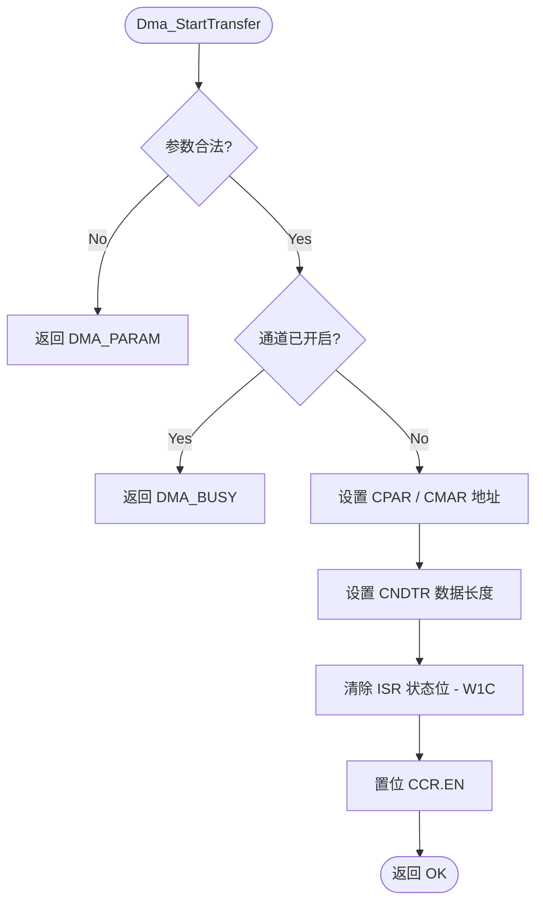

# DMA 驱动详细设计报告 (Detailed Design Report)

## 1. 架构概述 (Architecture Overview)

本驱动遵循 4 层解耦架构：
- **Reg 层**：定义 `DMA_TypeDef` 和 `DMA_Channel_TypeDef`，支持多通道数组访问。
- **LL 层**：实现原子操作和 `INV_DMA_001` 守卫逻辑。
- **Drv 层**：负责通道生命周期管理和传输控制。

## 2. 功能特性实现矩阵 (Feature Checklist - R14)

| 特性分类 | 功能特性 | 状态 | 说明 |
| :--- | :--- | :--- | :--- |
| **基础传输** | 内存到外设 (M2P) | `[DONE]` | 已通过 `Dma_StartTransfer` 实现 |
| | 外设到内存 (P2M) | `[DONE]` | 已实现 |
| | 内存到内存 (M2M) | `[DONE]` | 支持 `mem2mem` 配置位 |
| **数据宽度** | 8-bit / 16-bit / 32-bit | `[DONE]` | 映射至 `PSIZE`/`MSIZE` |
| **寻址模式** | 地址递增 (Increment) | `[DONE]` | 支持 `srcInc`/`dstInc` |
| | 循环模式 (Circular) | `[DONE]` | 支持 `circular` 模式 |
| **中断与事件** | 传输完成 (TC) 轮询 | `[DONE]` | `Dma_IsTransferComplete()` |
| | 半完成 (HT) / 错误 (TE) | `[TODO]` | 已解析寄存器位，暂无 API 导出 |
| | 中断服务函数 (ISR) | `[TODO]` | 框架已建立，等待回调逻辑注入 |
| **硬件保护** | 禁用状态守卫 (Guard) | `[DONE]` | 实施 `INV_DMA_001` 约束 |

## 3. 核心流程图 (Process Flowcharts)

### 3.1 Dma_StartTransfer 流程

## 4. 关键不变式审计 (Invariant Audit)

- **INV_DMA_001**: 为了防止传输过程中配置冲突，LL 层在修改 `CPAR`, `CMAR`, `CNDTR` 之前会强制检查 `CCR.EN`。如果通道正在运行，修改请求将被静默忽略（底层保护）或通过 Drv 层返回 `DMA_BUSY`。
