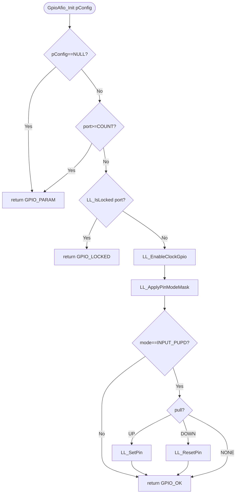
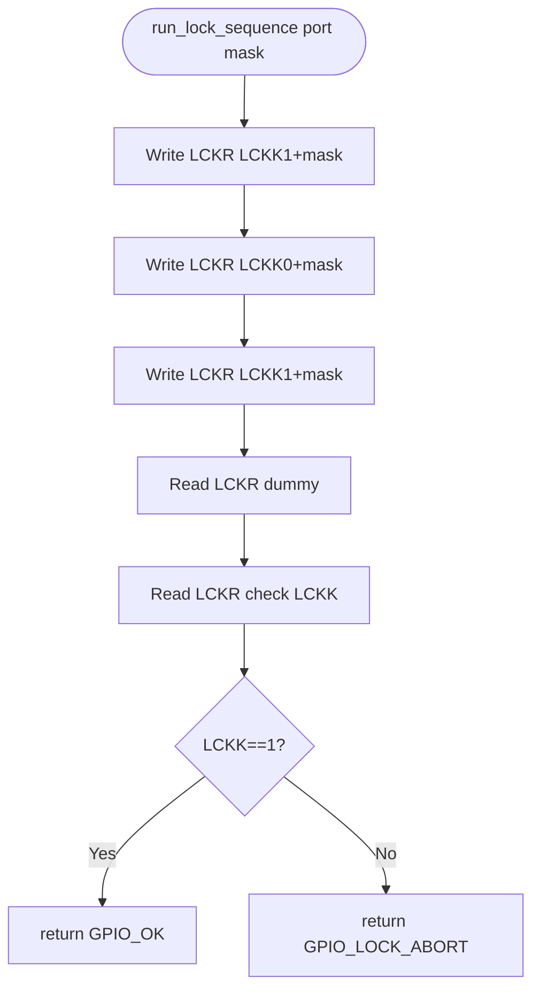
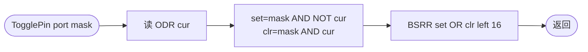

# GPIO + AFIO 驱动详细设计文档

> 本文档遵循 `docs/detailed-design-template.md`（R8#13）。所有章节与代码 1:1 对应。
> 自动校验：`scripts/check-detailed-design.py src/drivers/GpioAfio/gpio_afio_detailed_design.md`

## 1. 架构目标

**模块职责**：在 STM32F103C8T6 上提供 GPIO 引脚配置 / 读写 / 锁定，以及 AFIO 引脚重映射 / EXTI 源选择能力。

**Safety level**：QM（IR `safety_level` 字段）。GPIO 是基础外设，无双读冗余 / CRC 等增量。

**外部依赖**：
- RCC（仅消费 `RCC_APB2ENR` 的 `IOPxEN` / `AFIOEN` 位，未引入 RCC driver 头）
- 无下层依赖；EXTI 中断管理由 EXTI 模块负责，本模块仅写 `AFIO_EXTICR[]` 选源

**设计约束**：
- 所有 4-bit 引脚字段（CRL/CRH 中的 MODE+CNF）通过 LL 函数原子修改，driver 不直接 RMW（R8#3）
- 引脚锁定不可逆（INV_GPIO_001），上层调用前必须确认
- AFIO 任何寄存器写入前必须先使能 AFIOEN（INV_GPIO_002）

## 2. 文件清单

| 路径 | 层级 | 职责 |
|---|---|---|
| `include/gpioafio_reg.h`   | Layer 1 (reg)   | `GPIO_TypeDef` / `AFIO_TypeDef` / `RCC_APB2ENR` 寄存器映射 + 位掩码宏 |
| `include/gpioafio_types.h` | Layer 0 (types) | `GpioAfio_ReturnType` / `Port_e` / `Mode_e` / `Pull_e` / `PinConfigType` |
| `include/gpioafio_cfg.h`   | Layer 0 (cfg)   | LQFP48 引脚可用掩码、LCKR 超时常量 |
| `include/gpioafio_ll.h`    | Layer 2 (ll)    | 12 个 `static inline` 原子操作 + R8#11/#17 守卫与组合下沉 |
| `include/gpioafio_api.h`   | Layer 4 (api)   | 7 个对外 API 声明 |
| `src/gpioafio_drv.c`       | Layer 3 (drv)   | API 实现 + LCKR LOCK 时序 + 状态校验 |
| `src/gpioafio_isr.c`       | (豁免)           | 占位：本模块无 IRQ，符合 codegen-agent §2.7 ISR 豁免 |

## 3. 功能特性矩阵 (R10 自动渲染)

> **不要手工编辑下方表格**。由 `scripts/feature-update.py --render` 从 `ir/gpio_afio_feature_matrix.json` 派生。

<!-- FEATURE_MATRIX:BEGIN -->
| 特性ID | 类别 | 功能特性 | 状态 | API | 备注 |
| :--- | :--- | :--- | :--- | :--- | :--- |
| `GPIO_AFIO-INIT` | 生命周期 | Init / DeInit | 🟢 done | `Gpio_Afio_Init, Gpio_Afio_DeInit` |  |
| `GPIO_AFIO-MODE-INPUT-FLOATING` | 操作模式 | INPUT_FLOATING | 🟢 done | `Gpio_Afio_Configure` |  |
| `GPIO_AFIO-MODE-INPUT-PULL-UP` | 操作模式 | INPUT_PULL_UP | 🟢 done | `Gpio_Afio_Configure` |  |
| `GPIO_AFIO-MODE-INPUT-PULL-DOWN` | 操作模式 | INPUT_PULL_DOWN | 🟢 done | `Gpio_Afio_Configure` |  |
| `GPIO_AFIO-MODE-INPUT-ANALOG` | 操作模式 | INPUT_ANALOG | 🟢 done | `Gpio_Afio_Configure` |  |
| `GPIO_AFIO-MODE-OUTPUT-PP-10MHZ` | 操作模式 | OUTPUT_PP_10MHZ | 🟢 done | `Gpio_Afio_Configure` |  |
| `GPIO_AFIO-MODE-OUTPUT-PP-2MHZ` | 操作模式 | OUTPUT_PP_2MHZ | 🟢 done | `Gpio_Afio_Configure` |  |
| `GPIO_AFIO-MODE-OUTPUT-PP-50MHZ` | 操作模式 | OUTPUT_PP_50MHZ | 🟢 done | `Gpio_Afio_Configure` |  |
| `GPIO_AFIO-MODE-OUTPUT-OD` | 操作模式 | OUTPUT_OD | 🟢 done | `Gpio_Afio_Configure` |  |
| `GPIO_AFIO-MODE-OUTPUT-AF-PP` | 操作模式 | OUTPUT_AF_PP | 🟢 done | `Gpio_Afio_Configure` |  |
| `GPIO_AFIO-MODE-OUTPUT-AF-OD` | 操作模式 | OUTPUT_AF_OD | 🟢 done | `Gpio_Afio_Configure` |  |
| `GPIO_AFIO-GUARD-INV-GPIO-001` | 硬件保护 | INV_GPIO_001 守卫 | 🟢 done | `-` |  |
| `GPIO_AFIO-GUARD-INV-GPIO-002` | 硬件保护 | INV_GPIO_002 守卫 | 🟢 done | `-` |  |
| `GPIO_AFIO-GUARD-INV-GPIO-003` | 硬件保护 | INV_GPIO_003 守卫 | 🟢 done | `-` |  |
<!-- FEATURE_MATRIX:END -->

> 矩阵中 `target_apis` 列里的 `Gpio_Afio_Configure` 是 bootstrap 的占位名，**实际配置入口是 `GpioAfio_Init`**（详见 §6）；后续 bootstrap 改进可消除此差异。

## 4. 异步闭环设计

**本模块无异步路径**——所有 API 同步返回，不依赖中断、DMA 或回调。

理由：
- GPIO 引脚电平采样由硬件每 APB2 时钟周期更新到 IDR，读取 IDR 即时返回（RM0008 §9.1.7）
- BSRR/BRR 是单写原子操作，无需等待
- LCKR LOCK 序列虽是 5 步握手，但每步都是寄存器写后立即可见，无需轮询
- EXTI 中断由 EXTI 模块管理，本模块仅协助配 `AFIO_EXTICR[]` 选源

`gpioafio_isr.c` 仅作占位声明（codegen-agent.md §2.7 ISR 豁免）。

## 5. 数据结构

### `GpioAfio_ReturnType`（错误码）

| 取值 | 数值 | 语义 | 触发条件 |
|---|:-:|---|---|
| `GPIO_OK`         | 0 | 成功 | — |
| `GPIO_PARAM`      | 1 | 入参非法 | port ≥ `GPIO_PORT_COUNT`、pin ≥ 16、`pConfig == NULL` |
| `GPIO_LOCKED`     | 2 | bank 已锁，拒绝修改 | `LCKR.LCKK == 1` 且尝试改 CRL/CRH |
| `GPIO_LOCK_ABORT` | 3 | LCKR LOCK 序列写错被硬件 abort | 序列中途 `LCK[15:0]` 改变 / 步骤错位 |

### `GpioAfio_Port_e`（端口枚举）

`GPIO_PORT_A=0 .. GPIO_PORT_G=6, GPIO_PORT_COUNT=7`，与 IR `instances[]` 顺序一致。F/G 在 LQFP48 上不引出（见 §1）。

### `GpioAfio_Mode_e`（10 种模式 + 派生 = 16 种枚举）

由 `(MODE[1:0] << 2) | CNF[1:0]` 拼接成 4-bit 值，直接写入 CRL/CRH 的对应位段。例：

- `GPIO_MODE_INPUT_FLOATING = 0x4U` ↔ MODE=00 CNF=01
- `GPIO_MODE_OUTPUT_PP_50MHZ = 0x3U` ↔ MODE=11 CNF=00
- `GPIO_MODE_OUTPUT_AFOD_50MHZ = 0xFU` ↔ MODE=11 CNF=11

### `GpioAfio_Pull_e`

`GPIO_PULL_NONE / GPIO_PULL_UP / GPIO_PULL_DOWN`，仅在 `mode == INPUT_PUPD` 时由 `Init` 写入 ODR 决定上拉/下拉。

### `GpioAfio_PinConfigType`（用户传入）

| 字段 | 类型 | 语义 | 约束 |
|---|---|---|---|
| `port`     | `GpioAfio_Port_e` | 目标端口 | < `GPIO_PORT_COUNT` |
| `pin_mask` | `uint16_t`        | 引脚位图（bit n=1 表示引脚 n 参与配置） | 至少一位非零 |
| `mode`     | `GpioAfio_Mode_e` | 16 种模式枚举 | 4 bit 范围内 |
| `pull`     | `GpioAfio_Pull_e` | 上下拉选择 | 仅 `mode==INPUT_PUPD` 时生效 |

## 6. 接口函数说明

### `GpioAfio_Init`

```c
GpioAfio_ReturnType GpioAfio_Init(const GpioAfio_PinConfigType *pConfig);
```

| 项 | 内容 |
|---|---|
| **参数**     | `pConfig`：配置结构指针，**禁止 NULL** |
| **返回**     | `GPIO_OK` / `GPIO_PARAM`（NULL 或 port 越界）/ `GPIO_LOCKED`（bank 已锁定） |
| **副作用**   | 修改 `RCC_APB2ENR.IOPxEN`、目标 bank 的 `CRL/CRH`，可能修改 `ODR`（INPUT_PUPD 模式时） |
| **前置条件** | 无；函数自带 RCC 时钟使能 |
| **线程上下文** | 任意（同步）；不可在 ISR 中调用（修改全局 RCC 时钟） |
| **错误码语义** | 返回 `GPIO_LOCKED` 时不会回滚已使能的 RCC 时钟 |

### `GpioAfio_DeInit`

```c
GpioAfio_ReturnType GpioAfio_DeInit(GpioAfio_Port_e port);
```

| 项 | 内容 |
|---|---|
| **参数**     | `port`：目标端口 |
| **返回**     | `GPIO_OK` / `GPIO_PARAM` / `GPIO_LOCKED` |
| **副作用**   | 将整个 bank 的 `CRL/CRH/ODR` 写回上电默认值 (`0x44444444 / 0x44444444 / 0`) |
| **前置条件** | 此 bank 不能已被 LCKR 锁定 |

### `GpioAfio_WritePin`

```c
GpioAfio_ReturnType GpioAfio_WritePin(GpioAfio_Port_e port, uint16_t pin_mask, bool level);
```

| 项 | 内容 |
|---|---|
| **参数**     | `port` / `pin_mask`（多引脚一次写）/ `level`（true 全置高，false 全置低） |
| **返回**     | `GPIO_OK` / `GPIO_PARAM` |
| **副作用**   | 单条 BSRR 写，硬件原子（避免 ODR RMW 竞态） |
| **线程上下文** | 任意（含 ISR） |

### `GpioAfio_TogglePin`

```c
GpioAfio_ReturnType GpioAfio_TogglePin(GpioAfio_Port_e port, uint16_t pin_mask);
```

副作用：读 ODR → 算 set/reset 掩码 → 单条 BSRR 写。LL 内部完成（R8#17）。

### `GpioAfio_ReadPin`

```c
bool GpioAfio_ReadPin(GpioAfio_Port_e port, uint8_t pin);
```

返回 IDR 中 `pin` 位的电平；越界静默返回 `false`（避免抛错带 ISR 上下文风险）。

### `GpioAfio_LockPins`

```c
GpioAfio_ReturnType GpioAfio_LockPins(GpioAfio_Port_e port, uint16_t pin_mask);
```

执行 SEQ_LCKR_LOCK 5 步握手，**不可逆**至下次复位。返回 `GPIO_LOCK_ABORT` 表示序列写错。

### `GpioAfio_SetExtiSource`

```c
GpioAfio_ReturnType GpioAfio_SetExtiSource(uint8_t exti_line, GpioAfio_Port_e port);
```

将 EXTI 行 `exti_line` (0..15) 的源切换到 `port`。**自带 AFIO 时钟使能**（INV_GPIO_002）。

## 7. 流程图

### 7.1 `GpioAfio_Init`



### 7.2 SEQ_LCKR_LOCK（`run_lock_sequence`）



### 7.3 `GpioAfio_TogglePin`（LL 内部组合）



## 8. 调用示例

```c
#include "gpioafio_api.h"

/* 例：在 PA5 上输出推挽 50MHz 方波（Blue Pill 板载 LED） */
int main(void)
{
    GpioAfio_PinConfigType cfg = {
        .port     = GPIO_PORT_A,
        .pin_mask = (uint16_t)(1U << 5),
        .mode     = GPIO_MODE_OUTPUT_PP_50MHZ,
        .pull     = GPIO_PULL_NONE,           /* 输出模式下被忽略 */
    };
    if (GpioAfio_Init(&cfg) != GPIO_OK) {
        return -1;
    }

    /* 翻转 PA5 */
    while (1) {
        (void)GpioAfio_TogglePin(GPIO_PORT_A, (uint16_t)(1U << 5));
        for (volatile uint32_t i = 0; i < 1000000U; i++) { /* coarse delay */ }
    }
}

/* 例：把 PA0 选作 EXTI0 源，准备给 EXTI 模块用 */
(void)GpioAfio_SetExtiSource(0U, GPIO_PORT_A);
```

## 9. 不变式审计

| ID | 表达式 | 严重度 | 守卫位置（文件:函数） | 触发路径 |
|---|---|:-:|---|---|
| `INV_GPIO_001` | `LCKR.LCKK==1 && LCK[n]==1 implies !writable(CRL/CRH.{MODE,CNF}[n])` | WARNING | `gpioafio_drv.c::GpioAfio_Init / GpioAfio_DeInit` 入口 `if (GpioAfio_LL_IsLocked) return GPIO_LOCKED;` | 用户尝试 Init 已锁端口 |
| `INV_GPIO_002` | `AFIOEN==0 implies !writable(AFIO_*)` | CRITICAL | `gpioafio_drv.c::GpioAfio_SetExtiSource` 第一行 `GpioAfio_LL_EnableClockAfio()` | EXTI 源选择 |
| `INV_GPIO_003` | `IOPxEN==0 implies !writable(GPIOx_*)` | CRITICAL | `gpioafio_drv.c::GpioAfio_Init` `GpioAfio_LL_EnableClockGpio(port)` | 任何 GPIO 配置 |

校验：`scripts/check-invariants.py ir/gpio_afio_ir_summary.json src/drivers/GpioAfio/include/*_ll.h src/drivers/GpioAfio/src/*.c` → 当前 3 ADVISORY、0 violations。

---

## 架构决策记录

- **R9b 决策（自决）**：选择把 GPIO 与 AFIO 合为一个 driver（理由见 §1 章首）。手册 §9 标题 "GPIOs and AFIOs"，且 AFIO 单独存在意义弱。
- **ISR 豁免**：本模块不持有 IRQ，EXTI 由独立模块。`gpioafio_isr.c` 仅占位，符合 codegen-agent §2.7。

<!-- DATA_STRUCTURES:BEGIN -->
### Enums

#### `GpioAfio_ReturnType`

| 成员 | 值 | 说明 |
|---|---|---|
| `GPIO_OK` | 0 | success |
| `GPIO_PARAM` | 1 | invalid port/pin/NULL config (RM0008 §9) |
| `GPIO_LOCKED` | 2 | bank locked by LCKR; reset required (INV_GPIO_001) |
| `GPIO_LOCK_ABORT` | 3 | SEQ_LCKR_LOCK sequence aborted by HW |

#### `GpioAfio_Port_e`

| 成员 | 值 | 说明 |
|---|---|---|
| `GPIO_PORT_A` | 0 | GPIOA @ 0x40010800 |
| `GPIO_PORT_B` | — | GPIOB @ 0x40010C00 |
| `GPIO_PORT_C` | — | GPIOC @ 0x40011000 (LQFP48: PC13..15 only) |
| `GPIO_PORT_D` | — | GPIOD @ 0x40011400 (LQFP48: PD0,PD1 only) |
| `GPIO_PORT_E` | — | GPIOE @ 0x40011800 (LQFP48: 不引出) |
| `GPIO_PORT_F` | — | GPIOF @ 0x40011C00 (LQFP48: 不引出) |
| `GPIO_PORT_G` | — | GPIOG @ 0x40012000 (LQFP48: 不引出) |
| `GPIO_PORT_COUNT` | — | sentinel — must be last |

#### `GpioAfio_Mode_e`

| 成员 | 值 | 说明 |
|---|---|---|
| `GPIO_MODE_INPUT_ANALOG` | 0x0U | MODE=00 CNF=00 |
| `GPIO_MODE_INPUT_FLOATING` | 0x4U | MODE=00 CNF=01 |
| `GPIO_MODE_INPUT_PUPD` | 0x8U | MODE=00 CNF=10 (ODR bit selects pull) |
| `GPIO_MODE_OUTPUT_PP_10MHZ` | 0x1U | MODE=01 CNF=00 |
| `GPIO_MODE_OUTPUT_PP_2MHZ` | 0x2U | MODE=10 CNF=00 |
| `GPIO_MODE_OUTPUT_PP_50MHZ` | 0x3U | MODE=11 CNF=00 |
| `GPIO_MODE_OUTPUT_OD_10MHZ` | 0x5U | MODE=01 CNF=01 |
| `GPIO_MODE_OUTPUT_OD_2MHZ` | 0x6U | MODE=10 CNF=01 |
| `GPIO_MODE_OUTPUT_OD_50MHZ` | 0x7U | MODE=11 CNF=01 |
| `GPIO_MODE_OUTPUT_AFPP_10MHZ` | 0x9U | MODE=01 CNF=10 (alternate function PP) |
| `GPIO_MODE_OUTPUT_AFPP_2MHZ` | 0xAU | MODE=10 CNF=10 |
| `GPIO_MODE_OUTPUT_AFPP_50MHZ` | 0xBU | MODE=11 CNF=10 |
| `GPIO_MODE_OUTPUT_AFOD_10MHZ` | 0xDU | MODE=01 CNF=11 (alternate function OD) |
| `GPIO_MODE_OUTPUT_AFOD_2MHZ` | 0xEU | MODE=10 CNF=11 |
| `GPIO_MODE_OUTPUT_AFOD_50MHZ` | 0xFU | MODE=11 CNF=11 |

#### `GpioAfio_Pull_e`

| 成员 | 值 | 说明 |
|---|---|---|
| `GPIO_PULL_NONE` | 0 | floating (only valid for output / non-PUPD input modes) |
| `GPIO_PULL_UP` | 1 | internal pull-up via ODR=1 (INPUT_PUPD only) |
| `GPIO_PULL_DOWN` | 2 | internal pull-down via ODR=0 (INPUT_PUPD only) |

### Structs

#### `GpioAfio_PinConfigType`

| 字段 | 类型 | 说明 |
|---|---|---|
| `port` | `GpioAfio_Port_e` | target bank: < GPIO_PORT_COUNT |
| `pin_mask` | `uint16_t` | pin bitmap (bit n -> pin n); at least one bit set |
| `mode` | `GpioAfio_Mode_e` | one of 16 mode values (MODE+CNF composed) |
| `pull` | `GpioAfio_Pull_e` | honored only when mode == INPUT_PUPD |
<!-- DATA_STRUCTURES:END -->

<!-- API_FUNCTIONS:BEGIN -->
| 函数 | 返回 | 参数 | 简介 |
|---|---|---|---|
| `GpioAfio_Init` | `GpioAfio_ReturnType` | `const GpioAfio_PinConfigType *pConfig` | Configure GPIO bank+pins per pConfig and enable IOPxEN clock. |
| `GpioAfio_DeInit` | `GpioAfio_ReturnType` | `GpioAfio_Port_e port` | Reset GPIO bank registers to power-on default (CRL/CRH=0x44444444, ODR=0). |
| `GpioAfio_WritePin` | `GpioAfio_ReturnType` | `GpioAfio_Port_e port, uint16_t pin_mask, bool level` | Atomically drive multiple pins high or low via single BSRR write. |
| `GpioAfio_TogglePin` | `GpioAfio_ReturnType` | `GpioAfio_Port_e port, uint16_t pin_mask` | Toggle pins (read ODR, compose set/reset masks, single BSRR write). |
| `GpioAfio_ReadPin` | `bool` | `GpioAfio_Port_e port, uint8_t pin` | Read instantaneous IDR level of a single pin. |
| `GpioAfio_LockPins` | `GpioAfio_ReturnType` | `GpioAfio_Port_e port, uint16_t pin_mask` | Run SEQ_LCKR_LOCK on a bank — irreversible until MCU reset (INV_GPIO_001). |
| `GpioAfio_SetExtiSource` | `GpioAfio_ReturnType` | `uint8_t exti_line, GpioAfio_Port_e port` | Select GPIO port as the source for an EXTI line; auto-enables AFIOEN clock. |
<!-- API_FUNCTIONS:END -->
