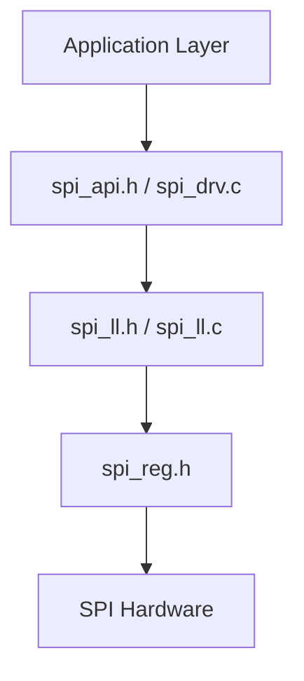
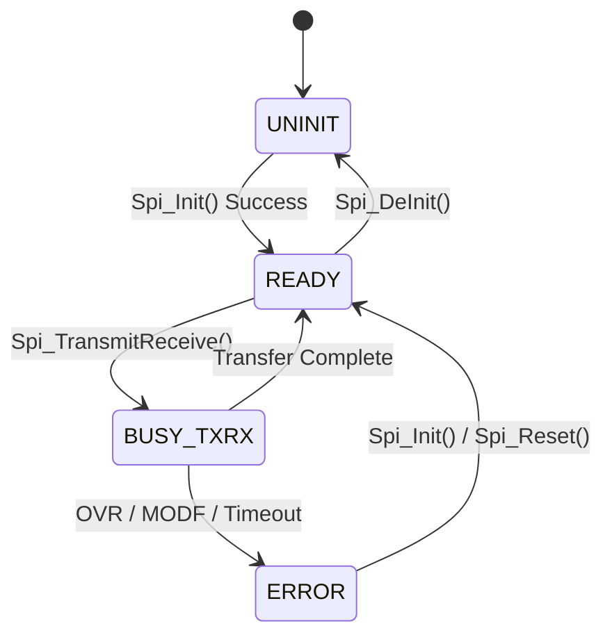
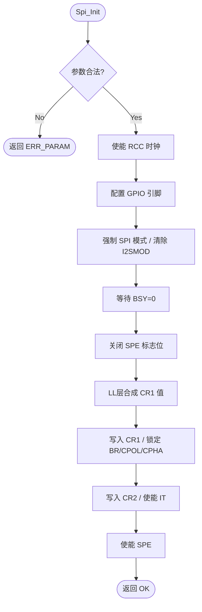
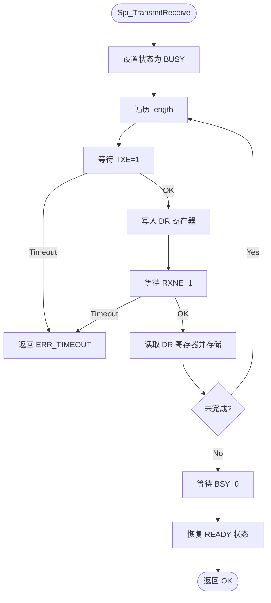
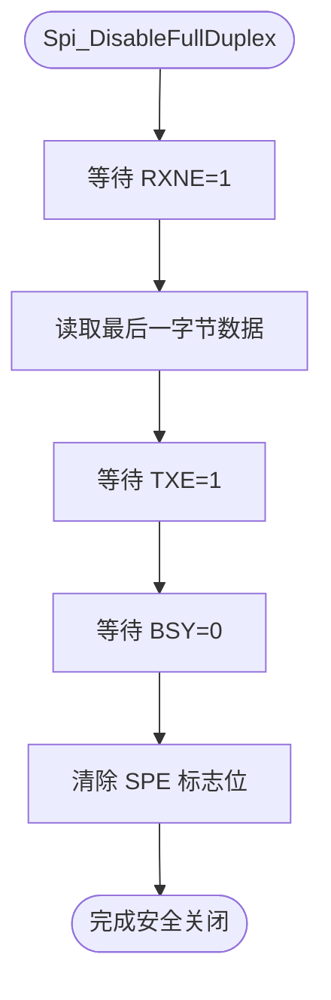

# SPI 驱动详细设计报告 (Detailed Design Report)

## 1. 架构概述 (Architecture Overview)

本驱动遵循 4 层解耦架构，确保 hardware 依赖与业务逻辑完全隔离：

- **API/Drv 层**：负责状态管理、超时处理和高层协议。
- **LL 层**：封装原子操作和寄存器合成逻辑，实施硬件守卫 (Guard)。
- **Reg 层**：提供 CMSIS 风格的寄存器定义。

## 2. 状态机模型 (State Machine)

驱动程序维护一个内部状态机，以确保操作的原子性和线程安全。

## 3. 核心流程图 (Process Flowcharts)

### 3.1 Spi_Init 流程
初始化过程严格遵循 IR `init_sequence` 规定，并注入了硬件守卫逻辑。

### 3.2 数据传输 (Spi_TransmitReceive)
采用阻塞轮询方式，确保全双工数据同步。

### 3.3 优雅关闭序列 (Spi_DisableFullDuplex)
由于 SPI 在传输中强行关闭会导致数据损坏或总线挂死，本驱动实现了 RM0008 推荐的关闭逻辑。

## 4. 错误处理与恢复 (Error Handling)

| 错误类型 | 硬件标志 | 清除序列 (RC_SEQ / W1C) | 恢复措施 |
| :--- | :--- | :--- | :--- |
| **Overrun (OVR)** | SR.OVR | 读取 DR -> 读取 SR | 报告错误，建议重新初始化 |
| **Mode Fault (MODF)** | SR.MODF | 读取 SR -> 写入 CR1 | 自动清除，恢复 Master/Slave 角色 |
| **CRC Error** | SR.CRCERR | 写入 SR (CRCERR=0) | 丢弃当前帧，触发重传 |

## 5. 关键不变式审计 (Invariant Audit)

根据 `scripts/check-invariants.py` 的扫描结果，以下关键约束已在 LL 层实施：

- **INV_SPI_002/004**: 在 `SPI_LL_WriteCR1` 入口处强制检查 `SPE` 状态。如果 `SPE=1`，拒绝写入，防止波特率配置在传输中发生跳变。
- **INV_SPI_003**: 在 `SPI_LL_Enable/Disable` 入口检查 `BSY` 状态，确保不在总线忙碌时强行切换外设状态。
