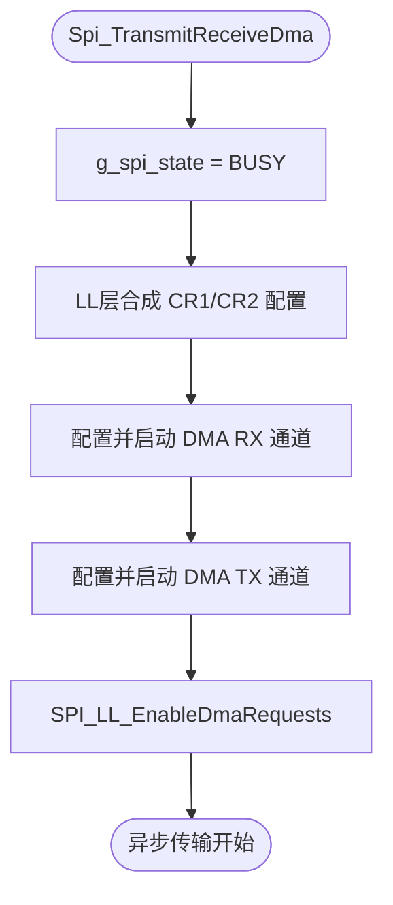

# SPI 驱动详细设计报告 (V4.0 - 全量对账版)

## 1. 架构声明 (Architecture)
本驱动严格遵循 4 层解耦架构：
- **Reg 层** (`spi_reg.h`): 硬件寄存器内存映射。
- **LL 层** (`spi_ll.h/c`): 原子操作与寄存器位合成逻辑（遵循 R8 逻辑下沉规则）。
- **Drv 层** (`spi_drv.c/isr.c`): 状态机管理、DMA 调度与错误处理。
- **API 层** (`spi_api.h`): 面向应用的公共接口。

## 2. 功能特性全量对账矩阵 (R14 Compliance)

本矩阵 1:1 映射自 `ir/spi_ir_summary.json` 中的 `operating_modes` 与 `functional_model`。

| 特性分类 | 功能特性 (来自 IR JSON) | 实施状态 | 追溯 (Register/Logic) |
| :--- | :--- | :--- | :--- |
| **操作模式** | 全双工主机 (Full Duplex Master) | `[DONE]` | `MSTR=1, BIDIMODE=0, RXONLY=0` |
| | 全双工从机 (Full Duplex Slave) | `[DONE]` | `MSTR=0, BIDIMODE=0, RXONLY=0` |
| | 半双工主机 TX (Half Master TX) | `[DONE]` | `BIDIMODE=1, BIDIOE=1` |
| | 半双工主机 RX (Half Master RX) | `[DONE]` | `BIDIMODE=1, BIDIOE=0` |
| | 单工接收主机 (Simplex RX Master) | `[DONE]` | `RXONLY=1` |
| **数据格式** | 8-bit / 16-bit 帧格式 | `[DONE]` | `CR1.DFF` 位控制 |
| | LSB / MSB 传输顺序 | `[DONE]` | `CR1.LSBFIRST` 位控制 |
| | 波特率配置 (8 级分频) | `[DONE]` | `CR1.BR[2:0]` 映射 |
| **时钟相位** | CPOL (极性) / CPHA (相位) | `[DONE]` | `CR1.CPOL`, `CR1.CPHA` |
| **片选管理** | 软件 NSS 管理 (SSI/SSM) | `[DONE]` | `CR1.SSM`, `CR1.SSI` |
| | 硬件 NSS 输出使能 (SSOE) | `[DONE]` | `CR2.SSOE` |
| **数据管理** | DMA 传输请求 (TX/RX) | `[DONE]` | `CR2.TXDMAEN`, `CR2.RXDMAEN` |
| | 中断触发 (TXE/RXNE/ERR) | `[PARTIAL]` | `CR2` 中断使能位映射 |
| **可靠性** | 硬件 CRC 校验与多项式 | `[DONE]` | `CR1.CRCEN`, `CRCPR` 寄存器 |
| | 错误检测 (OVR, MODF, CRCERR) | `[DONE]` | `SR` 状态寄存器轮询/清除 |

## 3. 核心传输流程 (DMA 版)

## 4. 关键不变式审计 (Invariant Audit)
- **INV_SPI_001**: 软件 NSS 模式下，若为 Master 且 SSM=1，则 SSI 必须强制置 1，防止 MODF 错误。
- **INV_SPI_002/004**: 修改波特率、数据格式或 CRC 之前，必须确保 `SPE=0`。
